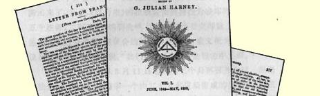
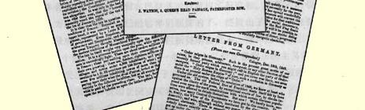

### 弗·恩格斯

# 法国来信

> **１**

## 一

> １８４９年１２月２０日于巴黎

当前大家最关切的问题是立法国民议会正在讨论的“酒税”。２ 这个问题具有如此重大的意义，并且实际上充分反映出当前的整个局势，因此，这封信专门来谈论它是非常适宜的。

酒税有很长的历史。它是十八世纪君主制度财政体制主要的特点之一，也是第一次革命时期人民不满的基本原因之一，所以它也就被那次革命废除了。但是，大约１８０８年，拿破仑以稍加改变的形式恢复了这种税，当时他忘记自己是由革命起家，而把在欧洲古老的皇室王族当中建立自己的王朝当作主要目的。这种税是如此的为人民所憎恨，以致在拿破仑垮台后，波旁王朝答应立即废除它。拿破仑本人在圣海伦岛上说过，是这种税而不是别的什么造成了他的垮台，它使得法国的整个南部都起来反对他。不过，波旁王朝根本就没有想到要履行自己的诺言，于是这种税也就一直保留到１８３０年革命，这时又有人向全国作出允诺说要废除它。这次诺言和上次一样没有履行，结果，这种税到１８４８年革命爆发时还存在着。临时政府没有立即废除它并代之以对大资本家、大土地占有者课高额所得税，而只是许诺如果不废除至少也要加以修订；制宪议会则更甚，甚至决定将这种税原封不动地保留下来。只是在它存在的最后几天，当保皇主义空前猖獗时，该议会的“正直的”和“温和的”议员们才投票赞成从１８５０年１月１日起废除酒税。３

十分清楚，这种税实质上属于法国的君主制传统。当人民群众占上风时，这种税便废除；一旦权柄落入以路易十八或路易－菲力浦之流为代表的贵族或**资产阶级**[^1]手中时，这种税便恢复。甚至拿破仑，—— 尽管他在许多问题上既反对贵族，也反对资产阶级，并为他们的合伙阴谋所推翻—— 甚至这位伟大的皇帝也认为自己必须恢复君主制法国的古老传统的这一特点。

全国各个阶级分担的酒税是极不均衡的。对穷人来说，这是令人难以忍受的负担，而对富人来说，它所添的麻烦却微乎其微。法国大约有一千二百万酿酒者；他们不纳这种税，因为他们消费的酒是自己酿造的；其次，一千八百万人住在农村和人口不到四千人的城镇中，他们每一百公升酒要纳六十六生丁到一法郎三十二生丁的税；最后，约五百万人住在人口超过四千人的城镇中，他们通过入市税４为他们所消费的酒纳税；这种税在城门口征收，而且各个地区都不一样，但在任何情况下都要比前一类人纳的税高得多。其次，最低级的酒和较昂贵的酒税额都一样；每百公升卖二、三、四法郎的酒和每百公升值十二至一千五百法郎的酒交同样多的税金； 这样喝高级香槟酒、克拉列特酒和勃艮第酒的富人几乎不纳什么税，而喝劣等酒的工人却要向政府交纳相当于这类酒原价百分之五十、百分之百、有时甚至百分之五百或百分之一千的税金。在征收的这种税金中，有五千一百万法郎来自校贫穷的阶级，只有二千五百万法郎出自较富有的公民。在这种情况下，毫无疑问，这种税使法国酒类生产遭到莫大的损害。这种产品的主要销售市场—— 城镇，对于一个酿酒者来说，成了真正的异乡国土，他要出售自己的产品，就得交纳规定的关税，税金相当于酒的原价百分之五十至百分之一千。在另一部分市场—— 农村地区，税金至少是原价的百分之二十至百分之五十。这种状况的不可避免的后果是国家各酿酒地区的破产。诚然，尽管存在着这种税，酒的生产还是在不断增长，但人口的增加以快得多的速度超过了这种增长。

为什么在中等阶级政府的统治下竟会把这种令人憎恨的酒税保留下来了呢？你会说，在英国，即使科布顿和布莱特也会早就把它取消了。是的，他们的确会做到这一点。但是在法国，企业主们既找不到坚定不移和不屈不挠地维护他们利益的**科布顿**和**布莱特**，也找不到一个能把他们的要求付诸实现的皮尔。法国财政制度，尽管被议会中的多数吹得天花乱坠，却是所能想象的最混乱的、纯属人为制造的大杂烩。英国在１８４２年后实行的各项改革， 在路易－菲力浦的法国，没有一项是打算实行的。在极美好的基佐时代，邮政改革几乎被看成是亵渎神灵。无论是当时或现在，这种税则都既不是自由贸易制性质的，也不是单纯财政性质的，既不是保护关税性质的，也不是禁止性关税性质的，而是在某种程度上包含了除自由贸易制以外所有其他税则的一些特征。旧的禁止性措施和高额关税，执行多年来毫无成果，而且无疑地对贸易是极其有害的，这些却贯穿于这种税则的所有部分。但是谁也不敢触动它们。在所有人口超过千人的城镇中地方税是间接的，从运往当地的商品中抽取。这样，甚至在国内，贸易的自由每经过十或十五英里都要遇到一种内地税关的阻碍。

这种即使对于中等阶级政府来说都是耻辱的状况，由于种种原因，至今依然如故。尽管各种沉重的税收聚敛了十四、五亿法郎，可是一到年底总是出现赤字，并且每隔四、五年就要发行一次公债。国库的这种可悲状况成了巴黎交易所投机商牟取暴利、尔虞我诈和投机倒把的永不枯竭的源泉。他们以及他们的同伙构成两院的大多数，因而成为这个国家真正的统治者；他们总是要求新资金的流入。而且，如果不采取广泛措施，使预算达到平衡，使税收的分配得到改变，并通过向交易所投机商本人征税，使中等阶级的其他集团在政治上占有更大的比重，财政改革就不可能实现。至于说在路易－菲力浦腐败透顶的政府当政的情况下这些改革的后果如何，那么，你根据那个引起二月革命的、比较微不足道的原因５，就可以作出判断了。

这次革命没有导致任何一位能对法国财政制度进行改革的人上台。攫取了这个部的《国民报》派的老爷们６感到自己被庞大的赤字捆住了手脚。为逐步实行改革作了许多尝试；如果不算废除盐税和邮政改革的话，所有这些尝试都是没有成果的。最后，制宪议会在绝望之下表决通过了废除酒税的决议，可是现在“正直的”和“温和的”秩序党人７在当前这个珍贵的议会上却要恢复它！ 而且这位部长[^2]还打算恢复盐税并重新增加邮费；这样，在最近的将来，法国就会重新出现陈腐的财政制度及其永恒的赤字和困难， 以及随之而来的巴黎交易所的无限权力及其投机倒把、尔虞我诈和追逐暴利的行径。

不过，对于这项措施—— 恢复对穷人的最必需物品的沉重赋税，一种几乎不触及富人的赋税，人民未必会服服贴贴地遵照执行。在法国农业地区，社会民主派的影响已得到惊人的广泛传播， 而这项措施将使剩下的几百万在十二个月前还投票拥护路易－拿破仑这个徒务虚名的偶像的人８转到社会民主派这方面来。社会民主派一旦把农村争取到自己这方面来，不出几个月，甚至不出几个星期，红旗将会在土伊勒里宫和爱丽舍宫９的上空迎风飘扬。只有在那时，才能一举结束国家债务，实行直接的累进税制，并采取其他同样坚决的措施，从而彻底粉碎陈腐的专制的财政制度。

## 二红色共和主义光辉成就的鲜明证据！１０

> １８５０年１月２１日于巴黎

自从上一封信以来，发生了许多重大事件，但由于大多数读者已从日报和周报上知道了这些，我就不再从头至尾地重述了，在这封信里我只就国内形势谈一些总的看法。

在最近这十二至十五个月里，革命精神在整个法国极其高涨。 那个因自身的社会地位而在文明社会中最大限度地被排除在公共事务之外的阶级，那个被以前的君主制立法剥夺了全部政治权利的阶级，那个从来不看报、可是却在法国人中占绝大多数的阶级， 终于迅速觉悟过来。１１这个阶级就是小农，男女和儿童总共约二千八百万人，其中小土地所有者八、九百万人，他们以自由农１２的身分占有法国全部土地的至少五分之四。从１８１５年起，这个阶级便受历届政府的压迫，临时政府也不例外，它规定对这个阶级的土地税每一法郎加征四十五生丁的附加税１３，而法国的土地税本身已经是很重的了。这个阶级还受到一帮高利贷者的压榨，他们的财产几乎全部都以特别高的利息抵押给这帮人了。就是这个阶级终于开始懂得：只有为城镇工人谋福利的政府才能把他们从那种虽有一块不大的份地却愈来愈受痛苦和饥饿煎熬的绝境中解放出来。这个阶级在相当大的程度上推动了１７８９年的革命，并且是拿破仑的庞大帝国产生的基础。就是这个阶级现在有绝大多数的人开始站到巴黎、里昂、卢昂以及其他法国大城市的革命党派和工人方面来。农民们现在十分清楚地知道路易－拿破仑如何欺骗了他们，在总统选举中他们给了他至少六百万张选票，而他回报他们的却是恢复酒税。所以，法国人民的绝大多数现在已经联合起来，时机一到，就要推翻资本家阶级的横暴统治。这个被二月风暴吓得丧魂落魄的阶级重新掌握了政权，其统治甚至比它在亲爱的路易－菲力浦时代的统治还要专横得多。

最近几个月来的事件为这一极端重要的事实提供了无数证据。例如奥普尔部长给**宪兵队**的通令，它责成**宪兵队**甚至在边远的穷乡僻壤也要实行谍报制度；再如反对教师的法律，法国农村的学校教师一向是最能代表这些地区的舆论的，现在他们要由政府来摆布了，因为他们几乎所有的人现在都持社会民主派的观点。１４此外还有许多其他事实。但是最鲜明的证据之一是不久前**加尔**省的选举。这个省众所周知是“白色分子” 即正统派的最古老的据点。它是１７９４年和１７９５年罗伯斯庇尔垮台后对共和派施行最恐怖的暴行的地方；这里也是１８１５年“白色恐怖”的中心，当时对新教徒和自由派进行了公开的杀戮，而这些牺牲者的妻女姐妹则受到正统派匪帮的最卑鄙的污辱，这帮家伙以出名的特雷斯塔永为首并受到正统的路易十八政府的庇护。就是在这个省份要选出一位议员代替一位去世的正统派议员[^3]；选举结果，大多数票投给了一位完全红色的候选人[^4]，而两位正统派的候选人[^5]得到的票却显然很少。１５

新教育法

１６是城镇工人和乡村农民的这一联盟迅速取得成就的又一证据。资产阶级人士中最顽固的伏尔泰主义者，甚至梯也尔先生都明白，只有放弃自己原来的理论和原则并使教育听命于僧侣，才能阻挠联盟取得成就！

再者，现在所有的报纸和社会活动家，只要不是公开反动的， 都在争先恐后地设法捞取一度受人蔑视的“社会主义者”的名声。 社会主义的最老牌的敌人现在都宣布自己是社会主义者。《国民报》，甚至《世纪报》，在路易－菲力浦时代曾经是君主主义的报纸，现在宣称他们是社会主义者。甚至无耻地背叛了１８４８年的马拉斯特，现在也宣布自己是社会主义者，以期保证自己当选，尽管这是枉费心机。不过人民并不是那么好愚弄的；绞索已经给这个坏蛋准备好了，只是等待适当的时机。

今天国民议会正在讨论关于杀害残存的四百六十八名被囚禁的六月起义者的法案，杀害的办法是把他们放逐到阿尔及利亚对健康极为有害的地区去做苦工。１７毫无疑问，法案将会以压倒的多数获得通过。然而，同样毫无疑问的是，在这场劳动大搏斗的不幸英雄们到达那注定将成为他们葬身之地的大海彼岸之前，人民的新的愤怒浪潮会把那些投票赞成这一屠杀革命者法案的人们席卷而去，并且， 也许会把今天处于多数地位的代表中能够逃脱人民的更为迅猛、 更为严峻和最为公正的报复的那些人送到那个流放地去。

## 三时代的象征。——迫近的革命１８

> １８５０年２月１９日于巴黎

我不得不把这封信的篇幅稍加限制，不过，一个月来所发生的事件是如此地触目惊心，它们自己将会表明自己的重要意义。革命来得这么快，任何人都**一定**看到它已迫近。在社会的所有领域， 无不在谈论革命行将到来，所有外国报纸，甚至敌视民主的，也都宣布革命已不可避免。而且，几乎可以十分肯定地预言：如果没有出人意外的事件改变社会事态的发展，在联合起来的秩序党和绝大多数人民之间发生严重的对抗，看来，不会晚于今年春末。 而这一对抗的结局是毫无疑问的。巴黎居民都确信，一个比以往任何时候都更为有利的革命时机很快就要到来，因此在他们当中到处流传着这样一个口号：“避免一切细小冲突，凡不涉及你的切身利益的一概听之任之！” 这样，在前几天砍倒自由之树的时候， 政府尽管作了种种努力，仍未能挑起工人的哪怕是零星的街头骚乱。而围着圣马丁门的自由之树跳舞的人们—— 你们的《伦敦新闻画报》把他们的样子画得叫人非常害怕—— 乃是警察局的一帮密探，他们由于人民沉着冷静而白白忙了一整天。１９总之，本月２４ 日２０将会极平静地过去，尽管政府报纸说得恰恰与此相反。政府准备使用几乎所有的招数来使巴黎发生骚乱，并在外省制造一些虚假的密谋和起义，以便在首都和那些因递补在凡尔赛被判有罪的议员

２１而定于３月１０日补选新议员的省份实行戒严。

下面简略地谈谈新的军事独裁体制。为了牢牢控制各省，政府发明了一种新的统帅体制。它把法国所有十七个军区合并为四个大军区，各由一个将领统辖；这样一来，这个将领就几乎拥有东方暴君或罗马总督的无限权力。这四大军区是这样分布的，它们好似一道铁箍，把巴黎和整个法国中部团团围住，使之不得反抗。然而，之所以采取这个非法措施，不仅是针对人民，而且也是针对资产阶级反对派的。现在正统派和奥尔良派都十分清楚地认识到：路易－拿破仑为他们服务得很不好。他们所以需要他，只是把他作为恢复君主制的一种手段，作为一种用过之后可以扔掉的工具。而今他们看到，他在为自己追求王位，而且在进展上比他们所希望的要快得多。他们都十分清楚地知道，目前君主制毫无希望，他们必须等待时机；可是路易－拿破仑却竭尽全力要把事情搞到底，并且宁愿冒险进行革命（这可能要他拿脑袋作代价），而不愿坐等时机。他们也知道，无论是正统派还是奥尔良派都还没有达到这样的优势，以致其胜利已成为无可争辩的必然；正象１８４８年１２月１０日以前那样，他们需要一位新的中立派的人物，以便此人能在他们等待事态发展的时候按照两派共同的利益进行管理。这样，这两派，即秩序党仅有的两大派别，现在都反对延长路易－拿破仑的总统任期，尽管四个月以前他们会为了争取到这一点而拚其全力；他们这一次又重新主张共和国建立在中立的基础上，**让尚加尔涅将军当总统**。看来尚加尔涅也参与了密谋。拿破仑不信任尚加尔涅，但又不敢剥夺他的巴黎总督之职，于是便用自己的四个军区象镣铐一样地把他钳制起来。这可以说明： 为什么多数人能够极其耐心地听完了帕斯卡尔·杜普拉先生，（曾叛卖１８４８年六月起义，而现在重又在猎取名声了）反对新军事体制和反对路易－拿破仑本人的演说。当时发生了两起很有趣的事件。照一家报纸的说法，当着杜普拉先生谈到路易－拿破仑只能或者选择他伯父的立场，或者选择华盛顿的路子时，会场左边有人喊道：“或者选择海地皇帝苏路克的路子！” 把法国王位僭望者比作一个给巴黎所有的《喧声报》提供笑料最多的人物，引起哄堂大笑，甚至议会议长[^6]都未加制止。这就是那高贵的多数派对路易－拿破仑的评价！这时陆军部长[^7]站了起来，朝着会场左边发了一通慷慨激昂的演说，他在结束时说道：“现在，先生们，如果你们愿意开始干，我们准备奉陪！”２２部长的这番话最清楚不过地向诸位表明，大家都在等待着一场猛烈的冲突。

就在这时候，社会民主派正积极地准备选举。尽管在巴黎—— 这里已有约六万工人在各种各样的借口下从选民名单中勾掉了 —— “正直的和温和的”人们只有一两个候选人可能当选，可是， 毫无疑问，在各省，社会主义者将取得辉煌的胜利。政府本身预料到这一点。因此，它已拟定了一项措施准备消灭现在被公开地称作“普选权” 阴谋的东西。它希图实行间接选举，由选举人选举数目有限的复选人，再由复选人提出代表。这样，政府才有把握取得多数的支持。但既然这等于公开推翻宪法（宪法在１８５１年以前不能修订，而且不能由为此目的选出的议会来修订），政府可以预料到人民一定会强烈反对。这样一来，就需要用外国军队来吓唬老百姓，这些军队应在这一提案提交议会时出现在莱茵河。如果事情真是这样发生的话—— 看样子，路易－拿破仑之蠢是足以干出这种冒险勾当的——，那你们大概很快就会听到诸如革命风雷一般的东西。而那时，就让上帝去赦免所有的什么拿破仑、尚加尔涅、秩序党人之流的灵魂去吧！

## 四选举。——红色分子的光荣胜利。—— 无产阶级的优势。——秩序党的沮丧。 ——对革命进行镇压和挑拨的新计划

> １８５０年３月２２日于巴黎

**胜利了**！胜利了！人民喊出了自己的心声，而且喊得是这么响亮，资产阶级统治和资产阶级阴谋的人工堆砌的大厦已经从根基上动摇了。**卡诺**、**维达尔**、**德弗洛特**—— 巴黎的人民代表，以十二万七千至十三万二千张票当选了。这就是人民对政府和议会多数的卑鄙挑衅的回答。卡诺是《国民报》派中在临时政府时期唯一没有向资产阶级拍马，因而惹得资产阶级大为憎恨的人物。维达尔是早就出名的公开的共产主义者。德弗洛特是布朗基俱乐部的副主席，１８４８年５月１５日冲进议会事件的第一批积极参加者之一，是同年６月街垒战中的先锋战士之一。他被判处放逐，现在却从运载囚犯的船上径直走进立法议会之宫。真的，这样的人选是意义重大的！２３它表明：如果说红党的胜利是由于小手工业者和小商人阶级同无产阶级结成了同盟的话，那么，这个同盟所借以建立的基本条件，较之那个曾导致君主政体覆灭的暂时联合来说是完全不同的。当时正是这个小手工业者和小商人阶级，即小资产阶级，在临时政府中、尤其是在制宪议会中占优势，并且很快消除了无产阶级的影响。现在则相反，工人是运动的领导者，而那个同样遭受资本压迫并给搞得倾家荡产的、由于在１８４８年６月效了劳而受到破产之奖的小资产阶级，则不得不跟着无产阶级的革命步伐行进。农业主也是这种情况。这样，现在反对政府的那些阶级的全体群众—— 他们构成法国人的绝大多数—— 便都在无产者阶级领导下，由它率领前进，而且他们认识到，他们本身从资本枷锁下的解放不得不取决于工人的完全彻底的解放。

各省的选举也是对红党极为有利的。红党的候选人有三分之二当选，而秩序党只有三分之一。

这个党，或者党派的大杂烩，十分清楚地理解人民的这一明确的暗示。他们现在懂得，如果容许１８５２年的普选—— 包括议会的选举、也包括新总统的选举—— 仍按现在的选举体制办理，摆在他们面前的就是不可避免的灭亡。他们明白，人民是如此迅速地团结在红旗的周围，他们哪怕是只把政权执掌到任期届满都是不可能的了。一方面是总统和议会，另一方面则是广大的人民群众，他们组成一个不可战胜的方阵，一天比一天壮大。因此，冲突是不可避免的，而且，秩序党等待愈久，人民胜利的希望也就愈大。他们明白这一点，因而他们一定会尽快地给予坚决打击。他们剩下的唯一希望就是尽快地挑起起义并与之进行最后决战。此外，在３月１０日的选举以后，“神圣同盟” 对于它究应奉行什么方针也不会再有任何怀疑了。现在瑞士根本不在话下。２４一个雄伟威严的革命的法国重又屹立在它的面前。因此，必须进攻法国，并且要尽快地干。“神圣同盟”的现金越来越不足了，而现在要想使这种令人爱好的商品得到新的补充，希望又是那么小。每一个国家单靠国内已不能把军队继续维持下去—— 要么把军队解散，要么叫他们靠敌人供养。因此，你们可以看出，我在上一封信中关于革命和战争迅速临近的预言正为事态发展所全部证实。２５

秩序党暂时又放下了他们的内部争吵。他们重新联合起来向人民进攻。他们更换了巴黎卫戍部队，因为其中有四分之三的人投了红党的票２６；而昨天，政府向议会提出了关于恢复报纸印花税的法案，提出的第二个法案规定把所有报纸的保证金增加一倍，第三个法案要求废除竞选集会自由。２７在这些法案之后还将有其他一些法案：其中之一是赋予警察局以把任何一个非巴黎出生的工人驱逐出巴黎的权利；其二，是允许政府可以**不经审讯把据信犯有参加秘密社团罪的任何公民放逐到阿尔及利亚去**，此外还有许多法案，而这一切必然以对普选权的比较直接的攻击为收场。可见，他们是以消灭劳动者阶级的一切权利来挑动起义。起义是要爆发的，而且，与广大的国民自卫军联合起来的人民，定将很快地抛开这个不光彩的阶级政府，这家政府虽说除了进行卑鄙无耻的压迫以外别无他能，可是却敢厚颜无耻地以“社会救星”自诩！！！

## 五

> １８５０年４月２０日于巴黎２８

在３月１０日选举之后本已不可避免的革命，由于政府和目前领导巴黎运动的人们的怯懦而推迟爆发了。３月１０日的选举和一再得到证实的军队中的叛乱情绪，使政府和国民议会吓破了胆，以致它们不敢立即做出什么结论。它们下决心通过我在上封信里向你们列举的那些新的镇压法；但是，如果说内阁和多数派的某些领导人对这类措施是信得过的，那么，大多数议员的情况就不是这样了，就连政府也很快又对这些措施丧失了信心。因此，这些镇压法中的一些较严厉的法案，至今还没有提出来，甚至那些已经提出来的法案—— 出版法和竞选集会法——，多数派的态度也是犹豫不定。

另一方面，社会主义的党没有象应该做到的那样，从这次的胜利中得到好处。其原因十分简单。这个党不只是由工人组成的， 目前它又吸收了大量小店主阶级的成员，这个阶级的社会主义实际上比无产者的社会主义要温和得多。小店主和小手工业者非常清楚，只有无产者的解放才能使他们免于破产，他们的利益同工人的利益是不可分割地联系在一起的。但是他们也懂得，如果无产者通过革命夺得了政权，他们这些小店主就会完完全全地靠边站，并处于工人阶级能给他们什么，他们就只好接受什么的境地。 相反，如果现政府被和平地推翻，那么，小店主和小手工业者这个目前所有反对阶级中最不可憎的阶级，就可以很从容地插手进去并掌握政权，同时把尽可能小的一部分政权给予工人。因此，小手工业者和小商人阶级就象政府害怕自己的失败一样，害怕自己的胜利。他们看到一场革命正在他们眼前展开，于是就立即尽力加以制止。他们具有达到这一目的的现成手段。公民维达尔除在巴黎当选外，同时也在下莱茵地区当选。他们怂恿他接受下莱茵地区的委任状，这样，巴黎就必须举行新的选举。很清楚，只要人民有可能通过和平方式取得胜利，他们决不会去呼吁“准备战斗”，然而一旦人民被挑动起来举行起义，即使胜利的机会极少， 他们也要进行搏斗。

新的选举规定在本月２８日举行，而政府很快就利用了可爱的小店主们创造的有利形势，内阁阁员们搬出了陈旧的警察条例，以便把一定数量暂时没有工作的工人赶出巴黎２９；他们直接禁止一切竞选集会，表明即使没有已向议会提出的反对竞选集会法，他们也能够对付过去。人民知道他们的斗争在选举之前是不会有成效的，于是便屈服了。完全掌握在小店主手中的社会民主主义报刊，自然尽一切可能来稳住群众。自从“自由之树”事件以来，这种报刊的行为就是极端无耻的。在这期间，人民起义的机会出现过不止一次，但报刊总是鼓吹和平和安定，同时，小店主的代表在选举委员会之类的组织中，经常为人民的愤懑寻找和平发泄的出路，力求减少巷战胜利的机会。

红党被迫采取的违背原则的立场和秩序党从新的选举中得到的好处，在两个参加竞选的候选人身上得到了充分的反映。红党的候选人欧仁·苏是善良的、“甜言蜜语的”、伤感的小店主社会主义的卓越代表，这种社会主义决不承认无产者的革命使命，宁愿用小手工业者和小商人阶级的善意庇护来给无产者以可笑的解放。欧仁·苏作为政治人物是渺小的。为了显示力量而提名他为候选人，是从３月１０日占领的阵地上后退了一步。不过应该承认， 如果说伤感的社会主义注定要在今天时髦起来，那么，在能够被提名的人中间，苏的名字是最孚众望的，而且他很有希望当选。

另一方面，秩序党恢复了自己的阵地，现在它用六月起义中的资产阶级的斯巴达人勒克莱尔先生３０这位大名鼎鼎的人物来对抗欧仁·苏这个默默无闻或名气很小的人物。勒克莱尔是对德弗洛特的直接回答，也是比其他任何名字更为直接的对工人的挑衅。 提出勒克莱尔作为巴黎的候选人，就是重复奥普尔将军的话：“现在，先生们，你们什么时候乐意上街，我们都准备奉陪！”

正象你们所看到的，巴黎的重新选举没有给无产阶级的党提供什么好处，相反，已经给它造成了极大的损害。还应当指出这样一个事实：３月１０日的选举是按旧名册进行的；４月２８日的选举将按照４月１日生效的、新修订过的１８５０年选民名册进行；而在这份修订过的名册中，有**两万到三万工人**在种种借口下**被勾掉了**。

然而，即使秩序党这一次将得到微弱多数，它也不会获胜。事实毕竟是事实，只要普选权还存在，秩序党就不能够再管理法国了。事实毕竟是事实，社会主义的病原体已广泛侵入军队，一有机会这支军队就要公开叛乱。事实毕竟是事实，巴黎的工人比过去任何时候都更渴望结束目前的状态。他们过去从来都没有象这次这样公开地、趁竞选集会还没有被禁止时，在竞选集会上发表意见。而政府加紧攻击普选权，将给人民提供进行战斗的机会，无产阶级在这场斗争中无疑将获得胜利。

## 六

> ［１８５０年５月底于巴黎］３１

如果无产者容忍他们的选举权被剥夺，他们就会听任**二月革命获得的涉及他们利益的成果化为乌有**。对于他们，共和国将不再存在。他们将被关在共和国的门外。他们能容许这样做吗？

这个法案是一定会通过的，它丝毫不会放宽。多数派已明确表达了对这个问题的决心。３２按照目前的状况，谁都无法估计后果将会怎样—— 是人民起来抛弃政府和议会，还是人民将等待另一个适宜的时机。巴黎看来是平静的，没有革命行将到来的直接征兆；但是，一个火星就足以燃起熊熊烈火。

要不是那些除了鼓吹“和平”、“安静” 和“庄严的宁静”３３就无所事事的有名望的领袖们的叛变行径，烈火早就燃烧起来了。然而这是不能持久的。法国的形势是高度革命的形势。秩序党不能停留在原有的阵地上。为要守住阵地，他们必须每天前进一步。如果这一法案通过了而没有激起革命，他们将对宪法和共和国发动新的、更加疯狂和更加公开的进攻。秩序党要的是**叛乱**，而得到的将是革命，并且很快就会得到。因为必须记住，这是**几星期**的问题，也可能是**几天**的问题，而不是**几年**的问题。

## 七

> １８５０年６月２２日于巴黎

选举“改革” 法案通过了，巴黎的人民却安然不动。普选权的废除没有引起任何一点骚动或示威游行，法国工人重新沦为路易－菲力浦时代那种没有应有的权利、没有表决权、没有武器的政治上受鄙视的人。

的确，十分有趣的是，法国１８４８年轻易争得的普选权，１８５０ 年更轻易地被废除了。然而，这种起伏不定完全符合法国人的性格，这在法国历史上是司空见惯的。英国就不可能发生这类情况。 在那里，普选权一经确立就永远不会被废除。哪一届政府都不敢触动它。只要想想看，若是哪个大臣蠢到如此地步，竟当真想要恢复谷物法，那他就会被全国人民的哈哈大笑声轰下台。

毫无疑问，巴黎人民犯了严重错误，他们错过了废除普选权所提供的举行起义的时机。军队的情绪是好的，小手工业者和小商人阶级不得不与人民并肩前进，而山岳党，甚至还有卡芬雅克党都懂得，在起义失败的情况下，他们不可避免地会因此而受到一阵子罪，不管他们是否同人民在一起。因此，一旦起义爆发，至少小手工业者和小商人阶级及其议会代表山岳党在道义上的支持，在这次是有保证的，而这就可以粉碎相当一部分军队的反抗。 但是，良好的时机被错过了：一方面这是由于议会领袖和报刊的怯懦，另一方面则是由于巴黎人民现在的特殊情绪。

首都工人现在处于过渡状态。到目前为止在这些工人中间讨论过的形形色色的社会主义体系，已不再满足他们的要求，而且应该承认，把法国所有社会主义体系放在一起，也没有多少真正革命的内容。另一方面，多次被自己的带头人蒙骗过的人民，对所有曾经充当过他们的领袖的人，都极不信任，甚至对巴尔贝斯和布朗基也不例外３４，因此，他们决定不采取任何行动来使这些人之中的某个人掌权。这样一来，整个工人阶级运动即将具有另一种非常革命的性质了。人民一旦开始独立思考，摆脱了旧的社会主义学派的传统，很快就会找到那样一些社会主义的和革命的准则，它们比各种体系的创立者和夸夸其谈的领袖们**为人民**臆造出来的一切，是更加明确地反映了人民的需要和利益。人民会因此而成熟起来，到那时，他们会重新利用前领袖所具有的一切才智和勇敢，而不做这些领袖中任何人的尾巴。巴黎群众的这种情绪， 也就是人民对废除普选权漠不关心的原因所在。决定性的战斗要拖到国内两股竞争势力的一方或双方，总统或国民议会试图推翻共和国的那天才开始。

而这一天应该很快到来。你们还记得，各家反动报刊怎样吹捧总统和多数派之间达成的真诚的协议。现在，这种真诚的协议简直变成了竞争双方的最残酷的斗争。为了使总统同意选举法，花费的代价是：允许给总统的年俸增加三百万法郎（十二万英镑），负债累累的路易－拿破仑对此极为需要，此外，他又认为这是把自己的总统任期延长十年的先行步骤。选举法刚刚通过，部长们就出来干涉并索取三百万法郎的年俸。但多数派突然害怕了。他们不再认为低能的路易－拿破仑是个合乎条件的王位僭望者，并且根本不打算同意延长他的总统任期，相反却希望尽快摆脱他。多数派委派一个专门委员会就这一提案作报告，而委员会表示反对通过这一提案。３５爱丽舍宫极为慌乱。拿破仑以辞职相威胁。一场国内两大势力之间最严峻的冲突迫在眉睫。内阁、许多银行家、还有其他一些 “秩序之友”，都出面调停，但毫无结果。提出了好几个“协议”方案， 也都徒劳无益。最后采取了一个看来各方都比较满意的修正案。多数派不完全相信同总统决裂的后果，并且至今仍未最后签订把正统派和奥尔良派联合为一个政党的协议，他们仿佛有点要改变主意并打算同意采取另一种形式来支付这笔钱。辩论应当在星期一进行；谁都不能预料结果将会怎样。可是我认为，真正同拿破仑决裂，目前还不符合保皇主义多数派的政策。

关于奥尔良派和正统派、波旁王室幼系和长系联合的协议，现在比任何时候都更加成为讨论的对象。的确，关于这个问题正在进行非常积极的谈判。梯也尔先生、基佐先生等人去到圣莱昂纳兹的路易－菲力浦的病床前没有别的目的。我不准备再向你们叙述有关这件事的情况和上述行动所取得的结果的种种说法。各种日报关于这方面的议论已经够多了。然而有一点是确实的，在法国，奥尔良派和正统派差不多已就条件达成了协议，而唯一的困难是要使竞争的两个派系都接受这些条件。波尔多公爵[^8]亨利应该成为国王，而因为他无嗣，把巴黎伯爵，即路易－菲力浦的孙子和王位的合法继承人收为王子，几乎是理所当然的，而且也没有什么困难。此外，还应当把三色旗保留下来。人们期望中的年老的路易－ 菲力浦之死，或许会使问题的解决变得容易一些。他似乎已向这种解决办法屈服了，而波尔多公爵，看来也接受了协议的条件。好象唯有奥尔良公爵夫人、巴黎伯爵的母亲及其夫兄茹安维尔是解决道路上的障碍。人们打算付出数千万现款来摆脱路易－拿破仑。

毫无疑问，这种或与这类似的协议将最终达成；而一俟达成协议，向共和国的直接进攻就会开始。同时，各省议会也将开始发起战斗。各省议会刚刚提前召开了，估计它们会向国民议会提出修改宪法的建议。正是这个问题，去年也曾讨论过，但当时各省议会都认为那样做还为时过早。这一次，各省议会无疑将表现出更大得多的勇敢精神，尤其是对选举权进行了成功的打击之后。 而那时，也将是人民出来表态的时候，他们将表明，如果他们在某个时候未曾显示出自己的威力，那也决不是甘愿被拉回到最卑鄙丑恶的复辟时期。

又及。我刚刚读完了一本定价三个苏（半便士）的小册子，这是随《共和国报》一起免费送来的。其中极其惊人地揭露了保皇派自１８４８年春以来的种种倾轧和密谋。作者博尔姆其人，是布尔日的巴尔贝斯和布朗基审判案中的证人。他承认自己是领取报酬的保皇派代理人，在这一案件中提供了大量伪证。他断定整个 １８４８年５月１５日的运动是由保皇派发动的，并透露出其他许多十分有趣的事情。

３６还有一些事情涉及《泰晤士报》。３７博尔姆说出了名字和地址。他住在巴黎。这本小册子必定会引出更多的揭发材料来。望你们对此严加注意。

## 八

> １８５０年７月２３日于巴黎

正象我在上封信中所预见的，议会终于通过了拨给路易－波拿巴一笔补助金的决议，这实质上是向他提供了他所盼望的款项， 而形式上却使他在全体法国人面前大大出了丑。３８此后，议会就恢复了自己的镇压活动，通过了出版法３９。不管这个出版法出自作者巴罗什先生之手时是多么严厉，同议会多数派的憎恨使之发生的变化相比，它是无害而没有恶意的。多数派出于对报刊的强烈却又无力的憎恨，几乎是盲目地进行打击，全然不顾打击的对象是 “好的” 报刊还是“坏的” 报刊。这样，“憎恨法” 通过了。保证金增加了。报纸的印花税恢复了。对“连载小说”、对报纸的小说栏征收特别的印花税，这种措施，如果不是对欧仁·苏（他的社会主义小说的影响还没有被多数派忘记）当选的报复，那就完全不可理解。对周刊和月刊上发表的不到一定篇幅的所有文章，都和报纸一样要征印花税。而最后，报纸上刊登的每一篇短文都要有作者的署名。

多数派的盲目憎恨所促成的这样的法律，不仅将严重打击社会主义和共和主义报刊，而且也将严重打击反革命报刊，对反革命报刊的打击，还可能比对反对派报刊的打击要厉害得多。共和主义政论家是极其著名的，因此不管他们在自己的短文上署名还是不署名，都没有什么关系；但是，如果《辩论日报》、《国民议会报》、《权力报》、《立宪主义者报》等等将不得不披露其撰稿人的名字，这些报纸的社论即使在固定的读者中也会立即失去一切影响。大的日报、特别是已经发行很久的大的日报的名称，对于可尊敬的公众来说，从来都是代表可尊敬的报馆；但是，只要这些报馆—— 贝尔坦之流，维隆之流，德拉马尔之流—— 一旦披露出代表他们的著作家的名字，只要这些神秘的“之流” 一旦表现为象格朗尼埃·德·卡桑尼亚克那样，为了现金可以替任何事情辩护的、老朽的、卖身求荣的雇佣文人，或者表现为象卡普菲格那样以国家要人自居的愚蠢的老懦夫，只要所有这些大叫大嚷并抛出冗长文章的小家伙一旦按照新法律而被公诸于世，这些可尊敬的报馆就会在你们面前现出一付多么可怜的样子。

毫无疑问，在新法律下，由于报纸涨价，广大读者将被剥夺这一消息来源。许多工人，尤其是大多数农村居民就会既得不到报纸和廉价期刊，也得不到其他大众出版物。但是，报刊从来就只是影响农民的辅助手段；这个阶级对自己的物质困难和增加税收，比起对报刊的夸夸其谈，反应要强烈得多，而只要目前的资产阶级政府不能找到—— 它永远也不能找到—— 减轻压在农民身上的高利盘剥和税收负担的办法，不久前觉醒了的这个阶级就会继续表现出不满和“革命倾向”。至于城市工人，要完全堵塞他们读报的渠道是不可能的，即使禁止发行廉价期刊，他们也会通过增加秘密团体、 秘密辩论俱乐部等的活动来填补这块空白。但是，如果政府在某种程度上得以减少革命小册子和期刊的数量，它付出的代价则是整个出版事业和书籍贸易的毁灭，因为在新法律规定的种种限制下，它们的存在是不可思议的。因而很可能这将大大促进秩序党

> 宪章派杂志《民主评论》的扉页，以及载有弗·恩格斯的
>
> 《法国来信》和《德国来信》两篇文章的页在议会内外的分裂。

出版法刚一通过，议会就又一次向路易－拿破仑明确地暗示他不应当超出宪法为他规定的范围。波拿巴派的《权力报》刊登了一篇以不十分赞许的口气评论议会的文章。复辟时期的旧法律被搬出来了，于是，《权力报》的出版者便被指控为破坏特权并被处以五千法郎（二百英镑）的罚金４０，这笔罚金当然立即就支付了。这种惩罚不算过分严厉，但议会的这项决定本身，意义极为重大。一个议员在热烈的掌声中说：“我们打击下面，但是想击中上面。”

然后，议会决定从８月１１日起延期三个月再召开会议。根据宪法规定，议会应当选举一个由二十五名议员组成的委员会，在议会休会期间，它应当留在巴黎并对行政权实行监督。多数派的领袖认为路易－拿破仑已经够卑躬屈膝的了，便提出了一个只包括多数派成员的候选人名单，即包括奥尔良党人、温和的正统主义者、 几个波拿巴分子，却没有一个共和主义者或极端正统主义者。可是在表决时，所有波拿巴分子都落选了，反倒选了几个比较温和的共和主义者和极端正统主义者。议会从而又一次表示，它根本无意去搞路易－拿破仑梦寐以求的政变。

我认为任何重大情况都要到试图推翻共和国之后才会发生， 不管进行这种试图的是谁，是总统还是保皇集团之一。这无疑会把人民从漠不关心的状态中唤醒；而这一事件必定会在今天到１８５２ 年５月之间发生，但确切的日期是无法预料的。

> 弗·恩格斯写于１８４９年１２月２０日原文是英文 —１８５０年７月２３日载于１８５０年１—８月《民主评论》杂志

[^1]: 杂志原文如此。—— 编者注

[^2]: 财政部长富尔德。—— 编者注

[^3]: 德·博恩。—— 编者注法旺。—— 编者注

[^4]: 

[^5]: 格雷尔和卢尔杜艾。—— 编者注

[^6]: 杜班。—— 编者注

[^7]: 德·奥普尔。—— 编者注

[^8]: 尚博尔。—— 编者注