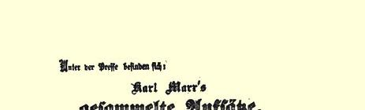
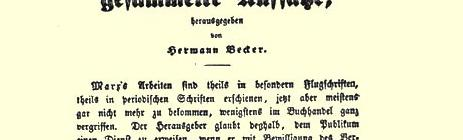
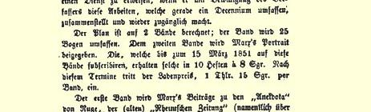
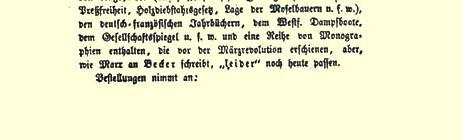

### 弗·恩格斯

## 德国来信４１

一

> １８４９年１２月１８日于科伦

“秩序统治德国”。这就是我们的统治者们当前主要的口号，不管他们是君主、贵族、**资产者**，还是那个新近成立的、用英语可以叫作**秩序迷**〔ｏｒｄｅｒｍｏｎｇｅｒｓ〕４２的党的任何其他派别。“秩序统治德国”，可是，德国从来没有，甚至在古老的“神圣罗马帝国”时代也从来没有象现在“秩序”统治时这样乱七八糟。

１８４８年革命以前，在旧制度下，我们至少知道是谁统治我们。 以前的法兰克福联邦议会，曾经用反对出版自由的法律，用特别法庭甚至用限制某些德国人借以自我安慰的、可笑的宪法来使人们感觉到它的存在。可是现在呢！我们自己简直不知道我们这个国家有多少中央政府。首先我们有帝国摄政王[^1]，他是已解散的国民议会４３拥立的，尽管没有一点权力，却死抱住自己的职位不放。其次有临时协议４４，—— 这是什么，谁也不确切知道，但看来是旧议会的复活，是在普鲁士过去的巨大影响下产生的，这个临时协议正在对老朽的摄政王（他多少代表奥地利的利益）施加压力，要他把自己的位置让给它。４５可是他们两者都没有一点权力。第三，有国民议会临终前在斯图加特选出的“帝国摄政政府”４６，以及该议会的残余——“坚定左派”和“极左派”。这两个“左派”和“摄政政府” 一道代表德国“温和的和哲学的”民主派和小店主。这个“帝国”政府在瑞士伯尔尼的一家酒馆举行自己的会议，它的权力大概同上面两家不相上下。第四，有所谓的三王联盟，或者说是“有限的 〔Ｃｏｎｆｉｎｅｄ〕（或是改良的〔Ｒｅｆｉｎｅｄ〕，我也不知道是什么样的）联邦国家”，成立它的目的是要使普鲁士国王[^2]成为**凌驾于**德国所有小邦**之上**的皇帝。４７它所以被称为“三王联盟”，是**因为**除普鲁士国王外，所有的国王都反对它！而它之所以自称为“分娩中的[^3]联邦国家”，是因为它虽然从今年５月２８日起就不时感到分娩前的阵痛４８，却没有任何希望能生出有生命力的东西！！第五，有四位国王４９，即汉诺威、萨克森、巴伐利亚和维尔腾堡的国王[^4]，他们决心随心所欲，而不屈服于上述任何一个“无力的中央政府”。最后，有奥地利，它极力要保持它在德国的最高地位，因此支持四个国王为摆脱普鲁士权势而做的努力。目前，**真正的**政府，即拥有权力的政府，是奥地利和普鲁士的政府。它们用军事专制统治德国，随意发布和取消法律。在它们的领地和属国之间，有一个所谓中立地带 —— 上述的四个王国，正是在这里，特别是在萨克森，这两个大国的权利将发生碰撞。但是，它们之间不可能发生严重的冲突。奥地利和普鲁士都很清楚，要遏制在整个德国、匈牙利和属于它们的那部分波兰土地上发展的革命情绪，它们的力量以后也必须联合在一起。此外，在必要的时候，“我们敬爱的妹夫”５０，全体俄罗斯人的信奉正教的沙皇，会进行干预，禁止他在奥地利和普鲁士的代理人互相争吵。

可是，这种在政府、权利、要求和德国联邦法律方面的史无前例的混乱，却有一个很大的好处。德国的共和党人直至今天分为联邦主义者和联合主义者两派；前者的主要力量在南方。每一次力图把德国改造成联邦国家所引起的混乱都明显地证明了，任何这样的计划都是注定要失败的，都是不切实际的和愚蠢的，因为德国的文明已经很发达，除了**统一的**、**不可分割的**、**民主的和社会的德意志共和国**这种形式，它不能接受任何其他形式的统治。

我本来还想就瓦尔德克和雅科比的无罪释放５１说几句话， 因为篇幅有限，只好作罢。不过要指出，至少在最近几个月内， 普鲁士政府不可能对政治案件作出有罪的判决，除非在一些偏僻角落，陪审团象奥尔斯脱的奥伦治会会员５２一样狂热，才有这种可能。

## 二关于德国暴君的有趣揭露。 ——蓄意对法国进行的战争。 ——未来的革命

> １８５０年１月２０日于科伦

在我给你们寄出上封信的第二天，这里就传来了关于谁应统治整个德国的“问题获得解决”的消息。由两名奥地利代表和两名普鲁士代表组成的临时协议，终于制服了老朽的约翰大公，迫使他引退。结果他们取得了政权，然而这不是无限期的。这一授权到今年５月期满，但是我们有充分理由预料，期满以前就会发生某些 “不利事件”，把这四位德国临时执政者赶走。这四位军事专制主义的走卒的名字是很值得注意的。奥地利派来的是**梅特涅手下的**财政大臣屈贝克先生和刽子手拉德茨基的得力助手雪恩哈耳斯将军。普鲁士的代表一个是拉多维茨将军，他是耶稣会教徒，国王的宠臣，并且是使普鲁士暂时得以把德国革命镇压下去的主要阴谋策划者，另一个是伯蒂歇尔先生，他在革命前是东普鲁士省的省长，那里的人们至今还亲切地（？）记得他是公众集会的“镇压者”和侦察系统的组织者。这么一伙恶棍会干出一些什么事情来，用不着对你们细说。我只举一个例子。维尔腾堡政府为革命所迫，曾和图尔恩－塔克西斯公爵签订合同—— 你们知道，这位公爵撇开各邦政府，垄断了德国大部分地区的信件邮递和旅客运送。５３正如我说的，维尔腾堡政府曾和这个强盗签订了一个全国性的合同，给他一笔数目相当可观的钱以换取他把垄断权让给上述政府。当那些靠抢劫国民财富为生的人的境遇一得到改善，图尔恩－塔克西斯公爵就认为他的垄断权比合同上规定的钱数更有价值，而不愿放弃这些权利。维尔腾堡政府已不受任何外来的压力，认为这种主意的改变合乎情理；于是双方都去找临时协议—— 公爵是公开地找，上述政府则是秘密地找。临时协议利用１８１５年旧法中的一条为借口，宣布这个合同无效和非法。事情就这样妥了。甚至图尔恩－塔克西斯先生能把他的特权再保留几个月就更好了；当人民结束全部特权时，他们不仅要无偿地夺走他的垄断权，而且还要迫使他退出至今从他们身上掠取的全部钱财。

奥地利的军事专制主义一天比一天更加令人不能忍受。报刊几乎全被消灭，所有的公民自由都被取消，整个国家充斥着密探 —— 监禁、军事法庭和鞭笞遍及全国，—— 这就是政府有时出版的那些各省宪法５４的实际意义，他们在这些宪法出版的当时就毫不在乎地加以破坏。但是任何事情都是要到头的，甚至戒严状态和匕首统治也不例外。军队要花钱，而钱这个东西，即使最有权力的皇帝也是不能随意制造出来的。奥地利政府迄今一直通过大量发行纸币来勉强保持财政上的收支平衡。但是这也到头了。有一位普鲁士尉官曾经因为我对他说，无论哪个国王或皇帝都不能想印制多少纸币就印制多少纸币，而要与我决斗５５，与这位尉官的愿望相反，与这位博学的政治经济学家的愿望相反，奥地利皇帝还是看到了，他的纸币—— 尽管不兑换—— 比银币贬值百分之二寸至三十， 比金币几乎贬值百分之五十。他原来打算发行的外债由于科布顿先生的努力而落空。外国资本家只认购了五十万镑，他要的是这个数目的十五倍；而他的财力枯竭的国家已经不能为他提供任何资金了。去年９月底一千五百万镑的赤字现在可能已经增到二千万至二千四百万镑了，而且匈牙利战争的费用大部分必须在１８４９年最后一个季度付清。这样，奥地利就只有在这两者中作出选择：要么破产，要么对外作战，使军队负担自己的花费，并且借助胜仗、征服的各个地方和战争赔款来恢复商业信誉。这样，科布顿先生借口保卫和平而反对奥地利和俄国的外债（因为俄国和奥地利处于同样困厄的境地）５６，比任何人都更有力地加速了对法兰西共和国的联合进军，这种进军在任何情况下都不可能再拖了。

在普鲁士，我们目睹了“国王良心”的又一表现。你们知道，弗里德里希·威廉四世这个从不食言的人在１８４８年１１月强行解散了国民议会，并且把一部合他心意的宪法强加给了他的人民５７，你们知道他曾同意让这件美丽的艺术品由第一次召集的议会进行修订；你们知道，这个议会的第二议院（众议院）甚至还未着手修订就被解散了，而另一个新的选举法又被强加到人民身上，这个选举法巧妙地删去了普选权，保证了由土地贵族、政府官吏和**资产阶级**组成的多数当选。５８由于所有民主派都拒绝参加这个议院的选举，所以它只是由选民总数的五分之一或六分之一选出的。这个议院与原来的第一议院一道着手修订宪法，自然，它们把它弄得比国王原来提出的本子还要更合国王的心意。现在他们已经几乎完成此事。你们以为现在国王陛下会高兴接受这个修改过的宪法，并就此宣誓吗？他才不呢！他给他忠实的议会写了一封御函，上面说，他非常满意两个议院为他的宪法所做的一切，但在其“国王良心”允许他宣誓以前， 需要对自己的宪法做十来处修改。５９这是些什么修改呢？国王陛下真够谦虚，他除了下面这些微不足道的小事外，就再无所求了。１． 现在由大土地所有者和资本家选举的第一议院，应该成为真正的贵族院，其成员中应包括各个亲王、陛下挑选的约一百名世袭贵族、大土地所有者选出的六十名贵族、大资本家选出的三十人、各大学选出的六人。２．大臣们应对国王和国家负责，而不是对议会负责。３．现在预算上规定的一切税收应永远征收，议会无权废除。４． 应成立“明星院”６０或最高法庭来审判政治案件—— 根本没提陪审团。５．应颁布一项规定和限制议会第二议院的权力的特别法等等。 你们对这件事怎么看呢？陛下强加给善良的普鲁士人一部新宪法， 又要让议会进行修订。他的议会进行了修订，即把残存的一点点公民权利统统勾销。而国王还不满足，宣布说，若不作上述补充修改， 他的“国王良心”就不允许他接受那部按照他自己的利益修订了的他自己的宪法。这的确是货真价实的“国王的”良心！甚至目前这个可笑的议会都不大可能屈从于这种无耻的要求。结果将是解散议会，普鲁士将暂无任何议会。所有这一切的奥妙在于预期会发生上面提到的联合大战。坐在普鲁士王位上的这位“有良心的”大人， 期望在三、四月份会有成百万的亚洲野蛮人充斥他那叛逆的国家， 他们将和“他自己的光荣军队”一道进军巴黎，征服这个生产他如此心爱的香槟酒的美丽国家。一旦共和国被消灭，圣路易的后代[^5] 在法国重新登极，那时候国内的宪法和议会还有什么用呢？

目前，革命精神正在德国各地迅速复活。１８４８年３月以后曾站在国王方面反对人民的最顽固的前自由派[^6]现在也认识到了， 正如德国谚语说的，虽然他只把他的一个小手指头尖伸给魔鬼，可是这位大人却已把他的整只手抓住。陪审法庭对政治审判案不断做出的无罪判决就是最好的证明。这方面的新事例每天都有。例如，几天前，曾经在１８４９年５月为了阻止向起义的爱北斐特运送军队而毁坏铁路的缪尔海姆工人在科伦被宣布无罪。６１在南德意志，财经困难和越来越高的赋税使每一位资产者都认识到，目前这种状况不可能持久。在巴登，正是这些背叛上次起义，欢呼普鲁士人到来的**资产者**被这些普鲁士人和在这些普鲁士人保护下使他们破产和绝望的政府所折磨和激怒。各地的工人和农民都在警惕地等待着起义的信号，这次起义一定要使无产者的政治统治和社会进步得到保证，否则决不会平息下去。**这场革命已经临近了**。

## 三普鲁士国王宣誓忠于宪法和 “侍奉上帝！”——神圣同盟的大阴谋。——日益临近的对瑞士的进攻。——征服和瓜分法国的计划！

> １８５０年２月１８日于科伦

普鲁士国王陛下终于宣誓忠于所谓的“宪法” 了。６２这场君主的闹剧，要不是能提供一个演讲的机会，无疑是不会上演的。喜好演讲的陛下，为了能够演讲，决定咽下宣誓这颗苦药丸。他过去曾当着众人的面咽下过不少难咽的东西，例如，大家都知道 １８４８年３月１９日，柏林人曾对他高喊“摘下帽子！”他这次决定宣誓，也和过去表现得一样恭顺。宣誓没有什么意义。更何况一个国王，特别是象弗里德里希·威廉四世这么一个人的宣誓！主要的是演讲，而这篇演讲也的确精彩。试设想一下这个场面，普鲁士国王陛下在十分严肃地宣称，同时，他以及在场的任何其他人谁都没有发出笑声，听他宣称他是一个**正直的人**，并且准备拿出他最宝贵的东西，即提供国王的保证！但是，他在使用了许多稀奇古怪的辞令之后，继续说道，他提供这种保证必须有一个条件：使他能够用这个宪法进行统治和实现他三年前许诺的“我和我全家将侍奉上帝” 的诺言６３。

这个新式的“正直人”所谓用宪法统治和侍奉上帝是什么意思，现在已经非常清楚。在这次宣誓闹剧之后，陛下的大臣们一是提出了两条几乎完全废除出版自由以及结社和公众集会权利的法律；二是提出了拨一千八百万塔勒（二百五十万镑）用于**扩军**的要求。这中间的意思很清楚。首先逐步消灭这个出色的宪法赝品留给人民的不多几种虚假的自由，然后使军队达到战时水平，并同俄国和奥地利一起去进攻法国。资产阶级的两个议院无疑会赞同这一切，从而使国王能够用宪法进行统治，并同全家一道侍奉上帝。

把普鲁士“为了应付可能在春天发生意外事件” 而举借的军事贷款和神圣同盟的其它措施联系起来，我们就能看穿他们的阴谋。除了上述的这一千八百万以外，普鲁士还正在以修建东部大铁路为借口商谈一千六百万的贷款。在俄国贷款的事情以后，你们都知道得很清楚，修建铁路成了神圣同盟中的各国政府弄钱的极好借口。这样，普鲁士将很快弄到五百万镑，全部交陆军部处理。俄国除了已弄到的五百万镑以外，正准备签订另借三千六百万银卢布即五百万镑的协定。唯有奥地利在经过不久前设法弄钱的可怜结局之后，不得不满足于她在国内所能获得的数目。正如我在上一封信中所说的，她的赤字一年实际上已经达到两亿弗罗伦（二千万镑）！因此，俄国和普鲁士弄钱是为了打仗，奥地利则为了弄钱而不得不打仗！

无疑，如果法国不发生意外事件，下个月就要开始对瑞士，或许还对土耳其的“神圣”战争。俄国在波兰及其邻近地区驻有三十五万随时准备出动的军队。它已经订购了大批食物，规定在下个月交货，但不是送往波兰，而是送往普鲁士的但泽。现在大约有十五万人的普鲁士军队，通过征召后备军和第一类后备军，一个月内就可以扩充到三十五万人。奥地利军队—— 约六十五万人—— 从未缩减过，相反，由于收容匈牙利战俘而扩充了。这些可用于对外作战的军队总数大约是一百万人，但是三分之二的普鲁士人和奥地利人都染上了民主病，一有机会就很可能转到敌人方面去。

进攻瑞士的第一个借口是那个国家里居住着德国流亡者。这个借口很快就不会存在了，因为联邦政府懦夫式的迫害在直接或间接地迫使所有的流亡者离开瑞士。现在这个国家里大概还有六百名流亡者，他们也将很快不得不离去。可是还有另一个借口—— 普鲁士要求恢复普鲁士国王在前公国纽沙特尔的权势，这个公国在１８４８年宣布成立了共和国。６４即使这个要求满足了，根据新的联邦宪法又会发生宗得崩德６５问题，这个新宪法在１８４８年取代了得到神圣同盟保障的１８１４年旧的反动协议。因此，瑞士是逃不过这场战争和外国占领的。

但是，神圣同盟的最终目的是征服和瓜分法国。为一下子结束这个伟大的革命中心而构想的计划如下：法国被征服后，将划分成三个王国—— 西南部的王国叫阿克维塔尼亚（首府波尔多）， 将交给波尔多公爵亨利；东部的王国叫勃艮第（首府里昂），将交给茹安维尔亲王，而北部的王国即法兰西本土（首府巴黎），将送给路易·拿破仑，以奖励他为神圣同盟立下的卓越功勋。这样，法国被弄成几世纪前的四分五裂的状况，将变得毫无力量。这个美好的计划无疑是普鲁士国王的“历史” 头脑中产生出来的，你们对它能说些什么呢？

但是，请相信，神圣同盟在筹划时没有予以考虑的人民，很快就会制止所有这一切阴谋诡计，只要神圣同盟一开始实现自己的计划，人民立刻就会予以制止。因为无论是在法国还是在德国， 人民都保持着警惕，而且值得庆幸的是，一旦要进行全面的、决定性的和公开的斗争，人民有足够的力量压倒自己的一切敌人。那时民主的敌人们将恐惧地看到，１８４８年和１８４９年的运动与那场将把欧洲的旧制度烧光，并照耀着胜利的各国人民走向自由、幸福和光荣的未来的遍地大火相比，简直算不了什么。

> 弗·恩格斯写于１８４９年１２月１８日—原文是英文 １８５０年２月１８日载于１８５０年１—３月《民主评论》杂志

> 海·贝克尔关于出版卡·马克思
>
> 《选集》两卷本（１８５０）的启事的第一页
>
> （出版计划完全没有实现）

[^1]: 约翰。—— 编者注

[^2]: 弗里德里希－威廉四世。—— 编者注原文是“Ｃｏｎｆｉｎｅｄ”，除“有限的”意思外，也有“分娩”的意思。—— 译者注

[^3]: 

[^4]: 恩斯特－奥古斯特、弗里德里希－奥古斯特二世、马克西米利安二世和威廉一世。—— 编者注

[^5]: 尚博尔。—— 编者注

[^6]: 康普豪森。—— 编者注