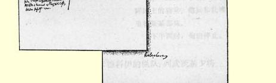

## 弗·恩格斯

# 巴拉克拉瓦

> ２２２

### 英国消息俄国消息２２３

在激烈的战斗以后，起先中路纵队：列武茨基—— 是第一个多面堡，随后是第二３个营，１６门火炮）。 个、第三个和第四个多面堡被谢米亚金—— 主力（９个营，１０ 迅速占领。后备队有第九十三门火炮），从乔尔贡到卡德科团，在巴拉克拉瓦附近有舰队， 还有将近１００……[^1]。土耳其人个营，１０门火炮，８个骑兵连， 在第九十三团的翼侧、在小山１个哥萨克骑兵连），在科马雷后面和在第二道筑垒线旁边构方向（在较晚的时候得到枪骑筑了工事。兵混成团的支援）占领了村庄

参加战役的有剑桥［公并构成左翼侧。 爵］指挥的第一师和卡瑟克特第一翼侧的组成如下： 指挥的第四师，还有占据紧靠（１）雷若夫的骠骑兵旅，占卡瑟克特部阵地的骑兵师。据中间往右的阵地（１４个骑兵

接着往左是一个法国师和连，９个哥萨克骑兵连，２０门

前卫（４２

伊。左路纵队—— 格里贝（１

> ２ 两个非洲猎骑兵团。俄国骑兵火炮）。（２）扎博克里特斯基本的袭击被第九十三苏格兰团和３个营，２个骑兵重骑兵旅击退。漂亮的攻击连，２个哥萨克骑兵连，１４门 （南面的公路）。火炮）。

俄军从他们占领的部分领阿速夫团冲击第一个多面土撤退。企图把火炮运出多面堡，早上六时半，敌人放弃第堡（［他们］一门也没有留二个和第三个多面堡，立刻被下）。命令轻骑兵在卡瑟克特的乌克兰团占领。第四个多面堡支持下前进。俄军又重新展开被敖德萨团占领，但已被彻底战斗队形，沿正面和在两翼配破坏和放弃。 置炮兵连。卡迪根的疯狂进攻在三个坚守住的多面堡之被击退。间的阵地。

非洲猎骑兵从左翼进行进俄军骑兵对英军营垒的袭攻，解救了在**右**翼遭到俄国枪击被第九十三苏格兰团的翼侧骑兵攻击的英军。炮火和重骑兵旅的进攻所打

重骑兵没有转入进攻，而退。 在右翼进行佯攻，并在炮火支扎博克里特斯基部队被调援下使俄军占领的一个多面堡往右面的高地。 失去了作用。炮击声终于寂静英军轻骑兵旅的进攻由于下来。英军撤到第二道筑垒线，遭到［俄军］枪骑兵的两翼攻放弃了第一道筑垒线，虽然在击而被击退。猛烈的霰弹和枪某个时候被破坏的多面堡又重弹的射击。 新被卡瑟克特指挥的土军占英军轻骑兵旅得到非洲猎领。骑兵的解救，非洲猎骑兵自己

人的部队（１

> 弗·恩格斯《巴拉克拉瓦》的一页手稿和会战平面图

是在弗拉基米尔团的２个营的

刺刀面前退却下来的。

#### 晚上的形势

德涅泊团的１个营在科马

雷。

阿速夫团的４个营，守卫

第一个多面堡的德涅泊团的１

个营。守卫第二个和第三个多

#### 面堡的乌克兰团的２个营。 第一线的８个营，在同一

阵地上的骑兵、炮兵和扎博克

里特斯基部队。

下午四时，炮击停止。

### 一．从乔尔贡到卡德科伊的纵队：列武茨基少将乌克兰团的４个营，１６门火炮乌克兰猎骑兵团敖德萨团的４个营Ⅳ[^2]     Ⅵ

> ２

３个步兵营    ４门重炮，６门轻炮。对付卡德 ８２科伊附近的第一个和第二个多 ３个营，１６门火炮阿速夫团的４个营面堡。在它后面：谢米亚金少德涅泊团的１个营，１０门火炮 １３２ ３个营，２６门火炮

将，阿速夫团。

德涅泊步兵团的第四营。

Ⅳ     Ⅵ

４门重炮，６门轻炮。此外，还

有敖德萨猎骑兵团和第六轻炮

连的６门轻炮。

### 二．纵队：从乔尔贡到科马雷德涅泊团的３个营格里贝少将把哥萨克开往拜达 １尔盆地。 ２个哥萨克步兵营 １０门火炮，８个骑兵连 １个哥萨克骑兵连

> １

２个营，１０门火炮， ８个骑兵连，１个哥萨克骑兵连。

德涅泊步兵团第一、第二和第

三营

Ⅳ     Ⅵ

４门重炮和６门轻炮，

枪骑兵混成团的１个骑兵连

顿河哥萨克第五十三团的１个

哥萨克骑兵连

稍后从拜达尔派出枪骑兵

混成团，以及哥萨克步兵（黑

海的）和第六步兵营的一部分。

### 三．右翼：骑兵，雷若夫中将 １４个骑兵连，２０门火炮。第六骠骑兵旅， ９个哥萨克骑兵连第十一和第十二骠骑兵团，

第一乌拉尔哥萨克团

第五十三顿河哥萨克团的３个

哥萨克骑兵连

１２个轻骑炮连

第三哥萨克重炮兵连。

### 四．最右翼：扎博克里特斯基少将非洲猎骑兵在这里进行攻击。弗拉基米尔团的 １３个营 ３个营，１４门火炮，２个骑兵连，２个哥萨克骑兵连

苏兹达尔团的

４个营

２个连，６

个步兵营

１０门重炮（Ⅰ）

４门轻炮（Ⅱ）

魏玛大公的２个骠骑兵连，

第六十哥萨克团（波波夫）的

２个哥萨克骑兵连。

### 投入战斗的总兵力 １７０门火炮２４个骑兵连１３个哥萨克骑兵 ２个营 ６００［每个营的８—２２［每门火８０［每连的人连人数］炮的人数］数］ １４７００名步兵９００１９２０８００名哥萨克 ９００名炮兵 ２６００名骑兵 １０００名哥萨克 １９２００人

２４１

２个营

４００

９８００名步兵[^3] 英军：第一师—８个营＝３０００人；

第四师—８个营＝３０００人；

骑兵师—１０个团—２０个骑兵连＝１２００人； 土军：约８个营，８个营＝４０００人； 法军：第一师中的６个营＝３０００人；

１２个骑兵连   ＝８００人；

［总计］１３０００［步兵］２０００［骑兵］和英国舰队。２２４

> 弗·恩格斯写于１８５４年原文是德文 １１月１３日和１６日之间

[^1]: 手稿中字迹不清。—— 编者注

[^2]: 恩格斯用罗马数字表示炮兵连的番号。—— 编者注

[^3]: 这是第二次计算出来的参加巴拉克拉瓦战役的俄国步兵的总数。这一次恩格斯按每营４００名步兵计算，而不是象第一次那样按６００名步兵计算。—— 编者注