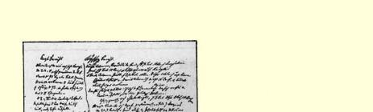
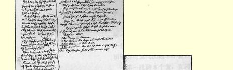

领了这个极好的设防营垒，它也只是夺去了对方一个极好的阵地， 并没有为自己获得同样的阵地。苏姆拉挡住了俄军越过巴尔干的通道，但是夺取苏姆拉并没有给俄军打开这条通道。

苏姆拉的意义在于它是通向瓦尔那的钥匙，而瓦尔那则是通向小巴尔干的钥匙。瓦尔那的防御工事不管有什么样的缺点，但在守军满员的情况下，要围攻这个要塞，对付这些工事就足足需要一个两、三万人的军。不仅如此，除了这些用来顺利完成围攻任务的兵力之外，还必须有足够数量的军队去掩护执行围攻任务的部队， 以免受到来自苏姆拉设防营垒的偷袭，因为士军可以在那里集中自己全部兵力。１８２８年，瓦尔那守军在要塞围墙被攻破两个缺口之后坚守了**三个星期**；而当时的情况是，俄军舰队控制着黑海，土耳其人却没有任何能够反击围攻者的军队。现在我们假定，锡利斯特里亚已被夺取，瓦尔那和苏姆拉正面的许多极难克服的河川防线已被强渡，而且瓦尔那已被封锁；俄军是否可能留下足够的兵力来制止苏姆拉发挥作用呢？而土耳其人却能够从苏姆拉出发，不仅对围攻瓦尔那的敌军，而且在多瑙河一线，以及对俄军的哪怕是一条交通线，采取行动，从而迫使他们把越来越多的兵力调离主力部队，以致最终必然会使他们因兵力极度分散而力量削弱。

即使瓦尔那失守，如果奥美尔－帕沙执意继续在自己的据点苏姆拉坐阵，准备俄军一犯错误就加利用，帕斯凯维奇又能做些什么呢？如果帕斯凯维奇拥有的唯一的交通线同时遭到来自正在向它逼近的苏姆拉军队和黑海联军舰队的威胁，他是否敢于向君士坦丁堡进军呢？我们按照他在亚洲和波兰的所作所为可以判断，这并不符合他的性格。帕斯凯维奇是一个过分小心谨慎的军事长官， 他身上没有任何拉德茨基那样的性格。如果他面临这样的问题，他会认为这种机动是一种极大的冒险，因为他很清楚地知道，他的前任吉比奇１８２９年在阿德里安堡附近曾陷入了多么困难的境地。这样，我们甚至不考虑英法联军在色雷斯登陆，也不期望联军舰队有比迄今更多的作为，也就是说，不指望它事实上的无所作为，我们也可以说，俄军要想摇旗呐喊、军乐齐鸣地径直向君士坦丁堡进军，并不是那么简单的事情。但是，如果土耳其人仍然没有援军，俄军终究会到达那里。这一点，除了时髦的军事作家，从来没有人否认过，因为他们不是根据事实，而是根据什么“权利反对暴力”必胜、“正义的事业”不会有任何错误的信念来作出判断[^1]。

应该补充一点，不列颠军队在波罗的海比在黑海更少作为。

> 弗·恩格斯写于１８５４年４月２４日原文是英文载于１８５４年５月１６日《纽约每日论坛报》 第４０８０号，并作为社论载于１８５４年５月 ２０日《纽约每周论坛报》第６６２号

## 弗·恩格斯

# 关于欧洲战斗的消息

> ２０９

“欧罗巴号” 带来的报纸和信件证实了早先报道的关于炮击敖德萨的消息。现在收到的有关这一事件的消息具有官方性质，对发生的事情的真实性不用怀疑。港口的设施被破坏，两个火药库被炸毁，十二艘俄国小船被击沉，十三艘运输船被捕获，而联军舰队的损失是八人被击毙，十八人受伤。人员伤亡不多，说明这决不是丰功伟绩。后来舰队驶往塞瓦斯托波尔，我们认为，破坏塞瓦斯托波尔要求它作完全不同的努力。

从多瑙河的战场上收到了关于奥美尔－帕沙取得对利迭尔斯将军的决定性胜利的新消息。但是，除了经由维也纳这个制造谎言以利于交易所投机者的大厨房转来的电讯２１０之外，我们没有关于这一点的其他消息。按照这个说法，土耳其人以七万人的兵力，在锡利斯特里亚和位于多瑙河上游距切纳沃达大约十英里的拉索瓦之间的一个地方，赶上了利迭尔斯。这时奥美尔－帕沙从正面压迫俄军，而被专门派去进行迂回的另一个军从侧翼去攻击他们，这样他们就在两面火力夹攻之下被击溃了。这种情况不是不可能的，但是我们不能想象，奥美尔－帕沙怎么能够如此迅速地把那么巨大的兵力集中在锡利斯特里亚下游的某一点上，而利迭尔斯却毫无准备。２１１根据在这个战役之前所得到的最新情报资料判断，他的军队的主力—— 包括保障整个漫长的正面战线的守备队在内，总数不会超过十二万人—— 集中在苏姆拉，距离所说的会战地点几百英里。当需要把七万人运到战场上的时候，要克服那样长的距离， 使敌人措手不及，是十分困难的。不过，我们再说一遍，这是可能的。大概下一班轮船到来时，即可见分晓。

希腊暴动又一次受挫，但是不应该认为暴动已被彻底镇压下去。没有疑问，至少在边境地区还有士兵和指挥人员要重新起来进行斗争，要对土耳其军队进行艰巨的游击战。这一斗争是否能达到较为象样的地步，将取决于各种情况。正如我们的读者在另一页上看到的２１２，在土耳其本国，一个广泛的希腊人和俄国人的密谋已经酝酿成熟；由于偶然的情况，它的一切线索都被土耳其政府所掌握了。２１３但是，还会发生其他类似的密谋，而且偶然的情况阻止不了它。同时，联盟的大国用威胁的办法责难希腊朝廷，并派军队在土耳其登陆，好象打算完全占领这个国家。虽然根据法国大使[^2]的坚决要求，派了一支部队向北开往大概总是发生冲突的瓦尔那，但是这些军队的大部分仍然会留在君士坦丁堡附近。不过，联军的主力很快就发动进攻战这一点是值得怀疑的。这个问题在司令官们[^3]到达君士坦丁堡之前不可能得到解决。

在波罗的海，查理·纳皮尔爵士仍然留在斯德哥尔摩附近，没有攻击俄国任何一个沿海要塞。看来使他担忧的是俄国人在浅水域和芬兰湾岛屿间用来攻击他的一支小炮艇队。纳皮尔已派人去英国寻求轻载吃水的蒸汽船，这种船能够追击炮艇，直至它们找到自己的隐蔽所。另一方面，根据一家柏林报纸２１４驻圣彼得堡记者的报道，俄国宫廷担心喀琅施塔得不能抵抗意料中的不列颠 Ｒｏｕｇｈ ａｎｄ Ｒｅａｄｙ〔威武的士兵〕[^4]的攻击，军舰不能顺利地进行机动，甚至不能在港湾里进行示威性的射击，担心对方为防止敌人陆战队在这个地区登陆已有所准备。

但是，在法国军舰抵达波罗的海之前，很少有可能进行任何进攻战。之后，喀琅施塔得大概会荣幸地受到第一次炮击。它是否会被占领或被破坏，这是另一个问题，但在联军有了准备用来攻击它的破坏手段的情况下，喀琅施塔得的陷落是不足为奇的。

西方强国从剑桥公爵在皇帝[^5]婚礼上受到的殷勤接待中得到鼓舞，看到奥地利有希望转到他们一边来而感到自慰。然而，从普鲁士却没有收到类似的令人快慰的消息。德国总的说来还是站在原先的立场上，而同盟国对于吸引德国参加有利于自己的任何事业不抱希望。毫无疑问，奥地利将会占领塞尔维亚和已经爆发反对苏丹的真正起义的门的内哥罗２１５，然而正如我们早已说过的２１６，这种占领仅仅是走向瓜分土耳其的又一步骤，实际上更加有利于俄国，而不利于它的敌人。

> 弗·恩格斯写于１８５４年５月４日原文是英文作为社论载于１８５４年５月２０日 《纽约每日论坛报》第４０８４号

## 卡·马克思

# 中央洪达

> ２１７

##### １８０８年９月２６日（阿兰惠斯）— １８１０年１月２９日[^6]

应该预料到，在法军撤出马德里以后，拿破仑很快又会重新统帅更加强大的军队。因此，共同的防御措施就成为不可避免的了。大家都感到：各省洪达的多头政治，应该让位给一个中央政府，因为拜兰会战２１８获胜之后它们之间的争吵愈演愈烈。但是，唯恐丧失自己手中权力的各省洪达接受了塞维尔洪达２１９的建议：由各省洪达各选两名代表，由代表们的会议组成中央政府，同时各省洪达保持对有关区域的内部管辖权。这样，由各省洪达的三十四名代表组成的中央洪达于１８０８年９月２６日在阿兰惠斯召开会议，执政至１８１０年１月２９日。中央洪达在征服者追击下从马德里逃到塞维尔，又从塞维尔逃到加迪斯。当中央洪达从阿兰惠斯的王宫一再命令打仗的时候，法军已经占领了索莫山隘口；当它从塞维尔用有力的号召来宽慰人民的时候，摩勒纳山隘口已经失守了，苏尔特的军队已经拥进安达鲁西亚。

在中央洪达执政期间，西班牙军队被彻底消灭了，可耻的失败一个胜过一个，毁灭性的奥康尼亚会战（１８０９年１１月１９日）是西班牙人最后一次大会战，从此他们只能进行游击战了。

当“陛下”—— 洪达为自己取了这样的尊称[^7]—— 从塞维尔逃跑的时候，加迪斯成了唯一的避难所，如果阿尔布凯克公爵不把自己的军队调往加迪斯，而是按照中央洪达的命令开往哥多瓦，那么他自己的军队就会被切断，加迪斯就会让给法国人，西班牙的整个中央政权就会完蛋。如果有什么地方例外，遇到了英勇的抵抗，那也不是来自战场上的正规军，而是来自被包围的城市，如萨拉哥沙和赫罗纳。

西班牙争取独立战争的这些为数不多的事实对评价中央洪达已经足够了。把法国军队从西班牙的土地上驱逐出去是建立中央洪达的主要目的，然而它辉煌地葬送了这个任务。在革命时期的条件下，军队的成就比平时更能反映出中央政权的性质。为了游击战的功绩而放弃正规战这一事实本身已经证明：全国中心在地方抵抗中心面前黯然失色了。全国政府的垮台应该如何解释呢？

中央洪达的组成本身根本不符合它面临的任务。要实现专制政权，它过于庞大了，过于复杂了，要想具有国民公会那样的权威，它的人数又太少了。中央洪达从各省洪达得到自己的权力这一情况使得它不能克服各省洪达的虚荣心、恶念和任性的妄自尊大。在中央洪达的成员中有两个最杰出的代表—— 开明的专制君主查理三世的八十高龄的大臣弗洛里达布朗卡和善良的改良家霍韦利亚诺斯，后者由于在选择手段方面过于拘泥而从来没有把事情干到底—— 当然是拿不出什么办法来解救国家的危亡的。

固有的虚弱感和人民心目中对它的权力的怀疑，使洪达经常处于恐惧状态，并且对它必须委以军事指挥重任的将军们持怀疑态度。中央洪达的成员莫尔拉将军预先把马德里弃让给拿破仑，而投到了波拿巴主义者的阵营里。库埃斯塔首先拘捕了中央洪达中累翁的代表并准备制订恢复原先总督２２０的权力和皇家ａｕｄｉｅｎ－ ｃｉａｓ[^8]的复辟计划；后来，随着决定祖国命运的各次会战的失败，他看来赢得了政府的信任。洪达不信任罗曼纳将军和拜兰战役的胜利者卡斯塔尼奥斯将军，令人信服的证明是他们二人对它的公开敌意，前者通过他１８０９年１０月４日于塞维尔发表的告民众书中表现出来，另一人则通过对待它的态度并成为摄政府的成员表现出来。阿尔布凯克公爵这个大概在当时所有西班牙将军中唯一能够进行大战的人，看来主要是具有军事独裁者的一切危险的特性 —— 这是撤销他一切重要指挥职务的十分充分的理由。我们可以大胆地相信威灵顿公爵，他于１８０９年９月１日写信给他哥哥韦尔斯利侯爵说：

> “我一观察中央洪达的行动，就开始担心，它把自己的力量与其说是用在军事防御和战斗行动的任务上，不如说是用在政治阴谋和卑鄙的政治目的上。”２２１

预感到军事家们有使命在国内动乱中起卓越的作用，这一点看来已使西班牙的第一个人民政府产生了虔敬的恐惧心。由于自己的组成情况而丧失一切真正革命力量的中央洪达，必然会求助于小阴谋，以便抵消自己的将军们的影响。另一方面，因为无法同人民暴动的压力相对抗，它常常迫使将军们在那些只有经过最慎重的长期防御才有可能获得成功的地方采取仓促的行动。

> 卡·马克思写于１８５４年９月５日原文是英文和２２日之间俄译文第一次部分发表于１９５９年 《卡·马克思和弗·恩格斯著作的科学情报通报》第２期

## 弗·恩格斯

# 巴拉克拉瓦

> ２２２

### 英国消息俄国消息２２３

在激烈的战斗以后，起先中路纵队：列武茨基—— 是第一个多面堡，随后是第二３个营，１６门火炮）。 个、第三个和第四个多面堡被谢米亚金—— 主力（９个营，１０ 迅速占领。后备队有第九十三门火炮），从乔尔贡到卡德科团，在巴拉克拉瓦附近有舰队， 还有将近１００……[^9]。土耳其人个营，１０门火炮，８个骑兵连， 在第九十三团的翼侧、在小山１个哥萨克骑兵连），在科马雷后面和在第二道筑垒线旁边构方向（在较晚的时候得到枪骑筑了工事。兵混成团的支援）占领了村庄

参加战役的有剑桥［公并构成左翼侧。 爵］指挥的第一师和卡瑟克特第一翼侧的组成如下： 指挥的第四师，还有占据紧靠（１）雷若夫的骠骑兵旅，占卡瑟克特部阵地的骑兵师。据中间往右的阵地（１４个骑兵

接着往左是一个法国师和连，９个哥萨克骑兵连，２０门

前卫（４２

伊。左路纵队—— 格里贝（１

> ２ 两个非洲猎骑兵团。俄国骑兵火炮）。（２）扎博克里特斯基本的袭击被第九十三苏格兰团和３个营，２个骑兵重骑兵旅击退。漂亮的攻击连，２个哥萨克骑兵连，１４门 （南面的公路）。火炮）。

俄军从他们占领的部分领阿速夫团冲击第一个多面土撤退。企图把火炮运出多面堡，早上六时半，敌人放弃第堡（［他们］一门也没有留二个和第三个多面堡，立刻被下）。命令轻骑兵在卡瑟克特的乌克兰团占领。第四个多面堡支持下前进。俄军又重新展开被敖德萨团占领，但已被彻底战斗队形，沿正面和在两翼配破坏和放弃。 置炮兵连。卡迪根的疯狂进攻在三个坚守住的多面堡之被击退。间的阵地。

非洲猎骑兵从左翼进行进俄军骑兵对英军营垒的袭攻，解救了在**右**翼遭到俄国枪击被第九十三苏格兰团的翼侧骑兵攻击的英军。炮火和重骑兵旅的进攻所打

重骑兵没有转入进攻，而退。 在右翼进行佯攻，并在炮火支扎博克里特斯基部队被调援下使俄军占领的一个多面堡往右面的高地。 失去了作用。炮击声终于寂静英军轻骑兵旅的进攻由于下来。英军撤到第二道筑垒线，遭到［俄军］枪骑兵的两翼攻放弃了第一道筑垒线，虽然在击而被击退。猛烈的霰弹和枪某个时候被破坏的多面堡又重弹的射击。 新被卡瑟克特指挥的土军占英军轻骑兵旅得到非洲猎领。骑兵的解救，非洲猎骑兵自己

人的部队（１

> 弗·恩格斯《巴拉克拉瓦》的一页手稿和会战平面图

是在弗拉基米尔团的２个营的

刺刀面前退却下来的。

#### 晚上的形势

德涅泊团的１个营在科马

雷。

阿速夫团的４个营，守卫

第一个多面堡的德涅泊团的１

个营。守卫第二个和第三个多

#### 面堡的乌克兰团的２个营。 第一线的８个营，在同一

阵地上的骑兵、炮兵和扎博克

里特斯基部队。

下午四时，炮击停止。

### 一．从乔尔贡到卡德科伊的纵队：列武茨基少将乌克兰团的４个营，１６门火炮乌克兰猎骑兵团敖德萨团的４个营Ⅳ[^10]     Ⅵ

> ２

３个步兵营    ４门重炮，６门轻炮。对付卡德 ８２科伊附近的第一个和第二个多 ３个营，１６门火炮阿速夫团的４个营面堡。在它后面：谢米亚金少德涅泊团的１个营，１０门火炮 １３２ ３个营，２６门火炮

将，阿速夫团。

德涅泊步兵团的第四营。

Ⅳ     Ⅵ

４门重炮，６门轻炮。此外，还

有敖德萨猎骑兵团和第六轻炮

连的６门轻炮。

### 二．纵队：从乔尔贡到科马雷德涅泊团的３个营格里贝少将把哥萨克开往拜达 １尔盆地。 ２个哥萨克步兵营 １０门火炮，８个骑兵连 １个哥萨克骑兵连

> １

２个营，１０门火炮， ８个骑兵连，１个哥萨克骑兵连。

德涅泊步兵团第一、第二和第

三营

Ⅳ     Ⅵ

４门重炮和６门轻炮，

枪骑兵混成团的１个骑兵连

顿河哥萨克第五十三团的１个

哥萨克骑兵连

稍后从拜达尔派出枪骑兵

混成团，以及哥萨克步兵（黑

海的）和第六步兵营的一部分。

### 三．右翼：骑兵，雷若夫中将 １４个骑兵连，２０门火炮。第六骠骑兵旅， ９个哥萨克骑兵连第十一和第十二骠骑兵团，

第一乌拉尔哥萨克团

第五十三顿河哥萨克团的３个

哥萨克骑兵连

１２个轻骑炮连

第三哥萨克重炮兵连。

### 四．最右翼：扎博克里特斯基少将非洲猎骑兵在这里进行攻击。弗拉基米尔团的 １３个营 ３个营，１４门火炮，２个骑兵连，２个哥萨克骑兵连

苏兹达尔团的

４个营

２个连，６

个步兵营

１０门重炮（Ⅰ）

４门轻炮（Ⅱ）

魏玛大公的２个骠骑兵连，

第六十哥萨克团（波波夫）的

２个哥萨克骑兵连。

### 投入战斗的总兵力 １７０门火炮２４个骑兵连１３个哥萨克骑兵 ２个营 ６００［每个营的８—２２［每门火８０［每连的人连人数］炮的人数］数］ １４７００名步兵９００１９２０８００名哥萨克 ９００名炮兵 ２６００名骑兵 １０００名哥萨克 １９２００人

２４１

２个营

４００

９８００名步兵[^11] 英军：第一师—８个营＝３０００人；

第四师—８个营＝３０００人；

骑兵师—１０个团—２０个骑兵连＝１２００人； 土军：约８个营，８个营＝４０００人； 法军：第一师中的６个营＝３０００人；

１２个骑兵连   ＝８００人；

［总计］１３０００［步兵］２０００［骑兵］和英国舰队。２２４

> 弗·恩格斯写于１８５４年原文是德文 １１月１３日和１６日之间

## 弗·恩格斯

# 克里木战争２２５

#### １８５４年 **９月１４日**       旧堡登陆。 **９月２０日**阿尔马河会战。 **９月２５日**联军向塞瓦斯托波尔南区推进。 **９月２６日**攻占巴拉克拉瓦。 **９月２８日**封锁南区（当时在南区除水兵外只有８

个营）。 **１０月１日**进行侦察和决定在强攻前进行炮击。 **１０月９—１０日**［挖］第一道平行壕，距要塞４００—６００

俄丈。 **１０月１７日**炮击塞瓦斯托波尔（在陆地上俄军的火

力占优势，以２００门重炮对付进攻者的

１２６门炮），舰队同时射击。法军炮兵被

迫停止射击。强攻的时间错过了。 **１０月２５日**巴拉克拉瓦会战[^12]。 **１０月２６日**俄军以９个营的兵力向英军阵地出击。 **１１月４日**俄军比联军的兵力占优势。进攻。 **１１月５日**因克尔芒会战２２６。英军的围攻作业现在

几乎完全中止。只有阻援线在继续加

强，以防止被解围军队突破。 **１２月１１日**奥斯滕－萨肯任城防司令。出击日益频

繁并日益顺利。

#### ［１８５５年］ **１月初**英军在距要塞４００俄丈处挖了第二道

平行墙。出击继续进行。 **１月２７日**尼耶尔到来。法军对马拉霍夫冈的坚决

强攻延期。英军让出了自己的一半堑壕

—— 总共长一英里！ **２月２２—２３日**色楞格多面堡２２７建成。２３日对该堡的攻

击被击退。距主墙１１００码。 **２月２８日—３月１日**沃伦多面堡建成—— 距主墙１４５０码。 **３月１１—１２日**堪察加眼镜堡我２２８——７７０码。这样

在距要塞４７０俄丈处敌人被迫进行了

转土对壕作业。

在这些工事前还筑有散兵战壕。 **３月２２—２３日**对这些战壕的攻击被击退，这些战壕已

被堑壕连成一个整体；第三棱堡前也是

这样—— 距主墙４３０码处有采石场。 **４月**为争夺第四至第六棱堡前２００步处的

俄军战壕展开战斗， **４月１９—２０日**英军攻击采石场 **４月２０—２１日**被击退。 **５月**联军的（法军和撒丁军）和佩利西埃的

兵力增加。用新的兵力组织进攻。 **５月２３日**第五棱堡前为争夺反接近壕展开了战

斗，俄军获胜。 **６月７日**攻击堪察加眼镜堡、采石场、色楞格多

面堡和沃伦多面堡。 **６月１８日**第一次强攻，被击退。２２９ **８月１６日**

黑河２３０。 **９月８日**强攻。

> 弗·恩格斯起草于１８５５年９月原文是德文 ８日以后第一次以真迹复制形式发表于 《马克思恩格斯全集》俄文第２版第１１卷

## 卡·马克思

# 外交上的失礼

> ２３１

**伦敦**１０月２日。英国驻德意志联邦议会公使亚历山大·马利特爵士在霍姆堡为庆祝攻克塞瓦斯托波尔而举行的宴会上发表的讲话，由于激烈攻击普鲁士国王及其内阁在这里引起了极大的震动。英国公使在这次讲话中直接了当地声称，英吉利民族本来有权等待普鲁士采取另一种政策，况且普鲁士的多数人民从来没有隐瞒过他们对西方强国的同情。亚历山大爵士认为，如果普鲁士的态度有利于西方强国，那么奥地利接着就会坚决行动，而俄国面对普鲁士同盟就不可能进行对抗。在一定程度上，普鲁士对战争直接负有责任。由于普鲁士国王是德意志联邦的成员，而亚历山大爵士是英国派驻该联邦的公使，所以人们认为这种攻击在任何情况下都将具有值得最严肃看待的后果。如果公使受到本国政府的袒护，那么这将是英国未来政策性质的征候；否则肯定他会被召回国。

> 卡·马克思写于１８５５年１０月２日原文是德文载于１８５５年１０月５日《新奥得报》 第４６５号

[^1]: 阿尔诺德《即将爆发的战争》。—— 编者注

[^2]: 巴拉盖·狄利埃。—— 编者注

[^3]: 腊格伦和圣阿尔诺。—— 编者注

[^4]: 十九世纪英国士兵的绰号，滑铁卢战役后成为普通名词。在这次会战中，因为拉符上校战功卓著，威灵顿公爵就利用这个英雄的姓“Ｒｏｕｇｈ”的含义称他为“Ｒｏｕｇｈ ａｎｄ Ｒｅａｄｙ”，直译是：“鲁莽的，但时刻准备行动的”。—— 编者注

[^5]: 弗兰茨－约瑟夫一世。—— 编者注

[^6]: 马克思在手稿中对这个标题作了注：“（１８０９年１月，弗洛里达布朗卡）”。—— 编者注

[^7]: 见《马克思恩格斯全集》中文版第１０卷第４７６页。—— 编者注

[^8]: 西班牙和拉丁美洲的最高上诉法院。—— 编者注

[^9]: 手稿中字迹不清。—— 编者注

[^10]: 恩格斯用罗马数字表示炮兵连的番号。—— 编者注

[^11]: 这是第二次计算出来的参加巴拉克拉瓦战役的俄国步兵的总数。这一次恩格斯按每营４００名步兵计算，而不是象第一次那样按６００名步兵计算。—— 编者注

[^12]: 见《马克思恩格斯全集》中文版第１０卷第５８６—５９３页。—— 编者注