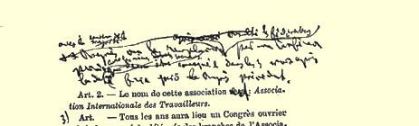
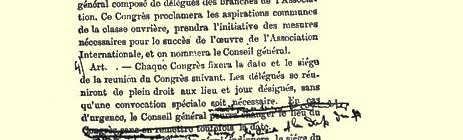
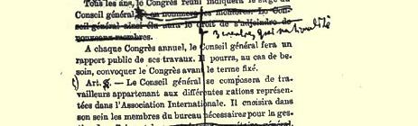
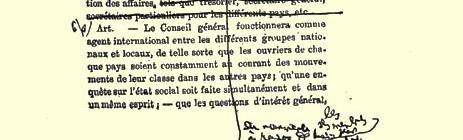

## 卡·马克思

# １８７２年夏总委员会批准的国际工人协会共同章程和组织条例草案６１２

## 国际工人协会共同章程

鉴于：

工人阶级的解放应该是工人自己的事业；

工人阶级的解放斗争不是要争取阶级的特权和垄断权，而是要争取平等的权利和义务，并消灭任何阶级统治；

劳动者在经济上受劳动资料即生活源泉的垄断者的支配，是一切形式的奴役—— 社会贫困、精神屈辱和政治依附—— 的根本原因；

因而工人阶级的经济解放是一切政治运动都应该作为手段服从于它的伟大目标；

为达到这个伟大目标所做的一切努力至今没有收到效果，是由于每个国家里各个不同劳动部门的工人彼此间不够团结，由于各国工人阶级彼此间缺乏亲密的联合；

劳动的解放既不是一个地方的问题，也不是一个民族的问题， 而是一个社会问题，它涉及存在有现代社会的一切国家６１３，它的解决有赖于最先进各国在实践上和理论上的合作；

目前欧洲各个最发达的工业国工人运动的新高潮，在鼓起新的希望的同时，也郑重地警告不要重犯过去的错误，要求尽快把各个仍然分散的运动联合起来；

**鉴于上述理由**，

创立了**国际工人协会**。

**协会宣布**：

加入协会的一切团体和个人，应承认**真理**、**正义**和**道德**是他们对一切人的关系的基础，而不分肤色、信仰或民族；

**没有无权利的义务**，**也没有无义务的权利**。

根据这种精神，定出章程如下：

第一条 本协会创立的目的，是为了组织[^1]追求共同目标即追求工人阶级的互助、发展和彻底解放的各国工人的共同行动。６１４

第二条 本会的名称：**“国际工人协会”**。

第三条 每年召开由协会各分部选派代表组成的全协会工人６１５代表大会。代表大会宣布工人阶级共同的愿望，采取使国际协会顺利进行活动的必要办法，并任命协会的总委员会。

第四条 每次代表大会规定下次代表大会召开的时间和地点。代表自行按规定的日期到规定的地点集会，无须另行通知。在紧急情况下，总委员会可改变*代表大会*的地点和*日期*，*并可经大多数联合会委员会同意将代表大会改为具有同等权力的秘密代表会议*。*但代表大会或代替它的代表会议*，*必须在上届代表大会所定日期之后的三个月内举行*。

代表大会每年确定总委员会驻在地，并选举总委员会委员，*每一民族各选出三名*。*这样选出的总委员会有权更换辞职的或因故无法履行职责的委员*，*有权在代表大会选出的委员少于章程规定之数额时用增选的办法加以补足*。

总委员会在每个年度代表大会上做一次公开的工作报告。在必要时，总委员会可提前召开代表大会。

第五条 总委员会从其委员中选出为管理各种事务所必需的负责人员。

第六条 总委员会是沟通协会各个全国性组织和地方组织之间联系的国际机关，它应该使每一个国家的工人能经常知悉其他各国工人阶级运动的情况；使欧洲各国中的社会状况调查工作能同时并在同一思想指导下进行；使一个团体中提出的但具有普遍意义的问题能由所有其他团体加以研究，并且在需要立即采取行动时使协会内的一切团体都能同时和一致行动。

总委员会应在它认为适当的时候主动向各个地方性团体和全国性团体提出建议。

第七条 既然每个国家的工人运动的成功只能靠团结和联合的力量来保证，而另一方面，如果总委员会能够同几个大的全国性的工人协会中心联系而不是同许多细小而分散的地方性团体联系，那它的活动就会更富有成效，所以，国际协会的会员应该竭力使他们本国的尚处于分散状态的工人团体联合成全国性组织， 这种全国性组织由*在组成方面尽可能带有国际性*的中央机关来代表。

不言而喻，本条的运用要取决于每一国家法律的特点，除存

第一国际共同章程和组织

条例的法文版的一页，

上面有卡·马克思的修改在法律障碍的情况外，每一个独立的地方性团体都有权同总委员会发生直接的联系。

*第八条６１６在反对有产阶级联合权力的斗争中*，*无产阶级只有本身组织成为与有产阶级建立的一切旧政党对立的特殊政党*，*才能作为一个阶级来行动*。*—— 无产阶级这样组织成为政党是必要的*，*为的是要保证社会革命获得胜利和实现这一革命的最终目标*： *消灭阶级*。*——工人阶级通过经济斗争而已经达到的本身力量的联合*，*同样应当成为它在反对其剥削者的政权的斗争中的杠杆*。*—— 土地巨头和资本巨头总是要利用他们的政治特权来维护并永久保持他们的经济垄断*，*来奴役劳动*。*所以*，*夺取政权已成为无产阶级的伟大使命*。

第九条 每一个承认并维护国际工人协会原则的人，都可被接受为国际工人协会的会员。

*但是为了保证协会的无产阶级性质*，*每一个支部都必须由至少三分之二的雇佣工人组成*。*６１７*

每一个支部对它的会员的品质纯洁负责。

第十条 国际协会的每个会员，在由一个国家迁居另一国家时，应该得到协会会员的兄弟般的帮助。

第十一条 加入国际协会的工人抵抗团体，可以完整地保存自己原有的组织。

第十二条 本章程可以在每次代表大会上进行修改，但须有出席代表的三分之二要求修改。

第十三条 凡本章程规定未尽之处，将另由在每次代表大会上**可加以修改**的条例规定之。

## 组织条例按历届代表大会（１８６６—１８６９）和伦敦代表会议（１８７１）的决议修订一全协会代表大会

１．国际工人协会的每一支部的每个成员均有参加选举代表大会代表的权利，每个协会会员均有被选为代表的资格。

*２．凡成员不少于五十人的支部或成员总数不少于五十人的若干支部*，*有权派遣一名代表参加代表大会*。

*３．凡成员在五十人以上的支部或总人数在五十人以上的若干支部*，*每超过一百人有权增派代表一名*。

４．每一个代表在代表大会上只有一票表决权。

５．代表由选出代表的那个或几个支部支给补贴费。

６．今后只有加入国际并向总委员会缴清会费的团体、支部或小组的代表，才能参加代表大会，享有表决权。

７．代表大会的会议分两种：讨论组织问题的秘密会议和讨论并表决大会议程中列有的原则问题的公开会议。

８．总委员会制订代表大会的正式议程。议程中须包括上次代表大会提出的问题和总委员会补充提出的问题，以及各支部和小组或它们的委员会向总委员会提*交并为总委员会所接受*的问题。

所有支部，如果要把上次代表大会没有提出的问题提交将举行的代表大会讨论，应于３月３１日前通知总委员会。

９．总委员会负责组织代表大会并通过联合会委员会将大会议程及时通知所有的支部。

１０．代表大会为它所应讨论的每一个问题都成立一个委员会。 每一个代表可提出他愿意参加的委员会。各小组或支部提出的报告，交给哪个委员会研究，就在该委员会的会议上宣读。该委员会根据这些报告编写一个总报告，在公开会议上只宣读总报告；该委员会还决定哪些报告应作为正式报告的附录。

１１．代表大会在其公开会议上，应首先讨论总委员会提出的问题；然后讨论其余问题。

１２．对有关原则的问题，均实行唱名表决。

１３．每一个支部或支部联合会，至迟均须在每年召开代表大会前两个月向总委员会提出关于该组织本年度内的工作和发展情况的详细报告。

总委员会根据这些报告编写一个总报告，在代表大会上只宣读这个总报告。

## 二总委员会

１．国际工人协会的中央委员会仍用**总委员会**名称。

设有**国际**正规组织的各国的中央委员会，应定名为**联合会委员会**，冠以各该国的国名。

２．总委员会必须执行代表大会的决议，*并且监督每一国家严格遵守国际的基本原则*。

３．总委员会应每周公布其开会情况。

４．*凡在联合会之外的固体*，*如想加入国际*，必须立即将其申请通知总委员会。

５．总委员会有权接受或不接受任何新的团体或小组，但它们可以向代表大会提出申诉。

但在设有联合会委员会的地方，总委员会在决定接受或不接受一个新的支部或团体之前，须听取联合会委员会的意见；但总委员会保留做出临时决定的权利。

６．总委员会也有权将国际的分部、支部、联合会委员会及联合会暂时开除，直到应届代表大会为止。

*但是对属于某一个联合会的支部*，*总委员会只有在事先听取了有关联合会委员会的意见以后*，*才能行使这一权利*。

*总委员会在解散联合会委员会时应同时要求该联合会各支部在三十天以内选出新的联合会委员会*。

*总委员会在暂时开除整个联合会时*，*应立即通知其余各联合会*。*如果大多数联合会都提出要求*，*总委员会应在一个月内召开非常代表会议*，*由每一个民族各派一名代表出席*，*对这个问题做出最后决定*。

*不言而喻*，*国际遭到禁止的那些国家*，*享有与正规的联合会同样的权利*。

７．总委员会有权解决属于一个全国性组织的团体或支部之间、或各全国性组织之间可能发生的纠纷，但是，它们可以向代表大会进行申诉，代表大会的决定才是最终决定。

８．由总委员会任命执行特殊任务的一切代表，均有权出席联合会的、地方性的或**国际团体**的一切会议并发表意见，但没有表决权。

９．用英文、法文和德文出版的共同章程和条例，应按总委员会颁布的正式文本印行。

共同章程和条例的所有其他文字的译文，均应在发表前提请总委员会批准。

## 三应向总委员会缴纳的会费

１．总委员会向一切支部和附属团体征收会费，数额为每个会员每月十生丁。

这笔会费用来支付总委员会的各项开支。

２．总委员会应印制价值十生丁的固定式样的会费券，每年向各联合会委员会按要求数量供应这种会费券。

３．联合会委员会向各地方委员会，在没有地方委员会时，则向所属各支部按其会员人数寄发会费券。

４．这种会费券应粘贴在会员证的专页或协会每个会员均须持有的那份章程上。

５．各国或各地区的联合会委员会*每个季度*均应将与所用会费券价值相符的金额寄给总委员会，并交回剩余的会费券。

６．这些会费券，须标明当年年份。

## 四联合会委员会

１．联合会委员会的费用由所属各支部负担。

２．每一个联合会委员会应每月向总委员会呈交一次报告。

３．联合会委员会应向总委员会*每个季度*提出一次有关所属各支部的组织工作和财务状况的报告。

４．每一个联合会都可以不接受或者开除个别支部或团体，但无权取消它们的国际组织的资格；然而它可以建议总委员会将它们暂时开除。

## 五地方性团体、支部和小组

１．每一个支部均有权根据当地条件和本国法律的特点制定自己的地方性章程和条例。但是，此种章程和条例不得与共同章程和条例有任何抵触。

*２．此种带有地方特点的章程和条例*，*由联合会委员会审定其是否符合共同章程和条例*；*不在联合会内的支部*，*其章程和条例由总委员会审定*。

３．所有地方分部、支部或小组及其委员会，今后其名称和性质一律只是国际工人协会分部、支部、小组和委员会，在名称前冠以该地地名。

４．因此，分部、支部和小组，今后不得再用宗派名称，如实证论分部、互助主义分部、集体主义分部、共产主义分部等等，或者用“宣传支部” 等类名称成立执行与所有国际组织的共同目标不符的特殊任务的分立主义组织。

５．不言而喻，本节第二条[^2]不适用于加入国际的工会。

６．请所有的支部和加入国际的工人团体废除各该支部或团体中的主席职位。

７．建议在工人阶级当中成立妇女支部。不言而喻，本条绝不妨碍由男女工人混合组成的支部的存在和建立。

８．凡载有攻击协会之言论的报刊，支部应立即寄送总委员会。

９．协会的机关报应每三个月公布一次各联合会委员会的地址和总委员会的地址。

## 六关于对工人阶级进行普遍统计

１．总委员会应将章程中涉及对工人阶级进行普遍统计的第六条以及１８６６年日内瓦代表大会就这一问题所做的决议付诸实施。

２．每个地方支部内均应设一专门的统计委员会，以便随时在力所能及的范围内答复本国联合会委员会或国际总委员会可能向它提出的问题。鉴于统计委员会书记的工作对工人阶级的重要性和给工人阶级带来的共同利益，建议所有支部对统计委员会书记均支付薪金。

３．每年８月１日，联合会委员会应将收集的材料寄往总委员会，总委员会则应根据这些材料写成总报告，提交代表大会或代表会议。

４．应将拒绝提供所需材料的工会和国际支部通知总委员会， 总委员会将对此采取相应措施。

５．本节第一条中提及的日内瓦代表大会的决议说：

由工人自己进行的对各国工人阶级状况的**统计调查**，将是一项伟大的国际联合行动。显然，为了行动起来有些把握，应该熟悉所要涉及的材料。同时工人也将通过亲手进行这样一项伟大的工作来证明他们能够把自己的命运掌握在自己手中。因此，代表大会建议：在设有本协会分部的每个地区，应立即开始统计工作， 按后面所附的调查大纲所示各点收集实际资料；

此项关于劳动的统计工作，由欧洲和美国的全体工人共同合作进行；

报告和证明材料应寄给总委员会；

总委员会将根据这些材料编写一份总报告，把证明材料作为总报告的附录；

这个总报告将同附录一起提交给年度代表大会，经代表大会批准后，由协会出资刊印。

## 调查大纲 （可根据本地区的情况修改）

１．何种生产部门？

２．工人的年龄和性别。

３．从业人员的人数。

４．工资：（ａ）学徒工资；（ｂ）计日工资或计件工资。中间人所付的工资额。平均每周工资，平均每年工资。

５．（ａ）工厂中的劳动时间；（ｂ）小企业主雇工和家庭生产的劳动时间；（ｃ）日工和夜工；（ｄ）休息时间。

６．工场规则。

７．工场状况和劳动性质。房屋拥挤，通风不良。光线不足。 瓦斯的采用。清洁条件等等。

８．劳动对身体的影响。

９．道德状况；教育。

１０．生产情况：生产是随季节变化还是全年内开工比较平衡； 是否发生大的繁荣和停滞的波动；是否遭到国外的竞争；主要是为国内市场生产还是为国外市场生产。

１１．专管劳资关系的法律。

*１２．居住条件和营养状况*。

> 第一次用俄文发表于《第一国际原文是法文总委员会会议记录。１８７１—１８７２》 １９６５年莫斯科版

[^1]: 这里和下面的楷体字是１８７２年夏总委员会批准改动的地方。—— 编者注

[^2]: 这是指本节原来的第二条，即现在的第三条。—— 译者注