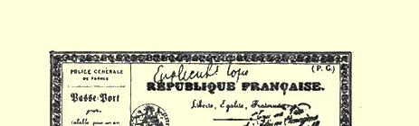
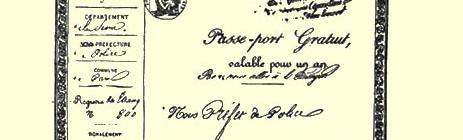
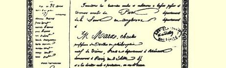
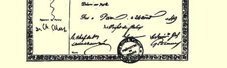

# 伦敦德国政治流亡者救济委员会的现款收据

> １８４９年１１月１３日

兹收到经蒂森先生从施特廷转来的十一英镑十四先令，仅以贫困的德国政治流亡者的名义对此表示感谢。

德国政治流亡者救济委员会

签名：**卡尔·马克思博士**，**亨利希·鲍威尔**，**卡尔**

#### ·普芬德

> １８４９年１１月１３日于**伦敦** 载于１８４９年１１月２３日《北德意志原文是德自由报》第２０８号
>
> 文

> 卡·马克思１８４９年８月２４日在法国领取的赴英国的护照