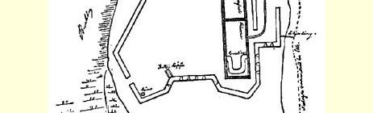
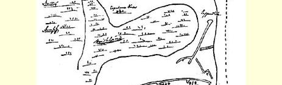

## 弗·恩格斯瑞典和丹麦旅游札记

> １

７月６日。九时。“英雄号” 停泊哈姆贝尔。十一时出海。凉爽的西微风，风速每小时十二公里，风力增大，午后起风暴，风向渐转南，晚上风力五级，长型船身剧烈摇摆，索尔斯比船长跌倒并折断一条肋骨，一位英国乘客摔得鼻青眼肿，主帆脱离下部滑轮。

７月７日。不能上甲板，船身剧烈摇摆；傍晚风终于减弱，当看到霍尔门灯塔的时候，我们已经能够上甲板了。海上逐渐平静。 但海浪时起时伏。

７月８日早晨七时到达文加，然后进入约塔河的岩岛群，四周是光秃的岩礁，一千步远处可看到冰川的影响。没有多远河流就变窄了，花岗山岩之间是一条绿色的河谷，再往前走，出现零星的树木，终于哥德堡在望。这个地方很美，但低矮而宽阔的房屋使它显得有些怪。

哥德堡本身是一座处于古瑞典风格包围之中的现代城市；市内一切都是石头建造的，而周围一切都是木头建造的。荷兰式的水道，街上有一股荷兰的臭气。瑞典人很象德国人，而不太象英国人，他们中间有外来的芬兰成分。一般妇女脸部颜色不好看，外表有些粗糙，但并不令人讨厌；男人则比较漂亮，但更象德国内地的庸人。所有四十几岁的人看上去都象巴登的庸人。

英语还通行，但德语占优势。到处都能看到贸易上和文化上对德国的依赖。火车站、公共建筑、私人住宅、别墅，全是德国式的，但为了适应当地气候，样式稍有不同。只有公园是英国式的，也是那样清洁，还有英国新哥特式的教堂。在所有的商店里都可以放心地讲德语，甚至在旅馆里也请求讲英语的人尽可能讲德语。

石竹花和山楂花盛开。一切都象在５月８日。到处是一种很漂亮的榆树小林，中间夹杂着白蜡树。一片翠绿，就象英国的春天一样。在小林之间光秃秃的花岗岩石到处可见。

虽然人们喝仿造的波尔图酒和雪莉酒，但是生活方式完全和大陆一样，而与英国不同。旅馆提供的一切：房间、早点、饭菜， 全都象大陆一样。饭馆和咖啡馆里也同样不分等级。夹肉面包 （ｓｍｏｒｂｒｏｄｓｂｏｒｄｅｎ）（２５欧耳）。

人中等身材，粗壮，有五英尺六英寸。骑炮兵（ｖａｒｆｖａｄｅ）的士兵身材较高。士兵和军官有点象瑞士的民兵。赫尔的水手象霍尔施坦和下萨克森的居民，象弗里西安人、盎格鲁人、丹麦人，而不象瑞典人。**当地的**瑞典人脸上没有精神，大多数人皮肤松弛、轮廓不清、肥胖臃肿，只有一些水兵有一副弗里西安人的面孔和健壮的体格。士兵看起来象威斯特伐利亚人，军官既不象士兵也不象军官。

人们照例可以看到，大陆上处处多么重视国民的保健和娱乐， 与贵族式的英国迥然不同。

有两个衣着讲究的英国人使人感到可笑，惹得所有的瑞典女人都看他们。

斯德哥尔摩之行。轮船的设备：尾舱是铺位，前舱是餐厅。伙食很好。冷盘加鲜奶油。甜食。内地人的面容特征更为明显，男人比较漂亮、结实、高大。妇女并不美，但和蔼可亲，身材高而又丰满。外表上越看越象黑林的居民，地主象提罗耳人和瑞士人 （施托伊布描写的提罗耳哥特人？）。同时，语音也非常象上德意志的，但没有喉音。

约塔河一带地方，一直到特罗尔海坦，很美丽，但不敞亮。四股瀑布一股在一股上面。山不高于６００—８００英尺，但是很雄伟。 其次，维纳恩湖和钦讷库勒山—— 平淡无奇。韦特恩湖也同样。卡尔斯堡的工事修建得不坏，是一条很长的防线，呈多角形；但这些工事是否会受到后面那座山的控制？湖是很美丽的，但是所有的湖都差不多。无边无际的罗汉松林，而且已遭受损害。在任何地方也看不到瑞士的美丽的繁茂的罗汉松。平常的罗汉松林。

穆塔拉河的河谷，又有一部分被开垦了，有些地方很美，如这条运河两岸栽着榆树和桦树的那些地方。

岩岛湖越接近斯德哥尔摩越是美丽。层系的变化—— 有的地方是石灰石，岩层风化得比较厉害，因此直接从大海升起的缓坡和高山草地较多。两个岛上有大理石岩。越接近斯德哥尔摩，岩岛就越高耸而美丽。迈拉伦湖沿岸非常漂亮，树林、田野和别墅相交替。

斯德哥尔摩的诺尔布鲁桥象日内瓦的贝格桥。莫塞巴肯非常壮观。从天文台放眼了望，景色优美。小汽艇可以开进动物园。美丽的公园。饭馆和咖啡馆很多。采用法国的经营方式：小吃，点菜，而不是份餐。斯德哥尔摩的居民通常在饭馆里就餐。到处都有烈性酒。啤酒比德国的好。酒类和食品都太甜。瑞典的麦酒 （ｋｏｒｇｅｒ）不坏。不过，不是太甜就是太酸。酒类—— 波尔多酒、烈性埃尔米塔日酒、掺了南法兰西酒的勃艮第酒—— 就餐的主要饮料。一般说来，家常饭菜同德国差不多，而与法国不同。

斯德哥尔摩有比较明显的首都特点，很少听到讲外国话，然而在所有商店里都讲德语。哥德堡的男性装束显然是英国式的，而这里法国装束占优势。有妇女在场时在饮酒方面表现出的伪善，儿童娱乐场、旋转木马游艺场、木偶戏院、走绳索和低劣的音乐。水上散步更是一种妙极了的“机关”。同时，也可以看到严肃的或者说伪善的路德派的民族特点：一般说来，对游艺场式的公共娱乐场所不能容忍。

士兵，甚至近卫军，都是散漫的，很象民兵，军官也是如此。 他们缺乏朝气。个子不太高，丝毫不象第６９部队的士兵。军服样子是折衷式的，皮革装具是落后的。哨兵闲聊。大胡子。马尔默的骠骑兵是重装的，作为基干骑兵—— 最漂亮的人。

铁路糟透了！打三次钟，鸣一次笛。不是五分钟，而是十五至二十分钟。小食堂是独户经营的，但很不错，全都卖一个里克斯达勒。景色很美，但经过两三个小时，由于看到的是同样的景色，最后就感到单调乏味了。湖泊很多，显然是冰川影响造成的。 河谷的土地多半是过去的海底或过去泥炭沼泽的底部。

为了完成外交的谈判２而派人去马尔默是个高明的手腕。

哥本哈根。从规模和生活方式来说确实比斯德哥尔摩更象个首都，但毕竟还是一个朴素的小城市。德意志人占绝对优势。甚至在街上也是如此。生气勃勃的孩子们，各种娱乐场所主要是为孩子设的。数以百计的旋转木马。连老人也变成了儿童。芭蕾舞、 马戏等等。甚至可以看到以折磨儿童为最大满足的儿童残忍心理的表现。游艺场很有自己独特的风格。

> 弗·恩格斯画的瑞典卡尔斯堡要塞平面图

哥本哈根到处都是美丽的树木。港湾入口很美。老式的战船 —— 这一切给人留下美好的印象。一切都带有剥削一百五十万农民的农民首都的明显印记。

> 弗·恩格斯写于１８６７年原文是德文 ７月６日至１８日之间第一次发表