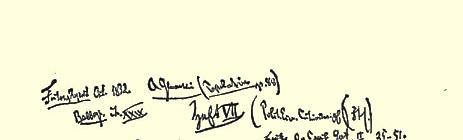
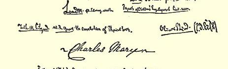
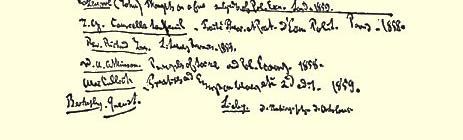

# ．货币章 ［（Ａ）蒲鲁东主义的“劳动货币”概念是站不住脚的。货币是产品的商品形式的发展的必然结果］

## ［（１）蒲鲁东主义者不了解生产、分配和流通之间的内在联系以及生产关系的首要作用］

［（ａ）**蒲鲁东主义者达里蒙的幻想**：**把货币流通和信贷错误地等同起来**，**并且夸大银行在调节货币市场中的作用**］

> ［—１］“一切弊病，都来自人们顽固地保持贵金属在流通和交换中的优势地位。”（**阿尔弗勒德·达里蒙**《论银行改革》１８５６年巴黎版第１—２页）

达里蒙开头就谈到１８５５年１０月法兰西银行为制止其现金不断减少而采取的措施（第２页）。他想给我们提供这家银行在１０月采取措施前的最后五个月中的状况的统计表。为此目的，他把这家银行这五个月中每个月的金银储备和“证券总存额的波动”即这家银行贴现的数量（在它的证券总存额中的商业证券即**汇票**的数量） 加以对比。按照达里蒙的说法，表明银行持有的证券的价值的数字，

> “代表公众所感到的对银行服务的或大或小的需要，**或者代表流通的需要**，**而这两者是一回事”**（第２页）。

两者是一回事吗？根本不是。如果银行待贴现的汇票的数量同“流通的需要”，即真正的**货币流通**的需要是一回事，那么，银行券的流通就应该由贴现汇票的数量所决定。但这种运动，平均说来，不仅不是平行的，而且往往是相反的。贴现汇票的数量及其变动，表明信贷的需要，而流通的货币的数量是由完全不同的影响决定的。如果真要得出关于流通的某种结论，达里蒙首先应当在“金银储备”栏和“贴现的汇票”栏之外，再加上“流通的银行券总额”栏。

实际上，要谈论流通的需要，首先应该弄清楚现实流通的变动。把对比中的这一必要环节略去，立即暴露出他一知半解，非常拙劣，并且故意把信贷的需要和货币流通的需要混淆起来，—— 蒲鲁东式的智慧的全部秘密事实上正是建立在这种混淆之上的。（死亡统计表的一方是疾病，另一方是死亡事件，而出生却被忘记了。）

达里蒙提出的两栏（见第３页），一方是４月至９月银行金属储备栏，另一方是银行证券总存额的变动栏，它们所反映的无非是并不需要用统计例证来说明的同义反复的事实：交到银行多少汇票，从银行取出多少金属，银行的证券总存额中就增添多少汇票， 银行的地库就失去多少金属。甚至连达里蒙想用他的表来证明的这种同义反复，在他的表中也不是表现得很清楚。这个表倒是表明，从１８５５年４月１２日至９月１３日，银行的金属储备大约减少 １４４００万法郎，而银行证券总存额中的证券，却大约增加１０８００ 万[^1]。因此，金属储备的减少额比所贴现的商业证券的增加额多 ３６００万。五个月运动的这个总结果表明，两种运动不是一回事。

> 《政治经济学批判》手稿第本封面

把数字更仔细地比较一下，我们就可以看到另外的不一致。

> 银行的金属储备   银行贴现的证券
>
> ４月１２日——４３２６１４７９７法郎４月１２日——３２２９０４３１３
>
> ５月１０日——４２０９１４０２８５月１０日——３１０７４４９２５

换句话说，从４月１２日至５月１０日，金属储备减少 １１７００７６９，而证券的数目增加[^2]１２１５９３８８；也就是说，证券的增加额[^3]比金属储备的减少额大约多５０万（４５８６１９法郎）。如果我们把 ５月同６月加以比较，那就会更令人吃惊地出现相反的事实：

> 银行的金属储备   银行贴现的证券
>
> ５月１０日——４２０９１４０２８５月１０日——３１０７４４９２５
>
> ６月１４日——４０７７６９８１３６月１４日——３１０３６９４３９

［—２］可见，从５月１０日至６月１４日，金属储备减少 １３１４４２１５法郎。银行的证券是不是以同样程度增加了呢？相反，在这期间，银行的证券减少３７５４８６法郎。因此，在这里，我们看见的不再是一方减少、另一方增加的单纯量上的不成比例，两种运动本身的反比例关系消失了。一方大幅度减少，而另一方相对来说减少较少。

> 银行的金属储备   银行贴现的证券
>
> ６月１４日——４０７７６９８１３６月１４日——３１０３６９４８９
>
> ７月１２日——３１４６２９６１４７月１２日——３８１６９９２５６

６月和７月的对比表明，金属储备减少９３１４０１９９，证券增加 ７１３２９８１７，也就是说，金属储备的减少额比证券总存额的增加额多 ２１８１０３８２法郎。

> 银行的金属储备   银行贴现的证券
>
> ７月１２日——３１４６２９６１４７月１２日——３８１６９９２５６
>
> ８月９日——３３８７８４４４４８月９日——４５８６８９６０５

我们看见双方都增加了，金属储备一方增加２４１５４８３０，证券总存额一方增加得更多，达７６９９０３４９法郎。

> 银行的金属储备   银行贴现的证券
>
> ８月９日——３３８７８４４４４８月９日——４５８６８９６０５
>
> ９月１３日——２８８６４５３３３９月１３日——４３１３９０５６２

在这里，金属储备减少５０１３９１１１法郎，同时证券减少 ２７２９９０４３法郎（尽管法兰西银行采取了限制措施，１８５５年１２月它的现金仍然减少２４００万）。

烧公鹅的调料，也是烧母鹅的调料。对五个月的连续对比得出的实际情况，同达里蒙先生对头尾两个月所作的对比得出的实际情况，是同样可信的。对比表明了什么？实际情况是错综复杂的。—— 有两次是证券总存额增加，同时金属储备减少，不过后者的减少额超过了前者的增加额（４月至５月和６月至７月）。有两次是金属储备减少，同时证券总存额减少，不过后者的减少额赶不上前者的减少额（５月至６月和８月至９月）。最后，有一次是金属储备增加，证券总存额也增加，不过前者赶不上后者［７月至８ 月］。

一方减少，另一方增加；双方都减少；双方都增加；因此，可以是各种情况，而恰好不是始终不变的规律，首先不是反比例的关系，也不是相互作用，因为证券总存额的减少不可能是金属储备减少的原因，而证券总存额的增加不可能是金属储备增加的原因。甚至连达里蒙对头尾两个月所作的孤立的对比，也不能证实反比例的关系和相互作用。既然证券总存额的增加额１０８００万不能弥补金属储备的减少额１４４００万，那就只存在着一种可能性，即一方的增加［—３］同另一方的减少之间根本没有因果联系。统计例证没有作出回答，倒是提出了大量错综复杂的问题，不再是一个谜，而是一大堆谜。

如果达里蒙先生除了他的金属储备栏和证券总存额（贴现的证券）栏之外，还提出“银行券流通”栏和“存款”栏，那么谜确实就会消失了。金属储备一方的减少额小于证券总存额的增加额［如果发生了这种情况］，这可以这样来说明：金属的储存同时增加了；或者一部分在贴现时发行的银行券没有换成金属，而仍然在流通中， 最后，或者是因为发行的银行券没有使通货增多，而立即以存款的形式或以支付到期汇票的形式流回。金属储备减少，同时证券总存额减少较少，则可以这样来说明：从银行取出了存款，或者人们拿银行券向银行兑换金属，于是银行自己的贴现业务受到取出的存款或兑现的银行券的所有者的损害。最后，金属储备减少较少，同时证券总存额减少更少，这也可以用同样的原因来说明（我们把为补偿国内的银币而发生的流出完全撇开，因为达里蒙没有把这一点包括在他的考察范围之内）。

但是，这些可以这样互相说明的各栏，也会证明他本来不想证明的东西，那就是：银行方面要满足日益增长的商业需要，并不一定要增加它的银行券的流通；这种流通的减少或增加并不与银行的金属储备的减少或增加相适应；银行不能控制流通手段的数量等等，—— 这样一些结果无论如何是不合达里蒙先生的心意的。由于他匆忙地大喊大叫地提出他的先入之见，即以银行的金属储备为代表的银行金属基础同他所谓的以证券总存额为代表的流通的需要之间的对立，所以他就列出这两栏而撇开了必要的补充，而这两栏这样孤立起来，就失去了任何意义，至多只证明事情和他的愿望是相反的。我们之所以谈论这件**事情**，是为了用一个例子来说明蒲鲁东派的统计的和实证的例证的全部价值。经济事实并没有验证他们的理论，而是证明他们不会掌握和利用事实。他们对待事实的方式倒是表明了他们的理论抽象是怎样产生的。

我们往下看达里蒙讲了些什么。

当法兰西银行看到它的金属储备减少１４４００万，它的证券总存额增加１０８００万的时候，就在１８５５年１０月４日和１８日对它的地库采取了保护措施，以免受证券总存额的影响。它接连地把贴现率从４％提高到５％，从５％提高到６％，并且把贴现的汇票的期限从９０天减少到７５天。换句话说，银行使商业取得金属的条件变得困难了。这证明了什么呢？

达里蒙说：“这证明了，一个按照现行原则组织起来的，即建立在金银的优势上的银行，正是在公众最需要它的服务的时候，逃避它对公众的服务。”（同上，第３页）

难道达里蒙先生还需要用他的数字来证明，需求向供给提出怎样程度的要求，供给就使它的服务按怎样的程度涨落？（并超过它）。在银行面前代表“公众”的先生们不是遵循同样的“令人愉快的生活习惯”３０吗？博爱的谷物商人把他们的汇票提交银行，以便取得银行券，用银行券换取银行的黄金，用银行的黄金换取外国的谷物，用外国的谷物换取法国公众的货币，难道他们的出发点是考虑到：因为公众现在最需要谷物，所以他们有义务在较便宜的条件下把谷物出让给公众吗？或者不如说，难道他们不是求助于银行， 以利用谷物价格的上涨，公众的急需，谷物的供求脱节而捞到好处吗？银行可以不受这个普遍的经济规律的支配吗？这是什么样的想法！

但是不妨假定现今的银行组织要求储存大量黄金，使那种在粮荒时可以按照对国民最有利的方式使用的购买手段处于闲置状态，使通常应该通过生产而盈利［—４］的资本成为非生产的和停滞的流通基础。因此，在这种情况下，问题在于，在现今的银行组织中，非生产的金属储备仍然超过它所必需的最低限额，因为流通中金银的节省还没有达到它的经济极限。这是同一基础上的量的多少问题。但是，问题就会从社会主义的高处降到资产阶级实践的平地上来，而我们发现，英国资产阶级中大多数的英格兰银行反对者也是在这个平地上绕来绕去。怎样的坠落啊！

或者问题不在于通过银行券和其他银行手段节省多少金属， 而在于完全抛弃金属基础？但这样一来，统计寓言及其寓意又都不适用了。如果银行不管在什么条件下，在急需时，都要把贵金属运往国外，那么，它必须预先积累贵金属，而如果要使外国接受贵金属以换出它的商品，那么，贵金属就必须已经确立了自己的统治地位。

达里蒙认为，贵金属从银行流出的原因是歉收，从而必须从国外进口粮食。他忘记了蚕丝减产，因而必须从中国大量购入蚕丝。 其次，达里蒙说，贵金属流出的原因，是在最近几个月的巴黎工业博览会３１期间进行了巨大的、为数众多的交易活动。他又忘记了动产信用公司３２及其竞争者在国外进行的巨大投机活动，它们进行这些投机活动，正如伊萨克·贝列拉所说，是要表明，法国资本比其他资本出色的地方是它的世界性，正如法国语言比其他语言出色的地方是它的世界性一样。此外还要加上东方战争３３引起的非生产开支：７５０００万公债。

因此，一方面是法国两个最重要的生产部门突然大减产！另一方面是在国外市场上，在那些根本不创造直接的等价物，其中一部分可能从来不能弥补自己的生产费用的企业中，不寻常地使用法国资本！一方面，为了通过进口来弥补国内生产的缩减，另一方面， 为了对付国外工业企业投资的增长，所需要的都不是用于等价物交换的流通符号，而是等价物本身，不是货币，而是资本。法国国内生产的缩减无论如何不是法国国外投资的等价物。

现在我们假定，法兰西银行不是建立在金属基础上，并且外国愿意接受任何形式的、而不只是贵金属这种特殊形式的法国等价物或法国资本。难道银行不正是在“公众”最急需它的服务的时候， 也被迫提高它的贴现条件吗？银行用来为公众的汇票进行贴现的银行券，现在无非是取得金银的凭证。而在我们的假设下，它们就会是取得国家的产品储备和直接可以利用的劳动力的凭证；产品储备是有限的，而劳动力只是在非常固定的范围内和在一定的时期内才能增加。另一方面，印刷纸币的机器是不会疲惫的，好象魔杖一挥就会转动。同时，当谷物和蚕茧歉收，使国家的可供直接交换的财富大大减少的时候，国外的铁路、矿山等企业却把国家的可供直接交换的财富固定在这样一种形式上，这种形式不创造直接的等价物，因而一时无偿地吞没了这种财富！因此，直接可供交换的、能够流通的、可以运到外国去的国家财富是绝对地减少了！另一方面，银行凭证是无限制地增加了。直接的结果是产品、原料和劳动的价格上涨。另一方面是银行凭证价格下跌。银行不能靠魔杖一挥使国家财富增加，而只会通过十分平常的活动使自己的纸币贬值。随着这种贬值而来的，是生产的突然停滞！

不是这样—— 蒲鲁东主义者叫道。我们的新的银行组织不会 ［—５］满足于这种消极的业绩：废除金属基础，而让其余一切仍旧是老样子。它会创造崭新的生产条件和交往条件，因而在崭新的前提下进行干预。难道现代银行的出现在当时不也使生产条件发生革命吗？如果没有银行实现的信贷的集中，没有银行创立的、与地租相对立的国债利息，从而没有与土地所有权相对立的金融，没有与地主相对立的金融家，—— 如果没有这一新的流通制度，难道会有现代大工业、股份企业等等，会有成千上万种流通券（它们既是现代工商业的产物，又是现代工商业活动的条件）吗？

在这里，我们涉及到基本问题，它同起点已经不再有联系。这个问题一般说来就是：是否能够通过改变流通工具—— 改变流通组织—— 而使现存的生产关系和与这些关系相适应的分配关系发生革命？进一步说就是：是否能够对流通进行这样的改造，而不触动现存的生产关系和建立在这些关系上的社会关系？如果流通的每一次这样的改造本身，又是以其他生产条件的改变和社会变革为前提的，那么，下面这种学说自然一开始就是站不住脚的，这种学说提出一套流通把戏，**以图**一方面避免这些改变的暴力性质，另一方面把这些改变本身不是当作改造流通的前提，而相反地是当作改造流通的逐步的结果。这一基本前提的荒谬足以证明，这种学说同样不了解生产关系、分配关系和流通关系之间的内部联系。

上述历史上的例证当然不可能具有决定性的意义，因为现代信用制度既是资本积聚的结果，又是资本积聚的原因，只构成资本积聚的一个要素，而财产的积聚既因流通的不够发达（如在古罗马）而加快，也因流通的易于进行而加快。

其次应该研究，或者不如说要提出普遍性的问题：货币的不同的文明形式—— 金属货币、纸币、信用货币、劳动货币（后者作为社会主义的形式）—— 能否达到对它们提出的要求，而又不消灭在货币范畴上表现出来的生产关系本身；另一方面，想通过一种关系的形式上的改变而摆脱这种关系的重要条件，这是否又是一个自行取消的要求？货币的不同形式可能更好地适应社会生产的不同阶段；一种货币形式可能消除另一种货币形式无法克服的缺点；但是，只要它们仍然是货币形式，只要货币仍然是重要的生产关系， 那么，任何货币形式都不可能消除货币关系固有的矛盾，而只能在这种或那种形式上代表这些矛盾。任何雇佣劳动的形式，即使一种形式能够消除另一种形式的缺点，也不能消除雇佣劳动本身的缺点。一种杠杆可能比另一种杠杆更能克服静止的物质的阻力。但是，每种杠杆都是建立在阻力起作用这一点上的。

关于流通同其余的生产关系的关系这个普遍性的问题当然只能在结束部分提出来。从一开始就值得怀疑的是，蒲鲁东及其同伙从来就没有直截了当地提出这个问题，而只是偶尔装腔作势地说几句。凡涉及到这个问题的地方，每次都应该密切注意。

从达里蒙的开头部分就可以看出，他把**货币流通和信贷**完全等同起来，这在经济学中是错误的。（附带指出，无息信贷无非是财产就是盗窃３４这一原理的虚伪的、市侩的、怯懦的形式。不是让工人从资本家那里**夺取**资本，而是让资本家不得不把资本**交给**工人。）这一点也需要回头再谈。

至于所讨论的题目本身，达里蒙只得出这样的结论：银行出卖信贷，就象商人出卖商品，工人出卖劳动一样，当需求与供给相比增加的时候，就卖得贵一些，也就是说，正当公众最需要银行的服务的时候，银行使公众难以得到它的服务。我们看到，不管银行发行可兑现的或不可兑现的银行券，它都必须这样做。

法兰西银行在１８５５年１０月的做法引起了一片“大喊大叫声” （同上，第４页），引起了银行和公众代言人之间的一场“大争吵”。 达里蒙总结了或者自以为总结了这次辩论。我们在这里只是顺便地看看他总结些什么，因为他的总结表明了论战双方的弱点，他们经常不断地离题，在外部原因上兜圈子。论战双方的每一方随时抛掉自己的武器，去寻找另外的武器。双方之所以交不了锋，不仅是因为他们经常调换战斗的武器，而且也因为他们刚在一个场地上相遇，立即又逃到另一个场地上去了。

（从１８０６年至１８５５年，法国的贴现率没有达到过６％；５０年来，贴现的商业汇票的最长期限始终是９０天。）

达里蒙让银行自我辩护时所带有的弱点，以及他自己的错误概念，从例如他的虚构的对话［—６］中的下列地方就可以看得很清楚：

银行的反对者说：

> “由于你的垄断，你成了信贷的分配者和调节者。当你严厉的时候，贴现业者不仅摹仿你，并且比你更严厉…… 由于你的一些措施，你已经使营业中断。”（同上，第５页）

银行回答说，并且是“谦恭地”回答说：

> “你认为，我该怎么办？—— 银行谦恭地说道…… —— 为了不受外国人的连累，我必须不受自己同胞的连累…… 首先我必须防止硬币的外流， 没有硬币我就什么也不是，什么也做不了。”（同上，第５页）

银行被说得荒谬可笑。让它离开问题，发表一些空洞的议论， 以便人们有可能也用空洞的议论来回答它。在这一对话中，银行也抱有达里蒙的幻想：银行由于自己的垄断确实调节着信贷。实际上，银行的权力只是在私人“贴现业者”的权力终止的地方才开始， 也就是说，在它的权力本身已经受到极大限制的时候才开始。在货币市场松动、每人都按２１２％进行贴现时，让银行仍然按５％贴现，这时，贴现业者就不会摹仿它，而会把一切贴现业务从它鼻子底下夺走。１８４４年法律３５实行以来的英格兰银行的历史就再清楚不过地说明了这一点。这个法律使英格兰银行在贴现业务等等方面成为私人银行家的真正对手。英格兰银行为了在货币市场松动时期保证自己在贴现业务方面占有一定的，并且是日益增多的份额，经常被迫降低贴现率，不仅降低到私人银行家的水平，而且往往更低。因此，它的“对信贷的调节”应该有保留地来理解，而达里蒙却把自己关于银行无条件地控制货币市场和信贷的偏见当作出发点。

达里蒙不是批判地研究银行对货币市场拥有的真正权力的条件，而是一口咬定这样一句话：硬币对于银行说来就是一切，银行必须防止硬币流往国外。法兰西学院３６的一位教授（舍伐利埃）回答说：

> “金银是同其他一切商品一样的商品…… 银行的金属储备之所以需要，只是为了在紧急时期把它运往国外去买东西。”

银行回答说：

> “金属货币不是同其他商品一样的商品，而是交换工具，由于这一称号， 它享有为其他一切商品规定法律的特权。”

在这里，达里蒙突然在斗争双方之间出现：

> “因此，不仅现今的危机，而且周期性的商业危机，都应该归因于金银享有的这种特权，即唯有金银才成为真正的流通工具和交换工具。”

为了防止危机造成的种种不愉快，

> “只要做到下面这一点就够了：金银成为同其他商品一样的商品，或者， 准确地说，一切商品都和金银一样有资格（由于同样的称号）成为交换工具； 产品确实是同产品交换”（同上，第５—７页）。

在这里，把争论的问题说得多么平淡。既然银行发行货币凭证 （银行券）和要用金（或银）偿还的资本债券（存款），那么，不言而喻，银行对金属储备的减少只能在一定程度内听之任之，不予理会。上述论调同金属货币理论毫无关系。达里蒙的危机理论我们以后还要谈到。

在《**流通危机简史**》[^4]一章中，达里蒙先生略而不谈１８０９— １８１１年英国的危机，仅仅在谈到１８１０年时，指出任命金条委员会，在谈到１８１１年时，又略去了真正的危机（１８０９年开始），而只提到两点：一是下院通过的决议指出：

> “银行券同金银条块相比的贬值，不是由纸币的贬值引起的，而是由金银条块的腾贵引起的”；

二是持相反论断的李嘉图的小册子３７，他认为从李嘉图的论断中应得出如下结论：

> “最完善的形态的货币是纸币。”（**阿·达里蒙《**论银行改革》１８５６年巴黎版第２２—２３页）

在这里，１８０９—１８１１年的危机是重要的，因为银行当时发行的是不可兑现的银行券，可见，危机决不可能是从银行券可以兑换成金（金属）而产生的，因此，也决不可能通过废除这种兑换来加以防止。达里蒙用巧妙的裁剪手法避开了这些与他的危机理论相违背的事实。他紧紧地抓住李嘉图［关于纸币的优越性］的格言，虽然这与探讨的问题和李嘉图研究银行券贬值的小册子中的问题毫无关系。他忽略了李嘉图的货币理论及其错误的前提已经完全被推翻了。这种理论的错误前提是认为银行控制流通的银行券的数量， 流通手段的数量决定价格，而实际情况正好相反，是价格决定流通手段的数量等等。在李嘉图时代，对货币流通现象还没有作任何详细的研究。这一点顺便提一下。

#### ［（ｂ）用金银的特权地位错误地解释危机。 关于银行券兑换金银的问题。对银行和货币进行改革不可能使资产阶级生产关系发生革命］

金银是同其他商品一样的商品。金银不是同其他商品一样的商品：作为一般交换工具，金银是享有特权的商品，并且正是由于这种特权，金银使其他商品降了级。这就是达里蒙对这种对立所作的最终分析。达里蒙最后做出判决：你们要废除金银的特权，把它们降到其他一切商品的等级。其次，你们不要消除金银货币的特有的弊病，或者说不要消除可以兑换成金银的银行券的特有的弊病。 你们要废除一切弊病。或者，不如说，你们要把一切商品提高到现在只有金银才具有的垄断地位。你们要保留教皇，但是要使每个人都成为教皇。你们要废除货币，办法是把每个商品都变成货币，并且赋予它以货币的特性。

在这里，不禁要问，这个问题是否反映了它本身的不合理性， 因而，任务所提出的条件本身已经包含着这个问题不可能得到解决。回答往往只能是对问题的批判，而问题往往只能［—７］由对问题本身的否定来解决。

真正的问题是：资产阶级交换制度本身是否需要一个特别的交换工具？它是否必然会造成一个一切价值的特殊等价物？这种交换工具的或这种等价物的一种形式可以比其他形式更方便、更合适、更少一些困难。但是，一种特殊的交换工具，一种特殊的然而又是一般的等价物的存在所产生的困难，必然会在任何一种形式中（虽然各不相同）重复产生。当然，达里蒙竭力回避这个问题本身。你们要废除货币而又不要废除货币！你们要废除金银作为货币这种排他物而具有的排他的特权，但是你们又要把一切商品变成货币，也就是说，你们要使一切商品都具有这种离开排他性就不再存在的性质。

在贵金属的外流中确实出现了矛盾，达里蒙对这一矛盾的理解以及克服办法、是同样肤浅的。显然，金银不是同其他商品一样的商品，而现代经济学突然惊恐地看到，它竟不时一再地回到重商主义体系的偏见上去。英国经济学家企图通过某种区分来克服困难。他们说，在发生这种货币危机的时候，所需要的不是作为货币的金银，不是作为铸币的金银，而是作为资本的金银。他们忘记加上一句：资本，但是是在一定的金银形式上的资本。如果任何形式上的资本都能够输出，那么，为什么输出的恰恰是这种商品，而大多数其他商品却由于输出不足而跌价呢？

我们举一定的例子来说：贵金属外流是由于国内某种主要食物（例如谷物）歉收，是由于某种进口的主要消费品（例如茶叶）在国外歉收并因而涨价引起的；贵金属外流是由于具有决定意义的工业原料（棉花、羊毛、丝、亚麻）歉收引起的；贵金属外流是由于进口过剩（因投机、战争等等）引起的。在国内歉收的情况下，对（谷物、茶叶、棉花、亚麻等）突然的或长期的减产进行补偿，给国民带来双重的损害。国民所投的资本的或劳动的一部分不能再生产出来—— 这是生产的真正缩减。为了填补这一亏空，必须用掉再生产出来的资本的一部分，而且这一部分同减产量并不是形成简单的算术比例，这是因为，由于供给减少，需求增大，欠缺的产品在世界市场上的价格会上涨，而且必然上涨。

必须仔细地研究，如果抛开货币不说，这类危机是怎样的情形，而在这里既定的关系内，货币带来了什么样的规定性。（**谷物歉收**和**进口过剩**是主要的场合。战争是不言而喻的，因为直接从经济上来看，这就象一个国家把自己的一部分资本扔到水中一样。）

**谷物歉收的场合**。把该国同另一个国家加以比较，那就很清楚，它的资本（不仅是它的实际财富）减少了，这就象一个农民把做面包的生面团烧掉了，他不得不向面包师购买，于是他用于购买的金额就减少了。至于国内，看来，谷物价格的上涨，就价值来说，使一切保持原状（撇开下面这一点不说：在真正歉收的情况下，减少了的谷物数量乘以上涨的价格，决不等于正常的谷物数量乘以较低的价格）。

假定英国只生产１夸特小麦，而这１夸特小麦的价格等于以前３０００万夸特小麦的价格。在这种情况下，撇开国家缺少再生产生命和谷物的手段不说，如果我们假定再生产１夸特小麦所需要的工作日为ａ，那么，国家就要以ａ×３０００万工作日（生产费用３８） 来交换ａ×１工作日（产品）；它的资本的生产力就会减小到原来的几千万分之一，而国内拥有的价值总额就会减少，因为每个工作日就会贬值到原来的三千万分之一。每一份资本现在只代表自己以前价值的、自己的等价物即生产费用的３０００００００，虽然在上述场合１ 国民资本的名义价值并未减少（把土地的跌价撇开不说），因为其余产品的价值的减少正好由１夸特小麦的价值的增加所补偿。小麦价格提高到３０００万倍就是其余一切产品以同样程度跌价的表现。

此外，本国和外国的这种区别是完全虚妄的。一个国家，谷物遭到歉收，向外国购买谷物，这个国家同外国的关系，和这个国家的每一个人同租地农场主或谷物商人的关系是一样的。个人必须用于购买谷物的追加数额，是他的资本即他所持有的资金的直接减少。

为了使问题不致被一些不重要的影响搞混，应该假定歉收国家实行粮食的自由买卖。即使输入的谷物象自己生产的谷物一样便宜，该国仍然由于租地农场主没有再生产出来的那部分资本而遭到损失。但是，在我们所作的假定下，该国进口的外国谷物的数量总是等于正常价格下可能进口的数量。因此，进口的增长是以价格上涨为前提的。

谷物价格的上涨等于其余一切商品价格的下跌。一夸特谷物生产费用（表现为价格）的提高，等于在其他一切形式上存在的资本的生产率的降低。用于购买谷物的数额增加了，对其他一切产品的购买必然相应减少，因而这些产品的价格必然相应降低。不管金属货币或其他任何货币是否存在，国家会处于危机之中，这场危机不仅涉及谷物，而且涉及其他一切生产部门，这不仅因为它们的生产率确实降低了，它们的产品的价格同正常生产费用所决定的价值相比下降了，而且也因为一切契约、债务等等都是以产品的平均价格为基础的。举例来说，必须提供ｘ舍费耳谷物来支付国债，而这ｘ舍费耳的生产费用按一定的比例增加了。

因此，完全不管货币的情况是怎样的［—８］，国家会处于普遍危机之中。不仅撇开货币，甚至撇开产品的交换价值不说，产品仍会贬值，国家的生产率仍会下降，而国家的一切经济关系是以它的劳动的某种平均生产率为基础的。

因此，谷物歉收引起的危机决不是由贵金属外流造成的，虽然为制止这种外流而设置的障碍可以加剧这种危机。

无论如何也不能附和蒲鲁东的说法，即认为危机之所以产生， 是由于只有贵金属才同其他商品相对立而具有真实的价值；这是因为，仔细考察一下，谷物价格的上涨只不过意味着必须拿出更多的金银来交换一定数量的谷物，也就是说，金银的价格同谷物的价格相比下跌了。因此，金银和其他一切商品一样，同谷物相比贬值了，任何特权都不能使金银避免这一点。金银同谷物相比的贬值和谷物价格的上涨是一回事。｛这并不完全正确。例如一夸特谷物从 ５０先令上涨到１００先令，也就是上涨１００％，但是棉织品下降 ８０％。这样，银同谷物相比只下降５０％，而棉织品（由于需求减少等等）同银相比下降了８０％。也就是说，其他一切商品价格的下跌，超过谷物价格的上涨。但是，也有相反的情况。例如，最近若干年，谷物价格一度上涨１００％，而工业品价格并不是按照金同谷物相比下跌的程度下跌。这种情况并不直接影响一般原理。｝也不能说，金享有特权，是由于金作为铸币，它的量是准确规定的和可靠的。一塔勒（银）在任何情况下都是一塔勒。同样，一舍费耳小麦就是一舍费耳，一码麻布就是一码。

因此，在谷物严重歉收的情况下，大多数商品（包括劳动）的跌价以及由此产生的危机，不能幼稚地归咎于金的输出，因为即使本国的金根本不输出，外国谷物根本不输入，跌价和危机还是会发生的。危机只是归结于供求规律，大家知道，这一规律在生活必需品领域内（从全国范围来看）所起的作用，比在其他一切领域内所起的作用，要强烈和有力得不可比拟。金的输出不是谷物危机的原因，而谷物危机却是金的输出的原因。

如果就金银本身来考察，那么可以断言，它们只是在两个方面影响危机，使危机的症状更加恶化：（１）金的输出因银行受金属准备的约束而变得困难；银行因而针对这种金的输出所采取的措施对国内流通产生不利的反作用；（２）金的输出是必不可少的，因为外国只愿意以金的形式而不是以任何其他形式得到资本。

即使第一点困难得到克服，第二点困难可能仍然存在。英格兰银行正是当它在法律上有权发行不可兑现的银行券的时期经历这种困难的。银行券同金条相比贬值了，而金的造币局价格同金条价格相比也下跌了。对银行券来说，金成了特种商品。可以说，就银行券名义上代表一定数量的金来说，银行券还依赖于金，而实际上用银行券是不能换回金的。金仍然是银行券的名称，虽然在法律上银行券已经不再能够向银行换回这一数量的金。

只要纸币从金得到名称（也就是说，例如５镑银行券是５索维林的纸代表），对银行券说来，银行券可兑换为金就仍然是经济规律，不管这一规律**在政策上**是否存在，这是不容置疑的（？）（这要在以后来考察，并且不直接属于所研究的问题）。英格兰银行的银行券在１７９９—１８１９年时期３９还继续声称，它们代表一定数量的金的价值。除了通过银行券实际上支配多少金条这个事实之外，还能通过其他办法来检验这种声明吗？从５镑银行券不再能够得到等于 ５索维林的金条价值的时刻起，银行券就贬值了，虽然它是不能兑现的。银行券的名称所表明的银行券价值和一定数量的金的价值相等，立即同银行券和金的实际上的不相等发生矛盾。

因此，坚持把金当作银行券的名称的英国人中间的争论焦点， 实际上不是银行券兑换为金的问题，—— 这种兑现只不过是把银行券的名称在理论上所表明的那种相等，从实践上表示出来，—— 而是怎样保证这种兑现的问题，是通过在法律上对银行作出的限制来保证这种兑现呢，还是让这种兑现放任自流呢？持后一种看法的人断言，发行银行凭票据发放贷款，因而它的银行券保证能够流回，这种兑现平均说来是有保证的，而他们的反对者反正从来没有提供比这个平均保证更多的东西。后一情况是事实。顺便说一下， 这种平均是不容忽视的，并且平均计算既应该成为银行的基础，也应该成为一切保险机构等等的基础。站在这方面的，首先是苏格兰的各银行，它们理所当然地被当作典范。

严格的金条主义者则说：他们是认真对待［—９］兑现的；这种兑现的必要性是由银行券本身的名称造成的；银行负有兑现的义务，就使银行券始终成为可兑现的，这是对过量发行的限制；他们的反对者是不可兑现论的虚假的维护者。在这两派之间，有各种不同色彩的小派别，有很多小的“品种”。

最后，不可兑现论的辩护者，坚定的反金条主义者，自己不知道他们只是不可兑现论的虚假的拥护者，正如他们的反对者只是可兑现论的虚假的拥护者一样，因为反金条主义者保留银行券的名称，也就是把一定名称的银行券同一定金量的实际相等当作自己的银行券的十足价值的尺度。

在普鲁士存在着强制流通的纸币。（由于一定数量的税必须以纸币支付，就此而言，纸币的流回是有保证的。）这些纸塔勒不是支取银的凭证，根据法律它们不能向任何银行换取银等等。它们不是由商业银行凭票据而贷出的，而是政府为了支付自己的费用发出的。但是，它们的名称就是银的名称。一个纸塔勒声称它代表和一个银塔勒同样的价值。如果对政府的信任发生根本的动摇，或者这种纸币的发行量超过了流通的需要所要求的数量，那么，在实践中纸塔勒就不再与银塔勒处于同等地位，就会贬值，因为它会低于它的名称所表示的价值。即使没有发生上述情况，如果产生了对银的特别需要，例如，要输出银，使银与纸塔勒相比拥有特权，那么，纸塔勒也会贬值。

因此，可兑换为金银成了以金银命名的任何纸币的实际价值尺度，不管这种纸币在法律上是否可以兑现。名义价值只是象影子那样跟随着它的实体，两者是否一致，那要由它们的实际可兑现性 （可交换性）来证明。实际价值降低到名义价值以下就是贬值。实际的平行运动，互相交换，就是兑现。就不可兑现银行券来说，可兑现性不是表现在银行的出纳上，而是表现在具有金属货币名称的纸币和金属货币之间的日常交换上。实际上，如果不是通过在全国各地的日常交易，而是通过在银行出纳处进行特别的、巨大的试验来确认可兑现银行券的可兑现性，那么，这种兑现就是很危险的了。

在苏格兰，纸币在农村中甚至比金属货币更受欢迎。苏格兰在 １８４５年以前，也就是在英国１８４４年的法令４０强加于它以前，自然经历了英国的一切社会危机，而某些危机甚至更加厉害，因为“清扫”土地４１在这里进行得更加肆无忌惮。但是，苏格兰并没有发生真正的货币危机（某些银行由于轻率地提供贷款而破产，这是例外情形，和这里的问题无关）；没有银行券贬值，没有抱怨，没有对于流通的货币的数量是否够用的研究等等。

在这里，苏格兰之所以重要，是因为它一方面表明在现存基础上可以怎样充分调节货币制度—— 消除达里蒙所抱怨的一切弊病 —— 而不屏弃现存的社会基础；与此同时，这个社会基础的矛盾、 对抗、阶级对立等等比世界上任何其他国家都更为尖锐。

足以说明问题的是，达里蒙和他的保护者，那位为他的书写序的艾米尔·日拉丹—— 他以理论上的空想来补充前者实践上的欺骗—— 不是在苏格兰去发现同英格兰银行和法兰西银行这类垄断银行相对立的东西，而是在美国去寻找这种相对立的东西，而在美国，由于要得到各州的特许，银行制度只在名义上是自由的，那里没有银行的自由竞争，只存在着垄断银行的联邦制度。

确实，苏格兰的银行制度和货币制度是流通魔术师的幻想所碰到的最危险的暗礁。尽管金币或银币（在没有法律规定的复本位制的地方）对其他一切商品的相对价值经常发生变化，但人们不说金币和银币贬值了。为什么不说呢？因为它们就是它们自己的名称，因为它们的名称不是一种价值的名称，也就是说，它们不是以某一第三种商品来估价，而只是表示自身物质的一部分，即一索维林等于若干金量的若干量。

因此，金在名义上是不可能贬值的，这不是因为只有金才表现 **真正的价值**，而是因为金作为货币所表现的**根本不是价值**，而是自身物质的一定量，它在自己额头上标明的，是自己的量的规定性。 （以后应当更详细地研究，金币和银币的这种特征归根到底是不是一切货币的内在属性。）

达里蒙及其同伙被金属货币的这种名义上的不可贬值性所迷惑，只看到在危机中表现出来的一个方面：金银同几乎所有其他商品相比升值了；他们没有看到另一个方面：在所谓的**繁荣**时期，即价格暂时普遍上涨的时期，金银或者**货币**同其他一切商品（劳动也许除外，但并非总是如此）相比**贬值**了。由于金属货币（以及以它为基础的一切种类的货币）的这种贬值总是先于它的升值，他们本来应该按相反的方式提出自己的问题：要预防货币的周期重复的贬值（用他们的话来说，就是废除商品对货币的特权）。采用后一种说法，任务立即归结为消除价格的涨落。这就要消灭价格。这样就要废除交换价值。为此就要废除与资产阶级社会组织［—１０］相适应的交换。要做到这一点，就要在经济上对资产阶级社会实行革命。可见，一开始本来就可以看到，资产阶级社会的弊病不是通过 “改造”银行或建立合理的“货币制度”所能消除的。

### ［（２）蒲鲁东的流通理论同他的错误的价值理论的联系。货币的产生是交换发展的必然结果］

#### ［（ａ）蒲鲁东主义者的幻想：通过实行“劳动货币” 能够消除资产阶级社会的弊病］

##### ［（α）“劳动货币”同劳动生产率的提高不相容］

可见，可兑现性—— 法定的或不是法定的—— 始终是对一切这样的货币所提出的要求，这种货币的名称使它成为一个价值符号，也就是说，使它和一定量的第三种商品等同。等同已经包含了对立面—— 可能的不等同；可兑现性包含了它的对立面—— 不可兑现性；升值包含了贬值，如果用亚里士多德的话来说，就是潜在地包含了。

例如，假定索维林不仅叫作索维林，—— 这只是一盎司金的若干等分的尊称（计算名称），正如米是一定长度的名称一样，—— 而且它还例如叫作“**ｘ小时劳动时间**”。事实上，一盎司金的上述等分无非是物化的即对象化的ｘ小时劳动时间。但是，金是过去的劳动时间，是一定量的劳动时间。它的名称“ｘ小时劳动时间”使一定量劳动成为它的标准。一磅金必须可以兑换ｘ小时劳动时间，必须能够随时购买这些时间：一旦它能够购买的时间多了或少了，它就是升值或贬值了；在后一情况下，它的可兑现性就消失了。

决定价值的，不是体现在产品中的劳动时间，而是现在所需要的劳动时间。我们就拿一磅金本身来说：假定它是２０小时劳动时间的产品。假定后来由于某些情况，生产一磅金只需要１０小时。一磅金的名称表明它原来＝２０小时劳动时间，现在它只＝１０小时劳动时间，因为２０小时劳动时间＝２磅金。１０小时劳动实际上交换一磅金；也就是说，一磅金不能再交换２０劳动小时。

具有“**ｘ劳动小时**”这个平民名称的金币发生的变动，会大于任何其他货币，特别是大于现在的金币；因为金和金相比是不能提高或降低的（它和它本身相等），但是，一定量金包含的过去的劳动时间同现在的活劳动时间相比，必定不断地提高或降低。要使它保持可以兑现，就必须使劳动小时的生产率保持不变。但一般经济规律是，生产费用不断地降低，活劳动的生产率不断地提高，因而物化在产品中的劳动时间不断地贬值，因此，不断贬值将是这种金劳动货币不可避免的命运。要防止这种弊病，人们也许会说，不应该由金来获得劳动小时的名称，正如魏特林—— 在他之前有英国人， 在他以后有法国人，其中包括蒲鲁东之流—— 所主张的那样４２，应该由纸币，单纯的价值符号来获得这个名称。在这里，体现在纸本身中的劳动时间，和银行券的纸的价值一样，是微不足道的。纸券将纯粹是劳动小时的代表，正如银行券纯粹是金或银的代表一样。 如果劳动小时的生产率提高了，代表劳动小时的纸券的购买力就会提高，反之亦然；正如现在一张５镑银行券会由于金同其他商品相比的相对价值的提高或降低而买到较多或较少的东西一样。

根据会使金劳动货币不断贬值的同一规律，纸劳动货币会不断地升值。社会主义者会说，这正是我们所希望的：工人从自己劳动生产率的提高中会得到快乐，而不象现在他随着劳动生产率的提高创造别人的财富，造成自身的贬值。社会主义者就是这样说的。可是，不幸，这里产生了一些小小的疑问。

首先：如果我们假定存在着货币，即使这只是小时券，那么我们也必须假定存在着这种货币的积累，存在着以这种货币形式订立的契约、债务和固定负担等等。积累的纸券和新发行的纸券一样，会不断地升值，因此，一方面，劳动生产率的增长使非劳动者得到好处，另一方面，以前缔约的债务负担随着劳动生产率的增长而在同一程度上加重。如果世界随时可以重新开始，如果已订立的要用一定量金来偿付的债务没有持续到金价值发生变动的时刻，那么，金价值或银价值的降低或提高就是完全无关紧要的。在这里， 小时券和小时生产率的情况也是这样。

这里应该研究的是小时券的兑现问题。我们通过迂回的道路， 也会达到同一目的。虽然为时过早，但还是可以谈一谈作为小时券依据的那些幻想，这些幻想使我们能够看到把蒲鲁东的流通理论和他的一般理论—— 他的价值决定［—１１］理论—— 联系起来的最深奥的秘密。例如在布雷和格雷那里，我们也能找到同样的联系。其中是否有正确的东西作为根据，我们后面再去研究（先可以顺便指出：如果银行券单纯被看作金的支取凭证，那么，它要不贬值，它的发行量就不能超过它所要代替的金币量。如果我凭同一 １５镑的金，向三个不同的债权人开出三张１５镑的支取凭证，那么，事实上每一张只是１５３镑即５镑的支取凭证。因此，每一张银行券从一开始就贬值到３３１

３％）。

##### ［（β）“劳动货币”同商品价值和商品价格之间的实际差别不相容］

一切商品（包括劳动在内）的**价值**（实际交换价值），决定于它们的生产费用，换句话说，决定于制造它们所需要的劳动时间。**价格**就是这种用货币来表现的商品交换价值。因此，用劳动货币（它的名称取自劳动时间本身）代替金属货币（以及以它取名的纸币或信用货币），就会把商品的**实际价值**（交换价值）和商品的**名义价值**、**价格**、**货币价值**等同起来。**实际价值和名义价值**等同，**价值和价格**等同。但是，要达到这一点，前提只能是：**价值**和**价格**只是**名义上** 不同。可是，情况完全不是这样。由劳动时间决定的商品价值，只是商品的**平均价值**。只要平均数是作为一个时期的平均数计算出来的，例如，按二十五年的咖啡价格平均计算，一磅咖啡值一先令， 那么平均数就表现为外在的抽象；但是，如果承认平均数同时又是商品价格在一定时期内所经历的波动的推动力和运动原则，那么平均数就是十分现实的。

这种现实性不只是具有理论上的重要意义：它是商业投机的基础，因为商业投机在计算各种可能性时，既要考虑到它当作价格波动中心的中等平均价格，也要考虑到价格围绕这个中心上下波动的平均幅度。商品的**市场价值**总是不同于商品的这个平均价值， 总是高于或低于它。

市场价值平均化为实际价值，是由于它经常波动，决不是由于和实际价值这个第三物相等，而是由于和它自身经常不相等（要是黑格尔的话，就会这样说：不是由于抽象的同一，而是由于经常的否定的否定，也就是说，是由于它自身作为实际价值的否定的否定）。而实际价值本身—— 不以它对市场价格波动的支配为转移 （撇开它是这些波动的**规律**不说）—— 又否定自己，使商品的实际价值经常和它自身的规定发生矛盾，使现有商品的实际价值贬值或升值—— 这一点我在我那本驳斥蒲鲁东的小册子４３中已经指出来了，在这里不需要详细论述。

因此，**价格**和**价值**的差别不只是名和实的差别；不只是由于以金和银为名称，而是由于价值是作为价格运动的规律而出现。但是它们始终是不同的，从来不一致，或者只是在完全偶然和例外的情况下才一致。商品价格不断高于或低于商品价值，商品价值本身只存在于商品价格的上涨和下跌之中。供求不断决定商品价格；供求从来不一致，或者只是在偶然的情况下才一致；而生产费用又决定供求的波动。

表现商品价格的，表现商品市场价值的金或银本身，是一定量的积累劳动，是一定量的物化劳动时间。假定商品的生产费用和金银的生产费用都保持不变，商品市场价格的上涨或下跌就无非表示，一个等于ｘ劳动时间的商品，在市场上总是支配着大于或小于 ｘ的劳动时间，总是高于或低于由劳动时间决定的这一商品的平均价值。

主张实行小时券的人的第一个基本错觉在于：他们以为只要消除实际价值和市场价值之间，交换价值和价格之间**名义上的差别**，—— 也就是说，不用劳动时间的一定物化，比如说金和银，而用劳动时间本身来表现价值，—— 同时也就消除了价格和价值之间的实际差别和矛盾。这样说来，不言而喻，单是实行小时券，就把资产阶级生产的一切危机，一切弊病都消除了。商品的货币价格＝商品的实际价值；需求＝供给；生产＝消费；既废除货币，又保存货币；只要确认生产商品并物化在商品中的劳动时间，就能够产生一个和这种劳动时间相当的摹本，后者表现为一种价值符号，货币， 表现为小时券。这样一来，每个商品直接转化为货币，而金和银则下降到其他一切商品的等级。

没有必要详细地说明，交换价值和价格之间—— 平均价格和价格（它的平均数是平均价格）之间的矛盾，一定量和其平均量之间的差别，［—１２］是不会由于下面这种办法而消除的：消除这两者的单纯**名称的不同**，也就是说，不说１磅面包值８便士，而说１ 磅面包＝ｘ劳动小时。相反地，如果８便士＝ｘ劳动小时，如果物

１１ 化在１磅面包中的劳动时间多于或少于ｘ劳动小时，那么，由于价

１ 值尺度同时又是表现价格的要素，价值和价格之间的差别会明显地表现出来，而这种差别在金价格或银价格中被掩盖了。结果得到一个无限的等式。（包含在８便士中或通过一张纸券表现出来的） １１ ｘ劳动小时大于或小于（包含在１磅面包中的）ｘ劳动小时。

代表**平均劳动时间**的小时券决不会和**实际劳动时间**一致，也决不能和它兑换；也就是说，物化在一个商品中的劳动时间，所能支配的决不是和它本身等量的劳动货币（反之亦然），而是较多或较少的劳动货币，正如现在市场价值的任何波动都表现为其余价格和银价格的提高或降低。

我们在前面已经讲过[^5]，商品同小时券相比—— 在一个较长时期内—— 的不断贬值，产生于劳动时间的生产率不断提高的规律，产生于相对价值本身的混乱，这种混乱是由相对价值固有的原则即劳动时间所造成的。我们现在说的小时券不可兑换无非是实际价值和市场价值之间，交换价值和价格之间不可兑换的另一种说法。小时券和一切商品相反，代表一个观念上的劳动时间，这个劳动时间有时交换较多的实际劳动时间，有时交换较少的实际劳动时间，并且在纸券上取得了一种和这一实际不等相适应的、独立的、特有的存在。商品的一般等价物，流通手段和尺度，又作为个体化的、遵循自身规律的、异化的东西和商品相对立，也就是说，具有现在的货币的一切属性，而不提供这种货币的服务。但是，由于比较各商品即各物化劳动时间量所用的手段，不是一个第三种商品， 而是这些商品本身的价值尺度即劳动时间本身，所以混乱就更严重了。

商品ａ，３小时劳动时间的物化＝２劳动小时券；商品ｂ，也是 ３劳动小时的物化＝４劳动小时券。这个矛盾事实上已表现在货币价格中，只是隐蔽地表现罢了。价格和价值之间的差别，用生产商品本身所耗费的劳动时间来衡量的商品和这个商品要换取的劳动时间的产品之间的差别，需要有一个第三种商品来充当表现商品的实际交换价值的尺度。**由于价格不等于价值**，**所以决定价值的要素—— 劳动时间—— 就不可能是表现价格的要素**，**这是因为**，**不然的话劳动时间就会同时是决定者**，**又不是决定者**，**和自身相等**，**又和自身不相等**。因为劳动时间作为价值尺度，只是观念地存在，所以它不能充当对价格进行比较的材料。（在这里，同时弄清楚了，价值关系是怎样和为什么在货币上取得了物质的、独立的存在。这一点在后面再详细论述。）价格和价值的差别，要求以另外的尺度而不是以价值本身去衡量作为价格的价值。和价值不同，价格必须是 **货币价格**。由此可见，价格和价值之间**名义上的**差别，是由它们**实际上的**差别决定的。

#### ［（ｂ）在交换过程中产品转化为商品， 商品价值转化为货币］

商品ａ＝１先令（即＝ｘ银）；商品ｂ＝２先令（即ｘ银）。因此，

１２ 商品ｂ＝商品ａ的价值的两倍。ａ和ｂ之间的价值比例得到表现， 是通过它们按什么比例交换一定量第三种商品银，而不是通过它们按什么比例交换一个价值比例。

每一个商品（产品或生产工具）都等于一定劳动时间的物化。 它的价值，即它交换其他商品或其他商品交换它的比例，等于在它身上实现的劳动时间量。例如，如果一个商品＝１小时劳动时间， 那么，它就可以同作为１小时劳动时间产品的其他一切商品相交换。（整个这一论断的前提是，交换价值＝市场价值，实际价值＝价格。）

商品的价值和商品本身不同。商品仅仅在交换（实际的或想象的）中才是价值（交换价值）：价值不仅是商品的一般交换能力，而且是它的特有的可交换性。价值同时是一种商品交换其他商品的比例的指数，是这种商品在生产中已经换到其他商品（物化劳动时间）的比例的指数；价值是量上一定的［—１３］可交换性。例如，１ 码棉布和１升油，作为棉布和油来看，自然互不相同，具有不同的属性，要用不同的尺度来计量，是不能通约的。作为价值，一切商品在质上等同而只在量上不同，因此可以互相计量，可以按一定的量的比例相替换（相交换，可以互相兑换）。

价值是商品的社会关系，是商品的经济上的质。一本有一定价值的书和一个有同一价值的面包相交换，它们是同一价值，只是材料不同罢了。作为价值，一种商品按一定的比例同时是其他一切商品的等价物。作为价值，商品是等价物；商品作为等价物，它的一切自然属性都消失了；它不再和其他商品发生任何特殊的质的关系， 它既是其他一切商品的一般尺度，也是其他一切商品的一般代表， 一般交换手段。作为价值，商品是**货币**。

但是，因为商品—— 或者确切地说，产品或生产工具—— 和作为价值的自身不同，所以，作为价值，它和作为产品的自身不同。它作为价值的属性不仅可能，而且必须同时取得一个和它的自然存在不同的存在。为什么呢？因为各种商品作为价值彼此只是在量上不同，所以每种商品必定在质上和自身的价值不同。因此，商品的价值也必定取得一个在质上可以和商品区别的存在，并且在实际交换中，这种可分离性必定变成实际的分离，这是因为商品的自然差别必定和商品的经济等价发生矛盾，这两者所以能够并存，只是由于商品取得了二重存在，除了它的自然存在以外，它还取得了一个纯经济存在；在纯经济存在中，商品是生产关系的单纯符号， 字母，是它自身价值的单纯符号。

作为价值，每一种商品都可以等分；在它的自然存在中，它却不是这样。作为价值，商品无论经历多少形态变化和存在形式，都仍旧不变；在实际中，商品进行交换，只是因为它们不相同并且适合于各种不同的需要。作为价值，商品是一般的，作为实际的商品， 商品是一种特殊性。作为价值，商品总是可交换的；在实际的交换中，只有当商品符合特定的条件，商品才是可交换的。作为价值，商品的可交换性的尺度决定于商品本身；交换价值所表现的正是这个商品换成其他商品的比例；在实际的交换中，商品只有在和自己的自然属性相联系的并且和交换者的需要相适应的数量上，才是可交换的。

（总之，当作货币的特殊属性列举的一切属性，都是商品作为交换价值的属性，是产品作为价值—— 不同于价值作为产品—— 的属性。）（商品的交换价值，作为同商品本身并列的特殊存在，是**货币**， 是一切商品借以互相等同、比较和计量的那种形式，是一切商品向之转化，又由以转化为一切商品的那种形式，是一般等价物。）

任何时候，在计算，记账等等时，我们都把商品转化为价值符号，把商品当作单纯交换价值固定下来，而把商品的物质和商品的一切自然属性抽掉。在纸上，在头脑中，这种形态变化是通过纯粹的抽象进行的；但是，在实际的交换中，必须有一种实际的**媒介**，一种手段，来实现这种抽象。商品在其自然属性上，既不是在任何时候可以交换的，也不是和**任何其他商品**可以交换的；它和其他商品可以交换，不在于它和它本身在自然上等同，而是设定４４为和自身不等同，设定为和自身不同的东西，交换价值。我们首先必须把商品转变为作为交换价值的自身，然后才能把这个交换价值和其他交换价值加以比较和交换。

在最原始的物物交换中，当两种商品互相交换时，每一种商品首先等于一个表现出它的交换价值的符号，例如，在西非海岸的某些黑人那里，等于ｘ金属条块。一种商品＝１金属条块；另一种商品＝２金属条块。它们按照这个比例交换。在商品互相交换之前， 先在头脑中和在语言上把它们转化为金属条块。[^6]在商品相交换以前，就要对它们估价，而要对它们估价，就必须使它们彼此处于一定的数字比例。要使它们处于这样的数字比例，使它们可以通约，就必须使它们具有同一名称（单位）。（金属条块具有一个单纯想象的存在，正如一般说来，一种关系只有通过抽象，才能取得一个特殊的化身，自身也才能个体化。）为了抵偿在交换中一个价值超过另一个价值的余额，为了进行结算，在最原始的物物交换中， 就象在现在的国际贸易中一样，要求用货币支付。

产品（或者活动）只是作为商品相交换；在交换本身中，商品只是作为价值而存在；只有作为这样的东西，它们才进行比较。为了确定我能用一码麻布交换的面包的重量，我先使一码麻布＝自己的交换价值，也就是＝ｘ劳动时间。同样，我使一磅面包＝自己的

１ 交换价值＝ｘ或２等等劳动时间。我使每一个商品＝某个第三物；

１１ 也就是说，［—１４］使它和自身不相同。这个第三物不同于这两种商品，因为它表现一种关系，所以它最初存在于头脑中，存在于想象中，正如一般说来，要确定不同于彼此发生关系的主体４６的那些关系，就只能**想象**这些关系。

当一种产品（或活动）成为交换价值时，它不仅转化为一定的量的比例，转化为比例数，—— 也就是说，转化为一个数字，这个数字表明若干量的其他商品和它相等，是它的等价物，或者说，它按什么比例是其他商品的等价物，—— 而且同时还必须在质上转化， 变为另一种要素，以便两种商品变成具有同一单位的名数，也就是说，变成可以通约的。

商品首先必须转化为劳动时间，也就是说，转化为某种在质上和它不同的东西｛其所以在质上不同，（１）因为商品不是作为劳动时间的劳动时间，而是物化的劳动时间；劳动时间不是处于运动形式，而是处于静止形式；不是处于过程形式，而是处于结果形式； （２）因为商品不是只存在于想象之中的一般劳动时间的物化（它本身只是和自身的质相分离的、仅仅在量上不同的劳动），而是一定的、自然规定的、在质上和其他劳动不同的劳动的一定结果｝，—— 然后才能作为一定的劳动时间量即一定的劳动量，和其他的劳动时间量即其他的劳动量相比较。

为了对产品进行单纯的比较—— 对产品估价——，为了在观念上决定产品的价值，只要在头脑中进行这种形态变化就够了 （在这种形态变化中，产品单纯作为量的生产关系的表现而存在）。 在对商品进行比较时，这种抽象就够了；而在实际交换中，这种抽象又必须物化，象征化，通过某个符号而实现。这是由于： （１）正如我们已经说过，两个待交换的商品，是在头脑中转化为共同的量的比例即交换价值，从而互相进行估价的。但是，它们要在实际上进行交换，它们的自然属性，就同它们作为交换价值和单纯名数的规定发生矛盾。它们是不能够随意分割的，等等。 （２）在实际交换中，总是特殊的商品和特殊的商品相交换，每一个商品是否可交换，以及它可交换的比例怎样，要取决于地点和时间等条件。

但是，商品转化为交换价值，并不是使这个商品和一定的其他商品相等，而是表明这个商品是等价物，表明这个商品可以和其他一切商品相交换的比例。在头脑中一下子就完成的这种比较， 在实际中只是在一定的、由需要决定的范围以内实现的，并且只是相继实现的。（例如，我根据自己的需要，用１００塔勒的收入， 先后交换了总共等于１００塔勒交换价值的一系列商品。）

可见，要使商品一下子作为交换价值而实现，并使它具有交换价值的普遍作用，它和一种特殊的商品相交换是不够的。商品必须和一个第三物相交换，而这个第三物本身不再是一个特殊的商品，而是作为商品的商品的象征，是商品的交换价值本身的象征；**因而**，**可以说**，**它代表劳动时间本身**，例如，一张纸或一张皮代表劳动时间的一个可除部分。（这样一种象征是以得到公认为前提的；它只能是一种社会象征；事实上，它只表现一种社会关系。）

这种象征代表劳动时间的一些可除部分，代表这样一些部分的交换价值：它们通过简单的算术组合，能够表现出各交换价值互相间的一切比例。这种象征，这种交换价值的物质符号，是交换本身的产物，而不是一种先验地形成的观念的实现。（事实上， 被用作交换媒介的商品，只是逐渐地转化为货币，转化为一个象征；在发生这样的情况后，这个商品本身就可能被它自己的象征所代替。现在它成了交换价值的被人承认的符号。）

因此，过程简单地说是这样：产品成为商品，也就是说，成为**单纯的交换要素**。商品转化为交换价值。为了使商品同作为交换价值的自身相等，商品换成一个符号，这个符号代表作为交换价值本身的商品。然后，作为这种象征化的交换价值，商品又能够按一定的比例同任何其他商品相交换。由于产品成为商品，商品成为交换价值，产品开始在头脑中取得了二重存在。这种观念上的二重化造成（并且必然造成）的结果是，商品在实际交换中二重地出现：一方面作为自然的产品，另一方面作为交换价值。也就是说，商品的交换价值取得了一个在物质上和商品分离的存在。

［—１５］可见，产品作为交换价值的规定，必然造成这样的结果：交换价值取得一个和产品分离即脱离的存在。同商品界本身相脱离而自身作为一个商品又同商品界并存的交换价值，就是 **货币**。商品作为交换价值的一切属性，在**货币**上表现为和商品不同的物，表现为和商品的自然存在形式相脱离的社会存在形式。 （在列举货币的通常的属性时，还要进一步论证这一点。）（表现这种象征的材料决不是无关紧要的，虽然在历史上曾出现过各种各样的材料。社会的发展，在产生出这种象征的同时，也产生出日益适合于这种象征的材料，而以后社会又竭力摆脱这种材料；一种象征如果不是任意的，它就要求那种表现它的材料具有某些条件。例如，文字符号有自己的历史，拼音文字等等。）

这样，产品的交换价值产生出同产品并存的货币。因此，货币同特殊商品的并存所产生的混乱和矛盾，是不可能通过改变货币的形式而消除的（尽管可以用较高级的货币形式来避免较低级的货币形式所具有的困难），同样，只要交换价值仍然是产品的社会形式，废除货币本身也是不可能的。必须清楚地了解这一点，才不致给自己提出无法解决的任务，才能认识到货币改革和流通革新可能改变生产关系和以生产关系为基础的社会关系的界限。

货币的属性是：（１）商品交换的尺度；（２）交换手段； （３）商品的代表（因此作为契约上的东西）；（４）同特殊商品并存的一般商品。所有这些属性都单纯来自货币是同商品本身相分离的、物化的交换价值这一规定。（货币是和其他一切商品相对立的一般商品，是其他一切商品的交换价值的化身，—— 货币的这种属性，使货币同时成为资本的已实现的和始终可以实现的形式，成为资本的始终有效的表现形式。这个属性在贵金属流出时表现得特别明显；这个属性使资本在历史上最初只以货币的形式出现；最后，这个属性说明了货币和利息率的关系以及货币对利息率的影响。）

［（ｃ）**产品的商品形式所固有的矛盾和以商品形式**

#### 为基础的资本主义生产方式所固有的矛盾在货币上的发展。危机的可能性］

生产的发展越是使每一个生产者依赖于自己的商品的交换价值，也就是说，产品越是在实际上成为交换价值，而交换价值越是成为生产的直接目的，那么，**货币关系以及货币关系**（即产品同作为货币的自身的关系）的内在矛盾就越发展。交换的需要和产品向纯交换价值的转化，是同分工，也就是同生产的社会性按同一程度发展的。但是，随着生产的社会性的发展，**货币**的权力也在同一程度上发展，也就是说，交换关系固定为一种对生产者来说是外在的、不依赖于生产者的权力。最初作为促进生产的手段出现的东西，成了一种对生产者来说是异己的关系。生产者在什么程度上依赖于交换，看来，交换也在什么程度上不依赖于生产者，作为产品的产品和作为交换价值的产品之间的鸿沟也在什么程度上加深。货币没有造成这些对立和矛盾；而是这些矛盾和对立的发展造成了货币的似乎先验的权力。

（要详细说明一切关系转化为货币关系所产生的影响：实物税转化为货币税，实物地租转化为货币地租，义务兵转化为雇佣兵， 一切人身的义务转化为货币的义务，家长制的、奴隶制的、农奴制的、行会制的劳动转化为纯粹的雇佣劳动。）

产品成为商品；商品成为交换价值；商品的交换价值是商品内在的货币属性；商品的这个货币属性作为货币同商品相脱离，取得了一个同一切特殊商品及其自然存在形式相分离的一般社会存在；产品对作为交换价值的自身的关系，成为产品对同它并存的货币的关系，或者说，成为一切产品对在它们全体之外存在的货币的关系。正象产品的实际交换产生自己的交换价值一样，产品的交换价值产生货币。

现在出现的下一个问题是：货币同商品并存，是否从一开始就掩盖了随着这种关系本身而产生的矛盾？

**第一**，商品二重地存在这个简单的事实，即一方面商品作为一定的产品存在，而这个产品在自己的自然存在形式中观念地包含着（潜在地包含着）自己的交换价值；另一方面商品作为表现出来的交换价值（**货币**）存在，而这个交换价值又抛弃了同产品的自然存在形式的一切联系，—— 这种二重的、**不同的**存在必然发展为**差别**，差别必然发展为**对立**和［—１６］**矛盾**。商品作为产品的特殊性同商品作为交换价值的一般性之间的这个矛盾，即产生了商品一方面表现为一定的商品，另方面表现为货币这种二重化的必要性的这个矛盾—— 商品的特殊的自然属性同商品的一般的社会属性之间的这个矛盾，从一开始就包含着商品的这两个分离的存在形式不能互相转换的可能性。商品的可交换性作为同商品并存的物存在于货币上，作为某种和商品不同的、不再和商品直接同一的东西而存在。一旦货币成为同商品并存的外界的东西，商品能否换成货币这一点，马上就和外部条件联系在一起，这些条件可能出现可能不出现；要受外部条件的支配。

在交换中需要商品，是由于商品的自然属性，由于需要（商品是需要的对象）。相反地，需要货币只是由于它的交换价值，只是由于它是交换价值。因此，商品是否能够转化为货币，是否能够同货币相交换，它的交换价值是否能够实现，取决于本来和作为交换价值的商品毫不相干的、不以它为转移的各种情况。商品转化的可能性取决于产品的自然属性；货币转化的可能性是和货币作为象征性交换价值的存在结合在一起的。因此，可能出现这样的情况：商品在它作为产品的一定形式上，不再能同它的一般形式即货币相交换和相等同。

因为商品的可交换性是作为货币存在于商品之外，所以它就成为某种和商品不同的、对商品来说是异己的东西；商品还必须和这种东西等同，可见，商品最初是和这种东西不等同的；而等同本身取决于外部条件，也就是说，是偶然的。

**第二**，正象商品的交换价值二重地存在，即作为一定的商品和作为货币而存在，同样，交换行为也分为两个互相独立的行为： 商品换货币，货币换商品；买和卖。因为买和卖取得了一个在空间上和时间上彼此分离的、互不相干的存在形式，所以它们的直接同一就消失了。它们可能互相适应和不适应；它们可能彼此相一致或不一致；它们彼此之间可能出现不协调。固然，它们总是力求达到平衡；但是，现在代替过去的直接相等的，是不断的平衡的运动，而这种运动正是以不断的不相等为前提的。现在完全有可能只有通过极端的不协调，才能达到协调。

**第三**，随着买和卖的分离，随着交换分裂为两个在空间上和时间上互相独立的行为，又出现了一种新的关系。

正象交换本身分裂为两个互相独立的行为一样，交换的总运动本身也同交换者，商品生产者相分离。为交换而交换同为商品而交换相分离。在生产者之间出现了一个商人阶层，这个阶层只是为卖而买，只是为再买而卖，这种活动的目的，不是占有作为产品的商品，而只是取得交换价值本身，取得货币。（在单纯的物物交换中，也可能形成一个商人阶层。但是，因为他们支配的只是双方生产的剩余物，所以他们对生产本身的影响以及他们总的来说所起的作用，仍然是完全次要的。）

交换价值脱离产品而在货币的形式上独立化，与此相适应，交换（商业）则作为脱离交换者的职能而独立化。过去，交换价值是商品交换的尺度，但是，商品交换的目的是直接占有已交换的商品，是消费这种商品（不论这种消费是把商品当作产品来直接满足需要，还是又把商品本身当作生产工具）。

现在，商业的目的不是直接消费，而是谋取货币，谋取交换价值。由于交换的这种二重化—— 为消费而交换和为交换而交换， 产生了一种新的不协调。商人在交换中只受商品的买和卖之间的差额支配；而消费者则必须最终补偿他所购买的商品的交换价值。 流通即商人阶层内部的交换，与流通的结局即商人阶层和消费者之间的交换，尽管归根到底必然是互相制约的，但它们是由完全不同的规律和动机决定的，彼此可能发生最大的矛盾。在这种分离中已经包含了商业危机的可能性。但是，因为生产是直接为了商业，只是间接为了［—１７］消费，所以生产既造成了商业同为消费而交换之间的不一致性，同样又受这种不一致性的影响。 （供求关系完全颠倒。）（从真正的商业中又分离出货币经营业。）

**警句**。（一切商品都是暂时的货币；货币是永久的商品。分工越发达，直接产品就越不再是交换手段。必须有一种一般交换手段，也就是说，必须有一种不依赖于每一个人的特殊生产的交换手段。在货币上，物的价值同物的实体分离了。货币本来是一切价值的代表；在实践中情况却颠倒过来，一切实在的产品和劳动竟成为货币的代表。在直接的物物交换中，不是每一种物品都能和任何一种物品相交换，一定的活动只能和一定的产品相交换。货币所以能够克服物物交换中包含的困难，只是由于它使这种困难一般化，普遍化了。强制分离的而实质上互相联系的要素，绝对必须通过暴力爆发，来证明自己是一种实质上互相联系的东西的 **分离**。统一是**通过暴力**恢复的。一旦敌对的分裂导致了爆发，经济学家就指出**实质上的统一**，而把异化抽掉。他们的辩护才智就在于，在一切紧要关头忘记他们自己的规定。作为直接的交换手段的产品，（１）和自己的自然性质还直接联系在一起，因而在各方面都受这种性质的限制；例如，它可能变坏，等等；（２）和别人对这种产品或我对别人的产品有没有直接需要联系在一起。一旦劳动产品和劳动本身受交换的支配，它们同自己的占有者分离的时刻也就来临。它们是否会在另一种形式下从这种分离重新回到它们自己的占有者手中，这是**偶然的**。因为货币加入交换，我不得不用我的产品交换一般交换价值或一般交换能力，所以我的产品依赖于整个商业，并且摆脱了产品的地方的、自然的和个体的界限。正因为如此，它可以不再是产品。）

**第四**，正象交换价值在货币上作为**一般商品**与一切特殊商品并列出现一样，交换价值因此也作为**特殊商品**在货币上（因为货币具有一个特殊的存在）与其他一切商品并列出现。问题不仅在于，货币只存在于交换之中，因而它作为一般交换能力同商品的特殊交换能力相对立，并且直接使后者消失，尽管如此，它同商品又应当始终是可以互相交换的，这样便产生了不一致；问题还在于，货币由于以下原因而同它本身以及它的规定发生矛盾：它本身是一种**特殊**商品（即使只是符号），因此在它同其他商品的交换中又受特殊交换条件的支配，这些条件是同它的绝对的一般可交换性相矛盾的。（这里还完全没有说到货币固定在一定产品的实体上，等等。）

交换价值，除了它在商品上的存在以外，还在货币上取得自身的存在，它之所以同它的实体分离，正是因为这个实体的自然规定性同它作为交换价值的一般规定发生了矛盾。作为交换价值， 每一种商品都和其他商品等同（或可以相比较）（**在质上**：每一种商品只代表**量上**或多或少的交换价值）。因此，商品的这种等同， 它们的这种统一，不同于它们的自然差别；从而在货币上，既表现为商品共同的要素，又表现为与商品相对立的第三物。但是，一方面，交换价值自然仍旧是商品固有的性质，虽然它同时存在于商品之外；另一方面，货币不再作为商品的属性，不再作为商品的一般性质存在，而是与商品并列而个体化了，因此它本身成为一种与其他商品并列的**特殊**商品（可以通过供求来决定；分为各种特殊的货币，等等）。

货币成了和其他商品一样的商品，同时又不是和其他商品一样的商品。货币虽然有它的一般规定，它仍然是一种与其他可交换物并列的可交换物。货币不仅是一般交换价值，同时还是一种与其他特殊交换价值并列的特殊交换价值。这里就是在实践中表现出来的矛盾的新的根源。（在货币经营业从真正的商业分离出来时，货币的特殊性质再次显现出来。）

由此可见，货币内在的特点是，通过否定自己的目的同时来实现自己的目的；脱离商品而独立；由手段变成目的；通过使商品同交换价值分离来实现商品的交换价值；通过使交换分裂，来使交换易于进行；通过［—１８］使直接商品交换的困难普遍化， 来克服这种困难；按照生产者依赖于交换的同等程度，来使交换脱离生产者而独立。

｛往后，在结束这个问题之前，有必要对唯心主义的叙述方法作一纠正，这种叙述方法造成一种假象，似乎探讨的只是一些概念的规定和这些概念的辩证法。因此，首先是弄清这样的说法：产品（或活动）成为商品；商品成为交换价值；交换价值成为货币。｝

（**１８５７年１月２４日《经济学家》４７**。在研究银行时，要考虑下面这段话：

> “既然商业阶级现在通常参与银行利润的分配，—— 他们由于更广泛地设立股份银行，废除一切社团特权，把完全的自由扩展到银行业，而能够在更大的程度上参与银行利润的分配，—— 所以这些阶级由于利息率提高而发财致富了。的确，按存款量来看，商业阶级事实上是他们自己的银行家；既然如此，贴现率对这些人来说必然也就没有什么重要意义。当然，所有银行的和其他的准备金，都必然是不断生产和把利润储蓄起来的结果；因此，把商业阶级和工业阶级当作一个整体来看，他们必然是他们自己的银行家，而这只需要把自由贸易的原则推广到一切行业，使它们在货币市场的一切波动中损益均等。”）

**货币制度**的和货币制度下产品交换的一切矛盾，是产品作为 **交换价值**的关系的发展，是产品作为**交换价值**或**价值**本身的规定的发展。

> （**１８５７年２月１２日《晨星报》４８**：“去年的货币荒和因此而实行的高贴现率，对法兰西银行获取利润，是非常有利的。该行的股息一直在提高：１８５２ 年为１１８法郎，１８５３年为１５４法郎，１８５４年为１９４法郎，１８５５年为２００法郎，１８５６年为２７２法郎。”）

还必须指出下面这些论述：英国银币发行时的价格，高于它所含银的价值。１磅银的内在价值为６０—６２先令（平均合３金镑），铸成银币后为６６先令。造币局支付是按照

> “目前的市场价格，即每盎司５先令至５先令２便士，而发行则按照每盎司５先令６便士。有两个原因防止了这种措施〈不按照内在价值发行**银币**〉所造成的一切实际不便：第一，这种铸币只能从造币局获得，而且是按照上述价格获得；因此，作为国内通货，它不能贬值，并且由于它在国内流通时高于它的内在价值，也不能运往国外；第二，作为法定货币，它仅以４０先令为限，因此，它决不会和金币发生冲突，也不会影响金币的价值”。

这篇文章建议法国

> “也不按照内在价值发行银辅币，并限定其作为法定货币的数额”。

但同时还建议：

> “确定铸币的成色，使内在价值和名义价值之间的差额比我们英国的更大，因为同金相比，银的价值不断提高，很可能不久以后就会上升到目前我们的造币局价格，到那时我们不得不又改变造币局价格。现在，我们的银币比内在价值低５％，而在不久前比内在价值低１０％。”（１８５７年１月２４日 《经济学家》）

#### ［（ｄ）“劳动货币”同产品的商品形式不相容］

可能有人认为，发行小时券就能克服这一切困难。（当然，小时券的存在要以公共信用、银行等等这些在研究交换价值和货币的关系时还没有直接提出来的条件为前提，而且没有这些条件，交换价值和货币也能存在并且存在着；不过，在这里不必更多地谈论这一切；因为主张实行小时券的人把小时券看作“一定的系列”４９的**最后的**产物，当这个产物最符合货币的“纯粹”概念时，便最后一个“出现” 在现实中。）

首先，如果假定商品的价格＝商品的交换价值这个前提已经实现，如果供求平衡，生产和消费平衡，归根到底实行的是**按比例的生产**（所谓的分配关系本身就是生产关系），那么，货币问题就成为完全次要的了，特别是这样的问题：是发行票券（不管是蓝色的还是绿色的，是铁片的还是纸的），还是以另外一种什么形式进行社会簿记。在这样的情况下，还坚持必须对实际的货币关系进行研究这样的借口，就是极端荒谬的了。

［—１９］银行（任何银行）发行小时券。等于交换价值ｘ即等于ｘ劳动时间的商品ａ，同代表ｘ劳动时间的货币相交换。银行也必须购买商品，即把这个商品换成它的货币代表，例如，正象现在英格兰银行必须发行银行券去换取黄金一样。商品即交换价值的实体的因而是偶然的存在，同作为交换价值的交换价值的象征性存在相交换。因此，使商品由商品形式转化为货币形式并不困难。只需要确切地证实商品中包含的劳动时间（顺便说一下，这并不象检验金银的成色和重量那样容易），马上就会得出商品的**对等价值**，商品的货币存在。

不论我们怎样谈论问题，它最后总是归结为：发行小时券的银行，按商品的生产费用购买商品，购买一切商品，它除了生产纸券以外，没有为这种购买花费分文，它给予卖者的，不是卖者在某种特定的实体形式上占有的交换价值，而是商品的象征性的交换价值，换句话说，是领取具有等量交换价值的其他一切商品的凭证。当然，交换价值本身只能象征地存在，虽然这个象征—— 为了能够把它当作物，而不是只当作观念形式来使用—— 具有物的存在；不仅是想象的观念，而且通过某种物质方式实际表现出来。（［长度或容量］尺度可以保留在手中；交换价值是一种尺度， 但是只有当这种尺度从一个人手中转到另一个人手中的时候，交换价值才进行交换。

５０）

可见，银行为了商品而付出货币；货币确实是商品的交换价值的凭证，也就是说，是领取等量价值的一切商品的凭证；银行进行购买。银行是总的买者，不仅是这种或那种商品的买者，而且是一切商品的买者。因为银行正是必须使每一种商品都转化为它的作为交换价值的象征性存在。但是，既然银行是总的买者，它也必然是总的卖者，不仅是储存一切商品的堆栈，不仅是总的商店，而且也是商品的占有者，正象每个其他商人都是商品的占有者一样。

我用我的商品ａ换成代表它的交换价值的小时券ｂ；但这只是为了使我能够再把这个ｂ任意变为一切实在商品ｃ、ｄ、ｅ等等。 这种货币能不能在银行之外流通呢？能不能不只在小时券的所有者和银行之间流通呢？用什么来保证这种券可以兑现呢？只可能有两种情况。或者是，商品（产品或劳动）的全体所有者都想按商品的交换价值出售他们的商品，或者是，有的商品所有者想这样做，有的商品所有者不想这样做。如果他们全都想按商品的交换价值出售，那么他们就不会等着看是否会有买者，而是马上到银行去，把商品出让给银行，换取商品的交换价值符号，货币：用商品兑换银行本身的货币。在这种情况下，银行一身二任，同时是总的买者和卖者。

或者情况与此相反。在这种情况下，银行券是纯粹的纸票，它只是硬充交换价值的公认的象征，而没有任何价值；因为这个象征的特点是，它不仅代表交换价值，而且在实际交换中**是**交换价值。在这种情况下，银行券就不是货币，或者，只是银行及其顾客之间的习惯的货币，而不是一般市场上的习惯的货币。这就和我在一个餐厅老板那里预订的十二张餐券或和十二张戏票一样； 这两者都代表货币，但是，前者只是在这一定的餐厅里代表货币， 后者只是在这一定的剧场里代表货币。这种银行券不再适应货币的要求了，因为它不是在全体公众之中流通，而是在银行及其顾客之间流通。因此，我们必须抛弃后一种假定。

这样，银行会是总的买者和卖者。它也可以不发行银行券，而开支票，可以不开支票，而记简单的银行往来账。ｘ根据他给予银行的商品价值额，要求银行给予他别种商品形式的同等价值额。银行的第二个职能是必须确切地确定一切商品的交换价值，即物化在一切商品中的劳动时间。但是，银行的职能不止于此。它必须规定能够用平均的产业手段生产出商品的劳动时间，即必须生产出商品的时间。

但这还不够。银行不仅要规定必须生产出一定量产品的时间， 不仅要使生产者处于这样的条件下，即他们劳动的生产率都同样高（可见，也要使劳动资料的分配得到平衡和调整），而且银行还要规定不同生产部门所要使用的［—２０］劳动时间量。后面这一点是必要的，因为要使交换价值得到实现，要使银行的货币真正可以兑现，就必须使整个生产得到保证，而且要保证整个生产按照使交换者的需要得到满足的那种比例进行。

不仅如此。最大的交换，不是商品的交换，而是劳动同商品的交换。（接着马上来详谈这一点。）工人不是把他们的劳动卖给银行，而是得到他们劳动的全部产品的交换价值等等。这样，仔细考察就可看到，银行不仅是总的买者和卖者，而且也是总的生产者。或者，银行事实上是生产的专制统治机构和分配的管理者， 或者，银行事实上无非是一个为共同劳动的社会进行记账和计算的部门。生产资料的共有是前提条件，等等。圣西门主义者把他们的银行变成了统治生产的教皇政权。

### ［（３）既不同于资本主义前的各社会形态又不同于未来的共产主义社会的资产阶级社会的一般特征］

一切产品和活动转化为交换价值，既要以生产中人的（历史的）一切固定的依赖关系的解体为前提，又要以生产者互相间的全面的依赖为前提。每个人的生产，依赖于其他一切人的生产；同样，他的产品转化为他本人的生活资料，也要依赖于其他一切人的消费。价格古已有之，交换也一样；但是，价格越来越由生产费用决定，交换渗入一切生产关系，这些只有在资产阶级社会里， 自由竞争的社会里，才得到充分发展，并且发展得越来越充分。亚当·斯密按照真正的十八世纪的方式列为史前时期的东西，先于历史的东西５１，倒是历史的产物。

这种互相依赖，表现在不断交换的必要性上和作为全面媒介的交换价值上。经济学家是这样来表述这一点的：每个人追求自己的私人利益，而且仅仅是自己的私人利益；这样，也就不知不觉地为一切人的私人利益服务，为普遍利益服务。关键并不在于，当每个人追求自己私人利益的时候，也就达到私人利益的总体即普遍利益。从这种抽象的说法反而可以得出结论：每个人都妨碍别人利益的实现，这种一切人反对一切人的战争５２所造成的结果，不是普遍的肯定，而是普遍的否定。关键倒是在于：私人利益本身已经是社会所决定的利益，而且只有在社会所创造的条件下并使用社会所提供的手段，才能达到；也就是说，私人利益是与这些条件和手段的再生产相联系的。这是私人利益；但它的内容以及实现的形式和手段则是由不以任何人为转移的社会条件决定的。

毫不相干的个人之间的互相的和全面的依赖，构成他们的社会联系。这种社会联系表现在**交换价值**上，因为只有在交换价值上，每个个人的活动或产品对他来说才成为活动或产品；他必须生产一般产品——** 交换价值**，或孤立化和个体化的交换价值，即 **货币**。另一方面，每个个人行使支配别人的活动或支配社会财富的权力，就在于他是**交换价值**或**货币**的所有者。他在衣袋里装着自己的社会权力和自己同社会的联系。

不管活动采取怎样的个人表现形式，也不管这种活动的产品具有怎样的特性，活动和这种活动的产品都是**交换价值**，即一切个性，一切特性都已被否定和消灭的一种一般的东西。这种情况实际上同下述情况截然不同：个人或者自然地或历史地扩大为家庭和氏族（以后是公社）的个人，直接地从自然界再生产自己，或者他的生产活动和他对生产的参与依赖于劳动和产品的一定形式，而他和别人的关系也是这样决定的。

活动的社会性，正如产品的社会形式以及个人对生产的参与， 在这里表现为对于个人是异己的东西，表现为物的东西；不是表现为个人互相间的关系，而是表现为他们从属于这样一些关系，这些关系是不以个人为转移而存在的，并且是从毫不相干的个人互相冲突中产生出来的。活动和产品的普遍交换已成为每一单个人的生存条件，这种普遍交换，他们的互相联系，表现为对他们本身来说是异己的、无关的东西，表现为一种物。在交换价值上，人的社会关系转化为物的社会［—２１］关系；人的能力转化为物的能力。交换手段拥有的社会力量越小，交换手段同直接的劳动产品的性质之间以及同交换者的直接需求之间的联系越是密切， 把个人互相联结起来的共同体的力量就必定越大—— 家长制的关系，古代共同体，封建制度和行会制度（见我的笔记本第本第 ３４ｂ页）５３。

每个个人以物的形式占有社会权力。如果你从物那里夺去这种社会权力，那你就必须赋予人以支配人的这种权力。人的依赖关系（起初完全是自然发生的），是最初的社会形态，在这种形态下，人的生产能力只是在狭窄的范围内和孤立的地点上发展着。以 **物的**依赖性为基础的人的独立性，是第二大形态，在这种形态下， 才形成普遍的社会物质变换，全面的关系，多方面的需求以及全面的能力的体系。建立在个人全面发展和他们共同的社会生产能力成为他们的社会财富这一基础上的自由个性，是第三个阶段。第二个阶段为第三个阶段创造条件。因此，家长制的，古代的（以及封建的）状态随着商业、奢侈、**货币**、**交换价值**的发展而没落下去，现代社会则随着这些东西一道发展起来。

交换和分工互为条件。因为每个人为自己劳动，而他的产品并不是为他自己使用，所以他自然要进行交换，这不仅是为了参加总的生产能力，而且是为了把自己的产品变成自己的生活资料 ｛见我的《经济学评论》第（１３、１４）页｝５４。以交换价值和货币为媒介的交换，诚然以生产者互相间的全面依赖为前提，但同时又以生产者的私人利益完全隔离和社会分工为前提，而这种社会分工的统一和互相补充，仿佛是一种自然关系，存在于个人之外并且不以个人为转移。普遍的需求和供给互相产生的压力，促使毫不相干的人发生联系。

个人的产品或活动必须先转化为**交换价值**的形式，转化为**货币**，才能通过这种**物的**形式取得和表明自己的社会**权力**，这种必要性本身表明了两点：（１）个人只能为社会和在社会中进行生产； （２）他们的生产不是**直接的**社会的生产，不是本身实行分工的联合体的产物。个人从属于象命运一样存在于他们之外的社会生产； 但社会生产并不从属于把这种生产当作共同财富来对待的个人。 因此，正象前面谈到发行小时券的银行时看到的那样，设想在**交换价值**，在**货币**的基础上，由联合起来的个人对他们的总生产实行监督，那是再错误再荒谬不过的了。

一切劳动产品、能力和活动进行**私人交换**，既同以个人之间的统治和服从关系（自然发生的或政治性的）为基础的分配相对立（不管这种统治和服从的性质是家长制的，古代的或是封建的）（在这种情况下，真正的**交换**只是附带进行的，或者大体说来， 并未触及整个共同体的生活，不如说只发生在不同共同体之间，决没有支配全部生产关系和交往关系），又同在共同占有和共同控制生产资料的基础上联合起来的个人所进行的自由交换相对立。（这种联合不是任意的事情，它以物质和精神条件的发展为前提，这一点在这里就不进一步论述了。）

正如分工产生出密集、结合、协作、私人利益的对立或阶级利益的对立、竞争、资本积聚、垄断、股份公司，—— 全都是对立的统一形式，而统一又引起对立本身，—— 同样，私人交换产生出世界贸易，私人的独立性产生出对所谓世界市场的完全的依赖性，分散的交换行为产生出银行和信用制度，这些制度的簿记 ［—２２］至少可以使私人交换进行结算。虽然每个民族的私人利益把每个民族有多少成年人就分成多少个民族，并且同一民族的输出者和输入者之间的利益在这里是互相对立的；可是在汇率中， 民族商业却获得了存在的**假象**，等等。谁也不会因此认为，通过 **交易所改革**就可以铲除对内或对外的私人商业的**基础**。但是，在以**交换价值**为基础的资产阶级社会内部，产生出一些交往关系和生产关系，它们同时又是炸毁这个社会的地雷。（有大量对立的社会统一形式，这些形式的对立性质决不是通过平静的形态变化就能炸毁的。另一方面，如果我们在现在这样的社会中没有发现隐蔽地存在着无阶级社会所必需的物质生产条件和与之相适应的交往关系，那么一切炸毁的尝试都是唐·吉诃德的荒唐行为。）

### ［（４）资产阶级社会条件下社会关系的物化］

我们已经看到，虽然交换价值＝物化在产品中的相对劳动时间，而货币又＝同商品实体相分离的商品的交换价值；在这种交换价值或货币关系中，包含着商品同它的交换价值之间的矛盾，包含着作为交换价值的商品同货币之间的矛盾。我们已经看到，通过劳动货币形式直接创造商品摹本的银行，是一种空想。因此，虽然货币仅仅是同商品实体相分离的交换价值，而且只是由于这种交换价值要使自身在纯粹形式上确定下来的趋势，货币才得以产生出来，但商品却不能直接转化为货币；也就是说，体现在商品中的劳动时间量的真凭实据，并不能在交换价值世界中充当商品的价格。怎么会是这样的呢？

｛关于货币的一种形式—— 指货币充当交换**手段**（而不是交换价值的**尺度**）—— 经济学家们都清楚，货币存在的前提是社会联系的物化；这里指的是货币表现为**抵押品**，一个人为了从别人那里获得商品，他就必须把这种抵押品留在别人手里。在这种场合， 经济学家自己就说，人们信赖的是物（货币），而不是作为人的自身。但为什么人们信赖物呢？显然，仅仅是因为这种物是人们互相间的**物化的关系**，是物化的交换价值，而交换价值无非是人们互相间生产活动的关系。任何别的抵押品本身都可以直接对抵押品持有者有用，而货币只是作为“**社会的抵押品**”５５才对他有用，但货币所以是这种抵押品，只是由于它具有社会的（象征性的）属性；货币所以能拥有社会的属性，只是因为各个人让他们自己的社会关系作为物同他们自己相异化。｝

在一切价值都用货币来计量的**行情表**中，一方面显示出，物的社会性离开人而独立，另一方面显示出，在整个生产关系和交往关系对于个人，对于所有个人所表现出来的异己性的这种基础上，商业的活动又使这些物从属于个人。因为世界市场（其中包括各个人的活动）的独立化（如果可以这样说的话）随着货币关系（交换价值）的发展而增长，以及后者随着前者的发展而增长，生产和消费的普遍联系和全面依赖随着消费者和生产者的相互独立和漠不关心而一同增长；因为这种矛盾导致危机等等，所以随着这种异化的发展，在它本身的基础上，人们试图消除它：行情表、汇率、商业经营者间的通信和电报联系等等（交通工具当然同时发展），通过这些东西，每一单个人可以获知其他一切人的活动情况，并力求使本身的活动与之相适应。｛就是说，虽然每个人的需求和供给都与一切其他人无关，但每个人总是力求了解普遍的供求情况；而这种了解又对供求产生实际影响。虽然这一切在现有基地上并不会消除异己性，但会带来一些关系和联系，这些关系和联系本身包含着消除旧基地的可能性。（普遍的统计等等的可能性。）｝

（此外，这应当在考察“**价格**、**需求和供给**”这些范畴时加以阐述。这里只须指出一点，在行情表上实际呈现出来的整个商业和整个生产的概况，事实上提供了最好的证据，表明单个人本身的交换和他们本身的生产是作为**独立于**他们之外的**物的**关系而与他们相对立。在**世界市场**上，单个人与一切人发生**联系**，但同时**这种联系又不以**［—２３］**单个人为转移**，这种情况甚至发展到这样的高度， 以致这种联系的形成已经同时包含着突破它自身的条件。）

**平衡**代替了实际的共同性和普遍性。

｛人们说过并且还会说，美好和伟大之处，正是建立在这种自发的、不以个人的知识和意志为转移的、恰恰以个人互相独立和毫不相干为前提的联系即物质的和精神的新陈代谢上。毫无疑问，这种物的联系比单个人之间没有联系要好，或者比只是以自然血缘关系和统治服从关系为基础的地方性联系要好。同样毫无疑问，在个人创造出他们自己的社会联系之前，他们不可能把这种联系置于自己支配之下。如果把这种单纯**物的联系**理解为自然发生的、同个性的自然（与反思的知识和意志相反）不可分割的、而且是个性内在的联系，那是荒谬的。这种联系是各个人的产物。它是历史的产物。它属于个人发展的一定阶段。这种联系借以同个人相对立而存在的异己性和独立性只是证明，人们还处于创造自己社会生活条件的过程中，而不是从这种条件出发去开始他们的社会生活。 这是各个人在一定的狭隘的生产关系内的自发的联系。

全面发展的个人—— 他们的社会关系作为他们自己的共同的关系，也是服从于他们自己的共同的控制的—— 不是自然的产物， 而是历史的产物。要使**这种**个性成为可能，能力的发展就要达到一定的程度和全面性，这正是以建立在交换价值基础上的生产为前提的，这种生产才在产生出个人同自己和同别人的普遍异化的同时，也产生出个人关系和个人能力的普遍性和全面性。在发展的早期阶段，单个人显得比较全面，那正是因为他还没有造成自己丰富的关系，并且还没有使这种关系作为独立于他自身之外的社会权力和社会关系同他自己相对立。留恋那种原始的丰富，是可笑的， 相信必须停留在那种完全空虚之中，也是可笑的。资产阶级的观点从来没有超出同这种浪漫主义观点的对立，因此这种浪漫主义观点将作为合理的对立面伴随资产阶级观点一同升入天堂。｝

（这里可以用单个人对科学的关系作例子。）

（把货币比作血液——“流通”一词为这种比喻提供了借口 —— 这大体上就象梅涅尼·阿格利巴把贵族比作胃５６一样不正确。）

（把货币比作语言同样不正确。观念不是这样转化为语言：观念的特性消失了，而观念的社会性同观念并存于语言中，就象价格同商品并存一样。观念不能离开语言而存在。观念必须先从本族语言翻译成别族语言才能流通，才能进行交流，这种场合的观念才有较多的类似之处；但是这类似之处不在于语言，而在于语言的异族性。）

｛一切产品、活动、关系可以同第三者，同**物的东西**相交换，而这第三者又可以**无差别地**同一切相交换，就是说，交换价值（以及货币关系）的发展，同普遍贿赂，普遍收买是一回事。普遍卖淫现象，表现为人的素质、能力、才能、活动的社会性质发展的一个必然阶段。说得文雅一点就是：普遍的效用关系和适用关系。使不同的东西等同起来，莎士比亚对货币就曾有过这样中肯的理解５７。没有货币，就不可能有致富的欲望本身；其他的一切积累和积累欲望， 表现为原始的、有限的、一方面受需求、另一方面受产品的有限性制约的东西（万恶的求金欲[^7]）。｝

（货币制度的发展，显然已经以其他的一般发展为前提。）

如果考察的是产生不发达的交换、交换价值和货币制度的那种社会关系，或者有这种制度的不发展程度与之相适应的那种社会关系，那么一开始就很清楚，虽然个人之间的关系表现为较明显的人的关系，但他们只是作为具有某种［社会］规定性的个人而互相交往，如封建主和臣仆、地主和农奴等等，或作为种姓成员等等， 或属于某个等级等等。在货币关系中，在发达的交换制度中（而这种表面现象使民主主义受到迷惑），人的依赖纽带、血统差别、教育差别等等事实上都被打破了，被粉碎了（一切人身纽带至少都表现为**人的**关系）；各个人**看起来似乎**独立地（这种独立一般只不过是幻想，确切些说，可叫作—— 在彼此关系冷漠的意义上—— 彼此漠不关心）自由地互相接触并在这种自由中互相交换；但是，只有在那些不考虑个人互相接触的**条件**即不考虑**生存条件**的人看来（而这些条件又不依赖于个人而存在，它们尽管由社会产生出来，却表现为**自然条件**，即不受个人控制的条件），各个人才显得是这样的。

［—２４］在前一场合表现为人的限制即个人受他人限制的那种规定性，在后一场合则在发达的形态上表现为物的限制即个人受不以他为转移并独立存在的关系的限制。（因为单个人不能摆脱自己的人的规定性，但可以克服和控制外部关系，所以在第二个场合他**看起来**享有更大的自由。但是，对这种外部关系或这些条件的进一步考察表明，属于一个阶级等等的各个人作为全体来说如果不消灭这些关系或条件，就不能克服它们。个别人偶尔能战胜它们；受它们控制的大量人却不能，因为它们的存在本身就表明，各个人从属于而且必然从属于它们。）

这些外部关系决不是“依赖关系”的消除，它们只是使这种关系变成普遍的形式；不如说它们为人的依赖关系造成普遍的**基础**。 个人在这里也只是作为一定的个人互相发生关系。这种**与人**的依赖关系相对立的**物的**依赖关系也表现出这样的情形（物的依赖关系无非是与外表上独立的个人相对立的独立的社会关系，也就是与这些个人本身相对立而独立化的、他们互相间的生产关系）：个人现在受**抽象**统治，而他们以前是互相依赖的。但是，抽象或观念， 无非是那些统治个人的物质关系的理论表现。

关系当然只能表现在观念中，因此哲学家们认为新时代的特征就是新时代受观念统治，从而把推翻这种观念统治同创造自由个性看成一回事。从意识形态角度来看更容易犯这种错误，因为上述关系的统治（上述物的依赖关系，不用说，又会转变为摆脱一切幻想的、一定的、人的依赖关系）在个人本身的意识中表现为观念的统治，而关于这种观念的永恒性即上述物的依赖关系的永恒性的信念，统治阶级自然会千方百计地来加强、扶植和灌输。

（当然，对于封建时代等等的“纯粹人的关系”的幻想，一刻也不能忘记：（１）这种关系本身在自己的范围内，在一定的阶段上具有物的性质，例如，从纯粹军事隶属关系到土地所有制关系的发展就表明这一点；但是（２）这种关系转变成的物的关系，其本身具有狭隘的、为自然所决定的性质，因而**表现为**人的关系，而在现代世界中，人的关系则表现为生产关系和交换关系的纯粹产物。）

## ［（５）价值的货币形式因交换的发展而发展。 资产阶级社会中生产的社会性和共产主义制度下生产的社会性的区别］

产品成为商品。商品成为交换价值。商品的交换价值与商品并列获得特殊的存在，即商品采取这样一种形式，通过这种形式 （１）它可以同其他一切商品相交换；（２）因而成为一般商品，它的自然特性消失了；（３）它的交换能力的尺度已经确定，它与其他一切商品相等的一定比例已经确定，它是作为货币的商品，而且不是货币一般，而是**一定数量的货币**，因为，要表现交换价值的一切差别， 货币必须是可以计数的，在量上是可分的。

货币，即一切商品作为交换价值转化成的共同形式，一般商品，其本身必须作为**特殊**商品与其他商品并存，因为商品不仅在人的头脑中必须用货币来计量，而且在实际交换中必须与货币相交换和相兑换。由此而产生的矛盾，留待其他地方去阐述。正象国家一样，货币也不是通过协定产生的。货币是从交换中和在交换中自然产生的，是交换的产物。

**最初**充当货币的商品—— 即不是作为需求和消费的对象，而是为着用它再去交换其他商品而换进来的商品—— 是最经常地作为需求的对象换进来的，即进行流通的商品；因而能够最可靠地用来再去交换其他特殊商品；因而在当时社会组织下最能代表财富， 是最普遍的供求的对象，并且具有特殊的使用价值。如盐、毛皮、牲畜、奴隶。这样的商品在其作为商品的特殊形态上，实际上比其他商品更符合于作为交换价值的自身（遗憾的是，德语中没有合适的词来表达ｄｅｎｒéｅ和ｍａｒｃｈａｎｄｉｓｅ的区别[^8]）。

商品的特殊有用性，不管是作为特殊的消费品（毛皮），还是作为直接的生产工具（奴隶），在这里给商品打上货币的烙印。但在发展的过程中恰好会发生相反的情况，就是说，那些最不容易直接成为消费品或生产工具的商品反而最适于代表这一方面：它为**交换本身**的需要服务。在前一种［—２５］情况下，商品由于自己的特殊使用价值而成为货币；在后一种情况下，商品由于充当货币而获得自己的特殊使用价值。耐久性、不变性、易于分割和重新合并、因较小的体积包含着较大的交换价值而便于运送，—— 这一切使得贵金属在较后阶段特别适于充当货币。同时，它们构成从货币的最初形式开始的自然过渡。在生产和交换的略高一些的阶段上，生产工具**比**产品**重要**；而**金属**（起初是石块）是最初的和最不可缺少的生产工具。就作为古代人的货币起了很大作用的**铜**来说，充当生产工具的特殊使用价值，和不是来自商品的使用价值而是与商品作为交换价值（包括交换手段）的规定相适应的其他属性，在它身上还是结合在一起的。

以后，**贵**金属又从其他金属中分离出来，因为它不氧化等等， 质地均匀等等，其次，贵金属更适于较高的发展阶段，因为它们对消费和生产的直接有用性降低了，而它们由于稀少却能更好地代表纯粹以交换为基础的价值。它们一开始就表示剩余，即财富最初表现的形式。而且人们乐意用金属换金属，而不是换其他商品。

货币的最初形式是与交换和物物交换的低级阶段相适应的， 那时货币更多地还是出现在它作为**尺度**而不是作为实际的**交换工具**的规定上。在这个阶段上，尺度还能够纯粹是想象的（不过在黑人那里，金属条块[^9]指的是铁）。（但**贝壳**等等更适于以金银为末端的那个系列。）

由于商品成为一般交换价值，结果交换价值成为一种特殊商品；它之所以能够如此，只是因为一种特殊商品与其他一切商品相对立而获得代表或象征它们的交换价值的特权，即成为**货币**的特权。一种特殊商品与一切商品的货币属性相对立，作为货币主体而出现—— 这是由交换价值自身的本质产生的。在发展的过程中，货币的交换价值又能够获得一个脱离货币材料，脱离货币实体的存在，如纸币，但这种特殊商品的特权并没有消失，因为这种特殊的存在必须继续从这种特殊商品那里得到自己的名称。

因为商品是交换价值，所以它可以同货币交换，同货币相等。 它同货币相等的关系，即它的交换价值的规定性，是它转化为货币的**前提**。特殊商品同货币相交换的比例，即一定的商品量可以转化的货币量，决定于物化在商品中的劳动时间。作为**一定的**劳动时间的体现，商品是交换价值；在货币上，商品所代表的劳动时间份额， 不仅被计量，而且包含在它的一般的、符合概念的、可以交换的形式中。货币是这样一种物质媒介，交换价值隐藏在它身上，从而取得了一种符合自己一般规定的形态。亚当·斯密说，劳动（劳动时间）是用来购买一切商品的最初的货币５８。如果考察的是生产行为，那么这始终是正确的（就相对价值的规定来说，也始终是正确的）。在生产中，每个商品总是不断地同劳动时间相交换。

与劳动时间不同的货币的必然性，正是由于下述原因产生的： 一定量的劳动时间不应当表现在自己直接的和特殊的产品上，而应当表现在某种间接的和一般的产品上，即表现在与含有同一劳动时间的其他一切产品相等和可以相兑换的那种特殊产品上；—— 这种劳动时间不是包含在一种商品中，而是同时包含在一切商品中，因而包含在代表其他一切商品的一种特殊商品中。

劳动时间本身不能直接成为货币（换句话说，这等于要求每个商品应当直接成为它自己的货币），正是因为劳动时间（作为对象） 实际上始终只是存在于特殊产品中：作为一般对象，劳动时间只能象征性地存在，它恰好又存在于成为货币的那种特殊商品中。劳动时间并不是作为一般的、与商品的自然特性相脱离和相分离（相隔绝）的交换对象而存在。然而，要直接实现货币的条件，劳动时间又必须作为这样的交换对象而存在。正是劳动（从而交换价值中所包含的劳动时间）的一般性即社会性的物化，使劳动的产品成为交换价值，使商品具有货币的属性，而这种属性又意味着有一个独立存在于商品之外的货币主体。

一定的劳动时间物化在具有特殊属性并与需求发生特殊关系的一定的特殊商品中；而作为交换价值，劳动时间必须物化在这样一种商品中，这种商品只表现劳动时间的份额或数量而同劳动时间的自然属性无关，因而可以变形为—— 即交换成—— 体现着同一劳动时间的其他任何商品。作为［交换］对象，商品必须具有这种一般性质［—２６］，而这种性质是与商品的自然特性相矛盾的。这种矛盾只有通过矛盾本身的物化才能解决，即只有使商品成为双重的东西才行：一方面处于自己自然的直接形式中，另一方面处于作为货币的间接形式中。这后一种情况要成为可能，只有某种特殊商品成为比如说交换价值的一般实体才行，或者说，只有商品的交换价值同区别于其他一切商品的某一特殊实体，某一特殊商品结合在一起才行。也就是说，商品必须先同这种一般商品，同劳动时间的象征性的一般产品或化身相交换，然后才能作为交换价值随便同任何其他商品相交换，变形为任何其他商品。

货币是作为一般对象的劳动时间，或者说，是一般劳动时间的化身，是作为**一般商品**的劳动时间。劳动时间既然调节交换价值， 它实际上就不仅是交换价值内在的尺度，而且是交换价值的实体本身（因为作为交换价值，商品没有任何其他实体，没有自然属性），并且还能直接充当交换价值的**货币**，即提供交换价值本身得以实现的因素；如果说这一切看来十分简单，那么，这种简单的外表是骗人的。实际情况正相反，交换价值关系—— 即商品作为彼此相同和彼此可以相等的劳动时间化身的关系—— 包含着矛盾，这种矛盾在与劳动时间**不同**的**货币**上取得了自己的物的表现。

在亚当·斯密那里，这种矛盾还是表现为同时并存的东西。除了特殊的劳动产品（作为特殊对象的劳动时间）以外，劳动者还必须生产某些数量的一般商品（作为一般对象的劳动时间）。斯密认为，交换价值的两种规定是同时***并存***地表现在外部５９。整个商品的内在实质显得尚未被矛盾所浸透和贯穿。这是与他所处的生产阶段相适应的，那时劳动者还直接在自己的产品中取得一部分自己的生存资料；无论是劳动者的全部活动还是他的全部产品，都不依赖于交换，也就是说，维持生活的农业（或斯图亚特的类似说法６０） 还在很大程度上占优势，而且家长制的工业（与农业结合在一起的家庭手工织布和纺纱）也是这样。只有剩余物才在国内大范围内进行交换。交换价值及其由劳动时间来决定，都还没有在全国范围内充分发展起来。

（**附带说明**：如果认为商品的消费只能随着它们的生产费用的减少而增加，这种看法对金银来说比对任何其他商品更不正确。相反，金银的消费随着一般财富的增加而增加，因为金银的使用专门代表财富、富裕、奢侈，因为它们本身**代表**一般财富。撇开作为货币使用不谈，金银的消费随着一般财富的增加而增加。因此，如果它们的供给突然增加，即使它们的生产费用或它们的价值并没有相应降低，它们也会找到迅速扩大的市场，从而会阻碍它们的贬值。 由于**澳大利亚**和**加利福尼亚６１**而发生的许多问题，对于那些认为金银的消费完全取决于它们生产费用的降低的经济学家来说，是无法理解的，他们在这些问题上总是兜圈子，现在这些问题得到说明了。这正好是同金银是财富的代表相联系的，即同它们充当货币的属性相联系的。）

（我们在配第的著作[^10]中看到的作为永久商品的金银同其他商品的对立，早在**色诺芬**的著作《**雅典国家的收入**》第一章谈到大理石和银时就已有论述：

> “这块国土不仅就每年成长和凋谢的作物来说是上等的，而且还有长久的利益。它丰产石头〈即大理石〉…… 有这样的土地，播种后毫无收成，但如深挖下去，却比生产五谷能养活更多的人……”６２）

｛应当指出，不同的部落或民族之间的交换—— 交换的最初形态正是这种交换，而不是私人交换—— 起初是开始于从未开化部落那里购买（骗取）剩余物，这不是它的劳动产品，而是它所占有的土地和自然界的自然产物。｝

｛由于货币必须通过一定的商品象征性地表现出来，于是就要说明这种商品本身（金等等），说明由此产生的通常的经济矛盾。这是第二。其次，一切商品为要作为**价格**确定下来，必须与货币相交换，而不管这种交换是实际地进行还是仅仅想象地进行，因此就要确定金或银的量同商品价格的比例。这是第三。很明显，单纯就商品价格用金或银**计量**来说，金银的量不会影响商品价格；然而，只要货币真正充当流通工具，由于实际交换，困难就产生了；［由于］ 供求关系等等。但是，凡是影响作为流通工具的货币的价值的因素，显然也会影响作为尺度的货币。｝

［—２７］劳动时间本身只是作为主体存在着，只是以活动的形式存在着。从劳动时间本身可以交换（本身是商品）来说，它不仅在量上被规定了，而且在质上也被规定了，并且，不仅在量上不相同，而且在质上也不相同；它决不是一般的、自我等同的劳动时间； 作为主体的劳动时间同决定交换价值的一般劳动时间不相符合， 正象特殊的商品和产品同作为客体的劳动时间不相符合一样。

亚·斯密认为，劳动者除了自己的特殊商品以外，还必须生产一般商品，换句话说，还必须赋予自己的一部分产品以货币形式， 总之，只要他的商品对于他自己不是使用价值，而是交换价值，就要赋予它们以货币形式，５９—— 这种论点从主体方面来表达无非是说：劳动者的特殊劳动时间不能直接同任何其他特殊劳动时间相交换，它的这种一般交换能力还需要通过媒介而取得，它必须采取与本身不同的、物的形式，才能获得这种一般交换能力。

从生产行为本身来考察，单个人的劳动就是他用来直接购买产品即购买自己特殊活动的对象的货币；但这是一种只能用来购买这种**特定**产品的**特殊**货币。为了直接成为**一般货币**，单个人的劳动必须一开始就不是**特殊**劳动，而是**一般**劳动，也就是说，必须一开始就成为**一般生产**的环节。但在这种前提下，不是交换最先赋予劳动以一般性质，而是劳动预先具有的共同性决定着对产品的分享。生产的共同性一开始就使产品成为共同的、一般的产品。最初在生产中发生的交换，—— 这不是交换价值的交换，而是由共同需要，共同目的所决定的活动的交换，—— 一开始就包含着单个人分享共同的产品界。在交换价值的基础上，劳动只有通过交换才能**成为**一般劳动。而在共同生产的基础上，劳动在交换以前就应**成为**一般劳动；也就是说，产品的交换决不应是促使单个人参与一般生产的**媒介**。当然，媒介作用必定是有的。

在以单个人的独立生产为出发点的第一种情况下，—— 不管这些独立生产通过自己的互相联系而在事后怎样确立和发生形态变化，—— 媒介作用来自商品交换，交换价值，货币，它们是同一关系的表现。在第二种情况下，**前提本身起媒介作用**；也就是说，共同生产，作为生产的基础的共同性是前提。单个人的劳动一开始就成为社会劳动。因此，不管他所创造的或协助创造的产品的特殊物质形式如何，他用自己的劳动所购买的不是一定的特殊产品，而是共同生产中的一定份额。因此，他不需要去交换特殊产品。他的产品 **不是交换价值**。这种产品无须先变成一种特殊形式，才对单个人具有一般性质。在这里，交换价值的交换中必然产生的分工不再存在了，代之而建立起来的是某种以单个人参与共同消费为结果的劳动组织。

在第一种情况下，生产的社会性，只是由于产品变成交换价值和这些交换价值的交换，才事后**确立下来**。在第二种情况下，**生产的社会性**是前提，并且个人分享产品界，参与消费，并不是以互相独立的劳动或劳动产品之间的交换为媒介。它是以个人在其中活动的社会生产条件为媒介的。

因此，要想使单个人的劳动（就是说，也使他的产品）直接成为 **货币**，成为**已经实现的交换价值**，那就等于把它**直接**规定为一般劳动，这就恰好否定了使劳动必须成为货币和交换价值并依赖于私人交换的那些条件。使单个人的劳动直接成为货币的要求，只有在这种要求不再能够提出来的条件下，才能得到满足。因为以交换价值为基础的劳动的前提恰好是：不论是单个人的劳动还是他的产品，都不具有**直接的**一般性；他的产品只有通过**物的媒介作用**，通过与它不同的**货币**，才能获得这种形式。

如果共同生产已成为前提，时间的规定当然仍有重要意义。社会为生产小麦、牲畜等等所需要的时间越少，它所赢得的从事其他生产，物质的或精神的生产的时间就越多。正象单个人的情况一样，社会发展、社会享用和社会活动的全面性，都取决于时间的节省。一切节约归根到底都是时间的节约。正象单个人必须正确地分配自己的时间，才能以适当的比例获得知识或满足对他的活动所提出的各种要求，社会必须合理地分配自己的时间，才能实现符合社会全部需要的生产。因此，时间的节约，以及劳动时间在不同的生产部门之间有计划的分配，在共同生产的基础上仍然是首要的经济规律。这甚至在更加高得多的程度上成为规律。然而，这同用劳动时间计量交换价值（劳动或劳动产品）有本质区别［— ２８］。同一**劳动部门**的单个人劳动，以及不同种类的劳动，不仅**在量上**不同，而且**在质上**也不同。物只**在量上**不同的前提是什么呢？是它们的**质的**同一性。因此，从量上计量劳动，其前提是它们的**质的** 同类性，同一性。

（**斯特拉本**，第十一卷，高加索的阿耳巴尼亚人：

> “居民长得漂亮，身材魁梧，他们纯朴，无商人习气；他们根本不使用钱币，不知道一百以上的数目，但进行物物交换。”

接着还说：

> “他们既不知道精确的尺度，也不知道重量。”６３）

货币充当**尺度**（例如，在荷马著作中充当这种尺度的是公牛）， 先于充当**交换手段**，因为在物物交换时，每个商品本身还是它自己的交换手段。但商品不能成为自己的尺度或本身的比较标准。

### ［（６）贵金属作为货币关系的承担者］

从上面的叙述可以得出如下的看法：一种特殊的产品**（商品**） （物质）必须成为当作每一种交换价值的属性而存在的货币的主体。体现这种象征的主体并不是无关紧要的，因为被体现者的条件 —— 概念规定，一定的关系—— 中包含着对体现者的要求。因此， 对于作为货币关系的主体，即货币关系的化身的贵金属的研究，决不是象蒲鲁东所认为的那样超出了政治经济学的范围，就象颜色和大理石的物理性质没有超出绘画和雕刻的范围一样。商品作为交换价值所具有的、商品的自然性质所不相适合的那些属性，反映着对那些主要充当货币材料的商品所提出的要求。在我们直到现在仅仅能够谈到的阶段上，这些要求最完满地实现在贵金属身上。 本身作为生产工具的金属比其他商品优越，而在各种金属中，最先被人们在其完整的和纯粹的物理形态上找到的是金；其次是铜，再其次是银和铁。如果用黑格尔的话来说，贵金属又比其他金属能更好地实现**金属**。

> “贵金属就其物理性质来说是同一的，所以它们的相同的量必定是完全相同的，以致没有任何根据认为一部分比另一部分好。而同量牲畜和同量谷物的情况就截然不同。”６４

#### （ａ）金银和其他金属的比较

非贵金属在空气中氧化；贵金属（水银、银、金、白金）在空气中不起变化。

**金（**Ａｕ）。密度＝１９．５；熔点：１２００℃。

> “明晃晃的黄金是所有金属中最华美的，因此，早在古代它就被称为金属中的太阳或金属之王。分布很广，但从来都不是大量的，所以比其他金属都贵。通常发现的是纯金，一部分是较大的块状，一部分是散布在其他岩石里的小颗粒。由于岩石风化，形成含金的沙子，随河流冲走，由于金的密度大，可以从含金的沙子里把它淘洗出来。黄金有惊人的延展性；一克冷可以抽成５００ 英尺长的丝，敲打成厚度不到２０００００［英寸］的箔。金不受任何单一酸类的腐蚀，只

１

> 溶解于游离氯（**王水**，硝酸和盐酸的混合物）。镀金。”６５

**银**（Ａｇ）。密度＝１０。熔点＝１０００℃。光泽明亮；一切金属中最令人喜爱的，洁白和有延展性；可以用干制成精美的制品和抽成细丝。常见的是纯银；通常在银铅矿里和铅混合在一起。

上面讲的是金和银的**化学**性质。（纯金和纯银可以分割和重新熔合，质地均匀，等等，这是人所共知的。）

**矿物学性质**：

**金**。确实值得注意的是，金属越贵重，就越单独出现，越和日常出现的物体相分离，表现为和一般金属远离的更高级的自然物。所以，通常我们发现的金是纯的，结晶为不同的立方体或者具有不规则的块状和颗粒，砂状和粉末等各种形式，金以这样一些形式散布在很多岩石，例如花岗岩中，由于这些岩石的碎裂，可以在河沙［—２９］和冲积地的卵石里找到。因为在这种状况下， 金的密度达１９．４，如果用水淘洗含金的沙子，甚至可以得到很细小的金颗粒。从这种沙子里首先沉淀下来的是比重较大的金属，因而正象人们所说的，被淘洗出来。最常见的是银同金合在一起，是含０．１６—３８．７％银的两种金属的天然合金；结果颜色和密度自然有所不同。

**银**。银矿种类相当多，是一种比较常见的金属，既有纯银，也有和其他金属混合在一起的，或者同砷和硫化合（氯化银、溴化银、银的碳酸氧化物、铋银矿、硫银铁矿、硫锑铜银矿等等）。

主要的**化学**性质：**一切贵金属**—— 在空气中不氧化；金（和白金）—— 不溶解于酸，而金只溶解于氯。在空气中不氧化使它们保持纯洁，不生锈；它们呈现出本来的样子。不受氧的侵蚀—— **不朽性**（古代的金银迷如此称颂）。

**物理性质**：**比重**大，也就是说，很小的体积就有很大的重量；这对流通工具来说特别重要。金：１９．５；银：１０。**光泽**。金明亮，银洁白。华美。**延展性**。因此，它们很适合于装饰品和美化其他物品。 银**洁白**（它反射出一切光线的自然的混合）；金橙黄（它吸收投射在金上的混合光中的一切有色光线，而只反射红色）。**很难熔化**。

**地质性质**：常见于**纯粹**状态（特别是金），和其他物体分离； 单独的，个体化的。单个的、对其他元素来说是独立出现的。

关于其他两种贵金属：（１）**白金**：无光泽，暗淡（金属的烟尘）；十分罕见；古代不认识它；只是在美洲发现以后才被认识； 十九世纪在乌拉尔也发现过；只受氯腐蚀；总是纯粹状态；比重 ＝２１；极高的温度下也不熔化；科学价值很高。（２）**水银**：呈流体；可蒸发；气体有毒；可成为流体混合物（汞合金）。（密度＝ １３．５，沸点＝３６０℃。）

因此，白金，尤其是水银都不适合于充当货币。

一切贵金属的一个共同的**地质**性质是**稀有性**。稀有性（撇开供求关系不谈）只有在下述意义上才构成价值的要素：那种本身并不稀有、是稀有的否定、是天然物的东西，没有任何价值，因为它不表现为生产的结果。在最初的价值规定中，那种多半同有意识的预计的生产无关的东西，只要存在着需求，倒最有价值。鹅卵石相对地说没有价值，因为它**无须生产**（即使生产也不过是寻找）就已经存在。一种东西要成为交换对象，具有交换价值，就必须是每个人不通过交换就不能得到的，必须不是以这种最初的形式即作为共同财富的形式而出现的。稀有性就这一点来说是交换价值的要素。因此，贵金属的这种性质即使抛开供求的具体关系也是重要的。

如果一般来考察作为生产工具的金属的优越性，那么金所处的地位是有利的：它实质上是**作为金属首先被发现的金属**。而这是由于以下的双重原因：**第一**，它在自然界里是一切金属中最具有金属特色的，最容易区别和识别的金属；**第二**，在准备它的过程中，自然界代替了人工，它的最初发现，既不需要科学，也不需要发达的生产工具，只需要粗笨的劳动。

> “毫无疑问，金应当是**人们最先知道的金属**，在人类进步的最初的记录上，它被认为是人类状况的尺度。”［《对到澳洲去的移民所作的关于金的讲演。在应用地质博物馆的讲话》１８５２年伦敦版第１７２页］

（因为金作为一种**剩余**是财富最初出现的形式。价值的第一个形式是**使用价值**，是反映个人对自然的关系的日用品；价值的第二个形式是与使用价值***并存***的**交换价值**，是个人支配他人的使用价值的权力，是个人的社会关系：最初它本身又是节日使用的、超出直接需要之外而使用的价值。）

［—３０］**金很早就被人发现**：

> “金几乎和其他一切金属迥然不同的地方是，它在自然界是金属状态。铁和铜、锡、铅以及银，通常见到的是同氧、硫、砷或碳的化合物；这些金属处于非化合状态，或者象以前所说的那样处于纯粹状态，这是罕见的例外的情况，这可以说是矿物学上的奇迹，而不是一般的现象。金却常见于天然状态或金属状态…… 因此，象金这样一种由于它的黄色光泽而很醒目的金属物质，一定会引起最没有文化的人的注意，相反，同样摆在他的路上的其他东西则没有任何突出的地方会引起他的刚刚觉醒的观察力。另外，金由于含在最容易受大气影响的岩石中，在山地**崩落的碎石**中可以找到。由于大气、温度的变化、水的作用，这些破坏影响，特别是由于冰的作用，岩石的碎片继续变碎。它们被洪水冲下山谷，由于流水的不断作用而变成鹅卵石。在这些鹅卵石中间可以发现金的微粒。夏天天热，河水干涸，那些曾经是河道和冬季水路的河床，由此成为迁徙者行经的道路，我们可以推测，这里最早发现金。”［同上，第１７１—１７２页］ “金最常见的是纯金，或者说，至少是接近纯金，因此无论在河流里或者在石英矿脉里，都可以立刻认出它的金属性质。”［同上，第８页］ “石英和大多数其他沉重的岩石的比重大约是２１
>
> ２，而金的比重则是１８ 或１９。可见，金比它通常与之结合在一起的其他岩石约重６倍。因此，流水足以把沙粒或小块石英或任何其他岩石带走，却不能把分散在它们当中的金沙冲走…… 可见，从前流水对含金的岩石所起的作用，正象现在矿工所做的那样：把它粉碎，淘去较轻的微粒，把金留下来。”［同上，第１０页］ “河流的确是巨大的天然**淘金器**，它立刻把一切较轻的和较小的微粒淘去，而较重的物质或者是碰着自然的障碍物而被拦住，或者是当流水减弱了力量或速度的时候停留下来。”（同上，第１２页） “根据传说和古代的历史，大概**在河流的沙子和砂砾里发现金是认识金属的第一步**。在欧洲、非洲和亚洲的几乎所有的，也许是所有的国家里，很早以前就开始用简单的装置从含金的沉积物里淘出不同数量的金…… 有时，含金河流的大丰产会造成一时轰动整个地区的淘金热，但是后来这种淘金热又沉寂下来…… ７６０年，很多穷人从布拉格南边的河沙里淘金，三个人一天可以获得重１马克（１
>
> ２磅）的金；不断涌向‘金矿’的人如此之多， 致使这个国家在下一年遭受了饥荒。我们知道，在往后的几个世纪里，类似的事件多次出现，虽然在这里也和在其他地方一样，从地表的财富的开发转向了正规的、系统的采矿。”［同上，第９３—９５页］ “含金的两种矿床：一种是和地平线略成垂直方向而横切坚硬岩石的**矿脉**；另一种是**冲积矿床**或**‘河道’**，在那里，同砂砾、沙子或泥土混合在一起的金由于水对岩石（直到很深很深的地方都有矿脉穿过这些岩石）表面的机械作用而沉积下来。前一种矿床需要比较特殊的**采矿**技术，后一种矿床则只需要简单的**采掘**操作…… 金矿业，说实在的，也和其他的矿业一样，是需要［—３１］使用资本和需要运用多年经验才能获得的技能的行业。任何另外一种被文明人所掌握的技术要得到充分的发展，都不需要应用这样多的知识和有关的技术。虽然这些知识对矿工是十分重要的，但对于淘金工人或手工采金工人就简直没有必要，他主要依靠他的胳膊的力气和健壮的体魄…… 他所使用的工具是简单的，以便于从一个地方搬到另一个地方，损坏了也易于修复，并且不需要细致的操作，因为那将使他为得到一点点金而花费很多时间。”［同上，第９５—９７页］ “金沙矿床（最好的例子现在是西伯利亚、加利福尼亚和澳大利亚的金矿）和每年被河流冲来的细沙（其中有时包含着可以加工的金量）这两者之间是有区别的。自然，后者的确在表面就可以看到，而前者则蕴藏在１至７０ 英尺厚的、由土壤、泥煤、沙子和砾石等组成的地层中。采金方法在这两种场合原则上应该是相同的。”［同上，第９７页］ “对淘金工来说，大自然已把矿脉的最高处的、最好的和最富的部分挖了下来，并把原料加以粉碎和淘洗，河流已经替他干了最繁重的那部分劳动；而开采较贫瘠的，但更持久、更深厚的矿脉的矿工，则必须采用一切高超的技术。”［同上，第９８页］ “金由于各种物理性质和化学性质而被公正地认为是最贵重的金属。它在空气中不起变化和不生锈〈这种不朽性正好抵制住大气中的氧气〉。它在凝聚状态下具有明亮的深黄色，密度很高。具有很高的延展性…… 需要高温才能熔化它…… 比重［１９．３］。”［同上，第７２—７３页］

可见，有三种生产金的形式：（１）在河沙里。简单地在表面寻找。**淘洗**。（２）在冲积的河床里。**采掘**。（３**）矿山开采**。所以，金的生产不需要生产力的发展。大自然已经做了其中的大部分工作。

｛金、银等等的**词源**（见**格林６６**）；在这里，可以清楚地看到很快就转移到一些词上的关于**色泽**、**颜色**的一般概念。银—— 白，金 —— 黄…… 青铜和金，青铜和铁可以相互交换它们的名称。从前，在德意志人那里，青铜的使用比铁早。在拉丁文里铜和金直接是同一个来源。｝

铜（**青铜**：锡和铜）和金的使用早于银和铁的使用。

> “使用金比使用银早得多，因为金以纯粹形式存在，只有少数和银混合； 用简单淘洗的办法就可以得到。银一般存在于包含在原始岩层的最坚硬的岩石中的矿脉里；开采银需要机器和复杂的劳动。在南美洲，矿脉中的金没有被开采，而只是采集散布在冲积层里的粉状或颗粒状的金。在希罗多德时代， 情况也是这样。希腊、亚洲、北欧和新大陆的古物表明，把金用作制品和装饰品在半野蛮状况下就有了可能，而把银用于同样用途，本身就证明了社会状况已经相当发达。”（参看**杜罗·德·拉·马尔**《罗马人的政治经济学》１８４０ 年巴黎版第１卷第４８—４９页）

铜在战争时期和和平时期都是主要工具（同上，第５６页） （在意大利用作**货币**—— 同上，第５７页）。

#### （ｂ）各种金属之间价值比例的变动

如果我们总的考察金属作为货币体来使用的情况，考察其中每一种金属的相对用途，考察它们出现的迟早，那就必须同时考察**它们的相对价值的变动**（勒特龙纳、伯克、杰科布６７）。（至于这个问题一般来说同流通中的金属量，以及同这种量对价格的关系有什么联系，以后将作为货币和价格的关系这一章的历史补充部分来进行研究。）

> “金、银和铜之间的价值比例在不同时代的不断变动，首先必然取决于这三种金属的矿床的性质和它们的纯度。其次，政治变动对这方面也有影响，如波斯人和马其顿人入侵亚洲和入侵非洲的一部分，后来罗马人征服了三个大陆的一部分（罗马帝国等等）。”［**杜罗·德·拉·马尔**《罗马人的政治经济学》１８４０年巴黎版第１卷第６３—６４页］

因此，要取决于所发现的金属的相对纯度和它们的矿床。

不同的金属之间的价值比例不考虑价格就能确定，即通过它们相互交换时的简单的**量的**比例来确定。一般来说，我们只是在比较少数［—３２］具有同名尺度的商品时才能采用这种方法；例如，多少夸特的黑麦、大麦、燕麦换取多少夸特的小麦。在物物交换的情况下就采用这种方法，一般来说，那时很少进行交换，进入交易的还只是少数商品，因此还不需要货币。

> “据斯特拉本说，在与萨巴人邻近的**阿拉伯人**那里，天然金如此丰富，以致１０磅金换１磅铁，２磅金换１磅银。”［同上，第５２页］

巴克特里亚地区（巴克特拉等地，总之，土耳其斯坦）以及位于帕勒帕迈塞斯山脉（兴都库什山脉）和喜马山脉（慕士塔格山脉）之间的亚洲部分，即多金的沙漠（戈壁沙漠），金的藏量丰富。按照杜罗·德·拉·马尔的说法，

> “因此，从公元前十五世纪到六世纪，金银的价值比例是６∶１或８∶１， 这样的比例在中国和日本一直存在到十九世纪初；希罗多德断定，在大流士 ·希斯塔斯普时代的波斯，这种比例为１３∶１。”［同上，第５４页］ “根据公元前１３００年到６００年之间写成的摩拏法典６８的记载，金银的价值比例是２１
>
> ２∶１。银矿事实上几乎只分布在原始的岩层里，特别是在原生岩和某些次生的矿脉里…… 银通常不是出现在流沙里，而是在最结实和最坚硬的岩石里，例如石英等等…… 在那些寒冷的—— 或者是由于它们的纬度高，或者是由于它们的绝对地势高—— 国家里，银比金较为常见，而金则在炎热的国家较多。和金相反，纯银极为少见等等（通常和砷或硫化合）〈盐酸，硝酸〉。至于这两种金属的蕴藏量〈在澳大利亚和加利福尼亚发现金矿以前〉，１８１１年洪堡估计美洲金和银的比例是１∶４６，欧洲（包括俄国亚洲部分）是１∶４０。根据法国科学院矿物学家们的材料，现在〈１８４０年〉这种比例是１∶５２；但是１个金利弗尔仅值１５个银利弗尔，因此，价值比例＝１５∶ １。”［同上，第５４—５６页］

**铜**。密度＝８．９。悦目的紫红色；相当硬；需要很高的温度才能熔化，纯铜并不少见，铜常和氧或硫化合。

> “铜矿脉包含在最原始的岩层里。但是，同其他矿物相比，它也更经常地在地表或在不太深的地方以纯粹状态存在，有时占有相当重的份量。在战争中和在和平时期，铜的使用都比铁早。”［同上，第５６页］

（在历史的发展中，作为货币材料的金和银的关系，正象作为劳动工具的铜和铁的关系一样。）

> “在罗马人统治的意大利，从罗马共和国一世纪至五世纪，铜大量进入流通…… 只要知道一个民族用什么金属—— 金、铜、银或铁—— 制造自己的武器、工具或装饰品，就可以事先确定该民族的文明程度……” **海西阿德** 在他的关于农业的诗６９里写道：“用铜干所有的活，因为尚无黑铁。”** 卢克莱修**：“铜的使用比铁早。”７０［同上，第５７页］
>
> 杰科布提到努比亚和西伯利亚古代的铜矿（见**杜罗·德·拉·马尔**《罗马人的政治经济学》第１卷第５８页）。 “希罗多德说，马萨革泰人只有青铜而无铁。根据牛津大理石古迹的记载，在公元前１４３１年以前还不知道铁。在**荷马**的著作里很少提到铁。而青铜 （铜、锌和锡的合金）制品非常普遍，希腊人和罗马人甚至长期利用这种青铜来制造斧子和剃刀。”［同上，第５８页］ “意大利的天然铜非常丰富；因此，在公元前２４７年以前，铜币即使不是唯一的货币，至少也是意大利中部的标准货币，即货币单位。意大利南部的希腊殖民地直接从希腊和亚洲或者通过泰尔和迦太基得到银，他们从公元前六—— 五世纪就开始用银制造货币。”［同上，第６４页］ “看来，在驱逐皇帝以前，罗马人就已经使用银币，但是普林尼说‘这是命令爱惜意大利〈即意大利的银矿〉的元老院的旧决议所禁止的’。（**普林尼** 《博物志》第３卷第２４章）。元老们害怕一种方便的流通手段产生的后果—— 奢侈，奴隶数目增多，积累，地产集中。”［**杜罗·德·拉·马尔**《罗马人的政治经济学》第１卷第６５—６６页］

在伊特剌斯坎人那里，铜也比金更早用作货币。

加尔涅以下的说法是错误的：

> “当然是从矿物界寻找和挑选预定用作积累的材料。”（**热·加尔涅**《货币史》１８１９年巴黎版第１卷第７页）

正相反，积累是在采用金属货币（无论作为真正的货币或者是作为大家喜爱的、按重量计算的交换手段）以后开始的。关于这一点，**讲到金时特别需要加以论述**。

**赖特迈埃尔**正确指出：

> “金、银和铜，尽管它们**比较软**，在古代民族那里首先被用来制造采伐工具和采掘工具，—— 比用铁早，也比它们被用作货币早”…… “当人们学会淬火，使铜的硬度提高到能够敌得过坚硬的石头的时候”，工具得到了改进。“人们用炼得很硬的铜来制造加工石头的凿子和锤子…… 最后发现了铁。”（**约·弗·赖特迈埃尔《**古代民族采矿和冶金的历史》１７８５年哥丁根版第１４—１６、３２页）

杰科布说：

> “在家长制状态下，用来制造武器的金属，如（１）铜和（２）铁，同当时普通的食物和衣服相比，既稀少而又非常昂贵，虽然人们还不知道用贵金属来铸币，但当时金和银已经能够比谷物和牲畜更容易和更方便地同其他金属相交换。”（**威·杰科布《**贵金属生产和消费的历史研究》１８３１年伦敦版第１ 卷第１４２页） ［—３３］“此外，为了从兴都库什山脉和喜马拉雅山脉之间的巨大的冲积矿床里开采纯粹的或者接近纯粹的金，只需要简单的淘洗就行了，那时亚洲的这些国家的人口稠密，因而人力很便宜。银由于开采方面的〈技术上的〉困难，比较昂贵…… 从亚历山大死后开始，亚洲和希腊出现了相反的现象。含金的沙子被取尽了；奴隶和人力的价格上涨；从欧几里得开始到阿基米得期间， 力学和几何学有了很大的发展，使开发亚洲、色雷斯和西班牙的丰富的银矿能够有利可图；而由于银的蕴藏量是金的５２倍，所以两种金属的价值比例必然改变，在公元前３５０年色诺芬时代１磅金换１０磅银，在公元４２２年值１８ 磅银。”（**杜罗·德·拉·马尔**《罗马人的政治经济学》第１卷第６２—６３页）

因此，从１０∶１提高到１８∶１。

公元**五世纪**末现金的量大大减少了，采矿停止了。在十五世纪末以前的中世纪，相当大的一部分货币都是金铸币（现金的减少特别涉及到过去最通行的银）。十五世纪的比例是１０∶１；十八世纪在大陆上是１４∶１，在英国是１５∶１。

在亚洲最近几个世纪，银在贸易中大都当作商品；特别是在铜币（钱—— 铜、锌和铅的合金）作为地方铸币的中国；在中国，金（和银）被当作商品按照重量计算来抵销对外贸易的差额。７１

在罗马，铜和银（铸币）的价值之间的比例波动剧烈。

> “在塞尔维乌斯·土利乌斯以前用来交换的是金属条块；**未模压的铜** …… 货币单位是铜阿司，等于１磅铜…… 在塞尔维乌斯·土利乌斯时代，银和铜的比例是２７９∶１；……布匿战争７２爆发以前是４００∶１；……在第一次布匿战争期间是１４０∶１；……在第二次布匿战争期间是１１２∶１。”［**杜罗** **·德·拉·马尔**《罗马人的政治经济学》第１卷第６６—６８、７３、７６、８２页］ “金最初在罗马很贵，而银来自迦太基（和西班牙）；直到［罗马建立］第 ５４７年，金只是以条块形式使用。在商业上金和银的比例是１３．７１∶１，在铸币上是１７．１４∶１；在凯撒统治时期是１２∶１（在国内战争爆发的时候），在凯撒掠夺了国库以后只有８．９∶１；在霍诺里乌斯和阿尔卡狄乌斯时期（３９７年）把比例确定为１４．４∶１；在霍诺里乌斯和小西奥多希乌斯时期（４２２年）是１８∶ １。银和铜的比例是１００∶１；金和银的比例是１８∶１。”［同上，第８５—９１和 ９５—９６页］ “罗马的第一批银币是罗马建立第４８５年铸造的，第一批金币是罗马建立第５４７年铸造的…… 在第二次布匿战争以后，铜阿司的重量缩减到１盎司，它成了辅币；色士杰尔色〈银的〉成了货币单位，一切大宗的支付都用银来进行。｛在日常的流通中，铜（后来的铁）仍然是主要的金属。｝在东罗马帝国和西罗马帝国皇帝的统治时期，起调节作用的货币单位是索里达〈金索里达，因而是金〉”。［同上，第６５、８６、８１、８４、９６页］

因此，在古代世界，情况大致如下：

**第一**，**银与金相比价值较高**。除去金比银便宜以及甚至比铁便宜这种个别现象（在阿拉伯人那里）外，在亚洲从公元前十五世纪到公元前六世纪，金和银的价值比例是６∶１或８∶１（后一比例在中国和日本一直保持到十九世纪初）。在摩拏法典中甚至是２ １ ２∶１。这种较低的比例是由于使金成为最先被发现的金属的同样原因产生的。金当时主要产自亚洲和埃及。在意大利的发展过程中，这个时期是用铜作为货币的，而一般地说，当金是占统治地位的贵金属的时候，铜是和平和战争的主要工具。早在色诺芬时代，金和银的价值比例就是１０∶１。

**第二**，从亚历山大死后，由于含金沙子取尽，由于技术和文明的进步，金与银相比价值提高了；于是开采银矿；银在地下的蕴藏量比金多这一事实从此发生了影响。特别是迦太基人开发西班牙银矿，必然使金和银的价值比例发生十五世纪末美洲银的发现所引起的那样一种革命。凯撒时代以前的比例是１７∶１；以后是 １４∶１；最后，从公元４２２年开始是１８∶１。（在凯撒时代，金价值下跌是由于偶然原因。）当银同金相比价值下降的时候，铁是战争与和平时期的主要生产工具。

如果说在最初时期是从东方输入金，那么在第二个时期便是从较凉爽的西方输入银。

**第三**，**在中世纪**。又和色诺芬时期的比例一样，即１０∶１。 （有些地方是１２∶１？）

**第四**，**在发现美洲以后**。又和霍诺里乌斯和阿尔卡狄乌斯时期（３９７年）的比例相近，即从１４∶１到１５∶１。虽然大约从１８１５ 年到１８４４年金的生产提高了，金还是取得贴水（例如在法国）。

**第五**，金在加利福尼亚和澳大利亚的发现，大概又会导致罗马皇帝时代的比例，即１８∶１，甚至更高７３。

无论是在古代还是在现代，从东方到西方，银随着贵金属生产的进步而变得相对便宜，后来加利福尼亚和澳大利亚把这种状况扭转过来。在个别情况下会产生剧烈的波动；但是，如果考察主要的差别，那么就会看出价值比例的惊人的重复。

［—３４］在古代，铜比现在贵二至三倍（加尔涅７４）。

（ｃ）现在应当考察金和银的产地以及它们和历史发展的联系。

（ｄ）**作为铸币的货币**。关于铸币的简短的历史材料。铸币成色的降低和提高等等。

## ［（Ｂ）商品流通和货币流通］

### ［（１）商品流通和货币流通是相互制约的］

**货币流通**是同方向相反的**商品流通**相适应的。商品从Ａ转到 Ｂ的手里，同时货币就从Ｂ转到Ａ的手里，如此等等。货币流通象商品流通一样，从无数不同的点出发，又回到无数不同的点。在我们这里所考察的货币流通阶段上，即在货币的**直接**流通阶段上， 货币不会从一个中心出发到达圆周的不同点，并且从圆周的一切点回到一个中心。这种情况只有在以银行制度为**媒介**的流通中才会发生。然而这种最初的自然形成的流通，是由大量流通组成。而真正的流通，只在金银不再是商品的地方才开始发生。在贵金属输出国和输入国之间，不会有这样的流通，只有简单的交换，因为这里金银不是充当货币，而是充当商品。

货币是商品交换的媒介，在这里也就是商品流通的媒介，因而是交换手段，就这一点来说，货币是**流通工具**，**流通车轮７５**；而在这一过程中，货币本身也在流通，遵循自己的运动轨道，就这一点来说，货币本身进行某种**流通**，即**货币流通**。必须弄明白，这种流通究竟在多大程度上由特殊规律决定。早就清楚，如果说货币成为商品的流通车轮，那么商品同样成为货币的流通车轮。如果说货币使商品流通，那么商品则使货币流通。因此，商品流通和货币流通是相互制约的。

货币流通应从三个方面来考察：（１）运动的形式本身，运动所经历的路线（运动的概念）；（２）流通的货币量；（３）货币完成自身运动的速度，流通速度。这种考察只有同商品流通联系起来才能进行。早就清楚，商品流通的一些因素是完全不以货币流通为转移的，并且相反，正是这些因素或者直接决定货币流通，或者以下述方式决定货币流通：例如决定商品流通速度的同一些情况，也决定货币流通的速度。生产方式的总的性质决定这两种流通，而更直接地决定的是商品流通。

交换者的量（人口量）；他们在城乡间的分布；商品，产品和生产当事人的绝对数量；投入流通的商品的相对数量；交通运输工具的发展，这种发展有两种意义：它既决定彼此交换者即相互接触者的范围，又决定原料到达生产者手里和产品到达消费者手里的速度；最后，工业的发展，这种发展使不同的生产部门如纺纱、织布、染色等等集中起来，从而使一系列中间交换行为成为多余。商品流通是货币流通的最初前提。而货币流通又决定商品流通，就这一点来说，货币流通是我们要加以考察的。

首先必须确定**流通的一般概念**。

还必须指出，使货币进入流通的，是交换价值，因而也就是 **价格**。因此，在考察商品流通时，不仅要注意商品的量，同时还要注意商品的价格。交换价值或价格低而数量大的商品，同价格高一倍但数量小的商品相比，商品流通所需要的货币显然要少。因此，在论述流通概念**以前**，本应先说明价格的概念。流通就是价格的设定，就是商品转化为价格的运动；就是商品作为价格而实现。货币具有二重规定：（１）作为**尺度**，或商品作为交换价值来实现的要素；（２）作为**交换手段**，流通工具。这两种规定循着完全不同的方向发生作用。货币使之流通的商品，不仅在单个人的头脑中，而且在社会的观念中（直接地在买卖过程双方的观念中）已**观念地**转化为货币。而观念地转化为货币和实在地转化为货币决不是由同一些规律决定的。必须考察它们相互间的关系。

### ［（２）货币在商品流通和货币流通中的三 种基本职能和三者之间出现的矛盾］

#### （ａ）［货币作为价值尺度］

流通的一个本质的规定，就在于它使交换价值，而且是使作为**价格**规定的交换价值流通。因此，并不是说任何一种商品交换， 如物物交换、实物租、封建劳役等等，都形成流通。流通首先必须具备两个条件：**第一**，商品必须预先确定为价格；**第二**，存在的不是个别的交换行为，而是川流不息的、或多或少发生在社会整个表面上的交换总和，交换总体，即交换行为的体系。

［—３５］商品被规定为交换价值。作为交换价值，商品按一定比例（按商品所包含的劳动时间）成为其他一切价值（商品）的等价物；但是商品并不适合直接完成自己的这种使命。作为交换价值，商品不同于它本身的自然存在。商品要表现为交换价值，必须有一种媒介。因此，在货币中，交换价值作为某种别的东西同商品相对立。作为货币的商品才是作为纯交换价值的商品，或者说，作为纯交换价值的商品就是货币。但同时，现在货币存在于商品之外和商品之旁；商品的交换价值，一切商品的交换价值，获得一种不依赖于商品的，在一种特别的材料、特殊的商品上独立化的存在。商品的交换价值表现其他一切商品可以与该商品相交换的量的比例的总体，这种比例由同一劳动时间内所生产的不等的商品量来决定。现在货币作为一切商品的交换价值存在于一切商品之旁和一切商品之外。

货币首先是商品为取得作为交换价值的自由存在而必须隐藏在其中并在其中金银化的一般材料。商品必须翻译成货币，用货币表现出来。货币成为交换价值的公分母，即作为交换价值的商品的公分母。用货币来表现的，即与货币相等同的交换价值，就是**价格**。当货币成为同交换价值相对立的独立的东西以后，交换价值就在那个作为主体７６同交换价值相对立的货币的规定性上表现出来。但是任何交换价值都是某种一定的量，都是量上被规定的交换价值。交换价值本身＝一定量的货币。这种规定性按照一般规律是由体现在交换价值中的劳动时间决定的。因此，例如某个交换价值是一日的产品，它表现为一定量的金银，这一定量的金银＝一日的劳动时间，也就是一个工作日的产品。交换价值的一般尺度，现在已成为每个交换价值和它与之**相等同**的货币之间的尺度。

｛金银价值首先由金银出产国的金银生产费用决定。

> “在矿产国中，一切价格最终取决于贵金属的生产费用； ……矿工的薪金……是计算其他一切生产者的薪金的标度…… 在非矿产国中，一切非垄断商品的金价值和银价值，取决于出口一定量劳动的产品所获得的金银，取决于当时的利润率，而在每一个别场合取决于支付的薪金额和预付薪金的时间。”（**纳·威·西尼耳**《关于取得货币的费用的三篇演讲》１８３０年伦敦版第 １５、１３—１４页）

换句话说，上述价值取决于用一定量的劳动（可出口的产品）直接或间接地从矿产国换得的金银量。货币首先是表现一切交换价值的平等关系的东西：一切交换价值在货币上都是同名的。｝

**在货币规定性上表现出来的交换价值**，就是**价格**。在价格上， 交换价值表现为一定量的货币。在价格上，货币首先表现为一切交换价值的**单位**；其次表现为各交换价值所包含的一定数目的单位，这样，通过同货币相比较，各交换价值的量的规定性，量的相互比例就表现出来。因此，货币在这里表现为交换价值的**尺度**； 价格则表现为用货币来计量的交换价值。货币是价格的尺度，因而交换价值用货币来相互比较，这是自然而然的规定。但是在阐述上更为重要的是，在价格上**交换价值同货币相比较**。当货币表现为同商品相独立的、相分离的交换价值以后，单个商品，特殊交换价值，现在又同货币**相等**，即同一定量的货币相等，表现为货币，翻译成货币。由于商品都同货币相等，它们相互之间又发生关系，正如它们作为交换价值在概念上已经表明：它们按一定比例互相等同和比较。

特殊的交换价值，商品，都在独立的交换价值即货币的规定性中得到表现，概括和肯定。这是怎样发生的（即一定量的交换价值同一定量的货币之间的量的比例是怎样发现的），上面已经谈到[^11]。但由于货币独立存在于商品之外，商品的价格就表现为交换价值或商品对货币的**外在**关系；商品**不是**价格，虽然商品就其社会实体来说是交换价值；这种规定性并不是**直接**同商品结合在一起，而是以商品同货币相比较为媒介；商品**是**交换价值，但它**有** 价格。交换价值和商品直接合为一体，是商品的直接的规定性，而商品同样又直接和这种规定性相分离，因此一方是商品，另一方 （在货币中）是商品的交换价值，但现在在**价格**中，商品一方面同货币这种存在于商品之外的东西发生关系，另方面在**观念上**它本身又表现为货币，因为货币具有和商品不同的实在性。价格是商品的一个属性，是商品借以被**想象**为货币的一个规定。价格不再是商品的直接的规定性，而是商品的反思的规定性。［—３６］现在商品作为观念上的货币同实在的货币并存。

货币**作为尺度**，商品作为**价格**的这一最初的规定，可以用**实在货币**和**计算货币**之间的区别来最简便地加以说明。货币作为尺度，总是充当计算货币，而商品作为价格，始终只是观念地转化为货币。

> “卖主对商品估价、买主还价、记账、债务、租金、财产登记等等，总之， 一切引起有形支付行为和先于这一行为的情况，都必须表现为计算货币。实在货币只是为了实现支付，结清〈清算〉账目才参与进来…… 假定我必须支付２４利弗尔１２苏，那么计算货币就代表２４个某种单位和１２个另一种单位，而我实际上支付的是两块有形的钱币：一块是值２４利弗尔的金币，一块是值１２苏的银币…… 实在货币总额在流通的需要上有一个必要的极限。 计算货币是观念的尺度，除想象以外没有任何极限。**如果只是从财富的交换价值的观点来考察财富**，计算货币可用**来表现任何一种财富**…… 例如表现国民财富，国家收入和个人收入；不管价值以何种形式存在，各计算价值都按同一形式确定；因此，在大量的消费品中没有一件消费品不是多次在思想上转化为货币，而同这一数量相比较，现实的货币总额最多＝１∶１０。”（**加尔涅**《货币史》１８１９年巴黎版第１卷第７２、７３、７７、７８页）

（这个比例不恰当。较为确切的比例也许是１∶几百万。然而这根本无法计量。）

因此，如果说货币起初表现交换价值，那么现在商品作为价格，作为观念上表现出来的、在头脑中实现的交换价值，表现一个货币额，即一定比例的货币。一切商品作为价格都在不同形式下是货币代表，而货币作为独立的交换价值原先是一切商品的代表。货币一旦实际上表现为商品，商品就在观念上表现为货币。

这里首先很清楚，当商品观念地转化为货币，或商品表现为 **价格**时，现存的货币量从以下两方面来说是完全无关紧要的：**第一**，一目了然，商品观念地转化为货币同实在的货币量无关，不受它限制。这一过程不需要任何一块货币，正如要用某种尺度 （如码）来表现地球赤道的长度，无须实际使用码。例如，如果用货币估价英国的全部国民财富，即把它表现为价格，那谁都知道， 全世界的货币也不够用来实现这种价格。这里需要货币只是作为范畴，作为想象的关系。**第二**，既然货币充当单位，从而商品通过自身包含一定量的货币可除部分而表现出来，通过货币来计量， 那么，两者之间的尺度就是交换价值的共同尺度—— 生产费用或劳动时间。因此，如果３盎司金是１个工作日的产品，而ｘ量商

１ 品是３个工作日的产品，那么ｘ量商品＝１盎司金或３镑１７先令 ４便士。在计量货币和商品时，最初的交换价值尺度又重现出来。 商品不是表现在３个工作日中，而是表现在作为３个工作日的产品的金量或银量中。现存的货币量显然和这种比例无关。

（**詹姆斯·穆勒的错误在于**：他忽视了，贵金属价值和以金属价值计量的商品价格，是由生产费用决定，而不是由贵金属的量决定。７７）

> ｛“商品在交换中互为尺度…… 但是这种办法要求的是流通中有多少商品就要有多少比较标准。如果一种商品只是与一种商品而不是与两种商品相交换，它就不能成为比较项…… 这样就需要有一个共同的比较项……这种比较项可以纯粹是观念的…… 作为尺度的规定是最初的规定，它比作为抵押品的规定更为重要…… 俄国和中国之间的贸易，是用银估价一切商品，然而这是物物交换。”（**施托尔希**《政治经济学教程》１８２３年巴黎版第１ 卷第８１、８３—８４、８７、８８页） “货币用于计量，就象重量用于比较物质的量一样。用来计算每个物的重量和价值的两种单位是同一名称的。**重量尺度和价值尺度是同名称的**…… 总是具有同一重量的某种**标准**，是很容易见到的。就货币来说，问题仍然是每磅银的**价值**＝它的生产费用。”（**西蒙·德·西斯蒙第**《政治经济学概论》 １８３８年布鲁塞尔版第２卷第２６４—２６５、２６７、２６８页）

问题不仅在于同一名称。金银起初就是用秤称的。例如罗马人的阿司＝１磅铜。｝

> ［—３７］“在荷马和海西阿德的作品中，作为价值尺度的**货币**，不是金银，而是绵羊和公牛…… 在特洛伊战场上进行物物交换。”（**杰科布**《贵金属生产和消费的历史研究》１８３１年伦敦版第１卷第１０９页）（在中世纪，奴隶也起过同样的作用—— 同上，第３５１页）

货币无须实现在它的进一步规定上，就可以表现在尺度和交换价值一般要素的规定上；也就是说，还在它取得金属货币形式以前，就可以这样。在简单的物物交换中，情况就是这样。不过这时的前提是：交换一般说来还很少发生，商品还没有发展成为交换价值，因而也没有发展成为**价格**。

> ｛“某物要取得一个共同的价格标准，该物的让渡就必须是经常的和成为习惯的。在简单的社会状态下，这种情况不会发生。在非工业国中，许多物并没有一定的价格…… 只有出售产品才能确定产品的价格，并且只有经常出售才能定出一个标准。生活必需品的经常出售，取决于城乡之间的关系，” 等等。（**詹·斯图亚特**《政治经济学原理研究》１７７０年都柏林版第１卷第３９５、 ３９６页）｝

发达的价格规定的前提是：个人不是直接生产自己的生存资料，他的直接产品是**交换价值**，因此必须通过某种社会的过程才能成为他的**生活资料**。在工业社会的这一基础得到充分发展的状态和家长制状态之间，隔着许多中间阶段，存在无数的色层。

从（ａ）点得出：贵金属的生产费用提高，各种商品的价格就降低；贵金属的生产费用降低，各种商品的价格就提高。这是一般规律，我们将会看到，它在个别情况下会发生变形。［—３７］

> ［—３８］（对（ａ）点的补充）。“作为货币属性来使用的**尺度**，是**价值的指示器**”…… 可笑的是，有人认为，“既然商品以值若干盎司的金来估价， 而该国的金储备减少时，价格就应当下降…… 作为价值指示器的金的效能，不会因为某一个别国家拥有金量的多少而受影响。即使通过银行的措施能把该国的整个纸币流通和金属货币流通缩减一半，金和商品的相对价值仍会不变”。例子是十六世纪从秘鲁输出金以及十九世纪金从法国流入英国时的情形。（**哈伯德**《通货和国家》１８４３年伦敦版第４４—４６页） “在非洲沿岸，充当价值尺度的既不是金，也不是银，而是观念的标准， 想象的‘**金属条块**’。”（**杰科布**《贵金属生产和消费的历史研究》１８３１年伦敦版第２卷第３２６—３２７页）［—３８］

#### （ｂ）［货币作为流通手段］

［—３７］如果说交换价值在价格上**观念地**转化为货币，那么， 它在交换中，在买卖中则**实在地**转化为货币，同货币相交换，然后再作为货币同商品相交换。特殊的交换价值先要同**一般的**交换价值相交换，然后才能再同特殊的交换价值相交换。商品只有通过这种以货币为媒介的媒介运动，才能作为交换价值而实现。因此，货币流通的方向同商品流通的方向正好相反。货币表现为商品交换的媒介，表现为交换手段。货币是商品流通的流通车轮，流通工具；但是它作为这样的工具同时又有自己的流通——** 货币流通**。商品的价格只有通过商品同实在的货币相交换，或通过商品实际地同货币相交换才能实现。

从以上所说可得出以下论点。商品只有事先观念地转化为货币，即获得**价格规定**，表现为**价格**，才能实际地同货币相交换，转化为实在的货币。因此，**价格**是货币流通的**前提**，虽然价格的实现表现为货币流通的结果。使商品的交换价值，从而使商品的**价格**高于或低于商品的平均价值而上涨或下跌的情况，应在论交换价值的一篇中阐述，这些情况在价格实际地**实现**为货币的过程之前就已经存在，因而一开始就和这个过程完全无关。数字的相互关系，即使我用小数来表达，自然仍旧不变。这不过是换个**名称**罢了。

要使商品实际进行流通，就要有**运输工具**，而这是货币无能为力的。如果我用ｘ镑的金额买来１０００磅铁，那么铁的所有权就转到我的手里。我的ｘ镑起了交换手段的作用，并且完成了流通，就象所有权证书一样。反之，卖主实现了铁的价格，实现了作为交换价值的铁。但是，要把铁从卖主那里运到我这里来，货币是无能为力的；这需要车辆、马匹、道路等等。商品的实际流通，在空间和时间上，都不是由货币来实现的。货币只是实现商品的**价格**，从而把商品要求权转让给买主，转让给提供交换手段的人。货币使之流通的不是商品，而是商品所有权证书；在这一流通中，当同货币交换时，不管是买还是卖，所实现的也不是商品，而是商品的价格。

因此，流通所需要的货币量，首先是由投入流通的商品的价格高低决定的。而这种价格的总额取决于：**第一**，个别商品的价格；**第二**，按一定价格投入流通的商品量。例如，为了使一夸特小麦按６０先令流通，所需要的先令就要比按３０先令价格流通时多一倍。如果使５００夸特小麦按每夸特６０先令流通，那就需要 ３００００先令，而２００夸特则只需要１２０００先令。因此，这取决于商品价格的高低和具有固定价格的商品的量。

**第三**，但是流通所需要的货币量，不仅取决于待实现的价格总额，而且取决于货币流通的速度，即货币完成这种实现业务的速度。如果１塔勒每小时完成每次价格为１塔勒的１０次购买，即交换１０次，那么它所完成的业务，恰好等于每小时只购买１次的 １０塔勒所完成的业务。速度是个否定因素；它代替数量；它使一块货币变成许多块货币。

有些情况，一方面决定待实现的商品价格量，另一方面决定货币流通速度，这要留到以后来考察。但有一点是清楚的，价格的高低，并不取决于流通中的货币的多少，相反，流通中货币的多少，是取决于价格的高低。其次，货币流通的速度不取决于流通的货币量，而是［—３８］流通媒介的量取决于货币流通的速度（大量支付时，货币不是计数而是过秤；这可以缩短时间）。

然而，如上所述[^12]，货币流通不是从一个中心出发，也不会从圆周的一切点回到一个中心（象在**发行银行**的场合和部分地象国家货币那样）；而是从无数的点出发，又回到无数的点（这种回流本身和回流时间是偶然的）。因此，流通手段的速度只在一定限度内能够代替流通媒介的量。（例如，工厂主和租地农场主向工人支付货币；工人又支付给小贩等等；货币又从小贩那里回到工厂主和租地农场主手里。）不管流通速度怎样，同一货币量只能**相继**完成一连串的支付。但一定量的支付必须**同时**完成。流通同时从许多点出发。因此，需要一定的货币量投入流通，它总是处于流通中，是由流通中同时存在的出发点所汇成的总额决定的，并且是由这个总额完成自己的行程（回流）的速度决定的。尽管流通媒介的量有涨有落，但有一个平均水平；因为持久性的变动只是缓慢进行的，只是在长时期内发生的，并且象我们将要看到的那样， 会经常由于许多次要的情况而受到阻碍。

在作为尺度的规定上，货币同本身的量无关，或者说货币的现存量是无关紧要的。在作为交换手段，作为流通工具的规定性上，货币的量是被确定了的。货币的这两种规定相互间是否会产生矛盾，这要在以后来考察。

｛**强制的**、**非自愿的流通的**概念（见**斯图亚特**的著作７８），在这里还没有涉及。｝

属于**流通**的本质的东西是：交换表现为一个过程，表现为买卖的流动的总体。流通的第一个前提是商品本身的流通，是不断从许多方面出发的商品流通。商品流通的条件是：商品作为**交换价值**来生产，即不是作为**直接的使用价值**，而是作为以交换价值为媒介的使用价值来生产。通过和借助于转让和让渡而实行占有， 是基本的前提。在流通中即交换价值的实现过程中包含着：（１）我的产品只有对别人成为产品，才是产品；也就是说，只有成为被扬弃的个别，成为一般，才是产品；（２）我的产品只有转让出去， 对别人成为产品，对我才是产品；（３）别人只有把他自己的产品转让出去，我的产品对他才是产品；由此得出（４）生产对于我不是表现为目的本身，而是表现为手段。

流通是这样一种运动，在这种运动中，一般转让表现为一般占有，一般占有表现为一般转让。这一运动的整体虽然表现为社会过程，这一运动的各个因素虽然产生于个人的自觉意志和特殊目的，然而过程的总体表现为一种自发的客观联系；这种联系尽管来自自觉个人的相互作用，但既不存在于他们的意识之中，作为总体也不受他们支配。他们本身的相互冲突为他们创造了一种凌驾于他们之上的**他人的**社会权力；他们的相互作用表现为不以他们为转移的过程和强制。流通是某种社会过程的总体，所以它也是第一个这样的形式，在这个形式中，表现为某种不以个人为转移的东西的，不仅是社会关系（就象在一块货币或交换价值上那样），而且是社会运动的总体本身。个人相互间的社会联系作为凌驾于个人之上的独立权力，不论被想象为自然的权力，偶然现象，还是其他任何形式的东西，都是下述状况的必然结果，这就是：这里的出发点不是自由的社会的个人。从作为经济范畴中第一个总体的流通中，就可以清楚地看到这一点。

［—３９］初看起来，流通表现为**恶的无限过程７９**。商品换成货币，货币换成商品，如此反复，无穷无尽。同一过程的这种不断更新，实际上构成流通的一个本质的要素。但仔细地考察一下， 流通中还会发现另外的现象：相互连接，或从出发点回到出发点。 商品换成货币，货币换成商品。这样，商品就换成商品，只不过这种交换是间接的交换。买者又成为卖者，卖者又成为买者。因此，每一方都表现为二重的和对立的规定，于是就形成两种规定的生动的统一。

但是，如果象有些经济学家那样，当货币制度的矛盾一旦暴露出来，便突然仅仅抓住最终结果而忽视促成结果的过程，抓住统一而忽视区别，抓住肯定而忽视否定，那完全是错误的。在流通中，商品换成商品，但它又不是换成商品，因为它换成货币。换句话说，买卖行为表现为彼此无关的、在空间上和时间上相分离的两种行为。如果有人说，卖者由于买进货币因而也是买者，买者由于卖出货币因而也是卖者，这恰好忽视了区别，忽视了商品和货币之间的特殊区别。

有些经济学家先是再好不过地向我们指明，两种行为合而为一的物物交换是不能满足较发达的社会形式和生产方式的，然后他们突然又把以货币为媒介的物物交换看作直接的物物交换而忽视了这种交易的**特殊**性质。他们先是向我们指明，同商品相区别的货币是需要的，然后他们突然又断言，货币和商品之间没有区别。他们逃避到这种抽象中去，是因为在货币的实际发展中所产生的矛盾，同资产阶级常识上的辩护论格格不入，因此必须加以掩盖。既然买和卖这两个流通的本质的要素彼此无关，在空间上和时间上相分离，它们也就没有必要合而为一。它们的彼此无关， 可以使它们彼此的表面上的独立性进一步固定化。但是，既然它们构成一个整体的两个本质的要素，就必然会出现这样的时刻，这时独立形态遭到暴力的破坏，内部的统一通过暴力的爆发在外部恢复起来。这样，在货币作为媒介的规定中，在交换分成两种行为的分裂中，已经蕴藏着危机的萌芽，或至少是危机的可能性，而这种可能性只是在那种取得典型发展的、与自身概念相符合的流通的各种基本条件已经存在的地方，才有可能成为现实。

其次，已经说过，货币在流通中只是实现价格。价格起初表现为商品的观念的规定；而同商品相交换的货币则是商品的已经实现的价格，商品的实际价格。因此，价格观念地存在于商品之中，同样又存在于商品**之外**，独立于商品**之旁**。如果商品不能实现为货币，它就不再具有流通能力，它的价格就只是幻想；正象起初已经转化为交换价值的产品，如果不在实际上被交换出去，就不成其为产品。（至于价格的涨落，这里就不谈了。）

从（ａ）点看来，**价格**表现为商品**之中的规定**；但从（ｂ）点看来， **货币**表现为**商品之外的价格**。商品所需要的不仅仅是需求，而是那种**由货币体现的**需求。因此，如果商品的价格不能实现，如果商品不能转化为货币，那么商品就会**丧失价值**，**丧失价格**。一旦这种变为货币的特殊转化成为必要，就不得不牺牲表现在商品价格上的交换价值。因此，例如布阿吉尔贝尔抱怨说，货币是万物的刽子手， 是把一切都当作供自己享用的祭品的摩洛赫，是商品的暴君。８０在君主专制确立的时期，一切税收都变成货币税，货币确实表现为把实际财富当作供自己享用的祭品的摩洛赫。每次货币恐慌时，货币也就表现出这样的作用。布阿吉尔贝尔说，货币从商业的奴仆变成商业的暴君。而实际上，这种在同货币的交换中表现出来的情况， 即货币不再代表商品，而是商品代表货币，这在价格本身的规定上就已经存在了。从封建时代直到近代，曾有不少作家抱怨用货币进行的贸易是不正当的贸易，后来有些社会主义者也是这样。

（α）分工越向前发展，产品就越不是交换手段。于是就需要一种独立于每个人的特殊生产之外的一般交换手段。在直接为生存而从事生产的情况下，并不是**任何**物品都能同**任何**物品相交换，一定的活动只能［—４０］同**一定的**产品相交换。产品越是特殊化， 越是多样化，越是不能独立，就越需要有一种一般交换手段。起初，劳动产品或劳动本身就是一般交换手段。但是，产品越是特殊化，它就越不能成为一般交换手段。多少有些发展的分工的前提就是：每个人的需求是相当多方面的，而他的产品是颇为片面的。**交换的必要**和**直接的交换手段**彼此是按反比的关系发展的。因此，需要有**一般交换手段**，在这种情况下一定产品和一定劳动必须换成**交换能力**。物的交换价值，无非是它充当**交换手段**的能力在量上的特殊表现。在货币上，**交换手段**本身成为物，或者说物的交换价值在物以外获得独立存在。因为商品在货币面前只是力量有限的交换手段，所以它在货币面前可以不再是交换手段。

（β）交换分为买和卖，使我可以只买不卖（囤积商品），或者只卖不买（积累货币）。这种分离使投机成为可能。它使交换成为一种特殊行业，就是说，它造成**商人阶层**。这种分离使商品在最终完成交换之前可能经过许多交易，使许多人有可能利用这种分离来牟利。它使许多**虚假的交易**成为可能。有时，看起来实质上分离的行为，却是实质上互相联系的东西；有时，被认为实质上互相联系的行为，却是实质上真正分离的东西。当买卖确定不移地表现为实质上不同的行为的时候，就发生一切商品的普遍跌价。 当货币明显地表现为只是交换的手段的时候，就发生货币贬值。或者价格普遍下跌，或者价格普遍上涨。

｛**随着货币的产生也产生了绝对分工的可能性**，因为劳动不依赖于该劳动的特殊产品，不依赖于劳动产品对于该劳动的直接的使用价值。｝

投机时期的价格普遍上涨，不能认为是由商品的**交换价值**或商品的**生产费用**普遍提高引起的；因为，如果金的**交换价值或生产费用**随着其他一切商品的交换价值或生产费用同样提高，那么用货币表现的商品的交换价值，即商品的**价格**就不变。同样，这也不能认为是由金的生产价格８１的下跌引起的。（这里还没有涉及信用问题。）但是，货币不仅是一般商品，而且**也**是特殊商品，作为特殊商品，它受供求规律支配，因此，对于同货币相对立的种种特殊商品的普遍需求，必然使货币跌价。

我们知道，货币的性质就在于，货币只是通过使直接的物物交换的矛盾以及交换价值的矛盾普遍化，来解决这些矛盾。**特殊交换手段**是否能换取某种特殊交换手段，这是偶然的事情；但是现在商品必须同**一般交换手段**相交换，而商品的特殊性同这种一般交换手段则陷入更大的矛盾之中。为了保证商品的交换能力，交换能力本身便作为某种独立的商品同商品相对立。（货币由手段变成目的。）从前问题在于：特殊商品是否会遇到特殊商品。可是货币却使交换行为本身分成两个彼此无关的行为。

（在进一步说明流通的强弱等等问题以前，特别是在说明关于流通货币量和价格的争论点以前，必须在货币的第三种规定上来考察货币。）

流通的一个要素是：商品借助货币同商品交换。但同样还有另一个要素：不仅商品换货币，货币换商品，而且货币换商品，商品换货币；就是说，货币借助商品同自身发生关系，表现为在自身流通中自己和自己结合的统一体。这样，货币不再表现为流通的手段，而表现为流通的目的（如在商人阶层那里）（在一般商业中）。如果流通不仅被看作不断的交替，而且被看作它本身所完成的循环，那么这种循环就表现出两重性：“商品—货币—货币—商品”；另一方面是“货币—商品—商品—货币”；这就是说，如果我可以为买而卖，那么我同样可以为卖而买。在第一种情况下，货币只是获得商品的手段，商品是目的；在第二种情况下，商品只是获得货币的手段，货币是目的。只要把流通的各个要素综合在一起，就可以看到这种情形。作为纯粹的流通来考察，不论我抓住哪一点来当作出发点，都是无关紧要的。

不过，流通中的商品和流通中的货币之间毕竟存在特殊的区别。商品只要最终退出流通，不论在生产活动中或［—４１］在本来意义的消费中被消费，它就在某一个点上被抛出流通，完成自己最后的使命。相反，货币的使命是要留在流通中充当流通车轮；充当周而复始地进行流通的**永动机**。

当然，象第一种规定一样，上述第二种规定在流通中也是存在的。但有人会说，商品同商品交换是有意义的，因为商品作为价格虽然是等价物，但在质上是不同的，所以商品交换归根到底是满足质上不同的需求。相反，货币同货币交换就毫无意义，除非量上出现差额，即以较少的货币换取较多的货币，贱买而贵卖， 至于利润的范畴，这和我们还没有关系。这样，我们在分析流通时所得出的“货币—商品—商品—货币” 这一结果，便仿佛只是任意的和毫无意义的抽象，这就有点象人们企图把生命的循环描绘成“死—生—死” 一样；尽管在后一种场合毕竟不能否认，个体化的东西不断分解为元素的东西是自然过程的要素，正如元素的东西不断个体化也是自然过程的要素一样。在流通行为中，商品不断货币化，货币不断转化为商品，也存在同样的情况。在为卖而买的现实过程中，动机当然是从中获取利润，最终目的是以商品为媒介用较少的货币换取较多的货币，因为货币和货币是没有质的区别的（这里既不涉及特殊金属货币也不涉及各特种铸币）。然而不能否认，这种交易可能落空，这样，货币对货币的没有量的差额的交换，在现实中经常发生，因而也是能够发生的。但是，这个作为贸易基础的、并因而扩展成为流通的主要现象的过程，一般说来要成为可能，“货币—商品—商品—货币”这一循环就必须被看作流通的特殊形式。这种形式同货币单纯表现为商品交换手段，表现为中项，表现为推论中的小前提的那种形式，有特殊的区别。这种循环，除了在贸易中具有量的规定性外，必须按照它的纯粹质的形式，按照它的特殊的运动，把它区别出来。

**其次**：上述循环已经意味着：货币既不是仅仅充当尺度也不是仅仅充当交换手段，又不是同时仅仅充当这两者，货币还有第三种规定。货币在这里**首先**表现为目的本身，商品交易和交换只是为实现这一目的而服务的。**其次**，循环在这里以货币结束，因此货币就**跨出循环之外**，正象商品通过货币同自己的等价物相交换而被抛出流通一样。货币只要仅仅被规定为流通的代表，就始终留在货币循环中，这样说是正确的。但是这里已经表明，货币除充当这种流通工具以外，还是一种别的东西，它在流通之外还有一种独立的存在，而且在这种新的规定上它也可以从流通中被取出，正象商品从流通中不断地被最终取出一样。因此，我们必须从货币的第三种规定上来考察货币。货币在这个规定上包含了前两种规定，就是说，既包含充当尺度的规定，又包含充当一般交换手段并从而实现商品价格的规定。

但是还必须先谈谈货币作为订立合同的普遍材料等等问题。

#### （ｃ）货币作为财富的物质代表（货币积累）

##### ［（α）关于交换价值和价格的关系问题。 货币作为价值尺度和作为流通手段这两种职能之间的矛盾］

循环的性质中包含着这样的情况：每一点同时表现为起点和终点，并且只有在它表现为终点的时候，它才表现为起点。因此， Ｇ—Ｗ—Ｗ—Ｇ这一形式规定也和另一个表现为最初的形式规定的Ｗ—Ｇ—Ｇ—Ｗ同样正确。困难在于：末端的商品在质上是不同的，末端的货币却不是这样。货币只能在量上不同。

货币如果作为**尺度**来考察，那么，它的物质实体是重要的，虽然它的现实存在，确切些说它的量，即充当**单位**的那份金或银的**数目**，对于这一规定上的货币来说是完全无关紧要的，而且货币在这里一般只是充当想象的、不存在的单位。在这种规定上，货币必须作为单位，而不是作为数目而存在。如果我说１磅棉花值８便士， 我就是说１磅棉花等于１１６盎司金（１盎司金值３镑１７先令７便士

１ 或９３１便士）。于是，这同时就反映了１磅棉花作为一切其他商品的交换价值的规定性，反映了１磅棉花作为一切其他商品的等价物的规定性，其他这些商品由于都同１盎司金相比较而总是按某种比例包含１盎司金。［—４２］１磅棉花中包含的金量就通过１ 磅棉花同金的比例来确定，这两者的这个最初的比例，是由实现在两者中的劳动时间的量，即由交换价值的真正的共同实体的量决定的。这一点应以关于交换价值本身那一章

８２中的论述为前提。

发现这种等式并不象表面看起来那样困难。例如，在直接生产金的劳动中，一定量的金直接表现为例如一个工作日的产品。竞争在引起相应变化的同时，使其他的工作日和这一工作日相等 —— 直接地或者是间接地。总而言之，在金的直接生产中，一定量的金直接表现为一定劳动时间的产品，因而表现为一定劳动时间的价值，表现为一定劳动时间的等价物。因此，只要确定实现在不同商品中的劳动时间，并使它和直接生产金的劳动时间相等， 就能说出一定商品中包含多少金。

把一切商品作为价格—— 作为被计量的交换价值—— 来规定，这是一个过程，这个过程只是逐渐发展的，是以经常的交换为前提的，因此是以商品经常作为交换价值来比较为前提的；但是，只要商品作为价格的存在已经成为前提，—— 这种前提本身是社会过程的产物，是社会生产过程的结果，—— 新价格的规定就很简单，因为生产费用的要素本身已经以价格的形式存在，只要把它们加在一起就行了。｛**经常的让渡**，**出售**，**经常的出售（斯图亚特**[^13]**）**。为了使价格取得一定的经常性，具有连续性，这一切的确都是必需的。｝

不过，我们在这里要研究的一点是：从金必然被确定为计量单位来说，它同各种商品的关系也和一切其他商品之间的关系一样，是通过以物易物，即直接的物物交换确定的。不过，在物物交换中，产品只**潜在地**是交换价值；它是交换价值的最初的表现形式，不过产品还没有成为交换价值。首先，这一规定［交换价值］并没有支配整个生产，而只是涉及到生产的多余部分，因此它本身或多或少是**多余的**（正象交换本身那样）；它涉及到满足范围，享受范围的偶然扩大（和新的对象有关）。因此，交换只是在少数地方进行（最初在原始公社的边界上，在它们与外人接触的地方），限制在小范围内，对生产来说是一种暂时的、附带的现象； 它的消失和它的发生都是偶然的。偶然用自己产品的剩余来交换外人产品的剩余，这种物物交换只是产品作为一般交换价值的**最初表现**，是由偶然的需要、欲望等等决定的。但是，如果这种物物交换继续下去，成为一种连续的行为，而在这种行为自身中包含着自己不断更新的手段，那么在这里就渐渐地，同样是外在地和偶然地出现由调节相互的生产来调节相互的交换的现象，而最终全部归结为劳动时间的那些生产费用，就会成为交换尺度。这就告诉我们，交换和商品的交换价值是怎样产生的。

不过，一种关系最初出现时的环境，无论如何既没有在纯粹性上，也没有在完整性上向我们表明这种关系。当作交换价值的产品，实质上已经不再被规定为简单的产品，它被看作和它的自然的质不同的质；它被看作是一种**关系**，而且这种关系是普遍的关系，不是对一种商品的关系，而是对一切商品的关系，对一切可能的产品的关系。因此，它反映一种普遍的关系；这种产品把自己看作是**一定量**的一般劳动即社会劳动时间的实现，从这个意义来说，它在它的交换价值所表现的比例上，是一切其他产品的等价物。交换价值是以作为一切产品的实体的社会劳动为前提的， 而和产品的自然性质完全无关。不跟某种东西发生关系，便不能表示任何关系，不跟某种普遍的东西发生关系，便不能表示普遍的关系。因为劳动是运动，所以时间是它的自然尺度。最原始的物物交换形式是以劳动作为商品实体和劳动时间作为商品尺度为前提的；以后，只要这种交换成为经常的和连续的，在自身中肯定包含自己更新的全面条件的时候，这一点就显露出来。

商品只有表现在其他商品上，从而表现为一种关系的时候，才是**交换价值**。１舍费耳小麦值若干舍费耳黑麦；在这种情况下，由于小麦表现在黑麦上，所以小麦是交换价值，由于黑麦表现在小麦上，所以黑麦是交换价值。如果二者之一只同自身发生关系，它就不是交换价值。现在，在货币作为尺度出现的关系中，货币本身不是表现为一种关系，不是表现为交换价值，而是表现为一定物质的自然数量，表现为金或银的自然重量。总之，表现另一种商品的交换价值的商品，根本不表现为交换价值，不表现为一种关系，而是表现为其自然属性的一定量。如果１舍费耳小麦值３舍费耳黑麦， 那么，表现为价值的，只是１舍费耳小麦，而不是１舍费耳黑麦。自然，１舍费耳黑麦也**自在地**表现为价值，就是说１舍费耳黑麦＝

１

３ 舍费耳小麦；但是，这一点并没有［—４３］**表现出来**，这只是第二种关系，诚然，它直接包含在第一种关系中。如果一种商品通过另一种商品表现出来，那么它就被看作是一种关系，而另一种商品则被看作是一定物质的单纯的量。３舍费耳黑麦本身不是价值，而是充满一定空间的、可以用容量单位计量的黑麦。

作为尺度，作为计量其他商品交换价值的单位的货币，也是这样。货币是它借以表现其自身的那种自然实体金银等等的一定重量。如果１舍费耳小麦具有７７先令７便士的价格，那么它就表现为与之相等的另一种东西，表现为１盎司金，表现为一种关系，表现为交换价值。但是，１盎司金本身不是交换价值，并不表现为交换价值，而是表现为它自身的、它的自然实体的即金的一定量。如果１舍费耳小麦具有７７先令７便士或１盎司金的价格，那么这可能是较大或较小的价值，因为１盎司金的价值随着生产金所需要的劳动量而相应提高或降低。但是，这一点对于小麦的价格规定本身是无关紧要的；因为它的价格７７先令７便士准确地表现出它成为一切其他商品的等价物所依据的比例，即它能够据以购买一切其他商品的比例。１夸特小麦值７７先令或１７８０先令的这种价格规定的规定性，完全超出了价格规定的范围，即超出了把小麦设定为价格的范围。不管１夸特小麦值１００先令还是１先令，它总有一个价格。价格只是用一切商品共有的单位来表现小麦的交换价值； 因此，前提条件是：这一交换价值已经由其他关系规定。

当然，１夸特小麦具有１盎司金的价格这一事实—— 因为金和小麦，作为自然物相互间根本没有任何关系，它们作为**自然物**不能互为尺度，它们彼此**毫不相干**—— 是通过以下的途径发现的：１ 盎司金本身和生产它所必需的劳动时间发生关系，于是，小麦和金两者同一个第三者—— 劳动发生关系，在这种关系中彼此等同；于是，两者作为交换价值互相比较。但是，这一点只是告诉我们，小麦的价格即它与之相等的金量是怎样求得的。在货币表现为小麦价格的这种关系本身中，货币本身不是被看作一种关系，不是被看作交换价值，而是被看作自然物质的一定量。

在交换价值中，商品（产品）被看作是和它们的社会实体即和劳动发生的一种关系；但是，作为价格，它们依照其他产品的自然属性而表现在这些产品的量上。自然可以说，货币的价格也表现在 １夸特小麦，３夸特黑麦和价格为１盎司金的不同商品的种种其他量上。不过，这样一来，为了表现货币的价格，就必须罗列一大串和 １盎司金相等的每一种商品的量。于是，用货币本身来表现价格的商品有多少，货币的价格便有多少。价格的主要规定——** 统一性**也就会不存在了。没有一种商品会表现货币的价格，因为没有一种商品会表现货币同其他一切商品的关系，会表现货币的一般交换价值。但是，价格的特点是：交换价值本身必须表现在它的普遍性上， 同时又必须表现在某一商品上。不过，甚至这一点也是无关紧要的。只要货币表现为反映、计量一切商品价格的物质，那么货币本身便被看作是金银等等的一定量，总之，被看作是货币的自然物质的一定量；仅仅被看作是一定物质的单纯的量，而它本身不被看作是交换价值，不被看作是一种关系。同样，把另一种商品作为价格来表现的每一种商品，本身都不是**被设定**为交换价值，而是**被设定** 为它本身的单纯的量。

在货币作为交换价值的单位，作为交换价值的尺度，即作为交换价值的普遍比较标准的规定中，货币的自然物质金银是重要的， 因为货币作为商品的价格，不是交换价值，不是一种关系，而是一定重量的金银；例如磅和磅以下的单位；所以货币起初表现为磅， 一磅铜。正是这一点把价格和交换价值区别开来，而我们已经看到，交换价值必然导致价格规定。因此，有些人想使劳动时间本身成为货币，也就是既想确定又不想确定价格和交换价值之间的区别，这是十分荒谬的。

因此，作为尺度，作为价格规定的要素，作为交换价值的计量单位，货币呈现出以下两种现象：（１）１盎司金对任何一种商品的交换价值一旦确定，货币只是作为想象的单位才是需要的；它的实际存在是多余的，而它现实存在的量更是多余的；作为指示器（价值的指示器），它在一个国家中的数量是无关紧要的；它只是作为计算单位才是需要的；（２）因此，货币只需要在观念上存在，并且实际上，作为商品的价格，货币只是观念地**在**商品**上**表现出来，同时， 货币却又作为它借以表现自身的那一自然实体的单纯的量，作为金银等的一定的、被采用为单位的重量而充当比较标准，单位，尺度。交换价值（商品）在想象中转化为金或银的一定重量，并且在观念上与金等等的这一想象的量相等；被当作这个量的表现。

［—４４］但是，如果我们现在来考察货币的第二种规定，即货币作为交换手段和价格的体现者的规定，那么我们就会发现，货币在这里必须拥有一定的**数量**；充当单位的金或银的重量必须拥有一定的数量，才能适应这一规定。如果一方面已知待实现的价格总额，即由一定的商品的价格和该商品的数量的乘积所决定的价格总额，另一方面已知货币流通的速度，那就需要一定量的流通手段。但是，如果我们比较仔细地考察流通所表现的最初的形式，直接的形式，即Ｗ—Ｇ—Ｇ—Ｗ这一形式，那么，在这一形式中，货币表现为纯粹的交换手段。商品和商品相交换，货币只是表现为交换的手段。第一种商品的价格实现为货币，是为了用这些货币去实现第二种商品的价格，并且用这种方法使第一种商品换得第二种商品。在第一种商品的价格实现以后，它的所有者现在以货币的形式取得了它的价格，但他的目的不是为了取得第二种商品的价格，而是支付它的价格以便取得它。因此，归根到底货币是帮助他用第一种商品交换第二种商品。作为单纯的流通手段，货币没有其他目的。卖出自己商品而换得货币的人，想要再购买商品，而把商品卖给他的那个人也需要货币来购买商品，如此等等。

现在，在充当纯粹流通手段的这一规定上，货币本身的使命只在于通过事先确定自身的量，自身的数目来实现这一流通。作为单位，货币本身在商品中被包含的倍数，预先已由商品的价格所决定，而作为流通工具，货币只表现为这一预先决定的单位的数目。 既然货币实现商品的价格，商品便和它的实在的等价物金银相交换；它的交换价值实际上是把货币表现为另一种商品；但是，既然这一过程的进行仅仅是为了使货币再转化为商品，从而用第一种商品交换第二种商品，那么，货币就仅仅在一瞬间出现，或者说，它的本质仅仅在于不断地表现为这种转瞬即逝的东西，表现为这一媒介过程的承担者。作为流通手段的货币**仅仅**是流通手段。货币要能够起这种作用，对它来说唯一重要的规定性就是货币在流通中的量的即数量的规定性。（因为货币数量也由速度决定，所以在这里不需要单独加以说明。）就货币实现价格来说，它作为金银的物质存在是重要的；但是，因为这种实现只是转瞬即逝的，并且要自我扬弃，它的物质存在就**无关紧要**了。问题似乎是商品和作为特殊商品的金银相交换，但这只是一种**假象**；当金银又和商品交换， 于是商品和商品交换，从而这一过程完结时，这种假象便消失了。 因此，作为单纯流通手段的金银，或作为金银的流通手段，对货币作为特殊自然商品的性质来说是无关紧要的。

假定流通中的商品的总价格等于１００００塔勒。其尺度为１塔勒，等于ｘ重量的银。假定要使这些商品在６小时内完成流通需要 １００塔勒，即每１塔勒在６小时内支付１００塔勒的价格。这时重要的是，现有１００个塔勒，即用来计量商品价格总额的金属单位的现有数目为１００；１００个这样的单位。这些单位由银构成，这对过程本身并不重要。这一点已经在下面的事实中表现出来：虽然１塔勒在每一一定的交换中只代表１塔勒银的重量，但是在流通的循环中 １塔勒代表的银量却等于它实际包含的１００倍。

因此，如果整个地来观察这一流通，那么，１塔勒代表１００塔勒，等于它实际包含的银量的１００倍。它实际上只是１００塔勒中所包含的银量的**符号**。它所实现的价格等于它作为银量来考察时所实际实现的价格的１００倍。

假定１镑例如等于３盎司金（它并不包含这么多金）。如果商

１ 品的价格１镑已经支付，也就是说，它的价格１镑已经实现，它和 １镑相交换，那么，具有决定意义的是１镑实际包含着３盎司金。

１ 假如这是用某种非贵金属铸成的伪造的镑，只在表面上是１镑，那么实际上商品的价格并未实现；为了实现这一价格，商品就需要用等于３盎司金的非贵金属来支付。

１

由此可见，就这种分离的流通环节来考察，重要的是，货币单位实际上代表一定量的金银。但是，如果我们把流通看成是一个整体，把流通看成是互相联结在一起的过程：Ｗ—Ｇ—Ｇ—Ｗ，那么， 情况就完全不同。在第一种情况下，价格的实现似乎只是表面上的：商品的价格似乎只有**一部分**实现。观念上实现的商品价格，似乎在实际上没有得到实现。在观念上同若干重量的金相等的商品， 似乎在实际的交换中并没有换回那样多重量的金。但是，如果伪造的镑被当成真的镑流通，那么，在整个的流通中，它所起的作用就完全象它是真的一样。如果价格１镑的商品ａ同伪造的１镑相交换，而这伪造的１镑又和价格１镑的商品ｂ相交换，那么，这一伪造的镑所起的作用就完全象它［—４５］是真的一样。

因此，如果所考察的不是用真的镑来实现价格这一环节，而是考察整个过程，在这一整个过程中，镑只是充当流通手段，并且价格的实现只是一种**假象**，是转瞬即逝的媒介过程，那么，真正的镑在这一过程中实际上只是一种**符号**。在这里，金镑只是用来使商品 ａ同具有同一价格的商品ｂ相交换。在这里，真正实现商品ａ的价格的是商品ｂ，而真正实现商品ｂ的价格的是商品ａ或ｃ或ｄ，这一点对于这种关系的形式来说，意义是一样的，因为对这种关系来说，商品的特殊内容完全无关紧要。价格相等的不同商品相互交换了。不是商品ａ直接和商品ｂ相交换，而是商品ａ的价格交换商品 ｂ，商品ｂ的价格交换商品ａ。

由此可见，对商品来说，货币只是表现它的价格。商品按照它们的价格相互交换。商品的价格本身在商品上观念地表明，商品是金或银即体现货币的材料的一定自然单位（重量）的数目。在货币上，或在已经实现的商品价格上，现在和商品相对立而出现的，是这种单位的一个实际数目。但是，只要价格的实现不是最后的行为，并且不是要取得作为价格的商品价格，而是要取得作为另一商品价格的价格，那么货币的材料，例如金或银，便是无关紧要的。作为流通工具，作为交换手段，货币成为主体，而体现货币的自然材料则表现为一种偶然的东西，其意义消失在交换行为本身之中；因为和货币相交换的商品最后不是实现在这种材料中，而是实现在另一商品的材料中。

现在我们看到，在流通中（１）货币实现价格，（２）所有权证书在流通，除了这两个方面以外，（３）还有一个方面：靠流通作媒介而发生不能直接发生的事情，即商品的交换价值表现在任何其他商品上。假如１码麻布值２先令，而１磅糖值１先令，那么，１码麻布就以２先令为媒介而实现在２磅糖上，因此，糖转化为麻布的交换价值的材料，转化为麻布的交换价值借以实现的材料。

货币作为单纯的流通手段，就它在川流不息的流通过程中所起的作用来看，它不是价格尺度，因为作为价格尺度，它已经表现在价格本身之中；它也不是实现价格的手段，因为作为实现价格的手段，货币虽然存在于流通的一个环节中，却消失在流通环节的总体中；货币对一切商品来说仅仅是价格的**代表**，或仅仅充当商品按照相等的价格进行交换的手段。货币和某一种商品相交换，因为它是商品交换价值的一般代表，而作为这种代表，它是具有相等的交换价值的每一其他商品的**代表**，是一般代表，作为这种代表，它处在流通本身中。货币对一切其他商品来说，**代表**一个商品的价格， 或者对一个商品来说，**代表**一切商品的价格。就这种关系来说，货币不仅是商品价格的**代表**，而且是货币本身的**符号**；也就是说，在流通行为本身中，货币的材料金和银是无关紧要的。

货币**是**价格；货币是一定量的金或银；但是，由于价格的这种实在性在这里只是转瞬即逝的，注定要不断地消失，不断地被扬弃，不能看作是最终的实现，而只能看作是中间的、起媒介作用的实现；由于这里的问题根本不在于价格的实现，而在于一个特殊商品的交换价值通过另一个商品的材料来实现，所以货币本身的材料是无关紧要的，货币作为价格的实现是转瞬即逝的，因为这一实现本身是转瞬即逝的；由于货币处在这种不断的运动中，所以它只是交换价值的代表，而这一交换价值只是由于实际的交换价值不断地替代这个代表，不断地和这个代表换位，不断地和这个代表相交换，才成为实际的交换价值。

因此，在这个过程中，货币的实在性并不在于它是价格，而在于它**代表**价格，它是价格的代表；是价格以物的形式存在的代表， 因而也就是价格本身的代表，并且作为这种代表，它又是商品交换价值的代表。货币作为交换手段实现商品的价格，只是为了把一个商品的交换价值表现在作为这一个商品的单位的另一个商品上， 为了在另一个商品上实现这一个商品的交换价值，也就是使另一个商品成为这一个商品的交换价值的材料。

因此，货币只有在流通中才是这种物质符号；货币一旦脱离流通便又成为已实现的价格；但是，在这一过程中，正如我们所看到的，货币单位的这一物质符号的量，这一符号的数目是重要的。因此，在货币表现为与商品相对立而存在的东西的流通中，货币的物质实体，它作为一定量的金和银的那种基质是无关紧要的，相反， 货币的数目却是重要的，因为货币只是代表这些单位的一定数目的一种**符号**。在货币作为尺度的规定上，货币只存在于观念之中， 它的物质基质是重要的，但是它的量，甚至它的存在却是无关紧要的。由此可以得出如下的结论：当作为金银的货币**只是**流通手段或交换手段的时候，可以由［—４６］表现一定量的货币单位的任何其他**符号**来代替，从而象征性的货币可以代替实在的货币，因为作为单纯交换手段的物质货币本身是象征性的。

根据货币作为尺度，作为价格的实现和作为单纯交换手段这几种相互矛盾的规定，可以说明用其他方法无法说明的现象：一方面，当金属货币（金银）用掺进便宜金属的办法来**伪造**时，货币便贬值，价格便上涨；另一方面，当货币的基质（金银）完全取消，而用印有一定量的实在货币的符号的纸币来代替时，这些纸币在流通所需要的数量以内，会按十足的金银价值进行流通。全部问题在于， 在第一种情况下，流通手段同时既是作为尺度的货币的材料，又是价格作为最后价格借以实现的材料，而在第二种情况下，货币只具有充当流通手段的规定。在第一种情况下，价格尺度不再是比如说 １盎司金的生产费用，而是掺入３的铜等等的１盎司的生产费用。

２ 如果伪造铸币只是要伪造或改变贵金属重量的可除部分的名称， 例如把８盎司金叫作１索维林，那就是让尺度完全照旧不变而只

１ 改变它的名称。如果过去４盎司金叫作１索维林，而现在８盎司金

１１ 叫作１索维林，那么１索维林的价格只表现８盎司金，因此，要表

１ 现过去１索维林所表现的价格，现在需要（大约）２索维林。换句话说，在只是伪造贵金属可除部分的名称的情况下，尺度照旧不变， 但每一可除部分却用以前两倍的法郎等等来表示。

下面是把货币的相互矛盾的规定笨拙地混淆起来的例子：

> “价格正是由用来购买商品的货币量决定的。世界上全部商品卖得的货币不可能超过世界上的全部货币。”（伦敦《**每周快讯**》８３［１８５７年］１１月８日）

第一，价格规定和实际的出售毫无关系；在价格规定中，货币只是尺度。第二，如果每一块货币流通１０００次，全部（处在流通中的）商品卖得的货币就能等于世界上现有货币的１０００倍。

因为在流通中待实现的价格总额随商品的价格和投入流通的商品量而变化；另一方面，因为处在流通中的流通手段的速度也是由不取决于流通本身的那些情况决定的，所以流通手段的量必须能够变化，能够扩大和缩小——** 流通的收缩和膨胀**。

如果把货币看作单纯的流通手段，那么可以说，它不再是商品 （**特殊**商品），因为货币的材料是无关紧要的，货币只是满足交换本身的需要，而不满足任何其他的直接需要：金银一旦作为货币流通，它们就不再是商品。另一方面，也可以说货币**只是商品（一般**商品），是具有商品的纯粹形式的商品，这种商品不管自己的自然特点如何，因而不管一切直接需要如何，它和一定的需要本身没有天然的联系。货币主义的拥护者，甚至一部分保护关税制度的拥护者 （例如见费里埃的著作第２页８４）坚持第一方面，现代经济学家坚持第二方面；例如萨伊说，货币是一种“特殊”商品，是同一切其他商品一样的商品。８５

作为交换手段，货币表现为生产和消费之间的必要的媒介。在发达的货币制度下，生产只是为了交换，或者生产只是由于交换。 因此，如果取消货币，那么人们或者会倒退到生产的较低的阶段 （和这一阶段相适应的，是起附带作用的物物交换），或者前进到更高的阶段，在这个阶段上，交换价值已经不再是商品的首要规定， 因为以交换价值为代表的一般劳动，不再表现为只是间接地取得共同性的私人劳动。

至于作为流通手段的货币是生产的还是非生产的，这一问题同样也很容易地解决了。亚当·斯密认为货币是非生产的８６。可是例如费里埃却说：

> “货币创造价值，因为没有货币，价值就不能存在。”［**费里埃**《论政府和贸易的相互关系》第５２页］不仅应当考察“作为金属的货币的**价值**，而且同样要考察作为货币的货币**属性**”［同上，第１８页］。

亚·斯密是正确的，因为货币不是任何特殊生产部门的工具； 费里埃是正确的，［—４７］因为以交换价值为基础的一般生产的因素之一，就在于产品和生产要素被纳入货币的规定，而这种规定是以不同于产品的货币为前提的；因为，如果从生产的总体上来考察生产，货币关系本身就是生产关系。

只要Ｗ—Ｇ—Ｇ—Ｗ分解为两个环节，那么，虽然预先假定有商品的**价格**（而这一点构成主要区别），流通仍会分成两个直接的物物交换行为。Ｗ—Ｇ：商品的交换价值表现在另一种特殊商品即货币的材料上，正象货币的交换价值表现在商品上一样；在Ｇ—Ｗ 中，情况也是一样。亚·斯密说，作为交换手段的货币只是以物易物（物物交换）的更复杂的形式８７，他的这个说法是正确的。但是， 如果考察整个过程，而不是把商品实现在货币上和货币实现在商品上看作两个没有关系的行为，那么，亚·斯密的论敌的说法是正确的，他们说，斯密误解了货币的性质，他们说，货币流通排挤掉了物物交换，这只是由于用货币来对分工产生的“算术除法”进行结算。这些“算术数字”正象尺度那样不需要用金银制成（见**索利**《目前的困难及其和货币理论的关系》１８３０年伦敦版第５—６页）。

商品从贸易品变成消费品，进入消费。作为流通手段的货币不是这样，**只要**它具有流通手段的规定，它不会在任何一点上中止其为商品。

##### ［（β）货币在作为财富的物质代表的职能上超出简单流通的范围。货币作为目的本身。货币作为支付手段。向作为资本的货币过渡］

现在，我们来谈货币的第三种规定，它是流通的第二种形式Ｇ— Ｗ—Ｗ—Ｇ的直接的产物。在这种形式中，货币不是仅仅表现为**手段**，也不是表现为**尺度**，而是表现为目的本身，因而就象一旦完成自己的循环并从贸易品变成消费品的一定商品一样，离开了流通。

还必须预先指出，既然货币作为以交换价值为基础的一般生产的内在关系而成为前提，那么，现在也可以从某些个别方面去论证作为生产工具的货币的作用。

> “金银的用处在于它们代替劳动。”（**罗德戴尔**《论公共财富的性质和起源》１８０８年巴黎版第１４０页） “没有货币，人们必须先进行大量的物物交换才能在交换中获得所希求的对象。此外，人们还必须在每一次特殊的交换中考察商品的相对价值。货币作为交换工具（贸易工具），避免了前一种麻烦；作为一切商品的价值尺度和代表，避免了后一种麻烦。”（同上，第１４２、１４０、１４４页）

相反的主张认为，货币是**非**生产的[^14]，这种主张只不过是说， 离开货币作为尺度、流通工具和价值代表而具有生产性这一规定性，货币便是**非生产的**，只不过是说，只有在货币的量是实现这些规定所需要的量的范围内，货币的量才是生产的。一旦所使用的货币超出实现货币的这些生产规定的需要，货币就不仅成为**非生产的**，而且成为**非生产费用**，这是一个真理，这一真理也适用于任何其他生产工具或交换工具，适用于机器和运输工具。但是，如果因此就认为，货币只是交换现存的实际财富，那就错了，因为用货币同样可以交换和购买劳动，也就是生产活动本身，即**潜在的**财富。

充分发展的货币的**第三种规定**，以前两种规定为前提，并且是它们的统一。因此，货币在流通之外具有独立存在；它离开了流通。 作为**特殊**商品，货币能够从货币形式变为奢侈品、金银饰品的形式 （当美术工艺十分简单的时候，例如，在古代英国，银币经常变为银器，银器变为银币。见**泰勒**的著作８８）；或者，它能够作为货币**积累起来**，因而成为**贮藏货币**。既然独立存在的货币从流通中产生，货币本身就表现为流通的结果；货币通过流通而和自己结合起来。在这个规定性上已经潜在地包含了货币作为**资本**的规定。作为单纯交换手段的货币被否定了。但是，在历史上，货币在表现为交换手段以前，就可以充当尺度；货币在充当尺度以前，就可以表现为交换手段，—— 在后一场合，货币只是作为人们喜爱的**商品**而存在，—— 因此，在历史上，货币在取得前两种规定以前，也可以表现在第三种规定上。但是，只有当金银已经存在于前两种规定中的一种规定上，它们才能作为**货币**积累起来，只有当货币在前两种规定上已经发展，它才能以发展的形式出现在第三种规定上。否则，它的积累就只是金银积累，而不是货币积累了。

［—４８］（可以举出罗马共和国早期**积累铜币**的情况，作为特别有趣的例子。）

既然货币作为**财富的一般物质代表**是从流通中产生，作为这样的代表本身是**流通的产物**，—— 这种流通同时是更高阶段的交换和一种**特殊的**交换形式，—— 因此，货币在这第三种规定上也和流通发生关系；货币同流通相对立而独立存在，但它的这种独立性不过是流通自身的过程。货币既离开流通，又进入流通。如果不和流通发生任何关系，那它就不是货币，而是单纯的自然物—— 金和银。在这种规定上，货币既是流通的前提，又是流通的结果。货币的独立性本身，不是同流通的关系的终止，而是同流通的**否定的**关系。这正是作为Ｇ—Ｗ—Ｗ—Ｇ的结果的独立性的特点。

在作为**资本**的货币上，货币本身表明：（１）货币既是流通的前提，又是流通的结果；（２）因此，货币的独立性本身只是**否定的**关系，但始终是同流通的关系；（３）货币本身表现为**生产工具**，因为流通已不再表现为流通的最初的简单形式，即量的交换，而是表现为生产过程，即实际的物质变换。于是，货币本身就被规定为这个生产过程的特殊要素。在生产中，不仅简单地规定价格即把商品的交换价值化为某种共同单位，而且还创造交换价值，可见也创造价格的**规定性**。不仅单纯地设定形式，而且还设定内容。因此，如果说在简单流通中，只要流通一般地表现为生产体系的一个环节，货币一般来说也就是生产的了，但是这一规定仅仅对我们来说是存在的，还没有**表现**在货币上。（４）因此，作为资本，货币也表现为借助流通而发生的自己对自己的关系——** 利息和资本的关系**。但是，在这里我们还不去谈这些规定，而只是从货币的第三种关系上，即把货币当作从流通中产生的，其实也就是从它的前两种规定中产生的**独立物**来加以考察。

> ｛“货币的增加，只是**计算手段**的增加。”（**西蒙·德·西斯蒙第**《政治经济学概论》１８３８年布鲁塞尔版第２卷第２７８页）

这种说法，只有在货币被规定为单纯的交换手段时，才是正确的。就货币的另一属性来说，货币的增加也是**支付手段**的增加。｝

> “贸易把影子和肉体分开了，造成了分别占有它们的可能性。”（同上，第 ３００页）

因此，货币现在是一般形式上的独立化的交换价值（作为这样的交换价值，货币总是表现为仅仅是转瞬即逝的**交换手段**）。的确， 货币是一种特殊的物体或实体，即金和银，而且正是这一点赋予货币以独立性，因为只是附在另一物上，作为另一物的规定或关系而存在的东西，是不独立的。另一方面，货币在这种物体的独立性上， 即作为金银，不仅在另一种商品面前代表一种商品的交换价值，而且在一切商品面前代表交换价值；它本身具有一种实体，同时它在自己作为金和银的特殊存在中又表现为其他商品的一般交换价值。一方拥有作为商品的交换价值的货币，另一方拥有作为同量交换价值特殊实体的各种商品，因此，通过交换，交换价值可以转化为任何一种这样的实体，而这些实体的规定性和特殊性是无关紧要的和不在乎的。因此，商品只是一些偶然的存在物。货币是“**万物的结晶”８９**，在货币上，商品的特殊性质消失了；一般财富作为精练的概括而同财富在商品世界中的扩散和分散相对立。在特殊商品上，财富表现为商品的一个要素，或者说，商品表现为财富的一个特殊要素，而在金和银上，一般财富本身集中地表现在一种特殊物质上。

每种特殊商品，就它是交换价值，具有价格来说，它本身只不过是以一种不完备的形式表示一定量的货币，因为商品必须投入流通，才能实现，并且由于它的特殊性，它是否能实现，仍然是偶然的事情。但是，就商品不是作为价格，而是作为自然规定性上的商品来说，它只是由于它和它所满足的某种特殊需要的关系，才成为财富的要素，并且在这种关系中只是表示：（１）一种使用的财富， （２）这种财富的一个极其特殊的方面。与此相反，撇开货币作为贵重商品的特殊有用性不谈，货币是（１）实现了的价格；（２）它满足任何需要，因为它可以换取任何需要的对象，对任何特殊性都是一样的。商品只有以货币为媒介，才具有这种属性。而货币对于一切商品，因而对于整个财富世界，对于财富本身，则直接具有这种属性。 在货币上，一般财富不但是形式，而且同时就是内容本身。可以说， 财富的概念实现在一种特殊对象上了，即**个体化了**。［—１］就特殊商品是价格这一点来说，在特殊商品上，财富只表现为尚未实现的观念的形式；就商品具有一定的使用价值这一点来说，商品只表示财富的一个极其个别的方面。与此相反，在货币上，价格实现了， 货币实体就是财富本身，后者既作为财富特殊存在方式的抽象，又作为财富总体。

交换价值构成货币实体，交换价值就是财富。因此，另一方面，货币又是物体化的财富形式，而与构成财富的一切特殊实体相对立。因此，如果就货币本身来考察，那么，一方面，在货币上，财富的形式和内容是同一的；另一方面，与其他一切商品相反，货币是同它们相对立的一般财富形式，而这些特殊性的总体则构成财富实体。根据前一规定，货币是财富本身，根据后一规定，货币是**财富的一般物质代表**。这个总体作为想象的商品总汇存在于货币本身之中。由此可见，财富（既作为总体又作为抽象的交换价值）只是在其他一切商品被排斥之后，才作为个体化在金银上的财富而存在，作为个别的可以捉摸的对象而存在。因此， 货币是商品中的上帝。

这样，作为个别的可以捉摸的对象，货币可以偶然地被追求， 被找到，被偷盗，被发现，因而一般财富在可以捉摸的形式上被单个的个人所占有。货币从它表现为单纯流通手段这样一种奴仆身分，一跃而成为商品世界中的统治者和上帝。货币代表商品的天上的存在，而商品代表货币的人间的存在。每种形式的自然财富，在它被交换价值取代以前，都以个人对物的本质关系为前提，因此， 个人在自己的某个方面把自身物化在物品中，他对物品的占有同时就表现为他的个性的一定的发展；拥有羊群这种财富使个人发展为牧人，拥有谷物这种财富使个人发展为农民，等等。**与此相反**， **货币**是一般财富的**个体**，它本身是从流通中产生的，它只代表一般，**纯粹是社会的结果**，它完全不以对自己占有者的任何个性关系为前提；占有货币不是占有者个性的某个本质方面的发展，倒不如说，这是占有没有个性的东西，因为这种社会关系同时作为一种可感觉的外在对象而存在着，它可以机械地被占有，也可以同样丧失掉。

因此，货币对个人的关系，表现为一种纯粹偶然的关系，而这种对于同个人个性毫无联系的物的关系，却由于这种物的性质而赋予个人对于社会，对于整个享乐和劳动等等世界的普遍支配权。 这种情形就如同我发现一块石头就使我占有全部科学，而同我的个性毫不相干。占有货币使我在对（社会）财富的关系上所处的地位，同哲人之石使我在对科学的关系上所处的地位是完全一样的。

因此，货币不仅是致富欲望的**一个**对象，而且是致富欲望的**唯一**对象。这种欲望实质上就是万恶的求金欲。致富欲望本身是一种特殊形式的欲望，也就是说，它不同于追求特殊财富的欲望，例如追求服装、武器、首饰、女人、美酒等等的欲望，它只有在一般财富即财富本身个体化为一种特殊物品的时候，也就是说，只有在货币表现在它的第三种规定上的时候，才可能发生。因此，货币不仅是致富欲望的对象，同时也是致富欲望的源泉。贪欲在没有货币的情况下也是可能的；致富欲望本身是一定的社会发展的产物，而不是与**历史产物**相对立的**自然产物**。因此，古代人抱怨货币是万恶之源。一般形式的享受欲以及吝啬，是货币欲的两种特殊形式。抽象的享受欲要求有一个包含一切享受可能性的对象。货币在它作为 **财富的物质代表**的规定上，使抽象的享受欲得到实现；货币在它单纯是一般形式的财富并同作为财富的特殊实体的商品相对立时， 使吝啬得到实现。为了把货币本身保存下来，必须吝啬而牺牲掉对于特殊需要对象的一切关系，放弃这一切关系，以便满足货币欲本身的需要。货币欲或致富欲望必然导致古代共同体的瓦解。由此产生了对立物。货币本身就是**共同体**[^15]，它不能容忍任何其他共同体凌驾于它之上。但是，这要以交换价值的充分发展，从而以相应的社会组织的充分发展为前提。

在古代人那里，交换价值不是物的联系９０；它只在商业民族中表现为这种联系，而这些商业民族只从事转运贸易，自己不进行生产。在腓尼基人和迦太基人等等那里，生产顶多是附带的事情。他们能够生活在古代世界的空隙中，正象犹太人生活在波兰或中世纪的情形一样。不如说，这种世界本身，是这些商业民族的前提。一旦他们和古代共同体发生严重冲突，他们也就灭亡。

在罗马人、希腊人等那里，货币起初自然地出现在作为尺度和作为流通手段这两种最初的规定上，而且在这两种规定上还不很发展。但是，一旦他们的商业等等发展起来，或者象罗马人那样，征服给他们带来大量货币［—２］—— 总之，在他们经济发展的一定阶段上，货币必定突然出现在它的第三种规定上，并且货币在这种规定上越发展，就表明他们的共同体越趋于瓦解。我们已经看到， 第三种规定上的货币要起生产的作用，就不但必须是流通的前提， 而且也必须是流通的结果，并且作为流通的前提，货币本身必须是流通的一个要素，是流通设定的一种东西。在罗马人那里，货币是从全世界掠夺来的，情况就不是这样。

货币的简单规定本身表明，货币作为发达的生产要素，只能存在于**雇佣劳动**存在的地方；因此，只能存在于这样的地方，在那里， 货币不但决不会使社会形式瓦解，反而是社会形式发展的条件和发展一切生产力即物质生产力和精神生产力的主动轮。今天单个的个人仍然可以偶然地弄到货币，因而占有货币也会象对古代人的共同体那样，对他起瓦解的作用。但是，在现代社会里，这种个人的瓦解本身，只不过使社会上从事生产的一部分人发财致富。古代意义上的货币占有者已被工业的发展过程所瓦解，他违背自己的意愿而为这种过程服务。瓦解只涉及他本人。作为**一般财富的物质代表**，作为**个体化的交换价值**，货币必须**直接**是一般劳动即一切个人劳动的对象、目的和产物。劳动必须直接生产交换价值，也就是说，必须直接生产货币。因此，劳动必须是**雇佣劳动**。

因为每个人都想生产货币，所以致富欲望是所有人的欲望，这种欲望创造了一般财富。因此，只有一般的致富欲望才能成为不断重新产生的一般财富的源泉。由于劳动是雇佣劳动，劳动的目的直接就是货币，所以一般财富**就成为**劳动的目的和对象。（**在这方面**， **必须谈谈刚刚转变为雇佣兵制度的古代军队组织**。）作为目的的货币在这里成了普遍勤劳的手段。生产一般财富，就是为了占有一般财富的代表。这样，真正的财富源泉就打开了。

由于劳动的目的不是为了特殊产品，即同个人的特殊需要发生特殊关系的产品，而是为了货币，即一般形式的财富，所以，首先个人的勤劳是没有止境的；勤劳具有怎样的特殊性都无所谓，它采取可以达到目的的任何形式；在为社会需要等创造新的对象方面， 勤劳是富有发明才能的。因此，很清楚，在以雇佣劳动为基础的地方，货币不是起瓦解的作用，而是起生产的作用；而古代共同体本身则已经同作为一般基础的雇佣劳动发生矛盾。只有当每种劳动所生产的都是一般财富而不是特定形式的财富，从而个人的工资也都是货币时，普遍的勤劳才是可能的。否则，只有特殊形式的技艺上的勤劳才是可能的。作为劳动直接产物的交换价值，就是作为劳动直接产物的货币。因此，生产交换价值本身的直接劳动就是雇佣劳动。凡是在货币本身不是共同体的地方，货币必然使共同体瓦解。

古代人可以直接购买劳动，购买奴隶；但是奴隶却不能用自己的劳动购买货币。货币的增加可以使奴隶变贵，但不能使他们的劳动效率提高。**黑奴制**—— 纯粹的产业奴隶制—— 必然随着资产阶级社会的发展而消失，它是和资产阶级社会的发展不相容的。黑奴制**以**资产阶级社会**为前提**，如果没有实行雇佣劳动的其他自由国家与黑奴制并存，如果黑奴制是孤立的，那么，实行黑奴制的国家的一切社会状态就会立即转变为文明前的形式。

货币，作为个体化的交换价值，从而作为物体化的财富，曾在炼金术中被人追求。在货币（重商）主义那里，货币就是出现在这种规定上。现代工业社会发展的预备时期，是以个人的和国家的普遍货币欲开始的。财富源泉的真正开辟，作为取得财富代表的手段， 似乎是在具有货币欲的个人和国家的背后进行的。在货币不是来自流通而是在实体形式上被发现的地方，如在西班牙，国家变穷了；可是为了从西班牙人那里取得货币而不得不进行劳动的那些国家，则开辟了财富的源泉，因而真正富裕起来了。在新大陆和新的地区勘探和发现金矿，在革命的历史上起了巨大的作用，因为在那里，殖民活动蓬勃展开，就象在温室里生长起来的一样。９１

到各地追逐黄金使一些地区被发现，使新的国家形成；首先使进入流通的商品的范围扩大，这些商品引起新的需要，把遥远的大陆卷进交换和物质变换的过程。因此，从这个方面来看，作为财富的一般代表，作为个体化的交换价值，货币也是一种双重手段，它使财富具有普遍性，并把交换的范围扩展到整个地球；这样就在物质上和在空间上创造了交换价值的真正**一般性**。但是，在这里所阐述的货币的规定中，隐藏着关于货币性质的幻想，—— 也就是说， 死抱住货币的一种抽象规定，而无视这种规定中所包含的矛盾，—— 这种幻想在个人的背后赋予货币以这种确实神奇的意义。 实际上，货币由于这种自相矛盾的、因而是幻想的规定，由于货币的这种抽象，便在社会生产力的实际发展中成为如此强大的［— ３］[^16]工具。

资产阶级社会的基本前提是：劳动直接生产交换价值，从而生产货币；而货币也直接购买劳动，从而购买工人，只要后者在交换中让渡自己的活动。因此，一方的**雇佣劳动**和另一方的**资本**，都只不过是发达的交换价值和作为交换价值化身的货币的另一些形式。所以，货币直接是**现实的共同体**，因为它是一切人赖以生存的一般实体；同时又是一切人的共同产物。但是，正如我们已经看到的，在货币上共同体只是抽象，对于个人只是外在的、偶然的东西； 同时又只是单个的个人满足需要的手段。古代共同体以一种完全不同的个人关系为前提。因此，货币在其第三种规定上的发展，破坏了古代共同体。任何生产都是个人的物化。但是，在货币（交换价值）上，个人的物化不是个人在其自然规定性上的物化，而是个人在一种社会规定（关系）上的物化，同时这种规定对个人来说又是外在的。

**表现**在流通手段形式上的货币，就是**铸币**。作为铸币，货币丧失了它的使用价值本身；它的使用价值同它作为流通手段的规定合而为一了。例如，它只有被熔化掉，才能作为货币本身来使用。它不得不停止流通。因此，铸币形式的货币只是**符号**，与它的材料无关。但是，作为铸币，货币还丧失了它的普遍性，而具有民族性、地方性。它按照它由以构成的金、铜、银等等材料，分为各种不同的铸币。它取得一个政治头衔，并且在不同的国家可以说操着不同的语言。最后，它在同一个国家取得不同的名称，等等。因此，货币在第三种规定上，作为脱离流通并和流通相对立的**独立物**，还否定了货币作为铸币的性质。货币重新作为金银出现，而不管它是被熔化为金银，还是只按它的金银重量来估价。它再度丧失了它的民族性， 而充当各国之间的交换手段，充当普遍的交换手段，但已不再是**符号**，而是一定数量的金银。因此，在最发达的国际交换制度中，金银又出现了，它们所起的作用同它们在原始物物交换中起过的作用完全一样。我们已经指出，金银和交换本身一样，最初不是出现在一个社会共同体的范围内，而是出现在它的尽头，它的边界上，它和别的共同体接触的少数地点上。因此，货币现在表现为**商品**本身，普遍的商品，这种商品在所有地方都保持它作为商品的性质。 在这一形式规定上，它在所有地方一律通用。只有这样，它才是**一般**财富的物质代表。因此，在重商主义那里，金银被看作是衡量各个不同共同体的实力的尺度。

> “一旦贵金属成为商业对象，成为一切物品的普遍等价物，它们也就成为衡量各国实力的尺度。”由此就产生了重商主义。（**斯图亚特**《政治经济学原理研究》１７７０年都柏林版第１卷第３２７页）

尽管现代经济学家自以为比重商主义高明，但在１８５７年９２普遍危机时期也和在１６００年一样，金银又完全出现在这一规定上。 由于这种性质，金银在建立世界市场方面起了重要的作用。例如， 美洲的银从西方流到东方；从近代开始，一方面美洲和欧洲之间发生了贵金属的联系，另一方面同亚洲发生了贵金属的联系。在原始共同体，这种金银贸易只起次要的作用，同整个交换一样，只涉及剩余物。但是，在发达的贸易中，金银的贸易却成为和整个生产等等有本质联系的一个要素。货币的出现不再是为了交换多余的产品，而是为了结算国际商品交换总过程中的差额。货币现在只有作为**世界铸币**才是铸币。但是，作为世界铸币，货币实质上同它作为流通手段的形式规定无关，它的材料就是一切。在这一规定上，金银作为形式仍然是到处通行的**商品**，是商品本身。

（在考察交换价值、货币、价格的这个第一篇９３里，商品始终表现为现成的东西。形式规定很简单。我们知道，商品表现社会生产的各种规定，但是社会生产本身是前提。然而，商品**不是被设定在** 这一规定上。事实上，最初的交换也只是表现为多余的产品的交换，并不涉及和决定整个生产。这是一种处于交换价值世界之外的总生产的**现成的**多余产品。即使在发达的社会中，这些多余的产品同样会作为直接现成的商品世界而出现在社会表面上。但是，商品世界通过它自身便超出自身的范围，显示出表现为**生产关系**的经济关系。因此，生产的内部结构构成第二篇。［资产阶级社会］在国家上的概括构成第三篇，［生产的］国际关系构成第四篇，世界市场构成末篇；在末篇中，生产以及它的每一个要素都表现为总体，但是同时一切矛盾都展开了。于是，世界市场又构成总体的前提和承担者。于是，危机就是普遍表示超越这个前提，并迫使采取新的历史形式。）

> ｛“货物数量和货币数量可以不变，尽管如此，价格可以上涨或下降”（例如，由于金融资本家、地租所得者、政府官吏等的消费扩大了。）**马尔萨斯**。Ｘ， ４３９４。｝

［—４］我们已经看到，货币作为离开流通并同流通相对立的独立物，是货币作为流通手段和尺度这两种规定的否定（否定的统一）。[^17]

我们已经说明：

**第一**，货币是流通手段本身即**铸币**的否定。但是，货币同时又把铸币当作自身的规定包含在内，从否定意义上说，是因为货币可以不断地转化为铸币；从肯定意义上说，货币就是**世界铸币**；而货币作为世界铸币，同形式规定无关，实质上就是**商品**本身，是无所不在的不受地方限制的商品。这种同形式规定无关的性质表现在两方面：**首先**，货币现在不是作为**符号**，不是由于铸币的形式，而只是作为金银才是货币。因此，国家赋予货币的铸币**形状**没有价值， 只有货币的金属含量才有价值。甚至在国内贸易中，货币也只有一时一地的价值。

> “因为货币对占有它的人的用处，不比对占有待购商品的人的用处大。” ［**施托尔希**，同上，第１７５页］

国内贸易越是全面地受对外贸易制约，这种铸币**形状**的价值就越是消失，就是说，这种价值不存在于私人交换中，而只表现为赋税。**其次**，作为这种**一般商品**，作为世界铸币，金银不必回到出发点，甚至流通本身也不必要了。试以亚洲和欧洲为**例子**。因此，货币主义的追随者抱怨说，货币在异教徒那里消失了，一去不复返了。（见**米塞尔登**１６００年左右的著作９５）对外流通越是为国内流通所制约和囊括，世界铸币本身就越是进入流通（循环）。这种较高级的阶段在这里同我们还没有关系，在我们这里所考察的简单关系中还不存在。

**第二**，货币是它作为商品价格的单纯实现的否定，在这种实现中重要的始终是特殊商品。相反，货币成为在自身中实现的价格， 而且作为这种价格，它既成为**财富的物质代表**，又成为**财富的一般形式**，而与只是作为财富的特殊实体的各种商品相对立；但是，

**第三**，货币也在它只是作为交换价值**尺度**这一规定上被否定。 货币作为财富的一般形式和作为财富的物质代表，不再是其他东西的观念尺度，不再是交换价值的观念尺度。因为货币本身是交换价值的最适当的现实，它在自己的金属存在上才是这种现实。尺度规定在这里应当存在于货币本身上。货币是它自身的单位，并且货币价值的尺度，即作为财富、作为交换价值的货币的尺度，就是货币自己表现自己的量。充当单位的就是货币本身的某一量的数目。 作为尺度，货币的数目是无关紧要的；作为流通手段，货币的物质性，充当单位的材料是无关紧要的；作为这第三种规定上的货币， 作为一定的物质的量的货币本身的数目就是重要的了。如果作为一般财富的货币的质已经作为前提，那么，货币就只有量的差别而不再有别的差别。货币所表示的一般财富的多寡，要看它作为一定量的一般财富而被占有的数目的多寡。

既然货币是一般财富，那么谁占有的货币越多，他就越富，而无论对个人还是对国家来说，唯一重要的事情就是**积累**货币。货币按其规定来说，在这里表现为退出流通的货币。现在，从流通中取出货币并**贮存**起来，这表现为致富欲的主要对象和致富的主要过程。我通过金银而占有纯粹形式的一般财富，我积累的金银越多， 我占为己有的一般财富也就越多。既然金银代表一般财富，那么一定量的金银就只在一定限度内代表一般财富，但是这种限度可以无限地扩大。金银的这种积累，表现为从流通中反复取出金银，同时把一般财富保存起来不让它进入流通，因为在流通中，一般财富总是同特殊的、最终消失在消费中的财富相交换而丧失。

在一切古代民族那里，积累金银最初表现为僧侣和王室的特权，因为商品之神和商品之王只属于神和王。只有他们才配占有财富本身。此外，这种积累一方面只是用来炫耀富裕，即把财富当作不寻常的节日的用品来炫耀；用作向神庙及其神灵奉献的供品；用作社会公共的艺术品；最后，用作应急的**担保**手段，购买武器等等。 后来，在古代人那里，积累就成为政策。**国家财宝**成为准备金，而神庙是保存这种圣体的最初的银行。在现代银行中，积累和贮存达到最后发展阶段；然而在这里［—５］它们具有了进一步发展的功能。另一方面，在私人那里，这种贮存就是把财富在其纯粹形式上保存起来，以应付外部世界的变迁；而财富在其纯粹形式上可以**埋藏起来**等等，总之，同个人发生**完全秘密的**关系。在亚洲，这还正处于一个巨大的历史阶段。在资产阶级社会里，每当发生恐慌、战争等等，这种情况就会重新出现，这时资产阶级社会就回到野蛮状态。同样，在半野蛮人那里，也贮存黄金等等用于装饰和显示豪华。 然而在最发达的资产阶级社会里，也有很大一部分并且越来越大的一部分黄金从流通中取出来用作奢侈品（见**杰科布**的著作９６等等）。

黄金成了一般财富的代表，因此保存黄金而不把它投入流通， 不用它来满足特殊需求，这正是个人财富的证明，而且随着货币在它的各种规定上的发展，即随着财富本身成为个人价值的一般尺度，炫耀财富的欲望，从而炫耀作为财富代表的金银的现象也发展起来；如象冯·路特希尔德先生那样，据我所知，他把两张各值１０ 万镑的银行券分别放在镜框里挂出来，当作自己的显赫的徽记。野蛮人炫耀黄金等等，仅仅是现代人的炫耀的较朴素的形式，因为那时的炫耀同作为货币的黄金较少联系。这里［在野蛮人这里］，还只是黄金的**光芒**。那里［在路特希尔德那里］，是反思的着眼点。着眼点就在于黄金**不是**用作货币；而这里重要的是同流通相对立的形式。

其他一切商品的积累晚于金银的积累：

（１）因为其他一切商品易于损坏。金属则比其他商品富于耐久性，还因为金属比较稀少，并且多半因为不适于用作生产工具，所以人们很喜欢贮存。贵金属在空气等等中不氧化，又不象非贵金属易于损坏。其他商品所损坏的正是它们的形式；但正是这种形式赋予它们以交换价值，而它们的使用价值则在于这种形式的扬弃，在于消费。货币则相反，它的实体，它的物质性，就是它借以代表财富的形式本身。就空间规定来说，货币到处表现为一般商品，现在就时间规定来说，货币也表现为这种商品。货币在任何时候都可以作为财富保存。它有特殊的耐久性。它是既不蛀又不锈９７的财宝。一切商品只是暂时的货币；货币是永久的商品。货币是无所不在的商品；商品只是地方性的货币。而积累实质上是在时间中发生的过程。在这方面配第说：

> “商业的伟大的和最后的成果，不是一般财富，而主要是充裕的白银、黄金和珠宝，它们不象其他商品那样**易于损坏**，**易于变质**，而是一切时间和一切地方的财富。充裕的葡萄酒、谷物、家禽、肉类等等是财富，但只是一时一地的财富。因此，生产这些商品和从事这种贸易，以保证国家获得金银，这比其他活动更为有利。”［**配第**《政治算术论文集》１６９９年伦敦版第１７８—１７９页］“如果通过税收把一个人用在吃喝上的货币拿来，交给另一个人去改良土地、捕鱼、开矿、办工厂、甚至做衣服，对于社会总有好处，因为即使衣服也不象吃喝那样不长久。如果把货币用来购买家具，好处就更大，用来盖房子，好处还要大。改良土地、扩建矿井、捕鱼，好处就更多了。而好处最大的，是把货币投放出去，以便把金银运回国内，因为只有金银**不会毁坏**，并且不论何时何地作为财富都受到珍视。”［同上，第１９５—１９６页］

十七世纪的一位著作家就是这样写的。我们看到，随着金银被看作财富的物质代表和财富的一般形式，金银的积累怎样得到了真正的刺激。货币崇拜产生禁欲主义，节欲，自我牺牲—— 节俭和悭吝，蔑视世俗的、一时的、短暂的享受，追求**永恒的**财宝。因此，英国的清教和荷兰的新教都离不开搞钱。十七世纪初，一位著作家 （**米塞尔登**）十分坦率地说出这种情况：

> “贸易的自然材料是商品，贸易的人为材料是货币…… 货币无论从性质上说或从时间上说都是在商品之后出现的，虽然如此，现在它在使用中却居于首要地位。”他把商品和货币比作“老雅各的两个孙子，雅各伸出右手按在次孙的头上，伸出左手按在长孙的头上”９８。（［**米塞尔登**］《自由贸易》１６２２ 年伦敦版第７页） “我们消费了过多的西班牙的、法兰西的、莱茵区的、列万特的和各岛屿的葡萄酒，西班牙的葡萄干，列万特的无核小葡萄干，埃诺和荷兰的细棉布， 意大利的丝绸，西印度的糖和烟草，东印度的香料，这一切都不是我们绝对必需的物品，可是这些东西都得用**硬**币来买…… 如果出售的外国产品较少， 而出售本国的产品较多，那么余额就会以金银的形式，作为财宝流入我国。” （同上，第１２、１３页）

现代经济学家自然会在经济学概论部分中嘲笑这种论调。但是，如果看一看特别在货币学说中流露出来的恐惧不安和在危机时期人们在实践上注视金银的流进流出时所表现出来的极度惊慌，那就很清楚，货币主义和重商主义的信徒所幼稚片面地理解的货币规定，不仅在想象中，而且作为现实的经济范畴，还完全保留着自己的权利。

［—６］替生产的现实需要辩护而反对货币的这种至上权力的对立见解，在**布阿吉尔贝尔**的著作中叙述得最为鲜明（见我的笔记本中十分醒目的摘录９９）。

（２）积累其他商品，除易于损坏外，在以下两个方面和积累金银（在这里，金银也就是货币）有本质的区别。一方面，积累其他商品没有积累一般财富的性质，而只有积累特殊财富的性质，因此， 它本身是一种同简单积累无关的特殊生产行为。贮存粮食需要特殊的设备等等。积累羊群使人不变成牧人[^18]；积累奴隶或土地使主奴关系等等成为必要。可见，这一切都要求具有与简单积累，与增加财富本身不同的行为和一定的关系。另一方面，为了使积累起来的商品实现为一般财富，使我能占有一切特殊形式的财富，我必须用我积累起来的特殊商品进行贸易，成为粮商、畜贩等等。而作为财富的**一般**代表的货币却使我避免了这些麻烦。

积累金银，即积累货币，是积集资本的最初的历史现象，并且是积集资本的最初的重要手段；但它本身还不是积累资本。为了积累资本，必须把积累起来的金银重新加入流通这种行为本身当作积累的因素和手段。

现在，货币在其最后的完成的规定上，从各方面来看都表现为自我消灭的矛盾，导致货币自身消灭的矛盾。整个实际财富的世界都和作为**财富的一般形式**的货币相对立。货币是实际财富的纯粹抽象，因此，保留在这种抽象上的货币只是一种空想。在财富显得是以完全物质的，可感觉的形式本身存在的地方，财富仅仅存在于我的头脑里，是一种纯粹的幻想。迈达斯１００。另一方面，货币作为**一般财富的物质代表**，只有当它重新投入流通，和个别特殊形式的财富相交换而消失的时候，才能够实现。在流通中，货币始终是流通手段；但对从事积累的个人来说，货币消失了，而这种消失正是保证货币成为财富的唯一可能的方式。花费积蓄来满足个人享受，这就是货币的实现。这样，货币又会被别的个人积蓄起来，不过那时同一过程又重新开始。我只有把货币当作纯粹为他的存在而付出去，才能实现货币的为我的存在。如果我把货币保留下来，它就会在我的手里蒸发为实际财富的纯粹的幻影。

其次，认为通过积累货币可以增加货币，从而货币本身的量是货币价值的尺度，这也是错误的。如果没有其他财富的积累，货币本身会按它积累的程度而丧失它的价值。看起来货币是增加了，实际上是减少了。货币的独立性只是一种假象。货币对流通的独立性仅在于它总要顾及流通，也就是依赖流通。

货币自命为一般商品，但是，由于货币的自然特点，它又是一种特殊商品，这种特殊商品的价值不但取决于需求和供给，而且随它的特殊生产费用而变动。并且，因为货币本身体现在金和银上， 所以它在其中每一种实在形式上都是片面的，如果一个表现为货币，另一个便表现为特殊商品，反过来也是一样，就是说每一个都表现在两种规定上。

货币是绝对可靠的东西，是完全不以我的个性为转移的财富， 同时又是完全外在于我的、可能由于任何偶然变故而离开我的绝对不可靠的东西。货币作为尺度、作为流通手段和作为货币本身的这几种完全矛盾的规定，都有这样的情况。最后，在后一种规定上， 货币所以自相矛盾，还因为它应当代表价值本身，而实际上它只代表价值可变的［金银的］一个同一量。因此，货币作为**完成的**交换价值扬弃了它自己。

货币作为单纯的尺度，已经在作为流通手段的自身中被否定了；货币作为流通手段和尺度，已经在作为货币的自身中被否定了。因此，货币在这后一种规定上被否定，同时也就是它在前两种规定上被否定。因此，当货币作为纯粹的**财富的一般形式**被否定时，它必须实现为实际财富的特殊实体；但是当货币这样在实际上证明它是财富总体的**物质代表**时，它必须同时保持它的一般形式。 货币加入流通这一行为本身必然是保持其原状的一个要素，而它要保持原状必然要加入流通。也就是说，货币作为已经实现的交换价值，必须同时表现为交换价值借以实现的过程。货币同时就是作为纯粹物的形式的自身的否定，是作为对个人来说是外在的和偶然的财富形式的自身的否定。不如说，货币必须表现为财富的生产，而财富必须表现为个人在生产中的相互关系的结果。

可见，交换价值现在不是被规定为这样一种简单的物，对这种简单的物来说，流通只是一种外在的运动，或者说，这种物是作为个体而存在于某种特殊的物质上，—— 现在交换价值是被规定为一个过程，被规定为通过流通过程而和自己发生的关系。另一方面，流通本身已不只是被规定为商品换货币和货币换商品的简单交换过程，已不只是被规定为旨在实现不同商品的价格、使商品作为交换价值彼此相等的媒介运动。在这种媒介运动中，商品和货币出现在流通之外：一方面是预先确定的交换价值，是商品被最终取出而转入消费，就是说，是交换价值的消灭；另一方面是取出货币， 是交换价值对其实体的独立化，而这又是另一种形式的交换价值的消灭。

交换价值本身，—— 并且现在不再是［—７］交换价值一般， 而是计量过的交换价值，—— 作为前提本身必须表现为由流通设定的东西，而作为由流通设定的东西，又表现为流通的前提。流通过程同样必须表现为交换价值的生产过程。因此，这一方面是交换价值再转化为劳动，另一方面是货币再转化为交换价值；不过交换价值现在已取得一个更为深刻的规定。在流通中，**一定的**价格是前提，货币形式的流通只是在形式上设定这个价格。交换价值本身的 **规定性**，或价格的尺度，现在又必须表现为流通行为。这样被设定的交换价值就是**资本**，而流通同时被设定为生产行为。

**补充**：

在表现为货币流通的流通中，总是以交换的两极的同时存在为前提。但是，在相互交换的商品的存在之间可能出现时间差异。 在互相支付的性质中，已经包含这样的可能性：今天进行了支付， 但是一年以后才能得到对方的支付，等等。

> 西尼耳说：“在多数契约里，只有缔约的一方有可以自由支配的物品，并把这种物品贷给别人；如果要进行交换，就要在以后才能取得等价物这样的条件下立即把这种物品转让出去。但是，因为一切物品的价值在一定时间里都会变动，所以，人们用作支付手段的，就是那种价值最少变动，能在最长时间里保持购买物品的一定平均能力的物品。”于是，货币就成了“价值的**表现或代表**。”（**西尼耳**《政治经济学基本原理》，选自已出版和未出版的讲义，１８３６ 年巴黎版第１１６、１１７页）

照他这种说法，货币的后一种规定和它以前的规定根本没有关系。但是，这种说法是错误的。只有当货币表现为价值的独立代表的时候，契约比如说才不再按谷物的量或待实现的劳役来计算。 （后者，例如通行于封地制度下。）西尼耳先生认为货币具有保持其价值的“较长时间的平均能力”。事实是，货币被用作契约上的一般材料（贝利说是“契约上的**一般商品**”１０１），是由于它是作为**一般商品**，作为“**一般财富的代表**”（施托尔希的说法１０２），作为**独立化的交换价值**。货币必须在其前两种规定上已经非常发展，才能在第三种规定上普遍发挥这种作用。这里，事实上已经表明，即使货币的数量完全不变，它的价值却会变动；货币作为一定的量，总要受到一切价值的可变性的影响。在这里，货币作为特殊商品的性质是和它的一般规定相对立的。对于作为尺度的货币来说，这种价值变动是无关紧要的，因为

> “对同一种东西的两种不同的关系，可以用某种可变的手段来表示，同样也完全可以用某种不变的手段来表示”１０３。

这种价值变动对于作为流通手段的货币来说也是无关紧要的，因为货币作为流通手段的数量已由尺度决定。但是，作为在契约中出现的**货币**，货币的价值变动却具有重要意义，因为，一般来说，正是在这一规定上货币的矛盾显露出来了。

应以专门的章节作如下补充：

（１）**作为铸币的货币**。极简略地论述铸币制度。（２）对金银来源地的历史叙述。金银的发现等等。金银生产的历史。（３）贵金属以及金属货币价值变动的原因；这种变动对产业和不同阶级的影响。（４）**首先**，流通的量和价格涨落的关系（十六世纪，十九世纪）。 不过，同时还必须考察流通手段的量的增加对作为尺度的货币产生怎样的影响等等。（５）关于流通：速度，必要量，流通的影响；发展程度的高低等等。（６）货币的瓦解作用。

（**此点应补充**。）（这里应进行专门的经济研究。）

（金银的比重，和其他金属相比，在较小的体积里包含很大的重量，这也反映到价值世界，就是说它们在较小的体积里包含很大的价值（劳动时间）。实现在金银里的劳动时间，即交换价值，就是商品的比重。这一点使贵金属特别适合于为流通服务（因为，人们可以把颇大数量的价值放在衣袋里随身携带），并且也使它们特别适合于积累，因为人们在很小的空间里就能保存和积累大量的价值。而且金在贮存期间不象铁铅等等那样会发生变化，它始终保持原状。）

> “假如西班牙从来没有占据墨西哥和秘鲁的矿山，它也就从来不会需要波兰的谷物。”（**皮·莱文斯顿**《论公债制度及其影响》１８２４年伦敦版第２０ 页） “他们同心合意，把力量和权柄授予那只兽…… 凡没有这种印记即没有这个兽名或兽名的数字者，都不能买或卖。”（《**启示录**》圣经拉丁文译本１０４） “相互售出的商品的相关数量，构成商品的价格。”（**亨·施托尔希**《政治经济学教程》１８２３年巴黎版第１卷第７２页） “价格是交换价值的度数。”（同上，第７３页）

我们已经看到，在简单流通本身中（即处于运动状态的交换价值中），个人相互间的行为，按其内容来说，只是彼此关心满足自身的需要，按其形式来说，只是交换，设定为等同物（等价物），所以在这里，所有权也只是表现为通过劳动占有劳动产品，以及通过自己的劳动占有他人劳动的产品，只要自己劳动的产品被他人的劳动购买便是如此。对他人劳动的所有权是通过自己劳动的等价物取得的。所有权的这种形式，正象自由和平等一样，就是建立在这种简单关系上的。在交换价值进一步的发展中，这种情况发生了变化，并且最终表明，对自己劳动产品的私人所有权也就是劳动和所有权的分离，而这样一来，劳动将创造他人的所有权，所有权将支配他人的劳动。

[^1]: 这里的数字在达里蒙的著作中误写为１０１００万。—— 译者注

[^2]: ② 原文如此，但从列举的数字来看，应为减少和减少额；据此，下面有关的数字对比和结论也应作相应的变动。—— 译者注

[^4]: 达里蒙著作的这一章的标题是《流通银行简史》（阿·达里蒙《论银行改革》１８５６年巴黎版第２０页）。—— 编者注

[^5]: 见本册第７８—７９页。—— 编者注

[^6]: ［—８］“在文明初期，人们确定自己劳动产品的交换价值，不是通过比较在这种或那种场合下用于交换的产品，而是通过把这些产品同大家都喜爱的某一产品相比较。”（加尼耳《论政治经济学的各种体系》１８０９年巴黎版第２卷第６４—６５页）４５［—８］

[^7]: 引自罗马诗人味吉尔《亚尼雅士之歌》第３卷第５７行。—— 编者注

[^8]: 法语《ｄｅｎｒéｅ》和《ｍａｒｃｈａｎｄｉｓｅ》不同，前者指作为消费品的商品，后者指作为贸易品的商品。—— 编者注

[^9]: 见本册第８６—８７页。—— 编者注

[^10]: 见本册第１８２—１８３页。—— 编者注

[^11]: 见本册第８４—９１页。—— 编者注

[^12]: 见本册第１３３—１３４页。—— 编者注

[^13]: 见本册第１４１页。—— 编者注

[^14]: 见本册第１６５页。—— 编者注

[^15]: “共同体”原文是《Ｇｅｍｅｉｎｗｅｓｅｎ》，俄文版译为社会联系。—— 译者注

[^16]: 在本页右上角有马克思的如下批注：“物物交换、买卖、商业—— 交换的三个阶段（斯图亚特）”。—— 编者注

[^17]: 只要货币是流通手段，“流通的货币量就决不能由个人占用；这一货币量必须不断地流通”。（亨·施托尔希《政治经济学教程》１８２３年巴黎版第２卷第１１３—１１４页）个人只有出让货币，使货币变成为他的存在，使货币具有社会规定，才能使用货币。正象施托尔希正确地指出的，就是由于这个理由，货币材料“对人的生存不应是绝对必需的”（同上，第１１３页），例如在一些民族中充当货币的兽皮、食盐等等就是这样。因为处于流通中的货币材料的量就是不能用于消费的丧失了的量。因此，第一，金属充当货币一般说来比其他商品优越，第二，贵金属又比用作生产工具的金属优越。对于经济学家们来说，施托尔希关于这个问题的下述看法是很典型的：货币材料必须“具有直接的价值，但这种价值以人为的需要为基础”［同上，第１１４页］。这位经济学家把下面两种需要称为人为的需要：第一，从个人的社会存在所产生的需要；第二，不是从作为自然对象的个人的赤裸裸的存在所产生的需要。这显示出构成资产阶级财富及其科学的基础的那种内在的、令人失望的贫乏。

[^18]: 这句话在马克思《政治经济学批判》一书的相应地方是这样写的：积累羊群使我变成牧人。（见《马克思恩格斯全集》中文版第１３卷第１２３页）—— 译者注