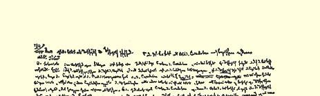
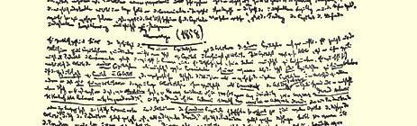
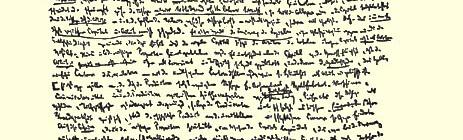
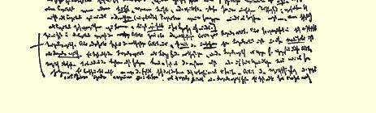

# ［．］资本章

> １０５

# ［第一篇］ 资本的生产过程

## ［（Ａ）］货币转化为资本

### ［（１）资产阶级社会生产关系体系中的简单商品流通。资产阶级的平等和资产阶级的自由］

［—８］在货币作为货币的完全的规定性上理解货币特别困难（政治经济学企图回避这些困难，它总是顾了货币的一种规定而忘了另一种规定，而当它面临一种规定时又求助于另一种规定），因为在这里，社会关系，个人和个人彼此之间的一定关系， 表现为一种金属，一种矿石，一种处在个人之外的、本身可以在自然界中找到的纯物体，在这种物体上，形式规定和物体的自然存在再也区分不开了。金银本身不是货币。自然界并不出产货币， 正如自然界并不出产汇率或银行家一样。１０６在秘鲁和墨西哥，以前金银并没有充当货币，尽管已经有用金银做的装饰品，尽管那里已经有成熟的生产体系。充当货币不是金银的自然属性，因而这是物理学家和化学家等等的人们所根本不了解的。但货币直接是金银。货币作为尺度来看，形式规定仍占优势，作为铸币就更是这样，因为形式规定甚至通过铸币的花纹在外表上显露出来，但是在第三种规定上，也就是在货币的完成形态上，即充当尺度和铸币仅仅表现为货币的职能时，一切形式规定都消失了，或者说， 一切形式规定都同货币的金属存在直接合而为一了。在金银上丝毫也看不出它们作为货币的规定不过是社会过程的结果，金银**是** 货币。

理解作为货币的金银之所以更加困难，是因为：金银对于活的个人的直接使用价值同它们作为货币的作用毫无联系，而且一般说来，在作为纯粹交换价值的化身的金银身上，人们丝毫也不会想到不同于交换价值的使用价值。因此，包含在交换价值以及与之相适应的社会生产方式中的基本矛盾，在这里最纯粹地表现出来了。我们在前面[^1]已经批判了企图消除这一矛盾的这样一些尝试，这些尝试是要剥掉货币的金属形式，并且也从表面上使货币成为由社会**设定的东西**，成为某种社会关系的表现；这些尝试的最后形式似乎就是劳动货币的形式。现在可以很清楚地看到，只要交换价值的基础保持不变，所有这些尝试都是徒劳的，而那种认为金属货币似乎使交换遭到歪曲的幻想，是由于根本不了解金属货币的性质产生的。另一方面，同样可以很清楚地看到，随着占统治地位的生产关系的对立面的成长，以及这种生产关系本身越来越强烈地要蜕皮，攻击的矛头就越来越指向金属货币或货币本身，因为货币是使资产阶级生产制度表现得非常明显的一种最引人注目、最矛盾、最尖锐的现象。于是有人就在货币身上费尽心机，企图消除对立，其实货币只是这些对立的明显的现象。同样可以很清楚地看到，只要对货币的攻击看起来会使一切其他东西原封不动，而且只是做一些修补，那么人们可以在货币上采取一些革命措施。在这种情况下，人们是手打麻袋意在驴子。但是， 只要驴子没有感到麻袋上的打击，人们实际上打的就只是麻袋而不是驴子。只要驴子感觉到了，那么，人们打的就是驴子而不是麻袋。只要这些措施针对货币本身，这就只是对结果的攻击，而产生这些结果的原因仍然存在，可见，这虽是对生产过程的干扰， 但生产过程的牢固基础仍然有力量通过或多或少暴力的反作用， 使这种干扰成为只是暂时的**干扰**并加以克服。

另一方面，既然迄今为止对货币关系的阐述是在其纯粹形式上进行的，并没有同发展程度较高的生产关系联系起来，那么，货币关系的规定的特点就在于：在从简单意义上来理解的货币关系中，资产阶级社会的一切内在的对立在表面上看不见了，因此，资产阶级民主派比资产阶级经济学家（后者至少是前后一贯的，以致他们会后退到交换价值的和交换的更简单的规定上去）更多地求助于这种简单的货币关系，来为现存的经济关系辩护。

实际上，只要把商品或劳动还只是看作交换价值，只要把不同商品互相之间发生的关系看作这些交换价值彼此之间的交换， 看作它们之间的等同，那就是把进行这一过程的个人即主体只是单纯地看作交换者。只要考察的是形式规定—— 而且这种形式规定是经济规定，是个人借以互相发生交往关系的规定，是他们的社会职能或彼此之间的社会关系的指示器—— 那么，在这些个人之间就绝对没有任何差别。每一个主体都是交换者，也就是说，每一个主体和另一个主体发生的社会关系就是后者和前者发生的社会关系。因此，作为交换的主体，他们的关系是**平等**的关系。在他们之间看不出任何差别，更看不出对立，甚至连丝毫的差异也没有。其次，他们所交换的商品作为交换价值是等价物，或者至少当作等价物（在相互估价时只可能发生主观上的错误，如果一个人欺骗了另一个人，那么这种情况**不是由于他们互相**对立的**社会职能的性质**造成的，因为这种社会职能**是一样的**，**他们**在社会职能上**是平等的**，而只是由于有的人生来狡猾、能言善辩等等造成的，总之，只是由于一个人具有另一个人所没有的纯粹个人的超人之处造成的。差别只会是同关系自身的性质毫不相干的自然差别。从以后的研究中可以看到，这种自然差别甚至还会由于竞争等等而缩小，并失去其原有的力量）。

只要考察的是纯粹形式，即关系的经济方面，—— 处在这一形式之外的内容在这里其实还完全不属于经济学的范围，或者说， 表现为不同于经济内容的自然内容，可以说，它仍然是同经济关系完全分开的，因为它仍然是同经济关系直接重合的１０７，—— 那么，在我们面前出现的就只是形式上不同的三种要素：关系的主体即**交换者**，他们处在同一规定中；他们交换的对象，交换价值， **等价物**，［—９］它们不仅相等，而且必须确实相等，还要被承认为相等；最后，交换行为本身即媒介作用，通过这种媒介作用， 主体才表现为交换者，相等的人，而他们的客体则表现为等价物， 相等的东西。等价物是一个主体对于其他主体的对象化，这就是说，它们本身的价值相等，并且在交换行为中证明自己价值相等， 同时证明彼此漠不关心。主体只有通过等价物才在交换中彼此作为价值相等的人，而且他们只是通过彼此借以为对方而存在的那种对象性的交换，才证明自己是价值相等的人。因为他们只有作为等价物的所有者，作为在交换中这种相互等价的证明者，才是价值相等的人，所以他们作为价值相等的人同时是彼此漠不关心的人，他们在其他方面的个人差别与他们无关，他们不关心他们在其他方面的一切个人特点。

至于说交换行为（这一交换行为不仅设定并证明交换价值，而且设定并证明作为交换者的主体）以外的［交换过程的］内容，那么这个处在经济形式规定之外的内容只能是：（１）被交换的商品的自然特性，（２）交换者的特殊的自然需要，或者把二者合起来说，被交换的商品的不同的使用价值。因此，这种使用价值，即完全处在交换的经济规定之外的交换内容，丝毫无损于个人的社会平等，相反地却使他们的自然差别成为他们的社会平等的基础。 如果个人Ａ和个人Ｂ的需要相同，而且他们都把自己的劳动实现在同一对象中，那么他们之间就不会有任何关系，从他们的生产方面来看，他们根本不是不同的个人。他们两个人都需要呼吸，空气对他们两个人来说都是作为大气而存在；这一切都不会使他们发生任何社会接触。作为呼吸着的个人，他们只是作为自然物，而不是作为人格互相发生关系。只有他们在需要上和生产上的差别， 才会导致交换以及他们在交换中的社会平等。因此，这种自然差别是他们在交换行为中的社会平等的前提，而且也是他们相互作为生产者出现的那种关系的前提。从这种自然差别来看，个人Ａ 是个人Ｂ所需要的某种使用价值的所有者，Ｂ是Ａ所需要的某种使用价值的所有者。从这方面说，自然差别又使他们互相发生平等的关系。但是，他们因此并不是彼此漠不关心的人，而是互相补充，互相需要，于是客体化在商品中的个人Ｂ就成为个人Ａ的需要，反过来也一样；于是他们彼此不仅处在平等的关系中，而且也处在社会的关系中。

不仅如此。一个人的需要可以用另一个人的产品来满足，反过来也一样；一个人能生产出另一个人所需要的物品，每一个人在另一个人面前作为这另一个人所需要的客体的所有者而出现， 这一切表明：每一个人作为**人**超出了他自己的特殊需要等等，他们是作为人彼此发生关系的；他们都意识到他们共同的种属。除此以外，不可能发生大象为老虎生产，或者一些动物为另一些动物生产的情况。例如，一窝蜜蜂实质上只是一只蜜蜂，它们都生产同一种东西。

其次，既然个人之间以及他们的商品[^2]之间的这种自然差别， 是使这些个人结合在一起的动因，是使他们作为交换者发生他们被**假定为**和被**证明为**平等的人的那种社会关系的动因，那么除了平等的规定以外，还要加上**自由**的规定。尽管个人Ａ需要个人Ｂ 的商品，但他并不是用暴力去占有这个商品，反过来也一样，相反地他们互相承认对方是所有者，是把自己的意志渗透到商品中去的人。因此，在这里第一次出现了人的法律因素以及其中包含的自由的因素。谁都不用暴力占有他人的财产。每个人都是自愿地出让财产。

但还不仅如此：只是在个人Ｂ用商品ｂ为个人Ａ的需要服务的时候，并且只是由于这一原因，个人Ａ才用商品ａ为个人Ｂ的需要服务。反过来也一样。每个人为另一个人服务，目的是为自己服务；每一个人都把另一个人当作自己的手段互相利用。这两种情况在两个个人的意识中是这样出现的：（１）每个人只有作为另一个人的手段才能达到自己的目的；（２）每个人只有作为自我目的（自为的存在）才能成为另一个人的手段（为他的存在）；（３）每个人是手段同时又是目的，而且只有成为手段才能达到自己的目的，只有把自己当作自我目的才能成为手段，也就是说，这个人只有为自己而存在才把自己变成为那个人而存在，而那个人只有为自己而存在才把自己变成为这个人而存在，—— 这种相互关联是一个必然的事实，它作为交换的自然条件是交换的前提，但是，这种相互关联本身，对交换主体双方中的任何一方来说，都是他们毫不关心的，只有就这种相互关联把他的利益当作排斥他人的利益，不顾他人的利益而加以满足这一点来说，才和他有利害关系。

换句话说，表现为全部行为的动因的共同利益，虽然被双方承认为事实，但是这种共同利益本身不是动因，它可以说只是在自身反映１１０的特殊利益背后，在同另一个人的个别利益相对立的个别利益背后得到实现的。就最后这一点来说，个人至多还能有这样一种安慰感：他的同别人利益相对立的个别利益的满足，正好就是被扬弃的［—１０］对立面即一般社会利益的实现。从交换行为本身出发，个人，每一个人，都自身反映为排他的并占支配地位的（具有决定作用的）交换主体。因而这就确立了个人的完全自由：自愿的交易；任何一方都不使用暴力；把自己当作手段，或者说当作提供服务的人，只不过是当作使自己成为自我目的、使自己占支配地位和主宰地位的手段；最后，是自私利益，并没有更高的东西要去实现；另一个人也被承认并被理解为同样是实现其自私利益的人，因此双方都知道，共同利益恰恰只存在于双方，多方以及存在于各方的独立之中，共同利益就是自私利益的交换。一般利益就是各种自私利益的一般性。

因此，如果说经济形式，交换，确立了主体之间的全面平等， 那么内容，即促使人们去进行交换的个人材料和物质材料，则确立了**自由**。可见，平等和自由不仅在以交换价值为基础的交换中受到尊重，而且交换价值的交换是一切**平等**和**自由**的生产的、现实的基础。作为纯粹观念，平等和自由仅仅是交换价值的交换的一种理想化的表现；作为在法律的、政治的、社会的关系上发展了的东西，平等和自由不过是另一次方的这种基础而已。而这种情况也已为历史所证实。这种意义上的平等和自由恰好是古代的自由和平等的反面。古代的自由和平等恰恰不是以发展了的交换价值为基础，相反地是由于交换价值的发展而毁灭。而现代意义上的平等和自由所要求的生产关系，在古代世界还没有实现，在中世纪也没有实现。古代世界的基础是直接的强制劳动；当时共同体就建立在这种强制劳动的现成基础上；作为中世纪的基础的劳动，本身是一种特权，是尚处在孤立分散状态的劳动，而不是生产一般交换价值的劳动。［资本主义社会里的］劳动既不是强制劳动，也不是中世纪那种要听命于作为最高机构的共同组织（同业公会）的劳动。

交换者之间的关系从交换的动因来看，也就是从经济过程之外的自然动因来看，也要以某种强制为基础，这种说法虽然是正确的，但是，这种关系，从一方面来看，本身只是表示另一个人对我的需要本身毫无关系，对我的自然个性毫无关系，也就是表示他同我平等和他有自由，但是他的自由同样也是我的自由的前提；另一方面，就我受到我的需要的决定和强制来说，对我施行强制的，不是异己的东西，只是作为需要和欲望的总体的我自己的自然（或者说，处在普遍的反思形式上的我的**利益**）。但使我能强制另一个人，驱使他进入交换制度的，也正是这一方面。

因此，罗马法规定**奴隶**是不能通过交换为自己谋利益的人，这是有道理的（见《学说汇纂》１１１）。由此也可以明白，罗马**法**虽然是与交换还很不发达的社会状态相适应的，但是，从交换在一定的范围内已有所发展来说，它仍能阐明**法人**，**进行交换的个人的各种规定**，因而能成为工业社会的法的先声（就基本规定来说），而首先为了和中世纪相对抗，它必然被当作新兴资产阶级社会的法来看。不过，罗马法的发展本身和罗马共同体的解体也是完全一致的。

因为货币才是交换价值的实现，因为只有在发达的货币制度下交换价值制度才能实现，或者反过来也一样，所以货币制度实际上只能是这种自由和平等制度的实现。作为尺度，货币只是给予等价物以特定的表现，使它在形式上也成为等价物。在流通中固然还可以看到下述形式的差别：交换者双方作为买者和卖者在不同的规定中出现；交换价值一次是在货币的形式上表现为一般交换价值，另一次是在具有价格的自然商品上表现为特殊交换价值，但是，首先，这些规定会互相替换；其次，流通本身不会产生不平等，而只会产生平等，即把那仅仅是想象的差别扬弃。不平等只是纯粹形式上的不平等。最后，货币本身是流通的，所以时而出现在这个人手里，时而又出现在那个人手里，而出现在谁手里对货币来说是无所谓的，—— 在这种货币上，现在平等甚至在物质上也表现出来了。就交换过程来考察，每一个人对另一个人表现为货币所有者，表现为货币本身。因此，彼此无所谓和价值相等的情况明显地以物的形式存在着。商品身上的特殊的自然差别消失了，并且不断地由于流通而消失。对卖者来说，一个用 ３先令购买商品的工人和一个用３先令购买商品的国王，两者职能相同，地位平等—— 都表现为３先令的形式。他们之间的一切差别都消失了。卖者作为卖者只表现为一个价格３先令的商品的所有者，所以双方完全平等，只是这３先令一次是以银的形式存在，另一次是以沙糖等等的形式存在。

在货币的第三种形式上，过程的各个主体似乎可能具有不同的规定。但是，当货币在这里表现为契约上的材料，契约上的一般商品时，立约者和立约者之间的一切差别反而消失了。当货币成为积累的对象时，主体在这里［—１１］就只是从流通中抽出货币即财富的一般形式，而不是从流通中抽出同等价格的商品。因而，如果一个人积累，另一个人不积累，那么他们中间谁也没有给对方造成损失。一个人享有现实财富，另一个人占有财富的一般形式。如果一个人变穷了，另一个人变富了，那么这是他们的自由意志，而决不是由经济关系即他们彼此发生的经济联系本身所造成的。甚至遗产继承以及使由此引起的不平等永久化的类似的法律关系， 都丝毫无损于这种天然的自由和平等。只要个人Ａ的最初状况同这个制度并不矛盾，那么这种矛盾也决不会由于个人Ｂ代替了个人Ａ并使Ａ的最初状况永久化而产生出来。相反地，这种情况却会使社会规定的效力超过个人生命的自然界限，即巩固这种社会规定以对抗自然的偶然作用（自然的影响本身反而会消灭个人的自由）。此外，因为个人在这种关系中只是货币的个体化，所以这样的个人同货币一样也是不死的，而个人通过继承人来代表自己倒可以说是这种社会规定的贯彻。

如果这种看法不是从它的历史意义上提出，而是被利用来反驳比较发达的经济关系，—— 在这种发达的关系中，个人不再仅仅表现为交换者即买者和卖者，而是出现在一定的相互关系中，不再是所有的人都处于同一的规定性之中，—— 那么，这就等于断言， 自然物之间不存在任何差别，更不用说对立和矛盾了，因为它们， 例如从重量这个规定来看，都有重量，因此都是等同的；或者说，它们是等同的，因为它们都存在于三维空间。在这里，同样也是抓住交换价值本身的简单规定性，来反对交换价值的比较发达的对抗形式。从科学的进程来考察，这些抽象规定恰恰是最早的和最贫乏的规定；它们部分地在历史上也是这样出现过的！比较发达的规定是较晚出现的规定。在现存的资产阶级社会的总体上，商品表现为价格以及商品的流通等等，只是表面的过程，而在这一过程的背后，在深处，进行的完全是不同的另一些过程，在这些过程中个人之间表面上的平等和自由就消失了。

一方面，人们忘记了：交换价值作为整个生产制度的客观基础这一**前提**，从一开始就已经包含着对个人的强制，个人的直接产品不是为个人的产品，只有在社会过程中它才**成为**这样的产品，因而 **必须**采取这种一般的并且诚然是表面的形式；个人只有作为交换价值的生产者才能存在，而这种情况就已经包含着对个人的自然存在的完全否定，因而个人完全是由社会所决定的；其次，这种情况又要以分工等等为前提，个人在分工中所处的关系已经不同于单纯**交换者**之间的关系，等等。也就是说，人们忘记了，交换价值这个前提决不是从个人的意志产生，也不是从个人的直接自然产生， 它是一个**历史的**前提，它已经把个人当作是由社会**决定**的人了。

另一方面，人们忘记了，那些现在存在着交换或靠交换来实现的生产联系的较高级的形式，决不会停留在这样一种简单的规定性上，在这种规定性上，所达到的最大差别是形式上的差别，因而是无关紧要的差别。

最后，人们没有看到，在交换价值和货币的简单规定中已经潜在地包含着工资和资本的对立等等。可见，［资产阶级辩护论者的］这全部聪明才智不过是要停留在最简单的经济关系上，这些经济关系单独来看，是纯粹的抽象，但在现实中却是以各种最深刻的对立为媒介的，并且只反映一个方面，在这个方面上述对立的表现看不见了。

同时，这里也暴露了社会主义者的愚蠢（特别是法国社会主义者的愚蠢，他们想要证明，社会主义就是实现由法国革命所宣告的 **资产阶级**社会的理想），他们证明，交换、交换价值等等**最初**（在时间上）或者按其**概念**（在其最适当的形式上）是普遍自由和平等的制度，但是被货币、资本等等歪曲了。或者他们断言，历史迄今为止企图以适合自由和平等的真实性质的方式来实现自由和平等的一切尝试都失败了，而现在他们，例如蒲鲁东，发现了用这些关系的真正历史来代替它们的虚假历史的真正秘诀。对于这些社会主义者必须这样回答：交换价值，或者更确切地说，货币制度，事实上是平等和自由的制度，而在这个制度更详尽的发展中对平等和自由起干扰作用的，是这个制度所固有的干扰，这正好是**平等和自由**的实现，这种平等和自由证明本身就是不平等和不自由。认为交换价值不会发展成为资本，或者说，生产交换价值的劳动不会发展成为雇佣劳动，这是一种虔诚而愚蠢的愿望。这些先生不同于资产阶级辩护论者的地方就是：一方面他们觉察到这种制度所包含的矛盾， 另一方面抱有空想主义，不理解资产阶级社会的现实的形态和观念的形态之间必然存在的差别，因而愿意做那种徒劳无益的事情， 希望重新实现观念的表现本身，而观念的表现实际上只是这种现实的映象。

［—１２］堕落的最新经济学[^3]为了反对上述社会主义者而提出的庸俗论证，完全是玩弄抽象概念的儿戏，**它企图证明**，经济关系到处都表示**同一些**简单规定，因而到处都表示交换价值相交换的简单规定中的平等和自由。例如，资本和利息的关系就被它归结为交换价值的交换。也就是说，这种最新经济学先是从日常经验中借用一个事实，即交换价值不仅存在于这种简单的规定性上， 而且也存在于本质上不同的资本的规定性上这个事实，然后再把资本归结为交换价值的简单概念，同样，把也表示资本本身的一定关系的利息，从规定性中分离出来，使它成为与交换价值相同的东西；这种最新经济学把具有特殊规定性的全部关系抽掉，退回到商品同商品相交换的不发达关系。只要我把具体事物不同于它的抽象概念的一切方面抽掉，那么具体事物当然就成了抽象概念，丝毫没有不同于抽象概念的地方。**这样**，**一切经济范畴就总只是同一关系的各种不同的名称**，**从而这种无法理解现实差别的彻底无能就被认为是纯粹的常识本身**。**巴师夏先生的“经济的和谐”** **１１２实际上就等于说**：**存在着一种具有不同名称的唯一的经济关系**，**或者说**，**只是就名称而言才存在着差别**。这种归结法是把包含着发展的差别抛掉，使一切都归结为一种现实的经济关系，单从这点来说，它至少在形式上也是不科学的；何况它是时而抛掉这一方面，时而抛掉那一方面，以便时而从这一方面，时而从那一方面来制造同一性。

例如，工资是一个人向另一个人提供服务所取得的报酬。（前面已经指出，经济形式本身在这里被抛掉了。）利润也是一个人向另一个人提供服务所取得的报酬。因而工资和利润是相同的东西， 而把一种报酬称为工资，把另一种报酬称为利润，这本身就是说法上的混乱。现在再来看看利润和利息。在利润形式上，服务的报酬会由于偶然情况而变动，在利息形式上，这种报酬是固定不变的。 因而，既然在工资形式上的报酬相对地说是固定不变的，而在利润形式上的报酬则与劳动相反会由于偶然情况而变动，那么利息和利润之间的关系就等于工资和利润之间的关系，而我们已经看到， 这种关系是等价物的相互交换。于是论敌们１１３从字面上抓住这种庸俗论调（这种庸俗论调在于，它从已经表现出对立的经济关系倒退到对立还只是处于潜伏状态、因而显得模糊不清的经济关系）， 并且指出，例如在资本和利息之间就不是简单的交换，因为资本不是由等价物来补偿，而是在资本所有者以利息形式二十次吞食等价物以后，他仍然以资本形式保持着这笔资本，并且还能同二十个新的等价物相交换。由此产生了令人厌烦的争论，一派断言，在发达的和不发达的交换价值之间不存在差别，另一派则认为，这种差别可惜是存在的，但按理说不应该存在。

### ［（２）资本作为资产阶级社会占统治地位的关系］

**货币作为资本**，这是超出了货币作为货币的简单规定的一种货币规定。货币作为资本，可以看作是货币的更高的实现；正如可以说猿发展为人一样。但是，这里较低级的形式是作为较高级的形式的承担者出现的。无论如何，**货币作为资本**不同于**货币作为货币**。这个新的规定必须加以说明。另一方面，**资本作为货币**，看来好象是资本倒退到较低级的形式。其实那不过是资本处在这样一种特殊性上，这种特殊性作为非资本，在资本以前就已经存在，而且是资本的一个前提。货币又会在以后的一切关系中出现；但那时它已经不再充当单纯的货币。如果象这里一样，首先是要研究货币直至它作为货币市场的整体，那么，其他关系的发展就是前提，因而有时必须纳入研究范围。因此，我们在考察作为货币的资本的特殊性以前，必须在这里先考察资本的一般规定。

如果我象萨伊１１４那样说资本是一个**价值额**，那我不过是说，**资本＝交换价值**。每个价值额是一个交换价值，每个交换价值是一个价值额。我不能用简单的加法从交换价值达到资本。我们已经知道，在单纯的货币积累中，还不存在资本化的关系。

在所谓的零售商业中，在生产者和消费者之间直接进行的资产阶级生活的日常交易中，在一方的目的是以商品换货币，另一方的目的是以货币换商品以满足个人需要的小额贸易中，—— 在资产阶级世界的表面上发生的这种运动中，交换价值的运动，交换价值的流通才以纯粹的形式进行。一个购买面包的工人和一个购买面包的百万富翁，在这一行为中都只是单纯的买者，而零售商对他们来说只是卖者。其他一切规定在这里都消失了。他们购买的**内容**以及购买的**数量**，对这种形式规定［—１３］来说是无关紧要的。

在理论上，价值概念先于资本概念，而另一方面，价值概念的纯粹的发展又要以建立在资本上的生产方式为前提，同样，在实践上也是这种情况。因此，经济学家们必然会在一些场合把资本看作价值的创造者，价值的源泉，而在另一些场合又把价值看作资本形成的前提，并且把资本本身说成只是执行某种特定职能的价值额。 纯粹的和一般的价值存在要以这样一种生产方式为前提，在这种生产方式下，单个的产品对生产者本身来说已经不是产品，对单个劳动者来说更是如此，而且，如果不通过流通来实现，就等于什么也没有。对于生产一码布的极微小部分的人来说，一码布是价值， 是交换价值，这一点绝不是形式规定。如果他没有创造交换价值， 没有创造货币，他就什么也没有创造。因此，价值规定本身要以社会生产方式的一定的历史阶段为前提，而它本身就是和这种历史阶段一起产生的关系，从而是一种历史的关系。

另一方面，价值规定的有些因素是在历史的社会生产过程的一些较早的阶段上发展起来的，而且表现为这一过程的结果。

因此，在资产阶级社会制度内，价值之后紧接着就是资本。**在历史上则先有其他的制度**形成尚不充分的价值发展的物质基础。 因为交换价值同使用价值相比，在这里只起次要的作用，所以表现为交换价值的真实基础的，不是资本而是土地所有权关系。相反， 现代土地所有权如果没有资本这个前提就根本无法理解，因为它没有这个前提就不能存在，而且在历史上也确实表现为由资本把以前的土地所有权的历史形态改变成适合于资本的一种形式。因此，正是在土地所有权的发展中才能研究资本逐步取得的胜利和资本的形成，由于这个缘故，现代经济学家李嘉图为了确定资本、 雇佣劳动以及地租的关系的特殊形式，以深刻的历史眼光把这些关系放在土地所有权范围内进行了考察。产业资本家对土地所有者的关系，表现为土地所有权以外的关系。但是，这种关系作为现代租地农场主对地租所得者的关系，表现为土地所有权本身的内在关系，而土地所有权则表现为只是存在于它对资本的关系中。土地所有权的历史表明了封建地主逐步转化为地租所得者，世袭的半交代役租的而且常常是不自由的终身租佃者逐步转化为现代租地农场主，以及依附于土地而没有迁徙自由的农奴和徭役农民逐步转化为农业短工的过程，这种历史事实上就是现代资本的形成史。它本身就包含着对城市资本，对贸易等等的关系。但是，我们在这里要研究的是已经形成的、在自身基础上运动的资产阶级社会。

资本首先来自流通，而且正是以货币作为自己的出发点。我们已经看到[^4]，进入流通并同时从流通返回到自身的货币，是货币借以扬弃自身的最后形式。这同时就是资本的最初的概念和最初的表现形式。货币作为只是消溶在流通中的东西否定了自己；但它也作为与流通相独立的东西否定了自己。这种否定作为一个整体来看，在它肯定的规定中，包含着资本的最初的一些要素。货币是资本表现为资本的最初形式。Ｇ—Ｗ—Ｗ—Ｇ；即货币同商品交换和商品同货币交换；**这种为卖而买的运动**，**即构成商业的形式规定的运动**，**作为商业资本的资本**，出现在经济发展的最早的状态中；这是以交换价值本身为内容的最初的运动，交换价值在这种运动中不仅是形式，而且是运动本身的内容。这种运动可以发生在交换价值还根本没有成为生产的前提的那些民族内部和民族之间。这种运动所涉及的，只是这些民族为满足直接需要而进行的生产的剩余产品，而且只发生在它们的边界上。正如犹太人处在古代波兰社会或整个中世纪社会中的情形那样，所有一切商业民族，例如古代的商业民族以及后来的伦巴第人，可以在交换价值还没有成为生产方式的基本前提的那些民族之间，占有同样的地位。

商业资本不过是流通资本，而流通资本是资本的最初形式；资本在这种形式上**还决不会成为生产的基础**。进一步发展的形式是 **货币资本和货币利息**，即高利贷，它的独立出现同样是早期发展阶段的事情。最后是Ｗ—Ｇ—Ｇ—Ｗ这一形式，—— 在这个形式中， 货币和流通本身对**流通的商品**来说表现为单纯的手段，而流通的商品又会退出流通并直接满足需要，—— 这一形式本身就是上述商业资本最初出现的前提。或者是这些前提分散在各民族之间，或者是商业资本本身在社会内部只由这种纯粹以消费为目的的流通所决定。另一方面，**流通的商品**，即只有取得另一种退出流通并满足直接［—１４］需要的商品的形式才能得到实现的那种商品，也是本质上作为**商品资本**的那种资本的最初形式。

另一方面，同样清楚的是，在纯粹流通中进行的交换价值的简单运动，决不能实现资本。这种运动可能导致货币的抽出和积累， 但是，货币一旦又进入流通，货币就会消溶在同供消费用的商品相交换的一系列过程中；因此，一旦货币的购买力用尽，货币就消失了。同样，以货币为媒介同另一个商品相交换的商品也会退出流通，然后被消费，被消灭。但是，如果商品在货币形式上与流通相对而独立起来，那么，它就只是表示无实体的一般财富形式。因为等价物可以互相交换，所以，作为货币固定下来的财富形式，一旦同商品相交换，也就消失了，而存在于商品中的使用价值，一旦同货币相交换，也就消失了。通过简单的交换行为，任何一方只有实现在另一方身上时，才能失去自己和另一方相对立的规定。任何一方都不能在它过渡到另一规定时仍保持自己原有的规定。因此，为了反对资产阶级经济学家企图把资本归结为纯粹的交换来美化资本的诡辩，人们反过来提出了同样是诡辩的，但针对这些经济学家来说却是合理的要求：把资本**真正**归结为纯粹的交换，从而使资本作为［社会］力量消失，而且不管资本采取商品形式还是货币形式都被消灭[^5]。

从货币或商品这两个点上开始的过程，它的反复并不是交换本身的条件造成的。这一行为只能反复到交换完成时为止，也就是交换价值总额完成交换时为止。它不能由它自己重新发动起来。**因此**，**流通本身不包含自我更新的原理**。**流通的要素先于流通而存在**，而不是由流通本身创造出来的。商品必须不断地从外面重新投入流通，就象燃料被投入火中一样。否则，流通就会失去作用而消失。流通会在货币这个失去作用的结果上消失；货币只要不再和商品、价格、流通发生关系，就不再是货币，不再表现生产关系；货币所留下来的，只有它的金属存在，而它的经济存在则消灭了。所以， 流通这个表现为直接存在于资产阶级社会表面上的东西，只有不断通过媒介才能存在。就流通本身来看，它是预先存在的两极的媒介。但是它不会创造这两极。因此，流通不仅在它的每一个要素上， 而且作为媒介的整体，作为全部过程本身，都必须通过媒介才存在。因而流通的直接存在是纯粹的假象。**流通是在流通背后进行的一种过程的表面现象**。

现在，流通在它的每一个要素上—— 作为商品，作为货币，而且作为两者之间的关系，作为两者之间的简单交换和简单流通 —— 都被否定了。如果说最初是社会生产行为表现为交换价值的设定过程，而交换价值的设定过程在自己进一步的发展中又表现为流通，—— 表现为各交换价值彼此之间的充分发展了的运动，—— 那么，现在是流通本身返回到设定或生产交换价值的活动。流通返回到这种活动，就是返回到自己的基础。流通的前提是商品（不管是特殊形式的商品，还是货币这种一般形式的商品），而商品是一定劳动时间的体现，它作为这种体现是价值；因而流通的前提既是通过劳动进行的商品的生产，又是作为交换价值的商品的生产。这是流通的出发点，流通通过本身的运动返回到创造交换价值的生产，返回到它的结果。

这样，我们又到达出发点，到达设定即创造交换价值的**生产**。 但是，这一次是这样的生产：**它事先把流通当作发展了的要素**，并且表现为引起流通又不断地从流通返回到自身以便重新引起流通的不断的过程。因而，设定交换价值的运动，在这里现在以复杂得多的形式出现，因为它不再只是作为前提的交换价值的运动，或者在形式上使交换价值设定为价格的运动，而且同时是把交换价值作为前提创造出来，生产出来的运动。生产本身在这里不再先于自己的结果而存在，也就是不再作为前提而存在，而是表现为自身同时产生这些结果的生产。但是它产生这些结果，已不再象在最初阶段那样只是作为导致流通的生产，而是作为在自己的过程中同时还以流通，以发达的流通为前提的生产。（流通实际上只是把交换价值一次表现在商品规定上，另一次表现在货币规定上的形式过程。）

这种运动以不同的形式出现，**既**在历史上导致产生价值的劳动，另一方面，**又**出现在资产阶级的生产制度内部，即设定交换价值的生产制度本身内部。首先是经营商业的民族出现在半开化或未开化的民族之间，或者是由于自然条件不同而进行不同生产的各个氏族发生接触和交换他们的剩余产品。第一种情况是比较典型的形式，所以我们来考察一下。剩余产品的交换是设定交换和交换价值的交往。但是，这种交往仅仅涉及剩余产品，因而同生产本身相比只起次要的作用［—１５］。但是，如果从事交换的商人（伦巴第人、诺曼人等等几乎对所有的欧洲民族都扮演这个角色）一再地出现，从而继续不断的贸易发展起来—— 在这种贸易中，从事生产的民族仍然只经营所谓**被动的**贸易，因为推动它从事设定交换价值的活动的动力来自外面，不是来自它的生产的内部结构，—— 那么，生产的剩余产品就必然不仅仅是偶然的、间或存在的剩余产品，而且是不断反复出现的剩余产品，因而本地的生产本身就具有一种以流通，以设定交换价值为目的的趋势。

最初，对生产的影响较多地来自物质方面。需求的范围不断扩大；满足新的需求已经成为目的，因而生产就更有规则性并且扩大了。本地生产的组织本身已经被流通和交换价值改变了；但是流通和交换还没有影响到生产的全部广度和深度。这就是所谓对外贸易的**传播文明的作用**。设定交换价值的运动究竟在多大程度上触及整个生产，这部分地取决于这种外来影响的强度，部分地取决于本地的生产要素—— 分工等等—— 已经发展的程度。例如十六世纪和十七世纪初在英国，由于尼德兰商品的输入，用于交换的剩余产品羊毛就具有决定性的意义。于是，为了出产更多的羊毛，耕地变成了牧羊场，小租佃制遭到了破坏等等，发生了清扫领地等等。

因此，农业失去了为使用价值而劳动的性质，而农业的剩余产品的交换对于农业的内部结构来说不再是无关紧要的了。在某些地方，农业本身完全由流通决定，转变为设定交换价值的生产。 这样一来，不仅生产方式改变了，而且一切与之相适应的旧的人口关系和生产关系，一切旧的经济关系都解体了。可见，在这里， 流通的前提是一种仅仅以剩余产品形式创造交换价值的生产；但是现在这种生产却变成了只与流通相联系的生产，变成了以设定交换价值为唯一内容的生产。

同时，在以交换价值和发达的流通为前提的现代生产中，一方面是价格决定生产，另一方面是生产决定价格。

如果说资本是“作为手段被用于新劳动〈生产〉的那种积累的〈已实现的〉劳动〈确切地说，**物化**劳动〉”１１５，那就是只看到了资本的物质，而忽视了使资本成为资本的形式规定。这无非是说， 资本就是生产工具，因为从最广泛的意义来说，任何东西，甚至纯粹由自然提供的物，例如石头，也必须先通过某种活动被占有， 然后才能用作工具，用作生产资料。按照这种说法，资本存在于一切社会形式中，成了某种完全非历史的东西。按照这种说法，人体的四肢也是资本，因为要使它们能发挥器官的作用，就必须通过活动，通过劳动来使它们发育，以及使它们取得营养，把它们再生产出来。在这个意义上，臂，尤其是手，都是资本。这样，资本就只是一个同人类一样古老的事物的新名称了，因为任何一种劳动，甚至最原始的劳动，如狩猎、捕鱼等等，都要有一个前提， 就是把过去劳动的产品用作直接的活劳动的手段。

上述定义中所包含的进一步的规定是：产品的物质材料完全被抽掉了，过去的劳动本身被看作是产品的唯一内容（材料）；同样，这个产品现在应再作为手段来实现的那种一定的、特殊的目的，也被抽掉了，相反，作为目的的，只是一般的生产。所有这一切似乎只是抽象的产物，而这种抽象据说对一切社会状态都同样是真实的，并且和往常的作法比起来，只会使分析更彻底，使定义更抽象（更一般）。

如果这样抽掉资本的特定形式，只强调**内容**，而**资本作为这种内容是一切劳动的一种必要要素**，**那么**，**要证明资本是一切人类生产的必要条件**，**自然就是再容易不过的事情了**。抽掉了使资本成为人类生产某一特殊发展的**历史**阶段的要素的那些特殊规定，恰好就得出这一证明。要害在于：如果说一切资本都是作为手段被用于新生产的物化劳动，那么，并非所有作为手段被用于新生产的物化劳动都是资本。**资本被理解为物**，**而没有被理解为关系**。

另一方面，如果说资本是一个用来生产价值的价值额，那么这就是说：资本是自己再生产自己的交换价值。但是从形式上看， 交换价值也会在简单流通中再生产自己。这种说法固然抓住了使交换价值成为出发点的形式，但是忽略了同内容的关系（这种关系对资本来说并不象对简单的交换价值那样是**无关紧要的**）。

如果说资本是生产利润的交换价值，或者至少是以生产利润为目的的交换价值，那么，资本就已成为说明资本自身的前提了， 因为利润就是资本对它自身的一定的关系。资本决不是简单的关系，而是一种**过程**，资本在这个过程的各种不同的要素上始终是资本。因而这个过程需要加以分析。

在**积累的**劳动这个概念中也已经包含某些诡辩，因为［— １６］资本按概念规定只应是**物化的**劳动，在其中当然积累着一定量的劳动。但是积累的劳动已经意味着一定数量的体现着劳动的物品。

> “最初每个人都是自给自足的，拿去进行交换的只是那些对每个交换者来说没有价值的物品；人们不重视这种交换，每个人都满足于以无用的东西换有用的东西。但是当分工把每个人都变成商人并把社会变成商业社会以后，每个人就都只愿把自己的产品同等价物相交换了；因此，为了确定这个等价物，就必须知道所得到的那个东西的**价值**。”（**加尼耳**《论政治经济学的各种体系》１８０９年巴黎版第２卷第１１—１２页）

换句话说，交换不会只限于在形式上设定交换价值，它必然会进一步使生产本身从属于交换价值。

### ［（３）从商品的简单流通过渡到资本主义生产］

#### ［（ａ）］流通和来自流通的交换价值是资本的前提

要阐明资本的概念，必须从价值出发，并且从已经在流通运动中发展起来的交换价值出发，而不是从劳动出发。正象不可能从不同的人种直接过渡到银行家，或者从自然直接过渡到蒸汽机一样，从劳动直接过渡到资本也是不可能的。我们知道，交换价值已经在货币本身上取得一种与流通相独立的形式，但是这种形式只是一种消极的，转瞬即逝的形式，或者，即使是固定的，也只是一种虚幻的形式。货币只有同流通联系起来并且作为进入流通的可能性才存在。但是货币一旦实现，它就会失掉这种规定，重新回到它过去的两种规定上来，即作为交换价值尺度和作为交换手段。一旦货币表现为不仅与流通相独立并且在流通中保存自己的交换价值，它就不再是货币，—— 因为货币作为货币不能超出消极的规定，—— 而是**资本**了。

货币是交换价值达到资本的规定的最初形式，因而资本的最初**表现形式**被混同为资本本身，或者被看作是资本的唯一适当形式—— 这种情况是历史事实，从以上的阐述可以看出，这种历史事实与我们的阐述毫不矛盾，反而证实了我们的阐述。所以资本的最初的规定是：起源于流通，因而以流通为前提的交换价值，在流通中并通过流通保存自己；交换价值不会由于进入流通而消失； 流通不是交换价值消失的运动，反而是交换价值实际上使自己成为交换价值的运动，即交换价值作为交换价值得到实现的运动。

不能说在简单流通中交换价值会实现为交换价值。它总是只在它消失的时候才得到实现。如果一个商品以货币为媒介同另一个商品相交换，那么，商品的价值规定就会在商品实现的时候消失，商品就会脱离这种价值关系，同价值关系毫不相干，而只不过是直接的需要对象。如果货币同商品相交换，那么，交换形式作为占有商品的自然材料的单纯形式上的媒介甚至注定要消失。 如果商品同货币相交换，那么，交换价值形式，作为交换价值的交换价值即货币，只有在它处于交换之外，退出交换的时候才能保存下来，因而在交换价值的独立性明显存在的这种形式中，货币纯粹是虚幻的实现，纯粹是观念上的实现。最后，如果货币 ［以商品为媒介］同货币相交换，—— 这是可以对流通进行分析的第四种形式，但实际上不过是以交换形式表现出来的上述第三种形式，—— 那么，不同东西之间连形式上的差别也没有了；这是无差别的区别；不仅交换价值消失了，而且使它消失的那种形式上的运动也消失了。实际上简单流通的这四种形式规定可以归结为两种，其实这两种本来也是重合的；区别在于：两要素之间哪一个是重点；两要素即货币和商品中哪一个是出发点。也就是说， 是货币交换商品，即商品的交换价值同商品的物质内容（实体）相交换而消失；还是商品交换货币，即商品的内容（实体）同商品的作为交换价值的形式相交换而消失。在第一个场合，消失的是交换价值的形式，在第二个场合，消失的是交换价值的实体；可见，在这两个场合，交换价值的实现都是转瞬即逝的。

只有在**资本**中交换价值才能作为交换价值存在，因为它在流通中保存了自己，也就是说，一方面，它并没有丧失实体，而是不断地实现在新的实体中，实现在这些实体的总体中；另一方面， 它也没有失掉它的形式规定，而是在每一个不同的实体中保存了它的自我同一性。因而它始终是货币，又始终是商品。两个要素在流通中一个消失在另一个中，其中每个要素都包含着交换价值。 交换价值之所以会这样，只是因为它本身就是交换的不断更新的循环。甚至在这方面，它的流通也不同于简单交换价值本身的流通。事实上，简单流通只有从观察者的角度来看才是流通，或者说是**自在的**流通，没有表现为流通。不是同一个交换价值—— 因为交换价值的实体是一定的商品—— 先变为货币然后又变为商品；而是不断更换的交换价值，不断更换的商品同货币相对立。流通，循环，只是在于商品规定和货币规定的［—１７］简单的反复和交替，而不在于实际的出发点也是复归点。因此，就简单流通本身来考察，并且，就只有货币是保存下来的要素这一点来说， 简单流通只能称为**货币流通**。

> “资本的价值是永存的。”（**让·巴·萨伊**《论政治经济学》１８１７年巴黎第３版第２卷第１８５页） “资本是永久的〈“自行增殖的”还不是这里研究的对象〉不会再消失的价值；这种价值与创造这种价值的商品无关；它永远是一种形而上学的、非物质的东西，永远掌握在同一个**农场主**〈在这里也不妨可以说**所有者**〉手里， 只不过是外表形式不同罢了。”（**西斯蒙第**《政治经济学新原理》１８２７年巴黎第２版第１卷第８９页）

货币由于对流通采取否定态度，退出流通，才获得了不灭性， 而资本获得这种不灭性，则恰恰是由于把自己的命运交给流通，从而保存了自己。资本作为先于流通而存在的交换价值，或者作为以流通为前提并在流通中保存自己的交换价值，它不仅在观念上在每一瞬间都是简单流通所包含的两个要素中的每一个要素，而且交替地采取一种形式和另一种形式；但是已不再象在简单流通中那样，只是从一种形式过渡到另一种形式，而是在这两个规定中的每一个规定上同时又是跟对立规定发生的关系，也就是说，在观念上包含着这种关系。

资本交替地成为商品和货币；但是第一，**资本本身是这两种规定的交替**；第二，资本成为商品；但不是这种或那种商品，而是**商品的总体**。资本并不是不在乎实体，而是不在乎一定的形式； 从这一点来看，资本表现为这种实体的不断的形式变换；因此，就资本表现为交换价值的特殊内容来说，这种特殊性本身是特殊性的总体；因而资本并不是不在乎这种特殊性本身，而是不在乎单个的或孤立的特殊性。资本取得的同一性，即一般性的形式，就在于资本是交换价值，而作为交换价值，它是货币。因此，资本仍然表现为货币，事实上它是作为商品换成货币的。但是，如果资本表现为货币，也就是说，表现为交换价值的一般性这种与商品对立的形式，那么，资本同时也就包含这样的意思：它不应该象在简单流通中那样失去一般性，而应该失去一般性的对立规定， 或者说，只是暂时地采取这种一般性的对立规定，也就是重新和商品相交换，但是这个商品是这样的商品，它本身在其特殊性上也表现交换价值的一般性，因而经常地变换自己的特定形式。

如果我们在这里谈的是资本，那么，它在这里还不过是一个名称而已。把资本同直接的交换价值和货币区别开来的唯一规定性，就是那种**在流通中并通过流通保存自己**，**并且使自己永存的交换价值的规定性**。以上我们只考察了一个方面，即在流通中并通过流通保存自己的方面。另一个同样重要的方面是，交换价值是**前提**，而不再是在商品进入流通以前单纯作为观念上的规定存在于商品中的那种简单的交换价值，或者更确切些说，不再是作为只是想象的规定的那种简单的交换价值，因为商品只有当它在流通中消失的时候才成为交换价值；这种交换价值也不是作为流通中的一个要素—— 作为货币—— 而存在的那种交换价值；它在这里是作为货币，作为物化的交换价值而存在的，但它具有刚才说过的那种关系。

第二种规定与第一种规定的区别在于：交换价值（１）存在于对象性的形式中；（２）来自流通，因而以流通为前提，但同时又是从作为流通前提的自身出发的。

可以从两方面来表明简单流通的结果：

**单纯否定的方面**：投入流通的商品达到了它们的目的；它们互相进行了交换；每个商品成了需要的对象并被消费。流通就此结束。只有货币作为单纯的残余留下来。但货币作为这种残余已不再是货币，失去了自己的形式规定。它沉入作为整个过程的无机灰烬留下来的货币物质之中。

**积极否定的方面**：货币并不是作为物化的，自为存在的—— 即并非单纯在流通中消失的—— 交换价值被否定；被否定的是**对立的**独立性，是货币固定在其中的单纯抽象的一般性；但是

**第三**，作为流通的前提同时又作为流通的结果，交换价值曾被假定是从流通中出来的，它同样必须重新从流通中出来。如果这种情况只是在形式上发生，那么，交换价值就又单纯成了货币； 如果象在简单流通中那样，交换价值是作为真实的商品从流通中出来，那么，它就成了单纯的需要对象，作为这种东西被消费，同时也失掉自己的形式规定。交换价值要真正从流通中出来，它也必定成为需要的对象并作为需要的对象被消费，但它必定由劳动来消费，并由此重新把自己再生产出来。

换一种说法就是：交换价值按其内容来说，本来是一定量的物化劳动或劳动时间，它作为这样的东西，通过流通在自己的客体化进程中达到了作为货币的存在，作为可以捉摸的货币的存在。 现在交换价值本身又必须确立流通的这样一个出发点，这个出发点处于流通之外，是流通的前提，从而流通本身对它来说表现为一种从外部抓住它并在流通内部使它发生形式变换的运动，也就是说，现在交换价值本身又必须确立劳动；但交换价值现在已经不再是简单的等价物或劳动的简单的物化，而是物化了的并且独立化了的这样的交换价值：它只是为了更新自己并从自己出发重新开始流通，才把自己提供给劳动，变成劳动的材料。因此，这也不再象在流通中那样是单纯的相等即保持交换价值的同一性， 而是自我**增殖**。交换价值只有当它得到实现，即增大其价值的时候才能使自己成为交换价值。**货币**（作为从流通中复归于自身的东西）**作为资本失掉了自己的僵硬性**，**从一个可以捉摸的东西变成了一个过程**。另一方面，劳动也改变了它对自己对象性的关系： 劳动也复归于自身了。但这是这样一种复归：物化在交换价值中的劳动把活劳动变成再生产自己的手段，而起初交换价值只不过表现为劳动的产品。

#### ［（ｂ）］来自流通的交换价值作为流通的前提， 通过劳动在流通中保存自己并使自己增殖

［—１８］｛．（１）资本的一般概念。（２）资本的特殊性：流动资本，固定资本。（资本作为生活资料，作为原料，作为劳动工具。）（３）资本作为货币。．（１）**资本的量**。**积累**。（２）**用自身计量的资本**。**利润**。**利息**。**资本的价值**；即同作为利息和利润的自身相区别的资本。（３）**资本的流通**。（α）资本和资本相交换。资本和收入相交换。资本和**价格**。（β）**资本的竞争**。（γ）**资本的积聚**。 ．资本作为信用。．资本作为股份资本。．**资本作为货币市场**。．资本作为财富的源泉。资本家。在资本之后可以考察土地所有权。然后考察雇佣劳动。以所有这三者为前提，**价格运动**作为在流通的内在整体性上被规定的流通来进行考察。另一方面，三个阶级作为在生产的三种基本形式上和流通的各种前提上来看的生产。其次是**国家**。（国家和资产阶级社会。—— 赋税，或非生产阶级的存在。—— 国债。—— 人口。—— 国家对外：殖民地。对外贸易。汇率。货币作为国际铸币。—— 最后，世界市场。 资产阶级社会越出国家的界限。危机。以交换价值为基础的生产方式和社会形式的解体。个人劳动实际转化为社会劳动以及相反的情况。）｝

（经济学家和社会主义者从经济条件的角度来考察**社会**时所采取的那种方式，是再错误不过的了。例如蒲鲁东反驳巴师夏 （《无息信贷。**弗·巴师夏**先生和**蒲鲁东**先生的辩论》１８５０年巴黎版第２５０页）说：

> “**对社会来说**，资本和产品之间的区别是不存在的。这种区别完全是**主观的**，只是对个人来说才是存在的。”

可见，蒲鲁东恰恰是把社会的东西称为主观的东西，而把主观的抽象称为社会。产品和资本之间的区别恰恰在于：产品作为资本表示着属于某个社会历史形式的一定关系。所谓从社会的角度来考察，只不过是把那些恰恰表示着**社会关系**（资产阶级社会关系）的**区别**忽略掉。社会不是由个人构成，而是表示这些个人彼此发生的那些联系和关系的总和。［蒲鲁东的说法］就象下面这样的说法一样：从社会的角度来看，并不存在奴隶和公民；两者都是人。其实正相反，在社会之外他们才是人。成为奴隶或成为公民，这是社会的规定，是人和人或Ａ和Ｂ的关系。Ａ作为人并不是奴隶。他在社会里并通过社会才成为奴隶。蒲鲁东先生在这里就资本和产品所说的话，意思指的是，从社会的角度来看，资本家和工人之间不存在区别；其实恰恰只有从社会的角度来看才存在着这种区别。）

（蒲鲁东在《无息信贷》中同巴师夏辩论时无非是说，他要把资本和劳动之间的交换归结为作为交换价值的商品的简单交换，归结为简单流通的要素，也就是说，正好把决定一切的特殊区别抽掉。他说：

> “一切产品在一定时间内都成为资本，因为一切被消费的东西在一定时间内都是被再生产地消费的。”

这是非常错误的，但我们不去管它。

> “为什么产品的概念突然变成资本的概念呢？是由于**价值的观念**。也就是说，产品要变成资本就必须经过准确的估价，必须经过买和卖，它的价格必须经过争议并用一种合法的协定确定下来。例如来自肉铺的皮，是卖肉者的产品。如果制革者买了这些皮，那会怎样呢？后者就会立刻把它们或它们的价值併入自己的生产基金。通过制革者的劳动，这笔资本又成为产品”等等。［同上，第１７８—１８０页］

在这里，任何资本都是“**确定的价值”**。货币是“**最确定的价值**”，是确定到顶的价值。可见，这就是说：（１）产品由于成为价值而成为资本。换句话说，资本不外是简单的价值。它们之间不存在任何区别。因此，蒲鲁东交替地一会儿说商品（表现为产品的商品的自然方面），一会儿说价值，或者不如说价格，因为他假定有买和卖的行为。（２）因为货币表现为简单流通中出现的价值的完成形式， 所以货币在蒲鲁东那里也是真正的“**确定的价值**”。）

从简单的交换价值及其流通向资本的过渡也可以这样来表述：在流通中交换价值出现两次，一次作为商品，另一次作为货币。 当它具有一种规定时，它就不具有另一种规定。任何特殊商品都是这样。但是，流通的全程就其本身来看，就在于，同一交换价值，作为主体的交换价值，一次作为商品出现，另一次作为货币出现，并且它正是这样的一种运动，在这种运动中它在这两个规定上出现， 在每一个规定上都作为这一规定的对立面保存自己，即在商品上作为货币，在货币上作为商品保存自己。这种情况在简单流通中就自在地存在着，但没有表现出来。表现为商品和货币的统一体的交换价值，就是**资本**，而这种表现过程本身，是资本的流通。（不过这种流通是螺旋线，是不断扩展的曲线，而不是简单的圆圈。）

我们先分析在资本和劳动的关系中包含的各种简单规定，以便找出这些规定的内在联系，以及这些规定的进一步发展的形式跟早先存在的形式之间的内在联系。

［—１９］第一个前提是：一方是资本，另一方是劳动，两者作为独立的形态互相对立；因而两者也是作为异己的东西互相对立。与资本对立的劳动是**他人的**劳动，与劳动对立的资本是**他人的**资本。对立的两极的**特点**不同。在简单交换价值最初设定的时候，劳动是这样被规定的：产品对于劳动者来说不是直接的使用价值，不是直接的生存资料。这是创造交换价值和交换本身的一般条件。否则，劳动者生产的就只是产品，即他自己的直接的使用价值，而不是交换价值了。不过，这种交换价值那时是物化在产品中的，这种产品本身对于别人具有使用价值，是别人需要的对象。而工人要向资本提供的使用价值，也就是工人要向他人提供的使用价值，并不是物化在产品中的，它根本不存在于工人之外，因此不是在实际上，而只是在可能性上，作为工人的能力存在。这种使用价值只有在资本的要求下，推动下，才能变成现实， 因为没有对象的活动什么也不是，或者最多是一种思想活动，在这里我们不谈它。只要这种使用价值受到资本的推动，它就会变成工人的一定的生产活动；这是工人的用于一定目的的、因而是在一定的形式下表现出来的生命力本身。

在资本和劳动的关系中，交换价值和使用价值彼此发生这样的关系：一方（资本）首先作为**交换价值**同另一方相对立[^6]，而另一方（劳动）首先作为使用价值同资本相对立。在简单流通中，每一种商品都可以交替地在这一或另一规定上加以考察。在这两种场合下，如果商品作为商品本身出现，它就会作为消费品退出流通，从而完全处于经济关系之外。如果商品固定化为交换价值—— 货币—— 它就会竭力取得同样的无形式性，不过这种无形式性处在经济关系之内。无论如何，商品所以在交换价值关系（简单流通）中具有意义，只是因为商品有交换价值；另一方面，商品的交换价值所以只具有暂时的意义，是因为它扬弃了片面性，—— 扬弃了只同一定的个人相联系的、从而**直接**为一定的个人而存在的有用性即使用价值，—— 但不是扬弃这种使用价值本身；相反， 它把使用价值表现为他人的使用价值，以自己为媒介让使用价值成为他人的使用价值，等等。但是，当交换价值本身固定化在货币上的时候，使用价值就只是作为抽象的浑沌与交换价值相对立； 并且交换价值正是由于脱离了自己的实体才重归于自身，并离开了简单交换价值（它的最高的运动就是简单流通，它的最高的完成形态就是货币）的领域。但是在这个领域内部，［商品和货币之间］实际上只存在表面上的区别，纯粹是形式上的区别。货币本身在其最高的固定状态下又是商品，它作为这样的商品与其他商品不同的地方只在于：它**更完善地**表现交换价值，但正因为这样， 它作为铸币［—２０］丧失了**交换价值**这个内在的规定，变成了 **单纯的**使用价值，虽然是用于确定商品价格等等的使用价值。两个规定仍然直接重合同样又直接分离。在它们彼此相独立的场合， **从肯定的意义来说**，就象成为消费品的商品的情形那样，那么这里的规定不再是经济过程的要素；从否定的意义来说，就象货币的情形那样，那么这里的规定变成**错乱的东西**；固然，这种错乱的东西是经济学上的一个要素，并且决定着各民族的实际生活。

我们在前面已经看到，不能说交换价值在简单流通中实现自己。所以有这种情形，是因为使用价值不是作为使用价值，不是作为由交换价值本身决定的使用价值而同交换价值相对立；相反， 使用价值本身不是同交换价值发生关系，而只是由于各种使用价值都用它们的共同性—— 都是劳动时间—— 作为外在的尺度来计量，所以才成为一定的交换价值。两者的统一还是直接分离的，两者的区别还是直接统一的。现在应当肯定：使用价值通过交换价值而成为使用价值，交换价值以使用价值作为自己的媒介。以前我们在货币流通中只看到交换价值的两种不同形式（商品的价格 —货币），或者各种不同的使用价值（商品—商品），对于后者来说，货币即交换价值不过是转瞬即逝的媒介。交换价值和使用价值之间的真正的关系还不曾出现。因此，商品本身—— 它的特殊性—— 还是一个无差别的、只是偶然的和笼统想象的内容，这种内容处于经济的形式关系之外；或者说，这种经济的形式关系只是一种外表上的形式，一种形式上的规定，而真正的实体处在这种规定的范围之外，并且这种规定同上述实体本身根本不发生关系；因此，如果这种形式规定本身固定在货币上，它就不知不觉地转化成一种无差别的自然产品，一种金属，在这种金属上，不论是对个人的还是对个人之间的交往的任何联系都消失了。金属本身当然不表现任何社会关系；在金属身上，连铸币的形式，即金属具有社会意义的最后的生命符号，也消失了。

作为关系的一方而与使用价值本身相对立的交换价值，是作为货币与之相对立的，但是这样与之相对立的货币，已经不再是作为货币这个规定上的货币，而是作为**资本**这个规定上的货币了。 与资本或与设定的**交换价值**相对立的**使用价值**或商品，已经不再是与货币相对立时出现的那种商品，即其形式规定性与其内容一样是无差别的、并只表现为某种一般实体的那种商品。

第一，对资本来说，［商品现在表现为］使用价值，因而也就是表现为这样一种物，资本在同这种物交换时，并不会例如象货币同一定的商品交换时那样，失去自己的价值规定。对资本来说， 任何一个物本身所能具有的唯一的有用性，只能是使资本保存和增殖。我们在货币上已经看到，作为价值而独立化的价值—— 或者说财富的一般形式—— 除了量上的变动，除了自身的增殖外，不可能有其他的运动。这种价值按其概念来说，是全部使用价值的总汇；但由于它始终只是一定量的货币（在这里是资本），所以它在量上的界限是与它的质相矛盾的。因此，它的本性是要经常地越出自己的界限。（因此，这种价值作为享乐用的财富，例如在罗马帝国时代，就表现为无限的奢侈，这种奢侈甚至要使享乐达到想象中的无限的程度，竟要吞噬凉拌珍珠等等。）所以，对于把自己固定为价值的那个价值来说，增殖和保存自己已经合而为一，它能保存自己，只是由于经常地越出自己在量上的界限，而这种界限是同它的形式规定，同它的内在的一般性相矛盾的。

因此，发财致富就是目的本身。资本的合乎目的的活动只能是发财致富，也就是使自身增大或增殖。一定的货币额（而货币对于它的所有者来说，总是只以一定的量存在，总是一定的货币额；这一点本应放在货币章中阐述）对于使货币恰恰不再成为货币的一定消费来说，可能完全够用。但是货币作为一般财富的代表，就不会是这样了。作为一定量的数额，作为有限的数额，货币只是一般财富的有限的代表，或者说，有限财富的代表，这个财富同这个财富的交换价值一样大小，前者是用后者来确切计量的。因此，货币根本不具有按照它的一般概念所应当具有的那种能力，即购买全部享受品、全部商品、全部物质财富实体的能力； 它并不是“万物的结晶”１１７等等。因此，作为财富，作为财富的一般形式，作为起价值作用的价值而被固定下来的货币，是一种不断要超出自己的量的界限的欲望：是无止境的过程。它自己的活力只在于此；它只有**不断地增殖**自己，才能**保持**自己成为不同于使用价值的自为的交换价值。

（要在理论上从资本价值的自我保存过渡到它的增殖，就是说，把这种增殖建立在它的基本规定上，而不只是看作偶然现象或只是看作结果，这对于经济学家先生们来说是极端困难的。例如可以看一下**施托尔希**是怎样用一个副词“其实”１１８来引进这个基本规定的。固然，经济学家们企图把这一点当作本质的东西引进资本的关系，但是，他们如果不是以粗暴的形式做到这一点，即把资本规定为一种带来利润的东西，这样一来资本的增殖本身已经通过利润而确立为特殊的**经济形式**，那么［—２１］他们也只是偷偷摸摸地、软弱无力地做到这一点。关于这些情况，我们在以后简略地评论经济学家们为了规定资本的概念而提出的各种论点时再来说明。至于说得不到利润就没有人会使用自己的资本，这种无稽之谈，或者等于十分愚蠢地主张，好样的资本家即使**不**使用他们的资本也仍然是资本家；或者等于极其庸俗地说，资本的概念已经包含着投资取利的意思。好吧。不过这正是必须加以证明的。）

货币作为货币额，是用它的量来计量的。这种可计量的性质同货币的必然追求无限目的的规定是相矛盾的。这里关于货币所说的一切，更适用于资本，其实，货币的完成的规定首先是在资本中得到发展的。能够作为使用价值，即作为有用的东西来同资本本身相对立的，只有那种使资本增加，使资本增殖，从而使资本作为资本保存下去的东西。

第二[^7]，资本按其概念来说是货币，但是这种货币不再以简单的金银形式存在，也不再作为与流通相对立的货币存在，而是以一切实体的即各种商品的形式存在。因此，就这一点来说，它作为资本不是与使用价值相对立，而正是只存在于货币以外的各种使用价值之中。因此，资本的这些实体本身现在都是暂时的实体， 它们如果没有使用价值，也就没有交换价值；但是，如果它们不被实际使用，它们作为使用价值就会失去自己的价值，会由于自然界的单纯物质变换作用而解体；如果它们被实际使用，它们就越是会消失。从这方面来看，资本的对立面本身不可能是某种特殊的商品；特殊的商品本身不构成资本的对立面，因为资本的实体本身就是使用价值；资本不是这种或那种商品，而是任何一种商品。所有商品的共同实体—— 不是作为商品的物质材料，从而作为物的规定的那种实体，而是作为**商品**，从而作为**交换价值**的那种共同实体—— 就在于：商品是**物化劳动**。

｛但是，关于使用价值的这种经济的（社会的）实体，也就是说，关于使用价值的作为内容的即不同于它们的形式（它们作为这种形式就是**价值**，因为是一定量的物化**劳动**）的那种经济规定， 只有在寻找这一内容的对立面时，才能谈到。至于说到使用价值的自然差别，那么，只要任何这种差别不排斥交换价值的和商品的规定，那任何这种差别也不会妨碍资本扩展到这种使用价值上， 用这种使用价值构成自己的躯体。｝

唯一不同于**物化**劳动的是**非物化**劳动，是还在物化过程中的、 作为主体的**劳动**。换句话说，**物化劳动**，即**在空间上存在的劳动**， 也可以作为**过去的劳动**而同**在时间上存在的劳动**相对立。如果劳动必须作为在时间上存在的劳动，作为活劳动而存在，它就只能作为**活的主体**而存在，在这个主体上，劳动是作为能力，作为可能性而存在；从而它就只能作为**工人**而存在。因此，能够成为资本的对立面的唯一的**使用价值**，就是**劳动（而且是创造价值的劳动**，即**生产劳动**）。

｛这个附带说明提前了，以后还需要加以发挥。劳动作为满足直接需要的单纯劳役，同资本毫无关系，因为资本寻求的不是这种劳动。如果有一个资本家为了烤羊肉而让别人替他砍柴，那么不仅砍柴者对他的关系，而且他对砍柴者的关系都是简单交换的关系。砍柴者向资本家提供自己的服务，即一种没有使资本增殖反而使资本消费掉的使用价值；而资本家给砍柴者以另一种货币形式的商品作为报酬。劳动者用来直接同他人的货币相交换并且被这些人所消费的一切劳役，都是这样。这是收入的消费，不是资本的消费，而收入本身总是属于简单流通的事情。由于当事人的一方不是作为资本家同另一方相对立，这种服务者的工作就不能属于生产劳动的范畴。从娼妓到教皇，有一大群这样的无赖之徒。不过诚实的和“劳动的” 流氓无产阶级也属于这一类；例如在通商口岸等地有大批帮闲的打手等等。代表货币的人需要这种服务，只是因为它有使用价值，这种使用价值经他使用便消失了； 而打手需要货币。因为提供货币的人要得到商品，而提供商品的人要得到货币，所以他们只是代表简单流通的双方而互相对立。无论如何有一点是很清楚的：需要货币，也就是直接需要财富的一般形式的打手，企图靠他的临时共事者的开支来致富，而这却使他这位斤斤计较的共事者格外伤心，因为后者现在需要这种劳役， 纯粹是由于他的常人的弱点引起的，根本不是他**作为资本家**所需要的。

**亚·斯密**关于**生产**劳动和**非生产**劳动的见解**在本质上**是正确的，从资产阶级经济学的观点来看是正确的。１１９其他的经济学家对这个见解提出的反驳，要么纯属胡说八道（如施托尔希，更卑鄙的是西尼耳，等等１２０），他们硬说，任何行动总会产生某种结果，这样他们就把自然意义上的产品同经济意义上的产品混为一谈了； 照这样说，小偷也是生产劳动者了，因为他［—２２］间接地生产出刑事法典；（至少这种推论和下面的说法是同样正确的：法官也可以叫做生产劳动者，因为他**防止**偷盗）。要么就是现代经济学家向资产者大献殷勤，他们要资产者确信，谁要是替他去捉头上的虱子或者抚摸他的下身，那都是生产劳动，因为例如后一动作会使他的笨脑袋瓜第二天在账房里工作起来娱快些。因此，前后一贯的经济学家认为，例如奢侈品制造厂的工人是生产工人，而消费这些奢侈品的家伙则被断然地斥责为非生产的浪费者，这种看法是完全正确的，同时也是具有特征的。事实是，这些工人就他们增加他们主人的资本来说，的确是生产的；而从他们劳动的物质结果来看，则是非生产的。其实，这个“生产的” 工人对他所必须制造的没用东西的关心程度，完全同雇用他的资本家本人一样，资本家对这种废物也是毫不关心的。但是更仔细地来看，事实上生产工人的真正定义是：生产工人是这样的人，他的需要和要求仅限于能够为资本家带来最大程度的利益。所有这些都是闲话。题外之言。不过，关于生产劳动和非生产劳动的问题，还必须回头来更详细地考察。１２１｝

### ［（４）］资本和劳动相交换的两个不同过程

#### ［（ａ）引言］

同资本这个设定的１２２交换价值相对立的**使用价值**，就是**劳动**。 资本只有同**非资本**，同资本的否定相联系，才发生交换，或者说才存在于资本这种规定性上，它只有同资本的否定发生关系才是资本；实际的非资本就是**劳动**。

当我们考察资本和劳动的交换时，我们看到，这种交换分解为两个不仅在形式上而且在性质上不同的、甚至是互相对立的过程：

（１）工人拿自己的商品，即作为使用价值的劳动（它作为商品同其他一切商品一样也有**价格**），同资本出让给他的一定数额的交换价值，即一定数额的货币相交换。

（２）资本家换来劳动本身，这种劳动是创造价值的活动，是生产劳动；也就是说，资本家换来这样一种生产力，这种生产力使资本得以保存和增殖，从而变成了资本的生产力和再生产力，一种属于资本本身的力。

这两个过程的分离是一目了然的，它们可以在时间上分开，完全不必同时发生。第一个过程可以在第二个过程刚开始以前就已完成，或者在一定程度上已大部分完成。第二个行为的完成以产品的完成为前提。工资的支付不能等到产品完成的时候。我们将会看到，工资不能等到产品完成时才支付这一点，甚至是［工人和资本家之间的］关系的本质规定。

在简单交换中，即在流通中，不发生这种二重的过程。如果商品ａ同货币ｂ相交换，而后者又同供消费用的商品ｃ（它是ａ本来的交换对象）相交换，那么商品ｃ的使用即消费，完全是在流通以外进行的；这是与这种关系的形式毫不相干的；这是在流通本身的彼岸实现的，并且是纯粹物质方面的事情，它只是表示自然性上的个人Ａ同他的个别需要对象之间的关系。对于商品ｃ如何处理，这是属于经济关系以外的问题。

相反，在这里［资本和劳动的交换中］，**用货币交换来的东西的使用价值**表现为**特殊的经济关系**，**用货币交换来的东西的一定用途构成两个过程的最终目的**。**因此**，**这一点已经在形式上把资本和劳动间的交换同简单交换区别开了**，**这是两个不同的过程**。

其次，如果我们考察资本和劳动间的交换同简单交换（流通） 在内容上的区别，那么我们会发现，这种区别不是通过外表上的对照或比较而产生的，而是在资本和劳动相交换的过程的总体中，第二个形式本身就使自己同第一个形式区别开了，这种比较本身已经包含在过程中。第二个行为同第一个行为的区别（资本占有劳动的特殊过程就是第二个行为），恰恰是资本和劳动间的交换同以货币为媒介的商品交换的区别。**在资本和劳动的交换中第一个行为是交换**，**它完全属于普通的流通范畴**；**第二个行为是在性质上与交换不同的过程**，**只是由于滥用字眼**，它才会被称为某种**交换**。这个过程是直接同交换对立的；它本质上是另一种范畴。

［（ｂ）**资本的研究结构问题**。**资本和现代土地所有权**。

#### 从土地所有权过渡到雇佣劳动。市场］

｛**资本**。

#### ．一般性：（１）（ａ）由货币变成资本。（ｂ）资本和劳动 （以**他人**劳动为媒介）。（ｃ）按照同劳动的关系而分解成的资本各要素（产品、原料、劳动工具）。（２）**资本的特殊化**：（ａ）流动资本、 固定资本。资本周转。（３）**资本的个别性**：资本和利润。资本和利息。资本作为**价值**同作为利息和利润的自身相区别。

#### ．特殊性：（１）资本的积累。（２）资本的竞争。（３）资本的积聚（资本的量的差别同时就是质的差别，就是资本的大小和作用的**尺度**）。

［—２３］。**个别性**：（１）资本作为信用。（２）资本作为股份资本。（３）资本作为货币市场。

在货币市场上资本是以它的总体出现的；在这里它是**决定价格**、**提供工作**、**调节生产的东西**，一句话，它是**生产的源泉**；但是，资本不仅是自己生产自己（物质上通过产业等等生产自己；确定价格，发展生产力），同时是价值创造者，它必须创造出一种与资本具有不同特点的价值或财富形式。这就是**地租**。这是资本所创造的唯一与其本身不同的，与其本身的生产不同的价值。不论是按照资本的本性还是从历史上来看，资本都是现代土地所有权的**创造者**，地租的**创造者**；因而它的作用同样也表现为旧的土地所有权形式的解体。新形式的产生是由于资本对旧形式发生了作用。资本是现代土地所有权的创造者，从某一方面来看，它表现为现代农业的创造者。因此，在现代土地所有权（它表现为这样一个过程：“地租—资本—雇佣劳动”；这个三段论的形式也可以另外表达为：“雇佣劳动—资本—地租”；不过资本必须总是作为活跃的中词出现）的经济关系中表现出现代社会的内在结构，或者说表现出处在资本的各种关系的总体上的资本。

现在要问：从土地所有权过渡到雇佣劳动是怎样进行的？（从雇佣劳动过渡到资本是自发进行的；因为资本在这里是回到了它的能动的基础。）从历史上来看，这种过渡是不容争辩的。它已经包含在［现代］土地所有权是资本的产物这一事实中。因此我们看到，凡是在土地所有权由于资本对较早的土地所有权形式发生作用而转化为货币地租（这种情况在现代农民被创造出来的地方， 则以另一种方式发生），因而与此同时资本经营的农业转化为企业化农业的地方，无地农民、农奴、徭役农民、世袭租佃者、茅舍贫农等等就必然转化为短工、雇佣工人；可见，**雇佣劳动**就其总体来说，起初是由资本对土地所有权发生作用才创造出来的，后来在土地所有权已经作为形式形成以后，则是由土地所有者自己创造出来的。这时，正如斯图亚特所说的１２３，土地所有者本身清扫土地上的过剩人口，把大地的儿女从养育他们的怀抱里拉走，于是，甚至按性质来说是直接生存源泉的土地耕作，也变成了纯粹依存于社会关系的间接生存源泉。（在能够设想现实的社会集体性之前，首先必须以纯粹的形式造成相互的依赖性。一切关系都是由社会决定的，不是由自然决定的。）只有这样，科学的应用才有可能，全部生产力才能发展。

因此，毫无疑问，**典型**形式的**雇佣劳动**，即作为扩展到整个社会范围并取代土地而成为社会立足基地的雇佣劳动，起初是由现代土地所有权创造出来的，就是说，是由作为资本本身创造出来的价值而存在的土地所有权创造出来的。因此，土地所有权反过来导致雇佣劳动。从一方面来看，这不外是雇佣劳动从城市转到农村，即雇佣劳动扩展到社会的整个范围。旧式的土地所有者， 如果他是富有的，不需要资本家就能转变成现代土地所有者。他只要把他手下的劳动者变成雇佣工人，并且不是为收入而是为利润进行生产就行了。于是，他一身兼任现代租地农场主和现代土地所有者。但是，他取得收入的形式的改变，或者劳动者得到报酬的形式的改变，这不是形式上的区别，而是以（农业）**生产方式**本身的**全面改造**为前提的，因而前提条件是以产业、商业和科学的一定发展，简言之，以生产力的一定发展为基础的。

同样，一般说来，以资本和雇佣劳动为基础的生产，不仅在形式上不同于其他生产方式，而且也要以物质生产的全面变革和发展为前提。虽然作为商业资本的资本没有土地所有权的这种改造也能充分发展（只是在量上没有这么大），但是作为产业资本的资本就做不到这一点。甚至工场手工业的发展也要以旧的土地所有权的经济关系开始解体为前提。另一方面，新的形式，就其总体和广度来说，只有在现代工业发展到一定高度时才会从这种局部的解体中产生，但是现代农业、与它相适应的所有制形式、与它相适应的经济关系越是发展，现代工业本身的发展也就越快。因此，英国在这方面是其他大陆国家的榜样。

同样，如果说工业的最初形式，即大工场手工业，已经以土地所有权的解体为前提，那么这种解体又要取决于在城市中发生的、还处于不发达（中世纪）形式上的资本的比较从属性的发展， 同时也取决于其他国家随商业一道繁荣起来的工场手工业所产生的影响（如荷兰在十六世纪和十七世纪上半叶对英国就产生过这种影响）。在这些国家里，旧土地所有权解体的过程已经完成，农业已经为畜牧业而牺牲，而谷物则从落后国家例如从波兰等等进口（荷兰又可以作为例子）。

必须考虑到，新的生产力和生产关系不是从**无**中发展起来的， 也不是从空中，又不是从自己产生自己的那种观念的母胎中发展起来的，而是在现有的生产发展过程内部和流传下来的、传统的所有制关系内部，并且与它们相对立而发展起来的。如果说，在完成的资产阶级体制中，每一种经济关系都以具有资产阶级经济形式的另一种经济关系为前提，从而每一种设定的东西同时就是前提，那么，任何［—２４］有机体制的情况都是这样。这种有机体制本身作为一个总体有自己的各种前提，而它向总体的发展过程就在于：使社会的一切要素从属于自己，或者把自己还缺乏的器官从社会中创造出来。有机体制在历史上就是这样向总体发展的。它变成这种总体是它的过程即它的发展的一个要素。

另一方面，如果在一个社会内部，现代生产关系，即资本，已发展成总体，而这个社会又占领了新的领土，如象在殖民地那样， 那么这个社会，它的代表即资本家就会发现，他的资本没有雇佣劳动就不再成为资本，因此，前提之一是不仅要有土地所有权一般，而且要有现代土地所有权，这种土地所有权作为资本化的地租十分昂贵，从而排除了个人直接利用土地的可能性。**威克菲尔德**的殖民理论１２４就是由此而来的，这个理论已由英国政府在澳大利亚付诸实践了。在这里，地产被人为地抬高价格，以便使劳动者成为雇佣工人，使资本起资本的作用，从而使新殖民地变成**生产的**殖民地；使殖民地的财富发展起来，而不是象在美国那样，只利用殖民地来在短期内提供雇佣工人。**威克菲尔德**的理论对于正确理解现代土地所有权是极端重要的。

这样，资本作为地租的创造者，重新回到作为资本总创造基础的雇佣劳动的生产。资本从流通中出来，并且使劳动成为雇佣劳动；资本就是这样形成的，并且，在发展成一个整体时，把土地所有权既当作自己的条件又当作自己的对立面。不过这里表明， 资本由此只是把雇佣劳动作为自己的总前提创造出来。因此，现在应当就雇佣劳动本身来考察。另一方面，在清扫领地和农业劳动者变成雇佣工人的过程中，现代土地所有权本身最强有力地表现出来了。

可见，向雇佣劳动的过渡是双重的。这是从肯定方面来看的。 从否定方面来看，资本只要确立了土地所有权，从而达到自己的双重目的，也就是，（１）有了企业化的农业，从而发展了土地的生产力，（２）有了雇佣劳动，也就是资本普遍地支配了农村，这时，资本就把土地所有权本身的存在看成只是资本对旧土地所有权关系发生作用所需要的暂时的发展过程，看成是**上述关系解体的产物**；但是，一旦达到了这一目的，这种暂时的发展过程就不过是利润的限制，而不是生产所必需的东西了。因此，资本竭力取消作为私有财产的土地所有权，力求把它转交给国家。这就是否定方面。于是国内整个社会就要转化成资本家和雇佣工人。

资本发展到怎样的范围，雇佣劳动也就发展到怎样的范围，结果，一方面，为了简化关系、减轻赋税等等，工人力求以资产者同样的形式把土地所有者当作赘瘤切除；另一方面，为了摆脱雇佣劳动，为了成为直接为消费而劳动的独立生产者，工人要求分割大地产。这样，土地所有权就从两方面被否定了：从资本方面来的否定只是［私有权的］形式变化，其目的是达到资本的独裁。 （把地租变成一般的国债（国税），这样，资产阶级社会就以另一种方式再现了中世纪的制度，不过它是作为中世纪制度的完全的否定再现这一制度的。）从雇佣劳动方面来的否定只是对资本的隐蔽的否定，从而是对雇佣劳动本身的隐蔽的否定。因此，现在要把雇佣劳动当作与资本相独立的东西来考察。

因此，过渡是双重的：（１）**肯定的过渡**：从现代土地所有权， 或以现代土地所有权为媒介从资本过渡到一般的雇佣劳动；（２）**否定的过渡**：资本否定土地所有权，这也就是资本否定独立价值，这恰恰也就是资本自己否定自己。但是，它们的否定就是**雇佣劳动**。 接着就是从雇佣劳动方面来的对土地所有权的否定和由此对资本的否定。也就是想使自己成为独立物的雇佣劳动。｝

｛**市场**—— 它最初在经济学上作为抽象的规定出现—— 采取总体的形态。首先是**货币市场**。它包括票据市场；一般的借贷市场；也就是货币经营业，金银条块市场。货币市场也通过银行 （例如在银行贴现业务的形式上）表现为**货币借贷市场**：借贷市场， 票据经纪人等等；货币市场还表现为一切**有息证券**市场：国债券和股票市场。股票又分成几大类。首先是**货币机构**本身的**股票**：银行股票；股份银行的股票；交通工具的**股票（铁路股票**最重要；**运河**股票；轮船公司股票，电报局股票，公共马车公司股票）；**一般工业企业的股票（矿业股票**最重要）。其次是公用事业企业股票 （**煤气**公司股票，自来水公司股票）。**各式各样的企业**的股票，千差万别。**保管商品**的企业股票（船坞股票等等）。**股票五花八门**， 多不胜数，例如以股份为基础的各种工业公司或商业公司等企业的股票。最后，作为全体的保证，有各种**保险公司的股票**。

正如市场整个来说分为本国市场和外国市场一样，国内市场本身又分为本国股票、本国公债券等市场和外国公债券、外国 ［—２５］股票等市场。不过，所有这些情况其实属于世界市场， 世界市场不仅是同存在于国内市场以外的一切外国市场相联系的国内市场，而且同时也是作为本国市场的构成部分的一切外国市场的国内市场。

在一个国家内，**货币市场集中**在一个主要地方，而其余的市场大多按照分工分散在各地；即使如此，如果首都同时是出口港， 在首都也会有相当大的集中。

与货币市场不同的各种市场首先是各不相同的，就象产品和生产部门各不相同一样。这些各不相同的产品的主要市场在各个中心地点形成，这些地点所以成为中心地点，或者是由于进出口的关系，或者是由于它本身要么是某种生产的中心，要么是这种中心的直接供应地。但是，这些市场还要从单纯的各不相同进一步多少有机地划分为几大类，而几大类市场又必然按照资本本身的基本要素而划分为产品市场和原产品市场。生产工具本身不形成特殊的市场；生产工具本身在市场上主要存在于如下形式上：首先是作为生产资料出售的原料本身；其次特别是金属，因为金属绝不会使人想到直接消费，再其次是象煤炭、油类、化学原料这样的产品，它们作为辅助的生产资料是要消灭的。染料、木材、药材等也是这样。

按照上面所说，可划分为：

#### ．产品。（１）谷物市场及其各种细目，例如种子市场：稻谷、西米、马铃薯等。这种市场在经济上非常重要；它既是为生产服务的市场，又是为直接消费服务的市场。（２）**殖民地产品市场**。咖啡、茶叶、可可、糖；烟草；香料（胡椒、辣椒、肉桂、桂皮、丁香、姜、干豆蒄皮、肉豆蒄等）；（３）**果实**。杏仁、无核小黑葡萄干、无花果干、李干、梅干、葡萄干、橘子、柠檬等。**糖蜜**（用于生产等）；（４）**食品**。奶油；干酪；腌肉；火腿；猪油； 猪肉；牛肉（熏制）；鱼等。（５）**酒**。葡萄酒、罗木酒、啤酒等。

#### ．原产品。（１）机器工业的原料。亚麻；大麻；棉花；丝； 原毛；兽皮；皮革；古塔波胶等；（２）**化学工业的原料**。碳酸钾； 硝石；松节油；硝酸钠等。

#### ．同时作为生产工具的原料。金属（铜、铁、锡、锌、铅、 钢等）。**木材**。原木。建筑木材。染料木材。造船木材。**辅助生产资料和辅助材料**。药材和染料（胭脂红、靛蓝等；树脂；脂油；油类；煤炭等）。

自然，每一种商品都必定要投入市场；但是，与另售商业不同， 真正形成大市场的，只有大量的消费品（在经济上具有重要意义的只有谷物市场、茶叶、糖和咖啡市场；在一定程度上还有葡萄酒市场和酒精市场）或者还有作为工业原料的产品：原毛、丝、木材和金属市场等。市场的抽象范畴应该放在什么地方，以后将会知道。｝

#### ［（ｃ）］资本和劳动能力１２５的交换

工人和资本家的交换是简单交换；双方都得到一个等价物，一方得到的是货币，另一方得到的是商品，这个商品的**价格**正好等于为它支付的货币；资本家在这个简单交换中得到的是使用价值： 对别人劳动的支配权。从工人方面来看—— 在这个交换中工人表现为卖者—— 很明显，对于他来说，也象对于任何其他商品即某种使用价值的卖者一样，买者使用卖给自己的商品并不涉及关系的形式规定。工人出卖的是对自己劳动的支配权，这种劳动是一定的劳动，一定的技能等等。

资本家用工人的劳动做什么，这完全无关紧要，尽管他自然只能根据劳动的一定性质使用劳动，而且他的支配权本身只限于 **一定的**劳动和**一定的时间**（若干劳动时间）。的确，计件劳动报酬制度造成一种假象，似乎工人得到了产品的一定份额。但这只是计量时间的另一种形式（不说你劳动１２小时，而说你每件产品得到多少报酬；也就是说，我们按产品的数量计量你劳动的时间）， 这同我们这里考察一般关系完全无关。

即使资本家只满足于单纯的支配权，而不让工人实际劳动，例如，把工人的劳动作为后备等等，或者为了从他的竞争者手里夺走这种支配权（例如剧院经理购买女歌手一个季度，不是为了让她唱歌，而是为了不让她在竞争者的剧院里唱歌），交换还是完全实现了。工人确实以货币形式得到了交换价值，得到了一定数量的财富的一般形式，并且依照他得到的数量的多少，而在一般财富中占有或大或小的份额。这个数量的多少是怎样确定的，他得到的货币量是怎样计量的，这些和一般关系毫不相干，所以不能从一般关系本身来说明。整个说来，他的商品的交换价值不是由买者**使用**这个商品的方式决定的，而只能由商品本身中存在的物化劳动量决定，在这里也就是说，由把工人本身生产出来所花费的那个劳动量决定。因为工人提供的使用价值［—２６］只是作为他的身体的才能，作为他的身体的能力而存在，所以在身体之外是不存在的。不仅为了从身体上维持工人的劳动能力得以存在的一般实体即工人本身所必需的那些物化劳动，而且为了把这个一般实体改变得能够发挥特殊能力所必需的那些物化劳动，都是物化在这个实体中的劳动。总之是用这个物化劳动来计量工人在交换中得到的价值量即货币量。至于进一步阐述工资怎样象一切其他商品一样由把工人本身生产出来所必需的劳动时间来计量， 还不属于现在考察的范围。

在流通中，如果我用商品交换货币，再用货币购买商品来满足我的需要，行为就结束了。对工人来说，情况也是这样。但是工人却有可能重新开始这样的行为，因为他的生命力是一种源泉， 他自己的使用价值在一定的时期，在使用价值耗尽以前，能够从这个源泉中不断地重新产生出来，并且不断地同资本相对立，以便重新开始这样的交换。工人象每一个作为主体处在流通中的个人一样，是一种使用价值的所有者；他把这种使用价值换成货币， 即财富的一般形式，但这只是为了再把财富的一般形式换成商品， 换成他的直接消费对象，满足他的需要的资料。由于工人把他的使用价值换成财富的一般形式，他就在他得到的等价物的界限内 —— 等价物的这种界限是量的界限，它当然会象在所有的交换中一样转变为质的界限—— 成为一般财富的分享者。但工人并不是受特殊物品的约束，也不是受满足需要的特殊方式的约束。工人的享受范围并不是在质上受到限制，而只是在量上受到限制。这就把工人同奴隶、农奴等等区别开了。

当然，消费会对生产本身起反作用，但是这种反作用不会影响进行交换的工人，就象不会影响任何其他的商品卖者一样；从简单流通的观点来看—— 我们还没有涉及到其他发展了的关系—— 倒不如说，消费处于经济关系之外。不过现在可以顺便指出，工人享受范围的相对的界限（只是量的而不是质的、而且只是由于量才引起的质的界限），还会使工人作为消费者（在进一步阐述资本时，必须更详细地考察消费和生产的关系）同例如古代或中世纪的劳动者或亚洲的劳动者相比，具有完全不同的作为生产当事人的重要性。但是，正如我们已经指出的，这些还不属于现在考察的范围。

同样，由于工人以货币形式，以一般财富形式得到了等价物， 他在这个交换中就是作为平等者与资本家相对立，象任何其他交换者一样；至少**从外表上看**是如此。事实上这种平等已经被破坏了，因为这种表面上的简单交换是以如下事实为前提的：工人与资本家发生关系时是工人，是处在与交换价值不同的独特形式中的使用价值，是同作为价值的价值相对立的使用价值；也就是说，除了交换关系—— 在这种交换关系中，使用价值的性质，商品的特殊使用价值本身，是无关紧要的—— 之外，工人已经处在某种另外的在经济上具有不同规定的关系中了。

但是，这种平等的外表却作为工人的幻想存在着，而且在对方也一定程度上存在着。从而根本改变了工人的关系，使之不同于其他社会生产方式中的劳动者。但是根本的东西，就是交换的目的对于工人来说是满足自己的需要。他交换来的东西是直接的必需品， 而不是交换价值本身。他得到的虽然是货币，但只是作为铸币来用，即只是自行扬弃的、转瞬即逝的媒介。因而，他交换来的不是交换价值，不是财富，而是生活资料，是维持他的生命力的物品，是满足他的身体的、社会的等等需要的物品。这是以生活资料形式出现的，以物化劳动形式出现的，用工人的劳动的生产费用来计量的一定的等价物。

工人让出的是对自己劳动的支配权。另一方面，这也是事实： 铸币即使在简单流通范围内也会成为货币，因而，只要工人在交换中得到铸币，他就可以把这些铸币积蓄起来等等，把它们从流通中抽出，把它们不是作为转瞬即逝的交换手段，而是作为财富的一般形式固定下来，从而把铸币转化为货币。从这方面可以说，工人在和资本交换时的目的物—— 也就是他交换的产物—— 不是生活资料，而是财富，不是某种特殊的使用价值，而是交换价值本身。从这一点来说，就象财富只能**表现为**等价交换基础上的**简单流通的产物**那样，工人只能把交换价值变为他自己的**产物**，也就是说，工人要为了财富的**形式**而牺牲物质的欲望，即通过**禁欲**、节约、紧缩自己的消费，做到从流通中取出的**财物**少于他提供给流通的财物。这就是通过流通本身唯一可能产生的致富形式。

此外，禁欲还会在更积极的、不是简单流通所产生的形式上表现出来：工人可以更多地放弃休息，放弃他作为工人的生活之外的一切生活，并且尽可能只是作为工人出现；这样就可以更经常地更新交换行为，或在数量上扩大这种行为，也就是说，靠**勤劳**。由此可见，在今天的社会里，勤劳、特别是**节约**、**禁欲**的要求，不是向资本家提出的，而是向工人提出的，而且恰恰是由［—２７］资本家提出的。现代社会恰好提出了极其离奇的要求：应该实行禁欲的，不是以致富为交换目的的人，倒是以生活资料为交换目的的人。有一种幻想，以为资本家实际上是“节欲”的，似乎正因为这样他们才成为资本家，—— 这是一种在资本主义以前的时期才有意义的要求和想法，那时资本正从封建等等的关系中发展起来，—— 这种幻想已被一切有健全判断能力的现代经济学家所抛弃。他们认为，工人应当节约，并且围绕储蓄银行等等吵吵嚷嚷。

｛不过，关于储蓄银行，连经济学家们也承认，它们的真正目的并不是财富，而只是更有目的的分配开支，使工人在年老或生病、 发生危机等情况下，不会成为贫民院、国家的负担，或者行乞（一句话，负担要落在工人阶级自己身上，而决不要落在资本家身上，不要依赖资本家的钱袋度日），也就是为资本家而节约，减少他们为此支出的生产费用。｝

但是，经济学家都不否认，假如工人**一般说来**，也就是作为**工人**（个别出类拔萃的工人所做或所能做的事情，只能作为**例外**，而不能作为**通例**，因为这不属于关系本身的规定之内），**作为通例**，达到了这种节约的要求，那么（撇开这对一般消费所带来的损害不说，—— 消费的缩减会是巨大的，—— 因而也撇开对生产，对工人和资本所能进行的交换的次数和数量，以及对他们作为工人本身的损害不说），毫无疑问，工人所采用的手段就会毁灭他自己的目的，而且必然会使工人降低到爱尔兰人的水平，降低到这样一种短工的水平，这种短工同资本交换的唯一对象和目的，就是维持动物般的最低限度的需要和生活资料。

因此，如果工人不把使用价值当作自己的目的，而把财富当作自己的目的，他就不仅得不到任何财富，而且除此之外还会失去使用价值。因为作为通例，最高限度的勤劳即劳动和最低限度的消费 —— 而后者就是工人最高限度的禁欲和货币积累—— 所能产生的结果，只会是工人付出最高限度的劳动而得到最低限度的工资。工人经过努力只会降低他自己劳动的生产费用的一般**水平**，从而降低劳动的一般价格。工人由于毅力、体力、耐性、吝啬等等，能够把他的铸币转化为货币，这只是一种例外，是他的阶级和他存在的一般条件的例外。

如果全体或多数工人过度勤劳（指的是现代工业中总的说来还容许自由发挥的勤劳，不过在最重要和最发达的生产部门却不存在这种情况），那么他们所增加的就不是他们的商品的价值，而只是商品的数量；也就是对他们自己作为使用价值所提出的要求。 如果所有工人都积蓄，那么工资的普遍降低就会很快使他们退回到应有的水平，因为工人普遍积蓄就会向资本家表明：工人的工资普遍过高了，他们得到的工资超过了他们的商品—— 即对他们劳动的支配权—— 的等价物。简单交换—— 工人和资本家就是处于这种关系中—— 的实质恰恰在于，任何人投入流通的并不比他取出的多，而他从流通中取出的也只能和他投入的一样多。

个别工人的**勤劳**所以能够超过一般水平，超过维持工人生活所必需的程度，只是因为另一个人在这个水平之下，比较懒惰一些；他所以能够积蓄，只是因为另一个人浪费，而且只有当另一个人浪费时，他才能够积蓄。平均起来说，工人通过节约所能做到的， 顶多是能够较好地承受价格的调整—— 价格的涨落，价格的循环变动；也就是说，只是更合乎目的地分配自己的享受，而不是赚取财富。这也正是资本家本来的要求。工人在营业兴旺时应该节约， 以便在营业不振时能够勉强维持生活，忍受开工不足或工资降低等情况。（在这种情况下，工资会降得更低。）可见，这就是要求工人始终保持最低限度的生活享受，减轻资本家在危机时的负担等等。 工人应该作为纯粹的工作机被支付报酬，而且应该尽可能自己支付自己的磨损。至于这种情况造成了工人纯粹牲畜般的处境，这里就不用谈了—— 这种处境使工人根本没有可能去谋求一般形式的财富，即作为货币，作为积累货币的财富。

（工人参与更高一些的享受，以及参与精神享受—— 为自身利益进行宣传鼓动，订阅报纸，听讲演，教育子女，发展爱好等等—— 这种使工人和奴隶区别开来的分享文明的唯一情况，在经济上所以可能，只是因为工人在营业兴旺时期，即有可能在一定程度上进行积蓄的时期，扩大自己的享受范围。）

撇开这些不谈。如果工人真的用禁欲的方法进行了储蓄，从而为流氓无产阶级、小偷等等（这些人会与需求成比例地增加）积累了奖金，而且，如果工人的积蓄超过了官方储蓄银行贮金柜的容纳量，—— 这种官方储蓄银行付给工人最低利息，以便让资本家从工人的存款中赚取巨额利息，或者让国家吃掉这些存款，这样，工人只是加强了自己敌人的力量和他自己的依附地位，—— 那么，工人要能保存这些积蓄并使它们带来收入，就只有把它们存入一般银行等等，这样一来，在繁荣时期工人放弃了一切生活享受，从而增加了资本的力量，而以后在危机时期工人又会失去自己的存款；可见，不管怎样，工人都不是［—２８］为自己节约，而是为资本节约。

再者，即使所有这些并不是资产阶级“博爱”的伪善词句，—— 这种“博爱”只是用“虔诚的愿望”来款待工人而已，—— 那么，每个资本家虽然要求他的工人节约，但也只是要求**他的**工人节约，因为他的工人对于他来说是工人，而决不要求其余的**工人大众**节约，因为其余的工人大众对于他来说是消费者。因此，资本家不顾一切 “虔诚的”词句，却是寻求一切办法刺激工人的消费，使自己的商品具有新的诱惑力，强使工人有新的需求等等。资本和劳动关系的这个方面正好是重要的文明因素，资本的历史的合理性就是以此为基础的，而且资本今天的力量也是以此为基础的。（生产和消费的这种关系，要在《资本和利润》等部分，或者在《资本的积累和竞争》 部分，才加以阐述。）

不过，所有这一切外在的表面见解在这里所以合适，只是因为它们证明了：伪善的资产阶级博爱要求是自相矛盾的，因而，这些伪善的要求恰好证明了它们应该去反驳的观点，即工人在同资本的交换中处于简单流通的关系之中，因而他得到的不是财富，而是生活资料，是用于直接消费的使用价值。关于积蓄的要求同资本和劳动的关系本身相矛盾这一点，可以从下面的简单反思中看出来[^8]：如果工人的积蓄不再是流通的单纯产物，不再是只有迟早变为财富的实体内容、变为享受品时才能实现的积蓄的货币，那么，积累的货币本身就必然会变为资本，也就是说，必然会购买劳动，把劳动当作使用价值来对待。这样一来，这些积蓄又要求本身不是资本的那种劳动，要求劳动变成自己的对立物—— 非劳动。工人的积蓄要变成资本，本身就要求劳动作为非资本来同资本相对立；于是，在一个环节上被扬弃的对立又在另一个环节上重新建立起来。

因此，如果在最初的关系本身中，工人交换的对象和**产物**—— 作为单纯交换的产物，它不可能是别的产物—— 不是使用价值，不是生活资料，不是满足直接需要，不是从流通中抽出被投入流通的等价物以便通过消费来消灭它，那么劳动就不是作为劳动，不是作为非资本，而是作为资本来同资本相对立了。但是，如果劳动不同资本相对立，那么资本也不能同资本相对立，因为资本只有作为非劳动，只有在这种对立的关系中，才成为资本。可见，在这种情况下，资本的概念和关系本身也就被消灭了。

当然谁也不否认，独立劳动的所有者彼此交换的状态是存在的。但这种状态不是资本本身已经得到发展的社会状态，因而这种社会状态到处都因资本的发展而被消灭。资本只有把劳动当作非资本，当作单纯的使用价值，才能使自己成为资本。

（作为奴隶，劳动者具有**交换价值**，具有**价值**；作为自由工人， 他**没有价值**；只有通过同工人交换而得到的对工人劳动的支配权， 才具有价值。不是工人作为交换价值同资本家相对立，而是资本家作为交换价值同工人相对立。工人**没有价值**和**丧失价值**，这是资本的前提和**自由**劳动的条件。兰盖认为这是一种退步１２６；他忘记了， 由此工人在形式上被看作人，他**除了自己**的劳动以外，本身还是某种东西，他只是把他的生命活动力当作他自己谋生的手段来让渡。 只要劳动者本身具有**交换价值**，**产业资本**本身就不可能存在，也就是说，根本不可能存在发达的资本。与资本相对立的，必须是作为 **单纯使用价值**的劳动，这种使用价值被它的所有者本身当作商品提供出来与资本交换，与它的**交换价值**交换，与铸币交换，当然，铸币在工人手中只有作为一般交换手段来用才是现实的，否则它就消逝了。）好吧。

可见，工人只处于简单流通、简单交换的关系之中，他用他的使用价值得到的只是**铸币**；他得到的是生活资料，但这些生活资料是间接得到的。我们已经看到，这种间接形式对这种关系具有本质的意义，并且是它的特征[^9]。工人可以进一步把铸币变为货币，进行积蓄，这种情况恰恰只是证明，工人的关系是简单流通关系；他可以或多或少进行积蓄，但是他超不出简单流通的范围，他只能通过暂时扩大自己的享受范围来实现所积蓄的款项。重要的是，—— 而且这一点会影响关系本身的规定，—— 由于货币是工人交换的产物，所以一般财富会作为幻想激励着工人，使工人有进取精神。 与此同时，由于这种情况，不仅在形式上开辟了任意来实现……的场所［—２９］ ［……………………………………………………………………… …………………………………………………………………］[^10]

……［—８］

１２７是同一主体的过程，例如说，眼睛的实体是视力的资本等等。这种按照某种类比任意把一切东西拉扯在一起的美文学的言辞，在第一次说出来的时候，看起来甚至是富有才华的，而且越是把极不同类的东西混为一谈，就越显得如此。如果重复这样说，而且自鸣得意地当作有科学价值的名言来重复，那么这些言辞简直就是愚蠢的。这些言辞只有对于蹩脚的美文学家和信口开河的饶舌家们才是有用的，这些人总爱用他们象甘草一样甜的肮脏东西来涂饰一切科学。

只要工人能够劳动，劳动总是工人进行交换的新的源泉，—— 不是一般交换，而是同资本交换，—— 这是由概念规定本身得出来的，按照这种概念规定，工人出卖的只是对自己劳动能力的定时的支配权，因此，只要工人得到相当数量的物质，能够再生产他的生命活动力，他就可以不断重新开始交换。资产阶级经济学的巧于粉饰的献媚者们，对于工人只要睡足吃饱就会活下去，因而可以每天重复一定的生活过程这一点，无须表示惊讶，也无须把这些算作资本对工人的伟大功绩，相反，他们倒是应该看到：工人在不断重复劳动之后，仍然**只能**拿自己的直接的活劳动本身去交换。［过程的］重复本身实际上只是表面现象。**工人同资本进行交换的**，**是他例如在二十年内可以耗尽的全部劳动能力**。资本给工人的全部劳动能力的报酬不是一次付清，而是象工人把劳动能力分期提供给资本支配一样，分期支付，例如按周支付。可见，这丝毫也不会改变事情的本质，并且绝对没有理由得出结论说，因为工人必须休息 １０—１２小时才能重复他的劳动和他同资本的交换，所以劳动就构成**工人的资本**。实际上在这里被理解为资本的东西，是工人劳动的界限，是工人劳动的中断，就是说，工人不是永动机。争取十小时工作日法案等等的斗争

#### １２８ 证明，资本家最大的愿望是让工人尽可能 **不间断地挥霍他那份生命力**。

现在我们来研究第二个过程，即在这种交换**之后**劳动和资本之间形成的关系。在这里，我们只打算再补充一点，经济学家们自己是这样表达上述论点的：**工资是非生产的**。他们所说的生产，当然是指财富的生产。因为工资是工人和资本之间交换的产物，—— 而且是这个行为本身产生的唯一产物，—— 所以经济学家们认为， 工人在这个交换中**没有**生产**财富**，既不为资本家生产财富，也不为工人生产财富：工人不为资本家生产财富，因为对资本家来说，为使用价值而支出货币—— 而且这种**支出**是资本在这种关系中的唯一职能—— 是放弃财富，不是创造财富，因而资本家力图尽可能少支出一些；工人也不为自己生产财富，因为工资给他创造的只是生活资料，只是他的个人消费的或多或少的满足，而决不是财富的一般形式，决不是财富。

工人在同资本的交换中不能生产财富，还因为工人出卖的商品的内容决不会使商品超出流通的一般规律：工人通过他投入流通的价值，只能以铸币为媒介取回一个等价物，这个等价物处在另一种为他所消费的使用价值的形式上。当然，这样的行动决不会使人致富，而必然会使行动的完成者在过程终了时恰好回到他最初的出发点。正如我们已经看到的[^11]，这种情况并不排除工人直接满足需要的范围可以有一定的伸缩，而是包含着这种伸缩。另一方面，如果资本家—— 他在这个交换中还完全不是作为资本家出现， 而只是作为**货币**出现—— 不断地重复这种行为，他的货币似乎很快就会被工人吃光，而且他［—９］会把这些货币浪费在一系列的其他享受上，—— 修裤子、擦皮靴，—— 一句话，浪费在他所接受的服务上。无论如何，重复这种行动的可能性正是要由资本家钱袋的大小来计量。这种重复不会使资本家致富，就象为他的贵体而把货币花费在其他使用价值上不会使他致富一样，众所周知，这些使用价值给资本家带来的不是收入而是支出。

虽然在劳动和资本的关系中，在两者之间交换的这种最初关系中，工人购买交换价值，资本家购买使用价值，而且劳动不是作为**某一种**使用价值而是作为一般使用价值同资本相对立，但是资本家得到的却是财富，工人得到的却只是在消费中消失的使用价值，这种情况似乎很奇怪。｛凡是涉及资本家方面的问题，在分析第二个过程时再说明。｝这表现为辩证法，它恰好转变为人们所期待的东西的反面。但是更进一步的考察表明，用自己的商品进行交换的工人，在交换过程中完成的是Ｗ—Ｇ—Ｇ—Ｗ这种形式。如果我们在流通中从商品出发，从作为交换原则的使用价值出发，那么我们必然会再回到商品，因为货币只是表现为铸币，而且作为交换手段只是转瞬即逝的媒介；而商品本身在完成自己的循环之后，则作为需要的直接对象被消费。另一方面，资本代表相反的运动Ｇ— Ｗ—Ｗ—Ｇ。

**所有权同劳动相分离**表现为资本和劳动之间的这种交换的必然规律。作为**非资本**本身的劳动是：

（１）**从否定方面看的非对象化［非物化］劳动**（本身还是对象的东西；在客观形式上是非对象的东西）。作为这样的东西，劳动是非原料，非劳动工具，非原产品：是同一切劳动资料和劳动对象相分离的，同劳动的全部客观性相分离的劳动。是**抽掉了**劳动的真正现实性的这些要素而存在的活劳动（同样是非价值）；这是劳动的完全被剥夺，缺乏任何客体的、纯粹主体的存在。是作为**绝对的贫穷** 的劳动：这种贫穷不是缺少物质财富，而是完全被排除在物质财富之外。或者也可以说：是作为现存的**非价值**，因而是没有媒介而存在的纯粹对象性的使用价值，这种对象性只能是不脱离人身的，只能是同人的直接肉体结合在一起的对象性。因为这种对象性是纯粹直接的，它也就同样直接是非对象性。换句话说，不是在个人本身的直接存在之外的对象性。

（２）**从肯定方面**看的**非对象化［非物化］劳动**，**非价值**，或者说， 自己对自己的否定性，劳动是劳动本身的非**对象化的**存在，因而是劳动本身的非对象的，也就是主体的存在。劳动不是作为对象，而是作为活动存在；不是作为**价值**本身，而是作为价值的**活的源泉**存在。劳动这种一般财富同资本相反，资本是作为对象即作为现实性而存在的一般财富，劳动则表现为一般财富的**一般可能性**，这种可能性在活动中得到实现。因而，一方面，劳动**作为对象**是**绝对的贫穷**，另一方面，劳动作为主体，作为活动是财富的**一般可能性**，这两点决不是矛盾的，更确切些说，在每个方面都互相矛盾的这两点是互为条件的，并且是从劳动的下述本质中产生出来的：劳动作为资本的对立物，作为与资本对立的存在，被资本当作**前提**，另一方面， 劳动又以资本为前提。

在同资本相对立的劳动方面，还应该注意的最后一点是：劳动作为同表现为资本的货币相对立的使用价值，不是这种或那种劳动，而是**劳动本身**，抽象劳动，同自己的特殊**规定性**绝不相干，但是可以有任何一种规定性。当然，对于构成一定资本的特殊实体来说，必须有作为特殊劳动的劳动与之相适应；但是，因为资本**本身** 同自己实体的任何一种特殊性都毫不相干，并且它既是所有这些特殊性的总体，又是所有这些特殊性的抽象，所以，同资本相对立的劳动在主体上也潜在地包含有同样的总体和抽象。例如，在行会的、手工业的劳动条件下，资本本身还具有有限的形式，还完全局限于一定的实体，因而还不是**作为资本的资本**，那时劳动还只是表现为局限于它的特殊规定性的东西，而不象**劳动**同资本对立时那样表现为总体和抽象。在后面这种情况下，劳动虽然在每一个别场合是一定的劳动，但是资本可以使自己同**每个一定的**劳动相对立； 从可能性来说，同资本相对立的是所有劳动的**总体**，而究竟哪一种劳动同资本相对立则是偶然的事情。

另一方面，工人劳动的规定性对于工人本身是全无差别的；这种规定性本身是工人不感兴趣的，只要是**劳动**，并且作为劳动对资本来说是使用价值就行。［—１０］充当这种劳动—— 即作为资本的**使用价值**的劳动—— 的承担者，这就是工人的经济性质；他是同资本家对立的**工人**。手工业者、行会会员等等的经济性质就不是这样，他们的经济性质恰恰在于他们的劳动所具有的**规定性**以及他们同**一定的师傅**所发生的关系等等。

因此，这种经济关系—— 资本家和工人作为一种生产关系的两极所具有的性质—— 随着劳动越来越丧失一切技艺的性质，也就发展得越来越纯粹，越来越符合概念。劳动的特殊技巧越来越成为某种抽象的、无关紧要的东西，而劳动越来越成为**纯粹抽象的活动**，纯粹机械的，因而是无关紧要的、同劳动的特殊形式漠不相干的活动；单纯**形式的**活动，或者同样可以说单纯**物质的**活动，同形式无关的一般意义的活动。这里再一次表明：生产关系的即范畴的 （这里指资本和劳动的）特殊规定性，只有随着特殊的**物质生产方式**的发展和在工业**生产力**的特殊发展阶段上，才成为真实的。（总之，这一点在以后谈到劳动和资本的这种关系时应该特别加以阐述，因为这一点在这里已经**包括**在关系本身中了，而在考察交换价值、流通、货币这些抽象规定时，这一点还更多地属于我们的主观反思。）

#### ［（ｄ）］包括在资本中的劳动过程

现在我们来看看过程的第二方面。如果是一般说的**交换**过程， 那么资本（或资本家）同**工人**之间的交换现在是完成了。现在接下去考察资本同作为资本的使用价值的劳动的关系。劳动不仅是同资本相对立的**使用价值**，而且是资本本身的**使用价值**。作为物化价值的价值非存在，劳动是非物化价值的价值存在，是价值的观念存在；它是价值的可能性，并且作为活动是价值的创造。与资本相对立的劳动，是单纯抽象的形式，是创造价值的活动的单纯可能性， 这种活动只是作为才能，作为能力，存在于工人的身体中。然而，通过同资本的接触，这种能力成为实际的活动，—— 它不能自己进行活动，因为它没有对象，—— 从而成为实际创造价值的生产活动。 就资本来说，这种活动只能是资本本身的再生产—— 保存和增殖资本这种**实际的**和**有效的**价值，而不是象在货币身上表现出来的那样，仅仅是想象的价值。资本通过同工人交换，占有了劳动本身； 劳动成了资本的一个要素，它现在作为有生产能力的生命力，对资本现存的、因而是死的对象性发生作用。

资本是货币（自为存在的交换价值），但已不再是存在于同交换价值的其他实体并存的特殊实体中的货币，因而不再是从交换价值的其他实体中排除出来的货币；而是在一切实体中，在物化劳动的任何形式和任何存在方式的交换价值中保持自己观念规定的货币。资本作为存在于物化劳动的一切特殊形式中的货币，只要现在同非物化的、作为过程和行为而存在的活劳动一起进入过程，那么资本首先就是它存在的实体同它现在**又**作为劳动存在的形式之间的这种质的区别。正是在形成和扬弃这种区别的过程中资本本身成为过程。

劳动是酵母，它被投入资本，使资本发酵。一方面，资本借以存在的对象性必须被加工，即被劳动消费；另一方面，作为单纯形式的劳动，其纯粹主体性必须被扬弃，而且劳动必须被物化在资本的物质中。资本（按其内容来说）对劳动的关系，物化劳动对活劳动的关系—— 在这种关系中，资本在劳动面前表现为某种被动的东西， 正是资本的被动存在作为特殊实体同作为造形活动的劳动发生关系—— 一般只能是劳动对它的对象性的关系，劳动对它的物质的关系（所有这些，在交换价值一章以前研究生产一般的第一章中就应该说明）；物质，物化劳动，对于作为活动的劳动来说只有两种关系：一种是作为**原料**，即无形式的物质，作为劳动的创造形式的、有目的的活动的单纯材料；另一种是作为**劳动工具**，即主体活动用来把某个对象作为自己的传导体置于自己和对象之间的那种物质手段１２９。

经济学家们在这里所提到的［与活劳动相对立的物化劳动］作为**产品**的规定，还完全不属于这里的考察范围，它是同原料和劳动工具**不同的**规定。产品表现为资本的被动内容和作为活动的劳动之间的过程所产生的**结果**，而不表现为这个过程的**前提**。产品作为 **前提**，跟原料和劳动工具没有什么两样，都是对象同劳动的关系， 因为原料和劳动工具作为价值实体，本身已经是**物化劳动**，是**产品** 了。价值实体决不是特殊的自然实体，而是物化劳动。物化劳动本身［—１１］在与**活劳动**的关系中又表现为**原料**和**劳动工具**。如果考察单纯的生产行为本身，那么劳动工具和原料可以表现为自然界现成的东西，因此只需要**占有**它们，也就是说，把它们变为劳动的对象和资料，而这本身还不是劳动过程。因而，对这样的原料和劳动工具来说，**产品**表现为某种不同质的东西，产品不仅仅表现为劳动借助于工具对材料发生作用的结果，而且在它们之旁表现为 **劳动的**最初的**物化**。但是作为资本的组成部分，原料和劳动工具本身已经是物化劳动，因而是**产品**。

这还没有穷尽［资本和劳动的］关系。因为，例如在完全没有交换价值，因而不存在资本的生产中，劳动产品也可以成为新劳动的资料和对象。例如，在纯粹为了使用价值而进行生产的农业中就是这样。猎人的弓，渔夫的网，总之，最原始的状态已经要以下面这样的产品为前提：这种产品不再被看作产品，而是变成了**原料**，或者特别是变成了**生产工具**，因为这本来就是产品表现为再生产资料的最初的特有形式。可见，这种关系决没有完全包括**原料**和**劳动工具**借以表现为资本本身要素的那种关系。

此外，经济学家们还从完全不同的角度把**产品**当作资本实体的第三种要素塞进来。这种产品，既要退出生产过程，又要退出流通，并且要成为直接的个人消费品，舍尔比利埃把它叫作生活资料基金１３０。就是说，这是这样的产品，它们是使工人作为工人活着，并且使他们在生产期间在新产品创造出来之前能够生活的前提。资本家所以具有保证工人这样生活的能力，是由于：资本的每一个要素都是货币，它作为货币可以从作为财富一般形式的自身转化为财富物质，转化为消费品。因此，经济学家们所说的 “**生活资料基金**”只同工人有关；也就是说，这种基金是以消费品形式，以使用价值形式表现出来的货币，这种货币是工人在他们和资本家进行交换的行为中从资本家手里得到的。但是，这属于 ［资本和劳动交换的］第一个行为。至于第一个行为同第二个行为的联系，这里还没有谈到。由生产过程本身决定的唯一的划分，是由物化劳动和活劳动的区别所造成的最初的划分，即**原料**和**劳动工具**的划分。经济学家们混淆这些规定是毫不奇怪的，因为他们不能不混淆资本和劳动关系的这两个因素，也不敢确定它们的特有区别。

于是，原料被消费了，因为它被劳动改变了，塑形了；劳动工具被消费了，因为它在这个过程中被使用，受到了磨损。另一方面，劳动也被消费了，因为劳动被使用，被推动，因而工人的一定量体力等等被耗费了，结果是工人精疲力尽。但是劳动不仅被消费，而且同时从活动形式转变为对象形式，静止形式，在对象形式中被固定，被物化；劳动在转变为对象时，改变着自己的形态，从活动变为存在。过程的终点是**产品**，在这个产品中，原料表现为同劳动结合在一起，劳动工具由于变成劳动的现实传导体也从单纯可能性变为现实性；但是，劳动工具本身由于它对劳动材料发生力学或化学的关系，它也在它的静止形式上被消费。

过程的所有三个要素：材料、工具、劳动，融合成为一个中性的结果——** 产品**。同时，在生产过程中被消费的生产过程的各要素， 都在产品中再生产出来。因而，整个过程表现为**生产消费**，也就是表现为这样的消费，它的结局既不是**无**，也不是对象的简单主体化，而是它本身再表现为某种**对象**。这种消费不是简单的物质消费，而是消费本身的消费；在物质的扬弃中包含着这种扬弃的扬弃，因而是物质的**肯定**。**创造形式的**活动消费对象并且消费它自己，但它消费的只是对象的既定形式，以便赋予对象以新的对象形式，并且它只是在它的作为活动的主体形式中消费它自己。它在对象上消费对象，—— 与形式无关，—— 而在活动中消费主体；它赋予对象以形式，使自己物质化。但是作为**产品**，生产过程的结果是 **使用价值**。

［—１２］如果我们现在考察以上得到的结果，我们会发现：

**第一**，由于劳动被占有、被并入资本，—— 货币，即购买对工人的支配权这个行为，在这里只表现为引起这个过程的手段，而不表现为这个过程本身的要素，—— 资本开始发酵并且成为过程，成为 **生产过程**，在这个过程中，资本作为整体来说，它作为活劳动不是仅仅同作为物化劳动的自己发生关系，而由于这是物化劳动，它是同作为单纯劳动**对象**的自己发生关系。

**第二**，在简单流通中，商品和货币的实体本身对于形式规定是无关紧要的，也就是说，只要商品和货币仍然是流通的要素，情况就是如此。商品，就它的实体来说，是作为消费（需要）对象处于经济关系之外的；货币，就它的形式已经独立化来说，仍然和流通有关系，但只是在否定意义上的关系，因而只是对流通的这种否定的关系。只要货币自己固定下来，它也就消失在死的物质性中，不再成为货币了。商品和货币是交换价值的两种表现，所不同的只是作为一般交换价值和作为特殊交换价值的差别。这种差别本身又纯粹是想象的，因为，不仅在实际流通中两种规定互相交替，而且就它们本身来考察，货币本身是特殊商品，商品作为价格来看又是一般货币。区别只是形式上的区别。商品或货币， 只是因为并且只有当它不表现为另一种规定时，才表现为这一种规定。而现在，在生产过程中，资本本身作为形式同作为实体的自身区别开了。资本同时是这两种规定，并且同时是这两种规定彼此的关系。但是：

**第三**，资本还只是**自在地**表现为这种关系。这种关系还没有**表现出来**，或者说，这种关系本身只表现在两种要素之一，即**物质**要素的规定之中，而这种物质要素自身作为物质（原料和工具）和作为形式（劳动）是不同的，并且作为两者的关系，作为实际过程，本身又只是物质的关系—— 是这样两种物质要素的关系，这两种要素形成资本的内容，而不同于资本作为资本的形式关系。

如果我们就资本最初表现出来的与劳动不同的方面来考察资本，那么资本在过程中只是被动的存在，只是物质的存在，在这种存在中，使资本成为资本—— 即某种自为存在１３１的社会关系—— 的形式规定完全消失了。资本只是从它的内容来说—— 作为一般物化劳动—— 才进入过程；但是，资本是物化劳动这件事对于劳动 —— 而这种劳动同资本的关系形成过程—— 是完全无所谓的；而且，资本只是作为对象，而不是作为**物化劳动**，进入过程，被加工的。变成棉纱的棉花，或变成布的棉纱，或变成印染材料的布，它们的存在对于劳动来说，只不过是已经存在的棉花、棉纱、布。就它们本身是劳动产品，是物化劳动来说，它们根本不进入过程，只有作为具有一定自然属性的物质存在，它们才进入过程。至于它们是**怎样**获得这些属性的，这与活劳动同它们的关系完全无关；对于活劳动来说，它们只是不同于活劳动的东西，也就是说，它们是作为劳动材料而存在。

只要从作为劳动前提的物质形式上的资本出发来考察，情况就是如此。另一方面，只要劳动本身通过资本同工人相交换而变成资本的物质要素之一，劳动同资本本身的物质要素的区别就只是物质的区别，资本的物质要素具有静止的形式，劳动具有活动的形式。这种关系是资本的一个要素同另一个要素的物质关系，而不是 **资本自己**同两者的关系。

这样，一方面资本只表现为**被动的对象**，在其中一切形式关系都消失了；另一方面资本只表现为简单的**生产过程**，资本作为资本，作为与自己的实体不同的东西不进入这种过程。资本甚至也完全没有以它本身固有的实体—— 即作为物化劳动，因为这是交换价值的实体—— 表现出来，而只是以这个实体的自然存在形式表现出来，在这个形式中，同交换价值，物化劳动，同作为资本的使用价值的劳动本身的一切关系—— 因而同资本本身的一切关系—— 都消失了。

从这方面［—１３］来看，资本的过程和简单生产过程本身是一致的，在这个过程中，资本作为资本的规定在过程形式中消失了，就象作为货币的货币在价值形式中消失一样。从我们到目前为止所考察的过程来说，自为存在的资本—— 即资本家—— 还根本没有参加进来。被劳动当作原料和劳动工具消费掉的，不是资本家。进行消费的也不是资本家，而是劳动。这样，资本的生产过程并不表现为资本的生产过程，而是表现为一般生产过程，而且资本 **与劳动不同**，只表现在**原料**和**劳动工具**的物质规定性上。正是这个方面—— 这并不仅仅是任意的抽象，而是在过程本身中进行的抽象—— 被经济学家们牢牢抓住，以便把资本说成是一切生产过程的必要要素。当然，他们这样做只是因为他们忘记了，应该注意资本在这个过程中作为资本的行为。

在这里，恰好应当注意一个要素，它在这里不仅是从观察的角度才产生出来的，而且是存在于经济关系本身之中的要素。在第一个行为中，在资本和劳动的交换中，劳动作为劳动，作为**自为存在的**劳动，必然表现为**工人**。同样在这里，在第二个过程中， 资本本身表现为自为存在的价值，即所谓**独立自在的**价值（这一点在货币中只是表现为倾向）。然而，自为存在的资本就是**资本家**。 诚然，社会主义者说：我们需要的是资本，而不是资本家。１３２在这种情况下，资本被看作纯粹的物，而不是被看作生产关系，这种生产关系的自身反映恰恰就是资本家。我当然可以使资本同单个资本家分开，而且资本可以转移到另一个资本家手里。然而资本家失去了资本也就失去了作为资本家的属性。可见，资本诚然可以脱离单个资本家，但不能脱离那种与**工人本身**相对立的**资本家本身**。同样，单个工人也可以不再是劳动的自为存在，他可以通过继承、偷窃等等得到货币。但是，这时他就不再是**工人** 了。作为工人，他只是自为存在的劳动。（这一点以后还要进一步阐述。）

## ［（Ｂ）］劳动过程和价值增殖过程

### ［（１）］劳动转化为资本

凡在过程开始时不是作为过程的前提和条件出现的东西，在过程结束时也不可能出现。但是另一方面，一切作为前提和条件的东西，在过程结束时则必然会出现。因此，如果说在以资本为前提而开始的生产过程结束时，资本最后作为形式关系看起来消失了， 那么这只能是由于资本贯穿整个过程的那些看不见的线被忽略了。因此，让我们来考察一下这个方面。

第一个结果是：

（α）由于劳动并入资本，资本便成为生产过程；但它首先是**物质**生产过程；是一般生产过程，因此，资本的生产过程同一般物质生产过程没有区别。它的形式规定完全消失了。由于资本把它的物质存在的一部分同劳动相交换，它的物质存在本身就在自己内部分为物和劳动；两者的关系构成生产过程，或者说得更确切一些，构成**劳动过程**。因此，**在价值之前出现的**、**作为出发点的劳动过程**—— 这种劳动过程，由于它的抽象性、纯粹的物质性，同样是一切生产形式所共有的——** 又在资本内部**表现为在资本的物质中进行的过程、构成资本内容的过程。

（就是在生产过程本身中，这种**形式规定的消失**也只是一种假象，这一点以后将加以说明。）

资本是价值，作为过程首先表现为简单生产过程，即不带有任何特殊经济规定性的生产过程，一般生产过程；就这方面而言，可以说—— 这要看注意力放在简单生产过程的哪一特殊方面而定 （我们已经看到，这种简单生产过程本身决不是以资本为前提的， 而是一切生产方式所共有的）—— 资本是产品，或者说，资本是劳动工具或者也是劳动原料。其次，如果把资本又理解成作为物质或者只是作为手段而同劳动相对立的一方，那就完全有理由说，资本是非生产的１３３，因为在这种情况下，资本恰恰只是被看作与劳动对立的物，被看作物质；只是被动的东西。不过，正确的说法是，资本不是作为一方出现，不是作为一方本身特有的差别出现，也不是作为单纯的结果（产品）出现，而是作为简单生产过程本身出现；这个生产过程现在表现为资本的自我运动的**内容**。

［—１４］｛什么是**生产劳动**或**非生产劳动**，自从**亚当·斯密**作出这一区别１３４以来反复争论过多次的这个问题，必须从对资本本身的不同各方的分析中得出结论。**生产劳动**只是生产**资本**的劳动。 例如西尼耳先生问道（至少是有类似的意思），钢琴制造者要算是 **生产劳动者**，而**钢琴演奏者**倒不算，虽然没有钢琴演奏者，钢琴也就成了毫无意义的东西，这不是岂有此理吗？１３５但事实的确如此。 钢琴制造者再生产了**资本**；钢琴演奏者只是用自己的劳动同收入相交换。１３６但钢琴演奏者生产了音乐，满足了我们的音乐感，不是也在某种意义上生产了音乐感吗？事实上他是这样做了：他的劳动是生产了某种东西；但他的劳动并不因此就是**经济**意义上的**生产劳动**；就象生产了幻觉的疯子的劳动不是生产劳动一样。**劳动只有在它生产了它自己的对立面时才是生产劳动**。因此，其他经济学家就把所谓非生产劳动者说成是间接生产劳动者。例如，钢琴演奏者刺激生产；部分地是由于他使我们的个性更加精力充沛，更加生气勃勃，或者在通常的意义上说，他唤起了新的需要，而为了满足这种需要，就要用更大的努力来从事直接的物质生产。这种说法已经承认：只有生产资本的劳动才是生产劳动；因此，没有做到这一点的劳动，无论怎样**有用**，—— 它也可能有害，—— 对于资本化来说， 不是生产劳动，因而是非生产劳动。

其他经济学家说，生产劳动和非生产劳动的区别不应当同生产相联系，而应当同消费相联系。完全相反。烟草的生产者是生产的，而烟草的消费是非生产的。为非生产消费进行的生产和为生产消费进行的生产同样都是生产的；这两种生产总是要以它们生产或再生产资本为条件。因此，**马尔萨斯**（，４０）１３７说得很对：“**生产劳动者**是**直接**增加自己**主人财富**的人。”

这至少从一方面来看是对的。但这种说法太抽象，因为这种说法对于奴隶也同样适用。与工人相对的“主人的财富”，是与劳动相对的财富形式本身，即资本。生产工人是直接增加资本的人。｝ ［—１４］

［—１４］（β）现在来考察一下形式规定这方面，看它在生产过程中是怎样保存和变化的。

劳动只有**对资本来说**才是**使用价值**，而且就是资本本身的使用价值，也就是使资本**自行增殖**的媒介活动。再生产自己价值和增殖自己价值的资本，是作为过程即**价值增殖过程**的独立的交换价值（货币）。因此，劳动**对于**工人来说不是使用价值；因此，劳动对于工人来说不是**生产**财富的**力量**，不是致富的手段或活动。工人拿劳动作为使用价值来同资本交换，因而资本不是作为资本，而是作为 **货币**同工人相对立。只是由于消费劳动，资本在与工人的关系上才是作为资本的资本，而这种消费最初是在这种交换以外并且不取决于这种交换。劳动对于资本来说是**使用价值**，对于工人来说**只是交换价值**，是现有的**交换价值**。劳动作为交换价值，是在同资本的交换行为中，通过自身的出卖以换得货币而实现的。

一物的使用价值与它的卖者本身毫无关系，而只与他的买者有关。硝石可以用来制造火药的属性并不决定硝石的价格，而这种价格是由硝石本身的生产费用决定的，由物化在硝石中的劳动量决定的。在使用价值以价格的形式加入的流通中，使用价值的价值不是流通的结果，虽然它只有在流通中才能实现；它是流通的**前提**，只是通过同货币相交换才得到实现。

劳动也是这样，由工人作为**使用价值**卖给资本的劳动，对于工人来说，是他要实现的属于他的**交换价值**，不过这个交换价值是在这种交换行为以前已经**决定了的**，是交换的前提条件，就象任何其他商品的价值一样，是由需求和供给决定的，或者一般来说—— 我们在这里也只能一般来说—— 是由生产费用，即生产出工人的劳动能力所需的物化劳动量决定的，因而工人要把它作为等价物收回。

可见，［—１５］在与资本家进行交换的过程中实现的劳动的交换价值，是**预先存在的**，预先决定了的，它所经历的仅仅是任何一个只在观念上存在的价格在实现自身时都要发生的形式变化。 劳动的交换价值不是由劳动的使用价值决定的。对于工人本身来说，劳动所以具有使用价值，只是由于它是交换价值，而不是由于它生产交换价值。对于资本来说，劳动所以具有交换价值，只是由于它**是使用价值**。劳动不是对工人本身来说，而只是对资本来说， 才是不同于它的交换价值的使用价值。因此，工人换出的劳动是简单的、预先决定的、由已经过去的过程决定的交换价值—— 工人换出的劳动本身是**物化劳动**；工人所以能换出劳动，只是由于它已经是一定量劳动的物化，因此，它的等价物已经是确定了的，是已知的。

资本换进的这种劳动是活劳动，是生产财富的一般力量，是增加财富的活动。可见，很明显，工人通过这种交换不可能**致富**， 因为，就象以扫为了一碗红豆汤而出卖自己的长子权一样，工人也是为了一个既定量的劳动能力［的价值］而出卖劳动的**创造力**。 相反，我们往下就会知道，工人必然会越来越贫穷，因为他的劳动的创造力作为资本的力量，作为**他人的权力**而同他相对立。他把劳动作为生产财富的力量**让渡出去**；而资本把劳动作为这种力量占有。可见，劳动和劳动产品所有权的分离，劳动和财富的分离，已经包含在这种交换行为本身之中。作为奇特的**结果**出现的东西，已经存在于前提本身之中。经济学家们或多或少地凭经验表达了这一点。

因此，对于工人来说，他的劳动的生产性**成了他人的权力**，总之，他的劳动如果不是**能力**，而是运动，是**实际的**劳动，就会是这样的；相反，资本是通过**占有他人劳动**而使自己的价值增殖。 （至少，价值增殖的可能性是由此产生的；是作为劳动和资本交换的结果出现的。这种关系只有在资本实际消费他人劳动的生产行为本身中才得到实现。）

劳动被工人作为**预先存在的**交换价值同货币形式的等价物相交换，而这些货币又被工人用来同**商品**形式的等价物相交换，这些商品由工人消费。劳动在这个交换过程中不是生产的；它只是对资本来说才变成生产的；劳动只能从流通中取出它已经投入流通的东西，即一个**预定的**商品量，而这既不是劳动本身的产品，也不是劳动本身的价值。

> **西斯蒙第**说，工人拿他们的劳动换取谷物，并消费这些谷物，与此同时， 他们的劳动“变成了他们主人的**资本”（让·沙·列·西蒙·德·西斯蒙第** 《政治经济学新原理》１８２７年巴黎第２版第１卷第９０页）。 “工人以自己的劳动来交换，从而把劳动**变成**资本。”（同上，第１０５页） “工人把自己的劳动卖给资本家，他得到的只是对**劳动价格**的权利，而不是对**这一劳动的产品**的权利，也不是对**这一劳动加到产品上的**价值的权利。” （**安·舍尔比利埃**《富或贫》１８４１年巴黎版第５５—５６页） “**出卖劳动＝放弃一切劳动果实**。”（同上，第６４页）

因此，文明的一切进步，或者换句话说，**社会生产力**（也可以说**劳动本身的生产力**）的任何增长，—— 例如科学、发明、劳动的分工和结合、交通工具的改善、世界市场的开辟、机器等等，—— 都不会使工人致富，而只会使**资本**致富，也就是只会使支配劳动的权力更加增大，只会使资本的生产力增长。因为资本是工人的对立面，所以文明的进步只会增大支配劳动的**客观权力**。

劳动（活的、合乎目的的活动）**转化为资本**，**从自在意义上说**，是资本和劳动交换的结果，因为这种交换给资本家提供了对劳动产品的所有权（以及对劳动的支配权）。**这种转化**只有在**生产过程**本身中才得到**实现**。可见，关于资本是否是生产的这个问题， 是很荒谬的。在资本构成生产的基础，从而资本家是生产的指挥者的地方，劳动本身**只有**在被资本吸收时才是**生产的**。正如商品的一般交换价值固定在货币上一样，劳动的生产性也会变成资本的生产力。与资本相对立的、**自为**存在于工人身上的劳动，也就是在自己的**直接存在中的**、与资本相分离的劳动，是**非生产的**。作为工人活动的劳动也是非**生产的**，因为它只加入简单的、仅仅在形式上发生变化的流通过程。因此，有些人证明说，归于［— １６］资本的一切生产力是劳动**生产力的倒置**，**换位**，这些人恰恰忘记了，资本本身在本质上就是这种**倒置**，这种**换位**，而雇佣劳动本身以资本为前提，因而从劳动方面来看，它也是这种**变体**；是把这种劳动本身的力量变成对工人来说是**异己的**力量的必要过程。因此，［小资产阶级社会主义者］要求保存雇佣劳动，同时又要扬弃资本，这是自相矛盾和自相取消的要求。

其他一些人，如本身是经济学家的李嘉图、西斯蒙第等等则说，**只有劳动**是生产的，而资本不是生产的。１３８但是他们不是把资本看作处在**独特形式规定性**上的资本，看作自身反映的**生产关系**， 而只是想到资本的物质实体，原料等等。可是这种物质要素还不能把资本变成资本。另一方面，他们其次又想到，资本从某一方面来说又是**价值**，也就是某种**非物质**的东西，同它的物质构成无关的东西。所以，**萨伊**说：

> **“资本始终是非物质的存在物**，因为构成资本的不是物质，而是这种物质的**价值**，在这个价值中没有任何物体的东西。”（**让·巴·萨伊**《论政治经济学》１８１７年巴黎第３版第２卷第４２９页）

或者，**西斯蒙第**说：

> “资本是商业**概念**。**”（让·沙·列·西蒙·德·西斯蒙第**《政治经济学概论》１８３８年布鲁塞尔版第２卷第２７３页）

但是，后来他们又想到，资本终究是一种与**价值**不同的经济规定，因为，否则就根本不必说资本**和价值不相同了**，并且一切资本虽然都是价值，而价值本身还不是资本。于是他们又回到资本在生产过程中的物质形态上来找出路，例如李嘉图把资本说成是生产新劳动时所使用的积累劳动，也就是单纯的**劳动工具**或**劳动材料**。１３９在这个意义上，**萨伊**甚至说“**资本的生产性服务”１４０**，说这种服务就是资本取得报酬的理由，好象劳动工具本身有权索取工人的酬谢，好象它不是恰恰靠了工人才成为劳动工具，才成为 **生产性的**东西。劳动工具的独立性，即它的**社会**规定，即它的作为资本的规定这样被当作前提，是为了推论出资本的索取权。**蒲鲁东**所说的“资本有价值，劳动在生产”１４１，无非就是说，资本是价值，而因为在这里除了说资本是价值以外，关于资本什么也没有说，所以等于说价值是价值（判断的主词在这里不过是宾词的别名）；至于劳动在生产，劳动是生产活动，这也就是说，劳动是劳动，因为劳动除了“生产” 以外什么也不是。

非常明显，这些同义反复的判断并没有包含什么特别高深的见解，它们尤其不可能表明价值和劳动所发生的关系，在这种关系中，价值和劳动本身彼此相互联系又相互区别，并不是相互并存而毫不相干。**劳动**与资本对立而作为主体出现，即工人只是在劳动的规定上出现，而劳动并不是**工人本身**，仅仅这一点就会打开人们的眼界。撇开资本不谈，在这里存在着工人同他自己的活动的联系、关系，这种关系决不是“**自然的**”，而是本身已经包含着某种独特的**经济**规定。

在这里作为必须同价值和货币相区别的关系来考察的资本， 是**资本一般**，也就是使作为资本的价值同单纯作为价值或货币的价值区别开来的那些规定的总和。价值、货币、流通等等，价格等等，还有劳动等等也一样，都是前提。但是我们研究的既不是资本的某一**特殊**形式，也不是与其他各单个资本相区别的某一**单个资本**，等等。我们研究的是资本的产生过程。这种辩证的产生过程不过是产生资本的实际运动在观念上的表现。以后的关系应当看作是这一萌芽的发展。但是，必须把资本在某**一定**点上表现出来的一定形式固定下来。否则就会发生混乱。

### ［（２）价值自行增殖是资本主义生产的必要条件］

［—１７］迄今为止，资本总是从它的物质方面被看作**简单生产过程**。但是，这个过程从形式规定性方面来看，是**价值自行增殖过程**。价值自行增殖既包括预先存在的价值的保存，也包括这一价值的增殖。

价值作为主体出现。劳动是合乎目的的活动，因而，从物质方面来看已经事先确定：在生产过程中劳动工具是实际用来达到某种目的的手段，而原料无论是由于化学的物质变换还是由于机械的变化，它在变成产品时取得了比它原有的使用价值更高的使用价值。但是，这一方面只同使用价值有关，仍然属于简单生产过程。这里问题不在于—— 这一点不如说已经包含在内，已经被当作前提—— 创造出更高的使用价值（这本身是极其相对的；当谷物变成烧酒时，对于流通来说更高的使用价值本身已经确定了）；这也不是为个人，为生产者创造出更高的使用价值（至少， 这是偶然的事情，并不涉及关系本身），而是**为他人**创造出更高的使用价值。问题在于，［在资本主义生产过程中］产生出**更高的交换价值**。

在简单流通中，对于单个商品来说，只要它作为使用价值找到自己的买主并且被消费掉，过程就结束了。商品因此脱离了流通；丧失了自己的交换价值，完全丧失了自己的经济的形式规定。 而资本通过劳动消费了自己的材料，并通过自己的材料消费了劳动；资本把自己作为使用价值来消费，不过只是作为**它自己的使用价值**，即作为资本来消费。可见，作为使用价值的资本消费本身在这里也进入流通，或者不如说，资本本身在这里使**流通开始**， 或者也可以说使流通结束。在这里，使用价值的消费本身进入经济过程，因为使用价值本身是由交换价值决定的。在生产过程的任何一瞬间，资本都没有不再是资本，或者说价值都没有不再是价值，而作为这样的价值是**交换价值**。象蒲鲁东先生那样１４２，说什么资本由于交换行为，也就是由于资本重新进入简单流通，便从产品变成交换价值，这是再愚蠢不过的了。这样，我们就会又被抛回到开端去，甚至抛回到直接的物物交换中去，在那里可以看到交换价值如何从产品产生。

资本预先就作为自行保存的交换价值而存在，这种情况已经意味着，资本在生产过程结束以后，在资本作为使用价值被消费以后，又要作为商品进入流通并且能够进入流通。但是，由于资本现在只是作为产品才又成为商品，只是作为商品才又成为交换价值，由于资本取得了价格并作为价格要在货币上得到实现，所以资本是简单商品，是一般交换价值，因而资本作为一般交换价值在流通中也要遭到这样的命运：它或者在货币上得到实现，或者不在货币上得到实现；也就是说，它的交换价值或者变成货币， 或者变不成货币。于是，资本的交换价值—— 在此以前它存在在观念上—— 与其说已经**产生**出来，不如说还成为问题。至于说资本在流通中**真正**成为更高的交换价值，那么这种情况不可能从流通本身产生，因为按照流通的简单规定，在流通中进行交换的只是等价物。如果资本作为更高的交换价值退出流通，那么它必定是作为更高的交换价值进入流通的。

从形式来说，资本不是由劳动对象和劳动构成的，而是由**价值**构成的，更确切地说，是由**价格**构成的。至于资本的各价值要素在生产过程中有着各种实体，这同它们作为价值的规定毫无关系；它们并不因此而有所改变。如果说它们从非静止的—— 过程的—— 形式开始，到过程结束时又在产品上结合成静止的、客体的形态，那么就价值来说，这仍然不过是物质变换，并不会使价值有所改变。固然，这些实体本身是被破坏了，但并不是化为乌有，而是变成其他形式的实体。过去它们表现为产品的基本的互不相关的条件。现在它们是产品。因此，产品的价值只能＝已物化在生产过程的一定物质要素即原料、劳动工具（其中也包括只是充当辅助材料的商品）和劳动本身中的价值总和。原料完全消费了；劳动完全消费了；工具只有一部分消费了，因而在这种在生产过程之前就已具有的资本存在方式上继续保存着资本的一部分价值。而在这里完全用不着考察这一部分价值，因为它没有发生任何变化。价值的各种存在方式纯粹是现象，价值本身则是在这些存在方式的消失过程中始终不变的本质。从这一方面来看，被看作价值的产品并不是**产品**，而是始终如一的、不变的价值，不过是处在另一种存在方式上的价值，但这种存在方式对价值来说也是毫无关系的，并且是可以同货币相交换的。

产品的价值＝原料的价值＋劳动工具已被消耗的部分（即已转移到产品上的、扬弃了其原来形式的那一部分）的价值＋劳动的价值。或者说，产品的价格等于这些生产费用，也就是＝在生产过程中消费掉的各种商品的价格总和。换句话说，这不过表明， 生产过程就其物质方面来看［—１８］，对于价值来说毫无关系； 因此，价值始终不变，只是采取了另一种物质存在方式，体现在另一种实体和形式上。（实体的形式同经济**形式**即价值本身无关。）

如果资本原先＝１００塔勒，那么它现在照旧等于１００塔勒，尽管这１００塔勒在生产过程中存在于５０塔勒的棉花，４０塔勒的工资＋１０塔勒的纺纱机上，而现在存在于价格１００塔勒的棉纱上。 １００塔勒的这种再生产是单纯的自行保持不变，只不过这种自行保持不变是通过物质生产过程来实现的。因此，这种生产过程必须一直进行到生产出产品，否则棉花就会丧失其价值，劳动工具就会白白受到磨损，工资就会白白支付。价值自行保存的唯一条件是，生产过程是真正完整的过程，也就是一直进行到生产出产品。生产过程的完整性（也就是一直进行到生产出产品），在这里事实上是价值自行保存、自行保持不变的条件，而这已经包含在资本实际成为使用价值，成为实际的生产过程这个最初的条件中了，因而，就这一点来说，这是**作为前提肯定了的**。

另一方面，生产过程所以是资本的生产过程，**只是**因为在这个过程中，从而在产品中，资本作为价值保存了自己。因此，说必要的价格＝生产费用的价格总和，这种命题纯粹是分析的。１４３ 这是资本本身生产的前提。起初资本以１００塔勒，即以简单价值出现；然后在这个过程中表现为一定的，即由生产过程本身决定的资本本身各价值要素的价格总和。资本的价格，即它在货币上表现出来的价值＝它的产品的价格。这就是说，作为生产过程的结果的资本价值和作为这一过程的前提的资本价值相等。

资本价值在生产过程中既不是处在它在开始时具有的简单性中，也不是处在它在结束时作为结果重新具有的简单性中，而是分解为各个乍看起来毫不相关的、量的组成部分，即劳动的价值 （工资）、劳动工具的价值和原料的价值。这里所出现的关系只不过是：在生产过程中简单价值在数量上分解为一定数目的价值，这些价值又在产品上重新结合起来而具有简单性，不过现在已经成为一个**总和**了。但是这个总和＝原来的统一体。就价值来考察，在这里除了量上的分割以外，在各个价值量之间的关系上还没有包含任何其他的差别。１００塔勒曾是原有资本；１００塔勒现在是产品， 但这１００塔勒现在成为５０＋４０＋１０塔勒的总和。我也可以从一开始就把这１００塔勒看成是５０＋４０＋１０塔勒的总和，但也可以看成是６０＋３０＋１０塔勒的总和，等等。１００塔勒现在所以表现为一定数目的单位的总和，是因为资本在生产过程中分解成的各种物质要素各代表资本价值的一个部分，不过是一个已经确定的部分。

以后就会看到，原来的统一体分割成的这些数目本身有着一定的相互关系，但这在这里还与我们无关。就生产过程中价值本身所发生的运动来说，这个运动纯粹是形式上的运动，它是由以下的简单行为构成的：首先，价值作为统一体存在，即作为被看作统一体，被看作整体的一定数目的单位存在，即作为１００塔勒的资本存在；其次，在生产过程中这个统一体被分割为５０塔勒、 ４０塔勒，１０塔勒，就劳动材料、工具和劳动都是按一定的量来使用这一点来说，这一分割是很重要的，但是在这里对这１００塔勒本身来说，这种分割本身是毫无关系的，不过是把同一个统一体分割为各个不同的数目而已；最后，这１００塔勒又作为总和重新在产品上出现。就价值来说，唯一的过程是：它先是一个整体、统一体；然后这个统一体分割为一定的数目；最后表现为一个总和。 最后表现为总和的这１００塔勒同样是并且恰恰是开始时表现为统一体的同一总和。总和的即复合的规定，只是由于生产行为中发生的分割造成的，但在产品本身中并不存在。因此，说产品价格 ＝生产费用价格，或者说资本价值＝产品价值，这无非就是说，资本价值在生产行为中保存了自己，并且现在表现为一个总和。

就资本的这种单纯的同一性，即通过生产过程而再生产资本价值这一点来说，我们丝毫也没有比开始时前进一步。开始时作为前提存在的东西，现在［—１９］作为结果而存在，连形式也没有改变。很清楚，当经济学家们说价格由生产费用决定时，他们实际上指的并不是这个意思。否则就绝对不可能创造出比原有的价值更大的价值；绝对不可能创造出更大的交换价值，尽管有可能创造出更大的使用价值，而在这里谈的完全不是这种使用价值。这里谈的是**资本**本身的**使用价值**，而不是商品的使用价值。

当有人说商品的生产费用或必要价格＝１１０时，他是这样计算的：原有资本＝１００（就是说，例如原料＝５０，劳动＝４０，工具 ＝１０）＋５％利息＋５％利润。因此，生产费用＝１１０，而不是＝１００； 也就是说，生产费用１４４大于生产成本。

象某些经济学家喜欢做的那样，从商品的交换价值逃到商品的使用价值上去找出路，那是无济于事的。不管这种使用价值是更高的还是更低的使用价值，它本身都不会决定交换价值。商品的价格往往低于它们的生产价格１４５，即使它们无疑已经获得了比它们在生产**以前**的时期已有的使用价值更高的使用价值。

逃到流通中去找出路，同样毫无用处。我用１００来生产，但是卖了１１０。

> “利润不是由交换产生的。如果利润不是先前就已存在，那么，在这种交易以后也不会有。”（**乔·拉姆赛**《论财富的分配》１８３６年爱丁堡版第１８４页）

这是想从简单流通来说明价值的增殖，然而简单流通**显然**只把价值设定为等价物。即使从经验来看也很清楚，如果大家都贵卖 １０％，那也就等于大家都按生产费用来卖一样了。在那种情况下， 剩余价值１４６就会成为纯粹名义上的、虚拟的、假定的东西，成为一句空话。因为货币本身也是商品，是产品，所以它也会贵卖１０％， 也就是说，卖者虽然得到１１０塔勒，实际上只得到１００塔勒。

（参看**李嘉图**关于对外贸易的论述，他把对外贸易看成简单流通，因此他说：

> “对外贸易决不可能增加一国的交换价值。”１４７

他为此举出的理由，正是用来“证明”交换本身即简单流通， 也就是作为简单流通来看的一般商业决不能增加**交换价值**，决不能创造**交换价值**的那些理由。）

否则，说价格＝生产费用，也就等于说商品的价格总是大于商品的生产费用。

除了简单的数目上的分割和复合以外，在生产过程中还有形式上的要素加在价值上，这就是价值要素现在表现为**生产费用**，也就是说，生产过程本身的要素不是在它们的物质规定性上保存下来，而是作为**价值**保存下来，这些价值是在生产过程开始**前**就已具有的存在形式上被消费的。

另一方面，很明显，如果生产行为只是资本价值的再生产，那么资本发生的就只会是物质变化，而不会是经济变化，而资本价值的这种简单保存是同资本的概念相矛盾的。固然，资本不是象独立的货币那样会留在流通以外，而是会取得各种商品的形态，但这是毫无意义的；这会是个无目的的过程，因为到结束时资本只会代表同一货币额，只会是冒了一场在生产行为中有可能遭受损失的风险—— 生产行为可能失败，而货币在生产行为中失掉了自己不朽的形式。

好了。生产过程现在结束了。产品也在货币上重新得到实现， 重新取得了１００塔勒原有的形式。但是，资本家也必须吃喝；他不能靠货币的这种形式变换来生活。因此，１００塔勒的一部分必须不作为资本，而作为铸币来同作为使用价值的商品相交换，并在这个形式上被消费。于是１００塔勒会变成９０塔勒，因为资本家最后总是以货币的形式，而且是以他开始生产时所用的货币额的形式，把资本再生产出来，所以归根到底这１００塔勒会被吃光，资本会消失。但是，有人会说，资本家把１００塔勒作为资本投入生产过程，而不是把它吃掉，他就应该由于从事这种**劳动**而得到报酬。可是他应该从哪里取得报酬呢？既然资本包含着工资，因此工人能靠生产费用的简单再生产来生活，而资本家却不能这样，那资本家的劳动不是显得完全无益吗？所以资本家看来应列在**生产上的非生产费用**项下。然而不管资本家有多大功劳，没有资本家， 再生产也能进行，因为工人在生产过程中要求得到的价值只是他们带进的价值，也就是说，他们为了不断地重新开始生产过程，完全不需要资本关系；再说，也不存在支付资本家报酬的基金，因为商品价格＝生产费用。如果资本家的劳动被看作是在工人的劳动以外并且同工人的劳动并列的特殊劳动，如监督劳动等等，那么他也会象工人一样得到一定的工资，于是他也就属于工人的范畴，而决不是作为资本家同劳动发生关系了；他也决不会发财致富，而只会得到一个他必须通过流通来消费的交换价值。

同劳动对立的资本的存在，要求自为存在的资本即资本家能够作为**非工人**而存在，而生活。另一方面，同样很明显，即使从 ［—２０］通常的经济规定来看，仅仅能保存自己**价值**的资本也是 **不可能**保存这个价值的。**生产上的风险必须得到补偿**。资本必须在价格波动中保存自己。由于生产力的提高而不断发生的资本贬值必须得到补偿，等等。因此，连经济学家们也直率地说，如果没有盈利，没有利润，谁都会把他的货币吃掉，而不会投入生产， 当作资本来用。总之一句话，假定资本价值是这样**不增殖的**，即不倍增的，那就是假定资本不是生产的实际环节，不是**特殊的生产关系**；也就是假定有这样一种情况，即生产费用不具有资本的形式，资本不是表现为生产条件。

劳动如何能增加使用价值，这一点不难理解；困难在于，劳动如何能创造出比原先存在的交换价值更高的交换价值。

假定资本支付给工人的交换价值正好是劳动在生产过程中创造的价值的等价物。在这种情况下，产品的交换价值不可能增加。 劳动本身带进生产过程中来的超过预先存在的原料价值和劳动工具价值的东西，会被支付给工人。产品本身的价值，即超过原料价值和工具价值的余额，会落入工人手中；只不过资本家是把这个价值以工资的形式付给工人，而工人是把这个价值以产品的形式还给资本家。

｛不能把**生产费用**理解为加入生产的价值的总和，—— 甚至提出这一主张的经济学家们也不这样理解，—— 这一点在贷出的资本的利息上看得很清楚。对于产业资本家来说，利息直接属于他的支出，属于他的**实际**生产费用。但是，利息本身已经以资本作为剩余价值来自生产为前提，因为利息本身只是这种剩余价值的**一种形式**。既然从借债人来看利息已经加入他的**直接生产费用**， 那就很清楚，资本是作为资本加入生产费用的，而资本作为资本并不是自己的价值组成部分的单纯总和。

在利息上资本本身又表现出**商品**的规定，不过是不同于其他任何商品的**独特**商品；**资本是作为资本**—— 不是作为交换价值的单纯总和—— 进入流通并成为**商品**的。在这里，商品本身的性质是作为**经济的**、**独特的**规定存在，它既不是象在简单流通中那样无关紧要，也不是象在产业资本—— 即处在从生产和流通中产生出来的直接规定上的资本—— 中那样直接同作为对立面、作为资本的使用价值的劳动发生关系。因此，作为资本的商品或者作为 **商品**的资本，在流通中不是同等价物交换；资本进入流通时**保存了它的自为存在**；也就是说，即使资本落入另一个占有者手中，它同它的所有者仍保存着原有的关系。因此，资本只是被**贷出**。对资本的所有者来说，它的使用价值本身是它的**价值增殖**，货币是作为货币，而不是作为流通手段；它的**使用价值是作为资本**。

蒲鲁东先生要求资本不应当贷放和取息，而应当象其他任何商品一样作为商品出售，以换取等价物，他提出的这种要求只不过是要求交换价值永远不应当变成资本，而应当始终是简单交换价值；要求**资本不应当作为资本存在**。１４８蒲鲁东在提出这一要求的同时，还要求雇佣劳动应当始终是生产的一般基础，这就表明他在最简单的经济概念上混乱到了可笑的地步。这就使他在同巴师夏的论战中扮演了可怜的角色，关于这一点以后再谈。关于公平和正义的空谈，归结起来不过是要用适应于简单交换的所有权关系或法的关系作为尺度，来衡量交换价值的更高发展阶段上的所有权关系和法的关系。因此，巴师夏又十分强调简单流通中那些向资本推进的因素，虽然他是无意识地这样做的。

作为商品出现的资本本身，是**作为资本的货币**，或者是**作为货币的资本**。｝

｛在资本概念的形成中需要阐明的第三个因素，是与劳动对立的**原始积累**，从而也是与积累对立的无对象的劳动。

**第一个因素**以由流通产生并以流通为前提的价值为出发点。 这是资本的**简单概念**；是进一步直接规定为资本的货币。**第二个因素**以作为生产的前提和结果的资本为出发点；**第三个因素**使资本成为生产和流通的**一定的统一体**。（资本和劳动的关系，资本家和工人的关系，表现为生产过程的结果。）

原始积累应当同资本［—２１］积累区别开；后者以资本为前提，以**现存的**资本的关系为前提，因而也以资本同劳动、价格 （固定资本和流动资本）、利息以及利润的关系为前提。但是，为要形成资本，就要以一定的积累为前提，这种积累已经包含在物化劳动对于活劳动的独立的对立中，包含在这种对立的独立存在中。这种积累—— 它是形成资本所必需的，因而已经作为前提，作为因素之一包含在资本的概念中—— 应当在本质上同已经成为资本的资本积累区别开，在后一种积累中，**资本**必须已经存在。｝

｛至此我们已经看到[^12]，资本的前提是：（１）生产过程一般，它是一切社会状态所共有的，也就是没有历史性，也可以说是**全人类的**；（２）**流通**，就它的每个因素来说，尤其是就它的总体来说， 是一定的**历史**产物；（３）资本，是两者的**一定的**统一体。

一般生产过程本身，当它只是作为资本的因素出现时，在历史上会发生怎样的变化，这在它的分析过程中必然会显示出来；就象对资本的特征的单纯考察，总是必然会显示出资本的历史前提一样。｝

｛其他一切都是空话。在第一篇《**关于生产一般**》和第二篇第一部分关于**交换价值一般**中，应当包括哪些规定，这只有在全部阐述结束时并且作为全部阐述的结果才能显示出来。例如我们已经看到[^13]，使用价值和交换价值的区别属于经济学本身，而且使用价值不是象在李嘉图那里那样，始终只是作为前提呆在那里不起作用。关于生产的一章在客观上以作为结果的产品而结束；关于流通的一章从**商品**开始，商品本身既是**使用价值**又是**交换价值** （因而也是与两者不同的**价值**），流通是两者的统一；但是这个统一是形式上的统一，因此分解成作为单纯消费品的商品（这种消费处于经济关系之外）和作为独立的货币的交换价值。｝

### ［（３）剩余劳动是剩余价值的源泉。 资本的历史使命］

**资本在生产过程结束时具有的剩余价值**，—— 这种剩余价值作为产品的更高的价格，只有在流通中才得到实现，但是，它同一切价格一样，这些价格在流通中得到实现，是由于它们在进入流通以前，已经在观念上**先于**流通而**存在了**，已经决定了，—— 按照交换价值的一般概念来说，表示物化在产品中的劳动时间即劳动量（就静止状态来说，劳动量的大小表现为空间的量，就运动状态来说，劳动量的大小只能用时间来计量）大于资本原有各组成部分所包含的劳动量。而这种情况只有当物化在劳动价格中的劳动小于用这种物化劳动所购买的活劳动时间时才是可能的。

我们已经知道，物化在资本中的劳动时间是由三部分组成的总额：（ａ）物化在原料中的劳动时间；（ｂ）物化在工具中的劳动时间；（ｃ）物化在劳动价格中的劳动时间。ａ和ｂ这两个资本组成部分是始终不变的，虽然它们在过程中也会改变自己的形态，改变自己的物质存在方式，但作为价值，它们是始终不变的。只有 ｃ被资本用来同性质不同的东西相交换：一定量物化劳动同一定量活劳动相交换。如果活劳动时间只是再生产出物化在劳动价格中的劳动时间，那么，这种交换也只是形式上的，而就价值来说， 这只是跟作为同一价值的另一种存在方式的活劳动发生了交换， 就象从劳动材料和劳动工具的价值来说，只是它们的物质存在方式发生了变化一样。如果资本家付给工人的价格＝一个工作日，而工人的一个工作日加在原料和工具上的也只是一个工作日，那么， 资本家就只是用一种形式的交换价值交换了另一种形式的交换价值。他就没有起到资本的作用。另一方面，工人就没有停留在简单的交换过程中，他实际上在报酬中得到了他的劳动的产品，只不过资本家帮了他的忙，在产品实现以前就把产品的价格预付给他了。资本家给了他信贷，而且是无息信贷，是为普鲁士国王干的。[^14]如此而已。

资本和劳动之间的交换（其结果是劳动价格）尽管从工人方面来说是简单交换，但从资本家方面来说，必须是非交换。资本家得到的价值必须大于他付出的价值。从资本方面来看，交换必须只能是一种**表面的**交换，这就是说，必须属于与交换的形式规定不同的另一种经济形式规定，否则，资本就不可能作为资本，劳动就不可能作为与资本相对立的劳动。资本和劳动就只是作为在不同的物质存在方式上存在的相等的交换价值来互相交换。

因此，经济学家们为要证实资本的合理，替资本辩护，就求助于这个简单的［—２２］过程，恰好用这个使资本不能存在的过程来说明资本。为了证明资本，他们就证明资本不存在。你 ［资本家］付给我［工人］劳动报酬，换进我的劳动以取得我自己的劳动产品，并从我这里扣除你曾提供给我的原料和材料的价值。 这就是说，我们是**同伙**，我们把不同的要素带进生产过程，并按照它们的价值进行交换。于是，产品变成货币，货币被这样分配： 你资本家得到你的原料和工具的价格，我工人得到劳动加在原料和工具上的价格。对你的好处是，你的原料和工具现在具有可以消费（能够流通）的形式，对我的好处是，我的劳动得到了实现。 当然，你也许很快就会把你的货币形式上的资本吃光，而我作为工人也许会占有两者［原料和劳动工具］。——

工人用来和资本交换的东西，是他的劳动本身（出现在交换中的，是对工人劳动的支配权）；工人**出让**自己的劳动。工人作为价格得到的是这种出让的**价值**。工人用创造价值的活动交换一个预先决定的价值，而不管自己的活动的结果如何。

｛巴师夏先生表现了非凡的智慧，他断言**雇佣劳动制度**是一种不重要的、纯粹外表的形式，是一种联合形式，这种联合形式**本身**同劳动和资本的经济关系无关[^15]。他说，如果工人很富裕，能维持到产品完成和出售的时候，那么，雇佣劳动制度就不会妨碍工人去同资本家订立那种象资本家与资本家之间订立的同样有利的合同。因此，坏处并不在于雇佣劳动制度的形式，而在于不以雇佣劳动制度为转移的各种条件。巴师夏先生自然没有想到，这些条件本身就是**雇佣劳动制度的条件**。如果工人同时又是资本家，那么，他们实际上就不是作为劳动的工人，而是作为劳动的资本家 —— 也就是不以雇佣工人的形式—— 来和不劳动的资本发生关系。因此，对巴师夏先生来说，正如**利润**和**利息**是同一个东西一样，工资和利润**本质上**也是同一个东西。他把这称作**经济关系的和谐**：各经济关系只是**表面上**存在，而在本质上其实只有一种关系，即简单交换的关系。因此，在巴师夏先生看来，**本质的**形式本身是**无内容**的形式，即非现实的形式。｝

工人的价值是怎样决定的呢？是由包含在他的商品中的物化劳动决定的。这种商品存在于工人的生命力之中。工人要天天保持这种生命力（这里我们还没有谈到工人阶级，还没有谈到工人阶级作为一个阶级维持下去所需要的消耗的补偿，因为在这里工人还是作为**工人**，从而作为事先存在的、多年生的主体而和资本相对立，还没有作为工人种属中易逝的个体），他就得消费一定量的生活资料，以补偿已消耗的血液等等。工人只得到等价物。也就是说，到了明天，交换完成以后，—— 工人在形式上结束交换以后，才开始在生产过程中来完成这种交换，—— 工人的劳动能力存在于和交换以前一样的方式中：他得到了一个丝毫不差的等价物，因为他得到的价格使他仍然具有他以前具有的同一交换价值。包含在他的生命力中的物化劳动的量已由资本付给他报酬。他消费了这个量，而因为它不是作为物，而是作为活人的能力而存在，所以工人由于他的商品的**独特**性质—— 生命过程的独特性质 —— 能够重新进行交换。至于说除了物化在工人生命力中的劳动时间，即为了支付维持工人的生命力的必要产品所必需的劳动时间以外，在工人的直接存在中还物化着更多的劳动，即工人为了获得一定的**劳动能力**，一种特殊的**技能**而消费的价值（而这种能力或特殊技能的价值，表现为生产出同样一种劳动技能需要多少生产费用），在这里还与我们无关，因为这里所谈的不是某种**特殊的**熟练劳动，而是劳动本身，简单劳动。

如果维持工人一个工作日的生存，需要一个工作日，那么，资本就不存在，因为这样就等于工作日和它自己的产品相交换，从而资本就不能作为资本增殖，也就不能作为资本保存自己。资本的自行保存就是它的自行增殖。如果资本也必须劳动才能生存，那么它就不是作为资本而是作为劳动来保存自己了。原料和劳动工具的所有权也就只是**名义上的**了；［—２３］如果说它们在经济上属于资本家，那它们同样恰恰也属于工人，因为它们只有在资本家本身是工人的时候才为他创造**价值**。因此，他就不是把它们看作资本，而是象工人本身在生产过程中所做的那样，把它们看作单纯的劳动材料和劳动资料。

相反，如果维持工人整个工作日的生存，只需要例如半个工作日，那么，产品中的剩余价值就自然产生出来了，因为资本家在［劳动］价格中只支付了半个工作日，而在产品中得到的却是整个物化的工作日；也就是说，他在交换中对后半个工作日**什么也没有**支付。使他成为资本家的，不是交换，而只能是这样一个过程：他在这个过程中没有交换就得到了**物化的劳动时间**，即**价值**。半个工作日**没有**花费资本**分文**；也就是说，资本没有付出任何等价物就得到一个价值。因此，价值所以能够增加，只是由于获得了也就是**创造**了一个超过等价物的价值。

剩余价值总是超过等价物的价值。等价物，按其规定来说，只是价值同它自身的等同。所以，剩余价值决不会从等价物中产生； 因而也不是起源于流通；它必须从资本的生产过程本身中产生。这种情况也可以表述如下：如果工人只花费半个工作日就能活一整天，那么，他要维持他作为工人的生存，就只需要劳动半天。后半个工作日是强制劳动；剩余劳动。在资本方面表现为剩余价值的东西，正好在工人方面表现为超过他作为工人的需要，即超过他维持生命力的直接需要而形成的剩余劳动。

资本的伟大的历史方面就是**创造**这种**剩余劳动**，即从单纯使用价值的观点，从单纯生存的观点来看的多余劳动，而一旦到了那样的时候，即一方面，需要发展到这种程度，以致超过必要劳动的剩余劳动本身成了从个人需要本身产生的普遍需要，另一方面，普遍的勤劳，由于世世代代所经历的资本的严格纪律，发展成为新的一代的普遍财产，最后，这种普遍的勤劳，由于资本的无止境的致富欲望及其唯一能实现这种欲望的条件不断地驱使劳动生产力向前发展，而达到这样的程度，以致一方面整个社会只需用较少的劳动时间就能占有并保持普遍财富，另一方面劳动的社会将科学地对待自己的不断发展的再生产过程，对待自己的越来越丰富的再生产过程，从而，人不再从事那种可以让物来替人从事的劳动，—— 一旦到了那样的时候，资本的历史使命就完成了。

因此，资本和劳动的关系在这里就象货币和商品的关系一样； 如果说资本是财富的一般形式，那么，劳动就只是以直接消费为目的的实体。但是，资本作为孜孜不倦地追求财富的一般形式的欲望，驱使劳动超过自己自然需要的界限，来为发展丰富的个性创造出物质要素，这种个性无论在生产上和消费上都是全面的，因而个性的劳动也不再表现为劳动，而表现为活动本身的充分发展， 在那种情况下，直接形式的自然必然性消失了；这是因为一种历史形成的需要代替了自然的需要。由此可见，**资本是生产的**；也就是说，是**发展社会生产力的重要的关系**。只有当资本本身成了这种生产力本身发展的限制时，资本才不再是这样的关系。

在１８５７年１１月份的《泰晤士报》上，一位西印度的种植园主１４９发出了十分可爱的叫嚣。这位辩护士象发表主张恢复黑人奴隶制的辩护词那样满腔激愤地诉说，这些**黑鬼**（牙买加的自由黑人）只满足于生产他们自己消费所绝对必需的东西，除了这种 “使用价值”以外，他们把游手好闲本身（放纵和懒惰）视为真正的奢侈品；他们对糖和投在种植园中的固定资本满不在乎，却幸灾乐祸地嘲笑那行将破产的种植园主，甚至把他们学到的基督教只用来为这种幸灾乐祸和懒惰辩护。

他们不再是奴隶了，但并没有成为雇佣工人，而是成为自给自足的、为自己十分有限的消费而劳动的农民。对他们来说，资本不是作为资本而存在，因为独立的财富**只有**靠**直接的**强制劳动即奴隶制，或者靠**间接的**强制劳动即**雇佣劳动**才能存在。与直接的强制劳动相对立的财富不是资本，而是**统治关系**。因而在直接的强制劳动的基础上再生产出来的也只是这种统治关系，对这种关系来说，财富本身只有享乐的意义，而没有作为财富本身的意义，因而这种关系［—２４］决不能创造出**普遍的产业**。（我们以后还要谈奴隶制和雇佣劳动的这种关系。）

### ［（４）资产阶级政治经济学史中关于剩余价值的产生问题。资产阶级财富作为交换价值和使用价值之间的媒介］

理解［剩余］价值的产生是困难的，这一点表现在（１）现代英国经济学家们身上，他们责难李嘉图不懂得剩余量，不懂得**剩余价值１５０**（见**马尔萨斯**《论价值》１５１，马尔萨斯至少试图科学地处理问题），尽管李嘉图反对亚·斯密把价值由工资决定和由物化在商品中的劳动时间决定这两件事混为一谈１５２，从而表明他是所有经济学家中唯一懂得剩余价值的人。

新的经济学家们纯粹是些浅薄的蠢人。诚然，李嘉图自己也常常陷于混乱，因为，他虽然把剩余价值的产生看作是资本的前提，但是，他在这个基础上理解价值的增加时，除了认为由于同一产品中包含了**更多的物化劳动时间**，换句话说，由于生产变得 **更困难１５３**这一点而外，往往困惑不解。因此，在李嘉图那里就出现了**价值**和**财富**之间的绝对对立。因此，他的地租理论具有片面性； 他的国际贸易理论是错误的，他认为国际贸易只产生使用价值 （他称为财富），不产生交换价值。１５４他认为，增加价值本身的唯一途径，除了**生产越来越困难**（地租理论）而外，只有**人口**的增长 （由于资本的增加而引起的工人人数的自然增长），虽然他自己对这种关系从未作过简要的说明。他的根本错误在于，他从来没有研究价值由工资决定和由物化劳动决定之间的区别究竟是从何而来的。因而货币和交换本身（流通）在他的经济学中只表现为纯粹形式上的要素；虽然他认为经济学所涉及的**只是**交换价值，但利润等等在他那里只表现为分享产品的份额，这在奴隶制基础上同样也会发生。他从未研究过媒介形式。

（２）**重农学派**。在他们身上可以明显地看到理解资本，价值的自行增殖，从而理解资本在生产活动中创造的剩余价值是困难的，而这种困难在现代经济学的鼻祖那里必然会出现，正如李嘉图最后完成古典经济学时以地租形式［理解］剩余价值的创造必然会出现困难一样。[^16]

这实质上是关于资本和雇佣劳动的概念的问题，因而是在现代社会制度的入口处出现的基本问题。货币主义所理解的价值的独立性，只是价值从简单流通中出来时所具有的形式 ——** 货币**。因此，货币主义把这种财富的**抽象形式**，看成恰好是在**发财致富本身**表现为社会本身的目的的时期出现的各民族的唯一目标。

后来出现了**重商主义体系**，它产生于这样的时代，当时产业资本，从而雇佣劳动出现在工场手工业中，与非工业财富即封建地产相对立并靠牺牲后者的利益而发展起来。在重商主义者看来， 货币已经表现为资本，但实际上又只是在货币形式中，只是在**商业**资本即**转化为货币**的资本的流通形式中表现为资本。对他们来说，产业资本具有价值，而且具有最高的价值，—— 作为财富生产过程中的手段，而不是作为财富本身，—— 因为它创造商业资本，而商业资本在流通中变为货币。工场手工业劳动，实质上也就是工业劳动［—— 在重商主义者看来会给国家带来货币］[^17]，但农业劳动对他们来说却相反，主要地是生产使用价值的劳动。原产品经过加工会有更多的价值，因为它具有明显的形式，具有适于流通，适于贸易的商业形式，会带来更多的货币（这反映了非农业民族，特别是例如荷兰，在历史上形成的对财富的看法，同农业民族，封建民族的看法是对立的；当时农业一般地说不是以工业的形式出现，而是以封建的形式出现，因而是封建财富的源泉，而不是资产阶级财富的源泉）。雇佣劳动的形式之一即工业劳动，和资本的形式之一即工业资本，被承认是财富的源泉，但只是就它们能创造货币这一点来说的。因而还没有在资本的形式上理解交换价值本身。

现在来谈**重农学派**。他们把资本和货币区别开来，在资本的一般形式上把资本看作是在生产中保存自己并通过生产增殖自己的独立的交换价值。因此，他们也考察［雇佣劳动和资本之间的］关系本身；他们不是把这种关系看作简单流通的要素，相反地把它看作简单流通的前提，这种前提本身又不断地从简单流通中产生，重新形成流通的前提。所以他们是现代经济学的鼻祖１５５。

重农学派也懂得，雇佣劳动创造剩余价值就是资本的自行增殖，即资本的实现。但是，资本即现有价值怎样借助于劳动来创造剩余价值呢？在这个问题上，重农学派完全抛弃了形式，仅仅考察单纯的生产过程。因而在他们看来，只有在劳动工具的自然力明显地能够使劳动者所生产的价值多于他所消费的价值的领域中，才能说那里进行的劳动是生产的。因此，剩余价值不是来自劳动本身，而是来自劳动所利用和支配的［—２５］自然力—— 农业。可见，农业是唯一的**生产劳动**，因为他们［在对资本的研究中］已经达到了这样的地步：认为**只有创造剩余价值的劳动才是生产劳动**；但是，这种剩余价值在他们那里悄悄地变成了从生产中产生的使用价值量超过在生产中消费的使用价值量的余额。

（认为剩余价值必然要表现在某种物质产品上，这种粗浅看法在亚·斯密那里１５６也能见到。演员所以是生产劳动者，并不是因为他们生产戏剧，而是因为他们增加自己老板的财富。但是，进行的是何种劳动，从而劳动以什么形式物化，—— 这对**这种关系**是无关紧要的。但是从以后的观点来看，这又不是无关紧要的。）

只有在自然界的种子同它的产品的关系上才能明显地表现出使用价值的这种倍增，即产品超过必须用于新生产的那部分产品而有剩余—— 因而一部分余额可以被非生产地消费掉。从收成中只需要拿一部分作为种子重新直接播入土地；然后种子又通过自然界存在的产物，如空气、水、土壤、阳光这些要素，以及作为肥料等等加进来的各种物质，以倍增的数量生产出谷物等等。一句话，人类劳动只要用在化学的物质变换上（在农业中），并且部分地还用机械手段来促进这种变换，或者用在生命本身的再生产上（畜牧业），就能获得剩余产品，也就是说，就能把同一自然实体从不适用的形式变为适用的形式。因而［在重农学派看来］，真正的一般财富形态就是土地产品（谷物、牲畜、原料）的余额。也就是说，从经济上来看，只有**地租**是财富形式。于是，资本的最早的预言家们只把非资本家，**封建土地所有者**，看作是**资产阶级** 财富的代表。但是，由此产生的结果，即一切赋税都从地租身上征收，是完全有利于资产阶级的资本的。资产阶级在原则上颂扬封建主义—— 这使某些封建主义者，例如老米拉波受了骗—— 只是为了在实践中摧毁它。

［不是在农业中创造的］其他一切价值［在重农学派看来］只代表原料＋劳动；劳动本身代表劳动所消费的谷物或其他土地产品；因而工厂工人等等加在原料上的并不多于他从原料中所消费的。因而他的劳动以及他的雇主，没有使财富增加分毫，—— 财富是超过生产中所消耗的商品的余额，—— 而只是赋予财富以适于消费和对消费有用的形式。

在重农学派时期，自然力在工业中的应用还不广泛，提高劳动本身的自然力的分工等等也还不发达。但是，到了亚·斯密时代，这一切都已具备了。因此，在斯密那里，一般来说，劳动既是价值的源泉，也是财富的源泉，但是，劳动创造剩余价值，实际上也只是因为，余额在分工中表现为社会的自然赐予，表现为社会的自然力，正如在重农学派那里这个余额表现为土地的赐予一样。因此，亚·斯密强调分工。

另一方面，在斯密那里，**资本**最初并不包含作为自己对立面的雇佣劳动要素，[^18]相反，资本表现为来自流通的东西，表现为货币，因而资本是通过**节约**从流通中产生的。可见，［斯密认为］资本最初不会自行增殖，因为在资本的概念本身中恰恰不包含对他人劳动的占有。资本只是**在事后**，在它已经作为**资本**被当作前提以后，才表现为—— 这是恶性循环——** 对他人劳动的支配权**。因此，按照亚·斯密的看法，劳动本来应该得到它自己的产品作为报酬，工资＝产品，因而劳动不是雇佣劳动，资本不是资本。因此，为了把利润和地租作为生产费用的最初要素引进来，也就是说，为了使剩余价值从资本的生产过程中产生出来，他就以最粗暴的形式预先假定利润和地租的存在。资本家不愿意无偿地为生产提供他的资本，同样，土地所有者也不愿意无偿地为生产提供他的土地。他们要求得到某种报酬。这样，资本家和土地所有者连同他们的要求就被斯密作为历史上形成的事实引进来，但是没有加以说明。其实，斯密认为工资是**经济上唯一**合理的东西，因为它是生产费用的必要组成部分。利润和地租只是工资的**扣除**，是在历史过程中被资本和土地所有权任意榨取的东西，因而是**法律上**的合理存在，而不是经济上的合理存在。

但是另一方面，因为斯密又在土地所有权和资本的形式上把生产资料和生产材料作为独立的要素同劳动对立起来，那他在本质上就是把劳动看作雇佣劳动。这样就产生了矛盾。由此造成了他在价值规定上的动摇不定；利润和地租的并列；关于工资对价格的影响的错误［—２６］看法，等等。

现在来谈**李嘉图**（见第一点[^19]）。在他那里，也是把雇佣劳动和资本理解为生产作为使用价值的财富的自然形式，而不是历史上一定的社会形式；这就是说，雇佣劳动和资本的形式本身—— 正因为被理解成自然的形式—— 是**无关紧要的**，因而没有从这种形式同财富形式的**一定**联系上去理解，正如财富本身在其交换价值形式上，在李嘉图那里表现为财富物质存在的单纯形式上的媒介一样。因此，李嘉图不理解资产阶级财富的特定性质，这正是由于这种性质在他看来是一般财富的最适当形式。因此，在经济范围内，虽然李嘉图从**交换价值**出发，但是**交换的特定经济形式** 本身在他的经济学中不起丝毫作用，他所谈的始终只是劳动和土地的总产品在三个阶级中间的分配，似乎以**交换价值**为基础的财富的概念中只涉及**使用价值**，而交换价值似乎只是一种礼仪的形式，这种形式在李嘉图那里完全消失了，正如货币作为流通手段在交换中完全消失了一样。因此，为了表明经济学的真正规律的作用，李嘉图总是喜欢把这种货币关系看作只是形式的东西。由此也就产生了他的货币理论本身的弱点。

准确地阐明资本概念是必要的，因为它是现代经济学的基本概念，正如资本本身—— 它的抽象反映就是它的概念—— 是资产阶级社会的基础一样。明确地弄清楚［资本主义］关系的基本前提，就必然会揭示出资产阶级生产的一切矛盾，以及这种关系超出它本身的那个界限。

｛重要的是应当指出，财富本身，即资产阶级财富，当它表现为媒介，表现为交换价值和使用价值这两极间的**媒介**时，总是在最高次方上表现为交换价值。这个中项总是表现为完成的**经济**关系，因为它把两个对立面综合在一起，并且，归根到底，这个中项对于两极本身来说总是表现为片面的较高次方的东西，因为**最初**在两极间起媒介作用的运动或关系，按照辩证法必然会导致这样的结果，即这种关系表现为它自己的媒介，表现为主体，两极只是这个主体的要素，它扬弃这两极的独立的存在，以便通过这两极的扬弃本身来把自己确立为唯一独立的东西。在宗教领域内也是这样，耶稣，即上帝与人之间的媒介—— 两者之间的单纯流通工具—— 变成了二者的统一体，变成了神人，而且作为神人变得比上帝更重要；圣徒比耶稣更重要；牧师比圣徒更重要。

完整的经济表现，虽然本身对两极来说是片面的，但在它表现为中间环节时，总是交换价值；例如，货币在简单流通中就是这样；资本本身表现为生产和流通之间的媒介时也是这样。在资本本身内部，资本的一种形式又处于使用价值的地位，而和作为交换价值的另一种形式相对立。例如，产业资本表现为生产者，而和表现为流通的商人相对立。这样，前者就代表物质方面，后者就代表形式方面，因而代表作为财富的财富。同时，商业资本本身又是生产（产业资本）和流通（消费的公众）之间或者交换价值和使用价值之间的媒介，而这两个方面又是互相交替的：有时生产表现为货币，流通表现为使用价值（消费的公众），有时前者表现为使用价值（产品），后者表现为交换价值（货币）。

在商业本身内部也有同样的情形：批发商作为工厂主和零售商之间，或工厂主和农业家之间，或不同工厂主之间的媒介，他也是这样的较高的中项。商品经纪人对批发商来说也是这样。此外，银行对产业家和商人来说；股份公司对简单生产来说也是这样；金融家则是国家和资产阶级社会之间最高级的媒介。

**财富本身**越是远离直接生产，越是又对两个各自就其本身来看已表现为经济的形式关系的方面起媒介作用，它就表现得越是明显和广泛。［这是由于］货币从手段变成了目的，较高级的媒介形式作为资本到处都把较低级的媒介形式即本身又表现为劳动的媒介形式，只是看作剩余价值的源泉。例如，拿票据经纪人或银行家等等同工厂主和农场主的关系来说，后者对于前者相对地处在劳动（使用价值）的规定上，而前者对于后者则表现为资本，表现为剩余价值的创造。这种情况在金融家身上表现为最疯狂的形式。｝

**资本**是产品和货币的**直接统一**，更确切些说，是生产和流通的**直接统一**。因此，资本本身又是一种**直接的东西**，而它的发展就在于，作为这种统一—— 这种统一表现为特定的关系，因而表现为简单的关系—— 它自己确立自己并扬弃自己。这种统一最初在资本上表现为一种**简单的东西**。

［—２７］｛简单地说，李嘉图的思路是这样：

产品互相交换—— 因而资本和资本相交换—— 是按照它们所包含的物化劳动量进行的。工作日总是和工作日相交换。这是前提。因此，可以把交换本身完全撇在一边不管。产品—— 表现为产品的资本——** 自在地**是交换价值，交换不过是替它加上形式，在李嘉图看来是形式上的形式。

现在问题只在于，这种产品按照什么**比例**进行分配。这些**比例**，无论被看成作为前提存在的交换价值的一定份额，还是被看成交换价值的内容即物质财富的一定份额，都是一样的。是啊，既然交换本身只是流通，—— 作为流通的货币，—— 所以最好是把它完全抽掉，而只考察在生产过程中或作为生产过程的结果在不同当事人之间进行分配的物质财富的份额。一切价值等等，在**交换**的形式上，只是**名义上的**，在**比例**的形式上，才是实在的。整个交换只要不创造更加多种多样的**物质**，就是**名义上的**。因为总是整个工作日和整个工作日相交换，所以**价值**总额始终不变：生产力的提高只影响财富的内容，而不影响财富的形式。因此，价值的增加只能是由于在农业中生产遇到了更大的困难—— 这种情况只能发生在花费同量人类劳动时自然力不再产生同样效果的场合，也就是自然要素的肥沃程度减低的场合。因此，李嘉图认为， 利润的下降是由地租引起的。

首先，李嘉图根据的是错误的前提，似乎在任何社会状态下， 总得用**整个工作日**劳动；等等（见前面[^20]）。｝

### ［（５）劳动生产力的提高对剩余价值量的影响。相对剩余价值的增长随着劳动生产力的提高而降低］

我们已经看到[^21]，工人只要劳动例如半个工作日，就可以维持全日生活，因而可以在第二天重新开始同一过程。物化在工人的劳动能力—— 就这种能力存在于作为**有生命的**物，或者说作为**有生命的**劳动工具的工人身上来说—— 中的只是半个工作日。工人生活一整天（一个生活日）是半日劳动的静止的结果，是半日劳动的物化。资本家通过同物化在工人身上的劳动—— 即半日劳动 —— 相交换，占有了整个工作日，然后在生产过程中把这个工作日消费在构成他的资本的材料上，从而创造出他的资本的剩余价值—— 按照我们的假定是半日物化劳动。

假定现在劳动生产力提高一倍，也就是说，同一劳动在同一时间内提供的**使用价值**多一倍。（在现在考察的关系中，使用价值暂时还只是指工人为了维持本身的生活所消费的东西，即工人用物化在自己活的劳动能力中的劳动以货币为媒介换来的生活资料的量。）在这种情况下，工人只要劳动１４日就可以生活一整天；而资本家在交换中只要给工人１

４日物化劳动，就能够通过生产过程把自己的剩余价值从１２增加到３４，这样，资本家得到的就不是１

２ 日物化劳动，而是３４日物化劳动了。资本的价值在资本退出生产过程时就不是２４，而是提高到３４[^22]。这就是说，资本家只要让工人劳动３４日，就可以给资本带来同以前一样多的剩余价值，即１２或 ２ ４日物化劳动。

但是，资本作为财富一般形式—— 货币—— 的代表，是力图超越自己界限的一种无止境的和无限制的欲望。任何一种界限都是而且必然是对资本的限制。否则它就不再是资本—— 自我生产的货币了。如果资本不再感到某种界限是限制，而是在这个界限内感到很自在，那么资本本身就会从交换价值降为使用价值，从财富的一般形式降为财富的某种实体存在。资本作为资本创造的是一定的剩余价值，因为它不能一下子创造出无限的剩余价值；然而它是力图创造更多剩余价值的不停的运动。剩余价值的量的界限，在资本看来，只是一种它力图不断克服和不断超越的自然限制即必然性。

｛限制表现为必须克服的偶然性。这一点甚至通过最肤浅的观察就能看到。如果资本从１００增加到１０００，那么现在１０００就是增殖的出发点；增长到１０倍即１０００％算不了什么；利润和利息本身又会变成资本。**曾经表现为剩余价值的东西**，**现在表现为简单的前提等等**，表现为包含在**资本的简单存在本身中的东西**。｝

因此，资本家（我们完全撇开以后会出现的规定，如竞争、价格等等）不会只让工人劳动３４日，因为３

#### ４日给他提供的剩余价值和过去全日提供的**一样多**，他会让工人劳动全天。生产力的提高使工人劳动１

４工作日就能生活全天，这种提高现在却仅仅表现为： 工人现在［—２８］必须为资本劳动３４日，而以前他只为资本劳动２ ４日。工人提高了的劳动生产力，由于缩短了补偿物化在工人身上的劳动（为创造使用价值即生存资料）所必需的时间，因而表现为工人用在资本价值增殖（创造交换价值）上的劳动时间延长了。

从工人方面来看，为了生活一日，他现在必须完成３４日的剩余劳动，而以前他只需要完成２４日的剩余劳动。由于生产力的提高，即由于生产力提高一倍，工人的剩余劳动增加了１４日。这里应当指出一点：生产力提高了一倍，工人的剩余劳动却不是增加一倍，而是只增加１

４日；同样，资本的剩余价值也不是增加一倍， 而是只增加１４日。由此可见，剩余劳动（从工人方面来看）或剩余价值（从资本家方面来看）并没有按照生产力提高的同一数字比例增加。这种情况是怎样造成的呢？

生产力提高一倍表示（为工人的）必要劳动减少１４日，因而剩余价值的生产也就［增加］１４日，因为原来的比例曾规定为１２。 如果工人原来必须劳动２３日才能生活一日，那么剩余价值就是１

３ 日。剩余劳动也是１３日。这样，劳动生产力提高一倍，就使得工人能够把必要劳动缩减为２３的一半，即２３×２，２６或１３日，资本家就能赚到１３日的价值。而全部剩余劳动就会是２３日。生产力提高一倍，在第一个例子中表现为１

４日剩余价值和剩余劳动，而现在则表现为１３日剩余价值或剩余劳动。可见，生产力的乘数—— 用来乘生产力的数—— 并不是剩余劳动或剩余价值的乘数，而是这样： 如果物化在劳动价格中的劳动所占的原有比例等于物化在一个工作日（工作日总是表现为一种界限[^23]）中的劳动的１２，那么生产力提高一倍就等于原有的比例１２除以２，即等于１４。如果原有的比例是２３，那么生产力提高一倍就等于２３除以２，即等于２６或１３。

因此，生产力的乘数从来不是原有比例的乘数，而是它的除数，不是原有比例的分子的乘数，而是它的分母的乘数。如果生产力的乘数就是分子的乘数，那么生产力的增加就和剩余价值的增加相一致了。但是，剩余价值总是等于原有比例除以生产力的乘数。如果原有比例是８９，也就是说，工人为了生活需要８９工作日，而资本在同活劳动的交换中只得到１９剩余劳动等于１

９；那么， 现在工人用８９工作日的一半就能生活，即只用８１８＝４９工作日（不管是除分子或乘分母都一样），而资本家现在让工人全天劳动，得到的全部剩余价值就是５９工作日，从中减去原有的剩余价值１９，尚余４９。因而，在这里生产力提高一倍＝剩余价值或剩余时间增加 ４９。

这种情况只是由于：剩余价值总是取决于整个工作日同维持工人生活所必需的工作日部分之比。用来计算剩余价值的单位总是个分数，也就是说，是一日中恰好代表劳动价格的一定部分。如果这一部分＝１２，那么［—２９］生产力提高一倍就＝必要劳动减少到１４；如果这一部分＝１３，那么必要劳动就减少到１

６；因此， 全部剩余价值在前一场合＝３４，在后一场合＝３４；相对剩余价值， 即同原有剩余价值相比而言的剩余价值，在前一场合增长１４，在后一场合增长１

６。

可见，资本的价值不是按生产力提高的比例增加，而是按这样的比例增加：表示属于工人的那一部分工作日的分数，除以生产力的提高数，即生产力的乘数。因此，劳动生产力的提高究竟能使资本的价值增加多少，这要取决于物化在工人身上的那一部分劳动同他的活劳动之间的原有比例。这一部分总是表现为整个工作日的一个分数，１３，２３，等等。生产力的提高，即生产力乘以某一数字， 等于用该数字除这个分数的分子或乘它的分母。因此，价值增加多少不仅取决于生产力提高的倍数，而且还取决于以前属于劳动价格的那一部分工作日所占的比例。如果这个比例是１３，那么工作日的生产力提高一倍就＝这个比例减少到１６；如果这个比例是２３，那么工作日的生产力提高一倍就＝这个比例减少到２６。

劳动价格所包含的物化劳动总是整个工作日的一部分，在算术上总是表现为一个分数，总是一个数字比例，而决不是一个整数。如果生产力提高一倍，即乘以２，那么工人只需要劳动原来时间的１２，就能挣到劳动价格；但是他现在为达到这个目的究竟需要多少劳动时间，则取决于当初已经存在的比例，即取决于他在生产力提高以前为达到这个目的所需要的时间。生产力的乘数是这个原有分数的除数。因此，剩余价值或剩余劳动并不是和生产力按同一数字比例增加。如果原有比例是１

２，生产力提高一倍，那么（为工人的）**必要**劳动时间就会减少到１４，剩余价值就只增加 １４。如果生产力提高为四倍，那么原有比例就变为１８，而剩余价值就只增加３

８。

剩余价值决不可能等于整个工作日，也就是说，工作日的一定部分总是必须用来同物化在工人身上的劳动相交换。剩余价值只不过是活劳动同物化在工人身上的劳动之间的比例，**因而比例中的一项必然始终存在**。虽然比例的因数可以变化，但是比例仍旧是比例，这就决定了生产力的提高和剩余价值的增加之间存在着一定的比例。因此，我们一方面看到，相对剩余价值恰好等于相对剩余劳动：如果［必要］工作日是１２，生产力提高一倍，那么属于工人的部分，即**必要劳动**就缩减到１

４，新加剩余价值恰好也是１４，而全部剩余价值现在是３４。当剩余价值增加１４，即与工作日的比是１∶４时，全部剩余价值就＝３４，即＝３∶４。

现在我们假定，原有的**必要**工作日为１４，生产力提高一倍，那么必要劳动就缩减到１８，剩余劳动或剩余价值的增加恰好＝１

８，即 ＝１∶８。相反，全部剩余价值＝７∶８。在第一个例子中，原有的全部剩余价值＝１∶２１２，现在增加到３∶４；在第二个例子中，原有的全部剩余价值为３４，现在增加到７∶８７８。在第一个场合，全部剩余价值从１２或２４增加到３４；在第二个场合，从３４或６８增加到 ７８；第一个场合增加了１４，第二个场合增加了１８；也就是说，剩余价值的增加在第一个场合比在第二个场合高一倍。［—３０］但是，全部剩余价值在第一个场合只有３４或６８，在第二个场合却是 ７８，即多１８。

假定**必要劳动**是１１６，那么全部剩余价值就＝１

３２而在以前的比例中它是６８或１２

１６；因而，按照我们新的假定，全部剩余价值比以前提高３１６。现在假定生产力提高一倍，必要劳动就＝１３２，而过去 ＝２３２（１１６）；这样，剩余时间，从而剩余价值，就增加了１３２。如果我们考察全部剩余价值，它原来是１５１６或３０３２，而它现在是３１

３２。如果同前面的比例（在那里**必要**劳动是１４或８３２）相比较，全部剩余价值现在是３１３２，而在前面它只是２８３２，也就是增加了３３２。但是，就剩余价值的相对增加来说，全部剩余价值在前一场合由于生产提高一倍而增加１８或４３２，而现在它只增加１３２，因而比前一场合少３３２。

如果**必要劳动**已经减少到０．００１工作日，那么全部剩余价值就＝０．９９９工作日。如果生产力现在提高到１０００倍，**必要劳动**就下降到０．０００００１工作日，全部剩余价值就占０．９９９９９９工作日， 而在生产提高之前只占０．９９９工作日。因此它增加了０．０００９９９， 这就是说，在生产力提高到１０００倍时，全部剩余价值还增加不到 ０．００１，而在前一场合，生产力仅仅提高一倍，它就增加了１３２。如果必要劳动从０．００１减少到０．０００００１，它就恰好减少了０． ０００９９９，或者说，剩余价值就增加了这么多。

综上所述，我们可以看到：

**第一**，活劳动生产力的提高所以会增加资本的**价值（**或者说减少工人的价值），并不是由于这种提高会使同一劳动所创造的产品量或使用价值量增加，—— 劳动的生产力是劳动的自然力，—— 而是由于它减少了**必要**劳动，从而，以它减少必要劳动的同一比例创造出**剩余劳动**，或者也可以说创造出剩余价值；因为资本通过生产过程获得的资本的剩余价值，只不过是超过**必要劳动**的剩余劳动部分。生产力的提高所以能增加剩余劳动，—— 即物化在作为产品的资本中的劳动超过物化在工作日的交换价值中的劳动所形成的余额，—— 只是因为它缩小了**必要劳动**对**剩余劳动**的比例，而且它只能按照这个比例增加剩余劳动。剩余价值恰好等于剩余劳动；剩余价值的增加可以用**必要劳动**的减少来准确地计量。

**第二**，资本的剩余价值的增加数并不是生产力的乘数即生产力（作为单位，作为被乘数来看）的增加数，而是活的工作日中原来代表必要劳动的部分减去该部分除以生产力的乘数之后的余额。因而，如果**必要劳动**＝１４活的工作日，生产力提高一倍，那么，资本的价值［剩余价值］就不是增加一倍，而是［—３１］增加１８；即等于１４或２８（工作日中原来代表必要劳动的部分）减去 １４除以２，或者说＝２８— １８＝１８。（一个量增加一倍，也可以说它增加到４２或１６６倍。因此，拿上述例子１５８来说，生产力提高到１

８ ［即增加了原有量的１６］，而利润只增加了１

８［即增加了原有量的 １６］。利润的增加和生产力的提高之比＝１∶６。（就是这样！）如果工作日中原来代表必要劳动的部分是０．００１，生产力提高为１０００ 倍，那么资本的价值［剩余价值］就不是增加到１０００倍，而是还增加不到０．００１工作日；资本的价值增加了０．００１—０．０００００１， 即０．０００９９９工作日。）

可见，资本由于生产力的一定提高而增加的价值**绝对额**，取决于工作日中的**既定部分**，取决于工作日中代表**必要**劳动，因而表示必要劳动和活的工作日之间的原有比例的相应部分。所以，生产力的一定比例的提高，例如在**不同的国家**，会使资本价值的增加各不相同。生产力按同一比例普遍提高，会使不同产业部门中的资本价值的增加各不相同；而这种情况是由这些部门中**必要劳动**同活的工作日之间的各种不同比例决定的。当然，只要劳动到处都是简单劳动，因而**必要劳动**是相同的（即代表同量的物化劳动），那么，在自由竞争制度下，这种比例在一切生产部门就会是相同的。

**第三**，**在生产力提高以前**资本的剩余价值越大，在这种提高以前已经存在的资本的剩余劳动量或剩余价值量越大，或者说，工作日中构成工人的等价物即表示必要劳动的那部分越小，资本由于生产力的提高而得到的剩余价值的增加就越少。资本的剩余价值不断增加，但是同生产力的发展相比，增加的比例却越来越小。 因而，资本越发展，它已经创造出来的剩余劳动越多，它也就必然越要疯狂地发展生产力，以便哪怕是以很小的比例来增殖价值， 即增添剩余价值，—— 因为资本的界限始终是一日中体现**必要劳动**的部分和整个工作日之间的比例。资本只能在这个界限以内运动。属于**必要**劳动的部分越小，**剩余劳动**越大，生产力不管怎样提高都越是不可能明显地减少必要劳动；因为分母已经变得很大了。资本已有的价值增殖程度越高，资本的自行增殖就越困难。于是，提高生产力对资本来说似乎就成为无关紧要的事情；价值增殖本身似乎也成为无关紧要的事情，因为这种增殖的比例已经变得很小了，并且资本似乎也不再成其为资本了。

如果必要劳动是１１０００工作日，生产力提高到３倍，那么，必要劳动就只会减少到１３０００，或者说剩余劳动只会增加２３０００。但是，这种情况的发生，并不是因为工资提高了，或者说，劳动在产品中所占的份额扩大了，而是因为从工资对劳动产品或活的工作日的比例来看，工资**已经**降得很低了。

｛在这里，物化在工人身上的劳动本身表现为**工人自己的活的工作日**的一部分；因为这就是工人以工资形式从资本那里得到的物化劳动对整个工作日的比例。｝

（所有这些论点只有从现在的观点出发来抽象地考察这种关系时才是正确的。在以后的研究中，还要包括一些新的关系，那将大大改变这些论点。这一切一旦不再完全从一般形式上［来表述］，**那就属于利润学说了**。）

我们暂时概括如下：劳动生产力的发展—— 首先是剩余劳动的创造—— 是资本的价值增加或资本的价值增殖的必要条件。因此，资本作为无限制地追求发财致富的欲望，力图无限制地提高劳动生产力并且使之成为现实。但是另一方面，劳动生产力的任何提高—— 我们撇开它为资本家增加使用价值这一点不谈—— 都是资本的生产力的提高，而且，从现在的观点来看，这种提高只有表现为资本的生产力，才是劳动的生产力。

## ［（Ｃ）］绝对剩余价值和相对剩余价值

### ［（１）］关于资本价值的增加。 ［李嘉图在这一问题上的错误和模糊认识］

［—３２］现在已经很清楚，至少可以预先指出的是：生产力的提高本身并不会提高价格。我们以１蒲式耳小麦为例。如果在 １蒲式耳小麦中物化了半个工作日，并且这半个工作日就是工人的价格，那么，剩余劳动就只能生产１蒲式耳小麦。因此，２蒲式耳小麦就是一个工作日的价值，如果用货币来表现为２６先令，那么２蒲式耳小麦就＝２６先令。１蒲式耳小麦＝１３先令。

如果现在生产力提高一倍，那么１蒲式耳小麦就只＝１４工作日，即＝６１２先令。商品的这一组成部分的价格由于生产力的提高而下降了。但是［一日产品的］总价格没有变，只不过剩余劳动现在是３４工作日了。每四分之一工作日＝１蒲式耳小麦，即＝６１

２ 先令。因而总产品＝２６先令，即＝４蒲式耳。产品价格同以前一样。资本的价值从１３先令增加到１８３２先令。劳动的价值从１３先令减少到６１２先令。物质生产从２蒲式耳增加到４蒲式耳。［因此， 资本的剩余价值］现在是１８３２先令。

如果开采金的生产力也提高了一倍，也就是说，如果１３先令以前是半个工作日的产品，而**必要劳动**也是半个工作日，那么，这 １３先令现在是１４工作日的产品，而工人生产５２先令，也就是说， 多生产５２—１３即３９先令。现在，１蒲式耳小麦＝１３先令；商品的同一部分的价格和以前一样没有变；但是［一日劳动的］总产品＝５２先令，而以前只＝２６先令。另一方面，５２先令现在可以买 ４蒲式耳小麦，而以前２６先令只能买２蒲式耳。

好了。首先很清楚，如果说资本已经把剩余劳动扩大到了这样的程度，以致整个活的工作日都用于生产过程（我们在这里把工作日理解为工人能够让人支配的劳动时间的自然量；工人让人支配他的劳动能力，始终只限于**一定的时间**，即他让人支配的只是**一定的劳动时间**），那么，生产力的提高就不可能增加劳动时间， 从而也就不可能增加物化劳动时间。物化在产品中的是一个工作日，而不管**必要劳动时间**是由６小时还是由３小时，是由１２工作日还是由１４工作日来代表。资本的剩余价值增加了；也就是说，资本的价值与工人相比增加了；因为资本的价值以前只＝物化劳动时间的２４，现在它＝物化劳动时间的３４；但是，资本的价值所以会增加，并不是由于**绝对的劳动量**增加了，而是由于**相对的劳动量**增加了；也就是说，不是劳动的总量增加了；工人仍然同生产力提高一倍以前一样劳动一天，因而剩余时间（剩余劳动时间）没有绝对地增加，但是**必要劳动量减少了**，因而相对的剩余劳动增加了。

实际上，工人以前劳动一整天，但剩余时间只占１２天，现在他同以前一样劳动一整天，但剩余时间却占３

４工作日。可见，在这种情况下，价格（假定金银价值不变）或资本的交换价值并没有由于生产力提高一倍而增加。因而，这与**利润率**有关，并不涉及产品价格或已经在产品的形式上重新转化为商品的资本的价值。但是事实上，绝对价值在这种场合也会增加，因为财富中表现为资本即表现为自行增殖的价值的那一部分增加了。（**资本的积累**。）

我们再来看以前的例子[^24]。假定**资本**＝１００塔勒，而这笔资本在生产过程中分为以下几个部分：５０塔勒棉花，４０塔勒工资，１０ 塔勒劳动工具。同时，为了使计算简便起见，我们假定全部劳动工具在一次生产行为中耗费掉（这一点在这里还完全无关紧要）， 因而它的价值在产品的形式上全部再现出来。假定在这种场合，劳动在换得４０塔勒时—— 这４０塔勒表示物化在它的活的劳动能力中的劳动时间，比如说４小时劳动时间—— 付给资本８小时。假定工具和原料已作为前提存在，如果工人只劳动４小时，也就是说，如果原料和工具属于工人，而且工人只劳动４小时，总产品就将是１００塔勒。工人会在６０塔勒上加上他可以用于消费的４０ 塔勒，因为他首先要补偿这６０塔勒—— 生产上所必需的原料和工具，［其次，］他会在这６０塔勒上加上４０塔勒的追加价值[^25]，这是他自己的活的劳动能力的再生产，或者说是物化在这种劳动能力中的时间的再生产。他可以不断重新开始劳动，因为他在生产过程中既［—３３］会再生产出原料和工具的价值，也会再生产出劳动能力的价值，而他所以能再生产出后者，正是由于他会不断地在原料和工具的价值上增加４小时物化劳动。但是现在，他所以能得到４０塔勒工资，只是由于他劳动了８小时，也就是说，只是由于他在那些现在作为资本同他相对立的劳动材料和工具上加上了８０塔勒的追加价值[^26]，而他原先在劳动材料和工具上加上的 ４０塔勒的追加价值[^27]，恰好只等于他的劳动的价值。因此，［在原料、工具和他的劳动能力的价值上］他会追加一个恰好＝剩余劳动或剩余时间的剩余价值。

｛在我们目前的研究阶段上，还没有必要考虑下述事实：随着剩余劳动或剩余时间的增加，材料和工具也必须增加。剩余劳动本身如何增加原料的量，见**拜比吉**的著作，例如，金丝编织品等等。１５９｝

可见，资本的价值会从１００塔勒增加到１４０塔勒。

｛我们再假定，原料增加一倍，劳动工具增加（为了计算简便起见）一倍。这样，资本的支出现在是棉花１００塔勒，工具２０塔勒，共计１２０塔勒，而在劳动上支出的仍然同以前一样是４０塔勒， 总共就是１６０塔勒。如果４小时剩余劳动使１００塔勒增加４０％， 那么它就会使１６０塔勒增加６４塔勒。因而总产品＝２２４塔勒。在这里还假定，利润率在资本增长时保持不变，劳动材料和劳动工具本身还没有被看作剩余劳动的物化，还没有被看作剩余劳动的资本化；我们已经看到[^28]，已经实现的剩余时间越多，即资本本身的量越大，就越是会出现这种情况：**劳动时间的绝对增加**是不可能的，而劳动时间由于生产力的提高而相对增加的速度也会按几何级数减慢下来。｝

现在，作为简单交换价值来看的资本绝对地增大了，由１００增加到１４０塔勒，但是实际上，只创造了一笔新价值，也就是除了补偿花费在劳动材料和工具上的６０塔勒和花费在劳动上的４０塔勒所必需的价值以外，还创造了４０塔勒的新价值。处在流通中的价值增加了４０塔勒，物化劳动时间增加了４０塔勒。

现在我们还举前面假设的例子。有一笔１００塔勒的资本，即： ５０塔勒—— 棉花，４０塔勒—— 劳动，１０塔勒—— 生产工具，剩余劳动时间同前例中一样多，即４小时，全部劳动时间为８小时。因此，产品在每个场合都只＝８小时劳动时间＝１４０塔勒。现在假定， 劳动生产力提高一倍；也就是说，工人只要用２小时就可以使原料和工具的价值增殖达到维持工人的劳动能力所需要的量。如果 ４０塔勒是体现在银上的４小时物化劳动时间，那么２０塔勒就是２ 小时物化劳动时间。这２０塔勒现在代表着以前４０塔勒所代表的同一使用价值。劳动能力的交换价值减少了一半，因为用原来劳动时间的一半就可以创造出同一使用价值，而使用价值的交换价值只能用物化在使用价值中的劳动时间来计量。

但是，资本家仍然同以前一样要工人劳动８小时，因而工人的产品同以前一样代表８小时劳动时间＝８０塔勒劳动时间，而原料和工具的价值不变，即６０塔勒，总计同以前一样为１４０塔勒。

（工人本身为了生活，只须在６０塔勒的原料和工具上追加２０ 塔勒价值，因而他会只创造出８０塔勒价值。他的产品的总价值将会由于生产力提高一倍而从１００减少到８０，即减少２０塔勒，也就是减少１００的１５。）

但是，剩余时间或资本的剩余价值现在不是４小时而是６小时，不是４０塔勒而是６０塔勒。它增加了２小时，即２０塔勒。现在资本的计算就会是这样：原料５０塔勒，劳动２０塔勒，工具１０ 塔勒；支出＝８０塔勒。赢利＝６０塔勒。资本家同以前一样按照１４０ 塔勒卖出产品，但得到的赢利不是从前的４０塔勒，而是６０塔勒。 因而从一方面来看，他投入流通的只是同以前一样大的交换价值， 即１４０塔勒。但是，他的资本的剩余价值增加了２０塔勒。这就是说，只是他在１４０塔勒中所占的份额增大了，只是他的利润率提高了。实际上是工人又无偿地为资本家多劳动了２小时，即不是 ４小时而是６小时，而这对工人来说，就象他在以前的条件下不是劳动８小时而是劳动１０小时一样，就象他的**绝对劳动时间**延长了一样。

但是，在这里实际上也产生出一个**新价值**；就是说，追加的 ２０塔勒表现为**独立的**价值，表现为这样一种物化劳动，它游离出来，不用再去同原先的劳动力相交换。这种情况可以通过两种方式表现出来。或者是这２０塔勒转化为**资本**，形成一个增大了的交换价值，也就是使更多的物化劳动成为新生产过程的起点，从而推动更多的劳动；或者是资本家把这２０塔勒作为货币同他在生产中用作产业［—３４］资本的那些商品以外的商品相交换；因此， 除了劳动和货币本身以外的全部商品，会同这追加的２０塔勒相交换，会同这追加的２小时物化劳动相交换。因而商品的**交换价值** 的增长额恰好是这个**游离出来的数额**。

实际上，正如那位出版重农学派著作的非常“机智” 的法国出版者在反驳**布阿吉尔贝尔**时说的１６０，１４０塔勒就是１４０塔勒。 但是认为这１４０塔勒只代表更多的使用价值，那就错了；它代表一个更大部分的**独立的交换价值**，**货币**，**潜在资本**；也就是说：它代表一个更大部分的被看作财富的**财富**。经济学家们自己也是承认这一点的，他们后来在考察资本积累时不仅承认使用价值量的积累，而且也承认**交换价值量**的积累；因为李嘉图本人也认为 １６１，相对剩余劳动完全同绝对剩余劳动一样，也可以创造出资本积累的要素，—— 事情也只能是这样。

另一方面，在李嘉图本人阐述得最好的那些原理１６２中已经得出如下结论：完全由于生产力的提高而创造出来的这笔超额的 ２０塔勒，会重新变为资本。以前，１４０塔勒中能够转化为新资本的（我们暂且把资本家的消费撇开不谈）只有４０塔勒；１００并不是转化为资本，而是照旧是资本；而现在，能够转化为新资本的是６０塔勒；也就是说，现在存在着一个更大的资本，它的交换价值增加了２０塔勒。因此，交换价值，即**财富本身**，已经增大，尽管财富总额同以前一样**没有**直接增加。为什么财富增大了？因为总额中的一个部分增大了，即不是单纯的流通手段而是货币，或者说不是单纯的等价物而是**自为存在的交换价值**的部分增大了。

或者是这游离出来的２０塔勒作为货币积累起来，也就是说， 以一般的（抽象的）交换价值形式追加到已经存在的交换价值上； 或者是它们全部进入流通，在这种情况下，用它们购买的商品的价格就会提高；它们全部代表着增加的金，而因为金的生产费用并没有下降（相反，同生产效率变得更高的资本所生产的商品的生产费用相比，金的生产费用提高了），它们也就代表着增加的物化劳动（这种情况导致如下结果：起初出现在一个进行生产的资本方面的余额，现在则出现在生产出变贵了的商品的另一些资本方面）；或者是最初流通的资本本身直接把这２０塔勒作为资本来使用。于是产生了一个２０塔勒的新资本，即自行保存和自行增殖的财富额。资本增长了２０塔勒的交换价值。

（流通其实还与我们无关，因为我们在这里考察的是资本一般，而流通只能在作为货币的资本形式和作为资本的资本形式之间起媒介作用。货币形式的资本可以实现货币本身，也就是说，交换它要消费的比以前更多的商品；但是，在这些商品的生产者手中，这些货币会转化成资本。可见，货币或者会直接在第一种资本手中转化成资本，或者会通过迂回的道路在第二种资本手中转化成资本。但是，第二种资本始终又是资本本身；而我们在这里考察的是**资本本身**，也可以说是全社会的资本。资本的差别等等还与我们无关。）

一般来说，这２０塔勒只能表现为两种形式。或者是表现为货币，这样资本本身又存在于还没有变成资本的货币—— 资本的出发点—— 的规定上；又以抽象而独立的交换价值形式或一般财富的形式而存在；或者是这２０塔勒本身又表现为资本，表现为物化劳动对活劳动的新的统治。换句话说，这２０塔勒或者是表现为物化在货币（只是财富抽象存在的物）形式上的一般财富，或者是表现为**新的**活劳动。

｛在我们所举的例子中，生产力增加一倍，即提高１００％，资本的价值［剩余价值］增加了５０％。｝

（所使用的资本量的每一次增加都不仅能按算术级数，而且还能按几何级数提高**生产力**；而资本作为生产力的提高者，却只能以小得多的比例来增加利润。因此，资本的增加对提高生产力的影响无可比拟地大于生产力的提高对资本增长的影响。）

假定资本家以作为流通手段的货币为媒介，比如说从１４０塔勒中拿出２０塔勒，作为使用价值来自己消费。这样，资本家在上述假定的第一种情况下，就只能用一个从１００塔勒增大到１２０塔勒的资本即交换价值来开始自行增殖的过程。在生产力提高一倍以后，资本家无须缩减自己的消费，就可以用４０塔勒［资本化了的］剩余价值来开始这一过程。一个增大的交换价值部分不是以使用价值的形式消失，而是固定化为交换价值（既可以直接地固定化，也可以通过生产而固定化）。创造更大的资本，就意味着创造更大的交换价值；尽管交换价值在它作为简单交换价值而具有的**直接**形式上不会由于生产率的提高而增加，但是在它作为**资本** 而具有的自乘形式上却会由于生产率的提高而增加。

一个更大的资本１６０塔勒[^29]比以前［生产力提高一倍以前］的资本１００塔勒绝对地说代表更多的物化劳动。［—３５］因此，它至少相对地说也会推动更多的活劳动，从而最终也会再生产出一个更大的简单交换价值。１００塔勒资本按［利润率］４０％生产出产品或者说生产出简单交换价值４０塔勒；１６０塔勒资本生产出简单交换价值６４塔勒。在这里，资本形式上的交换价值的增加也直接表现为简单形式上的交换价值的增加。

确认上述这一切，具有极其重要的意义。不能满足于象李嘉图那样１６３，说明交换价值不会［由于生产力的提高而］增加；也就是说，作为财富的抽象形式的交换价值不会增加，增加的只是作为资本的交换价值。李嘉图当时只看到了最初的生产过程。但是，如果相对剩余劳动增加了，—— 因而资本绝对增加了，—— 那么在流通中**作为交换价值存在的相对交换价值**，即货币本身，也必然会增加，因此，通过生产过程的媒介作用，**绝对交换价值**也会增加。换句话说，在同一数量的交换价值即货币中—— 而价值增殖过程的产物正是表现在这种简单形式上（剩余价值只是在同资本的关系上，只是在同生产过程开始前存在的那个价值的关系上，才是产物；就其本身来看，作为独立的存在来看，剩余价值只是**一定量的交换价值**），—— 在这种交换价值即货币中有一部分游离出来，这一部分不是作为已有交换价值或者说已有劳动时间的等价物而存在的。如果这部分与已有的交换价值相交换，那么它并不是后者的等价物，而是超过等价物的东西，因而会使后者有一部分交换价值游离出来。这种使社会变富的游离出来的交换价值，在静止的状态下，只能是货币，这样，增加的只能是抽象形式的财富；而它在运动的状态下，只能实现在**新的**活劳动中 ｛或者是推动以前闲置的劳动，或者是产生出**新的工人**（促进人口增长），或者是扩大处在流通中的交换价值的新范围（这可以从生产方面通过以下办法来实现，即游离出来的交换价值开创**新的生产部门**，也就是创造出新的交换对象，新的使用价值形式上的物化劳动），或者是通过扩大贸易，把一个新国家的物化劳动引进流通范围，来达到同样的目的｝。因而，新的活劳动必然被创造出来。

李嘉图力图弄清问题（而他在这方面是很模糊的）的方式，实质上不过表示他一下子就引进了某种关系，而不是直截了当地说： 在同一数额的简单交换价值中，以简单交换价值（等价物）形式出现的部分减少了，以货币形式出现的部分增加了（这里所说的货币是指在最初的、洪水期前形式上的、不断重新产生资本的货币，是在货币规定上的货币，不是在铸币等等规定上的货币）；因而**作为**交换价值自身即作为**价值**出现的部分增大了，**财富形式上的财富**增大了[^30]。（而李嘉图恰恰得出了错误的结论，认为增大的只是作为使用价值的**物质**形式的财富。）因而，在李嘉图看来，财富只要不是来自**地租**，—— 也就是说，按照李嘉图的看法，财富不是产生于生产力的**提高**，而相反地是产生于**生产力的下降**，—— 那么，**财富本身**的起源就是**根本不能理解的**，他陷入了极端荒谬的矛盾。

我们再按照李嘉图的方式来考察一下这个问题。假定１０００资本推动５０个工人，或５０个活的工作日；由于生产力提高一倍，这笔资本可以推动１００个工作日。但是，这１００个工作日并没有在李嘉图那里作为前提存在，而是由他任意塞进来的，因为如果不是这样，—— 如果不加进**较多的实际工作日**，—— 他就无法理解交换价值怎么会由于生产率提高而增加。另一方面，他**在任何地方都没有**把**人口的增长**作为**增加交换价值的一个要素加以研究**； 他甚至在任何地方都没有明确地谈过这个问题。

根据上述假定，资本为１０００，工人为５０。连李嘉图**也得出**的正确结论（见札记本１６４）是：［由于生产力提高一倍］５００资本和２５个工人就可以生产出同以前一样多的使用价值。剩下的５００ 资本和２５个工人会建立一个新企业，也会生产出５００的交换价值。利润仍旧不变，因为利润不是产生于５００与５００相交换，而是产生于这５００最初分割为利润和工资的比例；相反，交换是等价物的交换，这种交换同**对外贸易**中的交换一样不会增加价值，李嘉图在谈到对外贸易时曾特别谈到过这种情况１６５。因为等价物交换的意思不过是说，在Ａ与Ｂ交换以前存在于Ａ手中的价值， 在Ａ与Ｂ交换以后仍然存在于Ａ手中。

［生产力提高一倍以后］总价值或总财富仍旧不变。但是，使用价值或**财富物质**增加了一倍。单就**生产力提高**来看，绝对不存在任何理由能证明**作为财富的财富即交换价值本身**一定会增加。 如果这二个［—３６］部门中的生产力又提高一倍，那么资本Ａ 和资本Ｂ各自又可以分成各为２５０的二笔资本和二个１２１２工作日。现在有四笔资本，全部交换价值还是１０００镑，还是同过去一样共消费５０个活的工作日｛活劳动消费资本**这种说法是根本错误的**，其实是资本（物化劳动）在生产过程中消费活劳动｝，并且 ［就象］以前消费价值增加到二倍时一样，生产出四倍的使用价值。

李嘉图是古典学派大师，决不会象那些力图修正他的人那样愚蠢，主张什么因生产力提高而增大的价值，是来源于在流通中交换的一方卖得较贵。交换的一方不是把已经成为商品即简单交换价值的资本５００与资本５００相交换，而是与资本５５０相交换 （附加１０％），但这时另一方所得到的交换价值显然只是４５０，而不是５００，价值总额则同以前一样仍然是１０００。这种情形在商业中是经常发生的，但只能说明一笔资本的利润是来自另一笔资本的亏损，因而不能说明**资本的利润本身**；如果没有这个前提，无论这一方或另一方就都不存在利润。

因此，李嘉图所描绘的［使用价值量增长的］过程可以无止境地继续下去，唯一的界限就是１０００资本和５０个工人所能实现的**生产力的提高程度**（而这一点又具有物的性质，并且目前处在 **经济关系**本身之外）。请看李嘉图的论述：

> “资本是一个国家为了未来生产而使用的那部分财富，**它可以用增加财富的同样方法来增加**。”［**大·李嘉图**《政治经济学和赋税原理》１８２１年伦敦第３版第３２７页］

（这就是说，在李嘉图看来，**财富**是使用价值的丰富，而且从简单交换的观点来看，同一物化劳动可以表现在无限量的使用价值上，但是只要它还是同一物化劳动量，它就始终是**同一交换价值**，因为它的**等价物**不是由它借以存在的使用价值量来计量，而是由它本身的量来计量。）

> “**追加资本**无论是由于技艺和机器的改进而得到的，还是由于把更大的一部分收入用于再生产而得到的，在生产未来财富时都有同样的效力；因为财富〈使用价值〉总是取决于生产出来的商品**量**〈看来，财富在某种程度上也取决于商品的多样性〉，而与制造在生产中使用的工具的容易程度无关〈也就是说，与物化在这些工具中的劳动时间无关〉。一定量的衣服和食物将维持并雇用同样的人数……但是在生产它们时如果用了２００人，它们就会有加倍的价值〈**交换价值**〉。”［同上，第３２７—３２８页］

如果由于生产力的提高，１００人生产的使用价值同以前２００ 人生产的一样多，那么就会发生下述情况：

> “如果把２００人解雇一半，剩下的１００人生产的东西会同以前２００人生产的一样多。这就是说，资本有一半可以从该部门中抽出；在这里有多少劳动游离出来，就有多少资本游离出来。因为一半资本提供的服务会同以前全部资本提供的一样，所以现在就形成了两笔资本，等等。”１６６（参看**同一著作**，第３９、４０页—— 《论对外贸易》１６７，我们还要谈这个问题。）

李嘉图在这里谈的不是一个工作日，—— 即资本家如果以前用半个物化的工作日与工人的一整个活的工作日相交换，那他实质上是只赚得半个活的工作日，也就是他把另一半工作日在物化的形式上付给工人并且在活劳动的形式上从工人那里收回，就是说他付给工人的是半个工作日，—— 李嘉图谈的是同时并存的工作日，因而也就是不同工人的工作日。但是，这种情况丝毫也没有改变实质，而只是改变了说法。每一个这样的工作日中都会 ［由于生产力的提高］相应地提供更多的剩余时间。如果资本家以前遇到的界限是**一个**工作日本身，那么他现在遇到的界限便是５０ 个工作日等等。前面已经指出，由于生产率提高而引起的资本的增加，在李嘉图看来，并不会使交换价值增加，因此按照李嘉图的观点，人口可能减少，例如从１０００万减少到１万，而交换价值或使用价值量不会减少（见李嘉图著作的最后部分１６８）。

我们最不否认**资本**中包含着矛盾这一事实。相反，我们的目的是要充分揭示这些矛盾。但是李嘉图却**不是揭示这些矛盾**，而是回避这些矛盾，认为交换价值对财富的形成没有关系。这就是说，他断言在以交换价值和以来自交换价值的财富为基础的社会中，这种财富形式随着生产力的发展等等而陷入的那些矛盾并不存在，并且价值的增加在这样的社会里不是财富增加的必要条件，——［—３］因此，这种价值作为财富的形式根本不会影响这种财富本身及其发展，也就是说，李嘉图把交换价值看作不过是**形式的东西**。

但是，李嘉图又想到了：（１）资本家所关心的是价值；（２）从历史上看，随着生产力的发展（他也**应该**想到国际贸易的发展），**财富本身**即价值总额不断增长。如何解释这种情况呢？李嘉图的解释是，资本的积累比人口的增长快；因而工资提高；接着人口增加；接着谷物价格上涨；接着生产的困难程度增加；因而**交换价值**也就增加了。这样，李嘉图通过迂回的道路终于达到了交换价值。

我们在这里暂时完全撇开同地租有关的要素不说，因为这里谈的不是生产的困难程度的增加，相反，是生产力的增长。随着资本的积累，只要人口不同时增长，工资就会提高；工人会结婚， 生育会受到鼓励或者他们的子女会生活得好些，不会夭折等等。总之，人口会增长。但是，人口的增长会引起工人之间的竞争，从而迫使工人把自己的劳动能力重新按照其**价值**或者有时还要低于其价值出卖给资本家。现在，积累的资本（它在此期间增长得慢了）拥有一个余额，以前资本为了购买劳动的使用价值会以工资形式即作为铸币支出这个余额，现在它又把这个余额当作货币来用，以便使这些货币作为资本通过活劳动而增殖，而因为资本现在也支配着更多的工作日，所以它的**交换价值**又增加了。

（甚至这一点在李嘉图那里也没有得到正确的说明，而是同地租理论纠缠在一起；因为资本以前在工资形式上失掉的这个余额， 现在由于人口的增长又在地租的形式上从它那里被夺走了。）但是在李嘉图的理论中甚至对人口的增长也理解得不正确。他在任何地方都没有说明，物化在资本中的全部劳动同活的工作日之间存在着一种**内在**关系（无论是把这个工作日设想为一个５０×１２小时的工作日，还是设想为５０个工人的１２小时劳动，对这种关系来说都一样）；而且这种内在关系恰恰就是：**活的工作日中的一个组成部分**，即作为工资支付给工人的物化劳动的等价物这个组成部分，对活的工作日的**关系**；在这里，一天本身是一个整体，而内在关系则是**必要劳动小时部分**同**剩余劳动小时部分**之间的可变关系（一天本身是个不变量）。正因为李嘉图没有说明这种关系，所以他也没有说明（我们到目前为止还没有涉及这个问题，因为我们研究的是**资本本身**，而生产力的发展被看作引进来的外在关系），生产力的发展本身虽然要以资本的增加和同时并存的工作日的增加为前提，但是在推动一个工作日（这个工作日也可以是５０ ×１２小时即６００小时）的资本的既定界限内，生产力的发展本身就是资本的生产力发展的界限。

工资不仅要维持工人本身，而且要维持工人的再生产；因此， 工人阶级中一个人死了，就会有另一个人来递补；如果５０个工人死了，就会有５０个新的工人来代替他们。５０个工人本身—— 作为活的劳动能力—— 不仅代表着生产他们自身的费用，而且也代表着在他们作为个体应得的工资以外必须付给他们父母，以便生产出５０个新个体来接替自己所需的费用。因此，即使工资不提高，人口也会增长。为什么人口增长得不够快？而且必须要有某种特殊的刺激？仅仅是因为资本的目的不是单纯取得更多的、李嘉图所理解的那种“财富”，而是要支配更多的**价值**，更多的物化劳动。但是， 在李嘉图看来，只有工资下降，也就是说，只有用物化劳动为同一资本换来更多的活的工作日，从而创造出更多的价值，资本才能在事实上支配更多的物化劳动。为了使工资下降，李嘉图假定人口增长了。为了在这里证明人口的增长，他假定对工作日的需求增长了，换句话说，资本能够购买更多的**物化劳动**（物化在劳动能力中的劳动），因而资本的**价值**增加了。但是，李嘉图最初恰恰是从相反的前提出发的，而他所以会走弯路，只**因为**他是从这个前提出发的。在１０００镑能购买５００工作日而且生产力增长的情况下，资本就可以或者是在同一劳动部门中继续雇用５００个工人，或者是发生分裂，在一个劳动部门中雇用２５０个工人，在另一个劳动部门中雇用２５０个工人，于是资本也就分裂成二笔各为５００的资本。但是资本所能支配的工作日决不会超过５００，因为如果不是这样，按照李嘉图的看法，不仅资本生产出来的使用价值必定增加，而且这些使用价值的**交换价值**，即资本所支配的**物化劳动时间**也必定增加。 因此，如果从李嘉图的前提出发，对劳动的需求就不可能增长。但是，如果对劳动的需求［—３８］增长了，那么资本的**交换价值**也就增加了。参看**马尔萨斯的《论价值》**，马尔萨斯**感到了**矛盾，但当他自己想进行阐述时，却陷入了困境。１６９

### ［（２）］不变资本和可变资本

#### ［（ａ）不变资本的价值在生产过程中的保存］

我们所谈过的始终只是资本的两个要素，活的工作日的两个部分，其中一部分代表工资，另一部分代表利润，即一部分代表必要劳动，另一部分代表剩余劳动。那么，资本的其他两部分，即体现在劳动材料和劳动工具中的那些部分，那里去了呢？就简单生产过程来说，劳动需要先有减轻劳动的工具和劳动体现在其中并由劳动来赋予形式的材料。这种形式赋予材料以使用价值。在交换中，这种使用价值只要包含物化劳动就会成为交换价值。但是，劳动材料和劳动工具作为资本的组成部分是不是劳动必须补偿的价值呢？

我们再用前面举过的例子[^31]来说，有一笔资本１００塔勒，其中棉花５０，工资４０，工具１０；４０塔勒工资＝４小时物化劳动，而现在资本让工人劳动８小时；那么，情形可能变成这样：工人好象应该再生产出工资４０塔勒，剩余时间（利润）４０塔勒，工具１０ 塔勒，棉花５０塔勒，总计１４０塔勒，但是工人只再生产出８０塔勒（李嘉图受到许多指摘，说他只把利润和工资看成生产费用的组成部分，而不把机器和材料看成生产费用的组成部分）。４０塔勒 ［工资］是半个工作日的产品，其余４０塔勒是剩余的半个工作日。 而６０塔勒则是资本的其他两个组成部分的价值。既然工人的实际产品等于８０塔勒，那么他就只能再生产出８０，而不是１４０。相反， 工人好象还会使６０塔勒的价值减少，因为８０中有４０补偿他的工资，其余４０剩余劳动比６０还要少２０。这样，资本家好象不仅得不到４０塔勒利润，而且他的资本中原来由工具和材料组成的部分还会损失２０塔勒。

既然工人的半个工作日象他的工资所表明的那样，借助于工具和材料只创造４０塔勒，另外半个工作日也只创造４０塔勒；而且他只有一个工作日，又不能在一个工作日中劳动两天，那么，工人怎样能在８０塔勒之外再创造６０塔勒价值呢？

假定５０塔勒材料＝ｘ磅棉纱，１０塔勒工具＝纱锭。首先就**使用价值**来看，很明显，如果棉花不是已经具有纱的形式，如果木材和铁不是已经具有纱锭的形式，工人就不可能生产出**布**，不可能生产出更高的使用价值。对工人本身来说，这５０塔勒和１０塔勒在生产过程中**无非是纱和纱锭**，**而不是交换价值**。工人的劳动使它们具有更高的使用价值，并且给它们追加上８０塔勒的物化劳动量，即再生产工人自己的工资４０塔勒，剩余时间４０塔勒。使用价值—— 布—— 多包含了一个工作日，这个工作日的一半只补偿用来交换劳动能力支配权的那一部分资本。包含在纱和纱锭中并且构成产品的一部分价值的物化劳动时间，不是这个工人创造的，对这个工人来说，纱和纱锭过去是现在仍然是材料，他赋予这种材料另一种形式并在这种材料中加进新劳动。唯一的条件是， 他不要浪费它们，而他也并没有浪费，因为他的产品具有使用价值，而且和过去相比是更高的使用价值。现在产品中包含两部分物化劳动：这个工人的工作日，和不取决于他而且在他劳动之前就已经包含在他的材料即纱和纱锭中的物化劳动。

过去的物化劳动是**他的**劳动的条件，只有这种过去的物化劳动才使他的劳动成为劳动，而且不花费他什么。假定纱和纱锭事先并没有作为资本的组成部分即作为**价值**而存在；假定它们不花费**资本**什么。那么，工人劳动一整天，产品价值就会是８０塔勒， 劳动半天，产品价值就会是４０塔勒。这个价值恰好＝一个物化工作日。纱和纱锭在生产过程中实际上没有花费这个工人什么，但是物化在它们上面的劳动时间并没有消失，它依然存在，只是采取了另一种形式。如果要工人在同一个工作日中除了布之外还必须创造出纱和纱锭，那么这个［生产］过程事实上是不可能的。因此，纱和纱锭无论作为原来形式上的使用价值，还是作为交换价值，都无须这个工人付出劳动，它们是已经**存在的**；这种情况所造成的结果恰好就是：这个工人在一个工作日中创造的产品所具有的价值高于一个工作日所创造的价值。但是，工人所以能创造这样的产品，是因为超过一个工作日的这个价值余额无须由他来创造，这个余额对他来说是作为材料，作为前提**而存在的**。

因此，只有在下述意义上才能说工人再生产这些价值：**没有**工人的劳动，它们就会腐坏，成为无用的东西。而**没有**它们，**劳动**也会成为无用的东西。工人在这种意义上再生产这些价值，这并不是因为工人给予它们更高的交换价值，或者同它们的交换价值一起进入某种过程，而只是因为工人使它们经受简单生产过程，只是因为工人**进行了劳动**。［—３９］但是，**除了**对它们进行加工和增加它们的价值所必需的劳动时间以外，工人并没有花费更多的劳动时间。 这就是资本让工人进行劳动的条件。工人再生产它们，只是因为工人给予它们更高的价值，而给予这种更高的价值＝工人的工作日。 除此以外，它们仍然和过去一样。它们的旧价值被保存下来，是因为给它们追加了新价值，而不是因为旧价值本身被**再生产**出来，被创造出来。因为它们是以前劳动的产品，所以这个以前劳动的产品，这个过去的物化劳动量，依然是这个工人的**产品**的要素，这个产品除了包含自己的新价值之外，还包含旧价值。

所以，工人在这个产品中所生产的实际上只是他追加在产品上的一个工作日，除了追加新价值所花费的以外，保存旧价值丝毫不花费工人什么。对工人来说，以前劳动的产品只是材料，不管它的形式发生什么变化，它仍然只是材料，因而是**不以**该工人的劳动**为转移**的现存物。至于这些只因采取另一种形式才得以保存下来的材料本身已经包含劳动时间，这种情况只是资本的事情， 不是工人的事情；同样，这种情况**不以**该工人的劳动**为转移**，并且**在**劳动**之后**继续存在，就象在劳动之前已经存在一样。这种所谓的再生产，不花费工人任何劳动时间，而是工人的劳动时间的条件，因为这种再生产无非是把现有物质当作工人劳动的材料，无非是把现有物质当作材料与之发生关系。

因此，工人补偿原有劳动时间是通过劳动**行为**本身，而不是通过为此追加特殊的劳动时间。工人补偿原有劳动时间只是通过追加**新**劳动时间，由此原有劳动时间在产品中就被保存下来，并成为新产品的要素。因此，工人不是用自己的工作日来补偿作为价值的原料和工具。**因此**，**资本家获得旧价值的这种保存**，**就象获得剩余劳动一样**，**是无偿的**。但是，资本家无偿地获得这种保存，［不是］因为这种保存没有花费工人什么，而是因为：根据**前提条件**，材料和劳动工具已经在资本家手中，因而工人如果不把资本手中已有的物化形式的劳动变为工人的劳动材料，从而把物化在这种材料中的劳动保存下来，工人就不能**劳动**。因此，纱和纱锭—— 它们的价值—— 会按照其价值在布上再现出来，从而保存下来，而资本家为此并不向工人支付什么代价。实现这种保存， 只是由于追加了创造更高价值的新劳动。

因此，从资本和劳动的最初关系中会得出这样的结果：活劳动由于它作为活劳动同物化劳动发生关系而向物化劳动提供服务，这种服务既不花费资本什么，也不花费工人什么，而只是表现一种关系，即材料和劳动工具对工人来说是资本，是**不以**工人 **为转移**的前提条件。保存旧价值决不是一种同追加新价值分开的行为，而是自然而然地发生的行为，表现为追加新价值的自然结果。而这种保存既不花费资本什么也不花费工人什么的情况，已经包含在**资本和劳动**的关系之中，这种关系本身已经是一方获得利润，另一方获得工资。

个别资本家可以这样设想（而这并不影响他的计算）：如果他有一笔资本１００塔勒，棉花５０塔勒，维持劳动的生活资料４０塔勒，工具１０塔勒，如果他给他的生产费用算上１０％利润；这样， 劳动就必须为他补偿棉花上的５０塔勒，生活资料上的４０塔勒，工具上的１０塔勒，还要为５０、４０、１０各补偿１０％；结果劳动在他的想象中就为他创造原料５５塔勒，生活资料４４塔勒，工具１１塔勒，共计＝１１０塔勒。但是，这对经济学家们来说是一种奇怪的想象，尽管这种想象被大吹大擂地当作新发现来反对李嘉图。

如果工人的工作日＝１０小时，他在８小时中能创造４０塔勒， 即创造他的工资，或者说可以保持和恢复他的劳动能力，那么，他就需要５日来为资本补偿工资，而给资本提供５日剩余劳动，即

４１ １０塔勒。因此，资本用４０塔勒工资，即８小时物化劳动，换得１０ 小时活劳动，而这个余额就构成资本的全部利润。因此，工人创造的全部物化劳动是５０塔勒，不管工具和原料的费用如何，工人都不可能在这笔费用上追加得更多些，因为工人的一日不能物化为更多的劳动。至于工人把５０塔勒即１０小时劳动（其中８小时只补偿工资）追加到６０塔勒原料和工具上，同时保存了原料和工具，—— 而原料和工具所以被保存，恰好是由于它们同活劳动重新接触并且被当作工具和原料来使用，—— 这种情况不花费工人任何劳动（他也没有多余的时间用于这种劳动），工人也没有由于这种情况而从资本家那里得到任何报酬。劳动的这种起死回生的自然力，—— 它在使用原料和工具的同时就以这种或那种形式保存了它们，从而保存了物化在它们中的劳动，即它们的交换价值，—— 这种自然力就象劳动的每一种不是以前劳动的产物或不是必须重复的那种以前劳动的产物（例如工人的历史发展等等）的自然力或社会力一样，变成了**资本的力量**，而不是劳动的力量。因而也不会从资本那里得到报酬。就象工人不会因为能够思想等等而得到报酬一样。

［—４０］我们已经看到[^32]，**资本**由以产生的前提，最初是一种同流通相独立的**价值**，—— 也就是这样一种商品，对这种商品来说，交换价值的规定，不单纯是为了和其他使用价值进行交换，并且最终作为消费对象而消失的那种形式上的、转瞬即逝的规定，—— 即**作为货币的货币**，退出流通并且对流通持**否定**态度的货币。另一方面，资本的产物，只要它不是资本本身的单纯**再生产**（其实这种再生产只是形式上的，因为资本价值的三个部分中只有一个部分真正被消费掉了，从而会再生产出来，这就是补偿工资的那一部分；利润不是再生产，而是价值的附加，即剩余价值），结果就又会是这样一种价值，这种价值不再作为等价物进入流通，另一方面还没有重新通过自乘而成为资本，这就是对流通持**否定**态度的独立价值——** 货币**（第三种形式，即最适当形式的货币[^33]）。最初货币表现为资本的前提，表现为资本的原因，而现在货币表现为资本的结果。在第一个运动中，货币是简单流通的产物，在第二个运动中，货币是资本的生产过程的产物。在第一个运动中，**货币转化**为资本，在第二个运动中，货币表现为由资本本身造成的资本的前提，因而已经**自在地**表现为资本，在自身中已经包含着同资本的观念上的关系。货币不再是简单地转化为资本，而是在作为**货币**的货币自身中已经包含着它可以转化为资本这样一点。

#### ［（ｂ）不变资本的使用价值通过新的活劳动而得到保存］

可见，价值的增加是资本自行增殖的结果，这种自行增殖可能是**绝对剩余时间**的结果，也可能是**相对剩余时间**的结果，或者说， 可能是绝对劳动时间实际增加的结果，也可能是相对剩余劳动增加的结果，即工作日中规定为维持劳动能力的必要劳动时间，规定为一般**必要**劳动的那个部分减少的结果。

活的劳动时间再生产出来的，只是物化劳动时间（资本）的这样一部分，这一部分表现为对活劳动能力的支配权的等价物，因而，作为等价物，它必须补偿物化在劳动能力中的劳动时间，也就是补偿活的劳动能力的生产费用，换句话说，必须维持工人作为工人的生活。活的劳动时间在此之外生产的，不是再生产，而是新的创造，并且是新的价值创造，因为这是新的劳动时间在一个使用价值中的物化。至于原料和工具所包含的劳动时间与此同时被保存下来，这种情况并**不是劳动的量**的结果，而是劳动作为劳动的**质**的结果；而且劳动的一般的质，并不是劳动的特殊技能，不是特别规定的劳动，而在于**劳动乃是作为劳动的那种劳动**，—— 这种质是不用特别支付报酬的，因为资本在同工人的交换中已经购买了**这种质**。

然而，这种质（劳动的特有使用价值）的等价物，却是单纯用生产这种特有使用价值的劳动时间的**量**来计量的。工人把工具当作工具使用，赋予原料以形式，从而首先给原料和工具的价值追加上和他的工资中所包含的劳动时间相等的新劳动量；此外工人所追加的，就是剩余劳动时间，剩余价值。但是，由于这样一种简单的关系，即工具被用作工具，原料成为劳动的原料；由于这样一种简单的过程，即工具和原料同劳动接触，成为劳动的手段和对象，从而成为活劳动的物化，成为劳动本身的要素；—— 由于这种情况，原料和工具就不是在形式上而是在实体上被保存下来，而从经济学的角度来看，它们的实体就是物化劳动时间。物化［在原料和工具中的］劳动时间不再以片面的物的形式存在，从而不再作为单纯的物受到化学等等过程的破坏，这是因为物化劳动时间成了活劳动的物质存在方式—— 手段和对象。

从单纯物化劳动时间，发展起来了物质对于形式的漠不相关性；因为在物化劳动时间的物的存在中，劳动已只是消失了的东西，只是这种物化劳动时间的自然实体的**外在形式**（这种形式对于这种实体本身来说是外在的，例如桌子的形式对于木头来说是外在的，轴的形式对于铁来说是外在的），劳动已只是存在于物质的东西的外在形式中的东西。物化劳动时间保存它的这种形式，并不象例如树木保存它的树木形式那样是由于再生产的活的内在规律造成的（木头所以在一定形式上作为树木保存自己，是因为这种形式是木头的形式；而桌子的形式对于木头来说则是偶然的，不是它的实体的内在形式），物化劳动时间在这里只是作为物质的东西的外在形式而存在，或者说，它本身只是物质地存在着。因此，它的物质遭到的破坏，也会使形式遭到破坏。可是，当原料和工具成为活劳动的条件时，它们本身又复活了。物化劳动不再以死的东西在物质中作为外在的、无关的形式而存在，因为物化劳动本身又表现为活劳动的要素，表现为活劳动对处在某种物质材料中的自身的关系，表现为活劳动的**对象性**（作为手段和对象）（活劳动的**物的**条件）。

这样，活劳动通过把自己实现在材料中而改变材料本身，—— 这种改变是由劳动的目的和劳动的有目的的活动决定的 （这种改变不象在死的物中那样是创造物质的外在形式，创造物质存在的仅仅转瞬即逝的外表），—— 因此，材料在一定形式中保存下来，物质的形式变换服从于劳动的目的。劳动是活的、塑造形象的火；是物的易逝性，物的暂时性，这种易逝性和暂时性［— ４１］表现为这些物通过活的时间而被赋予形式。在简单生产过程中—— 撇开价值增殖过程不谈—— 物的形式的易逝性被用来造成物的有用性。

如果棉花变成纱，纱变成布，布变成印染布等，印染布再变成比如说衣服，那么，（１）棉花的实体在所有这些形式中都得到了保存（在化学过程中，在由劳动调节的物质变换中，到处都是等价物 （自然的）相交换等等）；（２）在所有这些连续的过程中，物质取得越来越有用的形式，因为它取得越来越适合于消费的形式；直到最后，物质取得使它能够直接成为消费品的形式，这时物质的消耗和它的形式的扬弃成了人的享受，物质的变化就是物质的使用本身。 棉花的物质在所有这些过程中都得到了保存，它在一种使用价值上消失，是为了**进入更高级的形式**，**直到物品成为直接的消费品**。

但是，当棉花变成纱的时候，棉花就被置于同下一种劳动的一定关系之中。如果下一步劳动不进行，那么，不仅已经赋予棉花的形式没有用处，也就是说，以前的劳动没有得到新劳动的确认，而且连物质也要腐坏，因为这种物质在纱的形式中只有再经加工才有使用价值：只有被下一步劳动使用，它才是使用价值；只有它的纱的形式被扬弃而代之以布的形式，它才是使用价值；而棉花在作为棉花的存在中却可以无止境地被使用。

可见，如果没有下一步劳动，棉花和纱的使用价值，材料和形式，就会损坏，这种使用价值就会被消灭，而不是被生产出来。材料和形式，物质和形式由于下一步劳动而被保存，—— 作为使用价值被保存，—— 直到它们取得这样一种使用价值形态，这种使用价值的使用就是消费。因而，简单生产过程的情形就是：生产的前一阶段由生产的后一阶段保存下来；旧的使用价值由于创造出更高的使用价值而保存下来，或者说，旧的使用价值只是从它作为使用价值被提高这个意义上来说才发生了变化。正是活劳动由于使未完成的劳动产品成为下一步劳动的材料，才保存了这种产品的使用价值。但是，活劳动保存这种产品，也就是说，使它免于报废和毁灭，只是由于按照劳动的目的对它进行了加工，总之，使它成了新的活劳动的对象。

**旧使用价值的这种保存**，并不是在用新劳动提高旧使用价值或完成旧使用价值之外发生的过程，而是由提高使用价值的这一新劳动本身来实现的。由于织布劳动把纱变成布，也就是把纱当作织布（一种特殊的活劳动）的原料（而且纱只有用来织布才有使用价值），织布劳动就保存了棉花本身所具有的并且在棉纱这种特殊形式中所保存的使用价值。织布劳动由于把劳动产品变成新劳动的原料而保存了这种产品，但是，它（１）没有为此追加新劳动；（２）顺便以另一种劳动保存了原料的使用价值。**织布劳动通过把纱织成布而保存了棉花作为纱的有用性**。（所有这些已经属于 **论述一般生产**的第一章的内容。）织布劳动**通过织布保存棉花**。作为产品的劳动的这种保存，或者说，劳动产品的使用价值由于产品成为新劳动的原料，即重新被当作有目的的活劳动的物质对象性而被保存，这在简单生产过程中就已存在。就使用价值来说，劳动具有下面这样的属性：它保存现有使用价值，是由于它提高现有使用价值，而它提高现有使用价值，是由于它把现有使用价值变成了一种由最终目的决定的新的劳动的对象，即把现有使用价值从毫无关系的存在形式重新变成劳动的物质材料形式，变成劳动的躯体形式。

（**工具的情况也是这样**。纱锭只有用于纺纱，才能作为使用价值来保存。否则，由于铁和木头在这里所具有的一定形式，无论是创造这种形式的劳动，还是劳动为之创造这种形式的物质，就都会毁坏而不能使用。只是由于纱锭成为活劳动的手段，成为活劳动的生命力的一个物质存在要素，木材和铁的使用价值以及它们的形式才得以保存。纱锭作为劳动工具的使命，就是要被消耗， 但要在纺纱过程中被消耗。纱锭赋予劳动的更高的生产率，会创造出更多的使用价值，从而会补偿工具被消费时所消耗掉的使用价值。这种情况在农业中表现得最明显，因为在农业中［产品］最容易（因为最早）直接表现为生活资料和使用价值，表现为不同于交换价值的使用价值。如果一个农民使用锄头获得的粮食比不用锄头时多一倍，那么他生产锄头本身所需的时间就比较少；他有足够的粮食来置备一个新锄头。）

现在，在价值增殖过程中，资本价值的各个组成部分—— 其中一部分以材料形式存在，另一部分以工具形式存在—— 对于工人，即对于活劳动来说（因为工人在这个过程中只是作为活劳动而存在），不是表现为价值，而是表现为生产过程的简单要素，表现为供劳动用的使用价值，表现为劳动发挥作用的物的条件，或者说表现为劳动的物的要素。至于工人把工具当作工具来使用，赋予原料［—４２］以更高形式的使用价值，从而把工具和原料保存下来，这是劳动本身的性质。但是，这样保存下来的劳动的使用价值，作为资本的组成部分是交换价值；而它们作为这种交换价值，是由它们所包含的生产费用，即它们所包含的物化劳动的量决定的。（同使用价值有关的，只是已经物化的劳动的**质**。）**物化劳动**的量被保存下来，是由于物化劳动通过同活劳动相接触，它的**作为下一步劳动的使用价值的质**被保存下来。

棉花的使用价值以及棉花作为纱的使用价值被保存下来，是由于棉花作为纱被织成布，是由于棉花［作为纱］在织布时是物的要素之一（此外还有纺车）。**因此棉花和棉纱所包含的劳动时间量也就被保存下来**。同一种情况，**在简单生产过程中**表现**为过去劳动的质的保存**，**因而**表现为体现过去劳动的那种材料的保存，在价值增殖过程中则表现为已经物化的劳动的量的保存。**对于资本来说**，这是物化劳动量**通过**生产过程而得到的保存，对于**活劳动** 本身来说，这只是已经存在的、为劳动而存在的使用价值的保存。

活劳动追加一个**新的劳动量**，但是它保存已经物化的劳动量并不是由于这种**量的追加**，而是由于它作为**活劳动的质**，或者说， 是由于它作为劳动同那些包含过去劳动的使用价值发生关系。但是，活劳动被支付报酬，也并不是由于它作为活劳动具有的这种质，—— 如果它不是活劳动，根本就不会有人购买它，—— 而是由于它自身包含的劳动**量**。象其他一切商品一样，得到支付的，只是劳动的使用价值的**价格**。活劳动具有的特殊的质，即通过在已经物化的劳动量上追加新的劳动量，同时把物化劳动在其物化劳动的质中保存下来，这种质是不被支付报酬的，而且也不花费工人什么，因为这是工人劳动能力的自然属性。

在生产过程中，劳动同它的物质存在要素—— 工具和材料 —— 的分离**被扬弃了**。**资本和雇佣劳动的存在就是以这种分离为基础的**。**对于这种分离在生产过程中实际上被扬弃**，—— 因为不扬弃就根本不能进行劳动，——** 资本并不支付报酬**。（这种扬弃并不是通过同工人的交换来实现的，而是**通过生产过程中的劳动本身**来实现的。但是，作为这种**现存的劳动**，劳动本身已经被并入资本，成了资本的一个要素。因而，劳动的这种保存力表现为资本的**自我保存力**。工人只是追加了新劳动；过去的劳动—— 只要资本存在—— 作为价值具有永恒的存在，完全不以价值的物质存在为转移。对资本和工人来说，事情就是如此。）如果资本对于这种分离被扬弃，也必须支付报酬，那么资本就不成其为资本了。这种扬弃完全有赖于劳动按其性质在生产过程中所起的物质作用， 有赖于劳动的使用价值。

但是，劳动作为使用价值属于资本家；作为单纯的交换价值属于工人。劳动在生产过程本身中的活的质，即通过把物化劳动时间变成活劳动的物质存在方式来保存物化劳动时间的这种质， 同工人毫不相干。**在生产过程本身中**，**活劳动把工具和材料**变成自己灵魂的躯体，从而使它们起死回生，——** 这种占有**，事实上同下述情况相矛盾：劳动是无对象的，或者说，劳动只有在工人身上作为直接的生命力才是现实的；而劳动材料和劳动工具却在资本中作为自为存在的东西存在着。（这一点我们以后再谈。）

资本的价值增殖过程通过简单生产过程并在简单生产过程中实现，是由于活劳动同它的物质存在要素发生合乎自然的关系，但是，只要活劳动进入这种关系，这种关系就不是为活劳动本身而存在，而是为资本而存在；活劳动本身已经是资本的要素。

由此可见，资本家通过同工人的交换过程，—— 事实上由于资本家为包含在工人劳动能力中的生产费用向工人支付了等价物，也就是说，给了工人维持他的劳动能力的资料，资本家就占有了活劳动，—— 他无偿地得到了两种东西：第一，得到了增加他的资本价值的剩余劳动，第二，同时得到了活劳动的质，这种质使物化在资本的各个组成部分中的过去劳动得到保存，从而使原有的资本的价值得到保存。但是，这种保存并不是由于活劳动 **增大了物化劳动的量**，创造了价值，而只是由于活劳动在追加新劳动量时作为**活劳动而存在**，同劳动材料和劳动工具处于一种由生产过程决定的内在关系之中，也就是说，由于它作为活劳动的 **质**。而作为这样的质，活劳动本身是简单生产过程的一个要素，它不要资本家花费什么，就象纱和纱锭除了它们的价格以外，并不由于它们也是生产过程的要素而要资本家再花费什么一样。

例如在商业等等的停滞时期，如果工厂停工，事实上就可以看到，机器和纱一旦中断了同活劳动的关系，机器就会生锈，纱就会成为无用的赘物，而且还会腐坏。如果说资本家让工人劳动只是 ［—４３］为了创造剩余价值，—— 为了创造还不存在的价值，—— 那么我们就可以看到，只要资本家不再让工人劳动，就连他的已有的资本也会丧失价值，可见，活劳动不仅追加新价值，而且通过在旧价值上追加新价值这同一行为，也保存了旧价值，使其永久化。

（由此可以明显地看出，人们指责李嘉图，说他只把利润和工资看作生产费用的必要组成部分，而不把原料和工具中包含的资本部分也看作生产费用的必要组成部分，这种指责是十分愚蠢的。 因为原料和工具中的原有价值只是被保存，所以就不会形成新的生产费用。至于谈到这些原有价值本身，那么它们又全部归结为物化劳动—— 必要劳动和剩余劳动—— 工资和利润。单纯的自然物质，只要**没有**人类劳动物化在其中，也就是说，只要它是不依赖人类劳动而存在的单纯物质，它就没有**价值**，因为价值只不过是物化劳动；它就象一般元素一样没有价值。）

因此，原有资本通过增殖其价值的劳动而被保存下来，这并不花费资本什么，因而不计入生产费用。虽然原有的价值保存在产品中，因而在交换时这些价值也必须得到等价物，但是在产品中**保存这些价值**，并没有花费资本分文，因而也不能被列入生产费用。这些价值也不用劳动来补偿，因为它们没有被消费，它们被消费的仅仅是同劳动无关的、处于劳动之外的存在方式，也就是说，被劳动**消费的**（被扬弃的）恰恰是它们的**易逝性**。真正被消费的只是工资。

### ［（３）不变资本和可变资本的关系］

#### ［（ａ）不变资本和可变资本对利润率的形成所起的不同作用］

我们再一次回来看看前面举过的例子[^34]。资本１００塔勒，即原料５０塔勒，劳动４０塔勒，生产工具１０塔勒。假定工人需要用４ 小时来创造他所必需的生活资料４０塔勒，即维持他的生活所必需的产品部分；他的工作日是８小时。资本家由此无偿地获得了４小时的剩余；他的剩余价值等于４个物化小时，即４０塔勒；因此， 他的产品＝５０＋１０（这是保存下来的价值，不是再生产出来的价值；作为价值，它们始终是**常量**，**不变量**）＋４０塔勒（工资，这是再生产出来的，因为它已经在工资形式上被消费掉了）＋４０塔勒剩余价值。**总额**：１４０塔勒。

在这１４０塔勒中，现在有４０塔勒余额。资本家在生产期间以及在他开始生产之前必须生活；例如为此需要２０塔勒。除了他的 １００塔勒资本外，资本家必须有这２０塔勒；因而在流通中必须有这２０塔勒的等价物。（这些等价物如何产生，这个问题在这里与我们无关。）资本假定流通是个不变量。这些等价物总是不断重新存在。因而，资本家从他的利润中消费掉２０塔勒。这２０塔勒进入简单流通。１００塔勒也进入简单流通，不过是为了再一次变为新生产的条件：５０塔勒原料，４０塔勒工人的生活资料，１０塔勒工具。 这里还剩下２０塔勒追加的、新创造的剩余价值。这种剩余价值是 **货币**，是对于流通持否定态度的独立的价值。这些货币不能作为单纯的等价物进入流通去交换单纯的消费品，因为流通被假定是不变的。但是，货币的独立的即虚幻的存在已经被扬弃了；货币的存在，已经只是为了增大自己的价值，也就是为了成为资本。

但要成为资本，货币必须重新交换生产过程的各个要素，即工人的生活资料、原料和工具；所有这些要素都归结为物化劳动， 只有通过活劳动才能创造出来。因此，**货币**由于现在已经**自在地** 作为资本而存在，它就只是**取得未来**（新）**劳动的凭证**。在客观上它只是作为**货币**而存在着。剩余价值即**物化劳动**的增长额，由于它自为地存在着，它就是**货币**；但这种货币现在已经**自在地**是资本；作为资本，它是**取得新劳动的凭证**。在这里，资本已经不再只和原有的劳动发生关系，而且和未来的劳动发生关系。资本也已经不再是转化为它在生产过程中的各个简单要素，而是转化为货币，但这种货币已经不再单纯是一般财富的抽象形式，而是取得一般财富的现实可能性即取得劳动能力的凭证，而且是取得 **正在形成中的劳动能力**的凭证。货币作为这样的凭证，它的作为货币的物质存在是无关紧要的，可以用任何一种要求权来代替。正如国债债权人一样，每一个资本家有了他新获得的价值，他也就拥有了取得未来劳动的凭证，他占有了现有的劳动，同时也就占有了未来的劳动。（资本的这一方面以后还要加以阐述。但从这里已经可以看出资本的特性，即它作为价值可以脱离自己的实体而存在。这里已经奠定了信用的基础。）因此，货币形式上的资本积累决不是劳动的物质条件的物质积累，而是对劳动的所有权证书的积累，是把未来的劳动确立为**雇佣劳动**，确立为资本的使用价值。对新创造的价值来说，没有现成的**等价物**；后者的可能性只在新的［—４４］劳动中。

因此，在我们这个例子中，通过绝对的剩余劳动时间—— 这是劳动８小时而不是劳动４小时的结果—— 创造了新价值４０塔勒，创造了这些货币，而且这些货币就其形式来说已经是资本 （已经是**设定的**资本**可能性**，而不是象过去那样，由于货币不再是货币本身，才成为这种可能性）；为旧价值即现有的财富界追加了这些新价值。

如果现在生产力提高一倍，因而工人不需要付出４小时**必要劳动**，而只需要付出２小时，而资本家仍和过去一样要工人劳动８小时， 那么就要这样计算：原料５０塔勒，工资２０塔勒，劳动工具１０塔勒，剩余价值６０塔勒（即６小时，而以前是４小时）。绝对剩余价值增长额是２小时或２０塔勒。**总额**：１４０塔勒（在产品中）。

总额同过去一样，仍是１４０塔勒；但其中有６０塔勒是剩余价值； 而这６０塔勒中，４０塔勒同过去一样是由于剩余时间的绝对增加，２０ 塔勒是由于剩余时间的相对增加。但是现在同过去一样，简单交换价值只包含１４０塔勒。那么，现在只是增加了使用价值呢，还是创造了新的价值呢？以前，资本为了使自己重新增加４０％，必须再从１００塔勒开始。这２０塔勒的［相对］剩余价值将会怎样呢？ 以前资本消费掉了２０塔勒；剩下２０塔勒价值。现在资本消费掉了２０塔勒；剩下４０塔勒。另一方面，以前进入生产的资本是１００ 塔勒；而现在它变成了８０塔勒。在一方面以一种价值规定得到的价值，就是在另一方面以另一种价值规定失去的价值。

第一个资本再次进入生产过程；又生产出２０塔勒（资本家的消费除外）的剩余价值。在第二次活动结束时，出现一个没有等价物的新创造的价值。２０塔勒加上第一次的２０塔勒共计４０塔勒。

现在我们来看第二个资本［它的生产力提高一倍］。材料５０塔勒，工资２０塔勒（＝２小时），劳动工具１０塔勒。但是，资本家用这２小时生产出８小时的价值，即８０塔勒，其中２０塔勒补偿 ［用于工资的］生产费用。还剩下６０塔勒，因为２０塔勒把工资再生产出来（因而作为工资消失了）。［如果第二个资本再次进入生产过程，那么在第二次活动结束时，它生产的剩余价值加上第一次的６０塔勒共计］６０＋６０＝１２０。在第二次活动结束时，２０塔勒被资本家消费掉了，还剩下４０塔勒剩余价值；加上第一次［活动］的剩余价值４０共计为８０塔勒。

在第三次活动时，第一个［资本］共积累６０塔勒［剩余价值］，第二个资本共积累１２０塔勒；在第四次［活动］时，第一个 ［资本］共积累８０塔勒，第二个资本共积累１６０塔勒。在第一个资本过渡到第二个资本时，资本作为生产资本其交换价值减少多少，它作为**价值**就增加多少。

假定这两个资本连同它们的剩余价值都能被用作资本，也就是说，它们都能用剩余价值交换新的活劳动。那么，我们就可以得出如下的计算数字（撇开［资本家的］消费）：**第一个资本**按４０％ ［利润率］来生产；**第二个**资本按７５％来生产。１４０的４０％是５６； １４０（即８０资本，６０剩余价值）的７５％是１０５。在第一个场合总产品是１４０＋５８＝１９６塔勒；在第二个场合总产品是１４０＋１０５＝ ２４５塔勒。因此，第二个场合的绝对交换价值比第一个场合增加了 ４９塔勒。

第一个资本有４０塔勒可以用于购买新的劳动时间；１劳动小时的价值已经假定是１０塔勒；因而它用４０塔勒购买了４个新的劳动小时，这４劳动小时给它生产了８０塔勒（其中４０塔勒补偿工资），也就是说，提供了８个劳动小时。１７０［生产过程］结束时，第一个资本是１４０＋８０｛最初再生产了资本１００，剩余价值是 ４０；或者说，再生产了１４０；即第一个１００塔勒再生产为１４０。而第二个４０塔勒生产了８０，—— 因为它们只用来购买新的劳动， 所以并不是价值的简单补偿；不过这样的假定是不可能的｝。也就是，在生产过程结束时，第一个资本为１４０＋８０＝２２０。

第二个资本［在第一个生产周期完成后］是１４０塔勒；８０塔勒生产了６０塔勒剩余价值；或者说，８０塔勒再生产为１４０；但追加的６０塔勒［资本化的剩余价值］（因为它们**完全**用于购买**劳动**， 所以并不是价值的简单补偿，而是从自身中再生产自己并创造剩余价值）再生产为２４０；就是说，在生产过程结束时，第二个资本是１４０＋２４０＝３８０。（它比第一个资本多生产了１６０塔勒，它的剩余时间等于２４小时！而第一个资本的剩余时间等于８小时）。可见，结果第二个资本生产了更大的交换价值，因为物化了更多的劳动；它的剩余劳动比第一个资本多１６小时。

［—４５］这里还必须指出另一点：１４０塔勒按４０％计算带来５６ 塔勒。资本加上利息１７１＝１４０＋５６＝１９６；但是我们得到的却是２２０ 塔勒；按照这个数字，１４０塔勒的利息不应是５６塔勒，而是８０塔勒；那是１４０的５７１７％（１４０∶８０＝１００∶ｘ；ｘ＝８０００１４０＝５７１７）。同样，在第二个场合，１４０按７５％计算带来１０５；资本加上利息＝１４０ ＋１０５＝２４５；但是我们得到的却是３８０塔勒；按照这个数字，１４０ 塔勒的利息不应是１０５塔勒，而是２４０塔勒；（１４０＋２４０＝３８０）； 即［１７１３７］（１４０∶２４０＝１００∶ｘ；ｘ＝２４０００１４０＝［＝１７１３７］）。

怎么会得出这样的结果呢？（怎么会在第一个场合是５７１７而不是４０％；在第二个场合是１７１３７而不是７５％呢？）在第一个场合是５７１７而不是４０％，因而多出了１７１７；在第二个场合是１７１ ３７而不是７５％，因而多出了９６３７。那么，第一，这两个场合的差额怎么会不一样呢？第二，每个场合怎么会有差额呢？

在第一个场合，最初的资本１００塔勒包括６０塔勒（材料和劳动工具）和４０塔勒劳动，即３５材料［和工具］，２５劳动。前一个占的部分根本没有带来利息；后一个占２５的部分带来１００％。但按全部资本计算，只增加了４０％；１００的２５［４０％］＝４０。但是，４０增加１００％ 只等于整个１００增加４０％；也就是说，整个资本增加了。这样，如果新追加的资本４０塔勒中也只有２５增加１００％，那就是增加了１６ 塔勒。４０＋１６＝５６塔勒。这５６塔勒再加上１４０＝１９６塔勒；实际上就是资本和利息相加的总数１４０塔勒增加了４０％。

４０塔勒［新追加的资本］增加１００％，即增加一倍，是８０塔勒。（如果４０塔勒［只有］２５增加１００％，则是１６塔勒［利润］。） ８０塔勒中的４０塔勒补偿［用于工资的］资本。４０塔勒是利润。

因而，［第一个场合］的算法如下：

１００Ｃ[^35]＋４０Ｚ[^36]＋４０Ｃ＋４０Ｚ＝２２０；

就是说，资本１４０塔勒，共得利息８０塔勒；但是，如果我们用另一种算法，那么，结果就是：

１００Ｃ＋４０Ｚ＋４０Ｃ＋１６Ｚ＝１９６；

就是说，资本１４０塔勒，共得利息５６塔勒。

［按第一种算法，］利息算得太多了；４０塔勒资本就多算了２４ 塔勒利息。而２４＝４０的３５（３×８＝２４）；这就是说，除原资本 ［１００塔勒］外，［新追加的］资本［４０塔勒］中只有２５增加１００％； 因而，全部［新追加的］资本只增长了２５，即１６塔勒。

４０塔勒资本多算了利息２４塔勒（这就是４０塔勒资本的３５增加１００％）；２４比２４是３×８（４０的３５）的１００％。但是，就总额 ４０塔勒来说，是多算了６０％［利润］而不是按［原来的］４０％计算；这就是说，４０塔勒上多算了２４塔勒３

５，２４比４０等于６０％。 因而，４０塔勒的资本多算了６０％（６０％＝１００的３５。对１４０塔勒资本来说，多算了２４塔勒（而这就是２２０和１９６的差额）；即多算了１７１７。１７２因此，就整个资本来说，只是多算了１７１７，而不象在４０塔勒资本上那样多算了６０％；由于对１４０塔勒资本中的 ４０塔勒资本多算了２４塔勒，这就形成了４２６

７的差额。

另一个例子，第二个场合的情况也一样

１７３。

在生产出１４０塔勒的第二个场合的预付资本８０塔勒中，［用于原料和劳动工具的］５０＋１０塔勒只是得到补偿；但是［用于工资的］２０塔勒却再生产了四倍的量：８０塔勒（其中２０塔勒是 ［劳动力价值的］再生产，６０塔勒是剩余价值）。如果［用于工资的］２０塔勒生产了三倍的剩余价值即６０塔勒，那么，６０塔勒 ［重新投入的资本］会生产出１８０塔勒剩余价值。

#### ［（ｂ）利润率和剩余价值率］

［—１］没有必要再停留在这种非常令人讨厌的计算上了。问题的实质只在于：如果象我们所举的第一个例子那样，３

５（１００塔勒中的６０塔勒）是材料和工具，２５（４０塔勒）是工资，而且，如果资本带来４０％的利润，那么，在［生产过程］结束时，资本就等于１４０塔勒（这４０％的利润等于是资本家以６个必要劳动小时作代价而让［工人］劳动１２个小时，因而他赚到的是必要劳动时间的１００％）。如果赚到的４０塔勒再次在同样的前提下作为资本执行职能，—— 从我们现在所处的研究阶段来说，这些前提还没有改变，—— 那么，４０塔勒的３５即２４塔勒又要花在材料和工具上，２５花在劳动上；结果又不过是１６塔勒的工资加倍，变成３２塔勒。因此，１６塔勒是工资的再生产，１６塔勒是剩余劳动；因而在生产结束时共有４０＋１６＝５６塔勒利润或４０％［利润率］。这样，总资本１４０塔勒在同样的情况下就会生产出１９６塔勒。不应该象在大多数经济学著作中那样假定：说什么这４０塔勒全部投在工资上，用于购买活劳动，因而在生产结束时会提供８０塔勒。

如果说，１００塔勒的资本在某一时期带来１０％，在另一时期带来５％，那么，象凯里１７４之流那样由此得出下述结论，就是再错误不过的了。这一结论是：在前一场合，资本在产品中得到的份额是１１０，因而劳动得到的份额只是９１０，而在后一场合，资本得到的份额只是２０，因而劳动得到的份额是２０；也就是说，因为利

１１９ 润率降低了，所以劳动得到的份额增加了。资本根本没有意识到它的价值增殖过程的性质，只是在**危机**时期才由于切身利害关系而去认识这一性质，从资本的观点来看，１００塔勒得到１０％的利润，自然被看作是这一资本的各个价值组成部分—— 原料、工具、 工资—— 都同样地增长了１０％，也就是说，资本作为１００塔勒的价值额，作为一定价值单位的一定量，增加了１０％。

但是，实际上问题在于：（１）资本的各组成部分彼此间的比例怎样；（２）用工资，即用物化在工资中的劳动小时购得的剩余劳动有多少。如果我知道资本的总额，知道它的各个组成部分彼此间的比例（实际上我还必须知道，生产工具有多大部分在生产过程中被磨损，即真正加入生产过程），并且知道所得到的利润， 那么，我就会知道创造的剩余劳动有多少。

如果资本的３５是［工具和］材料（为了方便起见，这里我们假定这一全部变成生产材料［和工具］，在生产中被全部消费掉）， 即６０塔勒，工资是４０塔勒，如果这１００塔勒的利润是１０塔勒， 那么，用４０塔勒物化劳动时间购得的劳动在生产过程中就创造了 ５０塔勒的物化劳动，也就是说，劳动的剩余时间或创造的剩余价值占必要劳动时间的２５％即１４。因此，如果工人一天劳动１２小时，那么，他就是劳动了２２５小时的剩余时间，而维持他一天生活所需的必要劳动时间是９３５劳动小时。

在生产中创造的新价值虽然只是１０塔勒，但是按实际的比率来说，这１０塔勒在计算时应该同４０塔勒相比，而不应该同１００塔勒相比。６０塔勒价值没有创造任何新价值，而是工作日创造了新价值。因此，工人是把与劳动能力相交换的资本增加了２５％，而不是增加了１０％。总资本增长了１０％。１０是４０的２５％，它只是１００的 １０％。可见，资本的利润率根本不能表示活劳动使物化劳动增长的比率；因为这个增长只等于工人再生产他的工资以后的剩余，即等于工人在生产他的工资所必需的劳动时间以外多劳动的时间。

如果上例中的工人不是资本家［雇用］的工人，他对１００塔勒中所包含的使用价值的关系不是对资本的关系，而只是对他的劳动的物质条件的关系，那么，在他重新开始生产过程以前，他就必须拥有他在工作日中所要消费的４０塔勒的生活资料，６０塔勒的工具和材料。他就会只要劳动４５日即９３

５小时，他的产品在工作日结束时就不会是１１０塔勒，而会是１００塔勒，他会把这１００塔勒再按上述比例来交换［他劳动的物质条件］，并且不断地重新开始这一过程。但是这样，他也就少劳动了２２５小时，也就是说，在他拿４０塔勒的生活资料与他的劳动时间相交换时，他节省了２５％的剩余劳动，即 ２５％的剩余价值；如果因为他手头有材料和工具，有一次多劳动了 ２２ ５小时，那么他也不会想到说，他创造了１０％的新收益，而是会说，他创造了２５％的新收益，因为他可以多买１４的生活资料，他买到的生活资料不是４０塔勒，而是５０塔勒，而且对他来说，唯一有价值的东西就是生活资料，因为他关心的是使用价值。

臭名远扬的普莱斯博士的**复利计算法**，以及由此引起的特殊天才皮特关于［偿还国债的］**还债基金**的愚蠢措施１７５，都是以下面这种幻想为基础的：认为新收益［—２］不是由于物化在４０塔勒中的９３５劳动小时同１２小时活劳动相交换而创造出来的，也就是说，不是由这部分资本创造了２５％的剩余价值，而是全部资本都均等地增加了１０％（６０［不变资本］的１０％是６，４０［可变资本］的 １０％是４）。由于剩余收益和剩余劳动时间—— 绝对的和相对的剩余劳动时间—— 是同一的，这就为资本的积累设定了一个质的界限，就是：**工作日**即工人的劳动能力在２４小时内所能活动的时间； 生产力的发展程度；以及代表同时并存的工作日数的人口，等等。 相反，如果把剩余收益只看作是利息，也就是说，只看作是资本通过某种幻想的魔术使自己增加的比率，那么，这个界限就只是量的界限；在这种情况下就绝对不能理解，为什么资本不能把利息重新当作资本日复一日地加到自己身上，因而利滚利地按几何级数无止境增加下去。１７６经济学家们已经从实践中看出普莱斯的复利计算法的**不可能性**，但是他们却从未发现其中包含的荒谬。

在生产过程结束时得出的１１０塔勒中，６０塔勒（材料和工具） 就它们是价值来说，是绝对不变的。工人既没有从它们上面拿走什么，也没有在它们上面添加什么。工人由于他的劳动是活劳动这一事实而会无偿地为资本保存已经物化的劳动，这种情况在资本家看来无疑是：因为他资本家允许工人作为劳动与［劳动的］物化要素即客观条件发生适当的关系，所以工人还必须为此向资本家支付报酬。至于其余的５０塔勒，其中４０塔勒不是单纯的保存，而是 **实际的再生产**，因为它们已经被资本以工资形式让渡出去，已经被工人消费掉了；１０塔勒是超过再生产以上的生产，即剩余劳动占必要劳动的１４（２２５小时）。

生产过程的产品只是这５０塔勒。因此，如果象人们错误地断言的那样，认为工人是和资本家分享［新追加劳动的］产品，工人得到９１０那么，工人得到的一定不是４０塔勒（他已预先得到这４０塔勒，为此他把它们再生产出来；因而事实上工人已把这４０塔勒全部归还给资本了，而且与此同时，还无偿地替资本保存了已有的价值），即一定不是８１０，而是４５塔勒，只给资本留下５塔勒。因此，资本家以１００塔勒开始生产过程，而在结束时得到的这个过程的产品仅仅是６５塔勒。

但是，在这再生产的４０塔勒中工人什么也没有得到，就象在 １０塔勒的剩余价值中工人什么也没有得到一样。如果把再生产的 ４０塔勒看作是重新花在工资上的，也就是供资本重新用来购买活劳动的，那么，按这里的比例只能说，９３５小时的物化劳动（４０塔勒）买到了１２小时的活劳动（５０塔勒），从而带来了一个占价值增殖过程的实际产品（这种实际产品一部分是作为工资基金再生产的，一部分是作为剩余价值新生产的）２５％的剩余价值。

上面原有的１００塔勒资本是：

> ［材料］［工具］［雇佣劳动］
>
> ５０１０４０

生产出１０塔勒剩余收益（２５％剩余时间）。**共计**１１０塔勒。

现在假定，原有的１００塔勒资本是：

> ［材料］［工具］［雇佣劳动］
>
> ６０２０２０

假定［生产过程的］结果是１１０塔勒。庸俗的经济学家和更庸俗的资本家将会说，这１０％［利润］是资本所有各部分按同一比例生产出来的。但是，８０塔勒资本仍然只是被保存下来，它的价值没有发生任何变化。只是２０塔勒换成了３０塔勒；因而，剩余劳动增加到［必要劳动时间的］５０％，而不是象上例那样占２５％。

现在再看第三种情况，原有的１００塔勒资本是：

> ［材料］［工具］［雇佣劳动］
>
> ７０２０１０

［生产过程的］结果是１１０塔勒。不变价值是９０塔勒。新产品是２０塔勒；因而剩余价值或剩余时间是１００％。

这里，我们看到三种情况，全部资本的利润在这三种情况下始终都是１０塔勒，但在第一种情况下，创造的新［剩余］价值是用于购买活劳动的物化劳动的２５％，在第二种情况下是５０％，在第三种情况下是１００％。

这些该死的错误演算真是活见鬼！[^37]不过没有关系。再重新开始吧。

在第一种情况下我们看到：

> 不变价值雇佣劳动剩余价值总额
>
> ６０４０１０１１０

我们仍然假定工作日＝１２小时。（我们也可以假定工作日是可以延长的，例如，原先只是ｘ小时，现在是ｘ＋ｂ小时，而生产力仍然不变；或者我们也可以假定两个因素都是可变的。）

［—３］如果工人

> 在１２小时中生产  ５０塔勒，
>
> 那么在１小时中生产 ６塔勒，
>
> ４１
>
> 在９３
>
> ５小时中生产４０塔勒
>
> 在２２
>
> ５小时中生产１０塔勒
>
> 在１２小时中生产５０塔勒。

可见，工人的必要劳动时间是９３５小时（４０塔勒）；因而剩余劳动是２２５小时（１０塔勒的价值）。２２５小时是工作日的。工人的剩余劳动是１５工作日，因而等于１０塔勒的价值。如果我们现在把这２２５小时看作是资本用物化在９３５小时中的劳动时间交换活劳动所得到的百分数，那么，２２５∶９３５，即１２∶４８＝１∶４。也就是资本的１

４＝这一资本的２５％。同样，１０塔勒∶４０塔勒＝１∶４＝ ２５％。

现在我们把全部结果综合如下：

> （） 原 有不变为补偿工资而再生产出来的总 额剩余时间和资 本价值生产出来的价值剩余价值 剩余价值
>
> 对用于交换
>
> 的物化劳动
>
> 的％ １００塔勒６０塔勒４０塔勒５劳动小２５％
>
> １０塔勒１１０塔勒２２
>
> （９３
>
> ５）劳动小时时或１０塔勒

（可以说，**劳动工具**，它的价值不只是应该得到补偿，而且应该再生产出来，因为劳动工具实际上被磨损了，在生产过程中被消费掉了。这一点要在**固定资本**那一节进行考察。事实上工具的价值转移到材料的价值上了；就它是物化劳动来说，它只改变了形式。 如果在上例中，材料的价值是５０塔勒，劳动工具的价值是１０塔勒，那么，当劳动工具磨损５塔勒时，材料的价值［加上磨损的工具的价值］是５５塔勒，工具的价值是５塔勒；如果工具全部消失，则材料的价值就达到６０塔勒。这是简单生产过程的一个要素。工具不象工资那样是**在生产过程之外**消费的。）

现在让我们来看第二个假定：

> 原有资本不变价值总   额
>
> 为补偿工资而再生产出来的
>
> 生产出来的价值剩余价值
>
> １００８０２０１０塔勒１１０塔勒

如果工人在１２小时内生产３０塔勒，那么，在１小时内生产２ １２塔勒，在８小时内生产２０塔勒，在４小时内生产１０塔勒。１０塔勒是２０塔勒的５０％，就象４小时是８小时的５０％一样；剩余价值 ＝４小时，１

３的工作日或１０塔勒剩余价值。

因此：

> （） 原 有不变为补偿工资而再生产出来的总 额剩余时间和对［可变］资资 本价值生产出来的价值剩余价值 剩余价值 本的％ １００８０２０１０塔勒１１０４劳动小时５％
>
> ８劳动小时１０塔勒

在第一种情况和第二种情况下，总资本１００塔勒的利润都是 １０％，但是在第一种情况下，资本在生产过程中得到的实际剩余价值是２５％，而在第二种情况下是５０％。

第二例的前提，就本身来说，如同第一例的前提一样是可能的。但是，如果互相对比一下，便可以看出第二例的前提是不合理的。材料和工具的价值从６０塔勒提高到８０塔勒，劳动生产率从每小时４１６塔勒下降到２１

２塔勒，而剩余价值［率］却增加了１００％。 （但是，假定在第一种情况下多支出的工资表示较多的工作日，在第二种情况下表示较少的工作日，那么，这个前提就是正确的。）

必要工资的下降，即以塔勒表现的劳动价值的下降，这一点本身是无关紧要的。不管一个劳动小时的价值表现为２塔勒还是 ４塔勒，在第一种情况和第二种情况下，都是１２劳动小时的产品 （在流通中）同１２劳动小时相交换，在两种情况下剩余劳动都表现为剩余价值。这个前提所以不合理，是由于：（１）我们把劳动时间的最高限规定为１２小时，因而不可能考虑到较长或较短的工作日；（２）我们越是在一方面增加资本［不变价值的一方］，我们就越是不仅缩短**必要**劳动，而且必须减少劳动的**价值**，而［预付资本和总产品的］价值不变。在第二种情况下，［总产品的］价格倒是应该提高。工人能够以较少的劳动维持生活，也就是说，工人用同样的小时数生产更多的东西，这一事实不应该表现为［— ４］对必要劳动小时所支付的塔勒的减少，而应该表现为必要劳动小时数的减少。

如果象在第一例中那样，工人得到４１６×９３５塔勒，但这个价值（它为了表现**价值**（不是价格）应该是**不变的）**的使用价值却增加很多，以致工人不再需要象在第一种情况下那样用９３５小时来生产他的活劳动能力，而只需要４小时就行了，那么，这必然要表现在价值的剩余上。但是，按照我们假定的条件，我们在这里可以看到：“不变价值”是可变的；１０％是不变的，它作为再生产劳动的附加额在这里是不变的，虽然它每次表现再生产劳动的不同的百分数。

第一种情况下的不变价值小于第二种情况，而［新加］劳动的总产品则较大；因为，如果１００塔勒的一个组成部分较小，另一个组成部分必然较大，同时，因为绝对劳动时间的长度是始终不变的，此外还因为，［新加］劳动的总产品随着“不变价值”的增加而减少，随着它的减少而增加，因而我们在同一劳动时间内， 使用的［不变］资本越多，得到的［新加］劳动的（绝对）产品就越少。这种情况从下述原因来说是完全正确的：在一个已知额例如１００塔勒中，花在“不变价值” 上的较多，花在［新加］劳动时间上的就会较少，因而**同**所投资本**相比**，创造的新价值一般来说就可能较少。但是在这种情况下，**劳动时间**不应该象我们在这里所举的例子中一样固定不变，或者，如果劳动时间固定不变， 那么，**劳动小时创造的价值**不应该象在这里一样减少，因为在 “不变价值”增加而且**剩余价值**［率］也**增长**的情况下，这是不可能的；而应该是劳动小时**数**减少。但是，劳动小时创造的价值的减少在我们的例子中却被作为前提。我们假定在第一种情况下１２ 小时的劳动生产５０塔勒，在第二种情况下只生产３０塔勒。在前一场合，我们让工人［为再生产自己的工资等价物］劳动９３

５小时；在后一场合，尽管工人每小时生产得较少，我们却只让他劳动８小时。这是荒谬的。

但是，如果从别的角度来理解，在这些数字中难道就没有正确的东西吗？当资本的组成部分中材料和工具同劳动相比占更大的比例时，虽然相对的新价值增加了，但绝对的新价值难道就不会减少吗？对一定的资本来说，使用的活劳动相对地减少了；因而，即使这个活劳动［的产品］超过它的费用而形成的余额更大， 从而它对工资的百分比，即它对实际消费的［可变］资本的百分比增大了，难道这个资本的绝对的新价值，就一定不会比使用较少的劳动材料和工具（这正是不变价值，即作为价值在生产过程中不发生变动的那一价值发生变动时的主要之点）并使用较多的活劳动的资本—— 正是因为这后一个资本相对地使用了更多的活劳动—— 的新价值相对地更少吗？

在这种情况下，劳动工具的增加是和生产力的提高相适应的， 因为资本［］创造的剩余价值，如同在以前的［资本那样的］生产方式下一样，并不和它的使用价值、它的生产力成比例， 并且单是提高生产力就已经能够创造出剩余价值，虽然决不是按同一数字比例来创造。

生产力的提高必然表现为工具价值的增加，表现为工具在投资中所占比重的增加，所以必然要引起材料的增加，因为必须有更多的材料被加工，才能生产出更多的产品。（但生产力的提高对产品的质量也有关系；如果一定质量的产品是已定的，那就只影响产品的数量；如果一定数量的产品是已定的，那就只影响产品的质量；生产力的提高也可能对质量和数量都有关系。）

虽然与剩余劳动相对而言，现在（必要）劳动较少，或者与资本相对而言，活劳动较少，虽然资本的剩余价值与全部资本相对而言减少了，也就是所谓的利润率降低了，难道资本的剩余价值就不可能增加吗？

例如，假定资本为１００。起初材料等于３０，工具等于３０（不变价值共计６０）。工资是４０（４个工作日）。利润是１０。在这里， 利润同物化在工资中的劳动相比是新价值２５％，同资本相比则是 １０％。

现在假定材料是４０，工具是４０。假定生产率提高一倍，因此只需２个工作日［用于工资］＝２０。现在假定绝对利润即按总资本来计算的利润小于１０。难道按所使用的劳动来计算，利润就不能大于２５％，也就是说，在我们所假定的情况下，利润就不能大于２０ 的１４吗？事实上，２０的１３是６２３，即小于１０，［—５］但是按所使用的劳动来计算就是３３１３％，而在前一场合只是２５％。我们在这里最后只得到１０６２３，而在以前则得到１１０。同一数额资本（１００）的剩余劳动，剩余收益，按所使用的劳动来计算还是比前一场合多。 但是因为从绝对数来说，所使用的劳动少了５０％，而按所使用的劳动来计算的利润比前一场合只增加了８１３％［３３１３％—２５％］， 所以后一场合的绝对结果就要少些，因而按全部资本来计算的利润也要少些。因为２０×３３１３％［＝６２３］小于４０×２５％［＝１０〕。

这整个情况是不大可能的，也不能充当经济学中一般的例子； 因为这里假定劳动工具增加了，被加工的材料增加了，虽然不仅工人的相对数减少了，而且绝对数也减少了。（当然，如果两个因素相加＝第三个因素，那么，当一个因素增加时，另一个因素就必然会减少。）但是，要使劳动工具和劳动材料在资本价值中所占的比重增加，而同时使所使用的劳动相对减少，就必须以整个 ［社会］的分工为前提，因此，即使不是同所使用资本的量成比例地增加工人的人数，至少也得增加工人的绝对数。

例如，就拿任何人都能使用的石印机来说吧。假定这种工具在刚发明出来时，它的**价值**比这种简便的东西发明出来以前的旧工具高；以前旧工具需要用４个工人，现在它只需要２个工人就行了（在这里，和许多类似工具的机器一样，根本谈不上更进一步的分工，相反，质的分工消失了）。假定工具的价值最初只是３０ 塔勒，而必要劳动（即资本家为创造利润所需要的劳动）是４个工作日。

（有些机器，如暖气管，除了在一个地点需要劳动外，别处完全不需要劳动；暖气管在一个地点开放；要把暖气输送到其他地点，就根本不需要工人了。在动力传导方面也是这样（见拜比吉的著作１７７）。以前动力通过相当数量的工人，即以前的锅炉工，以物质的形式从一个地方被输送到另一个地方，而现在把动力从一个空间传送到另一个空间已变为物理的过程了，表现为一定数量的工人的劳动。）

如果资本家把这种石印机作为利润的源泉，作为资本来用，而不是作为使用价值来用，那么，材料必然要增加，因为资本家在同一时间内可以印出更多的印刷品，而且他的利润正是由此而来的。因此，如果这个石印业者使用４０塔勒的工具，４０塔勒的材料， ２个工作日（２０塔勒），这２个工作日给他带来了２０塔勒物化劳动时间的３３１３％，即６２３塔勒，那么，如果他的资本和另一个 ［使用３０塔勒的工具，３０塔勒的材料，４０塔勒工资的］石印业者的资本一样是１００，他的资本就只给他带来６２３％的利润，但是按所使用的劳动来计算，他得到的利润则是３３１

３％；而另一个石印业者得到的利润按资本来计算是１０％，但按所使用的劳动来计算却只有２５％。

在资本的其他组成部分所占的比例较小的情况下，尽管从所使用的劳动得到的价值可能比较小，但全部资本的利润却比较大。 虽然如此，获得的利润占总资本的６２３％而占所使用劳动的３３ １３％的企业，可能要比原来那个从劳动上获得２５％利润而从总资本上获得１０％利润的企业更有利。

｛例如，假定谷物等涨价了，因而工人的生活费的价值上涨了 ２５％。现在第一个石印业者要为４个工作日花费的就不是４０塔勒，而是５０塔勒。他所用的工具和材料仍旧是６０塔勒。所以他必需投入资本１１０塔勒。他用１１０塔勒资本取得的利润是１２１

２塔勒，即为４个工作日所支出的５０塔勒的２５％。就是说，１２１２塔勒与１１０塔勒之比（即总资本１１０的１１４１１％）。

另一个石印业者在机器上花费４０塔勒，在材料上花费４０塔勒，但是他要在２个工作日上花费的不是２０塔勒而是要多花费 ２５％，即花费２５塔勒。因而他必须投资１０５塔勒。他的剩余价值是劳动的３３１３％，即１３，也就是８１３塔勒。因而他用资本１０５塔勒会赚到８１３塔勒，即７５９６３％。１７８

因此，假定在１０年的周期中按上述平均比例有５个丰收年和 ５个歉收年，那么，第一个石印业者在５个丰收年中会得到５０塔勒的利息［利润］；在５个歉收年中会得到６２１２塔勒；共计１１２１

２ 塔勒；１０年的平均利息［平均利润］为１１１４塔勒。另一个资本家在５个丰收年中会得到３３１３塔勒；在５个歉收年中会得到４１２

３ 塔勒；共计７５塔勒；１０年中平均每年得到７１２塔勒。｝

因为资本加工的材料价格相同但数量较多，所以他提供的 ［产品］较便宜。但是也可以反过来说，因为他耗费的工具较多， 所以他提供的［产品］较贵；特别是因为他以怎样的比例增加所用机器的价值，他也就会以同样的比例消耗更多的材料。但是，如果说机器在加工更多材料的同时，也会按相同的程度更多地被磨损掉，也就是说，机器必须按同一时间来得到补偿，这在实践上 ［—６］是错误的。但所有这些不属于这里讨论的范围。机器价值和材料价值之间的比例在这两个场合都假定是不变的。

这个例子只有在下述情况下才有重要意义：假定有一笔较小的资本，使用较多的劳动和较少的材料及机器，但是全部资本的利率较高；又假定有一笔较大的资本，使用较多的机器和较多的材料，使用相对量较小但绝对量相同的工作日，但是全部资本的利率较小，因为在生产率较高的劳动上，较少采用分工等等。在这里必须假定（在上面没有这样假定）机器的使用价值比它的价值大得多，也就是说，当机器用在生产中的时候，它并不是按它增加产品数量的同一比例丧失价值。

例如，象前面所说的印刷机（在前一场合是手摇印刷机，在后一场合是自动印刷机）。

**资本**１００塔勒，３０塔勒用于材料，３０塔勒用于手摇印刷机， ４个工作日用于劳动＝４０塔勒；利润为１０％，因而是活劳动的 ２５％（剩余时间是［必要时间的］１４）。

**资本**２００塔勒，１００塔勒用于材料，６０塔勒用于**印刷机**，４ 个工作日（４０塔勒）用于劳动；这４个工作日的利润为１３１３塔勒 ＝１１３个工作日，而在前一场合利润只等于１个工作日；现在的总额是２１３１３塔勒。这就是说，［利润率］为６２３％，而在前一场合为１０％。但在这后一场合，所用劳动的剩余价值为１３１３塔勒，在前一场合只有１０塔勒；在前一场合，４个工作日创造１个剩余日， 在后一场合，４个工作日创造１１

３个剩余日。但是，总资本的利润率在后一场合比在前一场合小１３或３３１３％，而利润总额却大１３。

现在我们假定，［在前一场合和后一场合］３０塔勒和１００塔勒的材料都是纸张，工具在同一时期即１０年内全部耗损掉，或者说每年耗损１１０。这样，资本必须每年补偿３０塔勒工具的１１０，即３ 塔勒；资本必须每年补偿６０塔勒的１１０，即６塔勒。在这两个场合没有更多的工具价值象我们在前面认为的那样加入年生产（这 ４个工作日可以看作是每个工作日等于３个月时间）。

**资本**卖出３０印张，价格为３０塔勒（材料）＋３塔勒（工具）＋５０塔勒（物化［的新加］劳动时间）＝８３塔勒。

**资本**卖出１００印张，价格为１００塔勒（材料）＋６塔勒（工具）＋５３１３［物化的新加劳动时间］＝１５９１３塔勒。

**资本**３０塔勒

卖出３０印张，价格为８３塔勒；１印张的价格为８３ ＝２塔勒２３银格罗申[^38]。

**资本**卖出１００印张，价格为１５９塔勒１０银格罗申；１印张的价格为１５９塔勒１０银格罗申

１００

，即１塔勒１７银格罗申８分尼。

由此可以清楚地看到，资本的情况很糟，因为它卖得太贵了。尽管利润在前一场合按总资本来计算为１０％，而在后一场合只有６２３％，但是，按所用劳动时间来计算，前一资本只得到 ２５％，而后一资本却得到３３１３％。资本的必要劳动同所用总资本的比例较大，因此，剩余劳动尽管绝对地小于资本的剩余劳动，但按较小的总资本来计算，却表现为较高的利润率。４个工作日同［资本用于工具和材料的］６０塔勒之比大于４个工作日同 ［资本用于工具和材料的］１６０塔勒之比；在前一场合，１个工作日要同１５塔勒现有［不变］资本相比；在后一场合，１个工作日要同４０塔勒相比。但是，后一个资本的劳动的生产率较高（这是由于机器的总数**较大**，因而机器在资本的价值中占有较大的比重；同样，这也是由于所用的材料较多，而这表示着一个工作日包含着 ［—７］更多的剩余时间，因而在同一时间内消费了更多的材料）。 后一场合创造出较多的剩余时间（相对剩余时间，即由生产力的发展决定的剩余时间）。在前一场合，剩余时间为１

４，在后一场合，剩余时间为１３。因而，在后一场合剩余时间会在同一时间内创造出更多的使用价值和更大的交换价值，但是交换价值并不和使用价值按同一比例增加，因为我们已经看到，交换价值并不按劳动生产率提高的同一数字比例增加。因此，单位产品的价格较小，而产品总价格较大，也就是单位产品的价格乘以所生产的产品量的积较大。

如果我们现在假定，工作日总数虽然相对地说比资本少，但 **绝对地说更多**，那么情况就更明显了。因此，一个使用较多机器的较大资本的利润，所以会显得小于一个相对或绝对地使用较多活劳动的较小资本的利润，其原因恰恰在于：**活劳动产生的较大的利润**分配在总资本上显得较小，因为这个资本所用活劳动同总资本的比例较小；而**活劳动产生的较小的利润**却显得较大，因为较小的利润同较小的总资本的比例较大。至于资本中［用于材料和机器的价值同活劳动之间的］比例表明，这里会有更多的材料被加工，并且会有较大的价值部分用于劳动工具，这些情况只是劳动生产率［提高］的表现。

不幸的巴师夏的著名原理的奥妙就在这里，他顽固地认为，由于较大的、生产效率较高的总资本的利润率显得较小，所以工人取得的份额更大了；其实恰好**相反**，是工人的剩余劳动更大了。关于这一点，蒲鲁东先生不知道如何回答他１７９。

看来李嘉图也没有搞清楚这个问题，否则他就不会只用谷物价格的提高（从而用地租的提高）引起工资的上涨来说明利润的周期下降了。但是，剩余价值—— 就它虽然是利润的基础，但又不同于通常所说的利润这一点来说—— 在本质上还从来没有被阐明过。

不幸的巴师夏在这里也许会说：因为利润在前一例中是１０％ （即１１０），在后一例中只是６２３％（即１

１５），所以工人在前一场合得到９１０，在后一场合得到１４１５。无论从这两个场合中任何一个场合 ［利润和工资间的］关系来看，还是从这两个场合之间的关系来看， 这都是错误的。

至于说到资本的新价值和作为**无差别的总价值**的那一资本 （一般说来，在我们考察生产过程以前，我们看到的资本就是这样， 而且在生产过程结束时我们看到的资本必然还是这样）之间的进一步的关系，那么这个问题一部分要在**利润**项下加以阐述（这时新价值取得了新的规定），一部分要在**积累**项下加以阐述。我们在这里首先要阐明的只是剩余价值的性质，这种剩余价值就是由资本推动的超过必要劳动时间之外的绝对的或相对的劳动时间的等价物。

存在于工具上的［资本］价值组成部分在生产行为中的消费， 根本不能把生产工具同材料区别开来，—— 在这里要阐明的还只是剩余价值的创造，价值的自行增殖，—— 这种情况只是由于：这种消费属于简单生产过程本身，也就是说，在这种简单生产过程中—— 为使这种过程能够重新开始—— 消费掉的工具的价值（无论这是**单纯的使用价值**本身，还是交换价值—— 当生产已经发展到分工，至少是交换剩余物的时候）已经必须重新存在于产品的价值（交换价值或使用价值）中。工具在怎样的程度上帮助提高原料的交换价值并作为劳动资料提供服务，它也就在怎样的程度上丧失其使用价值。这一点当然必须加以研究，因为把不变价值， 即资本中照旧保存下来的部分，和另一部分，即再生产出来的价值（从资本来说是**再生产**，从劳动的实际生产来说是**生产**），以及新生产出来的价值加以区别，是非常重要的。

#### ［（ｃ）资本不变部分同资本可变部分相比的相对增长是劳动生产率增长的表现］

现在该结束由于生产力提高而产生价值这个问题了。我们已经看到，在这种场合会创造出**剩余价值**（而不只是创造出更多的使用价值），就象在剩余劳动绝对增加的场合一样。如果已知一定的界限，比如说，工人只需要劳动半天就能为自己生产出**一整天** 的生活资料，并且工人以一定量的劳动来提供剩余劳动的自然界限已经达到，那么，要增加绝对劳动时间，就只有**同时**使用更多的工人，即同时增加实际工作日，而不只是延长工作日（按照假定，单个工人只能劳动１２小时；如果要从２４小时中取得剩余时间，那就要有２个工人）。在这种情况下，资本在进入价值自行增殖过程之前，在同工人的交换行为中就必须多购买６劳动小时，也就是必须付出较大一部分资本；另一方面，在待加工的材料上一般说来也必须增加支出（且不谈必须有过剩的工人，即劳动人口必须增长）。因此，进一步的［—８］价值增殖过程的可能性在这里取决于预先的资本积累（就资本的物质存在来看）。

相反，如果生产力提高了，从而相对剩余时间增加了，那么，—— 就目前的研究阶段来说，我们仍然可以把资本看作直接生产生活资料、原料等等的东西，—— 工资上所需的支出就会减少，而材料的增加则是价值增殖过程本身造成的结果。但是，这个问题不如说与资本的**积累**有关。

现在让我们回到我们在前面中断了的论点上来[^39]。生产率的提高虽然不会增加交换价值的绝对量，但会增加**剩余价值**。它所以会增加价值，是因为它把一个新**价值作为价值**创造出来，就是说创造出一个这样的价值，这个价值不应当简单地作为等价物被交换，而是必须作为价值保存自己；一句话，生产率的提高会创造出更多的货币。问题是：生产率的提高最后是否也会增加交换价值的总额？这一点实质上已经得到了承认，因为李嘉图也承认， 随着资本的积累，积蓄会增加，因而生产出来的交换价值会增加。 积蓄的增加不外就是独立的价值即货币的增加。不过李嘉图的论证是同他自己的这一主张相矛盾的。

拿我们的老例子[^40]来看吧。１００塔勒资本；６０塔勒不变价值； ４０塔勒工资，生产出８０塔勒；因而产品＝１４０塔勒。

｛这里又表明，总资本的剩余价值＝新生产的价值的一半，因为后者的另一半＝必要劳动。这种剩余价值总是等于剩余时间，也就是＝工人的总产品减去构成工人工资的那部分产品，这种剩余价值［对全部资本］之比取决于：（１）资本的不变部分对资本的生产部分之比；（２）必要劳动时间对剩余时间之比；在上述例子中，剩余时间对必要时间之比是１００％；对资本１００之比是４０％； 因而（３）不仅取决于（２）中的比，而且也取决于必要劳动时间的绝对量。

如果资本１００中不变部分是８０，那么同必要劳动相交换的部分就＝２０，而如果这个必要劳动会创造出１００％的剩余时间，那么资本的利润就是２０％。

但是，如果资本＝２００，不变部分和可变部分之比不变（即３

５ 比２５），那么总额就是２８０，即［每］１００有［利润］４０。在这种场合，利润的绝对量从４０增加到８０，但比例仍是４０％。

相反，如果资本２００中不变要素仍是１２０，必要劳动量是８０， 但是后者只增加１０％，即增加８，那么［产品价值］总额就＝２０８， 因而利润就是４％；如果后者只增加５，那么总额就是２０５，因而利润就是２１２％。｝

在我们的例子中，４０塔勒剩余价值就是绝对劳动时间。

现在假定，生产力提高一倍，如果４０塔勒［工资］提供４小时必要劳动，那么工人现在在２小时内就可以生产出一整天的活劳动。在这种场合，剩余时间就会增加１２（以前生产出一整天需要１４天，现在需要１２天）。在一个工作日的产品中剩余价值就会占 ３４，如果每一必要劳动小时＝１０塔勒（１０×４＝４０），那么工人现在就只需要１０×２＝２０塔勒。因此，资本就获得２０的剩余收益， 也就是获得６０而不是４０。结束时是１４０，其中６０＝不变价值，２０ ＝工资，６０＝剩余收益；共计１４０。现在资本家可以用８０塔勒资本重新开始生产。

假定资本家Ａ仍然在原有生产水平上用他的资本１４０开始新的生产。按照原有的比例，他需要把３

５用于资本的不变部分，即 ３×１４０５＝３×２８＝８４，余下来用于必要劳动的是５６，他以前花在劳动上的是４０，现在则是５６，即多了４０的２５。因而，结束时他的资本＝８４＋５６＋５６＝１９６。

假定资本家Ｂ在提高了的生产水平上同样用１４０塔勒开始新的生产。如果他使用资本８０，把６０用于不变价值，只把２０用于劳动，那么，他从追加的资本６０中需要把４５用于不变价值，把 １５用于劳动；这样，总额就是：原有资本的产品价值６０＋２０＋６０ ＝１４０，追加资本的产品价值４５＋１５＋４５＝１０５。因而他的总数量 ２４５，而第一个资本家的总数＝１９６。

劳动生产率的提高只不过表明，同一资本用较少的劳动会创造出同一价值，或者，较少的劳动用较大的资本会创造出同一产品。较少的必要劳动生产出较多的剩余劳动。［—９］必要劳动同资本相比减少了，这种情况对资本的价值增殖过程来说显然和下述情况是一样的：资本同它所推动的必要劳动相比增加了；因为同一资本推动的剩余劳动增多了，推动的必要劳动就减少了。

｛如果象在我们的例子中那样假定资本不变，即两个资本家都用１４０塔勒重新开始生产，那么生产率较高的资本，必然有较大部分用于资本（即资本的不变部分），生产率较低的资本，必然有较大部分用于劳动。因此，第一笔资本１４０推动的必要劳动是５６， 而这个必要劳动为进行自己的过程需要的不变资本部分是８４。第二笔资本推动的劳动是２０＋１５＝３５，不变资本是６０＋４５＝１０５ （从以前的阐述中也得出这样的结论：生产力的提高并不以它本身提高的同一程度增加价值）。｝

｛前面已经指出，第一种场合绝对的新价值比第二种场合多， 因为所使用的劳动量同不变价值相比相对较多；而第二种场合所使用的劳动量所以较少，正是因为劳动生产率较高。但首先，第一种场合新价值［剩余价值］只有４０，第二种场合有６０，这种差别就使第一个资本家不能和第二个资本家用一样的资本来重新开始生产；因为要使资本家得以生活，而且是靠资本来生活，双方就都必须有一部分新价值作为等价物加入流通。如果双方都消费掉２０塔勒，那么第一个和第二个资本家就都用１２０开始新的经营，等等。参看前面[^41]。关于这一切回头还要再讲；但是，关于提高生产力所创造的新价值同绝对增加劳动所创造的新价值之间的关系，这个问题要在**积累和利润**那一章讨论。｝

因此，关于机器也可以说，它**节约劳动**；不过正如**罗德戴尔** 正确地指出的，**单纯**节约劳动并不是使用机器的特征；因为人类劳动借助于机器，可以制造和创造出没有机器就绝对创造不出来的东西。１８０后一点同机器的使用价值有关。**节约**必要劳动和创造 **剩余劳动**才是特征。较高的劳动生产率表现在：资本只须购买较少的必要劳动，就能创造出同一价值和更多量的使用价值，也就是说，较少的必要劳动能创造出同一交换价值，使用更多的材料， 并创造出更多量的使用价值。

可见，如果**资本的总价值不变**，那么生产力的提高就意味着， 资本的不变部分（由材料和机器构成）与资本的可变部分相比，即与资本中同活劳动相交换并构成工资基金的那部分相比会增长。 这同时表现为，较少量的劳动推动更多量的资本。如果加入生产过程的**资本的总价值**增加，那么，与劳动生产率不变时，即必要劳动同剩余劳动的比例不变时相比，劳动基金（资本的这个可变部分）必定会**相对**减少。

我们假定在上例中，资本１００是农业资本。种子、肥料等等 ４０塔勒，劳动工具２０塔勒，原有生产水平下的雇佣劳动４０塔勒 （假定这４０塔勒＝４个必要工作日）。这１００资本在原有生产水平下创造出总额１４０。假定收成增加一倍，不管是由于改进工具还是由于施用较好的肥料等等。在这种情况下，产品［同以前一样］应该＝１４０塔勒（假定工具全部消耗掉）。收成增加一倍，结果是必要工作日的价格下降一半；或者说，只需要４个半个必要工作日 （即２个整工作日），就能生产出８个工作日。２个工作日就能生产出８个工作日，这就等于说，必要劳动占每个［１２小时］工作日的１ ４（３小时）。现在农场主在劳动上只需要支出２０塔勒，而不是 ４０塔勒。

因此，资本的组成部分在过程结束时发生了变化：在种子等等上仍然支出４０（现在这４０代表增加了一倍的使用价值），劳动工具上是２０，劳动上是２０（２个整工作日）。以前，资本不变部分和可变部分的比例是６０∶４０＝３∶２；现在＝６０∶２０或＝３∶１。

如果我们拿整个资本来看，那么必要劳动所占的比例以前是 ２５，现在则是１５。如果农场主现在要继续按以前的比例使用劳动， 那么他的资本在这种场合必须增加多少呢？换句话说，我们要避免以下这个**有缺陷的假定**，即假定农场主在生产力提高一倍以后继续用６０不变资本和４０劳动基金来经营，因为这个假定会造成虚假的情况。

｛尽管这个假定例如对农场主来说，在收成增加一倍的时候是完全正确的，或者，对任何工业资本家来说，在他所利用的部门而不是他自己的部门的生产力提高一倍的时候，这个假定也是正确的；也就是说，如果原毛，其次是谷物（从而工资），最后是工具，它们的价钱都下降５０％，那么工业资本家就会继续象从前一样，首先在原毛上支出４０塔勒，不过原毛数量已增加一倍，其次在机器上支出２０塔勒，在劳动上支出４０塔勒。｝

这个假定实际上就是说：虽然生产力提高一倍，资本继续以同样的组成部分来经营，继续使用同量的必要劳动，也不增加原料和工具上的支出｛假定只有棉花的生产力提高一倍，而制造机器的生产力照旧不变，这种情况以后再研究｝。

因此，生产力提高一倍的结果是，如果他以前在劳动上必须支出４０塔勒，那么现在他只需要支出２０塔勒。

（假定以前需要４个整工作日—— 每个工作日＝１０塔勒—— 才能给资本家创造出４个整工作日的余额，而且这个余额是通过把４０塔勒棉花变成棉纱而给资本家创造出来的，那么，现在资本家只需要２个整工作日［—１０］就能创造出同一价值，即８个工作日的价值；棉纱的价值以前包含４个工作日的剩余时间，现在则包含６个工作日的剩余时间。或者说，每个工人以前需要６小时必要劳动时间才能创造出１２小时；**现在**则需要３小时。必要劳动时间以前是１２×４＝４８小时或４天。其中每一天的剩余时间＝ １２天（６小时）。必要劳动时间现在只有１２×２＝２４［小时］或２天； ［每天］３小时。

为了提供剩余价值，４个工人以前每人必须劳动６×２小时； 即１天；现在只需要劳动３×２，即１

２天。现在不管是４个工人劳动１ ２天，还是２个工人劳动一（整）天，都是一样的。资本家可以解雇２个工人。他甚至必须解雇２个工人，因为他用一定量的棉花只能纺出一定量的棉纱；可见他不能再让工人劳动４个整天； 而只能让工人劳动４个半天。

但是，如果工人必须劳动１２小时，才能获得３小时，即获得他的**必要**工资，那么，他劳动６小时就只能得到１１２小时的交换价值。但是，如果他用３个必要劳动小时能维持１２小时的生活， 那么他用１１２小时就只能维持６小时的生活。因此，如果４个工人都被使用，每个工人就只能维持半天生活，就是说，并不是所有４个人都能作为**工人**来靠这笔资本维持生活，而只有２个人能这样做。资本家对４个工人所做的４个半个工作日可以支付给原有的［工资］基金，那样他就是多支付２个工作日，就会把生产力的礼物赠送给工人，因为资本家只能使用４个半个活的工作日。 这种“可能性” 在实践中不可能出现，而在这里，在考察资本比例本身的时候，更是谈不上。）

现在，资本１００塔勒中有２０塔勒没有直接用于生产。资本家和以前一样在原料上支出４０塔勒，在工具上支出２０塔勒，也就是共支出６０塔勒，但在劳动上只支出２０塔勒（２个工作日）。他从全部资本８０中把３４（６０）用于不变部分，只把１

４用于劳动。因此，如果他以同样的方式来使用余下的２０塔勒，那就要把３

４用于不变资本，把１４用于劳动；也就是把１５塔勒用于前者，把５塔勒用于后者。因为假定１个工作日＝１０塔勒，所以５塔勒只＝６小时＝１２工作日。资本要以同一比例来自行增殖，那它靠生产率 ［提高］所提供的２０新价值就只能多购买１２个工作日。它必须增加到３倍（即６０）（再加上［游离出来的］２０＝８０［追加资本］）， 才能把解雇的２个工人或以前使用的２个工作日全部用上。按照新的比例，资本要把３４用于不变资本，才能把１

４用于劳动基金。

可见，如果全部资本是２０，其中３４即１５用于不变资本，１

４用于劳动（即５）＝１２个工作日。

可见，如果全部资本是４×２０，其中４×１５＝６０用于不变资本，４×５用于工资＝４２个工作日＝２个工作日。

因此，如果劳动生产力提高一倍，以致一笔由原毛和工具构成的６０塔勒的资本，为增殖自己的价值，只需要用２０塔勒的劳动（２ 个工作日），而在以前则需要１００总资本，那么，为了维持全部失业的劳动，现在总资本就必须从１００增加到１６０，或者说，我们现在采用的资本８０必须增加一倍。但是，生产力提高一倍的结果，只是形成一个２０塔勒的新资本＝以前所使用的劳动时间的１２；而这 ２０塔勒只够多使用１２个工作日。在生产力提高一倍以前，资本等于１００，使用４个工作日（假定劳动基金占２

５＝４０），而现在，在劳动基金降到１００的１５，即降到２０＝２个工作日时（但是，就新加入价值增殖过程的资本８０来说是降到１４），资本必须增加到１６０，即增加６０％，才能继续使用原来的４个工作日。如果要用全部原有资本继续经营，那么由于生产力提高一倍而从劳动基金中抽出的 ２０塔勒，现在只能用来重新使用１２工作日。以前用１００可以使用 １６４个工作日（４天），现在只能使用１０４个工作日［２１２天］。

因此，如果生产力提高一倍，为了推动同一必要劳动，即４个工作日，资本并不需要增加一倍，也就是不需要增加到２００，而只需要使总数减去劳动基金中抽出的部分之差增加一倍，即（１００— ２０＝８０）×２＝１６０。（相反，在生产力提高以前，第一笔资本，即支出额为１００，其中不变资本６０，工资４０（４个工作日）的资本， 为了多使用２个工作日，只需要从１００增加到１５０；也就是３５不变资本（３０）和２５劳动基金（２０）。而按照假定，在两种场合都增加 ２个工作日的时候，第二笔资本［即生产力提高一倍场合下的资本］在结束时就会是［—１１］１６０，而第一笔资本只是１５０。）

由于生产力提高而从劳动基金中抽出的那部分资本，其中一部分必须重新转化为原料和工具，另一部分则必须同活劳动相交换；这只能按照由新生产率所决定的不同部分之间的比例来实现。 这不能再按照原有比例来实现，因为劳动基金对不变基金的比例下降了。如果资本１００在以前把２５用于劳动基金（４０），而现在由于生产力提高一倍，只需要１５（２０），那么资本就有１５（２０塔勒） 被游离出来；所使用的那部分资本８０只把１４用作劳动基金。因此， ２０中同样只有５塔勒（１２个工作日）用作劳动基金。因此，全部资本１００现在只使用２１２个工作日；或者说，它必须增加到１６０， 才能再使用４个工作日。

假定原有资本是１０００，并以同样方式来划分：３５用作不变资本，２５用作劳动基金，也就是６００＋４００（４００等于４０个工作日； 一个工作日＝１０塔勒）。如果现在劳动生产力提高一倍，因而生产同一产品需要２０个工作日（＝２００塔勒），那么，为重新开始生产而需要的资本就＝８００；即６００＋２００；这就有２００塔勒被游离出来。如果按同样的比例使用这２００塔勒，那就是３

４不变资本＝１５０， １４劳动基金＝５０。因此，如果１０００塔勒全部被使用，那么，现在就是７５０不变资本＋２５０劳动基金＝１０００塔勒。但是２５０劳动基金＝２５个工作日（这就是说，新的基金只能按新的比例来使用，即把１４用于劳动时间；要全部使用原有劳动时间，资本［８００塔勒］ 就必须**增加一倍**）。

游离出来的资本２００用于劳动基金的是５０＝５个工作日（占游离出来的劳动时间的１４）。（从资本分离出的那部分劳动基金本身也被用作资本，但它只有１４被用作劳动基金；也就是说，这个比例恰好等于新资本中劳动基金部分对资本总额的比例。）因此， 为了使用２０个工作日（４×５个工作日），这个基金就必须从５０增加到４×５０＝２００；因而游离出来的部分就必须从２００增加到６００， 即增加为三倍；于是全部新资本就等于８００。因此，总资本就等于 １６００；其中１２００是不变部分，４００是劳动基金。

因此，如果资本１０００原来包含劳动基金４００（４０个工作日）， 如果由于生产力提高一倍，它只需要使用劳动基金２００就能购买 **必要劳动**，即只是原有劳动的１

２；那么，资本必须增加６００，才能使用全部原有劳动（才能获得同量的剩余时间）。它必须能够使用加倍的劳动基金，即２×２００＝４００；但是，因为劳动基金对总资本的比例现在＝１４，所以这就需要总资本为４×４００＝１６００。

｛可见，为了使用原有劳动时间所需要的总资本＝**原有的劳动基金乘以**现在表示劳动基金对新的总资本的比例的那个分数的**分母**。如果这个比例由于生产力提高一倍而下降到１

４，那就是乘以 ４，如果下降到１３，那就是乘以３。如果生产力提高一倍，那么必要劳动，从而劳动基金，就会下降到自己原有价值的１２；但是，这对新的总资本８００来说是１４２，对原有的总资本１０００来说是１

#### ５ 。换 **句话说**，**新的总资本＝旧的资本减去游离出来的那部分劳动基金** **×２**；即（１０００—２００）×２＝８００×２＝１６００。

新的总资本正好是为了使用１２（１３、１４…… １ｘ，视生产力提高到３倍、４倍……ｘ倍而定）原有劳动时间所需要的不变资本和可变资本的总额；因此，为了全部使用原有劳动时间，就需要资本×２（或者×３、×４、×ｘ等等，视生产力提高的比例而定）。在这里，总是必须先知道原有资本各部分之间（**技术上**）的比例；例如，这一比例决定着生产力的乘数被当作**必要劳动**的除数时会得出怎样的分数。｝

或者同样也可以说，为了使用原有劳动时间量所需要的新的总资本［—１２］＝２×由于新的生产力而在生产中取代原有资本的**新资本**（即８００×２）。（因而，如果生产力提高到４倍、５倍等等，那就＝４×、５×……**新**资本。如果生产力提高一倍，**必要劳动**就减少１２；劳动基金也同样减少１２。因此，如果象上例中那样， 必要劳动在原有资本１０００中占４００，即占总资本的２５，那么现在则占１５，即２００。必要劳动减少的数额就是游离出来的那部分劳动基金＝原有资本的１５＝２００。原有资本的１５＝新资本的１４。新资本 ＝原有资本＋原有资本的３５。这些细微末节以后再作进一步的研究。）

假定资本各部分之间的原有比例不变，生产力提高的程度也不变，那么，资本的大小对于一般原理来说是无关紧要的。这种比例在资本**增大**时是否不变，这完全是另一个问题（这是属于积累的问题）。但是，在上述前提下，我们看到，生产力的提高会改变资本各组成部分之间的比例。不论［所使用的资本］是１００还是１０００，只要在这两种场合原来都是不变资本占３５，劳动基金占 ２５，生产力提高一倍就会对它们发生同样的影响。｛**劳动基金**这个词，在这里还只是为了方便起见才使用；我们还没有在这个**规定性**上来说明资本。直到现在我们看到的是两部分资本：一部分同商品（原料和工具）相交换，另一部分同劳动能力相交换。｝

｛**新资本**，即代替原有资本**执行职能**的那部分原有资本＝原有资本减去游离出来的那部分劳动基金；但是，这个游离出来的部分＝表示必要劳动（或者说表示劳动基金）的资本部分除以生产力提高到的倍数。因此，如果原有资本是１０００，表示必要劳动或劳动基金的部分＝２５；生产力提高一倍，那么，代替原有资本执行职能的新资本＝８００。这就是说，原有资本的２

５＝４００；这４００除以生产力提高到的倍数２，就是原有资本的 １０＝１

５即２００。因此， 新资本＝８００，而游离出来的那部分劳动基金＝２００。｝

我们已经看到，在这样的条件下，资本１００塔勒必须增加到 １６０，资本１０００必须增加到１６００，才能继续使用同样的劳动时间 （４或４０个工作日）；两笔资本都必须增加６０％，即增加它们本身 （原有资本）的３５，才能把游离出来的１５（第一种场合是２０塔勒， 第二种场合是２００塔勒），即游离出来的劳动基金，重新作为劳动基金来使用。

### ［（４）资本的二重倾向：扩大所使用的活劳动和缩小必要劳动］

｛**注意**。我们在前面已经看到[^42]，总资本的同一百分比可以表现资本创造它的剩余价值即创造相对的或绝对的剩余劳动的各种极不相同的比例。如果资本的不变价值部分对可变价值部分（与劳动相交换的部分）的比例是：后者＝总资本的１２（即资本１００＝ ５０（不变资本）＋５０（可变资本）），那么，同劳动相交换的部分只要增加５０％就能给资本提供２５％利润；这就是说，５０＋５０（＋ ５０）＝１２５；而在上例中是７５＋２５（＋２５）＝１２５；因此，同活劳动相交换的部分要增加１００％才能给资本提供２５％。我们在这里看到，如果［资本各组成部分的］比例不变，也就是说，如果劳动基金对总资本的比例不变，如象上例中那样是１４，那么，不管资本是大还是小，利润对总资本的百分比也就不变。就是说，１００ 提供１２５，８０提供１００，１０００提供１２５０，８００提供１０００，１６００提供２０００等等，利润总是＝２５％。如果各组成部分之间的比例不同因而生产力也不同的各个资本，为总资本提供同一百分比，那么， 实际的剩余价值在不同部门中必然极不相同。｝

｛因此，在同样的条件下，把生产力［提高的结果］同生产力提高**以前**的同一资本相比较，例子是正确的。

资本１００，５０用作不变价值，５０＝劳动基金。如果劳动基金 ［在生产过程中］增殖５０％，即１

２；总产品就＝１２５。假定５０塔勒劳动基金使用１０个工作日，每日支付５塔勒。因为新价值等于劳动基金的１２，所以剩余时间必然＝３１３个工作日；这就是说，工人本来只需要劳动６２３个工作日就能生活１０天，现在必须为资本家劳动１０个工作日才能生活１０天；他的３１３天剩余劳动构成资本的剩余价值。用小时来表示，如果工作日＝１２小时，剩余劳动就 ＝每日４小时。因此，在１０天或１２０小时内工人多劳动了４０小时＝３１

３天。

但是，如果［—１３］生产率提高一倍，１００塔勒资本的［两个组成部分的］比例就会是７５比２５，即同一资本只需要使用５个工人就能创造出同一价值１２５；因此，５个工作日就＝１０个工作日；即增加一倍；也就是支付５个工作日，生产出１０个工作日。 工人只需要劳动５天就能生活１０天（在生产力提高以前，他必须劳动１０天才能生活１５天；因此，如果他劳动５天，他就只能生活７天）；但是，他必须为资本家劳动１０天才能生活１０天；因而资本家赚到了５天；每支付一天就赚到一天；

如果用天数来表示，工人以前必须劳动２３天才能生活１天 （即必须劳动８小时才能生活１２小时）；现在他只需要劳动１

２天 （即６小时）就能生活１天。以前，他劳动一整天，就能生活１１

２ 天；他劳动１２小时，就能生活１８小时；他劳动６小时，就能生活９小时。现在，他劳动６小时，就能生活１２小时。他只需要劳动１２天，就能生活１天；但是，他必须劳动２× １

２＝１天，才能生活１天。在原有的生产力水平下，他必须劳动１０天才能生活１５ 天，或者必须劳动１２小时才能生活１８小时；或者必须劳动１小时才能生活１１２小时，或者必须劳动８小时才能生活１２小时；也就是说，必须劳动２３天才能生活３３天。但是，现在他必须劳动３

３ 天才能生活３３天，即必须多劳动１３天。

生产力提高一倍使剩余时间［对必要时间］的比例从１：２ （即５０％）提高到１：１（即１００％）。按照以前劳动时间的比例，工人需要劳动８小时才能生活１２小时，即必要时间占全天的２３；现在他只需要劳动１２天即６小时就能生活１２小时。因此，资本现在只雇用５个工人而不再雇用１０个工人。如果以前１０个工作日 （花费５０塔勒）生产出７５塔勒，那么现在［５个工作日花费］２５ 塔勒，生产出５０塔勒；即前者只生产出５０％的剩余价值，后者则生产出１００％。工人和以前一样劳动１２小时；但是在前一场合资本购买了１０个工作日，现在只购买５个工作日。

因为生产力提高一倍，所以５个工作日现在生产出５个剩余工作日；而在前一场合，１０个工作日只生产出５个剩余工作日；现在，生产力提高一倍，因而剩余价值对可变资本的比例从５０％提高到１００％，所以５个工作日生产出５个剩余工作日；在前一场合，１２０个劳动小时（＝１０个工作日）生产出１８０个小时［总时间］，在后一场合，６０个劳动小时生产出６０个小时［剩余时间］， 也就是说，在前一场合，剩余时间等于全天的１

３（等于必要时间的５０％）（即在１２小时中剩余时间占４小时，必要时间占８小时）；在后一场合，剩余时间等于全天的１２（等于必要劳动时间的 １００％）（即在１２小时中剩余时间占６小时，必要时间占６小时）； 因此，在前一场合是１０天提供５天剩余时间（剩余劳动），在后一场合是５天提供５天剩余时间。因此，相对剩余时间增加了一倍；与前一场合的比例相比较，相对剩余时间只是从１３增长到１２； 即增长了１６，也就是１６２３％。｝

> ［所使用的资本］
>
> 为变部分可变部分［剩余价值］［产品价值］［利润率］
>
> １００６０４０（原有比例）
>
> １００７５２５２５１２５２５％
>
> １６０１２０４０４０２００２５％

因为剩余劳动或剩余时间是资本的前提，所以资本是建立在下面这样的基本前提上的：在维持个人和繁殖其后代所必需的劳动时间以外还有一个余额；例如一个人只需要劳动６小时就能生活１天，或只需要劳动１天就能生活２天等等。随着生产力的发展，必要劳动时间在减少，因而剩余时间在增加。或者也可以说， 一个人可以为两个人劳动等等。

> （“**财富**就是**可以自由支配的**时间，如此而已。”（《根据政治经济学基本原理得出的国民困难的原因及其解决办法。致约翰·罗素勋爵的一封信》 １８２１年伦敦版［第６页］）“假定一个国家的全部劳动所生产的恰好足够维持全部人口的生活；在这种情况下，很明显，就没有**剩余劳动**，因而也就没有什么东西可以作为资本积累起来。”［第４页］“一个国家只有在使用资本而不支付**任何利息**的时候，只有在劳动６小时而不是劳动１２小时的时候，才是真正富裕的。”［第６页］“无论资本家**得到的**份额有多大，他总是只能占有工人的**剩余劳动**，因为工人必须生活。”［第２３页］）
>
> **财产**。来源于劳动生产率。“当每一个人的劳动勉强够维持他自己的生活的时候……不可能有财产……如果一个人的劳动能够养活五口人，那么一个从事生产的人就能负担四个有闲者的生活…… 财产由于生产方法的改良而增加。”（**皮尔西·莱文斯顿**硕士《论公债制度及其影响》１８２４年伦敦版［第 １１页］）“财产的增加，维持有闲者和非生产劳动的能力的增长，这就是［政治经济学上称为］资本［的东西］。”［第１３页］“使用机器来减少单个人的劳动是很少能成功的，**因为制造机器用掉的时间**，**比使用机器所节省的时间要多**。**只有当机器大规模起作用时**，**当一台机器能帮助成千上万的人劳动时**，**机器才是真正有用的**。因此，机器总在人口最稠密，失业人数最多的地方使用最多。 使用机器不是由于缺少工人，而是为了便于吸引大量工人参加劳动。”［第４５ 页］英国不到１
>
> ４的人口生产出［—１４］供全体消费的一切东西。例如在征服者威廉一世的统治下，直接参加生产的人数比有闲者多得多。１８１

如果说一方面资本创造了剩余劳动，那么另一方面剩余劳动也是资本存在的前提。创造出可以自由支配的时间是财富整个发展的基础。**必要**劳动时间对**剩余**劳动时间（它从必要劳动的角度来看首先表现为这种剩余时间）的比例在生产力的不同发展阶段上是会变化的。在较原始的交换阶段上，人们交换的不过是自己的**剩余劳动时间**；剩余劳动时间是他们交换的尺度，因而交换也只涉及剩余产品。在以资本为基础的生产中，**必要**劳动时间的存在以创造**剩余**劳动时间为条件。首先，在生产的最低阶段上，人类的需要还很少，因而要满足的需要也很少。就是说，必要劳动时间之所以有限，并不是因为劳动的生产率高，而是因为需要少。 其次，在一切生产阶段上都存在着劳动的某种共同性，即劳动的社会性质，等等。以后，社会生产力发展起来，等等。（关于这个问题，以后再谈。）

**剩余时间**［首先］是作为工作日中我们称为**必要**劳动时间的那部分以外的余额而存在的；其次，是作为**同时并存的工作日**的增加即**劳动人口**的增加而存在的。

（剩余时间也可以通过强制地把工作日延长到超过其自然界限的办法，通过把妇女和儿童纳入劳动人口的办法来创造，—— 不过关于这个问题，在这里只能顺便提一下，它属于工资那一章。）

工作日中的剩余时间对必要时间的最初比例，可以而且也会由于生产力的发展而发生变化，结果是必要劳动限于越来越小的部分。人口的情况相应地说也是这样。比如说，可以把６００万劳动人口看作一个６００万×１２即７２００万小时的工作日；因此在这里也可以应用同一规律。

我们已经看到，资本的规律是创造剩余劳动，即可以自由支配的时间；资本只有推动**必要劳动**即同工人进行交换，才能做到这一点。由此产生了资本要尽量多地创造劳动的趋势；同样也产生了资本要把必要劳动减少到最低限度的趋势。因此，资本的趋势是：既增加劳动人口，又把劳动人口的一部分不断地变成过剩人口，即在资本能够利用他们之前先把他们变成无用的人口。（因此，关于过剩人口和剩余资本的理论是正确的。）

资本的趋势是既要使人的劳动过剩（相对来说），只要使人的劳动无限增加。价值只是物化劳动，而剩余价值（资本的价值增殖）只是超过再生产劳动能力所必需的那部分物化劳动而形成的余额。但是，前提总是并且始终是劳动一般，剩余劳动只是和必要劳动相比较而存在，因而只有在必要劳动存在时它才存在。因此，资本必须不断地推动必要劳动，才能创造出剩余劳动；资本必须增加必要劳动（即**同时并存**的工作日），才能增加剩余额；但是，资本同样必须把这种劳动作为必要劳动来扬弃，才能把它变为剩余劳动。

如果就单个工作日来看，过程当然很简单：（１）把工作日一直延长到自然所允许的界限；（２）使工作日的必要部分越来越缩短（因而无限地提高生产力）。但是，如果从空间方面来看工作日，—— 从空间方面来看时间本身，—— 那就是**许多工作日同时并存**。资本越是能同时与更多的工作日进行交换，即用**物化劳动同活劳动**相交换，资本**同时**增殖的价值就越大。**在生产力发展的一定阶段上**（这种阶段本身是变化的，但这不会使事情本身有任何改变），资本只有在一个工作日**之外**，同时使用另外的工作日， 即从空间方面增加**大量同时并存的工作日**，才能超越一个人的活的工作日所形成的**自然**界限。

例如，我只能把Ａ的剩余劳动延长３小时，但是，如果我再加上Ｂ、Ｃ、Ｄ等等的工作日，那它就变成１２小时。我创造出的剩余时间就不是３小时，而是１２小时了。因此，资本要求人口增加， 而且减少必要劳动的过程本身使资本有可能使用新的必要劳动 （从而剩余劳动）。（这就是说，随着**必要劳动时间**的减少，或者随着**活的劳动能力的生产**所需要的时间的相对减少，**工人的生产**变得便宜了，在同一时间内可以生产出更多的工人了。必要劳动时间的减少和工人的生产变得便宜—— 这是相同的命题。）

（这还没有把以下情况考虑在内，即人口的增加会使劳动生产力提高，因为这会使劳动的更广泛的分工和结合等等成为可能。人口的增加是劳动的一种不用支付报酬的［—１５］**自然力**。从这个观点出发我们把**社会力量**叫作**自然力**。所有**社会劳动的自然力**， 本身都是历史的产物。）

另一方面，资本的趋势，象以前考察单个工作日时一样，现在涉及许多同时并存的必要工作日时（这些工作日只就价值来考察时，可以看作**一个**工作日），也是要把必要工作日数减少到最低限度，即把尽可能多的工作日数变成**不必要的**，并且，象以前考察单个工作日时资本的趋势是减少必要劳动小时一样，现在资本的趋势也是要减少必要工作日数对总物化劳动时间的比例。（如果为了生产１２个剩余劳动小时需要使用６个工作日，那么资本就会极力设法使之仅仅需要４个工作日。或者，６个工作日可以被看作一个７２小时的工作日；如果资本能够把必要劳动时间减少２４小时，那就会省去２个必要工作日，即２个工人。）

另一方面，［靠减少必要劳动时间］创造出来的新的剩余资本， 只有再同活劳动相交换，才能作为资本来增殖价值。由此，资本同样又有一种趋势：既增加**劳动人口**，又不断减少劳动人口的**必要**部分（资本不断地把劳动人口的一部分重新变为后备军）。增加人口本身就是减少人口的主要手段。

**其实**，**这一切不过是单个工作日中必要劳动和剩余劳动所占比例的应用**。因此，这里已经包含着现代人口理论虽然还不理解， 但是已经作为矛盾表述出来的全部矛盾。资本作为剩余劳动的肯定，同样并且同时既是必要劳动的肯定又是必要劳动的否定；资本所以存在，只是由于必要劳动既存在而同时又不存在。

｛以下问题虽然不属于这里的范围，但是已经可以在这里提一下：剩余劳动在一方创造出来，与此相适应，负劳动，即相对的懒惰（或者在最好的情况下，是**非生产**劳动）则在另一方创造出来。不言而喻，这首先适用于资本，其次也适用于同资本分享 ［剩余价值］的其他阶级，因而适用于靠剩余产品过活的需要救济的贫民、侍从、食客等等，总之，一整批仆从；适用于不是靠资本生活，而是靠收入生活的那部分**仆役**阶级。

这种**仆役**阶级同**劳动**阶级之间有本质的区别。从整个社会来说，创造**可以自由支配的时间**，也就是创造产生科学、艺术等等的时间。社会的发展进程决不在于：因为一个人满足了自己的迫切需要，所以才创造自己的剩余额；而是在于：因为一个人或由许多个人形成的阶级被迫去从事满足自己的迫切需要以外的更多的劳动，也就是因为在一方创造出**剩余劳动**，所以在另一方才创造出非劳动和剩余财富。

从现实性来看，财富的发展只存在于这种对立之中；从可能性来看，财富的发展正是消灭这种对立的可能性。换句话说，因为一个人只有当他同时满足了**另一个**人的迫切需要，并且为后者创造了超过这种需要的余额时，才能满足**他本人的**迫切需要。在奴隶制度下，这是以粗暴的方式实现的。只有在雇佣劳动的条件下，这才导致了**产业**，导致了**产业**劳动。

因此，马尔萨斯在剩余劳动和剩余资本以外，还要求有只消费而不生产的剩余有闲者，或者说，鼓吹挥霍、奢侈、浪费等等的必要性，他这样做倒也是前后完全一贯的。｝

如果必要工作日对总物化工作日的比例＝９：１２（因而剩余劳动＝１４），那么资本就会力图把这个比例降到６：９，（即２３，因而剩余劳动＝１３）。（这一点以后再详细研究；不过这里有必要提一下基本要点，因为这里谈的是资本的一般概念。）

# ［第二篇］ 资本的流通过程

## ［（Ａ）资本在其流通过程中的再生产和积累］

### ［（１）］资本从生产过程过渡到流通过程。 ［所使用资本的价值保存过程、资本的价值增殖过程和生产出来的产品的价值实现过程之间的统一和矛盾］

我们已经看到，资本通过**价值增殖过程**（１）通过交换本身 （即同活劳动交换）而保存了自己的价值；（２）增加了价值，创造了剩余价值。现在，作为生产过程和价值增殖过程的这种统一的结果表现出来的，是这个过程的产品，即资本本身，它是作为产品从以它为前提的过程中产生出来的，—— 作为产品，它是价值， 换句话说，**价值**本身表现为这个过程的产品，而且是**更高的价值**， 因为这个价值比最初作为出发点的价值包含更多的物化劳动。这个价值作为价值是**货币**。但是它仅仅**自在地**是货币，它还没有表现为货币；首先**表现出来的**、现有的东西，是具有一定的（观念上的）价格的商品，也就是说，这个商品只是在观念上作为一定的货币额而存在，它要在交换中才能**实现**为一定的货币额，也就是说，它首先必须重新进入简单流通过程才能表现为**货币**。因此， 我们现在就来考察使资本成为资本的**那个过程的第三个方面**。

（３）我们仔细地考察就会发现，资本的**价值增殖过程**—— 货币只有通过价值增殖过程才变成资本—— 同时表现为资本的**价值丧失过程**，即资本丧失货币资格的过程。这是从两方面来说的。首先，因为资本通过生产力的提高不是增加绝对劳动时间，而是减少相对必要劳动时间，所以，就它作为一定数量的商品是生产过程的前提来说，它会减少自己的生产费用，减少自己的交换价值： 一部分现有资本由于它的**再生产**所需要的生产费用的减少而不断丧失价值；价值的这种丧失不是由于已经物化在资本中的劳动减少了，而是由于现在需要物化在［作为资本存在形式的］这一定产品中的活劳动减少了。

**现有**资本的这种不断的［—１６］价值丧失不属于这里研究的范围，因为这种价值丧失已经以现成的资本为前提。这里提到这一问题只是为了预先表明，后来的东西怎样已经包含在资本的一般概念中了。这个问题属于资本的积聚和竞争学说。

这里所谈的**价值丧失**，是资本从货币形式过渡到**商品**形式时， 即过渡到具有一定的待**实现**的价格的产品形式时发生的。资本作为货币原来是作为**价值**而存在的。现在资本是作为产品，因而只是在观念上作为价格而**存在**；但不是作为**价值本身**而存在。资本要**增殖价值**，即保存并增加自己的价值，首先必须从货币形式过渡到使用价值形式（原料—— 工具—— 工资）；但是，这样它就丧失了价值的**形式**；现在它必须重新进入流通，才能重新取得这种一般财富形式。现在，资本家进入流通不再是简单地作为交换者， 而是作为**生产者**与作为**消费者**的其他交换者相对立。这些消费者为了得到资本家的商品来供自己消费，就要换出货币，而资本家为了得到消费者的货币，则要换出商品。假定这个过程失败了，—— 仅仅由于［生产者和消费者的］分离，这种失败的可能性在个别场合就已经存在，—— 资本家的货币就会变成无价值的产品，不仅得不到任何新价值，而且连原有价值也要丧失。

这种情况可能发生也可能不发生，不管怎样，资本的价值丧失构成价值增殖过程的一个要素；这一点单是由于下述情况就已存在，即过程的产品在其直接形式上不是**价值**，而是首先必须重新进入流通才能实现为价值。因此，如果说资本通过生产过程作为价值和新价值被再生产出来，那么，它同时也是作为**非价值**，作为还要**通过交换才能实现为价值**的东西被创造出来。

这三个过程［所使用资本的价值保存过程、资本的价值增殖过程和生产出来的产品的价值实现过程］—— 它们的统一体构成资本—— 彼此是外在的过程，在时间和空间上是分开的过程。因此，对单个资本家来说，从一个过程过渡到另一个过程，即三个过程的统一，是偶然的事情。虽然三个过程具有**内在的统一性**，但它们是彼此**独立**存在的，而且每一个过程都是另一个过程的前提。 总的来说，既然整个生产以资本为基础，因而资本应该实现它的自我形成的一切必要要素，而且应该包含实现这种自我形成的条件，那么这三个过程的统一也应该得到实现。在我们目前的研究阶段上，资本还没有表现为决定流通（交换）本身的东西，而只是表现为流通的要素，而且恰恰在它进入流通时，就不再成为资本了。现在资本作为**商品**本身与商品同命运：它能否与货币交换， 它的**价格**能否实现，这些都是偶然的事情。

在生产过程本身中—— 在这里资本一直被看作价值—— 资本的**价值增殖**表现为完全取决于资本作为物化劳动同活劳动的关系，即资本同雇佣劳动的关系。但现在作为产品，作为商品，资本却表现为取决于生产过程之外的流通。（事实上，正如我们看到的，流通返回到作为它的基础的生产过程，同样又从生产过程出发。）作为商品，资本（１）必须是使用价值，而作为使用价值，必须是需要的对象，消费的客体；（２）必须同它的等价物—— 货币 —— 进行交换。新价值只有在出售中才能实现。

如果说资本原来包含的物化劳动的价格是１００塔勒，现在包含的是１１０塔勒（价格只是用货币来表现的物化劳动量），那么这一点必须通过现在生产出来的商品所包含的劳动同１１０塔勒相交换表现出来。首先，［现在作为资本存在形式的］产品的价值丧失， 是从产品必须同货币交换才能重新获得它的价值形式这个意义上来说的。

在生产过程内部，价值增殖和剩余劳动的生产（剩余时间的物化）完全是一回事，因此，价值增殖没有任何其他的**界限**，有的只是在生产过程本身内部部分地作为前提，部分地被产生出来的界限；正因如此，这些界限在过程中总是表现为应当克服的**限制**。

现在，出现了处于生产过程**以外**的对于这个过程的限制。首先，完全从表面考察就可以看出，商品只有同时是**使用价值**，即消费的客体（至于是哪种消费，在这里还完全没有关系），才是交换价值。如果商品不再是使用价值，它就不再是交换价值（因为 ［作为生产过程结果的］商品还没有重新作为货币而存在，而是处在同它的自然性质完全一致的特定存在形式上）。

因此，它的第一个限制就是**消费**本身，即**对该商品的需要**。 （根据迄今我们所依据的前提，还根本谈不到**无支付能力**的需要， 即需要某种商品而自己又拿不出［—１７］商品或货币去交换。） 但是第二，对该商品来说，必须有等价物存在，可是，因为流通最初曾假定是一个固定的量，是有一定限度的量，而另一方面，资本在生产过程中创造出一个新价值，所以对这个新价值来说，事实上似乎不会有等价物存在。

因此，在资本离开生产过程并且重新进入流通时，可以看到：

（ａ）资本作为**生产出来的产品**会遇到现有**消费量**或**消费能力** 的限制。作为一种特定的使用价值，资本的数量在一定限度内是可多可少的，但是达到一定程度—— 因为它只能满足特定的需要 —— 就不再为消费所需要了。作为**特定的**、**片面的**、**具有某种质的**使用价值，例如谷物，它的数量本身只是在一定程度内才是可多可少的，它只在一定数量上，或者说在某种**限度内**才是需要的。 而这种限度一方面决定于作为使用价值的产品的性质，产品的**特殊**效用、用途，另一方面决定于需要这种特定消费的交换者的人数。这种限度决定于消费者的人数乘以他们对这种**特殊**产品的需要量。使用价值本身不具有价值本身所具有的无限度性。一定的物品只有在一定的限度内才能被消费，才是需要的对象。例如，只能吃掉一定数量的谷物等等。因此，产品作为**使用价值**在自身中含有某种限制，—— 即对该产品的需要的限制，—— 但这种限制现在不是由生产者的需要来计量，而是由交换者的总需要来计量。 当不再需要某种特定的使用价值时，产品就不再是使用价值。产品作为使用价值是由对它的需要来计量的。一旦产品不再是使用价值，它也就不再是流通对象（因为它不是货币）。

（ｂ）作为**新价值**和**价值**本身，资本生产出来的产品看来会遇到**现有等价物**的量的限制，首先是货币量的限制，但不是作为流通手段的货币，而是作为货币的货币。剩余价值（这本来是不言而喻的）需要有剩余等价物。剩余等价物现在表现为［对于资本的］第二个限制。

（ｃ）最初的情况是，货币—— 即财富本身，也就是在同**他人的物化劳动**相交换中并通过这一交换而存在的财富—— 如果不继续同**他人的活劳动**相交换，即不继续进入生产过程，看来就会自行毁灭。流通没有能力使自己更新。另一方面，现在的情况是，生产过程如果不能转入流通过程，看来就要陷入绝境。资本作为建立在雇佣劳动基础上的生产，它的前提是把流通当作整个运动的必要条件和要素。这种特定的生产形式以这种特定的交换形式为前提，而这种交换表现为货币流通。为了更新，全部产品必须转化为货币；这和以前的各个生产阶段不同，那时交换只涉及剩余生产和剩余产品，而根本不涉及全部生产。

这就是简单的、客观的、无偏见的见解所看到的矛盾。至于这些矛盾在以资本为基础的生产中怎样不断被扬弃，而又不断重新产生，—— 而且只有通过暴力被扬弃（虽然这种扬弃在达到一定点之前只是表现为平静的平衡作用），—— 这是另外一个问题。 重要的是首先要确认这些矛盾的存在。［简单商品］流通的所有矛盾又在新的形式下复活了。产品作为使用价值同作为价值的自身相矛盾，换句话说，从产品具有一定的质，作为一种特殊的物而存在，作为具有一定自然属性的产品，作为需要的实体来说，它同它自身作为价值只在**物化劳动**形式上具有的那种实体相矛盾。 但是，这一次，［在资本流通的条件下］这个矛盾不再象在［简单］流通中那样，只是表现为**单纯形式上的差别**，而是表现为：由使用价值来估量产品，在这里被断然规定为由交换者对该产品的总需要，即由总消费量来估量产品。

在这里，总消费表现为作为使用价值的产品的**尺度**，因而也表现为作为**交换价值的**产品的尺度。在简单流通中是简单地把产品从特殊的使用价值形式转化为交换价值形式。产品的限制只表现在：产品由于其**自然属性**而具有某种特殊形式，而不是具有可以和其他一切产品直接交换的价值形式。而现在，产品的存在的 **尺度**就在于产品的**自然属性**本身。使用价值要转化为一般形式，就只须有一定的数量，这个**量**的尺度并不是**物化在产品中的劳动**，而是来自**产品作为使用价值的性质**，而且是**作为他人的使用价值的性质**。

另一方面，以前的矛盾在于，自为存在的［—１８］货币必须不断同活劳动相交换。现在这一矛盾扩大了，因为剩余货币要成为剩余货币，或者说剩余价值要成为剩余价值，必须同剩余价值相交换。因此，产品作为价值遇到的限制是他人的生产，正如产品作为使用价值遇到的限制是他人的消费。产品作为使用价值， 它的尺度是对这种特殊产品的需要量，产品作为价值，它的尺度是流通中存在的**物化劳动**量。这样一来，认为价值本身同使用价值无关，或者另一方面认为物化劳动本身是价值的实体和尺度，这两种说法都同样是错误的了。

｛现在还不能转入研究需求、供给、价格之间的关系，要对它们本身进行阐述，就要以资本为前提。但是，需求和供给是抽象范畴，还没有表现特定的经济关系，就这一点来说，也许在分析简单流通和简单生产的时候就应该加以研究？｝

这里，在考察资本的一般概念时，具有重要意义的是：资本并**不直接是生产和价值增殖的统一**，而只是和各种条件联结在一起的**过程**，而且正如过程已经表明的那样，是和**外部**条件联结在一起的过程。

｛我们在前面考察资本的价值增殖过程时已经看到，这个过程是以在此之前已经阐述的**简单生产过程**为前提的。**需求和供给**的情况也是这样，因为在简单交换中是以存在着对产品的需要为前提的。生产者（直接生产者）**自己的**需要表现为他人需求的需要。 在论述这个问题时必须阐明它要以什么**为前提**，所有这些以后应该纳入最初几章。｝

### ［（２）资本力图无限制地发展生产力。］ 资本主义生产的界限。生产过剩

资本创造**绝对剩余价值**—— 更多的物化劳动—— 要有一个条件，即流通范围要扩大，而且要不断扩大。在一个地点创造出的 **剩余价值**要求在**另一个**地点创造出它与之交换的剩余价值；要求首先哪怕只是生产出更多的金银，更多的货币。这样，即使剩余价值不能直接再变为资本，它也可以在货币的形式上作为新资本的可能性而存在。因此，以资本为基础的生产，其条件是**创造一个不断扩大的流通范围**，不管是直接扩大这个范围，**还是在这个范围内把更多的地点创造为生产地点**。

如果说流通最初表现为既定的量，那么它在这里却表现为变动的量，并且是通过生产本身而不断扩大的量。就这一点来说，流通本身已经表现为生产的要素。因此，资本一方面具有创造越来越多的剩余劳动的趋势，同样，它也具有创造越来越多的交换地点的补充趋势；在这里从**绝对**剩余价值或**绝对**剩余劳动的角度来看，这也就是造成越来越多的剩余劳动作为自身的补充；从本质上来说，就是推广以资本为基础的生产或与资本相适应的生产方式。创造**世界市场**的趋势已经直接包含在资本的概念本身中。任何界限都表现为必须克服的限制。首先，要使生产本身的每一个要素都从属于交换，要消灭直接的、不进入交换的使用价值的生产，也就是说，要用以资本为基础的生产来代替以前的、从资本的观点来看是原始的生产方式。**商业**在这里不再表现为在各个独立生产部门之间交换它们的多余产品的活动，而是表现为生产本身的实质上包罗一切的前提和要素。

当然，一切以直接使用价值为目的的生产，既会减少交换者的人数，也会减少投入流通的交换价值总额，而首先是减少剩余价值的生产。因此，资本的趋势是（１）不断扩大流通范围；（２） 在一切地点把生产变成由资本进行的生产。

另一方面，生产**相对剩余价值**，即以提高和发展生产力为基础来生产剩余价值，要求生产出新的消费；要求在流通内部扩大消费范围，就象以前［在生产绝对剩余价值时］扩大生产范围一样。**第一**，要求扩大现有的消费量；**第二**，要求把现有的消费推广到更大的范围，以便造成新的需要；**第三**，要求生产出**新的**需要，发现和创造出新的使用价值。换句话说这种情况就是：获得的剩余劳动不单纯是量上的剩余，同时劳动（从而剩余劳动）的质的差别的范围不断扩大，越来越多样化，本身越来越分化。

例如，由于生产力提高一倍，以前需要使用１００资本的地方， 现在只需要使用５０资本，于是就有５０资本和相应的必要劳动游离出来；因此［—１９］必须为游离出来的资本和劳动创造出一个在质上不同的新的生产部门，这个生产部门会满足并引起新的需要。旧产业部门的价值由于为新产业部门创造了基金而保存下来，而在新产业部门中资本和劳动的比例又以**新的**形式确立起来。

于是，就要探索整个自然界，以便发现物的新的有用属性；普遍地交换各种不同气候条件下的产品和各种不同国家的产品；采用新的方式（人工的）加工自然物，以便赋予它们以新的使用价值｛**奢侈品**在古代所起的作用和在现代所起的作用不同，这以后再谈｝；要从一切方面去探索地球，以便发现新的有用物体和原有物体的新的使用属性，如原有物体作为原料等等的新的属性；因此，要把自然科学发展到它的顶点；同样要发现、创造和满足由社会本身产生的新的需要。培养社会的人的一切属性，并且把他作为具有尽可能丰富的属性和联系的人，因而具有尽可能广泛需要的人生产出来—— 把他作为尽可能完整的和全面的社会产品生产出来（因为要多方面享受，他就必须有享受的能力，因此他必须是具有高度文明的人），—— 这同样是以资本为基础的生产的一个条件。新生产部门的这种创造，即从质上说新的剩余时间的这种创造，不仅是一种分工，而且是一定的生产作为具有新使用价值的劳动从自身中分离出来；是发展各种劳动即各种生产的一个不断扩大和日益广泛的体系，与之相适应的是需要的一个不断扩大和日益丰富的体系。

因此，如果说以资本为基础的生产，一方面创造出一个普遍的劳动体系，—— 即剩余劳动，创造价值的劳动，—— 那么，另一方面也创造出一个普遍利用自然属性和人的属性的体系，创造出一个普遍有用性的体系，甚至科学也同人的一切物质的和精神的属性一样，表现为这个普遍有用性体系的体现者，而且再也没有什么东西在这个社会生产和交换的范围之外表现为**自在的更高的东西**，表现为自为的合理的东西。因此，只有资本才创造出资产阶级社会，并创造出社会成员对自然界和社会联系本身的普遍占有。由此产生了资本的伟大的文明作用；它创造了这样一个社会阶段，与这个社会阶段相比，以前的一切社会阶段都只表现为人类的**地方性发展**和**对自然的崇拜**。只有在资本主义制度下自然界才不过是人的对象，不过是有用物；它不再被认为是自为的力量；而对自然界的独立规律的理论认识本身不过表现为狡猾[^43]，其目的是使自然界（不管是作为消费品，还是作为生产资料）服从于人的需要。资本按照自己的这种趋势，既要克服民族界限和民族偏见，又要克服把自然神化的现象，克服流传下来的、在一定界限内闭关自守地满足于现有需要和重复旧生活方式的状况。资本破坏这一切并使之不断革命化，摧毁一切阻碍发展生产力、扩大需要、使生产多样化、利用和交换自然力量和精神力量的限制。

但是，决不能因为资本把每一个这样的界限都当作限制，因而**在观念上**超越它，所以就得出结论说，资本已在**实际上**克服了它，并且，因为每一个这样的限制都是同资本的使命相矛盾的，所以资本主义生产是在矛盾中运动的，这些矛盾不断地被克服，但又不断地产生出来。不仅如此。资本不可遏止地追求的普遍性，在资本本身的性质上遇到了界限，这些界限在资本发展到一定阶段时，会使人们认识到资本本身就是这种趋势的最大限制，因而驱使人们利用资本本身来消灭资本。

象李嘉图这样一些经济学家，把生产和资本的自行增殖直接看成一回事，因而他们既不关心消费的限制，也不关心流通本身由于在一切点上都必须表现对等价值而遇到的限制，而只注意生产力的发展和产业人口的增长，只注意供给而不管需求，因此，他们对资本的积极本质的理解，比西斯蒙第这样一些强调消费限制和对等价值现有范围限制的经济学家更正确和更深刻，虽然西斯蒙第对以资本为基础的生产的局限性，对它的消极的片面性的理解比较深刻。李嘉图比较理解资本的普遍的趋势，西斯蒙第比较理解资本的特有的局限性。

从资本的角度来看**生产过剩**是不是可能的和必然的，这个问题的整个争论焦点在于：资本在生产中的价值增殖过程是否直接决定资本在流通中的价值实现；资本［—２０］在**生产过程**中实现的价值增殖是否就是资本的**现实的**价值增殖。当然，李嘉图也曾意识到，**交换价值**没有交换就不是价值，只有通过交换，才能证明它是价值；但是，他认为生产由此而遇到的限制是偶然的，是可以克服的。因此，他认为资本的本质就包含着克服这些限制的可能性，不过他的阐述往往是荒谬的；而**西斯蒙第**则相反，他不但强调生产会遇到限制，而且强调这个限制是由资本本身产生的， 于是资本陷入矛盾之中，他由此看出，这些矛盾必然导致资本的毁灭。因此，他想通过习惯、法律等等从外部给生产设置限制，但是，正因为这些限制只是外部的和人为的，所以必然会被资本推翻。另一方面，李嘉图及其整个学派始终不了解实际的**现代危机**， 在这种危机中，资本的这种矛盾暴风雨般地突然爆发出来，日益严重地威胁到作为社会基础和生产基础的资本本身。

从正统的经济学观点来否认一定时期内会发生**普遍的生产过剩**，这种企图实际上是很幼稚的。或者，例如请看麦克库洛赫的著作１８２，为了挽救**以资本为基础的**生产，而把这种生产的一切特有属性、它的概念规定全都抛开，相反地把它看成是提供**直接使用价值**的简单生产。本质的关系完全被抽掉了。事实上，为了清除这种生产所具有的矛盾，干脆把这种生产抛弃和否定了。或者，例如象**穆勒**那样１８３（庸俗的萨伊就是摹仿他的），做得更机灵了：说什么**供给**和**需求**是同一的，因而必然是一致的；也就是说，供给就是由供给本身的量来计量的需求。

这里存在着很大的混乱：（１）供给和需求的这种同一性，从而供给就是由供给本身的量来计量的需求，这只有在供给是**交换价值**，即等于一定量物化劳动时，才是真实的。只有供给是这种交换价值，供给才是自身的需求的尺度—— 这是就**价值**来说的。但是作为这样的价值，供给只有同**货币**相交换才能实现，而作为同货币交换的对象，供给取决于（２）自己的**使用价值**；但是作为使用价值，供给取决于对它的现有需求量，取决于对它的需要程度。 但是作为使用价值，供给决不是由物化在它本身中的劳动时间来计量的，而是用一种和它作为交换价值的性质毫无关系的尺度来计量的。

或者，其次，人们断言，**供给本身就是对具有一定价值的一定产品的需求**（这个价值就表现在所需要的产品量上）。因此，如果供给的产品卖不出去，那就证明，供给的商品太多，而供给者所需要的商品生产得太少了。因此，不会存在普遍的生产过剩，只会存在一种或几种商品的生产过剩，而另一些商品则会生产不足。 可是在这里人们又忘记了，从事生产的资本所要求的，不是某种特定的使用价值，而是自为存在的**价值**，即货币；不是在流通手段这个规定上的货币，而是作为财富的一般形式的货币，或者说， 它一方面是作为资本的实现形式，另一方面是作为资本复归到它原来的休眠状态的形式。

至于断言**货币**生产得**太少**，实际上这不过是断言生产同价值实现不一致，因而是**生产过剩**，或者同样可以说，这是产品不能转化为货币的、不能转化为**价值**的生产；是不能在流通中得到证实的生产。由此就产生了货币魔术师们（蒲鲁东等等也包括在内）的幻想：由于货币昂贵而**流通手段**短缺，因此必须人为地创造更多的货币。（并见北明翰派，例如《**两人书简**》１８４。）

或者，人们说，**从社会的观点来看**，**生产和消费**是一回事，因此绝对不会一个超过另一个，或两者之间发生不平衡。在这里，社会的观点是指这样一种抽象，它恰恰**抽掉了**一定的社会结构和社会关系，因而也**抽掉了**由它们所产生的各种矛盾。例如，**施托尔希**当时在反驳萨伊时就很正确地指出，很大一部分消费不是直接使用［个人消费品］的消费，而是生产过程中的消费，例如机器、 煤、油、必要的建筑物等等的消费。１８５这种消费［—２１］同这里所说的消费决不是一回事。**马尔萨斯**和**西斯蒙第**也正确地指出，例如工人的消费本身对于资本家来说决不是**充分的**消费。１８６在把生产和消费说成一回事的情况下，是把价值增殖这个要素完全抛弃了，并把生产和消费简单地加以对比，也就是说，把直接以**使用价值**而不是以资本为基础的生产当作前提了。

或者，按照**社会主义的**说法：劳动以及劳动的交换，即生产以及产品的交换（流通），这就是全部过程；既然如此，除非是由于错误，由于结算不正确，否则怎么会出现不平衡呢？在这里，劳动没有被看作雇佣劳动，资本也没有被看作资本。一方面承认以资本为基础的生产的结果；另一方面却否认这种结果的前提和条件—— 必要劳动是通过剩余劳动并且为了剩余劳动而存在的劳动。

或者，有的人例如**李嘉图**１８７断言，因为生产本身由生产费用调节，所以生产会自行调节，如果一个生产部门不增殖价值，那么就会有一定量的资本从这个部门抽出，投入另一个需要资本的地方。但是，即使撇开这种平衡的必然性本身就是以不平衡、不协调为前提，因而是以矛盾**为前提**不谈，在生产过剩的普遍危机中， 矛盾并不是出现在各种生产资本之间，而是出现在产业资本和借贷资本之间，即出现在直接包含在生产过程中的资本和在生产过程以外独立（相对独立）地作为货币出现的资本之间。

最后，所谓**合乎比例的生产**（这一点李嘉图等人早已提到过），如果只是指资本有按照正确比例来分配自己的趋势，那么， 由于资本无限度地追求超额劳动、超额生产率、超额消费等等，它同样有超越这种比例的必然趋势。

（在**竞争**中，资本的这种内在趋势表现为一种由**他人的**资本对它施加的强制，这种强制驱使它越过正确的比例而不断地**前进**，**前进**！正如**威克菲尔德先生在他为斯密的著作所加的注释１８８中正确地指出的那样**，**经济学家们关于自由竞争讲过很多空话**，**但从来还**没有被阐明过，尽管自由竞争是建立在资本上的整个资产阶级生产的基础。自由竞争只是被否定地理解，即被理解为对垄断、行会、法律规定等等的否定，被理解为对封建生产的否定。但是，它总还必须是某种**自为**存在的东西，因为单纯的零是空洞的否定，是抽掉界限，这种界限例如在垄断，自然垄断等等的形式下会立即重新恢复起来。从概念来说，**竞争**不过是**资本的内在本性**，是作为许多资本彼此间的相互作用而表现出来并得到实现的资本的本质规定，不过是作为外在必然性表现出来的内在趋势。资本是而且只能是作为许多资本而存在，因而它的自我规定表现为许多资本彼此间的相互作用。）

资本既是**合乎比例的生产**的不断确立，又是这种生产的不断扬弃。现有比例必然会由于剩余价值的创造和生产力的提高而不断被扬弃。但是，要求生产**同时一齐按同一比例**扩大，这就是向资本提出了决不是由资本本身产生的外部的要求；同时，一个生产部门超出现有的比例，就会促使所有生产部门都超出这种比例， 而且超出的比例又各不相同。因为到目前为止我们还没有谈到资本作为**流动资本**的规定，我们还在一方面研究流通，另一方面研究资本，也就是说，我们还把生产看作流通的前提，即产生流通的基础，所以就是从生产的角度来看，流通已经同消费和生产都有关系—— 换句话说，剩余劳动表现为对等价值，—— 而且劳动的专业化的形式越来越丰富。

在资本的简单概念中必然**自在地**包含着资本的文明化趋势等等，这种趋势并非象迄今为止的经济学著作中所说的那样，只表现为外部的结果。同样必须指出，在资本的简单概念中已经潜在地包含着以后才暴露出来的那些矛盾。

到目前为止，我们在价值增殖过程中只是指出了各个要素互不相关的情形；它们在内部是互相制约的，在外部是互相寻求的； 但是可能寻求得到也可能寻求不到，可能互相一致也可能不一致， 可能互相适应也可能不适应。联系在一起的一个整体的内在必然性，和这个整体作为各种互不相关的独立要素而存在，这已经是 ［—２２］种种矛盾的基础。

但是，这还决不是问题的全部。生产和价值增殖之间的矛盾 —— 资本按其概念来说就是这两者的统一体—— 还必须从更加内在的方面去理解，而不应单纯看作一个过程的或者不如说各个过程的总体的各个要素互不相关的、表面上互相独立的现象。

更进一步考察问题，首先**就会看到一个限制**，**这不是一般生产固有的限制**，**而是以资本为基础的生产固有的限制**。这种限制是二重的，或者更确切些说，是从两个方向来看的同一个限制。这里只要指出资本包含着一种**特殊的**对生产的限制—— 这种限制同资本要超越生产的任何界限的一般趋势是矛盾的—— 就足以揭示出**生产过剩**的基础，揭示出发达的资本的基本矛盾；就足以完全揭示出，资本并不象经济学家们认为的那样，是生产力发展的**绝对**形式，资本既不是生产力发展的绝对形式，也不是与生产力发展绝对一致的财富形式。

从资本的观点来看，资本以前的各个生产阶段都表现为生产力的桎梏。而资本本身，如果正确地来理解，只有当生产力需要外部的刺激而这种刺激同时又是对生产力的控制的时候，才表现为生产力发展的条件。对生产力的训育，在生产力发展的一定阶段上，会完全象行会等等那样成为多余和累赘。这些内在的界限必然和资本的性质，和资本的本质的概念规定本身相一致。这些必然的界限是：

（１）**必要劳动**是活劳动能力的交换价值的界限，或产业人口的工资的界限；

（２）**剩余价值**是剩余劳动时间的界限，就相对剩余劳动时间来说，是生产力发展的界限；

（３）这就是说，**向货币的转化**，交换价值本身，是生产的界限；换句话说，以价值为基础的交换，或以交换为基础的价值是生产的界限。这就是说：

（４）**使用价值的生产受**交换价值**的限制**；换句话说，现实的财富要成为生产的对象，必须采取**一定的**、与自身不同的形式，即不是绝对和自身同一的形式。

另一方面，**资本的一般趋势**造成的结果就是（这在简单流通中表现为：货币作为流通手段不过是转瞬即逝的东西，没有独立的必然性，因而不是表现为［生产过程的］界限和限制），资本忘记和不顾下列各点：

（１）必要劳动是活劳动能力的交换价值的界限；（２）剩余价值是剩余劳动和生产力发展的界限；（３）货币是生产的界限； （４）使用价值的生产受交换价值的限制。

由此出现生产过剩，也就是使人突然**想起**以资本为基础的生产的所有这些必然要素；结果是，由于忘记这些必然要素而造成普遍的价值丧失。与此同时，向资本提出了这样的任务：在生产力的更高发展程度上等等重新开始它［突破本身限制］的尝试，而它**作为资本**却遭到一次比一次更大的崩溃。因此很明显，资本的发展程度越高，它就越是成为生产的界限，从而也越是成为消费的界限，至于使资本成为生产和交往的棘手的界限的其他矛盾就不用谈了。

｛全部**信用制度**，以及与之相联系的交易过度、投机过度等等， 就是以必然要扩大和超越流通的界限和交换领域的界限为基础的。这一点表现在各民族间的关系上比表现在个人间的关系上规模更大，更典型。例如，英国人为了使其他国家成为自己的主顾， 不得不**贷款**给它们。**事实上**英国的资本家用**生产的**英国资本进行了两次交换：（１）是作为英国资本家本身，（２）是作为杨基[^44]等等， 或者是以投放他的货币的任何其他形式。｝

｛资本是**生产的界限**，这种看法例如在**霍吉斯金**那里就已显露出来了：

> “在［工人从来不是资本所有者的］当前［社会］状况下，资本的任何积累都会使要求于工人的利润额增加，并且使仅能保证工人过舒适生活的一切劳动成为不可能。”［**托马斯·霍吉斯金**《通俗政治经济学》１８２７年伦敦版第 ２４６页］“**利润**是生产的限制。”１８９

由于对外贸易，交换领域的界限扩大了，使资本家有可能消费更多的剩余劳动：

> “在若干年内整个世界从我们这里拿走的未必会比我们从世界取得的多 …… 甚至我们的商人从他们的对外贸易中取得的利润，也由这里用出口换得的进口商品的消费者支付…… 对外贸易只是为了资本家舒适和享乐而进行的一种商品交换。［—２３］但是他消费商品只能达到一定的限度。他用棉织品等等来交换外国的酒和丝绸。但是这些酒和丝绸象那些呢绒和棉织品一样**代表我们本国人的剩余劳动**；通过这种办法**资本家的破坏力无限度地增大了**。因此得以**巧胜**自然。”（《根据政治经济学基本原理得出的国民困难的原因及其解决办法。致约翰·罗素勋爵的一封信》１８２１年伦敦版第１７—１８ 页）

关于**市场商品充斥**和必要劳动的**界限**有多大关系的问题：

> “工人［对工作的］需求的增加不过是表明他们甘愿自己拿走产品中更小的份额，而把其中更大的份额留给他们的雇主；要是有人说，这会由于**消费减少而加剧市场商品充斥**，那我只能回答说：**市场商品充斥是高额利润的同义语**。”（《论马尔萨斯先生近来提倡的关于需求的性质和消费的必要性的原理》１８２１年伦敦版第５９页）

在这些话里，［资本主义生产固有的］矛盾的一个方面完全表达出来了。

> “［资本］使劳动停在除工人生活费用之外还能为资本家生产利润的那个点上的实践，是同调节生产的自然法相违背的。”（**霍吉斯金**，同上，第２３８页） “资本积累得越多，**资本家所要求的全部利润额**也就增加得越多，从而给生产和人口的增加制造了**人为的障碍**。”（同上，第２４６页）

关于作为一般生产工具的资本和作为价值的生产工具的资本之间的种种矛盾，**马尔萨斯**是这样来说明的：

> “利润总是由**价值**来衡量，决不是由［产品］**数量**来衡量…… 一国的**财富**，部分地取决于靠本国的劳动所获得的**产品的数量**，部分地取决于**这个数量与现有人口的需要和购买力的适应**，这种适应按照计算要使这些产品能具有价值。财富并不单单由这些因素中的一种因素决定，这是十分肯定无疑的。但是， 财富和价值的最密切的联系，也许在于**后者是前者的生产所必需的**…… 加在商品上的价值，也就是人们为了获得这些商品而情愿牺牲的劳动，在实际情况下可以说**几乎是**财富存在的**唯一原因**…… 从事生产劳动的工人的消费和需求，决不能**单独**成为资本的积累和使用的动机…… **只有生产力**，**还不能保证创造相应程度的财富**，就象**人口的增长**不能保证创造相应程度的财富一样…… 为此必须**这样地分配产品**并使这些产品这样地适应那些消费产品的人的需要，以致**全部产品的交换价值**能不断增加……换句话说，只有对全部生产出来的东西的需求不受阻碍，生产力才会充分调动起来。”（《政治经济学原理》１８３６年伦敦第２版第２６６、３０１、３０２、３１１、３１５、３６１页）

固然，从一方面来说，这种需要是由不断开辟新产业部门 （**反过来**又扩大旧的产业部门）而引起的，由此旧产业部门获得了新的**市场**等等。其实生产本身就创造需要，它在同一生产部门里雇用更多的工人，并开辟新的生产部门，在新的生产部门中新的资本家又雇用新的工人，同时反过来又成为旧生产部门的市场；但是从另一方面来说：

> “由生产工人本身造成的需求，决不会是一种**足够的**需求，因为这种需求不会达到同工人所生产的东西一样多的程度。如果达到这种程度，那就不会有什么利润，从而也就不会有使用工人的劳动的动机。任何商品的利润的存在本身，必须先有**一种超过生产这种商品的工人的需求范围的需求**。”［同上， 第４０５页出版者注］“工人和资本同用它们获利的手段比较起来，都可能过剩。”［同上，第４１４页注］｝

｛关于我们马上就要谈到的（３）[^45]，应当指出：资本同劳动相对立而表现为预先积累并通过预先积累而支配劳动，这种预先积累首先不过是**剩余产品**形式上的**剩余劳动**本身，另一方面，又是 **取得他人的并存**劳动１９０**的凭证**。｝

当然，这里的问题还不在于说明生产过剩的规定性，而只是分析最初包含在资本关系本身中的生产过剩的萌芽。因此我们在这里还无须考虑其他有产的和消费的阶级等等，这些阶级不从事生产，而是靠收入生活，因此是和资本进行交换；对资本来说它们构成交换中心。我们只能就这些阶级对资本的历史形成具有重大意义这一点来局部地考察它们（不过在研究**积累**时考察就更好些）。

在以奴隶制为基础的生产中，同样在大部分人口直接通过自己的劳动来满足自己的大部分需要的家长制农业手工业生产中， 流通和交换的范围是很狭窄的，尤其是在前一种生产中，奴隶根本不被看作是**交换者**。但是在以资本为基础的生产中，在任何地点消费都是以交换为媒介的，而劳动对于工人来说决没有**直接的** 使用价值。这种生产的全部［—２４］基础就是作为交换价值和交换价值创造者的劳动。

好了。首先：雇佣工人和奴隶不一样，他本身就是独立的流通中心，他是交换者，是创造交换价值和通过交换来获取交换价值的人。**第一**，通过资本中用作工资的部分和活劳动能力之间的交换，这部分资本的**交换价值**还在资本重新离开生产过程而进入流通以前就直接被实现了；或者说，这种交换本身还可以被理解为流通行为。**第二**，对于每一个资本家来说，除了他自己的工人以外，所有其他的工人都不是工人而是消费者；是交换价值（工资）即货币的所有者，他们用货币来换取资本家的商品。他们都是流通中心，交换行为从这些中心出发，资本的交换价值通过这些中心而保存下去。他们相对来说形成很大一部分消费者—— 虽然，如果指的是真正的产业工人，那并不象通常想象的那么多。他们的数量越大，产业人口的数量越大，他们支配的货币量越大，资本的交换领域也就越大。我们已经看到，资本的趋势是尽可能地增加产业人口的数量。[^46]

其实，一个资本家同**其他**资本家的工人的关系，在这里还根本不是我们要探讨的问题。这种关系不过表明每一个资本家的幻想，它丝毫不会改变资本本身同劳动的关系。关于自己的工人，每一个资本家都知道，他同他的工人的关系不是生产者同消费者的关系，并且希望尽可能地限制工人的消费，即限制工人的交换能力，限制工人的工资。每一个资本家自然希望**其他**资本家的工人成为**自己的**商品的尽可能大的消费者。但是**每一个**资本家同**自己的** 工人的关系就是**资本和劳动的关系本身**，就是本质关系。然而正是由此产生了这样的幻想（对不同于所有其他资本家的单个资本家来说，这是真实的）：**除了自己的**工人**以外**，其余的整个工人阶级对他来说都是**消费者**和**交换者**，不是工人，而是货币支出者。这是

> 《政治经济学批判》手稿第本第２４页忘记了例如**马尔萨斯**所说的： “任何商品的利润的存在本身，必须先有**一种超过生产这种商品的工人的需求范围的需求**”，因此，“**由工人本身造成的需求**，**决不会是一种足够的需求**”。［《政治经济学原理》１８３６年伦敦第２版第４０５页出版者注］

因为一种生产推动另一种生产，从而给自己创造了作为**他人** 资本的工人而出现的消费者，所以对于每一单个资本来说，工人阶级的由生产本身造成的需求**表现为**“足够的需求”。这种由生产本身造成的需求驱使生产超越它按照工人［有支付能力的需求］所应进行的生产的**比例**；一方面，生产必须超越这种比例；另一方面，如果“**超过工人本身需求的**” 需求消失了和缩减了，那就会出现崩溃。那时，资本本身就把**工人的需求**—— 即作为这种需求的基础的工资的支付—— 不是看作利益，而是看作损失。换句话说，**资本和劳动之间的内在关系**就显示出来了。

**这里又是资本的竞争**，它们彼此的漠不关心和互相独立，促使单个资本**不是**把所有其余资本的工人**看作工人**。由此就驱使生产超出正确的比例。资本同［资本主义前的］统治关系的区别恰恰在于：**工人**是作为消费者和交换价值实现者与资本相对立，是作为**货币所有者**，作为货币，作为简单的流通中心与资本相对立 —— 他是无限多的流通中心之一，由此他作为工人的规定性便消失了。

｛由生产本身造成的对原料、半成品、机器、交通工具以及生产中使用的辅助材料即染料、煤炭、油脂、肥皂等等的需求，也完全一样。这种需求作为有支付能力的、实现交换价值的需求，在生产者本身之间进行交换的时候，是足够的和充分的。一旦最终的产品在直接的和最终的消费上遇到界限，这种需求的不足就显露出来了。驱使生产超出正确比例的这种［足够的需求的］**假象**， 也是以资本的本质为基础的，资本的本质—— 这要在考察竞争时更详细地加以说明——** 就是**自相排斥，也就是彼此完全漠不关心的许多资本。当一个资本家向另一个资本家**购买**东西，购买商品或出售商品的时候，他们是处在简单的交换关系中；他们不是作为资本互相发生关系。他们为了最后能够作为资本来增殖自己的价值而必须互相进行交换的那个**正确的**（想象的）比例，是处在他们的相互关系**之外**的。｝

首先：资本迫使工人超出必要劳动来做剩余劳动。只有这样，资本才能增殖自己的价值，创造出剩余价值。但是另一方面，资本确立必要劳动，是**因为**并且仅仅**由于**劳动是剩余劳动，而且剩余劳动**可以实现**为**剩余价值**。可见，资本把剩余劳动作为必要劳动的条件，把剩余价值作为物化劳动即价值本身的界限。如果资本不能确立剩余劳动，它也就不能确立必要劳动，而在资本主义的基础上只有资本才能确立必要劳动。因此，资本就象英国人所说的那样，用人为的障碍[^47]来限制劳动和价值的创造， 而资本这样做，正是由于并且仅仅由于它确立剩余劳动和剩余价值的同一理由。因此，资本按照自己的本性来说，会为［— ２５］劳动和价值的创造确立**界限**，这种界限是和资本要无限度地扩大劳动和价值创造的趋势相矛盾的。因为资本一方面确立它所 **特有的**界限，另一方面又驱使生产超出**任何**界限，所以资本是一个活生生的矛盾。

｛因为价值是资本的基础，资本必然只有通过和**对等价值**相交换才能存在，所以资本必然自己排斥自己。因此，**普遍资本**，没有与它交换的其他资本同它相对立，—— 从我们目前研究的角度来看，同资本相对立的，除了雇佣劳动和资本自身以外，没有任何其他的东西，—— 这样的资本是毫无意义的。在作为已经实现了的交换价值的资本中已经包含着各个资本的互相排斥。｝

可见，如果说资本一方面把剩余劳动以及剩余劳动同［其他］**剩余劳动**的**交换**作为必要劳动的条件，从而作为把**劳动能力** 变成交换中心的条件，—— 单从这方面来看已经缩小和限制了交换领域——，那么另一方面，使工人的消费只限于工人再生产他的劳动能力所必需的物品，使表现**必要劳动**的那个**价值**成为实现劳动能力的价值、从而实现工人的**交换能力**的限制，并力求把这种必要劳动对剩余劳动的比例降到最低限度，这对资本来说同样是重要的。这就给交换领域加上了新的限制，不过这种限制完全象前一种限制一样，同资本把它自行增殖的任何界限都看作［应当克服的］限制的趋势是一回事。因此，资本价值的无限度的增大—— 价值的无限度的创造—— 在这里同限制交换领域，也就是限制价值增殖的可能性，即限制实现生产过程中所创造的价值的可能性，完全是一回事。

**生产力**的情形也是一样。一方面，资本的趋势是，为了增加相对**剩余时间**，必然把生产力提高到极限。另一方面，**必要劳动时间**由此减少了，因而工人的交换能力由此降低了。其次，我们已经看到[^48]，相对**剩余价值**增加的比例比生产力要小得多，而且这个比例不断降低，生产力已经达到的程度越高，这个比例就降得越低。**但是产品的数量却以相同的比例增加**—— 如果不是这样，那就是有新的资本游离出来了，同样也有劳动游离出来了，它们不加入流通。但是，随着产品数量的增加，要实现产品中包含的劳动时间的困难也增加了—— 因为这要求消费不断扩大。

（我们在这里研究的问题仍然只是，资本的**价值增殖**过程同时就是资本的**价值丧失**过程。至于资本在具有**无限度地提高生产力** 趋势的**同时**，又在怎样程度上使**主要生产力**，即**人**本身片面化，受到限制等等，整个说来，资本在怎样程度上具有限制生产力的趋势，这个问题不属于这里研究的范围。）

因此，资本把**必要劳动时间**作为活劳动能力的交换价值的界限，把**剩余劳动时间**作为必要劳动时间的界限，把**剩余价值**作为剩余劳动时间的界限；与此同时，资本又驱使生产超出所有这些界限，因为资本把**劳动能力**单纯作为交换者，作为货币与自己相对立，而把剩余价值的创造者，剩余劳动时间作为剩余价值的唯一界限。（或者，从这种关系的第一方面来说，资本是把剩余价值的交换作为必要价值的交换的界限。）

同时，一方面资本把流通中**现有的价值**，或者同样可以说，把它所创造的价值同**早已存在**于它本身中和流通中的价值之间的比例，作为它创造价值的界限，必要的界限；另一方面它把自己的生产率作为价值的唯一界限和创造者。因此，资本一方面不断地促使自己丧失价值，另一方面又不断地成为生产力的障碍和物化在价值中的劳动的障碍。

### ［（３）资产阶级经济学家否认生产过剩。 蒲鲁东为说明生产过剩所作的不成功的尝试。］ 工人怎么会在他购买的商品价格中既支付了利润等等，又得到了自己的必要工资

｛认为不可能有生产过剩（或者说，断言资本的生产过程和价值增殖过程直接等同）的愚蠢看法，正如前面已经提到的[^49]，由詹姆斯·穆勒至少是诡辩地，也就是说机灵地表述为：供给＝它自身的需求，也就是需求和供给彼此相符合。换句话说，这只是说价值由劳动时间决定，因而**交换不会给价值添加任何东西**，—— 不过他忘记了：为了实现价值，必须进行交换，而且交换能否进行（最终）取决于**使用价值**。因此，象穆勒所说的，如果需求和供给不相符合，那是由于某种特定的产品（供给的产品）生产过多，而另一种产品（需求的产品）生产过少。这种 “过多”和“过少”不涉及交换价值，而涉及使用价值。供给的产品多于对这种产品的“需要”，这就是问题的关键。可见，生产过剩起因于使用价值，因而起因于交换本身。

这一点在萨伊那里被更愚蠢地表述为：产品只是同产品相交换１９１；因此充其量也只是一种产品生产过多，另一种产品生产过少。在这里他忘记了：（１）价值和价值相交换，一个产品所以同另一个产品相交换，只因为它是价值，也就是说，只因为它是货币或者会变成货币；（２）产品和劳动相交换。这位好汉是站在**简单交换**的立场上，而在简单交换中实际上不可能有生产过剩，因为那里的问题事实上与交换价值无关，只与使用价值有关。生产过剩的发生是同价值增殖联系在一起的，如此而已。｝

［—２６］只听钟声响不知钟声何处来[^50]的蒲鲁东，把生产过剩的原因说成是“工人不能买回自己的产品”１９２。他的意思是说， 产品中加上了利息和利润，或者说，产品的价格超过了产品的实际价值。首先，这证明蒲鲁东对价值规定毫无所知，价值规定总的说来决不能包含任何加价。在实际的交易中，资本家Ａ可能欺骗资本家Ｂ。一个资本家往钱袋里多装的，就是另一个资本家往钱袋里少装的。如果把两者加在一起，那么他们交换的总额＝物化在这个总额中的劳动时间的总和，只不过同资本家Ｂ相比，资本家Ａ从总额中装进钱袋的量多于他应得的量。从资本—— 即资本家全体—— 得到的全部收益中要扣除：（１）资本的不变部分； （２）工资，或者说，再生产活的劳动能力所必需的物化劳动时间。 因此，资本家之间能够分配的不外是剩余价值。资本家之间分配这种剩余价值的比例—— 不论公平与否—— 丝毫改变不了资本和劳动之间的交换和这种交换的关系。

可能有人会说，**必要劳动时间**（即工资）—— 可见，它不包含利润，相反它是从资本的收益中扣除的—— 本身又是由已经包含了利润的产品**价格**决定的。否则，不直接使用这个工人的资本家在同这个工人交换时所取得的利润是从哪里来的呢？例如，纺纱厂主的工人用自己的工资来交换若干蒲式耳谷物。而在每蒲式耳谷物的价格中已经包含了农场主即资本的利润。所以，必要劳动时间本身所购买的生活资料的**价格**已经含有剩余劳动时间。首先很清楚，纺纱厂主支付给他的工人的工资，必须够工人购买必要蒲式耳数的小麦，不管每蒲式耳小麦的**价格**包含农场主多少利润；另一方面同样很清楚，农场主支付给他的工人的工资，必须够工人置备必要数量的衣服，也不管这些衣服的**价格**包含纺纱厂主和织布厂主多少利润。

［—２７］问题就在于：（１）混淆了**价格**和**价值**；（２）把同价值规定本身无关的关系扯进来了。

首先假定—— 这是抽象的关系—— 资本家Ａ本身生产工人所需要的全部生活资料，或者说，这些生活资料代表物化着工人的必要劳动的那些使用价值的总额。这样，工人就要用他从资本家那里获得的货币—— 货币在这里的交易中只表现为流通手段 —— 从资本家那里买回一个相应部分即代表工人必要劳动的那部分产品。资本家Ａ的这部分产品的**价格**对工人和对其他任何交换者来说当然都是一样的。从工人向资本家购买的时候起，工人作为工人的独特性质就消失了；在他的货币上，他借以取得货币的那种关系和活动的任何痕迹都消失了；工人在流通中单纯作为货币同资本家相对立，资本家则作为商品同工人相对立；工人作为商品**价格**的实现者同资本家相对立，因而价格对工人来说，就象对其他任何一个代表货币的人即买者一样，是事先确定的。

好了。可是在工人所购买的那部分商品的价格中包含着利润， 这是落入资本手中的剩余价值的表现形式。因此，如果工人的必要劳动时间表现为２０塔勒＝产品的一定部分，而利润为１０％，那么资本家就会把商品按２２塔勒卖给工人。

蒲鲁东就是这样认为的，并且由此得出结论说，工人不能买回自己的产品，即总产品中体现工人的**必要劳动**的那部分产品。 （我们接着就会谈到蒲鲁东的另一个结论，即认为**这样一来**资本就不能进行最适当的交换，**因此**就会产生生产过剩。）为了使问题更清楚些，我们假定工人的２０塔勒［工资］＝４舍费耳谷物。根据蒲鲁东的看法，如果２０塔勒是４舍费耳谷物的以货币表现的价值，而资本家把４舍费耳卖２２塔勒，那么工人就不能买回４舍费耳，而只能买回３７１１舍费耳。换句话说，蒲鲁东认为，货币交易把这里的关系歪曲了。２０塔勒是必要劳动的价格＝４舍费耳，资本家把这个价格给了工人。可是当工人要用２０塔勒取得这４舍费耳时，工人得到的却只有３７１１舍费耳。既然工人因此得不到**必要** 工资，他就根本不能生活。这样一来，蒲鲁东先生所证明的东西就过于多了。

｛资本力图骗取**必要**劳动，并把工资压低到由身体决定的标准和由一定的社会状况决定的标准之下，这在实践中既是一般趋势， 也有象在实物工资制下那样的直接抬高**价格**的做法。这些不属于这里的考察范围。我们这里必须到处假定，支付的是**经济上**公平的工资，即由经济学上的一般规律决定的工资。在这里，矛盾应该产生于一般关系本身，而不是产生于个别资本家的欺骗行为。至于所有这一切以后在现实中如何展开，则属于工资学说。｝

但是对不起，蒲鲁东先生的前提是错误的。如果５塔勒表现 １舍费耳的**价值**，即物化在１舍费耳中的劳动时间，如果４舍费耳表现必要工资，那么，资本家Ａ就不是象蒲鲁东认为的那样按２２ 塔勒而是按２０塔勒售出这４舍费耳。事情是这样的：假定总产品 （包括必要劳动时间和剩余劳动时间）是１１０塔勒＝２２舍费耳；其中１６舍费耳＝８０塔勒，代表投在种子、机器等等上的资本；４舍费耳＝２０塔勒，代表必要劳动时间；２舍费耳＝１０塔勒，代表剩余劳动时间。资本家把每舍费耳按５塔勒出售，即按每舍费耳的必要价值出售，然而他却从每舍费耳中赚得１０％利润，或者说塔勒＝１５银格罗申。这是从哪里来的呢？这是因为资本家出售的全部谷物是２２×５塔勒，而不是２０×５塔勒。我们这里可以假设资本家为多生产２舍费耳谷物所需要的投资等于０，因为这２舍费耳可以完全归结为剩余劳动：更精细的耕作、除草、施用几乎不花费资本家分文的矿质肥料等等。

［—２８］这剩余的２舍费耳所包含的价值，**没有花费资本家什么代价**，因而是他的各项支出之外的剩余。资本家把２２舍费耳中的２０舍费耳按资本家已经为它们花费的数额即１００塔勒售出； 把资本家没有花费代价的２舍费耳—— 但其价值等于其中包含的劳动—— 按１０塔勒售出，这种情况对资本家来说，就如同他在出售全部２０舍费耳时在每舍费耳上比他花费的数额多卖１５银格罗申是一样的（多卖５塔勒的１０％，即１２塔勒）。这样一来，虽然资本家在卖给工人的４舍费耳中赚到２塔勒，工人仍然按照必要价值得到每１舍费耳。资本家所以在这４舍费耳上赚到２塔勒，只是因为除了这４舍费耳之外，他还按同一价格再出售１８舍费耳。 如果他［除了卖给工人的这４舍费耳之外］只卖１６舍费耳，他就什么也赚不到，因为那样他总共才卖得５×２０，即等于他的投资 １００塔勒。

在加工工业中实际上也可能有这样的情况，即无须增加支出就可以出售包含在产品中的剩余价值；也就是说，在这里无须增加原料和机器上的支出。假定同一产品由于单纯的手工劳动—— 假定所需要的原料和工具数量不变—— 而取得更完善的形式，取得更高的使用价值，也就是说，由于在产品上使用了更多的手工劳动，产品的使用价值不是通过产品量的增加而是通过产品质的提高而提高了。产品的交换价值—— 物化在产品中的劳动—— 直接随着这种劳动的增加而相应地增加了。在这种情况下，如果资本家出售产品时贵１０％，那么支付给工人的是以货币表现出来的、代表必要劳动的那部分产品，如果产品可以分开，工人就能够购买这个部分。因此，资本家得到利润并不是由于他在出售给工人的这个部分上加了价，而是由于他在出售全部产品时也出售了他没有支付过代价、因而恰好是代表**剩余劳动时间**的那部分产品。

产品作为价值总是可以分割的，而产品在实物形式上不一定要分割。在这里，利润的产生始终是由于：全部价值包含着一个资本家没有支付的部分，因而在整体的每一部分中都有一个相应部分的剩余劳动会得到［买者的］支付。上例中的情况就是这样。 当资本家出售２２舍费耳，也就是出售代表剩余劳动的２舍费耳时，这同他在［他支付过的２０舍费耳中］每舍费耳上多卖１１０舍费耳，即［从每舍费耳］得到１１０剩余价值，是完全一样的。例如生产一只表，如果劳动、资本和剩余价值的比例不变，那么，由于花费１１０剩余劳动时间，这只表的质量就会提高价值１１０，而这个提高的价值并没有花费资本家什么。

第三种情况，是加工工业中大多存在的情况（但在采掘工业中不是这样），即资本家［为创造剩余价值］需要更多的原料（假定工具［数量］不变；即使这个数量假定是可变的，问题也丝毫不会改变），这些原料中物化着剩余劳动时间。

（其实，这个问题还不属于这里考察的范围，因为在这里同样可以假定或者必须假定，原料例如棉花也是由资本生产的，而剩余产品的生产在流通的任一点上必须归结为**单纯的**剩余劳动，或者不如说**实际情况**是这样：剩余产品的生产是以流通的所有点上都**同时**存在剩余劳动为前提。）

假定资本家纺掉２５磅棉花，花费５０塔勒，他为此需要的机器（我们假定机器在生产过程中全部消耗掉）花费３０塔勒，工资花费２０塔勒，他用这些棉花纺出２５磅纱，卖得１１０塔勒。在这种情况下，每磅纱卖４２５塔勒，即４塔勒１２银格罗申。因此，如果工人愿意购买纱，他可以得到４６１１磅纱。如果工人是为自己劳动，他也会把每磅纱卖４塔勒１２银格罗申，但没有获得任何利润 —— 前提是他只完成必要劳动；不过他纺掉的棉花要少一些。

［—２９］我们知道，一磅纱的价值完全是由其中物化的劳动时间量构成的。现在我们假定一磅纱的价值＝５塔勒。假定其中４

５ 即４塔勒代表棉花、工具等等，那么１塔勒就代表借助于工具实现在棉纱中的劳动。如果工人靠纺纱生活，例如每月需要２０塔勒， 那么他就必须纺出２０磅纱，因为他纺一磅纱挣１塔勒，而他必须挣２０塔勒。如果工人自己拥有棉花、工具等等，而且他是为自己劳动，也就是说，他是自己的雇主，那么他必须出售２０磅纱，因为他在每磅纱上只能挣１５，即１塔勒，而１×２０＝２０塔勒。如果工人为资本家劳动，那么纺掉２０磅棉花的劳动只代表必要劳动； 因为根据假定，在２０磅纱即２０×５＝１００塔勒中，８０塔勒只代表资本家买进的棉花和工具，而重新再生产出来的价值只代表**必要劳动**。

在２０磅纱中，４磅＝２０塔勒，代表必要劳动，１６磅只代表资本的不变部分（１６×５＝８０塔勒）。在这２０磅纱以外，资本家让工人多纺的每磅纱中都包含１５的剩余劳动，即资本家的剩余价值。 （资本家没有支付过代价而出售的物化劳动。）如果资本家让工人多纺１磅纱，他就多得１塔勒，多纺１０磅纱，他就多得１０塔勒。 在１０磅纱即５０塔勒中，资本家会得到用于补偿他的开支的４０塔勒和剩余劳动１０塔勒；换句话说，他会有８磅纱用于购买生产１０ 磅纱的材料（机器和棉花），并且会有他没有花费代价的２磅纱或其价值。

如果我们现在把资本家的账目总计一下，就可以看到：

> 资 本 家 的 支 出 ［不 变 资 本］工   资
>
> 剩余价值［产品价值］
>
> ８０＋４０＝１２０塔勒２０塔勒１０塔勒１５０塔勒
>
> （原料、工具等）

资本家总共生产３０磅纱（３０×５＝１５０塔勒）；每磅卖５塔勒， 这是每磅纱的准确的**价值**，也就是说，这是完全由物化在这磅纱中的劳动来决定的，而且纱的价值就是从这种劳动得来的。这３０ 磅纱中，２４磅代表不变资本，４磅用于工资，２磅构成**剩余价值**。 如果象资本家所做的那样，按他的总支出１４０塔勒（或２８磅纱） 来计算这个剩余价值，那么它就是１１４＝７１７％（虽然在这个例子中，按［必要］劳动来计算剩余价值是５０％）。

［—３０］假设劳动生产率提高了，以致资本家在劳动上的支出不变的情况下，能够纺出４０磅纱［而不是３０磅］。根据我们的假定，资本家将按照实际价值出售这４０磅纱，即每磅卖５塔勒， 其中４塔勒代表物化在棉花等等中的劳动，１塔勒代表新加劳动。 这样，资本家将按每磅５塔勒出售这４０磅纱，共卖得４０×５即 ２００塔勒；这４０磅纱中有２０磅用于必要劳动，［把在必要劳动过程中为加工２０磅棉花所需要的８０塔勒不变资本也算在一起］，等于１００塔勒。余下１００塔勒。资本家在前２０磅纱上没有赚到分文； 在余下的１００塔勒中，４５即４×２０，亦即８０塔勒是［为实现剩余劳动所需要的］材料等等的费用。还剩下２０塔勒［利润］。

资本家支出１８０塔勒赚得２０塔勒，或１１１９％。１１１９％是与总支出相比的结果，而事实上资本家这２０塔勒是从第二个１００塔勒或第二个２０磅纱得来的，资本家对物化在这２０磅纱中的劳动没有支付报酬。

现在我们假定，资本家能够纺出多一倍的纱，即８０磅，他卖得４００塔勒。其中２０磅纱或１００塔勒用于必要劳动。余下３００塔勒，其中４５即２４０塔勒用于材料等等。还剩下６０塔勒。６０塔勒利润同３４０塔勒［总支出］相比，等于１７１１１７％。事实上，在前例中资本家的支出只有１８０塔勒，他靠这笔支出赚得２０塔勒，或１１ １ ９％。

支出中代表必要劳动的部分越小，利润就越大，虽然利润同实际剩余价值即剩余劳动的关系不是一目了然的。例如，资本家为了赚得１１１９％的利润，必须纺４０磅纱，工人只要纺２０磅纱就相当于必要劳动。这里剩余劳动＝必要劳动，剩余价值为１００％。 这是我们的老规律。但这不是我们要在这里讨论的问题。

在前面提到的生产４０磅纱的例子中，每磅纱的**实际价值**是５ 塔勒，如果工人是一个自己经营的**劳动者**，他能够为自己预付费用，来使原料等等的价值增加，从而可以作为劳动者而生活，那么他也会象资本家一样把每磅纱按５塔勒出售。不过他将只生产 ２０磅纱，而从出售这２０磅纱所得的款项中，他会把４５用于购买新原料等等，把１５用于生活。他从１００塔勒中仅仅得到了自己的工资。资本家的利润并不是来源于他把每一磅纱卖得贵，—— 他是按照纱的**准确的价值**出售的，—— 而是来源于他高于**他**为每磅纱所花费的**生产费用**出售（并不是高于每磅纱本身的生产费用，因为其中的１５是工人的剩余劳动）。如果资本家低于５塔勒出售，他就是**低于**价值出售，买者就会白白地得到每磅纱中包含的、资本家的支出以外的１５劳动。

但是，资本家是这样计算的：１磅纱的价值是５塔勒，４０磅纱的价值是２００塔勒；从中减去１８０塔勒费用，余下２０塔勒。资本家不把２０算作［—３１］第二个１００塔勒的赢利，而是把它算作他的全部支出１８０塔勒的赢利。这样给资本家提供的利润就不是２０％，而是１１１

９％。接下去资本家又计算：为了得到这样的利润，他必须出售４０磅纱，按每磅５塔勒出售，４０磅纱给他提供的不是１５或２０％利润，而是２０塔勒平分到４０磅纱上，即每磅纱上 １２塔勒。在资本家出售每磅纱的这种价格下，他每５塔勒赚１２塔勒，或者说每１０塔勒赚１塔勒，从出售价格赚取１０％。

［总产品的］价格决定于单位产品（１磅）的价格乘以所出售的单位数目，在这里就是１磅的价格５塔勒×４０。这种价格规定从资本家钱袋的角度来说是正确的，而在理论上却会引人误入歧途，因为在这里好象是在每一磅纱的**实际**价值上都进行了加价，而每一磅纱中的剩余价值的来源却看不见了。**用单位（尺度）（磅**、 **码**、**英担等等）使用价值的价值乘以生产出来的这些单位的数目来决定价格**，这一点以后在价格理论中是很重要的。例如，由此可以看到，单位产品价格的降低和这些单位数量的增加—— 这是生产力提高的结果—— 表明：利润同［必要］劳动相比提高了，或者说，必要劳动同剩余劳动相比减少了—— 而不是象巴师夏先生 １９３等人所认为的那样与此相反。

例如，如果劳动生产率提高了，工人在同一时间内生产出的纱的磅数比原来多一倍，—— 在这里假定，例如１磅纱不管所花费的是多少，它对工人的用处完全一样，而且工人的生活只需要纱、衣服，—— 那么，由劳动追加在２０磅纱上的价值就不再是１５， 而只有１１０，因为工人只用１２的时间就可以把２０磅棉花变成纱。因此，在原料所花费的８０塔勒上追加的，就不再是２０塔勒，而只是１０塔勒。２０磅纱就值９０塔勒，１磅纱就值９０２０即４１２塔勒。１９４

但是，如果总劳动时间不变，那么劳动就不是把４０磅棉花而是把８０磅棉花变成纱。８０磅纱，每磅４１２塔勒，共值３６０塔勒。

资本家的计算会象下面这样：

**总收入**３６０塔勒，支付劳动的报酬［把在必要劳动过程中花费的不变资本也算在一起］用去９０塔勒，余下２７０塔勒。从中减去［为实现剩余劳动所需的］支出２４０塔勒。余下３０塔勒。这样一来，资本家的利润就不是２０而是３０塔勒，虽然资本家在每一磅纱上获得的利润少了１９５。现在，资本家的总支出是３３０塔勒； ［利润率是］９１

１１％。

资本家从尺度（单位）（磅、码、夸特等等）使用价值的价值中得到的利润，随着活劳动（新加劳动）对原料等等的比例的减少而减少；换句话说，为了使原料具有单位的形式（一码毛织品等等）而需要的劳动时间越少，资本家从单位使用价值的价值中得到的利润就越少。但是另一方面，因为生产单位产品所需要的劳动时间的这种减少同劳动生产率的提高或剩余劳动时间的增加是一回事，所以包含着剩余劳动时间的这些单位产品的数量增加了，也就是说，资本家没有偿付的劳动时间增加了。１９６

其次，从上述情况还可以看到，价格可以降到价值**以下**，而资本仍然可以得到利润；为此资本家只需出售这样一个数量的产品，这个数量乘以单位产品的价格，要超过产品数量乘以单位产品［的费用］即由劳动的必要价格［和不变资本］构成［的费用］。如果［剩余］劳动同原料等费用的比例是１５，那么，例如资本家就可以只［—３２］高于［他的费用的］不变价值的１１０［— ３２］出售商品，因为剩余劳动**不花费**他**什么**。在这种场合，资本家把剩余劳动［的一半即］１１０赠送给消费者，他为自己只增加价值１１０。这一点在考察竞争时很重要，可是恰恰被李嘉图忽略了。

价格规定以价值规定为基础；但是加进了新的要素。价格最初不过表现为，它是以货币表现的价值，后来取得了进一步的规定，它本身表现为特殊的量。如果５塔勒是１磅纱的**价值**，也就是说，如果５塔勒包含的劳动时间和１磅纱包含的一样多，那么不管被评价的纱的磅数变为４倍或４００万倍，都丝毫不会改变这种价值规定。***磅数多少***这个要素，由于它以另一种形式表示剩余劳动对必要劳动的比例，因而对于**价格规定**具有决定性的意义。这种情况在**十小时工作日法案**１９７等问题上已经变得通俗易懂了。

### ［（４）资本主义的积累过程］

**［（ａ）剩余劳动转化为资本是资本主义积累的特点**］

从以上的说明还可以看到：

如果工人只从事**必要**劳动，那么他就只会纺出２０磅纱，每月只会利用价值８０塔勒的原料、机器等等。而资本家除了工人的**再生产**即自我保存所必需的原料、机器等等之外，还必然要在原料上（和机器上，尽管比例不同）投资，以便使剩余劳动物化。（在农业，渔业中，总之，在采掘业中，这种投资不是绝对必要的，但是在它们大规模经营，也就是**以工业方式**经营的一切场合，这种投资就是必要的；不过在这种场合，投资不是表现为在原料本身上的追加支出，而是表现为在获取原料所必需的工具上的追加支出。）这些追加支出—— 即为剩余劳动提供材料，为剩余劳动的实现提供物质要素—— 实际上就是资本特有的、所谓**预先的积累**，资本**特有的**储备的积累（我们暂时还这样说）。因为，正如我们以后还会更详细地看到的那样，把活劳动的物质条件必须已经存在 （不管这些条件是自然提供的还是在历史发展过程中产生的）这种情况看作是资本特有的情况，那是荒谬的。资本所作的这些**特殊的预付**只是表示：资本借助新的活的剩余劳动，**利用**物化的剩余劳动即剩余产品**来增殖价值**，而不是象埃及的国王或伊特剌斯坎的祭司贵族那样，用来（花费来）修建金字塔等等。

在**价格规定**中（在利润上我们也会看到这种情况）还要加进 **欺诈**，**互相欺骗**。一个资本家在交换中能够赚得的，就是另一个资本家失掉的，不过他们—— 作为一个阶级而存在的资本—— 在彼此之间所分配的只能是剩余价值。但是，［交换的］比例为个人的骗术等等开辟了活动场所（撇开需求和供给不谈），这种骗术同价值规定本身毫无关系。

因此，价值规定同蒲鲁东先生关于工人不能买回自己的产品的发现毫不相干。这种发现的基础是，他（蒲鲁东）既丝毫不懂价值规定，也丝毫不懂价格规定。但是，即使撇开这一切不谈，蒲鲁东关于**由此**［由于工人不能买回自己的产品］会导致生产过剩的这种抽象的结论，也是错误的。在奴隶制关系下，奴隶主并没有因劳动者不是作为消费者同他们竞争而感到任何麻烦。（不过， 在古代各民族那里出现的**奢侈品生产**，是奴隶制关系的必然结果。 古代国家灭亡的标志不是生产过剩，而是达到骇人听闻和荒诞无稽的程度的**消费过度**和**疯狂的消费**。）

资本作为**产品**离开生产过程以后，必须重新转化为货币。货币在此之前只是表现为已经实现的商品等等，现在则表现为**已经实现的资本**，或者说，已实现成**货币**的资本。这就是**货币**的（同样也是资本的）一种［新的］规定。从以上的叙述已经可以看到， 作为流通手段的货币量，同实现资本即**增殖资本价值**的困难毫无关系。

### ［（ｂ）一般利润率的形成和它对工人工资的影响。 剩余价值在资本家之间进行的交换中得到实现］

［—３３］假定在上例中资本家每磅纱卖５塔勒，全部４０磅纱都按每磅５塔勒出售，也就是说，每磅纱都按它的**实际价值**出售，因而在每５塔勒（出售价格）上赚得１２塔勒，同出售价格相比得到１０％的利润，或者说，在他的每４１２塔勒的支出上得到１

２ 塔勒，也就是说，同他的支出相比得到１１１９％的利润，—— 假定这个资本家现在只按１０％的利润出售，也就是说，在他的每４１

２ 塔勒支出上只得到９２０塔勒的利润（这同资本家过去在他的每４１

２ 塔勒上得到的１２塔勒相差１２０塔勒，这个差额恰好是１１９％）。

因此，假定资本家现在每磅纱卖４１２塔勒＋９２０塔勒，即４１９２０塔勒，或者说，４０磅纱卖１９８塔勒。现在就可能有各种不同的情况。 假定同他进行交换的那个资本家，即他卖给４０磅纱的那个资本家，是一个银矿主，即银生产者，而且这个银生产者只支付给他 １９８塔勒，也就是说，银生产者少支付给他２塔勒物化在银中的劳动而换到了物化在４０磅棉纱中的劳动。假定这个资本家Ｂ的支出的［组成部分的］比例等等和纱生产者［Ａ］完全一样。如果资本家Ｂ得到的利润也不是１１１９％，而只是１０％，那么他为自己的 ２００塔勒银就不能要求４０磅纱，而只能要求３９３５磅纱。可见，两个资本家不可能彼此同时都贱卖１１９％，也就是说，不可能发生这样的情况：在同一时间内，一个资本家为１９８塔勒银提供４０磅纱， 而另一个资本家为３９３５磅纱提供２００塔勒银。根据这种假定，资本家Ｂ就会在购买４０磅纱时少支付１１９％，也就是说，他除了一笔不是从交换中取得而只是在交换中实现的利润１１１９％以外，又由于另一个资本家受到损失而多获得１１９％利润，或者说，他总共会得到利润１２２９％。资本家Ｂ在他自己的工人身上，即在他自己的资本推动的劳动上，榨取到１１１９％的利润；其余的１１９％是资本家Ａ的工人的剩余劳动，而由资本家Ｂ占有了。

因此，由于竞争等等迫使资本家低于自己商品的**价值**出售商品，也就是说，由于竞争等等迫使资本家不是为他自己而是为买者实现一部分剩余劳动，**利润率**可能在这一或那一生产部门下降。 但是一般［利润］率不会因此下降；只有剩余劳动同必要劳动 ［和不变资本］相比**相对**减少时它才会下降，而这种情况，正如我们已经看到的，在［不变资本对可变资本的］比例已经很大时才会发生，或者换一种说法，当资本推动的活劳动所占的比例很小时，也就是说，当资本中同活劳动交换的部分与同机器和原料交换的部分相比很小时才会发生。那时，尽管剩余劳动的绝对量会增加，一般利润率却会下降。

这样，我们已谈到另外一点。**一般利润率**之所以可能，只是因为这个生产部门的利润率过高，那个生产部门的利润率过低；也就是说，只是因为剩余价值—— 与剩余劳动相应的剩余价值—— 的一部分从一个资本家手中转到另一个资本家手中。例如，如果在５个生产部门中利润率分别为：（ａ）１５％，（ｂ）１２％，（ｃ）１０％， （ｄ）８％，（ｅ）５％，那么，平均利润率就是１０％；但是，要使平均利润率实际上能够存在，资本家Ａ和Ｂ就必须把他们利润的 ７％交给Ｄ和Ｅ，即２％交给Ｄ，５％交给Ｅ，而Ｃ一切照旧。

同量资本１００［价值单位］不可能有相同的利润率，因为剩余劳动［对资本支出］的比例随着劳动生产率，随着原料、机器和工资之间的比例以及随着一般进行生产所必需的规模不同而极不相同。但是，如果我们假定生产部门ｅ（例如面包业）是必要的， 那么这个部门的资本家就必须得到平均利润率１０％。不过，这种情况只有在ａ和ｂ两个部门的资本家把自己的一部分剩余劳动让给ｅ部门的资本家时才有可能。资本家阶级在一定程度上是这样分配总剩余价值的：总剩余价值不是按照各个个别生产部门的资本所实际创造的剩余价值来分配，而是与他们的资本**量**成比例地大致平均地进行分配。较高的利润—— 来源于某个生产部门内的实际剩余劳动，来源于该部门中实际创造的剩余价值—— 由于竞争会降低到这个平均水平，而另一生产部门的较低的剩余价值，由于该部门的资本被抽出并由此而形成有利的供求关系，就会提高到这个水平。竞争不能降低这个水平本身，它只是具有形成这个水平的趋势。这个问题的进一步研究，属于竞争篇的范围。

利润率的这种平均化是通过不同生产部门的价格关系实现的；在一些部门中价格降低到**价值以下**，在另一些部门中价格**提高到**价值以上。由此产生一种假象，似乎同量资本在不同生产部门中会创造出**同样多剩余劳动或剩余价值**。

［—３４］我们在上例中假定，资本家Ａ比如说在竞争的压力下被迫按１０％而不是按１１１９％的利润出售纱，因此他每磅纱［比它的价值］贱卖１２０塔勒，同时我们假定工人仍旧以货币形式得到自己的必要工资２０塔勒；但是，如果工人以纱的形式得到自己的工资，那么他得到的就不是４磅纱而是４４９９磅纱。如果用纱向工人支付工资，工人就会在他的必要工资以外多得４２０塔勒［强］，即 １１９８ ５塔勒；这就是６银格罗申，或者说是他的必要工资的１％。

如果工人在某一生产部门就业，而这个部门的产品完全不属于工人的消费范围之内，那么工人就不会由于这类事情而得到分文的好处，对于工人来说情况就会是这样：他不是直接地为资本家Ａ，而是间接地，即通过资本家Ａ作媒介，为资本家Ｂ完成自己的一部分剩余劳动。在资本家Ａ把物化在自己产品中的一部分劳动白白转让出去的情况下，工人只有本身成为这个资本家的产品的消费者，而且只有在他是这种消费者的限度内，他才能从中得到好处。因此，如果纱的消费占工人支出的１

１０，工人从这件事情中得到的利益就是１５０塔勒，或７１５分尼[^51]（在这种情况下，从资本家生产的４０磅棉纱减价的２塔勒中，工人得到２１００塔勒，也就是得到１％的好处）；这就是说，工人赚到他的全部工资２０塔勒的 １０％。这７１１５分尼是工人从他自己的剩余劳动２０塔勒中获得的份额。工人由于他本人所在的生产部门的**价格**降低到必要价值以下所得到的追加工资，在**最好的**情况下就是这样的比例。在**最好的** 情况下，即在工人只靠纱就能维持自己的生存的情况下（这是不可能的），［工资提高的］界限（在上例中）是６银格罗申，或工资的１％；也就是说，在最好的情况下，工人的追加工资取决于必要劳动时间与剩余劳动时间之比。在生产真正的奢侈品的部门里， 工人自身被排除在这些产品的消费之外，这种追加工资就永远＝ ０。

现在假定资本家Ａ、Ｂ、Ｃ彼此进行交换，他们每人的总产品都等于２００塔勒。Ａ生产纱，Ｂ生产谷物，Ｃ生产银；在所有这三个资本家那里，剩余劳动和必要劳动之比，以及支出和利润之比， 完全一样。Ａ不是按２００而是按１９８塔勒出售４０磅纱，因此损失 １１９％的利润：同样，Ｂ也不是按２００而是按１９８塔勒出售自己的比如说４０蒲式耳谷物；但是Ｃ却全部交换了自己的物化在２００塔勒银中的劳动。Ａ和Ｂ之间的关系是这样的：如果他们双方的每一方都全部同对方交换，那就谁也不受损失。Ａ得到４０蒲式耳谷物，Ｂ得到４０磅纱，但是他们每人都只得到１９８塔勒价值。Ｃ用 １９８塔勒得到４０磅纱或４０蒲式耳谷物，在两种情况下他都少支付２塔勒，也就是多得到２５磅纱或２

５蒲式耳谷物。

但假定资本家之间的关系是这样：Ａ向银生产者Ｃ按２００塔勒出售４０磅纱，而银生产者不得不向谷物生产者Ｂ支付２０２塔勒，也就是说，Ｂ高于谷物价值多得２塔勒。在Ａ的纱和Ｃ的银的相互关系中，一切都正常：两种商品都按价值互相交换。但由于Ｂ的价格提高到价值以上，４０磅纱和２００塔勒银［中所得到的利润］，用谷物来表现，就降低１１９％；换句话说，两个资本家实际上已经不能用２００塔勒买到４０蒲式耳谷物，而只能买到３９６１

１０１ 蒲式耳了。３９６１１０１蒲式耳小麦就值２００塔勒，也就是说，１蒲式耳就不是值５塔勒，而是值５１２０塔勒，或５塔勒１１２银格罗申。

现在假定在后一种情况下工人的消费中一半是小麦；假定纱的消费占工人的收入的１１０，小麦的消费占５１０。由于占工人消费的 １０的纱减价，工人赚到他的全部工资的１１１０％；工人在小麦上损失他的工资的５

１０％。因此总起来说，工人没有得到利益，而是损失了自己工资的４１０％。即使资本家用货币向工人支付了他的全部必要劳动，由于谷物生产者Ｂ提高了他的商品的价格，工人的工资仍然会降到必要工资以下。如果谷物的这种高价格持续下去，那么工人的必要**工资**就必须**提高**。

由此可见，如果资本家Ａ［按降低的价格］出售纱，是由于 **谷物**或者在工人消费中占最主要部分的其他使用价值的价格提高到它们的价值以上，那么，资本家Ａ的工人所消费的变贵的产品同他所消费的由他自己生产的减价产品相比越多，他的损失就越大。但是，如果资本家Ａ高于纱的价值１１９％出售纱，而资本家 Ｂ低于谷物的价值１１９％出售谷物，那么，工人在最好的情况下， 即假定他所消费的仅仅是谷物的情况下，所能得到的利益也不会超过６银格罗申，或者，既然我们假定工人只把自己工资的一半花在谷物上，那他得到的利益就只是３银格罗申，即［—３５］他的２０塔勒工资的１２％。

因此，对工人来说共有三种情况可能发生：［第一，］工人在这件事情中所得到的利益或受到的损失都＝０；［第二，］这件事情会降低工人的必要工资，使之变成不足的工资，也就是说，工资降到必要的最低水平以下；第三，这件事情会给工人提供一定的追加工资，这是他自己的剩余劳动中的一个极其微小的份额。

前面我们已经看到，如果必要劳动对［实现必要劳动所需要的］其他生产条件的比例为１４（占总支出的２０％），也就是说，如果必要劳动等于产品总价值的２０％（在２０磅纱中工资占４磅，或者说，在１００塔勒总支出中８０塔勒用于原料和工具，２０塔勒用于劳动），而剩余劳动对必要劳动的比例等于１００％（也就是说，剩余劳动的量等于必要劳动的量［而为了实现必要劳动和剩余劳动， 需要等量的不变资本］），—— 那么，资本家就会从他的支出中获得１１１９％的利润。

如果资本家只得到１０％的利润，而把１１９％或［２０塔勒中的］２塔勒赠送给消费者（把自己的这部分剩余价值转让给消费者），那么，工人如果是消费者，他就也会获得利益，而且在最好的（不可能有的）情况下—— 如果工人只靠他的主人的产品维持生活—— 就会象我们已经看到的那样：资本家损失１１９％，即２塔勒；工人获得的利益为２０塔勒工资的１％，即６银格罗申（或者说在２０塔勒工资以外多得１

５塔勒）。

现在假定资本家每磅纱不是卖５塔勒，而是卖４１５２０（４３

４）塔勒；在这种情况下，工人就会在每磅纱上获得５

２０塔勒的利益，而在４４１９磅纱［在这里构成工人的工资］上获得２０

１９塔勒的利益，即 １塔勒［略多］。１塔勒同他的２０塔勒工资相比是１２０，即５％。资本家按每磅纱４１５２０塔勒出售４０磅纱，得９５２０塔勒×４０，即１９０塔勒。 他的支出是１８０塔勒，他的利润等于１０塔勒，或者说５５９％。他的损失［也］等于５５９％，或者说１０塔勒。

如果资本家每磅纱按４１２２０［４３５］塔勒出售，那么工人就会在每磅纱上获得８２０塔勒的利益，也就是说，在４８２３磅纱［在这里构成工人的工资］上获得４０２３塔勒的利益，也就是１１７２３塔勒，即占他的全部工资的８１６２３％。而资本家在这个场合会从全部剩余价值中损失１６塔勒，也就是说，他的全部进款就只有１８４塔勒；这就等于从１８０塔勒支出中得到４塔勒利润，即占１８０的１

４５，或者２ ２９％。因此，资本家就损失了８８９％的利润。

最后，假定资本家每磅纱卖４１

２塔勒；４０磅纱卖得１８０塔勒， 他的利润就等于零，他的损失就等于１１１９％。资本家把工人的剩余价值即剩余劳动时间当作礼物送给了消费者，因此工人就会在每磅纱上获得１２塔勒的利益，［在４４

９磅纱上（在这里构成工人的工资）］获得２０９，即２２９塔勒；换句话说，工人在他的２０塔勒工资以外多得２２９**塔勒**，即１１１９％（**仍然小于１**２磅纱）。

［—３６］相反，如果资本家例如由于他的生产部门中对劳动的需求超过了供给，而将工资提高１０％，从２０塔勒提高到２２塔勒，—— 而他仍然按照每磅纱的价值即按５塔勒出售，—— 那么，资本家的利润在这个场合就只减少了２塔勒，从２０塔勒减少到１８塔勒，即减少了１１９％，而利润仍然是１０％。１９９

由此可以看到：即使资本家根据蒲鲁东先生的意见按**他自己** 生产商品所耗费的生产费用出售他的商品，他的全部利润＝０，那么，这也只不过是剩余价值或剩余劳动时间从资本家Ａ手中转到资本家Ｂ、Ｃ、Ｄ等人手中；就他的工人来说，在最好的情况下，得到的利益—— 工人在他自己的剩余劳动中得到的份额—— 只限于工人消费在减价商品上的那一部分工资；而且，即使工人把他的全部工资花在这种商品上，他得到的利益也不会大于必要劳动对总产品之比（在上例中是２０∶２００，即１１０；因此，工人得到的利益不会大于２０塔勒的１１０，即２塔勒）。

对其他工人来说，情况也完全一样：他们在减价商品上获得的利益只能同（１）他们所消费的这种商品的量成比例，（２）同他们的由必要劳动所决定的工资额成比例。如果这种减价商品例如是谷物，—— 主要的生活必需品之一，—— 那么，首先是谷物生产者即农场主，接着是其他所有的资本家，都会发现：工人的必要工资已经不再是必要工资了，［实际的］工资高于必要工资水平了，也就是说，必要工资降低了，从而，归根到底只不过是资本 ａ、ｂ、ｃ等的剩余价值会增加，只不过是这些资本所雇用的工人的剩余劳动会增加。

假定有５个资本家Ａ、Ｂ、Ｃ、Ｄ和Ｅ。假定Ｅ生产一种只由工人消费的商品。在这种场合，Ｅ只能通过把自己的商品同工资相交换而实现自己的利润；但是他的利润，同其他任何利润一样，不是来源于他的商品同工人的货币的交换，而是来源于他的资本同活劳动的交换。假定在所有５个生产部门中，必要劳动占［产品价值的］１５，剩余劳动占１５，而不变资本占３５。资本家Ｅ用他产品［的４５］同资本ａ的１５、资本ｂ的１５、资本ｃ的１５和资本ｄ的１

５ 相交换，而１５则构成他自己的工人的工资。正如我们看到的那样， 他从这个最后的１５部分没有得到任何利润，或者更确切地说，他的利润并不是来源于他把他的资本的１

５部分以货币形式付给工人，而工人又从他那里以产品形式买回同一个１

５部分，—— 他的利润不是来源于同作为**消费者**或作为流通中心的工人相交换。资本家Ｅ同作为他的产品的消费者的他的工人之间的全部交易的基础，是他以货币形式把自己的一部分产品付给工人，而工人为了获得同一相应部分的产品又把那些货币还给他。资本家Ｅ同资本家Ａ、Ｂ、Ｃ、Ｄ的工人的关系，不是资本家同工人的关系，而是商品同货币的关系，卖者同买者的关系。

根据我们的假定，Ａ、Ｂ、Ｃ、Ｄ的工人不消费自己的产品。当然，Ｅ换进Ａ、Ｂ、Ｃ和Ｄ的产品各１５，也就是换进的他们的产品共为４５；但是，这种交换只是Ａ、Ｂ、Ｃ和Ｄ付给他们自己工人的工资的间接形式。他们每个人付给工人的货币相当于自己产品价值的１５，换句话说，他们用自己产品的１５支付必要劳动，而工人则用这１５，即用共为１５的这些资本家的产品或资本的价值去购买 Ｅ的商品。因此，同Ｅ进行的这种交换，只不过是Ａ、Ｂ、Ｃ和Ｄ 所预付的资本中代表必要劳动即作为他们的资本的**扣除**的那一部分的间接形式。可见，他们由此不能得到利润。利润来源于ａ、ｂ、 ｃ、ｄ各资本的其余４５的实现，而这种实现恰恰在于每一个资本家通过交换在另一种形式上收回物化在他的产品中的劳动。因为资本家之间存在着分工，所以３

５补偿每一个资本家的不变资本—— 原料和工具。他们的利润，即剩余劳动时间的实现，剩余劳动时间之实现为剩余价值，就在于最后的１５的互相实现。

资本ａ、ｂ、ｃ、ｄ没有必要彼此全部交换它们的产品价值中 ［支付工资以后剩下］的４５。因为它们作为资本家同时又是大消费者，绝对不能只靠空气生活。但是，因为它们作为资本家又不能靠自己的劳动生活，所以它们只能交换或者消费他人劳动的产品。 这就是说，他们为了自己的消费，恰恰要把１５，即把代表剩余劳动时间，代表由于资本而创造出来的劳动的那１５拿去交换。假定每一个资本家以他［—３７］自己的产品的形式消费掉这个１５部分的１５，即１２５，那么，还剩下４２５可以用于交换，或者是把它们用于价值增殖，或者是把它们转化为使用价值供自己消费。假定Ａ 用２２５同Ｂ交换，１２５同Ｃ交换，１２５同Ｄ交换，而Ｂ、Ｃ、Ｄ也这样做。

上面我们所假定的情况，即资本ｅ在同工资的交换中全部实现自己的利润，是最有利的一种情况，或者更确切地说，这种情况表现了唯一正确的比例，按照这种比例资本才有可能通过工人的消费而在**交换**中实现他的在**生产**过程中创造出来的剩余价值。 但是在这种场合，资本ａ、ｂ、ｃ、ｄ只有通过互相交换，即通过各个资本家本身之间的交换，才能实现自己的产品价值。资本家Ｅ 不消费自己的商品，因为他把其中的１５付给了自己的工人，１５同资本ａ的１５相交换，同资本ｂ的１５相交换，１５同资本ｃ的１

５相交换，１５同资本ｄ的１５相交换。Ａ、Ｂ、Ｃ、Ｄ从这种交换中得不到任何利润，因为所交换的是他们各自付给自己工人的１２。

根据我们已经假定的［资本各个组成部分之间的］比例，即产品价值的２５是原料，１５是机器，１５是工人的生活资料，１

５是剩余产品（资本家先生们用它们来维持生活和实现自己的剩余价值），那么，在资本家Ａ、Ｂ、Ｃ、Ｄ、Ｅ每个人的总产品都等于１００ 塔勒的时候，就需要有一个资本家Ｅ为工人生产必要的生活资料，两个资本家Ａ和Ｂ为［自己和］其他资本家生产各种原料，一个资本家Ｃ生产机器，一个资本家Ｄ准备剩余产品。

计算如下（机器生产者等等都必须各自为他们本身生产一部分商品）：

> 付给劳动剩 余［产品
>
> 的报酬原 料机 器
>
> 产 品价值］ （Ａ）原料的生产者……………２０４０２０２０１００ （Ｂ）原料的生产者……………２０４０２０２０１００ （Ｃ）机器的生产者……………２０４０２０２０１００ （Ｅ）工人的必要生活资的
>
> 生产者………………………２０４０２０２０１００ （Ｄ）剩余产品的生产者………２０４０２０２０１００
>
> １０２０１０１０５０

因此，Ｅ把他的价值等于１００塔勒的全部产品同下列各类工人的工资相交换：他自己的工人的２０塔勒工资，原料生产者Ａ的工人的２０塔勒工资，原料生产者Ｂ的工人的２０塔勒工资，机器生产者Ｃ的工人的２０塔勒工资，剩余产品生产者Ｄ的工人的２０ 塔勒工资。Ｅ从他所得的进款１００塔勒中用４０塔勒同原料交换， ２０塔勒同机器交换，２０塔勒给［他自己的］工人，工人再用这笔钱从他那里购买必要生活资料，２０塔勒留给自己购买维持自身生活的剩余产品。其他资本家都按同样的比例交换自己的产品。构成他们的剩余价值的是他们的产品价值的１５，即２０塔勒，他们都可以用它来交换剩余产品。如果他们消费掉了自己的全部剩余产品，他们在［生产过程］结束时的情况就会象在这个过程开始时一样，他们的资本的剩余价值就好象没有生长出来。

现在假定资本家只消费掉１０塔勒，或者说产品价值的１１０，即消费掉一半剩余价值。在这种场合，剩余产品的生产者Ｄ自己会少消费１０塔勒，其余每一个资本家同样也会少消费１０塔勒。这样合计起来，资本家Ｄ就只能卖掉他的一半商品，也就是说，他只能得到５０塔勒，因而不能重新开始他的营业。

因此，假定资本家Ｄ［为资本家的消费］只生产５０塔勒的消费品。于是，以原料、机器和工人的必要生活资料形式存在的４００ 塔勒中，就只有５０塔勒用于资本家的个人消费品。但是，现在每一个资本家手里有１０塔勒余额，其中５塔勒可以用于原料，２１

２ 塔勒用于机器，２１２塔勒用于工人的必要生活资料；资本家从这１０ 塔勒中应当得到２１

２塔勒的利润（就象以前他在８０塔勒的支出上得到２０塔勒利润一样）。Ｄ从他支出的４０塔勒中得到了１０塔勒利润，因此他可以［同其他资本家一样］按同一比例增加生产上的支出，即增加５塔勒的支出。Ｄ在下一年会多生产出６１４塔勒， 也就是说，生产出５６１４塔勒。

［—３８］这个例子在以后可能要详细地谈到，也可能不再谈到。实际上，这个问题不属于这里要讨论的范围。从上面的叙述中可以清楚地看到，剩余价值在这里是在各资本家彼此之间进行的交换中实现的，因为Ｅ尽管只为工人的消费而生产，但他仍是以工资形式交换Ａ的１５。Ｂ的１５，Ｃ的１５，Ｄ的１５。Ａ、Ｂ、Ｃ、Ｄ 同样要和Ｅ进行交换，不是直接交换，而是间接交换，他们每个人都需要从Ｅ那里得到１

５作为自己工人的消费品。在这里，剩余价值的实现在于：每一个资本家用他自己的产品同其他四个资本家的产品的相应部分相交换，而且，一部分剩余产品被用于资本家的消费，另一部分则转化为剩余资本，以便推动新的劳动。剩余价值的实现在于更多的增殖价值的**现实可能性**，即生产新的和更多的价值的**现实可能性**。

从这里可以清楚地看到，Ｄ和Ｅ（其中Ｅ代表工人消费的全部商品，Ｄ代表资本家消费的全部商品）会生产过多，也就是说， 同用于工人的资本部分所占份额相比生产过多，或同用于资本家消费的资本部分所占份额相比生产过多（同他们的资本必须增长的比例相比生产过多，而这种比例，我们在以后将会看到，会以利息为最低的界限），——** 普遍生产过剩**所以会发生，并不是因为应由工人消费的商品相对地［消费］**过少**，或者说，不是因为应由资本家消费的商品相对地［消费］过少，而是因为**这两种商品** 生产过多，**不是**对**消费**来说过多，而是对保持**消费和价值增殖之间的正确比例来说**过多；**对价值增殖来说过多**。

#### ［（ｃ）资本主义积累的比例。资本在危机时期的价值丧失］

换句话说：在生产力发展的一定水平上（因为这种发展决定必要劳动对剩余劳动的比例），产品分割为与原料、机器、必要劳动、 剩余劳动相应的各个部分时，以及最后剩余劳动本身分割为一个用于消费的部分和另一个重新变为资本的部分时，都有固定的比例。资本的这种内部的概念上的分割，在交换中则表现为各资本彼此按照一定的和限定的比例进行交换—— 虽然这种比例在生产过程中经常发生变化。例如，假定产品价值各部分之间的比例是，原料价值占２５、机器价值占１５、工资价值占１５、剩余产品价值占１５，而在剩余产品中，一半用于［资本家的］消费，一半用于新的生产，那么，［每个］资本内部的这种分割在交换中就表现为［总产品］在例如五个资本之间的分配。无论如何，资本内部的这种分割既规定了可以进行交换的量，也规定了这些资本中每一个资本进行交换和生产所必须保持的比例。例如，如果必要劳动对资本不变部分的比例如上例中那样是１５∶３５，那么，我们已经看到，用于资本家和工人的消费的资本［即资本Ｄ和Ｅ］总共不能超过五个资本的１５＋ １０，如果每个资本为１，那它就＝１１１２个资本。

同样，资本内部的这种分割，还规定了每个资本同代表它本身的某个特定要素的另一个资本相交换时所必须保持的比例。最后，还规定了每个资本都进行交换所必须保持的比例。

例如，如果原料在产品价值中所占的份额是２５，那么生产原料的各资本在最后总只能交换其产品的３５，而产品的２

５则必须被看作是固定的（例如，农业中的种子等等）。**交换**本身使这些在概念上彼此一定的要素具有一种彼此毫不相干的存在；它们彼此独立地存在；它们的内在必然性会在危机中**表现出来**，因为危机会通过暴力结束它们彼此毫不相干的假象。

其次，生产力的革命会改变这些比例，**会变革**这样一些比例本身，这些比例的基础—— 从资本的观点来看，因而也是从通过交换实现剩余价值的观点来看—— 始终**是必要劳动对剩余劳动的比例**，或者也可以说，是物化劳动的各种要素对活劳动的比例。我们在前面已经指出，由于生产力的提高而游离出来的资本以及游离出来的活的劳动能力可能不得不闲置起来，因为它们所占的比例不符合在新发展起来的生产力的基础上进行生产所需要的比例。如果生产不顾这些变化而向前发展，那么最后，在交换中这一方或另一方就会出现亏损、负数。

剩余劳动对必要劳动的比例固定不变，这对交换，从而对生产来说始终是一种限制，因为这等于资本的价值增殖固定不变。第二种比例—— 剩余产品中资本消费的部分同重新变为资本的部分之间的比例—— 是由第一种比例［剩余劳动对必要劳动的比例］决定的。首先，**被分割为这两个部分的量的大小取决于这个最初的比例**。其次，如果说创造资本的剩余价值是以创造剩余劳动为基础的，那么资本作为资本来增加（即资本积累，而如果没有积累， 资本就不可能成为生产的基础，因为那样资本就会处于停滞状态 ［—３９］，就不会有进步的因素，而单纯由于人口增长等等，进步也是必需的）则取决于这种剩余产品的一部分转化为新资本。如果剩余价值只是被消费掉，那么资本就好象**没有**增殖，没有作为 **资本**即作为生产价值的价值被生产出来。

我们已经看到，如果价值２００塔勒的４０磅纱（因为其中包含着２００塔勒的物化劳动时间）换得［银生产者的产品］１９８塔勒， 那么纱厂主不仅损失了１１９％的利润，而且他的产品也丧失价值了，产品是**低于**它的实际价值出售的，尽管产品出售时的**价格**仍然能给纱厂主带来利润１０％。另一方面，银生产者赚到了２塔勒， 获得２塔勒游离出来的资本。如果考察一下这两个资本的产品价值的总量，那么价值毕竟是丧失了，因为总额不是４００塔勒，而是３９８塔勒；因为银生产者手中的２００塔勒纱只值１９８塔勒；对他来说，这就等于他自己的工人的劳动生产力提高到这样的水平： 尽管２００塔勒的银所包含的物化劳动同以前一样多，但是其中２ 塔勒却可以从必要支出的项目转入剩余价值的项目，这就是说，银生产者可以对必要劳动少支付２塔勒。

只有当银生产者能够把他用１９８塔勒买来的４０磅纱仍按 ２００塔勒转卖出去，情况才会不同。那时他手头就有了２０２塔勒； 而我们假定他把纱卖给了丝绸生产者，后者为４０磅纱付给他价值 ２００塔勒的丝绸。这样，４０磅纱还是按其真正的价值出售了，不过不是直接由它的生产者自己，而是间接由它的买者出售的，因而总起来计算就是：三种产品相交换，每种产品都包含价值为２００ 塔勒的物化劳动，因此，［商品］资本的价值**总额**就是６００塔勒。 假定Ａ是纱生产者，Ｂ是银生产者，Ｃ是丝绸生产者；［通过交换］Ａ得到１９８塔勒，Ｂ得到２０２塔勒（即在第一次交换中得到的 ２塔勒余额和２００塔勒丝绸），Ｃ得到２００塔勒，**总额**为６００塔勒。 在这种情况下，［商品］资本的总价值还是那么多，只是价值发生了转移，Ｂ多得了Ａ损失的那一部分价值。

如果纱生产者Ａ只能售出１８０塔勒的产品（即**他**为生产这一产品花掉的费用），还有２０塔勒的纱根本卖不出去，那么２０塔勒的物化劳动就丧失了价值。如果Ａ把２００塔勒的价值按１８０塔勒卖给银生产者Ｂ，结果也会是这样；既然Ａ由于纱生产过剩而必须这样做［降低纱的价格］，既然Ｂ也无法将４０磅纱所包含的价值以高于１８０塔勒的价格脱手，那么Ｂ的资本就有２０塔勒游离出来。Ｂ手上就有了２０塔勒的相对剩余价值，但是绝对价值的总额 （在交换中可以实现的物化劳动时间量）同以前一样是２００塔勒， 这就是说，Ｂ手中有价值１８０塔勒的４０磅纱和２０塔勒的游离出来的资本。这种情况对Ｂ来说就等于纱的生产费用降低了，也就是说，４０磅纱所包含的劳动时间由于劳动生产率的提高而减少了 ２０塔勒，或者说，如果一个工作日创造价值４塔勒，那么为了把 ｘ磅棉花变成４０磅纱就必须少用５个工作日。因此，Ｂ就可以用物化在银中的较少的劳动时间去交换物化在纱中的劳动时间。但是，现有的价值总额却不是４００塔勒，而是３８０塔勒。于是就出现了价值为２０塔勒的**普遍价值丧失**，也就是说，总额为２０塔勒的资本被消灭了。

因此发生了**普遍价值丧失**，尽管纱的**价格下跌**—— 纱生产者不是按２００塔勒而是按１８０塔勒出售４０磅纱—— 必然表现为银的价格上涨，表现为纱同银相比价格下跌，而普遍的价格下跌一般总是包含着货币的价格上涨，即用来评价其余一切商品的价值的那种商品的价格上涨。因此，在危机中，—— 在普遍的价格下跌中，—— 到一定的时刻就会同时出现**资本的普遍价值丧失或者说资本的消灭**。价值丧失可以是**普遍的**，绝对的，而不象**价格下降**仅仅是相对的，因为价值不仅象价格那样表现一种商品对另一种商品的关系，而且还表现商品的价格对物化在商品中的劳动的关系，即同质的物化劳动的一个量对另一个量的关系。如果物化劳动的这些量不相等，那么［一方］发生**价值丧失**，就不能被另一方的价格上涨所抵销，因为另一方表现着物化劳动的固定的、不会由于交换而改变的量。在普遍的危机中，这种价值丧失甚至可以扩及到活的劳动能力本身。

按照［—４０］上面所谈的，在危机中发生的价值和资本的消灭，是同**生产力的普遍增长**相一致的，或者说，是意义相同的； 不过，这种增长不是由于劳动生产力的真正的提高（劳动生产力由于危机而引起的提高，不属于这里考察的范围），而是由于原料、 机器、劳动能力的现有价值的降低。如棉纺织厂主在出售自己的产品（例如纱）时损失了资本，但他却按已经降低的价格买回了同样价值的棉花、劳动等等。对他来说，这就等于棉花、劳动等等的实际价值降低了，或者说，等于劳动、棉花等等由于劳动生产力的提高可以较便宜地生产出来。

另一方面，生产力的突然的普遍增长同样能够导致一切**现有的价值**，即在生产力的较低发展阶段上的劳动所物化的价值的相对丧失，因此现有的资本以及现有的劳动能力都会被消灭。危机的另一个方面是实际上减少生产，减少活劳动，以便重新建立必要劳动和剩余劳动之间的正确比例—— 这个比例归根到底构成一切的基础。（因此，情况完全不象奥维尔斯顿勋爵以一个真正高利贷者的身分所断言的那样：危机不过是给一些人带来巨额的利润， 并给另一些人带来可怕的损失。）

［（ｄ）**作为货币的资本所表现出的货币的各种职能**。

#### “资本一般”是经济范畴］

交换不会改变价值增殖的内在条件，但是会把这些条件暴露在外部，赋予它们彼此独立的形式，从而使得它们的统一性只作为内在必然性而存在，因此这种必然性会在危机中通过暴力表现出来。可见，不论是资本通过生产过程而丧失价值，还是扬弃这种价值丧失并造成资本价值增殖的条件，都包含在资本的本质之中了。关于这一切实际发生时所经历的运动，只有在考察了**现实的**资本即竞争等等之后，只有在考察了实际的现实条件之后，才能加以考察。这里还不涉及这个问题。另一方面，**没有**交换，就不存在资本本身的生产，因为没有交换就不存在**价值增殖**本身。如果没有交换，就只涉及已生产出来的**使用价值**的计量等等，总之只涉及使用价值。

资本通过生产过程（１）价值增殖了，即创造了新价值；（２） 价值丧失了，即从货币的形式转变为某一特定的商品形式；而在生产过程之后，（３）当产品重新被投入流通，并作为商品而同货币相交换时，资本的价值增殖了，包含了新的价值。我们现在考察的只是资本一般，在这个研究阶段上，这第三个过程的实际困难只是作为**可能性**而存在，因而也作为**可能性**被扬弃。因此，产品现在假定又转化为货币了。

这样，资本现在又表现为货币，因此货币具有了**已经实现的资本**这种**新**规定，而不仅仅表现为商品的已经实现的价格。换句话说，在价格上已经得到实现的商品现在就是已经实现的资本。货币的这种新规定，或者说得更确切些，作为货币的资本的这种新规定，我们将在以后再来考察。根据货币的性质来看，在资本上 —— 当资本转化为货币时—— 首先表现出来的，只是它所创造的新价值得到计量，也就是说，重复货币的第一种规定，即货币作为一般商品尺度的规定；现在货币表现为剩余价值的尺度，表现为资本价值增殖的尺度。在货币形式上，资本的这种价值增殖表现为用自身计量自身，表现为它自身具有自己的尺度。

资本最初是１００塔勒，现在当它是１１０塔勒时，它的价值增殖的尺度表现在它自己的形式上，表现为从生产过程和交换中流回的资本（流回到它的货币形式）同原有资本之间的比例；这一尺度已不再表现为两种不同质的劳动—— 物化劳动和活劳动的关系，或者说必要劳动和创造出来的剩余劳动的关系。当资本表现为货币时，它也就表现为货币的第一种规定，即货币作为价值尺度的规定。但是，这种价值在这里却是资本本身的价值，或者说是资本自行增殖的尺度。这个问题我们还要回过头来讨论（在研究利润时）。

货币的第二种形式是流通手段的形式，而从这方面来看，资本的货币形式表现为仅仅是一种转瞬即逝的要素，它使资本再去进行交换，但不象作为一般流通手段的货币那样为了消费而同商品（使用价值）相交换，而是为了同特殊的使用价值相交换，即一方面同原料和工具相交换，另一方面同活劳动能力相交换，在这些使用价值的形式上资本能够作为资本重新开始它的周转。

［—４１］资本在这一规定中是**流动资本**，这一点以后再谈。 但是，资本作为充当流通手段的货币，其结果是以**设定的**资本为起点的生产行为的开始，这一点是我们在研究其他问题之前首先要在这里考察的。

（尽管在［作为货币的资本的］第一种规定上，即在货币作为 **尺度**的规定上，**新价值**表现为得到计量的东西，但差别只是形式上的：它不再是剩余劳动，而是货币，也就是物化在一种特定商品中的剩余劳动。但是，这种新价值的**质的**本性也会发生某种变化—— 即尺度量本身也会发生某种变化，这要到以后才加以考察。

其次，作为流通手段，货币形式的消失也只是**形式上的**。货币形式只有在不仅完成了第一次循环，而且也完成了第二次循环之后，才成为**本质的**。这样一来，得出的结果首先只是，我们又站在**价值增殖过程**的起点。因此，我们也首先从**这一点**继续进行考察。）

货币的第三种形式，即货币作为独立的对流通持否定态度的价值，这就是资本，但它不是作为商品在离开生产过程之后又重新进入交换，以便成为货币，而是这样的资本，它在自我发生关系的价值形式上成为商品，进入流通。（**资本和利息**。）这第三种形式是以前面两种形式的资本为前提的，并同时构成**资本**向**各特殊资本**，即向各现实资本的过渡；因为现在，在这最后一种形式中，资本按其本身的概念来说已经分为两种独立存在的资本。有了这二种也就会有多种。资本的这种发展的进程就是如此。

｛在转入下文以前，必须做如下说明。尽管与各特殊资本相区别的**资本一般**，（１）**仅仅表现为一种抽象**；不过不是任意的抽象， 而是抓住了与所有其他财富形式或（社会）生产发展方式相区别的资本的特征的一种抽象。资本一般，这是每一种资本作为资本所共有的规定，或者说是使任何一定量的价值成为资本的那种规定。而且这种抽象内部的种种差别也是表明每一种资本的特性的一些抽象特殊性，每一种资本就是这些抽象特殊性的肯定或否定 （例如，固定资本或流动资本）。

（２）但是，与各特殊的现实的资本**相区别**的资本一般，本身是一种**现实的**存在。这一点虽然普通的政治经济学并不**理解**，但已承认，而且构成它关于［利润］平均化等等学说的极其重要的要素。例如，这种**一般形式**上的资本，尽管也属于单个的资本家所有，但在它作为资本的**基本形式**上形成在银行中进行积累或通过银行进行分配的资本，形成象李嘉图所说的２００那样令人惊异地按照生产的需要进行分配的资本。这种资本同样会通过借贷等等在不同国家之间形成一种平均水平。因此，举例来说，如果一般形式的资本的一个规律是，为了增殖自己的价值，它必须二重地存在，并且必须在这种二重的形式上二重地增殖自己的价值，那么，例如对某一个特殊的国家即同另一个国家相对立而**杰出地**代表资本的国家来说，它的资本必须贷给第三个国家才有可能增殖自己的价值。二重存在，即自己把自己当作异己的东西来发生关系，在这种情况下就会是极其现实的。因此，一般的东西，一方面只是**观念中的**特征，同时也是一种同特殊事物和个别事物的形式并存的、**特殊的**现实形式。

（以后我们还要回来谈这一点，尽管它的逻辑学性质较多而经济学性质较少，但毕竟是我们研究过程中极其重要的问题。）

代数学的情况也是这样。例如，ａ、ｂ、ｃ是数一般，是一般形式的数；但对ａｂ、ｂｃ、ｃｂ、ｃａ、ｂａ等来说它们又是整数，不过，这些分数要以这些作为一般要素的整数为前提。｝

#### ［（ｅ）剩余资本的形成。资本主义生产的条件转化为雇佣劳动本身的结果。 劳动和资本的关系的再生产］

［—４２］这样，新价值[^52]本身又表现为资本，即作为物化劳动进入同活劳动相交换的过程，并因此分为不变部分—— 劳动的客观条件即材料和工具—— 和劳动的主观条件，即活劳动能力生存的条件，也就是工人的必需品，生活资料。当资本在这种形式上第二次出现时，问题都清楚了，而当资本第一次出现时，即它表现为从价值的规定过渡到资本的规定的货币时，这些问题还根本不清楚。现在，生产过程和价值增殖过程本身对这些问题作了解答。当资本第一次出现时，它的**前提条件**本身好象是从外部由流通中来的，对资本的形成来说表现为外在的前提条件，因而不是由资本的内在本质产生的，也不能用资本的内在本质加以解释。 这些**外在的**前提条件现在成了资本本身运动的要素，因此资本本身预先要求这些条件成为它自身的要素—— 不论这些条件在历史上是如何形成的。

资本逼迫出来的剩余价值，在生产过程本身内部表现为**剩余劳动**，本身具有活劳动的形式，但是，活劳动不可能从无中创造出任何东西，所以它必须找到它的客观条件。现在，这种剩余劳动以物化的形式表现为**剩余产品**，而这种剩余产品为了作为资本来增殖价值又分为两种形式：**劳动的客观条件**—— 材料和工具；劳动的主观条件—— 现在必须开始工作的活劳动的生活资料。

一般的、不言而喻的前提条件，当然是价值这种一般的形式， 即物化劳动，而且是来自流通的物化劳动。其次，整个剩余产品， 即整个客体化的剩余劳动，现在表现为**剩余资本**（与开始这一周转之前的原有资本相对而言），也就是说，表现为把活劳动能力作为自己的**特有使用价值**而与之相对立的、独立化的交换价值。作为**异己的**、**外在的**权力，并且作为在**不以活劳动能力本身为转移的一定条件**下消费和利用活劳动能力的权力来同活劳动能力相对立的一切要素，现在表现为**活劳动能力自身的产品和结果**。

**第一**，**剩余价值**或**剩余产品**无非是物化了的活劳动的一定量 —— 剩余劳动量。这个新**价值**，即作为独立的、与活劳动相交换的价值，作为资本而同活劳动相对立的价值，是**劳动的产品**。它本身无非是**一般劳动超过必要劳动的余额**—— 处于客观形式上的、因而表现为**价值**的那个余额。

**第二**，因此，这个价值为了重新增殖，即为了变为资本而必须采取的特殊形态—— 一方面作为原料和工具，另一方面作为生产行为期间劳动的生活资料—— 同样只是剩余劳动本身的**特殊**形式。原料和工具是由这种剩余劳动本身按以下比例生产出来的，换句话说，这种剩余劳动本身是按以下比例在客观上表现为原料和工具的。这种比例不仅允许一定量的必要劳动即再生产生活资料 （它们的价值）的活劳动可以在这种剩余劳动的结果中物化，并且不断地物化，因而会不断重新分裂为活劳动的自我保存和自我再生产的客观条件和主观条件；而且，这种比例还允许活劳动在完成自己的物质条件的这种再生产过程时，同时按下述比例生产出原料和工具，这种比例使活劳动能够作为**剩余劳动**，即作为**超过必要劳动的劳动**实现在这些原料和工具中，因而能够把它们变为 **新的**价值创造的材料。可见，**剩余劳动**的客观条件—— 这些条件要受到超出必要劳动需要以上的原料和工具的一定比例的限制， 而必要劳动的客观条件在其客体性的范围内分为客观要素和主观要素，分为劳动的物质要素和主观要素（活劳动的生活资料）—— 现在表现为即设定为剩余劳动本身的产品、结果、客观形式、外部存在。相反地在最初，这样一种情况，即工具和生活资料具有的规模，必须不仅能够使活劳动作为**必要劳动**，而且还能够作为 **剩余劳动**得到实现这种情况，却表现为同活劳动无关，表现为资本方面的行为。

**第三**，同活劳动能力相对立的价值的独立的自为存在，从而价值作为资本的存在；劳动的客观条件对活［—４３］劳动能力的客观的漠不相干性，**异己性**（这已经达到如此地步，以致这些条件以资本家的人格的形式，即作为具有自己的意志和利益的人格化，同工人的人格相对立）；也就是说，财产即劳动的物质条件同活劳动能力的这种绝对的**分裂**或**分离**（以致劳动条件作为**他人的财产**、作为另一个法人的实在、作为**这个法人**的意志的绝对领域，同活劳动能力相对立，而另一方面，劳动则因而表现为同人格化为资本家的价值相对立的，即同劳动条件相对立的**他人的劳动**）；也就是说，财产同劳动之间，活劳动能力同它的实现条件之间，物化劳动同活劳动之间，价值同创造价值的活动之间的这种绝对的分离（从而劳动内容对工人本身的异己性）；—— 这种分裂，现在也表现为劳动本身的产品，表现为劳动本身的要素的物化，客体化。因为通过新的生产行为本身，—— 这种行为只是证实了在它之前发生的资本和活劳动之间的交换，—— 剩余劳动， 从而剩余价值，剩余产品，以至劳动（剩余劳动和必要劳动）的全部结果，都表现为资本，表现为同活劳动能力相独立的和与之无关的交换价值，或把活劳动能力只当作自己的使用价值而与之相对立的交换价值。

劳动能力占有的只是必要劳动的主观条件，—— 从事生产的劳动能力的生活资料，即为了把劳动能力仅仅作为同它的实现条件相分离的劳动能力再生产出来所需要的生活资料，—— 而且劳动能力使这些条件本身变成以他人的、实行统治的人格化的形式而同劳动能力相对立的**物**，**价值**。劳动能力离开［生产］过程时不仅没有比它进入时更富，反而更穷了。这是因为，劳动能力不仅把必要劳动的条件作为属于资本的条件创造出来，而且潜藏在劳动能力身上的增殖价值的可能性，创造价值的可能性，现在也作为剩余价值，作为剩余产品而存在，总之，作为资本，作为对活劳动能力的统治权，作为赋有自己权力和意志的价值而同处于抽象的、丧失了客观条件的、纯粹主观的贫穷中的劳动能力相对立。劳动能力不仅生产了他人的财富和自身的贫穷，而且还生产了这种作为自我发生关系的财富的财富同作为贫穷的劳动能力之间的关系，而财富在消费这种贫穷时则会获得新的生命力并重新增殖。

这一切都来源于工人用自己的活劳动能力换取一定量物化劳动的交换；但是，现在这种物化劳动，这些存在于劳动能力之外的劳动能力的生存条件和这些物质条件在劳动能力之外的独立存在，表现为**劳动能力本身的产品**，表现为它自身创造出来的东西， 既表现为由劳动能力自身实现的客体化，又表现为它自身被客体化为一种不仅不以它本身为转移，而且是统治它，即通过它自身的活动来统治它的权力。

在**剩余资本**中，一切要素都是**他人**劳动的产品，即转化为资本的**他人的剩余劳动**：必要劳动的生活资料；必要劳动能够再生产出以生活资料的形式同它自身相交换的那一价值所必需的客观条件，即材料和工具；最后，实现新的剩余劳动，或者说创造新的剩余价值所需的必要数量的材料和工具。

在这里，初次考察生产过程时还存在的那种假象，即资本本身似乎会从流通中带来一些价值的假象消失了。相反，劳动的客观条件现在表现为劳动的产品—— 无论就这些条件是一般价值来说，还是就它们是用于生产的使用价值来说，都是如此。但是，如果说资本因此表现为劳动的产品，那么劳动的产品也表现为资本 —— 不再表现为简单的产品，也不表现为可交换的商品，而是表现为**资本**，表现为统治、支配活劳动的物化劳动。下述情况同样表现为劳动的产品：劳动的产品表现为**他人的财产**，表现为独立地同活劳动相对立的存在方式，还表现为自为存在的**价值**；劳动的产品，物化劳动，由于活劳动本身的赋予而具有自己的灵魂，并且使自己成为与活劳动相对立的**他人的权力**。

如果从劳动的角度来考察，那么劳动在生产过程中是这样起作用的：它把它在客观条件中的实现同时当作他人的实在从自身中排斥出来，因而把自身变成失去实体的、极度贫穷的劳动能力而同与劳动相异化的、不属于劳动而属于他人的这种实在相对立； 劳动不是把它本身的现实性变成自为的存在，而是把它变成单纯为他的存在，因而也是变成单纯的他在，即同自身相对立的他物的存在。

劳动的这种变为现实性的过程，也是丧失现实性的过程。劳动把自己变成客观的东西，但是它把它的这种客体性变为它自己的非存在，或它的非存在—— 资本—— 的存在。劳动作为创造价值或增殖价值的单纯可能性返回到自身，因为全部现实财富，现实价值世界以及劳动本身［—４４］得以变为现实性的实在条件， 都成了同它相对立的独立的存在。孕育在活劳动本身中的可能性， 由于生产过程而作为现实性存在于劳动之外，但这种现实性对于劳动来说是**他人的现实性**，它构成同劳动相对立的财富。

既然剩余产品被当作剩余资本重新用来增殖价值，重新进入生产过程和价值自行增殖过程，那么它就分为：（１）用来和活劳动能力相交换的工人的生活资料，这部分**资本**可以称为**劳动基金**， 这种劳动基金是资本中用来维持劳动能力的部分，—— 而且是累进地维持劳动能力，因为剩余资本不断增长，—— 这部分现在也同样表现为**他人**劳动的产品，即对**资本**来说是他人的劳动的产品； （２）资本的其他组成部分—— 再生产这些生活资料的价值并获取剩余价值所需要的物质条件。

其次，如果考察这个剩余资本，那么，资本划分为不变部分 —— 劳动之前早就存在的部分，即原料和劳动工具—— 和可变部分，即可以同活的劳动能力相交换的生活资料，这纯粹是形式上的划分，因为这两部分同样都是由劳动**创造出来**的，而且同样都被劳动当成劳动本身的**前提**。资本本身内部的这种划分现在倒是这样表现出来：劳动本身的产品—— 客体化的剩余劳动—— 分解为两个组成部分，即分解为（１）重新实现劳动所需要的客观条件， （２）维持这种活劳动的可能性，即把活劳动能力作为活的能力来加以维持所需要的劳动基金，—— 不过是这样分解的：劳动能力只是在它不仅再生产自身的价值，而且还增殖一部分新资本（它是实现新的剩余劳动和剩余生产，即生产剩余价值所需要的客观条件）的价值的情况下，才能重新占有它本身的成果中—— 即客体形式上的它本身的存在中—— 用作劳动基金的那一部分，才能从与劳动能力相对立的他人的财富的形式中取得那一部分。劳动本身创造了使用新的必要劳动所需要的新的基金，或者说维持新的活劳动能力即新的工人所需要的基金，但与此同时，劳动还创造了这样的条件：这种基金只有在剩余资本的其余部分会吸收新的剩余劳动的情况下才能被使用。因此，在劳动所生产的剩余资本—— 剩余价值中，新的剩余劳动的现实必然性同时也就被创造出来，因而剩余资本本身同时就是新的剩余劳动和新的剩余资本的现实可能性。

从以上的叙述可以看到，通过劳动本身，客观的财富世界作为与劳动相对立的异己的权力越来越扩大，并且获得越来越广泛和越来越完善的存在，因此相对地来说，活劳动能力的贫穷的主体，同已经创造出来的价值即创造价值的现实条件相比较，形成越来越鲜明的对照。劳动本身越是客体化，作为他人的世界，作为他人的财产而同劳动相对立的客观价值世界就越来越扩大。劳动本身通过创造剩余资本而迫使自己不得不一再地去创造新的剩余资本，等等，等等。

同最初的非剩余资本相比较，劳动能力的状况发生了以下变化：（１）同必要劳动相交换的那一部分资本是由这种劳动本身再生产出来的，也就是说，它不再是从流通中归于劳动的，而是劳动本身的产品；（２）在原料和工具的形式上代表实现活劳动所需要的实在条件的那一部分价值，是劳动本身在生产过程中保存的， 同时，因为任何使用价值就其本性来说都是由非耐久材料构成的， 而交换价值只有在使用价值中才存在，才具有，所以这种保存等于防止资本家所占有的价值的灭亡，或者说等于否定资本家所占有的价值的非耐久性质，因而等于把这些价值变成自为存在的价值，**长久的财富**。因此，这种最初的价值额也只是在生产过程中通过活劳动才变为资本。

现在从资本的角度来考察：如果考察的是**剩余资本**，那么，资本家仅仅通过**占有他人的劳动**就代表自为存在的价值，即在货币的第三个要素上的货币，财富，这是因为剩余资本的每一种要素， 即材料、工具、生活资料，都归结为资本家不是通过同现有价值的 **交换**，而是**不经过交换**就占有的**他人的劳动**。当然，对这种**剩余资本**来说，**最初的条件**是把**属于资本家所有的一部分价值**，或者说资本家所占有的**一部分物化劳动**，同他人的活劳动能力相交换。

**剩余资本**—— 我们这样称呼从最初的生产过程中产生的剩余资本—— 的形成条件，也就是**占有他人劳动**即**占有物化的他人劳动**的条件，在资本家方面来说，乃是占有**价值**，资本家用这种价值中的一部分**在形式上**同活劳动能力相交换。我们说“在形式上”，是因为活劳动必须再把它**所交换的**价值归还给资本家，偿还给资本家。无论如何，**剩余资本**的形成条件，也就是说，占有他人劳动即占有物化着这种劳动的价值的条件，毕竟是归资本家所有的、由他投入流通并由他提供给活劳动能力的价值的交换，—— 这种价值**不是**从资本家［—４５］同活劳动的**交换**中产生的，也就是说，不是从他作为**资本同劳动**的关系中产生的。

现在我们设想，剩余资本又投入生产过程，又在交换中实现了它的剩余价值，并在第三次生产过程开始时又作为新的剩余资本出现。这个**剩余资本**的前提和剩余资本的前提不同。剩余资本的前提是归资本家所有的并由他投入流通的价值，更确切地说，由他在同活劳动能力的交换中投入的价值。剩余资本的前提不是别的，正是剩余资本的存在，换句话说，就是这样一个前提： 资本家不经过交换就占有他人劳动。这使资本家能够不断地重新开始过程。固然，为了创造剩余资本，资本家必须用剩余资本的一部分价值在生活资料的形式上同活劳动能力相交换，但是，他这样拿去进行交换的东西，从一开始就不是由他从自己的基金中投入流通的价值，而是他人的物化劳动，他没有支付任何等价物就占有了这种物化劳动，并且现在又用它来同他人的活劳动相交换； 同样，这种新的劳动借以实现自己并创造剩余价值的材料等等，不经过交换，只是通过占有便落入资本家的手中。

**对他人劳动的过去的占有**，**现在表现为对他人劳动的新占有的简单条件**；换句话说，他人的劳动以客观的（物质的）形式，以现有价值的形式成为资本家的财产，这种情况是使资本家能够重新占有他人的**活的**劳动能力，因而占有剩余劳动即没有得到等价物的劳动的条件。资本家已经作为资本同活劳动相对立，这是资本家不仅作为资本保存自己，而且作为日益增长的资本越来越多地不支付等价物便**占有**他人劳动的唯一条件，也就是说，这是资本家扩大他的权力，扩大他的同活劳动能力相对立的作为资本的存在，而另一方面，一再地把处于主体的贫穷中，即丧失实体的贫穷中的活劳动能力重新变为活劳动能力的唯一条件。

财产—— 过去的或客体化了的他人劳动—— 表现为进一步占有现在的或活的他人劳动的唯一条件。由于剩余资本是通过物化劳动和活劳动能力之间的简单交换创造出来的，而这种简单交换是完全根据等价物按其本身包含的劳动量或劳动时间进行交换的规律进行的，并且，**由于**从法律上来看这种交换的唯一前提是任何人对自己产品的所有权和自由支配权（从而，剩余资本同剩余资本的关系是这前一种关系［资本同劳动的关系］的结果），我们看到，通过一种奇异的结果，所有权在资本方面就辩证地转化为对他人的产品的权利，或者说转化为对他人劳动的所有权，转化为不支付等价物便占有他人劳动的权利，而在劳动能力方面则辩证地转化为必须把它本身的劳动或把它本身的产品看作 **他人财产**的义务。所有权在一方面转化为占有他人劳动的权利，在另一方面则转化为把它本身的劳动的产品和它本身的劳动看作属于他人的价值的义务。

不过，作为在法律上表现所有权的最初行为的等价物交换，现在发生了变化：对一方来说只是表面上进行了交换，因为同活劳动能力相交换的那一部分资本，第一，本身是没有支付等价物而被占有的**他人的劳动**，第二，它**必须由劳动能力附加一个剩余额来偿还**，也就是说，这一部分资本实际上并没有交出去，而只是从一种形式变为另一种形式。可见，交换的关系完全不存在了，或者说，成了**纯粹的假象**。

其次，所有权最初是以自己的劳动为基础的。现在所有权表现为占有他人劳动的权利，表现为劳动不能占有它自己的产品。所有权同劳动之间，进一步说，财富同劳动之间的完全分离，现在表现为以它们的同一性为出发点的规律的结果。

最后，生产过程和价值增殖过程的结果，首先是**资本和劳动的关系本身**的，**资本家和工人的关系本身**的再生产和新生产。这种社会关系，生产关系，实际上是这个过程的比其物质结果更为重要的结果。这就是说，在这个过程中工人把他本身作为劳动能力生产出来，也生产出同他相对立的资本，同样另一方面，资本家把他本身作为资本生产出来，也生产出同他相对立的活劳动能力。每一方都由于再生产对方，再生产自己的否定而再生产自己本身。资本家生产的劳动是他人的劳动；劳动生产的产品是他人的产品。资本家生产工人，而工人生产资本家，等等。

### ［（５）］资本的原始积累 ［（ａ）资本的历史前提和这些前提同已经存在的资本主义生产的关系］

以资本为基础的生产一旦成为前提｛确切地说，只有当**第一个生产**过程再生产出资本和新生产出剩余资本而**结束时**，货币才转化为资本；但是，只有当剩余资本生产出剩余资本，也就是说，只有当正在转化为资本的货币的那些还处于**现实**资本的运动之外的前提已经消失，因而资本本身根据自己的内在实质，事实上创造出它在生产中当作出发点的那些条件本身时，剩余资本才**设定**为即实现为剩余资本｝，那么，这样一个条件，即资本家要成为资本，就必须把通过他本人的劳动或通过其他方式（只要不是通过已经存在的过去的雇佣劳动）创造出来的价值［— ４６］投入流通这样一个条件，就属于资本的洪水期前的条件，属于资本的**历史前提**，这些前提作为这样的**历史**前提已经成为过去， 因而属于**资本的形成史**，但决不属于资本的**现代**史，也就是说，不属于受资本统治的生产方式的实际体系。

例如，如果说农奴逃往城市是城市制度的**历史**条件和前提之一，那么这决不是发达的城市制度的**条件**，决不是它的现实的要素，而是城市制度的**过去的**前提，是城市制度形成时的前提，这些前提在城市制度存在时已被扬弃。资本**生成**，**产生**的条件和前提恰好预示着，资本还不存在，而只是**正在生成**；因此，这些条件和前提在现实的资本存在时就消失了，在资本本身从自己的现实性出发而创造出自己的实现条件时就消失了。举例来说，如果说货币或自为存在的价值最初生成为资本时，要以资本家作为**非资本家**时所实现的一定积累—— 即使是靠节约他自己的劳动所创造的产品和价值等等—— 为前提，也就是说，如果说货币生成为资本的前提表现为资本产生的一定的外在的**前提**，那么，一旦资本成为资本，它就会创造它自己的前提，即**不通过交换**而通过它本身的生产过程来占有创造新价值的现实条件。

这些前提，最初表现为资本生成的条件，因而还不能从资本 **作为资本**的活动中产生；现在，它们是资本自身实现的结果，是由资本**造成的**现实的结果，它们**不是资本产生的条件**，**而是资本存在的结果**。资本为了生成，不再从前提出发，它本身就是前提， 它从它自身出发，自己创造出保存和增殖自己的前提。因此，在创造剩余资本之前存在的条件，或者说表现资本的生成的条件， 不属于以资本为前提的生产方式的范围，而是资本以前的资本生成的史前阶段，就象地球从流动的火海和气海的状态变为地球现在的形态所经历的过程，处于已经形成的地球的生命的彼岸一样。 这就是说，个别资本仍然可能例如通过贮藏而产生。但是贮藏只有通过剥削劳动才能转化为资本。

资产阶级经济学家们把资本看作永恒的和**自然的**（而不是历史的）生产形式，然后又竭力为资本辩护，把资本生成的条件说成是资本现在实现的条件，换句话说，把资本家还是作为非资本家—— 因为他还只是正在变为资本家—— 用来进行占有的要素， 说成是资本家已经**作为资本家**用来进行占有的条件。这些辩护的企图证明他们用心不良，并证明他们没有能力把资本作为资本所采用的占有方式同资本的社会自身所宣扬的**所有权的一般规律**调和起来。

另一方面，对我们来说更为重要的是，我们的方法表明必然包含着历史考察之点，也就是说，表明仅仅作为生产过程的历史形式的资产阶级经济，包含着超越自己的、对早先的历史生产方式加以说明之点。因此，要揭示资产阶级经济的规律，无须描述**生产关系的真实历史**。但是，把这些生产关系作为历史上已经形成的关系来正确地加以考察和推断，总是会得出这样一些原始的方程式，—— 就象例如自然科学的经验数据一样，—— 这些方程式会说明在这个制度以前存在的过去。这样，这些启示连同对现代的正确理解， 也给我们提供了一把理解过去的钥匙—— 这也是我们希望做的一项独立的工作。另一方面，这种正确的考察同样会得出预示着生产关系的现代形式被扬弃之点，从而预示着未来的先兆，变易的运动。一方面，如果说资产阶级前的阶段表现为**仅仅是历史的**，即已经被扬弃的前提，那么，现代的生产条件就表现为**正在扬弃自身**， 从而正在为新社会制度创造**历史前提**的生产条件。

如果我们现在首先考察已经形成的关系，考察变成资本的价值和只是作为同资本相对立的使用价值的活劳动（因而，活劳动只不过是这样一种手段，它使物化的死的劳动增殖价值，赋予死劳动以活的灵魂，但与此同时也丧失了它自己的灵魂，结果，一方面把已创造的财富变成了他人的财富，另一方面只是把活劳动能力的贫穷留给自己），那么，问题简单表现为，活劳动的现实的物的条件（即用来增殖价值的那些材料，用来增殖价值的那些工具，［—４７］以及为了煽起活劳动能力的劳动火焰，为了防止这种火焰熄灭而为活劳动能力的生命过程提供必要物质的那些生活资料），在过程中和通过过程本身，成为他人的独立的存在或**他人的人格**的存在方式，成为自在地同活劳动能力（而活劳动能力也脱离了这些物的条件并作为主体而存在）相对立的某种东西，成为坚持独立的、自为存在的价值，因而成为这样的价值，这种价值构成同活劳动能力相对立的他人的财富，资本家的财富。

活劳动的客观条件对于作为主观存在的活劳动能力来说，表现为**分离的**、**独立的**价值，因而活劳动能力对于客观条件来说，也只是表现为**另一种**价值（它不是作为价值，而是作为使用价值来同客观条件相区别）。这种分离一旦成为前提，生产过程就只能新生产，再生产这种分离，而且是在更大规模上再生产这种分离。生产过程怎样生产这种分离，我们已经看到了。活劳动能力的客观条件作为与活劳动能力相对立的独立存在，作为不同于活劳动能力并且与之相对立的主体的客观性而成为前提；因此，这些**客观条件**的再生产和它们的**价值增殖**，即它们的扩大，同时就是这些条件作为与劳动能力无关的并与之相对立而独立的他人的主体的财富所进行的再生产和新生产。再生产和新生产出来的，不仅是活劳动的这些客观条件的**存在**，而且是这些条件作为**独立的价值**， **即属于他人的主体的价值**，**而同这种活劳动能力相对立的存在**。

劳动的客观条件取得了与活劳动能力相对立的主观的存在 —— 从资本变成资本家。另一方面，劳动能力与它自己的条件相对立的单纯主观的存在，使劳动能力具有对于这些条件来说只是无所谓的客观形式—— 劳动能力只是具有特殊使用价值的**价值**，而与实现它自身的条件本身，即与具有别种使用价值的**各价值相并列**。因此，并不是这些条件在生产过程中作为劳动能力的实现条件来实现，而是劳动能力仅仅作为增殖和保存**这些条件的**价值（与劳动能力相对立的自为存在的价值）的条件从生产过程中出来。２０１

劳动能力加工的材料是**他人的**材料；同样工具是**他人的**工具； 工人的劳动只表现为材料和工具这些实体的附属品，因而物化在不属于**他**的物中。甚至活劳动本身也表现为**他人的东西**而与活劳动能力相对立（虽然活劳动就是活劳动能力的劳动，就是活劳动能力自己的生命的表现），因为活劳动为换取物化劳动，为换取劳动自身的产品已经出让给资本了。劳动能力把活劳动看作他人的东西，如果资本愿意向劳动能力支付报酬而**不**让它劳动，劳动能力是会乐意进行这种交易的。可见，劳动能力自身的劳动对劳动能力来说，就象材料和工具一样是他人的（从对劳动的管理等方面来看，劳动对劳动能力来说也是他人的）。因此，对劳动能力来说，产品也表现为他人的材料、他人的工具和他人的劳动的结合， 即**他人的财产**，而劳动能力在生产结束后，由于消耗了生命力而变得更加贫穷，然而又总是作为与自己的生活条件相分离的单纯主观的劳动能力而重新开始自己的苦工。

认识到产品是劳动能力自己的产品，并断定劳动同自己的实现条件的分离是不公平的、强制的，这是了不起的觉悟，这种觉悟是以资本为基础的生产方式的产物，而且也正是为这种生产方式送葬的丧钟，就象当奴隶觉悟到他**不能作第三者的财产**，觉悟到他是一个人的时候，奴隶制度就只能人为地苟延残喘，而不能继续作为生产的基础一样。

如果我们反过来考察在货币进入价值自行增殖过程以前存在的原始关系，我们就会看到，历史上必须产生或者必须存在种种条件，才能使货币变成资本，使劳动变成设定资本即创造资本的劳动，也就是雇佣劳动。（**雇佣劳动**，在这里是严格的经济学意义上的雇佣劳动，我们也只是在这个意义上使用这一术语，今后我们应该把严格的经济学意义上的雇佣劳动同［自由的］短工等等其他劳动形式区别开来。雇佣劳动是设定资本即生产资本的劳动， 也就是说，是这样的活劳动，它不但把它作为活动来实现时所需要的那些物的条件，而且还把它作为劳动**能力**而存在时所需要的那些客观要素，都作为同它自己相对立的异己的权力生产出来，**作为自为存在的**、**不以它为转移的价值**生产出来。）

基本的条件本身已经存在于最初表现出来的关系中：（１）一方面是活劳动能力作为单纯**主观的**存在而存在，同它的客观现实的要素相分离，也就是，既同活劳动的**条件**相分离，也同活**劳动能力的生存资料**，**生活资料**，自我保存资料相分离；处在这种完全抽象中的劳动的活的可能性，这是一方面；（２）在另一方面存在的价值或物化劳动，必须是使用价值的足够积累，这种积累不仅要为再生产或保存活劳动能力所必需的产品或价值的生产提供物的条件， 而且要为吸收剩余劳动提供物的条件，为［—４８］剩余劳动提供客观材料；（３）双方之间的自由的交换关系—— 货币流通；两极之间的以交换价值为基础而不是以统治和奴役关系为基础的关系； 因而也就是这样的生产，它不是直接地而是以交换为媒介向生产者提供生活资料，此外，它不能直接占有他人的劳动，而是必须向工人本人购买劳动，换取劳动；最后，（４）其中的一方—— 代表以独立的、自为存在的价值的形式出现的、劳动的物的条件的那一方 —— 必须作为**价值**出现，把创造价值，价值自行增殖，创造货币当作最终目的，而不是把直接的享用或创造使用价值当作最终目的。

只要**双**方仅仅以**物化**劳动的形式交换自己的劳动，这种关系就不可能存在；同样，如果**活劳动能力**本身是另一方的财产，也就是说，它不是进行交换的一方，这种关系也不可能存在。（在资产阶级生产制度范围内的个别地点可能存在奴隶制，这种情况与上述论点并不矛盾。但是奴隶制在这种情况下所以能够存在，只是因为它在其他地点并不存在，它对资产阶级制度本身来说是一种异常现象。）

这种关系最初得以表现的条件，或者说表现为生成这种关系的历史前提的那些条件，乍一看来表现出某种二重性：一方面是活劳动的比较低级形式的解体，另一方面［对直接生产者来说］[^53]是比较幸福的关系的解体。

首先第一个前提，是奴隶制或农奴制关系的消灭。活劳动能力属于本人自己，并且通过交换才能支配它的力的表现。双方作为人格互相对立。**在形式上**他们之间的关系是一般交换者之间的平等和自由的关系。

这种形式是**表面现象**，而且是**骗人的表面现象**，这一事实在考察法律关系时表现为处于这种关系**之外**的东西。自由工人所出卖的，始终只是一定的、特定量的力的表现；劳动能力作为总体是处于每个特殊表现之上的。工人把力的特殊表现出卖给某个特殊的资本家，工人独立地同这个作为**单个人**的资本家相对立。很明显， 这不是工人同作为资本的资本的存在，即同资本家阶级的关系。但是，就单个的、现实的人格来说，在这种情况下，工人有选择和任意行动的广阔余地，因而有形式上的自由的广阔余地。在奴隶制关系下，劳动者属于**个别的特殊的**所有者，是这种所有者的工作机。劳动者作为力的表现的总体，作为劳动能力，是属于他人的物，因而劳动者不是作为主体同自己的力的特殊表现即自己的活的劳动活动发生关系。在农奴依附关系下，劳动者表现为土地财产本身的要素，完全和役畜一样是土地的附属品。在奴隶制关系下，劳动者只不过是活的工作机，因而它对别人来说具有价值，或者更确切地说，它是价值。对于自由工人来说，他的总体上的劳动能力本身表现为他的财产，表现为他的要素之一，他作为主体掌握着这个要素，通过让渡它而保存它。这个问题在以后研究雇佣劳动时应该作更详细的说明。

#### ［（ｂ）个人服务是生产性雇佣劳动的对立面］

物化劳动同活劳动相交换，一方面还不构成资本，另一方面也还不构成雇佣劳动。整个所谓的**服务**阶级，从擦皮鞋的到国王，都属于这个范畴。不论在东方公社，还是在由自由土地所有者组成的西方公社，我们到处零散地见到的自由短工也属于这个范畴；这些公社由于人口增长、战俘释放、各种偶然性造成个人贫困和丧失独立劳动的客观条件，以及由于分工等原因，分解成一些单个的要素。

如果Ａ用某一价值或货币，即物化劳动，交换Ｂ的某种服务， 即活劳动，那么这可能属于：

（１）**简单流通的关系**。双方互相交换的，实际上只是使用价值；一方用来交换的是生活资料，另一方用来交换的是劳动，即他方所希望消费的服务；这或者是直接的个人服务，或者是一方为另一方提供材料等，后者通过自己的劳动，即通过自己劳动的物化，用这些材料等创造出供前者消费的一定的使用价值。例如， 过去常有这种情况，农民把一个走乡串里的裁缝领到自己家里，供给他衣料要他为自己做衣服。或者我给一个医生一些钱，要他给我治病。在这些场合，重要的是双方彼此提供服务。在这里，“我给，为了你做”，同“我做，为了你给”，或者同“我给，为了你给”２０２，是完全一样的。

一个人为我缝衣服，为此我向他提供材料，他给我使用价值。 但他不是立即以物的形式提供使用价值，而是以活动的形式提供使用价值。我给他一种现成的使用价值，他为我制造另一种使用价值。过去的物化劳动同现在的活劳动之间的差别，在这里仅仅表现为劳动的不同时态的形式上的差别，一个是处于完成时态，另一个是处于现在时态。不论Ｂ是自己生产他用来维持生存的食品，还是从Ａ那里取得这些食品，即他不直接生产食品而生产衣服，用衣服从Ａ那里换得食品，这实际上只表现为由分工和交换所引起的形式上的差别。在这两种情况下，他只有付给Ａ一种等价物，才能占有属于Ａ的使用价值，而这种等价物归根到底就是他自己的活劳动，不论这种活劳动在交换完成以前还是由于这次交换而采取什么样的物化形式。现在衣服不仅包含赋予它以形式 —— 劳动的运动赋予衣料的特定效用形式—— 的一种特定的劳动，而且还包含一定的劳动量，所以它不仅包含使用价值，而且包含**价值**一般，**价值**本身。但这种价值对Ａ来说是不存在的，因为他消费衣服，而不是服装商人。因此，他交换来的劳动并不是 **创造价值**的劳动，而是创造效用即使用价值的活动。

［—４９］在提供个人服务的情况下，这种使用价值是作为使用价值来消费的，没有从运动形式转变为实物形式。如果象在简单关系中经常发生的那样，提供服务的人得到的不是**货币**，而是直接的使用价值本身，那么，甚至这样一种假象，即对这种情况下对这一方或另一方来说具有意义的似乎是与使用价值不同的**价值**的假象，也不存在了。但是，即使假定Ａ用货币支付服务费，这也不是把他的货币转化为资本，而是把货币当作换取消费品即一定的使用价值的单纯流通手段。因此，这种行为也不是生产财富的行为，反而是消费财富的行为。在这里，对于Ａ来说，问题完全不在于［裁缝Ｂ的］劳动本身，一定的劳动时间，即**价值**客体化于衣料中，而在于满足一定的需要。当Ａ把他的货币从价值形式变为使用价值形式时，他知道他的货币并没有**增殖**，反而**丧失** 了。劳动在这里不是当作生产价值的使用价值，而是当作一种特殊的使用价值本身，当作供消费的价值交换进来的。Ａ重复交换的次数越多，他就越穷。这种交换对他来说不是**发财致富**的行为， 不是**创造价值**的行为，而是使现有的、归他所有的**价值丧失**的行为。Ａ在这里用来交换活劳动—— 现实的服务或客体化于某种实物中的服务—— 的货币不是**资本**，而是**收入**，是为了取得使用价值而被用作流通手段的货币，只具有转瞬即逝的价值形式的货币， 不是那种想通过购买劳动来保存自己并且增殖自己价值的货币。 **货币作为收入**，作为单纯流通手段同活劳动相交换，决不可能使货币变为资本，因而也决不可能使劳动变为经济学意义上的雇佣劳动。

消费（支出）货币不是生产货币，这一点用不着详细解释。在大部分剩余劳动是农业劳动，因而土地所有者既是剩余劳动又是剩余产品的所有者的情况下，正是土地所有者的收入，构成了自由劳动者的劳动基金，构成了与农业劳动者相对立的工业（这里指手工业）劳动者的劳动基金。

同手工业者相交换，是土地所有者的一种消费形式，他的另一部分收入则通过换取个人服务（往往只是服务的假象）直接分给他的一群侍从。在亚洲各社会中，君主是国内剩余产品的唯一所有者，他用他的收入同自由人手（斯图亚特的用语）２０３相交换，结果出现了一批城市，这些城市实际上不过是一些流动的营房。这种关系尽管**可能**而不是**必然**同奴隶制和农奴制相对立，但它同雇佣劳动毫无共同之处，因为它在劳动的社会组织的各种不同形式下总是重复出现。如果这种交换是借助**货币**实现的，那么价格规定对双方都是重要的，但对Ａ之所以重要，只是因为Ａ不愿意为劳动创造的**使用价值**支付过多，而不是因为他关心劳动创造的**价值**。这种最初多半是习惯造成的和世代沿袭的价格，逐渐由经济来决定，先是由供求之间的比例，最后则由能够创造出这类活服务的出卖者本身所需要的生产费用来决定；这种情况毫不改变关系的本质，因为同以前一样，价格规定对于单纯使用价值的交换来说仍然只是形式上的要素。但是，这种价格规定本身是由其他的关系，由占统治地位的生产方式的一般的、可以说是在这种特殊交换行为背后实现的那些规律以及这种生产方式的自我规定产生的。

**军队**是古代共同体中最先采用这种发薪饷方法的形式之一。 普通士兵的薪饷也被压低到最低限度，只决定于他的再生产所必需的生产费用。但是，他用自己的服务交换来的是国家的收入，而不是**资本**。

在资产阶级社会本身，个人服务（也包括为个人消费进行的劳动，烹调、缝纫等，园艺劳动等，直至所有非生产阶级，即官员、医生、律师、学者等等）同收入的一切交换也属于这一类，属于这个范畴。这里包括一切卑贱的奴仆等。所有这一切劳动者，从最卑下的到最高贵的，都通过他们提供的服务—— 往往是被迫的 —— 分到剩余产品中的一份，分到资本家**收入**中的一份。但是任何人也不会认为，资本家用自己的收入同这类服务相交换，即通过自己的个人消费，会使自己成为资本。相反，由于这种交换，他会花掉自己资本的果实。收入同这类活劳动相交换的比例本身决定于生产的一般规律，这一点丝毫不改变关系的性质。

正如我们在**货币**章[^54]已经谈到的，在这里真正确立**价值**的宁可说是提供服务的人；他把一种使用价值—— 一定种类的劳动、服务等等—— 换为**价值**，换为**货币**。因此在中世纪，同从事消费的土地贵族相反，从这方面，即从活劳动方面，部分地出现了追求生产和积累货币的人；他们进行了积累，因而有可能在以后某个时期变成资本家。资本家有一部分是由被解放的农奴变成的。

因此，领取报酬的人是得到短工工资，稿费，还是王室费，—— 而且，他比对他的服务支付报酬的人是显得高贵些还是卑下些，—— 这不取决于关系本身，而取决于所提供的服务的自然特性。

在资本作为统治权力的前提下，所有这些关系当然多少都会被**玷污**。但这里暂不讨论这些个人服务（不论传统等等赋予它多么崇高的性质）**丧失神圣光彩**的问题。

由此可见，构成资本，从而构成雇佣劳动的，不单纯是**物化劳动**同**活劳动**—— 这两种劳动从这一角度来看是两种不同的规定，即两种不同形式的使用价值，一种劳动是客观形式上的规定， 另一种劳动是主观形式上的规定—— 之间的交换，而是作为**价值**， 作为保持独立的价值的物化劳动同作为**这种物化劳动的**使用价值 （不是供某种特定的享用或消费的使用价值，而是用来创造**价值**的使用价值）的活劳动之间的交换。

［—５０］在货币同劳动或服务相交换以便用于直接消费的情况下，所发生的总是现实的交换。双方交换一定的**劳动量**，这只具有**形式上的**意义，使双方能够互相衡量劳动的**特殊**效用形式。这只涉及交换的**形式**，而不构成其**内容**。在资本同劳动相交换的情况下，**价值**不是两种使用价值相交换的尺度，而是**交换的内容**本身。

（２）在**资产阶级前**的各种关系解体的时期，零散地出现一些自由劳动者，购买这些人的服务不是为了消费，而是为了**生产**；但是，**第一**，即使规模很大，这也只是为了生产**直接的**使用价值，而不是为了生产**价值**；**第二**，例如，如果说贵族除了自己的农奴，还使用自由劳动者，并把他们创造的一部分产品又拿去出售，因而自由劳动者为他创造了**价值**，那么这种交换只涉及多余的产品，并且只是为了多余的产品，为了**奢侈品的消费**而进行的；因而这实际上只是为了把他人劳动用于直接消费或用作使用价值而对这种劳动进行的伪装的购买。然而，凡是这种自由劳动者的数量日益增多而且这种关系日益扩展的地方，旧的生产方式，即公社的、家长制的、封建制的生产方式等等，就处于解体之中，并准备了真正雇佣劳动的要素。但这种自由的奴仆，象在波兰等地那样，也可能出现以后又消失，而生产方式并未改变。

｛为了把资本同雇佣劳动的关系表述为**所有权的关系**或**规律**， 我们只需要把双方在**价值增殖过程**中的关系表述为**占有的过程**。 例如，剩余劳动变为资本的剩余价值，这一点意味着：工人并不占有他自己劳动的产品，这个产品对他来说表现为**他人的财产**，反过来说，**他人的劳动**表现为资本的财产。资产阶级所有权的这第二条规律是第一条规律［即对自己劳动的产品拥有所有权的规律］转变来的，并通过继承权等等而长期存在下去，不受单个资本家的易逝性的影响；它同第一条规律一样被承认为规律。第一条是劳动和所有权的同一性；第二条是劳动表现为被否定的所有权，或者说所有权表现为对他人劳动的异己性的否定。

实际上，在资本的生产过程中，正如在进一步考察这一过程时将更加清楚地表明的那样，劳动是一个总体，是各种劳动的结合体，其中的各个组成部分彼此毫不相干，所以，总劳动作为总体**不**是单个工人的**事情**，而且，即使说它是不同工人的共同的事情，也只是从这样的意义来说的：工人们是被［外力］结合在一起，而不是他们自己互相结合。这种劳动就其结合体来说，服务于他人的意志和他人的智力，并受这种意志和智力的支配—— 它的**精神的统一**处于自身之外；同样，这种劳动就其物质的统一来说，则从属于**机器**的，固定资本的**物的统一**。这种固定资本象一个**有灵性的怪物**把科学思想客体化了，它实际上是一个联合体，它决不是作为工具同单个工人发生关系，相反，工人却作为有灵性的单个点，作为活的孤立的附属品附属于它。

所以，结合劳动从两个方面来看都是**自在的**结合，这种结合既不表现为共同劳动的个人互相发生的关系，也不表现为这些个人支配其特有的或孤立的职能或支配劳动工具。因此，如果说工人把自己劳动的产品看作是他人的产品，那么他也把结合劳动看作是他人的劳动；同样，他把自己的劳动看作虽然属于他自己，但对他来说却是异己的、被强制的生命活动力，所以亚当·斯密等人把这种生命活动力看成是**辛苦**、**牺牲**等２０４。正象劳动的产品一样，劳动本身**作为特殊的孤立的劳动者的劳动被否定了**。被否定的孤立劳动，实际上是被肯定的社会劳动或结合劳动。但是，这样被肯定的**社会劳动或给合劳动**，不论是作为活动还是转化为客体的静止形式，同时直接表现为某种与实际存在的单个劳动不同的东西，—— 既表现为**他人的客体性**（他人的财产），也表现为**他人的主体性**（资本的主体性）。因此，资本作为被否定的孤立劳动者的孤立劳动，从而也作为被否定的孤立劳动者的财产，既代表劳动，也代表劳动的产品。所以，资本是社会劳动的存在，是劳动既作为主体又作为客体的结合，但这一存在是同劳动的现实要素相对立的独立存在，因而它本身作为**特殊的**存在而与这些要素并存。因此，资本从自己方面看来，表现为起支配作用的主体和 **他人劳动的**所有者，而资本的关系本身就象雇佣劳动的关系一样， 是完全矛盾的关系。｝

## ［（Ｂ）］资本主义生产以前的各种形式２０５

### ［（１）个人占有劳动客观条件的自然的和经济的前提。公社的各种形式］

**［（ａ）劳动的个人对其劳动的自然条件的原始所有制**］

如果说雇佣劳动的前提和资本的历史条件之一，是自由劳动以及这种自由劳动同货币相交换，以便再生产货币并增殖其价值， 也就是说，使这种自由劳动不是作为用于享受的使用价值，而是作为用于获取货币的使用价值，而被货币所消耗；那么，另一个前提就是自由劳动同实现自由劳动的客观条件相分离，即同劳动资料和劳动材料相分离。可见，首要的是，劳动者同他的天然的实验场即土地相脱离，从而自由的小土地所有制解体，以及以东方公社为基础的公共土地所有制解体。

而在这两种形式中，劳动者把自己劳动的客观条件看作自己的财产；这就是劳动同劳动的物质前提的天然统一。因此，劳动者［甚至］不依赖劳动就拥有客观的存在。个人把自己看作所有者，看作自己现实条件的主人［—５１］。个人看待其他个人也是这样，并且，根据这个**前提**是从共同体出发，还是从组成公社的各个家庭出发，个人或是把其他个人看作财产共有者即公共财产的体现者，或是把其他个人看作同自己并存的独立的所有者即独立的私有者，而在这些独立的私有者之外，原来囊括一切和包罗所有人的公共财产本身，则作为特殊的**公有地**[^55]与这些数量众多的土地私有者一起存在。

在这两种形式中，各个个人都不是把自己当作劳动者，而是把自己当作所有者和同时也进行劳动的共同体成员。这种劳动的目的不是为了**创造价值**，—— 虽然他们也可能造成剩余劳动，以便为自己换取**他人的**产品，即［其他个人的］剩余产品，—— 相反，他们劳动的目的是为了保证各个所有者及其家庭以及整个共同体的生存。个人变为上述一无所有的**工人**，这本身乃是**历史**的产物。

#### ［（ｂ）亚细亚的所有制形式］

在这种土地所有制的第一种形式中，第一个前提首先是自然形成的共同体：家庭和扩大成为部落２０６的家庭，或通过家庭之间互相通婚［而组成的部落］，或部落的联合。因为我们可以设想，**游牧**， 总而言之**流动**，是生存方式的最初的形式，部落不是定居在一个固定的地方，而是在哪里找到草场就在哪里放牧（人类不是天生定居的；只有在特别富饶的自然环境里，人才有可能象猿猴那样栖息在某一棵树上，否则总是象野兽那样到处游荡），所以，**部落共同体**， 即天然的共同体，并不是**共同占有**（暂时的）和**利用土地的结果**，而是**其前提**。

一旦人类终于定居下来，这种原始共同体就将依种种外界的 （气候的、地理的、物理的等等）条件，以及他们的特殊的自然习性 （他们的部落性质）等等，而或多或少地发生变化。自然形成的部落共同体（血缘、语言、习惯等等的共同性），或者也可以说群体，是人类**占有**他们生活的**客观条件**和占有再生产这种生活自身并使之物化的活动（牧人、猎人、农人等的活动）的**客观条件**的第一个前提。

土地是一个大实验场，是一个武库，既提供劳动资料，又提供劳动材料，还提供共同体居住的地方，即共同体的**基础**。人类素朴天真地把土地看作**共同体的财产**，而且是在活劳动中生产并再生产自身的共同体的**财产**。每一个单个的人，只有作为这个共同体的一个肢体，作为这个共同体的成员，才能把自己看成**所有者或占有者**。

通过劳动过程而实现的实际**占有**是在这样一些**前提**下进行的，这些**前提**本身并不是劳动的**产物**，而是表现为劳动的自然的或 **神授的**前提。这种以同一基本关系［即土地公有制］为基础的形式， 本身可能以十分不同的方式实现出来。例如，跟这种形式完全不矛盾的是，在大多数**亚细亚的**基本形式中，凌驾于所有这一切小的共同体之上的**总合的统一体**表现为**更高的所有者**或**唯一的所有者**， 实际的公社却只不过表现为**世袭的**占有者。因为这种**统一体**是实际的所有者，并且是公共财产的真正前提，所以统一体本身能够表现为一种凌驾于这许多实际的单个共同体之上的**特殊东西**，而在这些单个的共同体中，每一个单个的人在事实上失去了财产，或者说，财产（即单个的人把劳动和再生产的**自然**条件看作属于他的条件，看作客观的条件，看作他在无机自然界发现的他的主体的躯体）对这单个的人来说是间接的财产，因为这种财产，是由作为这许多共同体之父的专制君主所体现的统一总体，通过这些单个的公社而赐予他的。因此，剩余产品（其实，这在立法上被规定为通过劳动而实际占有的成果）不言而喻地属于这个最高的统一体。

因此，在东方专制制度下以及那里从法律上看似乎并不存在财产的情况下，这种部落的或公社的财产事实上是作为基础而存在的，这种财产大部分是在一个小公社范围内通过手工业和农业相结合而创造出来的，因此，这种公社完全能够独立存在，而且在自身中包含着再生产和扩大生产的一切条件。公社的一部分剩余劳动属于最终作为**个人**而存在的更高的共同体，而这种剩余劳动既表现在贡赋等等的形式上，也表现在为了颂扬统一体—— 部分地是为了颂扬现实的专制君主，部分地为了颂扬想象的部落体即神—— 而共同完成的工程上。

这类公社财产，只要它在这里确实是在劳动中实现出来的，就或是可能这样表现出来：各个小公社彼此独立地勉强度日，而在公社内部，单个的人则同自己的家庭一起，独立地在分配给他的份地上从事劳动；[^56]或是可能这样表现出来：统一体能够使劳动过程本本身可能以十分不同的方式实现出来。例如，跟这种形式完全不矛身具有共同性，这种共同性能够成为整套制度，例如在墨西哥、特盾的是，在大多数**亚细亚的**基本形式中，凌驾于所有这一切小的共别是在秘鲁，在古代克尔特人、印度的某些部落中就是这样。同体之上的**总合的统一体**表现为**更高的所有者**或**唯一的所有者**，

其次，部落体内部的共同性还可能这样表现出来：统一体或是由部落中一个家庭的首领来代表，或是由各个家长彼此间发生联系。与此相应，这种共同体的形式就或是较为专制的，或是较为民主的。在这种情况下，那些通过劳动而实际占有的公共条件，如在亚细亚各民族中起过非常重要作用的**灌溉渠道**，以及交通工具等等，就表现为更高的统一体，即高居于各小公社之上的专制政府的事业。在这里，与这些乡村并存，真正的城市只是在特别适宜于对外贸易的地方才形成起来，或者只是在国家首脑及其地方总督把自己的收入（剩余产品）同劳动相交换，把收入作为劳动基金来花费的地方才形成起来。

因此，在东方专制制度下以及那里从法律上看似乎并不存在［（ｃ）**古代的所有制形式**］

［—５２］所有制的第二种形式—— 它也象第一种形式一样， 曾经在地域上、历史上等等发生一些重要的变化—— 是原始部落更为动荡的历史生活、各种遭遇以及变化的产物，它也要以**共同体** 作为第一个前提，但不象在第一种情况下那样：共同体是实体，而个人则只不过是实体的附属物，或者是实体的纯粹天然的组成部分。这第二种形式不是把土地作为自己的基础，而是把城市即已经建立起来的农村居民（土地所有者）的居住地（中心地点）作为自己实际的公社却只不过表现为**世袭的**占有者。因为这种**统一体**是实际的所有者，并且是公共财产的真正前提，所以统一体本身能够表现为一种凌驾于这许多实际的单个共同体之上的**特殊东西**，而在这些单个的共同体中，每一个单个的人在事实上失去了财产，或者说，财产（即单个的人把劳动和再生产的**自然**条件看作属于他的条件，看作客观的条件，看作他在无机自然界发现的他的主体的躯体）对这单个的人来说是间接的财产，因为这种财产，是由作为这许多共同体之父的专制君主所体现的统一总体，通过这些单个的公社而赐予他的。因此，剩余产品（其实，这在立法上被规定为通过劳动而实际占有的成果）不言而喻地属于这个最高的统一体。 财产的情况下，这种部落的或公社的财产事实上是作为基础而存在的，这种财产大部分是在一个小公社范围内通过手工业和农业相结合而创造出来的，因此，这种公社完全能够独立存在，而且在自身中包含着再生产和扩大生产的一切条件。公社的一部分剩余劳动属于最终作为**个人**而存在的更高的共同体，而这种剩余劳动既表现在贡赋等等的形式上，也表现在为了颂扬统一体—— 部分地是为了颂扬现实的专制君主，部分地为了颂扬想象的部落体即神—— 而共同完成的工程上。 的基础。在这里，耕地表现为城市的领土；不［象在第一种形式中那样］村庄表现为土地的单纯附属物。

土地本身，无论它的耕作、它的实际占有会有多大障碍，也并不妨碍把它当作活的个体的无机自然，当作他的工作场所，当作主体的劳动资料、劳动对象和生活资料。一个共同体所遭遇的困难， 只能是由其他共同体引起的，后者或是先已占领了土地，或是到这个共同体已占领的土地上来骚扰。因此，战争就或是为了占领生存的客观条件，或是为了保护并永久保持这种占领所要求的巨大的共同任务，巨大的共同工作。因此，这种由家庭组成的公社首先是按军事方式组织起来的，是军事组织或军队组织，而这是公社以所有者的资格而存在的条件之一。住宅集中于城市，是这种军事组织的基础。

部落体本身导致区分为高级的和低级的氏族，这种差别又由于胜利者与被征服部落相混合等等而更加发展起来。

公社财产—— 作为国有财产，公有地—— 在这里是和私有财产分开的。在这里，单个人的财产不象在第一种情况下那样，本身直接就是公社财产，在第一种情况下，单个人的财产并不是同公社分开的个人的财产，相反，个人只不过是公社财产的占有者。

单个人的财产在事实上只靠共同劳动来利用（例如象东方的灌溉渠道那样）的可能性越少，纯粹自然形成的部落性质由于历史的运动、迁徙而受到的破坏越大，部落越是远离自己的原来住地而占领**异乡的**土地，因而进入全新的劳动条件并使每个人的能力得到更大的发展，—— 部落的共同性质越是对外界表现为并且必然表现为消极的统一体，—— 那么，单个人变成归他和他的家庭独立耕作的那块土地—— 特殊的小块土地—— 的**私有者**的条件就越是具备。

公社（作为国家），一方面是这些自由的和平等的私有者间的相互关系，是他们对抗外界的联合；同时也是他们的保障。在这里， 公社制度的基础，既在于它的成员是由劳动的土地所有者即拥有小块土地的农民所组成的，也在于拥有小块土地的农民的独立性是由他们作为公社成员的相互关系来维持的，是由确保公有地以满足共同的需要和共同的荣誉等等来维持的。公社成员的身分在这里依旧是占有土地的前提，但作为公社成员，每一个单个的人又是私有者。他把自己的私有财产看作就是土地，同时又看作就是他自己作为公社成员的身分；而保持他自己作为公社成员，也正等于保持公社的存在，反过来也一样，等等。虽然公社（在这里它已经是 **历史的产物**，因而不仅在事实上，而且在人们的意识里都是一个**产生出来的**东西）在这里表现为土地**财产**的前提，也就是说，表现为劳动主体把劳动的自然前提看作属于他所有这种关系的前提，但是，这种“属于”是由他作为国家成员的存在作媒介的，是由国家的存在，因而也是由那被看作神授之类的**前提**作媒介的。

集中于城市而以周围土地为领土；为直接消费而从事劳动的小农业；作为妻女家庭副业的那种工业（纺和织），或仅在个别生产部门才得到独立发展的工业（ｆａｂｒｉ〔古罗马的匠人〕等等）。

这种共同体继续存在下去的前提，是组成共同体的那些自由而自给自足的农民之间保持平等，以及作为他们财产继续存在的条件的本人劳动。他们把自己看作劳动的自然条件的所有者；但这些条件还必须不断地通过亲身劳动才真正成为个人的人格的、他的个人劳动的条件和客观因素。

另一方面，这个小的军事的共同体的趋向，又促使它越出这些范围等等（罗马、希腊、犹太人等等）。

> 尼布尔说：“当占卜官的预言使努玛相信神认可了他的当选的时候，这位虔诚的国王首先关心的不是神庙的礼拜，而是人。他把罗慕洛在战争中获得的并交给他占领的土地分配了，创设了境界神的祀典。所有古代的立法者，首先是摩西，他们支持善行、公正和美德的法规所以取得成就，都是建立在让尽可能多的公民取得土地所有权的基础上，或者，至少要保证尽可能多的公民有世袭的土地占有权。”（**尼布尔**《罗马史》１８２７年第２版第１卷第２４５页）

个人被置于这样一种谋生的条件下，其目的不是发财致富，而是自给自足，把自己作为公社成员再生产出来，作为小块土地的所有者再生产出来，并以此资格作为公社的成员再生产出来。

公社的继续存在，便是那作为自给自足的农民的全体公社成员的再生产，他们的剩余时间正是属于公社，属于战争事业等等。 对自己劳动的所有，是由对劳动条件的所有即对一块耕地的所有来作媒介的，而对劳动条件的所有则是由公社的存在而得到保障的，公社又是由公社成员的服兵役等等的形式的剩余劳动而得到保障的。公社成员不是通过创造财富的劳动协作来再生产自己，而是通过为了在对内对外方面保持联合体这种共同利益（想象的和真实的共同利益）所进行的劳动协作来再生产自己。财产是魁里特２０７的财产，是罗马人的财产；土地私有者只是作为罗马人才是土地私有者，但是，作为罗马人，他一定是土地私有者。

#### ［（ｄ）日耳曼的所有制形式，它同亚细亚的和古代的所有制形式的区别］

［—５３］劳动的个人，即自给自足的公社成员，对他们劳动的自然条件的［另一种］所有制形式，是**日耳曼的**所有制。在这种所有制形式下，公社成员本身既不象在东方特有的形式下那样是公共财产的共有者[^57]，也不象罗马的、希腊的（简言之，古典古代的）形式下那样：土地为公社所占领，是罗马的土地；一部分土地留给公社本身支配，而不是由公社成员支配，这就是各种不同形式的公有地；另一部分则被分割，而每一小块土地由于是一个罗马人的私有财产，是他的领地，是实验场中属于他的一份，因而都是罗马的土地；但他之所以是罗马人，也只是因为他在一部分罗马土地上享有这样的主权。

> ｛“在古代，城市的手工业和商业受蔑视，而农业则受尊敬；在中世纪则相反。”［**尼布尔**，同上，第４１８页］｝ ｛“通过**占有**公社土地而**使用**公社土地的权利，最初属于贵族，以后贵族把这种公社土地授予自己的被保护民；从公有地中**分给财产**只适用于平民； 一切财产配与都有利于平民，并且是对某一份公社土地的补偿。除了城墙周围的地带之外，**真正的土地财产**最初只在平民手里”（后来有被接受［加入罗马公民籍］的农村公社）。［同上，第４３５—４３６页］｝ ｛“罗马平民的本质就在于它是农民的总体，象在他们的魁里特所有制中所表现的那样。古代人一致认为农业是自由民的**本业**，是训练士兵的学校。在农业中民族的古老部落保持着自身，而在居住着外地商人和手工业者的城市里这个民族便起了变化，同样，土著居民也被吸引到有利可图的地方去。凡有奴隶制的地方，被释放的奴隶都力图从事这一类职业来谋生，后来往往积蓄大量财富。所以在古代，这些行业总是在他们手里，因而便被认为是不适合公民身分的事情；于是，人们认为允许手工业者获得全权公民的身分是值得怀疑的（在更早时期的希腊人那里，手工业者照例是被排斥在全权公民之外的）。‘任何罗马人都不许做商人或手工业者为生’２０８。象中世纪城市史中那种受人尊敬的行会，古代人是根本不懂的；而且在中世纪城市史中，随着行会对氏族渐占上风，甚至作战精神也趋于消沉，最后竟完全消失了；与此同时，各城市在外界所享有的尊崇以及它们的自由，也都消失了。”［同上，第６１４— ６１５页］｝ ｛“古代各国的部落是按两种方式建立的：或按**氏族**，或按**地区**…… **氏族**部落比地区部落古老，而且几乎到处都被后者排挤。它们的最极端的、最严格的形式是种姓制度，一个种姓同另一个种姓互相隔离；没有通婚的权利；各个种姓按其地位来说完全不同；每一个种姓有自己独特的、不变的职业……
>
> **地区**部落最初是同地方划分为区和村相适应的，所以，在实行这种划分时，在克利斯提尼时代的阿提卡地区，凡已经是一个村的居民的人，都以该村的德莫特的资格而编入该村所在地区的部落之内。２０９德莫特的子孙，不问其居住地方何在，照例仍旧属于同一个部落和同一个德莫，这样，这种划分就具有按家世划分的外表……
>
> 这种罗马的**氏族**并不是由血缘的亲族组成的。在共同的姓氏之外，西塞罗还要把他们的祖先是自由民作为特殊的标志。罗马的氏族成员有共同的圣地，它后来〈早在西塞罗时代〉就没有了。保存得最为长久的是对那些既无近亲又无遗嘱的已故同氏族人的财产的继承。在最古时代，帮助遭到非常事故的贫困的同氏族人，是氏族成员应尽的义务。（这在日耳曼人中最初广为流行，而在迪特马尔申人２１０中保留得最久。）氏族是联合团体。在古代世界，比氏族更普遍的组织是没有的…… 例如，在盖尔人２１１中，名门望族的坎伯尔家族便和自己的家臣组成一个克兰[^58]。”［同上，第３１７—３３５页］｝

因为贵族在较高的程度上代表共同体，所以他们是公有地的 **占有者**，并且通过自己的被保护民等等来利用公有地（后来便逐渐地据为己有）。

日耳曼的公社并不集中在城市中；而单是由于这种集中（即集中在作为乡村生活的中心、作为农民的居住地、同样也作为军事指挥中心的城市中），公社本身这时便具有同单个人的存在不同的外部存在。古典古代的历史是城市的历史，不过这是以土地财产和农业为基础的城市；亚细亚的历史是城市和乡村无差别的统一（真正的大城市在这里只能干脆看作王公的营垒，看作真正的经济结构上的赘疣）；中世纪（日耳曼时代）是从乡村这个历史的舞台出发的，然后，它的进一步发展是在城市和乡村的对立中进行的；现代的历史是乡村城市化，而不象在古代那样，是城市乡村化。

［—１］[^59]当联合在城市中的时候，公社本身就具有了某种经济存在；城市本身的单纯**存在**与仅仅是众多的独立家庭不同。在这里，整体并不是由它的各个部分组成。它是一种独立的有机体。在日耳曼人那里，各个家长住在森林之中，彼此相隔很远的距离，即使**从外表**来看，公社也只是存在于公社成员每次集会的形式中，虽然他们的**自在的**统一体体现在他们的家世渊源、语言、共同的过去和历史等等当中。

因此，**公社**便表现为一种**联合**而不是**联合体**，表现为以土地所有者为独立主体的一种统一，而不是表现为统一体。因此公社事实上便不是象在古代民族那里那样，作为**国家**、作为**国家组织**而存在，因为它不是作为**城市**而存在的。为了使公社具有现实的存在， 自由的土地所有者必须举行**集会**，而例如在罗马，除了这些集会之外，公社还**存在**于**城市本身**和掌管城市的官吏等等的形式中。

固然，在日耳曼人那里，也有一种不同于个人财产的**公有地**， 公社土地或人民土地。这种公有地，是猎场、牧场、采樵地等等，这是这样的一部分土地，当它必须充当这类特定形式的生产资料时， 是不能加以分割的。可是，这种**公有地**却又不象例如在罗马人那里那样，表现为与私有者并列的国家的特殊经济，以致这些私有者只有当他们象平民那样**被除掉**即被剥夺公有地的使用权时，才会成为真正的**私**有者。

相反，在日耳曼人那里，公有地只是个人财产的补充，并且只有在必须把它当作一个部落的共同占有物来保卫，使之免遭敌对部落侵犯的情况下，它才表现出是财产。不是个人财产表现为以公社为媒介，恰好相反，是公社的存在和公社财产的存在表现为要以他物为媒介，也就是说，表现为独立主体互相之间的联系。实质上， 每一个单独的家庭就是一个经济整体，它本身单独地构成一个独立的生产中心（工业只是妇女的家庭副业等等）。

在古代世界，城市连同属于它的土地是一个经济整体；而在日耳曼世界，单独的住宅所在地就是一个经济整体，这种住宅所在地本身仅仅在属于它的土地上占据一个点；这并不是许多所有者的集中，而只是作为独立单位的家庭。在亚细亚的（至少是占优势的）形式中，不存在个人所有，只有个人占有；公社是真正的实际所有者；所以，财产只是作为**公共的**土地**财产**而存在。

在古代民族那里（罗马人是最典型的例子，表现的形式最纯粹，最突出），存在着国家土地财产和私人土地财产相对立的形式， 结果是后者以前者为媒介；或者说，国家土地财产本身存在于这种双重的形式中。因此，土地私有者同时也就是城市市民。从经济上说，国家公民资格就表现在农民是城市居民这样一个简单的形式上。

在日耳曼的形式中，农民并不是国家公民，也就是说，不是城市居民；相反地，孤立的、独立的家庭住宅是基础，这一基础通过同本部落其他类似的家庭住宅结成联盟来得到保障，通过在遇到战争、举行宗教典礼、解决诉讼等等时为取得相互保证而举行的临时集会来得到保障。在这里，个人土地财产既不表现为同公社土地财产相对立的形式，也不表现为以公社财产为媒介，而是相反，公社只是在这些个人土地所有者本身的相互关系中存在着。公社财产本身只表现为各个个人的部落住地和所占有土地的公共附属物。

［日耳曼的］公社既不是使单个的人只表现为偶然因素的那种实体［象在东方公社中那样］；也不是［象在古代公社中］那样的一般物，那种一般物本身，无论是在单个人的观念中，还是从城市的存在和公社的城市需要不同于单个人的存在和需要来说，或者从公社的城市土地这种特殊存在不同于公社成员的特殊经济存在来说，都是一个存在着的**统一体**。与此相反，日耳曼的公社本身，一方面，作为语言、血统等等的共同体，是个人所有者存在的前提；但另一方面，日耳曼的公社事实上只存在于公社为着公共目的而举行的**实际集会**上，而就公社具有一种特殊的经济存在（表现为共同使用猎场、牧场等等）而言，它是被每一个个人所有者以个人所有者的身分来使用，而不是以国家代表的身分（象在罗马那样）来使用的。这实际上是个人所有者的公共财产，而不是在城市中另有其特殊存在方式而与单个人相区别的那种个人所有者联合体的公共财产。

#### ［（ｅ）公社制的生产关系的局限性。在古代世界中、 在资本主义社会中和在共产主义下的财富］

这里问题的关键从根本上说来如下。在所有这些形式中，土地财产和农业构成经济制度的基础，因而经济的目的是生产使用价值，是在个人对公社（个人构成公社的基础）的一定关系中**把个人再生产**出来—— 在所有这些形式中，都存在着以下的特点：

（１）对劳动的自然条件的占有，即对**土地**这种最初的劳动工具、实验场和原料贮藏所的占有，不是通过劳动进行的，而是劳动的前提。个人把劳动的客观条件简单地看作是自己的东西，看作是自己的主体得到自我实现的无机自然。劳动的主要客观条件并不是劳动的**产物**，而是**自然**。［—２］一方面，是活的个人，另一方面， 是作为个人再生产的客观条件的土地。

（２）但是，这种把土地当作劳动的个人的财产来看待的**关系** （因此，个人从一开始就不表现为单纯劳动着的个人，不表现在这种抽象形式中，而是拥有土地财产作为**客观的存在方式**，这种客观的存在方式是他的活动的**前提**，并不是他的活动的简单结果，就是说，这和他的皮肤、他的感官一样是他的活动的前提，这些器官在他的生命过程中固然被他再生产着和发展着等等，但毕竟存在于这个再生产过程本身之前），直接要以个人作为**某一公社成员**的自然形成的、或多或少历史地发展了的和变化了的存在，要以他作为部落等等成员的自然形成的存在为媒介。

孤立的个人是完全不可能有土地财产的，就象他不可能会说话一样。固然，他能够象动物一样，把土地作为实体来维持自己的生存。把土地当作财产，这种关系总是要以处在或多或少自然形成的，或历史地发展了的形式中的部落或公社占领土地（和平地或暴力地）为媒介的。在这里，个人决不能象单纯的自由工人那样表现为单个点。如果说，个人劳动的客观条件是作为属于他所有的东西而成为前提，那么，在主观方面个人本身作为某一公社的成员就成为前提，他以公社为媒介才发生对土地的关系。他对劳动的客观条件的关系，要以他作为公社成员的身分为媒介；另一方面，公社的现实存在，又由个人对劳动的客观条件的所有制的一定形式来决定。不管这种以公社成员身分为媒介的所有制，究竟是表现为**公有制**（在这种情况下，单个人只是占有者，决不存在土地的私有制）； 还是所有制表现为国家所有同私人所有相并列的双重形式（不过在这种情况下，后者被前者所制约，因而只有国家公民才是并且必定是私有者，但另一方面，作为国家公民，他的所有又同时具有特殊的存在）；最后，还是这种公社所有制仅仅表现为个人所有制的补充（在这种情况下，个人所有制表现为公社所有制的基础，而公社本身，除了存在于公社成员的**集会**中和他们为公共目的的联合中以外，完全不存在），—— 不管怎样，公社或部落成员对部落土地 （即对于部落所定居的土地）的关系的这种种不同的形式，部分地取决于部落的天然性质，部分地取决于部落在怎样的经济条件下实际上以所有者的资格对待土地，就是说，用劳动来获取土地的果实；而这一点本身又取决于气候，土壤的物理性质，受物理条件决定的土壤开发方式，同敌对部落或四邻部落的关系，以及引起迁移、引起历史事件等等的变动。

要使公社本身照老样子继续存在下去，公社成员的再生产就必须在原有的客观条件下进行。生产本身，人口的增长（这也属于生产），必然要逐渐扬弃这些条件，破坏这些条件，而不是加以再生产等等，这样，共同体就同作为其基础的所有制关系一起瓦解了。

亚细亚形式必然保持得最顽强也最长久。这取决于亚细亚形式的前提：即单个人对公社来说不是独立的，生产的范围仅限于自给自足，农业和手工业结合在一起，等等。

单个人如果改变自己对公社的关系，他也就在改变公社，破坏公社，同样也破坏公社的经济前提；另一方面，这种经济前提也由于本身的辩证法而发生变化，如贫困化等等。尤其是由于战争和征服的影响（例如在罗马，这一点本质上属于公社本身的经济条件）， 作为公社基础的实际联系遭到破坏。

在所有这些形式中，发展的基础都是单个人对公社的**原有**关系（或多或少是自然形成的或历史地产生但已变成传统的关系）的 **再生产**，以及他对劳动条件和对劳动同伴、对同部落人等等的关系上的**一定的**、对他来说是**前定的**、**客观的**存在，—— 因此，这种基础从一开始就是有**局限的**，而随着这种局限的消除，基础就崩溃和灭亡了。在罗马人那里，奴隶制的发展、土地占有的集中、交换、货币关系、征服等等，正是起着这样的作用，虽然所有这些因素在达到某一定点以前似乎和基础还相符合，部分地似乎只是无害地扩大着这个基础，部分地似乎只是从这个基础中发展出来的恶习。这里，在一定范围内可能有很大的发展。个人可能表现为伟大的人物。但是，在这里，无论个人还是社会，都不能想象会有自由而充分的发展，因为这样的发展是同［个人和社会之间的］原始关系相矛盾的。

［—３］哪一种土地财产等等的形式最有生产效能，能创造最大财富呢？我们在古代人当中不曾见到有谁研究过这个问题。在古代人那里，财富不表现为生产的目的，尽管卡托能够很好地研究哪一种土地耕作法最有利，布鲁土斯甚至能够按最高的利率放债。 人们研究的问题总是，哪一种所有制形式会造就最好的国家公民。 财富表现为目的本身，这只是少数商业民族—— 转运贸易的垄断者—— 中才有的情形，这些商业民族生活在古代世界的缝隙中，正象犹太人在中世纪社会中的情形一样。问题在于，一方面，财富是物，它体现在人作为主体与之相对立的那种物即物质产品中；而另一方面，财富作为价值，是对他人劳动的单纯支配权，不过不是以统治为目的、而是以私人享受等等为目的。在所有这一切形式中， 财富都以物的形式出现，不管它是物也好，还是以存在于个人之外并偶然地同他并存的物为媒介的关系也好。

因此，古代的观点和现代世界相比，就显得崇高得多，根据古代的观点，人，不管是处在怎样狭隘的民族的、宗教的、政治的规定上，毕竟始终表现为生产的目的，在现代世界，生产表现为人的目的，而财富则表现为生产的目的。事实上，如果抛掉狭隘的资产阶级形式，那么，财富岂不正是在普遍交换中造成的个人的需要、才能、享用、生产力等等的普遍性吗？财富岂不正是人对自然力—— 既是通常所谓的“自然”力，又是人本身的自然力—— 统治的充分发展吗？财富岂不正是人的创造天赋的绝对发挥吗？这种发挥，除了先前的历史发展之外没有任何其他前提，而先前的历史发展使这种全面的发展，即不以**旧有的**尺度来衡量的人类全部力量的全面发展成为目的本身。在这里，人不是在某一种规定性上再生产自己，而是生产出他的全面性；不是力求停留在某种已经变成的东西上，而是处在变易的绝对运动之中。

在资产阶级经济以及与之相适应的生产时期中，人的内在本质的这种充分发挥，表现为完全的空虚，这种普遍的物化过程，表现为全面的异化，而一切既定的片面目的的废弃，则表现为为了某种纯粹外在的目的而牺牲自己的目的本身。因此，一方面，稚气的古代世界显得较为崇高。另一方面，古代世界在人们力图寻求闭锁的形态、形式以及寻求既定的限制的一切方面，确实较为崇高。古代世界提供了从局限的观点来看的满足，而现代则不给予满足；凡是现代以自我满足而出现的地方，它就是**鄙俗的**。

#### ［（ｆ）蒲鲁东对财产的起源问题的糊涂看法。 财产的产生的真正前提。奴隶制和农奴制］

蒲鲁东先生称之为财产的**非经济**起源（他这里讲的财产正是指土地财产）的那种东西２１２，就是个人对劳动的客观条件的，首先是对劳动的**自然**客观条件的**资产阶级以前的**关系，因为，正象劳动的主体是自然的个人，是自然存在一样，他的劳动的第一个客观条件表现为自然，土地，表现为他的无机体；他本身不但是有机体，而且还是这种作为主体的无机自然。这种条件不是他的产物，而是预先存在的；作为在他之外的自然存在，是他的前提。

在我们进一步分析这个问题之前，还要指出下面一点：好样的蒲鲁东不但可能，而且一定会同样振振有词地给作为财产形式的 **资本**和**雇佣劳动**扣上**非经济**起源的罪名。因为，劳动的客观条件在工人方面作为跟他相分离的东西、作为**资本**出现，和**工人**在资本家方面作为丧失财产者、作为抽象工人出现，以及价值同活劳动之间发生的交换，是以一个**历史过程**为前提的（虽然资本和雇佣劳动这两者本身再生产着这种关系，并且在它客观的广度上以及深度上都发展着这种关系），而这种历史过程正如我们所看到的，就是资本与雇佣劳动的起源史。

换句话说：财产的**非经济起源**，无非就是资产阶级经济的**历史起源**，即在政治经济学各种范畴中得到理论或观念表现的那些生产形式的历史起源。可是，资产阶级以前的历史以及它的每一阶段也有自己的**经济**和运动的**经济基础**这一事实，归根到底不过是这样一个同义反复，即人们的生活自古以来就建立在生产上面，建立在这种或那种**社会**生产上面，这种社会生产的关系，我们恰恰就称之为经济关系。

**生产的原始条件**（或者同样也可以说：由于两性间的自然过程而增多的人的再生产；因为这种再生产，一方面固然表现为主体对客体的占有，另一方面，同样也表现为客体的形成，客体从属于主体的目的，客体转化为主体活动的结果和容器）最初**本身不可能是生产出来的**，不可能是生产的结果。需要说明的（或者成为某一 ［—４］历史过程的结果的），不是活的和活动的人同他们与自然界进行物质变换的自然无机条件之间的**统一**，以及他们因此对自然界的占有；而是人类存在的这些无机条件同这种活动的存在之间的**分离**，这种分离只是在雇佣劳动与资本的关系中才得到完全的发展。

在奴隶制关系和农奴制依附关系中，没有这种分离；而是社会的一部分被社会的另一部分简单地当作自身再生产的**无机自然**条件来对待。奴隶同自身劳动的客观条件没有任何关系；而**劳动**本身，无论采取的是奴隶的形态，还是农奴的形态，都是作为生产的 **无机条件**与其他自然物同属一类的，是与牲畜并列的，或者是土地的附属物。

换句话说：生产的原始条件表现为自然前提，即**生产者生存的自然条件**，正如他的活的躯体一样，尽管他再生产并发展这种躯体，但最初不是由他本身创造的，而是他本身的**前提**；他本身的存在（肉体存在），是一种并非由他创造的自然前提。被他当作属于他所有的无机体来看待的这些**生存的自然条件**，本身具有双重的性质：（１）是主体的自然，（２）是客体的自然。生产者作为家庭、部落、 特里布斯等等（它们后来和别的家庭、部落、特里布斯等等相混合、 相对立，而在历史上采取各种不同的形态）的一个成员而存在，并且作为这样一个成员，他把一定的自然（这里说的还是土地）看作是自身的无机存在，看作是自身的生产和再生产的条件。作为共同体的一个天然的成员，他在公共财产中有自己的一部分，并有特殊的一份为自己占有；正如他生来是罗马公民，对公有地有（至少是） 观念上的要求权，而对于若干罗马亩的土地等等则有实际上的要求权一样。

他的**财产**，即他把他的生产的自然前提看作是属于他的，看作是他**自己的东西**这样一种关系，要以他本身是共同体的天然成员为媒介。（共同体的抽象，即其成员除语言等等而外几乎毫无共同的东西，甚至语言也不一定是共同的，这显然是晚得多的历史条件的产物。）例如，就单个的人来说，很清楚，他只是作为某一人类共同体的天然成员，才把语言看作是**自己的**。把语言看作单个人的产物，这是荒谬绝伦的。同样，财产也是如此。

语言本身是一定共同体的产物，正象从另一方面说，语言本身就是这个共同体的存在，而且是它的不言而喻的存在一样。

｛象人们在秘鲁所看到的那种共同生产和公有制，显然是这样一些征服者部落所导入的和带去的**派生**形式，这些部落在其故乡曾经习惯于一种古代的更简单的—— 如在印度和斯拉夫人那里所存在的—— 公有制和共同生产。看来，我们在克尔特人那里，例如在威尔士所遇到的那种形式，同样是带到他们那里去的，也是**派生的**，是征服者带给处于较低发展阶段的被征服部落的。这些制度由一个**最高中心**加以完善和系统地造成，这证明它们的起源较晚。正如导入英国的封建主义，按其形式来说，要比在法兰西自然形成的封建主义较为完备一样。｝

｛在游牧的畜牧部落—— 所有畜牧民族最初都是游牧的—— 那里，土地和其他自然条件一样，是以原始的无穷无尽的形式出现的，例如亚洲的草原和亚洲高原的情形就是这样。土地被用作牧场等等，在土地上放牧畜群，畜牧民族则靠畜群生存。他们把土地看作是自己的财产，虽然他们从来没有把这种财产固定下来。 在美洲蒙昧的印第安部落中，狩猎地区便是这一类财产；部落把某一地区认作自己的狩猎地盘，并用强力保护它免受其他部落侵犯，或者是设法把其他部落从他们所占有的地盘上赶走。在游牧的畜牧部落中，公社事实上总是聚集在一起的；这是旅行团体，是结队旅行者，是游牧群，而上下级从属关系的形式便由这种生活方式的条件中发展出来。在这里，**被占有**和**再生产的**，事实上只是畜群，而不是土地，在每一处停留地上土地都是被暂时**共同**使用的。｝

某一个共同体，在它把生产的自然条件—— 土地（如果我们立即来考察定居的民族）—— 当作**自己的**东西来对待时，会碰到的唯一障碍，就是业已把这些条件当作自己的无机体而加以占据的**另一共同体**。因此**战争**就是每一个这种自然形成的共同体的最原始的工作之一，既用以保护财产，又用以获得财产。

（在这里，事实上我们可以仅限于论述原始的土地财产，因为在畜牧民族那里，对土地的自然产品—— 例如绵羊—— 的所有，同时也就是对他们所游牧的草地的所有。一般说来，土地财产也包括土地上的有机产物财产在内。）

｛假如把人本身［—５］也作为土地的有机附属物而同土地一起加以夺取，那么，这也就是把他作为生产的条件之一而一并加以夺取，这样便产生奴隶制和农奴制，而奴隶制和农奴制很快就败坏和改变一切共同体的原始形式，并使自己成为它们的基础。简单的组织因此便取得了否定的规定。｝

所以，**财产**最初无非意味着这样一种关系：人把他的生产的自然条件看作是属于他的、看作是自己的、看作是**与他自身的存在一起产生的前提**；把它们看作是他本身的**自然前提**，这种前提可以说仅仅是他身体的延伸。其实，人不是同自己的生产条件发生关系， 而是人双重地存在着：主观上作为他自身而存在着，客观上又存在于自己生存的这些自然无机条件之中。

这些**自然的生产条件**的形式是双重的：（１）人作为某个共同体的成员的存在；因而，也就是这个共同体的存在，其原始形式是**部落体**，是或多或少有所改变的**部落体**；（２）以共同体为媒介， 把**土地**看作**自己的**土地，即公共土地财产对个人来说同时又是**个人占有物**；或者是这样：只有土地的果实实行分配，而土地本身及其耕作仍然是共同的。（但**住所**等等，哪怕是斯基台人的四轮车， 也总是由个人占有。）对活的个体来说，生产的自然条件之一，就是他属于某一**自然形成的社会**，部落等等。这一点，举例来说，已经是发展他的语言等等的条件了。他自身的生产存在，只有在这个条件下才是可能的。他的主体存在本身要以这一点为条件，正如他的这种存在同样要以他把土地看作是自己的实验场这一点为条件一样。

（诚然，财产最初是**动**产，因为人起先占有的是土地的现成果实，其中也包括动物，特别是可驯养的动物。但是，甚至这样的情况—— 狩猎、捕鱼、游牧、以采集树木果实为生等等—— 也总是以占有土地为前提，或者是把土地作为常住地，或者是供往来游走，或者是用作动物的牧场等等。）

可见，**财产**意味着：个人**属于某一部落**（共同体）（意味着在其中有着主客体的存在），而以这个共同体把土地看作是它的无机体这种关系为媒介，个人把土地、把外在的原始生产条件（因为土地同时既是原料，又是工具，又是果实）看作属于他的个体的前提、看作是他的个体的存在方式。**我们把这种财产归结为对生产条件的关系**。为什么不是对消费条件的关系呢？个人的生产行为最初难道不是限于占有现成的、自然界本身业已为消费准备好的东西来再生产他自身的躯体吗？即使在那些只须**找到**、**发现**这些东西的地方，也很快就要求个人做出努力、付出劳动（如狩猎、 捕鱼、游牧），要求主体生产出（也就是发展）某些才能。再说， 人们可以取用现有的东西，而无须使用任何工具（工具本身已经是预定供生产之用的劳动产品），无须改变现有东西的形式（这种改变甚至在游牧时代就已发生了）等等的这样一种状态，是非常短暂的，在任何地方也不能被认为是事物的正常状态，甚至也不能被认为是正常的原始状态。此外，原始的生产条件本身就包括不经劳动而直接可以消费的物品，如果实、动物等等；所以说消费储备本身就是**原始生产储备**的一个组成部分。

以部落体（共同体最初就归结为部落体）为基础的财产的基本条件就是：必须是部落的一个成员。这就使被这个部落所征服或制服的其他部落**丧失财产**，而且使它沦为这个部落的再生产的 **无机条件**之一，共同体是把这些条件看作归自己所有的东西。所以奴隶制和农奴制只是这种以部落体为基础的财产的继续发展。 它们必然改变部落体的一切形式。在亚细亚形式下，它们所能改变的最少。这种财产形式是建立在自给自足的工农业统一之上的， 在这种情况下，和在**土地财产**、**农业**独占统治的地方不同，征服 ［其他共同体］并不是一个必要条件。而从另一方面说，因为在这种财产形式下，单个的人从来不能成为所有者，而只不过是占有者，实质上他本身就是作为公社统一体的体现者的那个人的财产， 即奴隶，所以奴隶制在这里并不破坏劳动的条件，也不改变本质的关系。

#### ［（ｇ）公社和以公社为基础的所有制解体的原因］

［—６］其次，很清楚：

既然财产仅仅是有意识地把生产条件看作是**自己所有**这样一种关系（对于单个的人来说，这种关系是由共同体造成、在共同体中被宣布为法律并由共同体保证的），也就是说，既然生产者的存在表现为一种在**属于他所有的**客观条件中的存在，那么，财产就只是通过生产本身而实现的。实际的占有，从一开始就不是发生在对这些条件的想象的关系中，而是发生在对这些条件的能动的、现实的关系中，也就是实际上把这些条件变为自己的主体活动的条件。

可是同时也很清楚：**这些条件是在改变着**。一块地方只是由于部落在那里打猎才成为狩猎地区；土地只是由于在那里经营农业才被看作个人身体的延伸。当**罗马城**建筑起来而其周围的土地被罗马公民耕种之后，共同体的条件便和以前不同了。所有这些共同体的目的就是把**形成共同体的个人作为所有者**加以保存，即 **再生产出来**，**也就是说**，**在这样一种客观存在方式中把他们再生产出来**，**这种客观存在方式既形成公社成员之间的关系**，**同时又因而形成公社本身**。**但是**，**这种再生产必然既是旧形式的重新生产**，**同时又是旧形式的破坏**。例如，在每一个人均应占有若干亩土地的地方，人口的增长就给这样做造成了障碍。要想消除这种障碍，就得实行移民，要实行移民就必须进行征服战争。结果就会有奴隶等等。例如公有地也会增加，因而也会有作为共同体代表的贵族等等。

可见，旧共同体的保存包含着被它当作基础的那些条件的破坏，这种保存会向对立面转化。例如，如果设想，原有土地面积上的生产率能够通过发展生产力等等（在旧的传统的土地耕作方式之下，这种发展恰好是最缓慢的）而提高，那么，这就意味着会有新的劳动方式，新的劳动结合，每天会有很大一部分时间用在农业上等等，而这又会破坏共同体的旧有的经济条件。在再生产的行为本身中，不但客观条件改变着，例如乡村变为城市，荒野变为清除了林木的耕地等等，而且生产者也改变着，炼出新的品质，通过生产而发展和改造着自身，造成新的力量和新的观念， 造成新的交往方式，新的需要和新的语言。

生产方式本身越是保持旧的传统（在农业中，传统的方式是保持得很久的，而在东方的那种农业与工业的结合中，保持得更久），也就是说，占有的**实际过程**越是保持不变，那么，旧的所有制形式，从而共同体本身，也就越是固定。

凡是公社成员作为私有者已经同作为城市公社以及作为城市领土所有者的自身分开的地方，那里也就出现了单个的人可能**丧失**自己的财产的条件，也就是丧失使他既成为平等公民即共同体成员，又成为**所有者**的那种双重关系。在东方的形式中，如果不是由于纯粹外界的影响，这样的**丧失**几乎是不可能的，因为公社的单个成员对公社从来不处于可能会使他丧失他同公社的联系 （客观的、经济的联系）的那种自由的关系之中。他是同公社牢牢地长在一起的。其原因也在于工业和农业的结合，城市（乡村）和土地的结合。

在古代人［希腊人和罗马人］那里，工业已被认为是有害的职业（是释放的奴隶、被保护民、外地人干的事情）等等。生产劳动的这种发展（即这种劳动作为只是为农业和战争服务的自由人的家庭劳动，或者作为为宗教祭祀和共同体服务的工业，如建造房屋、修筑道路、兴建庙宇等等，而从单纯从属于农业的状况中摆脱出来），是必然要完成的，这是由于同外地人交往，由于有奴隶，由于要交换自己的剩余产品等等；这种发展使那种成为共同体的基础的、因而也成为每一个**客观的个人**（即作为罗马人、希腊人等等的个人）的基础的生产方式发生解体。交换也起同样的作用；还有债务等等。

共同体（部落体）的特殊形式和与它相联系的对自然界的所有这二者的原始统一，或者说，把生产的客观条件当作自然存在， 当作以公社为媒介的单个人的客观存在这样一种关系，—— 这种统一，一方面表现为一种特殊的财产形式，—— 在一定的**生产方式**本身中具有其活生生的现实性；这种生产方式既表现为个人之间的相互关系，又表现为他们对无机自然界的一定的实际的关系， ［—７］表现为一定的劳动方式（这种劳动方式总是表现为家庭劳动，常常是表现为公社劳动）。共同体本身作为第一个伟大的生产力而出现；特殊的生产条件（例如畜牧业、农业）发展起特殊的生产方式和特殊的生产力，既有表现为个人特性的主观的生产力，也有客观的生产力。

劳动主体所组成的共同体，以及以此共同体为基础的财产，归根到底归结为劳动主体的生产力发展的一定阶段，而和该阶段相适应的是劳动主体相互间的一定关系和他们对自然界的一定关系。在某一定点之前—— 是再生产。再往后，便转化而为解体。

因此，**财产**最初意味着（在亚细亚的、斯拉夫的、古代的、日耳曼的所有制形式中就是这样），劳动的（进行生产的）主体（或再生产自身的主体）把自己的生产或再生产的条件看作是自己的东西。因此，它也将依照这种生产的条件而具有种种不同的形式。 生产本身的目的是在生产者的这些客观存在条件中并连同这些客观存在条件一起把生产者再生产出来。个人把劳动条件看作是自己的东西（这不是劳动即生产的结果，而是其前提），这是以个人作为某一部落体或共同体的成员的一定的存在为前提的（他本身在某种程度上就是共同体的财产）。

在奴隶制、农奴制等等之下，劳动者本身表现为服务于某一第三者个人或共同体的自然生产条件之一（这**不**适用于例如东方的普遍奴隶制；这**仅仅**是从欧洲的观点来看的）；这样一来，财产就已经不是什么亲身劳动的个人对客观的劳动条件的关系了。奴隶制、农奴制等等总是派生的形式，而决不是原始的形式，尽管它们是以共同体为基础的和以共同体下的劳动为基础的那种所有制的必然的和当然的结果。

当然，非常简单的是，设想有个体力超群的大力士，起先捉野兽，后来便捉人，迫使人去捉野兽，总之，象利用自然界中任何其他生物一样，把人当作自然界中现有的条件之一来加以利用， 用于自己的再生产（这时他自己的劳动就归结为统治）。可是，这样的看法是荒谬的（不管就某一个部落体或共同体看来多么有道理），因为它是从**孤立的**人的发展出发的。

人的孤立化，只是历史过程的结果。最初人表现为**种属群**、**部落体**、**群居动物**—— 虽然决不是政治意义上的政治动物２１３。交换本身就是造成这种孤立化的一种主要手段。它使群的存在成为不必要，并使之解体。于是事情就成了这样，即作为孤立个人的人便只有依靠自己了，然而，使自己确立为一个孤立的个人所需要的手段，又使自己成为普遍的和共同体的生物。在这种共同体里，成为前提的是单个的人作为所有者（比如说作为土地所有者）的客观存在，而且这又是发生在一定的条件之下的，这些条件把单个的人锁在这个共同体上，或者不如说，成为共同体锁链上的一环。 例如在资产阶级社会里，工人完全丧失了客观存在的资料，他只是主观上存在着；而和他**对立的**东西，现在却变成**真正的共同体**， 工人力图吞食它，但它却吞食着工人。

凡是共同体以主体与其生产条件有着一定的客观统一为前提，或者说，主体的一定的存在以作为生产条件的共同体本身为前提的所有一切形式（它们或多或少是自然形成的，但同时也都是历史过程的结果），必然地只和有限的而且是原则上有限的生产力的发展相适应。生产力的发展使这些形式解体，而它们的解体本身又是人类生产力的某种发展。人们先是在一定的基础上—— 起先是自然形成的基础，然后是历史的前提—— 从事劳动的。可是到后来，这个基础或前提本身就被扬弃，或者说成为对于不断前进的人群的发展来说过于狭隘的、正在消灭的前提。

至于古代土地所有制在现代小块土地所有制中再现的问题， 这本身属于政治经济学的范围，我们将在关于土地所有制的一篇中加以论述。

［—８］（这一切将更深入地和更详尽地再一次加以分析。）

### ［（２）资本主义生产关系产生的历史过程］

#### ［（ａ）劳动者对劳动的客观条件的资本主义前的关系的各种形式的解体］

这里谈的首先是以下的问题：劳动对资本的关系，或者说，劳动对作为资本的劳动客观条件的关系，是以促使各种不同的形式 —— 在这些形式下，劳动者是所有者，或者说所有者本身从事劳动—— 发生解体的历史过程为前提的。

因此，首先包括以下几点：

（１）劳动者把土地当作生产的自然条件的那种关系的**解体**，即他把这种条件看作是自身的无机存在，看作是自己力量的实验场和自己意志所支配的领域的那种关系的**解体**。这种所有制所表现出来的一切形式，都是以这样一种**共同体**为前提的，这种共同体的成员彼此间虽然可能有形式上的差异，但作为共同体的成员，他们都是**所有者**。所以，这种所有制的原始形式本身就是**直接的公有制（东方形式**，这种形式在斯拉夫人那里有所变形；直到发展成对立物，但在古代的和日耳曼的所有制中仍然是隐蔽的—— 尽管是对立的—— 基础）。

（２）劳动者是**工具所有者**的那种**关系的解体**。正如上述的土地所有制形式以**现实的共同体**为前提那样，劳动者对他的工具的这种所有制，则以**手工业劳动**这一工业劳动发展的特殊形式为前提；同这种劳动形式相联系的是行会同业公会制度等等。（古代东方的工业在考察上述第一点时就可以加以分析。）在这里，劳动本身一半还是技艺，一半则是目的本身等等。师徒制度。资本家自己还是师傅。特殊的劳动技能也保障着劳动工具的占有等等。劳动方式连同劳动组织和劳动工具在某种程度上是继承的。中世纪的城市制度。劳动还是劳动者自己的劳动；片面的才能的一定的自足的发展等等。

（３）在以上两种情况下，劳动者在生产开始以前都具有了作为生产者来生活—— 也就是在生产期间即在完成生产**以前**维持生活—— 所必需的消费品。作为土地所有者，他直接拥有必要的消费储备。作为行会师傅，他继承、赚得、积蓄这种消费储备，而作为徒弟，他不过是一个**学徒**，还完全不是真正的、独立的劳动者，而是按照家长制寄食于师傅。作为（真正的）帮工，他在一定程度上分享师傅所有的消费储备。这种储备即使不是帮工的**财产**，按照行会的法规和习惯等等，至少是他的共同占有物等等。 （这个问题将更详细论述。）

（４）另一方面，还有一种关系也同样发生**解体**，在这种关系中，**劳动者本身**、**活的劳动能力的体现者**本身，还**直接属于生产的客观条件**，而且他们作为这种客观条件被人占有，因而成为奴隶或农奴。对资本来说，工人不是生产的条件，而只有劳动才是生产的条件。如果资本能够让机器，或者甚至让水、空气去从事劳动，那就更好。而且资本占有的不是工人，而是他的劳动，不是直接地占有，而是通过交换来占有。

一方面，要找到劳动者作为自由工人，作为失去客观条件的、 纯粹主观的劳动能力，来同作为**他的非财产**，作为**他人的财产**，作为自为存在的**价值**，作为资本的客观生产条件相对立，所需要的历史前提便是这样。另一方面，要问：工人要找到与自己相对立的**资本**，需要什么样的条件呢？

｛在资本的公式中，活劳动对于原料、对于工具、对于劳动过程中所必需的生活资料，都是从否定的意义上即把这一切都当作非财产来发生关系，—— 这种资本的公式，首先**包括着非土地财产**，或者说，否定了这样一种状态，在这种状态中，劳动的个人把土地看作是属于他所有的，也就是说，他是作为土地所有者而劳动、而生产的。在最好的情况下，他不仅是作为劳动者同土地发生关系，而且是作为土地所有者同作为劳动着的主体的自身发生关系。把土地当作财产潜在地包含着把原料，原始的工具即土地本身，以及土地上自然生长出来的果实当作财产。在最原始的形式中，把土地当作自己的财产，意味着在土地中找到原料、工具以及不是由劳动所创造而是由土地本身所提供的生活资料。既然这种关系已经再生产出来，那么，派生的工具以及由劳动本身所创造的土地的果实，也就显得是包含在原始形式的土地财产中的东西。因此，这种历史状态作为较完全的财产关系，也就在工人同作为资本的劳动条件的关系中首先被否定了。这是在工人同资本的关系中被否定的，或者说表现为在历史上已经解体的第一种历史状态。

第二，［—９］只要存在着**对工具的所有权**，或者说劳动者把工具看作是他所有的东西，只要劳动者作为工具所有者来进行劳动（这同时意味着工具包括在他个人的劳动之内，也就是意味着劳动生产力的发展处在特殊的有限的阶段上），只要**劳动者表现为所有者**或表现为**进行劳动的所有者**的这种形式，已经成为一种与**土地财产**并存并且存在于土地财产之外的独立形式[^60]，—— 凡是在这样的地方，就已经有了与第一个历史阶段并存并且存在于第一个历史阶段之外的第二个历史阶段；而第一个历史阶段本身， 由于**上述第二类财产**或**第二类从事劳动的所有者**独立出来，就不能不以大大改变了的面貌出现。

因为工具本身已经是劳动的产物，也就是说，构成财产的要素已经是由劳动生产的要素，所以在这里，共同体（指这个第二类财产借以建立的共同体），就不能再象第一种情况下那样以一种自然形成的形式出现了，共同体本身已经是被创造出来的、产生出来的、派生出来的、由劳动者本身创造出来的共同体。显然，凡是在工具的所有表现为把劳动的生产条件看作财产的地方，工具在实际的劳动中**仅仅**表现为个人劳动的**手段**；那种使他实际上占有工具并把工具作为劳动资料来使用的技艺，表现为劳动者的特殊技能， 这种特殊技能使他成为工具所有者。总之，行会同业公会制度（即把劳动主体确立为所有者的那种手工业劳动）的基本性质，应该归结为生产工具（劳动工具）归自己所有，这不同于把土地（原料本身）看作归自己所有。这种对生产条件的这一个要素的关系，把劳动主体确立为所有者，使他成为从事劳动的所有者，这是第二种历史状态，它按其本性只有作为第一种状态的对立物，或者可以说， 同时作为已经改变的第一种状态的补充物，才能存在。这第二种历史状态，在资本的第一个公式中也同样被否定了。

第三种**可能的形式**，就是劳动者只是生活资料的所有者，生活资料表现为劳动主体的自然条件，而无论是土地，还是工具，甚至劳动本身，都不归自己所有。这种形式实质上是奴隶制和农奴制的公式，在工人同作为资本的生产条件的关系中，它也同样被否定了，表现为在历史上已经解体的状态。

财产的各种原始形式，必然归结为把各种制约着生产的客观因素看作归自己所有这样一种关系；这些原始形式构成各种形式的共同体的经济基础，同样它们又以一定形式的共同体作为前提。 这些形式由于劳动本身被列入**生产的客观条件**（农奴制和奴隶制）之内而在本质上发生变化，于是属于第一种状态的一切财产形式的单纯肯定性质便丧失了，发生变化了。它们全都包含着奴隶制这种可能性，因而包含着这种对自身的扬弃。在第二种状态中，特殊种类的劳动，其中的技艺，以及与之相适应的对工具的所有＝对生产条件的所有，这种状态固然不包含奴隶制和农奴制， 但可以在种姓制度的形式中得到类似的否定的发展。｝

｛第三种财产形式，即对生活资料的所有权—— 如果不是归结为奴隶制和农奴制—— 不可能包含**劳动的**个人对生产条件，因而对生存条件的关系。因此，它只能是以土地财产为基础的原始共同体的这样一些成员的关系，他们失去了自己的土地财产，但还没有达到第二种财产形式；面包和娱乐时代２１４的罗马平民的情形就是这样。｝

｛侍从对他们封建领主的关系，或者说履行个人服务的关系， 有本质的不同。因为个人服务实质上仅仅构成土地所有者本身的生存方式，这种土地所有者已经不再从事劳动，而他的财产则把作为农奴等等的劳动者本身包括在生产条件之内。在这里，**统治关系**表现为本质的占有关系。对于动物、土地等等，本质上不可能通过占有而发生任何统治的关系，虽然动物服劳役。占有他人的**意志**是统治关系的前提。因此，没有意志的东西，例如动物，固然能服劳役，但这并不使所有者成为**领主**。可是我们在这里看到， **统治和隶属的关系**也进入了生产工具占有的这种公式之内；而这些统治和隶属关系构成所有原始的财产关系和生产关系的发展和灭亡的必要酵母，同时它们又表现出这些关系的局限性。诚然，在资本中，它们被再生产出来（以间接的形式），因而也构成资本解体的酵母，同时也是资本的局限性的标记。｝

> ［—１０］｛“在贫困时出卖自己和自己近亲，这种权限不幸曾是人们普遍的权利；这在北方各地，在希腊人中，在亚洲都很流行；债主有权把不还债的负债人充当自己的奴仆，而且有权用负债人的劳动或通过出卖其人身 （只要这是可能的）来抵偿债务，这种权利也是几乎到处流行的。”（**尼布尔** 《罗马史》第１卷第６００页）｝

｛**尼布尔**在一个地方说：贵族同平民之间的关系对于在奥古斯都时代写作的希腊作家是难以了解的，他们错误地理解这种关系， 并把这种关系同保护人与被保护民的关系混淆起来；这是由于他们

> “写作的那个时代，**富者与贫者都是唯一真正的公民阶级**；那时破产的人，无论出身怎样显贵，也需要有保护人，而百万富翁，即使曾是一个被释放的奴隶，也成了受欢迎的保护人。在他们那里，世袭的从属关系，几乎没有留下一点痕迹”（同上，第６２０页）。｝ ｛“在两个阶级〈**异邦人和被释放的奴隶及其后裔**〉中，有手工业者，他们的公民权利受到限制，而抛弃了农业的平民则享有这种公民权利。但手工业者也没有丧失拥有自己**合法的联合团体**的荣誉；他们的行会受到很大的尊敬，以致人们称努玛为这些行会的创立者；行会有九个：笛师、金匠、木匠、 染匠、马具匠、皮革匠、铜匠、制陶匠以及包括其他一切手工业的第九种行会…… 他们之中有些是住在城郊的独立的公民，是不委身于任何保护人庇护的有平等权利的公民（在有这种权利的情况下）；也有的是农奴的后裔，他们的从属关系由于他们的保护人的氏族灭绝而中断了；当然，他们对于旧的公民与公社间的纠纷，一直是漠不关心的，正如佛罗伦萨的行会对于奎耳夫和吉贝林两族[^61]间的斗争漠不关心一样；可能农奴仍然完全处于贵族的支配之下。”（同上，第６２３页）｝

#### ［（ｂ）劳动客观条件与劳动本身的分离。 资本的原始形成］

一方面，前提是这样一些历史过程，这些历史过程使一个民族等等的大批个人，处于一种即使最初不是真正的自由工人的地位，但无论如何是可能的自由工人的地位，他们唯一的财产是他们的劳动能力，和把劳动能力与现有价值交换的可能性；另一方面，所有客观的生产条件作为**他人财产**，作为这些个人的**非财产**， 和这些个人相对立，但同时这些客观条件作为**价值**是可以交换的， 因而在一定程度上可以由活劳动占有。这种历史上的解体过程，既是把劳动者束缚于土地和土地的主人而实际又以劳动者对生活资料的所有为前提的农奴制关系的解体，因而这实质上是劳动者与土地相分离的过程；也是使劳动者成为自耕农、成为自由劳动的小土地所有者或佃农（隶农）、成为自由的农民的土地所有制关系的解体[^62]；也是以劳动者对劳动工具的所有为前提的并且把作为一定手工业技能的劳动本身当作财产（而不仅仅是当作财产的来源）的那种行会关系的解体；同样也是各种不同形式的保护关系的解体，在这些关系中，**非所有者**作为自己主人的仆从表现为剩余产品的共同消费者，并且以此为代价，穿着自己主人的仆役制服，参加主人的争斗，从事想象的或实际的个人服务等等。

在所有这些解体的过程中，只要更详尽地考察便可发现，在发生解体的生产关系中占优势的是使用价值，是以直接使用为目的的生产。交换价值及其生产，是以另一种形式占优势为前提的； 因此，在所有这些关系中，实物贡赋和劳役比货币支付和货币税占优势。但这只是顺便提一下而已。只要更仔细地考察，同样可以发现，所有这些关系的解体，只有在物质的（因而还有精神的）生产力发展到一定水平时才有可能。

这里首先与我们有关的是：使一个民族等等的大批个人变为可能的自由雇佣工人（只是由于没有财产而被迫劳动，并出卖自己劳动的个人）这一解体的过程，在另一方面所要求的，不是这些个人以前的收入来源和部分财产条件的**消失**，相反地，**只**是它们的使用有所不同，它们的存在方式改变了，它们作为**自由基金** 转入他人手里，或者部分地仍然保留在**本人**手里。但同样明显的是，使大批个人脱离他们先前的（以这种和那种形式）对**劳动的客观条件**的肯定关系，把这些关系加以否定，从而把这些个人变为**自由工人**，这一过程又可能使这些**劳动的客观条件**（土地、原料、生活资料、劳动工具、货币或这一切的总和）从它们同这些个人（他们现在已同这些条件分离）**先前的联系**中游离出来。这些劳动的客观条件现在仍然**存在**，但却以另一个形式，作为**自由基金**而存在，在这种形式上一切原有的政治的以及其他的关系都已经消失；这些劳动的客观条件已经只是以**价值**的形式，以坚持独立的价值的形式，与那些已同这些条件分离的、丧失了财产的个人相对立。

正是这种使大众作为自由工人来同**劳动的客观条件**相对立的过程，也使这些条件作为［—１１］**资本**同自由工人对立起来。历史的过程是使在此以前联系着的因素互相分离；因此，这个过程的结果，并不是这些因素中有一个消失，而是其中的每一个因素都跟另一个因素处在否定关系中：一方面，是自由的工人（可能性上的工人），另一方面，是资本（可能性上的资本）。客观条件与这些变为自由工人的阶级相分离，必定同样会在相反的一极表现为这些条件本身的独立化。

如果不把资本与雇佣劳动的关系看作已经成为决定性的、支配整个生产的关系[^63]，而是看作正在历史地形成的关系（也就是说，如果是考察货币向资本的最初转化，考察一方面只不过是在可能性上存在的资本与另一方面只不过是在可能性上存在的自由工人之间的交换过程），那么，自然会得出为经济学家们所津津乐道的简单结论：作为资本而出现的一方，必定在自己手里有原料、 劳动工具以及使工人在生产期间即生产完成以前能够维持生活的生活资料。

而且，事情仿佛是这样：在资本家那里，必定已经产生这样一种积累（出现在［雇佣］劳动之前而又不是由［雇佣］劳动所产生的积累），它使资本家能够驱使工人劳动，维持他们的活动能力，把他们作为活的劳动能力维持下去[^64]。然后，这种不依赖于劳动的、不是由劳动完成的资本的行为，就从资本的起源史中被搬到现代来，变成资本的现实性和它的作用、它的自我形成的一个要素。最后，就由此得出资本对他人劳动的果实有永恒权利的结论，或者不如说，从简单而“公正的”等价物交换的规律中引伸出资本的赢利方式。

存在于货币形式上的财富，只是由于劳动的客观条件同劳动本身相分离，而且只有当它们同劳动相分离的时候，才可能转化为劳动的客观条件。我们已经看到，一部分货币可以单纯通过等价物交换的途径积累起来；但这是一种如此微不足道的来源；这种来源（假定货币是通过本人的劳动而换得的）在历史上甚至不值一提。其实，正是由高利贷（特别是对土地财产贷放的高利贷）和由商人的利润所积累起来的动产，正是这种货币财富，才转化为本来意义的资本，即产业资本。这两种形式，就它们不是表现为资本的形式，而是表现为较早的财富形式即资本的前提来说，我们在后面还有机会更详细地谈到。

正如我们已经看到的，资本的概念，资本的发生，包含着这样的意思：资本是以**货币**，从而以货币形式存在的财富为起点的。 这里还包含着这样的意思：资本是从流通中来的，是作为流通的 **产物**出现的。因此，资本的形成不是来自土地财产（在这种场合，至多是来自作为农产品商人的**租地农民**），也不是来自行会（虽然在这种场合有这种可能性），而是来自商人的和高利贷的财富。可是， 只有当自由劳动通过历史过程而与自己存在的客观条件相分离的时候，这种财富才找到购买这种自由劳动的条件。而且只有这时候，这种财富才有可能购买这些**条件**本身。例如，在行会条件下，单纯的货币，如果它本身不是行会的、不是行会师傅的货币，就不可能买到织机，用来织布；一个人可以用多少织机来作业等等，是预先规定好的。总之，工具本身还同活劳动本身连在一起，还表现为活劳动所支配的领域，以致工具还没有被真正卷入流通。

要使货币财富有可能转化为资本，一方面就要能找到自由的工人，另一方面，就要能找到这样的生活资料和材料等等，这些生活资料和材料原先在这种或那种形式下是那些现已丧失自己客观生存条件的人们的**财产**，现在同样也变成**自由的**、可以出卖的了。

而另一种劳动条件—— 一定的技能、作为劳动资料的工具等等—— 是被货币财富在资本的这个准备时期或最初时期**发现的现成的**东西，它们部分地表现为城市行会制度的结果，部分地表现为家庭工业即作为农业的附属物的工业的结果。这个历史过程不是资本的结果，而是资本的前提。经过这个历史过程，资本家才在土地财产或一般财产同劳动之间作为中间人（历史地）插了进来。历史根本不知道什么资本家和工人结成联盟［—１２］等等的美妙幻想，在资本概念的发展中也没有任何类似的迹象。在某些地方，在依然完全属于另一个时期的范围内，偶然会有**手工工场**发展起来， 例如在意大利的各城市中，手工工场曾经同行会**并存**。但是要成为整个时代普遍的占统治地位的形式，资本的条件就必须不仅在局部范围内，而且在广大的范围内发展起来。（当行会解体的时候，有个别的行会师傅转化为工业资本家，这种事实并非不可能；但这样的情形按事物的本性来说是很少的。整个来说，凡是资本家和工人出现的地方，行会制度、师傅和帮工都消失了。）

不言而喻，—— 而且在更详细考察这里所谈到的历史时期时， 就可以看到，—— 以前的生产方式以及劳动者对劳动客观条件的关系的以前的方式**解体的时期**，无疑**同时就是这样一个时期**，这时 **货币财富**一方面**已经**发展到一定的广度，另一方面，由于有加速这种解体的同一环境，货币财富迅速地增长和扩大起来。货币财富本身同时就是这种解体的动因之一，正如这种解体是货币财富转化为资本的条件一样。可是，**仅仅有了货币财富**，甚至它取得某种统治地位，还不足以使它**转化为资本**。否则，古代罗马、拜占庭等等就会以自由劳动和资本来结束自己的历史了，或者确切些说，就会以此开始新的历史了。在那里，旧的所有制关系的解体，也是与货币财富—— 商业等等—— 的发展相联系的。但是，这种解体事实上不是导致工业的发展，而是导致乡村对城市的统治。

**资本的原始形成**，完全不是象人们所想象的那样，似乎是资本 **积累了**生活资料、劳动工具和原料，一句话，**积累了**同土地相分离的、而且本身早已将人类劳动吸收在内的劳动的**客观**条件[^65]。决不是资本创造出劳动的客观条件。

相反，**资本的原始形成**只不过是这样发生的：作为**货币财富**而存在的价值，由于先前的生产方式解体的历史过程，一方面能**买到** 劳动的客观条件，另一方面也能用货币从已经自由的工人那里换到**活**劳动本身。

所有这一切因素都已具备了。它们的分离本身是一个历史过程，解体过程，正是**这一个过程**使货币能够转化为**资本**。就货币在历史上也起促进作用来说，只有当货币本身作为最有力的分离手段加入这个过程的时候，而且只有当货币促使**被剥夺光的**、丧失生存的客观条件的**自由工人**形成的时候，货币才起促进作用。但是， 这当然不是由于货币为这些工人**创造**他们生存的客观条件，而是由于货币加速这些工人同这些条件的分离，即促使他们丧失一切财产。

例如，英国的大土地所有者遣散了那些曾经与他们共同消费剩余农产品的侍从；其次，他们的租佃者赶走了茅舍贫农等等，这样一来，首先有大量的活劳动力被抛到**劳动市场**上，他们在双重意义上是自由的：摆脱旧的保护关系或农奴依附关系以及徭役关系而自由了，其次是丧失一切财物和任何客观的物质存在形式而自由了，**自由得一无所有**；他们的唯一活路，或是出卖自己的劳动能力，或是行乞、流浪和抢劫。他们最初力图走后一条路，但是被绞架、耻辱柱和鞭子从这一条路上赶到通往劳动市场的狭路上去；由此可见，**政府**，如亨利七世、亨利八世等等的**政府**，２１５是作为历史上解体过程的条件而出现的，是作为资本存在条件的创造者而出现的—— 这已为历史所证明。

另一方面，从前被土地所有者及其侍从所消费的生活资料等等，现在却由货币支配了，货币渴望买到它们，以便借助它们来购买劳动。这些生活资料既不是由货币**创造**的，也不是由货币**积累**起来的；它们本来就已存在，在它们通过货币而被消费和再生产之前，它们已经被消费和再生产了。发生变化的只不过是：这些生活资料现在被抛到**交换市场**上去了，同那些侍从等等的嘴割断了直接联系，并且由使用价值变为交换价值，因而陷入货币财富的势力范围［—１３］和统治之下了。

劳动工具的情况也是一样。货币财富既没有发明、也没有制造纺车和织机。但是，同自己的土地相分离的纺工和织工连同自己的织机和纺车一起陷入货币财富等等的统治之下了。**资本只不过是把它找到的大批人手和大量工具结合起来**。**资本只是把它们聚集在自己的统治之下**。这就是资本的**真正积累**。积累就是资本在一定点上把工人连同他们的工具聚集在一起。关于这个问题，将在考察所谓资本的积累问题时再详细谈。

货币财富—— 作为商人财富—— 当然加速了旧的生产关系的解体，并使土地所有者有可能象亚·斯密２１６已经出色地指出的那样，拿自己的谷物、牲畜等等去交换来自异乡的使用价值，而不是跟他的侍从一起把他自己所生产的使用价值挥霍掉，也不是把自己的财富在很大程度上表现在同他分享消费的侍从的人数上。在他心目中，货币财富把他的收入的**交换价值**的意义提高了。在他的那些已成为半资本家（但仍处在非常隐蔽的形式下）的租佃者那里也存在着同样的情况。

交换价值的发展（以商人等级的形式存在的**货币**促进了这种发展），瓦解着多半是以直接使用价值为目的的生产以及与这种生产相适应的所有制形式（劳动对它的客观条件的关系），因而导致 **劳动市场**的形成（当然要同奴隶市场区别开）。但是，就是货币的这种作用，也只有在那种**不是**建立在资本与雇佣劳动之上，而是建立在劳动的行会组织等等之上的**城市工商业**的前提下，才有可能。城市劳动本身创造了这样一些生产资料，对于这些生产资料来说，行会变成了障碍，就象旧的土地所有制关系对于改良了的农业成为障碍一样，这种改良了的农业本身部分地又是农产品在城市里的销路不断增长等等的结果。其他的情况，例如十六世纪时使流通的商品量和货币量增多，造成新的需求，因而提高了本地产品等等的交换价值，抬高了价格等等的情况，—— 所有这一切，一方面促进了旧的生产关系的解体，加速了劳动者或有劳动能力的非劳动者与其再生产的客观条件的分离，这样就促进了货币转化为资本。

可见，如果把资本的这种**原始形成**理解为似乎是资本积累了并创造了**生产的客观条件**—— 生活资料、原料、工具—— 并且替那些已经**被剥夺掉**这些条件的劳动者提供了这些条件，那就再愚蠢不过了。相反，货币财富部分地助长了那些具有劳动能力的个人劳动力被剥夺掉这些条件；这种分离过程部分地又是在没有货币财富参与的情况下进行的。当资本的原始形成已经达到一定的程度时，货币财富便有可能作为媒介出现在这样变成自由的客观生活条件与变成自由的但**已是一贫如洗的**活劳动力二者之间，并且能够借助于一方去购买另一方。至于**货币财富**本身在转化为资本之前的**形成**问题，那是属于资产阶级经济的史前时期的问题。高利贷、商业、城市以及与这一切同时兴起的国库，在这方面起了主要作用。租佃者、农民等的**积蓄**也起过作用，不过作用程度较小些。

这里同时又可以看到，交换和交换价值的发展（这种交换价值到处以商业为媒介，或者说它的媒介可以称为商业；货币在商人等级中保持独立的存在，同样，流通则在商业中保持独立的存在），一方面导致劳动对其生存条件的**所有权关系**的解体，另一方面又导致**把劳动**本身**列入客观生产条件**［的关系的解体］；—— 所有这些关系既表明使用价值和以直接消费为目的的生产占优势，也表明那种本身还直接作为生产前提而存在的现实的共同体占优势。

以交换价值为基础的生产和以这种交换价值的交换为基础的共同体，—— 尽管象我们在论货币的上一章中所看到的那样，它们会造成一种外观，仿佛财产仅仅是**劳动**的结果，对自己劳动产品的私有是［劳动的］条件，—— 以及作为财富的一般条件的劳动，这都是以劳动与其客观条件相分离为前提的，而且也产生这种分离。这种等价物的交换是存在的，不过，它仅仅是建立在**不通过交换**却又在**交换假象**的掩盖下来占有他人劳动这一基础上的生产的表层而已。这种交换制度是以**资本**为基础的，而且，如果把它同资本分开来考察，也就是说，象它在表面上所表现的那样，把它看作**独立的** 制度，那么，这只是一种**假象**，不过这是**必然的假象**。

因此，现在已经毫不奇怪的是，交换价值制度，以劳动为尺度的等价物的交换，会转化为**不通过交换而对他人劳动的占有**，转化为劳动与财产的最彻底的分离，或者不如说，会把这种情况当作这一制度的隐蔽背景而显示出来。这就是说，交换价值本身的统治地位和生产交换价值的生产的统治地位［—１４］**所要求的**是：他人的劳动能力本身是交换价值，也就是说，活的劳动能力与其客观条件相分离；对客观条件的关系—— 或劳动能力对自己的客体性的关系—— 成了对他人的财产的关系；一句话，对客观条件的关系， 成了对**资本**的关系。只有在封建社会衰亡但还进行着内部斗争的时期，—— 例如十四世纪和十五世纪前半叶的英国，—— 才是劳动自我解放的黄金时代。为了使劳动重新把劳动的客观条件当作是自己的财产，就必须有另一种制度来取代私人交换制度，这种私人交换制度，象我们已经看到的，造成物化劳动同劳动能力的交换， 因而导致不通过交换而占有活劳动。

货币转化为资本的方式，在历史上往往非常明显地表现成这样：例如一个商人委托许多以前以农村副业的形式从事纺织的织工和纺工为他劳动，把他们的副业变成他们的本业。结果，商人就把他们掌握在自己手里，并把他们作为雇佣工人置于自己支配之下。后来又使他们离开家乡，将他们联合在一个作坊里—— 这是第二步。很明显，在这个简单的过程中，商人既没有为织工和纺工预备原料，也没有为他们预备工具、生活资料。商人所做的一切，只是逐渐把他们限制在这样一种劳动形式之内，这种劳动形式使他们依赖于出售，依赖于**买者**，依赖于**商人**，最终他们就只是**为**他而生产，并**通过他**而生产。最初，商人只是通过购买他们的劳动产品来购买他们的劳动；一旦他们被限于生产这种交换价值，从而必须直接生产**交换价值**，必须以自己的全部劳动换取货币，以便有可能继续生存，这时他们便落入商人的支配之下，而且到头来，甚至连他们好象是把产品**出卖**给商人的那种假象也消失了。商人购买他们的劳动，并且先是剥夺他们对产品的所有权，很快又剥夺对劳动工具的所有权，或者是为了节省商人自己的生产费用而把劳动工具留给他们作为**徒有其名的财产**。

在原始的历史形式中，资本起初零散地或在**个别地方**出现，与旧的生产方式**并存**，但逐渐地到处破坏旧的生产方式。属于这种原始的历史形式的，从一方面说，是本来意义上的**手工工场**（还不是工厂）。手工工场产生在为出口、为国外市场而大批生产的地方，因而是产生在**大宗海陆贸易的基地**，贸易中心地，例如，意大利的城市、君士坦丁堡、弗兰德和荷兰的城市、西班牙的某些城市如巴塞罗纳等等。工场手工业最初并没有侵入所谓**城市工商业**，而是侵入 **农村副业**，如纺和织，即最少需要行会技巧、技艺训练的那种劳动。 除那些大的贸易中心地以外，—— 在这些地方，工场手工业找到**国外**市场的基地，因而可以说生产**自然而然**以交换价值为目标，这也就是直接与航海有关的手工工场、造船业本身等等，—— 除这些大的贸易中心地以外，工场手工业起先不是建立在城市中，而是建立在乡村中，建立在没有行会等等的农村中。农村副业构成工场手工业的广阔基地，而城市工商业为了能够按照工厂方式生产则要求生产的高度发展。构成工场手工业广阔基地的，还有这样一些生产部门，如玻璃厂、铁工厂、锯木厂等等，它们一开始就都要求劳动力的大量集中、更多地利用自然力、大量生产以及劳动资料等等的集中。造纸厂等等也是一样。

另一方面，又有租地农场主的出现和农业人口向自由短工的转化。虽然这种转化在农村中彻底完成并达到它的最纯粹形式为期最晚，但它在那里开始的时间是最早的。

古代人从来不曾超出道地的城市手工艺的范围，因此从未能造成大工业。大工业的首要前提，是把全部农村纳入不是使用价值而是交换价值的生产。玻璃厂、造纸厂、炼铁厂等等，是不能以行会的方式经营的。它们要求大规模的生产、广大市场的销路、操在企业家手中的**货币财富**（这并不是说，企业家创造了条件，他既不创造主观条件，也不创造客观条件，但在以前的所有制关系和以前的生产关系之下，要把这些条件结合起来是不可能的）。

然后，农奴制依附关系的解体，和工场手工业的产生一样，逐渐地使一切劳动部门转变为资本经营的部门。当然，就在城市本身，在非行会的短工和粗工等等的形式下，也存在着形成本来意义的雇佣劳动的要素。

［—１５］既然我们看到，货币转化为资本，是以劳动客观条件与劳动者相分离、相独立的那个历史过程为前提的，那么，从另一方面说，资本一旦产生出来并发展下去，就将使所有生产服从自己，并到处发展和实现劳动与财产之间、劳动与劳动的客观条件之间的分离。在以后的叙述中可以看到，资本是怎样消灭手工业劳动、劳动的小土地所有制等等，甚至也消灭了那种处在**不**与劳动相对立的形式上的资本本身，即**小资本**和介于旧生产方式（或在资本的基础上更新的旧生产方式）同典型的名副其实的资本生产方式之间的、中间类型和混合类型。

作为资本产生的前提的唯一积累，是**货币财富**的积累，这种货币财富从本身来看完全是非生产的，它仅仅从流通中产生出来而且仅仅属于流通。资本迅速为自己创造国内市场，是借助于消灭所有的农村副业，从而为一切人纺织，为一切人供应衣服等等，一句话，使以前作为直接使用价值而生产的商品具有交换价值的形式， 这是一个由于劳动者与土地以及与生产条件的所有权（即使是依附者的所有权）相分离而自然产生的过程。

城市手工业在实质上虽然是以交换和创造交换价值为基础的，但在这里生产的直接的主要的目的，是**保证手工业者**、**手工业师傅的生存**，因而是使用价值，不是**发财致富**，不是**作为交换价值的交换价值**。所以，生产处处从属于作为前提的消费，供给从属于需求，而且只是缓慢地扩大着。

**可见**，**资本家和雇佣工人的产生**，**是资本增殖过程的主要产物**。普通经济学只看到生产出来的物品，而把这一点完全忽略了。 既然在这个过程中，物化的劳动同时又表现为工人的**非对象性**，表现为与工人对立的一个主体的对象性，表现为工人之外的异己意志的**财产**，所以资本就必然地同时是**资本家**，而有些社会主义者则认为，我们需要资本，但不需要资本家，２１７—— 这是完全错误的。在资本的概念中包含着这样一点：劳动的客观条件（而这种客观条件是劳动本身的产物）对劳动来说**人格化了**，或者同样可以说，客观条件表现为对工人来说是异己的人格的财产。资本的概念中包含着资本家。

但是，这种错误丝毫不比谈论古代的**资本**，谈论罗马、希腊的资本家的那些语言学家所犯的错误大。这些谈论只不过是以另一种说法表明在罗马和希腊劳动曾是**自由的**，不过这一点是这些先生们未必敢加以断定的。至于我们现在不但称美国的种植园主为资本家，而且他们确实**是**这样的人，这是由于，他们是作为以自由劳动为基础的世界市场条件下的畸形物而存在的。

至于谈到在古代人那里还没有出现的“**资本**”这个词[^66]，那么至今还带着自己的牲畜群游牧在亚洲高原的草原上的游牧民族， 就是最大的资本家了，因为资本最初的含义是牲畜，至今在法国南部，往往由于缺乏资本而订立的分成制契约恰恰例外地被称为： ＢａｉｌｄｅｂｅｓｔｅｓàＣｈｅｐｔｅｌ〔**牲畜租赁契约**〕。假如写起蹩脚的拉丁文来，那么，我们的资本家或ＣａｐｉｔａｌｅｓＨｏｍｉｎｅｓ〔**主要人物**〕便成了 《ｑｕｉｄｅｂｅｎｔｃｅｎｓｕｍｄｅｃａｐｉｔｅ》〔**按牲畜头数**交税的人〕。

当规定资本的概念时，会遇到谈论货币时所没有遇到的困难。 资本，实质上就是**资本家**；但是，资本同时又是一种与资本家有区别的、资本家存在要素，或者说生产本身就是**资本**。于是我们又看到，人们给**资本**一词加进了许多就资本概念来说看来并不包含的含义。例如人们说，把资本借出去，把资本积累起来等等。在所有这些说法中，资本不过是物，同构成它的物质完全是一回事。但这个问题以及其他问题，将在论述过程中得到解释。

（顺便当作笑话说一下：勇敢的亚当·弥勒以极其神秘的眼光看待一切譬喻，他听到人们在日常生活中谈论与**死**资本相对立的 **活资本**，也用神智学来加以解释。２１９在这方面，阿瑟尔斯坦王的说法倒可以开导他：我把我的财产的十分之一，既包括**活的牲畜**，也包括**死的土地果实**，献给神。）[^67]

货币始终具有同一形式，同一基质；因此很容易认为货币只是一种物。但是，同样的东西，商品、货币等等，或者可以代表资本，或者可以代表收入等等。甚至［资产阶级的］经济学家们也明白：在这种形式下，货币并不是明明白白的东西；同样的物，有时可以包括在资本的规定中，有时可以包括在另外的、对立的规定中，因此，它或者**是**资本，或者**不是**资本。可见，资本显然是**关系**，而且**只能是生产关系**。［—１５］

［—１６］｛对以上所述还要补充一点：

等价物的交换好象是以个人劳动产品的所有权为前提的，因此好象把**通过劳动的占有**，即占有的现实经济过程，同**对客体化的** 劳动的**所有权**等同起来了（过去表现为实际过程的东西，在这里表现为法律关系，也就是说，被承认为生产的一般条件，因而也就在法律上被承认，成为一般意志的表现），—— 这样的等价物的交换转向自己的反面，由于必然的辩证法而表现为劳动和所有权之间的绝对分离，表现为不通过交换不付给等价物而占有他人的劳动。 以交换价值为基础的生产，即在表面上进行着上述那种自由和平等的等价物交换的生产，从根本上说，是作为交换价值的**物化劳动** 同作为使用价值的活劳动之间的交换；或者可以换一种说法，是劳动把劳动客观条件—— 因而也是把劳动本身所创造的客体性—— 看作是他人财产的关系：**劳动的异化**。另一方面，交换价值的条件是，交换价值用劳动时间来计量，因此作为价值尺度的是活劳动， 而不是活劳动的价值。如果认为，在一切生产形式中，生产，从而社会，都建立在**单纯的劳动同劳动的交换**上，那就错了。在劳动把它的生产条件看作是自己的财产的各种形式中，劳动者的再生产都不是**由单纯的劳动**所决定的，因为劳动者的所有权关系，不是他的劳动的结果，而是他的劳动的前提。这一点在土地所有权上是很明显的；在行会制度下也必然清楚的是，在这里由劳动所构成的特殊形式的财产，并不是建立在单纯的劳动或劳动的交换上，而是建立在劳动者同一定的共同体的客观联系上，建立在劳动者同他所遇到的、作为他的产生基础的一定条件的客观联系上。这种条件也是劳动的产物，是世界历史性的劳动的产物，共同体的劳动的产物，—— 是共同体的历史发展的产物，这种发展既不是从单个人的劳动出发，也不是从他们的劳动交换出发的。因此，价值增殖的前提也不是单纯的劳动。只是劳动同劳动发生交换的那种状态（不管是以直接的活劳动的形式进行交换，还是以产品的形式进行交换），其前提是劳动从它同它的客观条件的原始共生状态中脱离出来，由于这种脱离，一方面，劳动表现为单纯的劳动，另一方面，劳动的产品作为物化劳动，同［活］劳动相对立而获得作为价值的完全独立的存在。**劳动同劳动相交换—— 这看起来是劳动者所有权的条件—— 是以劳动者一无所有为基础的**。｝

（在资本对雇佣劳动的关系中，劳动即生产活动对它本身的条件和对它本身的产品的关系所表现出来的**极端的异化形式**，是一个必然的过渡点，因此，它已经**自在地**、但还只是以歪曲的头脚倒置的形式，包含着一切**狭隘的生产前提**的解体，而且它还创造和建立无条件的生产前提，从而为个人生产力的全面的、普遍的发展创造和建立充分的物质条件。这一点以后再考察。）［—１６］

# 注释索引

# 注释

[^1]: 见本册第６８—８４页。—— 编者注

[^2]: 产品、劳动等等在这里还是完全没有区别的１０８，而只以商品的形式，或者象巴师夏先生采用萨伊的用语所说的，以服务的形式存在。巴师夏把交换价值的经济规定归结为交换价值的自然内容，即商品［作为使用价值］或服务，也就是说，他没有能力掌握交换价值本身的经济关系，而他却自以为，比起那些能够在生产关系的规定性上即生产关系的纯粹形式上掌握生产关系本身的英国古典经济学家来，他这样做是前进了一大步。１０９

[^3]: 这种经济学就其平淡庸俗、装腔作势的辩证法、赤裸裸的高傲自大、幼稚的自满自足的陈词滥调，以及完全没有能力理解历史过程这些方面来说，其典型代表就是弗雷德里克·巴师夏，因为美国人凯里至少还强调了某些不同于欧洲的美国条件。

[^4]: 见本册第１８５—１８６页。—— 编者注

[^5]: 正如交换价值（即作为交换价值的商品的一切关系）在货币上以物的形式出现一样，创造交换价值的活动即劳动的一切规定在资本上也是以物的形式出现的。

[^6]: 是否应把价值理解为使用价值和交换价值的统一？价值本身是同使用价值和交换价值这些价值的特殊形式相对立的一般东西吗？这在经济学上有意义吗？使用价值在简单交换或单纯交换中也是前提。但是在这里，在双方只是为了相互使用商品而进行交换的地方，使用价值，即内容，商品的自然特性本身，不是作为经济上的形式规定而存在的。相反，商品的形式规定是交换价值。这种形式以外的内容是无关紧要的；它不是作为社会关系的那种关系的内容。但是这种内容本身不会在一个需要和生产的体系中发展起来吗？使用价值本身不会作为经济形式本身的决定因素，加入形式本身吗？例如在资本和劳动的关系中？在劳动的各种形式中？—— 农业、工业等—— 地租？季节对原料价格的影响？等等。如果只有交换价值本身在经济学中起作用，那么，那些只同使用价值有关的要素后来怎么能加进来呢，例如就象在作为原料等等的资本的场合那样。在李嘉图那里怎么会突然出现土地的自然属性呢？等等。“商品” 这个词（德文的Ｇüｔｅｒ〔财物〕不同于Ｗａｒｅ〔商品〕，也许类似法文的ｄｅｎｒéｅ〔消费品〕不同于ｍａｒｃｈａｎｄｉｓｅ〔商品〕？）包含着关系。价格表现为商品的纯粹形式规定。这与交换价值是主要规定并不矛盾。但是，使用只由交换决定当然并不会使使用停止；虽然使用的方向当然是由交换决定的。无论如何，在研究价值时必须对这一点加以详细的研究，不能象李嘉图那样索性把它抽掉，也不能象庸俗的萨伊那样，只是把“有用性” 一词郑重其事地当作前提。在阐述各篇章时，首先要并且必须说明，使用价值在怎样的范围内作为物质前提处在经济学及其形式规定之外，又在怎样的范围内进入经济学。关于蒲鲁东的胡说八道，见《哲学的贫困》１１６。无论如何有一点是确实无疑的：我们在交换中（在流通中）看到商品—— 使用价值—— 表现为价格；它在自己的价格之外是商品，是消费对象，这是不言而喻的。两个规定根本不会彼此发生关系，除非特殊的使用价值表现为商品的自然界限，从而同时使货币，即商品的交换价值，表现为商品本身以外的货币存在，不过只是在形式上表现为这种存在。货币本身是商品，它以某种使用价值为实体。

[^7]: 参看本册第２２５页。—— 编者注

[^8]: 最近常常有人自鸣得意地提出要求，要让工人分享一定份额的利润，关于这一点放在工资那一篇里谈。至于特殊津贴，它只能作为常规的例外来达到自己的目的，而且在事实上，可以提到的也只限于，为维护雇主的利益反对工人阶级的利益，而收买个别监工等等，只限于收买职员等等，一句话，这种津贴已经不再发给普通工人，因而也不再适用于一般关系了。或者，这是一种特殊的手法，用来欺骗工人，在以营业状况为转移的更不可靠的利润形式下非法扣除工人的一部分工资。

[^9]: 见本册第２４０—２４４页。—— 编者注

[^10]: 手稿第本缺最后一页，即２９页。根据马克思后来为他自己的稿本写的《提要》中的如下一段话，可以判断出这一页的内容。这段话是：“资本只是作为物的权力同工人对立。不带有人的性质。和提供服务不同。工人同资本交换的目的是消费。工人总是必须重新开始。劳动是工人的资本。”（见本卷下册）—— 编者注

[^11]: 见本册第２４０—２４４、２４６页。—— 编者注

[^12]: 见本册第１８６—１８７、２０９—２１０、２１３—２１９页。—— 编者注

[^13]: 见本册第２２２—２２３页。—— 编者注

[^14]: “为普鲁士国王干的” 一语的原文是《ｐｏｕｒｌｅｒｏｉｄｅＰｒｕｓｓｅ》，转义是：白干的。—— 译者注

[^15]: 见本册第１１—１６、２０２—２０３页。—— 编者注

[^16]: 在原稿中这句没有写完。—— 编者注

[^17]: 在原稿中这句没有写完。—— 编者注

[^18]: 这是因为，虽然斯密认为劳动创造价值，但是他把劳动本身理解为使用价值，理解为自为存在的生产性，理解为一般的人类自然力，—— 这正是斯密不同于重农学派的地方，—— 而不是把劳动理解为雇佣劳动，理解为同资本相对立的独特形式规定上的劳动。

[^19]: 见本册第２８８—２８９页。—— 编者注

[^20]: 见本册第２８８—２８９页。—— 编者注

[^21]: 见本册第２８６—２８７页。—— 编者注

[^22]: 马克思在这里撇开了不变资本的价值。—— 编者注

[^23]: 不过，工厂主先生们还把工作日延长到了夜间。十小时工作日法案。见莱昂纳德·霍纳的报告。工作日本身并不受自然日的限制，它可以延长到深夜；这个问题在工资一章中考察。１５７

[^24]: 见本册第２７３—２７９页。—— 编者注

[^25]: “追加价值” 的原文是《Ｍｅｈｒｗｅｒｔ》，通常译为剩余价值。—— 译者注

[^28]: 见本册第３０５—３０６页。—— 编者注

[^29]: 见本册第３１０页。—— 编者注

[^30]: ［—３６］（货币就其本身来看，不应看作是使用价值和交换价值，而应看作是价值。）［—３６］

[^31]: 见本册第３０８—３１１页。—— 编者注

[^32]: 见本册第２０４—２３０页。—— 编者注

[^33]: 见本册第１６７—１６８页。—— 编者注

[^34]: 见本册第３０８—３１１、３２３页。—— 编者注

[^35]: Ｃ是德文资本（Ｃａｐｉｔａｌ）（十九世纪上半叶拼写法）的第一个字母，这里表示预付资本。—— 编者注

[^36]: Ｚ是德文利息（Ｚｉｎｓ）的第一个字母，这里表示的利息是指预付资本所得的利润。—— 编者注

[^37]: 在本版中，这些错误演算已予改正。—— 编者注

[^38]: 旧萨克森币制，１塔勒等于３０银格罗申，１银格罗申等于１０分尼。—— 编者注

[^39]: 见本册第３１４—３２２页。—— 编者注

[^40]: 见本册第３０８—３１１、３２３、３３７—３４４页。—— 编者注

[^41]: 见本册第３４０—３４２页。—— 编者注

[^42]: 见本册第３４４—３６１页。—— 编者注

[^43]: 参看《马克思恩格斯全集》中文版第２３卷第２０３页注２。—— 译者注

[^44]: 指当时在美洲的英国殖民者。—— 译者注

[^45]: 见本册第２８０—２８１页。—— 编者注

[^46]: 手稿中在这一段的下面，马克思以单独的一行写着：“１月（１８５８年）”。——编者注

[^47]: 见本册第４０２页。—— 编者注

[^48]: 见本册第２９８—３０６页。—— 编者注

[^49]: 见本册第３９５页。—— 编者注

[^50]: 德国谚语，意思是：知其然，不知其所以然。—— 译者注

[^51]: 旧普鲁士币制，１塔勒等于３０银格罗申，１银格罗申等于１２分尼。—— 编者注

[^52]: 指新创造的剩余价值。—— 编者注

[^53]: 方括号中增补的文字采自１８６１—１８６３年手稿，马克思在那里重述了这一整段（手稿第本第１３９７页）。—— 编者注

[^54]: 见本册第２２９页。这个地方不在货币章而在资本章。—— 编者注

[^55]: 公有地原文是ａｇｅｒｐｕｂｌｉｃｕｓ，指古罗马的国有土地。—— 编者注

[^56]: 必须有一定量的劳动，一方面用于公共储备，可以说是为了保险，另一方面，用这类公社财产，只要它在这里确实是在劳动中实现出来的，就于支付共同体本身的费用，即用于战争、祭祀等等；正是在这种情况下，例如在或是可能这样表现出来：各个小公社彼此独立地勉强度日，而在公斯拉夫公社、罗马尼亚公社等等地方，才第一次出现最原始意义上的领主的财社内部，单个的人则同自己的家庭一起，独立地在分配给他的份地产支配权。在这里奠定了向徭役制等等过渡的基础。

[^57]: 在财产仅仅作为公社财产而存在的地方，单个成员本身只是一块特定土地的占有者，或是继承的，或不是继承的，因为财产的每一小部分都不属于任何单独的成员，而属于作为公社的直接成员的人，也就是说，属于同公社直接统一而不是同公社分开的人。因此，这种单个的人只是占有者。只有公共财产，只有私人占有。对公共财产的这种占有方式可以发生十分不同的历史的、地域的等等变化，这要看劳动本身是由每一个私人占有者孤立地进行，还是由公社来规定或由高居于各个公社之上的统一体来规定。

[^58]: 克兰即氏族。—— 译者注

[^59]: 从这里开始，是手稿的第五本。封面写着：“手稿第本，１８５８年１月（１月２２日开始）”。—— 编者注

[^60]: 换句话说，这就是劳动在手工业中和城市中的发展，这种发展已不象在第一种情况下那样，即不再是土地财产的附属品，不再包括在土地财产之内；因此，原料和生活资料成为手工业者的财产，仅仅是借助于他的手工业，借助于他对劳动工具的所有权。

[^61]: 中世纪意大利互相斗争的两派，奎耳夫拥护罗马教皇，反对德意志皇帝，主要是工商业者；吉贝林拥护德意志皇帝，反对罗马教皇，主要是封建贵族。—— 译者注

[^62]: 公有制和现实共同体的更古老形式的解体，就不用说了。

[^63]: 因为在那种情况下，作为雇佣劳动的条件而预先存在的资本，就是雇佣劳动自身的产物，它作为雇佣劳动的条件被雇佣劳动本身看作前提，它作为雇佣劳动本身的前提是由雇佣劳动本身创造出来的。

[^64]: 一旦资本和雇佣劳动成为它们自身的前提，即成为先于生产本身而存在的基础，事情首先就会是这样：资本家除了拥有工人再生产自身、创造必要的生活资料即实现必要劳动所必需的原料和劳动资料的基金以外，他还拥有使工人实现剩余劳动，即实现资本家的利润所必需的原料和劳动资料的基金。进一步分析会表明，工人不断地为资本家创造出，或者说以资本的形式创造出双重的基金，这种基金的一部分不断地补充工人本身存在的条件，另一部分不断地补充资本存在的条件。我们已经看到，在剩余资本（同资本对劳动的原始关系相比的剩余资本）中，所有现实的、现有的资本，它的每一要素，都同样是物化的、为资本所占有的他人劳动，是不经交换、不付给等价物而被占有的。

[^65]: 一看就可明白，下述说法是很荒谬的循环论证：一方面，工人，即资本必须使之劳动以便把它自己确立为资本的那些工人，还必须借助于资本的积累创造出来，产生出来，还期待着资本的呼唤：“变出来”！另一方面，资本本身如无他人劳动，便不能积累，或最多只能积累它自己本身的劳动，也就是说，因此自己本身只能以一种非资本和非货币的形式存在，因为在资本存在之前，劳动只能实现在手工业劳动、小农业等等的形式中；简言之，这是完全不可能积累或者只能有很少积累的形式；这种形式只容许有少量剩余产品，而且其中很大一部分要被消费掉。这种积累的概念，我们还必须作更详尽的研究。

[^66]: 虽然在希腊人那里，αρ ια［或αραια—— 不加息的原始资本］一词相当于拉丁语的ｐｒｉｎｃｉｐａｌｉｓｓｕｍｍａｒｅｉｃｒｅｄｉｔａｅ〔借贷的本金〕。２１８

[^67]: 这句话是马克思从迪康热字典中引来的。—— 编者注