# 第二篇资本的流通过程９５ ［第九章］ ［再生产过程］

［—９０１］９６｛**资本的各种形式**。

（）**抽象形式**，Ｇ—Ｗ—Ｇ和Ｇ—Ｇ′。但是，后者只是作为结果。这种抽象形式适用于资本的**一切**形式，以及产业资本以前的各种形式。Ｇ—Ｗ—Ｇ的形式甚至只是直接地表现为**商业资本** 的公式，而Ｇ—Ｇ′这种形式，只要不是理解为商业资本的结果，则直接表现为**生息资本**。商业资本作为资本的独立形式，不必以资本主义生产方式为前提，并同作为**商品**的产品生产相矛盾，因为商品是由它们的价值，不仅是由出售中的劳动时间，而且是由生产本身中的劳动时间决定的。商业资本只要是资本的统治形式，就要求与资本主义不同的**生产方式**。作为**生息资本**形式的Ｇ—Ｇ′，更可以这样说。它是以商品生产、货币、货币流通和商品流通为前提的；它作为资本的统治形式，把资本完全排除于生产本身之外。

（）**现代资本或已支配生产方式的资本的基本形式**。这种形式本身只能是支配生产过程本身的资本形式，从而也就是“**生产资本”**。（这应当是这样一种形式，它以流通为前提，并在生产过程本身中或生产过程的条件中显示出自己的特性。）**作为资本的劳动条件在作为雇佣劳动的劳动面前独立化**。劳动条件表现为劳动本身的统治者，但是这种统治是以简单商品交换、流通、买卖为媒介的。生产的目的是**增殖交换价值**。

（）**生产过程本身中的资本的特殊形式**：不变资本和可变资本；这就是同**作为自身要素的商品**相交换的那部分资本和同**作为商品的活劳动相交换**的那部分资本。

（）（１）**生产资本和流通资本**。

**第一种形式**：生产过程中的资本。**第二种形式**：流通过程中的资本。

（２）从生产资本的**流通形式**中产生的区别**：固定资本**、**流动资本**。或者，就资本的**再生产过程**来说，一部分只表现为流动资本，另一部分表现为固定资本。

（）**流通资本**。**流通过程中的资本**。

第一个区别：资本在流通过程中采取的形式不同**。商品资本**、 **货币资本**和**生产资本**。在这后一种形式中，资本又分解为自身的各生产要素，并总是表现为商品和劳动。但是，资本一旦转化为生产资本，同时便从流通领域又回到生产领域，—— 也就只表现为再生产。

第二个区别。只有已经购买到劳动，而原料等等商品，简言之，也就是劳动过程的要素本身已经具备，回到生产领域才是现实的。

但是，流通过程本身中会出现间歇期间。（１）商品资本直到转化为货币为止，一直处于间歇期间。因此，这一期间就是**商品转化为货币**的过程，或者说商品的售卖。（２）**货币转化为商品**。第二个间歇期间。第二个过程：**购买**。**为买而卖和为卖而买**因为货币转化为生产条件，只是为了使这些条件重新转化为商品，而商品则重新转化为货币；因此，［资本］在这里表现为［— ９０２］流通过程中的资本，而包含着作为流通过程要素的生产过程本身和作为生产过程要素的流通过程的**再生产过程**，则表现为资本的职能，表现为由这一特定职能所决定的资本。

在资本的运动中，这种从商品资本到货币资本和从货币资本到商品资本的过渡，只表现为**过渡**，表现为这样一些形式，这些形式是资本要不断经历的，但只是资本的再生产过程的要素。总要有一部分资本（尽管不是**同一**资本）不断作为商品处在市场上， 等待转化为货币，并作为货币处在市场上，等待转化为商品，而且这部分资本始终处于**运动**中，从商品转化为货币，从货币转化为商品，再从商品转化为货币。处于流通中的资本的这种职能只要成为资本的**特殊职能**，发挥特殊职能的作用，这种资本就是**贸易资本**，**商业资本**，等等。｝［—９０２］

［—９０７］我们看到，资本在流通中被确定为商品资本还是货币资本，这取决于资本在流通过程中，或者也可以说在再生产过程中所处的阶段。如果我从作为过程开端的Ｇ，货币，价值开始，那么，这些货币首先应投入流通，才能转化为资本。货币购买劳动材料、劳动资料和劳动能力。这只是把货币转化为商品，是流通行为。正是构成简单商品流通结束阶段的流通行为，成为资本流通的第一个阶段Ｇ—Ｗ，因为资本流通正是从货币，从商品的转化形态，从本身已是商品流通的产物的商品形式开始。继这第一个行为之后的就是生产过程本身，在这个过程中，劳动资料、劳动材料和发挥作用的劳动能力被投入同一口锅中，在同一过程中毁灭。这实际上是所买进的商品的**消费过程**，但这种消费按其特性来说是**工业消费**，只要它是生产的；它是**资本主义的生产**，这是劳动能力的消费的特殊方式所致。这种生产过程构成流通的间歇，把消费本身纳入经济过程，作为这种生产过程的结果而出现的是**商品**，或者—— 因为单个商品在这里是微不足道的—— 商品总体，其价值等于原有价值加上所吸收的剩余价值，也就是说，出现的是目前构成资本的**商品量**。接着发生的是被生产过程或工业消费所打断的流通的第二个行为，也就是商品被投入市场，投入流通，商品转化为货币，即出售商品。这种货币２不同于货币 １。货币１是前提，货币２是结果。前者是应转化为资本的货币；后者是已转化为货币的资本。前者是出发点，后者是向自身的复归，是不仅保存下来而且已经增殖的价值。前者等于１００， 后者是１１０，即１００＋１０；等于自身的价值和作为余额的原有额相应部分。流通的两个行为在这里被生产过程隔开，并且两者都是在生产过程之外进行的。生产过程处于两者之间。流通的一个行为导入生产过程，另一个行为接在生产过程之后。再生产就是这样地进行的。用作［生产］资料的商品中所包含的价值，在作为生产过程的结果的商品中被保存下来并增大了。另一方面，形成起点的货币，在形成终点的货币中保存下来并增大了。因此，总过程表现为生产过程和流通过程的统一，因而表现为再生产过程。 同时**单个**过程的这种统一，实际上不是再生产，而是生产。

我们先考察纯粹的形式；我们用**Ｗ′**表示货币转化成的商品， 即应生产出来的商品的各**组成部分**，这种商品不同于从生产过程出来的商品［Ｗ］。

［—９０８］（）**单个生产周期**。

（１）   （２）      （３）

Ｇ—Ｗ′  —**过程中的Ｗ**′   —Ｗ—Ｇ′ **流通的第一个行为** 结果：  Ｗ**消费**Ｗ′， **流通的第二个行为**

#### Ｗ的生产过程

在这里，被称作再生产的只是原有价值的**保存**。价值Ｇ保存在Ｗ′中，Ｗ中和第二个Ｇ中，并在Ｇ′中又重新出现。剩余价值生产出来了，这是在生产过程中进行的。由此可见，价值Ｗ＞Ｗ′。 更大的价值Ｗ表现在更大的货币量上，这一货币量大于表现在Ｇ 上的［价值］Ｗ′或表现在［价值］Ｗ′上的Ｇ，这不过说明，在Ｇ′ 中实现的不仅是在生产过程中得到保存的，而且是增大了的价值 Ｇ和Ｗ′。实际上，整个过程的**产物**是Ｇ′，而不是Ｇ；但是这个Ｇ′ 只是Ｗ的而不是Ｗ′的改变了的形式。同一个Ｗ′不会作为再生产物而出现，而Ｇ则只表现为以它为起点的过程的结果。它本身并不表现为这个过程运行上的要素，而只表现为这个过程的结晶。

相反，生产和流通的连续性—— 资本主义生产的性质所决定的连续性，使流通的两个行为的作用和地位都不同于单个生产过程。在单个生产过程中，Ｇ—Ｗ′只是表示生产过程已**开始**（不是更新）的流通行为，而Ｗ—Ｇ只是表示生产过程已**结束**的流通过程，因而后者更不表示生产过程的更新。如果我们把过程看作连续过程，从而看作流通过程和生产过程的流动的统一，我们就可以把表现为过渡点或终点的任何一点当作起点。这样，我们**首先** 可以从作为单个生产过程起点的**货币**开始**；其次**从作为生产过程直接结果的**商品**（产品）开始；最后从这个生产过程本身，从作为过程的Ｗ′开始。

#### （）生产过程的连续性。再生产。

（１）  （２）  （３）  （４）  （５）  （６） （ａ）Ｇ—Ｗ′—**过程中**—Ｗ′—Ｗ—Ｇ′— Ｇ′—**过程中**—Ｗ—

Ｗ′—Ｇ

#### Ｗ′的等等流通的第—生产过—流通的第—流动的第—生产过—流通的第一个行为程Ｗ二个行为三行为程Ｗ四个和最

后的行为

等等 （１） （２）  （３）  （４） （ｂ）Ｗ—Ｇ—Ｇ—Ｗ—**过程中的**Ｗ′ —Ｗ 流通的第—流通的第—生产过程Ｗ— （过程的结果。 一个行为 二个行为  再生产Ｗ）

（１）  （２）  （３） （４） （Ｃ）**过程中的**Ｗ′—Ｗ—Ｇ—Ｇ—Ｗ —过程中的Ｗ′ （生产过程Ｗ）流通的第流通的第（生产过程的更新，

一个行为二个行为因而这个过程表现

为再生产过程）

只有从货币开始，如在（ａ）［形式］中那样，再生产过程最初一看才仅仅表现为重复。它总是可以重新从Ｇ开始，但也能以Ｇ 结束。

但是，如果从Ｗ出发，或从生产过程本身出发，因而只要循环完成时也以它结束，那就很清楚，应继续进行下去的再生产过程在某个时候会中断。生产过程的结果应以（ｃ）［形式］进入流通，而商品应以（ｂ）［形式］转化为货币。所有这三种形式在中同在形式中有下述区别：在中，即在单个生产过程中，实际生产过程处于中间阶段，而在它的两个彼此被隔开的端点上，居于前面的是 Ｇ—Ｗ′，居于后面的是Ｗ—Ｇ′。［—９１０］９７相反，在再生产过程的所有三种形式中，商品形态变化或总流通（Ｗ—Ｇ—Ｗ′）的两个对立的阶段（Ｗ—Ｇ和Ｇ—Ｗ′），表现为先于更新生产过程的运动。Ｗ—Ｇ—Ｗ′在再生产过程中表现为流通阶段本身，或者说商品形态变化表现为再生产过程的要素。诚然，［形式］（ｂ）和（ｃ）表明： 一种形式说明商品Ｗ的再创造，再生产；另一种形式说明生产过程本身的更新；但它们两者都说明，它们的终点都只是下一个过程的环节。相反，在从Ｇ开始的［形式］（ａ）中，货币的回流，即商品重新以货币形式出现，是可以构成再生产的起点，同样又可以使生产过程结束的唯一形式。在我们于货币流通章９８中所考察的简单形态变化Ｗ—Ｇ—Ｗ′中，商品的消费是在经济形式以外进行的。而在这里，商品的消费本身作为工业消责，作为生产过程构成实际的商品形态变化的一个环节。如果我们撇开货币，那就得出：（１）Ｗ— Ｗ′。商品同商品存在的要素相交换。（２**）过程中的**Ｗ′。这些要素通过劳动被消费。生产过程。最后是第三个Ｗ。因而是Ｗ—Ｗ′— Ｗ（过程中的）—Ｗ。每个流通行为，以及总形态变化，即对立阶段的统一，Ｗ—Ｇ—Ｗ′，都只表现为再生产过程的要素。另一方面，生产过程本身表现为整个循环的、本身被包含在流通中的一个要素。

（）的第三种形态向我们表明，生产过程不同于流通总过程。 要使生产过程更新，就要实现Ｗ—Ｇ—Ｗ′，并且生产过程的更新速度取决于这种形态变化的速度。另一方面，这种形态变化更新的速度，只表现生产过程更新的速度。

在（）的第二种形态中，我们是从商品出发。商品再创造的速度，实质上取决于它经过生产过程的速度。

最后，在（）的第一种形态中，包含了全部条件。Ｇ首先作为 Ｇ′而生产的速度，取决于Ｇ转化为Ｗ′的速度，取决于Ｇ—Ｗ′（１） 的速度；第二，取决于生产过程的持续时间，取决于过程中的Ｗ′ （２）的停留时间；第三，取决于形态变化Ｗ—Ｇ—Ｗ′的速度。［ —９１０］

［—１３７１］**再生产**。９９

关于再生产的详细规定性，将只在下一篇中进行考察。

１００这里先要指出的只是下列各点。生产作为不断更新的行为来看，或者联系它的不断更新来看，就是**再生产**。生产过程作为整体（只要没有出现新的劳动部门，而在新的劳动部门**开始发挥职能的时刻**已不能说再生产的是**同一产品**）必定是再生产过程。在总产品中**再生产出**：（１）不变资本，（２）可变资本，以及（３）重新产生的剩余产品，也就是剩余价值。不加入价值形成过程的那部分不变资本，在这里可以撇开不谈。下一篇将更详细地考察这一点。产品中所包含的上述三个组成部分存在于**同一的物的**形式中。这是同一**产品量**，同一商品，其中的每一部分都同上述三个部分相适应。在这里，首先**再生产出**原有**价值**，并重新生产出**剩余价值**。构成剩余价值的那一部分，**可以**进入消费（尽管不是全部都如此，这以后再谈）。这样，我们首先来考察前面两个［—１３７２］部分。如果**生产**应以**同一规模** 重新开始，那么，构成可变资本和不变资本的那两部分产品，就必须重新转化为它们原有的**使用价值形式**。（这一切最好在下一篇中加以考察。）在**再生产**的情况下，**产品**是起点；在**简单生产过程中**， 一定的产品应首先出现，或再生产的东西在产品中取得它**从前**还不具有的形式，而在**再生产**情况下，这种形式是不断重复出现的。 在**再生产**本身中，生产的前提表现为生产的过去的结果，而生产的结果表现为生产的**前提**。在一切再生产中，任何前提都表现为结果 （设定），而任何结果都表现为前提，产品既表现为生产过程的条件，又表现为生产过程的结果。整个生产过程必定是再生产过程， 虽然在每一特定的生产领域中和对单个资本来说：（１）生产过程的前提会表现为万事开头时成为起点的那种**最初的**条件；（２）产品会不经过生产过程的更新而转化为货币。生产就其过程中的状态 —— 就其真正形态—— 来看，总是表现为再生产。积累无非是扩大规模的再生产。如果剩余价值全部被消费掉，再生产规模就会不变。

由此产生下述论点。

我们且撇开以下两点：（１）**追加资本**无非是**剩余劳动**，（２）任何 ***原有*资本**，不管是不是积累起来的，经过一定时期后，按其价值来说都表现为剩余价值的产物，从而，作为**原有资本**，作为**独立的**，不是来自对他人劳动的剥削，而是在剥削前就**已经存在的财富**消失了。

如果资本等于１００，剩余价值等于２０，那么，或者是进行积累， 或者不进行。如果不进行积累，**生产过程**不断以同一规模**反复**进行 ｛**再生产**（α）就其产品，或作为其结果的使用价值来看是同一生产过程的不断**反复**；（β）这一过程的结果是**商品**，或者说这一过程作为单个过程以产品而结束，但是除了这一过程的不断反复以外，再生产同时还包含这样的意思：产品**价值**有一部分作为**前提**进入生产，然而又作为结果重新从生产中出来，并且，这部分价值在劳动过程中所具有的**物**的形式，由于转化为产品价值又复原了｝，从而， 如果剩余价值被消费掉，那么，它就总是表现为对资本的**既定比例**，例如利润的情况就是如此；例如，２０∶１００＝１∶５。因此，如果这一过程反复进行５次，那么，所消费掉的剩余价值就等于原有资本，而从**价值**方面来看，不管是假定剩余价值被消费掉，资本被保留下来，还是资本**价值**被消费掉，剩余价值被积累起来，这实际上并没有什么两样。在这种情况下，资本**价值**经过５年就会等于５年中以剩余价值形式被侵占的**价值**；换句话说，如果从价值方面来看，工人在资本价值上就只是同**资本家不付等价物就占有**的**剩余价值总量**相对立。如果工人把自己的剩余价值留给自己，而资本家一如既往把相当于这一剩余价值的总量消费掉，那么，在５ 年终了时，原有资本价值就会等于０，而工人就会拥有相当于原有资本的价值。但是，如果［一半］**剩余价值**又转化为**资本**，因而，例如在上述场合也就是１０％，那么这在计算上只会引起下述变化：被消费掉的剩余价值现在不象从前那样等于原有资本的１５，而是等于１１０。原有资本**价值**不是５年间就被消费掉，现在是 ２×５，即１０年间被消费掉。但同时，它由一个等于１０×１０，即等于原有资本的价值来补偿，因为１０年中资本化了的剩余价值**总量**正好等于［—１３７３］**原有**资本**价值**。然而，象过去一样，原有**资本** 价值消失了，现在只有**全部**资本**价值**才等于积累起来的剩余价值总量。（如果资本＝Ｃ，年剩余价值＝ｙ，并且ｙ＝Ｃｘ（或ｘｙ＝Ｃ；ｘ∶Ｃ ＝１∶ｙ），那么，ｘｙ＝Ｃ。或者，如果剩余价值＝Ｃｘ，那么，Ｃ＝ｘＣｘ＝Ｃ

ｘ ＝Ｃ。因此，如果Ｃｘ是一年的剩余价值，那么，原有资本在ｘ年中就应由剩余价值得到补偿。而且，不管是原有资本价值被保留下来， 剩余价值的一半（在１０年中）被消费掉，等于原有资本的另一半被积累起来，还是全部资本**价值**被消费掉，而１０年间所创造的并等于原有资本价值一倍的剩余价值被积累起来，事实都不会因此而发生什么变化。）

因此，如果撇开这两种情况不说，—— 撇开积累，因而撇开追加资本的性质，以及原有资本价值和已被消费掉的剩余价值总量的关系不说，—— 那么这里还涉及以下一点。

（３）[^1]如果考察**简单再生产过程**，考察同一资本在过程连续进行，过程不断流动，过程不断反复的条件下与同一劳动能力相交换这一行为的简单重复，简言之，如果把同一过程当作再生产过程来考察，那么，这里的情况就不同于这一过程表现为简单的和孤立的，即单独的生产过程的场合。｛如果撇开同下一篇有关的正确理解生产过程的问题，即把生产过程理解为**再生产过程**的问题不说， 那么，使生产过程成为再生产过程的，正是**产品**重新转化为产品生产要素这一情况。可见，由于产品的转化，**不变资本**又在其实物形式上被生产出来，同样，资本的另一部分即可变部分也同劳动能力重新相交换。充当资本的这部分产品向产品的生产要素的这种再转化，是以交换为媒介的；在某些生产部门，如农业中，这种转化是以实物形式进行的。一部分产品，如种子、肥料、牲畜等等，是作为同一生产过程的要素重新进入这一过程的。

在一定的生产领域中，即在只生产某一定**商品**，即具有一定使用价值的商品的生产领域中，发生的是向具有同一物质规定性的生产要素的再转化。相反，产品作为货币可以从自身的形式转化为其他任何生产要素，可以从一个领域转移到另一个领域。这时，资本就不是以同一实物形式进行再生产。但是，从本身也是产品的**价值**方面来看，这也是再生产。在这种情况下，**再生产的形式**发生了变化。｝

｛**利润率（平均利润率）**。我过去已指出１０１，如果剩余价值率例如＝５０％，并且不同生产领域的［资本］构成分别为：ｃ＝５０，ｖ＝５０， Ｍ＝２５（Ｍ为剩余价值），那么，利润率就等于２５％；如果ｃ＝９０，ｖ ＝１０，Ｍ＝５，那么，利润率就等于５％；如果ｃ＝８０，ｖ＝２０，Ｍ＝１０， 那么，利润率就等于１０％；如果ｃ＝２０，ｖ＝８０，Ｍ＝４０，那么，利润率就等于４０％，而平均利润＝２５＋５＋１０＋４０＝８０４＝２０％。据此，２０％

４ 就是平均利润率。但是，为了更确切地说明问题，还应当补充一点： 这里同时应当计算投入各单个领域的资本**量**。例如，在上述情况下，如果投入的资本中有两个资本利润率为２５％，两个资本利润率为５％，两个资本利润率为１０％，还有两个资本利润率为４０％， 那么，我们就有８个资本。因此，２×４。利润率**仍旧不变**，因为总资

２×８０ 本和利润之比**仍旧不变**。如果资本总是**协调一致地**倍增或普遍增长，那么剩余价值量就以相同的程度增长；因而它们之间的比例就 **保持不变**。相反，例如，如果我们面前出现２０个利润率为５％的各为１００的资本，２０个利润率为１０％的资本，１０个利润率为２５％的资本和５个利润率为４０％的资本，那情况就不同了。在这种情况下，可以得出下述结果：

资本   剩余价值  资本  全部剩余价值 利润率 ２０×１００＝２０００  １００  ５５００    ７５０    １３１４２２％ ２０×１００＝２０００  ２００ １０×１００＝１０００  ２５０ ５×１００＝５００  ２００

［—１３７４］因此，我们看到，平均利润取决于：（１）不同生产领域中不等的利润率的平均数；（２）总资本在不同生产领域之间的分配比例。在这里，不同生产领域应当理解为资本有机构成不同的生产领域。｝

这里所说的关系如下。

如果考察资本的**简单**再生产过程，—— 资本的再生产是在同一生产领域中还是在其他某个生产领域中进行，是无关紧要的，—— 那么，在可变资本转化为劳动这种行为不断反复的情况下，工人不断再生产出：（１）可变资本，（２）剩余价值。作为可变资本同工人相对立的，同剩余价值一样，也是他本人的产品。他再生产出可变资本，而这种可变资本又被用来购买他的劳动。他再重新再生产出可变资本，后者再购买他的劳动。他的昨天的劳动或前半年的劳动被用来购买和支付他的今天的劳动或后半年的劳动。他的过去的劳动被用来购买他的现在的劳动。结果，工人在产品中首先再生产出**本身的未来的工资**，很可能是现在的工资（例如，如果工资是按周支付的，商品也是在一周内售出，那么，工人的报酬实际上是用自己的已转化为货币的产品支付的；对于只有经过一年才转化为货币，即经过一年才取得自身唯一能借以作为工资发挥职能的这种形式的其他商品来说，情况也完全一样；这种情况丝毫不会改变所考察的关系），以及剩余价值。

在一部分经济学家（如李嘉图１０２）中间，广泛流行一种看法，即认为工人和资本家彼此间分配产品价值（如果考察的是**总资本的总产品**，那就是分配产品，如果考察的是个别资本，那就是分配产品**价值**）。这种看法所表达的正是这样的意思。这一看法并不是臆断的。如果考察的是不断更新的**连续生产过程**，也就是说，如果不使单个生产过程固定起来，那么，工人往生产资料［价值］上追加的 **价值**形成下述**基金**：（１）用来更新可变资本，从而支付工资；（２）从中获得**剩余价值**，而不管这一剩余价值的分配情况和转化为资本家消费基金与积累基金的情况如何。工人要能不断地被使用，他就只有不断地再生产出用作他自身的报酬的那部分产品价值，从而实际上也就是不断地再生产出他自己的劳动的支付手段。虽然所考察的关系起初表现为物化劳动同活劳动的交换，然而在产品的价值中不仅包含了物化劳动，而且还**物化着**活劳动。因此，工人的物化劳动成为支付工人活劳动的基金。

假定工人使用自己的生产资料进行劳动，或者同样也可以假定他使用别人的生产资料进行劳动，但是他所劳动的时间只等于再生产自己的工资所必需的时间（在这种情况下，资本家的生产资料所有权只是**名义上的**；这种生产资料不会给资本家创造任何剩余价值，而只是被用来再生产工资），那么，在这种情况下，用来支付工人报酬或工人为再生产自己的劳动能力所必需的这笔基金， 即作为更新工人劳动的自然条件的这笔生活资料基金，就不是作为**资本**同工人相对立。不是这笔基金**雇用**工人，而是工人**使用**这笔基金，不断再生产这笔基金，以维持自己作为工人的生命。因此，这种劳动基金作为**可变资本**，总之也就是**作为资本组成部分**同工人相对立，这只是这种基金的特殊的**社会**形式，这种形式同这种基金作为**劳动基金**的性质和这种基金所提供的服务，也就是同工人以及因而同工人的产品本身的再生产毫无关系。在**资本主义生产**条件下，这种劳动基金作为属于资本家所有的**商品量**不断被再生产出来，工人必须不断赎回这个商品量，而为此付出的劳动大于这个商品量所包含的劳动。但是，他所以必须**不断赎回**这个商品量，是因为他把这个商品量不断作为资本再生产出来。如果他把这一商品量不断作为自己的劳动基金再生产出来，那么这个商品量就不会作为**资本**同他相对立。可见，这只是他的产品（或更确切些说，他的部分产品）的一定的**历史的表现形式**，诚然，这种形式对于生产过程，或更确切些说，对于再生产过程的形成是很重要的，［— １３７５］但是，这种形式既不会使这种劳动基金本身发生任何变化 （就它是使用价值来看），也不会使下述情况发生任何变化：它是工人自己的产品，是工人自己的劳动的物化。

可能有这样的情况：这种劳动基金不具有资本的形式，然而劳动者仍应不断完成剩余劳动，并且在得不到等价物的情况下让出自己的产品的部分价值。例如，过去所考察的多瑙河各公国徭役农民的［生产］关系就是这样１０３。他们再生产的不仅仅是自己的劳动基金本身（在一切社会形式下，劳动者都要这样做），不过这种基金对于他们从来不具有资本形式。这种基金不仅表现为他们的产品， 而且表现为属于他们所有的产品，表现为他们的生活资料基金，他们不仅通过自己的劳动不断更新这种基金，而且是为自己进行这种更新，是为了把这种基金当作自己的劳动基金消费掉。因此，他们为领主完成的徭役劳动，**表现为**无酬劳动，而雇佣工人的劳动却表现为**有酬**劳动，不过，这种劳动表现为有酬劳动只是因为：（１）它再生产出来的劳动基金不断转归资本家所有，从而不断作为**可变资本**，作为他人的财产同工人相对立，工人要不断从第三者手里作为支付手段赎回这种财产；（２）他的必要劳动的**价值**，即他为自己所耗费的那部分劳动的**价值**，作为整个工作日的**价格**，作为必要劳动加剩余劳动的价格同他相对立，因此**整个**工作日都表现为有酬的；（３）因此，他的剩余劳动并不表现为同他的必要劳动相分离的劳动（在空间上和时间上相分离的劳动）。如果工人每天６小时为自己劳动，６小时为自己的资本家劳动，那么，这同在一周的６天中３天为自己劳动（并且在这３天中把生产资料当作自己的东西为自己所用）和３天为资本家劳动，从而３天白白劳动是完全一样的。但是，**表面上**没有这种划分，所以工人的６个工作日**看来**好象全部都是有酬的。相反，摩尔达维亚的徭役劳动者有３天是在自己的土地上为自己劳动的，谁也没有为此向他付酬；他是自己向自己付酬；他每周劳动的这３天的产品不转化为**资本**，即不作为第三者所掌握的**生产条件**同他相对立。其余３天他是在领主领地上白白劳动的。他的这种剩余劳动象其他任何剩余劳动一样，**表现为无酬的**、在得不到**等价物**的情况下完成的强制劳动，但是，它所以表现为这样的东西，只是因为劳动者的必要劳动的产品没有转入领主手中，因而领主无须把它偿还给徭役农民以交换６天［劳动］。否则，徭役农民的全部劳动对他说来就会**表现为**有酬劳动，因而他自己所生产的**劳动基金**就会作为资本同他相对立。如果领主把徭役农民的全部劳动产品据为己有并付给农民生存所必需的一切，以便使他重新（１）赎回每周值３天劳动，或每日值６小时劳动的那个部分，即再生产出这个部分，此外，（２）白白劳动３天，或每日６小时，那么，徭役劳动就会转化为雇佣劳动，而劳动基金就会转化为 **可变资本**的一定形式。另一方面，比如在印度（成为英国殖民地以前），农民以实物地租形式生产自己产品的一定部分，或从事剩余劳动。但是，他从不使自己的劳动基金异化；这种基金一刻也不会转化为**资本**；农民自己不断为自己再生产这种基金。但是，由于资本要作为资本，作为自行增殖的价值再生产自己，就必须把部分产品价值，即同再生产这种劳动能力所必需的生活资料价值相等的产品价值部分不断转交给劳动能力，由于资本象领主或莫卧儿人一样，一贯无偿地占有剩余劳动，所以很明显，劳动基金的这一形式规定性—— 表现为**资本**，也就是表现为**可变资本**—— 只能是它的一定的**历史的表现形式**，这种形式本身不管对于整个生产过程以及对于工人和剩余劳动占有者之间的关系是多么重要，也丝毫改变不了实际状况，丝毫改变不了下述事实：劳动基金［— １３７６］只能是劳动者为不断消费而不断再生产的一部分产品价值或产品。有所不同的只是劳动者消费这部分产品的**方式**。在一种情况下，劳动者把自己的这部分产品当作归自己所有的产品而与之直接相对立，并建立直接归自己支配的消费基金。在另一种情况下，劳动者的这部分产品一开始就**发生异化**，表现为**他人的财产**， 表现为他的劳动的独立化的，对工人来说是**独立的产品**；他的**过去劳动表现为某个要人**，他能一再占有这个人，用大于这个人所包含的活劳动量不断赎回这个人。在［劳动基金］的其他形式下，劳动者同样必须通过更新自己的劳动不断赎回这种基金，但不是作为**商品**从第三者那里赎回。如果说在**徭役劳动者**那里一部分劳动，即剩余劳动表现为**徭役劳动**，**无酬的强制劳动**，或者，如果说在**印度农民**那里，剩余劳动的物化，即剩余产品表现为**他的总产品中**必须在得不到等价物的情况下而让出的一个部分，那么，产生这种情况的唯一原因，就是在这两种情况下，必要劳动和这种必要劳动的产品都表现为**属于**徭役农民或印度农民自己的**劳动**，表现为**属于**他们的**产品**，从来不表现为属于第三者的劳动和产品。相反，在**雇佣工人**那里，**全部劳动**都表现为有酬劳动，因为他的劳动的任何部分都表现为属于他的劳动，而他的劳动的全部产品，包括只形成他本身的消费基金，即用于更新他自己的生活资料的产品在内，不断地在某个时刻表现为属于资本家的产品，表现为**资本**。只因为他的必要劳动本身表现为**异己**的劳动，他的总劳动才表现为**有酬**劳动。只因为他的必要劳动的产品甚至表现为**不属于他的**产品，这种产品才能表现为他的劳动的**支付手段**。为了充当支付手段，它必须首先转入第三者之手，然后通过买卖又从第三者手里转入工人之手。可见，必要劳动的产品所以表现为**支付手段**，或劳动基金所以表现为资本，只是因为这种产品不直接归工人**所有**，而归资本家**所有**，它先被夺走，然后被还回。这种不断进行的异化就是劳动基金不表现为直接消费基金，而表现为劳动**支付手段基金**，表现为资本的条件。

于是，我们看到：

（１**）追加资本**—— 或作为追加资本的资本—— 就其全部要素来说都是由资本家不付等价物而占有的剩余劳动组成，并且是反复占有他人剩余劳动的手段；

（２）各个资本的**价值**，包括原来不同于追加资本的**价值**，在整个生产中消失了，都转化为资本化的剩余价值；

（３）撇开剩余价值不说，**可变资本**在生产总过程中只表现为劳动基金的特殊的**历史表现形式**，工人自己为自身的再生产而不断更新和再生产这种基金。

经济学家们以下述方式来说明这一点：

（１）指出积累就是收入（利润）转化为资本（其中也包括不变资本）；

（２）指出产品总价值｛撇开不变资本｝或工人的产品，是用来支付工资和构成剩余价值的基金，或资本家和工人彼此间进行分配的基金；

（３）认为可变资本只是劳动基金的**特殊的历史表现形式**，大卫 ·李嘉图就是这样做的，他指出，这种基金在不同的时代具有不同的形式１０４。

［—１３７７］｛重农学派的主要功绩之一，就是考察了**再生产过程**。他们精辟地说明（见**勃多的著作**１０５），在**生产中**表现为**预付** 的东西，在再生产中表现为**回收**。对于预付来说，回收表现为**产品** 的组成部分从产品的实物形式直接或间接地（通过流通过程）再转化为**生产要素**，不变资本的组成部分；表现为等于不变资本的产品部分再转化为原料、辅助材料、劳动资料。相反，作为**预付**，产品的这些前提表现为同来自流通的前提无关的东西。差别是不断表现出来的。如果资本投入一定的生产领域，那么，它的预付表现为不断再生产的预付，表现为产品组成部分**再转化成的**［再转化成生产要素的］形式。如果生产中投入**新资本**，那么货币就转化为**不变**资本和**可变**资本。对个别资本家来说这不是**回收**，而只是**预付**，虽然 —— 因为这种新资本是**追加资本**—— 这种预付从总资本来看也是 **回收**。｝

｛旧资本１０６，以及追加资本会以**改变了的实物形式**再生产出来。这可以通过两种形式进行。

**第一**，资本（旧资本或追加资本，原有资本或补充资本）不是以它原先构成其中一部分的那**同一种产品形式**进行再生产，而是以先前已生产出来的**另一种**产品形式进行再生产。这就是资本从一个生产领域向另一个生产领域的移动（转移），这或者是由于旧资本在不同生产领域之间的分配简单地发生了变化，或者是由于补充资本，追加资本不再留在它从中产生的生产领域，而是投入原先就已存在的领域。这也是**资本的形态变化**，而且甚至是非常重要的形态变化，因为各不同生产领域的资本**竞争**，从而**一般利润率的**形式，就是建立在这种形态变化的基础之上。可以采取各种形式的、 最容易变化的那部分资本，就是同活劳动相交换的**可变资本本身**。 要改变这部分资本的实物形式，只要**劳动能力**不是以同一方式，而是以另外的方式来使用就够了。这是以人的劳动能力的**可变性**为基础的。劳动越简单（而在一切大的生产部门中劳动都是简单的）， 越不需要专门训练，具体劳动形式的这种转化就越容易。其次，至于**流动资本**，那么这种资本自然具有转化为任何现存商品形式的 **绝对**能力；这就是货币的特征。但是，这种转化能力完全是幻想的， 因为货币只是**流动**资本的暂时形式｛在这里它被看作不是由工人的生活资料组成；因而被看作不是由固定资本、劳动工具等等组成的那部分不变资本｝，并且货币量同**流动资本**量没有任何关系。例如，如果不去生产更多的**小麦**，而要生产更多的**黑麦**，那么就要有更多的货币转化为黑麦麦种，如果黑麦原先的收获量正好够原先的消费，因此不必进口黑麦，那么，黑麦生产投资只有在下述情况下才会扩大：由于**黑麦价格提高**，黑麦的消费减少，从而有一部分黑麦被腾出来用作**种子**。至于其他条件，那么劳动可以不变，**固定资本**也可以不变，只不过**同一**劳动和同一**工具**被分配在小麦和黑麦生产上的情况有所变化。**另一方面**，例如在棉纱支数等等发生变化的情况下，固定资本只须实现**微小的形态变化**。劳动种类和材料可以保持不变。这一般发生在下述情况下：同一**生产部门**的规模 ［—１３７８］的［变化］引起其中所使用的总资本量的变化。因此， 这发生在**原料**保持不变的地方。另一方面，可能有这样的情况：**原料**发生变化，但固定资本和劳动种类不变，或者后者只发生很小程度的变化。例如，这发生在这样的情况下：人们更喜欢某种木材，更多地捕捞某种鱼类，更多地生产某种金属。但是，当**生产部门**发生重大变化时，某一部分固定资本不可能从一种形式转化为另一种形式。**构成**可以不变，但机器等等将完全变样；投在土地上的资本的情况也是这样。因此，在发生这种变化的情况下**，固定资本**会贬值和失去自己的价值。如果只是**追加资本**的使用情况发生了变化， 那么，结局总会是这样的：**同一原料**被其他机器等等加工。人类劳动的**可变性**始终是资本的这种**形态变化**的基础，不管是旧劳动能力的某一部分改变自己的劳动也好，还是新劳动能力不使用在旧的生产领域中，而主要使用在其他生产领域中也好，结果是完全一样的。

资本的这种**形态变化**只关系到劳动过程中发生的**实际形态变化**，关系到资本重新转化成的原料、机器劳动的**改变了的**形式。它同**形式上的**形态变化毫无关系，后者不过是**商品资本到货币资本**， **货币资本到生产资本**的转化，实际上是作为商品的**商品资本**的再转化，而这些商品则构成劳动过程的各个要素。这第二种形态变化只关系到货币再转化为资本时所重新转化成的、已经改变了的**实物形式**（使用价值形式）。

**第二**[^2]。旧资本或补充资本投入**新的**生产部门。为此或者需要有**新原料**，或者**旧原料**有新发现的使用价值。铁路就是一个例子。 在这里，除了煤、铁、木材等等外，不需要任何新材料。**橡胶**则与此相反。在电报业中也只是以新方式应用旧原料。在后两个部门中， 主要的变化只是发生在劳动方式上。

劳动越有生产能力，**劳动部门**的数量就越有可能扩大；在旧生产中对于这一生产的原有规模的或扩大规模的再生产来说已成为 **过剩的**劳动，可采取新方式加以使用，其途径或者是以新的方式利用旧原料，或者是发现新原料，或者是扩大已发现的新原料的贸易。随着资本的**积累**，生产部门也越来越**多样化**—— 由此就发生**劳动的分化**。｝

｛随着**资本主义生产部门**的［扩大］**，生产的**和**消费的**排泄物的利用范围也扩大。我们所说的**生产**排泄物，是指生产**废料**，不管是工业废料还是农业废料（如粪肥等等）。我们所说的消费**排泄物**， 一部分是指再生产的自然过程所产生的排泄物（人的粪便等等）， 一部分是指消费品被使用后留下的形式（如破布等等）。例如在化工厂中，这就是副产品，这种副产品在小规模生产中不能再利用， 但是在大规模生产中又可以成为其他化工生产部门的原料；在大规模机器制造生产中，铁屑又变成铁；在大规模木器生产中，碎木又可用作肥料，因此，排泄物或者可以在同一生产领域中，或者可以在其他生产领域中又作为生产资料进入生产。动物的粪、人的粪便又进入农业、皮革生产等等。废铁在同一生产部门中又用作生产资料；破布被用于造纸厂；废棉被用作肥料；以利用化学物质为例。 这一部分同**自然的**物质变换有关，一部分也同工业的**形式变化**有关。｝

［—１３７９］｛**剩余价值**总是体现在**剩余产品**中，即体现在资本家所支配的某一部分**产品**中，也就是体现在这样一部分产品中，这部分产品是超过补偿原先耗费的资本的那部分产品而形成的一个**余额**。因此，不应当认为，**剩余产品**似乎只是由于再生产过程中的产品量大于原有量而产生的。**一切剩余价值**都体现在**剩余产品**中，只有这样的东西我们才称之为**剩余产品**。（体现着剩余价值的剩余的使用价值。）相反，并不是任何**剩余产品**都代表剩余价值；托伦斯

１０７等人把两者混为一谈。例如，假定今年的年收获量比去年增加一倍，虽然在生产上耗费了同量物化劳动和活劳动。收获物的**价值**（在这里，我们撇开供求引起的价格偏离价值的各种情况不谈）不变。如果同一英亩所出产的小麦不是４夸特，而是８夸特， 那么，１夸特小麦只值过去的一半，而８夸特的价值并不大于４夸特。为了显示出各种外部情况，我们假定种子是从一块特别的土地上得到的，这块土地的产品同上年相同。那么，一夸特种子就要用两夸特小麦支付，而资本的一切要素以及剩余价值仍会不变（剩余价值同总资本之比仍会不变）。如果在这个例子中情况有所变化， 那只能是因为不变资本部分是以实物形式补偿的；因此，只需较少部分产品用来补偿种子；因此，不变资本的一部分被腾出来并**表现** 为剩余产品。｝

｛这同**再生产**有关１０８。

**剩余价值**体现在**剩余产品**形式上，而剩余产品形式就是总产品的形式，即资本在某部门所生产的某种使用价值形式。如果产品是小麦、木材、机器、棉纱、锁、小提琴等等，那么，剩余产品也表现为小麦、木材、机器、棉纱、锁、小提琴等等。

其次，**剩余产品**可以有以下情况。

（**）第一**，**不转化为追加资本**，**而被消费掉**。（１）资本家可以以实物形式把这一产品全部或部分地吃掉。如果只消费掉一部分，那就属于第２点中所应考察的情况。资本家要能够以实物形式消费掉剩余产品，这种产品就必须存在于能**进入个人消费**的形式上。其中也包括工具、器皿等等，它们作为**工具**，如针、剪刀、瓶子等等进入［个人］消费过程。或者，如半成品，即缝纫材料之类，其加工本身属于［个人］消费范围。（２）资本家以其他使用价值形式消费掉剩余产品；他出售剩余产品，并用卖得的货币购买进入［个人］消费基金的各种物品。如果他的产品是不能进入个人消费的物品，那么，这种产品的买者就应当购买它用作**生产消费**，也就是说，它应当作为补偿要素进入这个买者的资本，或者作为新的不变资本要素进入他的追加资本。可见，虽然剩余产品价值的每个部分并没有被剩余产品的所有者转化为追加资本，而是被他消费掉了，但不能由此得出结论说，这种**剩余产品**本身是以实物形式进入个人消费的。它能进入资本。它实际上能被这种剩余产品的买者用作资本。这里又可能有两种情况，那就是：剩余产品补偿**原有资本**或追加资本，或者成为买者把他的部分**剩余产品**转化为**追加资本**的手段。如果大部分剩余产品是以只能用于**不变资本**的实物形式生产出来的，那么，进入个人消费（或者是转化为可变资本，或者是进入资本家［个人］消费基金）的剩余产品部分就相应地是［较小的部分］，这样一来，就会出现**不变资本的生产过剩**。另一方面，如果再生产出来的剩余产品的过大部分所具有的形式使它不能构成不变资本，而只能用作个人消费，不论是作为可变资本用于工人的个人消费，还是用于非工人的个人消费，那么，就会出现不进入不变资本的**那部分流动资本的生产过剩**。这种对比关系在单独一个国家里是被严格规定了的。但是，通过**对外贸易**，某国内以原料、半成品、辅助材料和机器形式存在的**剩余产品**部分，可以转化为别国中以［个人］消费品形式存在的**剩余产品**形式［—１３８０］。因此，**对外**贸易消除了这种限制。所以，对外贸易是资本主义生产所必需的，因为这种生产是按照本身的生产资料的**规模**行事的，而不问**某一定需要的满足情况如何**。交换价值对生产的统治，在单个人面前表现如下： 他的生产（１）不以他的需要为根据，（２）不直接满足他的需要；简言之，单个人生产的**商品**只有转化为货币以后才能转化为他本人的 **使用价值**。但是，所有这一切现在表现为这样：**整个**国家的生产既不是用它的直接需要，也不是用扩大生产所必需的各种生产要素的分配来衡量。因此，再生产过程并不取决于同一国家内相互适应的等价物的生产，而是取决于这些等价物在别国市场上的生产，取决于世界市场吸收这些等价物的力量和取决于世界市场的扩大。 这样，就产生了**越来越大的**失调的可能性，从而也就是危机的可能性。

如果某个国家闭关自守，那么，它的剩余产品就只能以这一剩余产品的既有的实物形式消费掉。在这个国家中，剩余产品可以交换的范围就会受到不同生产部门的数量的限制。这种限制通过对外贸易才能消除。以棉纱形式存在的剩余产品，可体现在葡萄酒、 葡萄干、丝绸等等形式上。因此，对外贸易可以增加某个国家的剩余产品能转化的形式和能用来消费掉的形式。但是，虽然存在这种 **外部**形式，剩余产品仍然只能是本国工人的剩余价值，剩余劳动。

因此，必要生活资料生产的规模越大和生产率越高（并且资本积累越多），可用于生产种种可供［个人］消费的剩余产品形式的劳动部分就越大。

进入［个人］消费基金的物品，较慢或较快地被消费掉。生产规模越大，进入这种［个人］消费基金的可较长期或较短期使用的大量使用价值的量就越大，因而消费基金按其数量和种类来说就越是会扩大。这部分**消费基金**必要时可转化为资本。

可是，至于说到**剩余产品**，只要它**不**转化为**追加资本**，而被自己的所有者消费掉，那么，我们就可以撇开国内外贸易这种媒介。 进入**消费基金**的，始终只能是体现在适于个人消费的形式上的那部分**产品**。资本家不能亲自把一切都消费掉，他的猫、狗、马、鸟、仆人、情人等等也要吃东西。或者说，一部分［剩余产品］也要被**非生产劳动者**消费掉，他们的服务，就是用这部分产品购买来的。

（）[^3]**剩余产品转化为追加资本**：

这时，剩余产品就转化为可变资本和不变资本。**剩余产品**无须增加或减少，这种产品中只以进入工人消费的**必要生活资料形式** 存在的那一部分无须发生变化，**可变资本**仍可以增加或减少（可变资本对于扩大生产来说是**相对必要的**；但是，这种关系不是由扩大生产所依据的关系决定的）。剩余产品的这一部分在很大程度上会被马、狗、情人等等消费掉，或者在**或大或小程度**上被用来交换非生产劳动的**服务**。可以转化为**可变资本**的剩余产品部分，会由于这种非生产消费受到限制或扩大而增大或缩小。例如，如果剩余产品中有更大的部分固定在这样一种**不变资本**（固定资本）上，这种不变资本不直接进入再生产过程，而只是形成扩大再生产的基础，按其性质来说不适合出口，并且不可能在别国市场上转化为可变资本的组成部分，那么，在第二年，可转化为可变资本的剩余产品部分就会缩小（至少同本年重新推动的生产工人人数相比是缩小了）。［—１３８１］例如，这发生在下述情况下：剩余产品转化为铁路、运河、建筑物、桥梁，转化为沼泽地的排水，转化为船坞和工厂的不动产，转化为打铁炉、煤矿等等。这些东西是不便搬运的；它们也不能直接扩大再生产规模，尽管它们都是扩大再生产的手段。由于它们的投资不成比例，剩余产品在第二年就会减少，特别是可表现为**可变**资本以及表现为一般**流动**资本的那部分剩余产品会减少。由于**固定资本生产过剩**，又产生**危机的可能性**。

我们以前就已指出１０９：

如果生产规模不变，如果再生产以同一规模反复进行，那么， 生产**不变资本**的生产者的产品，—— 只要这种产品是由**可变资本** （工资）和**剩余产品**构成，因而一般说来构成这个［生产者］阶级的 **收入**，—— 应当正好等于生产**消费资料**的［生产者］阶级每年所需要的**不变资本**。如果这种产品更多一些，那么，它就不会有等价物 —— 同它相适应的价值等价物—— 并会相应地跌价。上面已经指出，这种界限通过**对外贸易**才被打破。在国外市场上，生产者能使自己的一部分产品转化为可变资本和使收入用于［个人］消费的物品。

但是，我们撇开对外贸易。这样，在再生产保持不变的情况下， 第类（不变资本生产）的可变资本以及特别是剩余产品，不能就其本身来考察。只是对第类的资本家来说，而不是对总资本来说，剩余产品才成为剩余产品，因为它是第类的不变资本部分。 因此，问题可以这样看：第类１１０的全部产品只补偿社会不变资本，而第类的全部产品构成社会收入，因此，这一产品在扣除可变资本，即扣除作为工资而消费的那部分以后，便构成每年以各种形式消费掉的剩余产品，——［个人］消费，这是以交换，买卖为媒介的，因而剩余产品得以根据需要在它的不同所有者之间进行分配。

但是，只要**剩余产品**转化为**追加资本**，情况就不同了。

应当先撇开**货币**进行考察，然后再**考虑**货币。

**撇开货币**：为了使剩余产品部分能转化为**追加资本**，它的某个部分从一开始就应当以能够用作**补充的可变资本**的形式再生产出来。这首先涉及到一年的产量应当用于第二年消费的那些部门所生产的可变资本部分，例如，在谷物等等的生产中就是这样，并且在各种植物性**原料**—— 棉花、亚麻以及羊毛等等的生产中，也是这样。剪羊毛可以在一年内的不同时间里进行，但是羊毛的收获量却取决于一年内绵羊的现存头数，等等。相反，这不牵涉这样一些生活资料，这些生活资料的数量本身在一年内可以随同生产而扩大， 只要具备进行这种追加生产的条件，不管是机器和劳动，还是机器、劳动和原料。煤、铁、一般金属、木材等等要进行追加生产，要求有更多的劳动，更多的煤，如果在业工人人数有所增加，则要求有更多的机器和更多的劳动工具。相反，如果只延长工作日，那么在一种情况下就只需要更多量的原料，在另一种情况下则需要更多的辅助材料，更快地补充生产机器或工具以代替已磨损的。追加资本不必同时或以同一份额投入一切部门。如果用机器建造和装备新的棉纺厂（如果这不只是原有资本的重新分配），那么剩余产品在这时就无须以棉花形式存在，只要在新工厂投产时，也许是在一年以后拥有棉花就够了。但到那时应准备好补充的棉花。而在此以前，只须使剩余产品的一部分补充转化为工资（可变资本），另一部分补充转化为更多量的铁、木材、石头、皮带以及追加生产这些物品所需要的辅助材料、机器［—１３８２］和工具的补充量就够了。

部分**剩余产品**可以以实物形式**直接**转化为**不变资本**，本身可以直接进入自身的再生产。例如，小麦用作种子，煤用作煤炭生产中的辅助材料，机器用于机器制造，等等。或者，不变资本的生产者可以相互交换这一产品；在这种情况下，它会从一个人手里转入另一个人手里，成为他们每个人的不变资本，但是，剩余产品的整个这一部分就其整体来看，是直接地转化为不变资本的，新的补充的不变资本是直接形成的。

同样，**剩余产品**部分也可以直接转化为可变资本，为此往往只须改变必要生活资料的分配，即用来交换生产工人，而不再交换非生产工人。

剩余产品部分对一个人来说可以转化为可变资本，而对另一个人来说则转化为不变资本。例如，租地农场主购买新机器，劳动工具等等。机器制造者用从租地农场主那里交换来的生活资料雇用更多的工人。

由于第类（生活资料的生产）所使用的不变资本增大，第类所生产的并分为可变资本和剩余产品的那部分产品就能增长。 但是［第类］的不变资本可以直接增长，这部分地是以实物形式， 部分地是通过剩余产品以交换为媒介进行的分配，而无须同第类进行交换，因而在第类的生产中不会遇到直接的障碍。在这里，同样会发生［第类］的不变资本直接同第类的剩余产品（不是同它的不变资本）的交换。这种剩余产品对第类来说转化为补充的可变资本，而对第类来说则转化为补充的不变资本。但是这样一来，必要的比例遭到破坏，变成更加偶然的东西，产生了**危机** 的新的可能性。

但是，第类的特点就在于：它的产品中被第类作为可变资本使用（占有）的部分越大，产品中以剩余产品形式被非生产劳动者和资本家本人所消费掉的数量就越小；因此，对第类中以消费资料形式为非工人生产剩余产品的那些生产者［的产品］的**需求**就会减少。因此，他们的再生产就会停滞，投入这个类的资本部分就会贬值。实际上，在任何一个进行资本主义生产的民族的发展初期，以奢侈品形式消费掉的和用于非生产劳动者报酬的剩余产品部分，相对说来都是很小的。随着资本的积累，剩余产品在数量上和**价值**上不断增大；因此，它的一个越来越大的部分可以以奢侈品形式进行再生产或同非生产劳动者的服务进行交换，并且它仍可以有一个不断增大的部分转化为追加资本。在积累不断向前发展的这种情况下，转化为不变资本的那部分资本会以更大的程度增长，而转化为可变资本的那部分资本则不断**相对**减少；因此，在形成**追加资本**时，转化为可变资本或不再进入非生产消费的那部分生活资料不断减少；也就是说，虽然资本增长了，但非生产消费量， 现存产品量不断增加。转化为不变资本要素的剩余产品量不断增加，以**生活资料**形式存在的那部分**剩余产品**也以同一程度增加，而工人阶级在其中占有的份额，即应当转化为补充的可变资本的那部分剩余产品则不断减少。

因为—— 部分由于对外贸易，部分由于转化为追加资本的剩余产品［比重］发生变化，—— 总资本在［生产者的］两个类之间进行分配的**一定比例关系**，或产品各组成部分在一定地方进入再生产过程时所依据的**一定比例关系**遭到破坏，这里就产生**失调**的新的可能性，从而产生**危机**的可能性。这种比例失调现象不仅会发生在固定资本和流动资本之间（在再生产它们时），可变资本和不变资本之间，不变资本各部分之间，而且也会发生在资本和收入之间。

把货币考虑在内的情况，应在下面进行考察。｝

［—１３８３］为了我们目前的目的，**剩余产品**到**追加资本** 的转化可以最简单地表述如下。

**剩余产品**表现为具有不同使用价值的产品。部分剩余产品以不进入劳动者阶级消费的**消费资料**形式存在。（通过对外贸易，这部分也可以表现为任何一种使用价值形式，但这里必须完全撇开对外贸易。）这部分产品全部进入剩余产品占有者的消费，并且必须首先从剩余产品中扣除。第二部分剩余产品由可以进入一般消费的消费资料组成。它们之中的一个或大或小的部分**直接**由剩余产品占有者消费掉，或间接由他们的狗、马、仆人或非生产劳动者消费掉，后者的服务是剩余产品占有者用剩余产品交换来的。因此，剩余产品第二部分的这一［份额］也应当扣除。这种**消费资料**的另一部分用来购买劳动。它转化为**可变资本**。最后，有一部分［剩余产品］由种子、原料、辅助材料、半成品、牲畜、机器和工具组成。 这部分转化为**不变资本**。剩余产品中以这样的方式转化为可变资本和不变资本的各部分的总量，形成**追加资本**，后者是由部分**剩余产品**或**剩余价值**转化成的。例如，如果以这样的方式转化为资本的剩余产品等于５００塔勒，其中４００塔勒为不变资本，１００塔勒为可变资本；如果用这１００塔勒可购买１００名工人的日劳动，而这１００ 名工人的工作日实现在２００塔勒中，那么，用１００塔勒购买到的劳动就会比这些塔勒中所包含的劳动多一倍，从而就使５００塔勒转化为６００塔勒，转化为资本。转化为可变资本的那部分剩余产品同更多量的劳动相交换，也就是成为无偿占有新的补充劳动部分的手段。但是，这１００塔勒本身也象４００塔勒补充的不变资本一样， 是无偿占有的他人劳动，因而工人的这全部**剩余劳动**在资本家手中成为占有新的剩余劳动和迫使［工人］**白白地**再生产已被占有的剩余劳动的手段。

**劳动生产率**以及**劳动再生产出的产品的价值**取决于多种物质条件，取决于进入生产过程的过去劳动的量，从而取决于**资本积累**，—— 这种情况象**任何**劳动**生产力**一样，表现为**同劳动直接相对立的资本的生产力**。活劳动在再生产过程中所推动的并决定不断提高的活劳动生产率的**过去**劳动的这种**不断增长**，表现为这种过去劳动的功劳；或者可以这样说：作为**资本的过去劳动的这种**异化，使过去劳动成为生产的这一极其重要的要素。实际上，在资本主义生产中，这种**过去劳动**不断作为资本同活劳动相对立，因此， 这种**对立**，这种对立的这种**异化的**、**社会转化的形式**，被看作隐蔽的过程，资本通过这个过程使劳动具有更大的生产能力，尽管劳动者的这种过去劳动所提供的服务同这种劳动作为劳动者**财产**而发挥作用时所提供的服务完全一样。以上所考察的这种观点是不可避免的，这是因为：（１）同过去的各种生产方式不同，只有在资本主义生产中**过去**劳动才以这样越来越大的规模进入再生产；因而，同过去的生产方式相比，它表现为**资本主义生产方式**的特征；（２）物化劳动在这里同活劳动发生关系时所表现的**对抗形式**，被看作它的**内在性质**，即同它在再生产过程中所完成的职能密不可分的性质。

除了剩余产品转化为追加资本时所表现出来的**物化劳动的积累以外**，还有工人个人技能的**不断积累**，其方式是把已获得的技能传授给正在成长的新一代工人。虽然这种**积累**在再生产过程中有极重要的作用，但是资本为此无须花费分文。［—１３８４］**科学** 就其被应用于生产的物质过程来说，其积累也与这里的问题有关。 这种积累就是规模不断扩大的不断再生产。**过去**所获得的认识成果被当作认识**要素**传授下来和再生产出来，并作为这种要素由徒弟继续进行研究。在这里，再生产费用同原生产费用完全不成比例。

这里应防止两种看法：

（１）防止把**积蓄**和积累混为一谈；

（２）防止把资本**积累过程**和单纯进行**货币贮藏**时所形成的积累混为一谈。

**关于第（１）点**。**积蓄**。产品中可以自行支配的部分，剩余产品， 可以由资本家**个人**消费。因此，资本家如果把这种产品的某个部分转化为资本，那就要放弃享受而进行积蓄。有一种看法，认为全部剩余产品都可以消费掉，这本身首先就是错误的，因为在直接生产过程以及在流通过程中，产品会遇到种种危险，因此，必须要有准备金，这不仅是为了弥补通常的亏损，而且也是为了应付非常事故。这种准备金只能由剩余产品构成。同样，没有分工的不断扩大， 没有经过改进的和新的追加机器等等，资本主义生产方式就不能存在下去，而为此又要求有一部分剩余产品。一般说来，资本主义生产就是追求扩大交换价值，特别是扩大剩余价值的生产，只有剩余产品不断转化为资本，才能达到这种不断的扩大。自然，资本主义生产方式只有具备同它相适应的条件才能存在，这些条件完全不同于追求直接［供给］生活资料的那种生产方式的条件。这首先涉及到这样一种幻想：似乎全部剩余产品都可以消费掉。

现在来谈谈一个十足的幻想：似乎资本家会消费掉自己的全部资本，而不去把它用作资本。首先，这个资本的大部分是以［只］ 能作为生产资料消费的形式而存在的；以只能用于生产消费的形式而存在。整个观点是以**个别货币占有者**的观点为依据的。他可以不把１０００镑转化为资本，而把它们消费掉。（显然，他只有不消费掉自己的这１０００镑，而把它们转让给他人作为资本使用，才能把它们作为有息贷款贷出。）但是，如果再生产总过程中断，哪怕只中断１４天，那么，“可以消费掉”的东西就不存在了。

但是，这就是一个资本家对另一个资本家立下的功劳。它同劳动毫无关系。可是，资本家所**积蓄**，所**节约**的东西，就是**无酬劳动**的产品，从而是不付等价物而被占有的工人的产品。“**富人是靠牺牲穷人进行储蓄的**。**”（萨伊**）１１１这是**积累劳动**，但不是**他的**［资本家的］积累劳动。

**关于第（２）点**。**积累过程**。上面已指出积累和积蓄的区别。

就积累被理解为**储备的形成**，或**商品**在生产和消费的**间隔期间**的存在来说，这属于流通过程。

有一种说法，断言对资本积累过程最表同情的莫过于工人自己。在庸俗经济学家看来，这种说法的意思是，如果工人被支付以尽可能最低的工资（**而剩余价值率**以及利润率则尽可能最高），那他应当感到高兴，因为随着剩余价值量，或剩余产品量的增长（在下面的考察中还包括利润量），转化为**追加资本**的部分也增长了， 而随着追加资本的增长，**补充的可变资本**量，即转化为生产劳动的工资或同劳动相交换的那一部分资本的量也增长了。如果这个部分比劳动人口增长得快（而劳动的补充需求就是由这个部分决定的），那么**劳动价格**就会超过劳动的**价值**或劳动的**平均水平**。起初， 他们断言，似乎**工资的降低**（或至少工资的相对低水平）是有好处的；换句话说，工人用自己的时间的**尽可能多的部分**白白地为资本家劳动，因而得到自己的劳动产品的**尽可能少**的部分，这似乎是有好处的，因为这会使所使用的资本量增大。接着，他们把这一资本量的增长看作是有好处的，因为这样一来，**剩余劳动**会减少，或者说工资会提高。为了在一定情况下使自己的更大部分无酬劳动重新作为工资流回到自己手里，工人应当预先把自己的劳动的更小部分作为工资来占有。圈子兜得多么［—１３８５］美妙而又 —— 特别对工人来说—— 荒唐！

随着资本的积累，转化为可变资本的那部分资本不断**相对**减少。这是第一。

第二，随着通过资本积累所实现的生产能力的发展，**成为多余的人口**量，或资本主义生产方式本身所不断产生的**过剩人口**量也增长。

但是，如果撇开这种情况（而这种情况具有决定的意义），那么，积累就有利于工人，不管它会一再给工人带来多么大的不幸：

（１）因为**追加资本**会由于剩余产品中更小部分被资本家消费而更大部分转化为追加资本而增大；也就是，追加资本的增长不是由于剩余劳动（因而剩余产品）增长了，而是由于这种剩余产品分为收入和资本时其中的更大部分转化为资本；

（２）但是，在**剩余产品**量不变的情况下，这取决于**劳动生产率**， 而劳动生产率又取决于**资本主义生产方式的发展**，所以，各资本集中地，大规模地被使用，而不是分散在许多资本家之间，不是无效能地被使用，这对工人有利（只要已经存在雇佣劳动）。

既然**积累过程**等同于**积聚过程**，那么，资本主义生产的**内在**进步就在于：越来越打破**私人生产**，即这样一种形式的生产，对于这种生产来说，实际上分立的生产者对他的劳动条件的所有权表现为**生产**本身的**条件**。工人对**生产条件**的关系作为对**共同的**，**社会的量**的关系而发展起来。

｛从以前的阐述中摘录的一段论述的结尾部分１１２。

既然剩余产品被当作追加资本重新用来增殖价值，重新进入劳动过程和价值增殖过程，那么它就分为：

（１）用来和劳动能力相交换的生活资料，这部分资本可以称为 **劳动基金**。这种劳动基金用来不断维持增长中的劳动能力，因为这部分追加资本不断增长，尽管它的增长程度同追加资本本身的增长程度决不相同。这种**劳动基金**现在也同样表现为**异化的**，转化为资本的**劳动**，以及

（２）**各种物质组成部分**，使用补充劳动的物质条件。

现在，资本的两个组成部分都是由劳动**创造出来**的，并且被当成劳动的**前提**。**最初**成为**资本本身内部划分**的东西现在是这样表现出来的：**劳动本身的产品**—— 客体化的追加劳动—— 分解为两个组成部分，从物质方面来看，一部分就是**劳动过程**的物质条件， 另一部分就是**维持和再生产**劳动能力的物质条件；但从形式上看， 实现劳动的这些**条件**表现为这样：它们作为**异己的独立的力量**，作为**资本**同劳动相对立。劳动本身创造了使用新的劳动的新的基金， 但与此同时，劳动还创造了这样的条件：这种基金只有在追加资本的其余部分会吸收新的剩余劳动的情况下才能被使用。因此，在劳动所生产的追加资本中，在剩余价值中，新的剩余劳动的现实必然性（和可能性）同时也就被创造出来，因而追加资本本身同时就是新的剩余劳动和新的追加资本的现实可能性。从以上的叙述可以看到，通过劳动本身，客观的财富世界作为与劳动相对立的异己的权力越来越扩大，并且获得越来越广泛和越来越完善的存在，因此相对地来说，活劳动能力的贫穷的主体，同已经创造出来的价值和创造价值的现实条件的范围相比较，形成越来越鲜明的对照。劳动本身越是客观化，作为他人的世界，作为他人的财产而同劳动相对立的客观价值世界就越来越扩大。劳动本身通过创造追加资本［

—１３８６］而迫使自己不得不一再地去创造新的追加资本，等等，等等。

同原有的非追加资本相比较，劳动的状况发生了以下变化： （１）同必要劳动相交换的那一部分资本是由这种劳动本身再生产出来的，也就是说，它不再是从流通中归于劳动的，而是劳动本身的产品；（２）在原料和工具的形式上代表实现活劳动所需要的实在条件的那一部分价值，是活劳动本身在生产过程中保存的；但是， 因为任何使用价值就其本性来说都是由非耐久材料构成的，而交换价值只有在使用价值中才存在，所以这种保存等于防止资本家所占有的价值的灭亡，或者说等于否定资本家所占有的价值的非耐久性质，因而等于把这些价值变成自为存在的价值，**长久的财富**。因此，这种最初的价值额也只是在生产过程中通过活劳动才变为资本。

如果考察的是**追加资本**，那么，资本通过**占有他人的劳动**就代表自为存在的价值，这是因为追加资本的每一种要素，即材料、工具、生活资料，都归结为资本家不是通过同现有价值的**交换**，而是 **不经过交换**就**占有的他人劳动**。当然，对这种**追加资本**来说，**最初的条件**是把**属于资本家所有的**一部分**价值**，或者说资本家所占有的**一部分物化劳动**，同劳动能力相交换。追加资本—— 我们这样称呼从最初的生产过程中产生的追加资本—— 的形成条件，也就是**占有他人劳动**即**占有物化的他人劳动**的条件，在资本家方面来说，乃是占有**价值**，资本家用这种价值中的一部分**在形式上**同活劳动能力相交换。无论如何，**追加资本**的形成条件，毕竟是归资本家所有的、由他投入流通并由他提供给工人的价值的交换，这种价值**不是**从资本家同活劳动的交换中产生的，也就是说，不是从他作为**资本同劳动**的关系中产生的；这样的条件，就是预先发生的所谓 **原始积累**，这种情况例如就每一个作为新资本家出现在市场上的个人来说仍是不断发生的。

现在我们设想，追加资本又投入生产过程，又在交换中实现了它的剩余价值，并在第三次生产过程开始时又作为新的**追加资本**出现。这个**追加资本**的**前提**和**追加资本**的前提不同。追加资本的前提是归资本家所有的并由他投入流通的价值。追加资本的前提不是别的，正是**追加资本**的存在，换句话说，就是这样一个前提：资本不经过交换就占有他人劳动。这使资本家能够不断地重新开始过程，而且在不断扩大的规模上进行。固然，为了创造**追加资本**，资本家必须用追加资本的一部分在生活资料的形式上同活劳动相交换。但是，他这样拿去进行交换的东西，从一开始就不是由他从自己的基金中投入流通的价值，而是他人的物化劳动，他没有支付任何等价物就占有了这种物化劳动，并且现在又用它来同他人的活劳动相交换；同样，这种新的劳动借以实现自己并创造新的剩余价值的劳动资料等等，不经过交换，只是通过占有便落入资本家的手中。**对他人劳动的过去的占有**，**现在表现为对他人劳动的新占有的简单条件**；换句话说，他人的劳动以物质的客观的形式，以现有价值的形式成为资本家的财产，这是使资本家能够不支付等价物而重新占有他人的**活的**劳动能力的条件。资本家已经作为资本同活劳动相对立，这表现为［—１３８７］资本家不仅作为资本保存自己，而且作为日益增长的资本越来越多地不支付**等价物**便**占有**他人劳动的唯一条件。财产——** 过去的客体化了的他人劳动**—— 表现为进一步**占有现在的活劳动**的唯一条件。

由于**追加资本**是通过物化劳动（原有资本）和活劳动能力之间的简单交换创造出来的，—— 建立在商品作为等价物进行交换这一基础之上的规律，这些商品是以其所包含的可比较的劳动时间或劳动量进行估价的，—— 并且，**由于**从法律上来看这种交换的唯一前提是每个人对自己产品的所有权和自由支配权（从工人方面来说，是自由支配自己的个人能力的权利），以及由于追加资本只是追加资本的结果，因而是上述这前一种关系的结果，所以，所有权在资本方面就**辩证地**转化为对他人的产品的权利，或者说转化为对他人劳动的所有权，转化为不支付等价物便占有他人劳动的权利，而在工人方面则辩证地转化为必须把他本身的劳动或把他本身的产品看作**他人财产**的义务。不过，表现为最初行为的等价物交换，现在发生了变化：对一方来说只是表面上进行了交换，因为同劳动能力相交换的那一部分资本，第一，本身是没有支付等价物而被占有的**他人的劳动**，第二，它必须**由劳动能力附加一个剩余额来偿还**，也就是说，这一部分资本实际上并没有交出去， 而只是从一种形式变为另一种形式。**可见**，**交换的关系**成了流通过程所固有的**纯粹的假象**其次，所有权最初是以自己的劳动为基础的。现在所有权表现为占有他人劳动的权利，表现为劳动不能占有它自己的产品。所有权或财富同劳动之间的分离，现在表现为以它们的同一性为出发点的规律的结果。

最后，生产过程和价值增殖过程的结果，首先是**资本和劳动的关系本身**的，**资本家和工人的关系本身**的不断扩大规模的**再生产**。 因此，随着资本量的增长，失去生存资料的、贫困的劳动能力即“劳动贫民”的数量也增加，并且反过来看也是一样。伊登、查默斯１１３等人就指出过这种**对抗性的关系**。这种生产关系（主体在其中表现为生产当事人的社会交往关系），实际上是这个过程的比其物质结果更为重要的结果。每一方都由于再生产对方，再生产自己的否定而再生产自己。资本家生产的劳动是他人的劳动；劳动生产的产品是他人的产品。资本家生产工人，而工人生产资本家。

**以资本为基础的生产方式一旦成为前提**｛确切地说，只有当以再生产（１）和追加资本的新生产（２）为结果的**第一个生产过程结束时**，货币才转化为资本。但是，只有当追加资本本身再生产出来（３）并生产出追加资本（４），也就是说，只有当货币到资本的转化的那些还处于**现实**资本运动之外的前提已经消失，因而资本本身根据自己的内在实质事实上创造出它在生产中当作出发点的那些条件本身时，追加资本才**设定**为即实现为追加资本｝，那么， 这样一个条件，即资本家必须把通过他**自己的劳动**或通过其他方式（只要不是通过已经存在的过去的雇佣劳动）创造出来的价值投入流通这样一个条件，就属于资本的**洪水期前的**条件，属于资本的 **历史前提**，这些前提作为这样的历史前提已经成为过去，因而属于 **资本的形成史**，但决不属于资本的**现代史**，也就是说，不属于受资本统治的生产方式的实际体系。

［—１３８８〕例如，如果说农奴逃往城市是中世纪城市制度的**历史**条件和前提之一，那么这决不是发达的城市制度的**条件**， 决不是它的现实的要素，而是城市制度的**过去的**前提，是城市制度形成时的前提，这些前提在城市制度存在时已被扬弃。资本**生成**， **产生**的条件预示着，资本还不存在，而只是**正在生成**；因此，这些条件随着现实的资本［出现］就消失了，在资本从自己的现实性出发而创造出自己的实现条件时就消失了。举例来说，如果说货币或自为存在的价值最初生成为资本时，要以资本家作为**非资本家**时所实现的**原始积累—**—即使是靠货币或商品的所有者的节约，自己的劳动等等—— 为前提，也就是说，如果说货币生成为资本的前提表现为**资本**产生的一定的外在的**前提**，那么，一旦资本成为资本， 它就会创造它自己的前提，即不通过**交换**而通过它本身的生产过程来占有创造新价值的现实条件。这些**前提**，最初表现为资本生成的条件，因而还不能从资本**作为资本**的**活动**中产生；现在，它们表现为资本自身实现的结果，是由资本造成的**现实**的结果，它们不**表现为资本产生的条件**，**而表现为资本存在的结果**。资本不再从自己的前提出发，它本身就是前提，它从它自身出发，自己创造出保存和增殖自己的前提。因此，在创造追加资本之前存在的条件，或者说表现资本的生成的条件，不属于以资本为前提的生产方式的范围，而是资本以前的资本生成的史前阶段，就象地球从流动的火海和气海的状态变为地球现在的形态所经历的过程，处于已经形成的地球的生命的彼岸一样。资产阶级经济学家们把资本看作永恒的和**自然的**生产形式，然后又竭力为自己对资本的这种看法辩护，把资本生成的条件（而且是幻想的条件）说成是资本现在实现的条件，换句话说，把资本家还是作为**非资本家**—— 因为他还只是正在变为资本家—— 用来进行占有的要素，说成是资本家已经**作为资本家**用来进行占有的条件。

｛**自然的生产规律**！当然，这里是指**资产阶级生产的自然规律**，即在**一定的历史阶段上**和在**一定的历史条件下**进行**生产**所遵循的规律。如果没有这些规律，**资产阶级生产体系**就是根本不可思议的。当然，这里指的是表现这一定生产方式的**性质**，从而也就是它的**自然规律**的问题。但是，正象这种生产方式本身是**历史的**一样，它的**性质**和**这种性质的规律**也是历史的。亚细亚的，或古代的， 或封建的生产方式的自然规律是实质上不同的规律。另一方面，毫无疑问，一切形式的人类生产都具有某些不变的**规律**或**关系**。这种共同之处很简单，可以概括为很少几个共同点。｝

这些辩护的企图证明他们用心不良，并证明他们没有能力把独特的资本主义占有方式同资本的社会自身所宣扬的**所有权的一般规律**调和起来。另一方面，更为重要的是，我们的方法表明必然包含着历史考察之点，或者说，表明仅仅作为生产过程的历史形式的资产阶级经济，包含着超越自己的、对早先的历史生产方式加以说明之点。因此，要揭示资产阶级经济的规律，无须描述**生产关系的真实历史**［—１３８９］。但是，对这些生产关系正确地加以考察和推断，总是会得出这样一些**原始的**方程式，这些方程式会说明这个制度之前的过去。一方面，如果说**资产阶级前的阶段**表现为**仅仅是历史的**，即已经**被扬弃**的前提，那么，现代的生产条件就表现为**正在扬弃自身**，从而把自身设定为未来社会的**历史前提**的那些条件。｝

以上的阐述有一部分属于对所谓**原始积累**的考察１１４。

但这里应当作一些补充。

在货币转化为资本，因而在追加资本形成时，［必须遵循］两个［条件］：

**第一**，必须使货币能够自由地同劳动相交换，为此应当实现的那些**历史条件**，应在以后考察。现在来到市场上的货币所有者发现，这些**条件**统治着生产方式。货币（以及它们所代表的东西）已**自在地**作为**资本**同劳动相对立，而且必须只作为资本**表现自己**。

**第二**，如果个别人现时想成为资本家，他必须拥有**货币**。如果这是一位新形成的资本家，他没有**继承到**货币（但拥有已经是以资本主义方式获得的货币），也没有通过借贷取得**货币**（因为，只要口袋里有钱，什么人同工人相对立，这完全无关紧要），也没有**偷窃**货币，又没有作为商人、金融家、投机者等等在资本的某个其他领域 （除了真正的生产领域）中取得货币，况且资本的这些第二级的职能同生产资本的关系后来才表现出来（在这里我们完全没有涉及现存资本的分配，它们从一些人手中到另一些人手中的转移），—— 如果是这样，那么，这些货币就应当是他积攒起来的或挣来和保存起来的。（如果他把积蓄贷放出去以取得利息等等，那么在这里就应当把积蓄除外，因为这已经是以**资本主义**方式利用价值。）他只是从自己剥削工人的时候起才把货币转化为资本。如果他自己是生产工人，那他所积蓄起来的货币量不会很大。但是，例如获得“资本”的医生、作家、律师等等，他们所以获得它，只是因为资本主义生产方式占统治地位。这些非生产劳动的**报酬**，完全取决于实际当事人—— 生产参与者的**财富**，因此，他们所完成的劳动的实际使用价值也完全不取决于劳动**价格**。密尔顿写作自己的《失乐园》得到５镑。

**真正的货币贮藏**是不存在的。货币贮藏者从来也是**高利贷者**。

资本主义生产方式所以不断再生产出上述条件，是因为它：

（１）在简单生产过程中，把劳动条件关系作为资本再生产出来，而工人关系则作为雇佣劳动再生产出来；

（２）通过使剩余价值不断转化为资本（积累），创造大量这种作为**资本而存在**的**条件**，而这些条件的存在则依靠**扩大作为雇佣工人而现存的劳动能力**；

（３）通过把资本主义生产方式不断推广到新的领域，消除一定

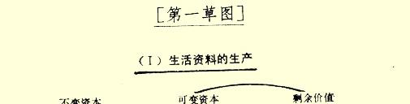

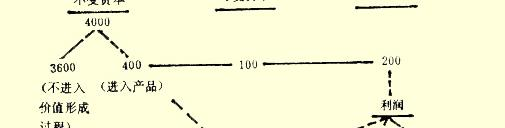

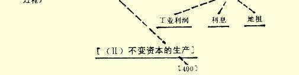

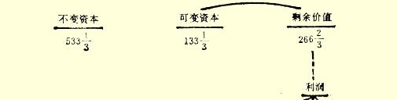

 程度上还存在于直接生产者及其生产条件之间的统一；使直接生产者转化为雇佣工人，使他们的劳动资料转化为同作为雇佣工人的他们相对立的资本；

（４）通过资本积聚（和竞争）扼杀各小资本，并把它们联合成大资本，虽然和发达领域中的这种吸引过程同时发生的，还有新出现的就业部门等等的排斥过程。如果没有这种情况，资产阶级生产就会很容易地和很快地到达自身的崩溃。

［—１３９０］｛**再生产过程图表（绘制时没有考虑货币流通**，**并假定再生产规模不变**）１１５。

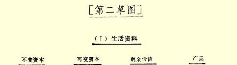

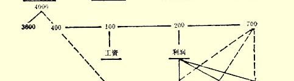

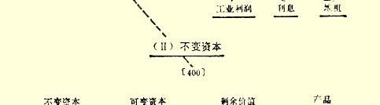

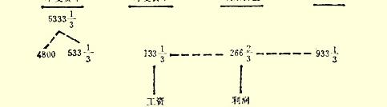

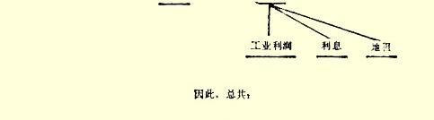

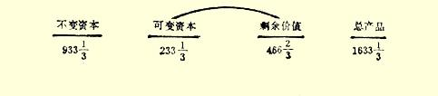 ［—１３９１］不进入**产品**，即不进入价值形成过程的那一部分 **不变资本**（从而在这里也就是**固定资本**），在各处一律略去［ —１３９１］。

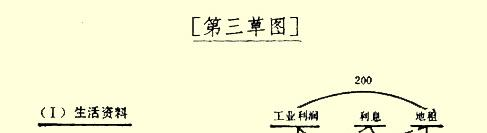

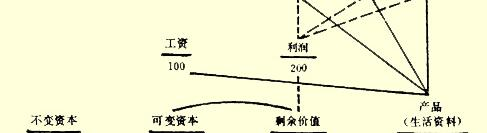

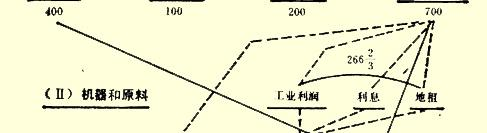

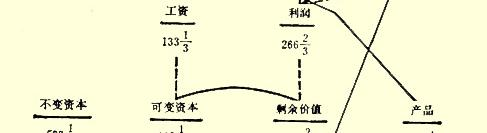

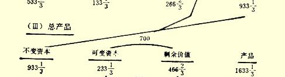

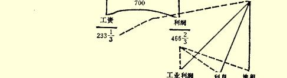

**我们在项目（**）中看到，不变资本等于４００，又完全表现在产品中。这一产品全部由生活资料组成，后者进入消费基金，尽管只有一部分进入第类的消费基金。可变资本等于１００，除了自身在产品中再生产出来以外，还创造剩余价值２００。这１００单位的可变资本以工资形式用货币支付；从总产品７００中取出产品１００用于这种工资。这样一来，货币又流回到第类资本家的手里。全部剩余价值表现为利润，但又分解为工业利润、利息和地租，其中至少后两部分全部用货币支付。这种收入的所有者从产品量中得到 ２００单位。因此，第类从它本身所生产的产品量中消费掉３００；同时货币流回到资本家手里，因而资本家可以重新以货币支付工资、 利息和地租。没有被消费掉并且可加以利用的产品余量等于 ４００，—— 产品的这一价值部分［—１３９２］是补偿不变资本 ４００所必需的。

**在项目（）**中，全部产品由原料和机器组成。**可变资本**１３３１

３ 用于工资（货币）；用这些货币获得第类产品量的１３３１３。这样一来，１３３１３以货币形式从第类流往第类，而第类的产品则以同一数量转往第类。剩余价值２６６２３的一部分以货币形式支付利息和地租，并以同一数量购买第类的产品量。这一货币量连同由该类［第类］的工资、利息、地租流回的货币，连同第类的工资，用来以货币形式向第类提供４００是绰绰有余的，而第类则用这些货币补偿自己的不变资本４００，这样一来，第类的资本家就可以用自己的工业利润来从第类的产品量中获得生活资料。 结果，第类的全部产品转入消费基金，而第类产品量中有４００ 转入第类被用来补偿它的不变资本，有５３３１３［第类］要用于补偿它本身的不变资本。

的确，情况就是这样。

**第类**中１００以货币形式用来支付工资。工人用这１００获得第类产品量中的１００；从而，１００又以货币形式流回到第类的资本家手里；他们可以用这１００重新购买劳动。［第类］资本家的剩余价值２００中有一部分用来支付上年的利息和地租；利息和地租的［所得者］用这些货币从第类产品量中购买与自身相应的部分。因此，货币迅速返回到第类的资本家手中；第类的资本家用这些货币重新支付利息和地租，即重新开出获得下年产品的取货单。至于工业利润，一部分被［第类］的资本家以实物形式消费掉，一部分则通过支付货币来相互交换［这种利润］。

**第类**把１３３１３（货币形式）用于工资。第类的工人阶级用这些货币购买第类［资本家］的产品。因此，这１３３１３以货币形式迅速回到第类［资本家］的手中，他们用这一数额购买第类的产品。同时，第类利息和地租［所得者］的货币迅速转到第类 ［资本家］手里，后者用这些货币从第类产品量中获得自己的份额。第类的［资本家］用这些货币购买第类的产品，因此，这些货币又流回到第类［资本家］手里；后者可以重新用这些货币支付工资以及利息和地租。他们用这笔货币中等于他们的工业利润的那部分购买第类的产品。第类的［资本家］用这些货币购买第类的产品量中他们所必需的其余部分。总之，他们从第类的产品中购买了相当于他们的不变资本的４００，并补偿不变资本。第类的全部产品转入消费基金。另一方面，回到第类［资本家］手里的，是他们用于支付劳动、利息、地租以及用于本类内部资本家之间货币交易所需要的全部货币。

**关于项目（**）。第类的总产品表现为社会不变资本，而第类的总产品一部分表现为第类和第类的可变资本总额，一部分表现为两个类中在各种项目下消费掉的收入总额。｝

［—１３９３］｛关于上述各个经济表，必须指出下面几点：

（１）不变资本由固定资本和流动资本组成。**固定资本**中不进入 **价值形成过程**的那**部分**一律略去。或者，同样可以说，不变资本项目在这里只包括进入**年再生产**，从而进入**年总产品**的那部分**固定资本**。

一部分资本由**货币**组成。只有可变资本在这里表现为**货币资本**。相反，利息和地租表现为货币所有者手中拥有的货币额。流通中的货币量比它在这里所表现出来的量，即一部分作为可变资本的货币表现，另部分作为利息和地租的货币表现而表现出来的量实际上要少得多。

（２）商业资本和货币商业资本在这里不能单独表现出来，因为这会使图表变得太复杂。

（３）**再生产**由于同一原因假定是不变的，因为要描绘积累过程，同样会使对于基本运动的简明理解陷于纷乱。

（４）图表和的［各项目］表明，第类的总产品表现为社会不变资本，第类的总产品实现在两个类的可变资本和剩余价值上。这一过程在图表的［项目］中被当作前提，所以在这里第类的产品直接表现为不变资本，而第类的产品直接表现为可变资本和剩余价值总和。

（５）**虚线**总是表示费用的**来源**，表示流通的起点，即表示费用 **上升**的方向；**实线**［也］表示费用的来源，但表示费用**下降**的方向。

整个图表画在下一页上１１６。

［—１３９４］［简单］**再生产总过程的经济表**［见第１７２页的图表］。｝

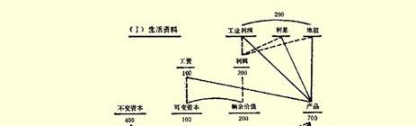

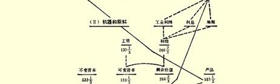

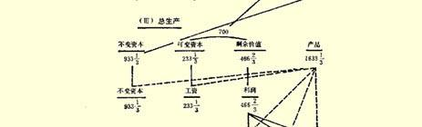

[^1]: 见本卷第１３１页。—— 编者注

[^2]: 见本卷第１４１页。—— 编者注

[^3]: 见本卷第１４５页。—— 编者注