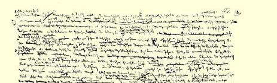
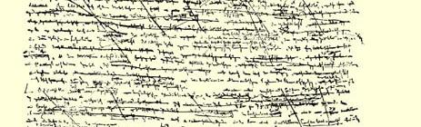
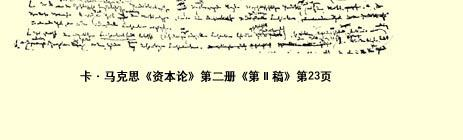
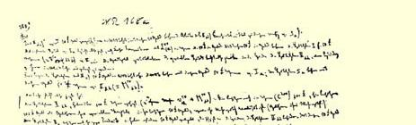
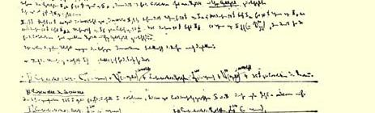

## ［０ａ］第二册[^1] 目录２ **第一章**。**资本的循环**（第１—３３页）[^2] ** （１）流通的三种形态**

#### （ａ）货币资本流通的形态。资本的形态变化。货币资本。 生产资本。商品资本 （ｂ）生产资本流通的形态 （ｃ）商品资本流通的形态 （ｄ）循环的三种形式 ** （２）流通时间** ** （３）流通费用**

#### （ａ）从简单流通形式中产生的费用 （ｂ）在流通本身里进行的生产过程中产生的费用 （α）储备的形成 （β）运输费用。（补偿费用和其他费用） **第二章**。**资本的周转**（第３４—１２９页） ** （１）周转的一般规定**。**周转时间和周转次数** ** （２）形成资本周转中的差别的各种情况**

#### （ａ）固定资本和流动资本。从固定资本产生的周转周期 （ｂ）劳动期间长度的差别 （ｃ）生产时间和劳动时间之间的区别 （ｄ）从生产过程的特殊方法产生的周转周期 （ｅ）流通时间的差别 ** （３）流动（可变和不变）资本一般的周转规律** ** （４）可变资本的周转和年剩余价值率** ** （５）积累**。**从剩余价值实现为货币的观点出发研究货币流通第三章（见背面）** **第三章**。**流通过程和再生产过程的现实条件** ** （１）从社会的观点来考察的可变资本**、**不变资本和剩余价值**

（第１３０—１４１页）

#### Ａ简单再生产（第１４１—页） （ａ）不以货币流通为媒介的情形（第１４１—１５８页） （ｂ）以货币流通为媒介的情形 Ｂ规模扩大的再生产。积累 （ａ）没有货币流通的情形 （ｂ）以货币流通为媒介的情形

**（２）**

## ［１］第二册资本的流通过程 ［２］第一章资本的循环过程 （１）资本的形态变化

#### 流通的第一形态Ｇ—Ｗ—Ｐ—Ｗ′—Ｇ′。 货币资本，生产资本，商品资本

一般说来，资本展现在我们面前的第一个形式是**货币**形式，货币进行循环Ｇ—Ｗ—Ｇ′，—— 货币转化为商品，商品再转化为数量更多的货币，买是为了以更高的价格去卖。从简单商品流通来看，这一过程仍旧是无法解释的（见第１册第２章３）。这个谜通过分析**资本主义的生产过程才能解开**。**在这个过程中实际上不是简单地生产商品**，**而是生产这样的商品**，**它们的价值大于其生产各要素的价值**，**因而发生了价值增殖**。**通过随后进行的**商品出售，包含在商品中的剩余价值不过取得**货币形式**。

例如，假定资本家最初预付５４０镑，即：４００镑用来购买８０００ 磅棉花，８０镑用来补偿已被磨损的劳动资料，纱锭等等，６０镑用于工资。假定剩余价值率是１００％，而商品产品是８０００磅棉纱；这 ８０００磅棉纱的价值就等于４８０镑。ｃ＋６０镑ｖ＋６０镑ｍ，（１）或６００ 镑，比如说它是２０００个十二小时工作日的货币表现，其中只有 ４００花费在纺纱过程本身中，而２００是剩余劳动。因此，如果每磅棉纱卖１先令６便士，或者，如果８０００磅棉纱卖６００镑，那么它们便是**按自己的价值**出售。实际上，如果资本家把１磅卖１６１５便士，或把８０００磅卖５４０镑，那么他便是向买者送了１１０的礼，相当于８００磅棉纱，或者说**比**商品的价值**便宜１１０**销售商品。剩余价值是商品价值的一部分。因此，如果商品**按其价值**出售，那么同时 **也就是实现了剩余价值**。已取得**商品形式的**（在这种情况下是棉纱）、已成为现实的２００天无酬劳动，通过出卖棉纱不过取得**货币形式**。

或者，假定两个资本家互相直接出卖自己的商品（例如，棉纱和棉花）；在这种情况下货币只是充当**计算货币**。其次，假定在生产他们的商品的时候使用的劳动量相同，剥削程度也相同；在这种情况下，虽然双方**都只是交换等价物**，６００镑棉纱的价值和 ６００镑棉花的价值相交换，但Ａ先生和Ｂ先生都实现了６０镑利润。在交易结束以后，Ａ拥有棉花形式上的剩余价值６０镑，而不再是棉纱，另一个人Ｂ拥有棉纱形式上的剩余价值，而不再是棉花。他们手里的６０镑剩余价值只是**改变了使用形式**，但它早在交换以前就已存在。无论在交换以前还是在交换以后，总价值１２００ 镑都以棉纱**和**棉花的形式存在。但是交换以后也和交换以前一样， 这一价值的１１０，１２０镑是**剩余价值**，也就是除剥削相应的劳动力外不需要两个资本家花费分文的那一价值的数额。劳动有酬或无酬 —— 这种情况对于它创造价值的性质绝对没有任何关系。正因为这样，Ａ必然**卖给Ｂ**（而Ｂ也卖给Ａ）１０１０的商品价值，而他们每人**只支付了**这个商品价值的９

１０。

资本家实际上知道剩余价值或资本增殖的秘密。这一点可以由他在生产过程中的一切行为，由他疯狂追求剩余劳动得到证明。 不过，他虽然不是德奥古利，却过着双重生活４：一种生活是在避开旁人视线的生产领域，在那里他是主人和统治者；另一种生活是在公开的市场上，在那里他以买者和卖者的身份出现，和自己相同的人打交道。这种双重生活在资本家的头脑里产生双重的神经冲动，从而产生双重的意识。他处在生产领域中的时候所懂得的东西，他在流通领域中已经不能懂得了。

我们的资本家由于在生产过程中占有无酬劳动，无可争辩地从５４０镑造出了６００镑的价值，从而**生产出**６０镑的剩余价值。预付的价值额只是由于**丧失自己独立的价值形态**才获得增殖的能力。

最初预付的５４０镑**货币**现在变成了**价格**为６００镑的８０００磅 **棉纱**。这种价格只在观念上是棉纱价值的货币形式，它只有通过出售棉纱才能**实现**。虽然它在生产领域中**已被生产出来**，但是剩余价值象商品价值的其他组成部分一样，只有在流通领域中才能 **实现**。促使货币贮藏者把商品的价值和价值形式混淆起来的那种错觉，也使资本家把剩余价值的创造和它转化为金或银混淆起来。

前面我们已经看到，（２）由于商品转化为货币对商品的单个卖者来说是一个困难的和充满危险的过程，这种混乱就巩固下来了。 对于大量生产、因而必须大量出售的资本家来说，随着营业规模的扩大，危险也增加起来。如果他原先没有占有整个工人大军的剩余产品，那他现在就不需要出卖这种产品。而他恰恰相反，用他出卖这种产品所花费的劳动来解释对他人劳动产品的占有。不生产商品而只是盗窃商品的比耳·赛克斯还可以更加天花乱坠地谈论出售商品的危险。

其次，资本家通过出卖商品来**实现**从他的工人那里榨取来的剩余价值的多少，不仅随着市场价格的一般波动而改变。在商品市场上资本家同“资本家” 相对立。狡猾对狡猾开始单独决斗。 “海盗和海盗莫相残”，或者象［３］**马屠朗·雷尼埃**所翻译的那样：

> “海盗相残，一事无成”５。

假定我们的资本家不得不以５９０镑销售他那８０００磅棉纱。虽然他生产了６０镑剩余价值，但是他只实现５０镑剩余价值。他的剩余产品的六分之一，即１３３１３磅，只不过是为他的伙伴致富而纺的。你们，不是为了你们自己６。反之，如果他能够**高于商品的价值**出卖商品，例如卖６１０镑，那么，他虽然只生产了６０镑的剩余价值，但他实现了７０镑的剩余价值。剩余价值的七分之一，即 １０镑，不是在他的生产领域中生长出来的，而可能是在邻人的生产领域中生长出来的。但是他亲手在赫斯贝里德姊妹的圣园里摘下了这些流通的金苹果，所以他认为做出了纯粹是海格立斯式的业绩７。在这两种情况下，在单个资本家生产的剩余价值和他出卖商品所实现的剩余价值之间出现了**量的差别**。在这种不正当交易的时候，不仅是剩余价值，甚至一部分资本价值也可能不付**等价物**而更换所有者。在那些得到资本价值的人的手里，这一部分不断形成剩余价值。由于市场变化无常，这种变化实际上只是**改变已有的价值的分配**，结果，剩余价值的来源就变得不清楚了，资本家本人最后再也不知道什么是什么了（３）。

Ｇ—Ｗ—Ｇ′循环使下述情况变得不可思议：在Ｇ—Ｗ行为即购买商品以后和Ｗ—Ｇ′行为即重新出卖商品以前实现的资本主义生产过程，始终是看不见的。这样，如果我们用字母Ｐ来表示这一生产过程，那么Ｇ—Ｗ—Ｇ就变为Ｇ—Ｗ—Ｐ—Ｗ—Ｇ。

**第一个阶段**：Ｇ—Ｗ。这是**货币转化为资本的准备阶段**（从第 １册考察的观点来看）。

资本价值，即其使命是**作为资本发挥职能**的价值，它最初是以 **货币形式**存在着的。它在这一形式上开始自己的运动。第一个过程，Ｇ—Ｗ，是简单的流通行为，是**买**，是价值从货币形式转化为商品形式。但是这种**形式上的**行为作为资本生活中的一个阶段，具有 **职能上的一定内容**。价值在货币上拥有自己的一般等价形式。因此，作为货币预付的资本价值，能够按照它要在其中发挥职能的生产领域的不同而转化为极不相同的商品。但是要作为资本发挥职能，货币就**必须**变为**劳动过程的各要素**，即**生产资料**（不管它们具有怎样的特殊形式）和**劳动力**（不管它们的用途如何）。货币必须变为不变资本和可变资本。生产过程的分析表明，购买劳动力本身的所有者在市场上出卖的劳动力，是资本主义生产的起源。

**第二个阶段**：**Ｐ**

当资本价值在第一个阶段中靠流通行为从货币转化为商品之后，也就是说，从物质的观点来看，转化为生产资料和劳动力，转化为形成产品和价值的各要素之后，接着第二阶段是**这些商品的消费**。劳动力通过它的活动表现即通过劳动本身被消费；生产资料被劳动消费，劳动把它们作为自己活动的物的要素，作为劳动材料和劳动资料消费掉。[^3]同时，在这一过程中有更多的劳动力转入流动状态，也就是在进行这一过程时花费的**劳动多于**构成劳动力价值，从而构成它的价格或它的用货币支付的价值的劳动。因此，资本价值生涯中的这第二个阶段是它的**生产消费**，即**生产过程**，也就是**资本主义生产过程**。和发生单纯形式上的形态变化，即货币和商品互相换位，价值从货币形式转化为商品形式的第一个阶段相比，这第二个阶段包含着资本价值的**实际形态变化**，即双重的形态变化。一方面，发生了**物质的**形态变化。创造出新产品， 创造出劳动过程熄灭在其中的一个成果。这种产品在**实物形式上** 与在商品市场上购买的**形成产品**的各要素是不同的。例如，虽然小麦本身作为形成产品的要素加入小麦的生产，但是在生产小麦时形成产品的各要素中，不仅有小麦，而且还有肥料、机器等等， 最后，还有劳动力。因此，即便是在产品本身以不同的方式出现在同样一些产品的生产资料中的情况下，它的**实物形式**也跟生产它的Ｘ种要素的实物形式不同。但是，第二，除了这种**物质**形态变化即作为劳动过程来看的生产过程的结果以外，资本价值发生了**价值变化**，这种变化是从**价值形成**过程来看的生产过程的结果。 **资本价值创造出**超过以货币形式**预付**在购买商品—— 劳动力和生产资料—— 上的**价值的余额**，**剩余价值**在生产过程**之前**并不存在， 它只是在商品生产过程中加到商品上的剩余劳动或无酬劳动。

物的因素—— 生产资料—— 在货币**开始**转化为资本时不是必须作为**商品**出现在市场上的。例如，厂房、机器等等是根据订货生产的。这里的货币在形式上起支付手段的作用（就是说，在交货以后立即实行支付的情况下也是如此）。另一方面，只是由于资本家的需求，现有的人们才能够作为劳动力活动—— 雇佣人员、儿童等等。

［４］商品简单的形态变化Ｗ—Ｇ—Ｗ完全是在流通领域范围内，也就是在商品市场上进行的[^4]。商品一旦进入消费，它便退出流通。资本价值的情况则不同。资本价值的**生产消费**，或它在**流通领域以外**发挥职能，即在生产领域内发挥职能，构成资本价值循环的特殊生命阶段。因此，只有当资本价值在生产上被消费，从流通领域回到生产领域，在这里无论在实物形式上还是在价值量上都发生了实际形态变化以后，第二个行为，卖，才会补充第一个相反的行为，买。

资本价值在它的前两个阶段中的运动，自然是以资本家为媒介的。这种运动作为**他**自己的运动表现成这样：他起初作为**流通的当事人**，作为商品的买者—— 劳动力和生产资料的买者**发挥职能**。然后他从商品市场上消失，去作为**商品生产者**，请注意，作为**资本主义商品生产者发挥职能**。

**第三个阶段**：Ｗ′－Ｇ′，作为资本家的行为是**卖**，作为发挥职能的资本价值本身的过程是从**商品形式再转化为货币形式**。这纯粹是形式上的流通行为或纯粹是商品简单形态变化的阶段。诚然， 第一个阶段，Ｇ—Ｗ，也是纯粹的流通行为或商品简单形态变化的环节，但是这个行为作为资本循环中的一个生活阶段，**在物质上已**被规定，具有特殊的内容—— 价值从它最初的货币形式转化为生产资料和劳动力，转化为资本主义生产过程的各要素。相反， Ｗ—Ｇ，生产过程在其中熄灭的那个商品的卖，不具备这种在**物质上**规定了的、职能上规定了的内容。

资本主义商品生产者，也和任何其他商品生产者一样，必须出卖商品，把商品从它的实物形式变成它的等价形式，或者说变成货币形式。除了这种形式的转化以外，卖不具有任何其他内容。 Ｇ—Ｗ则相反，不只是买，不只是货币形式变成商品形式，而且是货币形式变成特殊的一定性质的**商品**。

当我们孤立地考察Ｗ—Ｇ本身时，情况便是这样。但是，如果同循环的上一阶段联系起来考察，那它就是另一种样子。最初以货币形式存在的资本价值，上述例子中是５４０镑，在第一个阶段Ｇ—Ｗ中变成价格为５４０镑的商品，即生产资料和劳动力。这些商品在生产过程中，即在吸取剩余劳动的过程中孕育着剩余价值。产品——８０００磅棉纱—— 的价值因此等于构成产品要素的最初的价值５４０镑＋剩余价值６０镑，即６００镑。可见，离开生产过程的商品Ｗ比最初进入生产过程的那些商品Ｗ具有**更高的**价值。因此，我们用Ｗ′来表示这种商品。如果Ｗ′按其价值出卖，那么它便卖６００镑，即５４０镑最初的资本价值＋６０镑这一资本价值的增殖额。退出生产过程的商品孕含着剩余价值，即在生产过程中转入流动状态的无酬劳动所体现的价值增殖额。和最初的预付资本价值相比，这个商品是**增大的**价值，它等于最初的资本价值 ＋它的增殖额。但是这一增大的价值现在在商品的形式上作为新形式的商品例如棉纱的价值而存在。它现在只在等于５４０镑＋６０ 镑的棉纱价格上具有独立的形式，也就是它只具有观念上的货币形式。通过出卖商品，Ｗ′—Ｇ′，这一价格得到**实现**，即商品价值从商品形式再变成货币形式。但是，由于商品价格的这种实现，不仅最初的资本价值，５４０镑的Ｗ或Ｇ，获得了它在Ｇ—Ｗ行为中失去的它最初的货币形式，而且在生产过程中**新生产的**和**表现**在商品价格上的**剩余价值**６０镑也转化为６０镑货币。

因此，被看作发挥职能的资本价值的一个生活阶段的Ｗ′— Ｇ′行为，决不单纯是卖。它是预付在生产商品上的资本价值＋在生产中加进资本价值的剩余价值的实现。这是孕含着剩余价值的商品转化为金或银，因此，这既是预付资本价值返回到它最初的货币形式，也是剩余价值在货币上的实现。从一般形式来考察的卖也是商品价格的实现，或它们的价值表现在货币形式上。但是， 由于表现在商品价格上的价值在这里等于最初的资本价值＋剩余价值，那么卖也就是这样一个价格的实现，它等于最初的资本价值＋新生产出来的超过这一资本价值的余额或剩余价值。因此，如果说Ｗ′—Ｇ′行为不象Ｇ—Ｗ那样表现为**物质上**一定的行为（从而表现为资本价值生活中特殊的职能行为），即表现为货币转化成它作为资本发挥职能所预先决定的**特殊使用形式**（生产资料和劳动力），那么相反，它对发挥职能的资本价值的**价值量**来说具有特殊的规定性。这不只是包含在商品价格中的资本价值的实现，而且也是和它结合在一起的**剩余价值**的实现—— 剩余价值的实现。 这种规定性恰恰只对于资本家或发挥职能的资本价值来说才存在，它只存在于资本家生活的普遍联系中，或这一生活的不同阶段的彼此关系中。

对买者来说，Ｗ′就是Ｗ，就是一定价值的商品。例如，对于 ８０００磅棉纱的买者来说，棉纱的卖者出卖这８０００磅是补偿他的资本，还是他愿意把卖得的货币作为收入来消费，完全是无关紧要的，就象对于他来说，在纺纱过程中把１２０镑加到４８０镑生产资料上的那４００个工作日，是否在其中有２００代表有酬劳动，２００代表无酬劳动，也就是说，它们是全部还是只有一部分代表工人的价值，也完全是无关紧要的一样。他必须支付的，［５］是这８０００磅棉纱的价值，即４８０镑（已消费的生产资料的价值）＋代表４００天剩余劳动的１２０镑，也就是６００镑。对于棉纱的买者来说，Ｗ′—Ｇ′＝ Ｇ—Ｗ，购买商品，仅此而已。［５］［１８］Ｗ′—Ｇ′，也和Ｇ—Ｗ一样， 都是流通的简单行为。买（Ｇ—Ｗ）比卖（Ｗ—Ｇ）更容易，这种差别在考察简单商品流通的时候已经分析过了。这种差别产生于**货币** 和**商品**之间的差别。但是，作为独立的资本循环的两个阶段，Ｇ— Ｗ和Ｗ′—Ｇ′有着本质的差别，因为Ｇ—Ｗ对于货币资本转化为生产资本，从而对于预付价值开始增殖来说，是必要的过程。从资本家的观点来看，这是**不可避免的不幸**。相反，在Ｗ′—Ｇ′行为中， 问题就不仅是预付资本从它的商品形式再转化为它的货币形式了。这同时也是**剩余价值的实现**。资本家在这里不象是在Ｇ—Ｗ 行为中那样进行预付；他是获得，并且获得的比它预付的多。因此， 他买（Ｇ—Ｗ）的时候没有卖（Ｗ′—Ｇ′）的时候热情高，而卖的愿望比买的愿望更强烈这一事实，并非产生于Ｗ—Ｇ是一般商品流通的一环，而是产生于它是独立的资本循环中的一环。［１８］

［５］可见，资本循环Ｇ－Ｗ—Ｐ—Ｗ′－Ｇ′，一方面和**一般商品流通**结合在一起，加入其中，构成它的一部分。另一方面，它构成资本价值自己的独立运动（对资本家而言，资本家使用自己的货币，让它们发挥资本的职能），这一运动部分地在一般商品流通的**范围**内进行，部分地在一般商品流通的范围外进行。

这一运动的独立性表现在：（１）流通的两段，Ｇ—Ｗ和Ｗ′— Ｇ′，买和卖，作为资本运动的阶段在职能上具有一定的性质。Ｇ— Ｗ，买，在**物质上**是被规定了的。货币转化成的或被购买的那些商品必须具备**特殊的使用形式**。一方面，它们必须充当生产资料，另一方面，必须包括劳动力。如果货币所有者不能购买劳动力，如果劳动力不被它自己的所有者拿去作为商品出卖，那么货币就根本不可能转化为资本，或者说，价值就根本不可能作为资本价值发挥职能。另一方面，Ｗ′—Ｇ′这一段流通作为一般商品流通的行为（换句话说，对商品的买者来说是单纯的买，或者从商品所有者方面来说是卖），作为资本价值运动中的一个生活阶段，不仅是预付在商品生产上的资本价值的实现，而且也是生产过程中新加到商品上的剩余价值的实现。（２）资本循环不仅包括两个属于流通领域的简单商品形态变化的阶段，Ｇ—Ｗ和Ｗ—Ｇ，买和卖。它还包括**流通领域范围以外的生产过程Ｐ**，也就是商品—— 生产资料和劳动力 —— 的**生产消费**，这些商品的形式是最初的资本价值Ｇ通过流通行为转化成的。简单的商品形态变化Ｗ—Ｇ—Ｗ完全是在流通领域范围内进行的，并且仅由两个流通行为组成。商品的消费并不涉及这种形式变换。商品一旦转化为货币并从货币再转化为商品，商品便**退出流通**而进入**消费**。（３）最后，资本价值在一般商品流通范围内所实现的循环的独立性表现在这一点上：资本价值经过一系列部分地是形式上的，部分地是实际上的形态变化以后，它重新返回到自己最初的货币形式上来—— 这些货币只发生了数量上的变化；或者表现在这一点上：资本家起初投入流通的货币最后终于又流回到他那里—— 即流回到他那里时已经是增殖了的货币。资本价值开始自己生活的第一个形式，货币形式，也是运动结束时的最后形式，或者说，资本家预付的货币再流回到他那里即流回到出发点，这种情况象在考察Ｇ—Ｗ—Ｇ′时已经指出的那样（第１册第２ 章[^5]），是对买的行为进行补充的那个卖的行为的必然结果。由于购买商品，货币投入流通，而商品则退出流通。由于随后补充的卖， 商品又投入流通，而货币则退出流通，或投入流通的货币从流通中流回到它们的出发点。货币向它们的出发点的回流（或者说，资本价值再转化为它最初的货币形式），是对购买商品进行补充的出卖商品的必然结果。这一运动无论如何不会由于购买商品之后和重新出卖商品之前所发生的停顿而改变，在停顿时期，买来的商品由于进行生产消费或通过生产过程，既改变了自己的实物形式，也改变了自己的价值。商品买来以后都要重新出卖，而不管它的实物形式或它的价值怎样变化。因此，货币一定会发生向它们的出发点的回流，或者说，商品形式再转化为最初的货币形式。至于除此之外流回的货币数额多于最初预付的数额，它增加了剩余价值量，现在要解释这一点是很简单的。如果说资本家作为卖者从流通中得到的货币多于他作为买者投入流通的货币，那只是由于他再投入流通的商品Ｗ′比通过买从流通中取出的商品Ｗ具有更大的价值。 归根到底，他从流通中得到的货币所以多于最初投入流通的货币， 只是因为他作为卖者投入流通的商品的价值大于他作为买者从流通中取出的商品的价值。

的确，重要的是应当指出，资本循环Ｇ－Ｗ—ｐ—Ｗ′－Ｇ′包括 **商品**Ｗ的即货币在第一阶段转化成的那些商品的**消费**，这也就是它们的生产消费或生产过程。但是，这个循环并不**直接**包括退出生产过程，然后又被投入流通的商品Ｗ′的消费，而只包括**它的出卖**，包括它再转化为货币。诚然，退出生产过程的商品必须是使用价值，有用物，它只有在下述情况下才可能成为这样的有用物： 它的实物形式使它能够或者充当生产资料或享受资料，或者充当生产消费或个人消费资料，而尽可能是两者兼而有之。归根到底它是供生产消费或个人消费用的，归根到底购买它只是为了以这种或那种方式消费掉。但是，它的消费不包括在资本价值的循环中，这种资本价值在流通中由于出卖而再次抛弃它在生产过程中获得的商品形式。商品，例如棉纱，一经出卖，表现在棉纱上的资本价值的循环就能重新开始，而不管这些棉纱发生了什么变化。 因此，只要商品出卖没有任何困难，在资本主义生产者看来一切都是正常的。他所体现的资本价值的循环没有中断。他的买者，商人，与此同时可以在世界的这一或那一地区把未卖出的棉纱囤积起来（保存在仓库里），并在或长或短的时间里继续购买新的棉纱， 他们这样做或者是用自己的货币，或者尤其常见的是用借来的货币，即他通过信贷能加以支配的货币。显然，归根到底商品（棉纱）必须卖给购买它的买主，才能进行消费，即进行生产消费或个人消费。凡是最后不把商品提供给消费者（生产消费者或个人消费者）的一切买和卖的行为，都只是暂时的行为，不是最终的行为。因此，买者—— 这里指的不只是从生产者那里购买商品的第一个买者，而且是在商品卖给最终消费者以前经手的那一系列买者—— 归根到底必须销售商品。如果后来弄明白，这种商品或者不可能出售，或者只能降价出售，那么最后对生产者的反作用就变得明显了。那时，我们会看到在每次危机中都会定期重复的现象经常出现在国会的发言里，出现在货币市场的出版物里。这些言词充满信心地说生产是“健康的”，可是突然间，由于各种偶然性和商业上的冒险行为而变得“不健康” 了。（４）

［６］资本价值通过它在自己的运动中经历的三个不同的阶段而创造出不同的形式：**货币资本形式**、**生产资本形式和商品资本形式**。同一资本价值按照它处于自己循环的某一阶段和完成某一职能的情况，而轮流采取**货币资本**、**生产资本**和**商品资本**的形式。 这些不同的形式是资本在其循环中所经历的各种**形态变化**。

## （１）货币资本

对于**一般商品流通**来说，货币资本只不过是**货币**。这些货币只有作为过程中的资本价值的特殊的、**职能上**一定的形式中的一种，即只有对于资本在一般流通范围内所完成的**独立循环**来说，才是**货币资本**。因此，在流通的每一单个行为中，货币资本也只是完成**货币职能**中的某一种职能，它只是充当购买手段，支付手段等等。在上述例子中，资本家预付５４０镑，所以代表１６００个十二小时工作日的价值便**以**货币形式的**资本**，以５４０镑的形式，开始自己的循环。在这５４０镑中，６０镑用于购买劳动力。对于５４０镑必须作为资本价值完成的循环来说，这６０镑不只是货币资本的一部分。 在资本家手里，它是货币资本的**可变部分**，即其中用来变为活劳动力的部分。但是在市场上，在**一般商品流通**的范围内，这些货币对于资本家本身来说只完成一定的职能，它们充当他的购买手段或商品的支付手段，在当前的情况下是劳动力的支付手段，此外，同一６０镑一旦转到工人手里，便失去了资本的性质。对工人来说，它们只是商品形态变化Ｗ—Ｇ—Ｗ中商品的正在消失的货币形式。 工人为６０镑而出卖劳动力，其目的是用这６０镑购买生活资料。因此，这６０镑只是作为**流通手段**发挥职能。

在流通的图式Ｇ－Ｗ—Ｐ—Ｗ′－Ｇ′中，资本价值的开始形式和最终形式—— 即开始自身增殖的资本价值形式和已经完成这种增殖的资本价值形式—— 是**货币资本**形式。５４０镑价值又以其货币形式存在，但是，这５４０镑作为货币资本，即作为最初预付的货币额对６０镑剩余价值的关系是对自己成果的关系。由于作为货币资本的５４０镑和作为它的金价值产品的６０镑之间存在差别，资本家便能够例如吃掉这６０镑，而把５４０镑作为资本价值重新投入循环。但是在这里，如果我们考察一般商品流通中货币流回到出发点的那一阶段，即Ｗ′—Ｇ′，考察在生产过程中得到的商品８０００ 磅棉纱的出卖，那么货币无论是在卖者即棉纱的资本主义生产者手里，还是在买者手里，都只是起货币的作用。在**每次**出卖的时候，货币都充当买者的购买手段或支付手段，而对于卖者来说，它们充当他的商品的转化形式，货币形态。

在考察**货币**的时候我们已经看到，它们的形式之一是**贮藏货币**形式。如果这种贮藏货币具有**职能上的作用**，那便是充当购买手段或支付手段的**准备金**。相反，如果货币作为财富最终的绝对的形式一直保存下来，那么贮藏货币便只是金银的毫无意义地积累起来的储备。如果资本家不得不使他的一部分货币资本发挥准备金的作用，那么这种准备金正是处于贮藏货币的一定职能形式上的 **货币**，即为了将来的购买或支付所必需的货币储备。这种货币储备只有作为过程中的资本价值时而采取、时而抛弃的形式和职能之一，才是**后备货币资本**。资本家远不赞同货币贮藏者的幻想。因此， 他没有以贮藏货币形式保存自己货币的宿愿。但是他往往遇到这样的情况：商品流通提供给他的货币，或者可能是他在流通中进行其他投机而得到的货币，对他来说既不需要直接用作购买手段或支付手段，也不需要用来恢复他的准备金，于是，这些货币便停滞在他那里成为**贮藏货币**，成为**不执行任何职能**的货币。这些货币对他本人以及对一般的流通来说是**单纯的贮藏货币**—— 简直是货币贮藏者握在手心里的贮藏货币。这些贮藏货币只是剩余价值变成的金，这种剩余价值只要达到一定的数额，便会作为追加资本起作用，因为我们记得，决不是任何数量的货币都能作为资本起作用。 或者，它可能是最初预付的并从流通中以货币形式返回的资本价值的一部分，不过这一部分由于市场条件不利，不能再直接转入流动状态，所以它停滞在贮藏货币的形式上仅仅表明它的职能**被中断**等等。无论如何，这种贮藏货币都是单纯的贮藏货币，只有在资本的特殊循环中占职能上的一定地位以后，才能获得**货币资本**的用途。贮藏货币形式上的现有货币资本是**潜在的**货币资本，它或者还没有执行自己的职能，或者执行的职能被中断。

从上面的叙述中可以得出结论：如果说**货币资本**作为过程中的资本价值在自己的循环中时而采取、时而又抛弃的特殊的职能上一定的形式之一（或者也可以说，这种资本价值在自己的一系列形态变化中所采取的形式之一），由于本身一定的性质而不同于对它进行补充的其他形式，那么这些性质并不是由于**货币资本**是资本，而是由于资本在这里具有**货币**形式，—— 可见，也就是具有货币所特有的与众不同的性质。例如，５４０镑不在纺纱生产中，也能在任何其他生产部门中自行增殖，因为象货币本身一样，资本家也是万能先生。或者，如果第一个循环结束时资本返回到它的货币形式上，［７］它能够全部或部分地转化为其他实物形式的生产资本。相反，已经转化为一定生产要素的资本也只能在以这些要素为条件的生产过程中起作用，而商品资本，即这８０００磅的棉纱，只要还没有卖出去或再转化为货币，就既不能在同一生产部门中，也不能在其他生产部门中作为资本重新发挥职能。**货币资本转化的能力**—— 这种能力对于节省社会资本在不同的投资领域中不断变化的分配来说起着很大的作用—— 依然不是产生于它作为**资本**的性质，而是产生于它作为**货币**的性质。货币作为商品的一般等价形式具有直接交换一切商品的性质，从而具有转化为任何使用价值的能力，而不论所得到的使用价值是否已经是上市的商品，还是按照订货生产的。

我们来看另一个例子：我们的资本家发现他的资本在国外比在本国增殖得快，—— 而我们的资本家也和货币本身一样，是世界主义者。现在产生了一个问题：资本以什么形式输往国外呢？作为 **商品资本吗**？但是别国的边界上可能有海关人员和异教徒守在那里禁止商品输入。或者国内某些商品的生产比国外贵。那么它们便不适于出口。至于其他商品，国外可能已经充斥，它们的价格因此低于正常的水平，等等。在这样的商品市场行情下，最有利和最正确的做法，是把渴望旅行的资本在**货币形式上**作为**货币资本**送出去。但是为什么呢？不是因为货币资本是资本，而是因为它是货币形式上的资本，货币现在也起世界货币的作用。这里有意义的是 **货币**和**商品**之间的区别，而不是货币**资本**和商品**资本**之间的区别。 成为**资本**—— 不如说这是它们共同的性质，在**货币**或**商品**形态上成为资本—— 是它们的特点。当代的政治经济学还能得到的唯一慰藉，就是它高于货币主义和重商主义的谬误。因此，它小心翼翼地掩盖货币同商品的差别，同样顽强地企图用货币资本充当资本时的性质来解释只是由它的货币性质所产生的东西。（５）

**货币资本**不是独立的**资本形式**；它只是过程中的资本价值在其循环或形态变化的系列中所采取的特殊形式之一。因此，不能把它和独立的资本形式混为一谈，例如，和生息资本混为一谈。（６）

## ［（２）生产资本］

由于流通的第一个行为Ｇ—Ｗ，资本抛弃它的货币形式而转化为生产的各要素。它从**货币资本**转化为**生产资本**。它具有这样一种形式，在这种形式中它的职能就是**资本主义生产过程**本身。它的这种形式和这种形式的职能属于**生产领域**，而它的货币资本和商品资本的形态和职能属于**流通领域**。在这种形式上它实现资本主义生产的最终目的，它最隐秘的过程是价值增殖或**生产剩余价值**，流通行为Ｇ—Ｗ对于这个过程只具有前奏的性质，这个过程的结果由于流通行为Ｗ′—Ｇ′而只转化为银或金。最后，资本在流通领域只改变自己的货币和商品形式以及自己的人格化，同样，资本家在对和他相同的其他买者或卖者的关系上只表现为卖者或买者，虽然在第一册里已经指出，作为买者的资本家和作为劳动力卖者的工人之间的**平等**是从流通过程中产生的**纯粹假象**（７）。由于活劳动力加到劳动过程的物的要素上，**价值**即过去的、物化的**死劳动** 变为“**资本**，**变为自行增殖的价值**，**变为一个有灵性的怪物**，**它用** **‘好象害了相思病’的劲头开始去‘劳动’”（第１册第１６１页[^6]）资本主义生产过程同时是剥削劳动力的过程**。**“生产资本”**这个术语很好地反映了在这种生产方式下劳动生产率变为劳动要素的生产率，创造价值的活动变为现有的、已存在的价值的主动性，活劳动变为死劳动的血液。工人从属于劳动产品，创造价值的力量从属于这个价值本身，发挥职能的劳动力作为一部分预付资本价值借以存在和发挥职能的简单形式而存在，而另一部分预付资本价值由劳动的物的要素和现成的价值构成，—— 所有这一切是以资本家（资本的人格化）对工人的**强制和统治关系**（或在这方面的表现）为媒介的，正象货币转化为商品等等是以资本家的买或卖的行为为媒介一样。作为这样的关系，资本是**生产的**，因为它不仅总是把剩余劳动转入流动状态，而且还决定了资本主义生产过程的特殊形式，正是通过这些形式把尽可能多的剩余劳动转入流动状态。至于生产资本，这里应当指出，资本价值在这一职能上拥有它在流通领域中所不能得到的潜力。除了资本价值从流通领域中获得的生产资料和劳动力以外，资本价值在这里把不是劳动产品、因而不是价值的自然物和自然力加在自己身上，同样也把生产过程本身的组织中所产生的社会劳动生产力加在自己身上（第 １册第６章ｂ[^7]）。资本所以成为**生产资本**，是因为价值把形成价值的力量加在自己身上，是因为生产资料掌握了劳动力，而不是劳动力掌握了生产资料。

在第一册中（第３章１和２[^8]），我们记得，生产资料一方面构成劳动过程的物的因素，构成不变资本的物质形态；另一方面，生产资料在生产过程中—— 从这一过程是价值增殖过程来说—— 在对正在起作用的劳动力的关系上是作为吸收劳动的手段发挥职能的。

［８］政治经济学满足于朴素的外观，从简单**劳动过程**即从与任何社会形式无关的自然过程来考察资本主义**生产过程**。它根据这一点说明**生产资本**是**生产资料**，因为它们本身是过去劳动的产品，而不是没有劳动的协助就存在的自然物。如果读一下下面这样的话：

> “**生产资本**是以某种方式和工业结合在一起、处在**增殖过程中**的东西” （**弗·威兰德**［《政治经济学原理》１８４３年波士顿版］第３５页），

那就只能意味着：生产资本是处在劳动过程中的生产资料。但是， 这种蠢话并不象想象的那样天真。这种混乱是要把下列东西偷运进来：承认来自自然界的生产资料是资本，从而承认来自自然界的劳动过程是资本主义的，也就是说，所谓来自自然界的工人引起资本家的出现。如果事先假定工人是**雇佣工人**，从而也事先假定**有资本家**，那么这样说就更容易了。在这种情况下，小心谨慎的和字斟句酌的“思想家”，例如**约翰·斯图亚特·穆勒**先生，可能说明“**生产资本**” 这种说法严格地讲只是形象的说法，因为严格地讲，只有劳动，而非生产资料，才是生产的。**资本的生产性** 是词藻华丽的说法吗？穆勒先生可以同样宣称奴隶制和农奴制的生产性是词藻华丽的说法！但是，如果他真相信资产阶级政治经济学的论断，把**生产资本**只理解为**生产资料**，那么他的批评就依然停留在幼稚的水平上。他应当这样讲：首先，**“资本”**这个词在这里是**生产资料**的多余的简单的**名称**。因此，应当打倒它！经过这样剪裁以后，问题就不是关于**生产资料是不是生产资本**，**而是生产资料是不是生产的**问题了。穆勒先生达到这一点以后，就面临着接触科学问题的危险，即：产品生产过程中或价值生产过程中的生产资料是不是生产的？他没有谈这一点，而是企图向自己和别人解释说，生产资料，例如皮革、松香和锥子这样一些东西， 实际上只有在人们借助于它们才能劳动的情况下，才充当生产资料，即充当劳动材料或劳动资料。他还能够作出深思熟虑的结论说，谷物和［９］肉如果不是被吃掉，便不是消费品。难怪约翰· 斯图亚特·穆勒先生被列入七大贤人之中１２！为了进行比较，我们不妨看看梅克伦堡的地主**冯·杜能**的说法：

> “如果我们回头来看看我们最初研究时曾经指出的：（１）资本本身是死的，只是由于人的活动才有用；（２）资本本身不过是人的劳动的产物……那么似乎完全不能理解的是，人怎么会落入他自己的产物—— 资本—— 的统治下，并且从属于这个产物；然而，因为实际上情况确实如此，所以不禁要问：工人作为资本的创造者，怎么会由资本的主人变为资本的奴隶呢？”（**冯·杜能** 《孤立国家》１８６３年罗斯托克版［第２部］第２编第５、６页）

杜能在这里是从政治经济学的一个错误前提出发的，即认为**生产资料**一开始就是**资本**，因此资本成了工人的主人。他不可能懂得， 物，生产资料，只有在一定的社会生产关系下才能变成**资本**。因此，他不应当问工人怎样会落入资本的统治下，而是应当问生产资料即已经存在的价值由于什么原因才变成**资本**？不过，尽管问题的表述是错误的，问题的解决几乎是可笑的，但是提出问题本身就向我们表明，为什么冯·杜能在德国教授们编的经济著作中总是一个“**孤独的**思想家”。使他成为这个社会里的孤独的人的， 不是捷尔洛夫这个名字１３，而是**思维方式**。［９］

## ［（３）商品资本］

［８］生产过程熄灭在产品中。成品被排出生产领域，进入流通领域。这是供出卖的产品，或**商品**。这样，资本从**生产资本**转化为**商品资本**。这不仅是最初预付的资本价值，而且是在生产过程中充实了剩余价值的、现在以商品形式存在的、因而作为**商品资本**存在的资本价值。商品的唯一职能是商品的出卖，是商品转化为货币。这种商品资本的转化，对于最初的预付资本价值来说是回归，而对于它所增加的剩余价值来说则是首次转化为货币。

可能有这种情况：资本主义生产者，例如租地农场主，把一部分产品直接用于他个人的消费。他这样在实物形式的剩余产品中消费的东西，自然不会转化为响当当的铸币，也不会作为商品执行职能。另一种场合，即一部分产品作为生产资料再加入它作为产品退出的那同一个过程，就更为重要得多：例如，煤加入采煤过程，小麦加入小麦的种植，等等。由生产者自己进行生产消费的这一部分产品的价值，在资本家的簿记中作为计算货币存在， 但它并不实际转化为货币。这一部分产品仍然是资本的组成部分， 不过是生产资本形式上的资本的组成部分，而不是商品资本形式上的资本的组成部分。如果说以前曾经指出过，**除了**产品，从而除了商品以外，加入生产过程的还有其他要素，那么在这里我们看到，**并不是**加入生产过程的**一切**产品都退出流通过程，并不是一切产品以前都**作为商品**流通。

资本主义生产者也和任何其他商品生产者一样，可以为了等待更好的市场行情而**不把**商品运往市场。商品迟早必须脱手。这样暂时存放起来的商品是**潜在的商品资本**，是职能有意被中断的商品资本。相反，供出卖的商品是否必须在它准备出卖的阶段上停滞或长或短的一段时间，这一点根本不会改变如下的事实：它处在流通领域，因而它所代表的资本价值是作为**商品资本**发挥职能。例如，商品尽管仍未卖出，但在这一职能上仍会影响市场价格。

初看起来，似乎流通形式的资本Ｇ－Ｗ—Ｐ—Ｗ′－Ｇ′**两次**作为**商品资本**发挥职能，一次在Ｇ—Ｗ中，在买的时候作为商品发挥职能，第二次在Ｗ′—Ｇ′中，在卖的时候作为Ｗ′发挥职能。首先应当记住，Ｇ—Ｗ中的Ｗ有一部分是由**劳动力**构成的。在工人卖出自己的劳动力之前，它是**商品**，但决不是商品**资本**。他一旦把劳动力出卖给资本家，它便必然作为**生产资本的可变**成分起作用。只有**奴隶的劳动力**才可能具有商品资本的形式。其次，至于资本家用自己的货币转化成的用作生产资料的其他商品，如原料， 辅助物质和劳动资料，那么，它们在卖者手里决不一定是严格意义上的**商品资本**。它们可能是独立劳动者、奴隶等等的产品。在流通领域中，极不相同的生产方式交织在一起，它们的产品都表现为同样的**商品**形式。但是，因为我们在这里关心的只是资本的流通形式，所以有利的作法是，一方面完全撇开对外贸易，另一方面假定资本在这里支配了国内的全部生产，也就是说，全部商品产品同时也是**商品资本**。因此，在这种前提条件下，Ｇ—Ｗ中的 Ｗ对生产资料的卖者来说在任何情况下都是**商品资本**。它们是孕含着剩余价值的产品，卖者必须把它们变为货币形式。但是它们对买者来说不是**商品资本**，相反，买者购买它们的时候是想把自己的资本价值从货币形式变为消费形式，在这种场合就是变为**生产资本**的形式。只要商品Ｗ在卖者手里，它们就还不是这样一种资本价值的存在形式，这种资本价值通过这些商品的购买而开始自己的循环。它们一经转入买者手里，即进入**他的**资本的循环，它们便成为他的生产资本的存在形式，说得确切一些，成为他的生产资本的不变部分的存在形式，而不管他是否把它们立即投入生产过程，还是留作供以后的生产过程用的储备。商品资本从表面上看两次出现在Ｇ－Ｗ—Ｐ—Ｗ′－Ｇ′流通中，这一事实实际上只是反映了［９］在商品的简单形态变化Ｗ—Ｇ—Ｗ中见到的现象。 买，Ｇ—Ｗ，在这里对买者来说是商品的第二个形态变化，是商品从货币形式再转化为消费形式，但是对卖者来说是第一个形态变化，是卖，Ｗ—Ｇ，是从商品形式转化为货币形式。同样，在资本的这一循环中，对买者来说Ｇ—Ｗ是第一个形态变化，是货币资本转化为生产资本，但是对卖者来说Ｗ′—Ｇ′是最后一个形态变化，是商品资本的实现。在这里，同一些物在一个资本的循环中作为商品资本执行职能，随后在另一个资本的循环中作为生产资本执行职能。“商品资本”，“生产资本”等的规定性随这些物在资本价值的循环中所处的位置（和相应职能）的变化而变化。

**商品资本**之所以是过程中的资本价值在循环的一定阶段上所采取的独特形式，只是由于资本采取它**必须作为资本执行职能**的那种形态。但是，商品的唯一职能是它的出卖或它转化为货币。

## 资本的形态变化：Ｇ－Ｗ—Ｐ—Ｗ′－Ｇ′

Ｇ—Ｗ。例如，代表１６００个工作日的**价值**，在其**货币形式**上， 比如说在５４０镑的形式上，开始运动。这个价值必须作为资本，即作为**自行增殖的价值**执行职能。因此，它就其使命来说，本身已经是**资本价值**或**资本**。第一个阶段，或第一个过程，属于一般商品流通的范围。作为流通的阶段，它是简单的流通行为，是商品形态变化的一个环节，是**货币转化为商品**，**是买**。但是，**作为过程中的资本价值循环的第一个阶段**，这种买在物质上已被规定，即用货币交换的或用货币购买的那种商品的特殊性质，已由执行资本职能的货币性质所规定。作为资本循环的第一个阶段，流通的这一简单行为，买，或形式上的形态变化Ｇ—Ｗ，货币转化为商品， 从货币形式转化为商品形式，同时是预付资本价值开始自行增殖的过程，是货币转化为劳动力和生产资料，例如棉花，纱锭等等， 以及纺纱工人；**资本价值的第一个形态变化**，同时是它在流通过程中完成的**循环的**第一个行为，因而是**流通行为**。流通的这第一个行为，或这第一个形态变化，是由资本价值在货币形态上完成的，或作为**货币资本**完成的。通过这第一个形态变化本身，资本价值转化为各生产要素的形态，转化为生产资料和劳动力。

Ｐ。现在资本价值从它的第一个形态—— 货币资本的形态 —— 转化为**生产资本**的形态。它采取另一种形式，或处于另一种状态，并且在这种形式上完成另一种职能。生产资本的职能是**资本主义生产过程**。这是过程中的资本价值**的实际形态变化**。一方面，各生产要素—— 棉花、纱锭、纺纱工人的劳动—— 变成**新产品**，变成棉纱。另一方面，资本价值自行增殖，也就是说，生产资料的预付价值有一部分**保存下来**，有一部分通过新生产的价值来补偿劳动力的预付价值，最后，加进了**剩余价值**。各生产要素的价值是５４０镑。产品即棉纱的价值等于５４０镑预付资本价值＋ ６０镑在生产过程中加进的剩余价值，即等于６００镑。在产品中，生产过程，同时也是职能，也是资本价值作为**生产资本**的状态，全都消失了。棉纱不可能再在生产过程中发挥作用。它必须作为商品出卖，或者说，在这种商品从流通领域即从它的第一个阶段进入生产领域以后，进入它的第二个阶段的发挥职能的领域以后，再进入流通领域。或者，如果从资本家的主观行为即充当资本价值客观运动的媒介的那种行为来看，那么，资本家起初作为商品的买者（生产资料和劳动力的买者）出现在市场上，尔后离开市场， 充当资本主义的商品生产者，其后，又离开生产领域，重新在市场上充当在生产过程中改变了形式和价值的那种商品的**卖者**。

［１０］Ｗ′—Ｇ′。**资本循环的第三个或最后一个阶段和它的第三个或最后一个形态变化**。

Ｗ′—Ｇ′—— 简单的流通行为，卖，或商品简单形态变化的一个阶段，商品形式到货币形式的转化。价格为６００镑的棉纱转化为６００镑的货币价值。本身被看作属于一般商品形态变化的这一过程Ｗ′—Ｇ′，只不过是Ｗ—Ｇ。但是，作为资本价值独立循环中的一段，即和它以前的各阶段相比，Ｗ变成了Ｗ′。各生产要素Ｗ 的价格是５４０镑，现在Ｗ具有６００镑的价格，因此，和Ｗ相比是 Ｗ′。同样和Ｇ＝５４０镑相比，Ｇ′＝６００镑。可见，在这里商品的职能既是预付在商品生产上的资本价值５４０镑再转化为货币形式， 又是加到商品上的剩余价值６０镑转化为货币。因此，资本价值在自己的最后阶段作为**商品资本**执行职能。通过商品资本的职能，即通过Ｗ—Ｇ的流通行为，通过从商品形式转化为货币形式，资本也就回到它最初的５４０镑**货币资本**的形式，不过现在它和６０镑的关系，是自行增殖的资本和自己的成果的关系，和它所产生的剩余价值的关系。［１０］

［１１］所以，每一单个资本一方面是总的商品流通两个本身对立的部分Ｇ—Ｗ和Ｗ′—Ｇ′的因素（要素），它在其中或是充当货币，或是充当商品，并且和商品界的一系列形态变化交织在一起。 另一方面，在总的流通范围内，它完成**自己的独立循环**，**生产领域**是这一循环的**暂时阶段**，在这一循环中，它在总的流通范围内时而采取时而抛弃的形式，只是过程中的资本价值的职能上一定的形式，并且在这一循环中，它以离开起点时的形式回到自己的起点。在它自己的包含着它在生产过程中的实际形态变化的这一循环的范围内，它同时改变了自己的**价值量**。它不只是作为货币价值返回，而且是作为已经增殖的、已经增加了的货币价值返回。

诚然，Ｇ－Ｗ—Ｐ—Ｗ′－Ｇ′形式上的循环，表现为流通过程和生产过程的统一，但同时，生产过程在这里只表现为流通过程的媒介，表现为流通过程的**暂时阶段**，它处在流通过程的两个半段 Ｇ—Ｗ和Ｗ′—Ｇ′之间。运动的起点形式和终点形式是货币，是独立的价值形态，是价值的等价形式。因此，撇开媒介环节来看的资本价值的总过程，便是Ｇ—Ｇ′，便是预付货币的流通，这些货币从这一流通中出来的时候已经增殖，—— 是**孵出货币的货币**。

我们立刻就会看出，这一形式是单个资本**运动的真正形式**，单个资本起初作为货币进入市场，又作为货币离开市场—— 不管资本家是否真正停止营业，或者他只是把他的资本从一个生产部门抽出来投入另一生产部门。此外，可以看出，一部分过程中的资本价值经常以Ｇ—Ｇ′的形式流通。例如，资本家的确经常把货币花费在购买［劳动力上］，或支付在工资上，还通过出卖工人的价值产品经常从流通中取出更多的货币，以便不断地重新开始同一过程。

正由于价值的**货币形态**是可以摸得着的表现形式，那么流通形式Ｇ－Ｗ—Ｐ—Ｗ′－Ｇ′，即起点和终点都是真正的货币，并归结为Ｇ—Ｇ′，归结为**赚钱**的流通形式，最明显不过地反映了资本主义生产的动因和起决定作用的精神。生产过程在这里只表现为赚钱的必要媒介，表现为确实不可避免的不幸。因此，所有资本主义生产方式的国家都周期性地盛行投机的狂热，它们想不经过非常麻烦的生产过程而赚钱

（８）。

但是，如果过程中的资本价值的这种流通形态不是确定为**特殊的表现形式**，而是确定为它的循环的普遍的和唯一的形式，那么它的空幻性质一眼就可以看出来了。作为普遍的形式，这种循环是周而复始的圆圈，在其中，货币资本形式、生产资本形式和商品资本形式不断地消失，又不断重现出来。在这一周转本身中， 资本从货币形式到货币形式的回流，不过是不断重新消失的回流， 任何其他的过渡点，都同样可以核定为出发点和回归点。资本价值恰恰在它的货币形态上被确定为出发点和回归点，这一事实不过是表明了资本家的主观目标。但是，这一循环形式**自身**指明了另一种形式是自己真正的、但躲在背后的基础。它的出发点是货币，是商品的转化形式。要使它从这种形态转化为生产资本，不仅要以经常存在生产资料为前提，而且还要以经常存在雇佣工人为前提。但是，正如我们在第一册里已经看到的[^9]，工人不断以雇佣工人的身分出现在商品市场上，因为资本主义生产过程把他不断地以这种身分抛向市场。可见，流通的形式Ｇ－Ｗ—Ｐ—Ｗ′－Ｇ′ ［１２］以**资本主义生产过程的连续性**为前提，从而以循环的形式为前提，在循环的形式中生产资本及其职能，资本主义生产过程，是出发点，也是回归点（９）。

孤立地来看，流通形式Ｇ－Ｗ—ｐ—Ｗ′－Ｇ′本身是货币贮藏的合理形式，从而是**货币体系**即**重商主义体系的合理形式**。尽管有现代政治经济学的启蒙宣传，这一体系依然在实践家的头脑中， 特别是在**商人**的头脑中，占统治地位。（１０）［１２］

［１０］所以，如果我们考察资本的总循环，那么它便是由连续不断的形态变化的序列组成的，在这些序列中，过程中的资本价值轮流地以货币资本、生产资本和商品资本的形式执行职能，然后流回到它最初的货币形式，可以重新开始同一循环。它的运动从流通领域出发，经过生产领域，又回到流通领域。新的形态变化部分地以商品形式上的形态变化为媒介，部分地包含着生产过程中发生的各生产要素和价值本身上的实际形态变化。因为资本在自己的循环中经过的不同阶段在职能上已被规定，并且与这些阶段相适应的每个形态变化都决定着下一个形态变化，所以它们只能依照时间的顺序进行。这种顺序同时包含着循环中资本价值量的变化同资本在进入上一阶段时具有的价值之间所不断进行的比较。如果说**价值**对于**形成价值的力量**即对于劳动力的**独立化**是从货币转化为劳动力时开始，并且在生产过程中作为资本对工人的统治而得到实现，那么这种独立化同样表现在这种独立的循环中，在这种循环中，货币、商品、各生产要素的形式只是执行职能的资本价值的暂时形式，执行职能的资本价值把自己作为生产出来的价值量同在较早阶段上自己**未发生变化的**价值量进行比较，把自己现在的价值量同自己过去的价值量进行比较（１１）。

货币资本、生产资本、商品资本**不是特殊种类**的资本，而只是**过程中的同一资本价值**采取的**职能上一定的不同形式**，**或不断变化的状态**，执行职能的资本价值在自己循环的一定阶段上采取和抛弃这些形式，以便回到自己最初的形式，而后重新进行同样形式的循环，—— 这是简单明了的事情。但是政治经济学还是没有弄清这个问题，在考察**理论史**的第四册（第三卷）１７中读者就可以明白这一点。原因很简单。政治经济学抓住的是表面上表现出来的现成的经济关系的表现形式，不去研究这些形式的隐蔽的发展过程。在现象上—— 这一点把迷恋外表的观察者弄糊涂了—— 资本价值在自己循环的特殊阶段上所采取的、从而构成自身运动的单纯**环节**的各种形式和职能硬化起来和**独立起来**。因此，它们似乎是**特种资本**的职能或单独一类资本家的专门职能。这一点将在第三册中作更详细的说明。但是，事先在这里举出这种形式转化的例子是有好处的。假定资本流通的后一个阶段是形态，即资本价值在其中作为商品资本执行职能的Ｗ—Ｇ′。Ｗ—Ｇ′行为，从上述例子中的资本家方面来说是棉纱的出卖，对买者来说是Ｇ—Ｗ， 或棉纱的**购买**。现在假定，资本家不是卖给消费者，而是卖给想再把棉纱倒手出卖的那种买者。对于棉纱的资本主义生产者来说， **棉纱**一经出卖，他的资本循环便告完成。但是，对于**棉纱形式**所代表的价值来说，只要**棉纱**是它自己所代表的那部分社会资本的商品形式，实际上这种循环就没有完成，并且也不会完成。

棉纱可能还要经过购买它而又出卖它的一切人的手。这是 Ｗ—Ｇ行为的不断重复。这个行为，或者说商品资本向货币资本的转化，资本的这后一个形态变化，实际上也是最后一个最终的形态变化Ｗ—Ｇ，只有当商品卖给消费者时（而不管这些消费者是把它用作个人消费资料，还是用作生产消费资料）才会最终完成。从社会的观点来看，只有在那个时候，Ｗ—Ｇ，即对卖者来说的棉纱到货币的形态变化，对买者来说的［货币］到使用价值的形态变化，才告完成。但在表面上却是另一种情况。对于棉纱的资本主义生产者来说，在他的资本循环中棉纱一经卖出，Ｗ′—Ｇ′就可能是最后一个形态变化，**哪怕棉纱继续作为商品流通并不断地再出卖**。只有当他卖给临时买主的棉纱在后者的手中作为卖不出去的商品积存起来的时候，他才会看到这种联系，而这种情况无论在任何情况下都会使生产者自己手里的棉纱卖不出去。那时对他的个人资本循环的这种反作用就会提醒他，虽然对他来说Ｗ—Ｇ行为已经预先完成，但是从**社会的**观点来看，实际上尚未完成。另一方面，Ｗ′—Ｇ′也和任何卖一样，对买者来说是Ｇ—Ｗ，是买。因此，对于想再出卖棉纱的买者来说，Ｗ—Ｇ＝Ｇ—Ｗ，是他的货币形态变化的第一个行为。只是由于下一次再卖，他才实现Ｗ—Ｇ。 可见，Ｗ′—Ｇ′作为投入棉纱生产的资本循环的阶段，并没有由棉纱生产者最终实现，而是在后来（或有时）仅仅由棉纱的买者实现，这种情况［１１］在买者看来是Ｇ—Ｗ—Ｇ。因此，为了接着出卖而购买棉纱，为了商品再转化为货币而把货币转化为商品，表现为**资本的独立运动**，这种运动始终只是在流通领域中进行，并且不断地在流通领域中重复。由于这种情况，流通的一段Ｗ—Ｇ， 过程中的资本价值循环的简单阶段或环节，在买者手中采取**特殊形式的资本**即**商人资本的职能**形态，更确切些说，采取**商品经营资本的职能**形态。过程中的资本价值循环的Ｗ′—Ｇ′这一形态变化，在商人手中不仅独立为Ｇ—Ｗ—Ｇ，即执行独立发挥职能的资本流通的职能，而且在流通领域中进行的这种运动还**产生剩余价值**，以致预付在购买商品上的价值在出卖商品时会增殖，从而表现为过程中的资本价值，—— 这种情况究竟是怎样造成的呢，所有这一切只有在以后才能解释清楚，但是在这里并不重要。这里只须说明，资本价值在自己暂时的商品资本的职能上怎样取得一种独立发挥职能的资本即商人资本的表现形式。

资本的循环只有当它的不同阶段无阻碍地从一个转到另一个的时候才能实现。如果资本停留在第一阶段Ｇ—Ｗ上，那么，货币资本便凝结为贮藏货币。如果它停留在生产阶段上，那么，一方面生产资料会闲置起来，另一方面劳动力也无事可干，或者生产过程本身会因发生故障而受到破坏和中断。最后，如果资本停留在最后一个阶段Ｗ′—Ｇ′上，那么，卖不出去的商品便会堆积起来并把流通运动的道路堵塞。另一方面，不应当忘记的是，循环本身要求资本在循环的一定时间和一定段落上固定下来，也要求有与此相应的资本价值存在状态或形式。

#### ［１２］流通的第二形态：Ｐ—Ｗ′－Ｇ′－Ｗ—Ｐ

**生产资本**及其职能，**资本主义生产过程**，形成过程中的资本价值的前提和结果，起点和终点。因此，这便是资本主义生产过程不间断地流通的形态，或生产过程的形态，因为它同时是**再生产过程**。

一眼就可以看出，在这里**媒介**是由商品流通的两个相互对立、 相互补充的阶段，Ｗ—Ｇ，卖，和Ｇ—Ｗ，买，构成的，也就是由商品在自己流通中经过的整个形态变化序列构成的。因此，如果我们撇开价值变化，而只考察形式，那么处在作为起点的生产过程和作为终点的生产过程之间的东西便是总流通过程ＣＫ。上述的形态便是

Ｐ—ＣＫ—Ｐ。 或者说，流通过程只表现为对再生产起媒介作用的环节。**魁奈医生**的功绩就是他第一个这样明确地规定流通。这个形态和应当在以后的第［点］考察的形态，构成他的《**经济表**》的基础，经济表被老米拉波列入世界七大奇迹以后的第八奇迹（１２）。

在流通的第一形态中，循环是由**商品资本**的职能，由它转化为货币来完成的。因为预付的货币额，例如５４０镑，是这里的起点，而已经增殖的货币额６００镑是终点，所以６０镑剩余价值是否作为收入花掉，或是作为增加额加到原有的资本上，这样的问题不会发生在**这一循环**本身的**范围内**。它只有在循环**重复**的时候才有意义。 循环的第二形态就不是这样。它从**生产资本**形式上的资本开始。通过它自己的职能，通过生产过程，生产资本转化为**商品资本**，在我们的例子中是转化为价格６００镑的８０００磅棉纱。商品资本的职能—— 即８０００磅棉纱转化为货币—— 在这里是循环的第二阶段， 但是在资本自己的**流通过程**中是**第一阶段**。因此，关于６０镑剩余价值是否必须加到资本上去或者作为收入花掉的问题，必须在过程中的资本价值有可能完成它的循环的后面各阶段以前加以解决，并且要看循环如何解决，循环的性质怎样变化而定。如果这 ６０镑剩余价值作为收入花掉，那么它们便离开它们只要还采取商品资本形式便会加入的资本循环。６０镑在这种场合发挥着职能， 但不是起货币资本的作用。它们被花掉，而不是被预付。它们在一般商品流通中起自己的流通手段的作用，但是它们在资本的独立循环中不起任何作用，而资本以它最初的价值量５４０镑继续走自己的道路。在这种情况下就是**简单再生产**（第一册第六章第１节 ａ[^10]），它的形态表现在第

点上：

Ｐ—Ｗ′－Ｇ′－Ｗ—Ｐ。

［１３］相反，如果剩余价值６０镑或它的一部分加到资本上，也就是被吸收进资本的独立循环，那么，首先在流通领域中预付在价值形成过程中的资本价值增加了。资本循环从价值５４０镑的生产资本的形式开始。它以６００镑或５９０镑等等的资本价值结束。这样，第二形态就变成Ｐ—Ｗ′－Ｇ′－Ｗ′—Ｐ′，也就是变成**规模扩大的再生产的**流通形态，或**资本主义积累的**流通形态（**第一册第六章第１节ｂ**[^11]**）**。这是正常情况下资本主义生产过程的形态。

如果撇开使事物发生变形的一切其他情况，应当记住的是，生产过程可以扩大的比例不是随意的，而是由它的性质决定的。因此，虽然转化为货币的剩余价值预定要资本化，而通过资本化，不同循环的重复［才能实现］，但是这种剩余价值必须**积累**到它实际上能够作为追加资本执行职能的数额，或能够加入过程中的资本价值循环的数额才行。在这种情况下，剩余价值有些时候要作为潜在的货币资本存在，或者说，以贮藏货币的形式存在。因此，**货币贮藏**本身在这里表现为一种要素，它虽然是从资本主义积累过程中产生的，但还是和这种积累过程有本质的区别。因为，由于形成潜在的货币资本，**再生产过程本身便不能扩大**。反过来也是一样。这里所以要形成潜在的货币资本，是由于资本主义生产者不可能直接扩大自己生产过程的规模。如果他把剩余产品，在这里是８００磅棉纱，卖给金银的生产者，而金银的生产者把新生产出来的、追加的金或银投入流通，或者换一种情况也是一样，如果他把剩余产品卖给用一部分国民**剩余产品**进行交换而从开采地进口追加金银的那些商人，那么他的潜在的货币资本便是由金银构成的国民贮藏货币的增殖额。但是在一切其他场合，在买者手中执行流通手段职能的这６０镑，在我们的资本家手中只采取贮藏货币的形式，因此对他来说形成潜在的货币资本。如果进一步探究这一过程，那么归根到底所发生的只是由金银构成的国民贮藏货币的另一种分配。

如果在我们的资本家的交易中货币不是作为**流通手段**，而是作为**支付手段**执行职能，而且不仅仅是作为**形式上的**支付手段，而是作为特有的支付手段执行职能，（１３）那么，应该资本化的剩余产品就不是转化为货币，而是转化为**债务要求权**，转化为对等价物的**所有权**，买者可能已经拥有这种等价物，也可能买者还只是期望得到它。正象过去的**货币贮藏**一样，这里的**债务要求权**或**所有权的积攒**，都同时伴随着积累过程。随着信用制度的发展，这种积累形式起着越来越大的作用。它作为**资本积聚**的形式之一无论对资本主义生产过程发生怎样的反作用，它本身并不构成真正再生产过程的循环中的环节。

现在当我们考察**形式**的时候，让我们回来谈简单再生产过程形态。

Ｐ—Ｗ′－Ｇ′－Ｗ′—Ｐ

商品流通（或最简单形式的商品形态变化）Ｗ－Ｇ－Ｗ在这里作为属于流通领域的资本形态变化序列而周转。只要这种流通不停息，货币在这里就只是作为流通手段，作为商品交换的媒介，作为转瞬即逝的货币形式执行职能。可见，资本价值在这里采取的**货币形式**，货币资本的形式，是转瞬即逝的和为这一资本价值的循环充当媒介的形式。商品资本，或者确切些说，代表预付资本价值的那部分商品资本（在我们这里是７２００磅棉纱）转化为货币，从货币再转化为商品，这种商品必须充当使用价值或进入消费（在这里是进入生产消费）。但是，这一形态变化在这里具有职能上一定的内容。买和卖，采取货币形式和抛弃货币形式，在这里只是为了 **商品**即棉纱从它的现成形式再转化为**它的各生产要素**—— 棉花、 纱锭等等和劳动力，—— 以便实现资本从它的商品形式再转化为它从其中出来的生产资本形式。［１３］

［１８］过程中的资本价值必须不断地使**自己的躯体**更新，从现有的商品形态变为新的生产要素，即生产资料和形成价值的力量， 劳动力。使用价值只有不断更新和再生产出来，被同种或另一种使用价值替补，才能始终是多年的和自行增殖的资本价值的承担者。但是，现成商品的出卖，即商品以出卖为媒介而进入生产消费，是商品再生产不断更新的条件。在一定时间内，它们必须改变自己旧的消费形式，以便继续以新的消费形式存在。［１８］

［１３］在单个资本最初表现为货币形式的形态中，也就是这种资本**开始**投入一定的生产部门的形态中，货币只是由于变为生产过程的各要素才转化为资本。但是在以生产过程为前提的形态中（也就是说，这里就单个资本而言，已经以它投入一定生产部门并在其中不断执行职能为前提），货币资本转化为生产资本只是商品资本**再转化**为生产资本的媒介环节，或商品**再转化**为它自己的各生产要素的媒介环节；因此是一个过程，在其中商品变成货币，或商品资本转化为货币资本，货币变成商品，或货币资本再转化生产资本；只形成转瞬即逝的媒介形式。

各生产要素转化为商品产品，从而生产资本转化为商品资本， 是在**生产领域**中进行的。商品再转化为它的各生产要素，或商品资本再转化为生产资本，是在**流通领域**中进行的。这种转化以商品的简单形态变化为媒介。但是，它的内容是作为整体来看的**再生产过程**的环节。Ｗ—Ｇ—Ｗ作为资本流通形式，除形式变换外， 本身还包括**职能上**一定的物质变换。

在考察资本独立循环的时候，我们总是以商品按其价值买和卖为前提。因此我们把市场价格的波动撇开了。但是，即使在这种前提下，下面这种情况无论如何也不是理所当然的事情：过程中的资本价值，在我们这里是５４０镑，能够实现形态变化序列 Ｗ－Ｇ－Ｗ，或从它的商品形式转化为商品生产的各要素。资本的循环包含着连续的各阶段，即在时间上不一致的各阶段。第一，资本在一定时间里在生产领域中作为［１４］**生产资本**执行职能。它在生产领域中的这种停留时间可能较长或较短。在我们的场合，这种停留持续到预付在劳动力、棉花、纱锭等等上面的资本价值５４０ 镑转化为价格６００镑的棉纱为止。生产资本一经转化为商品产品， 它就作为商品资本进入流通领域。但在这段时间里这个商品—— 例如棉纱—— 的各生产要素的**价值**可能**发生变化**。例如，由于棉花歉收，较少量的棉花比过去代表较多的劳动。因此，棉花的**价值上涨了**。所以要以**原来**的规模继续生产或者使用同量资本去推动同量的剩余劳动，５４０镑的资本价值就太**少了**。反过来也是一样。棉花的价值降低了。因此，在其他情况不变时，同一资本价值５４０镑会**多于**在原有规模上继续生产所必需的价值。因此，保持下述条件至关重要：过程中的资本价值在流通领域发生的形态变化序列Ｗ—Ｇ—Ｗ，不仅决定着这一资本价值从商品形式转化为它的各生产要素的形式，而且这种序列只有在商品和商品各生产要素彼此间保持它们最初的**价值比例**时才能实现。在这个地方简单地指出这一点就够了。在问题只涉及对循环形式的考察时，不仅以商品按其**价值**买和卖为前提，而且还以它们在资本循环过程中**价值不发生变化**为前提。［１４］

［９］资本主义生产的特点是，它越发达，**各生产要素**本身就越是以更大的程度从流通流向生产，或作为商品进入生产。例如， 我们可以把资本主义农业同农民的农业作一比较。农民本身生产自己的生产要素的较大部分。标准的苏格兰租佃者**出售**他的种子， 禾秸，简言之，出售一切动产。相反，他通过**购买**补偿所有这些要素，换句话说，这些要素从流通领域流向他那里。［９］

［１４］作为资本的两个形态变化的流通过程Ｗ－Ｇ－Ｗ，表明了资本再生产过程的特有内容：不仅总产品（除上述例外）作为商品进入一般流通，而且各生产要素也从流通进入生产过程。

资本价值的**货币形式**在其循环形态中所具有的独立性的外观，在这第二形态中消失了，这样，第二形态批判了形态，并且把它归结为它的真正内容——** 自行增殖的价值的特殊表现形式**。但是要注意，被批判的东西，只是过程中的资本价值的**货币形式的独立性—— 孵出货币的货币**形式，—— 但不是**过程中的价值本身的这样一种独立性**，恰恰是这种独立性赋予这一价值以**资本的性质**，并且赋予生产过程以**资本主义生产过程的性质**。物质的生产资本由劳动力和生产资料构成，但是，这些生产要素的价值如果不是作为实际货币存在，就是在资本家的簿记上固定为**计算货币**，例如５４０镑：生产过程本身不仅是劳动过程，而且也是价值形成过程，而劳动过程只是价值增殖过程的手段，只是５４０镑价值转化为６００镑价值的手段。重商主义体系在其公式Ｇ—Ｇ′中清楚地揭示出资本主义生产的这种特点，而古典政治经济学在重商主义体系面前进行启蒙式的自夸时却忘记了这一特点，忘记了 **创造价值的价值**，即价值作为资本的性质。因此，它装腔作势地喜欢把资本主义生产过程看作简单劳动过程，而不是看作劳动过程和价值形成过程的统一。因为在资本主义生产方式下动因不是使用价值，而是致富本身，也就是说，不是单纯形成剩余价值，而是形成规模不断扩大的剩余价值，所以资本主义生产的标准形式不是简单再生产的公式，而是规模扩大的再生产的公式，或者说， 是同时作为积累过程的生产过程的那种生产过程的公式，即Ｐ— Ｗ′－Ｇ′－Ｗ′—Ｐ′这一形式。这是**为生产而生产**的公式，是生产资本为了创造具有更高的**自行增殖能力的生产资本**而执行职能的公式。反映着生产过程对人实行专制的这一公式，统治着古典政治经济学的优秀人物所代表的古典政治经济学，特别是统治着**李嘉图**。这个公式得到历史的证实。因为资本主义时期的历史任务，就是对人和物来说无情地保证生产过程的物质因素和社会结合达到成熟地步，直到生产过程能够被置于人的有计划的社会监督之下并服从于人的统治。但是，当古典政治经济学把生产过程的过渡性的历史形式说成是永恒的自然形式时，它是在进行欺骗。

形态以形成产品和价值的各种要素为起点，但是这些要素进入了循环，并在循环的范围内作为商品，以不变资本价值各物质要素的形式，以生产资料的形式，重新进入循环。因此在它们转化为生产资本以前，已经部分地或全部作为**商品资本**进行流通。 可见，形态也以流通形态为前提，在流通形态中**商品资本**是运动的起点，因而也是运动的终点。所以，在考察劳动过程的时候可以看出，产品既是它的结果，也是它的前提。

### 流通的第三形态：Ｗ′－Ｇ′－Ｗ—Ｐ—Ｗ′

从去年的收获到今年的收获这种运动，只提供这种流通形态的一个例子。

这里的起点是**商品资本**Ｗ′。如果把Ｗ′（例如价值为６００镑的８０００磅棉纱）分解为它的各个组成部分，那么它第一，由Ｗ即由基本量的产品组成，这些产品的价值等于转化为商品产品的生产资本的价值，即由价值为５４０镑的７２００磅棉纱组成；第二，由专门代表生产过程中形成的剩余价值的剩余产品Ｗ组成，在我们的例子中由价值为６０镑的８００磅棉纱组成。因此，公式—— 我们为了简便起见假定是简单再生产—— 可以分解为：

Ｗ′

（１）Ｗ－Ｇ－Ｗ

（２）Ｗ－Ｇ－Ｗ－Ｐ－Ｗ′。

商品资本在自己流通的范围内，在转化为货币以后，分为两个独立的流通。｛在我们的例子中商品是离散值，因此，总商品资本的剩余产品在转化为货币之前能够在物体上同总产品分开，这纯粹是偶然的。如果产品是价值６００镑的厂房或机器，那么，这种物体上的分离便不可能。只有在厂房和机器出卖以后，６００镑商品资本的流通才可能分解为两种不同的流通。｝

［１５］商品资本Ｗ′＝Ｗ＋Ｗ转化为货币额Ｇ′＝Ｇ＋Ｇ，这里的Ｇ是转化为货币的Ｗ。Ｇ也转化为资本家当作收入花掉的商品。无论Ｗ最初作为Ｗ′的可分部分或不可分部分存在， 随着Ｗ′转化为货币，或随着商品Ｗ′的出售，剩余产品的流通都分为Ｗ—Ｇ—Ｗ，而这样一种流通，即使它以商品资本的运动开始，它还是从资本循环中退出并消失在一般商品流通中。

相反，Ｗ－Ｇ－Ｗ—ｐ—Ｗ是商品资本的循环，这种循环从自身中除去加到商品资本上面的剩余产品以后，便转化为它自己的各生产要素（Ｗ—Ｇ—Ｗ），或转化为生产资本，并且由于生产资本执行职能，重新转化为**商品资本**Ｗ′或Ｗ＋Ｗ。

在第一阶段，Ｗ′—Ｇ′，最初的资本和剩余价值一起**作为商品资本**彼此分辨不开地进入流通。剩余价值的流通本身在这里是资本循环的要素。只有在Ｗ′—Ｇ′行为完成以后，最初的资本和剩余价值**才能分开**（形态中在第二阶段Ｗ′—Ｇ′所发生的事情，在以 Ｗ′—Ｇ′为最后阶段的形态中完全没有表现出来）。

在把形态作为**单个**资本循环来考察的时候，形态没有进一步加以思考的理由，因为Ｗ′－Ｇ′－Ｗ这一形式的流通过程已经在第二形态（Ｐ—Ｗ′—Ｇ′—Ｗ—Ｐ）的中间部分考察过了。同时只需要指出，**商品**资本或商品形式上的资本也象货币资本和生产资本一样形成循环的**前提**，因此同样也可以作为运动的起点和终点来考察：

Ｗ′ ＋－Ｇ′ ＋

（Ｗ）（Ｇ）－Ｗ

Ｗ Ｇ

－Ｗ－（Ｐ）－Ｗ′。

因此，运动可分解为和Ｗ′

Ｗ— Ｇ—ｍ（剩余产品——货币——商品，消费资料）

Ｗ－Ｇ－Ｗ—Ｐ—Ｗ′， 或者说，分解为属于简单商品流通的剩余产品的流通和资本循环， 只有资本循环的一部分形成Ｗ－Ｇ－Ｗ流通。但是，在第一个环节 Ｗ′—Ｇ′中，或在**商品资本流通的行为中**，剩余产品的流通包括在商品资本本身的流通中，并且只有在第二阶段，一旦Ｇ′分解为 Ｇ和Ｇ，其中每一个都继续走它自己的道路的时候，才分离开来。

在形态中，市场上的**商品**—— 从而起商品资本作用的资本 —— 形成生产过程和再生产过程的不变的前提。因此，如果把这一形态确定为形态，那么，在两者中生产过程只是充当总运动的媒介，但是也以在它以前存在的商品和货币**为条件**；因此，表面上看来，生产过程的一切要素都来自商品流通，并且只由商品构成。（表面上看来，它从商品流通中获得自己的一切要素。）而这也是一种片面看法，它忽视了与商品要素无关的生产过程的潜在能力。相反，在形态中，即从生产过程本身出发，因而从一开始就把注意力集中在生产过程上面的形态中，生产资本加进自身的那些既没有包含在它的不变资本部分中也没有包含在它的可变资本部分中的要素，不是从流通中产生的，而只是在生产过程本身中作为生产过程的潜在能力发挥作用。

在形态和中，循环是从**资本价值**开始的，一次是在**货币资本**的形式上，另一次是在**生产资本**的形式上，在形态中，循环是从**商品资本**开始的，而商品资本除资本价值外总是包含剩余价值， 总是由这样一个产品量构成，这一产品量的价格等于资本价值加上价格等于剩余价值的**剩余产品**。商品资本的运动，Ｗ—Ｇ，是总产品的运动，因而也是总价值的运动。而形态和由此从一开始便是资本独立循环的两种不同的形式，在这两种不同的形式中商品资本的运动只是一个环节，形态不是从资本价值开始，相反， 资本价值的循环作为独立的循环同只是总产品的总价值在第二阶段的流通分离开来。在形态和中从播种开始，在形态中从收获开始，或者象**重农学派**所说的，在前两种形态中从“预付”开始， 在后一种形态中从“回收”开始（１４）。因此，如果把形态

单纯看作 **资本价值**的循环，即把包括在其中的资本价值的循环 Ｗ—Ｇ—Ｗ—Ｐ—Ｗ孤立起来，那么，这个形态就不再有什么意义。它只是在形式上区别于其他两个形态。但是Ｗ—Ｇ—Ｗ—Ｐ— Ｗ形态用自己的起点表明自己不单纯是资本价值的循环，而是表明**已经增殖的资本价值**的运动，在这个运动中资本价值的循环本身只是一个分支，并且循环由这种运动所决定。其次：在形态中，循环以**货币形式上**的资本价值开始和结束，即以资本价值既不能进入生产消费，也不能进入个人消费的那种形式上的资本价值开始和结束。在形态中，循环以**生产资本**形式上的资本价值开始和结束，即以生产资本**必须**被用于再生产消费，而一部分 **也只能用于再生产消费**的那种形式上的资本价值开始和结束。

相反，在形态中，起点和终点是现成的商品产品，这种现成的商品产品必须作为使用价值用于消费，并且视其性质如何，或是只能加入个人消费，或是只能加入生产消费，最后，或是加入这两种消费过程中的每一个。因此，不同形式的消费过程在这里表现为资本价值循环本身的条件之一。

形态以Ｗ—Ｇ的行为结束，即以商品资本的运动结束，由于Ｇ—等等—Ｇ′的循环形式，这里的重点直接转到形式方面，资本价值从商品形式再转化为货币形式，原来作为剩余产品存在的剩余价值转化为更多的货币。

在形态Ｐ—Ｗ′—Ｇ—Ｗ—Ｐ中，对于**生产资本**本身的循环 Ｐ—等等—Ｐ来说，商品资本的运动Ｗ′—Ｇ只有作为Ｗ′—Ｇ—Ｗ 的环节，即作为商品向它的各生产要素的再转化，才是重要的。

［１６］相反，在形态 Ｗ′—等等—Ｗ′中，**商品资本**的运动， 即以资本主义方式生产出来的总产品的运动，既表现为资本价值独立循环的**前提**，也表现为受资本价值独立循环所决定的东西。因此，如果这一形态就其特点来理解和考察，那么只谈下面这样一点就不够了，这就是：进行环形运动的资本价值的两个阶段，Ｗ′— Ｇ′和Ｇ—Ｗ，一方面形成职能上一定的资本形态变化阶段，另一方面形成总商品流通的环节。有必要弄清单个资本发生形态变化时价值的运动同其他单个资本的形态变化，以及同社会总产品中准备用作个人消费部分的流通的［联系］。但是在这里我们只涉及到循环的形式，还没有这样做。我们将在本书的第三章来考察这个问题。同时也可以明白，为什么凡是在谈到单个资本的独立循环时，例如，在下一章１９，我们都把形态和作为基础。**单个资本**应当理解为**社会总资本中**独立出来的并作为单个资本家的资本执行职能的**部分**。社会资本只是由这些单个资本构成的，所以它的运动只由它们的运动组合而成。但是说明这种**组合本身**是一回事；说明构成这种组合的各个单独的运动又是一回事。

现代政治经济学缺乏思考而又草率行事，直至今天它的特点仍然是不去考察单个资本的形态变化相互之间以及同一般商品流通之间的交织，而是抛开这种交织，这就更加鲜明地突出了**魁奈医生**天才的勇气。当人们的研究必然只去分析彼此没有联系的现象和只见树木不见森林的时候，魁奈医生在自己的《**经济表**》中试图用一些直线和斜线一目了然地**总括**和描绘出完整的经济运动的全景。他的学生们在一些著作中试图把该《**表**》分解为不同的循环形态，这些著作（例如，参看**勃多神甫的**《经济表说明》）也显示出巨大的理论意义。

如果说**让·巴·萨伊**以其肤浅的方式在页边上写下一些非批判的和仓促收集加工的材料，从而暴露出在**概括事物时法国精神** 的全部荒谬**倾向**，那么相反，这种法国精神的具有全世界历史意义的**革命**力量和胆略，在魁奈、拉瓦锡、拉普拉斯、比夏和拉马克[^12]的著作中得到了证实。

### 循环的三种形态

在三种形态的每一种当中，过程中的资本的循环都是**生产过程和流通过程的统一**—— 不论是生产过程表现为流通过程的媒介，还是流通过程表现为生产过程的媒介。**货币资本**的形态和**商品资本**的形态属于流通领域，**生产资本**的形态属于**生产领域**。在每一循环中，开始循环的**资本形式**也是它的终结，或者说，它的 **前提**同时是它的**结果**。因此，每个循环同时是**再生产过程**，不过这不单纯指形态和反映**生产过程的不断更新**，也不单纯指形态即Ｇ—等等—Ｇ′不作为单个循环，而作为过程不断转动的形式；相反，这里是指每一个循环**再生产出**它出发时的那种资本形式。**因此**，**货币资本**、**生产资本和商品资本这些社会形式**，就象 **生产过程中**生产出来的商品**一样是整个过程的产物**。

其次，这三种形态是三种不同的循环形式，它们从内容来说各自作为特殊形式而不相同。形态，Ｇ—等等—Ｇ′，是这样一种资本的形式，它不断被**重新投入**，它的运动一直受到注意，直到它从企业中抽出为止，虽然它可能只是为了进入另一领域才离开一个生产领域的。其次，这是把整个过程的主导倾向—— 现有价值的增殖—— 表现得最直接、最明显的形式。形态， Ｐ—等等—Ｐ（Ｐ′），是简单的资本主义再生产过程和资本主义积累过程的形式，或规模扩大的再生产过程的形式。最后，形态， **本**从生产领域进入流通领域。因此，生产过程现在**中断**或**停止下来**。如果说生产过程在流通过程期间**中断**，那么流通过程也在生产过程期间中断，最后，流通过程本身分裂为两个阶段，以致在资本作为**商品资本**执行职能的时候，作为货币资本的资本职能便 **停止下来**，反过来也一样。循环的不间断性在这里是通过经常中断来实现的，实际上只是这些中断的不间断性。

然而，这并不是过程中的资本本身的不断循环实际上所表现的方式。生产过程和流通过程作为流通过程的两个对立的阶段是 **同时**进行的，也就是说，**在空间上是互相并存的**。每一资本终归是一定量的价值。因此，只要它**分配**在自己的不同阶段上，它就能在其生产资本、货币资本和商品资本的不同形式上**同时**执行职能。当一部分资本在生产过程中作为劳动力、棉花、煤等等执行职能的时候，另一部分从棉纱转化为货币，同时第三部分又从货币转化为各生产要素，这些生产要素进入生产过程时，它的产品恰好以棉纱的形式离开生产过程。资本的各个一定的部分在这里一个接一个地经过过程的各个特殊阶段，当一部分离开一个阶段的时候，另一部分则进入该阶段，也就是说，当**资本价值**按时间顺序逐步通过它的全部周期性的形态变化时，它同时不断地停留在这些阶段的每一个阶段上。资本价值的不同部分在这里轮流地通过循环，但是资本的一个部分总是处在三个阶段中的一个阶段上，或者说，当一部分离开一定阶段并抛弃属于该阶段的形式时， 另一部分已经到来，进入这个阶段，并接受属于该阶段的形式和职能。这就象工厂中不间断地进行生产一样，在那里既是所有的原料通过**按时间顺序排列的**一系列不同的局部过程，也是这些原料的不同部分彼此并列地同时处于不同的局部过程中。整个过程的**统一**是通过一系列形态变化实现的，资本的每一部分**一个接一个地**通过这一过程。实际**过程**的不间断性是通过这些形态变化的 **并列存在**实现的，或通过资本同时分配在它的不同阶段上实现的。 资本的每一种形式在这里出现在另一种形式之前和跟在另一种形式之后，一种形式上的一部分资本的再生产，例如货币资本形式上的资本的再生产，以另一种形式上的另一部分资本的再生产，例如以商品资本形式上的再生产为条件。

但同时，作为三种形态的资本的再生产形式的三种循环，即 Ｐ—等等—Ｐ，Ｇ—等等—Ｇ，Ｗ—等等—Ｗ，总是齐头并进的。例如，现在作为商品资本执行职能的资本价值部分转化为货币资本， 而同时另一部分则作为新的商品资本离开生产过程，进入流通。可见，循环形式Ｗ—Ｗ′不断运行；其他的形式也是一样。

因此，在资本价值完全从一个阶段转入另一个阶段的第一种方式下，整个循环只是在形式上可以被理解为三种形态的统一，资本在它的每一种形式和它的每一个阶段上的再生产，也同这些形式的形态变化以及依次通过三个阶段的情形一样，是经常不断的。 因此，在这里整个循环是资本三种形式的**实际统一**。

［１８］**整个再生产过程**的必要条件是，这种再生产过程同时是它的每一个环节的再生产过程（因而是循环）。资本的不同份额依次通过不同的阶段和形式。可见，每一种形式虽然不断代表另一部分资本，还是和其他部分的资本同时通过自己的循环。一部分资本（不过是不断变化的和不断再生产出来的部分）作为要转化为货币的商品资本存在，另一部分作为要再转化为生产条件的货币资本存在，第三部分作为要转化为商品资本的生产资本存在，而这些形式的经常存在是以总资本通过这些阶段为媒介的。生产过程和流通过程正象流通过程的两个对立的阶段一样，是彼此并列地进行的。但是，这些不同过程的并列进行是以下列情况为媒介的：资本的一定部分不断作为资本循环的起点通过构成它的再生产过程的形态变化序列，而另一部分则作为另一种流通形式的起点完成同一形态变化序列。

**社会资本**—— 它的运动是各单个资本运动的总合—— 当然总是处在生产资本、商品资本和货币资本的不同形式上和职能上，因此，它的运动总是三种循环形态的**具体统一**。

这同样适用于处在不断更新的流中的单个资本。但是，不同阶段的同时性，因而循环的连续性，在这里在或大或小的程度上会中断，这要看生产过程本身是否具有或大或小的偶然性质—— 例如，生产过程取决于渔业、农业等等中的自然条件（如一年中的季节），或者，由于生产过程取决于契约的情况，例如，在所谓季节劳动的情况下就是如此。甚至在生产过程并不中断，生产资本因此可以在一定规模上不断执行职能的时候，代表总价值中同时以货币资本和商品资本形式存在的那部分的**比例**，或资本同时在自己不同的阶段上同时执行职能（分配在这些阶段之间）的比例，也会发生变化。

整个说来，资本主义生产的特点是生产过程的不间断性。

## ［１９］（２）流通时间

资本经过自己流通过程的两个对立阶段的时间，即它处在流通领域的时间，形成它的**流通时间**。

我们已经看到，流通的两个过程Ｇ—Ｗ和Ｗ′—Ｇ′，虽然是资本**形态变化序列**中**职能**上一定的阶段，它们本身恰好是流通的一些简单行为，买和卖，所以货币资本和商品资本只起货币和商品的作用。此外弄清楚的还有（**第二章**，２[^13]），货币和商品在自己的流通中既不形成价值，也不形成剩余价值，而只是改变自己的**价值形式**。因此，资本的流通时间是**它的价值增殖过程中断的时间**。

如果说资本价值在货币形式上是永生的，那么它在商品形式上会招致商品体的一切病害。经过一定时间，商品就会变坏。由于使用价值降低，商品的交换价值也会减少。经过一定的时候，商品体会变成商品的尸体，而商品的美丽灵魂即**价值**从中消失。因此，如果说资本在其商品资本的职能中没有获得追加的价值，那么它可能丧失价值。资本能够作为商品流通而不致遭受局部或全部丧失价值危险的那段期限的长短，当然随商品产品不同的自然性质而变化。但在任何情况下，商品的易朽性规定了商品流通时间的自然界限。

具有一定价值量的资本所推动的**劳动时间**越多，它的自行增殖便越多。相反，具有一定价值量的资本的流通时间越长，资本的自行增殖就越少。资本在流通领域中的形式转化越仅仅是**想象的**，即这种转化的时间越是接近于**零**，资本的生产职能在剩余价值率既定的情况下就越接近于**最大限度**。例如，如果资本家为订货而生产，产品的价格在交付产品的时候一部分以他自己的生产要素的形式，一部分以支付工资的货币形式支付给他，那么他的资本的流通时间便接近于零。资本主义生产企图通过**信用**冲破它自己的界限，也就是说，使流通时间等于零，或使属于流通领域的资本形态变化变成想象的，即**不需要时间**。

让我们以流通的一种形态Ｐ—Ｗ′—Ｇ′—Ｗ—Ｐ为例，考察它表现在最简单形式上的过程。５４０镑资本以生产的形式用在建筑材料等等和劳动力上。只要价格为６００镑的房屋建成，这一生产资本的职能便告完成。现在房屋必须出售：资本**流通时间的第一阶段**，即Ｗ′—Ｇ′**时间的长度**。房屋出售以后，资本价值必须再从它的货币形式５４０镑转化为建筑材料等等和劳动力：**资本流通时间的第二阶段**，**即Ｇ—Ｗ时间的长度**。只有在资本再转化为它的生产形式以后，建筑过程才能恢复。在这里，生产过程，从而资本的自行增殖，十分明显地在资本的整个流通时间内**暂停下来**，**被中断了**。相反，如果资本价值的不同部分一个接一个地通过循环， 以致总资本的循环作为它的不同部分的连续循环而进行，那么很明显，相应部分的流通时间，或它们处在流通领域中的时间**越长或越短**，**在生产过程本身中不断执行职能的资本部分就越少或越多**。因此，流通时间影响生产过程，即影响资本的自行增殖，不过是**消极的**影响。它在时间方面规定**界限**，并在预付资本价值生产地执行职能，从而自行增殖的**规模**方面规定**界限**。

随着流通时间的增加或减少，它对资本自行增殖所起的**消极影响的程度**也有变化。但是，界限所具有的弹性决不能消除它的性质和它所起的**界限**的作用。有毒的气体总是不利于健康，因为它们在大气中的多寡只决定它们对健康有害作用的程度。但是，政治经济学认为流通时间能够创造价值这一迷信看法，是由各种不同的现象造成的，这些现象应当在以后加以考察。例如，由于延长流通时间，商品价值或利润得到提高的现象。政治经济学越是喜欢抓住现象，这种现象就越是向它证明，资本具有不以它的生产过程，即不以剥削劳动力为转移的神秘的自行增殖的源泉。有些经济学家在分析商品流通时，意味深长地着重指出，流通过程不管其形式如何，从来不创造价值，甚至这样的经济学家一旦遇到同一流通过程本身表现为资本生活过程的一段时，也会忘记这一简单的道理。

## ［２０］（３）流通费用

虽然资本在流通期间不改变自己的**价值量**，而只改变自己的 **价值形式**，这种形式变换也会造成劳动和价值的**追加**支出——** 流通费用**。

首先，资本从货币形式转化为商品形式或相反的转化，是资本家的**事情**。商品的卖和买。**出售时间**和**购买时间**。正象资本的流通时间形成资本再生产时间的必要部分一样，卖和买的时间也是人格化的资本即资本家执行职能的时间的必要部分。这形成他的经营时间的一部分。但是，正象资本的流通时间是资本的生产职能的限制一样，卖和买的时间也是资本家作为资本主义生产者起作用的时间的中断。（１５）资本家可以在市场上竭尽全力地活动， 但是他的这种劳动既不能创造产品，也不能创造价值，也不能创造剩余价值。他在资本再生产过程中执行必要的职能，不过是**非生产职能**，因为再生产过程本身包括非生产过程。

最后，当资本家Ａ，我们的棉纱生产者，把他的８０００磅棉纱以６００镑卖给需要这种棉纱去织布的资本家Ｂ以后，他的脸上顿时露出笑意并显出一付非常狡猾的神态。他郑重其事地宣称：“我在这笔交易上损失了两小时，只有天晓得这段时间在工厂里会发生什么事情。此外，我在这两小时中花费了我宝贵的精力，特别是我的唇舌。因此你必须在６００镑棉纱的价值之外，对我卖东西的这段时间追加报酬。” 资本家Ｂ脸上露出魔鬼靡菲斯特斐勒司的表情嚷道：“追加报酬？我在购买商品时损失的时间和你在出卖商品时损失的时间一样多。如果你不是用滑稽可笑的企图欺骗我， 我们五分钟就能达成协议。老实说，为此你必须给我补偿购买时间的损失，应当从６００镑中扣除。再说，朋友，我们彼此都很了解。每只鸟都有自己的飞法。虽然你的信仰比你的棉纱更牢固，但是你即使在天堂里也会为你的事业绞脑汁。”

当他的企业规模变得使他把商品的买和卖转交给自己的代理人对他更有利，甚至对他是一种必要时，那么方才描写的过程只会由此改变**表现形式**。在这种情况下，他为他的资本流通过程所作的牺牲就不是他本人，而是他的钱包。不过，就代理人本人来说，诚然，他也和纺纱的人或干了蠢事的人一样，花费自己的劳动力。他的劳动也**为他**创造了**价值**，即创造了他的工资。但是，任何职能的性质都不会由于从彼得手上**转到**保罗手上而发生变化： 为现有价值充当媒介的劳动并不会因为资本家为它支付报酬而具有创造价值的性质。但是，这恰恰是社会分工造成的一种**替代法**， 它使得下列现象神秘化：这种或那种职能从流动状态即构成许多人活动的单纯环节，转化为少数人的专门职业，转化为流通过程的一些最简单的行为，特别是流通过程的具体形态的这种行为（１６）。

［２１］让我们略微研究一下货币的简单机械运动。例如，在购买犁的时候，为了单纯支付货币，农民就要费一定的功夫—— 进行心算，交付货币所花费的肌肉力，而交付货币对一切人来说还会使他的朴实心灵不快。因此，犁不仅使他花费货币，而且还有脑子、肌肉和心灵的各种运动，谁也没有给他补偿这些东西，他在出售谷物的时候，又会重复这些运动，不过方向相反。除了货币以外，他为取得这些货币所花费的力气以及他装货币的皮包或他装货币的瓦罐所受的磨损，都没有得到任何补偿。一旦瓦罐变成骑士冯·韦尔特海姆２１的大铁柜，或变成最伟大的梵天（不是印度的，而是伦敦的）所封闭的铁保险箱时，一旦计算、收支货币的手续人格化为工厂或银行的出纳员时，这些**流通费用**便失去了自己的隐蔽性质，但没有失去自己的**非生产费用**的性质。

在资本的循环中，不仅资本价值的量发生变化，而且过程中的价值也不断改变自己的躯体。后者常被流通过程升华为单纯的债务要求权。但是价值只具有**一种**独立的形式—— 货币形式。因此，只有当资本循环表现在想象的货币上，表现在计算货币上，并且它的运动反映在这种形式上的时候，它才能被理解为过程中的价值的运动，被理解为这种价值的休戚相关的生活道路。因此，资本过着双重生活，在市场上和生产中过着此岸的、具体的、以不同的方式被利用的生活，而在资本家的**簿记**上过着彼岸的、抽象的、单调的生活。在自己的产品中只有较少部分是为市场而生产的小农，是在自己的脑子里进行簿记核算的，这种习惯连大农也长久地保持着。只有对资本主义租地农场主来说，簿记才成为不可缺少的职能[^14]。在中世纪，只有在修道院的农业中才有簿记。但是，我们知道（第１册第３４２页[^15]），在远古的印度公社中，已经有一个农业**记账员**。在那里，簿记已经独立为一个公社官员的专职。这种分工节约了时间、劳力和用在簿记方面的劳动材料和劳动资料的开支，但是，生产和记载生产的簿记，终究是两回事，正象给船装货和装货单是两回事一样。充当记账员的那一部分公社劳动力，是从农业中抽出来的，他执行职能所需的各种费用，不是由他自己的劳动来补偿，而是由公社产品的**扣除**来补偿的。只要作些适当的修改，资本家的会计员的情况，就和印度公社的会计员的情况相同（１７）。

上面引用的例子足以说明真正流通费用的性质。它们是**非生产费用**，是劳动和价值的一种支出，这种支出不改变产品的使用价值和价值量，只是充当交换价值形式转化的媒介

（１８）。在个人的范围内，对于小的独立商品生产者来说，它们以本来的面目表现出来：表现为他的生产职能的中断和价值的牺牲，这些价值既不加入他的个人消费，也不加入它的生产消费。同一些非生产费用无论集中在大的社会范围内，还是集中在资本家手里，都表现为**资本的支出**，一部分用于流通代理人的工资，一部分用于补偿他们的劳动资料和劳动材料（１９）。不过资本家所采取的**计算方法**丝毫不会改变事情的实质。对于这些比较频繁或不频繁但不断重复支出的**非生产费用**，**并非由预付资本来补偿**，而是由**剩余产品或剩余价值来补偿**，非生产费用是剩余价值的**扣除**。开始营业的资本家预付这些非生产费用，正如同他对自己个人的消费进行预付一样。 但是**预付**的形式并没有使这些非生产费用拥有补偿自身的能力， 正如同没有使这些消费费用拥有补偿自身的能力一样。如果资本家把非生产费用看成是自行增殖的资本价值的组成部分，那么他就是把剩余产品或剩余价值的一部分算作资本的补偿。价值产品中被他算入资本价值项目的那一部分，他是用剩余价值来冲销的。

［２２］但是人们会问，商人资本和他的利润是怎么回事呢？如果商人毫无疑问获得剩余价值，那么难道他获得剩余价值不是通过增加商品的售价，即通过增加商品的价值吗？在这里简单的流通费用创造价值的能力难道不是表现得很明显，并且是以极大的规模表现出来吗？不过我们将在以后在商人资本独立出现在我们面前的时候来考察这一点。

最后还应当指出，在资本主义生产的基础上采取**流通费用形式**的**一部分**社会费用，**在任何其他社会生产方式下**都必须以**另一种**形式存在。例如，在印度公社中我们看到生产记账员，尽管只是农业生产的记账员。可见，**一切**生产资料都属于社会财产的社会一定会把它的产品分为生产资料和消费资料，这个过程是资本主义生产部分地通过买和卖即流通过程实现的（２０）。但是资本主义生产不仅造成特殊的、只是它所固有的费用，而且大大地增加它和其他社会生产方式共同的费用，尽管这些费用表现的形式不同。

到目前为止我们只考察了**真正的流通费用**，即现有价值的**形式变换**所引起的费用。但是也存在所谓的另一种**流通费用**，这种流通费用全部或部分地由**生产过程**产生，即由生产资本**在流通领域中**继续执行的职能产生，这些职能的真正性质由于它们渗入流通过程而模糊起来。这里的**追加**资本（处于流通领域中的，因而作为商品或货币执行职能的资本，从来不形成价值）使用生产劳动，这种劳动的一部分没有得到报酬，这就象资本使用的一切其他形式的劳动的情况一样，因此创造剩余价值。至于这样使用的劳动（以及这种劳动所消费的生产资料），那么它从一开始就不同于充当价值形式变换的媒介的那种劳动，因为它是对商品的**使用价值**，对产品起作用，而不是对产品的价值形式起作用。属于这方面的事情， 是商品的分割、衡量、计量、分类、包装等等。我们将充分地 **考察**与形成储备和**运输费用**有关的费用。

### 储备的形成

亚·斯密把**储备的形成**看作是资本主义社会所固有的现象。 斯密认为，它的必要性是由以**商品交换**为媒介的社会分工产生的。

> 他说：“在社会的原始状态中，**没有任何分工**，几乎不发生交换，每一个人为自己谋得一切东西。在这种状态中，**没有必要**为了维持社会经济生活而**积累或储存储备**。”

可见，储备以分工为前提。

> “一旦彻底实行分工”，

储备便成为必不可少的东西，每个人都必须出卖他生产的商品来满足自己的各种需要。但是

> “按照事物的本性，储备的形成必须在分工以前”。（２１）

可见，分工以储备为前提。

混淆储备和资本主义积累的这种流行习气（２２），来源于亚当· 斯密，他显然把储备的历史形式，它的**商品形式**即**商品储备**，同 **真正的储备**混为一谈了。这种情况看起来就象把贮藏货币同它们的**银行储备基金**形式混为一谈一样。

建立储备是不取决于任何社会历史形式的人类生活的自然条件。即使野蛮人也能利用现成的自然储备，诚然，是在最原始的形式和在最有利的自然条件下利用的。如果说我们发现某些种类的动物已经有了储备，那么即使是对文明史作最肤浅的观察也会发现，在所有的发展阶段上都有生产资料和消费资料的储备。它的形式之一，就是把收获物储藏在地窖里，这从古代色雷斯人、日耳曼人和其他野蛮人时代起就一直存在，并且［２３］直到现在在俄罗斯人（２３）那里都还可以看到。尽管亚·斯密错误地认为储备的形成只是由于产品变为商品和产品储备变为商品储备造成的。相反，这种形式变换却在从供自己消费的生产过渡到商品生产时，在经济中引起最厉害的和最危险的危机。例如，在印度，直到最近仍然保留着

> “古老的习惯，把丰年不可能卖很大价钱的大量谷物，存放在谷仓里”（２４）。

美国南北战争和由此突然急剧增加的对棉花、黄麻等的需求， 造成印度西北各省和其他地区大大缩减稻谷的种植，使稻谷价格提高和各产稻区出卖积存的稻谷。再加上１８６４——１８６６年由海上向澳大利亚、马达加斯加等地大量输出稻谷。这样，使１８６６年的饥馑带有很尖锐的性质，这次危机仅在奥里萨一地就夺走了１００ 万人的生命（２５）。在**迈索尔**

> “由于稻谷的价格太高，各区把它们多年积累起来的收获运往生产棉花的贝拉里和达尔瓦尔地区的市场，因此，许多地区连粮食种子都完全不够用”（２６）。

在阿尔及利亚的阿拉伯人那里情况也是如此。由于粮食向法国出口，造成古老的阿拉伯储存粮食的制度发生变革，致使阿尔及利亚不久前的可怕饥荒极为尖锐，这一点也是无可怀疑的２６。

在资本主义生产方式的社会里，社会产品的基本量都作为商品进入市场。然后这一商品量的一部分不断离开市场，进入生产消费，而另一部分则进入个人消费。

首先，至于真正的消费基金（即社会产品中准备用作个人消费的量），那么经常留在它的最终消费者手里的只是它的较小的部分。民众，即工人阶级，把全部挣来的东西吃光，因此不可能形成消费储备。资本家阶级不需要这样的储备。货币使他经常有可能支配市场上的大量产品，供他个人消费。因此，和以往的社会制度相比，资本主义社会的特点是**直接形式上的消费储备**，即消费者本

> 卡·马克思《资本论》第二册《第稿》第２３页人支配的消费储备**减少**，而总是在商品形式上作为**商品储备**存在的消费基金则相应**增加**。

至于**生产储备**，即在生产消费者手里**积累起来的**生产资料，那么，首先应当除去真正的劳动资料，机器，厂房等等。它们已经作为生产资本的组成部分包括在生产过程中。由各种原料、半成品和辅助材料构成的生产资本的各要素则完全不同。

［２４］为了保证生产过程的连续性，这些要素的一部分处在生产过程中，而另一部分必须处在**储备中**。它形成**潜在的生产**资本， 这种潜在的生产资本不断转化为能动的生产资本，并且通过流通过程同样不断地更新。资本主义社会向我们展现出一幅把这种生产资本在社会范围内积聚在少数人手中的图景。较早的社会制度则表明它在个人范围内分散在许多人手中。但是并非所有资本主义前的生产方式都是这样，例如，以奴隶制为基础的生产方式就不是这样。

**生产储备**的保持，也象任何其他储备的保持一样，是通过这样一种**生产过程**进行的，这种生产过程中要加入使用价值，在这种场合是原料和辅助物质。这一过程需要花费资本，不变资本 （建筑物、容器、器械等）和可变资本，劳动力（一部分是堆存物品用的劳动，一部分是为了保持清洁、避免有害影响等等）。这个过程追加到放在仓库里的生产资料上的价值，也同任何资本主义生产情况下一样，一部分是不变资本随着自己的消耗而转移到它们上面去的那部分价值，一部分是由活劳动加进的价值，它们又分为工资和剩余价值（２７）。

生产资本必须处在**潜在生产资本**或**生产价值**形式上的**时间的长短**，随着它更新的可靠性和速度而变化，因此，这部分地取决于生产地点离原料产地的远近，部分地取决于资本主义生产的一般发展程度。如果其他情况不变，那么，例如煤、铁、棉纱的生产与运输的大批地、连续地和迅速地进行，从而它们作为产品离开一个过程，然后作为生产资料进入另一过程这一行为的大批地、连续地和迅速地进行，会使它们的生产消费者手里的煤、铁、棉纱的必要储备数量减少。另一方面，如果资本主义生产发展程度是既定的，从而交通运输手段的发展程度是既定的，那么生产地点离原料产地的远近就决定着必要生产储备数量的增减。例如，俄国比生产棉织品的其他国家离横垮大西洋的贸易中心较远。在它的北方港口一年中只有很短的时间能够行船，而所有的工厂区都离它的南方港口很远。因此，俄国的纺纱业主能够保证自己弄到必需的棉花储备的那段时间是很短的。他必须刻不容缓地大规模地做这件事，因此他在生产储备形式上预付的资本部分不得不比其他国家多得多。这样，他同时受到棉花价值突然下跌造成损失的危险也比较大。由于离棉花产地遥远和离欧洲进口棉花的港口遥远，瑞士的纺纱业主甚至习惯于储备整年的棉花。当然，这会增加他们平时的生产费用，但他们在１８６０和１８６１年在新奥尔良进行的大量购买，却由于美国南北战争造成的棉荒而例外地成了他们的赢利事业（２８）。同时，必须指出这里的差别。如果说曼彻斯特、普雷斯顿等地的纺纱业主由于从利物浦市场的输入而经过短时期便恢复了他的棉花储备，那么这种情况虽然减少了曼彻斯特等地**生产储备形式**或**潜在生产资本形式上的**棉花的堆积，但是在同样程度上增加了利物浦等地**商品储备形式上的棉花数量**。只有当航运的发展使棉花能够在一年中以更小的批量从美国、印度、埃及等地不断输入的时候，英国必须一下子用在棉花上的总资本预付才能减少。

［２５］一个生产者按照订货为另一个生产者生产的那一部分社会产品，尽管作为商品完成自己的形态变化，但不进入市场。（或者，如果它进入市场是由于出卖，那么它也不形成**商品储备**。这当然是就产品的生产者用作生产资料的那部分产品来说的。）

除了上面考察的属于资本主义再生产过程正常条件的**商品储备**以外，还有畸形的商品储备，**市场商品充斥**。它是由于商品不能卖出而造成的，而不管这种不能卖出的原因何在。资本停滞在自己循环的一个阶段上，它的形态变化的流动序列中断。这里流通的停滞不是构成它的不断运动的环节，这里是**流通的真正停滞**。因而费用变为**非生产费用**，这是单纯由资本主义再生产过程的运动形式造成的真正**流通费用**。造成畸形储备的那种流通的停滞，一方面降低商品的价格，同时另一方面提高商品的保管费用，因为这会延长保管的时间[^16]。［２５］

［２４］在资本主义生产方式的基础上，社会产品在市场上表现为**商品**，或资本在其循环的一个阶段上采取**商品资本**的形式。每个资本在这一形式上构成社会**商品储备**的一个要素。它不断被生产基金和消费基金所消耗，同样不断通过再生产得到恢复。再生产的不断的流**巩固下来**，因而在市场上取得稳定的财物世界的外观，但是财物世界的各个要素总是不断变化着，就象火车站总是挤满了人，不过总是新的旅客一样。一个国家的生产规模越大，它的资本主义形式越发达，为形成**商品储备**所需要的社会财富的量就越大（２９）。

正象在分析货币流通时所看到的，它的不断运动以一部分货币的不断停滞为条件，同样，商品流通的不断运动以产品在**商品储备**形式上的不断停滞为条件。即使为了填补每日的需要，例如商人［２５］也必须把他的一部分商品留作商品储备，而他的其他部分商品则作为商品进行运动。正象资本主义生产过程不受事先决定的需要的限制，而只受生产资本的规模的限制一样，储备的形成也不是以既定的需要范围为出发点，而是以需要的不断增长为出发点的。大部分产品，特别是植物产品，只能定期更新，在温带气候地区一年只更新一次，而这些产品必须保存一整年。不管它们能够较快还是较慢地更新，产品必须保存在中间阶段上，在那里它们成为**商品储备**，保存在储藏库里、码头上、仓库里、小店铺里等等。保存费用现在**表现为流通费用**，因为它们和产品的关系就是和处在流通过程中的商品的关系。但是这种形式变换根本不改变事情的实质。由于这些费用只是**运送费用**，即由同一些商品造成的费用，尽管最初是处在商品储备的形式上，后来是处在生产储备或消费储备的形式上，所以，它们增加保存中的商品的价值，部分地是增加保存商品所必需的不变资本（建筑物等）由于消费而转移到商品上的那部分价值，部分地是增加使用在商品上的追加劳动力所创造的那部分价值。储存谷物，例如，无论是作为磨面粉的生产储备，作为农民谷仓里的直接消费储备，还是作为谷物仓库里的商品储备，都丝毫不改变费用的性质。为了保存谷物，例如，不仅需要建筑物、容器、器械等等，而且还需要把谷物放进仓库和使它的质量和数量免受自然界破坏作用的活劳动。无论把谷物保存在租地农场主的草棚里还是谷仓里，都有无数的昆虫属于各种天然的谷物害虫之列，谷象虫就是一例（３０）。根据可靠的资料，一对谷象虫５个月中会生出６０４５个后代。雌谷象虫钻破粮食的皮—— 小麦、大麦、燕麦、玉米、大米的皮，把卵产在小缝里，然后用它自己的粪盖住。这样每粒谷物就变成繁殖场所，卵在那里进行自己的蜕变，在蜕变期间幼虫吃粮食，直到剩一个壳为止。过６—８个星期成虫最后把剩下的壳咬穿。治理这种害虫，到目前为止除了保持清洁和建筑物通风，谷物过筛以及其他类似的措施以外，没有想出任何办法

（３１）。

一种商品从它作为产品退出的领域转到它充当生产资料的领域，或从生产领域转入个人消费的那段时间的任何缩短，都会减少商品储备的规模和费用。随着资本主义生产的发展而一同发生的其他革命，使一些人手中的商品储备**减少**，并在更大的规模上使它集中在其他人手中，这种集中使商品的保管费用减少。例如， 伦敦西头的药房老板们由于利用了把他们和西蒂区中心仓库联系起来的私人电报，结果用于商品储备的资本预付额减少了。（《**皇家铁道委员会**。**证词记录**》１８６７年伦敦版第１７２５３号第８４４页）

［２６］在**潜在的商品资本中**，—— 在这样的商品储备中，这些储备被**隐藏起来**或直接从市场**抽出来**，以便以后出现有利的价格行情时再投入市场，—— 如果投机成功，即所期望的**价格革命**到来，由此引起的追加**保管费用**就成为利润的扣除，而如果不到来， 就会造成额外损失。但是，这种商品储备的出售价格不会由于这些追加的（投机）费用而提高。

**储备形成**的正常性或反常性，—— 一种是为适应再生产过程而用于维持出售的连续性所必需的储备，一种是由于卖不出去而形成的储备，—— 大多是在危机时期才显示出来。大家知道，１８６０ 年和１８６１年的一部分时间是英国棉纺织工业最高涨的年代（３２）。只是美国南北战争所引起的危机才表明，积存在联合王国的棉纱、纺织品和子棉储备的数量有多大。这种储备足够三年即１８６２、１８６３ 和１８６４年用的，这一点可从下列图表中看出来：

#### １８６２、１８６３和１８６４年联合王国棉花的统计表。（３３）

> １８６２１８６３１８６４三年合计棉花进口５３３１７６０００６９１８４７０００８９６７７００００ 棉花出口２１６９６３０００２６０９３４０００２４７１９４０００ 留供消费３１６２１３０００４３０９１３０００６４９５７６０００１１８７３６９０００ 纺纱时的棉屑５３７５６０００６４６３７０００９０９４００００ 棉纱生产２６２４５７０００３６６２７６０００５５８６３６０００ 棉纱出口８８５５４０００７０６７８０００
>
> ７１９５１０００
>
> （７１３５１０００？） 纺织品出口３２４１２８０００３２１５６１０００３３２０４８０００ 总  计
>
> ４１２６８２０００３９２２３９０００４０３９９９０００１２０８９２００００
>
> （４０３３９９０００）？磅

从这个表中可以看出：１８６２、１８６３和１８６４年以棉纱和纺织品形式**出口的棉花**是１２０８９２００００磅，在同一些年份，联合王国**进口的棉花**—— 减去再出口并把留在国内的部分折合成重量相等的棉纱以后—— 只有１１８７３６９０００磅。可见，１８６２、１８６３和１８６４年联合王国**出口的棉花**比它进口的**多**。因此，在这期间这里的人们穿衣服用的原料是事先积累起来的。

由此可以理解，美国南北战争防止了英国一场多么可怕的危机（３４）。

### ［２７］运输费用[^17]

在资本循环和构成这个循环的一个部分的商品形态变化中， 产品不断从一些人手里转到另一些人手里，换句话说，**发生社会劳动的物质变换**。这种物质变换可能要求产品发生场所的变换，即产品由一个地方到另一个地方的真正移动。这种移动是以运输业为媒介的。没有商品的实物移动，商品也可以流通，**没有商品流通**，甚至没有直接的产品交换，产品也可以运输。Ａ卖给Ｂ的房屋，是作为商品流通的，但是它并没有“移动”。可以移动的商品价值，例如棉花，尽管经过几十道不同的流通过程，由棉花投机者反复买卖，但还是留在原地未动，还是留在原来的货栈内（３５）。实际上这里发生位置变化的，只是物品的所有权证书，而不是物品本身。另一方面，例如在印加人的国家里，虽然社会产品不作为商品流通，也不通过物物交换来进行分配，但是运输业还是起着重要的作用。

因此，虽然运输业在资本主义生产的基础上表现为**流通费用**， 但是，这种特殊的表现形式并不会改变事情的本质。

产品的量不会因运输而增大。甚至运输在产品的自然属性上引起的一切变化，除了较少的例外，不是预期的效用，而是不可避免的祸害。但是，物品的使用价值只有在物品的消费过程中，在个人消费或生产消费过程中才实现。而物品的消费可以使物品的位置变化成为必要，从而使运输业的**追加生产过程**成为必要。因此，这是生产使用价值的过程。投在运输业上的生产资本会把交换价值追加到所运输的产品中去，这部分地是由于运输工具的价值转移，部分地是由于运输上所使用的劳动力创造的价值追加进来。这种追加价值，就象在一切资本主义生产下一样，分为补偿工资的价值和剩余价值。这里的划分也和到处一样，并不改变商品追加的**价值量**，而只改变它在资本家和工人之间的分配。

在每一个生产过程中，劳动对象的位置变化，以及这种变化所必需的劳动资料和劳动力，—— 例如，棉花由梳棉车间运到纺纱车间，煤炭由井下运到地面，—— 都起着重要的作用。完成的产品作为完成的商品从一个独立的生产场所转移到相隔很远的另一个生产场所，只是在较大的规模上表现同样的现象。除了产品从一个生产场所运到另一个生产场所以外，商品运输还包括产品从生产领域运到消费领域。产品只有完成这个运动，才作好消费的准备。

以前讲过，商品生产的一般规律是：劳动生产率和劳动创造的价值成**反比**。这个规律，象适用于其他任何生产部门一样，也适用于运输业。在一定距离内运输商品所需要的死劳动和活劳动越少，在运输速度不变的情况下，商品在流通时间必须经过的距离越短，社会劳动生产力就越高，反之亦然（３６）。

在其他条件不变的情况下，由运输追加到商品中去的**绝对价值量**，和运输业的生产力成反比，和商品在它流通的时候运输的距离成正比。但是，这后一点不应当完全机械地来理解。在其他条件不变的情况下，运输费用追加到商品价值中去的**相对价值部分**，和商品的规模和比重成正比，和商品的价值成反比。但是，引起变化的情况是很多的。例如，根据产品容易破碎、腐烂和爆炸等的相对程度不同，在运输上就需要采取程度不同的认真的防护措施，因而需要耗费多少不等的劳动和劳动资料。铁路大王们在幻想的物种分类上，比植物学家或动物学家展现了更大的天才。例如，英国铁路的货物分类表卷帙浩繁，按其总的原则来说是建立在这样一种倾向上的：把货物繁杂的自然属性，变为同样多种多样的运输上的困难和敲诈勒索的借口。

> 例如，“**玻璃**从前是每一克列特〈一定容积的包装箱〉值１１镑，现在由于产业进步和玻璃税的废除，只值２镑，但是，运费还是和以前一样贵，如果由运河运输，那就更贵了。从北明翰运送玻璃和上釉商品到方圆５０哩的地区内的运费，从前每吨是１０先令。现在，在玻璃有破碎危险的借口下，运输价格提高了两倍。但是，如果玻璃真的被摔破了，铁路局并不赔偿”。（３７）

［２８］其次，运输费用加到商品上的**相对价值部分**和该商品的价值成反比，这成了铁路大王们制定与商品价值成正比的商品运输价目表的特殊根据（３８）。

例如，下列资料反映了具有不同价值的商品的价格由于运输费用而相对提高的情况。这是**商品价值增加一倍**时商品所要经过的路程长度（公里）的资料（３９）。

> 公  路铁  路
>
> 公里公里金……………………９６００００３３７５００００ 银……………………６２４７５０２２５０００９ 丝……………………５１４５１８０００ 小麦…………………５７７２０２５ 铁……………………３８６１３５０ 煤……………………３２１１２

#### 茶叶从中国经陆路运往俄国

> “在１７２４—１８１６年，以及后来的１８１９—１８２２年，从欧洲经海路输入茶叶是许可的。１８２２年被严格禁止，敖德萨自由港例外。”

从１８６２年４月１日起，广州的茶叶在交纳一定关税的情况下，又重新准许从海上输入。

现在我们来看看陆路运输。俄国和中国的茶叶贸易可能是 １７９２年开始的。

（４０）

以前，俄国人在欧洲散布一种偏见，说什么由商队运来的茶叶比由海上从广州向欧洲进口的要好，因为海上运输会损害茶叶的香味。这些都是诡计。无论商队运来的茶叶，还是由海上从广州输出的茶叶，都是来自同一种灌木，同一些茶场：红茶主要来自福建省，花茶和绿茶主要来自安徽省。海上运输的影响完全取决于包装的时候是否采取必要的预防措施。

> “经陆路运到恰克图出售的茶叶，大部分是用船直接从汉口顺扬子江运到上海的，小部分是从福州和广州运到上海的；但是，较大部分的茶叶是在广州东北的福建省收来的，经陆路或水路运往衢江。从那里由苦力用**福琼**所描写的办法翻山越岭把茶叶运到常山。在这里把茶叶装在小船上，每只船约装载２００箱。而后这些船只沿汇入钱塘江的河流往下航行４０俄里。在那里茶叶又转上能装５００箱的船只。载茶叶的船只过汉口市[^18]后进入东海，然后它们沿岸到达春申江[^19]，沿江到上海。在这里把茶叶再装上更大的船只，这些船只除其他货载外，装载１５００箱茶叶。这些船只离开上海，沿着海岸航行到天津，在天气好的时候，大约要１５天才能到达。［２９］在天津，又把茶叶装在较小的约能载２００箱的船上。它们沿白河经过１０天到达离北京约２２俄里的通县。从那里茶叶继续由陆路用骆驼和牛车运抵边防要塞长城边上的张家口（或口外），—— 距离约２５２俄里，—— 再从那里经过草原，或沙漠，大戈壁，越过１２８２俄里到达恰克图。茶叶从福建省运抵恰克图，根据不同情况需要２—３个月之久。大家知道，位于俄国和中国边界上的恰克图和买卖城是茶叶商队贸易的中心。” “从恰克图经色楞格斯克和上乌定斯克，并且经过贝加尔湖冰上的冬季道路到达伊尔库茨克，约七八天的路程。这条道路最合适的时间是从一月中旬至四月中旬。贝加尔湖长３５０（英）里，宽４０里。它往往是难以征服的， 因为在降雪结束以前很少能完全结冰。在湖上滑行的雪橇的滑木下面装着铁条；马钉着掌。在某些情况下，当遇到顺风的时候，只要竖起帆来就行了，没有马也可以…… 在西伯利亚东部主要城市伊尔库茨克，一部分茶叶留在当地出售，随着１月份的到来，部分茶叶运往伊尔比特市场。在这个市场上，供西伯利亚西部和皮尔姆、喀山、阿尔汉格尔斯克、奥连堡、维亚特和沃洛果达等省采购。二月里运到托姆斯克的茶叶，在多数情况下整个春天由于道路难以通行，都囤积在那里。五月份再从托姆斯克运到秋明，一部分走陆路，但主要是走水路，经托姆河到鄂毕河，经鄂毕河到额尔齐斯河，从那里到塔拉河，经该河将近６月末到达秋明。由秋明经陆路运到皮尔姆大致需要１２天。 在这里再装上在卡马河航行的船只；顺河而下到达喀山旁边的伏尔加河，而后沿伏尔加河上行，于７月末到达下新城。下新城现在和莫斯科有铁路相联 —— 旅客需要１２小时的行程。从恰克图到下新城的直达运输常常因河流封冻而拖延６个月的时间，有时只需要这段时间的一半时间，这种运输的距离 （俄里）是：
>
> 从恰克图到伊尔库茨克 — ５５７
>
> 从伊尔库茨克到托姆斯克—１５５４
>
> 从托姆斯克到秋明   —１７６８
>
> 从秋明到喀山     —１２３６
>
> 从喀山到莫斯科    — ８２１
>
> 共计—５９３６＝４４５２（英）里
>
> 从产茶的省份到恰克图是５０００俄里，因此，商队运输的茶叶共需走 １０９３６俄里（７２９１里）的路程，才能到达莫斯科的市场。”（４１）

一斤最便宜的茶叶（第三季茶）在中国产茶的省份值５便士， 运到恰克图的时候值１１便士，运到莫斯科的时候值２６便士（２先令２便士）。一磅同样的茶叶从伦敦经海路运到圣彼得堡，再从那里用铁路运到莫斯科值１先令１０便士；经海路运到科尼斯堡，再从那里用铁路运到莫斯科值１先令９１

２便士，如果从汉堡运到彼得堡，再从那里运到莫斯科，则可能卖１先令６３（４２）

４便士。

茶叶在俄国甚至比在英国更是必需品。喝茶是农民的一种 “变相的蒸气浴”。因此可以断定，俄国茶叶的消费一定会超过英国。唉！但是在这个幸运的国家里事情要比其他国家里妙得多，现象和本质之间存在着更大的差别。大不列颠（人口不到３０００万） １８６６年进口了１３９００万磅茶叶，其中供国内消费的是１０２００万磅，或者说，［３０］每人年平均消费约等于３１

２磅。相反，俄国的人口超过联合王国一倍多，在１８６３年，由于准许通过它的欧洲边界输入茶叶，因而输出量增加到１０００万磅，每人每年输入的茶叶还不到半磅。如果不考虑官方统计材料未加计算的走私贸易，那么俄国的普通人只喝开水，这被巧妙地称为喝茶。（４３）

俄国茶叶贸易的例子说明，海运比陆路运输相对便宜。另一方面，作为海运的特点应当指出，它的运费标准变化极大，因此， 它对商品价格的影响也不一样。把商品运往遥远国家的商船，回程的时候必须携带商品（或压舱货），当时在某个港口的船只的数目，某些准备在当时输出的商品的状况等等，不断发生变化，无论如何不能象陆上运输的来去那样受人控制。例如，１８６６年初从上海到英格兰和纽约的海运运费相应为每吨１镑１０先令和２镑， 五月和六月运费上涨到４镑和４镑１０先令，而到年终又重新降到最初的水平。（４４）

商品的产地离它的个人消费或生产消费的地点越近，需要运输业追加的劳动就越少；因此，**在其他条件相同的情况下**，**国家花在运输上面的劳动的生产力就越高**。**（４５）例如**，**爱尔兰从英格兰运进满足自己需要的全部陶器**，**仅**运往爱尔兰的商品的**破损**所造成的费用就将近商品价值的１（４６）而这个国家不单是制造陶器的

６。 普通粘土很多，而且甚至优质陶土也很多。

原料加工的程度越高，它的比重便越低，它的绝对价值便越高，从而由运输费用造成的价格追加便越低。如果把谷物变成粉并装进密封的桶里，它的运输费比它在实物形式上的运输费要少一半，更不用说粉碎谷物还会为牲口提供最重要的饲料成分，由此在产地还把保障土壤肥力所必需的物质返还土地。生亚麻即使通过铁路运输几乎也是不合适的，因为它的价值同它的重量相比太低。相反，麻打过以后，它的重量比它的价值低了。玉米是墨西哥高原上的主要食物。有些地方播种１蒲式耳种子可以产出 ２５０蒲式耳；在某些地区，一年能收获两次，而在海湾沿岸的某些地方和区域，甚至收获三次。在内地各州，如瓜达拉哈拉，收成非常丰硕，以致某些地区的租地农场主可以只用玉米来育肥猪群。 在猪的脂肪长得特别厚以后，就把脂肪掺上这个国家非常丰富的碱土，制成名叫“达基斯基节” 的肥皂。然后，玉米就通过这种形式，即肥皂的形式运走（１磅肥皂约值１０分）。

当然，原料究竟是就地加工还是以未加工的形式运输出去更有效益，取决于地方工业发展的程度。在圣安多尼俄采矿区，通常只开采蕴藏在离地表很浅的银矿。因为这种矿在丧失硫的时候受到风化，所以为了提取银，很久以前就使用美洲公认的叫作 “帕季奥”（ｐａｔｉｏ，ｔｒｅａｄｉｎｇｂｙｒｕｌｅｓ，踏矿）的方法。但是，当工作转到１５—２０码深的时候，被采的矿便不是那样被风化的，而是充满了硫化物；由此可见，提取银成了困难的事情，使用当地的办法所花的代价比产品本身的价值要高得多，所以在做了一系列尝试之后，不得不停业。但是１８５７年以后，银矿石开始免税向英国和德国输入，以便在那里加工，于是开采银矿又变得有利可图了。

当某一商品的平均市场价格已定，因而从遥远的地方运到市场上的商品，—— 至少，就这方面来说，—— 看来是在比平均社会生产条件更不利的条件下生产出来的，这时，运输费用就变成单纯的**非生产费用**。在这种情况下，运输费用就不是附加，而是商品价值的扣除。下列图表摘自［３１］**安德鲁斯**领事向参院和联邦国库所作的著名报告，它表明在不同种类的运输中运输费用对同一种商品的消极影响的程度，以及同样的运输费用对不同价值的商品的消极影响程度。（４７）

从下面引用的图表可以看出：

> “价值最高的商品在离市场１００英里的地方如果用公路运输，减少价值 １５美元。按１吨计算，即减少将近其市场价格的１
>
> ３，较便宜的商品（玉米） 也减少１５美元，减少的价值超过其市场价值的一半”，

玉米用公路运输１７０英里，便会完全丧失市场价值，而用铁路运输，只减少１

１０的市场价值；同样，用公路运输小麦３３０里，就会完全丧失价值，而用铁路运输，市场价值只减少约１

１０。

**安德鲁斯**说：

> “普通公路运输的经济可行性限于较短的距离—— 显然取决于货物的性质和道路的质量。用这种道路运输的花费平均每吨１里约１５分（１
>
> ７美元），这大体上是国内相当准确的价格。如果同时考虑到，小麦的价值每蒲式耳是１１
>
> ２美元，玉米的价值是７５分（３
>
> ４美元），３３蒲式耳等于１吨，那么小麦的价值等于它运输３３０英里的费用，玉米的价值等于它运输１６５英里的费用……但是，还有用铁路运输的可能性，费用是１英里１５分，或等于公路运输费用的１
>
> １０。因此，上述商品运输在经济上的极限分别扩大到３３００和１６５０英里。在这些商品用普通公路运输时成为经济界线 （极限）的那一点上，［３２］用铁路运输的小麦每吨还值４４美元５０分，玉米每吨还值 ２２美元２０分，—— 这些数额代表由于完成这种工作而造成的价值的实际增大。”

引用安德鲁斯报告的英裔美国人说，总之，

> “离市场这样远的商品（走兽力车路）会一文不值，如利用铁路，则相应地
>
> 铁路运输公路运输
>
> 小 麦玉 米小 麦玉 米
>
> １吨（＝３３蒲式耳）
>
> 的既定市场价值与市场的距离（英里）
>
> 美元分美元分美元分美元分
>
> ４９５０２４７５４９５０２４７５
>
> １０４９３５２４６０４８０２３２５
>
> ２０４９２０２４４５４６５０２１７５
>
> ３０４９０５２４３０４５０２０２５
>
> ４０４８９０２４１５４３５０１８７５
>
> ５０４８７５２４０４２０１７２５
>
> ６０４８６０２３８５４０５０１５７５
>
> ７０４８４５２３７０３９０１４２５
>
> ８０４８３０２３５５３７５０１２７５
>
> ９０４８１５２３４０３６０１１２５
>
> １００４８０２３２５３４５０９７５
>
> １１０４７８５２３１０３３０８２５
>
> １２０４７７０２２９５３１５０６７５
>
> １３０４７５５２２８０３００５２５
>
> １４０４７４０２２６５２９５０３７５
>
> １５０４７２５２２５０２７０２２５
>
> １６０４７１０２２３５２５５０７５
>
> １７０４６９５２２２０２４００
>
> 铁路运输公路运输
>
> 小 麦玉 米小 麦玉 米
>
> １吨（＝３３蒲式耳）
>
> 的既定市场价值与市场的距离（英里）
>
> 美元分美元分美元分美元分
>
> ４９５０２４７５４９５０２４７５
>
> １８０４６８０２２０５２２５０
>
> １９０４６６５２１９０２１０
>
> ２００４６５０２１７５１９５０
>
> ２１０４６３５２１６０１８０
>
> ２２０４６２０２１４５１６５０
>
> ２３０４６０５２１３０１５０
>
> ２４０４５９０２１１５１３５０
>
> ２５０４５７５２１０１２０
>
> ２６０４５６０２０８５１０５０
>
> ２７０４５４５２０７０９０
>
> ２８０４５３０２０５５７５０
>
> ２９０４５１５２０４０６０
>
> ３００４５０２０２５４５０
>
> ３１０４４８５２０１０３０
>
> ３２０４４７０１９９５１５０
>
> ３３０４４５５１９８００ 每吨有４４美元５０分和２２美元２０分的价值。由此可见，铁路在没有铁路便没有任何价值的地方，创造出货币价值来。”２９

**魁奈医生**已经指出，运输费用是全部还是部分地追加到商品价值上，或者说，它们是部分地还是全部从这一价值中扣除，换句话说，它们在怎样的程度上由商品的生产者或消费者支付，或由这两者分担，都取决于市场行情。（４８）

如果说资本主义生产方式一方面由于运输和交通工具的革命而降低一定量商品的运输费用，那么另一方面，它增加用于运输业的社会劳动部分。它决不听从诗人的亲切话语：

> “既然福在眼前，
>
> 何必舍近求远！”[^20]

## ［３２ａ］第一章的补充

第１０页的补充。

**麦克劳德**先生可以作为一个令人信服的例子，说明人们围绕资本及其各种形式说了何等混乱和何等夸张的废话，此人按照他自己的郑重其事的说法，是

> “所有学派中的奇怪现象”和“科学中的出类拔萃者”；

特别是他坚信，在定义的精细方面，他甚至超过他的机智的同胞邓斯·司各脱。

首先，他对我们说：

> “区分和规定‘**资本’这个词**的含义和意义，是研究一个对象时的最重要的要素之一，因为这〈“这”？指什么呢：是“对象”还是“词”？〉在那些从不同意义上使用它的著作家们那里，意思有那么多的变化，从而产生不少的混乱。” （**亨·丹·麦克劳德《政治经济学原理》**１８５８年伦敦版第６２页）

麦克劳德先生现在想帮助消灭这种混乱，然而用的是如下办法。

> “资本最初的、真正的和本来的含义，是**积累起来的**劳动**积蓄**，它的**象征** 是**货币**。”［第６６—６７页］ 从真正的含义，我们立刻转到象征的含义，接着宣布象征的含义是真正的含义。但是 “积累劳动的储备还没有花光，所以必须有一种**代表**和**计量**它〈储备〉的物质实体，这种**实体**便是**货币**。”（第６６页）

产品发展为商品和商品发展为货币，**被认为是不言而喻的事情**，当然，这样一来，这种发展也就**被阐明了**。积累的劳动或资本，成了 ……**资本本身**的象征。

> “我们的工人**积累资本储备**，即资本的象征—— 货币的**储备**。”（同上［第６８ 页］）

麦克劳德先生起初认为工人是**贮藏货币的收集者**，同时他重复货币主义的看法，把资本看作积累的金银，这使他的英格兰式的想象力无上光荣。

> “某一数量的金银”，或者按照学者的说法，“他以往的能力、见识、勤奋等等的**某一数量的已实现的象征**”。（同上，第７１页）

“某一数量的**已实现的象征**”这种说法多么“科学”！这会使西蒂区 “有教养的”代表们多么兴高采烈呀！

在把资本和**贮藏货币**这样美妙地混淆起来以后，没有进一步绕弯子就完成了向**商人资本**的过渡：

> “既然他的〈商人的〉业务的起点应当是购买他准备出卖的商品，那么什么**力量**使他能购买商品呢？**资本**。**因此**资本是购买力，是商业的动力，是使商品从生产者转到商人那里的力量，—— 换句话说，这是使商品流通的流通力量。**最初的**意思不是指商品本身，而是指使这些商品所体现的所有权从一些人手中转到另一些人手中的**力量**…… 但是商人购买商品的目的是……把它们出卖…… 商人的真正目的是在交易结束时比在交易开始时拥有更大的货币量，如果他在购买商品时拿出１０００镑，那么他**期望**……由这些商品获得１５００镑。**由此可见**，**在周转过程中商品**被赋予动力，赋予这１５００镑的购买力，**因此**……‘资本’的名称**对于商品来说是在第二级的**、**比喻的意义上采用的**，商品才是使商人成为１５００镑所有者的动力。如果一个人购买了商品，以后又把它出售，那么用重商主义的话来表达，此人会说**他的资本完成了周转**。”（第６９页）

［３２ｂ］但是，为什么在买和卖这两个行为中只是执行货币和商品职能的货币和商品，除它们自己的名称以外，现在还获得了**资本**的名称呢，—— 这一点从这里是绝对看不出来的。相反，麦克劳德却表达了“深刻的”见解，根据这种见解，如果我们愿意，便可以把货币和商品**称为**资本，货币是**原初**意义上的资本，商品是**第二级** 意义上的资本，因为**商人**开始自己的第一个行动即购买时是用货币，而他进行第二个行动即出卖时是用商品。他还顺便发现，商人的“**真正目的**”是从流通中得到多于他投入流通的货币，商人“**期望**”把用１０００镑购买的商品卖１５００镑，这种行为用“**重商主义的话来说**”叫作“**资本周转**”。具有使商品流通的性质的货币，怎么会突然间获得完全不同于这种性质的性质，也就是使１０００镑变成 １５００镑，即增殖，自行增殖，从而把一切都变成资本的那种性质呢，—— 麦克劳德先生对这一点解释得很简单。这一点是单纯用商人的“直觉”和“期望”以及“重商主义的话”来解释的，而这种话也应当有助于解决一切其他的疑难。

> “因为**取得货币**是任何一个人劳动的目的，所以凡有助于此的一切，都可以**在借喻意义上**称为**资本**。”（第６９—７０页） “如果一个人把货币作为资本，即以取得利润为目的，那么他以什么具体形式投入，原则上是没有区别的。一个人把自己的货币投入农场以便出售产品，另一个人……投入商品的购买以便出售商品时有利可图，第三个人把自己的货币投入自己的智力发展，用来掌握某些职业，以便在运用这种职业时得到利润……就是说，资本在最**流行的和普遍的意义上**，也就是政治经济学上的本来意义上，是**人能够经营的一种东西**，或**人能够利用来取得利润**的一种东西，或**能够帮助人增加收入的一种东西**…… 由此可见，劳动者的劳动工具以及他的技能和劳动，就是他的**资本**。”（第７０页）

这里的阐述是非常美妙的。起初**资本在本来的意义上**是“积累劳动的储备”，而货币是这一储备的**象征**，即资本的**单纯象征的**表现，但是，接着资本的象征一下子变成**本来的资本**。因此，资本是由金银构成的**贮藏货币**。但是，由于商人先用货币来使商品流通，而后又用商品来使货币流通，所以**商品**是**第二级的**或**比喻意义上**的资本。不过商人不只是用货币来使商品流通和用商品来使货币流通，而且还**力求**通过这些流通行为取得利润。但是其次，因为除商人以外，一切其他的人也获得利润或至少获得收入，也就是，用重商主义的话来说，每一个人都想“**赚**钱”，所以凡是用来获取利润， **或者**甚至用来挣生活资料的一切，都是某种第三级意义上的或“**借喻**”意义上的资本。而这个**借喻的**意义同**比喻的**意义很不一致，同样，**比喻的**或第二级的意义同**象征的**意义很不一致，而**象征的**意义同**本来的**意义很不一致，—— 这种借喻的意义是“资本的流行的和普遍的意义”，因此，**借喻的**意义是资本的“**本来**意义”。按照匹克威克的意义３１，所有这一切纯粹都是胡说八道。

在我们知道了资本是人们用来得到利润，或不是得到利润而是只得到生存可能性的一切东西以后，自然就会得出结论说，**信用** 是**资本**，因为

> “商人通过信用得到利润”（第７２页）。

［３２ｃ］虽然信用也是**资本**，但是根据前面的解释，资本毕竟是货币。因此它们是**两个东西**，因此我们可以说“资本**和**信用”。其次， 由于这两者—— 货币和信用—— 都使商品流通，所以显然可以得出结论说：

> “资本和信用构成流通的手段”（第７２页），

而我们以前已经解释过，流通的手段本身构成资本。

回到“**流通的**手段”上来，为的是让运用“**重商主义的话**”变出的戏法所引起的混乱，即货币**作为货币**使商品流通的性质和**作为资本**孵出更多货币的性质之间的混乱，在读者的头脑中作为**科学的发现**巩固下来。

确实，这种混乱是麦克劳德先生的一大“发明”，是他的**科学的资本**（借喻意义上的）。有一个在精神上和他相近的法国人，某一位 **里什洛**，以《政治经济学上的革命》（在比喻的意义上）为书名，把这种混乱搬到罗曼语的土壤上来。具有象这位麦克劳德（更确切些说，是ＭａｃＬｏｕｄ３２）这样的马力的混乱顾问３３，竟责备李嘉图缺乏 “**科学训练”**，这就毫不足怪了——** 不言而喻**，这已经是从**任何意义上来说了**。

第２４页的补充（**汤普逊**）。

> “这些地方积累资本的总额，估计不超过１２亿镑，或者不超过整个社会年劳动产品的三倍…… 这里对我们来说，重要的与其说是这些估计金额的准确的绝对数字，倒不如说是**比例**……”（第４４１页）“在这庞大的年生产和年消费中，一点点实际积累几乎算不了什么；的确，人们的注意力主要不是放在巨大的生产力上，而是放在一点点积累上。而这一点点积累已经为少数人所占有，转化为一种工具，用来占有**大多数人劳动的每年不断反复生产的产品**。 因此，对这少数人来说，这样一种工具就变得非常重要。”（第４４２页）“人们总是用惊异的目光盯在这个积累的财富上，特别是当它们集中在少数人手里的时候。但是，每年生产的大量财富，却象大河中的永不停息的、无穷无尽的波涛一样滚滚而来，并消失在被人遗忘的消费的汪洋大海中…… 这个年产品的数量和分配，应该首先成为研究的对象。实际积累只有非常次要的意义；并且它具有这种意义，也几乎完全是由于它对年产品的分配的影响。”（第４４３ 页）“……在考察实际积累和分配时，总是把它们和生产力联系起来，放在从属于生产力的位置。”（第４３３页）“在所谓**积累起来的**财富中，有很大一部分只是名义上的财富，它不是实物，如船舶、房屋、棉制品、土壤改良设施，—— 而是由对**社会的未来年生产力的需求**构成的，而这种需求是由没有把握的工具和用具产生的和使其永久不变的。”（**威·汤普逊**［《财富分配原理的研究》 １８５０年伦敦版］第４５３页）

### 对运输业的补充

> “但是，美国铁路运输体积小的商品的费用，大于这些商品可能得到支付的价款，尽管法律上规定的收费率**只取决于重量**，而与商品的种类无关。”（**迪** **·拉德纳《铁路经济》**１８５０年伦敦版第４１１页）

体积大和重量轻的商品。焦炭出煤轻，却具有更高的价值。

> “前提条件是，分类〈名称〉以商品的相对价值为基础。”（《**皇家铁道委员会**》１８６５年［伦敦版］第７６１号［第３７页］）

#### ［３２ｄ］西班牙和葡萄牙的运输业西班牙 《女王陛下驻外使馆秘书的报告》 １８６６年伦敦版第１１号

**  **“许多地区，由于内地交通不足，不可能把产品运往有利的市场，结果，

> 当某些省份出现好收成的时候，恰恰为邻近地区所真正需要的许多谷物却烂掉了。甚至少数已有的主要道路非常缺乏桥梁，时常可以看到，在发生泛滥的河岸上挤满了８０或９０辆‘卡洛斯’，即装满了农产品的农民大车，往往要呆上３—４天之久，才能够涉水过河。在那些没有道路和一切运输都靠骡子的地区，情况更是如此。在５０年前，内地运输只用这种办法，如果一般来说还有道路的话，也是很少的。”（第１８４页） “国内内地交通路线略有发展，但是，这件事并没有被当作会对该国生产资源发生良好影响的事业而给予应有的注意。看来，最能证明这一点的是铁路运输能力很差。小车站寂静无人。显然，铁路没有进行任何运输，有一两位旅客，—— 可能是牧师或农村的镇长，—— 这便是全部生活迹象了。现在国内的大部分产品都不可能运到主要的铁路线上…… 特别是加斯梯里亚各省， 首先新加斯梯里亚就是这种情况。”（第１８４—１８５页）

#### 葡萄牙 《女王陛下驻外使馆秘书的报告》 １８６７年伦敦版第１号

> “葡萄牙的花边生产特别发达，有些方面超过法国和比利时的这类行业。 这里的花边比这些国家便宜得多。但是恰好在这个国家，花边几乎没人知道并且很难买到，因为花边是在农村和农业地区用手工织出来的，这些地方远离首都，并且由于缺乏通往较大居民中心的道路而非常闭塞。”（第４页） “目前葡萄牙感到普通道路修建不足。在普通道路的尽头，国家开始修建铁路；那些不和普通道路相联的铁路，穿过无人居住的地区，通到无人来往的车站…… 现在葡萄牙，即使不按地理位置来说，实际上也是一个孤岛，只有通过海路才能到达，而它那些土地极为肥沃、人口稀少的内部地区，只有骑马才能到达。”（第５页） “至于道路，我敢设想，如果政府在没有建成将与铁路密切相联的普通道路以前，就着手修建铁路，那是本末倒置。１８４９年整个葡萄牙只有４２公里公路，１８６５年公路的长度是１９７６公里，而现在有２１９５公里普通道路。１８６５年葡萄牙铁路的情况是：使用中的是６９４０公里，还建成了３２４５公里铁路。”（同上，第４号第５０６页）

#### 希腊 《女王陛下驻外使馆秘书的报告》 １８６５年第１０号

（法尔库阿的报告。

１８６４年１１月２８日于雅典）

> “将近１１００万镑公债都未能使希腊居民拥有七条道路以上；其中很多道路都很短，多数很不安全；所有它们的长度至多１８０至２００（英）里。实际上，从纳弗普利昂到特里波利斯的道路，在官方的统计文件中是３—４条，因为它穿过三四个大城市或村庄。这当然只不过是一条大路的各段。即使联接首都和它的交通最频繁的港口〈联接雅典和比雷埃夫斯〉的短短的一条路，也只有一部分由日夜巡逻的骑兵队防御路上的强盗，而到冬天，雨量特大的时候，河流猛涨，大部分道路被基菲索斯的水淹没。道路由国家出租……希腊没有铁路……”［第２３２页］关于雅典和比雷埃夫斯之间的铁路，空谈和作计划等等已经搞了２０年。“现在的结果是，有３０—４０个工人每周在穆兹丘陵上干四五个小时的活。”（第２３３页） “然而，如果不算上述的七条道路，那么同国内各内部地区联络的唯一手段，就是花边运输。”（第２３３页） “国内居民不习惯于劳动，一年当中几乎每两天就有一天是公共的节日， 或非正式的休息日。”（第２３３页）

## ［１３０］第三章 [^21]

# 流通过程和再生产过程的现实条件

资本的**直接生产过程**，就是**劳动过程和价值增殖过程**。这个过程的结果是商品产品，它的决定性动机是生产剩余价值。

资本的**再生产过程**，既包括这个直接的生产过程，也包括真正流通过程的两个阶段，也就是说，包括**全部循环**。这个循环，作为**周期性的过程**，即经过一定期间不断地重新反复的过程，形成**资本的周转**。

无论我们考察的是Ｇ—Ｗ—Ｐ—Ｗ—Ｇ形式的循环，还是Ｐ— Ｗ—Ｇ—Ｗ—Ｐ形式的循环，直接生产过程Ｐ本身始终只是这个循环的一个环节。在前一种形式中，它表现为流通过程的媒介；在后一种形式中，流通过程表现为它的媒介。它的不断更新，资本作为生产资本的不断再现，在这两种场合，都以资本在流通过程中的转化为条件。另一方面，不断更新的生产过程，是资本在流通领域不断地重新完成各种转化的条件，是资本交替地表现为货币资本和商品资本的条件。

但是，正如每一单个资本家只是资本家阶级的一个分子一样， 每一单个资本只是**社会总资本**中一个**独立的**、可以说赋有个体生命的部分。社会资本的运动，由社会资本的各个独立部分的运动的总和，即各个单个资本的周转的总和构成。正如单个商品的形态变化是商品世界的形态变化序列—— 商品流通—— 的一个环节一样，单个资本的形态变化，它的周转，是社会资本循环中的一个环节。

这个总过程，既包含生产消费（直接的生产过程）和作为其媒介的形式转化（从物质方面考察，就是交换），也包含个人消费和作为其媒介的形式转化。一方面，它包含可变资本向劳动力的转化，从而包含劳动力的并入资本主义生产过程。在这里，工人是他的商品—— 劳动力的卖者，资本家是劳动力的买者。另一方面，商品的出售，包含工人阶级对商品的购买，也就是说，包含工人阶级的个人消费。在这里，工人是买者，资本家是向工人出售商品的卖者。

**商品资本**的流通，还包含剩余价值的流通，从而也包含对资本家的个人消费，即对剩余价值的消费起媒介作用的买卖行为。

因此，各个单个资本就其总体、就其结合为社会资本来考察的循环，不仅包括资本的流通，而且也包括一般的商品流通。后者本来只能由两部分构成：（１）资本本身的循环；（２）进入个人消费的商品的循环，也就是工人用工资，资本家用剩余价值（或其中的一部分）购买的那些商品的循环。作为**商品资本**，**剩余价值**本身也包括在资本的流通中，因为剩余价值是资本的生产过程的结果。另一方面，资本的循环同样也包括可变资本向劳动力的转化，包括工资的支付，但是这种工资耗费在商品购买上，并不构成资本流通的环节，虽然工资的耗费是这个流通所不可缺少的。

在本书第一册[^22]，我们把资本主义**生产过程**，既作为孤立的行为，又作为**再生产过程**来分析，作为**剩余价值的生产和资本本身的生产**来分析。资本在流通领域所经历的形式变换和物质变换被假定为前提，而没有进一步加以论述。我们假定，一方面，资本家按照产品的价值出售产品；另一方面，他在流通领域找到使过程重新开始或连续进行所必需的各种客观存在的生产资料。我们在那里曾经更详细地考察的流通领域中的唯一行为，是作为资本主义生产的基本条件的**劳动力的买卖**行为。

在本册的第一章[^23]，我们考察了资本在它的循环中所采取的不同的形式和这个循环本身的各种形式。除了第一册所考察的劳动时间，现在又加上了流通时间。

在第二章３４，资本的循环是作为**周期的**循环，也就是作为资本的**周转**来考察的。这里一方面指出了，资本的不同组成部分（固定资本和流动资本）怎样在不同的时间以不同的方式完成各种形式的循环；另一方面又研究了决定劳动期间和流通期间长短不同的各种情况。我们还指出了，循环期间及其组成部分的不同比例，对生产过程本身的范围和年剩余价值率有怎样的影响。事实上，第一章主要是考察资本在它的循环中不断地依次采取和抛弃的各种形式，而第二章研究的，是在各种形式的这种运动和相继更替中，一定量的资本怎样**同时**（尽管按不同的比例）分成生产资本、货币资本和商品资本这些不同的形式，以致不仅这些形式互相交替，而且总资本价值的不同部分也不断地并存于这些不同的状态中，并执行职能。特别是货币资本表现出一种在第一册里没有谈到的性质。 在这里揭示了一些规律，按照这些规律，一定量资本的大小不等的组成部分，必须按照周转的条件，不断地以货币资本的形式预付和更新，以便使一个定量的生产资本能够不断地执行职能。

但是在第一章和第二章，我们考察的，始终只是**单个**资本，只是社会资本中一个**独立部分**的运动。

但是，各个单个资本的循环是互相交错的，是互为前提、互为条件的，而且正是在这种交错中形成社会总资本的运动。在简单商品流通中，一个商品的总形态变化表现为商品世界形态变化系列的一个环节，［１３１］同样，单个资本的形态变化现在则表现为社会资本形态变化系列的一个环节。虽然简单商品流通决没有必要包括资本的流通，—— 因为它也可以在非资本主义生产方式的基础上进行，—— 但如上所述，社会资本的流通、循环却包括那种不属于单个资本循环范围内的商品流通，即包括那些不形成资本的商品的流通。

现在，我们就要考察作为**社会资本**的组成部分的各个单个资本的流通过程（这个过程的总体就是再生产过程的形式），也就是考察这个**社会资本**的流通过程。

虽然下面阐述的内容属于本章的后面部分，但我们还是想立即在这里研究一下。

### 货币资本是社会总资本的组成部分

在考察单个资本的周转时，指出过货币资本的两个方面。

（１）**第一**，它是每个单个资本登上舞台，作为资本开始它的过程的形式。因此，它表现为发动整个过程的第一推动力。

（２）**第二**，由于周转期间的长短不同和周转期间两个组成部分 —— 劳动期间和流通期间—— 的比例不同，必须不断以货币形式预付和更新的那部分预付资本价值与它所推动的生产资本即既定的生产的规模之间的比例，也就不同。但不管这个比例如何，能够不断执行**生产资本**职能的**那部分处在过程中的资本价值**，在任何条件下总是**受**必须不断以**货币形式**与生产资本同时存在的那部分预付资本价值的**限制**。这里说的只是正常的周转，一个抽象的（平均的）数。为消除流通的停滞所必需的追加的货币资本是撇开不说的。

关于（）。商品生产以商品流通为前提，而商品流通又以商品表现为货币，以货币流通为前提。商品分为商品和货币的这种二重化，是产品表现为商品的规律。同样，**资本主义的商品生产**，—— 无论是社会地考察还是个别地考察，—— 要求**货币形式的资本**或**货币资本**作为每一个新开办的企业的第一推动力和持续的动力。流动资本恰恰要求货币资本作为动力经过一段短时间不断地反复出现。

全部**预付资本价值**，即资本的一切由**商品**构成的部分—— 劳动力、劳动资料和生产资料，都必须不断地用货币一再购买。

在这里，就单个资本说是如此，就社会资本说也是如此，后者不过是以许多单个资本的形式执行职能。

但是正如第一册已经指出的，由此决不能得出结论说，资本执行职能的范围，在资本主义基础上生产本身的规模，就其**绝对的**界限来说，是由执行职能的货币资本的大小决定的。

并入生产资本中的各种生产要素的量，在一定的界限之内，**不是取决**于预付货币资本的量。在报酬相同时，可以从外延方面或内含方面加强对劳动力的剥削。如果货币资本随着这种剥削在外延方面或内含方面的加强而增加，那么，它也不是**成比例地**增加的， 因而，**根本不是相应地**增加的。

生产上利用的自然物质，如土地、海洋、矿山、森林等等，不是资本的价值要素。只要对原有劳动力在内含方面或外延方面的使用不同，不增加预付货币资本，就可以从外延方面或内含方面加强对这种自然物质的利用。这样，生产资本的现实要素和体现在其中的生产出来的价值产品增加了，而货币资本没有增加，没有必要使用追加货币资本。如果由于追加辅助材料而必须追加货币资本，那么，资本价值借以预付的货币资本，也**不是**和生产资本效能的扩大 **成比例地**增加的，因而，**根本不是相应地**增加的。

同一些劳动资料，简单地说就是固定资本，可以用延长使用时间的办法，也可以用增加使用强度的办法，更有效地加以利用，而无须为**固定**资本**追加货币支出**。这时，只是固定资本的周转加快了，可是它的再生产的各种要素也更迅速地提供出来。

撇开自然物质不说，各种不费分文的**自然力**，也可以作为要素，以或大或小的效能并入生产过程。这取决于使用它们的**各种方法**和**科学**进步，这些也是不花费资本家分文的。

关于劳动力在生产过程中的社会结合和各个单个工人积累起来的熟练程度，情况也是如此。（不太聪明的凯里算出，土地所有者从来没有得到足够的报酬，因为支付给他的，并不是自古以来为使土地具有现在这样的生产能力而投下的全部资本或劳动（当然不提从土地掠夺去的生产能力）。根据这种算法，对单个工人就必须按照整个人类为把一个野蛮人造就成一个现代的美国机器工人所花费的劳动，来支付报酬了。正好相反，我们倒是应该这样说：如果把投在土地上的一切没有报酬的、但已被土地所有者和资本家转化为货币的劳动计算一下，那么，投在土地上的资本已经一再以高额的利息偿还了，**土地所有权**也早就一再被社会赎买回来了。）

劳动生产力的提高，从社会的角度看，如果不包含资本价值的追加支出，当然首先只是增加**产品的量**，而不是增加产品的**价值** （撇开它能够用同量的劳动把更多的不变资本再生产出来，即把更多不变资本的价值保存下来这种情况）。但是，劳动生产力的提高同时形成**资本材料**，从而形成资本积累扩大的基础。

社会劳动组织本身，从而社会劳动生产力的提高，要求生产大规模地进行，从而要求预付大量单个货币资本。关于这一点，如第一册已经指出的，这部分地是通过资本在少数人手中的**积聚**实现的，而执行职能的资本价值，从而表现这些价值的预付货币资本， 并不需要绝对地增大。单个资本可以通过这些资本在少数人手中的积聚来增大，而它们的社会总额并没有增大。在这种情况下，改变的只是各个单个资本的分配而已。

最后，上一章已经指出，通过周转期间的缩短，能用**较少的货币资本**推动同一的生产资本，或者能用**同一的**货币资本推动**较多的生产资本**。

［１３２］但是，这一切显然和真正的货币资本问题无关。

这只是表明，预付资本—— 一个由既定的**价值额**构成的资本， 它在它的自由形式上，在它的价值形式上，等于一定的货币额—— 在转化为生产资本之后，包含着生产的**潜力**，这些潜力的界限，不是由价值量规定的，这些潜力能够在一定的活动范围之内，在外延方面或内含方面按不同程度发挥作用。如果生产要素—— 生产资料和劳动力—— 的价格是已定的，那么，购买一定数量的以商品形式存在的这些生产要素所必需的货币资本量，也是确定的。或者说，要预付的资本的价值量是确定的。但这个资本作为价值形成要素和产品形成要素的作用大小是可以伸缩，可以变化的。

关于（）。社会劳动和生产资料每年都必须有一部分用来购买（或生产）货币，以补偿磨损掉的铸币。不言而喻，这对社会生产相应地是一种削减。至于货币资本（它部分地充当流通手段，部分地充当贮藏货币），那么，既然它已经存在，已经取得，它大部分就同劳动力、生产出来的生产资料和财富的自然源泉**并存**。**不能**把这种货币资本看成**是限制这些东西的**。通过它转化为生产资本的要素（和外国进行交换）生产规模就能扩大。但这以货币依旧起世界货币的作用为前提。由于周转期间的长短不同，推动生产资本所必要的货币资本量也就有大有小。同样，在大多数情况下，—— 也就是说，或者劳动期间和流通期间彼此不相等，或者流通期间的长短和劳动期间的长短不成倍数，—— 都会形成潜在的（暂时闲置的） 货币资本。

周转期间，就它由劳动期间的长度决定而言，在其他条件不变的情况下，由生产过程的物质性质所决定，所以，不是由生产过程的特殊的社会性质所决定。

但是，在资本主义生产的基础上，历时较长规模较大的事业， 要求在较长时间内预付较大量的货币资本。所以，这里的生产取决于单个资本家拥有的货币资本的限度。这个限制被信用和与此相联的联合经营（股份公司）打破了。因此，货币市场的混乱会使这类企业陷于停顿，而这类企业反过来也会引起货币市场的混乱。

有些事业在较长时间内取走劳动力和生产资料，而在这个时间内不创造任何产品（有效用的）；而另一些生产部门在一年间多次地或者不断地不仅取走劳动力和生产资料，而且也创造生活资料和生产资料。在社会公有的生产的基础上，必须确定，在没有后者参加的情况下，前者按什么比例进行。象从前一样，在劳动期间短的部门，工人将照旧只在较短时间内取走产品而不提供产品；在劳动期间长的生产部门，则在提供产品之前，在长时间内不断取走产品。

这种差别是由特殊的劳动过程的物质性质造成的，而不是由这个过程的社会形式造成的。在这里货币资本不再存在了。社会把劳动力和生产资料分配给不同的生产部门。生产者得到的是纸的凭证，以此从社会的消费品储备中，取走一个与他们的劳动时间相当的产品量。这些凭证不是货币。它们是不流通的。

我们知道，如果对货币资本的需求是由劳动期间的持续所引起的，那么，这是由两种情况造成的：**第一**，**货币**一般地说是每一单个资本（撇开**信贷**不说）为了转化成生产资本起初所必须采取的形式；这是由资本主义生产的性质（一般来说，由商品生产的性质）引起的。第二，必要的预付货币量和这种预付的长期性的产生，是由于在较长时间内不断从社会取走劳动力和生产资料，而在这个时间内却不向社会提供任何可以再转化为货币的产品。

第一种情况，即要预付的资本必须以**货币形式**预付，并不会由于**这个货币**本身**的形式**—— 不论是金属货币、信用货币、价值符号或其他等等—— 而消除。

第二种情况也决不会由于通过哪一种货币媒介（或一般来说， 通过哪一种交易形式）取走劳动、生活资料和生产资料却不把等价物投回流通，而受到影响。

## ［１３４］（ａ）不变资本、可变资本和剩余价值的社会流通

### （ａ）从个人观点和社会观点看的产品价值组成部分

在考察资本主义生产过程时曾经指出，产品价值分为三个组成部分：一个价值组成部分等于生产过程中消费的生产资料的价值（不变资本）；另一个价值部分等于生产过程中使用的劳动力的价值（与价格相符合）；第三个组成部分等于生产过程中创造的并且体现在产品中的剩余价值。于是，假如所消费的生产资料或不变资本的价值为４００镑，预付在劳动力上的**可变资本**为１００镑，剩余价值率是１００％，那么剩余价值量也是１００镑，产品价值总计为 ６００镑，即４００ｃ＋１００ｖ＋１００ｍ。

假定生产要素的价格不变，生产规模不变，再假定资本家出售这个价值产品，把它转化为货币，转化为总额为６００镑的货币。对于１００镑剩余价值的花费我们不感兴趣。等于４００ｃ的第一个产品价值组成部分，只是再现于产品中，而其他两个组成部分，１００ｖ和 １００ｍ，则构成生产过程中新生产的价值产品。然后，由于购买生产资料，４００镑再转化为不变资本的现实要素，１００镑由于购买劳动力再转化为可变资本的现实形式。在产品中，生产资本不复存在； 它转化为商品，由于商品产品在流通领域所经历的形态变化，由于对这些形态变化起媒介作用的交换行为，它以其最初的形式被再生产出来。商品形式必须再转化为货币形式，货币形式必须再转化为构成生产资本的生产要素。产品再转化为生产资本，再转化为生产要素形式（它只有以这种形式才能作为生产资本执行职能），是以资本的流通过程行为为媒介的。但是，在考察直接生产过程时， 这些行为只是被**当作前提**。对此我们没有详细论述。然而，一旦我们要比较详细地论述时，一些至今没有解决的问题就清楚地呈现出来。单个资本在其流通过程中只是作为社会总资本的一部分执行职能。它的运动不仅决定于它同社会总资本其他部分的社会联系，而且决定于它同整个商品世界，同整个社会再生产过程（不仅包括社会的生产消费过程，而且包括社会的个人消费过程）的社会联系。例如，价值６００镑的产品——５００镑生产资本执行职能的结果—— 必须转化为货币，即必须作为商品出售。商品是应该作为生活资料进入工人和资本家的个人消费，还是作为生产已经完成的或生产没有完成的劳动资料，或者是作为生产出来的材料，进入生产消费，也就是说，充当构成其他资本的物质因素，这取决于该商品的实物形式。

从产品的实物形式来看，例如，产品是奢侈品。虽然这个６００ 镑的商品资本中，４６即４００镑，对**单个**资本家来说只代表他的不变资本的商品形式，１

６即１００镑只代表他的可变资本的商品形式，但是很清楚，从社会观点看，这个商品形式的资本既不构成不变资本的物质要素，也不构成可变资本的物质要素，也就是说，它既不能充当生产资料，也不能充当必要生活资料。在研究开始时，我们遇到另一个严重得多的困难。体现６００镑产品的商品，不管采取什么样的实物形式，产品价值的４６都等于４００镑，也就是产品的不变价值部分（在生产产品时损耗的生产资料的价值），只是**再现**于产品中。产品的这个不变价值部分，正如我们已经证明的那样，并不是 **真正地再生产出来**。它不构成新**价值产品**的部分。（见第１卷第 １７４页：“因此，生产资料的价值是**再现**在产品的价值中，确切地说，不是**再生产**。所生产出来的是旧交换价值**借以再现**的新使用价值。”[^24]）一旦产品转化为货币，它的不变价值部分（在这里等于４００ 镑）就进行向**新的生产资料**的再转化，这些新的生产资料应该补偿旧的、在生产过程中磨损了的生产资料。但是，用来补偿已损耗的不变资本的这些新生产资料的**价值**，肯定不是仅仅由**再现的**价值组成。另一个困难：我们看到，每个工作日分为两部分—— 必要劳动时间和剩余劳动。可以把社会的年劳动看作一个工作日。如果我取全部工作日的一个平均量，那么我们首先就会得出一个算作社会平均量的**单个工作日**。这个工作日乘以全年中每天使用的工人的平均数，就得出**社会工作日**。最后，这个社会工作日乘以全年工作日的平均数（按照我们的假设，它的长度是１０小时），就得出表现为一个社会工作日的全部年劳动时间。例如，平均社会工作日为１０小时。全年同时按１０小时工作的工人的平均数为５００。于是，**一个**社会工作日就是５００×１０＝５０００小时。最后，一年中做满的平均工作日数为３００；于是，年总劳动就表现为一个长度为５０００ ×３００小时＝５０００００×３＝１５０００００，即表现为一个１５０００００小时的工作日。如果现在剩余价值率为１００％，那么这个社会工作日就等于７５００００小时必要劳动时间＋７５００００小时剩余劳动。象每个单个工人的工作日一样，这个社会工作日只由必要劳动时间和剩余劳动组成，只由生产工资的劳动时间和生产剩余价值的劳动时间组成。那么不是为生产工资或剩余价值，而是为生产补偿一年中所损耗的、所消费的不变资本的新生产资料所需要的劳动时间在那里呢？

在第１册中已经谈到（第５７４、５７５页）[^25]，按照**亚·斯密**的看法，如果从**社会的**观点而不是从单个资本家的观点来考察总商品产品，产品中补偿不变资本的那个**价值部分**，就象纯主观的幻象一样完全消失了，而且斯密把这个教条遗留给他的所有门徒。为了向读者说明要解决的问题的复杂性，我们先来看亚·斯密本人是怎么说的。

> ［１３５］“在每一个社会中，**每一种商品的价格最终地分解**为这三个部分之一，或三者全体〈即分解为地租、利润（包括利息）和工资）；并且在每一个进步的社会中，**这三者**都多少不等地作为**组成部分加入**绝大部分商品的**价格中去**。” “例如，**在谷物价格中**，就有一部分支付土地所有者的地租，另一部分支付在谷物生产上使用的**工人和役畜的工资或给养**〈斯密在这里给劳动者和役畜定出同样的作用，并且同样地向他们“支付”工资，这一点看起来是天真的〉，第三部分支付租地农场主的**利润**。这三部分看来直接地或最终地构成**谷物的全部价格**。也许有人以为必须有**第四个部分**，用来**补偿租地农场主的资本**，或者说，补偿他的役畜和其他农具的损耗。但必须考虑到，**任何一种农具的价格**，例如一匹役马的价格，**本身又是由上述三个部分构成**：养马用的土地的地租，养马的劳动，预付这块土地的地租和这种劳动的工资的租地农场主的利润。因此，谷物的价格虽然要补偿马的价格和给养费，**但全部价格仍然直接地或最终地分解为这三个部分**：**地租**、**工资和利润**。”（第１篇第６章）

在后面的第三册里，我们将考察亚·斯密以他自己的分析形式对商品价格进行的分析，即对商品价格的三个组成部分—— 工资、利润和地租的价格进行的分析。而为了便于我们的研究，应该把商品价格的形式归结为更简单的表达方式。利润（利息）和地租 —— 这只是剩余价值各组成部分的不同名称。因此，斯密对价格的分析归结为价格分解为**工资（可变资本）＋剩余价值**，也就是说，构成价格的三个组成部分归结为两个。他所谈到的并且使之等于零的第四个组成部分，实际上是第三个组成部分，即产品中等于转移到产品上的**不变资本**价值的那个价值部分。

于是，从**单个**资本家的观点来这样阐述问题，产品价值存在于三个组成部分之中：补偿已消费的生产资料价值（**不变**资本价值） 的价值部分，补偿可变资本（工资）的价值部分，最后是剩余价值 （利润和地租）。例如，谷物的价值对单个租地农场主来说分解为： 对已损耗的农具和役畜的价值补偿、工资和剩余价值。（租地农场主的利润和土地所有权的地租。）但是**从社会**观点看却不是这样。 **单个资本家**本人认为是不变资本价值的那个东西，对另一个资本家来说，是作为由工资＋剩余价值这两个要素组成的东西存在的。 虽然对另一单个资本家，例如租地农场主向他购买农具和机器的那个资本家来说，情况并不是这样。对于这位生产农具和机器的厂主来说，他的产品—— 例如播种机—— 的价值由生产它们时损耗的机器、消耗的煤、原料（铁、木材）等等的价值部分组成，也就是说，由资本的**不变**部分、**可变**［部分］＋剩余价值组成。但是在另外某个地方，机器制造业中所消费的机器、煤、原料等等的价值，仅仅分解为两个组成部分：工资和剩余价值；虽然如果我们考察生产蒸汽机、或生产铁、或生产煤的单个资本家时，情况又不是这样；等等。

（我们在这里完全不去说亚当在举例上的特别不幸。在他的例证中，谷物价值之所以分解为工资、利润和地租，只是因为役畜消费的饲料被看成**役畜的工资**，**役畜**本身则被看成**是雇佣工人**；因而雇佣工人也只不过被看成是役畜。）

总之，对**每一单个资本**来说，**产品价值**分解为三个组成部分 ——** 不变的资本价值**＋可变的资本价值（工资）＋**剩余价值**（利润、 地租），而对**社会**资本来说，**总产品**价值只分解为两个组成部分：**可变的资本价值**（工资）＋**剩余价值**（利润、地租）。怎么证明这一点呢？

论证如下：

> “既然**就每一个特殊商品分别来说**是如此＜产品价值分解为工资＋利润 ＋地租，或分解为**工资＋剩余价值**＞，那么，**就形成每一个国家的土地和劳动的全部年产品的一切商品整体来说也必然是如此**。**这个年产品的全部价格或交换价值**，**必须分解为同样三个部分**，在国内不同居民之间进行分配，或是作为他们的劳动的工资，或是作为他们的资本的利润，或是作为他们占有的土地的地租。”（第２篇第２章）

因此，从**每一单个资本**的观点看，产品**价值（与价格相符合）**分解为ｃ＋ｖ＋ｍ，而从**社会资本**的观点看，**总年产品的价值**（与价格相符合）分解为ｖ＋ｍ；所以发生这种情况，正是因为，对每一**单个资本**来说**商品产品的价值**分解为ｖ＋ｍ，而**社会商品量**的价值只不过等于组成这个量的单个商品的价值**总额**。

不过亚当·斯密必须说清楚，**社会商品价值**，或社会总资本生产的年商品价值，怎么能够**不同于单个**商品价值，也就是说不同于单个资本家的商品产品，而对每一单个资本家存在着的价值组成部分，一当我们考察这些资本家的总数时，这个部分怎么就 **不**存在了（不如说，甚至**消失了**），也就是说，从社会资本观点看它怎么就消失了。他是这样论证的：现在作相反的假设，即如果从社会资本的观点看问题，要消失的那一个价值组成部分，从单个资本家的观点看也是**不**存在的。他不承认一开始曾设想：商品价值的社会构成和单个构成之间存在着实际的或想象的矛盾。相反，他认为对于每一单个资本家是正确的事情，对于他们的总数即社会资本也必然是正确的。由此必然得出结论，宁可说由于产品的不变价值部分对于单个资本存在，所以它对于社会总资本也存在。［１３６］正因为如此，杜格耳德·斯图亚特在斯密的《**国富论**》中发现了

> “逻辑的实际表现”３５！

我们认为，斯密把**产品价值**分解为**工资＋剩余价值**，这是一种轻率的概念。它的作者安慰自己说，如果价值的这种分解不是“**直接**”发生的，即在考察某一单个资本从而考察单个产品时发生的， 那么“**最终**”这种分解仍然必定是正确的。商品价值如此“**最终”分解**为工资＋剩余价值—— 这完全是用无限的进程来聊以自慰的随意设想。资本Ａ的产品包含着等于转移到该产品上的不变资本价值的那个价值组成部分，但是这个消费了的不变资本是资本家Ｂ 的产品，他的生产资料又是资本家Ｃ的产品，依此类推。包含在年产品中的社会产品的不变资本价值最终必然会在某个资本家Ｘ 手中完结、消失。把问题从Ａ**转移**到Ｂ，从Ｂ**转移**到Ｃ，从Ｃ等等一直**转移**到Ｘ，从而把问题越推越远，直到我们的视线达不到的远处，这种做法是不能解决问题的。同样，Ａ、Ｂ等等手中的产品价值，我们也可以从一开始就假设，它分解为即**直接**分解为工资＋剩余价值。我们看到，斯密进行论证的全部进程只不过归结为，在最后直接假设最终必然发生的事情；因此他的论证的进程是，最终假设的情况与他曾直接假设的情况正相矛盾。

施托尔希接受亚·斯密的这种概念，把由**工资和剩余价值**（利润、地租）总额构成的这种价格称为**必要价格**（ｐｒｉｘｎｅｃｅｓｓａｉｒｅ），他说：

> “用在材料、原料和成品上的流动资本本身＜可见，这就是由辅助物质、生产材料构成的那部分**不变**资本，生产材料本身包括半成品＞，是由**商品**构成的。 这些商品的必要价格，是由同样的要素构成的。因此，在考察**一个国家商品的总体**时，把这部分流动资本算在必要价格的要素内，就是把同一个东西计算两次。”（１８１５年彼得堡版第２卷第１４０页）

这里唯一需要指出的是“计算两次”。很清楚，例如，纱是生产麻布的原料，虽然纱的价格构成织布业主的一部分不变资本，但是从社会观点看，纱的价值中包含的工资不可能支付两次，即从织布业主的角度看作为**原料**（或更确切些说，原料的一部分）**的价格**支付，从纺纱业主的角度看作为工资支付。对社会来说，这部分价值是工资，尽管它表现为织布业主的一部分不变资本。这只是证明， 从社会观点考察的价格，不同于从单个资本家的观点考察的价格， 但是决不证明斯密对价值的分析是正确的。

接着，施托尔希说：

> “不错，工人的工资同企业主利润中由工资（如果我们把工资当作一部分生活资料来看）构成的部分一样，也是由那些按市场价格购买的、本身包含**工资**、 资本利息、**地租**和**企业主利润**的商品构成的…… 这种看法不过证明，要把必要价格分解为它的最简单的要素，是不可能的。”（同上，注）

例如，假定按斯密的意见来分解价格，就应该认为，纱的价值由**工资＋剩余价值**组成。如果撇开货币形式，那么工资就由**商品**组成，而这些商品又由**工资＋剩余价值**组成。这个问题本来同我们讨论的问题毫无共同之处。这里有两个情况。第一，用商品价格决定劳动价格，然后又用劳动价格决定商品价格，这是循环论证。第二， 正如我们已经指出的（第１卷第１８７页及以下各页[^26]），虽然每一单个的局部的产品（商品部分）的价值（与价格相符合）分解为ｃ＋ ｖ＋ｍ，但是，另一方面，产品作为整体可以分解为：价值只等于ｃ 的一**部分产品**，价值只等于ｖ的另一部分产品，价值只等于ｍ的第三部分产品。在那里（在第１卷），这是用来说明每一单个资本的产品价值的。这样一来，对于社会资本来说，**这个**问题也已经解决了。经济学家既然不能说明单个资本家的商品产品的这种价值分解，当然就更不能说明社会总资本的这种价值分解。

施托尔希说，不能把流动的不变资本**计算两次**，这句话只不过是斯密原理的另一种说法而已，这种说法是为把商品价格分解为工资＋剩余价值并摆脱从**社会**观点计算不变资本（在这里是流动的不变资本）的必要性所需要的。例如麻布的价格。这个价格从一开始就包含从事麻布生产的资本家和工人的**工资＋剩余价值**。此外还有等于纱、煤等等、所使用的机器和厂房等等的价值的**不变资本部分**。构成织布业主的**不变资本价值**的所有这些商品的商品价值又分解为**工资＋剩余价值＋不变资本部分**。在考察体现在麻布中的全部社会产品部分时，不能对其中包含的**工资和剩余价值**总额计算两次（既作为纺纱业主、亚麻种植业主、煤矿业主、机器制造业主等等的工资和剩余价值，又作为织布业主的不变资本价值进行计算），这是很清楚的。对包含在总产品中的同一些**价值要素**，即工资和剩余价值，不能计算两次（更确切地说，重复计算），但是决不能由此得出结论说，全部价值产品分解为工资＋剩余价值，或者说**全部不变资本**消失了，也就是说，**完全不算数了**。无论如何，应该由此得出结论说，从**社会**观点看的不变资本，不可能由从各单个资本家的观点看表现为不变资本的所有那些资本部分的**价值总额**构成。

［１３７］现在我们从另一个观点来考察斯密的分析。

所有商品的价格分解为**工资＋利润**（包括**利息）＋地租**，即分解为**工资＋剩余价值**。

商品产品的价格中等于工资的那个要素，只不过是处于商品形式中的**可变资本**，它是由资本家在购买劳动力时预付的，并且由工人把它作为工资花费。这就是商品产品中**补偿可变资本**以便不断作为可变资本重新预付出去的那个部分。

商品价格按成分来说等于**工资＋剩余价值**，即等于**可变资本** **＋剩余价值**。

剩余价值不构成**预付资本**的任何部分，不构成**资本预付**的任何部分。确切些说，这是新的**价值产品**，它作为超过预付资本价值的**余额**被生产出来。这一点首先对于社会剩余价值中由每一单个资本为自己生产的那一部分剩余价值来说是很清楚的。另一方面， 单个资本家支付他所购买的**生产资料的价值**，**他的**不变资本不断反复地体现在这些生产资料中。

这个价值也包含着这些商品—— 这些生产资料—— 中所包含的剩余价值。但是，如果我们考察社会资本，—— 也就是**年社会价值产品**，—— 那么很清楚，剩余价值不可能被“计算两次”，对于每一单个资本家来说，它不可能超过社会资本中他所预付的那个部分而形成余额，总之，它不可能既形成**剩余价值**，同时又表现为社会总预付**资本的组成部分**。不管从单个资本家的观点看事情是怎么样的，社会年产品价值中由**剩余价值**构成的要素，不形成社会预付资本的任何要素。

如果从社会产品价格中预付资本或**资本要素**的观点看，公式分解为：

**工资＋剩余价值＝可变资本＋剩余价值**，分解为： **可变资本**＋０，或因为剩余价值**不是**预付在分解为**可变资本**社会资本生产上的部分。

或者，从社会观点看，全部预付资本直接地或最终地归结为**可变资本**，归结为预付在购买劳动力上或花费在**工资上**的资本。

这就是斯密的价格分析的必然结果。实际上这不过是他的直接说法的另一种表述。他说，第四部分，即花在生产资料上的部分， 只是在主观上（从单个资本家的观点看）才形成商品价值的组成部分，而在社会方面不是这样；因而，**不变资本价值**，作为特殊的价格形成要素，并不包含在商品中，因而，不变资本价值，**作为资本的一部分**，**并不预付**在商品生产上。

虽然亚·斯密在这一点可能导致荒谬看法的地方忘记了这一点，但他仍然明确地谈到了这一点：

> “无论在哪一个国家，土地和劳动的年产品中**补偿资本的**那个部分，始终只直接用来维持生产劳动者的生活。**它只支付生产劳动者的工资**…… 一个人无论把自己的哪一部分基金用作资本，他总是希望这部分基金能**得到补偿** 并带来利润。**因此**，他**只**用它来**维持生产劳动者的生活**；**这部分基金为资本家执行了资本的职能之后**，**便成为生产劳动者的收入**。”（第２篇第３章）

换句话说，全部社会预付资本由**可变资本**组成，即由这样一个价值额组成，它只有在资本家用它购买劳动力时才为资本家执行资本职能，然后转化为生产劳动者的收入，或者说，由生产劳动者用来购买必要生活资料。

亚·斯密是在考察**资本积累**那一章里指出这一点的。在资本积累、资本新形成时，情况确实是这样，这时资本的最初职能和生产方式、资本的真正实质暴露出来。这里我们在资本的原初状态看到这种情况。新形成的资本所具有的情况，对于原有资本也是正确的。那里所看到的东西，只是这里大部分看不到的东西。因为按照亚·斯密的意见，现在资本的预付实际上可以只由可变资本的预付组成，所以积累实际上就把这个资本归结为每年生产的财富中转化为可变资本或花在工资上的那个追加部分。

> “一年内节约下来的东西，象一年内支出的东西一样，照例是会被消费的，而且在同时被消费；不过，它是被另一些人消费的。富人一年内支出的那部分收入，大多数情况下由无用的食客和家仆消费，这些人决不会用任何一点东西来补偿他们的消费。富人一年内为获取利润而节约的那部分收入，**直接作为资本使用**，消费相同，时间也几乎相同，但由另外一些人消费，由**农业劳动者**（ｌａｂｏｕｒｅｒｓ）、**工业劳动者**〈与农业劳动者《ｌａｂｏｕｒｅｒｓ》相对而言的工业劳动者（ｍａｎｕｆａｃｔｕｒｅｒｓ）〉和**手工业者**消费，他们把自己一年消费的价值再生产出来，并提供一笔利润。”（同上）

在第１卷第５７４—５７５页[^27]我们已经指出过，亚·斯密把**生产劳动进行消费**和**生产劳动者消费**财富混为一谈，而由于生产劳动进行消费，每年生产的财富中的追加部分作为资本执行职能，因此作为资本积累；这样一来，全部积累就转化为**可变资本的追加使用**，—— 然而这完全符合斯密的前提的概念，即全部预付资本从社会观点看直接地或最终地就是预付**可变资本**，社会资本就其总体来看仅仅由**可变资本组成**。[^28]

［１３８］李嘉图几乎是逐字地重复亚·斯密的这种积累理论：

> “必须懂得，一个国家的全部产品都是要消费掉的，但究竟由再生产另一个价值的人消费，还是由不再生产另一个价值的人消费，这中间有难以想象的区别。我们说收入节约下来加入资本，我们的意思是，加入资本的那部分收入，是由生产工人消费，而不是由非生产工人消费。”（**大·李嘉图**《政治经济学和赋税原理》１８２１年伦敦第３版第１６３页）

事实上，李嘉图乐于接受亚·斯密关于商品价格由**工资＋剩余价值**，或**可变资本＋剩余价值组成**的理论。他和斯密争论的问题是，１关于剩余价值的各个组成部分：李嘉图把地租排除在剩余价值的必要的要素之外；

２实际的向前推进：李嘉图把商品**价值**分解为这些部分。因此，**价值量**是前提。价值各组成部分的**量的**总额是既定的。斯密却相反（他常常背离自己固有的比较深刻的见解），在他那里，工资、利润等等是事先假定的，因此**价值量**是事后由它们**相加**得出的。

> “李嘉图忘记了，全部产品不仅分为工资和利润，而且还必须有一部分补偿固定资本。”

（拉姆赛所说的同其他资本相区别的**固定**资本，正是我所说的 **不变**资本即劳动资料和生产材料。）（**拉姆赛**，同上，第１７４页注）

拉姆赛顺便说道：

> “价值取决于（１）任何商品（从第一个到最后一个）中包含的全部劳动量。（２） 取决于**这种劳动的产品的一定部分作为固定资本存在的持续时间**，也就是以一种虽然有助于**未来商品量**的增长，但**不构成维持工人生活的资料这样一种形式**存在的持续时间。”（同上，第５９页）

第二点意见很重要。**不变资本**中有一部分，或以价值或以实物形式，加入用于消费并且本身形成社会年收入的商品产品量，即使这一部分，在一定的“**持续时间**”也作为**不变资本**执行职能。不管我们怎样考察问题，—— 是从个人观点考察，还是从社会观点考察，—— 这一“部分劳动产品”（虽然它后来构成消费基金要素）在一定的时间内作为**不变资本**执行职能。这个部分还必须不断地被再生产出来。因此，社会劳动产品的一定部分虽然转化为适于消费的商品，但始终要作为不变资本执行职能。这就是Ａ部类３６（我们以后要对它进行考察）的不变资本。

约·斯·**穆勒**先生自然是以其特有的学究式的妄自尊大重复斯密传给他的后继者们的理论：

> “……**资本家**用于生产**的费用……由支付劳动的工资构成**。直接付出的工资占每个资本家开支的相当大一部分。其中包括用在材料、工具和建筑物上的费用。但是材料和工具是由劳动生产的；因为我们所假设的资本家不是代表单独一个部门，而是代表全国生产工业的一个类型，所以我们可以假设，他自己生产工具，提供材料。他借助预支的费用完成这件事，这些费用也**全是由工资构成**。如果我们假设他不生产而是购买工具和材料，那么事情也不会有变化：他补偿另一个生产者所支付的工资。不错，**他补偿给他的还有利润**，如果他自己生产这些东西，他自己就会获得这部分费用的利润，就象获得其他部分费用的利润一样。但事实终归是事实，在整个生产过程中，从材料和工具直到成品，**全部费用仅仅只由工资构成**；例外的只是参加进来的资本家中的那样一些人，他们**为了公共**利益〈！〉到工序完成得到自己的一份利润。最终的产品中不构成利润的那一部分，全都是对工资的补偿。”（**约·斯·穆勒《政治经济学原理》**１８６８年伦敦**大众版**第２５３页）

事实上，约·斯·穆勒先生在更早的一部著作中就企图用一个例子来说明和解释斯密的以及李嘉图的理论。为了便于计算等等，他在那里曾假设，由于某种**发明**，种植谷物的资本家（租地农场主）不需要固定资本和**种子**了。（《**略论政治经济学的某些有待解决的问题**》１８４４年伦敦版［第１００页］）

（资本家必须象其他任何不是资本家的商品生产者一样支付 **自己的生产资料的价值**。至于这种商品价值的一部分由无酬劳动， 也就是由剩余价值组成这一事实，丝毫不会使这些商品的价值发生变化，因而也不会使资本家必须**支付这个价值**这件事发生变化。 因此可以认为，资本家由于必须把自己的生产资料价值，即他的资本的现实要素的价值，以货币形式投入流通，所以他由此也会提供剩余价值流通所必要的货币。于是，一个资本家为支付不变资本而投入流通的货币额，同时对另一资本家来说（其实在每一单个场合，情况看来也是这样）就表现为他的剩余价值流通所必需的货币。例如，织布业主购买纱、机器、煤等等。这些生产资料的价值中也包含着剩余价值。这些货币由织布业主作为他的不变资本的形式预付出去或投入流通，但是，同时这些货币把生产纱、机器、煤等等的资本家的剩余价值转化为货币。他们可以用这些货币再去购买个人消费的麻布，这些货币又可以实现织布资本家的剩余价值。但是每一单个资本家，就他个人来说，不能把他预付在不变资本上的并且由于出售商品而不断重新流回他手里的那些货币当作收入花费；他任何时候也不能把这些货币当作他的剩余价值的货币形式花费。对于单个资本家来说是正确的事情， 对于单个资本家的总数，对于**资本家阶级**来说，也是正确的。由此产生出全部的混乱。构成不变资本—— 不论是单个资本家的还是全社会的—— 的商品量的价值，就象资本主义生产的所有商品的价值一样，可以分解为**资本的不变部分＋资本的可变部分＋剩余价值**。（但是这也适用于单个资本家的每个局部产品，特别是当他的产品由离散的产品，如谷物、机器等的量构成时，这种情况是显而易见的。）对我们来说，这是孤立的社会的局部产品。但是， 如果从一部分产品的角度看问题，那么这个［外观］就会消失。以不变资本形式执行职能因而通过买卖在各资本家之间进行分配的 **商品量**，只是**社会商品量**或**年产品的一部分**。作为这样一个特殊部分，它只不过是**社会不变资本价值的实物形式**。这个商品量既不包括工资花费在上面的**商品量**，也不包括剩余价值花费在上面的（或在其中得到实现的）**商品量**。它的价值—— 就是社会产品价值减去工资价值，再减去剩余价值。

［１３９］可见，必须预付在构成不变资本的那**部分社会商品量**的流通上的货币，并不预付在构成剩余价值的商品量的流通上，同样也不预付在构成工资的商品量的流通上。关于这一点应该在后面比较详细地叙述。）

**约·斯·穆勒**先生又说：

> “从长远来看〈这应该是时间持续的意思〉〈这是斯密的“**最终**”这个词的穆勒式的文雅的代用词，它是同“直接地”一词相对而言的〉，**资本本身全部**分解为**工资**，当资本因产品出售而得到补偿时，会**再转化为工资**。”３７

前面我们说过（第１卷第５５３页）：

“剩余价值作为**资本价值的周期增加额**或处在过程中的资本的周期果实，取得了**来源于资本的收入**的形式。”[^29]如果资本家每年消费剩余价值，就象剩余价值每年被生产出来那样，那么资本家就是把它当作**收入**来花费。这是他的产品价值中每年他可以作为私人消费者花费的那个部分。相反，如果他把剩余价值转化为资本，如果他把它投入资本，那么按照我们刚才叙述的斯密的理论， 这也丝毫不会改变这部分产品的消费性质。区别只在于，资本家让其他人—— 不是家仆而是生产工人—— 消费掉这部分产品。

至于这种剩余价值在不同的人之间进行分配，一部分以生产资本家的利润的名义，另一部分以借贷资本家的利息的名义，第三部分以土地所有者的地租的名义，被装入私囊和消费掉，这完全不会使事情发生变化，全部年剩余价值仍然表现为资本的年收入，并且作为这种收入可以被非生产地消费掉。

商品价值的另一个组成部分（按照斯密的分析），是资本家用来购买劳动力，从而以工资形式支付给工人的可变资本价值。可变资本即同劳动力进行交换的实际商品（而不是这些商品借以预付出去的货币形式），不论是它的价值还是它的实物形式，实际上只不过是工人本身每年以实物形式和按价值生产出来的一部分商品量。这个部分作为可变资本进行**预付**只是资本主义生产过程**所特有的表现形式**。因为这部分年产品或年产品价值是劳动力的周期果实，每年由工人在资本主义生产过程中消费，所以即使它在资本家手中不构成任何预付的可变资本，它也可以看作是工人的年**收入**。这种收入分解为工人每年消费的必要生活资料和其他生活资料。

可见，由于每年生产的社会产品的价值等于：

**可变资本＋剩余价值**，等于**工资＋剩余价值**， 所以这个价值可以非生产地消费，可以加入资本家和工人的个人消费。年总工资构成**工人阶级的年收入**，这个收入的价值可以在一年中以价值相等的一部分年产品的形式被消费掉。年总剩余价值 **构成资本家阶级的年收入**，资本家阶级每年可以用这个价值购买和消费年商品产品中代表剩余产品的那一部分。

总之，**每年生产的商品量的价值**等于

**工人工资的价值**＋**资本家阶级的剩余价值**

等于**工人阶级的收入＋资本家阶级的收入**。

这两种收入的总价值等于每年生产的商品量的总价值。一个总价值抵补另一个总价值。因此，每年生产的商品量可以作为收入花费和消费。

由此可以得出结论，社会的，更确切地说，一国的或国家的年总生产归结为**年收入**，即归结为等于剩余价值总额的资本家阶级的收入和等于每年支付的工资总额的工人阶级的收入。因而，社会的全部年产品会进入社会成员的年个人消费。

亚·斯密反对从他的理论中得出这种必然的结论。具有独创精神的思想家从来不会作出荒谬的结论。他们把这件事留给让· 巴·萨伊和麦克库洛赫之流去做。[^30]

亚·斯密在第２篇第２章先引述自己的理论，即商品价格分解为**工资**（可变资本）＋**剩余价值（工资＋利润＋地租）**，然后**接着说**：

> **“这个年产品**〈“形成每一个国家的土地和劳动的全部**年产品**的一切商品整体”〉的**全部价格或交换价值**，必须**分解为同样三个部分**〈“劳动的工资，资本的利润或地租”〉，在国内不同居民之间进行分配，或是作为他们的劳动的工资，或是作为他们的资本的利润，或是作为他们占有的土地的地租。”

可见，全部年产品归结为收入，可以由相应收入的所有者消费。亚 ·斯密从正确的运用自己的价格理论一下子转到相反的论点。转变是通过不正确的举例、直接的歪曲进行的。

> “虽然一国土地和劳动的**年产品的总价值**这样在国内不同居民之间分配，**构成他们的收入**，但是就象我们把私人地产的地租**区分为总地租和纯地租**一样，我们也可以对一个大国全体居民的收入作这样的区分。
>
> 私人地产的总地租包括租地农场主所支付的一切；纯地租则是扣除**管理**、**修理的开支**以及其他一切必要费用之后，留归土地所有者的东西，换句话说，是他不损及自己的财产而可以归入用于直接消费……的基金的东西。” （第２篇第２章）

亚·斯密通过把年产品总价值归结为**工资＋剩余价值**，或象他说的，归结为**工资＋利润＋地租**，从而把社会的年总产品归结为社会的年收入，也就是归结为一年中必须消费的产品。然后他企图借助于某些实际上是荒谬的作法，用“收入”一词来摆脱这种伤脑筋的处境。

这里以单个土地所有者的地租为例，因为地租构成剩余价值的一部分，而且本身构成分解为收入的产品的价值的一部分。

现在在这个例子中必须说明，收入并不分解为收入，这一点对于单个土地所有者就象对于社会一样是不正确的。但是怎样证明这一点呢？借助于荒谬的概念混淆。

［１４０］**第一个歪曲**：假设资本家（租地农场主）提供进行耕作所需要的全部资本，也包括建筑物等等。资本家为进行修理，一般来说为**补偿**所消费的不变资本，维修他的农具所花费的那部分产品价值，不形成他生产的剩余价值或他的收入的任何一部分。这部分价值形成补偿生产中消费的不变资本的产品的**一部分价值**。 如果不是租地农场主，农业资本家，而是土地所有者提供这部分不变资本，并且必须使它得到补偿，这一点并不会使事情发生变化，不论是前一种情况还是后一种情况，这种产品中必须用于修理费的那部分价值，不构成剩余价值的任何组成部分，但是构成补偿一部分不变资本的那个组成部分。这部分产品价值不构成地租即剩余价值的任何部分（斯密把地租只看作剩余价值的一部分）。它只具有属于地租的**外观**，因而构成土地所有者的一部分收入，因为租地农场主并不直接用它补偿自己的不变资本，而是把它支付给土地所有者，后者为租地农场主补偿这部分不变资本。补偿不变资本的这部分产品价值是由Ａ花费，还是由Ｂ花费，这绝对不会使事情发生任何变化：这部分价值照旧不构成收入，而构成补偿不变资本［的基金］。亚·斯密企图这样掩盖这个伤脑筋的事实，他先让租地农场主把产品价值的这个不变部分支付给土地所有者，然后让土地所有者再把它偿还给生产基金：也就是说，斯密让土地所有者不是作为土地所有者，而是作为与租地农场主相结合的资本家。如果租地农场主有合伙人，并且把价值产品的一定部分支付给他作为维修建筑物等等的费用，以便补偿已消费的不变资本，难道这部分价值会因此而成为某人的收入或剩余价值的一个部分吗？

**第二个歪曲**。但是，亚·斯密并不满足于这种虚假的搪塞之辞，他又谈到了单个土地所有者从自己的地租中支付的所有其他费用。比如说，土地所有者必须向为他收租的地产管理人支付工钱，向对他的地产实行抵押借款的资本家支付利息，向国家缴纳税款。所有这些同样构成这位善良的土地所有者的纯收入的正当扣除。但是这绝对不会使下面这件事发生任何变化，即作为地租支付给他的那部分土地产品价值，构成由他、他的管理人、他的债权人以及国家作为收入进行消费或可以进行消费的剩余价值。至于剩余价值起初由Ａ得到，但并不全部留在Ａ的口袋里，而是必须同 Ｂ、Ｃ、Ｄ等等分享，这一点与这个剩余价值的经济性质没有任何关系，不管从剩余价值形成产品价值的一个组成部分来看，还是从它形成收入来看，都没有任何关系。

但是亚·斯密说“我已经拯救了自己的灵魂”３８—— 他现在开始精力充沛地进行论述，流动资本的一部分（这里他所指的正是每年生产的商品资本中必须补偿固定资本的那个部分）

> “构成社会纯收入的一部分”（同上），

就是说，从社会观点看，这个部分任何时候也不会分解为剩余价值或工资，同样，

> “构成个人或社会的固定资本的机器和其他生产工具，不是总收入或纯收入的部分”［第２卷第２７２页］。

亚·斯密只把产品价值中补偿固定资本的那个部分看作补偿不变资本，因而既不分解为工资也不分解为剩余价值，也就是说不分解为任何人的收入的价值部分。这种情况在这里完全无关紧要。 只要产品价值有一部分分解为不变资本价值，而不分解为工资，不分解为剩余价值，有这样一个结果就够了。斯密为总收入和纯收入所做的区分，只是为了对与他的**价格分解**相矛盾的这个结果进行辩解，对他和他自己相矛盾进行辩解。总收入—— 这是完全不能说明总**商品产品**的词句。至于这个总商品产品的价值分解，——** 不**是分解**为收入**，—— 这在总收入价值大于纯收入价值这句话中已经说出来了。如果纯收入指的是剩余价值，那么这就是说，总产品价值分解为补偿不变资本所需要的东西＋可变资本＋**剩余价值**，剩余价值等于纯收入。如果说的是产品中什么部分分解为收入，那么可变资本也分解为工人的收入，结果是，产品价值分解为生产产品时损耗的不变资本的价值＋收入（等于工资＋剩余价值）。

亚·斯密不敢做，而他的庸俗化者**让·巴·萨伊**敢于去做的， 就是从斯密的价格分析得出逻辑的结论。他直截了当地说，从**社会** 观点看，总收入和纯收入没有任何差别，因此，全部社会产品分解为收入，每年由工人当作工资，由资本家当作利润，由土地所有者当作地租，全部用掉。

> “一个人拥有一万法郎收入并且把它们全部吃光，—— 是否因为他把收入全部用掉就应该把他看作是没有收入的人呢？”
>
> 纯产品只能和私人利益有关系，“每一个企业主从局部出发〈可见这种事纯粹是主观的〉，把他所得到的东西扣除他所支付的东西以后的余额**看作纯产品**；然而他所支付的东西，**他预付**出去的东西，对接受他的支付的人来说是 **纯产品**。呢绒厂主向农民购买羊毛：付出的价值**对他本人来说**是**预付**，对农民来说是**利润**，是农民**收入的**一部分。农民又只把他所得到的东西，**他的返回来的**费用**看作纯产品**；而他的费用本身又构成某人的**收入**—— 例如他的耕地人，他对后者的劳动进行支付。
>
> 因此，**一切产品的总价值**，是作为收入在社会上进行分配的”。（**让·巴·** **萨伊《论政治经济学》**１８１７年巴黎第３版第２卷第６４页）

［１４１］由此可见，由于所有商品的价值都分解为**工资＋剩余价值**（分解为**工资＋利润＋地租**），而且每一个价值组成部分都构成工人、资本家或土地所有者的收入，资本家的**预付可变资本**分解为工人的工资，从而分解为收入，所以社会总年产品的价值分解为各种收入，因此可以在一年中进行消费。

至于**价值的不变部分**，生产中消费的生产资料的价值，年产品价值中构成**不变资本**的那一部分，则只是**主观的假象**，只有从单个资本家的观点来看才是真实的。所以，充当一个人的不变资本，总之是充当资本的东西，事实上**是**另一个人的**收入**—— 这句话从那时起在庸俗经济学中处处可见。

最后，虽然当考察每一单个资本家时，所生产的价值产品只等于工资＋剩余价值，而且与**产品的总价值不相符**，后者还包括这一资本家所使用的、所消费的、但不是年劳动所生产的生产资料的价值，—— 但从社会观点看，资本家阶级每年生产的价值，与**产品总价值**，与**物化在**社会年产品中的**价值**是相符的。因此资本家阶级可以用等于工资＋剩余价值的价值购买社会年产品。

> “要完全了解这种收入，就必须**注意**，**产品的全部价值**分解为**各种人的收入**，**因为**任何产品的**总**价值，都是由促成它的生产的土地所有者、资本家和勤劳者的利润〈工资在这里正是叫做“勤劳者的利润”〉相加而成的。因此，社会的收入和生产的**总价值**相等，而不象某派经济学家所认为的那样，只和土地的纯产品相等。”（同上，第６３页）

顺便指出，萨伊的这个发现也为**蒲鲁东**据为己有。

斯密的价格分析导致这个真实的、从他的观点看是必然的、但显然是荒谬的结论，这种分析很自然地引起了相反的意见，这种意见恰恰来自把斯密教条当作基础的人，这个人在这个基础上声称对商品价格的任何确定的分析都是**不可能的**，—— 这就是**施托尔希**。

> “让·巴·萨伊先生断言……一国的**收入**等于它的**总产品**，也就是说，**从收入中没有给生产费用留下任何东西……** 很明显，**年产品的价值**一部分**分解为资本**，一部分**分解为利润**。**年产品价值的这两部分**中，每一部分都要有规则地用来**购买**国家所需要的产品，也**用来维持该国的资本**和**更新它的消费基金**……”（**施托尔希**《论国民收入的性质》１８２４年巴黎版第１２８、１３４—１３５ 页） “我们要问，靠自己的劳动来满足自己的全部需要的家庭（我们在俄国可以看到许多这样的例子）……其收入是否等于这个家庭的土地、资本和劳动的总产品？难道一家人能够住自己的粮仓和畜棚，吃自己的谷种和饲料，穿自己役畜的毛皮，用自己的农具当娱乐品吗？按照萨伊先生的论点，对所有这些问题必须作肯定的回答。”［同上，第１３５—１３６页］“萨伊把总产品看成社会的收入，并由此得出结论说，社会可以把**等于**这个产品的**价值**消费掉。” ［同上，第４５页］“一国的纯收入，不是由**已生产出来的价值超过消费了的**价值总额的**余额**构成，就象萨伊所描写的那样，而只是由已生产出来的价值**超过为生产目的而消费了的价值**的余额构成。因此，如果一个国家在一年内消费这全部余额，那么它就是消费自己的全部纯收入。”［同上，第１４６页］“如果承认一个国家的收入等于该国的总产品而**不必扣除任何资本**〈即不变资本，因为可变资本的价值由工人作为工资，因而作为收入消费〉，那么也必须承认，这个国家可以**把年产品的全部价值非生产地消费掉**，而丝毫无损于该国的未来收入。”［同上，第１４７页］“**构成一个国家的资本**〈即不变资本〉**的产品**，**是不能**消费的。”［同上，第１５０页］

可见，施托尔希认为，社会年产品的**价值**一部分补偿不变资本（生产资料），另一部分分解为工资和剩余价值。[^31]但是，施托尔希忘记告诉我们，这个结果和他所接受的斯密的价格分析，是怎样一致起来的，而按照这种分析，每个商品的价格等于工资＋剩余价值，也就是说不包括不变资本部分。只是（通过萨伊）他才弄清楚，这种价格分析导致荒谬的结果。

**西斯蒙第**曾专门研究资本和收入的关系，但事实上把对这种关系的特别说法当成他的《**新原理**》的特征。他没有说出一个有科学意义的字眼，对于问题的解决，没有做出一丝一毫的贡献。

**巴顿**、**拉姆赛**和**舍尔比利埃**都试图超出斯密的观点。但是，他们失败了，因为他们不能把**不变资本价值和可变资本价值**之间的区别与**固定资本和流动资本**之间的区别截然分开，从而一开始提出问题就是不正确的。

结果是：斯密的混乱思想一直延续到今天，他的教条成了政治经济学的正统信条。

### ［１４２］（ｂ）规模不变的再生产 （Ａ）假定没有货币流通

如果我们考察社会资本，即总资本—— 各单个资本形成它的分数部分，这些部分的运动，既是它们的**单个的运动**，同时又是总资本运动的不可缺少的环节—— 在一年内执行职能的**结果**，也就是说，如果我们考察社会在一年间提供的**商品产品**，那么，就会清楚地看到：社会资本的再生产过程是怎样进行的，这个再生产过程和单个资本的再生产过程相比有哪些不同的特征，二者又有哪些共同的特征。年产品既包括社会产品中补偿资本，即加入生产以及再生产的那些部分，也包括归入消费基金的、由工人和资本家消费的那些部分，就是说，既包括用于生产消费的部分，也包括用于个人消费的部分。这种消费既包括商品世界的再生产，也包括资本家阶级和工人阶级的再生产，即这些阶级的维持，因而也包括总生产过程的**资本主义**性质的再生产。

显然，我们应当分析的是第三个流通公式：

Ｗ′—Ｇ′—Ｗ＋Ｗ′—Ｐ—Ｗ′，特别是由于我们当前的目的，我们应当从Ｗ′的各个组成部分的价值补偿和物质形式补偿的观点来进行分析。在分析单个资本的产品价值时，我们**假定**，单个资本家通过**出售**他的商品产品，先以货币形式补偿他的资本的组成部分，然后通过再购买各种**生产要素**，把它们再转化为生产资本。现在，我们已经不能再满足于这个假定了。既然这些生产要素是客观的东西，那它们就同用来和它们交换并由它们来补偿的单个产品一样，是社会资本的组成部分。另一方面，工人用工资和资本家用剩余价值所消费的那部分社会商品产品的运动，不仅是总产品运动的一个不可缺少的环节，而且同单个资本的运动交织在一起。因此，只是**假定**这个部分存在，是不能说明这个过程的。

直接摆在我们面前的问题是：生产过程中消费掉的**资本**，就它的价值和物质来说，怎样由年产品得到补偿？这种补偿的运动怎样同资本家对剩余价值的消费和工人对工资的消费交织在一起？因此，首先要研究**规模不变的再生产**。其次，不仅要假定产品**按照它们的价值**交换，而且还假定生产资本的组成部分没有发生任何**价值革命**。如果价格同价值发生偏离，这种情况对社会资本的运动并不会有任何影响。在这种情况下，进行交换的仍然是同一产品量， 虽然对单个资本家来说，不再和他们各自预付的资本成比例，不再和他们每人各自生产的剩余价值量成比例。至于**价值革命**，那么， 只要它是普遍地和均衡地发生的，就不会改变全部年产品的价值组成部分之间的比例。然而，只要它是局部地和不均衡地发生的， 就会成为干扰。**第一**，这种干扰只有在被看作是对保持不变的价值比例的**偏离**时，才能被认为是干扰；但是，**第二**，关于年产品**价值**例如以一**部分**补偿不变资本，以另一部分补偿可变资本的规律一经得到证明，那么，价值革命，无论在不变资本的价值上还是在可变资本的价值上发生，都不会改变这个**规律**。它所改变的，只是作为这种或那种资本执行职能的**价值部分**的相对量，因为原有价值将被另外的价值取而代之。

最后，为使问题简化成它的最简单的情况，一开始就必须完全撇开**货币流通**，就是说，也撇开资本的货币形式。流通的货币量显然不构成社会总产品**价值**的任何组成部分，它是保证这些产品的流通的。

因此，如果说的是总产品**价值**分为不变价值等等，那么这个问题本身并不以货币流通为转移。只有在撇开货币流通来考察问题之后才会看出，以货币流通为媒介会出现怎样的景象。

当我们从单个资本的角度来考察资本的价值生产和产品价值时，商品产品的实物形式对于我们的分析是完全无关的，例如，不论它是机器，是谷物，还是镜子都行。这始终只是举例而已，任何一个生产部门都同样可以作为例证。我们必须考察的是**直接的生产过程**本身。这种生产过程，在每一单独场合，都表现为一个单个资本的过程。说到资本的再生产，我们只需要假定，代表资本价值的那部分商品产品，会在流通领域内再转化为它的生产要素，从而再采取生产资本的形式。同样，我们只需要假定，工人和资本家必定会在市场上找到他们用工资和剩余价值购买的商品。但是，当我们考察社会总资本及其产品价值时，这种仅仅**从形式上**来说明的方法，就不够用了。产品价值的一部分再转化为资本，另一部分进入资本家阶级和工人阶级的个人消费，这在表现出总资本执行职能的结果的**产品价值**本身**范围内**形成一个运动。这个运动不仅是产品的**价值补偿**，而且是**物质补偿**，因而既要受社会产品的价值组成部分相互之间的比例的制约，又要受它们的使用价值，它们的**物质形式**的制约。

社会总年产品分成**两大部类**：（）**消费资料**，具有进入资本家阶级和工人阶级的个人消费的形式的商品；（）**生产资料**，具有必须进入或至少能够进入生产消费的形式的商品。

#### （）消费资料的生产

直接提供消费资料—— 食物、衣服等等的所有生产部门，从社会观点看，构成**一个单一的生产部门**，构成一个**种类**（虽然它由极其不同的种和亚种组成），即**消费资料的生产部门**。这个生产部门所使用的全部资本，从社会观点看，形成**社会资本的一个单一的大部类**，形成社会资本中用在消费资料生产上的部分。

这个资本分成两个组成部分：［第一，］**可变资本**。从**价值**方面看，这个资本等于它**所使用的社会劳动力的价值**，也就是等于它所雇用的全部工人的工资价值总额。从**物质**方面看，这个资本是由发挥作用的劳动力构成的，即由**它所推动的活劳动**本身构成的。

第二，这个资本分成**不变资本**，它等于为生产生活资料而使用的全部**生产资料的价值**。生产资料一方面分成**固定**资本，机器、劳动工具、容器等、建筑物、役畜等等，或分成流动不变资本，由辅助材料、原料、半成品等组成的**生产材料**。

至于年的（一年中生产的）总**商品产品**，它的价值由下列部分组成，第一，一年中所使用的剩余劳动生产的**剩余价值**；第二，等于 **所使用的劳动力**或**可变**［１４３］资本的**价值**的**那部分价值**，即体现了一年中所花费的**必要劳动时间的那部分**产品**价值**。可见，为生产生产资料所使用的劳动力的**价值**构成**产品价值**、消费资料**价值**的一部分，并作为这样一个部分再现出来。然而，不论是劳动力本身，即工人，还是发挥作用的劳动力，都不作为**商品产品的**一个部分再现出来。发挥作用的劳动力，活劳动，只属于生产过程。它消失在自己的结果即产品中。它只是在资本的生产形式上作为资本的职能， 作为资本的，并入资本的动力，发挥作用。它不构成资本生产的商品资本的任何要素。但是另一方面，必须以资本可以随时在市场上找到雇佣工人为前提。否则它就不能把劳动力并入自身。另一方面，同样很明显，不论是商品（本来意义的）还是工人，都是过程的产品。因为工人通过消费他们得到的那部分消费资料而保存和再生产自身，并且象我们还在第一卷３９所指出的，由于过程的全部机制的作用，这些工人最终仍然作为**雇佣**工人出现在市场上。可见， 如果考察全过程，事实上工人，即作为**雇佣工人**的工人，会象**生产资料**（以及生活资料）一样地被再生产出来，作为**资本**被再生产出来。但是，工人就象他们的劳动本身一样，不是**商品产品**的组成部分，虽然他们的**价值**是商品产品的组成部分。

商品产品—— 消费资料—— 的价值的第三个组成部分，等于 **生产它们时消费的生产资料的价值**，即生产它们时消费的**不变资本的**价值。这个价值不包括生产它们时**所使用的不变资本的**全部价值。生产材料在这种情况下全部被消费，所以它们的价值全部转移到产品上。但是**固定**不变资本只有一部分被消费。因此，［只有］这部分固定资本的**价值**转移到商品产品上。另一部分固定资本，即机器、建筑物等等照旧存在，并继续执行职能，虽然它的价值减少了。如果我们考察**产品价值**，那么这部分继续执行职能的固定资本对我们来说就不存在了。这个部分是独立于这个新生产的**商品价值**以外的那部分资本价值，它存在着，继续与新生产的商品价值并存。这一点在考察单个资本的产品价值时已经指出过（《资本论》第１卷第１７９页及下一页[^32]）。在考察社会资本的再生产时，我们在这里对它的考察一开始不谈货币流通，从而也不谈货币资本， 这时产品—— 商品—— 价值的这种演绎（抽象）已经不够了。如果我们考察单个资本的年商品产品，那么为生产年商品产品所使用的固定资本转移到产品上的价值，不仅仅等于实际上以实物形式被补偿的固定资本的价值。它等于固定资本的年平均损耗，固定资本必须这样得到补偿，即在它的整个生命期满后，例如２０年后，它能够以实物形式全部得到更新。在这种情况下，这个价值的１２０（等于１０００，如果固定资本的价值例如是２００００的话）是否每年用于实物形式的替换，是无关紧要的。相反，从社会资本的观点看，在解决一年中消费的资本怎样能够由商品产品来补偿这个问题时，一开始考虑的只是所使用的固定资本的价值中必须以同种新物，即以实物形式，部分地或全部地实际进行替换的那一部分。应该指出，下面对年价值产品（由消费资料构成的那一部分）进行的考察中，**设想的是**转移到产品上的不变资本**价值的固定部分**，只等于**固定资本价值**中为了能够以同样的规模重新开始再生产而必须以**实物形式**进行补偿的那一部分。

我们假设，预付在社会生活资料生产上的不变资本等于４００ 镑。这４００镑在这里等于生产这些生活资料时消费的生产资料的价值，这些生产资料必须以实物形式得到补偿，以便在下一年再生产过程得以重新开始。设可变资本等于１００镑，也就是说，这是生产这些生活资料使用的劳动力的**价值**。最后，设剩余价值率等于 １００％，因而，等于预付可变资本价值的剩余价值量将是１００镑。

在这个假设中，产品的年价值，即一年中社会生产的全部消费资料的价值等于６００镑，即４００ｃ＋１００ｖ＋１００ｍ。这全部产品以**消费资料的**，即可以进入社会消费的商品的**实物形式**存在，按照我们的假设，它们实际上也进入社会消费，因为我们的前提是规模不变的**再生产**，也就是说，前提是工人消费全部工资，资本家消费全部剩余价值。

如果我们先考察产品的１６，它等于１００镑，即等于资本家阶级的剩余价值，等于体现年剩余劳动或无酬劳动的**剩余产品**，那么这个部分全部由资本家消费，并且它象这种社会产品的任何其他部分一样，以它可以直接进入消费的形式存在。它一部分由必要生活资料组成，一部分由奢侈品组成。在这里，从社会角度进行的考察和从单个资本的角度进行的考察，区别只在于：生产某种生活资料的单个资本家，以他自己生产的产品的实物形式只消费自己剩余价值的某一部分，也可能完全不消费。他以各种并非他自己生产的商品量的形式消费这个部分，这种消费—— 他的剩余价值在整个一系列消费资料中的这种实现—— 对他来说，第一以出售他的产品为媒介，第二以花费货币为媒介，这些货币在购买他的各种消费资料时抵偿包含在他的产品中的剩余价值。相反，如果考察生产消费资料的整个部类的资本家，那么很明显，他们全体直接消费掉他们自己**总产品**的一部分，这个部分的价值等于这个总产品中包含的剩余价值。这些资本家中的每一个人；都按照他个人生产的剩余价值在全体资本家共同生产的剩余价值１００镑中所占的份额，从总剩余价值中抽出必要生活资料和商品，而且，当然会发生每一单个资本家提供给消费基金的商品和他从这个基金中为个人消费抽出的商品之间的换位，以及这些商品的所有者的更换。

（）的商品产品中价值１００镑的这个１６，前面已经说过，由必要生活资料和奢侈品组成。如果我们考察形成这个量的所有单个商品的价值，那么这些独立的商品本身中的每一个商品的价值都归结为ｃ＋ｖ＋ｍ。这就是说，它们的价值一部分由生产它们时消费的生产资料的价值组成，另一部分由生产中使用的劳动力的价值组成（这个价值等于商品中包含的可变资本，或工资），第三部分由剩余价值，由体现在商品中的无酬劳动组成。但是，因为**所有这些商品的价值总额**等于１００镑，就是说，等于总产品中体现一年中付出的全部无酬劳动的那１６价值，因而等于总年产品中（）这个部分包含的剩余价值，所以在（）中的资本家阶级可以把１００镑的商品，即等于总产品价值１６的商品量，从总产品中抽出、取走，把它并入自己的消费基金。如果考察的不是单个商品本身，而是把它们看作价值等于总产品价值１

６的局部产品，情况就会是，它们既不包含任何不变资本价值，也不包含任何可变资本价值。它们仅仅是**剩余劳动**的体现，因此，从不变资本和可变资本转移到总产品上的价值量，现在自然就集中在总产品的其他５个部分。（参看第１册第 １８７页及以下各页[^33]）

总产品中价值１００镑的第二部分的情况也是这样，它由在中工作的工人阶级消费。在作为总产品价值一个部分的它的价值中，只体现必要劳动。虽然商品（主要是的工人阶级从总商品量中得到的必要生活资料）由不变价值、可变价值和剩余价值组成， 但是这些商品的价值总额等于１００镑，就是说，等于商品量的第二部分价值，其中只包含工资（可变资本价值），或只体现必要劳动。

对于单个工人来说，他们消费的产品同他们自己生产的产品不相符合，或者只是部分相符合。而他们全体作为阶级共同消费的量，只构成他们共同生产的［１４４］商品量的某一部分。

其次，在这里，当我们撇开流通过程的媒介来考察再生产过程时，必须指出，的总产品的一部分被抽出加入工人的消费基金， 是同的资本家阶级的可变资本重新得到补偿同时发生的。

工人的个人消费同时就是他们个人本身的再生产过程或保存过程。个人消费保证工人不断存在和出现在劳动市场上。

另一方面，可变资本作为资本借以存在的物质要素，就是**劳动力**本身。资本家通过购买劳动力补偿这个可变资本的价值，他付出的价值等于体现工人必要劳动的工人产品的价值（表现在必要生活资料和其他商品中的价值）。借助于的工人阶级的年产品的这部分价值，资本家不断重新购买会生产这个价值和剩余价值的劳动力。类别的工人阶级只是由于为了这个价值而不断向的资本家阶级让渡他自己的劳动力，才获得这些生活资料，才有可能在商品市场上购买这些生活资料作为自己的消费基金。因此，等于 １００镑ｖ的这部分产品的消费本身包括：（１）这些商品的消费，它们离开商品市场，进入的工人阶级的消费基金；（２）由于消费这些商品，工人本身得到再生产；（３）工人由于不断反复地把自己的劳动力出卖给资本以换取他们生产的这部分商品量的价值，也就是说，由于可变资本价值转化为劳动力和被同一价值的劳动力所代替，他们发生再转化，并不断作为**雇佣**工人存在。工人的这种消费过程与资本的可变组成部分的补偿或不断再生产同时发生，并以此为条件。

的这部分社会产品，其价值等于１００镑ｖ＋１００镑ｍ＝２００ 镑＝总产品价值的２６，因而它只是全部产品量的一部分，价值为 ２００，即总产品价值的２６，—— 这就是的资本生产的全部**年价值产品**。社会总劳动或**整个社会工作日**的一半体现为１００镑，即总产品价值的１

６，这部分价值等于生产这些产品时使用的劳动力的价值，或者说，等于整个社会工作日中形成可变资本的，形成工资的， 换句话说，进入工人消费的生活资料的价值的那一半。整个社会工作日的另一半由无酬劳动组成，它体现在总产品价值中等于它的剩余价值的那个部分中。在等于２００镑的产品价值（分解为工资价值和剩余价值）中，体现了整个工作日。此外，在这个工作日中再不生产任何价值产品。不管在什么情况下，类别的商品（即一年中生产的社会消费资料）的总量是在一年中使用的劳动的**产品**。如果把它作为**使用价值**来考察，这就是劳动的产品。正是由于劳动以其不同的形式—— 生产不同的社会消费资料所需要的各种不同的形式—— 同构成生产的客观因素的生产资料**相结合**，结果，生产出的年产品。然而，所使用的劳动的这个年产品的总价值，不是这个劳动的**价值产品**。相反，的**产品总价值**等于４００ｃ＋ １００ｖ＋１００ｍ，就是说，它等于一年中新生产的价值或年价值产品 ２００镑（１００ｖ＋１００ｍ）＋４００**镑价值**，这４００镑不是的工人在一年中生产的，而是在他们的生产之前就作为**他们消费的生产资料** —— 他们劳动的客观条件——** 的价值**而存在的，即作为**不变价值** 进入他们的劳动过程。这４００不变价值在产品总价值的４６的价值中，在４００镑中再现出来。但是，它不是以它能够重新作为不变资本执行职能，因而能够以实物形式补偿已消费的４００镑不变资本的那种实物形式**再现**出来。现在它以消费资料的实物形式存在，就是说，它构成所生产的全部消费资料的一部分，这个部分等于这些消费资料总价值的４６＝２３。为了补偿预付的、消费了的不变资本， 它必须从这种消费资料的形式再转化为生产资料的形式。现在它作为的产品价值的不变部分存在，或者说，作为的产品中价值等于预付不变资本价值的那个部分存在。这个不变资本作为**价值** 在自己的产品中被替换了，但是这个价值是以商品的实物形式存在的，这些商品不是作为生产资料执行职能，因而不是作为**不变资本执行职能**，所以不能以实物形式补偿已消费的不变资本。只有具备这种补偿条件时，再生产才是可能的。因此，现在我们还必须考察社会年产品的第二部类，**生产资料**。

#### （）生产资料的生产

假定预付在生产资料生产上的已消费的资本价值，即生产这些生产资料时消费的不变资本价值，等于８００镑。

这里不包括（象在中一样）以其实物形式继续存在的固定资本，也不包括固定资本中用于下一年的再生产而没有以实物形式得到补偿的那部分价值。

假设在这个生产部类使用的劳动力的价值，即一年中使用的并已消费的可变资本的价值等于２００镑。假设剩余价值率象在中一样，是１００％；换句话说，的整个年工作日一半是必要劳动，另一半是剩余劳动。于是，剩余价值量将等于２００镑。

因此，的总年产品价值等于１２００镑，即８００镑ｃ＋ ２００镑ｖ＋２００镑ｍ。这个总产品由生产资料，即不变资本的物质要素构成。的年产品这个价值中，只有４１２＝２６＝１３＝４００镑是的工人阶级生产的**年价值产品**；就是说，整个年工作日把价值４００追加到产品上；这个工作日的一半是必要劳动——２００，等于工资或可变资本的价值，工作日的另一半是剩余劳动，２００镑剩余价值因此，总产品价值４００镑的一部分——１２００的１６，即２００镑，由工人花费，另一部分即２００镑由资本家花费，前者由工人当作工资花费，后者由资本家当作剩余价值花费。但是的产品的所有要素都由不进入个人消费的生产资料组成。所以这部分产品必须同的一部分产品相交换，的这部分产品等于４００镑，代表它的资本主义生产者的**不变资本价值**，但是由于它所具有的实物形式（消费资料）而不能作为不变资本执行职能。于是，这里就发生的总额为 ４００的商品（**消费资料**）同的总额为４００的商品（生产资料）之间的交换，的商品代表它的资本主义生产者的**不变资本价值**，的商品分别代表它的生产者—— 资本家和工人—— 的剩余价值和工资，其**价值**等于他们生产的工资和剩余价值的总额。通过这种交换，商品产品**价值的不变部分**再转化为产品的生产资料形式，即转化为的这个不变价值可以重新作为不变资本执行职能的形式， 这就是的再生产的不变条件。

另一方面，由于**同一**交换，的商品产品中直接以生产资料的实物形式，即以不变资本的实物形式存在的可变资本价值（工资） ＋剩余价值，转化为的资本家和工人的消费资料形式，即转化为他们的产品的这部分价值可以进行个人消费的实物形式。这样一来，社会再生产过程的另一个条件就实现了，这个再生产过程把消费过程当作自己的一个条件或自己的一个环节包括进来。

［１４５］其次，必须指出以下的情况。

的资本家阶级，象的资本家阶级一样，把工人自己的一部分产品交给工人，用来支付劳动力的报酬—— 对劳动力**进行预付**， 从而**补偿**自己的**可变资本**。（不要忘记，我们这里暂时还是把货币流通撇开不谈。）但是，的工人阶级必须用等于２００镑的产品去交换的价值２００镑的产品，以便能够消费它。

４００镑产品部分（**消费资料**形式）的交换，对于类别的它们的资本主义生产者来说，只不过是他们产品的**不变价值部分**从生活资料的实物形式转化为这些生活资料的生产资料，也就是说，这些资本主义生产者自己的产品的简单的**不变价值部分**转化为这个 **不变价值部分**能够实际再作为**不变资本**执行职能的实物形式。在中这种交换只从作为资本家的资本家出发。对他们来说，这是资本的交换。相反，对于第类来说，这种交换只是它的产品中价值由工资（即可变资本价值）和剩余价值构成的那个部分的交换。对他们来说，由于这种交换，这个价值只是从其不可消费的商品的直接实物形式变为可消费的商品。

现在我们已经处理好了的全部产品和３产品。

的１

其中，以消费资料形式存在的、价值为６００镑的的产品中， ２６＝１３＝２００镑，**由它自己的生产者**，资本家和他们的工人消费掉，即转入他们的消费基金。３，由第类别的资

的产品的４６或２ 本家和工人消费掉，即被他们的消费基金吸收。相反，的产品中， 生产资料中，只使用了４１２＝２６＝１３，即４００镑。这个数额补偿了第类别资本家的不变资本。

因而，在（）中还剩下２３的产品价值８００镑。[^34]这个价值等于的商品产品中再现的价值，即在这个商品量的生产上所消费的生产资料的价值，或不变资本的价值。这个再现的价值并不是在的生产过程中生产的，而是当年以前作为不变的价值，作为这个过程的生产资料既定的价值，进入这个生产过程的。它现在存在于的那部分没有被第类别的资本家吸收的商品量中。因而，仍然保留在的资本家阶级手中的这个商品量的价值等于他们的全部年商品产品价值的２

３。

关于生产一种特殊生产资料的单个资本家，我们可以说：他出售他的商品产品，或者说把它转化为货币。当他把商品产品转化为货币时，他也就把他产品中的不变价值部分转化为货币了。然后， 他用这个已经转化为货币的价值部分，再向别的商品的卖者购买自己的生产资料，或是把他的产品的不变价值部分转化为一种它可以重新作为不变资本来执行职能的实物形式。而现在，这样假定就不行了。第类别的资本家包括生产生产资料的全体资本家。此外，留在他们手中的８００镑商品产品，是社会产品的一部分；这部分社会产品不能和任何别的部分交换，因为年产品中已经不存在可以和它交换的任何别的部分。年产品的其余部分已经全部作了安排：一部分为社会的消费基金所吸收，另一部分用来补偿第类别的不变资本。第类别所有能够用来和第类别交换的东西已经全部交换完毕。

只要我们注意到，的全部商品产品，按其实物形式来说，是由**生产资料**即不变资本的物质要素构成的，困难就很容易解决。这里出现的现象和上述中出现的现象相同，只是方面有所不同。在中，全部商品产品由消费资料构成，因此，其中由这种商品产品所包含的工资和剩余价值来计量的部分，可以由它的生产者本身消费。在中，全部商品产品由生产资料，即由建筑物、机器、 容器、辅助材料、原料等等构成。因此，其中用来补偿这个部门所使用的不变资本的那一部分，能够以它的实物形式用的商品产品进行补偿，以便重新作为生产资本的组成部分执行职能。在中，一部分**实物形式**的商品产品由它自己的生产者**个人**消费掉， 而在中，一部分实物形式的商品产品则由它的资本主义生产者 **在生产上**消费掉。在前一种情况下，产品进入个人消费，在后一种情况下，产品进入生产消费。第类别消费的**不变资本价值**，是在第类别的**一部分商品产品**＝８００镑中再现的，而且是以**实物形式**再现的，这种形式的商品产品能立即作为新的生产资本（不变资本）执行职能。

在中，６００商品产品中价值等于工资和剩余价值的那一部分（总额＝２００），直接进入的资本家和工人的**个人消费**；另一方面，这个商品产品的**不变资本价值**（＝４００），不能再进入的资本家的生产消费，而要通过和的交换来进行补偿。相反地，的价值为１２００的商品产品中价值等于工资和剩余价值的那一部分（总额＝４００镑），**不会**进入它的生产者的**个人消费**，而是必须首先和的产品交换。另一方面，这个产品的**不变价值部分**，却处在这样一种实物形式上，这种形式的不变价值部分—— 如果把第类别的资本家看作整体—— 能够直接再作为不变资本执行职能。

#### 的不变资本，由大量的不同的资本群构成。它们被分别投入不同的生产资料生产部门，例如，有若干被投入铁的生产，有若干被投入采煤业，等等。每个这种资本群或每个这种社会的**群资本**， 又由许多大小不等的独立执行职能的单个资本构成。

这一点在本节完全应该提出来，实际上在第一节也应该提出来。

首先，社会资本，比如说１５００（可以用百万等等来表示），分成不同的资本群；也就是说，１５００的社会资本分成各个特殊的部分， 其中每个部分都被分别投入一个特殊的生产部门；投入每个**特殊社会生产部门的那部分**社会资本价值，按照它的实物形式，部分地由各特殊生产部门的生产资料构成，部分地由它们的经营所必需的、具有相应的熟练程度的劳动力构成，这种劳动力由于分工，并按照它在每个特殊生产部门承担的局部劳动的特殊性，而各不相同。投入每个特殊生产部门的那部分社会资本，又由投入该生产部门的独立执行职能的单个资本的总和构成。这里所说的，既适用于 ，也适用于，**因此**，对这个问题的阐述**应该放在本节开头**，资本分为它的两大社会类别的地方。

至于说中以它的商品产品形式再现的**不变资本价值**，那么， 它有一部分作为**生产资料**再进入把它当作**产品**生产出来的特殊生产部门（或者，甚至进入这个生产部门的个别部分）。例如，谷物再进入谷物的生产，煤炭再进入煤炭的生产，铁再进入铁的生产（以机器形式），等等。

当构成的不变资本价值的部分产品不再直接进入自己的特殊生产部门或自己那个生产部门的时候，这些产品只是变换了位置。它们以实物形式进入第类别的另一个生产部门，而的其他生产部门的产品则对它们进行实物补偿。这只不过是的这些产品的换位。它们全部作为补偿的不变资本的因素再进入生产过程，但不是进入的这个部门，而是进入它的另一个部门。

［１４６］在这里，只要交换是在第类别的各个资本家之间进行的，这种交换就是**一种实物形式的不变资本和另一种实物形式的不变资本**的交换，就是一种生产资料和另一种生产资料的交换。这是的不同的单个不变资本部分的互相交换。只要产品不是直接在本生产部门作为生产资料使用，这些产品就离开生产它们的场所，进入另外的场所。换句话说（例如和的剩余价值的情况相似），的每个资本家按照他作为这８００镑不变资本的共有者所占的比例，从这个商品总量中取出他所需要的相应的生产资料。如果生产是社会公有的，而不是资本主义的，那么很明显，为了**进行再生产**，第类别的这些产品同样会不断地再作为生产资料在这个类别的各个生产部门之间进行分配，一部分直接留在这些产品的生产部门，另一部分则转入其他部门，因此，在这个类别的不同生产部门之间发生一种不断往返的运动。

（这个问题在后面应该作进一步的阐述。）

象在中一样，的**总商品量**（１２００镑的存在形式）是这个部门一年中使用的劳动的**产品**。然而只有产品的一部分价值—— 这才是这个劳动的年价值产品。这个劳动体现在产品的１３价值中，即 ２００ｖ＋２００ｍ。产品价值的另一部分等于８００镑，因而还有价值为总产品２３的那部分产品量—— 这只是**再现的**价值，而不是在一年中生产的价值，因而，由于使用的年劳动已经处理完毕，这就不是社会年劳动生产的价值。年劳动的产品是产品本身，而不是这个产品的全部价值，只是这个价值的一部分。包含在的生产资料中的价值，是由的新劳动的特殊具体形式转移到的产品上的， 因为新的（因此也形成新价值）劳动恰恰必须以具体形式添加上去，它就是以这种形式把旧价值转移到新产品上（见第１册第 ［１６６］页[^35]）。

#### ［（）全部社会商品产品的分配对社会再生产过程的媒介作用］

如果我们现在把年商品产品的全部运动展现出来，我们就会得出： （）价值６００镑的

消费资料

即：４００镑ｃ＋１００镑ｖ＋１００镑ｍ （）价值１２００镑

的生产资料

即：８００镑ｃ＋２００镑ｖ＋２００镑ｍ

垂直的符号表示产品进入本类别生产者的个人消费；斜的符号表示第类别和第类别的产品互相交换；最后，垂直的符号表示产品用于生产它的那个类别的**生产消费**，即再进入本领域的生产消费。

或者也可以这样表示：

（）消费资料的生产：Ｃ４００＋Ｖ１００＋Ｍ１００ （α）

（）生产资料的生产：Ｃ８００＋Ｖ２００＋Ｍ２００

全部社会商品产品的分配在多大程度上对整个社会再生产过程起媒介作用，这个图式就在多大程度上包括这个过程。

在（）的Ｃ４００同（）的（Ｖ２００＋Ｍ２００）进行交换之后，Ｃ４００不仅象原来一样构成由消费资料组成的（）的产品的**不变价值部分**， 而且以其**原初的实物形式**，以消费资料的生产资料的形式存在，也就是说，在这种实物形式中它可以作为（）的生产资本的**不变部分**执行职能，简言之，可以重新作为不变资本执行职能。从**价值增殖过程**的观点看，资本的这个部分是**不变的**，它的价值**再现**于产品中，或转移到新形成的产品上。这个部分不是这一价值增殖过程的产物。但是从劳动过程的观点看，它以生产资料形式，以劳动过程的客观因素形式存在，—— 同劳动过程的主观因素，发挥作用的劳动力即劳动相对立。只要资本的这个部分不以这种形式存在，它就不能作为生产资本的一个组成部分执行职能。

另一方面，当这种交换完成以后，（）的（Ｖ２００＋Ｍ２００）不仅作为的产品中体现可变资本价值或劳动价格和剩余价值的价值部分存在，即不仅作为产品的部分价值存在，而且这两部分价值现在还以**实物形式**，以使用形式存在，采取这种形式，可以使工资用于工人的再生产，剩余价值用于单个资本家的再生产（用于他们的个人消费）。

和之间的这种交换，无非是形成社会产品一部分的生产资料同形成社会产品中同样价值部分的消费资料形式的它们的等价物的交换。社会产品总价值分解成的那些价值部分，并不因此而发生任何变化。

如果在和进行交换之后我们来考察这个价值，并且考虑到两个［类别］只是构成产品社会价值的各个部分，我们就会看到：

> （β）＝Ｃ１２００＋Ｖ３００＋Ｍ３００或 Ｃ８００（）＋Ｃ４００（）＋Ｖ２００（）＋Ｖ１００（）＋Ｍ２００（）＋Ｍ１００（） 照第１卷阐述的原理）等于１８００镑，即１２００ｃ＋３００ｖ＋３００ｍ。

［１４７］按照交换的图式（２），也就是，（）的Ｖ２００和（）的Ｍ２００处在**消费资料**形式上，而（）的Ｃ４００处在**生产资料**形式上。

这样，如果全部社会产品分为两大类别——** 消费资料**和**生产资料**，那么它现在就表现为： （β）

（）消费资料：

> Ｖ１００（）＋Ｖ２００（）＋Ｍ１００（）十Ｍ２００（）＝Ｖ３００＋Ｍ３００
>
> ＝６００＝Ｒ６００＝６００ｒ。

（Ｒ，ｒ＝收入）

（）生产资料：

> Ｃ８００（）＋Ｃ４００（）＝Ｃ１２００＋Ｏ＝１２００＝１２００ｃ。

（现在在中，既有直接用在消费资料生产上的生产资料，也有用在这些生产资料生产上的生产资料。实际上，当的生产资料在消费资料的生产中被消费时，正在生产新的生产资料来补偿它们。）

可见，这个图式可分解成三个图式，这些图式使我们能够从不同的方面来考察问题：

（１）消费资料：

（Ｖ１００＋Ｍ１００）（）＋（Ｖ２００＋Ｍ２００）（）＝Ｖ１００＋２００

３００

（＋） （１）＋Ｍ１００＋２００

３００

（＋）＝６００ （）生产资料：

Ｃ８００（）＋Ｃ４００（）＝Ｃ８００＋４００＝Ｃ１２００＝１２００。

因此[^36]，每年生产的消费资料的**总价值**，等于当年生产的的可变资本价值和新生产的的剩余价值（即等于当年生产的**价值**），加上当年生产的的可变资本价值和新生产的的剩余价值，也就是加上当年生产的**价值**。

因此，每年生产的消费资料的**总价值**，等于**年价值产品**，即等于社会劳动在一年中生产的全部**价值**。

整个社会工作日分为两部分：**必要劳动**（它创造Ｖ３００的价值， 或３００镑）和**剩余劳动**（它创造３００镑的追加价值或剩余价值）。这两个价值之和＝６００镑，等于**一年生产的消费资料的价值**（６００镑）。

因此，一年生产的消费资料的**总价值**，等于社会总工作日生产的总价值，即等于社会可变资本的价值加上社会剩余价值，也就是等于**全部年价值产品**。

但是图式（）还告诉我们，虽然这两个价值量是一致的，的商品即消费资料的总价值，绝不因此就是在社会生产的这个部类内**生产出来的**。这两个价值量一致，是因为在的产品价值中再现的不变资本价值等于新生产的价值（可变资本价值加上剩余价值）；因此，的可变资本加剩余价值能够购买对的产品生产者来说代表着不变资本价值的那一部分产品。这就表明，为什么尽管对的资本家来说，他们的产品价值也等于ｃ＋ｖ＋ｍ，但是从**社会的**角度来考察，这些产品的价值却可以分成ｖ＋ｍ；其所以如此，只是因为（）ｃ在这里等于（）（ｖ＋ｍ），社会产品的这两个组成部分通过交换来互相交换它们的实物形式。在这样交换以后，（）ｃ 的价值就再以生产资料的形式存在，而（）ｖ＋ｍ的价值则以消费资料的形式存在。

**正是这种情况**，**使亚·斯密断言**，全部**年产品的价值分解为ｖ** **＋ｍ**。这种看法，第一，只适用于由消费资料构成的那部分年产品； 第二，其所以适用，并不是指这全部价值都是生产的，因而它的产品价值等于预付的可变资本价值（或等于使用的劳动力价值），加上生产的剩余价值，而只是指：（ｃ＋ｖ＋ｍ）＝（ｖ＋ｍ） ＋（ｖ＋ｍ），或者说，因为ｃ＝（ｖ＋ｍ），即的不变资本价值等于的可变资本价值加剩余价值。

由此得出如下结论：

虽然年社会工作日（即整个工人阶级全年耗费的劳动）和每个单个工作日一样，只分成**两部分**，也就是分成必要劳动和剩余劳动，因而，虽然这种工作日所生产的**价值**同样也只分成两部分，也就是分成可变资本价值即工人用来购买他自身再生产的资料的那部分价值，和资本家可以用于他自己个人消费的剩余价值，但是从 **社会的**角度来考察，社会工作日的一部分是专门用来**生产新的不变资本**的，也就是用来生产那种专门供在劳动过程中作为生产资料，从而在伴随而来的价值增殖过程中作为不变资本执行职能的产品的。

按照我们的假定，整个社会工作日表现为一个６００镑的货币价值，其中只有１３＝２００镑价值是生产消费资料的部类生产的，即生产那些最终实现社会全部可变资本价值和全部剩余价值的商品的那个部类生产的。因此，按照这个假定，社会工作日的２３是用来生产新的不变资本的。虽然，从的单个资本家和工人的观点来看，社会工作日的这２３（从的工人的观点看，社会工作日的这２

３ 由他们的劳动形成，从资本家的观点看，则是由他们的资本把劳动力并入自身所起的作用形成），即他们的总劳动，完全象社会工作日的其余的１３在中那样，仅仅用来生产可变资本价值和剩余价值；但是，从**社会的**角度来考察，以及从产品的**使用价值**来考察，社会工作日的这２３，只是生产**已经耗费掉的不变资本**（或正处于生产消费过程中的不变资本）**的补偿物**。个别地进行考察，工作日的这 ２３生产的**总价值**对它的生产者来说只等于可变资本**价值**加上剩余价值，但这个工作日不生产［１４８］可以使它所生产的劳动力价值或剩余价值花费掉的那种**使用价值**。

首先必须指出，无论在中还是在中，社会工作日没有任何部分是用来生产这两大生产部门**所使用的**并在其中执行职能的**不变**资本的价值的。它们生产的只是追加到分别由的８００和的 ４００构成的**不变资本价值**上的价值（的４００和的２００）。｛以生产资料形式生产的新价值，还不是**不变**资本。它不过要在将来作为这种不变资本执行职能。｝

的全部产品，即消费资料总体，是使用价值；具体地就它的使用价值来考察，就它的实物形式来考察，它是３社会工作

中的１ 日的产品。它是这个部门所使用的具体形式的**劳动**，如织布劳动、 烤面包劳动等等的产品，也就是这种劳动作为劳动过程的主观因素执行职能时所生产的产品。相反，的产品的**不变价值部分**，只是再现在**新的使用价值上**，再现在新的**实物形式**即消费资料的形式上，而以前它是以生产资料的形式存在的。通过劳动过程，这一部分的价值从旧的实物形式**转移到**新的实物形式上。但是，这２３价值产品的价值＝４００镑，并不是在的价值增殖过程中生产的。

从劳动过程的观点来看，的产品是新执行职能的活劳动和现有的、作为这种劳动的前提的生产资料（劳动把它们作为自己的物化条件而在其中实现）的结果。从价值增殖过程的观点来看也完全一样，的价值产品等于由社会工作日新追加的１３所生产的新价值（可变资本价值＝１００＋剩余价值＝１００，共＝２００）加上不变价值４００。在这个不变价值中，物化着已经过去的、在我们所考察的的生产过程开始以前就已经完成的２

#### ３ 社会工作日。的产品的这部分价值，在这个产品的一部分中表现出来。它存在于一定量的消费资料中，等于４００镑，即２３社会工作日。消费资料是这部分产品价值借以再现的新的使用形式。的消费资料的一部分＝４００ｃ （），同的生产资料＝４００（２００ｖ＋２００ｍ）相交换，事实上也就是并不包含当年劳动而在本年以前已经完成的２３总工作日，同本年新追加的２３工作日**相交换**。当年社会工作日的２３，不能既用于不变资本的生产，同时又为它们自己的生产者形成可变资本价值加上剩余价值，除非把它们同每年生产的消费资料中包含着本年以前而不是本年耗费和实现的２３工作日的**那部分价值**相交换。这是当年的２３工作日同在本年以前耗费的２３工作日的交换，是当年的劳动时间同本年以前的劳动时间的交换。这样，下面这个谜就可以得到解释：尽管整个社会工作日的２３不是用来生产可变资本或剩余价值，而相反地是用来生产生产资料，以补偿当年所消费的不变资本，但为什么整个社会工作日的**价值产品**却可以分解为可变资本价值加上剩余价值。简单说来就是：的资本家和工人借以实现他们所生产的可变资本价值加上剩余价值的的产品价值的２３（或 ２９，如果从产品的社会总价值看），从价值方面考察，是本年以前耗费的２３过去的劳动的产物。

社会产品之和，＋即消费资料和生产资料，就它们的使用价值来考察，具体地说，就它们的实物形式来考察，固然是当年劳动的产物，但是，只有当这种劳动本身被看作有效的、具体的劳动， 而不是被看作劳动力的耗费，不是被看作形成价值的劳动时，才是这样。前面讲的一点，也只能从这个意义上去理解：生产资料只有通过加到它上面的、同它一起执行职能的活劳动，才能转化为新的产品，转化为当年的产品。但是，反过来，如果当年的劳动没有那种在它之外独立存在的现成的生产资料，没有劳动资料和生产材料， 它也不可能转化为产品。

我们举单个资本生产的产品价值为例，如机器的价值是６００ 镑；对这个价值的分析表明，它由例如４００ｃ＋１００ｖ＋１００ｍ组成。 我们知道，这个价值全部以生产资料的实物形式存在，我们还知道，产品的实物形式或使用形式绝对不会改变产品的价值结构，也就是说，完全不会使下述情况发生变化：这个机器价值的４６，即价值４００，等于生产它时消费的生产资料的价值，１６，即１００，等于生产它时消费的劳动力的价值（与价格相符合），还有１６，即１００，等于生产这个机器时加在它上面的无酬劳动的价值。所使用的生产资料价值等于４００，以及新劳动追加的价值产品２００分解为等于 **劳动力价值的价值**和剩余价值，这些情况显然同生产资料的具体性质，同把这些生产资料转化为产品的那种劳动的具体性质，绝对没有任何共同之点。其次，既然必须把这个产品的价值再转化为资本等等，那么我们只要让４００镑在流通过程中再转化为生产资料， 工人花掉１００ｖ，资本家花掉１００ｍ就可以了。如果出现困难，就应该满足于这样一种想法：由于一系列把我们从本丢推给彼拉多４０ 的交易，最终一切都会得到解决。一旦我们来研究社会资本，因而研究社会价值产品时，这些错误说法就站不住脚了。对于每一单个资本来说，商品世界具有**外部**存在。但社会资本及其产品则包括整个商品世界。其次，对**简单再生产**的考察，消除了关于简单再生产中生产出来的生产资料是新积累的资本形式这种错误说法。在简单再生产的范围内，这只能是对已消费的不变资本的补偿。

（）的４００（２００ｖ＋２００ｍ）中包括的２３社会工作日，只包含花费在生产资料生产上的劳动，这些生产资料必须用来补偿已消费的不变资本。因此，生产出来的价值对**社会**不会存在两次。它以新生产的生产资料—— 机器、铁、木材等等，螺丝钉等等，煤等等本身的形式存在。对于这种不变资本的生产者来说，它的价值也不会存在两次。这个价值对他们来说，**直接**作为他们自己产品的价值存在。但是，这个价值对于它的生产者来说所以要改变自己的形式，—— 生产资料转化为消费资料——，只是因为一部分消费资料要表现为**它们的生产者的再现的不变资本价值**，因此必须从消费资料形式再转化为生产资料形式。可见，虽然生产资料的这个价值组成部分对它们的生产者来说归结为消费资料，对社会来说它却归结为对已消费的不变资本的补偿。如果不注意这一点，那就只会象亚·斯密一样得出结论说，例如工人吃掉机器价值的一部分，但是机器本身是不能消费的。

> “维持固定资本的全部费用，显然要从社会纯收入中排除掉…… **这种劳动** ＜生产这个资本的劳动＞**的价格**，的确是社会纯收入的一部分＜可见，这里说的社会纯收入指的不仅是进入资本家的而且也指进入工人的个人消费的那部分社会产品〉；因为为此目的从事劳动的工人，可以把他们工资的全部价值用在他们的直接的消费储备上。但是就其他各种［１４９］劳动来说，**价格和产品二者都加入这个消费储备**；价格加入工人的消费储备，产品则加入另一些人的消费储备，这些人靠这种工人的劳动来增加自己的生活必需品、舒适品和享乐品。”（**亚·斯密**，同上，第２篇第２章）

因此，资本主义社会每年也和西尼耳先生的野蛮人一样面临着同样的必要性。它要把自己年工作日的一部分献给“工业”，以便所生产的即使不再是弓，也是用来补偿已消费的不变资本的其他生产资料。[^37]由此可见，当年消费的不变资本怎样在下一年再现出来，这个问题并不是秘密。但是据说，这样一来，从作为生产基础的现有生产资料以及不变资本**倒退的**运动无疑也在全力进行。不仅会退到西尼耳的“野蛮人”，甚至还会退到托伦斯的“野蛮人”，自然界向他提供石头和棍棒，总之，向他提供生产资料４１。然而，如果我们谈的是作为**不变资本**的生产资料，那我们就已经是以资本主义生产和使现有生产资料转化为资本的那些过程为前提了。

如果我们现在考察在Ｃ４００（）和（Ｖ２００＋Ｍ２００）（）进行交换之后公式是什么样的，那我们会在（生活资料）的序列中看到 Ｖ１００（）＋Ｖ２００（）＝Ｖ３００以及Ｍ１００（）＋Ｍ２００（）＝Ｍ３００；即 Ｖ３００＋Ｍ３００＝６００镑。在（生产资料）的序列中看到Ｃ８００（）＋ Ｃ４００（）＝Ｃ１２００＝１２００镑。Ｖ就象Ｖ等等一样，这只不过是全部社会产品中表现为与产品价值部分的名称相同的那些部分。由此我们得出：

（ ） （）消费资料：Ｖ３００＋Ｍ３００

（）生产资料：Ｃ

１２００。

如果这样来列出这个公式：让资本的彼此相联系的各部分 —— 产品价值的各组成部分，它们等于预付社会资本的各个价值组成部分—— 变得一目了然，那么就会得出：

（）消费资料：Ｖ３００＋Ｍ３００

（）生产资料：Ｃ

１２００

公式：Ｃ１２００＋Ｖ３００＋Ｍ３００，或１２００ｃ＋３００ｖ＋３００ｍ，这就和我们分解一个１５００镑的单个资本的产品价值时得出的公式完全相同， 这个单个资本把１２００花在生产资料上，３００花在劳动力上，价值增殖率为１００％。已消费的生产资料的价值，即资本的不变部分， 只是作为产品的价值要素出现，只是依照这些生产资料作为活劳动的客观因素实际执行职能的程度，从而转化为新产品的程度转移到产品上。活劳动作为有用的、具体的劳动—— 作为特殊的劳动种类、劳动方式—— 把生产资料转化为产品，从而把生产资料的价值转移到产品上，使这个价值有可能以产品价值要素的身份出现， 与此同时，活劳动在其整个活动过程中，创造新价值，把等于ｖ＋ｍ 的新**价值产品**加到再现的**不变**价值（或已消费的生产资料价值）上。

因此，每一个新产品的**全部价值**都等于**再现的生产资料价值**， 或**不变价值部分**，加上在产品的生产过程本身中加到整个产品上的**价值**。

实际上在（**生产资料**）的已消费的生产资料价值８００中，包含着４３或１１３社会工作日。（如果整个社会工作日表现为６００镑， 那么８００镑就等于１１３或４３社会工作日。）

这些已消费的生产资料的价值表现，作为产品中等于８００ｃ或 Ｃ８００的那个价值部分再现出来。把这些生产资料转化为新产品（实际是转化为新**生产资料**）的活劳动，包含的劳动时间等于２３社会工作日。因此，它把４００镑新价值产品加到生产资料价值Ｃ８００上，这 ４００镑新价值产品又分为Ｖ２００（或２００Ｖ）和Ｍ２００（或２００Ｍ）。这种划分（新加价值４００分为Ｖ２００和Ｍ２００）绝对不会使这个价值的量发生任何变化，相反，这个价值的量决定Ｖ＋Ｍ的价值总额的量。因此，（生产资料）的**产品的**总**价值**是４３＋２３个工作日＝６３＝２工作日＝１２００的价值表现，在这个总价值中，不变价值８００镑是４

３ 社会工作日的价值表现，这４３工作日在的这个产品开始生产之前**已经过去了**，而４００镑＝Ｖ２００＋Ｍ２００则是２３［社会工作日］在生产它们时添加的活劳动上的表现。

另一方面，在（**消费资料**）中，已消费的生产资料价值，或再现的产品价值的**不变**部分，等于４００ｃ（Ｃ４００），即等于２３社会工作日的价值表现。把这些生产资料转化为消费资料的活劳动，就时间来说，等于１

３社会工作日，就是说，它加到不变价值部分上的新价值是２００镑，由Ｖ１００和Ｍ１００组成。的产品的总价值６００镑（消费资料）是一个社会工作日的价值表现；其中２３＝４００是生活资料的本生产过程开始之前已耗费的２３劳动的价值表现，而１３＝２００镑是这些生活资料的生产过程中耗费的劳动的价值表现。

现在我们来研究总产品和产品的价值：

１８００。产品价值Ｃ１２００＋Ｖ３００＋Ｍ３００

全部**产品**生产资料＋消费资料

［１５０］就[^38]产品**价值**１８００镑和它分成的各个类别来说，对它们的分析决不会比对一个单个资本产品价值的分析遇到的困难更多。不如说困难完全是一样的。

全部社会年产品包含三个以一年为期的社会工作日。每一个这种工作日的价值表现都＝６００镑；因此，总产品的价值表现＝ １８００镑。

其次，在一年的生产过程（我们分析的就是这个过程）开始以前已经结束的劳动时间由全部已耗费的劳动时间组成：在中，有 ４３工作日（８００镑），在中，有２３工作日（４００）。总计是６３工作日＝ ２工作日，即１２００镑。因此，Ｃ１２００是在全部社会产品价值中再现的生产资料的价值或**不变**价值。

再次，在３，是必要劳动，或者

中新追加的社会年工作日的１ 说，是这样一种劳动，它补偿可变资本的价值，或支付使用的劳动的价格。它的价值表现＝２００镑。同样，的１６工作日，或这里使用的１３社会工作日的一半，是必要劳动，表现为１００。所以，总共 ３００镑（２００镑＋１００镑），是由必要劳动构成的半个工作日的价值表现。（１３＋１６＝２６＋１６＝３６＝１２）因此，Ｖ３００是由必要劳动构成的半个追加工作日的价值表现。

最后，的工作日的１３＝２００镑新创造的价值，是剩余劳动； 的工作日的１６（１００）是剩余劳动；总计社会工作日的１３＋１６，或 １ ２，由剩余劳动构成。因而，社会所生产的剩余价值＝３００镑。

因此，社会产品价值的不变部分等于所考察的生产过程开始以前耗费的两个工作日；价值表现：

Ｃ１２００＝１２００镑

当年耗费的必要劳动等于年生产所耗费的工作日的１２；价值表现：

Ｖ３００＝３００镑

当年耗费的剩余劳动等于年生产所耗费的工作日的１

２；价值表现：

Ｍ３００＝３００镑

因而，产品的总价值＝Ｃ１２００＋Ｖ３００＋Ｍ３００＝１８００镑

所以，困难不在于社会产品总价值或产品的社会**价值**的分析。 困难是在把社会产品的**价值组成部分**和社会产品的组成部分本身作比较时产生的。不变价值部分等于由**生产资料**构成的那部分社会产品的价值，并在这部分产品中体现出来。

当年新创造的价值即Ｖ＋Ｍ，等于由生活资料构成的那部分社会产品的价值，并在这部分产品中体现出来。

但是，除了一些在这里没有意义的例外，**生产资料**和**生活资料**是完全不同的两类商品，是具有完全不同的实物形式或使用形式的产品，从而也是完全不同种类的具体劳动的产品。使用机器生产生活资料的劳动，是和制造机器的劳动完全不同的。年工作日（其价值表现＝６００镑）似乎全部耗费在生活资料＝６００镑的生产上，其中没有任何不变的价值部分再现出来，因为这６００镑＝ Ｖ３００＋Ｍ３００，只分解为可变资本价值＋剩余价值。另一方面，**不变资本价值**＝１２００则以一种和生活资料完全不同的产品形式，以**生产资料**形式再现出来；社会工作日似乎没有任何部分耗费在这些新产品的生产上，因为这整个工作日似乎只是由以消费资料而不是以生产资料作为结果的劳动方式构成。秘密已经揭穿。年劳动的价值产品，等于的产品价值，等于新生产的生活资料的总价值。但是，这个产品价值，比耗费在生活资料生产（）上的那部分年劳动大２３。年劳动只有１３耗费在生活资料的生产上。这个年劳动的２３耗费在生产资料的生产上。在这期间生产的追加价值产品，等于所生产的可变资本价值加上剩余价值，等于生产的以生活资料形式再现的的**不变**资本价值。因此，再现了的**不变**资本价值的那个生活资料量，构成一定量生产资料的**等价物**，这个生产资料量体现的年劳动追加的可变资本价值＋剩余价值。所以，它们可以互相交换和互相用实物补偿。因而，生产的**生活资料的总价值**，等于和新生产的价值总额，即等于中２３年劳动和中１３年劳动生产的新价值，所以等于社会年劳动生产的Ｖ＋Ｍ之和。

另一方面，**生产资料（）的总价值**，等于以**生产资料（）形式** 再现的**不变资本价值**同以**生活资料**（）形式再现的**不变资本价值** 之和，所以，等于在社会总产品中再现的**不变资本价值**之和。换句话说，这个总价值，等于生产过程开始以前花费的４３**过去的工作日**和当年的生产过程开始以前花费的２３**过去的工作日**的价值表现，或者说，等于２工作日的价值表现。

因此，在分析全部**社会年产品**时出现的困难在于：加到不变价值部分中去的新价值Ｖ＋Ｍ是以**生活资料**形式来表现的，而这个 **不变价值部分**却以一种完全不同的产品—— 生产资料—— 来表现。因此，就价值方面来考察，就出现了一种假象，好象所消费的产品量的２

３，会以新的形式，作为新的产品重新出现，而不需要有任何社会劳动耗费在它们的生产上。

就单个资本来说，这种情况是不会发生的。每个单个资本家都使用一定种类的具体劳动，这种劳动把它特有的生产资料转化为具有一定实物形式的产品。例如，某个资本家是机器制造业主，他在当年耗费的不变资本＝１２００ｃ，可变资本＝３００ｖ，剩余价值＝ ３００ｍ，产品＝１８００；比如说，这个产品是１８台机器，每台的价值等于１００镑。在这里，全部产品是由相同的形式，由机器构成。（如果机器制造业主生产多种机器，那么每一种机器都要单独计算。）全部商品产品，是当年在机器制造上耗费的劳动的产物，是同一种具体劳动和同一些生产资料相结合的产物。因此，产品价值的不同部分以相同的实物形式表现为同种劳动的产品；１２台机器包含 １２００ｃ，３台机器包含３００ｖ，３台机器包含３００ｍ。这里很明显，１２台机器的价值＝１２００ｃ，并不是因为这１２台机器只体现那种在机器制造开始以前已经耗费掉的劳动，而不体现当年在机器制造中耗费的劳动。为生产１８台机器所使用的生产资料的价值，不会自行转化为１２台机器的价值；但是，这１２台机器的**价值**（它本身由 ８００ｃ＋２００ｖ＋２００ｍ构成），等于１８台机器包含的不变资本的总价值等等。因此，机器制造业主必须从１８台机器中出售１２台，以便补偿已经耗费的不变资本，这些资本是他再生产１８台新机器所必需的等等。相反地，虽然所使用的劳动只是用来制造机器，但劳动的结果却说成是：６台机器＝３００ｖ＋３００ｍ和总额为１２００ｃ的铁、 铜、木材、皮带、钉子等等，即机器的实物形式的生产资料，如果这样说，问题就说不清楚了。相反，对后面这些东西，单个资本家要通过流通过程来进行补偿。

［１５１］单个资本的产品，即独立执行职能、赋有自己生命的任何一个部分或份额，可以有任何一种**实物形式**。唯一的条件是，这个产品必须实际具有一种**使用形式**，一种**使用价值**，使它成为商品世界可以流通的一个部分。它是否作为生产资料—— 劳动资料或生产材料—— 再进入把它作为产品生产出来的那个生产过程，也就是说，它的**产品**中代表**不变资本部分**的那**部分价值**，是否具有那种使它可以实际再作为不变资本执行职能的实物形式，这是一件毫无关系的偶然的事情。如果不是这样，产品的这部分价值就会通过产品的流通，从产品形式再转化为它的物质生产要素的形式，**不变资本**就由此以它的能够执行职能的实物形式再生产出来。

社会总资本的产品却不是这样。再生产的一切物质要素，都必须以它们的实物形式形成这个产品本身的各个部分。已经消耗的不变资本部分，只有当全部在年产品中**再现的不变资本部分**，在能够实际作为不变资本执行职能的**新生产资料的实物形式**中再现的时候，才能由总生产来进行补偿和再生产出来。因此，在简单再生产的前提下，由生产资料构成的那部分产品的价值，必须等于社会资本的不变价值部分。

其次，个别地考察，资本家通过新追加的劳动，只是生产他的产品总价值中的可变资本加上剩余价值，而**不变**价值部分是由于新追加劳动的具体性质转移到产品中去的。

从整个社会的角度来考察，生产生产资料的**社会工作日部分**， 也就是说，既把新价值加到生产资料中去，又把在它们的生产上所消费的生产资料的价值转移到生产资料中去的社会工作日部分， 不外是生产新的**不变资本**，用来补偿以旧生产资料形式损耗的不变资本—— 一部分第类别的资本家，一部分第类别的资本家所损耗的、生产地消费的不变资本。社会工作日的这一部分只生产用于生产消费的产品。所以，这个产品的全部价值是这样的价值， 这种价值只能够重新作为不变资本执行职能，只能够买回实物形式的不变资本，因而，从社会的角度来考察，它既不分解为可变资本，也不分解为剩余价值。

另一方面，生产**消费资料**的**社会工作日部分**，不生产补偿社会的不变资本的任何部分。它只生产这样的产品，这些产品按其实物形式来说，要用来实现和的可变资本价值和剩余价值。

当我们讲到**社会的**考察方法，也就是考察既包括社会资本的再生产也包括个人消费的社会总产品的时候，绝不可陷入蒲鲁东从资产阶级政治经济学那里抄袭来的方法，而把问题看成是，好象一个具有**资本主义生产方式**的社会，只要作为一个整体来考察，便会失掉它这种独特的历史的经济的性质。应用社会考察方法，就要研究总体资本家，社会总资本表现为所有单个资本家的股份资本的总和。这个股份公司和其他许多股份公司有一个共同点：每个人都知道自己投入什么，但是不知道自己取出什么。

也许在的产品方面，即在等于Ｃ８００（）＋Ｃ４００（）的**生产资料**方面，会重复总公式中出现的同一个困难。的确，许多同一实物形式的生产资料充当Ｃ，即既充当生活资料的生产资料，也充当这些生产资料的生产资料。例如，谷物作为谷种充当谷物的生产资料，同样它也可以充当面粉和面包即生活资料的生产资料。因此， 如果再生产谷物，那么提供谷物的同一劳动，既提供该资本的不变部分，即生产谷物的谷物，又提供作为生活资料的生产资料的谷物。产品以其实物形式，既补偿**生产生活资料时消费的生产资料** **—— 谷物**，也补偿生产这种生产资料时消费的谷物。产品一部分补偿Ｃ８００（），一部分补偿Ｃ４００（）。然而，对于参加谷物—— 这种生活资料的生产资料—— 生产的其他生产资料来说，就不会发生这种情况。生产谷物的劳动，并不生产参与生产这种生产资料的建筑物、农具、役畜、矿肥等等。因此，**价值中**，即生产这些生产资料时消费的生产资料价值中，以谷物形式再现的**不变部分**（Ｃ８００（）的一部分），不以它能够再充当该生产资料的生产资料形式出现，但是它可以充当生活资料—— 面包、酒等等—— 的生产资料。

现在产品总价值表现如下：

Ｃ８００＋Ｖ２００＋Ｍ２００

这里假设，Ｖ２００＋Ｍ２００同Ｃ４００（）进行交换，也就是说，处在这个部分对的生产资料或不变资本进行补偿的实物形式中。相反， Ｃ８００表现为的产品中仅仅再现了**不变**资本价值的那个部分。但是，生产Ｖ２００＋Ｍ２００时消费的劳动，即生产的消费资料的生产资料的劳动，同生产这些生产资料的生产资料的劳动有一些不同。也就是说，Ｃ８００并不是全部处在它能够重新作为的不变资本执行职能的形式中。

但是这个困难只是表面现象。例如，我们假设，生产的生产资料的生产资料所用的**全部劳动**，是社会工作日的１３，而在这个工作日中使用的生产资料的不变价值等于Ｃ６００。再假设，生产的生产资料的社会劳动，是社会工作日的１３，生产这些生产资料所使用的生产资料的价值等于Ｃ２００。

那么我们就得出：

（ａ）**生产资料的生产资料**＝８００镑＝Ｃ６００＋Ｖ１００＋Ｍ１００。

（ｂ）**消费资料的生产资料**＝４００镑＝Ｃ２００＋Ｖ１００＋Ｍ１００。

象原先一样，（ｂ）的产品同Ｃ４００（）相交换。但是ｂ类的资本家必须从（）类来补偿自己的不变资本Ｃ２００，因而他们要用从得到的生活资料的一半去交换Ｖ１００＋Ｍ１００（ａ）。在过程终了时， 生产生产资料的类手中就会有Ｃ６００，即（ａ）的不变资本的实物形式，和Ｃ２００（同Ｖａ＋Ｍ１００ａ交换的），即（ｂ）的不变资本的实物形１００ 式。

象原先一样，Ｃ８００在的资本家手中，Ｃ４００在的资本家手中， 也就是说，象原先一样，Ｃ１２００在总资本家的手中。这只是对货币流通形式的影响，我们这里还不考察它。

［１５２］同一种产品既充当消费资料又充当生产资料，这种情况同样没有意义。例如，煤用于住宅取暖，是充当消费资料，用于发动机器，是充当辅助材料，用于制造染料，是充当生产资料（生产材料）。只要它用于一种职能，它就不用于其他职能；在一种职能中它属于，在其他职能中它就属于。如果煤的生产者用自己的产品来满足自己对煤的个人需要，那么他的情况就和消费自己的一部分产品的任何资本家的情况一样。这一部分不进入社会流通，因此无须通过流通对这一部分进行补偿。

产品，例如面粉和麻布，是作为消费资料直接进入消费基金， 还是作为生产资料进入面包或漂白布的生产，这种情况同样没有意义。在前一种情况下，它属于，在后一种情况下，它属于。总计算仍然是一样的。如果产品以后不作为生产资料进入生产过程， 而是直接进入消费基金，那就不需要把它当作生产资料进行补偿。 如果它作为生产资料进入生产过程，那就必须把它当作生产资料进行补偿。

最后，可能会产生一个问题，例如Ｃ１２００中棉花所占份额的情况实际上怎么样呢？实际上这个量要在下一年得到补偿，然而它同谷物的情况完全一样，是当年的产品。但是后来这个棉花变成纱，然后变成布，然后变成印花布，然后变成裁缝的生产材料，最后变成服装成品。我们知道，这种服装的价值＝棉花的价值＋纺纱追加的价值＋织布追加的价值＋布在染色或印花时追加的价值 ＋缝纫追加的价值。这个价值形成的消费资料价值的一部分，可能只等于Ｖ３００＋Ｍ３００中社会把它变成服装的那一部分。这已经是不言自明的。的确，社会生产资料中，即社会的不变资本中，有一部分现在同时处在棉花、纱、布、印花布等等形式中，以便不断转化成服装。加入服装生产的所有这些**不变资本的**实物形式，必须不断地**同时并存**。然而在下一年开始时，要在全年得到保存的棉花，大部分处在棉花形式中，只有小部分（也就是说，根本不会是总额Ｃ４００）处在其他实物形式中。但是这个问题最好在本章第 ２节４３考察。

现在让我们回到最后一个公式。 Ｃ１８００。产品价值Ｃ１２００＋Ｖ３００＋Ｍ３００

全部产品生产资料＋消费资料

在这里，在简单再生产的前提下，Ｖ３００＋Ｍ３００＝６００镑，预定要以消费资料形式实现，并且以这种形式在当年消费。这就是说，６００ 镑价值使同样价值的消费资料离开社会生产转为消费基金。因此， Ｖ３００由工人阶级花费，Ｍ３００由资本家阶级作为**收入**花费。因此，它们实际上构成不同于社会资本的社会**收入**。它们构成产品的社会价值中进行个人消费的部分，这个部分不同于进行生产消费的，即必须重新进入生产基金和劳动过程的那个部分。考虑到这种情况，我们用字母Ｒ表示收入，于是得出：

１８００镑。产品价值Ｃ１２００＋Ｒ６００

全部产品生产资料＋消费资料

收入６００只能从社会总产品中抽出消费资料；这里的价值是 １８００镑—— 产品的全部价值。相反，１２００镑必须转化为不变资本的实物形式，即转化为资本，并且大部分以只能作为不变资本执行职能的**实物形式**存在。

｛社会产品的总价值＝１８００镑。其中社会收入的价值只有１

３ ＝６００镑，全体消费者（工人＋资本家）能够具有和并入他们的消费基金的，只是社会总产品中具有这三分之一价值额的商品，产品。[^39]相反，１２００镑＝２３产品价值，却是必须用实物来补偿的不变资本的价值。因此，这个数额的生产资料必须再并入生产基金。施托尔希已经看到了这一点的必要性，但是不能够证明它：

> “很明显，**年产品的价值**分成**资本**和**利润**两部分。**年产品价值的这两部分中**，**每一部分**都要有规则地用来**购买**国民所需要的产品，**以便维持该国的资本**和更新它的**消费基金**…… 构成一个国家的资本的产品，是**不能**消费的。”[^40]｝

但是，亚·斯密在提出这种直到现在还有人信以为真的荒谬教条时，不仅采用了前面已经说过的形式，似乎全部社会产品的价值分解为**收入**，分解为**工资加剩余价值**，或者按他的说法，分解为 **工资**加**利润**（利息）加地租，而且还采用了一种更通俗的形式：**消费者**“最终地”必须把**全部产品价值**支付给**生产者**。直到现在，这还是政治经济学这门所谓科学的一种最牢固的公认的常识，甚至是一个永恒真理。这个教条是按照下面这样一个似乎言之有理的方式说明的。随便举一种商品为例，如亚麻衬衫。首先，亚麻纺纱业主必须向亚麻种植业主支付亚麻的全部价值：亚麻籽、肥料、役畜等等的价值，加上由亚麻种植业主的固定资本（如建筑物、农具等等） 转移到产品中去的那部分价值，加上在亚麻生产上支付的工资，再加上亚麻所包含的剩余价值（利润、地租），最后还加上亚麻由产地运往纺纱厂的运输费用。然后，织布业主不仅要把亚麻的这个价格偿还亚麻纺纱业主，而且要把由机器、建筑物等等，总之，由固定资本转移到亚麻中去的那部分价值，以及在纺纱过程中消费的一切辅助材料、纺纱工人的工资、剩余价值等等，偿还给亚麻纺纱业主； 漂白业主也是这样，他还要加上织成的麻布的运费；最后，衬衫厂主，要把全部价格支付给只向他提供原料的所有以前的生产者。而在衬衫厂主那里，又追加价值：一部分是在衬衫缝制过程中以劳动资料、辅助材料等形式消费的不变资本的价值，一部分是其中耗费的劳动加进的衬衫缝制工的工资的价值和衬衫厂主的剩余价值。现在，假定这全部最终产品，衬衫，值１００镑，并且假定这是社会在全部年价值产品中在衬衫上耗费的部分。衬衫的消费者支付这１００镑，也就是支付衬衫中包含的一切生产资料的价值和亚麻种植业主、纺纱业主、织布业主、漂白业主、运输业主、衬衫厂主的工资和剩余价值。这是完全正确的。实际上这是每个儿童都懂得的道理。但是往下又说：**一切其他商品**的价值都是如此。 应当说：进入消费基金的**一切商品的价值**都是如此，由消费资料组成的那部分社会产品的价值，也就是可以作为收入花费的那部分社会产品的价值，都是如此。［１５３］**所有这些商品的价值额**，确实等于在商品中消费的全部生产资料（不变资本部分）的价值加上最后追加的劳动所创造的价值（赋予产品最终形式的工人和资本家的工资和剩余价值）。全体消费者能够支付这个**价值额的全部**，因为尽管每个单个商品的价值是由ｃ＋ｖ＋ｍ构成的，但是，一切进入消费基金的商品的**价值总额**，最大限度也只能等于分解为 ｖ＋ｍ的那部分**社会产品价值**，也就是等于由当年耗费的劳动**加到**生产资料—— 不变资本价值—— 中去的价值。但是，说到不变资本价值，那么，我们看到，它是按照两种方式由社会产品量来补偿的；一部分是通过生产消费资料的的资本家和生产这些生活资料的生产资料的的资本家之间的交换。由此就产生了一种说法，似乎对一个人是资本的东西，对另一个人就是收入４４。但是， 事情并不是这样。以价值４００镑的消费资料形式存在的Ｃ４００（）， 对第类的资本家来说，形成**不变资本价值**。虽然产品的实物形式适于消费，但是，第类的资本家不能消费它。另一方面，Ｒ４００ （Ｖ２００＋Ｍ２００）＝４００镑是第类的资本家和工人所生产的**工资**和 **剩余价值**。它们以生产资料的实物形式，以本身的价值不能在其中得到消费的物品的形式存在。因此，在这里，我们有一个８００镑的**价值额**，其中能消费的只有４００，而在交换之后和在交换之前一样，其中的一半只补偿**不变资本**，另一半只形成收入。至于第 **类资本家**的不变资本，一部分是通过的资本家的不同生产资料 （不变资本在其中得到再生产）之间的交换用实物来补偿，一部分是用自己的产品以实物补偿自己的生产资料；例如，农民把自己收获量的一部分用于播种，煤的生产者把每天生产的一部分煤再用于煤的生产等等。资本家用自己的产品或通过他们自己生产的生产资料同其他资本家生产的生产资料之间的交换，以实物进行补偿的这种不变资本，自然不需要由其他任何人对它进行补偿。双重的补偿是不会发生的。

关于全部年产品价值最终必须由消费者支付的说法４５，只有把消费者理解为两种完全不同的消费者即个人消费者和生产消费者，把消费理解为两种完全不同的消费即个人消费和生产消费，才是正确的。但是，说产品的一部分必须生产地消费，那无非是说，这一部分必须作为资本来执行职能，不能作为收入来消费。

前面我们已经考察过公式：

（）消费资料：Ｖ３００＋Ｍ３００＝６００镑。

（）生产资料：Ｃ１２００＝１２００镑。

表面看来，亚·斯密把全部资本分解为**可变资本**，把全部产品价值分解为**收入**的做法是对的。

首先，在第一个序列中，Ｖ３００＋Ｍ３００＝６００镑实际上是等于一年中使用的社会劳动的价值产品的价值。这两个价值彼此相符，虽然的这个产品价值决不是年工作日的价值产品，它在中只占年工作日的价值产品的１３，在中占２３。但是**表面现象**并不能使人有理由认为，既然的产品价值＝６００镑，由２００镑价值产品（１

３ 工作日）加４００镑不变价值部分（等于２３在生活资料的生产开始之前就结束了的劳动时间）组成，既然这个价值等于和使用的活劳动的价值产品，因而等于整个社会工作日的价值产品，那么这个产品价值实际上也是以全部年劳动为前提，即以使用的劳动的 **价值产品**为前提。首先很清楚，的产品可以全部分解为收入，因为Ｖ３００分解为３００镑工人工资（收入），Ｍ３００分解为３００镑资本家收入。第二，Ｃ１２００应该是一个单纯的**表面现象**，从社会角度看应该变为零，因为全部年产品不管以什么样的实物形式存在，都是年劳动的产品，但这全部年劳动，按照前提（由于概念的混淆），都是耗费的。因此，剩下的只是Ｖ３００＋Ｍ３００。既然Ｍ３００等于剩余价值，那么作为资本留下的就只有Ｖ３００，即**可变资本**，这一点亚·斯密和约 ·斯·穆勒是说得非常明确的：全部资本直接地或最终都归结为工资。

相反，如果我们考察最后一个公式 １８００镑。产品价值Ｃ１２００＋Ｒ６００

全部产品生产资料＋生活资料， 那[^41]相反就会觉得似乎**可变资本**消失了，从**社会**的角度来考察，似乎资本只是由**不变**资本构成的了。这是因为，原来表现为Ｖ３００的东西，现在已经分解为社会收入的一部分，分解为工资即工人阶级的收入。这个部分的资本性质因此也就消失了。实际上，**拉姆赛**曾经得出这个结论。在他看来，资本，从社会的角度来考察，只由**固定资本**构成，但是，他所说的固定资本是指**不变资本**，是指一个由**生产资料**构成的价值量，而不论这些生产资料是劳动资料，还是生产材料如原料、半成品、辅助材料等等。

他把可变资本叫做流动资本：

> “流动资本只由在工人完成他们的劳动产品以前已经预付给工人的生活资料和其他必需品构成…… 严格地说，只有固定资本，而不是流动资本，才是国民财富的源泉…… 流动资本不是在生产上**直接**起作用的，对于生产也毫无重要意义，它只是由于人民群众可悲的贫困而成为必要的一个条件…… 从国民的观点来看，只有固定资本才是生产费用的要素。”（**拉姆赛**，同上， 散见第２３—２６页）

拉姆赛还对**固定**资本（他是指**不变**资本）进一步说明如下：

> “**这种劳动**〈即“生产任何一种商品所使用的劳动”〉**的产品的**任何**一部分** 作为**固定资本**存在的持续**时间**，也就是以一种虽然有助于未来商品的生产， 但不能维持工人生活的**形式**存在的持续时间……”（同上，第５９页）

在这里，我们首先看见了亚·斯密种下的祸根。在他那里，不变资本和可变资本的区别淹没在固定资本和流动资本的区别中了。不变资本由劳动资料构成，可变资本由生活资料构成；二者都是有一定价值的商品；它们都不能生产任何剩余价值。

［１５４］当谈到资本家一部分以不变资本的形式（即他购买生产资料），一部分以可变资本的形式（即他购买劳动力）预付某一 **价值额**时，从一开始就应该理解为同样意义的对两部分资本的价值**预付**。**预付**一词在这里不过表示某一价值额的所有者花费价值的一种特殊方式。他把价值当作资本价值来花费，也就是说，把它当作必须作为他的剩余价值的经常源泉执行职能的价值来花费。他花费价值不是为了把它实现在消费资料中和加到自己的消费基金上。相反，如果注意到资本家在预付资本时与之进行交易的那些人，那就应该说，在这里**资本家什么也没有预付**。织布业主向纺纱业主购买纱，向机器制造业主购买织机，等等。总之，他购买生产资料，他所拥有的一部分价值额必须以这些生产资料的实物形式作为不变资本执行职能。同样，他向工人购买对工人劳动力的使用。这里发生的是等价物同等价物的交换，因而这里没有发生任何预付。资本家向工人支付货币，并且在这个交易中换得的不是成品而是生产要素，如果说这种情况把对劳动力的这种支付变成为预付，那么织布业主在向纺纱业主支付纱的费用时也对他进行了预付，因为纱对他这个织布业主来说只是未来生产的要素。织布业主在出售自己的产品时也得到预付。总之，**买者**进行预付，因为他支付货币，卖者得到预付，因为他付出的只是**商品**。至于买者把他从商品所有者那里买到的商品用于什么需要，—— 是用于自己个人消费还是用于生产消费，—— 这同商品所有者完全无关。如果这里能够谈得上预付的话，那么可以说工人预付了自己的劳动，因为劳动是在发挥作用之后才被支付的。就象机器制造业主对纺纱业主进行预付一样，他在一定时期把机器提供给纺纱业主，只是在这个时期过去之后才得到支付。其次，织布业主支付给纺纱业主的价值，属于织布业主而不属于纺纱业主。 相反，织布业主支付给工人的价值只不过是**工人**自己的一部分**价值产品**的货币形式，而资本—— 如果考察再生产过程中的资本的话—— 是这种工资的**货币形式**，只不过是工人自己的**转化为金的** 价值产品的某一部分。支付给工人的不仅是工人自己的一部分价值产品，而且问题还在于，支付给工人的货币本身就是工人自己的一部分价值产品的货币形式。如果按照惯用的庸俗经济学的方法，把资本家看成是对工人的未完成的产品或未售出的产品进行贴现的银行家，那么我们假设工人—— 例如织布工—— 一周劳动的产品等于１００ｖ＋１００ｍ＝２００镑。资本家用１００镑对工人的这个价值进行贴现，也就是说，贴现率为５０％，因此，资本家按每周 １００％使用自己的货币。但是他本人在银行家那里是按每年５０％ 进行贴现的。因而，如果每年按５０周计算，他支付２先令。作为工人和银行家的中间人，他由于向银行家支付２先令而从工人那里又得到４９镑１８先令。可见这个办法帮不了庸俗政治经济学的忙，更不用说单纯的贴现率完全不能说明可以使工资和剩余价值得到实现的那些产品的存在。

这里我们考察再生产过程，一开始就把货币流通撇开了，因而考察可变资本的预付也撇开了货币资本的干扰。总财富作为财产掌握在整个资本家阶级手中（在这里我们应该把这个阶级看作一个股份公司）。一部分以生产资本的形式处在这个阶级的生产基金中；另一部分作为它的商品资本处在市场上（这里应该把市场看作公共集市，所有单个资本家都把自己的商品留在这里）。因此，他们对自己的工人只能以消费资料的形式预付—— 按照我们的假设， 货币流通被抽象掉了—— 资本的可变部分。他们从该商品资本中拿出价值３００镑的消费资料来购买３００镑的劳动力。这个劳动力现在构成他们的生产资本的一个部分，加入他们的生产过程，并且作为发挥作用的劳动力构成**生产过程**中可变资本的实际的、物质的存在。在产品中，在**商品资本中**，**预付的劳动力价值被再生产出来**，**剩余价值也［包含在其中］**。作为资本流通来考察的资本流通就是这样。但是在这里，我们不仅涉及到—— 因为谈的是总产品的再生产—— 资本流通，而且还涉及到商品产品中加入资本家或工人的个人消费的要素。

##### Ｖ作为生产资本的一个部分

３００ｖ是可变资本，或生产过程中的劳动力，３００ｖ＋ｍ则是表现资本流通的形式。

当资本家用这３００镑ｖ同活劳动力进行交换之后，工人便把他用自己的劳动力换得的**价值３００镑的生活资料**当作收入进行消费。这３００镑进入工人的个人消费基金。它们所以是收入，因为它们是工人不断重复出卖自己劳动力的**周期果实**。在等于劳动力价值的可变资本价值直接以生活资料形式进行预付这样的前提下， 已经包含着这样的情况，即可变资本，例如３００镑，只是在３００镑实际转化为生产资本的可变组成部分之后，也就是说，在资本家用这３００镑生活资料购买了活劳动力之后，才是**工人的收入**；因而， 同时也是以下面这种情祝为前提的，即资本家这样预付的３００镑价值作为价值部分再现在劳动过程的产品中，也就是说，由于工人的劳动，他的资本的可变部分从生产过程返回他手中。１２００ｃ＋ ３００镑＋３００镑不仅包括１２００ｃ，而且包括作为可变资本被再生产

Ｒ 的或处在再生产过程中的３００镑ｖ。

要看到总的再生产的面貌，只有一个再生产出来的**商品资本** 是不够的。还必须考虑到（１）以其原有的实物形式**继续存在**并且**能够执行职能的那部分固定资本**。这部分生产资料既不作为产品也不作为价值在当年生产出来。但是它们由于在该年被使用，也就是说，由于作为活劳动的物的要素执行职能，而保存了适于执行职能的状态。在这个意义上，它们也属于劳动的年产品。

（２）应该列入资本的商品产品的还有，第一、**资本家**本身，第二、一种也构成商品市场的一部分但不属于资本家所有的**特殊商品**，这种商品不是资本家投入市场的商品产品部分，而由它的所有者工人出卖，这种商品就是劳动力。

由于资本家是通过消费剩余价值来维持自身的存在和再生产自身，所以资本家阶级就不仅仅是在它的个人的要素中再生产出来。剩余价值同总收入的关系同时表明，资本家是作为上层社会被再生产出来的。其次，资本家所以作为**资本家阶级**被再生产出来， 是因为**社会的生产资料**作为他们的**不变资本**被再生产出来，而劳动力不断地形成他们的生产资本的可变组成部分。

工人阶级由于一部分产品—— 必要生活资料—— 转化为劳动力而被维持和再生产出来。工人所以同时作为**雇佣工人**被再生产出来，是因为物质财富和实现他们的劳动的资料这整个世界，都作为资本，作为他人的财产同他们相对立，**生产资料**作为不变资本同他们相对立，**生活资料**作为商品资本的一部分同他们相对立；这些生活资料一部分由资本家阶级消费，另一部分则由于工人不得不重新出卖自己的劳动力给资本家阶级，由于工人的活劳动力转化为社会的生产资本的组成部分，而由工人重新购买。

### ［再论规模不变的再生产］

［１５５］本节的全部论述，可以从适用于单个资本的商品产品的公式中直接引申出来。

假定在某种商品如棉纱的生产中，消费掉价值１２００镑的生产资料和价值３００镑的劳动力。再假定剥削率为１００％。那么，按照第一卷中所作的价值分析，产品价值分解为ｃ＋ｖ＋ｍ，或在这里的具体场合分解为１２００ｃ＋３００ｖ＋３００ｍ，或者也可以说分解为Ｃ１２００ ＋Ｖ３００＋Ｍ３００。

现在把这个公式用于社会的全部年产品，并且这里的几百可以看作几百万。其次，我们再假定，不变资本、可变资本和剩余价值之间的比例不变。这样，社会年产品价值等于１２００ｃ＋３００ｖ＋ ３００ｍ，或Ｃ１２００＋Ｖ３００＋Ｍ３００。

这一产品部分地由**消费资料**组成，部分地由**生产资料**组成。

假定进行的是简单再生产，从而假定，无论是工人作为工资所得的部分，还是资本家作为剩余价值所得的部分，都进入**消费基金**。

首先很清楚，根据这一假定，６００镑产品价值（＝Ｖ３００＋Ｍ５００） 用于个人消费，也就是说，由**消费资料**组成的产品部分，按其**价值** 来看应当等于６００镑＝Ｖ６００＋Ｍ３００。

因此，这些**消费资料的价值**等于**全年的价值产品**，也就是说， ｖ＋ｍ（Ｖ３００＋Ｍ３００），而ｖ＋ｍ（＝６００镑）是**实现着一年中重新加进的全部劳动的价值**。

但是，虽然这些消费资料的**价值**等于６００，即**全年的价值产品**，可是由此决不能反过来说，在这些消费资料中实现了一年中追加的全部劳动，也就是说，它们**作为产品的价值**，６００镑，实际上是一年中重新创造的６００镑价值产品。

无论是消费资料的价值，或者是生产资料的价值，—— 而**社会总产品就由这两种商品组成**（同一种商品既可以用作消费资料，也可以用作其他商品的生产资料，而不管这些商品是生产资料还是消费资料；但整个说来，两种商品不仅在职能上，而且在实物形式上都有所区别，而且对于我们当前的目的来说，这种划分可能是绝对的分界线），—— 这种价值部分地是由生产它们时所消费的生产资料（生产材料和劳动资料）的再现的价值组成，后者被生产产品时所使用的劳动**转移**到产品上去；部分地是由**新价值**组成，这一新价值等于所使用的劳动力的价值加上这一劳动所生产的剩余价值。

因此，等于６００镑的消费资料的价值，是应分解为ｃ＋ｖ＋ｍ 的产品价值。假定生产这种产品时所消费的生产资料的价值等于 ４００镑，所使用的劳动力的价值等于１００镑，这一产品价值中所包含的剩余价值等于１００镑（因为我们假定剥削率等于１００％）。

于是，我们得出：

> （１）价值：６００镑４００ｃ＋１００ｖ＋１００ｍ或Ｃ４００＋Ｖ１００＋Ｍ１００。 产品—— 消费资料

因为在消费资料的价值６００镑中，４００镑只是**再现的不变价值**，从而只有来自于一年内所追加的全部劳动的２００镑才是新的价值产品，可是年劳动的**总价值产品**为６００镑，所以，在１２００ｃ（或者等于１２００镑的重新生产出来的生产资料的价值）中应有４００镑分解为ｖ＋ｍ，分解为一年内重新生产出来的价值，也就是说，应当是体现着生产这些生产资料所花费的劳动的价值。其次，因为劳动剥削率等于１００％，所以这４００镑应当等于２００ｖ＋２００ｍ，或Ｖ２００＋ Ｍ２００。相反，这１２００镑中的８００镑应当只是再现在生产资料价值中的不变资本价值。因此，我们得出： （）价值：１２００镑８００ｃ＋２００ｖ＋２００ｍ或Ｃ８００＋Ｖ２００＋Ｍ２００。 生产资料

运用这两个公式，看来只是重复过去的论述。如果我们进一步分析（），那么从这个公式就直接得出：在这１２００镑中有４００镑可以换取消费资料，即换取Ｃ４００（）。因此，在１２００镑中有４００镑应当处于可以换取Ｃ４００（）的实物形式上；也就是说，它们应当处于这样的实物形式上，在这种形式上它们能以实物补偿生产消费资料即的产品时所消费的价值４００镑的生产资料；实际上，的总额为４００镑的这些商品的**实物形式**，应当是**生产资料的实物形式**，后者应以实物［补偿］的［生产资料］。

但是，（）的全部商品量包括：

（α）作为生产材料和劳动资料直接进入生活资料生产的**生产资料**；

（β）生产（α）的生产资料所必需的**生产资料**。

在生产（α）的生产资料时，消费了一定量（β）的生产资料，而且这个量应当从社会年产品中得到补偿。诚然，（α）和（β）的一部分生产资料可以具有同样的实物形式，也就是说，可以用作消费资料的生产资料，也可以用作自身的或其他生产资料的生产资料。但是，（α）的生产资料和（β）的生产资料有很大一部分在实物形式上是有区别的，而且为了简便起见，我们在这里可以假定，这种区别带有绝对性质，并把这两个类别严格区分开来。也就是说，它们也是不同种劳动的产品；或者说，一年中加进的那部分社会劳动， 以一种实物形式消费在（α）的生产中，而以另一种实物形式消费在（β）的生产中。换句话说，Ｖ２００＋Ｍ２００不能成为加进的全部劳动的价值产品，而Ｃ８００只能是**再现的不变资本价值**。

总之，假定在等于４００镑的（α）的产品中，资本的不变部分等于２００镑，而新加进的价值为２００镑，其中包括１００ｖ和１００ｍ。

或（α）的产品： 价值＝４００镑２００ｃ＋１００ｖ＋１００ｍ＝Ｃ２００＋Ｖ１００＋Ｍ１００

> 生活资料的生产资料或（α）的生产资料。

［１５６］因为一年中加进的全部劳动的价值产品等于６００镑，或年工作日表现为６００镑价值，但在中只加进２００镑，在（α）中也只加进２００镑，所以，１３年劳动花费在（β）中，因而表现为等于 １００ｖ＋１００ｍ的２００镑价值产品。因此的现存产品价值分解为： 价值＝８００镑６００ｃ＋１００ｖ＋１００ｍ，或Ｃ６００＋Ｖ１００＋Ｍ１００

> （β）的产品。（β）的生产贸料，或（α）的生产资料的生产资料。

因此，社会总产品表现为这样： （）价值６００镑的消费资料 （）价值１２００镑的生产资料（β）的价值８００镑的生产资料

#### 价值＝Ｃ４００＋Ｖ１００＋Ｍ１００

＝Ｃ６００＋Ｖ１００＋Ｍ１００＋（α）的价值

４００镑的生产资料＝Ｃ２００＋

Ｖ１００＋Ｍ１００。

（α）的价值４００镑的生产资料同（）的消费资料形式上的 Ｃ４００直接相交换，因而以**实物形式**补偿的不变资本。

在４００镑消费资料中，（α）保留下价值２００镑的一半，即 （α）的（Ｖ１００＋Ｍ１００），并用另外的２００镑消费资料去交换（β）的三分之一产品，后者等于（β）的（Ｖ１００＋Ｍ１００），由此，α的等于Ｃ２００ （）的**不变**资本得到实物补偿。

我们在第１５３页[^42]上得出的倒数第二个总公式如下： （Ａ）消费资料： Ｖ３００＋Ｍ３００＝６００镑。 （Ｂ）**生产资料**： Ｃ１２００＝１２００镑，或Ｃ８００（）＋Ｃ４００（）。

在这里，还应当对Ｃ４００（）作一些说明。

这Ｃ４００（）部分是固定资本的组成部分，它们在一年内被消费掉，并在第二年应得到**实物**补偿，只要生产应在同一规模上重复进行。固定资本的一定组成部分可以由很快就消费掉的和在一年中同样不断重新再生产出来的劳动资料组成，例如，由生产过程本身中不断重新毁坏的容器组成。正象在第一年年初那样，在第二年年初也必须拥有这些劳动资料。但是，为了在全年发挥作用，它们应在自身的各个再生产周期进行的过程中得到补偿，并且这些周期不是直到年初，而是在此以前就反复进行。然而，它们的较迅速的周转—— 较迅速的消费和较迅速的补偿—— 并不妨碍它们只作为固定资本不断发挥职能，并且一部分社会产品必定以同一实物形式不断被再生产出来。

Ｃ４００（）部分由生产材料组成，这些生产材料一年内在中以某种形式被消费掉，应在中被再生产出来，并且要在全年内不断存在。例如，谷物要全部进行再生产，棉花、亚麻等等植物原料也是这样。但是，Ｃ４００（）本身在一年内要经过各种形式，这些形式在同一年内进入并在这里进行生产消费。例如，用谷物制成面粉 （），用面粉制成面包（）或用棉花（）纺纱（），织布（），缝制衣服（）。

除了一年内生产出来的和—— 以面包、衣服等等形式—— 消费的面粉、纱、棉布等等外，一年内还没有**生产出**第二批**同一数量** 的面粉、纱、棉布等等，以用于补偿前一个量，正象棉花、谷物等总是会有这种情形一样。同一种原料在一年内顺序变换谷物、面粉、 面包、纱、棉布、衣服等等的形式，并在第二年重新顺序变换这些形式。但是，在消费资料会变换所顺序采取的不同形式的这些不同的生产领域中，生产一方面是顺序进行的，另一方面又是同时进行的。如在单个工厂中，产品顺序经过各种形式，从一个生产阶段转到另一个生产阶段，并且又同时处在这不同阶段的每一阶段上，这同样也适用于“社会”工厂。

｛“如果我们考察一定量的原料……就可以看到，这些原料在获得自己的最后形态之前，要在不同的局部工人手中经过时间上顺序进行的各个生产阶段。但如果把工场看作一个总机构，那么原料就**同时**处在它的所有的生产阶段上…… 不同的阶段过程由时间上的顺序进行变成了空间上的并存。”（第１卷第３２７、３２８页[^43]） “每一台局部机器依次把原料供给下一台，由于所有局部机器都同时动作，产品就不断地处于自己形成过程的各个阶段，不断地从一个生产阶段转到另一个生产阶段。”（同上，第３６６页[^44]）｝

因此，如果我们假定，Ｃ４００（）就是消费资料的生产一年内所消费的全部生产资料（即全部不变资本）的价值，那么，这Ｃ４００一年内不能完全由同一价值的生产资料以实物形式来补偿；得到补偿的只是：（１）一年内消费掉的，但必须在年底得到补偿的固定资本组成部分；（２）其再生产具有年度性质的生产材料，因此它们在一年过程中不断被消费，但必须在年底得到实物补偿；（３）最后，这样一些生产资料量，它们是在短促的劳动期间内生产的（例如，煤、棉纱、面粉等等），是为提供生产资料的一切部门不间断地进行社会生产所必需的。例如，在开采新的煤和生产新的棉纱期间，纺织业者同时必须拥有一定量的煤、棉纱储备等等。为生产的**储备**量究竟应当有多大，这要取决于相互竞争、相互交错的各类部门中的劳动期间（以及流通期间，因为这里包括运输）的长度。

（的情况也是这样；虽然作为Ｃ８００（）的组成部分，作为生产资料而生产的每个要素构成不变资本，然而，例如煤本身今天在煤的生产中作为生产资料被使用和消费，通过今天的生产明天又得到补偿，等等。因此，并不是被消费的Ｃ８００中的全部生产资料在年底都被再生产出来。被再生产出来的是其消费以及生产要延续一年的全部组成部分。其他组成部分只是按照—— 相应地要根据它们能被生产出来的劳动期间—— 不断保持**储备**的必要数量被再生产出来。）

但是，不论或都必须使**年**产品成为大批产品，这些产品在一年中一再地生产、消费和重新生产。因此，的产品，即价值６００ 镑的**消费资料**中极大部分在一年中被**消费**。任何时候都是这样。如果是指简单再生产，那么全部６００镑产品或者**实际上**被消费，或者至少［１５７］被社会消费基金吸收。

这一点要在下面几节里加以分析。

其次必须指出，６００镑（）并不是一年内所消费掉的全部消费资料。

我们在这里说的不是进入个人消费基金的耐用品。

对房主来说，作为住宅出租的**房屋**是他的资本：房屋不进入他的个人消费基金。例如，工人（在相当大程度上还有非工人）租住这些房屋是不断支付租金的。

但是，只有新建住宅的价值才形成年产品总价值的一部分。可见，处于流通中的消费资料的价值和数量，大于一年内生产出来的消费资料的价值。因此，６００镑的一部分并不是由这个部分的相应的占有者消费，而是例如由那些把并非当年创造的等价物偿还给他们的房主消费。一切处于下述状况的很快就会消费掉的消费资料也都属于此列：这些消费资料还没有被消费基金吸收，而是作为 **商品储备**处于市场上，并且以**起码的数量**保证年复一年的不断供应。

如果我们考察年生产，那么，我们一开始自然要以这种生产所必需的资本的存在—— 作为这种生产的条件—— 为起点，这种资本有相当一部分在年初就已处于现成的形式上，如固定资本（只有一部分是上年的产品）或要用一年时间进行再生产并充当生产资料的一切生产资料（棉花、谷物等等）。在这里我们和重农学派一样 **以秋天为起点**，即以要用一年时间来提供的生产资料农产品为起点—— 部分用于再生产它本身，部分用于加工和制造消费资料。

部分年产品并不是以可捉摸的商品形式存在。例如，上述６００ 镑中就包括全部铁路运转和其他进入个人消费的位置移动。它们的产品就是**位置移动**。为了生产这种产品就先要有一定量的不变资本和可变资本。产品本身的价值—— 只有在生产产品时这一价值才能被消费—— 只有在下述情况下才构成６００镑价值的一部分：如果这里所说的是个人消费，并且运输不表现为生产过程，因为商品本身已消失。在后一种情况下，这种位置移动的价格固定在商品的价格中。

如果我们考察一下整个公式，那么，初看起来，关于**比例**性的假设—— 如４００ｃ（）＝（Ｖ２００＋Ｍ２００）（）—— 似乎是任意的。然而：

（１）假定是简单再生产—— 也就是说，全部年产品被消费（部分用于个人消费，部分用于生产消费）。｛生产资料和消费资料并不完全由生产基金和消费基金直接吸收，有一部分留作供明年用的商品储备。但是，可以撇开这种情况，因为在简单再生产条件下各年的这些余额会得到平衡，从而本年留作供明年用的商品储备的东西，会由本年所消费的商品价值不断得到**补偿**。｝产品具有一定价值量，—— 如１８００镑。它的价值中由消费资料价值组成的部分也具有一定价值量，如６００镑。这６００镑中有一部分由不变资本价值组成。不变资本价值也具有一定价值量，如４００镑。（这里用来表示这个量的一定数字是随便举出的，不过这个量有多大也是无关紧要的。）如果６００镑中４００镑是不变资本Ｃ４００，那么，其余２００ **应当**是可变资本加上剩余价值，即２００（Ｖ＋Ｍ）。这２００如何分为 Ｖ和Ｍ，取决于劳动能力的价格。如果劳动能力价格等于１００，那么其余的１００应当是剩余价值，１００ｍ。如果劳动能力价格等于 １５０，那么其余的５０＝５０ｍ。这样一来，我们就得到：６００镑（消费资料）＝Ｃ４００＋Ｖ１００＋Ｍ１００。这Ｃ４００**应当**同（Ｖ＋Ｍ）４００（）相交换，因为它们总是应当从它们借以存在的产品（消费资料）形式转化为这些消费资料的生产资料形式。但是，在中只有一定量产品（由生产资料组成的产品）价值才能由它的生产者用于消费资料，而且这个数量等于新加进的分解为Ｖ和Ｍ的价值。因此，（Ｖ＋Ｍ）应当等于４００镑。这个量在Ｖ和Ｍ之间的分配丝毫改变不了这一点：它们的量应当等于Ｃ４００（）。在这里，这种分配是无关紧要的。 假定在这里分配情况是２００Ｖ加上２００Ｍ。在生产这（Ｖ＋Ｍ）４００ （）时，消费掉一定量的生产资料，而生产资料应靠的产品得到实物补偿。比例是无关紧要的。但是，这只能是生产资料的价值额， 这些生产资料由重新加进的并创造出新价值（Ｖ＋Ｍ）４００的劳动所消费。在这里，我们假定这个量等于８００Ｃ。

这样就得出（假定是简单再生产）：（１）各价值部分２００（Ｍ＋ Ｖ）（）和Ｃ４００（），Ｃ４００（）和（Ｖ＋Ｍ）４００（），以及最后８００ｃ （）和（Ｖ＋Ｍ）４００（）的比例不是随意的，而是必然的。

（２）这种比例以（或表现在这一点上）社会工作日按比例分配于和两个类别之间为前提；例如，如果社会工作日体现在等于 ６００镑的价值中，并且Ｃ４００（）等于４００镑，那么，２３的社会工作日应花费在中，而１３则应花费在中。社会工作日的分配的前提是 —— 所包括的是—— 实现这一劳动的客观条件的分配。

（３）这个图式是：

**消费资料**＝６００镑： Ｃ４００＋Ｖ１００＋Ｍ１００

**生产资料**＝１２００镑：Ｃ８００＋Ｖ２００＋Ｍ２００， 因而也是如何进行有计划、按比例的社会生产的图式（假定是简单再生产）。

Ｃ４００部分一年中总是一再转化为消费资料并被消费，从而，不断形成为Ｃ４００部分的（Ｖ２００＋Ｍ２００）部分，同以消费资料形式存在的 Ｃ４００（）部分相交换。

显然，在一年中不断重复的各个较短时期中生产（或提供）的的Ｃ４００部分，先是作为的产品存在，然后在中作为不变资本发挥职能。当这个部分在中作为生产资料被消费的时候，它已经作为产品在中被重新生产出来。如果在年底这Ｃ４００部分应作为固定资本或生产材料储备加以补偿，（Ｖ２００＋Ｍ２００）部分在年底就作为补偿Ｃ４００所必需的产品而存在。由此是否可以得出这样的结论： 如果Ｃ４００是中一年内消费掉的全部不变资本，那么，它是否由于 ４００（Ｖ＋Ｍ）部分已经在Ｃ４００的形式上得到核算就**不会**交换２００（Ｖ ＋Ｍ）？

［１５８］首先我们考察一下Ｃ４００（）和（Ｖ＋Ｍ）４００（）的关系。

中作为不变资本发挥职能的生产资料，是的产品，同时中生产出来的**用于补偿的不变资本**按其价值来看，等于（Ｖ＋Ｍ） （）；这一产品就是中代表Ｖ＋Ｍ的实物形式。

在图式中，情况似乎这样：在年生产开始时，在一年内作为不变资本在中发挥职能的全部生产资料量，都掌握在的资本家手中，其价值等于４００镑。根据这一假定，这全部生产资料量在一年内由消费，所以它在年底应当靠的产品全部得到补偿。｛如果以货币流通为前提，那么［类别］在年初就应得到交换Ｃ４００的 ４００镑货币，并在一年过程中用这些货币向购买消费资料。在年底就要得到４００镑货币，并用这些货币向重新购买４００镑生产资料，等等。｝

但是很清楚，在这种假定下，这些生产资料中只有一部分作为的生产资本实际发挥职能，而另一部分总是作为的生产储备发挥职能。为了使一定规模的生产不断进行，固定资本—— 构成的固定资本的那部分生产资料—— 应当不断地全部加入生产过程，不断地处于生产过程之中。但是，生产材料，如进入家具、器具等等生产的木料、金属等等，涂料、煤以及其他用在固定资本上的辅助材料，面粉、棉布（在棉布直接进入消费的地方是纱）等等，这一切都不断进入消费。不变资本的这个流通部分中只有一定部分是逐周消费的，这种消费同固定资本量和中每周所使用的并以 Ｖ １００表示的劳动力的量相适应。实际上，Ｃ４００（）部分在一年内 —— 在较短或较长的时间里—— 总是以生产储备形式处于的资本家手中，或以商品储备形式处于的资本家阶级手中。

应作为Ｃ４００（）组成部分发挥职能的生产资料，有相当一部分在一年中以或短或长的时段在中不断地生产和再生产出来。 例如，煤（是所使用的机器等等的辅助材料）就是如此。假定煤每两周一次由提供给。显然，在这种场合下，只须储存供两周用的煤。在年初靠储存的这两周的煤开始生产，而到年底同样要靠的产品得到补偿。但是，在一年５０周所消费的煤中可能拥有超过两周的存煤，这要靠每两周的同时进行的生产得到补偿。 因此，重复计算是错误的，这种计算如下：消费５０周的煤，生产５０周的煤，两者合计是供１００周用的煤，５０周用于当年的消费，５０周是为次年而预先生产的（即认为这些煤是预先生产的）。 在两周内所必需的，从而构成的不变资本组成部分的煤的消费，同中为重新提供两周用煤而进行的生产，是**同时**进行的。到年底也和在年初一样，**两周存煤的价值是的不变资本的组成部分**。

其次，（）的相当大一部分产品一年内以一系列顺序出现的形式多次再现，也就是说，要经历一系列形式，直到这一产品进入为止。例如，一年内所消费的亚麻应在年底得到补偿，也就是说， 应生产出供次年用的亚麻储备量。这些亚麻构成的不变资本（即亚麻纺织业者等等的不变资本）部分。这些亚麻在这里一部分作为亚麻生产者的商品储备，一部分作为商品资本（如在商人手中），一部分作为的生产者的生产储备（充当他们的原料）而存在。但是， 这些亚麻的一部分每周被用于纺纱，然后以纱的形式落入织布业者等等之手，直到最后才以布的形式进入—— 例如作为生产衬衣等等的原料。亚麻应不断地在每两周内处于纺纱业者的手中，纱应每两周内处于织布业者的手中，布应在每两周内处于衬衣等等生产者之年。

因此，到年底［类别］应有两周的布储备得到补偿，而织布业者应有两周的纱储备得到补偿，等等。亚麻本身尽管实际上是逐渐地进入年生产过程，但要作为年生产储备全部存在于中，也就是作为的不变资本的潜在形式而存在。

假定Ｃ４００（）的１４是固定资本的组成部分，每季度补偿**一次**，—— 即其数额为２５镑，—— 那么，固定资本本身每周**转移到产品上的价值只有２镑**，两周是４镑。其余３００镑假定是一年中消费掉的不变流动资本的价值（生产资料）。假定后者要作为产品储备而存在，那么，３００镑５０周＝３０５＝每周６镑，或两周为１２镑。

因此，中是１６ｃ＋４ｖ＋４ｍ＝２４**镑**（一年为６００镑）；中是 ３２ｃ＋８ｖ＋８ｍ＝４８**镑**（一年为１２００镑）。

对于＋来说，发挥职能的不变资本、可变资本和剩余价值之比与图式中的相同。

但是，一方面，因为的固定资本中有４镑并不是每两周而是每１２１２周（５０４周）补偿一次，所以为补偿的不变资本，在年底应再生产出２５镑＋１２镑＝３７镑，而不是１６镑。其次，在这里没有算进的这样一些资本要素，这些要素尽管每两周以加工过的形式进入（以便成为生产消费要素），但是要在全年作为的生产储备而存在，如棉花、亚麻以及劳动期间几乎要延续一整年的其他一些生产材料的情况就是这样。

在图式中，应作为产品或商品储备而存在的年产品部分很明显地表示出来，而在图式的后一个公式中却不明显。相反，在这个公式中周转表现得很明显。这里表示出，的部分产品一年中不断重新生产出来，—— 无论是以其最初形式（如煤），还是后来又经历一系列过程（这部分产品一再经过这些过程，然后作为年生产资料进入），—— 并在一年内在中同样不断地作为资本不变部分而发挥职能，也就是进行生产消费。这样，图式所造成的下述表象就消失：似乎Ｃ４００（）在年底应**完全**由的产品补偿，因而应当全部被再生产出来。

对外贸易按照和的补偿要素不是在本国，而是在国外相互交换的程度，破坏和之间的这种严格比例。

### ［１５９］（Ｂ）关于起媒介作用的货币流通的表述

这里所涉及的各种问题，在前一章（，５４６）中已做过考察，并应放到这里。

首先，我们解决了对图克提出的问题：整个资本家阶级不断从流通中取出的**货币**怎么能够比它投入流通的货币**多**？４７看来，这无非是这样一个问题：商品总量的流通所必需的货币是从哪里来的。

无论商品价值或流通的商品价值量都不会由于下述原因而发生变化：这些商品包含剩余价值，也就是说，这些商品的部分价值是它们的所有者和出售者不花费分文就得到的。

困难之所以产生是因为，既然假定进行的是资本主义生产，处于流通中的全部货币最初就应当由资本家阶级投入。

作为**资本家**，既然他们只是作为资本的人格化而发挥职能，他们就只是把货币投入资本（可变资本或不变资本）流通，而不是用于剩余价值的实现。（我们以后会看到，虽然在一定范围内也会发生这种情形。）流行的一种看法是，认为资本家Ｘ从资本家Ｙ那里购买商品，把后者的商品价值，从而这种商品所包含的剩余价值支付给后者，而资本家Ｚ也为资本家Ｘ提供同样的服务，等等，—— 这种看法把我们从本丢推给彼拉多，[^45]表现为一种恶的无限循环。 虽然每一单个商品和每一定量商品孤立地看都等于ｃ＋ｖ＋ｍ，因而它们的实现也包含它们所含有的剩余价值的实现，但是年总产品以及每一单个资本家的产品则分为一个等于ｃ＋ｖ的价值组成部分，即资本价值，和另一个等于ｍ的价值组成部分，即剩余价值。因此，用来实现ｃ＋ｖ，或Ｃ的流通货币量，并不是用来实现ｍ 的流通货币量。无论对单个资本家来说，还是对整个资本家阶级来说，资本家作为资本来预付的货币（或用来购买劳动力和生产资料的货币），和他们作为收入来花费的货币，即用于个人消费的货币是不同的。如果更详细地考察一下作为再生产媒介的流通机制，那么与此有关的某些形态变化就会显露出来。谜就会很容易解开，因为资本家阶级手中的货币量的一部分，简言之，也就是社会所拥有的货币量的一部分，是作为货币资本而发挥职能，而另一部分则被用于资本家阶级收入的流通。

例如，在第章第５节中已指出，开办企业的资本家本身，可以不是作为资本家，而作为个体消费者把货币投入流通，然后用这些货币实现他的剩余价值。通过他的资本的流通，即通过他所生产的商品资本的实现，他重新获得作为他的收入的流通手段的这些货币。[^46]

但是一般说来，困难有下面两个来源：

**第一**，如果我们只考察资本的流通和周转，从而把资本家也只是看作资本的人格化，不是看作挥霍者，资本主义的消费者，那么， 我们固然看见他不断把剩余价值投入流通，因为这是他的商品资本的组成部分，但从来看不见有货币作为收入的形式存在于他的手中，从来看不见他为了剩余价值的消费而把货币投入流通。

**第二**，如果整个资本家阶级把一定货币额投入流通，—— 虽然这个货币额由于同一货币的流通可能在任何时候都少于体现着剩余价值的年产品总额，—— 那就好象他们为年产品的这一部分支付了一个等价物，因此，这一部分就好象不再代表剩余价值了。但是，代表剩余价值的剩余产品，不需要资本家阶级**花费**分文。作为资本家**阶级**，他们**无偿地**占有，享受了这些剩余产品，而货币流通也不能使问题有所改变。由货币流通引起的变化，简单地说就是， 每个资本家都不是直接以他自己生产出来的商品的形式消费剩余价值，而是从每年的社会剩余产品总额中取出相当于他生产出来的剩余价值额的各种商品，并把它们据为己有。但是，流通的机制已经表明：当资本家阶级把作为收入来花费的货币投入流通的时候，他们也会从流通中再把这个货币取出，从而能够不断重新开始同一过程；或者说，作为**资本家阶级**来看，他们始终占有为剩余价值的货币化所必需的货币额。因此，如果资本家不仅从商品市场取出商品形式的剩余价值作为他的消费基金，而且他用来购买这些商品的货币也同时流回到他手里，那就很明显，他从流通中无偿地取出这些商品。虽然他为这些商品支付了货币，但这些商品并不需要他花费分文。如果我用一镑购买商品，商品的卖者又把这一镑还给我，那就很明显，我就是无偿地取得了这个商品，这种交易的不断反复，也改变不了下列事实：我不断取出商品，并且不断占有这一镑，虽然为了取得商品，我需要这一镑，并且总是暂时地把我的这一镑让渡出去。资本家不断把这些货币作为不需要他花费分文的剩余价值转化成的货币来收回。

我们已经讲过，**斯密**的公式是：

（）消费资料：６００镑＝Ｒ６００＝Ｖ３００＋Ｍ３００

（）生产资料：１２００镑＝Ｃ

１２００ 总产品价值分解为６００镑，而１２００镑生产资料的价值假定等于零。由此必然得出结论，６００镑年收入流通所需要的货币可支付全部产品，—— 或者**消费者作为消费者所花费的货币**，**足以支付全部年产品**。**托·图克**重复这种看法。对于收入的货币化所需要的货币量和全部社会年产品流通所需要的货币量之间的关系抱这种错误的看法，是对全部年产品的不同物质要素和价值要素进行再生产的方法和每年进行补偿的方法不理解或者不加思考的必然结果。所以，它已经被驳倒了。

让我们听一听**斯密**和图克是怎样说的。

> ［１６０］“每一个国家的流通都可以分成两个不同部分：**商人之间的流通**， **商人和消费者之间的流通**。即使**同一货币**，纸币或者金属货币，**可以时而用于** 这个流通，时而用于那个流通，但这两个流通是不断同时进行的，因此，要使流通进行下去，各自需要有一定量的这种或那种货币。**各种商人之间流通的商品的价值**，**绝不能超过商人和消费者之间流通的商品的价值**，**因为无论商人购买什么**，**最终必然会卖给消费者**。由于商人之间的流通都是成批进行的， 一般地说，每笔交易都需要数额相当大的货币。而商人和消费者之间的流通， 多半是零星进行的，往往只需要很小的货币额，常常一先令甚至半便士就够了。但小额流通比大额流通快得多。一先令比一基尼会更加快得多地交换其所有者，而半便士比一先令又要快些。**因此**，**虽然全体消费者每年的购买至少** 〈这个“至少”真妙！〉和全体商人每年的购买**在价值上**是相等的，但是，照例可以用一个小得多的货币量来解决；因为同量货币由于流通加快而完成的购买量，在前一种购买中比在后一种购买中要多得多。”（**亚·斯密《国富论》**第２ 篇第２章）

对亚当的这一段话，**托·图克**评论说（散见《对货币流通规律的研究》１８４４年伦敦版第３４—３６页）：

> “毫无疑问，这里描述的这种区别实质上是正确的…… **商人和消费者之间的交换**也包括工资的支付，而工资是消费者的主要收入…… 商人和商人之间的一切交易，也就是从生产者或进口商起，通过直接生产过程的各个阶段，或换句话说，直到零售商或出口商为止的一切出售，都可以归结为资本转移的运动。资本的转移不一定要求货币，即银行券或铸币的运动，并且实际上在极大多数情况下不会引起这种运动，—— 我指的是物质的而不是虚拟的方面…… **商人和商人之间的交易总额**，**归根结底必须由商人和消费者之间的交易额决定**，**并受它的限制**。**”**

如果孤立地来看最后一句话，可能会认为，图克只是断言，在商人和商人的交易与商人和消费者的交易之间存在着比例关系， 换句话说，在每年总收入的价值和用来生产这个收入的资本的价值之间存在着比例关系。但是，情况并不是这样。他明确宣称接受亚·斯密的观点。

我们已看到（**第１册第１章**[^47]），一个国家现有的货币量大于商品流通不断吸收的货币量（货币贮藏等等）。一年中生产出来的商品量的流通所吸收的货币量，更是如此，因为作为商品流通的各种物并非当年生产出来的，如地块、房屋、公债券等等。劳动期间要延续几年或一年以上的产品，如役畜、产品牲畜、木材、葡萄酒等等就是如此。

（但是，由此不能得出结论说，并非当年生产和消费的**一切**产品，都要求**特别的**货币流通。例如，工人用自己的一部分工资支付房租，而房屋过去已建成，并且还要使用若干年。房主用这些货币来满足自己的需求。因此，这一货币量用于并不是当年产品或当年部分产品的房屋价值的逐次流通。）指出下面这一点是十分重要的：在一定情况下，除了商品（特别是年产品价值）流通所必需的货币量以外，一定量货币经常处于潜在状态，不发挥职能，但是，这些货币在一定动机的作用下就会发挥职能。

另一方面，再生产总过程并不要求它的一切运动都经历货币流通。首先，应排除一切发挥职能的**生产资本**，同样也排除潜在的生产资本—— 生产者掌握的生产储备，**还未**发挥职能的机器、厂房等等，以及其他等等；下述**产品**也是这样：它不是作为**商品资本**发挥职能，而是由它的生产者直接消费—— 无论是个人消费（作为他的收入部分），还是**生产**消费（也就是说，这时它重新作为生产资料进入它作为产品走出来的过程）；或者还可能有这种情况：资本家不是以货币形式，而是以自己的产品的实物形式投入自己的一部分可变资本，例如，租地农场主用农产品支付工人工资等等。

｛（因此，如果指的是年价值产品（而不是产品价值），那么，对于要经历若干年劳动期间的一切产品来说，应包括在内的只是一年中加进产品的价值，例如，并非当年收获期前进入葡萄酒价值的一切东西，而只是这一年内加进葡萄酒的价值。牲畜等等的情况也是如此。虽然当年劳动在所有这一切场合生产的不是**产品的**全部 **价值**，而只是这一价值的较大或较小部分，但通过当年的劳动，这种产品也保存了去年等等所创造的业已存在的价值。如果不以适当方式保存葡萄酒，那么，它就会随着使用价值的丧失而失去自己的价值。牲畜等等也是这样。如果已经开始的建筑不继续进行下去，那么，建筑物等等中已经包含的过去劳动就会白费。）｝

因此，年产品借以流通的和我们在这里应专门进行考察的货币量，是由社会支配的，是不断被社会积累的。这一货币量不属于当年的**价值**产品。只是由于必须补偿已磨损的货币，部分年产品才应当同补偿已磨损货币等等的那些货币相交换，或者说，在某国内，一定量的社会资本和社会劳动力才应当耗费在这一部门中，即贵金属的生产中。这个问题现在可以完全撇开不谈，因为我们在Ｂ 节ｂ４８中作较详细的论述。流通所必需的货币量假设是已定的，而实际上也是一定的。

［１６１］因此，除了１８００镑产品以外，还存在掌握在资本家手中的一定货币量，这是这一产品流通所必需的。如果我们要考察再生产过程以及作为其媒介的货币流通，那么，我们就应当研究价值 １８００镑的**商品加上**商品流通所必需的货币量。

（）消费资料：Ｃ４００＋Ｖ１００＋Ｍ１００

（）生产资料：Ｃ３００＋Ｖ２００＋Ｍ２００。

（１）**我们先考察**。一年中购买的和消费的劳动力的价值等于 １００镑。劳动力是用货币购买或支付的。这表明，可变资本的预付形式是**货币资本**。只有在**每年周转一次**的情况下，为此目的才需要最大数量的货币资本。在这种场合，可变资本流通所必需的货币资本必定等于已购买的或行支付的劳动力本身的价值，在这里就是 １００镑。这是可变资本流通所必需的货币资本的最大数量。为简便起见，暂且假定实际上也是这样。的资本家（的总体资本家）把 １００镑货币支付给的工人（的总体工人），从而把自己的一部分资本转化为可变资本，即转化为加进他的生产资本的活的劳动力。现在，他应当在生产上消费劳动力，而工人应当把这１００镑用于个人消费，也就是作为收入花费。

工人用这１００镑购买消费资料。他们从的商品市场得到 １００镑的商品，并列入自己的消费基金。但他们从谁那里购买这些消费资料呢？从的资本家那里购买，因为他们的商品资本正好具有消费资料的实物形式。因此，工人为了得到这一数额的消费资料，又把１００镑货币还给的资本家。这样一来，资本家重新占有他的１００镑货币形式的可变资本。他的可变资本以货币资本形式重新回到他那里，第二年又会以同一方式被预付来购买劳动力。工人通过消费生产资料保持和再生产出自己的劳动力，然而在这个过程以后，他就作为雇佣工人，作为又象以前那样为了得到货币而不得不出卖劳动力的人，也就是使资本家的货币重新转化为可变资本的人而被再生产出来。

因此，这里有两次交易，使可变资本以货币形式流回到它的起点，流回到的资本家那里。

**第一**，的资本家是**买者**，也就是劳动力的买者。因此，他购买劳动力所预付的**货币**，同这种劳动力的价值相一致。在这一交易中，货币同他脱离，而劳动力却作为他的资本组成部分被他占有。 另一方面，的工人是**卖者**。所以，他得到货币，并且不再支配自己的劳动力。

**第二**，的工人是**买者**，也就是消费资料的买者。因此，他得到 １００镑的消费资料，并把１００镑还给的资本家。资本家作为买者把１００镑货币付给工人，作为**消费资料的卖者**又收回这１００镑货币。资本家卖给工人的是工人自己的部分产品。

因此，交易的结果是，拥有１００镑货币的的资本重新同的工人相对立，而工人则作为１００镑劳动力的卖者革新同这个资本相对立。如果象这里所假定的，生产消费资料的的资本每年只周转一次，那么，这一年，如１８７０年的产品应足够第二年即１８７１年全年使用，１８７１年生产的产品则是满足１８７２年的需要所必需的， 而１８７０年消费的是１８６９年的产品。在这个前提下，对**一切**产品来说所假定的实际上只是部分农产品才有的情况。在这种状况下， 的资本家例如在１８７０年期间付给工人１００镑，而工人则用这１００ 镑购买他们自己在**１８６９年**，即**一年前所生产的消费资料**。通过这种购买，工人在１８７０年把１００镑归还给的资本家，而资本家在 １８７１年用这１００镑又重新支付工人的劳动力，或者说，工人靠这 １００镑在１８７１年又重新得到他们自己在１８７０年生产**的一部分**消费资料。

当年消费的**消费资料**的一部分，实际上总是作为过去几年的 **商品储备**而存在。

现在谈谈Ｍ１００（）。的资本家阶级所消费的这一商品量的流通所必需的货币，象Ｍ１００本身一样，应处于的资本家阶级手中。资本家以１００镑货币形式预付自己的可变资本，他们是把这 １００镑货币**作为资本**，即作为自己的资本的一部分来预付的，除此而外，他们还应握有另一货币额，这一货币额用于他们的剩余产品的流通，也就是说，充当这一剩余产品在资本家阶级内部的**分配** （交换）的媒介，—— 充当剩余价值作为收入而花费的媒介。

Ｍ１００的流通所必需的货币量不管是多少，例如，假定它等于Ｘ 镑，显然，这种流通不仅仅包含Ｍ１００存在于其实物形式上的商品， 即消费资料的分配，或通过交换的分配。不仅形成Ｍ１００的商品，而且这些商品借以流通的Ｘ镑货币也进行运动和换位。Ｘ镑货币虽然转入他人手里，但是它们并不消失。它们使握有Ｍ１００商品量各个部分的人发生位置变换和转手，而在此以后就应停留在各不同点上。的每个资本家作为**买者**以怎样的程度从处于商品市场上的社会食品储备中取出Ｍ１００的商品储备中他应得的部分，他就以怎样的程度把Ｘ镑的一定部分投入流通。但是，Ｘ镑中使他的剩余价值转化为硬币的那一部分，回到Ｍ１００商品量中归他所有的那一部分的**卖者**即他本人的手中。换句话说，在过程结束时也和过程开始时一样，Ｘ镑又在的资本家阶级内部进行分配，而全部Ｘ 镑货币量也和Ｍ１００实现流通过程以前的情况一样，重新处在的整个资本家阶级手中。

例如，假定资本家Ａ提供的Ｍ１００中的价值部分等于５镑。他把５镑投入流通，购买Ｍ２０＝Ｍ５，因为他不是以自己的产品的实

１００ 物形式，而是以Ｍ１００的其他资本家生产者提供的商品形式消费自己的剩余价值。但是，他也出卖Ｍ５，或Ｍ２０，从而从流通中取出５

１００ 镑；换句话说，和在流通过程完成以前的情况一样，他手里仍握有他所应得的Ｘ镑中的５镑。

［１６２］资本家作为５镑剩余产品的**买者**，把５镑投入流通，他作为５镑剩余产品的**卖者**，又从流通中取出这５镑。他一只手拿出 ５镑，另一只手又取回这５镑。

使Ｖ１００得以流通的货币，情况就不同了（对工人来说）。

从工人的角度来看，这一交易是ＷＡ—Ｇ—ＷＰ。这就是说，ＷＡ 是工人出售的商品。他出售时投入流通的东西是商品，是他自己的劳动力，而不是货币。他通过这种出售把自己的劳动力转化为货币。他用这些货币购买ＷＰ，即形成他的消费资料的商品。这种商品的消费维持他的劳动力，因而使他能够重新出售劳动力。如果货币回到他那里，这不是通过ＷＡ—Ｇ—ＷＰ的流通，而是由于这种流通的**重复**。只有当资本家作为买者重新发挥主动性，重新购买劳动力的时候，对工人来说这种重复才会发生。（也就是Ｗ—Ｇ—Ｗ。）

对资本家来说，这种流通就是Ｇ—Ｗ—Ｇ；这就是说，他用货币购买劳动力，劳动力在生产过程中（因为我们把资本家对工人的关系只看作劳动力的买者和商品卖者的关系）转化为商品，而商品又转化为货币。货币的回流是由Ｇ—Ｗ—Ｇ流通进程本身造成的， 而不是由流通的**重复**造成的。资本家反复进行的行为就是购买劳动力等等。工人总是只把自身出售给资本家，并不断向资本家购买商品，而资本家则以Ｍ１００购买商品，并按同一价格出售商品。

由于５镑流回到资本家Ａ（即他在Ｍ１００的流通所必需的货币中占有的部分），５镑不转化为资本。资本家曾把５镑商品（Ｍ１００的一部分）和５镑货币，即１０镑价值投入流通。但他从流通中只取出 ５镑价值。因此，如果这５镑货币没有回到他那里，那他就会失掉５ 镑；换句话说，如果他**收不回任何东西**，他就会失去Ｍ１００商品价值中属于他的部分。

对资本家Ａ来说，５镑具有**回流**的作用，因为他作为**买者**付出这５镑，而作为**卖者**又收回这５镑。实际上，他得到这５镑，是因为他出售５镑商品，而商品转化为货币决不会使货币确立为货币资本。例如，如果他先出售自己的商品而得到５镑，然后用这５镑购买商品，那么，这一交易不会引起任何变化。诚然，他用去了５镑， 这５镑被花掉，不再回到他那里。这５镑货币应回到的其他资本家那里。

因此，Ｍ１００的流通所必需的Ｘ镑回到的资本家阶级那里，这并不是作为资本预付的价值到它的起点的回流。这不过是Ｍ１００的流通过程的所谓**技术**造成的结果，即下述情况的结果：的各资本家各自取得Ｍ１００中归自己的部分，然后把他们重新相互还回的货币投入流通。

显然，Ｍ１００的流通所必需的Ｘ镑的**最大数量**不能象Ｖ１００那样等于１００镑，因为在Ｖ１００的场合有两种相对立的价值量：形成的以货币形式存在的可变资本部分的１００镑货币，以及同这一货币量相交换的价值１００镑的劳动力。因此，流通中存在的全部价值量等于２００镑，即以货币形式存在的１００镑（可变资本）加上以劳动力形式存在的１００镑。实际上，借助于这１００镑货币，价值２００镑的商品实现了流通；这１００镑先由的资本家用来购买１００镑劳动力，然后由的工人用来购买１００镑消费资料。

Ｍ１００的情况则不同。第一，这里流通的总价值等于１００镑消费资料，而不象上述情况那样是２００镑（１００镑劳动力＋１００镑消费资料）。同这１００镑消费资料相对立的，不是购买这些消费资料的外部买者，这同１００镑劳动力的情况不同，因为作为劳动力的买者同劳动力相对立的是资本家。的资本家们既是Ｍ１００的买者，同时又是Ｍ１００的卖者。如果我们甚至假定，他们都同时购买和出售这Ｍ１００中归自己的部分，—— 在这种情况下，Ｍ１００的流通就需要最大数量的货币，因为每个货币单位只流通一次，—— 那么，**同一些** 资本家部分无疑就总是同时作为买者和卖者而相互对立，并且他们的买卖以怎样的程度得到平衡，在这种周转中货币也就在怎样的程度上不再流通。

如果我们假定，Ｘ镑也是流通商品的价值，如１００镑（对于Ｖ 来说），那么，对于Ｍ１００商品量的流通来说，５０镑就够了。

例如，如果资本家Ａ购买价值２１２镑的商品，那么，他就把同量货币投入流通。如果他出售５镑商品，那他就从流通中得到５ 镑。于是，２１２镑就回到他那里，并且再加上出售商品所得的２１

２ 镑。如果他重新用２１２镑购买商品，那么，他在这个程序结束时就处于下述状态：他（１）从Ｍ１００中取出自己的５镑剩余价值；（２）从流通中重新取出他为了得到５镑（商品）价值而投入流通的２１

２镑货币。如果他花掉流回到他那里的２１２镑货币，—— 在他从Ｍ１００中取出５镑以后，—— 那么，这就说明，他消费掉的东西多于他所生产出来的剩余价值，而如果他的消费多出２１２镑，那么，他拥有的货币相应地也就少２１２镑。另一方面，如果守财奴Ｂ只消费２１２镑， 而把自己的全部产品卖给比如说我们的资本家Ａ，并得５镑，那么，结局就会是这样的：他从Ｍ１００中只取出自己的剩余价值的一半，使之并入自己的消费基金。在购买Ｍ１００的这一部分时，他把２ １１００的５镑商品时，他从流通中得 ２镑货币投入流通。在出售进入Ｍ 到５镑，其中２１２镑对他来说也就是**流回到**他那里的**货币**（但这是经过上述转化以后才流回的货币），２１２镑是他的产品**在货币形式上**的**实现**。他取出用作自己的消费基金的，**比**他可能取出的（比他提供给Ｍ１００的）少２２镑。１２镑。可是，现在他拥有５镑，而不是２１ 如果考察一下的资本家阶级，那么，它同过去一样拥有５０镑，这些货币在此以前只对Ｍ１００的流通起作用，尽管这个量在这个阶级的单个组成部分，即在单个资本家之间以不同方式进行分配。资本家Ａ得到的少２１２镑，而Ｂ多２１２镑。

资本家阶级每个代表所**出售的**商品的**价值**（指出售每人在 Ｍ１００中所占的部分）可以分解为ｃ＋ｖ＋ｍ，也就是说，这些商品量等于Ｘ（ｃ＋ｖ＋ｍ），因此每个资本家向另一个资本家购买消费资料，为此支付ｃ＋ｖ＋ｍ，然而的资本家阶级购买的消费资料的总价值，只等于**它所生产的全部剩余价值**＝Ｍ１００，并且按照我们的假定，各单个资本家作为Ｍ１００的组成部分取出的那部分价值，只等于他自己所产生的剩余价值；也就是说，如果他生产出Ｍ１００的２０，

１ 那么这部分价值只是Ｍ２０，即５镑。

１００

实际上，等于Ｖ１００的１００镑商品已被工人吸收，工人为此已把 １００镑货币归还给资本家。同样，Ｍ１００以及Ｍ１００借以完成流通的５０ 镑货币在资本家之间进行分配。但是，Ｃ１００用于买卖，并不在的内部进行分配和流通（因为应当用这Ｃ４００重新购买自己的不变资本），而是［１６２］在和之间进行分配和流通。

首先我们应当谈谈。

Ｖ２００（），即投入的可变资本，以货币形式预付给工人。因此，的资本家付给工人２００镑（同的条件相同）。但是，的商品资本是由生产资料组成，而不是由消费资料组成，即不是由的工人借以实现自己的工资或收入的那些商品组成。相反，的工人用２００镑向的资本家购买商品。于是，２００镑商品，即Ｃ２００（）， 就进入的工人的消费基金，而２００镑货币就从的**工人**转到的资本家那里。的资本家用这２００镑来补偿Ｃ２＝Ｃ２００，即自己

４００ 一年中消费的不变资本的一半；也就是说，他们用这些货币向的资本家购买生产资料。于是（以可变资本的货币形式作为前提）， 的资本家一年中所耗费的可变资本又回到他们那里，而第部类的资本家以实物形式补偿了他们一年中所消费的不变资本的一半。

现在，的资本家只须以实物形式补偿他们一年中消费的生产资料的一半，其价值为２００镑，Ｃ２００（）。对他们来说，这些生产资料是以价值２００镑的消费资料形式存在的，处于这种形式上的消费资料对他们来说是没有用的。另一方面，体现着的资本家的 ２００镑剩余价值的剩余产品，即Ｍ２００（），存在于生产资料的形式上，也就是说，存在于这样一种形式上，在这种形式上，的资本家不能消费自己的剩余产品，这一产品对他来说是没有用的。因此， Ｃ２００（）和Ｍ２００（）应当发生换位（交换）。这种换位是通过和之间的货币流通实现的。

现在，如果我们采用中的各种同样的前提，那么，的资本家自己应当把实现他们的剩余价值所必需的货币投入流通，而不是象中那样把等于剩余价值一半的货币量，而是把等于全部剩余价值的货币量投入流通。因为这里所说的不是的资本家，即 Ｍ２００的占有者本身之间的分配（从而流通）（而中的Ｍ１００的情况却是如此），而是Ｍ２００（）同Ｃ２００（）之间的交换，也就是４００镑商品量的流通。因此，如果的资本家把Ｍ２００货币价值投入流通， 那么这就是说，他们投入流通的货币只是４００镑（Ｃ２００＋Ｍ２００）流通商品价值的一半。他们用这一价值购买２００镑消费资料；这样， 中以消费资料形式存在的Ｃ２００（）就转到的资本家那里，而２００ 镑货币转到的资本家手里。的资本家从来不曾支配自己的全部产品Ｃ４００。他们的Ｃ２００时（全部产品的一半）以生产资料的实物形式得到补偿。现在他们以货币形式掌握有全部产品中等于Ｃ２００的另一半。可见，他们现在以货币形式，以货币资本形式拥有自己的不变资本的一半。但是，不变资本在这种形式上不可能发挥不变资本的作用。因此，它应当从货币形式转化为生产资料的实物形式。 因此，资本家用这２００镑货币购买生产资料，而这一生产资料从实物形式来看体现着Ｍ２００（）。这样，的不变资本的另一半也以实物形式得到补偿。所以，的全部不变资本（Ｃ４００）对来说现在重新以它能够重新作为不变资本发挥职能的实物形式而存在，以这样的形式再生产出来。另一方面，的资本家借以完成自己的剩余价值流通的２００镑的货币形式，由于这种活动而从回到他们那里，因而在和完成交换以后，就象开始交换以前一样，重新由他们分配，用于下一年重新进行同一活动。

这种回流不过来源于这一技术因素：这４００镑（Ｃ２００＋Ｍ２００）的流通所必需的货币是由的资本家**预付**的，投入流通的，**因此**重新回到他们那里。这不是来源于资本周转的实际运动的因素，如作为 Ｖ１００（）或Ｖ２００（）的预付形式的货币的回流。如果和的资本家把货币用作支付手段，并且支付期限相互抵销，那么，Ｃ２００ （）和Ｍ２００（）之间的流通不需要分文。在这种情况下，货币始终是作为观念的计算货币进行流通（不管它们的虚拟符号是怎样的）。

另一方面，如果假定，用１００镑购买消费资料，也就是说，预付和之间流通的一半，相反，却用２００镑购买生产资料，那么，在这种情况下，就预付流通所必需的另一半货币。过程的经过就会是这样的：用１００镑货币向购买消费资料，从而把Ｃ１００ 转化为货币。用从那里得到的这１００镑以及他所拥有的另外 １００镑（对他的不变资本的流通来说是闲置的货币资本）购买价值 ２００镑的生产资料，也就是说，对于来说把它的Ｍ２００转化为货币。现在拥有，（）它自己最初用来向购买消费资料并由于向的资本家出售而已经**流回的**１００镑货币；（２）的资本家所花费的和代表Ｍ１００（）的货币实现即货币形式的１００镑货币。但是， 的资本家在这种货币形式上不能消费Ｍ１００，正象他最初不能以生产资料的实物形式消费Ｍ１００一样。因此，他必须用这些货币向购买消费资料。于是，Ｃ１００（它以消费资料形式存在）转到那里， 而通过这种活动，所预付的１００镑货币，即他的不变资本的流通所必需的货币又流回到他那里。

最后，我们还应当考察Ｃ８００（）的流通。

Ｃ８００以生产资料的实物形式存在，这部分生产资料不进入**流通**，因而也不需要任何货币用于自己的流通。例如，煤的生产者不断以煤的形式消费自己的产品的一部分，租地农场主不断以种子、 肥料、耕畜的形式消费自己的产品的一部分，机器制造业者不断消费自己的产品的一部分来补偿自己的机器，等等。

但是，Ｃ８００的相当大一部分产品必须变换自己的居留地和占有者，从它作为产品被生产出来的地方转到它作为生产资料发挥职能的另一些地方。对于这种多方面的往返运动来说，必须要有货币流通，而的资本家阶级应当拥有这种流通所必需的货币，这是它的不变资本的货币形式，并且它应当自行预付这些货币。

［１６３］其次，必须指出，Ｃ８００价值量不是同另一个８００镑的数额相交换，—— 不论是以货币形式还是商品形式（如Ｍ２００同Ｃ２００交换那样），—— 而是在Ｃ８００占有者自身之间进行交换（如Ｍ１００那样）。 因此，如果我们假定，这种货币流通所必需的量为４００镑，那么这个数额完全够了。这４００镑变换自己的位置，在完成自己的流通手段职能以后便作为不变资本的货币形式流回到自己的占有者那里，流回到原来的起点。例如，资本家Ａ用２０镑购买价值８００４０镑＝ ２０镑的生产资料。因此，对他来说，全部活动如下：他出售自己的价值２０镑的产品，买进他人的价值２０镑的产品，从而借助于他人的产品以实物形式补偿了自己的不变资本，而他人的价值２０镑的不变资本则由他的产品来补偿。为了完成这种活动，他把从流通过程中流回到他那里的２０镑货币投入流通。象以前一样，他又掌握处于生产资料形式上的（他的不变资本的实物形式上的）２０镑和处于货币形式上的２０镑。如果就的整个资本家阶级来说，那么， 它象以前一样，占有处于生产资料形式上的８００镑和处于货币形式上的４００镑，后者是这些生产资料在这个阶级内部（ｗｉｔｈｉｎｔｈｅ ｓｐｈｅｒｅｏｆｔｈｅｉｒｏｗｎｃｌａｓｓ）实现流通所必需的。

如果我们现在考察一下全部情况，那么，在把拥有１００镑货币以供自己的不变资本Ｃ４００实现流通的第二个假定考虑在内的条件下，就会得到如下结果： （１）消费资料。６００镑产２５０镑货币，这就是： 品价值。１００镑—— 可变资本的货币形式，

５０镑—— 收入的流通手段，以及

１００镑—— 用于不变资本流通的货币形

式，总共２５０镑。 然后：Ｃ４００，的生产资料的实物形式。

Ｒ１００（Ｖ１００）—— 工人的消费基金。

Ｒ１００（Ｍ１００）—— 资本家的消费基金。

Ｖ１００—— 价值１００镑的劳动力（Ｖ１００）。

以及： （）生产资料。１２００镑７００镑货币：

产品价值。２００镑—— 可变资本的货币形式，

１００镑—— 收入的流通手段，

４００镑—— 不变资本的货币形式然后：Ｃ８００，生产资料的实物形式，

Ｒ２００（Ｖ２００）—— 工人的消费基金，

Ｍ２００—— 资本家的消费基金，

Ｖ２００—— 价值２００镑的劳动力（Ｖ２００）。

充当Ｃ８００的流通媒介的４００镑货币，同借助于这４００镑实现流通的产品Ｃ８００一样，决不进入消费者和生产者之间的流通。充当内部以及和之间的流通媒介的５５０镑，同流通货币总量 ９５０镑不相等，后者中的４００镑只充当的不变资本各组成部分的交换媒介。

斯密认为，消费者和生产者之间的货币流通也包括生产者本身之间的流通，他的这种看法首先是建立在他的下述荒谬假定上的：不变资本等于零，因而６００镑社会收入等于１８００镑社会年产品价值。

但是，其次，这种看法是建立在对**实际现象**的不充分的和表面的分析上的，建立在这样一种一般假定上的：对一个人来说是资本的东西，对另一个人来说是收入，因而从社会的角度来看，产品的全部年价值归根到底分解为收入。

和中所使用的资本（不变资本和可变资本）只要一转化为产品，Ｃ４００（）就以消费资料形式存在，也就是以这样的形式存在，在这种形式上它们已不能作为的不变资本发挥职能，因而不能作为部分社会不变资本发挥职能，而只是作为部分社会消费基      以及： 里，流回到原来的起点。例如，资本家Ａ用２０镑购买价值８００４０镑＝ ２０镑的生产资料。因此，对他来说，全部活动如下：他出售自己的价值２０镑的产品，买进他人的价值２０镑的产品，从而借助于他人的产品以实物形式补偿了自己的不变资本，而他人的价值２０镑的不变资本则由他的产品来补偿。为了完成这种活动，他把从流通过程中流回到他那里的２０镑货币投入流通。象以前一样，他又掌握处于生产资料形式上的（他的不变资本的实物形式上的）２０镑和处于货币形式上的２０镑。如果就的整个资本家阶级来说，那么， 它象以前一样，占有处于生产资料形式上的８００镑和处于货币形式上的４００镑，后者是这些生产资料在这个阶级内部（ｗｉｔｈｉｎｔｈｅ ｓｐｈｅｒｅｏｆｔｈｅｉｒｏｗｎｃｌａｓｓ）实现流通所必需的。

如果我们现在考察一下全部情况，那么，在把拥有１００镑货币以供自己的不变资本Ｃ４００实现流通的第二个假定考虑在内的条件下，就会得到如下结果： （１）消费资料。６００镑产２５０镑货币，这就是： 品价值。１００镑—— 可变资本的货币形式，

５０镑—— 收入的流通手段，以及

１００镑—— 用于不变资本流通的货币形

式，总共２５０镑。 然后：Ｃ４００，的生产资料的实物形式。

Ｒ１００（Ｖ１００）—— 工人的消费基金。

Ｒ１００（Ｍ１００）—— 资本家的消费基金。

Ｖ１００—— 价值１００镑的劳动力（Ｖ１００）。 金，因而作为部分社会收入实现时要消费的产品发挥职能。在这种形式上，成为的不变资本价值的只是这一产品的**价值**，而不是它的使用形式。

另一方面，（Ｖ２００＋Ｍ２００）（）以生产资料形式，也就是以的生产资料形式而存在。就这些生产资料的**价值**来看，它们是剩余价值＋工资，的资本家阶级和的工人阶级的收入，但是就其使用形式来看，它们只能作为部分社会不变资本发挥职能。

因此，Ｃ４００（）（处于的产品，即**消费资料**形式上）同（Ｖ２００＋ Ｍ２００）（）（处于的产品，即**生产资料**形式上）的交换，对来说也就是不变资本价值，从而也就是一般资本价值从这一价值只作为收入消费的实物形式转化为能作为不变资本发挥职能的形式。 对来说，这种转化就是它的部分产品转化为产品的物质生产要素。对来说，这种交换就是它的产品从生产要素形式转化为消费资料形式。因此，同一活动，对来说是它的收入的转化，对来说是资本的转化；但这种情况所以发生，只是由于的资本Ｃ以消费资料形式存在，而的收入以生产资料形式存在。

充当这种转化的媒介的货币流通，不是各资本相互交换的货币流通，而是生产资料同消费资料相互交换的货币流通。为此，在进行这种转化时，的不变资本价值取得这一不变资本价值转化为（）自身的生产要素所必需的货币形式，即货币。由此，的收入价值取得它们从生产资料形式转化为消费资料形式所必需的货币形式。（）的６００镑产品的货币流通的一部分是在和之间进行的，而不是在的内部进行的。

相反，充当Ｃ８００（）的媒介的货币流通，只是不变资本从一种形式到另一种形式的转化，也就是说，只是［１６４］生产消费者之间的交换，这种货币流通完全是在的流通或和之间的流通范围之外进行的，也就是说，是在为６００镑产品即社会收入的消费充当媒介的那种流通的范围之外进行的。[^48]

关于政治经济学家那种思想混乱而又狂妄到不加思索的特点，我们可以用大逻辑学家**德斯杜特·德·特拉西**为例来说明（参看第１卷第１２６页注３０[^49]）。这个人，甚至李嘉图也要认真对待，称他是“**一位非常著名的作家**”（李嘉图，同上，第３３３页）。

这位卓越的作家关于社会总再生产过程和总流通过程作了如下说明：

> “有人问我，这些产业主怎么能赚取这样大的利润，他们能够从谁手里取得这样大的利润。我回答说：那是因为他们**按高于生产成本的价格出卖他们生产的一切产品**。 １他们彼此出售用来满足他们需要的全部消费品；他们用**自己的**一部分**利润**来支付这些消费品。”（**德斯杜特·德·特拉西**《思想的要素》第４、５部分《**论意志及其作用**》１８２６年巴黎版第２３９页）

这就是说，资本家所以**发财致富**，第一，是因为他们在**交换**供他们私人消费的或者作为收入来消费的那**部分剩余价值**（“他们的一部分利润”）时，互相欺诈。所以，如果他们的这部分剩余价值或者利润＝４００镑，那么，只要每一个**分享**这４００镑的人把自己那一部分，例如价值２０镑的那部分卖给别人时**贵**２５％，这４００镑或许就会变成５００镑了。但是，由于**他们人人**都这样做，每个人在把自己的那部分卖给别人时便都贵２５％。结果就和互相按实际价值出售**一样**。他们不过是用５００镑的货币量来使４００镑的商品价值流通。这种方法与其说是**致富**的方法，不如说是变穷的方法，因为他们必须使总财产的一大部分非生产地保持无效的流通手段的形式。全部问题归结为：资本家阶级虽然把商品的价格在名义上全都提高了，但是仍然只有价值４００镑的商品在他们之间分配，供他们私人消费；不过他们彼此都情愿借助于价值５００镑的商品流通所需要的货币量使价值４００镑的商品流通。

我们把下面这一点完全撇开不说：对于“他们的一部分利润”， 从而一般来说，**假定**已经有代表利润的商品储备。问题正在于，这个利润是从哪里来的。至于这个利润流通所必需的货币量有多少， 是一个非常次要的问题。产生一种假象，似乎这个代表利润的**商品量之所以产生**，是因为资本家不仅彼此**出售**这个商品量（这已经够美妙、够深刻的了），而且还因为彼此以**过高**的价格出售给对方。这样，我们现在就知道了资本家发财致富的一个源泉。它不外就是 “罗伊特的检察官”４９的秘密，此人向自己的农民解释说，贫穷的原因就是大贫乏。

２这些资本家还把商品卖给

> “他们支付薪金的和有闲资本家支付薪金的**雇佣工人**。通过这种途径〈也就是出售商品〉，他们从雇佣工人那里收回**工人的全部工资**，或许只有工人的少量积蓄除外”。

按照德斯杜特先生的说法，**货币资本**—— 资本家以这种形式把工资，或劳动力价值预付给工人—— 的回流，成了资本家发财致富的第二个源泉。因此，如果资本家阶级用比如说Ｖ１００（或１００镑） 预付工人的工资，工人的劳动报酬，然后这些工人向同一个资本家阶级购买价值１００镑的商品，从而，当资本家把价值１００镑的商品卖给自己的工人时，他们作为劳动力的**买者**所预付的１００镑，流回到他们手里，那么，他们就是这样**发财致富**的。但是从普通常识的观点来看，资本家是通过这个程序，再占有他在此**以前**已经拥有的 １００镑。他们用１００镑货币购买劳动力。因此，在这个程序开始时， 他们有１００镑货币。他们所购买的劳动，为这１００镑货币生产了价值１００镑的商品。资本家通过把这１００镑商品卖给工人，从工人那里收回了１００镑货币。因此，在过程终结时似乎产生下述结果：在这种交易后也和交易前一样，资本家占有１００镑货币，而工人则占有他们自己生产的１００镑商品，这里看不出资本家怎么会因此发财致富。如果这１００镑货币不流回到他们手中，那么，结局他们就是无代价地给予工人１００镑商品，因为他们**首先**就要为工人的劳动把１００镑货币支付给工人，其次就要把这个劳动的产物，即价值 １００镑的消费资料，无代价地给予工人。因此，这些货币流回，只能说明为什么资本家不会由于这种交易**变得更穷**，但是绝不能说明为什么他们会由此**变得更富**。

｛当然，资本家是怎样占有这１００镑货币的，工人为什么被迫用他们的劳动力来换取这１００镑，这是另外一个问题。但是这个问题，对于象德斯杜特那样的有才华的思想家来说，是不言而喻的。｝

［１６５］德斯杜特自己也不完全满意这样的解答。无论如何，他没有告诉我们，一个人怎么会由于先支出Ｘ镑货币额，然后再收进１００镑货币额而致富，也就是说，怎么会由于Ｘ镑货币的**回流** 而致富（这个回流，只是说明为什么Ｘ镑货币**没有丢失**，不过是右手拿出左手又拿进）。他告诉我们，资本家发财致富，

> “因为他们按高于生产成本的价格出卖他们生产的一切产品”。

因此，资本家在他们和工人的交易中也一定会由于他们按**更高的价格**把产品**卖给工人**而致富。妙极了！

> “他们支付工资……而这一切会通过所有这些人的支出而流回到他们手中。这些人支付给他们的……比他们〈资本家〉在工资上所花费的要**多**。”（第 ２４０页）

这样一来，例如是资本家把１００镑（Ｖ１００）支付给工人，然后他们按１２０镑的价格把工人自己的产品卖给工人，以致流回他们手中的不仅是１００镑，而且还得到新加的２０镑。这是不可能的，因为工人只能用他们以工资形式得到的货币来支付。如果他们从资本家那里得到１００镑，那么，他们就只能用１００镑向资本家购买，而不能用１２０镑购买。这就是说，这样做是占不到任何便宜的。但是资本家很狡猾。他们寻找另外的途径。工人用１００镑向资本家购买商品，而实际只得到价值８０镑的商品；因此，他们无疑被骗去了 ２０镑，资本家也无疑增加了２０镑财富，因为实际上他支付的劳动力报酬比它的价值低２０％，或者说，是迂回地从名义工资中扣除了２０％。

如果更仔细地考察问题，就会看到，如果资本家阶级最初只付给工人８０镑工资，然后，为交换这８０镑货币，实际向他们提供了价值８０镑的商品，而不是去享受不必要的快乐—— 最初支付１００ 镑工资，然后为交换这１００镑只提供价值８０镑的商品，那么资本家阶级也会达到同样的目的。就整个资本家阶级来说，这似乎是正常的途径，因为德斯杜特先生自己也说，工人阶级必须得到

> “足够的工资”（第２１９页），

因为这个工资至少要足够维持他们的生存和劳动力，要足够

> “维持……最节俭的生活”（第１８０页）。

如果工人不能得到“足够的工资”，用同一个德斯杜特的话来说，这就是

> “**产业的死亡**”（第２０８页），

所以，看来这不象是资本家发财致富的手段。但是，不管资本家阶级支付给工人阶级的实际工资是多是少，它总有一定的价值，比如说，８０镑。如果资本家阶级付给工人８０镑，他们为交换这８０镑， 就要向工人提供价值８０镑的商品。所以这８０镑的回流并**不能使资本家发财致富**。如果资本家阶级付给工人１００镑货币，那么，他们支付给工人的货币比工人的实际工资要多２５％，但为交换这些货币而向工人提供的商品却少２５％。

换句话说，资本家阶级从中取得自己的利润的基金，好象就是由于**扣除正常工资**，由于**所支付的劳动力的报酬低于它的价值**而形成的，也就是说，由于**所支付的劳动力的报酬低于它作为**雇佣工人劳动力的正常再生产所必需的生活资料的价值而形成的。因此， 只要支付正常工资（照德斯杜特看来，应该这样），那么，产业资本家和“有闲资本家”本来能够生产的**利润基金**就根本不存在了。

这样，德斯杜特先生就必然把资本家阶级怎样发财致富的全部秘密归结为：由于**扣除工资**。他在第一项和第三项说到的剩余价值的其他基金，也就不存在了。因此，任何一个国家，如果把工人的货币工资降低到**他们作为一个阶级生存**所必需的消费资料的价值，那里也就不存在资本家的消费基金和积累基金，从而也就不存在资本家阶级的生活基金，也就不存在资本家阶级了。而在德斯杜特看来，一切文化悠久而富裕发达的国家，情形正是这样；在这里，

> “在我们的古老的社会内，**雇佣工人的生活基金几乎**是**一个常数**”（第２０２ 页）。

即使在**工资削减**的情况下［ｂｅｉｍＡｂｂｒｕｃｈａｍｌｏｈｎ］，资本家的发财致富，也不是由于他们先付给工人１００镑货币，然后为交换这１００镑货币而向工人提供８０镑的商品，—— 这实际上是多用 ２５％的货币额即用１００镑使８０镑的商品流通，—— 而是由于资本家除了从工人的产品中攫取**剩余价值**即代表剩余价值的那部分产品外，还攫取了工人应当以工资形式得到的那部分产品的２５％。 按照德斯杜特设想的这种荒谬的方法，资本家阶级是绝对得不到任何利益的。他们支付１００镑作为工资（购买劳动力），然后为交换这１００镑（从工人自己的产品中）还给工人８０镑的商品价值。但是，在下一个交易中资本家阶级必须为同一程序再预付１００镑。因此，他们只是做无益的游戏，即预付１００镑货币，为交换这１００镑却提供８０镑的商品，而不是预付８０镑货币，并为交换这８０镑提供８０镑的商品。这就是说，他们为了使自己的可变资本流通，不断地、无益地多预付２５％的货币资本。这是一种非常独特的发财致富的方法。

３最后，资本家阶级把产品卖给

> “**有闲资本家**。这种资本家把还没有用来雇用自己直接剥削的雇佣工人的那一部分收入支付给他们。这种资本家每年得到的**全部租金**，就是通过这种或那种途径，再流回到资本家阶级手里的”（同上）。

前面我们已经看到，产业资本家

> “**用自己的一部分利润来支付**……用来满足他们需要的全部消费基金”。

这样，假定他们的利润＝２００镑，或Ｍ２００。他们把比如说１００ 镑（或Ｍ１００）用于他们的个人消费。但是其余的一半＝１００镑或 Ｍ１００，不属于他们，而属于有闲资本家，即地租所得者和放债取息的资本家。因此，他们必须把１００镑货币支付给后面这两种人。我们现在假定，这两种人从这一笔钱中要用８０镑供他们个人消费， 用２０镑来购买仆役等等。

［１６６］他们用８０镑供个人消费。所以，他们用这８０镑向产业资本家购买消费资料，因此，当产业资本家有价值８０镑的产品脱手时，这８０镑货币，或他们以地租、利息等形式支付给有闲资本家的１００镑的４５，流回到他们手中。

其次，有闲资本家直接雇用的雇佣工人，从他们的主人那里得到２０镑工资。他们也用这些货币向产业资本家购买２０镑的消费资料。因此，当产业资本家有价值２０镑的产品脱手时，就有２０镑货币，或他们作为地租、利息等等支付给有闲资本家的１００镑货币的１ ５，流回到他们手中。

交易结束时，产业资本家作为剩余价值付给有闲资本家的 １００镑货币，流回到他们手中；而他们的剩余产品的一半＝Ｍ１００ （１００镑），却从他们手中转移到有闲资本家的消费基金中去。

因此，设法把如何在有闲资本家和他们直接使用的仆役之间分配这１００镑的问题引进来（考虑进去），对于我们这里讨论的问题，显然是完全多余的。事情很简单：他们的地租和利息，总之，剩余价值，Ｍ２００中归他们所有的部分，是由产业资本家以１００镑货币的形式支付给他们的。他们用这１００镑直接地或间接地向产业资本家购买消费资料。因此，他们就把１００镑货币还给产业资本家， 并从产业资本家那里得到１００镑的消费资料。

这样，产业资本家支付给有闲资本家的１００镑货币，就又流回来，这种货币回流，真的象德斯杜特夸夸其谈的那样，是产业资本家发财致富的手段吗？在交易之前，他们有价值额２００镑，其中 １００镑是货币形式，１００镑是消费资料形式。在交易之后，他们只有原价值额的一半。他们又有了１００镑货币，但却失去了１００镑消费资料，这些消费资料已经转移到有闲资本家手中。所以，他们是失掉了１００镑财富，而不是增加了１００镑财富。如果他们不是迂回地先付出１００镑货币，然后再把这１００镑货币作为１００镑消费资料的代价收回来，而是直接以他们产品的实物形式来支付地租、利息等等，那么，就不会有１００镑货币从流通中流回到他们手中，因为他们没有把１００镑货币投入流通。如果是用实物支付，事情就简单地表现为：在价值２００镑的剩余产品中，他们自己保留一半，其余一半则毫无代价地支付给有闲资本家。甚至德斯杜特恐怕也不想把这说成是发财致富的手段。

产业资本家向有闲资本家借用土地和资本，为此要把一部分剩余价值以地租、利息等形式支付给他们。这样借的土地和资本， 对产业资本家自然是有利可图的，因为这是一般产品的生产**条件** 之一，也是构成**剩余产品**或代表**剩余价值**的那部分产品的生产条件之一。这种利润所以产生，是由于对所借土地和资本的使用，而不是由于为使用而支付的***价格***。相反地，这种价格会使利润总额减少。否则，就必须断言，如果产业资本家能够把剩余价值的另一半为自己保留下来，不给别人，他们将不是变富了，而是变穷了！（如果把**流通现象**，如货币的回流，同仅仅以这种流通为媒介的产品分配混为一谈，那就会在这个蠢驴那里到处出现极大的混乱。）

但是，同一个德斯杜特曾狡黠地指出：

> “这些有闲者的收入是从哪里来的呢？不是来自租金吗？而租金是由那些使有闲者的资本发挥作用的人，也就是由那些用有闲者的基金雇用劳动，从而生产出比劳动本身的费用更多的产品的人，一句话，由产业家**从自己的利润中** 支付给有闲者的。所以，要寻找一切财富的源泉，总是要追溯到这种人。实际上正是他们养活有闲者所雇用的雇佣工人。”（同上，第２４６页）

所以，租金等等的支付，现在是对产业家利润的削减。而在前面，这却是产业家发财致富的手段。但是，为什么呢？要注意，这是因为产业家不是两次支付这个１００镑的租金（先是１００镑货币，然后是１００镑商品），而是只支付一次，也就是１００镑货币，并为交换这些货币提供１００镑商品，只要这一商品将用这１００镑货币来支付；也就是说，他们原先支付给［有闲］资本家的１００镑货币，由有闲资本家为交换１００镑商品而又付给他们。

但是，德斯杜特总算还得到一种安慰。这些勇敢的产业家，换句话说产业骑士，对待那些有闲产业家，也和他们彼此相待或对待工人一样。他们卖给有闲资本家的一切商品，都要贵比如说２５％。 在这里，有两种可能。有闲者除了每年从产业家那里得到的１００ 镑，或者还有别的货币资金，或者没有。在前一个场合，产业家就会按比如说１２０镑把价值１００镑的商品出售给他们。所以，当出售商品时，流回到产业家那里的，不仅有他们支付给有闲者的１００镑， 而且还有对他们来说实际上是新价值的２０镑。这时，又怎样计算呢？他们白白付出１００镑的商品，因为作为商品的一部分代价而支付给他们的１００镑，本来就是他们自己的货币。所以，他们自己的商品，是用他们自己的货币来支付的。这样，１００镑是损失。但是， 由于价格高于价值，他们此外多得了２０镑。因此，２０镑收益＋１００ 镑损失，仍有８０镑损失，所以绝不是盈余，而总是亏损。对有闲者的**欺骗**减少了产业家的损失，但是并不能因此而使这种财富的损失变为发财致富的手段。而这个方法也不能长期有效，因为当有闲者每年只收入１００镑货币时，他们不可能每年都付出１２０镑货币。

于是就有另外一种方法。产业家出售价值８０镑的商品，来换取他们支付给有闲者的１００镑货币。在这个场合，他们象以前一样，仍然要白白付出８０镑。他们采取这种欺骗的方法，减轻了对有闲者的贡赋，但是贡赋依然存在。并且，按照价格取决于卖者的善良愿望这一理论，有闲者将来能为他们的土地和资本要求１２０镑的地租、利息等等，而不是象到目前为止那样只要求１００镑。

［１６７］这个光辉的阐述和这位深刻的思想家是十分相称的。他一方面抄袭亚·斯密，说：

> “**劳动是一切财富的源泉**”（第２４２页），

说产业家

> “用他们的基金来支付**劳动**的报酬，而劳动把**这种基金**再生产出来，**同时带来利润**”（第２４６页），

而另一方面，又得出结论说，这些产业资本家

> “养活其他一切（人），只有他们能够增加公共财富，创造我们的全部享受资料”（第２４２页），

不是工人养活资本家，而是资本家养活工人，而这是由于下面这个冠冕堂皇的理由，即支付给工人的货币，没有留在工人手中，而是当工人对自己所生产的商品进行支付时，不断回到资本家手中。

> “工人只不过是这只手拿进来，那只手还回去。因此，必须把他们的消费看作是雇用他们的那些人的消费。”（第２３５页）

德斯杜特对货币流通怎样成为社会再生产和消费的媒介这个问题作了这样出色的叙述以后，接着又说：

> “这就是财富这个永动机所完成的事情。虽然人们对这种运动**很不理解** 〈确实如此！〉，但是把它称为**流通**是恰当的；因为它实际上是一种循环，并且总是回到它的起点。这个起点就是进行生产的地方。”（第２３９、２４０页）

德斯杜特，这位“非常著名的作家”，**法国研究院院士**，**费拉得尔菲亚哲学协会会员**，５０并且在某种程度上其实是庸俗经济学家的一颗明星，最后要求读者赞赏他在说明社会过程的进程时那种惊人的清晰，赞赏他在这个问题上倾注的光辉。他甚至还这样谦虚地告诉读者，这全部光辉是从哪里来的。

> “我希望，人们注意到，对我们财富的消费的这种考察和我们关于财富生产和分配所说的是多么一致；同时，这种考察**把社会整个运动解释得多么清晰**。这种一致和这种**清晰**是从哪里来的呢？来自我们遇到了真理。这使人想起了镜子的作用。如果我们站在适当的角度，事物就会清楚地并按照它们的正确比例反映出来。如果离得太近或太远，一切事物就会显得是混乱的和歪曲的。”（第２４２、２４３页）

资产阶级的呆痴，在这里暴露得淋漓尽致了！（自杀！） （２）

（）消费资料：

（５０货币）

ａ

Ｃａ＋Ｖ２００５０＋Ｍ５０（工人的消费资料）＋资本家的消费资料：

（５０**货币**）２５

**ｂ**

Ｃｂ＋Ｖ２００ｂ＋Ｍ５０５０ｂ（**货币**）

（）生产资料：

（α）     （αα）

> Ｃ２００α ＋Ｖ５０α ＋Ｍ５０α ＋Ｃ２００αα ＋Ｖ５０αα＋Ｍ５０

αα

> （生活上必需的消费资料的［生产资料］）
>
> β     ββ
>
> ＋Ｃ２００β ＋Ｖ５０β ＋Ｍ５０β ＋Ｃ２００ββ ＋Ｖ５０ββ＋Ｍ５０

ββ

> （资本家的消费资料的［生产资料］）。

在（）项中，我们已考察运动的最简单的形式。现在，我们对其较复杂的形式进行考察，这可以使人们看到，构成和的工业部门不管如何形形色色、五花八门，这也不会改变问题的实质，虽然这种往返运动，以及作为这一运动的媒介的货币流通由此而复杂化了。

首先，我们在中把产品分为两种，从而分为两大生产领域， 这就是：（１）**工人必要消费资料的生产**和（２）**资本家的消费资料的生产**。从我们在这里提出的目的来看，问题并不会由于下述情况而发生变化：在一定的限度内奢侈品可以进入工人阶级的消费，而另一方面，足够数量的生活必需品要进入资本家的消费，—— 这就是说，同种产品和同一生产部门的产品会出现在两个部类中。

我们先考察消费和再生产的**货币流通**媒介。

首先，我们看到在（ａ）中有３００镑的产品充当**工人的消费资料**。在这个生产领域中，资本家预付５０镑货币购买劳动力；工人用这５０镑货币从这些资本家那里购买５０镑的商品（＝Ｖａ）。这５０５０ 镑只在（ａ）的资本家和工人之间进行流通。

其次，在（ｂ）中，我们看到有３００镑的产品充当**资本家的消费资料**。资本家预付５０镑货币购买劳动力；工人用这５０镑货币在 （ｂ）中向（ａ）购买５０镑的商品（＝ＭＩａ）。（ａ）的资本家用这５０ ５０镑货币购买（ｂ）的产品（＝ｂ），即供他们消费的（ｂ）类的消５０ 费资料。于是，他们用来支付工资的那笔货币资本同时流回到 （ｂ）的资本家手中。最后，Ｍ５０（ｂ）这笔基金是在这一类的资本家之间借助于２５镑的货币流通而进行分配的。实际上，Ｖ５０（ａ）同 Ｍ５０（ａ）相交换。

在中，经过这次周转以后，情况是这样的：（ａ）的资本家还拥有２００镑的必要消费资料（Ｃ２００ａ）和再度购买劳动力的５０镑货币资本。（ｂ）的资本家还拥有２００镑的资本家的消费资料（Ｃ２００ｂ）、 再度购买劳动力的５０镑货币资本以及用于这些资本家的收入流通的２５镑。Ｃ２００（ａ）（）和Ｃ２００（ｂ）（）应当从产品形式重新转化为这种产品的生产资料。这是通过和之间的流通而实现的。

我们先考察α＋αα，即中由**工人消费资料的生产资料** 构成的那部分产品。

［１６８］在（αα）中，５０镑货币被预付在劳动力上，（αα）的工人用这５０镑货币向（ａ）购买相应数量的消费资料。

这样一来，现在，经过这一交易以后，（ａ）的不变资本就由 Ｃ１５０ａ商品和５０镑货币组成。的资本家用这５０镑货币向αα购买５０镑的商品（＝Ｖ５０）。因此，用于可变资本流通的货币资本流回到资本家（αα）的手里，他们总是用它支付工资。

其次，（α）的资本家把５０镑货币花费在劳动力上。工人用这 ５０镑货币向（ａ）购买商品；（ａ）的资本家用这５０镑货币向 （αα）购买商品（＝Ｍ５０αα）。

所以，现在情况是这样。

αα的资本家拥有１００镑商品（＝Ｖ５０αα＋Ｍ５０αα）。他们还拥有 ２００镑商品（Ｃ２００），作为他们的可变资本货币形式的１００镑货币以及他们的剩余价值借以实现的５０镑货币。（他们的剩余价值的货

> 卡·马克思《资本论》第二册《第稿》第１６８页币形式。）α的资本家还拥有自己的全部产品，此外，他们还花费了５０镑货币，这些货币现在处在αα的资本家手中。αα的资本家用这５０镑货币向α的资本家购买５０镑商品，这样，α的资本家的可变资本流通所**必需的货币资本**又流回到α的资本家手里。

现在我们来看看β和ββ。

ββ把５０镑货币预付在劳动力上。ββ的工人用这５０镑货币向（ａ）购买５０镑商品。（ａ）用这５０镑向（αα）购买５０镑商品。αα用这５０镑购买（ｂ）的剩余价值５０镑。（ｂ）用这５０镑向资本家ββ购买５０镑商品，这样，ββ的资本家的可变资本流通所必需的货币资本又流回到资本家ββ的手里。

为更明白起见，我们把到此为止完成的一切交易按照我们所考察的顺序列表如下。

在内部的周转完成以后，所呈现出的情况是这样的：

（）工人的消费资料： Ｃ２００ａ（商品形式）＋Ｖａ（货币形式和劳动力形式）５０

＋资本家的消费资料： Ｃ２００ｂ（商品形式）＋Ｖ５０ｂ（货币和劳动力）＋用于收入流通的２５镑。

因为这里所计算的１２５镑货币在的内部不断流通，所以我们在考察和之间的交换时，可以把其中的第一类归结为： （ａ）工人的消费资料：Ｃａ（商品形式）２００ ＋（ｂ）资本家的消费资料：Ｃ２００ｂ（商品形式）； 因为这是中同发生流通的唯一的商品。

现在先是（ａ）和αα之间发生局部流通。

αα先预付５０镑购买劳动力。工人用这５０镑货币向（ａ） 购买５０镑商品；（ａ）的资本家用这些货币向αα购买５０镑商品。这样一来，可变资本流通所必需的货币资本重新流回到资本家 αα的手里。

于是，我们得出：

（１）**（ａ）和αα之间以及αα内部的第一次局部流通** （ａ） 工人的消费资料Ｃ２００ａ（商品形式）

５０镑货币 （αα）（ａ）的消费资料的直接

生产资料  Ｃ２００αα ＋Ｖ５０αα＋Ｍ５０

αα

［续］

> Ｃ２００ａ（商品形式）Ｃ２００ａ（商品形式）
>
> ５０镑货币或 Ｃ２００αα（商品）＋Ｖ５０αα（商品）Ｃ２００αα（商品）＋Ｖ５０αα（商品）＋Ｖ５０（货币）。

这第一次流通的结果是： （ａ）工人的消费资料：

＋

Ｃ１５０

ａ（商品形式）

Ｃ５０（αα的生产资料形式＝Ｖ５０

αα） （αα）（ａ）的消费资料的直接生产资料：

Ｃ２００αα（商品）十ｖ５０αα（货币）（劳动力）＋Ｍ５０αα（商品）。

［１６９］最好总是从作为流通起点的循环来开始描述序列。

这样，第一次局部流通的结果可以表示如下： （αα）αα的生产资料。

Ｃ２００αα（αα的商品）＋Ｖ５０αα（５０镑货币＋Ａ）＋Ｍ５０αα（αα的商品）。 （ａ）工人的消费资料。

＋

Ｃ５０ａ（α）（αα的生产资料形式＝Ｖ５０

αα）

Ｃ１５０

ａ（消费资料形式）。

#### （２）α内部以及α、（ａ）和αα 之间的第二次局部流通

α的资本家投入５０镑货币作为可变资本；工人用这５０镑货币向（ａ）购买５０镑商品。（ａ）的资本家用这些货币向αα 购买５０镑生产资料，资本家αα用这些货币来补偿生产资料，从 α购买生产资料。因此，α的可变资本流通所必需的５０镑货币资本又流回到α的资本家手里。

因此，αα内部产生以下变化：

**第一**，（ａ）用５０镑货币向αα购买生产资料。生产资料转到（ａ）那里。

在这次交易以后，αα呈现以下状况： ααＣ５０αα（货币形式）＋Ｃ１５０αα（αα的商品形式）＋

Ｖ５０αα（５０镑货币＋Ａ）＋Ｍ５０αα（αα的商品）。

αα用这５０镑货币（Ｃ５０αα）向α购买生产资料。

所以，这次交易以后就得出： ααＣ５０αα（α的生产资料形式）＋其他等等。

由此，总运动的结果是： α 生产资料（α）。

Ｃ２００α（（α）的商品）＋Ｖ５０α（５０镑货币＋Ａ）＋Ｍ５０α（α的商品）。 （ａ）（ａ）的消费资料。

＋

Ｃａ（αα的生产资料形式）１００

Ｃａ（消费资料形式）。１００ αα 生产资料。

＋

＋

＋

Ｃ５０αα（αα的生产资料）

Ｃ１５０αα（αα的商品形式）

Ｖ５０αα（５０镑货币＋Ａ）

Ｍ５０αα（αα的商品）。

#### （３）ββ内部以及ββ和（ａ）、αα、 （ｂ）之间的第三次局部流通

资本家ββ把５０镑预付在劳动力上；工人用这５０镑向（ａ） 购买商品，（ａ）用这５０镑向αα购买生产资料，αα用这５０镑购买（ｂ）的剩余产品，（ｂ）用这５０镑向ββ购买生产资料。这样一来，ββ的可变资本流通所必需的５０镑货币资本又流回到 ββ那里。

全部运动的结果： ββββ的生产资料。

＋

＋

Ｃ２００ββ（ββ的生产资料）

Ｖ５０ββ（５０镑货币形式＋Ａ）

Ｍ５０ββ（ββ的生产资料形式）。 （ａ）（ａ）的消费资料。

＋

Ｃ１５０ａ（αα的生产资料形式）。

Ｃ５０ａ（ａ的消费资料形式）。 αααα的生产资料。

＋

＋

＋

Ｃ５０αα（α的生产资料形式）

Ｃ１５０αα（αα的商品形式）

Ｖ５０αα（５０镑货币＋Ａ）

０。（因为Ｍ５０αα花在ｂ的消费资料上。） （ｂ）（ｂ）的消费资料。

＋

Ｃ５０ｂ（ββ的生产资料形式）

Ｃ１５０ｂ（ｂ的消费资料）。

#### （４）β内部以及β和（ａ）、αα、α、 ｂ、ββ之间的第四次局部流通

资本家β把５０镑货币预付在劳动力上；工人用这些货币向 （ａ）购买５０镑的消费资料。（ａ）的资本家用这５０镑货币向 αα购买５０镑的生产资料。αα的资本家用这些货币向α购买 ５０镑的生产资料。α的资本家用这５０镑货币向（ｂ）购买消费资料。（ｂ）的资本家用这５０镑向ββ购买５０镑生产资料。ββ 的资本家用这５０镑货币来补偿β的５０镑生产资料。因此，β 的可变资本流通所必需的５０镑货币资本流回到β那里。

全部运动的结果是： ββ的生产资料。

＋

Ｃ２００β Ｖ５０β（５０镑货币＋Ａ）

Ｍ５０β（β的生产资料形式）。 （ａ）ａ的消费资料。Ｃａ（αα的生产资料形式）。２００ αααα的生产资料。

＋

＋

＋

Ｃ１００αα（ａ的生产资料形式）

Ｃ１００αα（αα的生产资料形式）

Ｖ５０αα（５０镑货币＋Ａ）

０（５０镑用作消费基金）。 αα的生产资料。

＋

＋

Ｃ２００（α的生产资料）

Ｖ５０ａ（５０镑货币＋Ａ）

０。（即５０镑用作消费基金。） （ｂ）ｂ的消费资料。

＋

Ｃ１００ｂ（ββ的生产资料形式）

Ｃ１００ｂ（ｂ的消费资料形式）。 ββββ的生产资料。

＋

＋

＋

Ｃ５０ββ（β的生产资料形式）

Ｃ１５０ββ（ββ的生产资料）

Ｖ５０ββ（５０镑货币＋Ａ）

Ｍ５０ββ（ββ的生产资料）。

如果现在看一看到此为止得到的结果，那么： （ａ）ａ的消费资料。

Ｃ２００（αα的生产资料形式）

因此，（ａ）的全部不变资本完成了从（ａ）的消费资料形式到这些消费资料的生产资料，即到αα的生产资料的再转化。

投入不同生产领域和的全部可变资本（货币资本）花费在 （ａ）的消费资料上。

这里不可能发生任何进一步的交换。

现在代替（ａ）的产品的是： （ａ）在消费资料的生产中发挥职能的资本： Ｃ２００ａ（αα的生产资料形式）和劳动力＋

Ｖ５０ａ（货币形式）

价值５０镑的劳动力

因此，这个资本被再生产出来，重新开始自己的过程。

［１７０］如果我们进一步考察

#### α和αα， 那么首先存在： （α）Ｃ２００α （生产资料）＋Ｖａ（货币形式）５０

＋价值５０镑的劳动力

和 （αα）＋

Ｃ１００αα（α的生产资料形式）

Ｃ１００αα（αα的生产资料形式）＋Ｖ５０

＋价值５０镑劳动力

αα（货币形式）

首先，由此可以得出结论：如果从资本分为各组成部分的假定出发，那么，Ｃ１００αα 由它本身的产品得到补偿，也就是说，不变资本 Ｃ２００αα 的一半，象全部不变资本Ｃ２００α 一样，由这一资本本身的产品得到补偿。

如果我们从另一划分出发，那么，结果就不同于上述结果。下面还会看到，在作社会划分的情况下，这不会改变任何东西。

可能，Ｃ１００αα 部分作为生产资料进入Ｃ２００α ，也就是说，Ｃ２００α 的相应部分进入Ｃ２００αα 的生产资料。

例如，在这样的场合：Ｃ２００α ＝Ｃ１８０α （α的生产资料）＋Ｃ２０α（αα的生产资料）

和Ｃ２００αα＝Ｃ１８０α （α的生产资料形式）和Ｃ８０αα（αα的生产资料形式）。

在这种场合，还会有Ｃ２００α （）和Ｃ２００αα（）之间的货币流通。

如果为了简便起见不考虑这一点，那么**还会**发生的就只是 Ｃ２００α （）**内部的货币流通**和Ｃ２００αα**（）内部的不以前一流通为转移的货币流通**。如果我们假定，这两种流通各需１００镑，那么，α和 αα内部的全部再生产就表现为：

α、Ｃ２００α （α的生产资料形式）

和这一不变资本在α

的流本家之间流行流

通所必需的１００镑 ＋Ｖ５０α（５０镑货币形式）

＋价值５０镑的劳动力

和

> αα
>
> 必需的１００镑＋价值５０镑的劳动力。
>
> Ｃ２００αα（作为α的生产资料的Ｃ１００
>
> 和作为αα的生产资料的Ｃ１００）＋Ｖ５０αα（５０镑货币形式）
>
> ＋不变资本２００（αα）流通所

因此，原有规模的再生产过程的全部条件得到更新。

如果把整个第类看作社会整体，那就可以看到： α＋（αα）用于α的消费资料的生产资料生产的资本：

＋

Ｃ４００α＋αα（生产资料）＋Ｖ１００α＋αα（１００镑货币形式）

#### 不变资本流通所必需的２００镑＋价值１００镑的劳动力。

因此： α（ａ）的消费资料的生产资料的生产： ＋ Ｃ４００（生产资料）        １００（１００镑货币形式）

＋Ｖ 生产资料流通所必需的２００镑货币＋价值１００镑的劳动力。

现在只剩下一点我们还要加以考察：（ｂ）和β＋ββ之间的进一步的流通进程。

我们到此为止所得的结果是： （ｂ）ｂ的消费资料。 ＋

Ｃｂ（ββ的生产资料形式）１００

Ｃｂ（ｂ的消费资料形式）。１００ ββββ的生产资料。 Ｃ１５０ββ（ββ的生产资料） ＋ ＋

Ｃ５０ββ（β的生产资料形式）

Ｖ５０（５０镑货币） ＋Ｍ５０ββ（ββ的生产资料）。 ββ的生产资料。 Ｖ５０β（５０镑货币形式） ＋ ＋

Ｃ２００β（β的生产资料形式）

Ｍ５０β（β的生产资料形式）。

#### （５）ββ、（ｂ）和β之间的第五次局部流通

ββ花５０镑货币购买（ｂ）的商品，（ｂ）用这５０镑货币向 ββ购买５０镑的生产资料，ββ用这５０镑向β购买５０镑的生产资料，β用这５０镑购买（ｂ）的５０镑商品，（ｂ）用５０镑向 ββ购买商品，因而ββ的货币又流回到自己手里。

由此得出如下结果（如果就各步骤进行考察）： ββββ的生产资料。 ＋ ＋ ＋ ＋ Ｃ５０ββ（β的生产资料形式） Ｃ１５０ββ（ββ的生产资料） Ｖ５０（５０镑货币） Ｍ５０ββ（ββ的生产资料） 收入的流通所必需的５０镑货币 （ｂ）ｂ的消费资料。 Ｃ１５０ｂ（ββ的生产资料形式） Ｃ１００ｂ      （ｂ的消费资料形式）。

［１７１］于是得出下述结果： （ｂ）ｂ的消费资料： ＋

Ｃ１５０ｂ（ββ的生产资料形式）

Ｃ５０（ｂ的消费资料形式）。 ββββ的生产资料。 ＋ ＋ ＋

Ｃ５０ββ（β的生产资料形式）

Ｃ１５０ββ（ββ的生产资料形式）

Ｖ５０ββ（５０镑货币形式）

Ｍ５０ββ（５０镑货币形式）。

下一个过程是在ββ和ββ之间进行的；ββ用５０镑货币向β购买５０镑商品，结果如下： ββββ的生产资料。 Ｃ１５０ββ（ββ的生产资料形式） ＋ ＋

Ｃ１００ββ（β的生产资料形式）

Ｖ５０ββ（５０镑货币形式）。 ββ的生产资料。 Ｖ５０β（５０镑货币形式） ＋ ＋

Ｃ２００β（β的生产资料形式）

Ｍ５０β（５０镑货币形式）。

然后，β处于主动地位，向ｂ购买５０镑货币的商品，结果如下： ββ的生产资料。 Ｖ５０β（５０镑货币形式） ＋ ＋

Ｃ２００β（β的生产资料形式）

０（因为５０镑货币花在β的消费基金上）。 （ｂ）ｂ的消费资料。

Ｃｂ（ββ的生产资料形式）＋Ｃ１５０５０（货币形式）。

最后，（ｂ）用这５０镑货币向ββ购买生产资料，结果如下： ｂｂ的消费资料。 Ｃ２００ｂ（ββ的生产资料形式）。 ββββ的生产资料。 ＋

Ｃ１００ββ（ββ的生产资料形式）＋Ｃ１００

ββ

剩余价值流通所必需的５０镑货币形式。

如果不是假定，ββ预付β和ββ内部的剩余价值流通所必需的全部货币（例如，ββ预付２５镑，β预付２５镑），那么，这５０ 镑不会流回到ββ那里，而是２５镑流回到ββ那里，２５镑流回到 β那里。（５）的全部流通的总结果是： ｂｂ的消费资料。 Ｃｂ（ββ的生产资料形式）。２００ ββββ的生产资料。 ＋ ＋ ＋

Ｃ１００ββ（ββ的生产资料形式）

Ｃ１００ββ（ββ的生产资料）

Ｖ１００ββ（货币形式）

剩余价值流通所必需的５０镑。 ββ的生产资料。 ＋

Ｃ２００β（β的生产资料形式）

Ｖ１００ββ（货币形式）。 的资本完全得到更新，并且Ｃ２００ββ（Ｃ１００作为β的生产资料和Ｃ１００作为ββ的生产资料）和Ｃ２００β （β的生产资料形式）得到计算，这实际上就是为α和αα所假定的情况。

在这里也应当假定，这种不变资本的流通需要２００镑，１００镑用于ββ，１００镑用于β。

因此，β和ββ进行再生产所必需的条件完全更新，情况归结如下： β（ｂ）的消费资料的生产资料的生产： 剩余价值流通所必需的５０镑 ＋ ＋ ＋ ＋

Ｃ４００（生产资料形式）

Ｖ１００（１００镑货币形式）

**它们流通所需要的２００镑**

价值１００镑的劳动力

最后，如果我们看一下过程的总结果，那么它将是这样的。

生产基金： ＋ ＋ ＋ ＋ ＋

Ｃ４００（用于（ａ）的消费资料的生产资料的生产）

不变资本流通所必需的２００镑

Ｃ４００（用于（ｂ）的消费资料的生产资料的生产）

这一不变资本流通所必需的２００镑

Ｃ２００镑（**ａ的消费资料生产中所使用的生产资料**）

Ｃ２００（α的消费资料生产中所使用的生产资料）。 ＋Ｖ１００（１００镑货币资本）＋Ｖ１００（１００镑货币资本） ＋价值１００镑的劳动力＋价值１００镑的劳动力

#### 或者：生产基金。 ＋ ＋ ＋

Ｃ１２００（生产资料形式）

这些生产资料的流通所必需的４００镑货币

Ｖ３００（３００镑货币资本）

价值３００镑的劳动力

#### 和：消费基金。 ＋Ｒ６００[^50]

剩余价值和劳动力的生活资料的流通所必需的７５镑货币

#### 因此： ＋ ＋ ＋ ＋ ＋

Ｃ１２００

Ｃ

１２００的流通所必需的４００镑货币

Ｖ３００（劳动力）

劳动力的流通所必需的３００镑（**生产基金**）

Ｒ６００

剩余价值的流通所必需的７５镑。

因此，正象以前那样，Ｃ１２００＋Ｒ６００，要计算的只是劳动力和流通所必需的货币总额。

１８００镑产品通过７７５镑货币总额进行流通，也就是：４００镑 —— 只用于不变资本的交换，其余３７５镑中，２５镑只用于剩余价值的交换，而３５０镑则用于使不变资本、可变资本和剩余价值各得其所的流通。

［１７２］因此，１８００镑商品是通过７７５镑货币来进行流通的。但是，只说到**１８００镑商品**就不对了。在这里，我们还应当把３００镑劳动力算进去。

我们再次专门考察一下货币运动。于是，总共１８００＋３００＝ ２１００镑处于Ｗ（商品）和Ａ（劳动力）形式上的价值。

首先，我们得出：

**（Ａ）ａ**、**ｂ内部和ａ和ｂ之间的第一次局部流通** **（Ａ）ａ和ｂ**：（ａ）＝用货币预付的可变资本５０ （第１６７、１６８页[^51]）镑购买Ａ（劳动力），（ａ）的工人

用这５０镑向ａ的资本家购买

消费资料，于是这些货币又流

５０镑 ２次周转。价值１００镑的商品得到实现。**作为可变资本的货币形式的流通形式**。 **可变资本**、**工人收入的**货币形式。 **可变资本的回流的货币形式**。

回到ａ的资本家那里，等等。

这５０镑使１００镑商品，即５０

镑劳动力和５０镑商品实现流

通。这些货币由于这种花费性

#### 质，同时就作为货币资本发挥

职能，也就是作为可变资本的

货币形式发挥职能，因此，它

们不断重新流回到自己的起点。

资本家用５０镑向工人购

买劳动力，并把工人自己的价

值５０镑的产品部分卖给工人。

由此就产生了这种货币资本

的回流、产生了Ｇ１００—

Ａ１００—Ｗ′—Ｇ１００这个运动。

货币起初作为货币资本发挥

#### 职能，然后作为工人的流通手段发挥职能，这样就流回到起点。 起初，资本（可变资本）以

货币形式被预付，然后收入以

这些货币形式被花费。

#### （ｂ）：以货币形式预付的（ｂ）的可变资本５０镑。在这里，运动比

在ａ的场合更加复杂。５０镑

必须经过更多的交易，然后才

能作为货币资本的形式返回

到自己的起点。

５０镑被预付在劳动力的

报酬上。ｂ的工人阶级用５０

镑向ａ购买消费资料，ａ的

资本家阶级用５０镑向ｂ购

买消费资料，这样，５０镑货币

资本就流回到ｂ那里。

这样，ｂ中起初把５０镑

预付在价值５０镑的劳动力上：

#### 第一次交易。５０镑购买５０镑的商品（Ａ）。可变资本的货币形式。

ｂ的工人用５０镑购买

#### ａ的消费资料，商品：第二次交易。５０镑起初是工资或劳动力价值的货币形式。 因而是工人收入的货币形式。被当作工人收入的流通手

段用来购买ａ的５０镑商品。

因而，到此为止借助于５０

镑完成了１００（ａ的１００镑劳动

力＋ｂ的１００镑商品）的流通。

对ａ的资本家来说，这５０

#### 镑是他们的收入的货币形式 （Ｍ５０（ａ）），或他们的收入的流

#### 通手段。他们用这些货币购买

（ｂ）的５０镑商品。

因此，现在借助于５０镑，

#### 价值１５０镑的商品完成了流

通，这就是Ａ５０（ａ），Ｗ５０（

ａ），Ｗ５０（ｂ）＝１５０。

通过最后一次交易，这５０

镑作为可变资本的货币形式流

回。

#### ５０ 镑 ３次周转。价值１５０镑的商至于形式，那么５０**５０镑的** 品＋Ａ得到实现。镑起初是**（ｂ）的可变三次周转**促成

**（ｂ）的可变资本**、**资本**的货币形式，**（ｂ）**它们本身的**１** **（ｂ）的工人收入**、**（ａ）的的工人收入的流通手段**。**次流通**，由此， **资本家收入的货币形式**，对于（ａ）的５０镑它们作为**可变** **ｂ的可变资本的货币形式**。商品来说，本身是购买**资本**的货币形

手段，式流回到ｂ

#### 因而是ａ的资本那里。 家收入的货币形式，

对于ｂ的５０镑

商品来说，本身是购买

手段，

#### 由此，又成为（ｂ） 的可变资本的货币形式。

２５镑是ｂ的资本家收入的货币形式，由他们２５镑预付。在他们之间进行分用于ｂ的资本家收入的流通。 配。

**  这１２５镑只在ａ和** **ｂ内部**，**即在的内部进行流通**。

#### ［１７３］（Ｂ）第二次局部流通。在αα内部和 αα和ａ之间进行 ５０ 镑 **（１）αα的可变资本的货**在αα中，**作为可变资本**（货币）

**币形式**。预付的５０镑被用来购买Ａ（ａ的**消** **（２）αα的工人收入的货费资料的直接生产资料**）。

**币形式**。（αα）的工人用这些货币购买 **（３）ａ的不变资本（１４**）的ａ的５０镑商品（消费资料）。５０镑是工货币形式。

作为这种具有ａ的生产资料形式的不变资本形式，也就是４部的货币形式而实现（或对分的货币形式。 αα作为购买手段，对ａ作ａ的资本家用这５０镑货币购为它的可变资本的**货币形**买（αα）的５０镑商品（生产资料）。这 **式发挥职能**）。样，（αα）的可变资本流通所必需的 （４）**αα的可变资本的回**货币资本又流回到αα的资本家那

**流的货币形式**。里。

人收入的货币形式。

这５０镑现在是Ｃ５０（ａ）的货币

ａ的不变资本的１

借助于这５０镑实现了 ５０镑的Ａ（αα），５０镑的 Ｗ（ａ），５０镑的Ｗ（αα） ＝１５０镑

**（Ｃ）α内部和α**、**ａ和αα之间的第三次局部流通**

#### ５０ 镑 **（１）α的可变资本的货币**５０镑作为α的可变资本预付。 **形式**，工人用这５０镑购买ａ的５０镑商 **（２）α的工人收入的货币**品。ａ用这些货币向αα购买生产 **形式**，资料（５０镑）。αα的资本家用这些货 **（３）ａ的不变资本（１４**）**的**币向α购买５０镑生产资料，用来进 **货币形式**， **（４）αα的不变资本（１４**）

**的货币形式**。 **（５）α的可变资本的回流的货币形式**。 借助于５０镑实现： ５０镑的Ａ（α）， ５０镑的Ｗ（ａ）， ５０镑的Ｗ（αα）， ５０镑的Ｗ（α） ＝**２００镑**

行补偿。于是，α的资本家的可变资

本流通所必需的５０镑货币资本流回

到α的资本家那里。

#### （Ｄ）ββ内部和ββ、ａ、αα、ｂ和 ββ之间的第四次局部流通 ５０ 镑 **（１）ββ的可变资本的货**ββ的资本家预付５０镑用作可

**币形式**，变资本。工人用这５０镑购买ａ的５０ **（２）ββ的工人收入的货**镑商品，ａ用这些货币向αα购买

**币形式**，５０镑生产资料，αα用这些货币购买 **（３）ａ的不变资本（１４）的**ｂ的剩余产品，ｂ用这５０镑向 **货币形式**， **（４）αα的资本家收入的**

**货币形式**， **（５）ｂ的不变资本（１４**）**的货币形式**， **（６）ββ可变资本的回流**

**的货币形式**。

借助于这５０镑实现： ５０镑的Ａ（ββ），

５０镑的Ｗ（ａ），

５０镑的Ｗ（αα），

５０镑的Ｗ（ｂ），

５０镑的Ｗ（ββ）

＝２５０镑

ββ购买生产资料。于是，ββ的资本

家的可变资本流通所必需的５０镑货

币资本流回到ββ的资本家那里。

#### （Ｅ）β内部以及β和ａ、αα、α、ｂ、ββ 之间的第五次局部流通 ５０ 镑 **（１）β的可变资本的货币**β的资本家预付５０镑货币用 **形式**，作可变资本；工人用这５０镑货币购买 **（２）β的工人收入的货币**ａ的５０镑商品，ａ的资本家用这 **形式**，些货币向αα购买５０镑生产资料， **（３）ａ的不变资本（１４**）**的**αα用这些货币向α购买５０镑生 **货币形式**， **（４）αα的不变资本（１４**）５０镑消费资料，ｂ用这些货币向

**的货币形式**， **（５）α的资本家收入的货币形式**， **（６）ｂ的不变资本（１**

#### ４ ）的 **货币形式**， **（７）ββ的不变资本（１４**）

**的货币形式**。 **（８）β的可变资本的回流的货币形式**。

产资料，α用这些货币向ｂ购买

ββ购买５０镑生产资料，ββ向β购

买５０镑生产资料。于是，β的可变

资本流通所必需的５０镑货币资本流

回到β那里。

借助于这５０镑实现： ５０镑的Ａ（β）， ５０镑的Ｗ（ａ），**概述** ５０镑的Ｗ（αα）， ５０镑的Ｗ（α）， ５０镑的Ｗ（ｂ）， ５０镑的Ｗ（ββ）， ５０镑的Ｗ（β） ＝**３５０镑**

#### ［１７４］（Ｆ）第类（α和αα）内部的第六次局部流通 ２００ 镑２００镑（（α和αα））的不变资 **α和αα的不变资本的本）的流通**。 **流通所必需的货币**参看：第１７０页[^52]

#### （Ｇ）ββ、ｂ和β之间的第七次局部流通 ５０ 镑 **（１）ββ的剩余价值**流通假定ββ把全部货币投入自己

所必需的**货币**。的剩余价值的流通，即**以货币形式投** （２）（ｂ）**的不变资本的货入５０镑**，用这些货币向ｂ购买消费 **币形式**。资料；ｂ用这５０镑向ββ购买生产 （３）（ββ）**的不变资本的货**资料，ββ用５０镑向β购买生产资 **币形式**。料。 （４）β的**剩余价值的流通**β用这５０镑向ｂ购买消费资 **手段**。料（实现自己的剩余价值）； （５）（ｂ）**的不变资本的货**ｂ**用５０镑向**ββ**购买生产资币形式**。**料**，由此，这５０镑又流回到ββ那 （６）ββ**的剩余价值的回**里。

**流的货币形式**。

**借助于这５０镑货币实现**： ５０镑的Ｗ（ｂ）， ５０镑的Ｗ（ββ）， ５０镑的Ｗ（β）， ５０镑的Ｗ（ｂ）， ５０镑的Ｗ（ββ） ＝２５０镑。

#### （Ｈ）ββ和β内部的第八次局部流通 ２００ 镑 **β和ββ内部的不变资**ββ和β内部的不变资本的流 **本的流通所必需的货币**。通所必需的２００镑（见第１７１页[^53]）。

### ［（Ｃ）］对以上所述的几点说明

#### （ａ）作为可变资本投入的那些货币的回流

首先，货币作为**可变资本的货币形式**，同时作为工人收入的流通手段，具有极重要的作用。

资本家把货币支付给工人，后者用这些货币向资本家购买商品。这样，资本家又得到他重新用来购买劳动力等等的货币。但是， 这个过程只直接发生在真正生产工人消费资料的工业部门。（在这里，即使有商人介入，也不会发生任何变化。零售商从生产者那里得到商品，这时，生产者不是自己，而是通过零售商把商品卖给工人；零售商要把从工人那里这样得到的货币还给生产者。）

一个工业部门离工人消费资料（一般说来，也就是必要的生活资料）的生产越远，**花在工资上的货币回到它们的起点的直接回流就越慢（参看**：（Ｅ）第五次局部流通，第１７３页[^54]；从（Ａ）开始，第 １７２页[^55]）。

这里总是假定，**同量货币**，例如花在工资上的**同量货币**，会作为可变资本的货币形式流回到自己的起点。实际上，这种情况当然不会发生，或者说，只是偶然的现象。我们所说的回流，只是指一定量价值**作为货币流回到自己的起点**，而价值回流所采取的货币单位的个性如何，是完全无关紧要的。至于我们所说的**货币流通**，则直接是指各种流通行为，或同一货币单位的换位。

同时，这里涉及的不是个别资本家，而是**可变资本总量**—— 因为可变资本起初以**货币形式**预付，并且总是一再要这样预付。

回流也象开支一样，要不断地进行。可见，由于这种回流是以一系列流通行为作媒介，而流通行为表现了再生产过程和消费过程的现实运动，也就是说，既表现了从产品中扣除的那部分资本的补偿，又表现了进入个人消费基金的另一部分产品的补偿，—— 所以，总的说来，作为可变资本投入的货币中的相当大一部分，应当经历与图表中所描述的**周转相一致**的道路。

由此可见，起初作为可变资本的货币形式而预付或支付的**货币**的回流运动，包含或可能包含［１７５］这些货币本身的**一系列周转**。

至于社会资本各独立部分的周转期的区别，以及由此产生的各部门为推动同量劳动力而应当预付的货币资本量的区别，在这里就不进行考察了。虽然在一个部门中例如一年才周转一次，而在另一个部门中一次周转只需几个星期，等等，然而，不论在前一种场合或后一种场合，作为可变资本而预付的货币资本会被工人当作他们的收入的流通手段立即投入流通，例如每星期投入一次。对于可变资本总量的流通来说，所需要的是完全一定的货币量。因此，如果在某个部门—— 由于它的周转期较长—— 投入流通的是这个总量的较大的、倍加的部分，那么在其他部门就是较小的部分。因此，那里完成回流运动的货币部分比这里要大。

#### （ｂ）作为可变资本投入形式的货币的回流和执行剩余价值、资本家收入的流通手段职能的货币的回流之间的区别

再生产过程，从它的总运动来看，不仅为生产基金提供部分产品（作为生产资本物质要素），不仅再生产劳动力，重新使它并入资本，而且使发挥职能的**货币**重新分开，一部分充当资本的货币形式，一部分充当剩余价值的流通手段（货币形式）。（资本家的收入。）

但整个说来，起初作为收入的流通手段投入流通或花掉的货币的回流，不同于作为可变资本（资本一般）的货币形式而预付的货币的回流。

以这后一种形式预付的货币，由于它们本身被花费而回流。它们被资本家转化为劳动力，而工人把它们投入商品流通，对工人来说，它们是工人工资或工人收入的货币形式。但是，劳动力价值构成工人所生产的商品价值的一部分。因此，通过这种商品的出售， 资本家起初支付给工人的并被工人投入流通的货币（或其数额等于劳动力价值的那部分流通货币），重新流回来，完成流通并回到自己的起点：在工人表现为自己的商品的买者的场合是直接流回， 在一切其他场合是间接流回。

至于为使剩余价值转化为货币［Ｖｅｒｓｉｌｂｅｒｕｎｇ］，或使剩余价值进行流通而投入流通的那部分货币，情况就不同了。资本家—— 而用于资本家阶级的收入流通的货币，只能由资本家自己投入流通—— 花费货币购买自己的消费资料，他的这一行为本身不能保证这些货币流回到他自己的口袋里。相反，这种行为的唯一内容就是，资本家以货币形式付出价值，而以消费资料形式取回他要消费的价值（这种价值进入他的个人消费）。于是，这种价值被资本家用尽。它所以流回到资本家那里—— 正象这里所假定的，每个资本家只消费自己的剩余价值—— 是因为资本家通过出售自己的商品实现这种商品中所包含的剩余价值。他的商品包含有剩余价值，也就是说，剩余价值通过出售商品而得到实现，这同资本家花费货币购买消费资料绝对没有任何关系，并不是这一行为的结果。实际上， 他只是预料到要出售这种剩余价值，因而花费了相当于剩余价值的货币量。这些货币在他出售商品以后又流回到他那里。

在实际当中看起来情况并不是这样，因为剩余价值中只有一部分属于从工人身上榨取剩余价值的资本家本人，而有一部分应由资本家让出去，例如向土地所有者支付地租，向贷出货币的资本家支付利息，向国家缴税（贡赋）。工业资本家是以货币进行这些支付的。资本家不是用一部分实物形式的剩余产品来偿付这些款额， 而是用货币支出这一产品价值的一部分，即归他所有的一部分。因此，这些货币总是由这个工业资本家阶级投入流通，但不是作为商品的购买手段或支付手段，而是为了同其他共同占有剩余价值的人清帐。后者又把货币投入流通购买商品。这样一来，货币又流回到工业资本家那里，因为工业资本家不是支付两次：先是以货币支付，然后以商品支付。因此，剩余价值流通所必需的货币的一部分总是处在上述资本家的同伙手里，并且，由于他们购买资本家的商品而流回到资本家那里。在这里，工业资本家从他们的同伙那里得到的货币，是他们用来向他们的同伙支付租金等等的货币。

#### （ｃ）货币作为购买手段（或支付手段）和作为资本或收入的货币形式所完成的活动

例如，拿第１７３页[^56]上的流通（Ｅ）来说。

在这里，同量货币５０镑依次表现为β的**可变资本**的货币形式（即**货币资本**），然后是工人收入的货币形式，或工人收入的流通手段（收入的货币形式），ａ的**不变资本**的货币形式（即货币资本），αα的**不变资本**的货币形式（即货币资本），α的**资本家收入的货币形式**（收入的货币形式），ｂ的**不变**资本的**货币形式**（即 **货币资本**），ββ的**不变资本**的**货币形式**（即货币资本），最后，表现为β的**可变资本的回流的货币形式**（即**货币资本**）。

在这里，货币起初作为β的**可变资本**的**货币形式**而存在，这不过表明，β的总资本中应转化为劳动力的那部分价值，作为货币掌握在β的资本家阶级的手里。β的资本家阶级花费这部分价值时，也就把它转化为劳动力。β的总资本中的这部分价值就不再作为货币资本即可变资本的货币形式而存在，相反，现在它具有这样的形式，在这种形式上它构成**生产资本**的组成部分。因此， 它只有在β的资本家手里才是可变资本的货币形式，表现为应执行一定职能的，即应转化为劳动力的贮藏货币储备。它所以重新表现为同一可变资本的**回流的货币形式**，只是因为它从商品资本形式转化为货币资本形式，并应从这后一种形式重新转化为劳动力。同一些货币（５０镑）转到别的位置上，即转入工人手里后，便成了工人收入的货币形式，即劳动力的价值或工人劳动的已实现的价格的货币形式，—— 但是，只有当工人还**没有花掉**这些货币时， 它们才是货币形式。工人一旦花掉这些货币，它们便转化为工人的生活资料，成为资本家ａ手中的不变资本的货币形式，即货币资本；这就是说，他们的资本的不变价值部分从商品形式过渡到（转化为）货币形式。这部分价值应当从这种货币形式重新转化为自己的不变资本的实物形式，即转化为生产资料。它只要还处在资本家的手里，就是不变资本的货币形式，等等。

同量货币只要还在流通，就决**不**会取得它在自己的道路上所执行的这些不同职能。它只有在**不**进行流通的时候，才具有这些职能。货币只有作为发挥职能的**流通手段**，才进入流通本身。（货币作为**支付手段**流通时，也是流通中的货币量的一部分，不过这种支付手段的职能我们在这里不来考察。）

因此，货币—— 作为可变资本、不变资本、收入等等的货币形式—— 代表不同状态的次数要多于**它们的周转**即流通过程的**次数**，在这些过程中，它们改换占有者，而它们的占有者则购买商品或为商品而支付。因为它们在起点和终点应当停留在这样的位置上：它们表现为资本或收入的货币形式，不是在实际上执行**流通手段**或支付手段的职能。例如，在流通（Ｅ）中，（１）它们是应投入的**可变资本的货币形式**。货币只要停留在这种状况，它们就不流通。而且（２）它们会回到同一位置和取得同一规定性，也就是说，不去执行其他职能，而是再次完成同一职能。因此，我们发现它们有八种形式（其中有两种形式**相同**），而它们只完成六次周转。

另一方面，货币只要实际上进入流通，就始终只发挥**流通手段** （以及支付手段）的作用。（货币只用作汇票，而不充当商品的流通手段或支付手段的那些职能，我们在这里还没有涉及。）

［１７６］（ｄ）**预付在劳动力报酬上的货币部分地也执行**

#### 不变资本和剩余价值等等的流通手段的职能，但一部分不变资本会借助于完全不以前一个货币量为转移的货币量进行流通

我们再考察一下这个过程是怎样进行的： （１）第一类。消费资料：

（ａ）工人的消费：＋（ｂ）资本家的消费：

Ｃ２００ａ＋Ｖ５０ａ＋５０镑Ｃｂ＋Ｖ２００ｂ＋５０镑５０

货币＋Ｍ５０货币＋Ｍ５０

ａｂ （）第二类：

（ａ）的生产资料：＋（ｂ）的生产资料：

（α）Ｃ２００α ＋Ｖ５０（Ｗ）＋５０镑 Ｃ２００β ＋Ｖ５０（Ｗ）＋５０镑

αβ

货币＋Ｍ５０ 货币＋Ｍ５０

αβ ＋（αα）Ｃ２００αα ＋Ｖ５０（Ｗ）＋５０镑＋Ｃ２００ββ ＋Ｖ５０（Ｗ）＋５０镑

ααββ

货币＋Ｍ５０ 货币＋Ｍ５０

ααββ

整个说来，在和—— 在所有部门中——３００镑货币花在劳动力上；工人用这３００镑购买自己那份社会消费资料。于是， ａ的价值等于３００镑的全部产品就转化为货币。显然，ａ的资本家本身花在工资上的那５０镑货币，由于他们把自己的５０镑商品出售给自己的工人，便作为他们的可变资本的货币形式重新流回到他们那里。因此，只要３００镑被用来购买或支付劳动力，而工人用这３００镑货币购买生活资料，情况就会是这样的（Ｗ—— 商品： 有关工业部门的产品）： （１）第一类。消费资料：

（ａ）工人的消费资料：＋（ｂ）资本家的消费资料：

Ｃａ＝２００镑 **货币**形式２００ Ｃ２００

＋Ｖ５０ａ＝５０镑 **货币**形式 ＋Ｖ５０

＋Ｍ５０ａ＝５０镑 **货币**形式 ＋Ｍ５０

ｂ（ｗ）

ｂ（ｗ）

ｂ（ｗ） （）第二类。生产资料： （α）Ｃ２００α（Ｗ）＋Ｖ５０α（Ｗ）＋Ｍ５０ ＋（β）Ｃ２００β（Ｗ）＋Ｖ５０β（Ｗ）＋Ｍ５０

α（Ｗ）β（Ｗ） ＋（αα）Ｃ２００αα（Ｗ）＋Ｖ５０αα（Ｗ）＋Ｍ５０＋（ββ）Ｃ２００ββ（Ｗ）＋Ｖ５０ββ（Ｗ）＋Ｍ５０ββ（Ｗ）。

αα

至于（ａ）的资本家，那么他们的全部产品现在都以３００镑的货币形式存在。其中５０镑是可变资本回流的货币形式；因此，它们处在这部分资本可以重新开始再生产过程的形式上。但是，其他部分产品必须完成从这种货币形式的再转化。

Ｍ５０ａ现在等于５０镑货币，处在（ａ）的资本家可以使之转化为剩余产品，转化为自身消费资料的形式上；他们向（ｂ）购买５０镑 （Ｗ）；于是，他们的可变资本的货币形式转到（ｂ）那里。（他们的这部分资本以其重新开始过程所应具备的形式再生产出来。） （ｂ）的这５０镑商品进入（ａ）的资本家的消费基金，因而作为他们的商品资本的组成部分消失。

但是，第二，（ａ）的资本家应当把以**货币形式**（２００镑）**存在的**Ｃ２００ａ重新转化为自己的生产资料形式（来自αα）。因此，他们向 αα购买２００镑商品。αα［部类］应当用这些货币首先补偿的， 是它的可变资本（即Ｖ５０αα），后者从商品转化为５０镑货币。其次，如果我们假定，Ｍ５０αα已转化为货币和Ｃ１００αα＝２，那么现在情况显然就ααＣ２００ 会是这样的（Ａ—— 劳动力）： （）第一类。消费资料 （ａ）Ｃ２００ａ（αα的商品形式）＋（ｂ）Ｃ２００

＋＋

Ｖ５０ａ（货币形式）（＋Ａ５０）５Ｃ（＋Ａ５０）

（＋５０镑消费基金）Ｍｂ（Ｗ）。５０

＋

ｂ（Ｗ）

#### Ｖｂ（货币） （）**第二类**。**生产资料** （αα）Ｃ１００αα（Ｗ）＋Ｃ１００αα（货币形式）＋（β）Ｃ２００ ＋（ａ）＋（ββ）Ｃ２００ββ（Ｗ）＋Ｖ５０ββ（Ｗ）＋Ｍ５０

＋＋

＋＋

Ｖ５０αα（货币形式）（＋Ａ５０）Ｖ

Ｍαα（货币形式）

５０Ｍ

Ｃ２００α（Ｗ）＋Ｖ５０α（Ｗ）＋Ｍ５０

α（Ｗ）

β（Ｗ）

５０

β（Ｗ）

５０

β（Ｗ）

ββ（Ｗ）

如果考察一下ａ类，那么，第一，资本完全被再生产出来。 Ｃ２００ａ以新的生产资料形式存在，Ｖａ又具有货币形式，以便重新把５０ Ａ５０并入自身。

最后，Ｍ５０ａ。这一剩余价值从货币形式转化为消费基金。这样一来，一方面，资本Ｃ２００ａ以生产资料形式，Ｖ５０ａ以货币形式全部再生产出来；同时，Ａ５０用生活资料再生产出自身，而资本家用消费基金再生产出自身。因此，（ａ）类在流通过程中不再起作用，因而不再列入图表。

αα类把Ｍ５０αα从货币形式转化为（ｂ）的消费资料。因此，在这里，Ｃ２００ｂ（Ｗ）转化为Ｃ１５０ｂ（Ｗ）＋Ｃｂ（**货币**）；其次，至于Ｍ５０５０ｂ（Ｗ），那么它一开始就被用作（ｂ）的资本家本身的消费基金。

其次，αα类把Ｃ１００αα 从货币形式转化为（（ａ）的生产资料；由此，Ｖ５０α 以及Ｍ５０α 又转化为**货币**。

因此，在这些交易结束时，我们看到： 类。消费资料 （ａ）＋（ｂ）Ｃ１５０５０ｂ（Ｗ）＋Ｃｂ（货币）

＋

＋

Ｖｂ（货币）５０＋（Ａ５０），

Ｍ５０

ｂ（Ｗ） 类。生产资料 （αα）＋Ｃ１００１００αα（Ｗ）＋Ｃ＋（β）＋Ｃ２００

＋＋

α（Ｗ）β（Ｗ）

Ｖαα（货币形式）Ｖ

５０５０

（５０镑消费基金）＋Ｍ５０

β（Ｗ）

β（Ｗ） ＋（α）Ｃ２００＋（ββ）＋Ｃ２００

＋

＋＋

α（Ｗ）ββ（Ｗ）

Ｖα（货币形式）

５０（Ａ５０）Ｖ５０

Ｍα（货币形式）

５０Ｍ

ββ（Ｗ）

５０

ββ（Ｗ）

至于αα类，那么，Ｃ２００有一半是处在自己的重新再生产出来的形式Ｃ１００ａ（Ｗ）上。应考察的只是另一半。至于其他部分，Ｖ＋Ｍ，那么，它们之中的前一半重新转化为自己的货币形式，而靠（ａ）的生活资料维持自身的Ａ重新作为购买客体同［Ｖ］相对立。最后， Ｍ５０转化为（ｂ）的消费基金。因此，这后两部分不再列入下一图表。

至于（α），那么，Ｖ从商品形式重新转化为货币形式；它借助于Ｍ５０（货币形式）购买（ｂ）的商品，这种商品变成它的消费基金。因此，现在（ｂ）中是：Ｃ１００ｂ（Ｗ）＋Ｃｂ（货币）＋Ｃ５０ｂ（货币）＋其他等等。５０

因此，在这些交易结束时，我们看到： 类。消费资料 （ａ）＋（ｂ）Ｃ１００ｂ（Ｗ）＋Ｃ１００ｂ（货币）

＋

＋

Ｖｂ（货币）５０（Ａ５０）

Ｍ

５０

ｂ（Ｗ） 类。生产资料 （αα）Ｃ１００αα（Ｗ）＋Ｃ１００α（Ｗ）＋其他等等＋＋（ββ）Ｃ２００ββ（Ｗ）＋Ｖ５０ββ（Ｗ）＋Ｍ５０ ＋（α）Ｃ２００α（Ｗ）＋其他等等＋＋（β）Ｃ２００β（Ｗ）＋Ｖ５０β（Ｗ）＋Ｍ５０

ββ（Ｗ）

β（Ｗ）

［１７７］（ｂ）类把Ｃ１００（货币）转化为ββ的生产资料，于是就得到： 类：消费资料 （ａ）＋（ｂ）Ｃ１００ββ（Ｗ）＋Ｃ１００

＋

＋

ｂ（Ｗ）

Ｖｂ（货币）

５０＋（Ａ５０）

Ｍ

５０

ｂ（Ｗ） 类：生产资料 （αα）Ｃ１００αα（Ｗ）＋Ｃ１００α（Ｗ）＋其他等等＋＋（ββ）Ｃ１５０５０（货币）

＋

＋

ββ（Ｗ）＋Ｃ

Ｖ５０＋（Ａ５０）

ββ（货币）

Ｍ

５０

ββ ＋（α）Ｃ２００α（Ｗ）＋其他等等＋＋（β）Ｃ２００β（Ｗ）＋Ｖ５０β（Ｗ）＋Ｍ５０β（Ｗ）。

ββ类用这５０镑货币购买β的５０镑生产资料。于是，Ｖ５０

β 完成从商品形式到货币形式的再转化，也就是到再生产形式上的可变资本价值的再转化。

这样，ββ和β的情况是：

Ｃ１５０ββ（Ｗ）＋Ｃ５０β（Ｗ）＋Ｖ５０ββ（货币形式）５０ββ。＋（Ａ５０）＋Ｍ

Ｃ２００５０５０

β（Ｗ）＋Ｖβ（货币）β。

＋（Ａ５０）＋Ｍ

现在在所有类中，不论在（ａ）和（ｂ）中，或在αα和α以及ββ和β中，可变资本的货币形式已经恢复。它到处都完成了到自身的起点的回流。

因此就得出： 类。消费资料 （ａ）＋＋（ｂ）Ｃ１００ββ（Ｗ）＋Ｃ１００

＋

＋

ｂ（Ｗ）

Ｖｂ（货币形式）

５０＋（Ａ５０）

Ｍ

５０

ｂ（Ｗ） 类。生产资料 （αα）Ｃ１００αα（Ｗ）＋Ｃ１００α（Ｗ）＋其他等等＋＋（ββ）Ｃ１５０５０

＋

＋

ββ（Ｗ）＋Ｃ

β（Ｗ）

Ｖββ（货币形式）

５０＋（Ａ５０）

Ｍ

５０

ββ（Ｗ） ＋（α）Ｃ２００α（Ｗ）＋其他等等＋＋（β）Ｃ２００

＋

＋

β（Ｗ）

Ｖβ（货币形式）

５０＋（Ａ５０）

Ｍ

５０

β（Ｗ）

在类（ａ和ｂ）、（αα和α）以及（（ββ和β）中，起初作为可变资本的货币形式预付３００镑货币，后来被工人当作购买手段，工人收入的流通手段花费在必要生活资料上，于是这些货币到处都作为可变资本的货币形式流回到自己的起点，然后再重新开始自己的运动。

ａ的３００镑资本总产品，从社会的观点来看，等于工人的消费基金（收入）。因此，它全部被工人购买，即转化为货币（而且，工人例如从这些货币中拿出Ｘ镑付房租等等，以及这些货币用于工人的年消费资料中不是由他自己消费的部分上，或用于服务等等， 这是无关紧要的）。

**（ａ）的资本家阶级**本身预付５０镑用作可变资本。这些货币由于资本家把他们的产品的１６（＝５０镑）出售给自己的工人而又直接流回到资本家那里。这５０镑应从下一步的计算中除去。因此， 现在只剩下２５０镑货币。

从物质方面来看，（ａ）的产品等于工人的消费基金，而按价值来说，等于一个社会支付的工资额（产品同它直接相交换），所以很清楚，花在工资上的货币（或代表社会可变资本的货币）同时就是Ｃａ＋Ｍａ，即（ａ）的产品中代表（ａ）资本家阶级的不变资本和剩余价值的那一部分的货币形式，因而进一步又是这个部分的流通手段。（ａ）必须花费２００镑以实物形式来补偿Ｃａ，花费５０ 镑以消费资料形式来实现Ｍａ。因此，作为工人的流通手段从 （ｂ），（α，αα，β，ββ）类转到（ａ）那里的货币，首先必须回到（ｂ） 和αα那里；后一［类］为（ａ）直接提供生产资料。

ｂ用５０镑补偿自己的可变资本，因此应从进一步的计算中除去。同样，αα也用５０镑补偿自己的可变资本，因而同样也应从进一步的计算中除去。

现在，１５０镑货币处在αα类手中（扣除用作可变资本的５０ 镑）。其中５０镑用于把剩余价值转化为货币，花在（ｂ）的消费资料上。于是，（ｂ）的等于５０镑的产品部分转化为货币。ａ用其余的１００镑向α购买生产资料。因此，可变资本的货币形式又流回到α那里，它的剩余价值也转化为货币＝Ｍ５０α。α把这５０镑花在（ｂ）的消费资料上；于是，ｂ的等于Ｃ５０的第二部分产品转化为货币。如果我们撇开（ａ）和αα的不变资本，那么它们的流通也就结束。

现在，除了剩余价值Ｍｂ以外，（ｂ）有一半产品已经转化为５０ 货币。它应当全部转化为货币，因为除了Ｍ５０（ｂ）以外，它全部进入（ａ）和α、αα、ββ和β的各资本家阶级的消费，实际上构成资本家阶级的消费基金。但是，扣除作为ｂ的可变资本的**再生产**形式的Ｖ５０（ｂ）以后，剩下的Ｃｂ应当重新转化为生产资料。 因此，（ｂ）用１００镑货币向ββ购买生产资料。于是，Ｖββ以货币形式**被再生产出来**，而Ｃ５０（ββ）＝Ｃ２００（ββ）转化为货币。ββ用这

４ ５０镑货币向ββ购买５０镑的生产资料，这样，β的可变资本的货币形式又流回到β那里。

花在工资上的３００镑的运动到此结束。

于是实现了下述过程：

（１）各个类首先购买价值３００镑的劳动力（＝Ａ的**３００镑价值**）；

（２）**（ａ）的全部产品转化为货币**（其中的１６即５０镑，仅仅是 （ａ）本身所支付的工资的回流）（＝**ａ的３００镑商品**）；

（３）（ａ）的５０镑剩余价值在（ｂ）的商品＝５０镑上得到实现（ｂ的可变资本的回流）和αα的２００镑商品（＝**２５０镑商品**： ｂ的５０镑＋αα的２００镑）；

（４）**５０镑Ｖ流回到**αα那里，Ｍ５０（货币）花在Ｗ（ｂ）＝５０ 镑上，１００镑花在α的等于１００镑的产品（＝**１５０镑**：ｂ的５０镑 ＋ａ的１００镑）上；

（５）**５０镑Ｖ流回到**α那里，Ｍ５０（货币）花费在Ｗ（ｂ）＝５０ 镑（＝ｂ的５０镑）上；

（６）（ｂ）把１００镑重新转化为生产资料，向ββ购买它们 （＝ββ**的１００镑商品**）。

于是，**５０镑Ｖ**又流回到ββ那里，而ββ把它转化为β的生产资料（＝β的５０镑商品）。

于是，**β的可变资本又流回到β那里**。

＝１５０镑

＝Ｗββ的１００**镑**

＝Ｗβ**的５０镑**

３００镑至此完成自己的运动，又可以重新开始这一运动。

它们实现了（ａ）的３００镑，即Ｖ５０（Ｗαα），Ｍ５０（Ｗαα），Ｃ１００ （Ｗαα），Ｖ５０（Ｗα），Ｍ５０（Ｗα），Ｖ５０（Ｗｂ），Ｃ１００（Ｗｂ），Ｃ５０（Ｗββ），Ｖ５０ （Ｗββ）和Ｖ５０（Ｗβ）。

**（ａ）的３００镑**。其中扣除：

#### ａ的５０镑， ｂ的５０镑（Ｖ５０ｂ）；

剩下２００镑。这首先是２００镑Ｗ（αα）＝Ｖ５０αα＋Ｍ５０αα＋Ｃ１００αα。其中扣除：

ＩＩａａ**的５０镑货币**（Ｖ５０），

#### ｂ的５０镑；

剩下１００镑。这首先是１００镑Ｗ（α）＝Ｖ５０α ＋Ｍ５０α。其中扣除：

α的５０镑货币，

ｂ的５０镑货币；

**剩下的**是０。

［１７８］工资共支出３００镑。

其中：＋＝３００镑

（ａ）、αα和α的１５０镑；

＋（ｂ）、ββ和β的１５０镑。

这３００镑把（ａ）的等于Ｃ２００ａ＋Ｖ５０ａ＋Ｍ５０ａ的总产品转化为货币形式。

所有六个类花在工资上的货币直接流回到（ａ）。其中有１６等于Ｖ５０ａ，直接花费在（ａ）中，并从这里重新流回。

因此很清楚，起初构成所有六个类的可变资本的货币形式的货币，在经过第一次流通以后，不仅首先应成为（ａ）的可变资本的，而且还应成为其不变资本和剩余价值的货币形式，然后成为其流通手段。（因为ａ的产品＝３００镑＝Ｃａ＋Ｖ２００ａ＋Ｍ５０５０ａ）。

#### （ａ）本身花在工资上的５０镑货币作为Ｖ５０ａ的货币形式从这 **里重新直接流回**，因此对整个流通来说可不再加以计算。因此在进一步考察流通时只须考虑２５０镑。

但应当指出，（ａ）、α和αα只有１５０镑花在工资上。因此，作为可变资本的货币形式应当由这些类重新吸收的（换句话说，应流回到它们那里的）也只有１５０镑。但是，５０镑＝１５０３，或１

３， 已经完成转到它们那里的回流。因此，只有２３×１５０＝１００还能被 αα和α类吸收，而其余１５０镑应流回到（ｂ）、ββ和β那里。

任何货币都不能从现在代表社会总工资的（ａ）类那里直接流回到ββ和ββ那里，因为（ａ）没有什么东西要向ββ和β 购买。

**货币**所以**能从（ａ）那里直接流回到**（ｂ）那里，只是因为 （ｂ）的产品是资本家的消费基金；和的所有各个类的资本家通过这些产品实现着自己的剩余价值，正象所有各个类的工人都在（ａ）的消费基金中实现自己的价值一样。

因此，５０镑货币完成到（ｂ）的回流—— 作为Ｍａ的流通手５０ 段—— 并在这里把Ｖ５０ｂ转化为货币形式。在这里，它们就是可变资本的完成回流的货币形式；因此，在这种职能中，它们被（ｂ）类吸收，不再继续流通。只有２００镑（＝Ｃａ）仍处于流通中。ββ和２００ β类为预付的工资还应补偿的１００镑货币，只能作为这些领域的剩余价值的货币形式从αα和α那里流回到这些类那里。

（这里假定Ｖ５０ｂ＝Ｍ５０；因此，到Ｍ５０ａ的货币形式的转化同货币 Ｖｂ相抵销。现在只可能有其他两种情形：Ｖ５０５０Ｍ５０ａ。这一点以后再

ｂ 研究。）

总之，现在２００镑是Ｃａ的货币形式。它们只有通过购买２００αα 类的商品才能转化为实物形式。这就是说，这２００镑＝Ｃ１００αα ＋Ｖ５０αα＋ Ｍ５０３即Ｃ１００，能重新进入原有形式αα。这里假定，３００（αα）的产品的１ 的再生产过程。等于Ｃ１００αα 的其他３必须靠α的产品来补偿。因此，１ ２３的产品应出售给α类。１３以自己的实物形式留在αα内（在这里重新充当生产资料）。

在这２００镑货币中，１００镑一开始就把**可变资本**Ｖ５０αα和剩余价值Ｍ５０αα转化为货币形式。把Ｖ５０αα转化为货币形式的那５０镑货币，是花在工资上的货币的**回流**。因此，它们不再加以计算。５０镑＝Ｍ５０

αα 把（ｂ）的等于５０镑的商品转化为货币形式。因此，只有１００镑尚须计算。

αα类用这１００镑从α的产品中补偿自己的不变资本的一半，等于Ｃ１００αα。它的生产资料的另一半由它自己的产品补偿。

因此，α类得到１００镑，其中５０镑＝Ｖ５０α，构成它自己的可变货币资本的回流，而５０镑＝Ｍ５０α，在（ｂ）中得到实现，从而流回到（ｂ）那里。

因此，实际上，αα和α吸收了１００镑货币（Ｖ５０αα＋Ｖ５０α）。相反，另外的１００镑则作为剩余价值Ｍ５０αα＋Ｍ５０ββ的流通手段流回到 （ｂ）那里。

如果考察借助２００镑货币在αα＋α中实现的总额，那么就得到：（Ｃ１００αα ＋Ｖ５０αα＋Ｍ５０αα）。但这个公式可分解为（Ｖ５０α ＋Ｍ５０α）＋ （Ｖ５０αα＋Ｍ５０αα），其中Ｍ５０αα和Ｍ５０α 在转化为货币以后用来购买Ｗ１００（ ｂ），而１００镑仍留在α和αα中作为可变资本Ｖ５０α 和Ｖ５０αα的回流。

在我们提到的第一个形式中可以看到，Ｃ２００（ａ）总是等于（Ｖ ＋Ｍ）ａ（＝αα＋α）。

不变资本Ｃ２００（ａ）的**价值**等于（假定是简单再生产）直接地和间接地为（ａ）生产生产资料的αα、α类的**工资**和**剩余价值** 总额。这仅仅是αα和α的生产者能花在生活资料上的价值量。

这个价值等于２００镑（Ｃａ）。２００

（ａ）的这部分产品转化成的货币即Ｃ２００（ａ），只构成和以及其分类中所支付的那部分工资。因此，资本价值不变部分 Ｃｘａ所转化成的那部分货币，应等于（Ｖ＋Ｍ）（αα，α）。因此，它应当能进行流通，一方面，实现（αα和α）的可变货币资本的回流，另一方面，把Ｍ（αα，α）转化为货币形式，以便在（ｂ）中实现这个剩余价值，从而保证到ｂ、ββ和β各个类的回流。

（ａ）的产品由于工人消费而转化为货币；因此，它现在以起初预付工资的货币形式而存在，——Ｃａ＋Ｖａ＋Ｍａ。在这个量中， Ｖａ作为可变资本的货币回流形式仍留在（ａ）中。Ｍａ花费在 （ｂ）类中。Ｃａ应等于（Ｖ＋Ｍ）（αα，α）。

如果现在类内有２００镑＝Ｃ５０（ａ）处于流通中，那么，这些货币在类内的任何分类中实现的都不仅仅是Ｖ＋Ｍ，而且还有 Ｃ部分，并且这个部分总是在另外的分类中最终分解为Ｖ＋Ｍ。例如，２００镑首先实现的是们Ｃ１００αα ＋Ｖ５０αα＋Ｍ５０αα，也就是说，不仅仅是 （Ｖ＋Ｍ）αα，而且还有Ｃαα部分。当然，实现们Ｃαα的那１００镑在 αα类那里被用于以实物形式补偿该类的不变资本；因此对它来说，这１００镑就是不变资本的货币形式。这些货币被用于支付１００ 镑Ｗａ。但是，在这些货币**完全转到**α类手里以后，它们便不再充当不变资本的流通手段。它们只补偿Ｖ（α）（只促进它的回流）， 并把Ｍ（α）转化为货币形式。它们在αα和α两类中只把（Ｖ５０ （αα）＋Ｖ５０（α）＋（Ｍ５０（αα）＋Ｍ５０（α））完全转化为货币，也就是把Ｖ１００（αα，α）＋Ｍ１００（αα，α）完全转化为货币；也就是说， 在αα和α这两类中，无非是把Ｖ１００＋Ｍ１００（）＝Ｃ２００（ａ）完全转化为货币。

显然，生产生产资料的这个类是由许多分类组成，这些分类本身一方为他方提供生产资料—— 全部地或只是部分地提供。因此， 在其中一个类中表现为Ｃ的东西，在另一个类中则分解为Ｖ＋Ｍ。 换句话说，它们能在“间接的”分类中实现Ｖ＋Ｍ，那只是因为Ｃ在 “直接的”分类中分解为Ｖ＋Ｍ。

［１７９］现在来谈谈（ｂ）、ββ、β各类。

首先流回到（ｂ）的是１５０镑＝（ｂ）、ββ、β中起初支付的工资额。

（ａ）的产品直接转化为３００镑＝**各个**类花在工资上的总额， 而流回到（ｂ）的只是这个数额的一半，即等于（ａ）（αα，α） ＋（ｂ）（ββ，β）的剩余价值的一半。

在**（ａ）和αα**、**α之间的流通中**，转化为货币Ｃ２００（ａ）的货币资本，为使αα、α的剩余价值和可变资本转化为货币形式而进行流通。

**相反**，无论是流往（ｂ）（ββ和β）还是流往（ａ）、αα和 α的货币，只能等于这样一笔剩余价值量，它从（ａ）那里直接以货币形式流回到（ｂ）那里，以实现（ａ）的剩余价值，并且是由各笔从αα和α那里靠Ｃ（ａ）而得到的货币构成的。这就是说，作为**可变货币资本**能从ａ、αα和α直接流回到（ｂ），从而间接流回到ββ、β那里的，只能是等于（Ｍ５０ａ＋Ｍ５０αα＋Ｍ５０α）这一剩余价值量的价值额，或者一般说来也就是Ｍａ（ａ）、Ｍａ（ αα）、Ｍａ（α）这一剩余价值量。在这里，这些Ｍ的量是拉平了的， 因为各个部门中对劳动力的剥削假定是相等的。**不等的剥削**不会改变运动的进程，而只会使Ｍ的分配细节发生变形。

因此，结论是这样：只有等于Ｍ（ａ）的货币量才能从（ａ） 直接流回到（ｂ）那里。

等于Ｃ（ａ）的货币量必须从（ａ）流回到αα、α那里。

这个货币量的价值等于（Ｖ＋Ｍ）（αα，α）。因此，这个货币量减去Ｖ（αα，α）就等于Ｍ（αα，α），—— 这是αα、α类能还给（ｂ）类等等的唯一的东西。

总之，归根到底，Ｃ（ａ）中等于Ｍ（αα、α）的数额通过迂回道路（经过αα、α）流回到（ｂ）那里，等等。

最后，应当指出，（ａ）的产品总价值是通过全部社会可变货币资本同这一产品相交换而转化为货币的。（ａ）＝３００镑，并靠 Ｖａ、Ｖ５０５０αα、Ｖ５０α、Ｖ５０ｂ、Ｖ５０ββ、Ｖ５０β 而转化为货币。其中Ｖａ留在（ａ）本身５０ 那里，并充当同αα、α和（ｂ）、ββ、β各个类进行２５０镑流通的媒介。（ａ）的产品的任何部分都不以实物形式进入（ａ）生产者的消费。［它的等于］Ｖ５０（ａ）的并在（ａ）内部用于支付工资的部分，以货币形式流回到它那里。相反，（ａ）的全部产品以实物形式**出售**给（ａ）等等的工人。

（ｂ）资本家的消费基金的情况就不同了。它等于Ｃ２００（ｂ） ＋Ｖ５０（ｂ）＋Ｍ５０（ｂ）。这一产品的任何部分都不以实物形式出售给工人。因此，Ｖ５０（ｂ）不会以货币形式直接流回。相反，Ｍ５０（ ｂ）由这个类本身直接以实物形式消费。如果说为此需要有货币以完成Ｍ５０（ｂ）的流通，那么这是Ｍ５０（ｂ）所有者之间的流通。这一流通所必需的货币应由他们自己预付，并流回到他们自己那里， 其数量视他们为这一流通所预付的货币在总额中所占的份额而定。因此，如果我们假定这一流通需要２５镑，那么，在这一流通完成以后，这２５镑仍象以前那样处在（ｂ）资本家手中，**充当他们的剩余价值的流通手段**。总流通的等于２５镑的部分没有任何应由它来完成的其他职能。

（ａ）的去掉社会工资而剩下的货币基金＝３０镑，这是由 （ａ）的这一产品价值转化来的，只用于剩余价值的流通，这一剩余价值等于（ａ）的剩余价值和包含在（αα、α）类的生产资料中的剩余价值，但不是用于（ｂ）、ββ和β类的剩余价值的流通。

这３００镑先把Ｃ２００ａ＋Ｖ５０ａ＋Ｍ５０ａ转化为货币。Ｖ５０ａ—— 也就是它的货币形式—— 留下来被用于重复进行（ａ）的资本家和工人在本领域内的流通，并不加入进一步的流通。Ｍ５０（ａ）在（ａ）类本身内直接转化为货币，并形成工资Ｖ５０（ｂ）的回流形式，因而它在这里不会把任何剩余价值转化为货币。Ｃ２００（ａ）分解为Ｖ５０（ αα）＋Ｍ５０（α）＋Ｖ５０（α）＋Ｍ５０（α），而且这Ｍ５０（αα）和Ｍ５０ （α）在（ｂ）、ββ、β等类内只是把工资，而不是把剩余价值转化为货币。

因此，劳动基金只充当剩余价值Ｍ５０ａ、Ｍ５０αα和Ｍ５０ββ的流通手段。 就所有这三个类别来说，货币是剩余价值的货币形式，并且作为这些类别是（ｂ）、ββ和β的可变资本到（ｂ）的回流。

因此，（ｂ）类的货币基金首先等于１５０镑，是ａ、αα和 α实现剩余价值后从它们那里转来的，再加上这个类本身为Ｍ５０ （ｂ）的流通而支付的并流回的２５镑。这样，总共为１７５镑。

这１７５镑中有：２５镑—— 用于在本类内部进行Ｍ５０（ｂ）的流

通。

５０镑—— 由本类掌握，留在本类内使Ｖ５０（

ｂ）转化为货币。

因此，（ｂ）的产品价值形态（以及剩余价值流通所必需的货币）现在是这样：

（ｂ）：Ｃ１００ｂ（Ｗ）＋Ｃ１００ｂ（**货币形式**）＋Ｖｂ（货币形式）＋（**消费基金**５０ ＝Ｍｂ）＋２５镑货币，后一部分货币是为Ｍ５０５０的流通而预付的，并在这一流通完成后又流回到（ｂ）类。

因此，（ｂ）只能为ββ和β这两类提供等于１００镑的货币 ＝Ｖ５０（ββ）＋Ｖ５０（β）；也就是说，只是它们所消耗的**可变资本的回流**所必需的货币。

［１８０］所以，在考察同ββ和β的进一步的流通时还要考虑到的（ｂ）部分已缩小到：

（ｂ）：Ｃｂ（Ｗ）＋Ｃ１００ｂ（货币）。１００

（ｂ）用这１００镑向ββ购买１００镑的商品，由此转化为：

（ｂ）：Ｃ１００ｂ（Ｗ）＋Ｃｂ（ββ的生产资料形式）。１００

相反：现在ββ是：

（ββ）：Ｃ１５０５０ββ ＋Ｃββ（货币形式）

＋

＋

Ｖ５０５０

ββ（商品形式）＋Ｖββ（货币形式）

Ｍ５０

ββ（商品形式）。

５０镑货币留在ββ类中，是可变资本Ｖ５０ββ的货币表现，而且 ββ用５０镑购买ββ的生产资料（虽然这些货币假定用于Ｍ５０ββ）。

这样就得出：

（ββ）：Ｃ２００ββ（Ｗ）＋Ｃ５０β（Ｗ）＋Ｖ５０ββ（**货币形式**），而对于（β）来说就是：Ｃ２００β ＋Ｖ５０ββ（货币形式）＋Ｍ５０β（商品形式）。

于是，来自（ａ）、αα和α等类的货币被分配；而且，为了完成ｂ、ββ和β之间的进一步的流通，货币必须由这些类本身预付。

例如，如果我们假定，β类为自己的剩余价值的流通预付５０ 镑货币，那么，它就用这５０镑向（ｂ）购买商品，而（ｂ）现在呈现为：

（ｂ）：Ｃ５０ｂ（Ｗ）＋Ｃ５０（货币形式）

＋

Ｃ１００ｂ（ββ的生产资料形式）。

（ｂ）用这５０镑购买ββ的生产资料，因而现在呈现为：

（ｂ）：Ｃ１５０（ββ的生产资料形式）＋Ｃ５０ｂ（Ｗ）。

（ββ）则相反呈现为：

（ββ）：Ｃ１５０ββ（Ｗ）＋Ｃ５０β（Ｗ）＋５０镑货币（＝Ｍ５０ββ）。

假定ββ用这５０镑向（ｂ）购买商品，而（ｂ）又购买ββ 的商品，那么：

（ｂ）：Ｃ２００（ββ的生产资料形式）。

（ββ）：Ｃ１００ββ ＋Ｃ５０β（Ｗ）＋５０镑货币形式。

ββ用这５０镑购买β的生产资料，因而：

（ββ）：Ｃ１００ββ ＋Ｃ１００（β的生产资料）。

（β）：Ｃ２００β ＋Ｖ５０β（货币形式）和用于剩余价值流通的５０镑。

于是，这种分配就已经完成。

［１８１］（ｂ）的产品＝３００镑，完全进入各类资本家的消费基金，他们在这些产品上实现自己的剩余价值。

Ｍ５０（ａ）＋Ｍ５０（αα）＋Ｍ５０（α）＋Ｍ５０（ｂ）＋Ｍ５０（ββ）＋ Ｍ５０（β）＝（ｂ）的３００镑。

但是，为了实现剩余价值，只有１５０镑＝Ｖ５０（ａ）＋Ｖ５０（ αα）＋Ｖ５０（α）流回到ｂ那里，也就是说，按我们的假定，这等于可变资本（ｂ等等的）再转化为货币资本所必需的量。但是，这些货币不是作为（ｂ）的商品和（ｂ）的工资等等之间的流通手段而进行流通，而首先是直接作为（ｂ）、ββ和β之间的流通手段进行流通，这样就能使这种循环不断重新进行。因此，这些货币被Ｖ１５０（ｂ，ββ，β）完全吸收，不能用于这三个分类内部的剩余价值的流通。

所以，在这些领域内，货币应被资本家用作剩余价值的流通手段。我们首先假定用于Ｍ５０（ｂ）的是２５镑。这２５镑留在这个领域内，也就是说，大致相当的货币量留在这里，虽然其中的单个成分可以同总流通的其他货币成分换位。在这种场合下，这些货币应由其他领域的这种货币成分所替代。在（ａ）中，只是在（ａ）的工人和资本家之间才发生货币流通（＝５０镑等等），同样，在这里只是在（ｂ）的资本家之间才发生货币流通，而且流通的货币量等于２５镑（用于实现Ｍ５０ｂ）。

我们假定，为了使ββ、β类中留下的１５０镑剩余价值进行流通，同样需要５０镑。它们在这两个分类之间如何分配，这是无关紧要的。它们流回到它们被花费的地方。

如果现在撇开使Ｍ５０（ｂ）实现流通的２５镑货币，那么，流回到（ａ）、αα、α类的１５０镑就是剩余价值的货币形式（资本家收入的形式）。

我们先来考察（ｂ）（撇开等于Ｍ５０ｂ的剩余价值不谈，它作为产品进入（ｂ）资本家的消费基金，而为了使它流通，资本家预付了２５镑）：

Ｃｂ（Ｗ）＋Ｃ１００ｂ（货币）＋Ｖ１００５０ｂ（**货币**）。

原来代表剩余价值（５０镑）的一部分货币，现在是**可变资本** Ｖ５０（ｂ）的回流的**货币形式**。

其次，Ｃ１００（货币形式）是（ｂ）的一半不变资本的货币形式。

Ｃ２００（ｂ）的货币形式首先靠αα、α类所耗费的**剩余价值** 提供。（因为只有花费在（ａ）中的ｂ的可变货币资本才流回。） 如果αα、α的剩余价值提供了这些货币的一半，那么，另一半应当由ββ、β的剩余价值提供。

于是，ββ类中花费了１００镑。在这里它们实现等于Ｖ５０ββ（Ｗ）＋ Ｍ５０ββ的量。

（ｂ）：Ｃｂ（Ｗ）＋Ｃ１００ｂ（货币），—— 转化为：１００

（ｂ）：Ｃｂ（Ｗ）＋Ｃ１００１００（ββ的生产资料）。

至于ββ，那它首先必须补偿等于Ｖ５０ββ的工资。因此，这个量被截留下一部分。等于５０镑的量作为（ｂ）的不变资本部分，形成 ββ的回流的**可变货币资本**。这个量往下不予考虑。

［１８２］现在ββ＝Ｃ２００ββ ＋Ｖ５０ββ（**货币**形式）＋Ｍ５０ββ（**货币**形式）。｛５０ 镑货币Ｖ５０—— 可变资本的回流货币形式。它们仍被吸收在这个领域中。｝

如果现在ββ花５０镑（Ｍ５０ββ）用来实现自己的剩余价值，而不是用来补偿一部分不变资本，那么：

（ｂ）（扣除货币形式上的Ｖｂ和不再进一步进入一般流通的５０ Ｍ５０ｂ以后）：

Ｃｂ（ββ提供的生产资料）＋Ｃ１００５０ｂ（Ｗ）＋Ｃ５０ｂ（货币）；

而ββ（扣除货币形式上的Ｖ５０ββ和消费基金Ｍ５０ββ以后）：

Ｃ２００ββ ；最后，β：Ｃ２００β ＋Ｖ５０β ＋Ｍ５０β。

（ｂ）把５０镑货币转化为ββ的生产资料，ββ使之转化为 β的生产资料，在后者那里，这５０镑（Ｖ５０β）转化为货币形式。 （ｂ）类所吸收的货币不再进一步用于（ｂ）、ββ和β之间的流通。于是就得出：

（ｂ）：Ｃ１５０ｂ（ββ的生产资料）＋Ｃ５０ｂ（商品）。

ββ：Ｃ１５０β ＋Ｃ５０（β的生产资料形式）。

β：Ｃ２００β ＋Ｖ５０β（货币形式）＋Ｍ５０β，或者进入进一步的流通：

β：Ｃ２００β ＋Ｍ５０β。

为了剩余价值（Ｍ５０β）的进一步流通，仍然要预付货币。在当前的场合，我们假定ββ预付２５镑来购买β的生产资料。于是对 ββ来说，这２５镑现在就是**不变资本的货币形式**，但对β来说， 则是剩余价值的货币形式和流通形式。β用这２５镑购买（ｂ） 的消费资料；在这种场合，我们得出：

（ｂ）：Ｃｂ（ββ的生产资料）＋Ｃ１５０２５ｂ（Ｗ）＋Ｃ２５ｂ（**货币**）。

#### ββ：Ｃ１５０ββ＋Ｃ７５（β的生产资料）。

β：Ｃ２００β ＋Ｍ２５β。

（ｂ）用２５镑向ββ购买生产资料，ββ用２５镑购买β的生产资料。这样，我们就得出：

（ｂ）：Ｃ１７５ｂ（ββ的生产资料）＋Ｃ２５ｂ（Ｗ），

ββ：Ｃ１２５ββ ＋Ｃ１００（β的生产资料），

β：Ｃ２００β ＋２５镑货币。

β用２５镑向（ｂ）购买消费资料，（ｂ）用这２５镑向ββ 购买生产资料，２５镑又流回到ββ那里。因此：

（ｂ）：Ｃｂ（ββ的生产资料形式），２００

ββ：Ｃ１００ββ（ββ的生产资料形式）＋

＋Ｃ１００ββ（β的生产资料形式）＋２５镑货币。

β：Ｃ２００β 。

如果ββ立即预付５０镑，那么：

**起点**就是： （ｂ）：Ｃ１５０ｂ（ββ的生产资料）＋Ｃｂ（ｂ的**商品**），５０ ββ：Ｃ１５０ββ ＋Ｃ５０（β的生产资料形式）＋５０镑货币， β：Ｃ２００β ＋Ｍ５０β。

［１８３］这样一来：

ββ用５０镑向β购买生产资料，因而取得这样的形式：

ββ：Ｃ１５０ββ ＋Ｃ１００（β的生产资料）。

β把５０镑花费在消费资料上，因而取得的形式是：Ｃ２００β 。

最后，（ｂ）用这５０镑向ββ购买生产资料，因而取得这样的形式：Ｃｂ（β的生产资料）。５０镑又流回到２００ββ那里，于是我们就得出：

（ｂ）：Ｃｂ（ββ的生产资料），２００

ββ：Ｃ１１０ββ（Ｗ）＋Ｃ１００ββ（β的生产资料）＋５０镑货币，

β：Ｃ２００β 。

在这种场合下，５０镑通过β和（ｂ）后，经一次周转而流回到ββ那里（进行了**三次周转**：实现β的５０镑商品、（ｂ）的５０ 镑商品、ββ的５０镑商品）。由于这最后一项交换，它们流回到 ββ那里。

相反，如果只花费２５镑，那么５０镑就会分**两次流回到**ββ那里，并总共完成六次周转。

用于（ｂ）Ｍ５０ｂ的流通的货币，只是在这一范围内作为剩余价值的货币形式，作为剩余价值的流通手段直接进行流通。

在我们提出的前提下，最初从（ａ）、ββ和α直接流回到 （ｂ）的货币，无非是（ｂ）、ββ和β中所预付的可变货币资本的回流的货币形式。

然而，就（ｂ）、ββ和β中后来预付的那些货币来说，尽管它们依次作为不变资本和剩余价值的货币形式（从而作为它们的流通手段）发挥职能，但归根到底不过是这样一些货币，这些货币是为了这些类内部的**剩余价值的流通**而预付的。它们表现为货币形式Ｃ１００ｂ，而Ｃ１００ｂ分解为Ｃ１００ββ（因为Ｃｂ已分解为Ｖ１００５０ββ＋Ｖ５０β）

（Ｖ５０ββ＋Ｍ５０ββ，以及Ｍ５０ββ＋Ｍ５０β）。

到现在为止所考察的全部货币流通，归根到底只是（ａ，ｂ）和 （αα，α，ββ，β）类中可变货币资本的流通，并且是充当这两类中剩余价值的流通手段。但是，同这种流通完全无关的还有：

（Ａ）**生产资料**（ａ）       （Ｂ）**生产资料**（ｂ）

αα：Ｃ１００αα（Ｗ）＋Ｃ１００＋ββ：Ｃ１００ββ（Ｗ）＋Ｃ１００

α（Ｗ）β（Ｗ）

α：Ｃ２００α（Ｗ）。＋β：Ｃ２００

β

首先应当指出，ββ、β一方同αα、α这另一方之间不发生任何流通。（实际上，对两个类来说，许多生产资料是共同的。）

只有当Ｃ１００αα（Ｗ）等等、Ｃ２００α（Ｗ）等等是由各工业部门的产品组成时， 在这些领域内才发生流通；Ｃ１００ββ（Ｗ）、Ｃ１００β 的情况也是这样。Ｃ１００αα（Ｗ）和 Ｃ２００α（Ｗ）之间只有发生进一步的交换，货币才在这两个类之间流通 （但这同已处于应有位置的Ｃ１００α（Ｗ）部分无关）。

ββ等等的情况也完全一样。

因此，总流通的价值额分解为两个独立部分，其中一部分被预付在可变资本和剩余价值的流通上，另一部分在以各种实物形式再生产出来的不变资本的各部分之间进行流通。如果认为全部产品都是用消费者所花费的货币额（即工资＋资本家收入）来购买的，或者认为这一货币额可供全部产品流通，那就大错特错了。

预付在工资和剩余价值上的货币用于不变资本的流通，这只是从下述这一点来看的：代表本生产领域的资本不变部分的**那部分消费资料的价值**，应当同不变资本生产领域中代表Ｖ＋Ｍ本身的**生产资料**相交换；另一方面，这只是从这样一点来看的：这种交换又决定直接的和间接的生产资料之间的交换。

#### ［（ｅ）在工资和剩余价值不相等的各种情况下，规模不变的再生产］ 假定工资大于剩余价值

到现在为止，假定工资和剩余价值是相等的。如果我们假定工资大于剩余价值，那么，由于一切生产条件假定不变，同一个年工作日（等于每日劳动一定小时的一定数量的工人）就表现在６００镑价值上，即**消费基金的价值**上，这一基金一部分由工人的消费资料组成，一部分由资本家的消费资料组成。

到现在为止是假定６００２＝工人消费基金和６００２＝资本家消费基金。而我们现在假定，６００的２３即４００是工人的消费基金和６００的 １ ３即２００是资本家的消费基金。

在原有的**不变的**生产条件下，工人每天为自己劳动的部分增大（不是１２，而是２３），为资本家劳动的部分减少（不是１２，而是１３）。

工作日划分的这种变化，要求为工人生产消费资料的**工人人数**和为资本家生产消费资料的工人人数之间的比例有所变化。

［１８４］由于活劳动和生产资料量（以及劳动力价值和生产资料价值）之比不变，所以，这也要求生产（ａ）的消费资料和生产 （ｂ）的消费资料的这两大类中的**生产资料的划分发生变化**。

总产品的构成如下：Ｃ１２００＋Ｖ４００＋Ｍ２００。

消费基金＝**６００镑**，其中４００镑归工人，**２００镑**归资本家。

（ａ）的生产使用的工人增多了１３（不是３００镑而是４００镑： ３００＋３００３＝４００）；（ｂ）的生产使用的工人减少了１３（２００镑：３００－ ３００３＝２００）。

工业部门ａ＋（ｂ）的产品价值应等于６００镑（＝Ｖ４００＋ Ｍ２００）。

工业部门（ａ）的产品价值＝４００镑，（ｂ）＝２００镑。

现在的问题是，这４００镑（产品价值）如何分解为Ｃ＋Ｖ＋Ｍ。

为生产这４００镑而使用的工人人数应当比生产３００镑所需要的工人人数多１３（因为生产条件相同）。为生产３００镑所使用的劳动力的价值等于５０镑。现在它应当等于５０镑＋５０镑３＝６６２３镑。

但是，这６６２３镑是根据劳动力价值按原有价格支付的。然而， 它的价格已增大１３（对整个社会来说从３００提高到３００＋３００３＝４００ 镑）。因此，（ａ）的劳动力的价值现在等于６６２３镑＋１３×（６６２

３ 镑）＝８８８９镑。因此，Ｖａ＝Ｖ８８８９。

因为剩余价值是工资量的１２，所以：

（ａ）Ｍ＝Ｍ９以及（Ｖ＋Ｍ）（ａ）＝１３３３９＝１３３１３。

４４４

生产资料价值没有改变。因为工人人数增加１３，所以他们所需要的生产资料价值也增大１

３。

因此，不是２００，而是２００＋１３×２００＝２６６２３。

因此，Ｃａ＝Ｃ３。

２６６２ 而（ａ）的产品总价值＝Ｃ３＋Ｖ９＋Ｍ９＝４００。

２６６２８８８４４４

我们现在来考察**消费资料**的第二部分，即**等于２００镑的（ｂ）**。

过去的劳动力５０镑是同产品３００相比，而劳动力Ｘ是同产品２００相比。或者说，５０∶３００＝Ｘ∶２００。Ｘ＝３３１

３镑。

但是，这一劳动力比以前贵１３，因此，它的价值等于３３１３镑＋ １３×（３３１３镑）＝４４４９**镑**。

因此，Ｖｂ＝Ｖ９。

４４４

**（ｂ）的剩余价值**等于２２２９**镑的一半**。（**以及**（Ｖ＋Ｍ）（ｂ） ＝６６２３镑。）

（ｂ）的生产资料价值过去等于Ｃ２００。后来它减少３，２００的１ １３等于６６２３。因此，２００－６６２３＝１３３１３。

因此，（ｂ）Ｃｂ＝Ｃ３。

１３３１

**因此**，**（ｂ）的总产品**＝Ｃ３＋Ｖ９＋Ｍ９（＝**２００镑**）。

１３３１４４４２２２

［１８５］所以整个类（生活资料）等于６００镑，表现为：（ａ） （Ｃａ＋Ｖａ＋Ｍａ）＋（ｂ）（Ｃｂ＋Ｖｂ＋Ｍ９ｂ。 ２６６２８８８４４４１３３１４４４２２２

３９９３９

Ｃａ３３相交换。这就是说，如果αα的

２６６２应当同αα类的２６６２ 不变资本部分不是由直接进入（ａ）的商品组成，而是由应当从 α得到补偿的商品组成，那么Ｃａ就会等于（Ｖ＋Ｍ）αα。这就是

２６６２

３ 说，根据最初提出的假定，Ｃａ同αα的商品（２６６２３）相交换，后２６６２

３ 者只有一半等于（Ｖ＋Ｍ）αα，而αα必须靠α来补偿的另一半则等于（Ｖ＋Ｍ）α。

于是我们得到： （αα）Ｃ２６６２８８８４４４αα（Ｖ＋Ｍ＝１３３１

αα ＋Ｖ３αα ＋Ｍ９９３） （α）Ｃ＋Ｖα ＋Ｍ３）＝２６６２３＝ｃ２６６２

２６５２８８８α （Ｖ＋Ｍ＝１３３１４４４

３９９３。

α

两者（Ｖ＋Ｍ）

×（αα＋α）

ａ

最后，至于ββ和β，那么，Ｃｂ＝（Ｖ＋Ｍ）（ββ＋

１３３１

３ β），并在ββ、β和（ｂ）的资本构成相同的情况下均衡地分配开来。

（ββ）Ｃββ ＋Ｖββ ＋Ｍ

１３３１４４４２２２

３９９

ββ

（β）Ｃ＋Ｖβ ＋Ｍβ 。

１３３１４４４２２２

３９９

β

在这种场合下，唯一重要的是Ｃｘａ应当等于（ＶＹ＋ＭＺ）（αα＋ α）

和 Ｃｘｂ应当等于（ＶＹ＋ＭＺ）（ββ＋β）。

Ｃｘ（αα，α）同（ＶＹ＋ＭＺ）（αα，α）以及相互之比如何 ——ββ和β也是一样—— 这在这里是完全无关紧要的；这一 **比例**在αα、α和ββ、β中是否**相同**，同样是无关紧要的。

其次，很明显，在当前的场合流通比例不变，因为（ｂ）中支出的工资（直接为ａ支出）是３×４４４９＝１３３３９镑，并重新流回到 （ｂ）那里，用来支付（ａ）、αα和α的同样等于３×４４４９的剩余价值，这３×４４４９就构成这些部门的剩余价值。

正象过去一样，我们得到：Ｖ等等＝Ｍ等等（过去是：Ｖ５０

４４４４４４

９９

ｂａｂ ＝Ｍ５０ａ等等。）

现在假定，（ａ）＝３５０镑，而（ｂ）＝２５０镑。

因为总工资价值等于（ａ）的价值，而总剩余价值的价值等于 （ｂ）的价值，所以ＭＶ＝２５０３５０＝５７。

（ａ）的产品３５０镑，比（ａ）过去的等于３００的产品增加１６。 因此，劳动力的使用增加１

６。

５０镑劳动力∶３００镑＝Ｘ镑劳动力∶３５０镑。Ｘ＝５８１３镑。

但是，工人得到的工资也增加１

６；因此，（ａ）所使用的劳动力就要增加１６。

因此，（ａ）的劳动力的价格等于５８１３镑＋１６×（５８１

３镑）＝ ６８１１８镑。

其次，ＭＶ＝５７。因此，Ｍ＝４８１１１８。

过去使用２００Ｃ，现在增加１６∶２００＋２００６＝２３３１３。

因此，ａ的产品价值总构成是：

（ａ）Ｃ＋Ｖ＋Ｍａ（＝３５０镑）。

２３３１６８１４８１１

３１８１８

ａａ

首先，至于现在说到（ｂ）的构成，那么产品价值［等于］２５０， 而**不是**３００；因此，劳动力［要］减少１６。

５０镑劳动力∶３００镑＝Ｘ镑劳动力∶２５０［镑］

**也就是说**，Ｘ＝２５０×５０３００＝４１２

３。

**因此**，Ｖ（ｂ）＝Ｖ。［１８６］

ａ。因为Ｍ４１２Ｖ＝５３×５

３

７，所以Ｍ＝４１２

７ **因此**，Ｍｂ＝２９１６２１。

**因此**，Ｃｂ＝１７８１２２１。

**因此**，**ｂ的价值产品**＝Ｃ＋Ｖ＋Ｍｂ（＝**２５０镑**）

１７８１２４１１４２９１６

２１２１２１

ｂｂ

Ｃ３（αα），但这等于（Ｖ＋Ｍ）αα（Ｖ＋

２３３１３（ａ）＝**商品**２３３１ Ｍ）α。

因此，（Ｖ＋Ｍ）αα＝２＝１１６２３３；以及（Ｖ＋Ｍ）α＝１１６

２３３１ ２３。

过去，αα和α需要劳动力１００，才能生产出等于Ｃ（ａ）的价值产品２００。

要生产出价值产品２３３１３，就要求劳动力增加１６。也就是需要价值１１６２３的劳动力。

但是，这种在数量上增加１６的劳动力也贵１６。６＝１９４３９。因

１１６２ 此，劳动力的价值＝１１６２３＋１９４９＝１３６１９；这个数量的一半＝６８ １８。１

因此，（αα）∶Ｖαα＝Ｖαα 和（α）∶Ｖα＝Ｖα 。

８６１６８１

１８１８

因此，Ｍαα＝Ｍ１８和Ｍα＝Ｍ１８。

４８１１４８１１

因为假定资本构成和ａ的资本构成相同，我们就得出：

（αα）αα ＋Ｖαα ＋Ｍαα （＝３５０）

２３３１４８１１４８１１

３１８１８

（α）＋Ｖα ＋Ｍα （＝３５０）。

２３３１６８１４８１１

３１８１８

α

**其次**，**ββ**、**β类**的资本具有与ｂ中相同的构成。

由此可得出总的结果： （ａ）Ｃ＋Ｖ＋Ｍ   ＋（ｂ）Ｃ＋Ｖ＋Ｍ

２３３１６８１４８１１１７８１２４１１４２９１６

３１８１８２１２１２１

ａａａｂｂｂ

（＝３５０）  （＝２５０） （αα）Ｃαα Ｖαα ＋Ｍ＋（ββ）Ｃββ Ｖββ Ｍ

２３３１６８１４８１１１７８１２４１１４２９１６

３１８１８２１２１２１

ααββ （α）Ｃ＋Ｖ＋Ｍ＋（β）ＣＶβ Ｍ

２３３１６８１４８１１１７８１２４１１４２９１６

３１８１８２１２１２１

αααββ

不必详加考察先前的运动。

#### ａ（扣除Ｖａ，这花费在ａ本身中并通过把商品卖给ａ

６８１

１８ 的工人而流回）按价值等于２８１１７

１８。其中流回到αα、α的是２３３ １３，这２３３１３中１３６２

１８被αα和α领域吸收。

流回到ｂ的还应当有： 来自αα、α类的９７４

１８ 和来自ａ类的１８

４８１１

#### １４５１５１８ 镑

应当流回到ｂ、ββ和β的总工资等于４１１４２１×３＝１２５ 镑。在补偿（ｂ）类中可变货币资本Ｖ（ｂ，ββ，β）以后，还剩下１４５ １５１８－１２５＝２０１５

１８镑。根据过去的假定，这些货币大约有一半就足以使ｂ中Ｍ实现流通。因此，ｂ类还有余额供本类同ββ、

２９１６

２１

ｂ β之间的进一步的流通（在Ｖｂ、Ｖββ、Ｖβ恢复为货币形式以后）。因此，在ｂ、ββ、β这些领域中，花费比过去少得多的货币就足以使剩余价值实现流通，因为流回的货币超过Ｖｂ、Ｖββ、Ｖβ由 ａ、αα和α转化为货币形式所必需的货币而形成一个余额。

如果象过去已经假定的，Ｖ＝Ｍ，从而**消费基金的价值分为两个相等的部分**，其中一部分是工人的收入，另一部分是资本家的收入，那么很明显，预付在劳动力上的**货币资本只足以在一切领域中保证这一资本本身的回流**，也就是只足以向类等等各类重新提供支付劳动能力所必需的货币基金。｛这种流通引起一系列的流通过程，这些过程保证了Ｃ（ａ）同（Ｖ＋Ｍ）（αα，α）的交换，并引起这种交换所必需的αα和α之间的一系列交换，同样也引起 ｂ、ββ、β的可变资本的回流以及为此所必需的媒介活动，—— 这一点在上面已作了分析。｝

［１８７］ａ的全部价值产品通过它的商品被卖给工人而转化为货币基金。

这种产品现在以等于Ｖａ＋Ｖαα＋Ｖα＋Ｖｂ＋Ｖββ＋Ｖβ的货币形式而存在。

Ｖａ留在ａ中，它在这里被预付以后而流回。

因此，剩下的是Ｖαα＋Ｖα＋Ｖｂ＋Ｖββ＋Ｖβ。

ａ用货币Ｖｂ向ｂ购买商品，实现自己的剩余价值；转化为货币以后（因为到处都是Ｖ＝Ｍ）Ｖｂ＝Ｍａ。这样一来，等于Ｍａ 的货币量正好足以把Ｖｂ的货币形式还给Ｖｂ，也就是足以使可变货币资本ｂ（Ｖ）流回。

但是，Ｖａ＋Ｖαα＋Ｖα＋Ｖｂ＋Ｖββ＋Ｖβ－（Ｖａ＋Ｖｂ）＝Ｃａ，因为价值ａ－（Ｖａ＋Ｍａ）＝Ｃａ。

因此，Ｃａ＝４Ｖ，或者Ｃａ＝２Ｖ＋２Ｍ（因为Ｖ＝Ｍ）。

用于Ｖａ的货币在αα、α中被吸收。因此，起初流回到ｂ 的２Ｍ（等于Ｖββ＋Ｖβ）在这里被吸收，并只经历充当这种回流媒介的那些流通过程。这些充当媒介的过程可以只限于Ｃｂ部分同 （Ｖ＋Ｍ）ββ的交换，并且用于Ｍββ的货币通过ββ和β之间的流通最终作为货币形式Ｖβ而沉淀下来。

在当前的场合，由于Ｖ＞Ｍ，也就是说，工人比资本家得到更多的社会消费基金，或者说，工人的总收入多于资本家的总收入， 所以情况就不同了。

首先应当指出，在这一前提下，ａ的产品价值大于ｂ的产品价值，但两者的总价值等于社会消费基金的总价值。这不仅要求 **一切生产领域的工人在大部分工作日中为自己劳动**，也就是说，**劳动价格要提高**，而且（因为这里假定工人人数是一定的）ａ中，**从而αα**、**α中**就业的**工人**要比过去**多**，而ｂ中，**从而ββ**、**β中的工人要按同一程度减少**。

由此，首先可以得出：Ｖ（ｂ，ββ，β）＜Ｖ（ａ，αα，α）。

但是，其次可以得出：Ｍ（ｂ，ββ，β）＜Ｍ（ａ，αα，α）， 所以—— 假定剩余价值率相等—— 剩余价值量将大于所使用的劳动力的量，或所使用的工人人数，也就是说，生产工人消费资料部门的剩余价值量将大于生产资本家消费资料部门的剩余价值量。

如果我们看看ｂ的总产品价值，那么（ｂ）：

Ｃｂ＋Ｖｂ＋Ｍｂ＝Ｍａ＋Ｍαα＋Ｍα＋Ｍｂ＋Ｍββ＋Ｍβ，其次：Ｍａ ＋Ｍαα＋Ｍα＞Ｍｂ＋Ｍββ＋Ｍβ。

应当完成到ｂ的回流等等的货币至少要等于Ｍａ＋Ｍαα＋ Ｍα。因此，它大于应由ｂ、ββ、β类实现的剩余价值。 **产品ｂ—Ｍｂ**， ** 或**

实际上我们得出：

（１）ｂ**的产品价值**＝Ｃｂ＋Ｖｂ＋Ｍｂ。

（２）Ｃｂ＝Ｖββ＋Ｍβ＋Ｖβ＋Ｍβ。

这也就是说，ｂ的产品的资本不变部分以它完全进入资本家消费的形式而存在，—— 正象Ｃａ完全进入工人消费一样。

**因此**，**Ｃｂ完全要靠ββ的生产资料来补偿**。但是，因为Ｃｂ（**在价值上）大于**Ｖββ＋Ｍββ，所以这种情况所以会发生，只是因为Ｃββ 的一部分，即作为Ｃββ**不变**部分的那部分商品进入Ｃｂ的生产，并且只有Ｃββ的一部分才能进入Ｃββ的再生产，而另一部分则应转化为β商品的实物形式。β的这部分补偿Ｃββ部分的产品，是β 这一产品超过它的构成Ｃβ的那个部分而形成的余额，也就是超过β为Ｃββ而生产的那个部分而形成的余额；这个余额等于Ｖβ ＋Ｍβ。如果这种情况不发生，那就只存在ββ类，而不存在β类了。

（３）**因此**，**ｂ的产品价值**＝Ｖββ＋Ｍββ＋Ｖβ＋Ｍβ＋Ｖｂ ＋Ｍｂ。

但是，其次：

（４）ｂ**的产品价值**＝Ｍａ＋Ｍαα＋Ｍα＋Ｍｂ＋Ｍββ＋Ｍβ。

因为社会剩余价值Ｍ（ａ，αα，α，ｂ，ββ，β）等于ｂ的产品价值， 或者等于资本家的消费基金。资本家的收入等于他们的消费基金的价值，正如工人的收入等于ａ的产品价值，即等于工人的消费基金。

由此得出：

（５）Ｍａ＋Ｍαα＋Ｍα＋［Ｍｂ］＋［Ｍββ］＋［Ｍβ］＝Ｖｂ＋［Ｍｂ］＋ Ｖββ＋［Ｍββ］＋Ｖβ＋［Ｍβ］[^57]。

如果从这个等式的两边去掉Ｍｂ、Ｍββ和Ｍβ，那么只剩下：

（６）Ｍａ＋Ｍαα＋Ｍα＝Ｖｂ＋Ｖββ＋Ｖβ。

换句话说，ａ＋αα＋α中所生产的剩余价值应当**等于** ｂ、ββ和β中花费在工资上的数额。

问题也可以很容易地这样解决：

ｂ的产品＝（１）Ｃｂ＋Ｖｂ＋Ｍｂ，

**或**＝（２）（Ｖββ＋Ｍββ＋Ｖβ＋Ｍβ）＝Ｖｂ＋Ｍｂ。

全部产品由资本家的**消费资料**组成。这种产品的价值＝资本家的收入量＝**所有**各个类的资本家所消费的剩余价值量。在这一产品中，应由ｂ的资本家以实物形式消费的只有Ｍｂ、Ｍββ＋ Ｍβ，也就是ｂ、ββ、β这些类本身中所生产的剩余价值量。如果资本家**消费过多**，他们就要把Ｃｂ或Ｖｂ部分用作个人消费（**公式**）。

因此，他们就不可能在不变规模上继续进行生产。

扣除这部分进入资本家消费基金的产品以后，剩下的是Ｖｂ＋ Ｖββ＋Ｖβ。这是ｂ的可变资本部分。但是这个部分是存在于这样的实物形式上，在这种形式上它不是被生产它的工人消费，而是被资本家消费。ｂ的资本家把这部分产品的价值以货币形式预付给工人。这些货币在ａ内，进一步在αα和α之间进行分配。

因为Ｖｂ＋Ｖββ＋Ｖβ应以ａ、αα、α的实物形式被购买 （假定是简单再生产），所以很清楚，（Ｖｂ＋Ｖββ＋Ｖβ）应当等于（Ｍａ ＋Ｍαα＋Ｍα），因为（Ｖｂ＋Ｖββ＋Ｖβ）价值可以由ａ、αα、α的资本家仅仅用他们花费在消费资料上的剩余价值额来补偿。

（在这全部论述中，无论是对ａ、αα、α来说，还是对ｂ、 ββ、β来说，下面这种情况完全是偶然的：例如，按照我们的假定，Ｖａ＝Ｖαα和Ｖαα＝Ｖα，同样Ｖｂ＝Ｖββ和Ｖββ＝Ｖβ；其次，Ｍａ ＝Ｍαα＝Ｍα和Ｍｂ＝Ｍββ＝Ｍβ。Ｖａ可以大于Ｖαα等等，β和 ββ等等也是如此，唯一的规律是： Ｃａ＝（Ｖαα＋Ｖα＋Ｍαα＋Ｍα）；Ｃｂ＝（Ｖββ＋Ｖβ＋Ｍββ＋

Ｍβ）； 最后：Ｍａ＋Ｍαα＋Ｍα＝Ｖｂ＋Ｖββ＋Ｖβ。）

［１８９］ａ的产品＝（１）Ｃａ＋［Ｖａ］＋Ｍａ＝［Ｖａ］＋Ｖαα＋Ｖα＋ Ｖｂ＋Ｖββ＋Ｖβ。

如果我们从这个等式的两端取出Ｖａ，那就得出：

（２）Ｃａ＋Ｍａ＝Ｖαα＋Ｖα＋Ｖｂ＋Ｖββ＋Ｖβ。

因此：（３）［Ｖαα］＋Ｍαα＋［Ｖα］＋Ｍα＋Ｍα＝［Ｖαα］＋［Ｖα］＋ Ｖｂ＋Ｖββ＋Ｖβ；如果我们取出等式的同等成分，则得到：（４）Ｍαα＋ Ｍα＋Ｍａ＝Ｖｂ＋Ｖββ＋Ｖβ。

因此，我们直接从ａ以及ｂ等等会得到同样的结果。

Ｃａ＝Ｖαα＋Ｍαα＋Ｖα＋Ｍα。

同样，Ｃｂ＝Ｖββ＋Ｍββ＋Ｖββ＋Ｍβ。

现在我们发现，ａ、ｂ等等所有各类的流通所提供的货币使Ｃａ得到实现，因而也服务于（Ｖαα＋Ｍαα）＋（Ｖα＋Ｍα）的流通。 相反，它为Ｃｂ提供的货币对于Ｃｂ的等价物（Ｖββ＋Ｍββ＋Ｖβ＋ Ｍβ）的流通来说却是不够用的。它提供的货币只够用来实现这一等价物中等于（Ｖββ＋Ｖβ）的那一部分的流通。

但是实际上，在完成到ｂ的回流的货币中，在实现Ｃａ＋Ｍａ 的货币中，有一部分价值（＝Ｍａ）直接流往ｂ；另一部分等于Ｃａ 的价值在αα、α类中使等于Ｖαα＋Ｖα的量游离出来，并经过 ｂ把等于Ｍαα＋Ｍα的另一个量送往ββ、β。

然而，因为Ｍａ＋Ｍαα＋Ｍα＝Ｖｂ＋Ｖββ＋Ｖβ，所以货币量由于 Ｃａ＋Ｍａ实现Ｖｂ＋Ｖββ＋Ｖβ而流通。

全部流通归根到底归结为等于Ｖαα＋Ｖα＋Ｖｂ＋Ｖββ＋Ｖβ的可变货币资本的回流，—— 正如起初实现ａ的产品的货币量（扣除ａ中所花费的并且流回到ａ这里的Ｖａ）是由ａ类以外的各个类中所花费的可变货币资本Ｖαα＋Ｖα＋Ｖｂ＋Ｖββ＋Ｖβ组成的一样。

在ａ最初借以转化为货币形式的那些货币中—— 即**全部已花费的可变资本量**中—— 等于Ｖａ的那部分本身已被花费和吸收，因而不再进入**总流通**。等于Ｍａ的另一部分直接流回到ｂ那里。这个Ｍａ部分是否等于Ｖｂ部分，这是无关紧要的；如果它补偿不了Ｖｂ，Ｍαα＋Ｍα就要大于Ｖββ＋Ｖβ，—— 只要Ｍａ＋Ｍαα＋ Ｍα＝Ｖｂ＋Ｖββ＋Ｖβ。所有这些货币起初都流到ｂ那里，因此ｂ 先把Ｖｂ转化为货币，然后使余额继续流通。

相反，Ｃａ（等于Ｖαα＋Ｍαα＋Ｖα＋Ｍα）先经过这后两类，对ａ 和αα之间，αα和α之间的流通发生影响，但是在它对这不同的各类之间的必要的产品交换发生影响以后，这些货币并不留在这些类中，而是补偿ｂ、ββ和β的可变货币资本，通过各种交换充当这一过程的媒介。

等于的货币基金是由所有各个类按其可变资本的相对量而依比例提供的。这一货币基金首先补偿ａ本身中预付的Ｖａ；它实现（Ｖ＋Ｍ）（αα＋α），在这里留下Ｖ（αα＋α），然后把等于Ｍａ＋Ｍαα＋Ｍα的货币量送往ｂ，在这里直接实现Ｖｂ，尔后实现Ｖββ＋Ｖβ。它的运动至此结束。它不再继续周转。它协助实现的ｂ、ββ和β之间的商品的所有其他各种换位，只是这样一些阶段，这些阶段充当可变货币资本回流的媒介，或者说，充当可变货币资本周转的媒介。

因此，正是可变**货币资本**成为这一切交易的媒介。

但是，在余额中还留有等于Ｍ（ｂ、ββ、β）的剩余价值部分，它不能靠这一货币资本实现流通，它的流通需要预付特别的货币量。

在实际运动中，货币例如可以在**所有**各个类中预付在剩余价值上，正如在所有各个类中都应当预付可变资本一样，同时运动是交错进行的。例如，αα不必靠货币从ａ回流而来购买剩余产品。但是情况并不因此而发生变化。已知流通的一定速度，那么， 实际处于周转中的货币量和处于运动中的货币量不可能多于实现 **ａ的全部产品**所必需的货币（当然，交易的次数越频繁，充当周转媒介的循环次数越多，所需要的货币就越少），也就是可变资本 ＋部分剩余价值（ｂ、ββ、β）转化为货币所必需的货币。因为在各个类中，各方面都把货币用于Ｍ，所以，或者必定更多地出现货币无益停滞的现象（因为流通的货币多于正常情况下的需要）， 或者更多地出现这样的现象：例如，ａ、αα和α中在剩余价值上花费了货币，而在ｂ、ββ、β中不需要花费了。

#### ［１９０］假定工资小于剩余价值

我们起先假定Ｖ＝Ｍ，后来假定Ｖ＞Ｍ。最后，假定Ｖ＜Ｍ。

这样一来，如果说过去我们假定ａ从３００增加到３５０，ｂ 从３００减少到２５０，那么现在我们假定情况相反：ａ从３００减少到２５０，ｂ从３００增加到３５０。

#### ａ的产品价值＝２５０镑（５

１２工作日体现在２５０（ａ）中，而工作日则体现在３５０（ｂ）中）。（２５０∶３５０＝５∶７。）生产３００需要５０ 镑劳动力，因此，生产２５０则需要４１２３镑劳动力。

但是，ａ中不仅使用的劳动力减少１

６，而且由于整个工作日的划分发生了变化，也就是说剩余劳动增加了，必要劳动时间减少了，所以所使用的劳动力的价格也下跌了。这也就是说，劳动总价格从３００下跌到２５０，即下跌５０，３００∶５０＝６，即下跌１６。

按原有价格４１２３＝ＶＩａ。应把这个［数字］除以６，再**从４１２３**减去商数。 ４１２３的１６＝６１７１８。 ４１２３，或４１１２１８－６１７１８＝３１１３１８。

**因此**，Ｖａ＝３４１３１８＝Ｖ３４１３

ａ。１８

其次，Ｖａ∶Ｍａ＝２５０∶３５０＝５∶７。

因此，同样３４１３１８∶Ｍａ＝５∶７。因此，Ｍａ＝４８１１

１８。

实际上，现在ａ中的划分同过去ｂ中的划分是一样的，只是Ｍ和Ｖ互换了位置。过去Ｍｂ等于３４１３１８（现在是Ｖａ等于这一数额）和Ｖｂ＝４８７７１２６（＝４８１１１８），而现在是Ｍａ等于这一数额。

因此，我们得出： Ｖａ＝３４１３１８和Ｍａ＝４８１１１８。

２５０－（Ｖａ＋Ｍａ）＝１６６１２１８（或者，在前面第１８７页下半页[^58]是 １６６８４１２６。

因此：１６６１２３４１３４８１１

（ａ）＝Ｃ＋Ｖ＋Ｍａ（＝２５０镑）

１８１８１８

ａａ

（αα）＝Ｃαα ＋Ｖαα ＋Ｍ

１６６１２３４１３４８１１

１８１８１８

αα

（α）＝Ｃ＋Ｖ＋Ｍα ，

１６６１２３４１３４８１１

１８１８１８

αα 同样，我们得出：

（ｂ）＝Ｃ＋Ｖ＋Ｍ

２３３１４８１１６８１

３１８１８

ｂｂｂ

（ββ）＝Ｃββ ＋Ｖββ ＋Ｍ

２３３１４８１１６８１

３１８１８

ββ

（β）＝Ｃ＋Ｖ＋Ｍβ 。

２３３１４８１１６８１

３１８１８

ββ

Ｖ（ａ，αα，α）＜Ｖ（ｂ，ββ，β），所以—— 因为在这些类中使用较少的劳动力——Ｍ（ａ，αα，α）小于Ｍ（ｂ，ββ，β）。

然而，尽管Ｍａ等等的量小于Ｍｂ等等的量，但这并不会改变到处都遵循的比例Ｖ＝５

７Ｍ（在所有各个类中）。Ｖａ的货币形式是 ３４１３１８，后者在ａ中预付并流回到ａ那里。

如果从２５０减去Ｖ１８，那么还剩下２１５５１８。３４１３

Ｃａ＝Ｖ（αα＋α）＋Ｍ（αα＋α）＝Ｖαα＋α＋Ｍαα＋α。

６９８９７４

１８１８

Ｖ（αα，α）留在（αα，α）中，而为了转化为货币而转到ｂ中的可变资本量则等于：

Ｍ１８１８＝３Ｖ（即Ｖｂ，Ｖββ，

４８１１＋Ｍαα＋Ｍα＝３×４８１１１８＝１４５１５

ａ Ｖβ）。

和以前同样的一条规律得到证实： Ｍａ＋Ｍαα＋Ｍα＝Ｖｂ＋Ｖββ＋Ｖβ。

过去已经表明，ｂ、ββ和β的剩余价值流通所必需的货币量较少，因为工资较多，而且总流通的较大部分是工资的流通所需要的；现在，ｂ、ββ和β的**剩余价值的流通扩大了**，而在充当Ｃ或整个Ｃａ和αα、α之间的流通媒介的货币量中，只有

１６６１２

１８

ａ 少部分用于Ｖ，而大部分用于实现Ｍ（αα，α），用于同ｂ之间的流通。

#### ［１９１］我们先把到此为止所获得的结果列一个总表：

（）Ｖ＝Ｍ。

> （ａ）Ｃ２００ａ＋Ｖ５０ａ＋Ｍ５０＋（ｂ）Ｃ２００ｂ＋Ｖ５０ｂ＋Ｍ５０

ａｂ

> （＝３００镑）（＝３００镑） （αα）Ｃ２００αα ＋Ｖ５０αα＋Ｍ５０＋（ββ）Ｃ２００ββ ＋Ｖ５０ββ＋Ｍ５０

ααββ

> （＝３００镑）（＝３００镑） （α）Ｃ２００α ＋Ｖ５０α ＋Ｍ５０＋（β）Ｃ２００β ＋Ｖ５０β ＋Ｍ５０

αβ

> （＝３００镑）（＝３００镑）

（）Ｖ＞Ｍ。

（α）Ｖ＝２Ｍ。 （ａ）Ｃ２６６６８８８４４４＋（ｂ）Ｃ１３３３４４４２２２

９９９９９９

ａａｂｂ

＋Ｖａ＋Ｍ＋Ｖｂ＋Ｍ

（＝４００镑）（＝２００镑） （αα）Ｃ２６６６８８８４４４＋（ββ）Ｃ１３３３４４４２２２

９９９９９９

αα ＋Ｖαα ＋Ｍββ ＋Ｖββ ＋Ｍ

ααββ

（＝４００镑）（＝２００镑） （α）Ｃ２６６６８８８４４４＋（β）Ｃ１３３３４４４２２２

９＋Ｖα ＋Ｍ９９９＋Ｖβ ＋Ｍ９９

ααββ

（＝４００镑）（＝２００镑）

（β）Ｖ＝７

５Ｍ。 （ａ）Ｃ２３３６６８１４８１１＋（ｂ）Ｃ１６６１２４８１１３４１３

１８＋Ｖａ＋Ｍ１８１８１８＋Ｖｂ＋Ｍ１８１８

ａａｂｂ

（＝３５０镑）（＝２００镑） （αα）Ｃ２３３６６８１４８１１＋（ββ）Ｃ１６６１２４８１１３４１３

１８＋Ｖαα ＋Ｍ１８１８１８＋Ｖββ ＋Ｍ１８１８

ααααββββ

（＝３５０镑）（＝２５０镑） （α）Ｃ２３３６６８４４８１１＋（β）Ｃ１６６１２４８１１３４１３

１８１８１８１８１８１８

ααββ

＋Ｖα ＋Ｍ＋Ｖβ ＋Ｍ

（＝３５０镑）（＝２５０镑）

（）Ｖ＜Ｍ（Ｖ＝５７Ｍ）。 （ａ）Ｃ１６６１２３４１３４８１１＋（ｂ）Ｃ２３３１１４８１１６８１

１８１８１８１８１８１８

ａａｂｂ

＋Ｖａ＋Ｍ＋Ｍｂ＋Ｍ

（＝２５０镑）（＝３５０镑） （αα）Ｃ１６６１２３４１３４８１１＋（ββ）Ｃ２３３６４８１１６８１

１８１８１８１８１８１８

ααααββββ

＋Ｖαα ＋Ｍ＋Ｖββ ＋Ｍ

（＝２５０镑）（＝３５０镑） （α）Ｃ１６６１２３４１３４８１１＋（β）Ｃ２３３６４８１１６８１

１８＋Ｖα ＋Ｍ１８１８１８＋Ｖβ ＋Ｍ１８１８

ααββ

（＝２５０镑）（＝３５０镑）

起点应当是（Ｖ＝Ｍ），因为在这里问题看起来最简单。如果这里假定，—— 以及在（）和（）中，—— 劳动力的剥削程度相同，那么，当ａ、ｂ等等本身只是各工业部门的联合体时，序列就更加表现为平均比例，在这种比例中，偶然的、个别的差异—— 不论是**同一**部门内的个体资本家之间，还是**单个**部门之间的差异 —— 就被平均量消除了。

如果Ｖ＝Ｍ，那么ａ的价值等于ｂ的价值；其次，Ｖａ＝Ｍａ 和Ｖｂ＝Ｍｂ。但是，由此不能得出结论说，ａ和ｂ的产品价值具有相同的构成。例如，ｂ可能是Ｃｂ＋Ｖ２５０２５ｂ＋Ｍｂ；但这时（Ｖββ＋２５ Ｍββ）应比（Ｖβ＋Ｍβ）大５０，因为Ｃｂ＝（Ｖ＋Ｍ）（ββ，β）。２５０

｛这样我们就会得出：

（ｂ） Ｃｂ＋Ｖ２５０２５ｂ＋Ｍ２５

ｂ

（ββ）Ｃ２００ββ ＋Ｖββ ＋Ｍββ 。６２１６２１

２２

（β）Ｃ２００β ＋Ｖβ ＋Ｍβ 。６２１６２１

２２

ｂ等等中的这种不同划分丝毫不会改变这里所考察的比例。Ｖｂ、Ｖββ、Ｖβ的价值量仍然等于Ｍａ、Ｍαα、Ｍα，尽管每一单个的Ｖ都不等于单个的Ｍ。｝

其次，必须指出，（Ｖ＋Ｍ）（αα，α）对Ｃ（αα，α）之比和（Ｖ＋Ｍ） （ββ，β）对Ｃ（ββ，β）之比可能不同，也就是说，在这些番号下再生产出来的生产资料价值可以有不同的量，例如，这个量在αα＋α 中比在ββ＋β中大。

这也丝毫不能改变建立在Ｍ和Ｖ到处相等这一基础之上的比例，等等。（同样，Ｃａ＝（Ｖ＋Ｍ）（αα，α）和（Ｍａ，Ｍαα，Ｍα）＝（Ｖｂ， Ｖββ，Ｖβ）等等。）

｛在各分类中，例如在αα、α中，即使这里所考察的比例不变，也可以有其他构成［Ａｒｒａｎｇｅｍｅｎｔ］。在这里规律所决定的唯一一点就是：Ｃａ＝（Ｖ＋Ｍ）αα＋（Ｖ＋Ｍ）α。例如，假定（Ｖ＋Ｍ）αα＜ （Ｖ＋Ｍ）α。例如，αα＝Ｃ２００αα ＋Ｖ４０αα＋Ｍ４０αα。

在这种场合，同过去一样，αα类应卖给ａ类２００。又： （αα）Ｃ１００αα ＋Ｃ１２０αα ＋Ｖ４０αα＋Ｍ４０αα。等于２００的Ｃ１２０αα ＋Ｖ４０αα＋Ｍ４０αα补偿不变资本Ｃａ。但是，Ｃ１２０αα 应由α得到补偿，从而应等于（Ｖ＋Ｍ）α。

因此，我们可以得出下列构成：

（ａ） Ｃ２００ａ＋Ｖ５０ａ＋Ｍ５０

ａ

（αα）Ｃ２００αα ＋Ｖ４０αα＋Ｍ４０

αα

（α）Ｃ１８０α ＋Ｖ６０α ＋Ｍ６０α。｝

（顺便看一下，如果假定的是一般利润率，情况将会是怎样的。 预付总资本＝Ｃ６００＋Ｖ１５０＝７５０。

**总剩余价值＝１５０**。

因此，ＭＣ＋Ｖ＝１５０７５０＝１

５＝２０％

因此，ａ的产品具有平均构成，并以３００镑出售。αα＝２２０ ＋４０＝２６０，Ｖ＝４０。ＭＣ＋Ｖ＝４０

#### ２６０ ＝１５％。这以后再研究。）

（在ａ中，利润率会是２５％。）

［１９２］回头来谈（）（Ｖ＝Ｍ）。

ａ的价值产品等于ｂ的价值产品，工人消费基金的价值等于资本家消费基金的价值；**所以**，**它们的流通所必需的货币量也相等**。

在ａ、αα等等各单个类中Ｖ＝Ｍ。

因为在进一步的分析中（ａ）的产品价值等于（Ｖ＋Ｍ）αα ＋（Ｖ＋Ｍ）α＋（Ｖ＋Ｍ）ａ，等于生产必要生活资料所花费的全部活劳动；同样，ｂ的产品价值等于（Ｖ＋Ｍ）ββ＋（Ｖ＋Ｍ）β ＋（Ｖ＋Ｍ）ｂ，等于生产资本家的消费资料所花费的全部劳动。

其次，因为ａ的产品价值等于ｂ的产品价值，所以，**社会工作日的**１２用在必要生活资料的生产上（在ａ，αα，α中），而**社会工作日**的另**一半**则用在资本家生活资料的生产上（ｂ，ββ， β中），或者说两大分类中使用同量的活劳动。

因为假定劳动力的剥削程度相同，所以，进一步也就假定ａ 和ｂ中的劳动时间相同，两个类以及分类中所使用的**工人人数** 相同。

平均每个男子的工作日每天为ｔ（劳动小时）。**年工作日**＝ｔ×ｎ （日劳动乘以一年的天数），ｔ×ｎ＝Ｔ，平均工人即平均劳动力的年工作日。因此，社会工作日＝Ｔ×ｎ（平均年工作日乘以**平均劳动力数**（Ｎ），在这里，例如一个平均男劳动力＝Ｘ个妇女劳动力或Ｙ个儿童劳动力）。

因此，如果ａ等等和ｂ等等中各使用一半社会工作日，那就得到Ｔ×Ｎ２，或Ｔ× Ｎ２，也就是说，它们之中每一类都使用社会所使用的平均劳动力的半数。

工作日等分为Ｖ和Ｍ—— 必要劳动和剩余劳动，—— 这对单个工人来说意味着他在１２工作日中为自己劳动，在１２工作日中为资本家劳动。

#### ａ的价值（工人消费基金）和ｂ的价值（资本家消费基金） 相等，这说明社会工作日在它们两者之间分为两个相等的部分， ａ等等和ｂ等等使用**等量工人**（因为假定平均劳动力的剥削程度相同），或者说，两个类和分类各使用一半社会劳动力，也就是说， 各使用一半平均的—— 化为同一尺度的—— 社会劳动力。

这是个重要情况，它向我们表明，ＭＶ从社会方面来看的比例不仅表现在单个工人的**工作日划分**上，而且也表现在**ａ等等和ｂ** **等等生产部门之间劳动力数量的分配**比例上（这种情况往往被忽视）。

其次，这里应当指出，在（Ｖ＝Ｍ）的假定下，劳动力Ｖ（ａ， αα，α）＝１５０镑（是社会劳动力的一半），并且这里的工作日一半构成Ｖ，一半构成Ｍ，从而生产价值３００＝Ｖ１５０＋Ｍ１５０，也就是再生产 Ｖ１５０（ａ，αα，α）＋Ｍ１５０（ａ，αα，α），再生产总社会劳动力，即它所必需的生活资料。诚然，它的工作日分为Ｖ１５０（ａ、αα、α）＋Ｍ１５０（ａ、αα、α）。 所以，如果考察它本身和使用它的人，那么，它的工作日的１２是由必要劳动和１

２是由剩余劳动组成的。但是，Ｍａ以及Ｖａ都由ａ 的产品组成，即由形成ａ的工人消费基金的产品组成。但是，进入ａ等等资本家消费基金的，不是Ｍａ产品本身，而只是这一产品的价值，出售这一产品所得到的货币。

产品本身进入工人（ｂ，ββ，β）的消费。这是工人借以实现自己的工资的基金，相反，工人借以实现自己的必要劳动的ｂ 等等的产品价值部分却存在于进入ａ等等资本家消费基金的使用价值中，即产品中。｛资本家在这一产品中实现自己的等于价值 Ｖ（ｂ，ββ，β）的剩余价值。｝

因此，劳动力Ｖ１００（ａ，αα，α）首先为自己完成必要劳动；形成**它的剩余劳动**、从而形成归它的资本家所有的**剩余价值**的东西，是同ｂ、ββ、β中所使用的劳动力的必要劳动时间相等的劳动时间。

因此，从社会角度来看，**劳动力**Ｖ１５０（ａ等等）只完成**必要劳动**；它在一半工作日中生产本身的生活资料，它在另一半工作日中生产那些从事等等的消费基金生产，即从事资本家的消费基金生产的**工人的生活资料**。另一方面，**劳动力**Ｖ１５０（ｂ等等）只完成 —— 如果从社会角度来观察问题——** 剩余劳动**。他们的任何一部分产品都不进入他们自身的消费，也不进入ｂ等等的工人的消费。

#### ａ等等的工作日等于１２社会工作日；它等于Ｖａ等等＋Ｍａ **等等**。同样可以说，１２社会工作日等于**Ｖａ等等＋Ｖｂ等等**。

#### ｂ等等的工作日等于１２社会工作日，它等于Ｖｂ等等＋Ｍｂ **等等**，其余１２社会工作日等于**Ｍａ等等＋Ｍｂ等等**。

假定生产率、工作日的强度和长短，简言之，劳动过程的一切条件不变，那么，随着Ｖ价值的增长，即随着等于必要劳动时间 （工人为自己劳动的劳动时间）的工作日部分的增加，实际工资也增加，而工人的剩余劳动则相应减少。也就是说，单个工人不仅得到自己产品的更大部分价值，而且也得到他所生产的更大部分的产品，因为一定劳动时间生产的产品量不变。

［１９３］我们刚才看到，如果ａ＝ｂ，那么Ｖ＝Ｍ。

现在我们假定Ｖ＞Ｍ；至于前者大于后者的比例如何，这是无关紧要的，这一点在对α和β进行比较时已经得到证明。为简便起见，我们假定ａ中Ｖ从３００增加到４００；因而Ｍ从３００减少到２００，因此，ａ（４００）等于２（ｂ）（２００），或Ｖ＝２Ｍ。

刚才已经说明，如果ａ＝ｂ或Ｖ＝Ｍ，那么，单个工人不仅在一半工作日中完成必要劳动，一半工作日中完成剩余劳动，而且一半社会劳动力即半数平均工人使用在ａ中，另一半则使用在 ｂ中。

总社会工作日等于ＴＮ，**即平均工人年工作日（Ｔ）乘以平均工人人数**。因此，如果说一半社会工作日消耗在ａ等等类中，另一半消耗在ｂ等等类中，那么这就是说，这两个领域和分类分别使用Ｔ×Ｎ２。

因此，如果２３社会工作日用来生产工人的消费资料，也就是说，被工人花费在自己身上，而１

３用来生产资本家的消费资料，那么，**ａ**、**αα**、**α中是Ｔ× ２３**Ｎ，ｂ、ββ、β中则是Ｔ× １

３Ｎ。

因此，如果对各单个部门和各单个企业中的工人来说，Ｖ＝ ２Ｍ这个比例（或工资提高１３）表现为工人将在２３或４

６的工作日中为自己劳动，在１３或２６的工作日中为厂主劳动，而他过去是在１

２ （＝３６）工作日中为自己劳动，在１２（＝３６）工作日中为厂主劳动，那么，这个事实同时表现为这样一点：ａ、αα和α中现在使用２

３ 或４６总劳动力，而ｂ、ββ、β中只使用１３或２６总劳动力。

所以，我们看到：（１）如果考察的是各单个领域，那么，Ｖ＝ ２Ｍ，而不是过去的Ｖ＝Ｍ。

例如，ａ中Ｖ＝８８８９和Ｍ＝４４４ｂ中Ｖ＝４４４

９，或９和Ｍ ＝２２２

９。（Ｖ＝２Ｍ这个比例是偶然的，这里所以出现这个比例，是因为Ｖ增加１３，而Ｍ减少１

３。）

（２）ａ等等使用２３×４００（即２ｂ等等使用１

３的劳动力）和

３ ×４００（即只有１

３的劳动力），而过去，在发生这种变化以前，劳动力在ａ、αα、α和ｂ、ββ、β之间是平均分配的。

其次可以看出：

（３）由于ａ、αα、α使用的劳动力的数量增加了，而ｂ、 ββ、β使用的劳动力的数量相反减少了，所以ａ等等**生产的剩余价值量也增加了**，而在ｂ等等中则减少了。这种价值量过去在ａ等等和ｂ等等之间是平均分配的。

过去，ａ、αα、α生产的**剩余价值量**等于１５０镑，ｂ等等生产的剩余价值量也＝１５０镑。现在，ａ、αα、α生产的**剩余价值量**等于１３３３ｂ等等生产的剩余价值量，等于６６６

９镑，而９个镑（加在一起是２００镑）。

因此，生产的剩余价值总量减少了（因为ｂ从３００减少到 ２００，而ｂ的价值等于生产的剩余价值量），而工人的收入总量增加了，于是随之出现这样一种现象：在这种减少了的剩余价值量中 （由于在其他生产条件完全不变的情况下剩余价值率下降了），ａ 等等所生产的部分大于ｂ等等所生产的部分。尽管在ａ等等中生产的剩余价值量也减少了，但是在ａ等等中生产的剩余价值部分同ｂ等等中生产的剩余价值部分**相比**是增大了。

这是一种重要的和值得注意的现象。

（４）最后，ａ等等使用的不变资本部分同ｂ等等使用那一部分相比是增大了。在这里，增大的比例如何是无关紧要的。无论如何，首先：

Ｃａ｛＝αα（Ｖ＋Ｍ）＋α（Ｖ＋Ｍ｝＞Ｃｂ｛＝ββ（Ｖ＋Ｍ）＋ β（Ｖ＋Ｍ）｝。

至于所使用的总**不变资本**，那么它等于ａ等等（２６６６９）×３＋ ｂ等等（１３３３

９）×３＝ａ等等（８００）＋ｂ等等（４００）。总共为１２００镑。

过去，在Ｖ＝Ｍ的场合下，**不变资本**等于ａ等等（２００×３）＝ ６００和ｂ等等（２００×３）＝６００。总共为１２００镑。

所使用的不变资本量**相同**，在两种场合都等于１２００镑，不过其中的２３＝８００镑现在用于ａ等等，只有１

３＝４００镑用于ｂ等等，而过去是６００镑用于ａ等等，６００镑用于ｂ等等。

因此，不是**不变资本增加了**，而只是不变资本在ａ等等和 ｂ等等之间的**分配发生了变化**。

资本只有一部分增加了，这就是资本的可变部分。

现在资本的可变部分等于ａ（２６６６９）＋ｂ（１３３３９）＝４００， 而过去它等于３００镑｛＝ａ等等（１５０镑）和ｂ等等（１５０镑）｝。

首先，至于**增大了的价值Ｖ**，那么，这在这里无非表明**价值Ｍ** **按同一数量缩减了**。所使用的劳动力的数量以及所消耗的劳动的数量仍旧**不变**。

**社会消费资料价值**总量仍旧**不变**。只是这一价值中以工人消费资料形式生产的部分增大了，而以资本家消费资料形式生产的部分减少了。实际上，必要生活资料既组成ｂ部分，也组成ａ部分。但是，ｂ有很大一部分是由奢侈品组成的。在分配发生变化的情况下，以必要生活资料形式存在的社会消费基金部分增大了， 以奢侈品形式存在的部分减少了。

最后，至于作为可变资本预付的货币资本，那么在Ｖ＝Ｍ的场合下，这一资本在ａ和ｂ之间是平均分配的。现在，（１）ｂ 中预付在Ｖ上的货币资本小于ａ中的同一资本，而ｂ中预付的绝对量小于过去的绝对量。Ｍａ等等应小于Ｖａ等等，因为Ｖ＞ Ｍ；但是，Ｍａ＝Ｖｂ等等。因此，现在ｂ中预付的货币资本应在**绝对表现上小于**Ｖ＝Ｍ的场合。

然而，ａ等等中所预付的货币资本（预付在Ｖａ等等上）增大的程度，应大于ｂ等等中所预付的货币资本减少的程度。因为 Ｖａ＋Ｖαα＋Ｖα＋Ｖｂ＋Ｖββ＋Ｖβ现在比过去增大（增大１３，因为ａ 从３００增加到４００），而Ｖｂ、Ｖββ、Ｖβ比过去减少，所以，Ｖａ＋Ｖαα ＋Ｖα的增大程度不应等于Ｖｂ、Ｖββ、Ｖβ的减少程度，而是前者应当大于后者。否则，ａ不会大于Ｖ＝Ｍ的场合下的ａ。

［１９４］过去是：作为可变资本预付的货币资本为３００镑，剩余价值为７５镑，［总共］为３７５镑；现在是：**可变货币资本**为４００镑， **剩余价值**为３７镑，**总共**为４３７镑；也就是说，现在可变资本增加 １００镑。

实际上（不用说，在这里同商品价值相比，假定的流通额过于多了，这样，实现剩余价值流通的货币同实现Ｖ流通的货币之比是太小了），虽然Ｃａ等等＝（Ｖ＋Ｍ）（αα，α），但是在α、αα 等等中，在ａ向αα、α购买不变资本前，总有一些货币作为剩余价值的流通储备而存在。不过这一点以后再较详细地说明。

如果ａ＞ｂ，那么，在所有情况下都要求有**增多的**货币用于 Ｖ的流通和**减少的**货币用于Ｍ的流通。起初充当剩余价值的流通手段的那部分货币，现在充当工资的流通手段，因而具有**货币资本** 的形式。

可见，如果Ｖ流通需要更多的货币，那么，其中相当一部分要靠这样一些货币来提供，这些货币对于剩余价值的流通来说已成为多余的。

如果没有这种多余的货币，那么它的形成，—— 在纯金属流通的情况下，—— 就要靠动用闲置的贮藏货币。

在这种分配发生变化的条件下，正如情况所表明的，问题不仅仅在于**现存的消费基金单纯在分配上发生变化**，或进入**社会消费基金的社会年产品部分在分配上发生变化**。人们通常是这样看的。 问题在于消费基金的各种形式的分配发生变化，在于这种基金借以存在的使用形式，在于各生产领域中的劳动力的分配发生变化， 最后，在于不变资本的分配发生变化。

总之，由于上述情况下的这种变化，ａ会从３００增加到４００， 即增加１３或３３１３。预付的不变资本（在**价值**上）会仍旧不变。所使用的劳动数量仍旧不变。预付的可变资本会增加，不过（因为我们只考察它的物质基质），这无非表明会有更多部分的消费基金采取工人消费资料的形式，而采取资本家消费资料形式的则减少了。

如果由于**资本积累**而达到同样的结果，那么（在Ｖ∶Ｍ的比例不变的情况下）：

原来等于１５００镑＝Ｃ１２００＋Ｖ３００的资本生产３００Ｍ。因此，如果 Ｖ从３００增加到４００，那么Ｍ也会增加，因而我们就会得到：

３００∶１５００＝４００∶Ｘ。Ｘ＝１５００×４００３００＝２０００。

现在资本就会是：Ｃ１６００＋Ｖ４００＋Ｍ４００。或者说，资本就会从 １５００增加到于２０００，即增加１３＝３３１

３％。

资本增加１３是很多的，这需要时间，更不必说，这会伴随有这样一些情况和运动，它们使人们不得不怀疑，现在由Ｖ４００代表的劳动力的状况，是不是比过去由Ｖ３００所代表的劳动力的状况更加糟糕。

资产阶级社会的机制使得例如（Ｖ＝Ｍ）和（Ｖ＞Ｍ）（如 Ｖα＝２Ｍα）（第１９１页[^59]）场合下表现出来的变化伴随有这样一些状况，这些状况会使这些变化失去作用，甚至会排除这些变化。

总之，如果我们比较（Ｖ＝Ｍ）和α（Ｖ＝２Ｍ），那么这就是假定**一切**生产部门的工资同时都提高１３。

#### ａ中的更大部分产品（这里我们先撇开对外贸易）由食品组成，这些食品应当是为下一年而生产的，—— 至少应当存在于生产食品的原料形式上。对食品的需求猛增。ａ等等的利润现在也相应地猛增。简言之，资本和劳动力应从ｂ等等被抽出，转往ａ等等。随着这种变化，在ｂ等等中会出现障碍。首先，对这种产品的相当大一部分的需求下降（因为这种产品中只有相对不大的一部分从ｂ产品转化为ａ产品，也就是说，现在由工人而不是由资本家购买）。只要发生这种情况，这就意味着同一产品（和资本以及生产这种产品的工人）只是从ｂ转到ａ。这一产品无非不是算在这个类中，而是算在另一个类中，因为Ｍ减少，而在新的条件下在ｂ等等中出现生产过剩。这种衰退影响ｂ等等中的工人的就业。他们的**工资不会增加**，**反而会减少**，因为他们转移到ａ的速度赶不上他们在ｂ等等中被游离出来的速度。（由于一定的分工使他们从属于一定的企业，这就部分地增加了这种转移的困难。）另一方面，他们的工资的降低会阻碍对ａ本身的需求的增长。于是，会发生意想不到的变化，这种变化至少会局部地妨碍上述变化。

ｂ等等的产品的一部分是由资本家的家奴、仆役等等，简言之，是由非生产劳动者所消费的必要生活资料组成的。他们之中一部分人由于Ｍ减少１３而被解雇。（但是，如果考察的是整个资本家阶级，也就是全体占有剩余价值者，那么，这并不具有初看起来会具有的那种意义。参看１８６１年英国关于人口问题的报告５１。）一部分被解雇的人—— 工人子女等等—— 在成年时由他们的父母自己使用比去当仆役等等可能更为合理：他们进入劳动力市场，也就是进入ａ等等的劳动力市场。这首先只是对ｂ的一部分多余的工人在这里勉强度日这一状况的一种补偿。简言之，如果考虑到，一方面资本家阶级可以监督生产，另一方面ｂ中所使用的生产工人和一部分参与ｂ的产品消费的非生产劳动者的游离，可以引起对过程本身的反作用，那么，这样的变化会遇到困难，相对说来它不可能发生，也就容易理解了，特别是在作出下述假定的情况下：工作日的生产率、强度和长短保持不变。至于在应用机器等等， 即应用进一步游离劳动力的手段时，工资的提高所引起的反作用， 这在这里还没有提到。

这就是每一这样性质的**迅速的和普遍的变化**在途程中会遇到的**障碍**，而这种**障碍**是资本主义生产机制**所固有的**；如果这种变化只是逐步地和局部地发生的，那么，资本主义生产对这种变化所自发造成的各种**障碍就只是逐渐积累起来的**，而正是这些障碍常常被资产阶级经济学家看作事情根本不可能发生的证明。由此只能得出一个结论：需要有**普遍的措施**以抵制我们的自发机制的作用， 即使这些措施不能立即改造这种作用，也会引起**突然的**、**显著的变化**，从而破坏、削弱这种机制所固有的反抗力量，并因而促进沿同一方向进一步发生的变化。

如果我们现在把（Ｖ＜Ｍ）同、加以比较，那么这里就会看到相反的现象，或相反方向的变化。

［１９５］ｂ＞ａ。一切生产领域中Ｖ＜Ｍ。ｂ中生产的剩余价值量大于ａ。ｂ中吸收的劳动力比ａ多。ｂ中吸收的不变资本比ａ多。

至于预付的可变货币资本，那它等于２５０镑（不是场合下的 ３００，也不是场合下的４００）。此外，按原有规模计算，剩余价值的流通需要３４２１８＋６８１１８＝１０２３１８＝１０２１６，假定为１０３镑。流通货币总量等于３５３镑。

**劳动基金**。首先应指出：这里有一种流行的看法，认为所谓**劳动基金**固定不变。在年社会产品价值量不变的情况下，这种劳动基金可以等于３００、４００、３５、２５０等等。它可以下降得大大低于**劳动力的价值**，直到达到绝对的最低额，它也可以上升并高于后者等等，—— 可以产生各种不同的变化。但是，认为它是**固定不变**的量， 这是政治经济学的主要教条之一！

#### ［（ｆ）对社会资本的流通和再生产进行研究时的抽象前提和实际过程］

首先要问，以上论述在多大程度上不是以纯抽象的和同现实相抵触的假设为基础的呢？

显然，这种抽象地划分为ａ等等（**工人消费资料的生产**）和 ｂ等等（**资本家消费资料的生产**）的现象，在现实中是不存在的。

当然，**必要生活资料**构成工人消费资料的最大部分。但是，它们在很大程度上也进入资本家的消费。很大一部分食品不论对工人来说或对资本家来说都是一样的。燃料也是这样。在所有其他方面，即使这是同一类别的产品，如住房、衣服、家具等等，那也毕竟是类型不同的产品。另一方面，某些奢侈品也进入工人消费（虽然就整个阶级的平均水平来说，并且例如衡量一下花费在烧酒等等上面的是多么多，而花费在子女吃穿等等上面的是多么少，那么情况就完全不是这样）。

不变资本的大部分是一样的，这就是原料、机器、工具、厂房等等。有的地方机床不同，但是建筑物、发动机和传动装置等等相同。 这实际上说明，不变资本从ａ转到ｂ以及从ｂ转到ａ所遇到的**困难**，**比起由于分工而片面发展的劳动力的转移来要小**得多。

这同上述各规律是否相矛盾呢？

首先，ａ的基金和ｂ的基金**在物质形态上**，在使用形式上仍有很大差别。前者大部分由必要生活资料组成，后者有很大一部分由奢侈品组成，也就是由这样一些产品组成，这些产品的一部分在生产力的既定发展下和既定的劳动力下本来是完全不必生产的，一部分本来应以极小的规模生产，如果生产者同时就是自己的产品的消费者的话。

只要观察一下总图式，就可以看到，最大的困难来自这样一点：同一资本家既属于ａ类别，又属于ｂ类别。例如，资本主义耕作者既生产进入ａ的消费基金的谷物，又生产进入ｂ的消费基金的谷物。因此，ａ生产的剩余价值的一部分为ａ中的剩余价值的资本主义生产者本身所消费，无须使这部分剩余价值先从 ａ的实物形式转化为ｂ的实物形式。因此，Ｍαα（以及Ｍα）的一部分无须先在ｂ等等中实现，因而Ｍα不一定要等于Ｖ等等（ ｂ等等）。

最好还是考察一下已发现的具有普遍形式的规律，看看这些规律同图式的一定形式有多少联系，或者更确切些说，一定的形式是否使这些规律表现得更加明显。

（）按照图式（例如Ｖ＝Ｍ）（第１９１页[^60]），**工人消费基金的价值等于**生产过程的所有部门所使用的**社会劳动力的价格**。（在这种场合下，它等于Ｖ（ａ，αα，α）＋Ｖ（ｂ，ββ，β）。）另一方面，**资本家消费基金的价值**等于所有部门所生产的剩余价值总量。所以，用于个人消费的**产品价值总量**等于社会所消耗的**可变资本**价值总量Ｖ （ａ，αα，α＋ｂ，ββ，β）＋Ｍ（ａ，αα，α＋ｂ，ββ，β），也就是等于**年社会工作日的价值产品**。

这一原理同把ａ等等和ｂ等等看作社会生产过程的两大各自独立的分类这一点绝对无关，而在图式中原来是这样划分的。

不管社会消费基金的使用价值的物质形态如何，从而作为构成这种基金的各种要素的源泉的特殊生产过程的物质形态如何， 这一基金的**价值**总是等于Ｖ＋Ｍ，在这里Ｖ是所使用的全部劳动力的价格，等于**工作日必要部分的价值产品**，Ｍ是剩余价值总量， 等于**已消耗的剩余劳动的价值产品**，而Ｖ＋Ｍ等于**年社会工作日的价值产品**。

（）同样明显的是，如果全部消费基金例如等于６００（象上述场合那样），并且这６００按其价值组成部分分解为Ｃ４００＋Ｖ１００＋ Ｍ１００，那么，这里包含的**资本不变部分**Ｃ４００应［等于］（Ｖ＋Ｍ）４００， 后者是在这样一些生产领域中生产出来的，这些领域提供—— 直接或间接地—— 各种构成消费基金的商品的生产资料。这些**存在于消费资料形式上的Ｃ４００（）应同存在于生产资料形式上的**（Ｖ ＋Ｍ）相交换。

单是由于**消费基金价值**分解成所有生产部门的（Ｖ＋Ｍ）这一情况，就可以得出上述结论。

因此，**消费基金价值**等于Ｖ３００＋Ｍ３００，在这里Ｖ３００是所有各个类的Ｖ，而Ｍ３００是所有各个类的Ｍ。

其次，这种消费基金价值等于Ｃ４００＋Ｖ１００＋Ｍ１００。在这里，我们用Ｃ表示消费基金价值中资本不变部分；其次，Ｖ和Ｍ是消费资料生产领域本身中所创造的Ｖ和Ｍ的价值。

［１９６］因此，由于Ｃ４００＋Ｖ１００＋Ｍ１００＝Ｖ３００＋Ｍ３００，所以，Ｃ４００（＝ Ｖ３００＋Ｍ３００）－（Ｖ１００＋Ｍ１００），也就是说，Ｖ３００＋Ｍ３００＝Ｖ２００＋Ｍ２００＋ Ｖ１００＋Ｍ１００。

因此，Ｃ４００＝（Ｖ＋Ｍ）４００，也就是说，**消费资料的不变资本部分的价值等于可变资本部分加生产资料的剩余价值**。

或者总的说来，如果**消费资料价值**等于Ｗ，而这个 Ｗ＝Ｃａ＋Ｖａ＋Ｍａ（这里Ｃａ是资本不变部分，Ｖａ是资本可变部分，

Ｍａ是这个领域的剩余价值）， 那么，Ｃａ＝Ｗ－（Ｖａ＋Ｍａ），即等于（Ｖｂ＋Ｍｂ），这里Ｖｂ是所有领域

（不包括（ａ））创造的Ｖ，而Ｍｂ是所有领域

（不包括（ａ））创造的剩余价值。

其次，现在很清楚，Ｃａ（这里就是Ｃ４００）首先应当同**直接**进入消费资料生产的**生产资料**相交换，或者换句话说，同构成**不变资本** **Ｃａ的实物形式**的生产资料相交换（通过这种生产资料得到补偿）。 Ｃａ恰恰应当从产品—— 消费资料—— 形式重新转化为自身的实物形式，也就是转化为这种产品即消费资料的生产资料。

因此，如果我们用ｂ１表示这种生产资料，那么，Ｃａ首先应当由同一价值的ｂ１这种生产资料来补偿（也就是说，这种生产资料的价值等于Ｖｂ＋Ｍｂ）。（因此，在当前的场合，由商品ｂ１来补偿，其总量为Ｖｂ＋Ｍｂ＝４００。）

如果现在ｂ１领域中的Ｖ＋Ｍ等于Ｖｂ＋Ｍｂ，也就是等于**完全在ａ领域以外生产的**Ｖ＋Ｍ的总量，那么，伴随再生产而进行的流通过程（各领域之间的交换）就会达到自己的目的。

但是，在囊括一切生产（ａ商品的）直接生产资料的工业部门的ｂ１这一领域以外，还存在其他生产领域，它们生产ｂ１领域的生产资料。因此，Ｖｂ＋Ｍｂ的**价值应大于Ｖｂ１＋Ｍｂ１的价值**；因此， 由于用来补偿Ｃａ的商品ｂ１的价值大于Ｖｂ１＋Ｍｂ１，所以同Ｃａ相交换的商品ｂ１的一部分应当构成**产品ｂ１的价值不变部分的一部分**；Ｃｂ１价值中应靠Ｃｂ２来重新补偿的**部分**。

这个应靠Ｃｂ２来补偿的Ｃｂ１部分只能等于（Ｖ＋Ｍ）ｂ２，正如过去 Ｃａ等于（Ｖ＋Ｍ）ｂ一样。（假定为Ｃｂ１提供生产资料的一切工业部门都合并在ｂ２领域中。）

（ｂ）的商品量等于（Ｖ＋Ｍ）ｂ即Ｃａ，出售给（ａ）［类］。但是，这个量大于（Ｖ＋Ｍ）ｂ１，也就是大于ｂ１产品中可以花费在消费资料上的价值部分。因为Ｃａ＞（Ｖ＋Ｍ）ｂ１，所以出售给（ａ）［类］的有Ｃｂ１的价值不变部分的一部分，这部分通过同ｂ２交换而重新以自己的实物形式得到补偿；因此，首先转入ｂ１的消费资料（ａ）或它们的价值 （等于Ｃａ），—— 由于这一价值大于（Ｖ＋Ｍ）ｂ１，—— 实际上从ｂ１转往ｂ２，而ｂ２反过来提供应重新得到补偿的Ｃｂ１部分。同Ｃｂ１部分这样相交换的ｂ２的价值部分，应等于（Ｖ＋Ｍ）ｂ２，因为ｂ２只应当用 （Ｖ＋Ｍ）ｂ２同消费资料相交换。如果同ｂ２这样相交换的Ｃｂ１部分大于（Ｖ＋Ｍ）ｂ２，那它就会包括Ｃｂ２的这样一个部分，这个部分又应当同商品ｂ３按（Ｖ＋Ｍ）ｂ３的数额相交换等等，—— 直到算完而无余数为止。因此，为明显起见，只须假定在ｂ１类外，还存在ｂ２类，因而（Ｖ＋Ｍ）ｂ１＋（Ｖ＋Ｍ）ｂ２＝（Ｖ＋Ｍ）ｂ，也就是等于归结为（ａ）的直接的和间接的生产资料的全部Ｖ＋Ｍ的价值总量。

因此，过程是这样的：Ｃａ完全同Ｘ（即一部分Ｃｂ１＋Ｖｂ１＋Ｍｂ２

Ｃｂ１ （ｂ的商品）相交换。 Ｃｂ１Ｘ从Ｖｂ２＋Ｍｂ２得到补偿，为此ｂ２提供Ｃａ的等于Ｃｂ１

Ｘ的价值部分。

因此，实际上（Ｖ＋Ｍ）ｂ１＋（Ｖ＋Ｍ）ｂ２靠Ｃａ得到实物补偿，而 Ｃａ靠价值等于Ｃｂ１Ｘ＋Ｖｂ１＋Ｍｂ１的ｂ的商品来补偿，而Ｃｂ１

Ｘ则靠价值为 （Ｖ＋Ｍ）ｂ２的ｂ２的商品来补偿。

因此，等于Ｃａ的那部分消费资料在（Ｖｂ１＋Ｍｂ１）＋（Ｖｂ２＋Ｍｂ２） 之间，即在（Ｖ＋Ｍ）ｂ之间的分配，**使（ａ）的全部不变资本从（ｂ１）得到补偿**，**使（ｂ１）的部分不变资本从（ｂ２）得到补偿**。

（）因此，在这个运动完成以后：

（１）消费资料总量——（ａ）的全部产品—— 在（ａ）、（ｂ１）和（ｂ２） 类工人同资本家之间进行分配。（Ｖａ＋Ｍａ）由（ａ）的生产者以实物形式占有，而等于Ｃａ的（ａ）的产品价值部分是这样分配的：它的数额为Ｖｂ１＋Ｍｂ１的部分归入ｂ１类，而数额为Ｖｂ２＋Ｍｂ２的另一部分归入ｂ２类。全部社会收入被分配。

另一方面，以实物形式得到补偿的是：

Ｃｂ１（部分由自己的产品组成，部分由ｂ２得到补偿）

Ｃａ（由ｂ１类补偿）

Ｃｂ２（由自己的产品组成）。

还可以进行的唯一的流通，就是ｂ１类内部（在构成这个类的各生产领域之间）和ｂ２内部的流通；Ｃｂ１和Ｃｂ２之间还可以发生局部的交换。

因此，这全部流通只是在ｂ１和ｂ２类的不变资本之间进行的。

在（ａ）、（ｂ１）**和**（ｂ２）之间发生流通，直到Ｃａ得到实物补偿，并且（Ｖ＋Ｍ）（ｂ１和ｂ２）实现在（ａ）的消费资料上。因此，正是这种交换—— 也就是这后一种交换—— 的现象，使得亚·斯密等人据以得出错误的看法。 ［１９７］（ａ） Ｃ５０ａ（Ｗ）＋Ｃ３５０αα（Ｗ）＋Ｖ１００ａ（货币）＋Ｍ１００

ａ（Ｗ）

（αα）Ｃ２５０αα（Ｗ）＋Ｃ２００α（Ｗ）＋Ｖ１００αα（货币）＋５０镑货币

＋

５０镑消费基金

（α）Ｃ４００α（Ｗ）＋Ｖ１００α（货币）

＋

剩余价值流通所必需的５０镑。

αα用５０镑购买Ｗａ，ａ用５０镑购买Ｗαα，αα预付的５０镑最终流回到αα那里。

我们得出： （ａ）Ｃ４００ａ（αα的生产资料形式）

＋

＋

Ｖ１００ａ（货币形式）

Ｍ１００

ａ（Ｗ）

（假定５０镑用于这个类中的Ｍ１００ａ的流通） （αα）Ｃ２００αα（Ｗ）＋Ｃ２００（ａ**的商品**的生产资料形式）

＋

＋

Ｖ１００αα（货币）

剩余价值流通所必需的５０镑货币。 （α）Ｃ４００α（Ｗ）＋Ｖ１００α （**货币**）

＋

#### 剩余价值流通所必需的５０镑。

总起来说，这里预付在流通上的是：**支付工资**Ｖ（ａ、αα、α等等）的**３００镑和用于剩余价值流通的１５０镑**（ａ中５０镑，αα中 ５０镑，α中５０镑）。

同过去一样，αα和α中预付在Ｖ＋Ｍ的流通上的货币应足以使Ｃ４００α 从（ａ）的商品（消费资料）形式重新转化为它们的（αα） 的生产资料形式；其次，足以使Ｖ１００αα（作为αα的工人的收入）同（ａ） 的商品相交换；以及足以使Ｖ１００αα 的货币形式作为可变资本的货币形式流回；以及足以使Ｍαα实现在ａ的商品上，并使为在αα 内部实现αα的剩余价值而预付的货币流回到αα那里。最后， 这些货币足以使αα的不变资本中等于（Ｖ＋Ｍ）α的部分转化为ａ的生产资料，恢复α的可变资本的货币形式，保证α中预付在剩余价值流通上的货币流回，—— 同样，足以使α的剩余价值实现在ａ的商品上。

如果αα和α各预付１００镑货币，而不是预付５０镑货币， 那么，重新流回到αα和α那里的相应地各为１００镑，而不是 ５０镑。同量商品是用５５０镑而不是用４５０镑进行交换的，也就是说，有更大部分的财富会以不生产的金属形式沉淀下来。

最后，Ｃ２００αα（Ｗ）和Ｃ４００α 的流通所必需的货币只在这些领域本身中发挥作用，而不进入同ａ的流通。

（２）**第二**，**规律**：Ｍ（ａ，αα＋α）＝Ｖ（ｂ，ββ＋β）。

在图式中，假定（ｂ）的资本家的消费资料和（ａ）的工人的消费资料是由完全不同的资本生产出来的；假定它们是完全不同的物品。

实际情况并不是这样。构成（ａ）的工人的消费资料量的**必要生活资料**中的很大部分，也进入资本家及其仆役的消费，从而进入 ａ的商品类别。另一方面，ｂ的**奢侈品**中的较小的一部分也进入工人的消费。

这会使（２）点中提出的规律在怎样的程度上发生变态呢？

由于某一**数量关系**在这里可以任意确定，而丝毫不影响内部联系，所以我们从下述观点｛例如，假定Ｉ∶Ｖ＝Ｍ（第１９１ 页[^61]）｝出发来考察图式：资本家的消费资料的１２由必要生活资料组成，１２由奢侈品组成，而工人的消费资料的１１０由奢侈品组成，９

１０ 由必要生活资料组成。

这样，（ａ）就转化为必要生活资料的生产，而（ｂ）则转化为奢侈品的生产。

如果以过去的生产关系为前提，我们就得出： （ａ）（必要生活资料）＋（ｂ）（奢侈品）

Ｃａ＋Ｖ２８０ａ＋Ｍ７０７０Ｃ１２０ｂ＋Ｖ３０ｂ＋Ｍ３０

ａｂ （αα）Ｃ２８０αα ＋Ｖ７０αα＋Ｍ７０＋（ββ）Ｃ１２０ββ ＋Ｖ３０ββ＋Ｍ３０

ααββ （α）Ｃ２８０α ＋Ｖ７０α ＋Ｍ７０＋（β）Ｃ１２０β ＋Ｖ３０β ＋Ｍ３０β。

α

在工资上首先花费３００（即３×７０＝２１０Ｖ（ａ，αα，α）和３×３０＝ ９０Ｖ（ｂ，ββ，β），２１０＋９０＝３００镑，这和过去一样）。

首先流回到（ａ）的是７０镑－１１０［×７０］，也就是７０－７＝６３ 镑，因为工人把自己的收入的１１０花在（ｂ）的商品上。

同样，流回到（ａ）的是来自αα和α的２×６３镑＝１２６ 镑，和来自ｂ、ββ、β的８１镑。（因为这里１１０也花费在奢侈品上。）

因此，流回到（ａ）的是６３镑＋１２６镑＋８１镑货币＝**２７０镑** （＝３００－１１０×３００）。

在这２７０镑中，ａ中只剩６３镑—— 作为回流的可变资本货币形式—— 因此我们得出：（概况） ［１９８］Ｉ（ａ）Ｃ７３ａ（Ｗ）＋Ｃ２０７ａ（货币）＋Ｉ（ｂ）Ｃ１２０

＋＋

＋＋

Ｖ７６３３０

ａ（Ｗ）＋Ｖａ（货币）Ｖ

Ｍ７０３０

ａｂ

ｂ

ｂ

Ｍ

（αα）Ｃ２８０αα ＋Ｖ７０αα＋Ｍ７０＋（ββ）Ｃ１２０ββ ＋Ｖ３０ββ＋Ｍ３０

ααββ

（α）Ｃ２８０α ＋Ｖ７０α ＋Ｍ７０＋（β）Ｃ１２０β ＋Ｖ３０β ＋Ｍ３０β。

α

其次，工人用自己的工资的余额购买ｂ的商品。因此，从 ａ、αα**和**α流到（ｂ）的是２１镑货币（３×Ｖ７）而在ｂ本身中的是３×３＝９（＝３Ｖ３）。**总共**是３０镑。

因此，这样就完成可变货币资本到ｂ的回流，我们得出： Ｉ（ａ）Ｃ７３ａ（Ｗ）＋Ｃａ（货币）２０７＋Ｉ（ｂ）Ｃ１２０

＋＋

＋＋

Ｖ７ａ（Ｗ）＋Ｖａ（货币）６３３０

Ｍ７０３０

ａｂ

ｂ

Ｖ

ｂ

Ｍ （αα）Ｃ２８０αα ＋Ｖ７０αα＋Ｍ７０＋（ββ）Ｃ１２０ββ ＋Ｖ３０ββ＋Ｍ３０

ααββ （α）Ｃ２８０α ＋Ｖ７０α ＋Ｍ７０＋（β）Ｃ１２０β ＋Ｖ３０β ＋Ｍ３０β。

α

因此，如果从**总工资**中流到ａ的只有３００－１１０×（３００）＝ ２７０，那么，相反，直接流到ｂ的是Ｖ３０ｂ，即相当于ｂ的消费基金 １８０的１６，即６×３０＝１８０镑的１６（ｂ**价值的**１６＝１８０

６＝３０镑），这等于劳动基金的１１０（３００１０＝３０镑）。

此外，为便于进一步考察，一开始就应当指出，Ｍａ是在实物７０ 形式上消费的。这种流通所必需的货币很少被其他各个类所注意， 就象借助这一货币进行流通的Ｍａ的产品很少被其他各个类注意一样。３５

ａ资本家所消费的总价值等于他们的剩余价值的１２，即３００

２ ＝１５０镑。但在这１５０镑中，在ａ本身中消费的是３５镑。

因此，剩下由其他资本家在ａ中消费的是１５０－３５＝**１１５** **镑**。并且实际上，ａ中还可以在商品形式上消费的现在是７３＋７ ＋３５＝１１５镑。

因此，在进一步的流通中我们还应当考察： Ｉ（ａ）Ｃａ（Ｗ）＋Ｃ７３ａ（货币）２０７＋Ｉ（ｂ）Ｃ１２０

＋＋

＋＋

Ｖ７ａ（Ｗ）＋Ｖａ（货币）６３３０

Ｍ３５Ｍ３０

ａ（Ｗ）ｂ

ｂ（Ｗ）

Ｖｂ（货币） （αα）Ｃ２８０αα ＋Ｖ７０αα＋Ｍ７０＋（ββ）Ｃ１２０ββ ＋Ｖ３０ββ＋Ｍ３０

ααββ （α）Ｃ２８０α ＋Ｖ７０α ＋Ｍ７０＋（β）Ｃ１２０β ＋Ｖ３０β ＋Ｍ３０β。

α

ａ的２０７镑花费在αα的商品上。因此，Ｖ７０αα＋Ｍ７０αα＝１４０镑先要转化为货币。从２０７减去１４０，尚余６７，借助于这６７，Ｃ２８０αα 的一部分转化为货币。２８０－６７＝２１３（αα的商品形式）。如果αα用货币补偿自己的可变资本Ｖ７０αα，那么，它还必须把７０＋６７＝１３７花在α的商品上。这样，Ｖ７０α ＋Ｍ７０α 就得到货币补偿，我们可得出总的情况： Ｉ（ａ）Ｃ７３ａ（αα的生产资料）２０７ａ（Ｗ）＋Ｃ＋Ｉ（ｂ）Ｃ１２０

＋＋

＋＋

Ｖ７６３３０

ａ（Ｗ）＋Ｖａ（货币）Ｖｂ（货币）

Ｍ３５Ｍ３０

ａ（Ｗ）ｂ（Ｗ）

ｂ（Ｗ） （αα）Ｃ２１３６７αα（Ｗα）αα ＋Ｃ＋（ββ）Ｃ１２０

＋＋

＋＋

Ｖ７０３０

αα（货币）Ｖ

Ｍ７０αα（Ｗα）３０

ββ

ββ

Ｍ

ββ （α）Ｃ２８０＋（β）Ｃ１２０

＋＋

＋＋

αβ

Ｖα（货币）Ｖ

７０３０

Ｍ６７３（Ｗα）３０

α（货币）＋ＭＭβ。

β

α应当总共消费７０镑剩余价值。其中３５镑是以ａ的商品形式，３５镑是以ｂ的商品形式。但它只有货币６７。因此，它先把 ３５镑花费在ａ的商品上，３２镑花费在（ｂ）的商品上。

于是，我们得到： Ｉ（ａ）Ｃａ（Ｗ）＋Ｃ７３ａ（αα的产品）２０７**＋Ｉ（ｂ）Ｃｂ＋Ｃ１１８２（货币）**

#### ＋＋ ＋＋ Ｖ７６３Ｖ３０ ａ（Ｗ）＋Ｖａ（货币）ｂ（货币） Ｍ３５Ｍ３０ ａ（货币）ｂ（货币） **（αα）＋Ｃαα ＋Ｃ２１３６７αα（Ｗα）＋（ββ）＋Ｃ１２０**

#### ＋＋ Ｖ７０３０ αα（货币）Ｖ Ｍ７０αα（Ｗα）３０

**ββ**

**ββ**

#### Ｍ

**ββ** **（α）＋Ｃ２８０＋（β）＋Ｃ１２０**

#### ＋＋

**αβ**

#### Ｖα（货币）Ｖ

**７０３０**

#### Ｍ３（Ｗα）３０

**β**

#### Ｍβ。

ａ用这**３５镑购买**αα的**３５［镑］商［品］**。

Ｃ２１３αα** 转化为**Ｃ１７８αα ＋Ｃ３５αα（**货币**）＋**其他等等**。

但是，现在αα还应当把３镑花在α的商品上。

经过这种交换以后，我们会得到： （αα）Ｃ１７８αα ＋Ｃ３（Ｗα）＋Ｃ３２αα（货币）＋Ｃ６７αα（Ｗα）＋Ｍ７０αα（Ｗα）＋Ｖ７０

αα

**或者**（货币） Ｃ１４０αα（Ｗａ）＋Ｃ１４０（Ｗαα）＋Ｖ７０αα（货币）＋｛Ｍ３８（Ｗａ）＋Ｍ３２αα（货币）｝， 而（α）**就会是**：Ｃ２８０α ＋Ｖ７０α（货币）＋Ｍ３α（货币）。

因此，我们就会得到： Ｉ（ａ）Ｃａ（Ｗ）＋Ｃ７３２０７（αα的生产资料）＋Ｉ（ｂ）Ｃ１１８ｂ＋Ｃ２ｂ（货币）

＋＋

＋＋

#### Ｖ７ａ（Ｗ）＋Ｖａ（货币）６３Ｖ３０ｂ（货币）

Ｍ３５ａ（Ｗαα）Ｍ３０

ｂ（货币） （αα）＋Ｃ２８０αα（＝Ｃ１４０Ｗα＋Ｃ１４０Ｗαα）＋（ββ）＋Ｃ１２０

＋＋ββ

#### Ｖ７０αα（货币）３０

Ｍ７０（＝Ｍ３８Ｗαα＋Ｍ３２货币）３０

ββ

Ｖ

Ｍ

ββ （α）＋Ｃ２８０α ＋Ｖ７０α（货币）＋（β）Ｃ１２０β ＋Ｖ３０β ＋Ｍ３０β。

Ｍ３α（货币）

> 卡·马克思《资本论》第二册《第稿》第１９８页

［１９９］α还只应当把３镑花费在ｂ中，这样我们就得到： Ｉ（ａ）Ｃ７３ａ（Ｗαα）２０７ａ（Ｗ）＋Ｃ＋Ｉ（ｂ）Ｃ１１５５ｂ＋Ｃｂ（货币）

＋＋

＋＋

Ｖ７ａ（Ｗ）＋Ｖａ（货币）６３Ｖ３０ｂ（货币）

Ｍ３５（Ｗαα）Ｍ３０ｂ（货币） （αα）Ｃ２８０αα（＝Ｃ１４０［Ｗ］αα＋Ｃ１４０［Ｗ］α）＋（ββ）Ｃ１２０

＋＋

＋＋

Ｖ７０αα（货币）３０

Ｍ７０｛＝Ｍ３８Ｗαα＋Ｍ３２αα（货币）｝３０

ββ

Ｖ

ββ

Ｍ

ββ （α）Ｃ２８０α ＋Ｖ７０α（货币）＋（β）Ｃ１２０β ＋Ｖ３０β ＋Ｍ３０β。

αα把３２镑花费在ａ的商品上，ａ用３２镑购买αα的商品。αα用这３２镑中的３镑购买ａ的３镑商品和ｂ的２９镑 ［商品］。因而我们得到： Ｉ（ａ）Ｃ４１ａ［Ｗ］αα）３２ａ（Ｗ）＋Ｃ＋Ｉ（ｂ）Ｃ３６

＋＋

＋＋

＋＋

Ｃ２０８ａ（［Ｗ］αα）３４

Ｖ４６６Ｖ３０

ａ（Ｗ）＋Ｖａ（货币）ｂ（货币）

Ｍ３５（Ｗαα）Ｍ３０ｂ（货币）

ｂ（Ｗ）

Ｃｂ（货币） （αα）Ｃ２８０αα（＝Ｃ１４０［Ｗ］αα＋Ｃ１４０［Ｗ］α）＋（ββ）Ｃ１２０

＋＋

＋＋

Ｖ７０αα（货币）３０

Ｍ６αα（货币）３０

ββ

Ｖ

ββ

Ｍ

ββ （α）Ｃ２８０α ＋Ｖ７０α（货币）＋（β）Ｃ１２０β ＋Ｖ３０β ＋Ｍ３０β。

ｂ应当用１５镑向ａ购买。假定ｂ这样做了（在它补偿自己的不变资本以前）。

于是我们就得出： Ｉ（ａ）Ｃａ（Ｗ）＋Ｃ３０ａ（货币）１１＋Ｉ（ｂ）Ｃ８６

＋＋

＋＋

＋＋

Ｃ３２ａ（αα）＋Ｃ２０７ａ（αα）３４

Ｖ７０ａ（货币）Ｖ３０ｂ（货币）

Ｍ３５（Ｗαα）Ｍ１５

ｂ（Ｗ）

Ｃｂ（货币）

ｂ（货币） （αα）Ｃ２８０αα ＋Ｖ７０αα（货币）＋Ｍ６＋（ββ）Ｃ１２０ββ ＋Ｖ３０ββ＋Ｍ３０

αα（Ｗ）ββ （α）Ｃ２８０α ＋Ｖ７０α（货币）＋（β）Ｃ１２０β ＋Ｖ３０β ＋Ｍ３０β。

（ａ）把这１１镑货币中的６镑花费在αα的**商［品］**上，５镑花费在ｂ的商［品］上。αα同样把这６镑花费在ｂ的商品上，因此，这１１镑流回到ｂ，于是我们得出： Ｉ（ａ）＋Ｃ３０ａ（Ｗ）＋Ｃ６αα＋Ｃ３２αα＋Ｃ２０７

αα

Ｖαα，或者：

７０（货币）＋Ｍ３５ Ｉ（ａ）Ｃ２８０（［Ｗ］αα）＋Ｉ（ｂ）Ｃ７５ｂ（Ｗ）＋Ｃ４５ｂ（货币）

＋＋

＋＋

Ｖ７０（货币）Ｖ３０ｂ（货币）

Ｃ３０ａ（Ｗ）（＝Ｍ３５－５）Ｍ１５

ｂ（货币） （αα）＋Ｃ２８０αα（＝Ｃ１４０αα ＋Ｃ１４０α ）＋（ββ）＋Ｃ１２０

Ｖ７０３０３０

αα（货币）Ｖββ＋Ｍ

ββ

ββ （α）Ｃ２８０α ＋Ｖ７０α（货币）＋（β）Ｃ１２０β ＋Ｖ３０β ＋Ｍ３０β。

（ｂ）用这６０镑货币购买ββ的商品，其中３０镑使Ｖ３０ββ转化为货币，３０镑花费在３０β 中，在后者这里，借助于这３０镑使Ｖ３０β 转化为货币。于是，**这一**流通结束。因此我们得到： Ｉ（ａ）Ｃ２８０（［Ｗ］αα）＋Ｉ（ｂ）＋Ｃ７５ｂ（Ｗ）＋Ｃｂ（［Ｗ］ββ）６０

＋

＋

#### Ｖ７０ａ（货币）Ｖ３０

Ｃ３０３５－５）

ａ（Ｗ）（＝Ｍ

ｂ（货币） （αα）＋Ｃαα（＝Ｃ２８０１４０αα ＋Ｃ１４０α ）＋（ββ）Ｃ１２０

Ｖ７０＋３０

αα（货币）Ｖββ（货币）

ββ

Ｍ３０ββ（β的商品） （α）Ｃ２８０＋（β）Ｃ１２０

＋＋

αβ

Ｖα（货币）Ｖβ（货币）＋Ｍβ。

７０３０３０

Ｃ７５（Ｗｂ）中应当以ββ的商品形式补偿６０［镑］，而１５镑应在 ｂ本身中消费。假定这一流通需要７１２镑，那么， Ｉ（ｂ）＝Ｃｂ（Ｗ）＋Ｃ６０ｂ（［Ｗ］ββ）＋Ｖ６０３０ｂ（货币）＋（剩余价值流通所必需的

７１

２镑）。

其次，如果我们假定，为了Ｍ３０ββ＋Ｍ３０β 的流通，两个类各预付１５ 镑，总共预付３０［镑］，那么，ββ就花费１５镑货币，用这１５镑货币向ｂ购买１５镑商品。同样，β也花费１５镑货币，用这１５镑货币向ｂ购买商品。

于是我们得出： （ｂ）Ｃ３０ｂ（货币）＋Ｃ３０ｂ（Ｗｂ）＋Ｃｂ（［Ｗ］ββ）＋Ｖ６０ｂ（货币）。３０

ｂ用这３０镑货币购买ββ的３０镑商品，由此得出： （ｂ）Ｃ３０ｂ（［Ｗ］ββ）＋Ｃ３０ｂ（Ｗｂ）＋Ｃｂ（［Ｗ］ββ）＋Ｖ６０３０ｂ（货币）。

相反，ββ变成： （ββ）Ｃ９０ββ＋Ｃ３０ββ（货币）＋Ｖ３０ββ（货币）＋Ｍ３０ββ（β的商品）。

ββ用３０镑购买β的商品，因而变成： （ββ）Ｃ９０ββ＋Ｃ３０ββ（β的商品）＋Ｖ３０ββ（货币）＋Ｍ３０ββ（β的［商品］）。

以及（β）Ｃ１２０β ＋Ｖ３０β**（货币）＋Ｍ３０（货币）**。

［２００］或者我们得出： Ｉ（ａ）Ｃａ（Ｗαα）２８０＋Ｉ（ｂ）Ｃ９０ｂ（［Ｗ］ββ）＋Ｃ３０ｂ（Ｗｂ）

＋＋

＋

Ｖ７０ａ（货币）Ｖ３０ｂ（货币）

Ｍ３０

ａ（Ｗ）

> （αα）Ｃ２８０αα（＝Ｃ１４０αα ＋Ｃ１４０＋（ββ）Ｃ６０ββ＋Ｃ６０ββ（β）
>
> ＋

（α）

> Ｖ７０αα（货币）＋Ｖ３０ββ（货币）
>
> Ｍ３０

ββ（Ｗ）

> （α）Ｃ２８０α ＋Ｖ７０α（货币）＋（β）Ｃ１２０
>
> ＋
>
> ＋
>
> ＋

β

> Ｖ３０β（货币）
>
> （Ｍ流通所必需的１５镑）

Ｍ１５β（货币）。

β用１５镑购买（ａ）的商［品］，（ａ）用１５镑购买（ｂ）的商品，（ｂ）用１５镑购买ββ的商品。

因而我们得出： Ｉ（ａ）Ｃ２８０ａ（［Ｗ］αα）＋Ｉ（ｂ）Ｃ１０５ｂ（［Ｗ］ββ）＋Ｃ１５ｂ（Ｗｂ）

＋＋

＋

Ｖ７０ａ（货币）Ｖ３０ｂ（货币）

Ｍ１５

ａ（Ｗ） （αα）Ｃ２８０＋（ββ）Ｃ１２０（［Ｗ］）ββ和β）

＋＋

αα

Ｖαα（货币）ββ（货币）

７０Ｖ３０

＋

Ｍ１５ββ（货币）＋Ｍ１５

ββ（Ｗ） （α）Ｃ２８０α ＋Ｖ７０α（货币）＋（β）＋Ｃ１２０β ＋Ｖ３０β（货币）

> （Ｍ流通所必需的１５镑）。

ββ用１５镑购买（ａ）的商品，（ａ）用１５镑购买（ｂ）的商品，（ｂ）用１５镑购买ββ的商品，因此这１５镑重新流到ββ那里。因而我们得出： Ｉ（ａ）Ｃ２８０ａ（［Ｗ］αα）＋Ｉ（ｂ）Ｃ１２０ｂ（Ｗββ）

＋＋

Ｖ７０Ｖ３０ｂ（货币）

ａ（货币）

> ＋
>
> （用于Ｍ流通的７１２镑货币）

（αα）Ｃ２８０αα ＋Ｖ７０αα（货币）＋（ββ）＋Ｃ１２０ββ ＋Ｖ３０ββ（货币）

> （用于Ｍ流通的１５镑）

（α）Ｃ２８０α ＋Ｖ７０α（货币）＋（β）＋Ｃ１２０β ＋Ｖ３０β（货币）

> （用于Ｍ流通的１５镑）

Ｍ（ａ＋αα＋α）总额＝７０×３＝２１０镑。

Ｖ（ｂ＋ββ＋β）总额＝３０×３＝９０镑。

现在，首先要指出，Ｍ（ａ＋αα＋α）＝７０

２

２×３＝１０５镑是以（ａ）本身的产品的形式消费的。因此，Ｍ（ａ＋αα＋α）的这部分价值不进入同 （ｂ）等等的流通。

Ｍ（ａ＋αα＋α）（＝１０５）同Ｖ（ｂ＋ββ＋β）（＝９０）之间的差额是１０５－

２ ９０＝１５镑。这个差额应加以说明。 Ｉ（ａ）＝Ｃａ＋Ｖ２８０７０ａ＋Ｍａ＝４２０镑。（ＷＩａ）＝Ｖ７０７０ａ＋Ｍａ＋Ｖ７０７０αα＋Ｖ７０αα＋ Ｍ７０αα＋Ｖ７０α ＋Ｍ７０α。

ａ、αα、α这些类在ａ［类］中消费：

（１）３×Ｖ６７＝Ｖ１８９（ａ，αα，α）；因此，尚余３×Ｖ７＝Ｖ２１（ａ， αα，α）。

此外：

（２）３×Ｍ３５＝Ｍ１０５（ａ，αα，α）；因此，尚余３×Ｍ３５＝Ｍ１０５（ａ，αα， α）。

此外：

（ｂ）＝Ｃｂ＋Ｖ１２０ｂ＋Ｍ３０３０ｂ＝Ｖ３０ｂ＋Ｍ３０ｂ＋Ｖ３０ββ＋Ｍ３０ββ＋Ｖ３０β ＋Ｍ３０β。

（ｂ）、ββ、β这些类在（ｂ）类中消费：

（１）３×Ｖ３＝Ｖ５（ｂ，ββ，β）。因此，尚余３×Ｖ２７＝Ｖ８１（ｂ，ββ，β）。

此外：

（２）３×Ｍ１５＝Ｍ４５（ｂ，ββ，β）；因此，尚余Ｍ４５（ｂ，ββ，β）。

因此，我们得出： （ａ）＝Ｖ２１（ａ，αα，α）（Ｗａ）＋Ｍ１０５（ａ，αα，α）（Ｗａ） ＋（ｂ）＝Ｖ８１（ｂ，ββ，β）（Ｗｂ）＋Ｍ４５（ｂ，ββ，β）（Ｗｂ）。

此外，（ａ）中Ｍ１０５（ａ，αα，α）＝Ｍ８１（ａ，αα，α）＋Ｍ２４（ａ，αα，α）。

由此我们得出： （ａ）的商品＝Ｖ２１（ａ，αα，α）＝Ｍ８１（ａ，αα，α）＋Ｍ２４（ａ，αα，α）。

（ａ）Ｍ８１（ａ，αα，α）＝（ｂ）Ｖ８１（ｂ，ββ，β），它们互相交换。

#### （ａ）的价值Ｍ８１通过Ｖ８１（ｂ，ββ，β）组成的商品来实现，而 （ｂ）的价值Ｖ８１（ｂ，ββ，β）通过（ａ）Ｍ８１组成的商品来实现。

但是，第二，在等于Ｍ２４（ｂ，ββ，β）的ａ商品上实现的ｂ等等的剩余价值部分，等于１０５［镑］（ａ，αα，α）的剩余价值减去Ｖ８１ （ｂ，ββ，β）后的余额，也就是等于Ｍ２４（ｂ，ββ，β）。

最后，等于Ｍ２１（ｂ，ββ，β）的ｂ、ββ、β的剩余价值余额，等于在ｂ商品上实现的Ｖ（ａ，αα，α）部分，也就是Ｖ２１（ａ，αα，α）。

> ａ、αα、α的剩余价值等于７０×３＝２１０，或Ｍ２１０（ａ，αα，α）。

ｂ、ββ、β的可变资本等于３０×３＝９０，或Ｖ９０（ｂ，ββ，β）。

因此，Ｍ２１０（ａ，αα，α）－Ｍ１０５（ａ，αα，α）（在ａ等等本身中消费） －Ｍ２４（ｂ，ββ，β）（在ａ中消费）＝Ｖ９０（ｂ，ββ，β）－Ｖ９（ｂ，ββ，β），后者以ｂ的商品形式消费。

Ｍ２１０（ａ，αα，α）－Ｍ１０５（ａ，αα，α）－Ｍ２４（ｂ，ββ，β）＝Ｍ８１（ａ，αα，α）， 而Ｖ９０（ｂ，ββ，β）－Ｖ９（ｂ，ββ，β）也等于Ｖ８１（ｂ，ββ，β）。

［２０１］或者，因为Ｍ２４（ｂ，ββ，β）＝Ｍ４５（ｂ，ββ，β）－Ｍ２１（ｂ，ββ，β） ＝Ｖ２１（ａ，αα，α），所以：

Ｍ２１０（ａ，αα，α）－Ｍ１０５（ａ，αα，α）－｛Ｍ４５（ｂ，ββ，β）－Ｍ２１（ｂ，ββ，β） ＝Ｖ２１（ａ，αα，α）｝＝Ｖ９０（ｂ，ββ，β）－Ｖ９（ｂ，ββ，β），或Ｍ８１（ａ，αα，α）＝ Ｖ８１（ｂ，ββ，β）。

也就是说，如果我们从ａ、αα、α中所生产的剩余价值 Ｍ２１０（ａ，αα，α）中**扣除**：第一，**其中在ａ的商品上实现的那一部分** ｛等于Ｍ１０５（ａ，αα，α），**第二**，ａ、αα、α的这样一部分剩余价值， 这部分剩余价值等于**在ａ的商品上实现**的ｂ、ββ、β的剩余价值部分（这个部分等于ｂ、ββ、β的剩余价值减去其中同Ｖ （ａ，αα，α）相交换的部分后的余额，即前者减去在ａ的商品上实现的那个剩余价值部分的余额），—— 那么，余额Ｍ（ａ，αα，α）就等于Ｖ（ｂ，ββ，β），即在ｂ的商品上实现的Ｖ（ｂ，ββ，β）部分。

**总之**，例如（ｂ）＝Ｃｂ＋Ｖ１２０３０ｂ＋Ｍｂ，或等于Ｖ３０ｂ＋Ｍ３０３０ｂ＋Ｖ３０ββ＋ Ｍ３０ββ＋Ｖ３０β ＋Ｍ３０β。

如果我们用Ｖ′等等表示ａ中消费的Ｖ和Ｍ部分，而用Ｖ 等等表示ｂ中消费的部分，那么，

（１）Ｖｂ＋Ｍｂ＋Ｖββ＋Ｍββ＋Ｖβ＋Ｍβ＝Ｖ′ｂ＋Ｖｂ＋Ｍ′ｂ＋Ｍｂ＋

Ｖ′ββ＋Ｖββ＋Ｍ′ββ＋Ｍββ＋Ｖ′β＋Ｖβ＋Ｍ′β＋Ｍβ。

此外，

（２）ｂ＝Ｖａ＋Ｖαα＋Ｖα＋Ｍａ＋Ｍａａ＋Ｍα＋Ｖｂ＋Ｖββ＋Ｖβ

＋Ｍｂ＋Ｍββ＋Ｍβ。

由此得出：

（３）Ｖａ＋Ｖαα＋Ｖα＋＋Ｍａ＋Ｍαα＋Ｍα＋［Ｖｂ］＋［Ｖββ］＋

［Ｖβ］＋［Ｍｂ］＋［Ｍββ］＋［Ｍβ］＝Ｖ′ｂ＋［Ｖｂ］＋Ｍ′ｂ＋

［Ｍｂ］＋Ｖ′ββ＋［Ｖββ］＋Ｍ′ββ＋［Ｍββ］＋Ｖ′β＋［Ｖβ］＋Ｍ′

β

＋［Ｍββ］。[^62]。

如果在这里我们从两边减去Ｖ（ｂ，ββ，β）和Ｍ（ｂ，ββ，β）就可以得到：

（４）Ｖ（ａ，αα，α）＋Ｍ（ａ，αα，α）＝Ｖ′（ｂ，ββ，β）＋Ｍ′（ｂ，ββ，β）。

现在，第一：

Ｖ（ａ，αα，α）＜Ｍ（ａ，αα，α）和Ｖ′（ｂ，ββ，β）＞Ｍ′（ｂ，ββ，β）。

其次：Ｖ（ａ，αα，α）＜Ｍ′（ｂ，ββ，β）。

如果Ｖ（ａ，αα，α）＝Ｍ′（ｂ，ββ，β），那么，

Ｍ（ａ，αα，α）＝Ｖ′（ｂ，ββ，β）。

因此：

Ｖ（ａ，αα，α）＋Ｖ′（ｂ，ββ，β）＝Ｍ（ｂ，ββ，β）＋Ｍ′（ａ，αα，α）。

但从等式（４）得出：

Ｍ（ａ，αα，α）＝Ｖ′（ｂ，ββ，β）＋Ｍ′（ｂ，ββ，β）－Ｖ（ａ，αα，α）。

（１）**如果**Ｍ′（ｂ，ββ，β）＝Ｖ（ａ，αα，α），那么，

Ｍ（ａ，αα，α）＝Ｖ′（ｂ，ββ，β）。

（２）**如果**Ｍ′（ｂ，ββ，β）＞Ｖ（ｂ，ββ，β），那么，

Ｍ（ａ，αα，α）＞Ｖ′（ｂ，ββ，β）， 也就是超出额等于Ｍ′（ｂ，ββ，β）的余额。

（３）最后，如果Ｍ′（ｂ，ββ，β）＜Ｖ（ａ，αα，α），那么，

Ｍ（ａ，αα，α）＜Ｖ′（ｂ，ββ，β）， 也就是不足额等于Ｖ（ａ，αα，α）减去Ｍ′（ｂ，ββ，β）后［２０２］的余额。

情况（２）—— 这正是我们的例子中假设的情况。

用实例来说明情况（１）和（３），就足以证明，**在资本主义生产的基础上**，这两种情况实际上不可能存在。因此，必须只采用**情况** （２）。

# 卡·马克思

## 和

# 弗·恩格斯著作

## （１８４０—１８９４年）

# 弗·恩格斯

[^1]: 在手稿中，在《目录》的上方马克思写了《第一章。资本流通》。—— 编者注

[^2]: 括号里是作者标明的手稿的页码。—— 编者注（１） 这里为了表示４００镑不变资本等等，将用“４００镑ｃ”等等这样的符号，因为它比第一册上使用的符号“４００Ｃ镑” 等等更方便。（２） 第１册第１７８页及以下各页［《马克思恩格斯全集》中文版第２３卷第２３８—２４７页］。（３） 西斯蒙第十分明确地指出了资本家把“让渡” 利润和“生产” 利润混淆起来，还在他很久以前，詹姆斯·斯图亚特８就研究了这个问题。但是在第３册里９我们将会看到，无论是剩余价值的还是商品价格的表现形式都会发生变化（到目前为止，即便是公正的理论家也还是不了解的），因此，事情表现成另外的样子，对这个问题的认识发生混乱是不可避免的，这同实践家有利害关系。

[^3]: “消费掉”（ｖｅｒｚｅｈｒｔ）这个词是恩格斯加的。—— 编者注

[^4]: “进行”（ｖｅｒｌａｕｆｔ）这个词是恩格斯加的。—— 编者注

[^5]: 见《马克思恩格斯全集》中文版第２３卷第１６７—１７７页。—— 编者注（４） 甚至托·图克在他的其他方面值得赞扬的《价格史》中，也表现得活象这样一位军事史家，他的主角在各次战役中总是战败，但总是“健康地”战斗，直到不能不说他挨了一顿好打为止。在书的正文中，对于采取商业危机这种特殊形式的危机有所暗示。相反，如果生产者自己把商品托人代售或进行长期赊卖，直到最后他才不得不调整出售或进行清算（象１８４７年那样），那么当然很明显，生产不是“健康的”，但是，恰好在这时人们也同样声称，“商业”或“生意”是健康的。１０（５） 参看卡·马克思《政治经济学批判》第１６９、１７０页［《马克思恩格斯全集》中文版第１３卷第１７６—１７７页］。（６） “现有货币总量〈金，银行券和银行信贷〉的一部分总是处在把它们当作资本来用的人手里。在这种情况下，它们是货币资本。”（约·莱勒《货币和道德》１８５２年伦敦版第７、８页）可见，在莱勒先生看来，货币资本（ｍｏｎｅｙｃａｐｉｔａｌ）作为自行增殖的资本的职能形式之一，是和生息资本没有区别的，等等。但是英国人在谈到“ｍｏｎｉｅｄｃａ－ｐｉｔａｌ” 〔“货币的资本”〕的时候，在这里使用了和“ｍｏｎｅｙｃａｐｉｔａｌ”〔“货币资本”〕不同的说法，不过只有前一种说法可以用来表示生息资本，等等。但是这种讨厌的暗语，以及交易所的野蛮观念，从皮特的反雅各宾政府时期起就已特别广泛地深入到政治经济学中。科贝特从十九世纪初起，就在他的《政治纪事报》上同由此造成的语言上和意思上的歪曲作斗争。他早在他的《语法》一书中就告诫遇到这种问题的青年人说，不要理睬使用复数“ｍｏｎｅｙ” 的人。１１

[^6]: 歌德《浮士德》第一部第五场《莱比锡的欧北和酒寮》（《马克思恩格斯全（７） “实际上，工人在把自己出卖给资本家以前就已经属于资本了。”［《马克思恩格斯全集》中文版第２３卷第６３４页］集》中文版第２３卷第２２１页）。—— 编者注

[^7]: 见《马克思恩格斯全集》中文版第２３卷第６３５—６７０页。—— 编者注

[^8]: 同上，第２０１—２３７页。—— 编者注

[^9]: 见《马克思恩格斯全集》中文版第２３卷第６２１—６３４页。—— 编者注（８） 卡·马克思《哲学的贫困》。（９） 杜林博士在对本著作第一卷所作的评论中指出，我太眷恋于黑格尔逻辑的骨架，即使是在流通的形式中，我也暴露出黑格尔的推理形式１４。我和黑格尔辩证法的关系很简单。黑格尔是我的老师，自认为已经和这位著名思想家决裂的那些自作聪明的模仿者们的废话，我感到简直是可笑的。但是，我敢于以批判的态度对待我的老师，剥去他的辩证法的神秘外壳，从而在本质上改变它，如此等等。（１０） 例如：“种瓜得瓜，种豆得豆；这里的收获实际上是值得花费气力的；让肤浅的理论家们和虚伪的哲学家们去尽情地嘲笑和鄙视吧：明晃晃的金子，耀眼的银子—— 这便是财富，……只有这个世界才有这样美丽的东西；现在财运亨通的商人—— 无论是个人还是整个国家—— 都可以骄傲地在自己的储钱匣上写下这样的箴言：‘谁不怀好意就让他丢脸！’１５。”（厄内斯特·赛德《金银条块和外汇》１８６８年伦敦版第５３４页）这位为眷恋金银而苦恼的厄内斯特·赛德先生，既不是“肤浅的理论家”，也不是严肃的理论家，而是处在一切理论之外和之下。如果说职业权威，即伦敦的《经济学家》、《金融市场评论》等等，依然吹嘘大厚本的汇编著作，那么这是由于厄内斯特·赛德先生（他自己承认是英国式的德国商人）悄悄地从现代德国《商人算术》教科书中剽窃了一切矛盾的观点。这些教科书的特点是包罗万象，主要观点论述得明确，删掉了无用的细微末节，因而比令人厌恶的、充满了伦巴特街精神的英国《汇兑通》要好１６。（１１） 英国少数受过高深教育的银行家之一赛·贝利，对资本主义流通过程理解得多么差，他有多少理由批评李嘉图，可以由他说的一句话得到证明：“价值是同时存在的各商品之间的比例，因为只有这样的商品能够互相交换。”（同上［赛·贝利《对价值的本质、尺度和原因的批判研究》１８２５年伦敦版第７２页］；这是从麦克劳德和其他的人那里抄来的）应当相信，价值作为资本执行职能会使这类幼稚观点无法存在。（１２） 老米拉波一字不差地说：“从世界产生的时候起，曾有过三大发现赋予政治社会以重大意义…… 其中第一是文字的发明…… 第二是货币的发明…… 第三是《经济表》，头两项发明的结果同时也是它们的完成”。［维·里·来拉波《农业哲学或一般的农业政治经济学》１７６４年阿姆斯特丹版第１卷第５２页］无论关于《经济表》，还是关于重农学派，康替龙都可以说：“此事我有大功。”１８

[^10]: 见《马克思恩格斯全集》中文版第２３卷第６２１—６３４页。—— 编者注

[^11]: 见《马克思恩格斯全集》中文版第２３卷第６３５—６７１页。—— 编者注（１３） 在商品为订货而生产并在交货时才进行支付的情况下，货币在形式上作为支付手段执行职能。只有在商品从卖者手里转到买者手里以后过一定时期才进行支付时，货币才作为特有的支付手段执行职能。（１４） 因为Ｗ—Ｇ—Ｗ—Ｐ—Ｗ从总产品（总价值）开始，也就是包括剩余产品（剩余价值）在内，所以这里很清楚，（我们撇开对外贸易，起初不应当注意它）规模扩大的再生产（在生产率不变的情况下）只有当剩余产品中必须进入生产的部分已包含着追加生产资本的物质要素时，才可能实现，因为当年的生产是它下一年生产的前提，或者，因为这种情况可能发生在一年当中（剩余产品在它可作为追加资本执行职能的形式上同时和简单再生产过程一起立即被生产出来）。（生产率可以只增加资本的物质，而不提高它的价值；不过它为增加价值创造了追加的量。）

[^12]: 马克思勾掉了居维叶的名字，写上了拉马克的名字。—— 编者注Ｗ—等等—Ｗ′，是以资本主义方式生产出来的产品的运动形式，在这种形式中，资本本身的独立循环只是一个环节。［１７］这些形态中的每一形态作为循环的特殊形式，都以其他形态为前提。我们已经看到，形态以形态为前提，而从生产过程的结果开始的形态，当然，以它的不间断性，即以形态为前提。另一方面，过程中的资本价值的每一循环作为经常不断的转动，形成所有三个形态。由此可见，例如，在周而复始的圆圈中，Ａ、Ｂ、Ｃ各点中的每一点都是出发点和回归点。同时这始终只是从不同的角度来确认的同一运动。实际上不是三个形式，而只有一个形式。我们已经看到，过程中的资本逐渐地，按照时间的顺序，通过自己的不同阶段，在每一阶段上都具有特殊的形式，它在这种形式上完成特殊的职能，并且正是由于完成这一定的职能，才得到改变的形式，它在这一形式中过渡到下一阶段，以便完成相应的职能。预付的生产资本是一定量的价值额，例如５４０镑，是生产资料和劳动力的价值表现。需要经过一定的时间，生产资本的职能（由此它转化为商品产品）才能完成。在这段时间里，它始终在流通领域之外，从而不是在流通过程当中。它的职能一旦完成，它便不再作为生产资本存在，而是作为价格６００镑的商品资

[^13]: 见《马克思恩格斯全集》中文版第２３卷第１７７—１８９页。—— 编者注（１５） 当商品生产还处在原始的萌芽状态的时候，赶集的时间—— 买和卖的时间—— 是商品生产者工作之余的休息。对于古罗马和中世纪的农民来说，集市同时是节日。（１６） 如果某一个人的服务为他自己提供的价值成了这个人生产某种价值的标志，那么，也许加尼耳就有充分理由可以说，姘妇比农民全家人更具有生产性得多，而且说实在的，实际上只有所谓的非生产工人才是生产的２０。知识渊博的经济学家可能还会补充说，姘妇实际上—— 如果不是直接地，那么至少间接地—— 是生产劳动者，因为工厂主除了自己的令人讨厌的“那一口子” 以外，还必须养一个使他生活“更加快活的” 伴侣，在这样的环境下，总是会刺激他更加精力充沛地去经营生产过程，加紧榨取“劳动力”。

[^14]: 下面到本段止被恩格斯收入《资本论》第２卷正文（《马克思恩格斯全集》中（１７） 就象簿记的表现形式发生变化而它的职能性质很少变化一样，会计本身在下述问题上的变化，例如在办公费，从而会计处，会计员的工资等等是否算作投资这样的问题上的变化，同样是很少的。资本家只有用工人生产的剩余价值的一部分才能支付会计员的报酬，尽管在开始经营的时候，他必须预付这些；如果他把这些算作投资，ｍ∶ｃ这一比例就会变小。房屋等等、基本设备是工厂的附属物，是它的官僚部分；它们列入资本的支出，但是这部分投资不生产剩余价值。文版第２４卷第１５１页注１２）。某些文字上的出入，是由于恩格斯在辞句上作了修改，或者是为使俄译文更确切而作的修改。—— 编者注

[^15]: 见《马克思恩格斯全集》中文版第２３卷第３９６页。—— 编者注（１８） 魁奈。（１９） 部分地说，例如，即使资本家的流通代理人预先为自己约定从利润中取得一定的利息，而不是工资，流通费用的表现形式中也不会发生这样的变化。（２０） 如果很多经济学家认为，在当前的条件下社会财富的一切分配都通过商品流通来实现，那是不正确的。资本主义生产的前提是少数人对生产资料和生活资料拥有所有权。资本主义生产只是就它再生产和集中这种所有权这一点来说创造这种所有权。这种生产作为媒介直接促成的事情，是社会产品在资本家和工人之间的分配，尽管剩余价值本身在各种工业资本家、土地所有者等等之间的进一步分配以流通过程为前提，但是分配本身不是仅由买和卖这两个行为构成的商品流通的环节。（２１） 第２卷，序论。［亚·斯密《国民财富的性质和原因的研究》，新版四卷集，１８４３年伦敦版第２卷第２４９页］（２２） 威·罗雪尔先生直到现在仍然深信，如果不是命运预先决定资本家的存在，社会就几乎难以维持下去２２。（２３） “从野蛮人传到希腊人和罗马人口中的词σιρó σιρó ，Ｓｉｒｕｓ，就是“粮窖”。瓦罗在《论农业》（，５７）……中说：“有些人在地下，在山洞里有粮仓，称作σιρ  ，在卡帕多基亚和色雷斯就是如此”。后来普林尼也说（１８，３０）：“但是，最好是象在卡帕多基亚和色雷斯那样，保存在称作粮食地仓的地窖里”２３。库尔齐乌斯（７，４，２４），在谈到巴克特里亚人时写道：“……野蛮人把粮仓叫作西尔，他们把粮仓掩蔽起来，只有挖掘谷仓的人才能找到，他们把自己的粮食藏在里面……”２４日耳曼人也是把谷物埋在地下，塔西佗《日尔曼尼亚志》第１６章中说：“他们也有地窖，上面用厚厚的一层牲口粪盖起来；它们被用作过冬的地方和谷仓，因为那种地方可以避严寒。”２５（雅科布·格林《德意志语言史》［１８５３年莱比锡版］第１卷第１６４页）“在黑土地带（在俄国）时常可以看到，全年的收获物都存放在地窖里或者垛起来。”（奥·冯·哈克斯特豪森《俄国的农村制度》１８６６年莱比锡版第５页）“为了请地主贮藏谷物，农民必须交纳１２俄石黑麦或小麦，或者每个纳税人一年要分担２俄升燕麦或大麦，并且这种报酬一直要支付到每人只剩１５俄石储备为止。”（同上，第１２０页）（２４）《答复。东印度（孟加拉和奥里萨的饥荒）》，根据下院决定于１８６７年５月３１日刊印，第１部分第２３０、２３１页第７４号。（２５） 同上，第１７４、１７５、２１３、２１４页和第３部分：《关于贝巴尔饥荒的文件》第３２、３３页。在这些地方，在饥荒的原因中特别指出“原有储备的流失”。（２６） 《印度。１８６５—１８６６年的进步和状况》，根据上院决定于１８６７年５月２日刊印，第４１页。“但是，在没有拨出必要数量的种子粮以前，任何一个私人农庄在庄稼收成以后—— 无论庄稼如何—— 都不能把冬小麦用作口粮，不能出售。”（奥·冯·哈克斯特豪森《俄国的农村制度》１８６６年莱比锡版第１２０—１２１页）（２７） 例如，如果把利息说成建立储备的费用要素，那么把利息只是作为自身的一部分包括在内的剩余价值本身，就表现为费用的一部分。至于所谓的保险费用，那么它们是剩余价值或剩余产品的扣除。保险费用使整个资本家阶级分担生产资本由于事故、火灾等等而遭受的偶然损失。（２８） “幸好瑞士人有保持一年储备的习惯，这是该国的地理环境迫使他们这样做的。当危机到来的时候，他们的处境较好，这指的是原料的价格。”（《女王陛下驻外使馆秘书关于驻在国的工商业等情况的报告》１８６４年版第７号第９页）英国大使馆的秘书伯恩利在他从伯尔尼写来的通信中指出，瑞士的工厂主认为，他们和工人的相互关系比英国好得多。“在瑞士，为了更高的工资而离开好主人的工人，会受到他的伙伴的轻视。”（同上）伯恩利先生还指出了巴塞尔和苏黎士的工厂主是些“老于世故的人”（接着他自己在第１０页上指出，漫长的工作日和低微的工资，是瑞士平民的命运，由此引起他们对工厂主的憎恨），由此他认定，不相信工厂主嘴里的言词“更妥当些”。因为问题在于，不久以前，瑞士的工人安心于从过去继承下来的对自己的主人所采取的宗法式的依附态度。最后，当他们最近几年企图抛弃这种宗法式的桎梏的时候，—— 部分原因是由于国际工人协会的影响２７，—— 巴塞尔、日内瓦和苏黎士的“老于世故的人”就声嘶力竭地呼救，并呼吁警察和武装力量去起“共和的、爱国的、安定的” 作用，结果使欧洲很开心。

[^16]: 下面接着是马克思用铅笔补写的一句话：“机器、各种劳动资料等等形式上的（２９） “在生产和消费都相当大的地方，自然，总会有相当大的余额处在中间阶段，处在市场上，处在从生产者到消费者的路上。”（《关于需求的性质和消费的必要性的原理》１８２１年伦敦版第６、７页）商品储备”。—— 编者注（３０） 关于这些有害的昆虫，详见威·柯蒂斯《农业中的昆虫》［１８６０年格拉斯哥、爱丁堡和伦敦版］和克比和斯宾斯《昆虫学》［１８５６年伦敦版］。（３１） 科贝特１８４１年计算了在９个月的季节里保存小麦的费用：它的数量的损失是１２％、３％是小麦价格利息的费用，２％是仓库的租金，１％是风净和运输费，１２％是运送的劳动，总计是７％，或者说，在小麦价格为５０先令的时候，每夸特花费３先令６便士。（托·柯贝特《个人致富的原因和方法的研究；或贸易和投机原理的解释》１８４１年伦敦版［第１４０页］）。根据利物浦的商人向皇家委员会提供的证词，１８６５年利物浦保存粮食的费用是每月每夸特２先令，或每吨９至１０先令。（《皇家铁道委员会。证词记录》１８６７年伦敦版第３３１号第１９页）（３２） １８６０年英国进口１４２９６９７４５０磅子棉，１８６１年进口１３５９８２３１２０磅。（３３） 根据埃利森和海伍德公司的正式报告（１８６６年３月）。２８

[^17]: 本章从这里往下到第８１页止由恩格斯收入《资本论》第２卷正文（《马克思（３４） 参看第１卷第４４６页［《马克思恩格斯全集》中文版第２３卷第４９９页］。在开辟金川港口后的第一年，日本拥有大量的丝储备，这种储备在很长的时间里都是主要输出品，实际上成了英国完全不准确的计算的基础（《女王陛下驻中国、日本和暹罗的领事的商务报告。１８６５—１８６６年》１８６７年伦敦版第２５３页）。（３５） 施托尔希把这种流通称为《Ｃｉｒｃｕｌａｔｉｏｎｆａｃｔｉｃｅ》［“虚假的流通”］。恩格斯全集》中文版第２４卷第１６７—１７０页）。某些文字的差别，是由于恩格斯作了文字上的修改，或者是为使俄译文更确切而作的修改。—— 编者注（３６） “‘商业使我们能够在商品所在地取得商品，并把它运往它被消费的地点。因此，它使我们有理由（！）按前一个地方和后一个地方的价格之间的全部差额增加商品的价值。’（让·巴·萨伊［《论政治经济学》１８１９年巴黎第４版］第２卷第４５８页）确实如此，但是商品是怎样获得这个追加价值的呢？是在生产费用中首先加上运费，然后再加上商人预付的资本的利润。因此，这种商品价值的增加，和任何其他商品价值的增加一样，只是因为它在被消费者购买以前在生产和运输上耗费更多的劳动。这决不应认为是商业的一种好处。”（李嘉图《政治经济学和赋税原理》１８２１年伦敦第３版第３０９—３１０页注）（３７） 《皇家铁道委员会》第６３０号第３１页。其他的诉讼同控告铁路大王们比较起来，可能只不过是把股东的货币转到同他有亲属关系的律师的腰包里，而要控告铁路大王，那简直比在土匪的断然要求面前俯首投降还要危险得多。（３８） 产业家和商人对这种情况的抱怨，在“证词” 的每一页上几乎都能看到。（３９） 《皇家铁道委员会，证词记录》１８６７年伦敦版第８５３页。把１０００元（近２００镑）的银块从墨西哥的矿产地运到英国的费用，是它的价值的２３１８％，不过，这里除运费外，还有在墨西哥交纳的税，代售佣金，保险费，—— 简言之，一切非生产费用。（《女王陛下驻外使馆秘书的报告》１８６７年伦敦版第１号第２６２页）

[^18]: 俄文原文如此，可能是杭州市。—— 译者注（４０） １７９２年进口６８５１普特，１８６３年是２４７１０１普特。（《女王陛下驻外使馆秘书的报告》１８６７年伦敦版第６号第７９４、７９７页—— 卢姆勒先生关于俄国茶叶贸易的报告）

[^19]: 可能是吴淞江。—— 编者注（４１） 《女王陛下驻外使馆秘书的报告》１８６７年伦敦版第６号第７９１—７９３页及以下各页。“在贝加尔湖解冻的时候，茶叶从恰克图用车运到色楞格河口，从那里用大商船由湖上运到安加拉河的源头。在这里装上‘浮运船’（平底货船），这些船只继续沿安加拉河下行到伊尔库茨克。顺风的时候只需要几小时，不顺风则需要几天，有时要一个月。俄国的西伯利亚东部和西部之间的水路交通只有绕道才行。例如，从鄂木斯克到秋明水路是３０００俄里，而陆路只有６３２俄里。”（４２） 这是１８６４年的计算，即俄国对海上运来的茶叶和商队运来的茶叶规定相同的进口税以及削减这些关税（１８６５年）以前的时期。由于这些变化，海上运来的茶叶和商队运来的茶叶之间在费用上的差距变得更有利于海上运输。（同上，第８１６页）（４３） “彼得堡的西伯利亚商人，长期以来绞尽脑汁想弄清为什么１磅普通红茶（１８５４年以前）在伊尔库茨克值１卢布７０戈比，而同样的茶叶在彼得堡卖１卢布５０戈比。究竟是伊尔库茨克的商人获得的利润过高，还是彼得堡的商人出售茶叶亏了本呢？实际上，花茶和所谓的家常茶的买卖变得无利可图，许多伊尔库茨克的批发商都停业了，而在莫斯科和圣彼得堡，茶叶店的数目却不断增加。这说明茶叶买卖在俄国的欧洲部分是有利可图的生意，而在运去茶叶的西伯利亚各地区则是亏本的生意。对彼得堡的商人先生们从什么地方得到茶叶这个问题，他们的回答是，茶叶来自塞米巴拉亭斯克。但是从塞米巴拉亭斯克到彼得堡的距离超过３０００俄里，所以，如果在塞米巴拉亭斯克１磅茶叶值１银卢布，那么在利润最小的情况下，在彼得堡也应当值２卢布；但是商人们把每磅茶叶卖１卢布４０戈比。最后，西伯利亚商人通过不同的试验终于弄清楚，彼得堡商人出售的最普通的一种茶叶，是由１３的普通红茶，１３已经用过然后又加以烘干的茶叶以及１３所谓的砖茶配制成的。这种成品按照官方资料的说法，不是供俄国人本身喝的，而是供他们邻近的卡尔梅克人和鞑靼人喝的。”（同上，第８００页及以下各页）（４４） 《驻中国、日本和暹罗的领事馆的商务报告》第１０６页。（４５） 《皇家铁道委员会》第９０号第１０３页。（４６） 在另一个地方我们将看到，英格兰的铁路局不去发展内地的生产力，完全没有利用它们。（４７） 《美国的有价证券》，一个英裔美国人著，１８６０年伦敦版第１５页。（４８） 魁奈医生（载于《重农学派》，欧·德尔编，１８４６年巴黎版第一部）说：“商业费用，虽然也是必需的，但是应当看成是沉重的支出。”（《经济表的分析》第７１页）在《关于商业和手工业者劳动的问答》中，他写道，由于商人之间的竞争，商人的利润降低—— 这只使“第一级卖者和作为消费者的买者所受损失减少。靠牺牲商业费用而造成的损失的减少，并不是……通过商业而得到的财富的增加，不管对商业持怎样的看法—— 是看成直接交换，即不考虑运费，还是把运费计算在内”。（第１４５—１４６页）“商业只是价值同相等价值的交换，而它的费用……只是亏损的开支”。（第１４６页）因此，魁奈把同时又是消费者的生产者之间的真正交换区别为真正的商业，商人进行的所谓商业只是这种真正商业的手段；因此，他把商人经营的商业作为《ｎéｇｏｃｅ》〔做买卖〕而同“真正的商业”区别开来。“商业费用总是由产品的卖者支付，如果没有中间费用，产品的卖者就会得到买者为这些产品付出的全部价格。”（第１６３页）“被视为最初的卖者和最后的买者的那些消费者，是商业的原因。”（《重农学派》［１８４６年巴黎版第２部］。里维埃尔的迈尔西埃《政治社会天然固有的秩序》第５５２—５５３页）“商业也象诉讼过程一样：进行诉讼的决不是居于次要地位的法官……即便诉讼由他们提出，诉讼也总是由双方进行的，并且是为了双方而进行的；……这双方进行诉讼，他们也支付这些诉讼的费用。对于商业当事人也应当这样说：他们是商业的工具……决不是进行物物交换的人进入交换，相反，实际上消费者是在这些当事人作媒介的情况下彼此进行贸易的。”（第５５３—５５４页）我们所以引用这段引文，是因为凯里先生的德国崇拜者认为他发现了“交往”和“贸易”之间的区别。如果相信了他们，那么他还发现了双重竞争，因为詹姆斯·斯图亚特先生早就有一整章（第２册第７章３０）论述双重竞争，更不用说更早的著作家了。如果说魁奈及其学说把运输费用也看成是由单纯流通形式产生的费用，那么他们这样看毕竟是从不同的依据出发的，而且这些依据具有完全不同的含义。他们说，买卖行为是既定价值的等价物之间的单纯交换。相反，他们把运输业看作是单纯的花费，因为除农业外，他们把任何工业部门都看成是不生产的，即不生产剩余价值的。

[^20]: 歌德《回忆录》。—— 编者注

[^21]: 本章从这里往下到第１０８页止由恩格斯收入《资本论》第２卷正文（《马克思恩格斯全集》中文版第２４卷第３８９—３９７页）。在这里和在后面类似的情况下，某些字句上的出入，是由于恩格斯在辞句上作了修改，或者是为了使俄译文更准确而作的修改。—— 编者注

[^22]: 指《资本论》第１卷（《马克思恩格斯全集》中文版第２３卷）。—— 编者注

[^23]: 见本卷第７—９８页。—— 编者注

[^24]: 见《马克思恩格斯全集》中文版第２３卷第２３４页。—— 编者注

[^25]: 见《马克思恩格斯全集》中文版第２３卷第６４７—６４８页。—— 编者注

[^26]: 见《马克思恩格斯全集》中文版第２３卷第２４７—２５０页。—— 编者注

[^27]: 见《马克思恩格斯全集》中文版第２３卷第６４６—６４７页。—— 编者注

[^28]: 本章从这里往下到本页末止由恩格斯收入《资本论》第２卷正文（《马克思恩格斯全集》中文版第２４卷第４３２—４３３页）。—— 编者注

[^29]: 见《马克思恩格斯全集》中文版第２３卷第６２２页。—— 编者注

[^30]: 本段由恩格斯收入《资本论》第２卷正文（《马克思恩格斯全集》中文版第２４卷第４３３页）。—— 编者注

[^31]: 本章从这里往下到第１３５页止由恩格斯基本上收入《资本论》第２卷正文（《马克思恩格斯全集》中文版第２４卷第４３４—４３９页）。—— 编者注

[^32]: 见《马克思恩格斯全集》中文版第２３卷第２３８—２３９页。—— 编者注

[^33]: 见《马克思恩格斯全集》中文版第２３卷第２４７—２４８页。—— 编者注

[^34]: 本章从这里往下到第１４８页止由恩格斯基本上收入《资本论》第２卷正文（《马克思恩格斯全集》中文版第２４卷第４７０—４７４页）。—— 编者注

[^35]: 见《马克思恩格斯全集》中文版第２３卷第２２５—２２６页。—— 编者注１２００镑ｃ＋３００镑ｖ＋３００镑ｍ＝１８００。或者说，社会产品的价值分解成的几个组成部分，就象我们在一个１５００镑的单个资本的产品上所看到的那样，这个资本由１２００镑不变资本和３００镑可变资本组成，积累率等于１００％。价值（按

[^36]: 本章从这里往下到第１５６页止由恩格斯收入《资本论》第２卷正文（《马克思恩格斯全集》中文版第２４卷第４７４—４７８页）。—— 编者注

[^37]: 西尼耳夸夸其谈道：“野蛮人造弓就是从事工业，但他没有实行节欲。”（见第１册第５８２页［《马克思恩格斯全集》中文版第２３卷第６５４—６５５页］）恩·弗列罗夫斯基对俄国农民真正的节欲的描写值得引用来进行比较，他们不把自己的一部分谷物吃光，而把它当作种子材料“消费”４２。

[^38]: 本章从这里往下到第１６６页止由恩格斯收入《资本论》第２卷正文（《马克思恩格斯全集》中文版第２４卷第４７８—４８４页）。—— 编者注

[^39]: 本章从这里往下到第１７２页止由恩格斯收入《资本论》第２卷正文（《马克思恩格斯全集》中文版第２４卷第４８４—４８６页）。—— 编者注

[^40]: 亨·施托尔希《论国民收入的性质》１８２４年巴黎版第１３４、１３５、１５０页。——编者注

[^41]: 本章从这里往下到第１７４页止由恩格斯收入《资本论》第２卷正文（《马克思恩格斯全集》中文版第２４卷第４８６—４８７页）。—— 编者注

[^42]: 见本卷第１７２页。—— 编者注

[^43]: 见《马克思恩格斯全集》中文版第２３卷第３８２页。—— 编者注

[^44]: 同上，第４１７页。—— 编者注

[^45]: 参看卷末注４０。—— 译者注

[^46]: 本章从这里往下到第１９６页止由恩格斯收入《资本论》第２卷正文（见《马克思恩格斯全集》中文版第２４卷第５３３—５３６页）。—— 编者注

[^47]: 《马克思恩格斯全集》中文版第２３卷第１５０—１６６页。—— 编者注

[^48]: 本章从这里往下到第２２２页止由恩格斯收入《资本论》第２卷正文（《马克思恩格斯全集》中文版第２４卷第５４０—５５０页）。—— 编者注

[^49]: 见《马克思恩格斯全集》中文版第２３卷第１８６页。—— 编者注

[^50]: Ｒ在这里和以下都表示收入（“ｒｅｖｅｎｕ”）。—— 编者注

[^51]: 见本卷第２２２—２２８页。—— 编者注

[^52]: 见本卷第２３２—２３５页。—— 编者注

[^53]: 见本卷第２３５—２３９页。—— 编者注

[^54]: 见本卷第２４５—２４６页。—— 编者注

[^55]: 同上，第２３９—２４３页。—— 编者注

[^56]: 见本卷第２４５—２４６页。—— 编者注产品Ｃｂ＋Ｖｂ＝Ｍａ＋Ｍαα＋Ｍα＋Ｍββ＋Ｍβ。Ｃｂ＝Ｍａ＋Ｍαα＋Ｍα＋Ｍββ＋Ｍβ－Ｖｂ。显然，ｂ、ββ、β的序列是不准确的，因为（Ｖ＋Ｍ）（ββ，β）在这里不等于Ｃｂ。［１８７］首先必须确定Ｖｂ的量，因而也必须确定Ｖββ、Ｖβ的量，因为假定ｂ、ββ和β中资本的划分是相同的。如果根据过去的构成（３００ｂ＝Ｃ２００＋Ｖ５０＋Ｍ５０）计算，那么５０∶３００＝Ｘ∶２５０Ｘ＝４１１２１８。但是，劳动力的价格提高１６。所以，Ｘ＝４１１２１８＋６＝４８１１１８１８。４１１２因此，Ｖｂ＝４８１１１８＝Ｖ４８１１ｂ。１８Ｍ∶Ｖ＝５∶７。因此，Ｍ＝３４９１１２６。Ｃｂ＝２５０－（４８１１１８＋３４９１１２６）。Ｃｂ＝１６６８４１２６。Ｃｂ＝１６６８４１２６，又＝２（Ｖｂ＋Ｍｂ）。因此得到：ｂ＝Ｃ＋Ｖ＋Ｍ。１６６８４４８７７３４９１１２６１２６１２６ｂｂｂ但是Ｖ＝Ｖｂ，从而等于Ｍａ。４８７７４８１１４８１１１２６１８１８ｂ因此，Ｖｂ＝Ｍａ。Ｖ（ｂ，ββ，β）＝Ｍ（ａ，αα，α）。［１８８］因此，在假定Ｍ＝Ｖ的第一个前提下，我们认为Ｍａ会补偿Ｖｂ等等，这样来说明过程是不准确的。在这里，由于Ｖ＞Ｍ，则Ｖ∶Ｍ＝７∶５。于是，Ｖ＝７５，然而Ｍａ等等等于Ｖｂ，虽然Ｍａ＜Ｖａ和Ｍｂ＜Ｖｂ。我们预先就可以断定这一结果。

[^57]: 这里和以下的方括号中的加数在手稿中被删掉。—— 编者注

[^58]: 见本卷第２８４页。—— 编者注

[^59]: 见本卷第２９２页。—— 编者注

[^60]: 见本卷第２９２页。—— 编者注

[^61]: 见本卷第２９２页。—— 编者注＋（ｂ）＝Ｖ８１（ｂ，ββ，β）＋Ｍ２４（ｂ，ββ，β）＋Ｍ２１（ｂ，ββ，β）。因此，应当在ｂ中实现的ａ的剩余价值分解为两部分：

[^62]: 方括号中的加数在手稿中被删去。—— 编者注