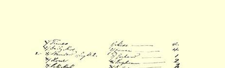
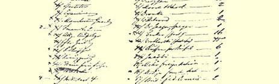
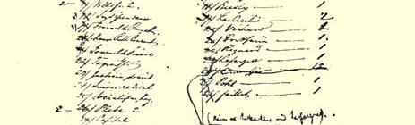
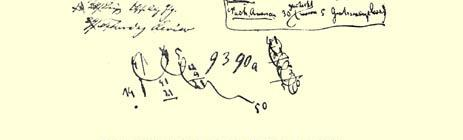

## 卡·马克思和弗·恩格斯

# 为寄送《资本论》法文版第１卷第１分册而拟的报刊、组织和个人的名单８３

（１）《泰晤士报》

（２）《每日新闻》

（３）《旗帜报》和《旗帜晚报》   ２

（４）《暇》[^1]

（５）《派尔－麦尔》[^2]

（６）《旁观者》

（７）《观察家》

（８）《曼彻斯特卫报》

（９）伊曼特 ２

（１０）奥格斯堡总汇[^3]

（１１）《法兰克福报》

（１２）《科伦》[^4]

（１３）《十字报》[^5]

（１４）《新自由报》

（１５）《人民意志报》

（１６）《人民国家报》 ４

（１７）《人民［之友］报》 ２

（１８）《独立报》[^6]

（１９）《布鲁塞尔报》

（２０）《新鹿特丹报》

（２１）《日内瓦报》

（２２）《哨兵报》

（２３）《社会正义》

（２４）《激进瑞士报》

（２５）哥本哈根，《社会主义者报》

（２６）《人民报》 ２

（２７）《首都报》

（２８）莱比锡，《德意志总汇报》

（２９）《星期六评论》[^7]

（１）梅萨 ４

（２）弗朗萨 ４

（３）格尔哈特 １

（４）库格曼 ２

（５）狄慈根 １

（６）穆尔和肖莱马[^8] ２

（８）德朗克 １

（９）维尔布罗尔[^9] １

（１０）耶格尔、施佩耶尔 １

（１１）贝克尔（已寄出） １６

（１２）符卢勃列夫斯基（现有６本） １５

（１３）经布鲁塞尔寄给俄国人 ６

（１４）雅科比 １

（１５）曼彻斯特外国人支部８４ １

（１６）诺定昂，法国人支部８５ １

（１７）不列颠联合会委员会８６ ２

（１８）比斯利 １

（１９）拉·塞西利亚 ２

（２０）维沙尔 １

（２１）波克罕 １

（２２）雷尼亚尔 １

（２３）拉法格 １

（２４）赛拉叶和拉法格，一本未寄。

寄往美国３０本（其中５本

免费）[^10]

（２５）波特耳 １

（２６）法伊埃 １ ６俄国 １奥斯渥特 ６符卢勃列夫斯基 １《写真》 ５左尔格、卡尔、德雷尔、施佩 １《雅典神殿》 耶尔、波尔特 ２伊曼特 １吴亭 ４弗兰克尔（２巴黎，肖伊） １勒费夫尔－龙西埃 ２５美国 ４符卢勃列夫斯基 ９维沙尔（１巴黎；２亚尔萨 １达金斯斯；１勃艮第；４法兰斯孔 １梅萨太；１米兰，阿马杜） ２格内科，利物浦 ９符卢勃列夫斯基 １弗朗萨 ２勒穆修 ６维沙尔（４里昂、２亚尔萨斯 ２纽约附近的霍布根，霍兹默 和洛林） 尔博士 ６符卢勃列夫斯基 ２科勒特 ２洛帕廷 １耶格尔博士 １２左尔格 １《首都报》 １维耳马尔 ２杜邦 ４泰斯（３巴黎）

> 拟于１８７２年９月底至１０月原文是德文第一次发表于《马克思恩格斯全集》俄文第２版第５０卷

> 为寄送《资本论》法文版第１卷第１分册而拟的
>
> 报刊、组织和个人的名单第２页

[^1]: 《余暇报》。—— 编者注

[^2]: 《派尔－麦尔新闻》。—— 编者注

[^3]: 《总汇报》。—— 编者注

[^4]: 《科伦日报》。—— 编者注

[^5]: 《新普鲁士报》。—— 编者注

[^6]: 《比利时独立报》。—— 编者注

[^7]: 《政治、文学、科学和艺术星期六评论》。—— 编者注

[^8]: 手稿中漏掉下面的顺序数码“７”。显然这个数码应写在肖莱马的名字前面。—— 编者注

[^9]: 格拉泽·德·维尔布罗尔。—— 编者注

[^10]: 马克思加上这一句，勾掉了“代售１２”一句。—— 编者注