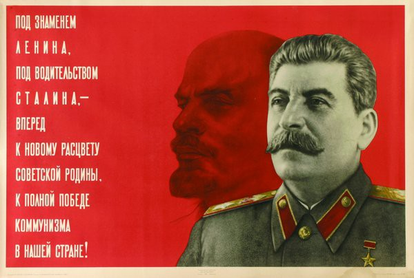

> —终卷篇— **一九四八年的《共产党宣言》**
>
> **——在中央政治局特别会议上的讲话**
>
> （1948 年3 月14 日） …………………………………………………… 583 插图
>
> 马-恩-列-斯  ………………………………………………………… 590 附录
>
> （下载地址http://pan.baidu.com/s/1i3sDSnN
>
> 包含在“新编斯大林全集及档案附卷”文件夹）

一、新编《斯大林全集》正卷二十卷总目录

二、新编《斯大林全集》档案附卷十卷总目录

## 本卷说明

新编《斯大林选集》共分四卷，是根据新编《斯大林全集》正卷二十卷和档案附卷十卷编辑的。各卷内容的起讫时间为：第一卷，一九〇一年至一九二四年；第二卷，一九二五年至一九二八年；第三卷， 一九二九年至一九四〇年；第四卷，一九四一年至一九五三年。

一九七九年出版的原《斯大林选集》，仅为两卷，按照当时的政治、理论需要，剔除了斯大林关于阶级斗争、工人运动、暴力革命、 论反对派、卫国战争，以及中国革命等方面的大量文献。现新编《斯大林选集》已尽可能予以增补、充实，以力求全面地反映这位历史伟人和革命导师的思想、理论和非凡经历。

近年来陆续解密的苏联历史档案中，有众多关于斯大林的档案材料，新编《斯大林选集》亦撮要单独编辑成“斯大林历史档案选”， 作为附卷附于第四卷之后，供读者参考。第四卷之后还附有新编《斯大林全集》正卷二十卷总目录和档案附卷十卷总目录的下载地址。

本选集中的日期，在一九一八年二月十四日之前都依旧历（正教历），其后为公历。

本选集中的注释，一为原书著者（斯大林）注，二为译者注，三为编者注，均用圆形注码（[^1]、[^2]、[^3]……）标明，释文置于当页末； 正文中原加着重号的文字，在本选集中均用黑体字标示。

本选集中的部分篇目标题，是我们拟加的。

本选集文字虽经多次校对，错讹之处仍恐难免，希读者指正。

# 

本书编者诸夏怀斯社

> 联系邮箱  hqxsk@163.com

# 新编《斯大林选集》

# 第四卷

# 一九四一年至一九五三年

# 广播演说

**（一九四一年七月三日）**

**同志们！公民们！**

**兄弟姊妹们！**

**我们的陆海军战士们！**

我的朋友们，我现在向你们讲话！

希特勒德国从6 月22 日起向我们祖国发动的背信弃义的军事进攻，正在继续着。虽然红军进行了英勇的抵抗，虽然敌人的精锐师和精锐空军部队已被击溃，被埋葬在战场上，但是敌人又向前线投入了新的兵力，继续向前进犯。希特勒军队侵占了立陶宛全境、拉脱维亚的大部地区、白俄罗斯西部地区、乌克兰西部一部分地区。法西斯空军正在扩大其轰炸区域，对摩尔曼斯克、奥尔沙、莫吉廖夫、斯摩棱斯克、基辅、敖德萨、塞瓦斯托波尔等城市大肆轰炸。我们的祖国面临着严重的危险。

我们光荣的红军怎么会让法西斯军队占领了我们的一些城市和地区呢？难道德国法西斯军队真的象法西斯的吹牛宣传家所不断吹嘘的那样，是无敌的军队吗？

当然不是！历史表明，无敌的军队现在没有，过去也没有过。拿破仑的军队曾被认为是无敌的，可是这支军队却先后被俄国的，英国的和德国的军队击溃了。在第一次帝国主义大战时期，威廉[^4]的德国军队也曾被认为是无敌的军队，可是这支军队曾经数次败在俄国军队和英法军队的手中，终于被英法军队击溃了。对于现在希特勒的德国法西斯军队也应当这样说。这支军队在欧洲大陆上还没有遇到过重大的抵抗。只是在我国领土上，它才遇到了重大的抵抗。既然由于这种抵抗，德国法西斯军队的精锐师已被我们红军击溃，这就是说，正象拿破仑和威廉的军队曾经被击溃一样，希特勒法西斯军队也是能够被击溃的，而且一定会被击溃。

至于说我们的一部分领土毕竟被德国法西斯军队占领了，这主要是由于法西斯德国的反苏战争是在有利于德国军队而不利于苏联军队的情况下发动的。问题就在于,德国军队是进行着战争的国家的军队, 它已经全部进行了充分的动员，德国用来进攻苏联并且集结到苏联边境的170 个师已经完全处于战备状态,只等进攻的信号了,而当时苏联的军队还需要进行充分动员，还需要向边境集结。这里还有一个情况起了不小的作用,就是法西斯德国不顾它会被全世界认为是进攻一方, 而突然背信弃义地撕毁了它同苏联在1939 年缔结的互不侵犯条约。 显然，爱好和平的我国是不愿意首先破坏条约的，因此也就不能走上背信弃义的道路。

也许有人要问：苏联政府怎么会同象希特勒和里宾特洛普这样一些背信弃义的人和恶魔缔结互不侵犯条约呢？苏联政府在这方面是不是犯了错误？当然没有犯错误!互不侵犯条约是两国之间的和平条约。 1939 年德国向我们提出的正是这样的条约。苏联政府能不能拒绝这样的建议呢？我想，任何一个爱好和平的国家都不能拒绝同邻国缔结和平协定，即使这个国家是由象希特勒和里宾特洛普这样一些吃人魔鬼领导的。当然，这是在一个必要的条件下缔结的，即和平协定既不能直接,也不能间接触犯爱好和平国家的领土完整、独立和荣誉。大家知道，德国同苏联订立的互不侵犯条约正是这样的条约。

我们同德国缔结了互不侵犯条约，得到了些什么呢？我们保证我国获得了一年半的和平，使我国有可能准备好自己的力量，在法西斯德国胆敢冒险违反条约进攻我国的情况下予以反击。这肯定是我们有所得，而法西斯德国有所失。

法西斯德国背信弃义地撕毁条约，进攻苏联，得到了些什么，又失掉了些什么呢？这使它的军队在短期内取得了某种有利的地位，可是它在政治上却输了，它在全世界面前暴露了自己是血腥的侵略者。 毫无疑问，德国在军事上暂时有所得，只是偶然因素，而苏联在政治上大有所得，却是重大的长久的因素，在这个基础上，红军在反法西斯德国的战争中具有决定意义的军事胜利必将日益扩大。

正因为如此，我们全体英勇的陆军，我们全体英勇的海军，我们全体的飞行员——我们的雄鹰，我国各族人民，欧洲、美洲、亚洲所有的优秀人士，以及德国所有的优秀人士，都谴责德国法西斯分子的背信弃义行为而同情苏联政府，赞同苏联政府的行为，并且认为我们的事业是正义的，敌人一定会被击溃，我们一定会取得胜利。

由于强加于我们的战争，我国已经同最凶恶而阴险的敌人——德国法西斯主义展开了殊死的搏斗。我国军队正在同以坦克和飞机武装到牙齿的敌人英勇作战。红军和红海军正在克服重重困难，为保卫每一寸苏联国土而奋不顾身地战斗。拥有数千辆坦克和数千架飞机的红军主力正在投入战斗。红军战士的勇敢精神是举世无双的。我们对敌人的抗击日益加强。全体苏联人民都同红军一道奋起保卫祖国。

为了消除我们祖国面临的危险,需要做些什么呢？为了粉碎敌人， 应该采取哪些措施呢？

首先必须使我们苏联人了解到威胁我国的危险的严重程度，坚决克服泰然自若、漠不关心的心理，克服和平建设的情绪，这种情绪在战前是完全可以理解的，但是现在,当战争使形势根本改变了的时候， 就是十分有害的了。敌人是残酷无情的。他们的目的是要侵占我们用自己的汗水浇灌出来的土地，掠夺我们用自己的劳动获得的粮食和石油。他们的目的是要恢复地主政权,恢复沙皇制度,摧残俄罗斯人、乌克兰人、白俄罗斯人、立陶宛人、拉脱维亚人、爱沙尼亚人、乌兹别克人、鞑靼人、摩尔达维亚人、格鲁吉亚人、亚美尼亚人、阿塞拜疆人以及苏联其他各自由民族的民族文化和国家制度,把他们德意志化, 把他们变成德国王公贵族的奴隶。因此，这是苏维埃国家生死存亡的问题，是苏联各族人民生死存亡的问题，是苏联各族人民享受自由还是沦为奴隶的问题。必须使苏联人了解这一点，不要再漠不关心，必须使他们动员起来，按照新的战时的方式改造自己的全部工作，拿出对敌人毫不留情的气概。

其次，必须使怨天尤人的人和怕死鬼、惊惶失措分子和逃兵在我们的队伍中毫无容身之地，使我们的人在斗争中无所畏惧，并且奋不顾身地投入我们反法西斯奴役者的卫国解放战争。我们国家的缔造者伟大的列宁曾经说过,苏联人的基本品质应当是在斗争中勇敢、大胆、 不知畏惧、决心同人民一起为反对我们祖国的敌人而战斗。必须使布尔什维克的这种优良品质成为红军、红海军以及苏联各族人民中千百万人所具有的美德。

我们应当立即按照战时的方式改造我们的全部工作，使一切都服从于前线的利益,都服从于组织粉碎敌人的任务。苏联各族人民现在都看到，德国法西斯主义对保证全体劳动者享有自由劳动和美好生活的我们的祖国，是咬牙切齿、极为仇视的。苏联各族人民应当奋起反对敌人，保卫自己的权利和自己的国土。

红军、红海军和苏联全体公民都应当捍卫每一寸苏联国土，应当为保卫我国的城市和乡村战斗到最后一滴血，应当表现出我国人民所固有的勇敢、主动和机智。

我们应当组织对红军的全面支援，保证大力补充红军队伍，保证供应红军一切必需品，组织军队和军用物资的迅速运输，以及广泛救护伤员。

我们应当巩固红军的后方,使全部工作都服从于这个事业的利益, 做到一切企业都能加紧工作，生产更多的步枪、机枪、火炮、子弹、 炮弹、飞机,组织对工厂、电站、电话和电报通信设施的警卫工作,整顿地方防空事宜。

我们应当对一切扰乱后方分子、逃兵、惊惶失措分子和造谣分子进行无情的斗争，消灭间谍、破坏分子和敌人的伞兵，在这些方面及时地协助我们的锄奸营。必须注意到，敌人是阴险狡猾的，善于欺骗和造谣。必须估计到这一切，不要受敌人的挑拨。凡是因惊惶失措和贪生怕死而有害防务的人，不论是谁，都应当立即交付军事法庭审判。

当红军部队不得不撤退时，必须运走全部铁路机车车辆，不给敌人留下一部机车、一节车厢,不给敌人留下一公斤粮食、一公升燃料。 集体农庄庄员应当把所有的牲畜赶走，把粮食交给国家机关保管，以便运到后方。凡是不能运走的一切贵重物资，其中包括有色金属、粮食和燃料等，都应当绝对销毁。

在敌占区,必须建立骑兵和步兵游击队,建立破坏小组，以便同敌军部队斗争，以便遍地燃起游击战争的烽火,以便炸毁桥梁、道路,破坏电话和电报通信设施，焚毁森林、仓库和辎重。在沦陷区，要造成使敌人及其所有走狗无法安身的条件，步步追击他们，消灭他们，破坏他们的一切活动。

同法西斯德国的战争，绝不能看成普通的战争。这场战争不仅是两国军队之间的战争。它同时是全体苏联人民反对德国法西斯军队的伟大战争。这场反法西斯压迫者的全民卫国战争的目的，不仅是要消除我国面临的危险，而且还要帮助那些呻吟在德国法西斯主义枷锁下的欧洲各国人民。在这场解放战争中，我们不是孤立的。在这场伟大战争中，欧洲和美洲各国人民，其中包括受希特勒头目们奴役的德国人民，将是我们可靠的同盟者。我们为了保卫我们祖国的自由而进行的战争，将同欧洲和美洲各国人民为争取他们的独立、民主自由的斗争汇合在一起。这将是各国人民争取自由、反对希特勒法西斯军队的奴役和奴役威胁而结成的统一战线。因此，英国首相邱吉尔先生关于支援苏联的历史性的演说和美国政府关于准备援助我国的宣言，就是十分明显的例证，苏联各族人民对此只能表示衷心的感谢。

同志们！我们的力量是无穷无尽的。趾高气扬的敌人很快就一定会相信这一点。同红军一道对进犯我国的敌人奋起作战的，有成千上万的工人、集体农庄庄员和知识分子。我国千百万人民群众都将奋起作战。莫斯科和列宁格勒的劳动者已经开始成立有成千上万人的民兵队伍来支援红军。在我们反对德国法西斯主义的卫国战争中，在每一个遭到敌人侵犯危险的城市里，我们都应当成立这样的民兵队伍，发动全体劳动者起来斗争，挺身捍卫自己的自由、自己的荣誉、自己的祖国。

为了迅速动员苏联各族人民的一切力量，抗击背信弃义地进犯我们祖国的敌人，国防委员会已经成立了，它现在把国家的全部权力都集中在自己手中。国防委员会已经开始工作，它号召全国人民团结在列宁—斯大林党的周围，团结在苏联政府的周围，以忘我的精神支援红军和红海军，粉碎敌人，争取胜利。

用我们的一切力量来支援我们英勇的红军和我们光荣的红海军！

用人民的一切力量来粉碎敌人！

为争取我们的胜利，前进！

> 译自《论苏联伟大卫国战争》                    选自新编《斯大林全集》 1952 年版第9—17 页                            第16 卷第3—8 页

# 伟大的十月社会主义革命二十四周年

> （在莫斯科市劳动者代表苏维埃、
>
> 党组织和社会团体庆祝大会上的报告）

**（一九四一年十一月六日）**

同志们！

自从我国十月社会主义革命取得胜利以及在我国建立苏维埃制度以来，已经过去二十四年了。现在我们即将跨入苏维埃制度存在的下一年，第二十五年。

在十月革命的周年庆祝大会上，通常都要总结一下我们在过去一年的和平建设方面的成就。我们的确有可能作这样的总结，因为我们在和平建设方面的成就,不仅逐年增长,而且逐月增长。这些成就是什么，这些成就有多么大，——这是所有的人，无论是朋友还是敌人都知道的。

但是，过去的一年不仅是和平建设的一年，而且是同背信弃义地进攻爱好和平的我国的德国侵略者进行战争的一年。在过去的一年中， 我们只是在前6 个月继续进行了我国的和平建设工作，下半年有4 个多月是在同德帝国主义者进行的残酷战争的环境中度过的。所以，战争成了过去一年我国发展中的转折点。战争使我们的和平建设工作大大缩小了，而在某些部门则根本停止了。战争迫使我们按战时方式来改造我们的全部工作，战争把我国变成一个为前线服务、为我们的红军和海军服务的、统一的、无所不包的后方。

和平建设时期结束了。反对德国侵略者的解放战争时期开始了。

因此,提出关于过去这一年的下半年的,其实是下半年四个多月的战争总结以及我们在这次解放战争中的任务的问题，是完全恰当的。

## 四个月战争的经过

我在战争爆发时的一次演说中已经说过，战争给我国造成了危险的威胁，我国面临着严重的危险，必须了解到和意识到这种危险，并按战时方式来改造我们的全部工作。现在，我在作四个月战争的总结时，应当着重指出，这种危险不仅没有减轻，反而越发加重了。敌人占领了乌克兰的大部分地区,占领了白俄罗斯、摩尔达维亚、立陶宛、 拉脱维亚、爱沙尼亚以及其他一些地区，侵入了顿巴斯，象乌云一样笼罩了列宁格勒，并且威胁着我们光荣的首都莫斯科。德国法西斯侵略者正在掠夺我国，破坏工人，农民和知识分子用劳动建设起来的城市和乡村。希特勒匪帮正在屠杀和蹂躏我国的和平居民，连妇女、儿童和老人都不怜惜。在我国境内的德军占领区里，我们的弟兄正在德国压迫者的枷锁下呻吟着。

我们的陆海军战士捍卫着祖国的荣誉和自由，奋勇击退野兽般的敌人的进攻，树立了英勇无畏的榜样，使敌人血流成河。但是敌人不顾一切损失，丝毫不爱惜自己士兵的鲜血，仍旧向前线调遣一批又一批的部队来接替被打垮的部队，并倾其全力要在冬季到来之前占领列宁格勒和莫斯科，因为敌人知道，冬季对他们是没有任何好处的。

在四个月的战争中,我们的损失是，阵亡35 万人，失踪378 000 人,负伤102 万人。在同一时期,敌人的损失是被打死打伤和俘虏450 万人以上。

毫无疑问，由于四个月的战争，德国比苏联大为削弱了，因为德国的人员后备快要枯竭，而苏联的后备力量现在才充分显露出来。

## “闪击战”的破产

德国法西斯侵略者在开始进攻我国的时候，认为他们一定能够在一个半月到两个月内“消灭”苏联，并在这短短的时间内挺进到乌拉尔。应该说，德国人并没有隐瞒这个“闪击”制胜的计划。相反，他们倒是百般地宣扬这个计划。但是，事实表明“闪击”计划是十分轻率和毫无根据的。现在应该认为，这个疯狂的计划是彻底破产了。

“闪击战”在西欧成功了，而在东方遭到了失败和破产，其原因何在呢？

德国法西斯战略家断言他们能够在两个月内消灭苏联，并在这短短的时间内挺进到乌拉尔，他们指望什么呢？

首先,他们指望的是,如他们曾渴望的那样建立一个反苏大同盟， 他们以为预先用革命的怪影来恐吓英国和美国的统治集团，就能吸引这些国家参加这个同盟，这样就把我国同其他国家完全隔离开来。德国人知道，他们利用各个国家内的阶级矛盾以及这些国家同苏联之间的矛盾的这个政策，在法国已经见效了，法国的执政者由于害怕革命的怪影而放弃了抵抗，惊慌失措地把自己的祖国葬送在希特勒的铁蹄之下。德国法西斯战略家以为，英国和美国也会如此。其实，德国法西斯分子把有点小名气的赫斯派到英国，就是为了说服英国的政治家参加反苏大进军。但是德国人大大地失算了。不论赫斯如何努力，英国和美国不仅没有参加德国法西斯侵略者的反苏进军，反而同苏联站在一个阵营里来反对希特勒德国。苏联不仅没有被孤立，反而有了新的盟国，如英国、美国以及其他被德国人占领的国家。德国利用矛盾和以革命怪影吓人的政策失效了，已经不适用于新的环境。这个政策不仅不适用，反而对德国侵略者孕育着很大的危险，因为这个政策在战争的新的条件下，正导致截然相反的结果。

第二，德国人指望苏维埃制度不巩固，苏联后方不巩固，他们以为,只要红军一遭到严重打击和失利，工人和农民之间就会发生冲突， 苏联各民族之间就会发生纠纷,暴动就会发生,国家就会四分五裂，这就一定会便于德国侵略者长驱直入乌拉尔。但是德国人在这方面也大大地失算了。红军的失利不仅没有削弱反而更加强了工农联盟和苏联各族人民的友谊。不仅如此，红军的失利还把苏联各族人民的大家庭变成了一个以忘我精神支援自己的红军和红海军的统一的牢不可破的营垒。苏联后方从来还没有象现在这样巩固。可以肯定，其他任何一个国家，如果象我国现在这样丧失这么多的领土，一定经受不住考验而陷于崩溃。既然苏维埃制度这样容易地经受住了考验并且更加巩固了自己的后方,这就是说，苏维埃制度是现在最巩固的制度。

最后，德国侵略者指望红军和红海军软弱，他们以为德国的陆海军可以一举击溃和驱散我们的陆海军，从而打开一条长驱直入我国腹地的道路。但是德国人在这方面又大大地失算了，他们过高估计了自己的力量，过低估计了我们的陆海军。当然，我们的陆海军还缺少锻炼，它们总共才打了四个月的仗，还没有能成为一支有丰富作战经验的军队，而它们面对的敌人却是已经打过两年仗的经验丰富的德国陆海军。但是，第一，我军的士气比德军的士气高，因为我军是在保卫祖国，抵御外国侵略者，相信自己的事业是正义的，而德军则是在进行侵略战争，掠夺别的国家，他们甚至一分钟也不能相信自己的卑鄙勾当是正义的。毫无疑问，保卫祖国的思想，我国人民为之而战的思想,必定会使我军产生而且实际上已经产生能使红军紧密团结的英雄； 而侵略和掠夺别国的思想，德国人专门为之而打仗的思想，也必定会使德军产生而且实际上已经产生丧尽道德和腐蚀德军的职业强盗。第二，德军深入我国腹地,远离德国后方，不得不在敌对的环境中作战， 不得不在别国境内建立新的后方，而且这个后方又遭到我国游击队的破坏，这就从根本上瓦解着德军的供给，使他们害怕自已的后方，打破了他们以为自己的地位巩固的信念；而我军却是在本土作战，不断得到自己后方的支援，得到人员、弹药和粮食供应的保障，并且完全信任自己的后方。正因为如此,我军比德国人所想象的要强大,而德军却比根据德国侵略者的夸大宣传所能想象的要软弱。不久以前，我军在列宁格勒和莫斯科保卫战中歼灭了德军大约30 个精锐师，这表明， 在卫国战争的烈火中正在锻炼而且已经锻炼出一批新的苏联战士和指挥员、飞行员、炮兵、迫击炮手、坦克兵、步兵和水兵，他们明天就会成为使德军胆寒的力量。

毫无疑问，所有这些情况加在一起，就注定了“闪击战”在东方必然破产。

## 我军暂时失利的原因

这一切当然都是对的。但是，除了这些有利的条件以外，还有一些对红军不利的条件，因此，我军遭受暂时失利，不得不退却，不得不把我国的一些地区让给敌人，这也是实际情况。

这些不利的条件是什么呢？红军在军事上暂时失利的原因在哪里呢？

红军失利的原因之一，就在于欧洲没有反对德国法西斯军队的第二战场。问题在于，现在欧洲大陆上没有任何一支同德国法西斯军队作战的英国或美国的军队，因此德国人不必分散自己的力量，不必在东西两个战场上作战。而这种情况就使德国人以为他们在西方的后方是有保障的，能够把自己的全部军队及其欧洲盟国的军队都调来进攻我国。现在的情况是这样：我国是在没有任何军事外援的情况下，单独地进行解放战争，抗击德国人、芬兰人、罗马尼亚人、意大利人、 匈牙利人的联合力量。德国人由于暂时的胜利而神气起来，为自己的军队大肆吹嘘，硬说他们的军队在一对一的作战中总能够把红军打败。 可是德国人的这种断语是空洞的吹牛，因为既然这样，人们就不明白， 为什么德国人还要求芬兰人、罗马尼亚人、意大利人、匈牙利人帮助他们进攻没有军事外援而全靠自己的力量作战的红军。毫无疑问，欧洲没有反对德国人的第二战场是大大有利于德军的处境的。但是同样毫无疑问，在欧洲大陆上一旦出现第二战场时——而第二战场必然会在最近出现，——我军的处境就会大为有利，而德军则极为不利。

我军暂时失利的另一个原因，是由于我们的坦克不足，航空兵力量也有些不足。在现代战争中，没有坦克，没有足够的航空兵在空中掩护，步兵是很难作战的。我们的航空兵在质量上超过了德国的航空兵，我们光荣的飞行员获得了无畏战士的荣誉。但是我们的飞机目前还比德国人的少。我们的坦克在质量上超过了德国的坦克，我们光荣的坦克兵和炮兵曾多次把拥有大量坦克的嚣张一时的德军打得狼狈逃窜。但是我们的坦克毕竟只有德国人的几分之一。这就是德军所以暂时得胜的秘密。不能说我们的坦克工业搞得不好，给我们前线送去的坦克很少。不是的，坦克工业搞得很好，生产出不少的优质坦克。但是德国人生产的坦克要多得多，因为他们现在不只是支配着本国的坦克工业，而且还支配着捷克斯洛伐克、比利时、荷兰、法国的工业。 不然，红军早就把德军击溃了。德军没有坦克就不去作战，如果他们在坦克方面不占优势，就经受不住我们部队的打击。

为了使德军在坦克方面的优势化为乌有，从而根本改善我军的处境，只有一个办法。这个办法就是,不仅把我国的坦克生产扩大几倍， 而且还要大量增产反坦克飞机、反坦克枪、反坦克炮、反坦克手榴弹和反坦克迫击炮，更多地修筑防坦克壕以及其他各种防坦克障碍物。

这就是当前的任务。

我们能够完成这个任务，我们一定要完成这个任务！

## “民族社会党人”[^5]是些什么人？

我们通常把德国侵略者即希特勒分子叫作法西斯分子。而希特勒分子竟然认为这不对，并坚持继续自称为“民族社会党人”。可见， 德国人想要我们相信，希特勒分子的党，掠夺欧洲并对我们社会主义国家发动罪恶进攻的德国侵略者的党,是社会主义的政党。能这样吗？ 社会主义同掠夺和压迫欧洲人民的野兽般的希特勒侵略者之间能有什么共同之点吗？

能不能认为希特勒分子是**民族主义者**呢？不，不能。实际上希特勒分子现在不是民族主义者，而是**帝国主义者**。当希特勒分子从事收拾德国领土、重新合并莱茵区和奥地利等地时，还有相当的根据可以认为他们是民族主义者。但是，在他们侵占了别国领土和奴役了欧洲各民族——捷克人、斯洛伐克人、波兰人、挪威人、丹麦人、荷兰人、 比利时人、法兰西人、塞尔维亚人、希腊人、乌克兰人、白俄罗斯人和波罗的海沿岸人等等，并开始争夺世界霸权以后，希特勒的党就不再是民族主义的党了，因为它从这个时候起就成了帝国主义者、掠夺者和压迫者的党了。

**希特勒分子的党是帝国主义者的党，同时又是世界上一切帝国主义者中最富有掠夺性和强盗性的帝国主义者的党。**

能不能认为希特勒分子是**社会主义者**呢？不，不能。实际上希特勒分子是社会主义的死敌，是剥夺欧洲工人阶级和各国人民起码的民主自由的最凶恶的反动派和黑帮。为了掩盖其反动的黑◇303◇帮本质,希特勒分子咒骂英国和美国的内部制度是财阀制度。但是,在英国和美国却有起码的民主自由,有工人和职员的工会,有工人的政党，有议会；而在德国，在希特勒制度下，所有这些组织都被消灭了。只要把这两类事实对照一下，就可以了解希特勒制度的反动本质和识破德国法西斯分子所谓英美财阀制度的一套鬼话。其实，希特勒制度是俄国在沙皇统治下曾有过的那种反动制度的翻版。大家知道，希特勒分子很乐意象沙皇制度那样践踏工人的权利，知识分子的权利和各族人民的权利，他们也很乐意象沙皇制度那样制造中世纪式的虐杀犹太人的大暴行。

**希特勒的党是民主自由的敌人的党，是中世纪式的反动势力和制造黑帮大暴行的党。**

而如果这些寡廉鲜耻的帝国主义者和穷凶极恶的反动派继续披着 “民族主义者”和“社会主义者”的外衣，那么他们这样做就是为了欺骗人民和愚弄头脑简单的人，用“民族主义”和“社会主义”的旗帜来掩盖自己的强盗帝国主义的本质。

乌鸦用孔雀的羽毛来装饰自己……  可是，无论乌鸦怎样用孔雀的羽毛来装饰自己，乌鸦毕竟是乌鸦。[^6]

希特勒说：“德国人要用一切手段征服全世界。如果我们想建立我们的大德意志帝国，我们就应当首先撵走和消灭斯拉夫各族——俄罗斯人、波兰人、捷克人、斯洛伐克人、保加利亚人、乌克兰人、白俄罗斯人。没有任何理由不这样做。”

希特勒说：“人生来就是有罪的，只能用暴力管理他们。可以采取任何手段对待他们。如果政治上需要，就应当撒谎、出卖以至屠杀。”

戈林说；“谁反对我们，就杀谁，杀吧，杀吧，对此负责的不是你们，而是我，因此，你们杀吧！”

希特勒说:“我要把人从所谓良心这个屈辱人的怪物下解放出来。 良心也象教育一样，是摧残人的。我的优点就是，我不受任何理论的或道德的考虑的约束。”

在一名被打死的德国士官身上搜出一份德军统帅部9 月25 日给步兵第489 团的命令，命令中说：

“我命令向每一个出现在600 米距离内的俄国人开枪。俄国人应当知道，他们面对一个坚决的敌人，他们不能期待这个敌人给予任何宽恕。”

在一名被打死的中尉古斯达夫·齐格尔（美因河畔法兰克福人） 身上搜出一份德军统帅部告土兵书，里面说：

“你没有心和神经，在战争中不需要这些。消灭你自己的怜悯心和恻隐心吧，杀死每一个俄国人，每一个苏联人，即使在你面前的是老人或妇女，是女孩或男孩，也不要停手。杀吧，这样你才能拯救自己免于死亡，保证你一家的前途，使你流芳百世。”

你们看，这就是希特勒党首领们和希特勒统帅部的纲领和指示， 这就是一群丧失人性和堕落到禽兽地步的人的纲领和指示。

这一群丧尽天良、毫无人格、充满兽性的人竟恬不知耻地号召消灭伟大的俄罗斯民族，消灭普列汉诺夫和列宁、别林斯基和车尔尼雪夫斯基、普希金和托尔斯泰、格林卡和柴可夫斯基、高尔基和契诃夫、 谢切诺夫和巴甫洛夫、列宾和苏里科夫、苏沃洛夫和库图佐夫的民族！……

德国侵略者想对苏联各族人民进行歼灭战。好吧，既然德国人想进行歼灭战，他们就一定会得到歼灭战。

今后我们的任务，苏联各族人民的任务，我们陆海军战士、指挥员和政治工作人员的任务，就是把侵入我们祖国领土的所有德国占领军一个不剩地歼灭干净。

对德国占领军决不留情！

消灭德国占领军！

## 德帝国主义者及其军队必然灭亡

德国侵略者道德退化,早已丧失人性,堕落到禽兽般的地步，—— 单是这一点就说明他们必然自取灭亡。

但是,决定希特勒侵略者及其军队必然灭亡的,不仅仅是道德因素。

另外还有三个正在日益发挥作用的基本因素，这些因素在不久的将来就会使希特勒强盗帝国主义必然灭亡。

第一,这就是帝国主义德国的**欧洲**后方不巩固,欧洲的“新秩序” 不巩固。德国侵略者奴役了从法国到苏联的波罗的海沿岸，从挪威、 丹麦、比利时、荷兰、苏维埃白俄罗斯到巴尔干和苏维埃乌克兰这片欧洲大陆的人民，剥夺了他们起码的民主自由，剥夺了他们支配自己命运的权利，夺去了他们的粮食、肉类、原料，把他们变成了自己的奴隶，残杀了波兰人、捷克人、塞尔维亚人，而且认定自己在夺得了欧洲的霸权之后，现在可以在这个基础上建立德国的世界霸权。他们把这叫作“欧洲的新秩序”。但是,这是什么“基础”,这是什么“新秩序”呢？只有妄自尊大的希特勒蠢才们才看不见，欧洲的“新秩序”及其臭名昭彰的“基础”是一座随时都会爆发并把德帝国主义的纸牌搭的小房子埋葬的火山。有人引证拿破仑，硬说希特勒的行动象拿破仑，他的一切都象拿破仑。但是,第一,在这方面不应当忘记拿破仑的命运。第二,希特勒象拿破仑不过是小猫象狮子一样,因为拿破仑是依靠进步力量来反对反动力量，而希特勒则相反，是依靠反动力量来反对进步力量。只有柏林的希特勒蠢才们才不能了解，被奴役的欧洲人民将起来斗争和举行起义来反对希特勒暴政。在欧洲人民反对希特勒暴政的解放斗争中，苏联、英国和美国一定会给他们充分的支持， 对于这一点有谁会怀疑呢？

第二，这就是希特勒侵略者的**德国**后方不巩固。当希特勒分子在收拾被凡尔赛条约弄得山河破碎的德国时，他们还能得到为复兴德国的理想所鼓舞的德国人民的支持。但是，在这个任务一经解决，希特勒分子开始走上帝国主义的道路，走上侵占别国领土和征服别的民族的道路，把欧洲各族人民和苏联各族人民都变为目前德国的仇敌之后， 在德国人民中间就发生了深刻的转变,他们反对继续战争,主张消除战争。已持续两年多但还看不到尽头的流血战争，几百万人的牺牲，饥饿,贫困,瘟疫,到处敌视德国人的气氛,希特勒的把苏联人民变成目前德国的仇敌的愚蠢政策，—— 所有这一切,不能不使德国人民转过来反对这个不必要的毁灭性的战争。只有希特勒蠢才们才不能了解，不仅德军的欧洲后方，就连德军的德国后方也是一座即将爆发并把希特勒冒险家埋葬的火山。

最后，这就是苏联、英国和美国的反对德国法西斯帝国主义者的同盟。英国、美国和苏联结成了一个旨在粉碎希特勒帝国主义者及其侵略军的统一阵营，这是事实。现代的战争是摩托战争。谁在摩托产量方面占绝对优势，谁就能赢得战争。如果把美国、英国和苏联的摩托产量加在一起，那么，我们在摩托方面的优势至少是德国的三倍。 这就是希特勒强盗帝国主义必然灭亡的基础之一。

不久以前，有英国代表比弗布鲁克先生和美国代表哈里曼先生参加的三国莫斯科会议[^7]，决定不断地支援我国坦克和飞机。大家都知道，根据这个决定我们已经开始得到坦克和飞机。更早以前，英国就供应我国象铝、铅、锡、镍、橡胶这类紧缺物资。如果再加上美国最近决定给苏联十亿美元贷款这一事实，可以肯定地说，美国、英国和苏联的同盟已经成为现实，它正在为我们共同的解放事业的利益发展着并将继续发展下去。

这些就是决定德国法西斯帝国主义必然灭亡的因素。

## 我们的任务

列宁把战争分为两类：侵略的、非正义的战争和解放的、正义的战争。

德国人现在进行的是侵略的、非正义的战争，目的是掠夺别国领土和征服别的民族。因此，一切正直的人都应当起来反对德国侵略者这个敌人。

与希特勒德国不同,苏联及其盟国进行的是解放的、正义的战争， 目的是把欧洲和苏联被奴役的人民从希特勒的残暴统治下解放出来。 因此，一切正直的人都应当象支援解放者的军队那样支援苏联、英国和其他盟国的军队。

我们没有，也不可能有侵占别国领土和征服别的民族这样的战争目的；无论是对欧洲各国的人民和领土，或者是对亚洲各国包括伊朗在内的人民和领土，都是一样。我们首要的目的是，从德国法西斯的压迫下解放我国的领土和我国的人民。

我们没有，也不可能有把自己的意志和自己的制度强加于期待我们帮助的斯拉夫民族和欧洲其他被奴役的民族这样的战争目的。我们的目的是，帮助这些民族进行反对希特勒暴政的解放斗争，然后让他们完全自由地在自己的土地上按照自己的愿望进行安排。绝对不干涉别国人民的内政！

但是，要实现这些目的，就必须粉碎德国侵略者的军事实力，必须一个不剩地消灭为奴役我们祖国而侵入我国的所有德国占领军。

为此,必须使我们的陆海军得到我们举国一致的积极有效的支援； 使我国的男女工人和职员在企业中孜孜不息地工作，以供给前线越来越多的坦克、反坦克枪、反坦克炮、飞机、火炮、迫击炮、机枪、步枪和弹药；使我们的男女集体农庄庄员在自己的田地上孜孜不息地工作,以供给前线和国家越来越多的粮食、肉类、工业原料;使我们整个国家和苏联各族人民组成一个统一的战斗营垒，同我们的陆海军一起为我们祖国的荣誉和自由，为消灭德国军队而进行伟大的解放战争。

这就是当前的任务。

我们能够而且一定要完成这个任务。

只有完成了这个任务并消灭了德国侵略者，我们才能得到持久的正义的和平。

彻底消灭德国侵略者！

解放在希特勒暴政压迫下呻吟的一切被压迫民族！

苏联各族人民牢不可破的友谊万岁！

我们的红军和我们的红海军万岁！

我们光荣的祖国万岁！

我们的事业是正义的，——胜利一定属于我们！

> 译自《论苏联伟大卫国战争》                    选自新编《斯大林全集》 1952 年版第l8—36 页                           第16 卷第10—22 页

# 检阅红军时的演说

> （一九四一年十一月七日于莫斯科红场）

红军和红海军战士、指挥员和政治工作人员、工人、集体农庄庄员、智力劳动者同志们，在敌后暂时处在德国强盗铁蹄下的兄弟姊妹们，破坏德国侵略者后方的我们光荣的男女游击队员们！

我代表苏联政府和我们布尔什维克党向你们致敬，向你们祝贺伟大的十月社会主义革命二十四周年。

同志们！今天是在严重的情况下庆祝十月革命二十四周年的。德国强盗背信弃义的进攻和强加于我们的战争，造成了对我国的威胁。 我们暂时失去了一些地区，敌人窜到了列宁格勒和莫斯科的门口。敌人估计，我们的军队将一触即溃，我们的国家将屈膝投降。可是，敌人大大地失算了。我们的陆海军虽然暂时失利，但是在整个战线上正在英勇地抗击敌人的进攻，给敌人以重创，而我们的国家，我们举国上下，却已经组成了一个统一的战斗营垒，同我们陆海军一起，共同粉碎德国侵略者。

我们的国家曾经经历过比现在的处境更加严重的日子。请回想一下1918 年我们庆祝十月革命一周年时的情形。当时我国四分之三的领土都在外国武装干涉者手中。我们暂时失去了乌克兰、高加索、中亚细亚、乌拉尔、西伯利亚和远东。当时我们没有同盟国，我们没有红军(那时我们才刚开始建立红军),我们缺乏粮食，缺乏武器，缺乏服装。当时有14 个国家围攻我国。可是，我们并没有灰心,并没有丧气。当时我们在战争的烈火中组织了红军，并把我国变成了一座军营。 当时，伟大的列宁的精神鼓舞我们为反对武装干涉者而战。结果怎么样呢？结果我们粉碎了武装干涉者，收复了全部失地，取得了胜利。

现在，我国的状况要比23 年前好得多。现在,我国无论工业、粮食和原料，都比23 年前丰富许多倍。我们现在有同盟国，他们同我们一起结成反对德国侵略者的统一战线。我们现在得到陷于希特勒暴政压迫下的欧洲各国人民的同情和支持。我们现在拥有精锐的陆军和精锐的海军，他们正在坚决保卫着我们祖国的自由和独立。我们无论对于粮食、武器或服装都不感到严重的缺乏。我们全国，我国的各族人民都一致支援我们的陆海军，帮助他们粉碎德国法西斯侵略匪帮。 我们有源源不断的人员后备。现在伟大的列宁的精神和他的胜利旗帜， 就象23 年前一样，鼓舞着我们去进行卫国战争。

我们能够而且一定会战胜德国侵略者，这难道可以怀疑吗？

敌人并不象某些惊慌失措的知识分子所形容的那样强大。魔鬼也并不象人们所描绘的那样可怕。谁能否认，我们红军曾屡次把嚣张一时的德军打得仓皇而逃呢？如果不是根据德国宣传家大肆吹嘘的声明来判断问题,而是根据德国的实际情况来判断问题，那就不难了解， 德国法西斯侵略者正面临崩溃。现在饥饿和贫困笼罩着德国，在四个月的战争中,德国已损失士兵450 万人,德国血流殆尽,人员后备枯竭, 不仅陷于德国侵略者压迫下的欧洲各国人民，而且连看不到战争尽头的德国本国人民都充满了愤怒的情绪。德国侵略者正在作垂死挣扎。 毫无疑问，德国是不能够长久挣扎下去的。再过几个月，再过半年， 也许一年，希特勒德国一定会由于其罪行累累而崩溃。

红军和红海军战土、指挥员和政治工作人员、男女游击队员同志们！全世界都注视着你们，把你们看作是能够消灭德国侵略者匪军的力量。处在德国侵略者压迫下的被奴役的欧洲各国人民都注视着你们， 把你们看作是他们的解放者。伟大的解放使命已经落在你们的肩上。 你们不要辜负这个使命！你们进行的战争是解放战争，正义战争。让我们伟大的先辈——亚历山大·涅夫斯基、季米特里·顿斯科伊、库兹马·米宁、季米特里·波扎尔斯基、亚历山大·苏沃洛夫、米哈伊尔·库图佐夫的英勇形象，在这次战争中鼓舞你们！让伟大的列宁的胜利旗帜引导你们！

彻底粉碎德国侵略者！

消灭德国占领军！

我们光荣的祖国、我们祖国的自由、我们祖国的独立万岁！

在列宁的旗帜下向胜利前进！

> 译自《论苏联伟大卫国战争》                    选自新编《斯大林全集》 1952 年版第37—40 页                           第16 卷第24—26 页

# 最高统帅部大本营指示信[^8]

**（一九四二年一月十日）**

红军在极大地消耗了德国法西斯军队之后，转入了反攻，迫使德国侵略者西退。

德军为迟滞我军前进而转入了防御，开始构筑设有掩体、障碍物和野战工事的防御地区。德军指望在春季来临之前以此迟滞我军进攻， 以便调集兵力在春季重新转入对红军的进攻。可见，德军是想赢得时间，得到喘息。

我军的任务是不给德军这种喘息的机会，不停顿地逼其西退，迫使它在春季到来之前就消耗掉预备队，那时我军将有大量新的预备队， 而德军却不再拥有预备队，从而保证在1942 年彻底粉碎希特勒的军队。

但是，要实现这个任务，必须使我军学会突入敌人的防线，学会组织对敌人防御全纵深的突破，并以此为我军步兵、坦克和骑兵打开前进的道路。现在德军不是只有一道防线，它正在构筑并且不久将要有第二道和第三道防线。如果我军不学会迅速而彻底地突入和突破敌人的防线，我军就无法前进。

是否可以说我军已经学会了突入和突破敌人的防线呢？

可惜还没有充分的根据可以这样说。至少还远远不是我们所有的集团军都学会了突破敌人的防线。

要保证突破敌人防线的全纵深，需要什么呢？

起码要有两个条件：第一，必须在我集团军和方面军的实践中用集中于一个方向的突击集团的行动来代替成一线配置的各个师的行动， 第二，必须以炮兵进攻代替所谓的炮火准备。

**(1)突击集团的行动**。遗憾的是,我军进攻时大多数集团军还没有学会突入和突破敌人的防线。我军通常以沿正面配置成一线的各个师或旅实施进攻。显然，这样组织进攻不会奏效，因为我们在任何一个地段都无法形成兵力优势。这样的进攻是注定要失败的。只有当我们在战线的一个地段上建立了对敌军的巨大兵力优势时，进攻才会取得应有的效果。为此，每一个担负突破敌人防御任务的集团军都必须建立突击集团，即在战线的一定地段上集中三四个师实施突击。集团军首长的首要任务即在于此，因为只有这样才能保证在一定的地段上造成决定性的兵力优势和成功地突破敌人的防御。

方面军首长在组织突破和进攻时的任务，同样如此。当然，方面军突击集团的编成不应是几个师，而应是几个集团军，因为方面军范围的突破是一个更为有力更为广泛的行动，要求具有比集团军范围的进攻大得多的兵力。

**(2)炮兵进攻的组织**。在突破敌人防御和组织对敌人的进攻中， 炮兵具有决定性的意义。没有集中在某一地段的炮兵有力的、长时间的支援，要突破敌人防御和实施进攻是不可能的。

我们往往在没有炮兵，没有任何炮兵支援的情况下把步兵投入对敌人防线的进攻,然后却抱怨步兵不去对付防御工事里的敌人。显然， 这种“进攻”不会取得预期的效果。这不是进攻，而是犯罪，是对祖国犯罪，对被迫作出无谓牺牲的军队犯罪。

那么，炮兵应当怎样支援步兵进攻呢？

我们通常把炮兵对步兵的支援理解为进攻前的“炮火准备”。炮兵通常在步兵进攻前半小时、一小时，有时是两小时或更长的时间内进行射击，然后炮兵就停止行动，让步兵进攻，而不顾敌人防御全纵深还没有被破坏，敌人的火炮和机枪发射点还没有被压制。这就叫作 “炮火准备”。不难看出，这样的炮兵支援是不充分的，而在这种不充分的支援下所实施的进攻是不可能取得预期效果的。因此，我军对敌人防御所实施的进攻，尽管经过了“炮火准备”，往往还是力量渐衰，而且为使进攻奏效，还不得不反复进行所谓的“炮火准备”。

由此可见，所谓的”炮火准备”，作为炮兵支援步兵进攻的一种手段，已经不符合战争的要求，已经过时，应当摈弃。

为了使**炮兵支援**有效，从而使步兵进攻奏效，必须抛弃炮火准备的做法，改用炮兵进攻的做法。

这意味着什么呢？

第一，这意味着炮兵不能局限于进攻前一两个小时的一次行动， 而应当同步兵一起进攻，应当在整个进攻期间实施射击，避免长时间的间断，直到敌人防线的全纵深被突破为止。

第二，这意味着步兵不应当象在所谓的“炮火准备”时那样在炮兵停止炮击后发起进攻，而应当在炮兵进攻的同时,在炮火隆隆声中， 在炮兵音乐的伴奏下实施进攻。

第三，这意味着炮兵不应当分散行动，而应当集中行动，并且不应当集中在战线的随便什么地方，而应当集中在集团军和方面军的突击集团行动的地域内，并且只能集中在这个地域内，因为没有这个条件炮兵进攻就不可能实施。

我们的任何一个集团军，不论它的炮兵多么少，只要把集团军属炮兵团使用上，再从每师的师属炮兵中各抽调（譬如说）两个连和 20—30 门120 毫米迫击炮，就可以在自己的突击集团行动地域内集中60—80 门火炮。这样编成的炮兵群完全足以摧毁敌人的防御,从而给集团军突击集团以非常宝贵的炮兵支援。如果我们的集团军不这样做，那是因为它们低估了炮兵密集火力对步兵进攻的重大意义。

我们的任何一个方面军，不论它的炮兵多么少，只要把方面军炮兵预备队使用上，再抽调一些集团军属炮兵团以及哪怕三分之一的师属炮兵,就同样可以在方面军突击集团行动地域内集中150—200 门火炮。这样编成的炮兵群完全足以摧毁方面军地域内敌人的防御。如果我们的方面军不这样做，那是因为它们低估了炮兵密集火力对步兵进攻的重大意义。

结论：

(1) 敌人为了迟滞红军前进已转入防御，正在构筑筑垒防线。

(2) 红军不能给敌人以喘息机会，它应当进攻，迫使敌人西退。

(3) 为了顺利进攻，我们应当突入和突破敌人的防御。

(4) 为了突入和突破敌人的防御,我们必须学会在集团军地域内， 在方面军地域内实施突击集团行动。

(5) 为了使突击集团取得成功，就应当让它们在突破敌人防 ◇317◇御全纵深时始终得到有力的炮兵支援。

(6) 为了保证步兵得到这样的炮兵支援，就需要抛弃“炮火准备”的做法，改用炮兵进攻的做法。

(7) 为了使炮兵进攻奏效，集团军和方面军的司令员应当把炮兵的主要部分集中到突击集团行动的地域内。

(8) 只有步兵突击集团和大量炮兵的联合行动才能保证进攻取得胜利。

**约·斯大林**

*亚·华西列夫斯基*

> 译自1974 年1 月《军事历史》杂志                选自新编《斯大林全集》 第l 期第70-71、72-73、74 页                    第16 卷第27—30 页

# “敌人不投降，就坚决消灭他。”

> ——国防人民委员命令

**（第55 号。一九四二年二月二十三日于莫斯科市）**

红军和红海军战士、指挥员和政治工作人员、男女游击队员同志们！

我国各族人民是在反对卑鄙无耻地侵犯我们祖国的生存和自由权利的法西斯德国的卫国战争的严酷日子里，庆祝红军建军二十四周年的。在从北冰洋到黑海的辽阔战线上，红军和红海军战士进行着激烈的战斗，以便把德国法西斯侵略者从我国驱逐出去，捍卫我们祖国的荣誉和独立。

红军抗击敌人侵略，保卫祖国，这已经不是第一次了。二十四年前建立红军，就是为了同当时力图瓜分我国、使我国丧失独立的外国武装干涉者的侵略军队作斗争。年轻的红军在初次作战时,在1918 年 2 月23 日，就在普斯科夫和纳尔瓦附近彻底粉碎了德国侵略者。所以1918 年2 月23 日就成为红军的诞生日。从此以后，红军就在同外国武装干涉者作斗争中成长和壮大起来。它在1918 年反对德国侵略者的战斗中，捍卫了我们的祖国，把德国侵略者驱逐出乌克兰和白俄罗斯。它在1919—1921 年同协约国军队作战中,捍卫了我们的祖国， 把他们驱逐出我们国境。

由于在国内战争中粉碎了外国武装干涉者，所以苏联各族人民得到了长期的和平和进行和平建设的条件。在这二十年的和平建设时期， 我国建立了社会主义工业和集体农庄农业，繁荣了科学和文化，巩固了我国各族人民的友谊，但是苏联人民从来没有忘记敌人有可能再来侵犯我们祖国。所以随着工农业和科学文化的高涨，苏联的军事实力也加强了。这个实力是某些喜欢侵占别国领土的人已经亲身领略过的。 嚣张一时的德国法西斯军队现在正在领略这个实力。

8 个月以前，法西斯德国蛮横无耻地破坏了互不侵犯条约,背信弃义地进犯我国。敌人估计，红军将一触即溃，并丧失抵抗力。可是敌人大大地失算了。他们没有估计到红军的力量，没有估计到苏联后方的巩固，没有估计到我国各族人民争取胜利的意志，没有估计到法西斯德国的欧洲后方不可靠，最后，也没有估计到法西斯德国及其军队内在的虚弱。

在战争的最初几个月里，由于德国法西斯突然进犯，红军曾被迫退却，放弃一部分苏联领土。但是在退却时,红军消耗了敌人的兵力， 沉重地打击了敌人。无论是红军战士还是我国各族人民都没有怀疑过， 这种退却只是暂时的，敌人一定会被阻止，然后被击溃。

在战争过程中，红军不断汲取了新的活力，补充了人员和技术装备，得到了新的预备队师的加强。于是红军在辽阔战线的重要地段上转入进攻的时机来到了。在短时间内，红军就在顿河畔罗斯托夫和在季赫温附近，在克里木和在莫斯科附近，给了德国法西斯军队一个又一个的打击。在莫斯科附近的激战中，红军击溃了德国法西斯军队， 解除了苏联首都被围的威胁。红军击退了莫斯科附近的敌人，并迫使敌人继续向西退却。莫斯科州和图拉州的全部以及暂时被敌人占领的其他州的几十个城市和几百个乡村，都已经从德国侵略者的铁蹄下解放出来了。

现在德国军队已经没有战争最初几个月里那种由于背信弃义突然进攻所造成的军事优势了。作为德国法西斯军队一种潜力的突然性因素，已经完全消失。于是德国法西斯分子突然进攻所造成的战争条件的不均等状态也就消除了。现在战争的命运不会由突然性这种偶然因素来决定，而要由那些经常起作用的因素——后方的巩固性，军队的士气,师的数量和质量,军队的装备,军队指挥人员的组织能力来决定。 这里必须指出一点：当突然性这个因素从德国法西斯军队的武库中刚一消失，这个军队就濒于覆灭了。德国法西斯分子认为他们的军队是无敌的，断言在同红军单独作战时，一定能击溃红军。现在红军是单独对德国法西斯军队作战；不但如此，德国法西斯军队还有意大利、 罗马尼亚和芬兰的军队在前线上的直接支援。红军则暂时还没有这样的支援。然而结果是：嚣张一时的德国军队正在遭受失败，红军却正在取得重大的胜利。德军在红军的强大打击下，正在向西逃窜，人员和技术装备受到巨大损失。他们节节顽抗，力图拖延他们覆灭的日子。 但是敌人是徒劳的。现在主动权已经掌握在我军手里，希特勒的这部松散生锈的机器，无论怎样拚命挣扎，也挡不住红军的攻击。不久以后，红军就会以强大的打击，赶走列宁格勒附近的野兽般的敌人，肃清白俄罗斯和乌克兰、立陶宛和拉脱维亚、爱沙尼亚和卡累利阿的城市和乡村中的敌人，解放苏维埃的克里木，那时红旗将重新在整个苏联领土上胜利地飘扬。

但是，如果满足于既得的胜利，以为德军已经不足为患，那就是不可饶恕的目光短浅的表现，那就是苏联人所不应有的虚夸和骄傲。 不要忘记，在我们面前还有许多困难。敌人虽然遭受着失败，但是还没有被粉碎，更没有被彻底消灭。敌人还是强有力的。它将鼓起最后的力量去争取胜利。并且它愈是失败，就愈加凶残。所以我国一分钟也不能放松组织后备力量支援前线的工作。必须使源源不断的新部队开赴前线，打击野兽般的敌人，争取胜利。必须使我们的工业，特别是军事工业加倍努力地生产。必须使前线获得日益增多的坦克、飞机、 火炮、迫击炮、机枪、步枪、自动枪和弹药。

这就是红军的力量和威力的主要源泉之一。

但是红军的力量不仅仅在于这一点。

红军的力量首先在于,它进行的不是掠夺性的、帝国主义的战争， 而是解放的、正义的卫国战争。红军的任务是解放被德国侵略者占领的苏联领土，解放遭受德国侵略者压迫的我国城乡的居民，这些居民在战前是自由的，过着人的生活，而现在则遭到压迫和掠夺，忍受着饥寒交迫的痛苦；红军还要解放遭受德国法西斯恶魔侮辱和欺凌的我国妇女。试问还有什么能比这种任务更高尚更光荣呢？没有一个德国兵能够说他是进行着正义的战争，因为他不能不看到，他是被迫去为掠夺和压迫其他民族而作战的。德国士兵没有能鼓舞他，能使他引为自豪的高尚光荣的战争目的。相反地，任何一个红军战士都能自豪地说，他是进行着正义的解放战争，进行着捍卫祖国的自由和独立的战争。红军有鼓舞他们建立功勋的高尚光荣的战争目的。正是由于这个原因，所以在卫国战争中，涌现出成千成万为祖国的自由誓死奋战的英雄。

红军的力量就在于此。

德国法西斯军队的虚弱也就在于此。

有时外国报刊胡说什么红军的目的是要消灭德意志民族和消灭德意志国家。这当然是一种笨拙的谎言和对红军的愚蠢的诬蔑。红军没有也不可能有这样愚蠢的目的。红军的目的，就是要把德寇驱逐出我国和解放被德国法西斯侵略者占领的苏联领土。解放苏联领土的战争， 很可能导致希特勒匪帮的垮台或者覆灭。这种结局我们是欢迎的。可是，如果把希特勒匪帮同德意志民族混为一谈，同德意志国家混为一谈，那就很可笑了。历史经验告诉我们，希特勒之流可以上台下台， 而德意志民族、德意志国家依然存在。

最后，红军的力量在于，它没有而且不可能有对于其他民族的种族仇恨，对于德意志民族也是一样；红军是按照各民族，各种族一律平等的精神，按照尊重其他民族权利的精神教育出来的。德国人的种族理论和种族仇恨的实践，使得一切爱好自由的民族都成为法西斯德国的敌人。苏联的种族平等理论和尊重其他民族权利的实践，则使得一切爱好自由的民族都成为苏联的朋友。

红军的力量就在于此。

德国法西斯军队的虚弱也就在于此。

有时外国报刊胡说什么苏联人所以仇恨德国人，就因为他们是德国人，红军所以消灭德国士兵，就因为他们是德国人，就因为仇恨德国的一切，因此红军抓住德国兵就杀掉。这当然是同样的笨拙的谎言和对红军的愚蠢的诬蔑。红军没有种族仇恨心理。它没有这种卑劣情绪，因为它是按照种族平等和尊重其他民族权利的精神教育出来的。 此外，还不要忘记，在我国，表现种族仇恨的行为是要受到法律制裁的。

但是既然德国法西斯侵略军想奴役我们祖国，当他们已经被我军合围而又不肯缴械投降时,红军当然只好消灭他们。红军消灭他们,并不是因为他们是德国人,而是因为他们想奴役我们祖国。红军同其他任何国家的军队一样，有权利而且有义务来消灭奴役自己祖国的匪徒， 而不问他们属于哪一个民族。不久以前，在加里宁、克林、苏希尼奇、 安德列阿波尔和托罗佩茨等城市，当德军守备部队已经被我军合围时， 我军曾建议他们投降并且答应在他们投降后保全他们的生命。可是德军守备部队竟拒绝缴械投降。自然，只好用武力把他们赶走，于是就有不少的德国兵被打死了。战争总是战争。如果德军官兵愿意投降， 那么红军就接收他们为俘虏，并保全他们的生命。如果德军官兵拒绝投降，而且还手持武器企图奴役我们祖国，那时红军自然就要消灭他们。请想一想伟大的俄罗斯作家马克西姆·高尔基的话吧：“敌人不投降，就坚决消灭他。”[^9]

红军和红海军战士，指挥员和政治工作人员、男女游击队员同志们！我向你们祝贺红军建军二十四周年！希望你们彻底战胜德国法西斯侵略者！

红军和红海军万岁！

男女游击队员万岁！

我们光荣的祖国，我们祖国的自由和独立万岁！

引导我们走向胜利的伟大的布尔什维克党万岁！

战无不胜的伟大的列宁的旗帜万岁！

在列宁的旗帜下前进，消灭德国法西斯侵略者！

**国防人民委员  约·斯大林**

> 译自《论苏联伟大卫国战争》                    选自新编《斯大林全集》 1952 年版第41—48 页                           第16 卷第31—36 页

# 建立完全的一长制和取消政治委员制

> ——国防人民委员命令

**（第307 号。一九四二年十月九日于莫斯科市）**

## 关于在红军中建立完全的一长制和取消政治委员制

根据苏联最高苏维埃主席团 1942 年10 月9 日《关于在红军中建立完全的一长制和取消政治委员制》的指令，**我命令：**

1．解除各部队、兵团、司令部、军事学校、国防人民委员部所属各总部和红军其他机关的政治委员以及各分队的政治指导员所担任的职务，任命他们为相应的政治副指挥员（副首长）。

2．各方面军和集团军的军事委员会限期一个月在其受权范围内授予政治工作人员以指挥员军衔。

各方面军的军事委员会在1942 年11 月15 日以前把授予正营级政治干部以上的政治工作人员以指挥员军衔的鉴定材料，通过红军总政治部呈报国防人民委员部。

3，兵团司令员、集团军和方面军的军事委员会更坚决地把有军事素养的政治工作人员提拔到指挥岗位上来，特别是在连长、营长这一环节。

4，各方面军的军事委员会在本年10 月20 日以前组织方面军的为期两个月、有学员150—250 人的指挥员训练班，以便把最有担任指挥工作才能的政治工作人员培养成连长。训练班学员的挑选工作， 与红军总政治部配合进行。

5．红军总干部部从今年11 月1 日起在“射击”训练班中举办为期两个月的训练班，训练最通晓军事的政治委员和政治工作人员， 以便从他们当中培养200 名团长和600 名营长。训练班学员的挑选工作，由红军总政治部协同总干部部进行。

6．本命令任命的政治副指挥员（副首长）保持原薪。

**国防人民委员**

**约·斯大林**

> 译自1942 年10 月10 日《真理报》                选自新编《斯大林全集》
>
> 第16 卷第46—47 页

# 伟大的十月社会主义革命二十五周年

> （在莫斯科市劳动者代表苏维埃、
>
> 党组织和社会团体庆祝大会上的报告）

**（一九四二年十一月六日）**

**同志们！**

今天我们庆祝我国苏维埃革命胜利二十五周年。自从我国建立苏维埃制度以来，已经过去二十五年了。我们即将跨入苏维埃制度存在的下一年，第二十六年。

在十月苏维埃革命的周年庆祝大会上，通常都要把国家机关和党的机关过去一年的工作作一个总结。现在，我受委托向你们作过去一年，即从去年11 月起到今年11 月止的工作总结报告。

过去的一段时期，我们国家机关和党的机关的活动有两个方面： 一方面是进行和平建设和为我国前线组织巩固的后方，另一方面是领导红军进行防御战役和进攻战役。

## 1.后方的组织工作

在这一时期内，我们领导机关的和平建设工作是，把我们的军事工业和民用工业的基地转移到我国东部地区,撤退工人和企业设备， 并在新的地区安置起来，扩大播种面积，增加东部地区的秋播地，最后，根本改善我们为前线生产的企业的工作,加强后方的工厂、集体农庄和国营农场的劳动纪律。应当说，这是我们的管理经济和行政的各人民委员部（其中包括我们的铁路运输）的一项规模巨大，极其困难，极其复杂的组织工作。但是，困难被克服了。而现在，尽管有战时的一切困难，我们的工厂、集体农庄和国营农场的工作，无疑做得是令人满意的。我们的军事工厂和同它们协作的企业都忠实地、按时地供给红军以火炮、迫击炮、飞机、坦克、机枪、步枪和弹药。我们的集体农庄和国营农场也忠实地、按时地供给居民和红军以粮食，供给我国工业以原料。应当承认，我国从来还没有过这样巩固的和有组织的后方。

这一切复杂的组织工作和建设工作,不仅改变了我们国家的面目， 并且也改变了后方人们自己的面貌。人们更加振作，不那么松懈，更加遵守纪律，学会了按战时方式工作，认识到自己对祖国，对前线的祖国捍卫者——红军所负的职责。在后方，没有公民责任感的懒散松懈的人日益少了。充满公民责任感的有组织纪律性的人日益多了。

但是，我已说过，过去的一年不仅是和平建设的一年，而且是进行卫国战争反对卑鄙无耻、背信弃义地进攻爱好和平的我国的德国侵略者的一年。

## 2.苏德战场上的军事行动

在过去的一年里，我们领导机关的军事活动表现在保障红军对德国法西斯军队实施进攻战役和防御战役。在过去的一年里，苏德战场上的军事行动可以分为两个时期：第一个时期——主要是冬季时期， 红军在打退德军向莫斯科的冲击后，取得了主动权，转入了进攻，驱逐德军，4 个月内,有些地方前进了400 多公里。第二个时期——夏季时期，德国法西斯军队利用欧洲没有第二战场的机会，调集了他们的一切没有动用的预备队，突破了西南方向的战线，取得了主动权， 5 个月内，有些地方前进了约500 公里。

第一个时期的军事行动，特别是红军在罗斯托夫、图拉、卡卢加地区，在莫斯科附近，在季赫温和列宁格勒附近的胜利的行动，揭示了两个极有意义的事实。第一，这些军事行动表明了，红军及其战斗干部已经成长为一支强大的力量，不仅能够抵御德国法西斯军队的攻势，而且能够在野战中粉碎他们，迫使他们后退。第二，这些军事行动表明了，德国法西斯军队尽管非常顽强，但是有着严重的本质上的弱点，这些弱点在对红军有利的某些条件下，会促使德军失败。德军以凯旋式的步伐踏遍了整个欧洲，一举击败了被认为精锐之师的法国军队，只是在我国才遇到了真正的军事抵抗，不仅遇到抵抗，而且在红军打击之下，不得不放弃已经占领的阵地，后退400 多公里，在退却途中丢弃了大量的火炮、汽车和弹药，这个事实决不能认为是偶然的。单用冬季的作战条件，决不能解释这个事实。

苏德战场军事行动的第二个时期显出有利于德国人的转变，主动权转到了德国人手里，德国军队在西南方向突破我军战线，进抵沃罗涅日、斯大林格勒、新罗西斯克、皮亚季戈尔斯克、莫兹多克地区。 德国人和他们的盟国利用欧洲没有第二战场的机会，把自己的一切没有动用的预备队都投入战场,并且把它集中于一个方向,即西南方向， 在这里造成了巨大的兵力优势，获得了重大的战术胜利。

看来，德国人已经不那么强有力了，不能象去年夏季进攻的头几个月那样，朝南、北、中三个方向同时展开进攻了，但是他们还有足够的力量在某一个方向组织重大的进攻。

德国法西斯战略家在我国战场上发动夏季攻势，主要目的是什么呢？照外国报纸包括德国报纸的反应来看,可能认为,进攻的主要目的是占领格罗兹尼和巴库的石油区。但是事实完全推翻了这种假设。事实告诉我们，德国人向苏联的石油区方面挺进，并不是主要目的，而是次要目的。

既然如此,那么德国人进攻的主要目的究竟何在呢？主要目的是， 从东面迂回莫斯科，切断莫斯科同伏尔加河和乌拉尔后方的联系，然后攻击莫斯科。德国人向南方、向石油区方面挺进的次要目的，不仅是占领石油区，而且与其说是占领石油区，不如说是把我们的主要预备队吸引到南方,削弱莫斯科战线,以便在攻击莫斯科时易于取胜。德军的主要集团现在不在南方，而在奥廖尔和斯大林格勒一带，就是由于这个缘故。

不久以前，德国总参谋部的一个军官落到了我们手里。在这个军官身上搜到了一幅地图，上面标明了德军进攻的时间表。从这个文件中可以看出，德国人打算在今年7 月10 日占顿博里索格列布斯克，7 月25 日占领斯大林格勒，8 月10 日占领萨拉托夫,8 月15 日占领古比雪夫，9 月10 日占领阿尔扎马斯，9 月25 日占领巴库。

这个文件完全证实了我们的情报：德国人发动夏季攻势的主要目的是从东面迂回莫斯科和攻击莫斯科；而向南挺进的目的，除了其他的一切以外，就是把我们的预备队远远地引离莫斯科，削弱莫斯科战线，以便易于攻击莫斯科。

简单说来，德国人发动夏季攻势的主要目的,就是包围莫斯科,在今年结束战争。

去年11 月,德国人打算以正面突击拿下莫斯科,迫使红军投降,从而结束东方的战争。他们曾经向自己的士兵灌输过这种幻想。但是， 大家知道，德国人的这种打算落空了。德国人去年在对莫斯科的正面突击中碰了钉子以后，想在今年通过迂回运动拿下莫斯科，以此结束东方的战争。他们现在正在向自己的被愚弄的士兵灌输这种幻想。大家知道，德国人的这种打算也落空了。德国法西斯战略家原想一箭双雕，既夺得石油，又包围莫斯科，结果却使自己陷于困境。

因此，德国人夏季攻势的战术胜利，由于他们的战略计划显然不现实，而没有得到进一步的发展。

## 3.关于欧洲第二战场的问题

德国人在今年仍然能够把军事行动的主动权抓在自己手中，并且在我国战场上获得了重大的战术胜利，其原因何在呢？

这是因为德国人及其盟国调集了自己的一切没有功用的预备队， 把它投入东方战场，并在其中一个方向上造成巨大的兵力优势。毫无疑问，没有这些措施，德国人不可能在我国战场上获得胜利。

但是，为什么他们能够调集自己的一切预备队，并把它投入东方战场呢？因为欧洲没有第二战场，所以他们有可能不冒任何风险地采取这种行动。

这就是说,德国人今年在我国战场上获得战术胜利的主要原因是， 欧洲没有第二战场，使他们有可能把一切没有动用的预备队投入我国战场，并且在西南方向上造成巨大的兵力优势。

假定象第一次世界大战时那样，欧洲有第二战场，而且第二战场牵制住譬如说 60 个德国师和20 个德国盟国师，那德军在我国战场上的处境会怎样呢？不难猜想，他们的处境会是悲惨的。不仅如此， 那会是德国法西斯军队末日的开始，因为在那种情形下，红军就不会在现在所在的地方，而会在普斯科夫、明斯克、日托米尔、敖德萨附近一带。这就是说，德国法西斯军队在今年夏天就已经面临崩溃了。 而所以没有这样，是因为欧洲没有第二战场这一点挽救了德国人。

让我们从历史上来考察欧洲第二战场的问题。

第一次世界大战时,德国曾不得不在两个战场上作战,在西方战场上主要对英国和法国，在东方战场上对俄军。因而在第一次世界大战时，存在反对德国的第二战场。在当时德国拥有的220 个师中，摆在俄国战场上的不超过85 个德国师。如果加上用在俄国战场上的德国盟国的军队，即37 个奥匈师、2 个保加利亚师和3 个土耳其师，那么对付俄军的军队总共为127 个师。德国及其盟国的其余的师，主要是用在对付英法军队的战场上，其中一部分担任欧洲被占领区的守备。

第一次世界大战时的情形就是如此。

现在第二次世界大战时，例如今年9 月的情形怎样呢？

根据确实可靠的情报，在德国现在拥有的256 个师中，摆在我们战场上的不下179 个德国师。如果加上22 个罗马尼亚师、14 个芬兰师、10 个意大利师、13 个匈牙利师、1 个斯洛伐克师和1 个西班牙师， 那么现在用在我国战场上的军队总共为240 个师。德国人及其盟国的其余的师担任被占领国（法国，比利时、挪威、荷兰、南斯拉夫、波兰、捷克斯洛伐克等国）的守备，它们中的一部分在利比亚同英国进行争夺埃及的战争，而利比亚战场总共只牵制了4 个德国师和11 个意大利师。

因而，现在对付我国战场的师不下于240 个，而不是第一次世界大战时的127 个，现在对红军作战的德国师是179 个，而不是85 个。

这就是德国法西斯军队今年夏季在我国战场上获得战术胜利的主要原因和基础。

时常有人拿德国人对我国的侵犯同拿破仑对俄国的侵犯相比。但是这种比较是经不起分析的。在远征俄国的60 万军队中,拿破仑带到博罗季诺的不过13—14 万。这就是他在莫斯科附近时所能运用的全部军队。而现在我们红军面对的却是300 多万用现代战争的一切手段武装起来的军队。这怎能相比呢？

有时也有人拿德国人对我国的侵犯同第一次世界大战时德国对俄国的进攻相比。但是，这种比较也是经不起分析的。第一，在第一次世界大战时有欧洲第二战场，使德国人的处境非常困难，而在这次战争中却没有欧洲第二战场。第二，在这次战争中，对付我国战场的軍队比第一次世界大战时多一倍。很明显，这种比较是不恰当的。

现在你们可以想象得到，摆在红军面前的困难该是多么严重，多么罕见，而红军在反对德国法西斯侵略者的解放战争中所表现的英勇精神又是多么伟大。

我想，其他任何一个国家，任何一支军队，都不可能经受住德国法西斯强盗及其盟国这伙野兽般的匪帮的这种猛烈攻势。只有我们苏维埃国家，只有我们红军才能经受住这种猛烈攻势。不仅经受住，而且粉碎它。

常有人问，欧洲第二战场究竟是否会开辟。是的，会开辟，早一些或者迟一些，但是会开辟。所以会开辟，不仅因为我们需要它，而且首先因为我们的盟国对它的需要并不亚于我们。我们的盟国不可能不了解，在法国失败以后，没有反对法西斯德国的第二战场，会使一切爱好自由的国家，包括各盟国自己在内，都遭到不好的结局。

## 4.苏联、英国和美国反对希特勒德国

## 及其欧洲盟国的战斗联盟

现在已经可以认为不容争辩的是，在希特勒德国强加于各国人民的战争的过程中,发生了力量的根本划分,形成了两个对立的阵营，意德同盟和英苏美同盟。

同样不容争辩的是，这两个对立的同盟遵循着两个不同的对立的行动纲领。

意德同盟的行动纲领，可以由下列几点来说明：种族仇恨；“优等”民族的统治；征服其他民族并侵占它们的领土；经济上奴役被征服民族并掠夺它们的国民财富；消灭民主自由；普遍建立希特勒制度。

英苏美同盟的行动纲领是：消灭种族的特权；各民族平等和它们的领土不可侵犯；解放被奴役的民族和恢复其自主权；每一民族有权按自己意志来处理事务；经济上援助遭难的民族,协助它们真正达到物质上的优裕；恢复民主自由；消灭希特勒制度。

意德同盟的行动纲领使得欧洲的一切被占领国 ——挪威、丹麦、 比利时、荷兰、法国、波兰、捷克斯洛伐克、南斯拉夫、希腊以及苏联的被占领区——燃起了仇恨意德暴政的怒火，极力使德国人及其同盟者遭受损失，并且等待适当的机会为它们现在所受的侮辱和蹂躏向奴役它们的人报仇雪耻。

因此，目前的一个特点是，意德同盟日益孤立，它在欧洲的道义上和政治上的后备力量日益枯竭，它本身日益削弱和瓦解。

英苏美同盟的行动纲领使得欧洲的一切被占领国完全同情这个同盟的成员国，并决心尽力给它们以各种援助。

因此，目前的另一个特点是，这个同盟的道义上和政治上的后备力量在欧洲，而且不仅在欧洲，日益增长，并且在这个同盟的周围有着愈来愈多的千百万同情者，决心同它一起反对希特勒暴政。

如果从人力资源和物质资源的观点来考察这两个同盟的力量对比问题，那么不能不得出结论说，在这方面我们英苏美同盟无疑占着优势。

但是有一个问题：单靠这种优势是否足以获得胜利呢？常有这样的情形，资源很多,但是使用得极不得当,使优势等于零。很明显，除了资源以外，还必须有善于动员这些资源的能力和正确运用这些资源的本领。是否有根据怀疑英苏美同盟中人们具有这样的本领和这样的能力呢？有人怀疑这一点。但是他们根据什么怀疑呢？这个同盟中的人,在动员本国资源和正确地把它们用于经济和文化政治建设方面,曾经显示了本领和能力。试问有什么根据怀疑这些在动员和分配资源用于经济和文化政治建设方面曾显示了能力和本领的人,现在就没有能力为实现军事目的而进行同样的工作呢？我想这是没有根据的。

有人说，英苏美同盟有一切可能获得胜利，而且肯定会胜利，要是它没有那个能够削弱和腐蚀它的本质上的弱点的话。按照这些人的意见，这个弱点表现在这个同盟是由具有不同的意识形态的不同的成分所组成，这种情况使他们不可能采取共同行动来反对共同的敌人。

我认为这种说法是不正确的。

否认参加英苏美同盟的国家在意识形态上和社会制度上的差别， 那是可笑的。但是，这是否就排斥这个同盟的成员国为了反对使它们受奴役威胁的共同敌人而采取共同行动的可能性和合理性呢？绝对不排斥。况且，已经造成的威胁，无条件地要求同盟的各成员国必须采取共同行动，以拯救人类免于倒退到野蛮时代和残暴的中世纪时代。 难道英苏美同盟的行动纲领，还不足以在这个基础上来组织共同斗争反对希特勒暴政，并取得对它的胜利吗？我认为是完全够的。

这些人的假设所以不正确，还因为它已被过去一年的事件完全推翻。事实上，如果这些人的意见是正确的话，那我们就会看到英苏美同盟的成员国彼此日益疏远的事实。然而我们不仅没有看到这样的事实,恰恰相反,我们却看到证明英苏美同盟的成员国日益接近和结成为统一的战斗联盟的事实和事件。过去一年的事件直接证明了这一点。 在1941 年7 月,德国进攻苏联几星期后，英国同我国订立了《关于共同对德作战》的协定。那时我们同美国还没有就这一点订立任何协定。 过了10 个月以后，1942 年5 月26 日，莫洛托夫同志访问英国时，英国同我们订立了《关于在反希特勒德国及其欧洲帮凶的战争中结成联盟和战后实行合作互助条约》。这个条约的有效期为20 年。它标志着我国和英国的关系发生了历史性的转变。在1942 年6 月,莫洛托夫同志访问美国时，美国同我们签订了《关于在反侵略战争中实行互助原则的协定》，这个协定使苏美关系有了一个重大的进步。最后应当指出这样一个重要的事实,英国首相邱吉尔先生访问莫斯科,确立了两国领导人之间的完全的互相谅解。毫无疑问，所有这些事实都说明苏联、英国和美国日益接近,并结成为反对意德同盟的战斗联盟。

由此可见，事物的逻辑比任何别的逻辑都更加有力。

结论只有一个：英苏美同盟有战胜意德同盟的一切可能，并且毫无疑问一定会取得胜利。

## 5.我们的任务

战争撕破了一切帷幕，暴露出了一切关系。情况如此明显，以致在这次战争中要确定我们的任务是再容易不过了。

吃人的希将勒在同土耳其埃尔基勒特将军的谈话（这次谈话发表在土耳其《共和国报》上）中说道；“我们要消灭俄国，使它永远不能再站起来。”看来，很明确，虽然有点蠢笨。我们没有这种消灭德国的任务,因为不可能消灭德国,就象不可能消灭俄国一样。但是，消灭希特勒的国家是可能的，而且也是应当的。

我们第一个任务，正是要消灭希特勒国家及其鼓舞者。

吃人的希特勒在同这位将军的同一次谈话中继续说道：“我们要把战争一直进行到俄国不存在有组织的军事力量为止。”看来，很明确，虽然无知。我们没有这种消灭德国一切有组织的军事力量的任务， 因为任何一个有文化的人都懂得，这不仅对德国来说，也和对俄国来说一样，是不可能的，而且从胜利者的观点看来也是不适宜的。但是消灭希特勒的军队是可能的，而且也是应当的。

我们的第二个任务，正是要消灭希特勒的军队及其领导者。

希特勒恶棍把残酷地折磨苏联战俘、成百地屠杀苏联战俘、成千地饿死苏联战俘当作常规。他们蹂躏和屠杀我国被占领地区的老百姓： 男女老幼,我们的兄弟姊妹。他们抱定目的,要奴役或消灭乌克兰、白俄罗斯、波罗的海沿岸、摩尔达维亚、克里木和高加索的居民。只有那些丧尽天良、行同禽兽的下流败类，才会对手无寸铁的无辜的人犯下如此的暴行。但是这还不是全部。他们在欧洲遍设绞架和集中营。 他们实行了卑鄙的“人质制度”。他们常因有人妨碍某个德国畜生强奸妇女或抢劫百姓,而把抓来“做人质”的无辜百姓滥肆枪杀和绞死。 他们把欧洲变成了各国人民的监狱。而他们竟把这称为 “欧洲新秩序”。我们知道这些暴行的凶犯，“欧洲新秩序”的建设者，所有这些新上任的总督、省长、警备司令和副司令是些什么人。成千上万的受害者都知道他们的名字。让这些刽子手知道，他们逃不脱对自己罪行所应负的责住，逃不出受害的各国人民的惩罚的手心。

我们的第三个任务，是要消灭这种可恨的“欧洲新秩序”，并严惩其建设者。

我们的任务就是这些。

同志们！我们正在进行伟大的解放战争。我们不是孤军作战，而是同我们的盟国共同进行这场战争。这场战争正在使我们获得对人类的卑鄙的敌人——德国法西斯帝国主义者的胜利。在这场战争的旗帜上写着：

**英苏美战斗联盟的胜利万岁！**

**欧洲各国人民从希特勒暴政下获得解放万岁！**

**我们光荣的苏维埃祖国的自由和独立万岁！**

**消灭万恶的德国法西斯侵略者，他们的国家，他们的军队和他们的“欧洲新秩序”！**

**光荣属于我们的红军！**

**光荣属于我们的海军！**

**光荣属于我们的男女游击队员！**

> 译自《论苏联伟大卫国战争》                    选自新编《斯大林全集》 1952 年版第61—71 页                           第16 卷第49—60 页

# 关于盟国在非洲的军事行动

> ——答美联社记者问

**（一九四二年十一月十三日）** 卡西迪先生**：**

对您11 月12 日寄来的问题，回答如下：

*1．“苏联方面怎样评价盟国在非洲的军事行动？”*

**答：**苏联方面认为这次军事行动是有重大意义的卓越事实，它表明盟国武装力量的实力正在增长，并展示了意德同盟不久将崩溃的前景。

非洲的军事行动又一次地驳斥了那些断言英美领导者没有能力组织重大的军事行动的怀疑论者。毫无疑问，只有第一流的组织家才能完成这样重大的战役：经过大洋在北非顺利登陆，迅速占领卡萨布兰卡到布日伊一带港口和广阔地区,巧妙地粉碎西部沙漠上的意德军队。

*2．“这次军事行动在减轻对苏联的压力方面有多大的效果以及苏联期待什么样的进一步的援助？”*

**答：**现在来谈这次军事行动在减轻对苏联的直接压力方面有多大效果，为时还早。但可以有把握地说，效果将是不小的，井且对苏联的压力在最近时期会有一定的减轻。

但是，问题不仅仅在这里，问题首先在于，由于非洲的战局意味着主动权转到我们盟国手中，欧洲的军事政治状况正在从根本上变得有利于英苏美同盟。它破坏轴心国体系中的领导力量希特勒德国的威信，从精神上瓦解希特勒在欧洲的盟国。它使法国摆脱麻木状况振奋起来，动员法国的反希特勒力量，并为组织法国反希特勒军队提供根据地。它为打垮意大利和孤立希特勒德国创造条件。最后它为在更靠近德国的要害地区开辟欧洲第二战场创造前提，而这对战胜希特勒暴政将具有决定性的意义。

*3.“为了加速取得最终的胜利，东方苏联的进攻力量同西方盟国相配合的可能性怎样？”*

**答：**可以不用怀疑，红军会象它在整个战争进程中执行了自己的任务那样，光荣地完成自己的任务。    顺致敬意

**约·斯大林**

1942 年11 月13 日

> 译自《论苏联伟大卫国战争》                    选自新编《斯大林全集》 1952 年版第82—84 页                           第16 卷第65—66 页

# 应该更有力地打击敌人

> ——最高统帅命令

**（第195 号，一九四三年五月一日于莫斯科市）**

红军和红海军战士、指挥员和政治工作人员、男女游击队员、男女工人、男女农民、智力劳动者同志们！暂时处在德国压迫者铁蹄下的兄弟姊妹们！

我代表苏联政府和我们布尔什维克党向你们致敬，向你们祝贺 “五一”节！

我国人民是在卫国战争的严酷日子里庆祝“五一”节的。他们把自己的命运托付给了红军,他们的期望并没有错。苏联军人挺身而起， 保卫祖国，捍卫苏联人民的荣誉和独立，已近两年了。

在1942—1943 年的冬季战局中，红军使希特勒军队遭受了惨重的失败，消灭了敌人大量有生力量和技术装备，围歼了敌人在斯大林格勒附近的两个集团军，俘虏了敌人官兵30 多万，从德国人的枷锁下解放了苏联几百个城市和几千个村庄。

冬季战局表明，红军的进攻力量增强了。我军不仅把德国人从他们在1942 年夏季占领的领土上赶了出去,而且还收复了许多已被敌人占领约一年半之久的城市和地区。德国人已经没有力量阻止红军的进攻了。

希特勒统帅部甚至为了在哈尔科夫地域一个狭窄的地段上反攻， 都不得不从西欧调来30 多个新的师。德国人打算在哈尔科夫地域合围苏军,并给我军布置一个“德国人的斯大林格勒”。但是,希特勒统帅部想为在斯大林格勒的失败进行报复的企图破产了。

同时，我们盟国战无不胜的军队在利比亚和的黎波里塔尼亚地域击溃了意德军队，肃清了这些地域的敌人，现在又在突尼斯地域继续打击敌人，而英勇的英美空军正在对德意军事工业中心进行毁灭性的打击，这是开辟反对意德法西斯分子的欧洲第二战场的预告。

这样，自战争以来，红军从东方对敌人的打击与我们盟军从西方对敌人的打击，第一次汇合成为一个总的统一的打击。

所有这一切就从根本上震撼了希特勒的军事机器，改变了世界大战的进程，并创造了战胜希特勒德国的必要前提。

结果，敌人不得不承认自己的处境严重恶化,开始叫喊军事危机。 诚然，敌人竭力用“总”动员的喧嚷来掩盖自己的危局。可是，任何喧嚷也不能抹煞法西靳阵营确实遭受严重危机的事实。

法西斯阵营的危机首先表现在敌人不得不公开放弃自己原来的闪击战方针。现在，在敌人阵营中谈论闪击战已经不时髦了，喧嚣一时的闪击战的侈谈已为持久战不可避免这种沮丧号泣所代替。德国法西斯统帅部以前大吹特吹其闪击战术，现在却抛弃了这个战术，德国法西斯分子现在所吹嘘的已经不是什么他们进行了或准备进行闪击，而是他们如何巧妙地逃出了英军在北非的围击，或苏军在杰米扬斯克地域的合围。法西斯报刊现在登满了夸张的消息，报道德军怎样从前线逃走，怎样避免在东方战场或突尼斯战场某一地段陷入新的斯大林格勒。看来，希特勒的战略家再没有别的东西可以拿来夸口了。

其次，法西斯阵营的危机表现在法西斯分子开始越来越经常地谈论和平。如果按照外国报刊的消息来判断,那就可以得出结论说，德国人想在英美背弃苏联的条件下同英美媾和,或者相反,他们想在苏联背弃英美的条件下同苏联媾和。德帝国主义者本来就是彻头彻尾的背信弃义之徒，他们厚颜无耻地以己之心度盟国之腹，以为盟国中总有某一个会陷入圈套的。显然，德国人空谈和平并不是因为他们的处境很好。法西斯分子阵营空谈和平，只能说明他们正在遭受严重的危机。 可是，同这批血洗欧洲并使欧洲布满绞架的德国法西斯阵营中的帝国主义强盗能谈得上什么和平呢？只有希特勒军队被彻底歼灭和希特勒德国无条件投降，才能使欧洲获得和平，这难道不是很明显的吗？德国法西斯分子空谈和平，岂不是因为他们感到覆灭在即了吗？

德意法西斯阵营正遭受严重的危机，濒临覆灭。

当然，这还不是说，希特勒德国的覆灭已经到来了。不是的，不能这样说。希特勒德国及其军队已被震撼了，正在遭受危机，可是他们还未被粉碎。如果认为覆灭会自行到来，那就太天真了。要使希特勒德国的覆灭成为事实，就必须使希特勒军队再遭受两三次像它在最近五六个月中从西方和东方所遭到的这样强大的打击。

因此，苏联人民及其红军，和我们的盟国及其军队一样，还面临着彻底战胜希特勒恶魔的严重和艰苦的斗争。这场斗争需要他们付出巨大的牺牲，发挥高度的坚忍精神，具有钢铁般的坚定性。他们应当尽自己的全部力量和可能来粉碎敌人，以此来开辟走向和平的道路。

同志们！苏联人民对于自己的红军表现出极大的关怀。他们决心贡献全部力量,来继续加强苏维埃国家的军事实力。苏联人民在不到四个月当中，就为红军捐献了70 多亿卢布。这再一次证明，反对德国的战争，是苏联各族人民的真正的全民战争。工人、集体农庄庄员和知识分子勇敢顽强地忍受战争所引起的困苦，在企业和机关中、在运输业中,在集体农庄和国营农场中努力地工作。可是,反对德国法西斯侵略者的战争要求红军得到更多的火炮、坦克、飞机、机枪、自动枪、迫击炮、弹药、装备和粮食。这就是说，工人、集体农庄庄员和全体苏联知识分子都必须为前线加倍努力工作。

我们后方的全体人民和一切机关，都必须象精确的钟表一样，协调而准确地工作。我们要记住伟大列宁的遗训：“**既然战争已经不可避免，那就应该一切都为了战争，稍有松懈和干劲不足，就应该按照战时法令惩办。**”[^10]

红军为了报答本国人民的信任和关怀，应该更有力地打击敌人， 毫不留情地歼灭德国侵略者，毫不停歇地把他们赶出苏联国土。战争以来，红军已获得了丰富的作战经验。几十万战士已熟练地掌握了手中武器。许多指挥员已学会了在战场上巧妙地指挥军队的本领。但满足于这一点是不恰当的。战士们必须学会出色地掌握手中武器，指挥员必须成为指挥战斗的能手。但是这还不够。在军事上，特别在这种现代化战争中,不能停步不前。在军事上停步不前,就等于落伍。大家知道，落伍的人是会挨打的。因此，现在主要的问题，就是要求全体红军不断提高自己的战斗技能，要求红军全体指挥员和战士研究战争经验，学会怎样打胜仗。

红军和红海军战士，指挥员和政治工作人员、男女游击队员同志们！

在向你们致敬和祝贺“五一”节时，

**我命令：**

1.全体战士——步兵、迫击炮手、炮兵、坦克兵、飞行员、工兵、 通信兵、骑兵——继续不断地提高自己的战斗技能，准确执行指挥员的命令,准确执行条令和教令的要求,严守纪律，维护组织性和秩序。

2.各兵种的指挥员和合成军队的指挥员成为统率军队的能手，善于组织各兵种的协同动作和指挥它们作战。要研究敌情，改善军队的耳目——侦察上作，要记住，不这样做就不能准确地打击敌人。要提高军队司令部的工作素养，使红军部队和兵团的司令部成为指挥军队的模范机关。要把军队后勤机关的工作提高到现代化战争所要求的水准，要牢记，战斗行动的结局，取决于军队弹药、装备和粮食的供给是否充分和及时。

3.全体红军巩固并发展冬季战斗的胜利，我们的土地一寸也不能让给敌人，准备同德国法西斯侵略者决战。在防御中，要发扬我军战士所固有的顽强坚定的精神。在进攻中，要坚决果敢，正确协同，大胆实施战场机动来围歼敌人。

4.男女游击队员给敌人的后勤机关、交通线、军用仓库、司令部和各种企业以强有力的打击，破坏敌人的通信线路。要吸收敌占区内广大苏联人民积极参加解放斗争，从而使苏联公民免被赶到德国去当奴隶，免受希特勒野兽的屠杀。要为我们的妻儿、父母、兄弟姐妹所流的鲜血和眼泪，无情地向德国侵略者报仇。要用一切力量支援红军同卑鄙的希特勒奴役者作斗争。

同志们！

敌人已经尝到了我军歼灭性打击的力量。红军和我们盟军共同打断法西斯野兽脊骨的日子已经不远了。

**我们光荣的祖国万岁！**

**我们英勇的红军万岁！**

**我们英勇的海军万岁！**

**我们勇敢的男女游击队员万岁！**

**消灭德国侵略者！**

**最高统帅**

**苏联元帅  约·斯大林**

> 译自《论苏联伟大卫国战争》                    选自新编《斯大林全集》 1952 年版第97—104 页                          第16 卷第81—85 页

# 有关解散共产国际的问题

> ——答英国路透社首席记者问

**（一九四三年五月二十八日）** 金[^11]先生：

您要我对有关解散共产国际的问题作一答复的请求已收到。现将我的答复寄上。

*问：“英国对关于取消共产国际的决议甚有好评。苏联对这一问题及其对国际关系的未来的影响，看法如何？”*

**答：**解散共产国际是正确的和适时的，因为这便于一切爱好自由的国家组织共同进攻去反对共同的敌人——希特勒主义。

解散共产国际所以正确是因为：

（一）这揭穿了希特勒分子的谎话，说什么“莫斯科”企图干涉别国的生活，使他们“布尔什维克化”。从此以后，这种谎话就彻底破产了。

（二）这揭穿了工人运动中的共产主义敌人的诬蔑，说什么各国共产党似乎不是为了本国人民的利益，而是遵照外来的命令行事。从此以后，这种诬蔑也彻底破产了。

（三）这便于爱好自由国家的爱国者，把本国的一切进步势力， 不分党派和宗教信仰，联合成统一的民族解放的阵营，以展开反法西斯主义的斗争。

（四）这便于各国爱国者把一切爱好自由的民族，联合成统一的国际阵营，去同希特勒主义统治世界的威胁作斗争，从而为各民族将来在平等的基础上进行合作扫清道路。

我想，所有这一切情况，将使盟国及其他联合国家的统一战线， 在争取战胜希特勒暴政的斗争中，得到进一步的巩固。

我认为，解散共产国际完全适时是因为，正是现在，当法西斯野兽作最后挣扎的时候，必须组织爱好自由国家的共同进攻，以便打死这只野兽，使各国人民摆脱法西斯的压迫。    顺致敬意

**约·斯大林**

1943 年5 月28 日

> 译自《论苏联伟大卫国战争》                    选自新编《斯大林全集》 1952 年版第107—108 页                         第16 卷第89—90 页

# 永远纪念苏联英雄马特洛索夫

——国防人民委员命令

> **（第289 号。一九四三年九月八日于莫斯科市）**

1943 年2 月23 日，第56 近卫步兵师第254 近卫步兵团近卫军列兵亚历山大·马特维耶维奇·**马特洛索夫**，在同德国法西斯侵略者争夺**切尔努什基**村战斗的决定性时刻，冲向敌人的土木发射点，用自己的身体堵住了枪眼，牺牲自己，从而保证了进攻分队的胜利。

1943 年6 月19 日苏联最高苏维埃主席团发布命令,追授近卫军列兵**马特洛索夫**同志以苏联英雄的称号。

**马特洛索夫**同志的伟大功勋应该成为全体红军军人发扬军人勇敢精神和英雄主义的榜样。

为了永远纪念苏联英雄近卫军列兵亚历山夫·马特维耶维奇·**马特洛索夫**，

**我命令：**

1．授予第56 近卫步兵师第254 近卫步兵团以“亚历山大·**马特洛索夫**第254 近卫步兵团”的称号。

2．把苏联英雄、近卫军列兵亚历山大·马特维耶维奇·**马特洛索夫**的名字永远载入亚历山大·**马特洛索夫**第254 近卫团第1 连的名册。

**国防人民委员**

**苏联元帅  约·斯大林**

> 译自l943 年9 月11 日《真理报》                 选自新编《斯大林全集》
>
> 第16 卷第95 页

# 伟大的十月社会主义革命二十六周年

> （在莫斯科市劳动者代表苏维埃、
>
> 党组织和社会团体庆祝大会上的报告）

**（一九四三年十一月六日）**

**同志们!**

今天苏联各族人民庆祝伟大的十月社会主义革命二十六周年。

我国在卫国战争环境中庆祝自己人民革命的纪念日是第三次了。

1941 年10 月，我们祖国曾处在艰难的日子里。敌人逼近了首都， 从陆地上包围了列宁格勒。我们的军队迫不得已曾实行退却。那时要求我军作出巨大的努力，要求人民竭尽全力，以便阻挡敌人，并在莫斯科附近给敌人以严重的打击。

到1942 年10 月的时候,我们祖国面前的危险更加增大了。当时, 敌人离莫斯科不过120 公里，已经突入了斯大林格勒，进到了高加索山麓。但是，就在这些艰难的日子里，我国军民也没有垂头丧气，而是坚韧不拔地经受了一切考验。他们充分发挥了自己的力量来阻挡敌人和回击敌人。他们忠于伟大的列宁的遗训，不惜力量和生命来捍卫十月革命的成果。大家知道,军队和人民所作的努力并不是白费的。

在去年十月革命节以后不久，我军就转入了进攻，给了德军以新的强大的打击，起初是在斯大林格勒附近、在高加索、在顿河中游一带，后来，1943 年初,是在大卢基附近、列宁格勒附近、勒热夫和维亚济马地域。从此以后，红军再没有丧失过主动权。在今年整个夏季中，红军对敌人的打击日益猛烈，它的作战艺术每个月都在提高。从那时候起，我军不断获得巨大的胜利，德军则接连遭受失败。不管敌人怎样费尽心机,它在苏德战场上仍然没有取得任何稍许重大的胜利。

## 1.战争进程中根本转折的一年

过去的一年——十月革命二十五周年至二十六周年——是卫国战争转折的一年。

这一年所以是转折的一年，首先因为这一年红军从战争以来第一次对德军实现了夏季大进攻，并且德国法西斯军队在我军打击下，不得不慌忙放弃其占领的地区，时常靠逃跑来避免合围，把大量的技术装备、成堆的武器和弹药以及大批受伤官兵遗弃在战场上。

因此，这一年下半年我们夏季战局的胜利，是这一年年初我们冬季战局胜利的继续和完成。

现在，当红军发展冬季战局的胜利，在夏季给了德军以强大打击的时候，那种所谓红军不能在夏季实施胜利进攻的神话，可以说是被最終埋葬了。过去这一年表明了，红军在夏季也能够象在冬季一样很好地进攻。

由于进行了这些进攻战役，我军在过去这一年中,且战且进,在中部战线前进了500 公里，在南部前进了1300 公里，解放了将近100 万平方公里的领土，即差不多等于被敌人暂时侵占的苏联国土的三分之二，而且把敌军从弗拉基高加索击退到了赫尔松，从埃利斯塔击退到了克里沃罗格，从斯大林格勒击退到了基辅，从沃罗涅日击退到了戈梅利,从维亚济马和勒热火击退到了奥尔沙和维捷布斯克的接近地。

德军因为不相信自己过去在苏德战场上的胜利稳固可靠，所以长期以来预先构筑了强大的防御地带，特别是在大的江河一带。可是在今年的战斗中，无论是江河，还是强大的工事，都挽救不了德军。我军摧毁了德军的防御，而且仅仅在1943 年夏季三个月中,就巧妙地强渡了四条很大的江河障碍，即北顿涅茨河、杰斯纳河、索日河和第聂伯河。至于德军在罗斯托夫以西米乌斯河一带和在梅利托波尔附近莫洛奇纳亚河一带的防御这一类障碍，那就更不用说了。现在红军正在第聂伯河以西胜利地打击敌军。

这一年所以是转折的一年，还因为红军在比较短的时期内打死和消灭了德国法西斯军队中许多最有经验的老干部，同时在这一年胜利的进攻战斗中锻炼和增加了自己的干都。过去一年来，德国法西斯军队在苏德战场上的战斗中，损失了400 多万官兵，其中被打死的至少有180 万人。此外,德军在这一年中,损失了14000 多架飞机,25000 多辆坦克和不下4 万门火炮。

现在，德国法西斯军队已经不是战争开始时那样的军队了。在战争开始时，它有足够数量的有经验的干部，而现在，德军中掺杂了许多初出茅庐的尚无经验的年轻军官。德国人急急忙忙把他们派往前线, 是因为既没有必需的后备军官，又没有时间训练他们。

红军现在却完全是另一种情形。它的干部成长起来了，并在过去这一年的胜利的进攻战斗中锻炼出来了。它的战斗干部的数量，正在增长，而且会继续增长，因为它有必需的后备军官，使它有时间和可能来训练年轻的军官干部，并把他们提拔到重要岗位上来。

很值得注意的是，去年我军当面之敌240 个师中有179 个是德国师，而今年红军当面之敌257 个师中有207 个是德国师。德国人大概是打算用增加自己师的数量来补偿其质量的降低。但是，德国人在过去这一年来的失败表明，师的质量变坏，是不能用增加其数量来补偿的。

从纯粹的军事观点来看，斯大林格勒会战和库尔斯克会战这两个极重要的事变已预先决定了今年年底以前德军在我国战场上的失败。

斯大林格勒会战的结果，合围和消灭了30 万德军,俘虏了将近三分之一的被围敌军。要想了解斯大林格勒战场上这次空前大激战的规模，就必须知道,在斯大林格勒会战结束后,竟收殓和埋葬了147200 名战死的德军官兵和 46700 名阵亡的苏军官兵。斯大林格勒是德国法西斯军队覆灭的起点。大家知道，德军在斯大林格勒大激战以后已经不能恢复元气了。

至于说到库尔斯克会战，其结果是德国法西斯军队两个主要进攻集团被击溃,我军转入反攻,后来又发展成为红军强大的夏季进攻。库尔斯克会战是从德军南北两面进攻库尔斯克开始的。这是德军想实现其夏季大进攻并在进攻奏效时挽回自己损失的最后一次尝试。大家知道,这次进攻的结果是完全失败了。红军不只是击退了德军的进攻,而且还使自己转入了进攻，同时在夏季实施了一系列连续的突击，把德国法西斯军队赶过了第聂伯河。

如果说斯大林格勒会战预告了德国法西斯军队的覆灭，那么，库尔斯克会战就把它推到了覆灭的边缘。

最后，这一年所以是转折的一年，因为红军的胜利进攻使得法西斯德国的经济和军事政治状况根本恶化，使它面临极深刻的危机。

德国人曾打算实现今年夏季在苏德战场上的有效进攻，来捞回自己的损失和提高自己在欧洲已经动摇的威信。但是红军推翻了德国人的这种算盘，打退了他们的进攻,自己转入了进攻，迫使德军西退,从而使德军威信扫地。

德国人曾打算采取持久战的方针，开始构筑防线和“壁垒”，同时大肆宣传，说他们的新阵地是牢不可破的。但是，在这里红军也推翻了德国人的算盘，突破了他们的防线和“壁垒”,继续顺利进攻,不让他们有时间来拖延战争。

德国人曾打算用“总”动员来扭转前线状况。但是事变在这里也推翻了德国人的算盘。夏季战局已经消耗了“总”动员的三分之二的兵力，但并没有看到,这使德国法西斯军队的状况有什么改善。也许， 还要宣布一次“总”动员。可是没有根据设想，重复这类办法就会使某个国家不走向“总”崩溃。

德国人曾打算紧紧抓住乌克兰，想用乌克兰的农产品来供给自己的军队和居民，用顿巴斯的煤来供给为德军服务的工厂和铁路运输。 但是，在这里他们也失算了。由于红军的顺利进攻，德国人不只是失掉了顿巴斯的煤矿，而且还失掉了乌克兰产粮最多的州，并且没有根据设想，他们在最近时期不会失掉乌克兰的其余部分。

很明显，这一切失算，不能不使法西斯德国的经济和军事政治状况恶化，而且的确根本恶化了。

法西斯德国正遭受深刻的危机。它已经处在覆灭的边缘。

## 2.全民支援前线

如果没有人民的支援，没有苏联人在工厂、矿山、运输部门和农业部门的忘我劳动，红军的胜利是不可能的。苏联人民在困难的战争条件下，保证自己的军队获得了一切最基本的必需品，不断改进了他们的技术兵器。在整个战争期间，敌人在武器的质量方面从来没有能够超过我军。同时，我国工业给前线生产的技术兵器的数量也愈来愈多。

过去的一年，不仅在军事行动上，而且在我们的后方工作上，也是转折的一年。在我们面前，已经没有把企业撤退到东部和使工业转入军火生产的那种任务了。现在苏联的战时经济已经安排就绪并且迅速发展着。因此人民可以集中全部力量来增产和进一步改进武器装备， 尤其是坦克、飞机、火炮和自行火炮。我们在这方面已经取得了巨大的成绩。红军依靠全民的支援，源源不断地得到了武器装备，向敌人倾泻了千百万颗炸弹和炮弹，把成千上万的坦克和飞机投入了战斗。 完全有理由说，苏联人在后方的忘我的劳动，将同红军的英勇斗争一样，作为人民在保卫祖国中的史无前例的功勋载入史册。

苏联工人在和平建设时期建立了高度发达的强大的社会主义工业， 而在卫国战争时期又展开了紧张的、热火朝天的工作支援前线，在劳动中表现了真正的英雄气概。

大家知道，希特勒分子在反苏战争中，不仅拥有本国的非常发达的工业，而且拥有各附庸国和被占领国的相当强大的工业。然而希特勒分子还是不能保持他们在反苏战争开始时的那种技术兵器数量方面的优势。如果说敌人在坦克、飞机、迫击炮和自动枪数量方面原有的优势已经不存在了，如果说我军现在对于武器、弹药、装具等不感到严重的不足，那么，这首先应当看作是**我国工人阶级**的功劳。

苏联农民在和平建设时期，在集体农庄制度的基础上把落后的农业变成了先进的农业，而在卫国战争时期，他们对于人民的共同利益表现了农村历史上空前未有的高度觉悟。他们以忘我的劳动支援前线， 这就证明,苏联农民认为目前反对德国人的战争是自己切身的事业,是保卫自己的生命和自由的战争。

大家知道，由于大批法西斯军队的突然进犯，我国曾暂时失掉乌克兰、顿河和库班等重要农业区，然而我们的集体农庄和国营农场对于军队和国家的粮食供应，还是没有严重地中断过。当然，如果没有集体农庄制度，没有男女集体农庄庄员的忘我劳动，我们是不能解决这个极端困难的任务的。如果说在战争的第三年里，我们的军队没有感到粮食不足，如果说居民有粮食的供应，而工业有原料的供应，那么，这就是集体农庄制度的力量和生命力的表现，是**集体农民**的爱国主义的表现。

我国的运输部门，首先是铁路运输部门，以及内河运输、海上运输和汽车运输部门,在支援前线的事业中起了很大的作用。大家知道， 运输是前线后方之间最重要的联系手段。我们可以生产出大批武器和弹药，但是如果没有运输部门及时地运到前线，那么它们就可能成为对于前线毫无用处的东西。应当说，在把武器、弹药、粮食、军服等等及时送上前线的工作中，运输部门起着决定性的作用。如果说尽管存在着战争时期的困难而且缺乏燃料，我们还是把一切必需品供给了前线，那么，必须承认这首先是我国**运输部门的职工**的功劳。

我国知识界在支援前线的事业中也不落后于工人阶级和农民。苏联知识分子忠诚地为我国国防事业工作，不断地改进红军的武器装备以及生产的技术和组织。他们帮助工人和集体农庄庄员发展工业和农业，在战争条件下把苏联科学和文化推向前进。

这是**我国知识分子**的光荣。

苏联各族人民万众一心地奋起保卫祖国，正确地认为目前的卫国战争是不分民族、不分宗教信仰的一切劳动者的共同事业。现在连希特勒的政治家们都看到，他们指望苏联各民族分裂和冲突是多么的愚蠢。**我国各族人民的友谊**，经受了战争的一切困难和考验，在全体苏联人民反对法西斯侵略者的共同斗争中锻炼得更加巩固了。

苏联力量的源泉就在于此。

无论是在和平建设年代，或是在战争时期，苏联人民的领导力量和指导力量都是列宁的党——布尔什维克党。无论过去和现在，没有哪一个党象我们布尔什维克党在人民群众中享有这样的威信。这是很自然的。我国工人、农民和知识分子在布尔什维克党的领导下争得了自由，建成了社会主义社会。在卫国战争时期，党又是我们反对法西斯侵略者的全民斗争的鼓舞者和组织者。党的组织工作把苏联人的一切努力联合在一起，指向一个共同的目标，使我们的一切人力和物力都服从于粉碎敌人的事业。在战争时期，党同人民更加亲密了，党同广大劳动群众的联系更加紧密了。

我国力量的源泉就在于此。

目前的战争完全证实了列宁的著名指示，战争是对每个民族的全部物质力量和精神力量的全面考验。战争历史教导说，只有那些在经济的发展和组织方面，在本国军队的经验、技能和士气方面，在整个战争期间人民的坚定和团结一致方面都胜过敌人的国家，才能经受得住这种考验。我们的国家正是这样的国家。

苏维埃国家从来还没有象现在，在卫国战争第三年，这样巩固和坚定。战争的教训证明，苏维埃制度不仅是和平建设年代组织国家经济文化高涨的最好形式，而且也是战争时期动员人民的全部力量回击敌人的最好形式。26 年前创立的苏维埃政权,在短短的历史时期内就把我们国家变成了不可摧毁的堡垒。在世界各国的军队中，红军拥有最巩固的和最可靠的后方。

苏联力量的源泉就在于此。

毫无疑问，苏维埃国家在战争结束后将是一个强大的和更加巩固的国家。德国侵略者破坏和蹂躏我国国土,力图摧毁我们国家的实力。 红军的进攻，比以前更大规模地揭露了希特勒军队野蛮的强盗本性。 德国人在占领区内屠杀了我国数十万和平居民。德寇像中世纪的蛮族或阿提拉[^12]匈奴军一样践踏田野，焚毁城市和乡村,破坏工业企业和文化机关。德国人的暴行说明法西斯侵略者的虚弱，因为只有横行一时但却自己也不相信自己会胜利的人，才能干出这种勾当。因此希特勒分子的处境愈是无望,他们的掠夺暴行也就愈加猖狂。我国人民决不会饶恕德国恶魔的这些罪行。我们要迫使德国罪犯对于他们的全部暴行负责！

在法西斯匪徒暂时统治过的地区，我们要恢复被破坏的城市和乡村，工业、运输业、农业和文化机关，为从法西斯奴役中拯救出来的苏联人创立正常的生活条件。现在已经在全力恢复我们解放的地区内的经济和文化。但是这仅仅是开始。我们必须在从德国占领下解放的地区内彻底消除德国人蹂躏所造成的恶果。这是全体人民的重大任务。 我们能够而且应当在短期内解决这个困难的任务。

## 3．反希特勒同盟的加强。

## 法西斯同盟的瓦解

过去的一年，不仅是苏联卫国战争转折的一年，而且是整个世界大战转折的一年。

一年来在军事形势和外交形势上所发生的变化，都有利于苏联和苏联的友好盟国，而不利于德国及其在欧洲的劫掠帮凶。

红军胜利的结果和影响，远远超出了苏德战场的范围，改变了世界大战的整个进程，并且获得了巨大的国际意义。盟国战胜共同敌人的时刻临近了，而盟国间的关系及其军队的战斗合作，却与敌人的期望相反，不仅没有减弱，反而加强和巩固了。不久以前在报纸上发表的苏英美代表莫斯科会议的历史性决定，也雄辩地说明了这一点。现在我们联合国家充满了决心来共同打击敌人，这将导致最终战胜敌人。

在这一年中，红军对德国法西斯军队的打击，曾得到了我们的盟国在北非、地中海区域和意大利南部的战斗行动的支援。同时盟国对德国的重要工业中心进行了并继续在进行大轰炸，从而大大地削弱了敌人的军事实力。如果加上盟国经常供给我们各种武器和原料这一事实，那就可以毫不夸大地说，这一切都大大促进了我军夏季战局的胜利。当然，目前盟军在南欧的行动，还不能看作是第二战场。但是这毕竟有些类似第二战场的地方。显然，不久就会在欧洲开辟的真正的第二战场，将大大加速战胜希特勒德国和更加巩固盟国的战斗合作。

因此，过去这一年来的事变表明，反希特勒同盟是各国人民的牢固的联合体，是建立在牢固基础上的。

现在大家都看得很清楚，挑起了这场战争的希特勒匪帮，把德国及其附庸国引到了绝境。法西斯军队在苏德战场上的失败和我们盟军给予意德军队的打击，动摇了法西斯同盟的整个大厦，它现在正在我们眼前倒塌。

意大利永远脱离了希特勒的同盟。墨索里尼丝毫也改变不了这种情势，因为在实质上他是德国人的俘虏。现在轮到同盟的其他参加者了。芬兰、匈牙利，罗马尼亚和希特勒的其他附庸国看见德国的军事失败也都灰心丧气，现在已经彻底丧失了战争结局会有利于它们的信心，一心想怎样逃出被希特勒拖下去的泥坑。协同希特勒德国抢劫的帮凶，不久以前还俯首听命于自己的主子，现在，到了要对抢劫负责的时候，就寻找方便的时机，偷偷离开匪帮，溜之大吉。

希特勒同盟参加者加入战争，是预计很快就会获得胜利的。他们早就安排好了：谁吃甜头，谁吃苦头。当然,他们是要叫敌人吃苦头, 而自己来吃甜头的。但是现在已经十分明显，德国及其奴仆不但吃不到甜头，而且不得不分吃苦头了。

希特勒的帮凶见势不妙,目前都在绞尽脑汁地想怎样退出战争,以便少吃点苦头。

意大利的例子向希特勒的各附庸国表明，它们同德国人的必不可免的破裂越是拖延下去，让德国人在它们国内横行得越久，它们的国家遭到的蹂躏就越大,它们的人民受苦就越多。意大利的例子还表明， 希特勒德国并不想保护自己的附庸国,它只图延缓自己毁灭的时刻,而故意把它们变成毁灭性战争的疆场。

德国法西斯主义的事业已经输定了，它所建立的血腥的“新秩序”正在破产，在欧洲各被占领国中，全民反对法西斯奴役者的义愤的爆发日益增长。德国在其同盟国和中立国中原有的威望已经无可挽回地丧失了，它在政治上和经济上同中立国家的联系已经破裂了。

希特勒匪帮叫嚣德国人要统治全世界的那个时代早已过去。现在, 大家都知道，德国人已顾不上统治全世界了，——不求发胖，只图保命。

由此可见，战争的进程证明了，法西斯国家的联盟是始终没有牢固的基础的。希特勒同盟是建立在其参加者进行侵略、抢劫这种意向的基础上的。当希特勒分子在军事上得胜的时候，法西斯同盟还似乎是一个坚固的联合体。可是法西斯军队一遭到失败，就使这个强盗同盟实际上陷于瓦解了。

希特勒德国及其附庸国正处在覆灭的前夜。

随着盟国对希特勒德国的胜利,组织和恢复欧洲各国人民的国家、 经济和文化生活的重要问题将提上日程。我国政府对于这些问题的政策仍然不变。我们应当同我们的盟国共同实行：

(1)从法西斯侵略者手中解放欧洲各国人民,并协助他们重建被法西斯奴役者所肢解的自己的民族国家,——法国、比利时、南斯拉夫、 捷克斯洛伐克、波兰、希腊及其他处在德国枷锁下的各国人民，都应当重新成为自由和独立的人民；

(2)给欧洲获得解放的各国人民以完全的权利和自由,来自行决定他们的国家制度问题；

(3)采取措施使所有的法西斯罪犯,即挑起这场战争并使各国人民遭受灾难的罪犯，不管他们隐藏在哪一国，都要为他们的一切暴行受到严厉的惩罚和制裁；

(4)在欧洲建立一种使德国完全没有可能重新进行侵略的秩序；

(5)在互信互助的基础上建立欧洲各国人民长久的经济、政治和文化合作，来恢复被德国人所破坏的经济和文化。

*            *            *

在过去的一年里，红军和苏联人民在反对德国侵略者的斗争中取得了巨大的胜利。我们已取得了在战争中有利于我国的根本转折，而战争现在正走向最好的结局。但是苏联人不应当停留在已经取得的成就上，不应当为自己的胜利所陶醉。如果在我们队伍中出现了安然自得的情绪，胜利是可能被放走的。没有斗争和努力,就不能获得胜利。 胜利要从战斗中取得。现在，胜利很近了。但是，要争得胜利，就必须更加鼓起劲头，必须使整个后方都忘我地进行工作，使前线的红军善于作战和坚决作战。如果我们不利用一切可能来加速消灭敌人，那就是对祖国、对暂时处在法西斯专制下的苏联人、对在德国人压迫下受苦受难的欧洲各国人民犯罪。决不能让敌人有喘息的机会，因此我们应该竭尽全力来最终消灭敌人。

苏联人民和红军对当前斗争的困难看得很清楚。但是现在已经很明显，我们胜利的时刻快到了。战争已进到了把占领者从苏联国土上完全驱逐出去和消灭法西斯“欧洲新秩序”的阶段。我们完全肃清乌克兰和白俄罗斯、列宁格勒州和加里宁州的敌人，把克里木、立陶宛、 拉脱维亚、爱沙尼亚、摩尔达维亚和卡累利阿-芬兰共和国的人民， 从德国侵略者手中解放出来的时刻已经不远了。

同志们！

为英苏美战斗联盟的胜利而战！

为把欧洲各国人民从法西斯枷锁下解放出来而战！

为从我们国土上完全驱逐德国恶魔而战！

我们的红军万岁！

我们的海军万岁！

我们勇敢的男女游击队员万岁！

我们伟大的祖国万岁！

消灭德国侵略者！

> 译自《论苏联伟大卫国战争》                    选自新编《斯大林全集》 1952 年版第109—127 页                         第16 卷第96—108 页

# 关于盟国在法国北部登陆一事

> ——答《真理报》记者问

**（一九四四年六月十三日）**

《真理报》记者询问**斯大林同志对盟国登陆兵在法国北部登陆一事作何估计**，斯大林同志对于这个问题作了如下的回答：

将盟国解放大军攻入法国北部的七天战斗情形作一总结，可以毫不犹豫地说，盟国登陆部队在广阔范围内强渡拉芒什海峡和在法国北部大举登陆是完全成功的。这无疑是我们盟国的光辉胜利。

不能不承认，这次行动按其计划的周密，规模的宏大和实施的巧妙来说，在战争史上还没有类似的先例。

大家知道，号称“无敌”的拿破仑，当年企图强渡拉芒什海峡和夺取不列颠群岛的计划遭到了可耻的破产。狂人希特勒吹嘘了两年， 说他定要强渡拉芒什海峡，结果连实现这种威吓的尝试都没有敢作。 只有英美军队才光荣地实现了强渡拉芒什海峡和大举登陆的宏大计划。

这件事将作为一项杰出成就载入史册。

1944 年6 月13 日

> 译自《论苏联伟大卫国战争》                    选自新编《斯大林全集》 1952 年版第148—149 页                         第16 卷第124 页

# 伟大的十月社会主义革命二十七周年

> （在莫斯科市劳动者代表苏维埃、
>
> 党组织和社会团体庆祝大会上的报告）

**（一九四四年十一月六日）** **同志们！**

今天苏联人民庆祝我国苏维埃革命胜利二十七周年。

我国在进行反德国法西斯侵略者的卫国战争的条件下庆祝苏维埃革命的纪念日，已经是第四次了。

这当然不是说，战争的第四年的总结同战争的前三年没有差别。 恰好相反，它们有根本的区别。战争的头两年是德军进攻并向我国腹地推进的两年，红军当时被迫进行防御战；战争的第三年是我国战场上发生根本转折的一年，在这一年红军展开了强大的进攻战，在一系列决定性的战斗中击溃了德军,肃清了苏联三分之二的国土上的德军， 迫使他们转入防御，并且红军仍然是在没有得到盟国重大支援的情况下单独与德军作战的；而战争的第四年则是苏军和我们盟国的军队取得对德军的决定性胜利的一年，在这一年，这次被迫在两个战场上作战的德军已被击退到德国边界上去了。

过去一年的结果，是德军被驱逐出苏联、法国、比利时和意大利中部，军事行动转到了德国境内。

## 1．德国处在两个战场的夹攻中

红军在今年取得决定性的胜利和德军被驱逐出苏联国境，这是由我军还在今年1 月就已开始，后来在整个报告年度内展开的对德军的一系列毁灭性打击所早已决定了的。

第一次打击是今年1 月我军在列宁格勒和诺夫哥罗德附近进行的， 当时红军摧毁了德军的永备工事防御，把他们击退到波罗的海沿岸去了。这次打击的结果，是解放了列宁格勒州。

第二次打击是今年2—3 月在布格河一带进行的,当时红军击溃了德军，并把他们击退到德涅斯特河对岸。由于这次打击，第聂伯河右岸乌克兰地区从德国法西斯侵略者的压迫下解放出来了。

第三次打击是今年4—5 月在克里木地域进行的,当时德军被打到黑海里去了。由于这次打击，克里木和敖德萨从德国人的压迫下解放出来了。

第四次打击是今年6 月在卡累利阿地域进行的，当时红军击溃了芬兰军队，解放了维堡和彼得罗扎沃茨克，把芬兰军队打退到芬兰内地。这次打击的结果，是解放了卡累利阿-芬兰苏维埃共和国大部分领土。

第五次对德军的打击是今年6—7 月进行的,当时红军在维捷布斯克、博布鲁伊斯克、莫吉廖夫等城市附近彻底击溃了德军，并以在明斯克附近合围德军30 个师完成了这次打击。由于这次打击，我军： （一）完全解放了白俄罗斯苏维埃共和国；（二）前出到了维斯瓦河， 并解放了同我们联盟的波兰的很大一部分领土；（三）前出到了涅曼河,并解放了立陶宛苏维埃共和国的大部分领土；（四）强渡涅曼河， 逼近德国边界。

第六次打击是今年7—8 月在乌克兰西部地区进行的,当时红军在利沃夫附近击溃了德军，并把他们击退到桑河和维斯瓦河对岸去了。 由于这次打击：（一）解放了乌克兰西部；（二）我军强渡了维斯瓦河，并在维斯瓦河对岸桑多梅日以西建立了大登陆场。

第七次打击是今年8 月在基什尼奥夫、雅西地域进行的，当时我军彻底击溃了德国和罗马尼亚的军队，在基什尼奥夫附近合围了德军 22 个师,罗马尼亚师尚未计算在内，以此合围完成了这次打击。由于这次打击：（一）解放了摩尔达维亚苏维埃共和国；（二）打垮了德国的盟国罗马尼亚，它已对德国和匈牙利宣战了；（三）打垮了德国的盟国保加利亚，它也对德国宣战了；（四）为我军打通了进入德国在欧洲的最后一个盟国匈牙利的道路；（五）使我军能伸出手来援助同我们联盟的南斯拉夫反对德国侵略者。

第八次打击是今年9—10 月在波罗的海沿岸进行的，当时红军在塔林和里加附近击溃了德军，并把他们驱逐出波罗的海沿岸。由于这次打击：（一）解放了爱沙尼亚苏维埃共和国；（二）解放了拉脱维亚苏维埃共和国的大部分领土；（三）打垮了德国的盟国芬兰，它已对德国宣战；（四）德军30 多个师被切断了同普鲁士的联系,在图库姆斯、利巴瓦地域内陷入夹攻，现正被我军歼灭中。

今年10 月,我军在匈牙利境内蒂萨河与多瑙河之间开始了第九次打击，目的是要迫使匈牙利退出战争，并掉过头来反对德国。这次打击还没有结束,但已有如下的结果:（一）我军直接援助同我们联盟的南斯拉夫驱逐德军和解放贝尔格莱德；（二）我军得以越过喀尔巴阡山脉，伸出手来援助同我们联盟的捷克斯洛伐克共和国,它的一部分领土已从德国侵略者手中解放出来。

最后，今年10 月底，在芬兰北部对德军进行了打击,把德军从佩琴加地域赶走了，我军追击德军，已进入同我们联盟的挪威境内。

我现在不来列举这些战役中敌人被击毙和被俘的数字，以及我军缴获的火炮、坦克、飞机、炮弹、机枪等等的数字。这些数字想必你们已从苏联新闻局的公报中知道了。

这就是红军过去一年进行的主要战役,经过这些战役,德军已被驱逐出我国国境。

这些战役的结果，德国及其盟国的军队被击溃和打垮的达120 个师。去年同我军对阵作战的是257 个师,其中德军207 个师，而现在， 在敌人进行了一切“总”动员和“额外总”动员之后，同我军对阵作战的，总共才有204 个德国师和匈牙利师，其中德军不超过180 个师。

必须承认，这次战争中的希特勒德国及其法西斯军队，同过去各次战争中的德国及其军队比较起来，是一个更强大、更阴险、更有经验的敌人。而且还必须补充一句，德国人在这次战争中利用了差不多全欧洲的生产力和各附庸国数量相当大的军队。然而，德国尽管有了这些有利的作战条件，仍然落到了必然灭亡的边缘，这只能说是因为德国的主要敌人——苏联在力量上超过了希特勒德国。

过去一年反希特勒德国战争中的一个新情况，就是红军在今年已不象前几年那样是单独地同德军作战，而是同我们盟国的军队一起共同对德军作战了。德黑兰会议并没有白开。德黑兰会议关于从西东南三个方向共同打击德国的决议已在极其准确地实现。在红军进行苏德战场上夏季各战役的同时，盟军开始攻入法国，并组织了强大的进攻战役，迫使希特勒德国在两个战场上作战。我们盟国的陆海军在法国沿海实施了就其组织程度和范围来说是历史上空前未有的大规模登陆战役，并巧妙地克服了德军的工事。

于是，德国就陷入两个战场的夹攻之中了。

果然不出所料，敌人经不住红军和盟军的共同打击。敌人的抵抗被粉碎了，它的军队在短期内就被驱逐出意大利中部、法国、比利时和苏联国境。敌人被击退到了德国边境。

无可怀疑，如果没有在欧洲组织第二战场牵制住德军达75 个师的话，我军是不能在那样短的期限内粉碎德军的抵抗并把它驱逐出苏联国境的。但同样无可怀疑的是，如果没有红军今年夏季的强大进攻战役牵制住德军达200 个师的话，我们的盟军是不能如此迅速地打退德军并把它驱逐出意大利中部、法国和比利时国境的。

现在的任务就是要继续使德国处于两个战场的夹攻之中。

这就是胜利的关键。

## 2．苏联人民在卫国战争中的伟大功勋

红军之所以能顺利完成自己对祖国的职责，把德军驱逐出苏联国土，这是因为我们全国，我国各族人民从后方忘我地支援红军。过去一年中，所有苏联人——工人、农民、知识分子的忘我的工作，以及我们的国家机关和党的机关的领导工作，都是在“一切为了前线”的旗帜下进行的。

在过去一年中,工业、农业、运输业获得了新的成就,我国战时经济有了新的高涨。

在战争第四年，我国工厂制造的坦克、飞机、火炮、迫击炮和弹药比战争初期要多几倍。在恢复农业方面，最困难的时期已经过去。 在我国收复顿河与库班河一带肥沃田地以后，在解放乌克兰以后，遭到严重损失的我国农业正在迅速恢复。苏联铁路运输部门担负起了其他国家的运输部门未必能够担负得起的重担。这一切都说明苏维埃国家的经济基础较之敌国的经济，有无比的生命力。

十月革命所产生的社会主义制度，给了我国人民和我国军队以不可战胜的伟大力量。尽管苏维埃国家担负着战争的重担，尽管德军暂时占领了我国经济上极重要的广大地区，然而苏维埃国家在战争进程中，对前线的武器和弹药的供应并没有减少,而且是一年比一年增加。 现在红军所拥有的坦克、火炮、飞机、不是比德军的少，而是比德军的多。至于说到我们的技术兵器的质量，那要比敌人的优良得多。正象红军在单独进行的长期的艰苦的斗争中，在军事上战胜了法西斯军队一样，苏联后方的劳动者，在同希特勒德国及其帮凶进行的单独战斗中，也在经济上战胜了敌人。苏联人放弃了许多必需的东西，自觉地忍受物质上的严重困难，以便给前线更多的东西。这次战争中空前未有的困难不但没有摧毁，反而更好地锤炼了苏联人民的钢铁意志和英勇精神。我国人民理应赢得英雄人民的荣誉。

我国工人阶级为了争取胜利而贡献出自己的一切力量，他们不断地改进生产技术，提高工业企业的生产能力，建立新的工厂。苏联工人阶级在这次战争中建立了伟大的劳动功勋。

我国知识分子在技术和文化革新的道路上勇敢前进，卓有成效地向前发展现代科学,创造性地运用现代科学的成就来为红军生产武器。 苏联知识分子以其创造性的劳动，对打败敌人作出了极宝贵的贡献。

军队没有现代化的武器,是不能作战和胜利的。可是，没有面包， 没有粮食，军队也是不能作战和胜利的。红军在战争的第四年里，由于集体农民的关怀，没有感到缺乏粮食。男女集体农庄庄员供给工人和知识分子以粮食，供给工业以原料，保证为前线制造武器和装备的工厂正常开工。我国集体农民充分认识自己对祖国应尽的义务，积极协助红军取得对敌人的胜利。

苏联妇女和我国光荣的青年在工厂、集体农庄和国营农场中肩负着劳动的主要重担，他们所建立的史无前例的劳动功勋将永远载入史册。为了祖国的荣誉和独立，苏联妇女和男女青年在劳动战线上表现了英勇精神。他们真正无愧于他们的那些正在保卫祖国，打击德国法西斯恶魔的父亲和儿子、丈夫和兄弟。

苏联人在后方的劳动功勋，同我国军人在前线的不朽战功一样， 是来自强烈的、生气勃勃的苏维埃爱国主义。

苏维埃爱国主义的力量，就在于这种爱国主义的基础不是种族偏见或民族主义偏见,而是人民对自己的苏维埃祖国的耿耿忠诚和忠实， 以及我国各民族劳动者的兄弟友爱。在苏维埃爱国主义中，各族人民的民族传统是同苏联所有劳动者的共同切身利益和谐地结合在一起的。 苏维埃爱国主义不是分裂我国各民族，恰好相反，是把它们团结成统一的兄弟家庭。应当认为，这就是苏联各族人民的牢不可破的，日益巩固的友谊的基础。同时,苏联各族人民尊重外国人民的权利和独立, 一向表示愿意同邻国和平友好相处。应当认为，这就是我国同爱好自由的各国人民的联系日益发展和巩固的基础。

苏联人之所以痛恨德国侵略者，并不是因为他们是异族人，而是因为他们使我国人民和所有爱好自由的各国人民遭受了数不清的灾难和痛苦。我国民间历来有句俗话：“并不是因为狼是灰的才打狼，而是因为狼吃了羊。”

德国法西斯分子把仇视人类的种族论选作自己的思想武器，本来是以为，鼓吹兽性的民族主义就可以给德国侵略者统治被奴役的民族造成政治上和道义上的前提。可是希特勒分子所实行的种族仇视政策， 实际上却成了德国法西斯国家国内虚弱和国际上孤立的根源。种族仇视的思想和政策，是希特勒强盗联盟瓦解的因素之一。起来反对德帝国主义者的,不仅有被奴役的法国、南斯拉夫、波兰、捷克斯洛伐克、 希腊、比利时、丹麦、挪威、荷兰等国人民，而且还有从前希特勒的附庸国——意大利人、罗马尼亚人、芬兰人、保加利亚人，这不能认为是偶然的。希特勒匪帮实行吃人的政策，使得世界各国人民都起来反对德国，而所谓的“优等德意志种族”却遭到了举世的憎恨。

在战争进程中,希特勒分子不仅遭到了军事上的失败,而且遭到了政治上和道义上的失败。已在我国树立起来的一切种族和民族平等的思想，各族人民友爱的思想，完全战胜了希特勒分子的兽性民族主义和种族仇视的思想。

现在，在卫国战争快要胜利结束的时候，苏联人民的历史作用的全部伟大意义显现出来了。现在大家都承认，苏联人民以自我牺牲的斗争，从法西斯暴徒的铁蹄下拯救了欧洲的文明。这就是苏联人民对人类历史的伟大功勋。

## 3．反德同盟战线的巩固和扩大。

## 和平与安全问题

过去的一年是反德同盟共同事业胜利的一年，苏英美三国人民正是为了这个共同事业而团结成了战斗联盟。这一年是反对希特勒德国的三个主要国家意见一致和行动协调加强的一年。

德黑兰会议关于对德共同行动的决议以及这个决议的光辉实现， 是反希特勒同盟战线巩固的鲜明标志之一。历史上关于对共同敌人采取共同行动的大战役计划，很少有象德黑兰会议所拟定的共同打击德国的计划那样，实现得这样完满，这样准确。无可怀疑，如果没有三大国的意见一致和行动协调，德黑兰会议的决议便不能实现得这样完满和准确。而另一方面，德黑兰决议的顺利实现，不会不促进联合国家战线的巩固，这也是不容置疑的。

敦巴顿橡树园会议关于组织战后安全问题的决议，应当认为是联合国家战线巩固的同样鲜明的标志。有人说，三国在某些关于安全的问题上有分歧。分歧当然是有的，而且在一系列其他的问题上也还会发生分歧。甚至就是在同一政党的人中间也常发生分歧。而在不同国家和不同政党的代表中，就更会发生分歧了。值得惊讶的倒不是有分歧，而是分歧如此之少，而且几乎每次都照例是本着三大国意见一致和行动协调的精神解决的。问题不在于有分歧，而在于这些分歧没有越出三大国一致的利益所容许的范围，以及归根到底都是根据这种一致的利益来解决的。大家知道，我们在开辟第二战场的问题上，有过比较重大的分歧。但是，大家同样知道，这些分歧终于本着完全一致的精神解决了。敦巴顿橡树园会议上的分歧也是这样。这次会议的特点，并不是那里暴露了某些分歧,而是关于安全的问题，有十分之九都在这次会议上本着完全一致的精神解决了。正因为如此，我认为敦巴顿橡树园会议的决议应当看作是反德同盟战线巩固的鲜明标志之一。

最近在莫斯科同英国政府首脑邱吉尔先生和英国外交大臣艾登先生在友好的气氛和完全一致的精神下进行的谈判，应该认为是联合国家战线巩固的更鲜明的标志。

在整个战争期间，希特勒分子拚命企图离间联合国家，使它们彼此对立，使它们相互猜疑和仇恨，并且使它们互不信任，而如果可以做到的话，使它们互相斗争，以削弱它们在军事方面的努力。希特勒的政治家们有这种企图是十分自然的。对于他们来说，最大的危险莫过于联合国家在反对希特勒帝国主义的斗争中的一致，最大的军事政治胜利莫过于盟国在反对共同敌人的斗争中的分裂。可是,大家知道， 法西斯政治家们想破坏大国联盟的挣扎是如何地枉费心机。这就表明， 苏英美联盟的基础不是一些偶然的和暂时的动机，而是非常重大的和长远的利益。

可以不必怀疑，既然民主国家的战斗联盟经受住了三年多的战争的考验，既然这个联盟已经为奋起保卫本国自由和荣誉的各国人民的鲜血所凝结起来，那么，这个联盟更会经受住战争的最后阶段的考验。

但是，过去的一年不仅是盟国反德战线巩固的一年，而且是这一战线扩大的一年。继意大利之后，德国的其他盟国——芬兰、罗马尼亚、保加利亚也被迫退出了战争，这决不能认为是偶然的。必须指出， 这些国家不仅退出了战争，而且已同德国决裂，并对德国宣战，从而加入了联合国家战线。这无疑是联合国家反希特勒德国战线的扩大。 无可怀疑，德国在欧洲的最后一个盟国匈牙利，不久也会被打垮。这将意味着希特勒德国在欧洲完全孤立和必然崩溃。

联合国家即将胜利地结束反希特勒德国的战争了。

联合国家将赢得对德战争的胜利，对于这一点，现在已不可能有丝毫怀疑了。

赢得对德战争的胜利就是实现了伟大的历史事业。可是，赢得战争的胜利，还不是说保证了各国人民将来的持久和平和可靠的安全。 任务不仅是要在战争中赢得胜利，而且是要使新的侵略和新的战争不可能发生，如果不是永久不发生，至少也要在一个长时期内不发生。

德国失败以后,它当然要在经济方面和军事政治方面被解除武装。 但是，如果以为它不会企图恢复自己的实力和进行新的侵略，那就太天真了。谁都知道，德国的头目们现在就已在准备新战争。历史表明， 只要有一个二三十年的短时期，德国就可以从失败中复原，恢复自己的实力。有什么办法来防止德国的新侵略，如果战争终于发生了，又有什么办法在战争一开始时就加以扑灭，而不让它扩展成为大战呢？

这个问题之所以提得特别恰当，是因为历史表明，侵略国是进攻国，它们对于进行新战争通常都比爱好和平的国家有准备，爱好和平的国家不愿意进行新战争，通常都是很晚才去备战。在这次战争中， 侵略国还在战争开始以前，就已有准备好了的**入侵军队**，而爱好和平的国家甚至连十分象样的保证动员的**掩护军队**都没有，这是事实。象珍珠港“事件”、菲律宾和太平洋其他岛屿的失守、香港和新加坡的失守这样一些不幸的事实,不能认为是偶然的，当时日本这个侵略国比奉行爱好和平政策的英国和美国对战争更有准备。同样地，我们在战争的第一年就丧失了乌克兰、白俄罗斯和波罗的海沿岸，这种不幸的事实也不能认为是偶然的，当时德国这个侵略国比爱好和平的苏联对战争更有准备。如果说这些事实的发生，是由于日本人和德国人的什么个人品质，由于他们优于英国人、美国人、俄国人，由于他们有什么远见等等，那就太天真了。问题不在于个人品质，而在于那些希望进行新战争的侵略国，是长期备战并为此不断积聚力量的国家，它们通常都比而且必然比不愿意进行新战争的爱好和平的国家对战争更有准备。这是很自然的，可以理解的。这也可以说是历史规律性，不估计到这个规律性是危险的。

因此，不能否认，爱好和平的国家将来可能又会被侵略弄得措手不及，当然，如果它们不在现在就制定能够防止侵略的特别办法的话。

总之，有什么办法来防止德国的新侵略,如果战争终于发生了,又有什么办法在战争一开始时就加以扑灭，而不让它扩展成为大战呢？

为此，除了完全解除各侵略国的武装以外，只有一个办法，这就是：建立一个由爱好和平国家的代表组成的捍卫和平、保障安全的特别组织，并使这个组织的领导机关握有为防止侵略所必需的最低限度数量的武装力量，责成这个组织在必要时毫不迟延地使用这些武装力量去防止或消灭侵略，并惩办侵略祸首。

这不应当是既没有权力又没有手段来防止侵略的那个可悲的国际联盟的重演；这将是握有捍卫和平和防止新侵略所必需的一切东西的新的特别全权国际组织。

能不能指望这个国际组织的行动是充分有效的呢？如果担负反希特勒德国战争主要重担的各大国今后也会本着一致和协调的精神行事， 这种行动就将有效。如果违背了这个必要条件，这种行动就不会有效。

*               *              *

同志们！

苏联人民和红军正在顺利地实现卫国战争进程中摆在他们面前的任务，红军光荣地完成了它的爱国天职,从敌人手中解放了我们祖国。 我们的国土从此永远摆脱了希特勒妖孽。现在红军还有最后一个使命： 就是同我们盟国的军队一起完成粉碎德国法西斯军队的事业，把法西斯野兽打死在它自己的洞穴里，在柏林上空升起胜利的旗帜。有根据指望红军在不久的将来完成这个任务。

我们战无不胜的红军万岁！

我们光荣的海军万岁！

强大的苏联人民万岁！

我们伟大的祖国万岁！

消灭德国法西斯侵略者！

> 译自《论苏联伟大卫国战争》                    选自新编《斯大林全集》 1952 年版第152—169 页                         第16 卷第128—139 页

# 关于《军事思想》和《军事通报》杂志

> ——苏联国防人民委员命令

**（第8 号。一九四五年三月五日于莫斯科市）**

《军事思想》杂志，从内容来看，不符合交给它的任务，即研究军事理论和军事思想问题，增进红军军官和将军的军事知识。

《军事思想》杂志对于战争、战略学和战役学、俄国名将的军事理论和军事实践遗产等问题研究得不够，就是说，它正好忽略了它应该研究的基本问题。

该杂志国外栏或者是完全没有，或者是向读者介绍国外作者的文章而对其中不正确的甚至有害的观点也不加批判。

该杂志没有辟书评和图书介绍栏。

《军事思想》杂志编辑委员会不胜任交给它的任务，特别是因为它的许多成员都在前线，实际上没有参加编辑部的工作。

该杂志的编辑委员会没有给杂志以应有的领导，也没有组织起能给红军创办一本有权威的指导性杂志的作者队伍。

《军事通报》杂志没有根据伟大卫国战争的经验对现代战斗的理论和实践问题给予充分的注意。《军事通报》杂志很少介绍外国军队的战术和武器装备问题。

为了改进《军事思想》和《军事通报》两杂志的内容，提高它们在研究军事理论、增进红军军官军事知识和教育红军军官方面的作用，——

**我命令：**

1.《军事思想》杂志作为苏联国防人民委员部的机关刊物，每月出版一期，篇幅是6 个印张，发行15000 份。

该杂志的总的领导，由总参谋长担任。

《军事思想》杂志的基本任务规定如下：

研究军事理论和军事思想问题；

研究战争、武装力量建设、战略学和战役学等基本问题；

研究诸兵种的协同动作和合成军队指挥员的训练问题；

研究俄国名将和卓越军事家的理论和实践方面的遗产；

介绍和批判外国军事权威的观点；

研究外国军队及其战斗经验。

该杂志辟下列固定的专栏：军事历史栏，外国军事消息栏，书评和图书介绍栏。

该杂志的阅读对象为师级和师级以上的领导干部。

2.《军事通报》杂志作为苏联国防人民委员部的全军杂志，每月出版两期，篇幅是3 个印张，发行5 万份。

该杂志的总的领导，由红军步兵总监担任。

《军事通报》杂志的基本任务规定如下：

根据伟大卫国战争的经验来阐明现代战斗的理论和实践问题，阐明诸兵种协同动作、战术训练和射击训练以及军人教育等问题；

介绍外国军队的编制、战术、武器装备和战斗经验。

该杂志辟下列固定的专栏；书评和图书介绍栏，军官文化生活栏， 问题解答栏。

该杂志的阅读对象为团长以下的军官（包括团长在内）。

**苏联国防人民委员**

**苏  联  元  帅    约·斯大林**

> 译自《布尔什维克报刊资料汇编》                选自新编《斯大林全集》 1945 年第2 版第2 冊第361—362 页               第16 卷第149—150 页

# 庆祝“五一”国际劳动节

> ——最高统帅命令

**（第20 号。一九四五年五月一日于莫斯科市）**

红军和红海军战士、军士、军官、将军同志们！

苏联劳动者们！

今天我国庆祝“五一”国际劳动节。

今年，我们祖国各族人民是在伟大卫国战争胜利结束的情况下庆祝“五一”节的。

红军在莫斯科附近和列宁格勒附近、在格罗兹尼附近和斯大林格勒附近抗击敌军的艰苦时期，已经一去不复返了。现在我们的战无不胜的军队正在德国中部，在越过柏林很远的地方，在易北河一带歼灭敌人的武装力量。

在一个短时期内，波兰和匈牙利两国、捷克斯洛伐克的大部分领土、奥地利很大一部分领土以及奥地利的首都维也纳，都已解放了。

同时，红军占领了德帝国主义的巢穴东普鲁士，占领了波美拉尼亚，占领了勃兰登堡的大部分地区以及德国首都柏林的主要区域，在柏林上空升起了胜利的旗帜。

由于红军进行这些进攻战斗，德军在3—4 个月内，就有80 多万官兵被俘，约100 万官兵被打死。在这期间，红军部队缴获和击毁了敌人的飞机达6000 架，坦克和自行火炮达12000 辆，野战炮23000 余门，以及大量其他种类的武器和装备。

应当指出，在这些战斗中，和红军并肩向共同敌人进行有效进攻的，有波兰、南斯拉夫、捷克斯洛伐克、保加利亚和罗马尼亚的师。

由于红军进行了毁灭性的打击，德国统帅部不得不抽调几十个师到苏德战场上来，从而使其他战场的整个整个的地段完全空虚。这种情况有助于我们盟国的军队在西方展开有效的进攻。于是我们盟国的军队和红军就得以从东西两个方向同时打击德军，把德军分割成了两个相互隔绝的部分，使我军和盟军连接成了一条战线。

无可怀疑，这种情况标志着希特勒德国的灭亡。

希特勒德国的末日快到了。它的大部分领土已被红军和我们盟国的军队占领。德国已丧失了最重要的地区。留在希特勒分子手中的工业已不能供给德军以充分的武器、弹药和燃料。德军的人员后备已经耗尽。如果不算它的盟国日本，德国已经完全孤立,已经孤独无援了。

希特勒冒险家们为了找寻摆脱绝境的出路，用尽各种诡计，直到向盟国献媚，力图在盟国阵营中制造不和。希特勒分子的这些新的狡诈诡计，一定会完全破产。这些诡计只能加速德军的崩溃。

骗人的法西斯宣传使用种种胡言乱语来恐吓德国人民，说什么联合国家軍队要灭绝德国人民。联合国家的任务并不是消灭德国人民。 联合国家是要消灭法西斯主义和德国军国主义，严惩战争罪犯，并迫使德国人赔偿他们使其他国家遭到的损失。但是，只要德国和平居民忠诚执行盟国军事当局的要求，联合国家并不触犯而且也不会触犯他们。

苏军在伟大卫国战争中的辉煌胜利，表明红军有强大的威力和高超的作战艺术。在战争进程中，我们祖国锻炼出了一支能够保卫我国人民的伟大社会主义成果和保障苏联国家利益的头等基干军队。

虽然苏联进行耗费极大的规模空前的战争巳将近4 年，我国社会主义经济却在巩固和发展，各解放区遭到德国侵略者掠夺和破坏的经济正在顺利而迅速地恢复。这是我国工人、集体农庄庄员、苏联知识分子、妇女和青年在伟大的布尔什维克党鼓舞和指引下英勇努力的结果。

德帝国主义者发动的世界大战快要结束了。希特勒德国的崩溃已指日可待。自命为世界统治者的希特勒头目们的一切幻想都已落空。 身受致命重伤的法西斯野兽已经奄奄一息。现在的任务只有一个，就是要彻底打死法西斯野兽。

**红军和海军军人们！**

现在正在向希特勒巢穴作最后一次冲击。你们要在结束战争的最后战斗中，树立作战技巧和勇敢的新榜样，你们要更猛烈地打击敌人， 巧妙地突破敌人防御，追击并合围德国侵略者，不让他们喘息，直到他们停止抵抗为止。

你们是在祖国国土以外作战，要特别警惕！

你们要同从前一样高度地保持苏联军人的荣誉和尊严！

**苏联劳动者们！**

你们要用顽强的和孜孜不息的劳动来加强对前线的全面支援。要迅速医治我国在战争中受到的创伤，要更加加强我们苏维埃国家的实力！

红军和红海军战士、军士、军官、将军同志们!

苏联劳动者们！

我代表苏联政府和我们布尔什维克党向你们致敬，向你们祝贺 “五一”节！

为了庆祝红军在前线获得的历史性胜利，以及工人、集体农庄庄员和知识分子在后方取得的伟大成绩，为了庆祝国际劳动节，

**我命令：**

今天，5 月1 日,在各加盟共和国首都：莫斯科、基辅、明斯克、 巴库、第比利斯、埃里温、阿什哈巴德、塔什干、斯大林纳巴德、阿拉木图、伏龙芝、彼得罗扎沃茨克、基什尼奥夫、维尔纽斯、里加、 塔林，以及在英雄城市列宁格勒、斯大林格勒、塞瓦斯托波尔、敖德萨，齐鸣礼炮20 响。

我们强大的苏维埃祖国万岁！

伟大的苏联人民，赢得胜利的人民万岁！

战无不胜的红军和海军万岁！

在争取我们祖国自由和独立的斗争中牺牲的英雄们永垂不朽！

为彻底粉碎希特勒德国，前进！

**最高统帅**

**苏联元帅  约·斯大林**

> 译自《论苏联伟大卫国战争》                    选自新编《斯大林全集》 1952 年版第187—191 页                         第16 卷第155—158 页

为战胜德国法西斯——

# 告人民书

**（一九四五年五月九日）**

同志们，男女同胞们！

战胜德国这一伟大的日子来到了。法西斯德国被迫向红军和我们盟国的军队屈膝，承认自己已经战败并宣布无条件投降了。

5 月7 日，在兰斯签订了投降的初步议定书。5 月8 日，德军统帅部的代表在柏林，在盟军最高统帅部的代表和苏军最高统帅部的代表面前，签署了最终投降书，投降书自5 月8 日24 时开始执行。

我们深知德国头目们的豺狼癖性，他们素来把条约和协定看成一纸空文，所以没有理由相信他们的话。但是，今天从早晨起，德军为了履行投降书，已开始大批向我军缴械投降。这已经不是纸上空文。 这是德国武装力量的真正投降了。的确，捷克斯洛伐克境内的一批德军仍然不肯投降。但我相信，红军会使他们觉醒过来的。

现在我们可以有充分根据地声明，彻底击败德国的这个有历史意义的日子，我国人民取得对德帝国主义的伟大胜利的日子来到了。

我们为了我们祖国的自由和独立而遭到的巨大牺牲，我国人民在战争进程中所经受的无数苦难，为了祖国而在后方和前线进行的紧张劳动，这一切都没有白白过去，而是获得了完全战胜敌人的结果。各斯拉夫民族长期以来为了自身的生存和独立而进行的斗争，终于以战胜德国侵略者和德国暴政而告终了。

从此，各国人民的自由和各国人民之间的和平的伟大旗帜，将飘扬在欧洲上空。

三年前，希特勒公开宣称，肢解苏联，把高加索、乌克兰、白俄罗斯、波罗的海沿岸以及其他地区从苏联割裂出去是他的任务。他直截了当地声明：“我们要消灭俄国，使它永远不能再站起来。”这是三年以前的事情。但是，希特勒的妄想本来就不能实现，战争的进程更把它打得粉碎。实际结果与希特勒分子的梦话正好相反。德国被彻底打败了。德军正在投降。苏联获得了胜利，虽然它既不打算肢解德国，也不打算消灭德国。

同志们！伟大卫国战争的结果是我们完全胜利了。欧洲的战争时期结束了。和平发展时期开始了。

我亲爱的男女同胞们！我向你们祝贺胜利！

**光荣属于保卫了我们祖国的独立和赢得对敌胜利的我们的英勇的红军！**

**光荣属于我们伟大的人民，赢得胜利的人民！**

**在同敌人作战中牺牲了的、为了我国人民的自由和幸福而献出了生命的英雄们永垂不朽！**

> 译自《论苏联伟大卫国战争》                    选自新编《斯大林全集》 1952 年版第192—194 页                         第16 卷第159—160 页

# 在克里姆林宫招待红军将领时的讲话

**（一九四五年五月二十四日）**

同志们，请允许我最后再一次举杯。

我想举杯祝我们苏联人民，首先是俄罗斯人民健康。

我喝这杯酒，首先祝俄罗斯人民健康，因为他们是加入苏联的所有民族中最杰出的民族。

我举杯祝俄罗斯人民健康，因为他们在这次战争中被公认为我们苏联各族人民的领导力量。

我举杯祝俄罗斯人民健康，不仅因为他们是起领导作用的人民， 而且因为他们有清晰的头脑和坚忍不拔的性格和耐性。

我国政府犯过不少错误，我们在1941-1942 年曾经历过危急万分的关头，那时我军实行退却，离开了我们亲爱的乌克兰、白俄罗斯、 摩尔达维亚、列宁格勒州、波罗的海沿岸、卡累利阿-芬兰共和国的乡村和城市，那时离开这些地方，是因为没有别的出路。如果是旁的人民，他们也许会对政府说：你们辜负了我们的期望，请走开吧，我们要另立一个能同德国媾和并保障我们的安宁的政府。但是俄罗斯人民没有这样做，因为他们相信自己政府的政策正确,而甘愿承受牺牲, 以保证把德国击溃。俄罗斯人民对苏联政府的这种信任，成了我们打败人类公敌法西斯主义而取得历史性的胜利的决定性力量。

感谢俄罗斯人民的这种信任！

祝俄罗斯人民健康！

> 译自《论苏联伟大卫国战争》                    选自新编《斯大林全集》 1952 年版第196—197 页                         第16 卷第184 页

# 在克里姆林宫招待胜利阅兵式

# 参加者时的讲话

**（一九四五年六月二十五日）**

你们别以为我要讲一些什么不平凡的话。我的祝词是最普通的， 最平常的。我想为那些头衔小、名位不足称道的人的健康干杯。为那些被认为是伟大国家机器的“螺丝钉”的人干杯，因为没有他们，我们大家，元帅们和方面军、集团军的司令员们，说得粗俗一点，就一文不值。只要有一个“螺丝钉”坏了，就都完了。我举杯祝贺那些普通的、平凡的、质朴的人们,祝贺那些使我们的伟大国家机器在科学、 经济和军事各个部门都能积极活动起来的“螺丝钉”。他们的人数非常多，他们的名字数不胜数，因为这是几千万人。这是些质朴的人。 关于他们谁也没有写过什么，他们没有名位，头衔很小，但是，他们就象基础支持着顶端那样支持着我们。我为这些人，我们的可敬的同志们的健康干杯！

> 译自1945 年6 月27 日《真理报》                 选自新编《斯大林全集》
>
> 第16 卷第167 页

为战胜日本法西斯——

# 告人民书

**（一九四五年九月二日）**

同志们！

男女同胞们！

今天，9 月2 日，日本的政府代表和军事代表签署了无条件投降书。日本在海陆两方面已被彻底击败，四面八方被联合国家的武装力量所包围，它承认自己已被战败而放下了武器。

在这次世界大战前夜，形成了世界法西斯主义和世界侵略势力的两个策源地：西方的德国和东方的日本。发动第二次世界大战的是它们。使人类和人类文明濒于毁灭的是它们。西方的世界侵略势力策源地在四个月前已被消灭，结果是德国被迫投降。过了四个月，东方的世界侵略势力策源地也被消灭，结果是德国的主要盟国日本也被迫在投降书上签字了。

这就是说，第二次世界大战已经结束了。

现在我们可以说，为奠定全世界和平所必需的条件已经赢得了。

应当指出，日本侵略者不仅使我们的盟国——中国、美国和英国受到了损失。他们也使我国遭受了极其严重的损失。因此，我们自己还单独有一笔账要同日本算清。

日本早在1904 年日俄战争时，就开始侵略我国。大家知道，在 1904 年2 月，当日俄双方还在继续谈判的时候，日本就利用沙皇政府的虚弱，突然地、背信弃义地、不宣而战地进犯我国，攻击旅顺口地域的俄国舰队，想击毁几艘俄国军舰，从而为自己的舰队造成有利的形势。它果然击毁了俄国三艘头等军舰。值得注意的是,37 年以后， 日本又对美国丝毫不差地重复使用了这种背信弃义的手段，它在 1941 年袭击了珍珠港的美国海军基地，击毁了这个国家好几艘战列舰。大家知道，当时俄国在对日战争中是战败了。于是日本就利用沙皇俄国战败的机会，从俄国夺去了萨哈林岛南部，盘踞千岛群岛，并从而封锁了我国在东方通向大洋的一切出口——进而也封锁了通向苏联堪察加半岛和苏联楚科奇半岛各港口的一切出口。显然，日本是想把俄国的整个远东夺去。

可是，日本对我国的侵略行动并不止于此。1918 年,当我国已建立苏维埃制度之后，日本又利用当时英、法、美对苏维埃国家的敌对态度，依靠它们来侵犯我国，占领了远东，蹂躏我国人民，掠夺苏联远东达4 年之久。

不仅如此。1938 年日本又在符拉迪沃斯托克[^13]附近的哈桑湖地域侵犯我国，目的是要包围符拉迪沃斯托克,第二年日本又在另一地域， 即蒙古人民共和国境内哈勒欣河[^14]一带进犯，企图冲进苏联领土，截断我国西伯利亚铁道干线，并把远东从俄国割裂出去。

诚然，日本在哈桑湖与哈勒欣河地域的进攻被苏军粉碎了，使日本人受到很大的耻辱。1918—1922 年日本的武装干涉也被顺利地粉碎，日本占领者从我国远东地区被驱逐出去了。但是,1904 年日俄战争时期俄军的失败，给人民留了沉痛的回忆。那次失败是我国的一个污点。我国人民相信，总有一天日本会被打败，污点会被洗清，并且等待着这一天的到来。我们这些老一辈的人等待这一天，已经等了 40 年。而这一天终于来到了。今天，日本承认自己已被战败，并在无条件投降书上签字了。

这就是说，萨哈林南部和千岛群岛将归苏联所有，从此以后，这些地方不再是使苏联同大洋隔绝的工具，不再是日本侵犯我国远东的基地,而是苏联同大洋直接联系的工具,是我国防御日本侵略的基地。

为了胜利，我们苏联人民没有吝惜过力量和劳动。我们经受了艰苦的岁月。可是现在我们每个人都可以说：我们胜利了。从此，我们可以认为我们祖国已经摆脱了西方德国入侵和东方日本入侵的威胁。 盼望已久的全世界各国人民的和平到来了。

亲爱的男女同胞们，我向你们祝贺伟大的胜利，祝贺战争的胜利结束，祝贺全世界和平的到来!

光荣属于取得对日胜利的苏、美、中、英武装力量！

光荣属于保卫了我们祖国的荣誉和尊严的我国远东部队和太平洋舰队！

光荣属于我国伟大的人民，赢得胜利的人民！

在争取我们祖国的荣誉和胜利的战斗中牺牲的英雄们永垂不朽！

愿我们祖国繁荣昌盛！

> 译自《论苏联伟大卫国战争》                    选自新编《斯大林全集》 1952 年版第203-206 页                          第16 卷[^15]第172—174 页

# 在莫斯科市斯大林选区选举前的

# 选民大会上的演说

**（一九四六年二月九日）**

同志们！

从上届最高苏维埃选举到现在，已经8 年了。这是一个富有极重大事件的时期。前4 年是苏联人民为实现第三个五年计划而紧张工作的年份。后4 年包括了同德国侵略者和日本侵略者进行战争的事变， 即第二次世界大战的事变。战争无疑是过去这一时期的主要事情。

如果以为第二次世界大战是偶然发生的，或者是由于某些国务活动家犯了错误而发生的，那就不正确了，虽然错误确实是有过的。其实，这次战争是世界各种经济和政治势力在现代垄断资本主义基础上发展的必然产物。马克思主义者不止一次地说过，资本主义的世界经济体系包含着总危机和军事冲突的因素，因此现代世界资本主义并不是平稳地均衡地向前发展，而是经历着危机和战祸的。问题在于，各资本主义国家发展的不平衡，通常经过相当时期就要剧烈破坏世界资本主义体系内部的均势，那些认为自己没有得到足够的原料产地和销售市场的资本主义国家，通常就要用武力来改变这种状况，重新划分 “势力范围”，以求有利于自己。因而，资本主义世界就分裂为两个敌对的营垒而进行战争。

如果这些国家能根据它们的经济实力用和平协商的办法来定期重分原料产地和销售市场，那也许能避免战祸。但是这在现今资本主义世界经济发展的条件下，是无法实现的。

所以，资本主义世界经济体系第一次危机的结果引起了第一次世界大战，而第二次危机的结果就引起了第二次世界大战。

这当然不是说，第二次世界大战完全同第一次世界大战一样。恰恰相反，第二次世界大战按其性质来说，是和第一次世界大战根本不同的。要知道，主要的法西斯国家，即徳日意三国，在侵犯同盟国之前，就把自己国内最后一点资产阶级民主自由的残余消灭净尽，在自己国内建立了残酷的恐怖制度，蹂躏了各小国的主权和自由发展原则， 宣布侵占他国领土是自己的国策，并公开声明他们要取得世界霸权， 要在全世界推行法西斯制度，而且轴心国又以侵占捷克斯洛伐克和中国中部地区的事实，表明他们决心把奴役一切爱好自由的民族这种口头威胁变成现实。因此，反轴心国的第二次世界大战和第一次世界大战不同，它一开始就带有反法西斯战争、解放战争的性质，它的一项任务，就是要恢复民主自由。苏联参加反轴心国的战争，只能加强 ——并且确实加强了——第二次世界大战的反法西斯的和解放的性质。 在这个基础上就形成了苏美英以及其他爱好自由国家的反法西斯同盟， 而这个同盟后来在粉碎轴心国武装力量方面起了决定的作用。

第二次世界大战的起源和性质，就是这样。

现在，大概谁都承认：这次战争确实不是，而且不可能是各国人民生活中的一种偶然现象；它实际上成了各国人民为保护自身生存而进行的战争，因此它也就不可能是一场速决的闪击战。

对于我国说来，这次战争是我们祖国历史上最残酷最艰苦的战争。

但是这次战争并不只是一件可诅咒的事情。它同时又是考验和检査人民一切力量的伟大学校。这次战争暴露了后方和前线的一切真情实况，无情地揭掉了遮住各个国家、各国政府以及各个政党真面目的种种掩盖物，使它们不戴面具、毫无粉饰地登上舞台，显露出它们的所有短处和长处。这次战争可以说是对我们苏维埃制度，对我们国家， 对我们政府以及对我们共产党举行了一次考试，对他们的工作做了一个总结，好像是对我们说：看吧，这就是你们的人和组织，这就是他们的活动和经历，——请仔细査看査看他们，并按他们的所作所为给以报偿吧。

这就是这次战争的好处之一。

这个情况，对我们选民说来，有着重大的意义，因为它能够帮助我们迅速和客观地评价党及其人物的活动，并作出正确的结论。要是在别的时期，就必须研究和分析党的代表人物的演说和报告，把他们的言论和行为两相对照，作出总结等等。这就需要进行一番复杂而困难的工作，并且还不能担保这中间不犯什么错误。现在却是另一种情形了，因为战争已经结束，而战争本身己经检査了我们各个组织和领导人的工作并且作出了总结。现在我们要把事情弄清楚并做出正确的结论，就容易得多了。

**那么,战争的总结究竟怎样呢？**

这里有一个主要的总结，所有其他的总结，都是在这个总结的基础上作出来的。这个总结就是，战争的结局是敌人失败，而我国和我们的盟国得胜。我们以彻底打败敌人结束了战争，——这就是这次战争的主要总结。但是这个总结太一般了，所以我们决不能以此为限。 当然，在第二次世界大战这样的史无前例的战争中打败敌人，这就意味着争得了有全世界历史意义的胜利。这完全是正确的。但是这毕竟还是一个一般的总结，我们也就不能满足于这一点。为了认识我们这次胜利的伟大历史意义，就要更具体地来考察这个问题。

那么，究竟应当怎样认识我们这次所取得的对敌人的胜利，从我国内部力量的状况和发展来看，这次胜利究竟意味着什么呢？

首先，我们的胜利说明：获得胜利的是我们的苏维埃社会制度， 苏维埃社会制度在战火中胜利地经住了考验，并证明它具有充分的生命力。

大家知道，在外国报刊上有人不止一次地断言，说苏维埃社会制度是注定要失败的“冒险试验”，说苏维埃制度在实际生活中没有根基，是肃反委员会机关强加于人民的一座“纸牌搭的小房子”，说只要有人从外面稍微推一下，这座“纸牌搭的小房子”就会完全倒塌。

现在我们可以说，这次战争驳倒了外国报刊上这一切毫无根据的断语。战争表明，苏维埃社会制度是从人民中间生长起来并受到人民极力拥护的真正的人民的制度，苏维埃社会制度是有充分生命力的和稳固的社会组织形式。

不仅如此，现在所讲的已经不是苏维埃社会制度有没有生命力的问题，因为经过这次战争的明显的教训以后，任何一个抱怀疑态度的人都不敢再怀疑苏维埃社会制度的生命力了。现在所讲的是，苏维埃社会制度比非苏维埃社会制度更有生命力，更稳固，苏维埃社会制度是比任何一种非苏雄埃社会制度更优越的社会组织形式。

第二，我们的胜利说明：获得胜利的是我们的苏维埃国家制度， 我们多民族的苏维埃国家经住了战争的一切考验，证明它是富有生命力的。

大家知道，外国报界的著名人士不止一次地声称，说苏维埃多民族国家是一个“人工造成而不合实际的建筑物”，说一旦发生某种麻烦，苏维埃眹盟的崩溃就是不可避免的，说苏维埃联盟一定会遭到奧匈帝国那样的命运。

现在我们可以说，这次战争驳倒了外国报刊上这些毫无根据的议论。战争表明，苏维埃多民族国家制度胜利地经住了考验，它在战争时期更加巩固了，证明它是具有充分生命力的国家制度。这些先生不懂得，拿我们的国家和奥匈帝国相提并论，是毫无根据的，因为我们的多民族国家并不是在挑起民族间的猜忌和敌视的那种资产阶级制度基础上生长起来的，而是在苏维埃制度基础上生长起来的。苏维埃制度和资产阶级制度相反，它培植着我国各族人民相互友爱和兄弟般合作的感情。

不过，经过这次战争的教训以后，这些先生再也不敢否认苏维埃国家制度的生命力了。现在所讲的已经不是苏维埃国家制度有没有生命力的问题，因为它的生命力是不容置疑的。现在所讲的是，苏维埃国家制度是多民族国家的模范，苏维埃国家制度是把民族问题和各民族合作的问题解决得比其他任何一个多民族国家都好的国家组织体系。

第三，我们的胜利说明：获得胜利的是苏维埃的武装力量，是我们的红军，它以英雄的气概经受了战争的一切艰难困苦，彻底粉碎了敌人的军队，贏得了战争的胜利。

现在无论是朋友还是敌人，都一致承认红军胜任自己所担负的伟大使命。但是在五六年以前，也就是在战争前夜，却不是这种情形。 大家知道，当时外国报界的许多著名人士和外国许多公认的军事权威都不止一次声言，说红军的状况是非常令人怀疑的；说红军装备差， 而且没有真正的指挥人员；说红军士气低得不成样子；说红军也许适于防御，但是决不适于进攻；说红军一遭到德军打击，就会像“泥足巨人”一样坍塌。这种议论不仅在德国有，而且在法国、英国和美国也有。

现在我们可以说，战争驳倒了这些毫无根据的可笑的议论。战争表明，红军并不是“泥足巨人”，而是拥有完全现代化的装备、非常老练的指挥人员以及优良的精神素质和战斗素质的现代头等军队。不要忘记，正是红军彻底粉碎了不久前还使欧洲各国军队胆战心惊的德国军队。

应当指出，这些评论红军的“批评家”愈来愈少了。不但如此， 目前外国报刊上出现了愈来愈多的评论，赞扬红军的优良素质，赞扬红军的战士和指挥员的技能，赞扬红军战略、战术十分完善等等。这是很自然的。既然红军在莫斯科和斯大林格勒附近，在库尔斯克和别尔哥罗德附近，在基辅和基洛夫格勒附近，在明斯克和博布鲁伊斯克附近，在列宁格勒和塔林附近，在雅西和利沃夫附近，在维斯瓦河和涅曼河畔，在多瑙河和奥得河畔，在维也纳和柏林附近获得了辉煌的胜利，当然也就不能不承认红军是很值得人们学习的头等军队了。

我们就是这样来具体地认识我国这次取得的对敌人的胜利的。

这次战争的总结，基本上就是这样。

假如以为不必预先使全国作好积极防御的准备，就能够获得这样有历史意义的胜利，那就错了。假如以为在一个很短的期间，在3— 4 年以内就能够作好这种准备，那同样是错误的。假如以为我们获得胜利只是由于我国军队勇敢，那就更加错误了。没有勇敢精神，固然不能获得胜利。但是单靠勇敢精神，也还打败不了军队众多、装备优良、军官训练有素和供应良好的敌人。要能经住这样一种敌人的打击， 并且给以回击，最后彻底打败敌人，那么除了我国军队那种无比的勇敢精神以外，还必须有完全现代化的并且是数量充足的装备，以及组织得很好的并且也是数量充足的供应。可是要做到这一点，就必须具备，而且是在数量上充分具备这样一些基本的东西：制造武器、装具和企业设备用的**金属**，维持企业生产和交通运输用的**燃料**，制作军服用的**棉花**以及供给军队的**粮食。**

是不是可以肯定地说，我国在参加第二次世界大战的前夜，已经拥有为基本上满足这些需要所绝对必需的物质条件呢？我认为是可以这样肯定地说的。为了准备这一宏伟的事业，必须实现发展国民经济的三个五年计划。正是这三个五年计划帮助我们创造了这些物质条件。 无论如何，在第二次世界大战前夜，在1940 年，我国在这方面的情形比第一次世界大战前夜，比1913 年要好几倍。

**我国在第二次世界大战前夜拥有怎样的物质条件呢？**

为了帮助你们弄淸这点，我现在把共产党在使我国做好积极防御方面所做的准备工作，简略地报告一下。

如果拿第二次世界大战前夜1940 年的材料來同第一次世界大战前夜1913 年的材料比较一下，我们便可以看到这样的情况：在1913 年，我国生产了422 万吨**生铁**，423 万吨**钢**，2900 万吨**煤**，900 万吨 **石油**，2160 万吨**商品谷物**，74 万吨**籽棉**。

这就是我国参加第一次世界大战时所拥有的物质条件。

这就是旧俄可以用来进行战争的经济基础。

至于说到1940 年，那么，我国在这一年里生产了1500 万吨**生铁**， 即几乎等于1913 年的4 倍；1830 万吨**钢**，即等于1913 年的4.5 倍； 16600 万吨**煤**，即等于1913 年的5.5 倍；3100 万吨**石油**，即等于 1913 年的3.5 倍；3830 万吨**商品谷物**，即比1913 年多1700 万吨； 270 万吨**籽棉**，即等于1913 年的3.5 倍。

这就是我国参加第二次世界大战时所拥有的物质条件。

这就是苏联可以用来进行战争的经济基础。

可见，差别是极大的。

生产上这样一种空前的增长，决不能认为是国家由落后达到进步的一种简单平常的发展。这是使我们祖国由落后国变成先进国，由农业国变成工业国的一个飞跃。

这个历史性的转变是从1928 年即第一个五年计划的头一年开始， 在三个五年计划期间实现的。在这个时期以前，我们必须恢复被破坏的工业，医治第一次世界大战和国内战争所造成的创伤。如果同时还注意到第一个五年计划是四年完成的，而实现第三个五年计划的工作在第四年度就被战争打断了的这种情形，那么，我们国家由农业国变为工业国一共只花了十三年左右的时间。

不能不承认，实现这样宏伟的事业，十三年的时间是一个非常短的期限。

其实，这也就说明，为什么当时这些数字一公布，就引起外国报刊纷纷议论。朋友们认为是出现了“奇迹”，而不怀好意的人却说五年计划是“布尔什维克的宣传”和“肃反委员会的把戏”。但是，既然世界上根本没有奇迹，而肃反委员会又不是那样神通广大，竟能把社会发展的规律取消，于是，国外的“舆论”也就只好承认事实了。

**共产党是依靠什么政策来保证我国在这样短的时期内创造这些物质条件的呢？**

首先，就是依靠了苏维埃的国家工业化政策。

苏维埃的国家工业化方法，与资本主义的工业化方法根本不同。 在资本主义国家，工业化通常都是从轻工业开始。由于轻工业同重工业比较起来，需要的投资少，资本周转快，获得利润也较容易，所以在那里，轻工业成了工业化的头--个对象。只有经过一个长时期，轻工业积累了利润并把这些利润集中于银行，这才轮到重工业，积累才开始逐渐流入重工业，造成重工业发展的条件。但这是一个需要数十年之久的长期过程，在这一时期内只得等待轻工业发展并在没有重工业的情形下勉强凑合着。共产党当然不能走这条道路。党知道战争日益逼近，没有重工业就无法保卫国家，所以必须赶快着手发展重工业， 如果这件事做迟了，那就要失败。党记住了列宁的话：没有重工业， 便无法保持国家的独立；没有重工业，苏维埃制度就会灭亡。因此我国共产党也就拒绝了“通常的”工业化道路，而从发展重工业开始来实行国家工业化。这件事是非常困难的，但是，是可以克服的。在这方面，工业国有化和银行国有化大大帮助了我们，使我们能够迅速地聚集资金，并使它流入重工业。

毫无疑问，如果不这样做，就无法在这样短的期间把我国变成工业国。

其次，就是依靠了农业集体化政策。

为了消灭我国农业方面的落后状况，并向国家提供更多的商品粮、 更多的棉花等等，必须由小农经济过渡到大经济，因为只有大经济才能采用新技术，利用农艺上的一切成就，并提供更多的商品产品。但是，大经济有两种，一种是资本主义的，另一种是集体的。共产党决不能走上资本主义的农业发展道路，这不仅是出于原则上的考虑，而且因为这条道路需要有一个过长的发展过程，而且先要使农民破产， 使他们变成雇农。因此，共产党走上了农业集体化的道路，走上了把农户联合为集体农庄，以扩大农业规模的道路。结果表明，集体化的方法是最进步的方法，这不仅是因为它并不要让农民破产，而特别是因为它使我们能够在几年以内就使全国各地布满了能够采用新技术、 利用农艺上的一切成就和向国家提供更多的商品产品的巨大集休农庄。

毫无疑问,如果不实行集体化政策,我们就不能在这样短的时期内消灭我国农业历来落后的状况。

不能说，党的政策没有遇到过抵制。不但那些始终厌弃一切新事物的落后的人，而且党内有许多著名的党员，也一贯把党拉向后退， 千方百计想把它拉到“通常的”资本主义的发展道路上去。托洛茨基派和右派所干的一切反党阴谋诡计，他们在暗中破坏我国政府的措施这方面所做的全部“工作”，都是在追求一个目的，即破坏党的政策并阻碍工业化和集体化的事业。但是党既没有在一些人的威胁面前屈服，也没有在另一些人的号叫面前屈服，而是坚定不移地，不顾一切地前进。党的功绩就在于它并没有迁就落后分子，不害怕逆流而进， 始终保持着领导力量的地位。毫无疑问，共产党如果没有这种坚忍不拔的精神，那就不能坚持国家工业化和农业集体化的政策。

**共产党是不是正确利用了这样造成的物质条件，来发展军工生产并供给红军必需的装备呢？**

我认为它做到了这点，并且做得极有成效。

如果不算战争的第一年，当时工业由于往东撤退而阻碍了军工生产的发展，那么，党在战争其余三年中所取得的成绩，使它不仅能供给前线足够数量的火炮、机枪、步枪、飞机、坦克和弹药，而且还有了储备。同时，大家知道，我们的装备在质量上，不仅不亚于德国， 而且一般说来，甚至超过了它。

大家知道，我国的坦克工业在战争的后三年，每年平均生产了3 万多辆坦克、自行火炮和装甲车。

其次，大家知道，我国的航空工业在同一时期，每年生产了将近 4 万架飞机。

大家还知道，我们的枪炮工业在同一时期，每年生产了将近12 万门各种口径的火炮，将近45 万挺轻重机枪，300 多万枝步枪，以及约200 万枝自动枪。

最后，大家知道，我们的迫击炮工业在1942—1944 年期间，每年平均生产了将近10 万门迫击炮。

自然，我们同时生产了相应数量的炮弹、各种迫击炮弹、航空炸弹，以及步枪和机枪子弹。

大家知道，例如，单是在1944 年内就生产了24000 多万颗炮弹、 炸弹和迫击炮弹，74 亿发子弹。

红军的武器和弹药的供给情形火体上就是如此。

可见，这种情况同我国军队在第一次世界大战时期的供给情况是不相同的，当时前线经常缺乏火炮和炮弹，军队作战没有坦克和飞机， 三个士兵用一枝步枪。

至于说到红军的粮食和军服的供给，谁都知道，前线在这方面不仅一点也不缺乏，甚至还有必要的储备。

我国共产党在战前和战时的工作情况就是如此。

现在我来稍微谈谈共产党在最近将来的工作计划。大家知道，这一计划已在最近期间就要批准的新的五年计划中载明。新五年计划的基本任务，就是要使我国遭受战祸的区域恢复起来，使工农业恢复到战前水平，然后较大地超过这个水平。至于最近期间就将废除配给制就更不用说了，将来要特别注意扩大日用品生产，用不断降低所有商品价格的办法来提高劳动者的生活水平，广泛建设各种科研机构，使科学能够发挥它的力量。

我不怀疑，如果我们对我国的科学家们给以应有的帮助，他们在最近期间就不仅会赶上，而且会超过国外科学的成就。

至于较长时期的计划，党打算造成国民经济的蓬勃的新高涨，使我们能够把我国工业水平提高到，譬如说，战前水平的3 倍。我们必须使我国工业每年能生产生铁达5000 万吨，钢达6000 万吨，煤达5 亿吨，石油达6000 万吨。只有这样才可以认为，我们祖国有了足以应付各种意外事件的保障。这大概还需要三个五年计划的时间，也许还要长些。但这是可能做到的，而且也是我们应当做到的。

**这就是我关于我国共产党不久以前的活动以及它将来的工作计划的一个简短报告。**

你们的任务就是来裁判一下：共产党过去和现在的工作正确到什么程度，它能不能做得更好些。

据说，对胜利者是不能裁判的[^16]，对他们不应批评，不应检查。 这话不对。对胜利者可以而且应当加以裁判，可以而且应当加以批评和检查。这不仅对事业有补益，而且对胜利者本人也有补益，这样就会少骄傲一点，多谦逊一点。我认为选举运动就是选民对作为执政党的我国共产党进行裁判的法庭。选举结果便是选民的判决。如果我国共产党害怕批评和检查，那它就没有多大价值了。共产党愿意接受选民的判决。

在竞选时，共产党并不是单独活动。它是和非党人士结成联盟进行选举的。从前，共产党员对非党人士和无党无派是有点不信任的。 这是因为当时各种资产阶级团体在选民面前假若不戴起假面具，便很不利，所以它们往往用无党无派的旗子来掩饰。从前就是如此。现在我们的时代不同了。现在有一个叫作苏维埃社会制度的壁垒把非党人士和资产阶级隔开了。这个壁垒同时又把非党人士和共产党员联合成为一个由**苏维埃人**所组成的共同的集体。他们生活在共同集体里，一起为加强我国实力而斗争，一起为我们祖国的自由和尊严而流血战斗， 一起锻造并锻造出了我国对敌人的胜利。他们之间的区别，不过是一些人入了党，而另一些人没有入党罢了。但这是形式上的区别。重要的是两者都在创造一个共同的事业。因此共产党员和非党人士的联盟是一件自然而至为重要的事情。

最后，请允许我对你们表示感谢，感谢你们对我的信任，提出我作为最高苏维埃代表候选人。你们可以不必怀疑，我一定竭力不辜负你们的信任。

> 译自《在莫斯科市斯大林选区                    选自新编《斯大林全集》 选举前的选民大会上的演说》                    第20 卷第3—14 页 1954 年版第10—24 页

# 祝贺红军建军二十八周年

> ——苏联国防人民委员命令

**（第8 号。一九四六年二月二十三日于莫斯科市）**

红军和红海军战士、军士、军官和将军同志们！今天，我们庆祝红军建军二十八周年。

红军是在其力量全盛的时候，是在战胜了德国和日本帝国主义者而誉满天下的时候，迎来二十八周年的。红军在经过长期严酷的战争之后，已经成了一支具有优良的精神素质和战斗素质，拥有完全现代化的装备和经验丰富、久经锻炼的指挥人员的头等军队。

在对法西斯侵略者进行的战争中，红军胜任自己所担负的伟大使命，证明自己是苏维埃国家利益的忠实可靠的保卫者。我们的战士、 军官和将军没有辜负人民的信任，光荣地完成了祖国所赋予的职责。 苏联人从亲身的体验中确信，红军是完全可以信赖的。我国各族人民理所当然地为自己的军队，为自己军队的胜利而自豪，并将永远铭记在保卫祖国的战斗中英勇牺牲的烈士。

红军所以取得如此卓越的胜利，首先因为它是真正的人民军队， 它保卫人民的利益。苏联人热爱自己的军队，并经常关心加强这支军队的实力。这种关心在伟大卫国战争的艰难岁月里表现得格外明显。 为了前线，为了胜利，我国全体人民夜以继日地辛勤劳动。如果没有工人、农民、知识分子的忘我劳动，如果没有他们在物质上和精神上的支援，红军是不可能战胜敌人的。

其次，红军所以取得胜利还因为有共产党对它的关怀和教育。

苏联人民遵照伟大列宁的遗训，在共产党的领导下把我们祖国由落后国变成先进国，由农业国变成工业国，从而为红军战胜敌人创造了一切必要的物质条件。

在伟大卫国战争的年代里，共产党把我们国家团结成为一个统一的军营，把人民和军队的全部力量引向一个总的目标——歼灭敌人。 共产党向苏联军人阐明战争的意义和目的，教育他们热爱祖国，提高他们的士气，培养他们的大无畏精神和纪律观念。所有这一切都是我们取得胜利的重要条件。

战争胜利结朿后，苏联人民进入了一个新的和平的经济发展阶段。 现在，苏联人民面临的任务，就是要在巩固已经夺得的阵地之后，继续前进，争取新的经济高涨。我们不能仅仅巩固这些阵地，因为这会使我们停滞不前。我们要继续前进，为国民经济新的更大的高涨创造条件。我们要在最短期限内医治好敌人给我国所造成的创伤，把国民经济恢复到战前的发展水平，以便在最近期间大大超过这一水平，提高人民的物质福利，并进一步加强苏维埃国家的军事经济实力。

在新的条件下，红军要警惕地保卫苏联人民的和平建设劳动，可靠地保障苏联的国家利益，确保我们祖国的边界不受敌人侵犯。

在战争时期，红军战士、军官和将军的主要任务是夺取胜利，巧妙地运用自己的力量和知识去彻底粉碎敌人。在和平时期，全体战士、 军官和将军的首要任务则是不断提高自己的军事政治知识。全体红军战士和军士要刻苦学习军事，熟练手中武器，圆满地履行自己的职责。 现在比以往任何时候都更加需要军官善于训练和教育部属。在战争年代，红军的军官和将军出色地掌握了在战场上统率军队的本领；现在， 所有的军官和将军应当娴熟地掌握在和平环境里训练和教育军队的本领。

伟大卫国战争使军事学有了许多新的发展。战场上取得的战斗经验，对于军队的训练和教育來说，是一座丰富的宝库。因此，整个军队训练应当以善于汲取以往这场战争的经验为基础。这一经验同样必须全面地应用于军官的理论教育以及进一步发展苏联军事科学。应当记住，军事在不断地、迅速地发展着。红军应当不仅跟上军事的发展， 而且推动它前进。

红军拥有头等的武器装备，这是它的战斗实力的基础。任务就在于要精通这些武器装备，熟练地掌握它，并像爱护服珠一样地爱护它。

没有严格的纪律和军人秩序，军队的训练和教育就不可能取得成绩，因此，维护纪律和秩序是军队全体人员首要的职责。维护纪律和秩序的骨干，首先应当是我军各级指挥干部，包括军士长和军士—— 红军战士最直接的首长和教育者。

红军的战士、军官和将军为人民、为祖国建立了巨大的功勋，但是不能因此而骄傲自满或贪图安逸。不居功骄傲，在各自岗位上勤勤恳恳地工作，把全部力量和知识贡献给红军的建设，这就是对每个苏联军人的要求。

红军和红海军的战士、军士、军官和将军同志们！

我代表苏联政府和我们的共产党向你们致敬，向你们祝贺红军建军二十八周年。

为了庆祝红军节，**我命令**：

今天，2 月23 日，在我们祖国首都莫斯科，在各加盟共和国首都，以及在英雄城市列宁格勒、斯大林格勒、塞瓦斯托波尔、敖德萨， 齐鸣礼炮20 响。

我们战无不胜的红军万岁！

我们战无不胜的海军万岁！

我们光荣的共产党万岁！

伟大的苏联人民万岁！

我们强大的祖国万岁！

### 苏联国防人民委员

### 苏联大元帅约·斯大林

> 译自《苏联对外政策(1946 年)》                  选自新编《斯大林全集》 1952 年版第43—46 页                            第20 卷第15—17 页

# 给拉辛同志的复信

**（一九四六年二月二十三日）** 尊敬的拉辛同志：

您1 月30 日关于克劳塞维茨的信和您的论战争和军事学术的简短提纲收到了。

（1）您问，列宁评价克劳塞维茨的原理是否已经过时了？

据我看，问题提得不对。

这样提出问题，可能使人以为，列宁分析过克劳塞维茨的军事学说和军事著作，对它们作出了军事上的评价，并遗留给我们一系列我们应当遵循的关于军事问题的指导原理。这样提问题是不正确的，因为列宁关于克劳塞维茨军事学说及其著作的这样一些“原理”，事实上是根本不存在的。

列宁和恩格斯不同，他并不认为自己精通军事。不仅在过去，在十月革命以前，而且后来在十月革命以后，一直到国内战争结束时， 他都不认为自己精通军事。在国内战争时期，列宁曾责成我们这些当时还是中央委员会内的年轻同志“周密地研究军事”。至于说到他自己，他直截了当地对我们说，他研究军事已经晚了。实际上这也就说明为什么列宁在自己对克劳塞维茨的评论和对克劳塞维茨的著作的评论中没有涉及纯粹的军事问题，诸如：军事战略和战术及其相互关系问题，进攻和退却之间、防御和反攻之间的相互关系问题等等。

既然如此，那么，是什么东西使列宁对克劳塞维茨感到兴趣，列宁又为什么要赞扬他呢？

列宁赞扬克劳塞维茨，首先是因为当时已享有军事问题权威声誉的非马克思主义者克劳塞维茨，在自己的著作里证实了马克思主义的著名原理：战争同政治有直接的联系,政治产生战争,战争是政治通过暴力手段的继续。列宁在这里所以要引证克劳塞维茨，是为了再一次揭穿普列汉诺夫、考茨基和其他人的社会沙文主义、社会帝国主义[^17]。

其次，列宁赞扬克劳塞维茨，是因为克劳塞维茨在自己的著作里证实了一个从马克思主义观点看来是正确的原理：在某些不利的条件下，退却是和进攻同样合理的斗争形式。列宁在这里所以要引证克劳塞维茨，是为了再一次揭穿那些不承认退却是合理的斗争形式的“左派”共产主义者[^18]。

可见，列宁不是作为一个军人，而是作为一个政治家来对待克劳塞维茨的著作的，列宁感兴趣的是克劳塞维茨著作中的那些说明战争同政治的联系的问题。

所以，在批判克劳塞维茨的军事学说这件事情上，列宁没有任何指示束缚住我们这些列宁的继承者，限制我们的批评自由。

由此可见，您把美舍利亚科夫同志批评克劳塞维茨军事学说的论文（见1945 年《军事思想》第6—7 期）估计为“反列宁主义的攻击”，估计为对列宁所作评价的“修正”，都是文不对题的。

（2）我们是不是应当根据事情的实质来批判克劳塞维茨的军事学说呢？是的，应当。我们必须从我们事业的利益和现代军事科学的观点出发，不仅批判克劳塞维茨，而且批判毛奇、施利芬、鲁登道夫、 凯特尔和德国军事思想的其他代表人物。近30 年来，德国曾两次把流血最多的战争强加于世界，而两次它都被打败了。这是偶然的吗？ 当然不是。这是不是说明，不仅整个德国，而且连它的军事思想也是经不起考验的？无疑是这样的。任何人都知道，全世界的军人，包括我们俄国军人在内，曾如何尊重徳国的军事权威。是否必须消除这种不应有的尊重呢？必须消除。为此就需要批判，特别需要我们方面， 即德国的战胜者方面的批判。

至于说到克劳塞维茨个人，他当然是过时了的军事权威。实际上， 克劳塞维茨是战争的**工场手工业**时代的代表，然而现在我们是处在战争的**机器**时代。毫无疑问，机器时代需要新的军事思想家。现在还到克劳塞维茨那里去求教，那就可笑了，

不对那些著名权威人士的过时了的原理和见解进行批判的分析， 就不能进步，就不能推进科学。不仅对于军事权威人士是如此，对马克思主义的经典作家也是如此。恩格斯有一次说过，在1812 年时期的俄国统帅中，巴克莱-德-托利将军是唯一值得注意的一个统帅[^19]。 当然，恩格斯是错了，因为库图佐夫作为统帅来说，无可争辩地要比巴克莱-德-托利高明得多。但就在我们这时代，也可能有人口沫飞溅地坚持恩格斯这一错误的见解。

我们在进行批判时，不应该遵循经典作家的个别原理和见解，而应遵循列宁当年所作的著名指示：

“我们决不把马克思的理论看作某种一成不变的和神圣不可侵犯的东西；恰恰相反，我们深信：它只是给一种科学奠定了基础，社会主义者如果不愿落后于实际生活，就**应当**在各方面把这门科学向前推进。我们认为，对于俄国社会主义者来说，尤其需要**独立地**探讨马克思的理沦，因为它所提供的只是一般的**指导**原理，而这些原理的应用， **具体地说**，在英国不同于法国，在法国不同于德国，在德国又不同于俄国。”（列宁全集》俄文第3 版第2 卷第492 页）[^20]

我们对待军事权威人士，更必须采取这样的态度。

（3）至于说到您的论战争和军事学术的简短提纲，因为它是概略性的，所以我只能提出一般的意见。提纲里哲学和抽象原理太多。克劳塞维茨关于战争的语法和逻辑的术语听起来刺耳。关于军事科学的党性问题提得太粗浅。那些对斯大林的过分的歌颂也非常剌耳——简直使人读不下去。提纲里缺少**论反攻**〈不要同反冲击混为一谈）的部分。我所说的反攻是指在敌人进行了顺利的、但没有产生决定性结果的进攻以后进行的反攻，在敌人进攻期间，防御方面聚集力量，转入反攻，并使敌人遭受决定性的失败。我认为，组织得好的反攻是一种很有意义的进攻类型。您是个历史学家，似应对这个问题感兴趣。古代的安息国人就已经懂得这样的反攻了，当时安息国人曾引诱罗马的统帅克拉苏及其军队深入本国腹地，然后转入反攻，并消灭了他们。 我们的天才统帅库图佐夫也很懂得这一点，他用准备周密的反攻，打垮了拿破仑和他的军队。

### 约·斯大林

1946 年2 月23 日

> 译自1947 年2 月《布尔什维克》                  选自新编《斯大林全集》 第3 期第6—8 页                                第20 卷第18—21 页

# 就邱吉尔先生的演说

# 答《真理报》记者问

**（一九四六年三月十三日）**

*问：您怎样评价邱吉尔先生最近在美国发表的演说*？

**答**：我认为这个演说是危险的行动，其目的是要在盟国中间散播纠纷的种子，使它们难于合作。

*问：是否可以认为,邱吉尔先生的演说会损害和平和安全的事业*？

**答**：无疑是的。实际上，邱吉尔先生现在是站在战争挑拨者的立场上，而且邱吉尔先生在这里并不是孤独的，他不仅在英国有朋友， 而且在美国也有朋友。

应当指出，邱吉尔先生和他的朋友在这方面非常像希特勒及其同伴。希特勒干他的发动战争的勾当，是从散布种族论开始的，他宣布只有讲德语的人才是最优秀的民族。邱吉尔先生干他的发动战争的勾当，也是从散布种族论开始的，他硬说只有讲英语的民族才是最优秀的民族，负有决定世界命运的使命。德国的种族论使希特勒及其同伴得出了这样的结论：德国人是唯一的最优秀的民族，他们应当统治其他民族。英国的种族论也会使邱吉尔先生和他的朋友得出这样的结论： 讲英语的民族是唯一的最优秀的民族，应当统治世界上的其他民族。

实际上，邱吉尔先生和他在英国和美国的朋友，向不讲英语的民族提出了类似最后通牒的东西：自愿承认我们的统治吧，只有这样才能万事大吉，否则战争是不可避免的。

但是，各民族在五年残酷的战争中流血牺牲，是为了本国的自由和独立，而不是为了以邱吉尔之流的统治来代替希特勒之流的统治。 因此，完全可以设想，那些不讲英语的而占世界人口绝大多数的民族， 是不会同意接受新的奴隶制度的。

邱吉尔先生的悲剧就在于他这个死硬派托利党人，不懂得这一普通而明显的真理。

毫无疑问，邱吉尔先生的方针是进行战争的方针，即号召同苏联开战。同样明显的是，邱吉尔先生的这种方针是同现有的英苏同盟条约不相容的。诚然，邱吉尔先生为了混淆视听，顺便地说到苏英互助合作条约的期限完全可以延长到50 年。但是邱吉尔先生的这种声明和他的反苏战争方针，和他的反苏战争宣传，怎么可以相容呢？很明显，这两个东西是绝不相容的。如果邱吉尔先生一方面号召进行反苏战争，同时认为有可能把英苏条约的期限延长到50 年，那就是说他把这一条约看成了一纸空文，他之所以需要它只是为了用它来掩盖和粉饰他自己的反苏方针。因此，不可认真地对待邱吉尔先生在英国的朋友们的虚伪声明，说要把苏英条约期限延长到50 年或更多年。如果一方破坏条约并把它变成一纸空文，那么把条约期限延长是没有意义的。

*问：在邱吉尔先生的演说中；有一部分是攻击那些和我国相邻的欧洲国家的民主制度，批评这些国家与苏联之间建立的睦邻关系的，* *您怎样评价邱吉尔先生演说的这一部分呢*？

**答**：邱吉尔先生演说的这一部分，是诽谤成分、粗鲁和毫无分寸的成分混合起来的。

邱吉尔先生硬说：“华沙、柏林、布拉格、维也纳、布达佩斯、 贝尔格莱德、布加勒斯特和索菲亚这些著名的城市和这些城市区域的居民，都是处于苏联势力范围以内，并且他们不仅仅以这种或那种形式被置于苏联的影响之下，而且在很大程度上还服从于日益增强的莫斯科的控制。”邱吉尔先生把这一切说成是所谓苏联无限制的“扩张倾向”。

用不着特别费力，就可以说明邱吉尔先生在这里是蛮横无礼地诽谤莫斯科和上述的苏联邻邦。

第一，说维也纳和柏林完全受苏联的控制，这是十分荒谬的，在维也纳和柏林都设有四国代表组成的盟国管制委员会，苏联只占四分之一的票数。有时有些人不能不造谣诽谤，可是总应当有个限度。

第二，不要忘记以下的情况。德国人侵入苏联是经过芬兰、波兰、 罗马尼亚、保加利亚和匈牙利的。德国人所以能够经过这些国家侵入苏联，是因为这些国家当时存在着敌视苏联的政府。由于德国的侵犯而在同德国人作战中，以及由于德国的占领和苏联人被赶到德国去做苦工，苏联便永远地丧失了约700 万人。换句话说，苏联所损失的人要比英美两国损失的人加在一起还要多好几倍。可能在某些地方有人想忘记苏联人民为保证把欧洲从希特勒压迫下解放出来而作出的巨大牺牲，但是，苏联是不会忘记这些牺牲的。苏联为了保证自己将来的安全，力求在这些国家内能有对于苏联抱善意态度的政府，试问，这有什么奇怪呢？假使没有发疯的话，那怎么会把苏联这些和平的愿望看作是扩张倾向呢？

其次，邱吉尔先生硬说，“处在俄国人统治下的波兰政府，被鼓励对德国进行巨大的非正义的侵犯。”

在这里，完全是粗暴的和侮辱性的诽谤。现在的民主波兰是由一些杰出的人物领导的。他们事实上证明了他们能够保卫自己祖国的利益和尊严，而这是他们前任所做不到的。邱吉尔先生有什么根据，说现在的波兰领导者可以容许任何外国代表在自己国家内实行“统治” 呢？邱吉尔先生在这里所以诽谤“俄国人”，难道不是企图在波兰和苏联关系方面散播纠纷的种子吗？

邱吉尔先生不满意波兰使自己的政策转变到与苏联友好和建立同盟关系方面去。曾经有一个时期，在波兰和苏联的相互关系中，主要的成分是冲突和矛盾。这种情况使邱吉尔先生之类的国务活动家有可能玩弄这些矛盾，在保护波兰不受俄国人侵犯的借口下，把波兰抓到自己手里，用俄国和波兰发生战争的怪影来吓唬俄国，而保持自己仲裁者的地位。但是，这样的时期已经过去了，因为波兰与俄国的相互敌视关系，已被两国的友好关系所代替，波兰，现在的民主波兰再也不愿成为外国人手里的玩物。我觉得正是这一情况便得邱吉尔先生大发脾气，使得他粗鲁地、毫无分寸地攻击波兰。不让他再坐收渔利了， 这可不是开玩笑……

至于说到邱吉尔先生因为波兰收回过去被德国人占领的领土而扩大了波兰西部边界，所以攻击苏联，那么，在这里我觉得他显然是颠倒是非。大家知道，关于波兰西部边界的决定，是在三大国柏林会议上根据波兰的要求通过的。苏联曾屡次声明，它认为波兰的要求是正当的和正义的。很有可能，邱吉尔先生不满意这一决定。可是，当邱吉尔先生不惜用毒箭反对俄国人在这个问题上的立场时，他为什么向自己的读者掩盖这一决定是柏林会议一致通过的，以及投票赞成这一决定的不仅有俄国人，而且还有英国人和美国人这一事实呢？邱吉尔先生为什么要混淆人们的视听呢？

再其次，邱吉尔先生硬说：“原来在所有这些东欧国家中无足轻重的共产党，已获得了大大超过其党员人数的非凡势力，力图到处建立极权控制，几乎在所有这些国家内，警察政府都占上风，直到现在， 除捷克斯洛伐克以外，在这些国家里没有任何真正的民主。”

大家知道，现今在英国管理国家的是一个政党——工党，而且在野党都没有参加英国政府的权利。这就是邱吉尔先生所谓的真正的民主主义。在波兰、罗马尼亚、南斯拉夫、保加利亚、匈牙利，都是由几个政党——四个到六个政党组成的联盟来管理国家，而且，如果反对派是比较诚实的，就保证有参加政府的权利。这就是邱吉尔先生所谓的极权主义、暴政和警察制度。为什么？有什么根据？不要期待邱吉尔先生能够回答。邱吉尔先生不懂得，他关于极权主义、暴政和警察制度的叫嚣，使他陷于多么可笑的境地。

邱吉尔先生希望波兰由索森科夫斯基和安德斯管理，南斯拉夫由米哈伊洛维奇和巴维利奇管理，罗马尼亚由什蒂尔贝伊公爵和拉德斯库管理，匈牙利和奥地利由哈布斯堡王朝的某一个国王来管理，如此等等。邱吉尔先生想使我们相信，这些替法西斯看家的老爷们能保证 “真正的民主主义”。邱吉尔先生的“民主主义”就是这样的。

当邱吉尔先生谈到共产党影响在东欧日益增长时，他是在接近真理。可是还须指出，他说的不完全确实。共产党的影响不仅在东欧増长起来，而且几乎在欧洲一切以前被法西斯主义统治的国家（意大利、 德国、匈牙利、保加利亚、罗马尼亚、芬兰），或者被德国、意大利、 匈牙利侵占过的国家（法国、比利时、荷兰、挪威、丹麦、波兰、捷克斯洛伐克、南斯拉夫、希腊、苏联等），都增长起来了。

不能认为共产党人的影响的增长是偶然的，这完全是一种合乎规律的现象。共产党人的影响之所以增长，是因为在法西斯主义统治欧洲的艰难年代里，共产党人是反对法西斯制度，争取各国人民自由的可靠的、勇敢的、奋不顾身的战士。邱吉尔先生在他的演说中有时候也提到“出身并不高贵的普通人”，并且老爷式地拍拍他们的肩膀， 假装是他们的朋友。可是，这些人并不像初看上去那样普普通通。他们这些“普通人”有他们自己的观点，自己的政策，他们也知道如何保卫自己。正是他们，千百万这样的“普通人”，把票投给工党，而使邱告尔先生和他的党在英国落选了。正是他们，千百万这样的“普通人”，孤立了欧洲反动派，孤立了主张同法西斯主义合作的人，而支持左派的民主政党。正是他们，千百万这样的“普通人”，在斗争和反抗法西斯的烈火中考验了共产党人，认定共产党人是完全值得人民信任的。共产党人在欧洲的影响，就是这样增长起来的。历史发展规律就是这样。

当然邱吉尔先生不喜欢事变这样发展，他正在敲起警钟，诉诸于武力。但是，在第一次世界大战以后，他也不喜欢在俄国出现苏维埃制度。他当时也曾敲过警钟，组织过“14 国”讨伐俄国的进军，目的是想使历史车轮往后倒退。但是，结果是历史比邱吉尔的干涉更强大有力，邱吉尔先生的唐·吉诃德式的行为，使他当时遭到了彻底的失败。我不知道，邱吉尔先生和他的朋友们在第二次世界大战以后是否能够组织新的进军来讨伐“东欧”。但是，如果他们能够组织起来 ——这种可能性很小，因为千百万“普通人”都在保卫和平事业—— 那么，可以肯定地说，他们将像26 年前一样被击败。

> 译自《苏联对外政策(1946 年)》                  选自新编《斯大林全集》 1952 年版第47—55 页                            第20 卷第25—30 页

# 原子弹是用来吓唬神经衰弱的人的

> ——答《星期日泰晤士报》驻莫斯科记者
>
> 亚历山大·沃斯先生问

**（一九四六年九月十七日书面提出的问题）**

*问：现在全世界都在不负责任地纷纷谈论“新战争”的危险，您是否相信有这种实际危险呢？如果有这样的危险存在，应当采取什么步骤来防止战争呢*？

**答**：我不相信“新战争”的实际危险。

现在发出“新战争”叫嚣的，主要是军界和政界的情报人员和他们在文官中的为数不多的拥护者。他们所以需要这种叫嚣，至少是为了：（一）用战争的怪影来恐吓他们的缔约伙伴中的某些天真的政治家，以便帮助自己的政府从缔约伙伴那里获取更多的让步；（二）使本国在一个时期内难以缩减军事预算；（三）阻止军队复员，并以此来预防本国失业人数的迅速增加。

必须把现时所进行的“新战争”叫嚣，同目前并不存在的“新战争”实际危险严格区别开来。

*问：您是否认为英国和美国在有意识地对苏眹造成“资本主义包围”*？

**答**：我不认为英国和美国的统治集团能够“对苏联”造成“资本主义包围”，即使他们想这样做的话，但是这一点我不能够断言。

*问：用华莱士先生最近演说中的话来说，英国、西欧和美国是否可以相信苏联的对德国的政策不会变成俄国人图谋反对西欧的工具*？

**答**：我认为苏联利用德国反对西欧和美国是不会有的事情。我认为这是不会有的事情，不仅因为苏联同英法之间有反对德国侵略的互助条约，同美国之间有三大国波茨坦会议决议，而且因为这种利用德国反对西欧和美国的政策违背苏联根本的民族利益。

简单地说，苏联在德国问题上的政策在于使德国非军国主义化和民主化。我想，德国的非军国主义化和民主化，是确立巩固的持久和平的最重要保证之一。

*问：有人说西欧共产党的政策是“由莫斯科指使的”，您对这种指责有什么意见*？

**答**：我认为这种指责是荒谬的，是从破产了的希特勒—戈培尔武库中借来的。

*问：尽管有着意识形态上的分歧，您是否相信苏联和西方民主国家有长期友好合作的可能性，是否相信华莱士演说中说到的两种制度间的“友好竞赛”*？

**答**：我无条件地相信。

*问：据我了解，当工党代表团在这里时，您曾表示相信苏联和英国之间有可能建立友好关系。什么东西能够帮助建立英国广大人民群众所热烈盼望的这种友好关系呢*？

**答**：我确实相信苏联和英国之间能够建立友好关系。加强两国之间政治，贸易和文化的联系，将大大促进这种关系的建立。

*问：您是否认为全部美军最迅速地从中国撤退，是未来的和平所迫切需要的*？

**答**：是的，我认为是这样的。

*问：您是否认为美国在事实上垄断原子弹是对和平的主要威胁之一*？

**答**：我不认为原子弹像某些政治活动家爱那么说的那样厉害。原子弹是用来吓唬神经衰弱的人的，但它不能决定战争的命运，因为对决定战争的命运来说，原子弹是完全不够的。当然，垄断原子弹秘密会造成威胁，但是对付这点至少有两种办法：（一）对原子弹的垄断不会继续很久；（二）原子弹的使用将被禁止。

*问：就苏联而言，您是否认为，当苏联继续向共产主义迈进时，* *它同外部世界和平合作的可能性不会减少*？*“一个国家内的共产主义”是否可能*？

**答：**我不怀疑，和平合作的可能性不仅不会减少，甚至能够增加。

“一个国家内的共产主义”，特别是在苏联这样的国家内，是完全可能的。

> 译自《苏联对外政策(1946 年)》                  选自新编《斯大林全集》 1952 年版第68—70 页                            第20 卷第35—37 页

# 和美国共和党人士

# 哈罗德·史塔生的谈话记录

**（一九四七年四月九日）**

> 史塔生说，他感谢斯大林的接见。他史塔生请求接见，是为了向作为国家元首的斯大林表示敬意。他史塔生已完成其周游欧洲各国的有趣旅行，旅行时他对各国战后经济状况特别关心。照他史塔生的意见，各国人民的生活水平对各国人民的繁荣有重大意义。苏美之间的关系，在战时曾经有过重大意义，今后也将有重大的意义。他史塔生了解到苏美两国经济制度是不同的。苏联的经济建筑在有计划的社会主义基础上，它的发展是由共产党领导的。美国存在的是私人资本的自由经济。他史塔生很想知道斯大林是否认为这两种经济制度能在战后在同一世界内共同生活和彼此合作。

**斯大林**回答说，这两种制度当然能够彼此合作。既然是谈它们的合作，它们彼此的差别也就没有重大的意义。德国和美国的经济制度是相同的，然而它们之间却发生了战争。美国和苏联的经济制度是不同的，但它们彼此并未作战，而且在战时还相互合作。两种不同的制度既然在战时能够合作，在和平时期又为什么不能合作呢？这里当然是指，如果有合作的愿望，那么，尽管经济制度不同，合作是完全可能的。但是，如果没有合作的愿望，那么，即使是经济制度相同，国与国之间，人与人之间也会打起来的。

> 史塔生说，合作的愿望当然有很大的意义，但过去在战前，两国都有人在各种不同的讲话中说不能合作，在战前，斯大林本人也谈过这一点。但是，他史塔生想知道，斯大林是否认为由于战争事件，由于徳日法西斯轴心的失败，形势已经改变，现在如果有合作愿望，则苏美之间即可望合作。

**斯大林**回答说，他决不可能说过两种不同的制度不能合作。关于两种制度合作的思想，是列宁首先提出的。斯大林说，列宁是我们的导师，我们苏联人则是列宁的学生。我们从来没有违背过而且将来也不会违背列宁的指示。可能他斯大林曾经说过：一种制度，例如资本主义制度不愿合作，但这是指愿望这方面而言，而不是指合作的可能性方面。至于合作的可能性，他斯大林所持的是列宁的观点：两种经济制度的合作，是可能的和合乎愿望的。同样，讲到苏联的人民和共产党的合作愿望，那他们是有这种愿望的。这种合作无疑只会对两国有益处。

> 史塔生回答说，这是很显然的。他所提到的那些话，是斯大林在党的第十八次代表大会和1937 年全会上说的。在这些话中所谈的是 “资本主义包围”以及“垄断的和帝国主义的发展”。从今天斯大林的话中，他史塔生得出了一个结论：在现在日本和德国失败以后，形势已经改变了。

**斯大林**说，在共产党的任何一次代表大会上或任何一次中央委员会全会上，他斯大林都没有说过，而且也不可能说过两种制度不可能合作。他斯大林说过存在着资本主义包围和进攻苏联的危险。如果一方不愿合作，这就是说，存在着进攻的威胁。的确，德国不愿意同苏联合作，就进攻了苏联。苏联能不能同德国合作呢？苏联能够同德国合作，但德国人不愿意合作。否则，苏联就会像同其他任何国家合作一样，同德国合作了。可见，这是指愿望方面而言，而不是指合作的可能性方面而言。

应当把合作的可能性同合作的愿望区别开来。合作的可能性总是存在着的，但合作的愿望却不是始终都有的。如果一方不愿意合作， 那结果就会发生冲突、战争。

> 史塔生说，愿望应该是相互的。

**斯大林**回答说，他应当证明一个事实，就是俄国人是有合作愿望的。

> 史塔生说，他很高兴听到这一点，并且说他想谈谈斯大林关于美国同德国经济制度相同的说法。他应当说，当德国发动战争时，美国同徳国的经济制度是彼此不同的。

**斯大林**不同意这一点，并说，美国与徳国在政治制度上是不同的， 但是在经济制度上却没有差别。政治制度是暂时的政治的因素。

> 史塔生说，曾有很多文章大谈其资本主义制度产生垄断，帝国主义以及压迫工人等祸害。照他史塔生的意见，在美国，防止了资本主义的垄断倾向和帝国主义倾向的发展，而且美国的工人享受到的投票权，比马克思或恩格斯所能想到的还要多得多。美国的经济制度同当时希特勒德国所存在的经济制度的差别就在这里。

**斯大林**说，不应醉心于批评彼此的制度。每一国的人民都维持着它所愿意维持和可能维持的制度。哪一种制度更好，——历史会证明的。应该尊重人民所选择和赞同的制度。美国的制度究竟是好还是坏， ——这是美国人民的事。合作并不需要各国人民具有同样的制度。应该尊重人民所赞同的制度。只有在这种条件下，才能合作。

至于马克思和恩格斯，当然他们不能预见到他们逝世40 年以后会发生的事情。

有人把苏维埃制度称为极权的或独裁的制度，而苏联人则称美国的制度为垄断资本主义。如果双方开始彼此谩骂为垄断者或极权主义者，那就不能得到合作。应该从存在着人民所赞同的两种制度的历史事实出发。只有在这种基础上，才能合作。

至于醉心于批评垄断和极权主义，那是进行宣传，而他斯大林并不是一个宣传家，而是一个讲求实际的人。斯大林说，我们不应该成为宗派主义者。当人民希望改变制度时，他们就会把它改变的。当他斯大林同罗斯福会晤并讨论军事问题的时候，他和罗斯福都没有彼此漫骂为垄断者或极权主义者。这就大大有助于他和罗斯福建立相互的合作，并赢得了对敌的胜利。

> 史塔生说，双方自战争结束以来的这类批评，是造成误解的原因之一。他史塔生想知道，如果苏联同美国建立了合作，斯大林是否希望将来更广泛地交换思想、学生、教师、艺术家和旅行者。

**斯大林**回答说，如果建立了合作，那必然会如此的。商品的交换会引起人的交换。

> 史塔生说，过去苏联同美国产生误解，是因为苏联方面不愿意交换思想，这表现在对外国记者从莫斯科发出的报道实行检査上面。例如，拒绝准许《纽约先驱论坛报》派记者驻莫斯科，便是苏美两国人民缺乏相互了解的原因之一。

**斯大林**回答说，拒绝给《纽约先驱论坛报》记者办理签证的事情确实发生过。但这种误会是偶然的现象，同苏联政府的政策无关。他斯大林知道《纽约先驱论坛报》是一家大报，但一部分美国记者对苏联的态度恶劣，这一事实也是重要的。

> 史塔生回答说，确实有这样的记者。《纽约先驱论坛报》记者已得到允许驻在莫斯科，但只是在外长会议开会期间。现在该报提出派记者常驻莫斯科的问题。《纽约先驱论坛报》是共和党的主要机关报， 而现在，在共和党已在国会占多数之后，它就有更重大的意义了。

**斯大林**说：“这反正都是一样，因为我们看不出共和党同民主党之间有什么重大的差别。”至于记者问题，他斯大林想起了一件事情。 三大国在德黑兰举行会议时，在会上，他们在友好的气氛中做了很好的工作。一个美国记者，这人的姓名，他斯大林现在记不起了，发出一个报道，说铁木辛科元帅出席了德黑兰会议，虽然实际上他并没有在那里，并且说他斯大林在宴会上打了铁木辛科元帅。这是无礼的和诽谤性的捏造。怎么样呢？这样的记者应该称赞吗？在德黑兰会议的参加者庆祝邱吉尔65 岁寿辰的宴会上，出席的有邱吉尔、布鲁克、 李海等近30 人，他们都可以作证，绝对没有这类事情发生。可是这位记者将他臆造的报道发给了报社，而美国报纸便发表了它。这样的记者，能够信任吗？斯大林说，我们并不认为这件事应归罪于美国或它的政策。然而这类事件经常发生。这使苏联人产生了一种恶感。

> 史塔生说，当然，记者发出错误报道这种不负责任的行为的例子是有的。但是，另外一些记者纠正了前者的错误，而随着时间的推移， 人们就知道哪些记者可以信赖，哪些记者不可以信赖，结果我们看到， 人们会认识淸楚，并为进行巨大的军事努力而团结起来。

**斯大林**回答说，这是正确的。

> 史塔生说，每当一个记者显然有意地作出完全不正确的报道时， 他的报馆便会把他撤回去，这样，我们的报纸便会为自己造就出能干的诚实的记者干部了。

**斯大林**说，先是这些记者写了一些耸人听闻的报道，报馆发表了， 赚了钱，然后便把这些记者辞退。

> 史塔生说，两种制度应该在出版、贸易和文化交流的范围内，找到搞好相互关系的手段。

**斯大林**说，这是正确的。

> 史塔生表示他认为，如果对记者的报道不规定检查制度，那对我们两国人民的合作和相互谅解来说，就是比什么基础都要好的基础。

**斯大林**说，苏联很难不实行检査制度。莫洛托夫曾几次试图这样做，但是什么结果也没有。每当苏联政府废除检査制度，它都得后悔， 结果只得重新实行。前年秋天，苏联废除了检査制度。他斯大林当时正在休假，于是记者们开始报道莫洛托夫强迫斯大林去休假，以后他们开始报道他斯大林要回来赶走莫洛托夫。这些记者就这样把苏联政府描绘得像一个动物园似的。当然，苏联人感到愤怒，于是只好重新实行检查制度。

> 史塔生说，照他现在的了解，斯大林认为如果有合作的要求和愿望，合作是可能的。

**斯大林**回答说，完全正确。

> 史塔生说，机械化和电气化对提高生活水平有重大的意义，而把原子能用于工业，对各国人民，包括苏美两国人民在内，都是有重大意义的。他史塔生认为建立原子能检査、管制制度，并宣布把原子能用于军事目的为非法，这对于世界各国人民都有重大意义。斯大林是否认为将来有制订出关于管制和调整原子能的生产以及和平利用原子能的协定的前景？

**斯大林**回答说，他对此抱有希望。关于这个问题，苏联同美国有很大的分歧，但是正如他斯大林所希望的，双方终归会相互了解的。 照他斯大林看来，国际管制和检查将会建立起来，这将有重大的意义。 利用原子能于和平目的，将使生产过程发生重大变革。至于利用原子能于军事目的，这大概会被禁止。这是各国人民的愿望和良心所要求的。

> 史塔生说，这是最重要的问题之一。如果解决了的话，原子能将成为全世界各国人民的最大的福利，而如果不解决的话，它将成为最大的祸害。

**斯大林**说，他认为是能够建立国际检査和管制的。事情正朝着这个方向发展。

> 史塔生为这次谈话向斯大林表示感谢。

**斯大林**回答说，请史塔生不必客气，俄国人是尊重他们的客人的。

> 史塔生说，在旧金山会议时，他曾同莫洛托夫进行过一次非正式的谈话。这次谈话的结果是邀请他访问俄国。

**斯大林**说，他认为欧洲的情况现在很坏。史塔生先生以为如何？

> 史塔生回答说，一般来说这是对的，但是有一些国家未遭到战争灾难，它们的情况并不那么坏。例如，瑞士和捷克斯洛伐克。

**斯大林**说，瑞士和捷克斯洛伐克都是小国。

> 史塔生说，大国的情况很坏。它们所面临的经济问题，就是财政、 原料和粮食问题。

**斯大林**说，欧洲是世界上这样一块地方，那里工厂很多，但是缺乏原料和粮食。悲剧就在这里。

> 史塔生说，由于鲁尔的煤矿采掘水平低，所以欧洲缺煤。

**斯大林**说，英国也缺媒，这是十分奇怪的。

> 史塔生说，幸亏美国的煤炭采掘水平高。美国每一昼夜采掘200 万吨肥煤。因此美国能够把大量煤炭运往欧洲。

**斯大林**说，美国的情况不坏。美国有两个大洋保护。北与弱国加拿大为邻，南与弱国墨西哥为邻。美国用不着怕它们。美国在独立战争以后，有60 年一直享受和平而没有打仗。这一切都有助于美国的迅速发展。此外，美国居民是由那些早已从国王和土地贵族压迫下解放出来的人组成的。这种情况也有利于美国的蓬勃发展。

> 史塔生说，他的曾祖父是为摆脱帝国主义从捷克斯洛伐克逃出来的。当然，美国的地理位置对美国有很大的帮助。史塔生说，我们很走运。在离我们海岸很远的地方就把敌人打败了。美国能够将战时生产恢复为平时生产，并在战争结束后大规模地恢复生产。现在的任务是避免萧条和经济危机。

**斯大林**问，美国是不是将要发生经济危机？

> 史塔生回答说，他认为不会发生经济危机。他史塔生相信可以调节美国的资本主义，把就业率稳定在高水平上，避免任何严重的危机。 可是主要的任务是避免美国经济制度中的危机。但如果政府实行英明的政策，并考虑到1929—1930 年的敎训，那么在美国占优势的就将是可以调节的资本主义，而不是垄断的资本主义，这就能避免危机。

**斯大林**说，要这样做，就必须有一个抱有很大決心的很强有力的政府。

> 史塔生说，这是正确的，除此以外，人民应该了解旨在稳定和支持经济制度的那些措施。这是一个新任务，因为在世界各种经济制度中还不曾有过与此相类似的先例。

**斯大林**说，现在美国有一个有利的条件，即美国在世界市场上的两个竞争者——日本和德国——已被排除。因此，对美国商品的需求将增长，这将为美国的发展造成有利的条件。像欧洲、中国和日本这样的市场对美国是开放着的。这将帮助美国。这种条件以前从未有过。

> 史塔生说，从另一方面说，这些市场没有用以支付的资金，因此是美国的一种负担，而不是有利的生意。但德国和日本这两个帝国主义危险的体现者的排除，从和平的角度来说，对于美国和其他国家自然是件大好事，当然世界贸易在过去并不是对美国有重大意义的因素。 美国的市场曾经只限于美国境内或西半球范围内。

**斯大林**说，在战前，美国的生产品大约有10%输出到其他国家。 至于购买力，他斯大林认为商人们会找到资金来购买美国的商品并把它们转卖给本国的农民。中国、日本、欧洲和南美的商人已经积累了金钱。现在美国的出口将可能增加到20%。是这样吗？

> 史塔生说，他并不以为如此。

**斯大林**问：“真的么？”

> 史塔生肯定地回答并且说，如果美国的出口增加到15%，他将认为美国很走运了。大多数商人积累的是地方通货，这种通货多半只限于在当地使用，而不能用来汇拨。因此，照他史塔生的估◇531◇计， 美国的出口不会超过15%。

**斯大林**说，然而，如果注意一下美国的生产额，15%将是一个不小的数目。

> 史塔生同意这点。

**斯大林**说，据说美国工业现在有许多订货。这是真的吗？据说美国的工厂做不完这些订货，所有工厂都是百分之百的开足了工。这是真的吗？

> 史塔生回答说，是真的，但这些订货都是国内的。

**斯大林**说，这一点非常重要。

> 史塔生说，对粮食、妇女衣服和鞋子的要求现在能够满足，但是车床、汽车和火车头的生产是落后的。

**斯大林**说，美国报刊上有这样的报道，说经济危机很快就要到来。

> 史塔生说，报刊上曾报道说，美国失业人数去年11 月份必定达到800 万人。可是结果证明这些报道是错误的。任务在于平衡高的生产水平并获得稳定，以避免经济危机。

**斯大林**指出，史塔生大概是指调节生产。

> 史塔生回答说是的，并说美国有人断言将发生萧条，但他史塔生较为乐观，断定美国人能够避免萧条，因为他史塔生可以断言，人们对调节的了解比以前更深刻了。

**斯大林**问：“工商界人士怎样呢？他们是否愿意被调节和受限制呢？”

> 史塔生回答说，工商界人士通常是反对这样做的。

**斯大林**指出，他们当然要反对。

> 史塔生说，然而他们了解1929 年的萧条不应重演，并且他们现在比较懂得调节的必要性了。政府的高度调节，大量的决定和接着采取的合理行动，当然是必要的。

**斯大林**说，这是对的。

> 史塔生说，这在任何制度和任何形式的政府下都是必要的。在任何形式的政府下，犯错误对于人民都是不好的。

**斯大林**同意这点。

> 史塔生说，日本和德国已经表明了这一点。

**斯大林**说，这些国家的经济是由对经济一窍不通的军人管理的。 例如在日本，经济是由只知道如何打仗的东条领导的。

> 史塔生说，这是正确的。他史塔生对斯大林给予他谈话的机会和时间表示感谢。

**斯大林**问，史塔生打算在苏联逗留多久。

> 史塔生说，他想明天到基辅去，以后他想去向斯大林格勒的英勇保卫者表示敬意，然后打算经列宁格勒离开苏联。在斯大林格勒保卫战期间，他史塔生正在太平洋美国舰队，他在那里紧张地注视着斯大林格勒的史诗。

**斯大林**说，尼米兹海军上将看来是位很出色的海军领导者。

**斯大林**问史塔生是否到过列宁格勒。

> 史塔生说，他还没有到过列宁格勒，他打算经由列宁格勒离开苏联。

**斯大林**说，他同史塔生谈话得益非浅。

> 史塔生说，他同斯大林谈话，对他研究经济问题方面的工作也得益不少。

**斯大林**说，在战前他也用过很多时间来研究经济问题，他之成为军人是由于必要。

> 史塔生问，他是否可以得到巴甫洛夫所记的谈话记录，以及是否允许他史塔生见到记者时同他们谈论这次谈话。

**斯大林**说，史塔生可以得到谈话记录，史塔生当然可以同记者谈论这次谈话，因为这里没有什么要隐瞒的。

> 译自《苏联对外政策（1947 年）》                选自新编《斯大林全集》 1952 年版第1 册第15—27 页                      第20 卷第50—59 页

# 在招待芬兰政府代表团的午宴上的讲话

**（一九四八年四月七日）**

我想就昨天签订的苏芬友好互助条约的意义讲几句话。

这个条约标志着我们两国关系的转变。大家知道，150 年来，俄国同芬兰的关系是互不信任的。芬兰人不信任俄国人，而俄国人也不信任芬兰人。苏联方面过去曾经试图消除俄国人同芬兰人之间的不信任。这是1917 年列宁宣布芬兰独立时的事情。从历史的观点来看， 这是一个卓越的行动。但遗憾的是，不信任未能因此而消除，——不信任依然是不信任。结果，我们之间发生了两次战争。

我希望，我们能从我们曾彼此交战两次、长久的互不信任的时期转入我们关系上的新时期——互相信任的时期。必须使我们所缔结的条约消除这种不信任，并为我们两国人民之间的关系创立新的基础， 必须使这个条约成为我们两国关系走向信任和友好的重大转折点。

我们希望，这一点不仅在座的各位能很好的理解，而且这个大厅以外的芬苏两国人民也能很好的理解。

不能认为两国人民之间的不信任一下子就可以消除。这一点是不能很快就做到的。不信任的残余和尾巴还会在长时期内存在,要消除它们，还需要做很多工作，进行很多斗争，來建立苏芬两国相互友好的传统，并使这种传统得到巩固。

条约有平等的，也有不平等的。苏芬条约是平等的条约，因为它是在双方完全平等的基础上缔结的。

许多人不相信大民族和小民族之间的关系能够是平等的。但是我们苏联人认为，这样的关系是能够有的，而且是应当有的。苏联人认为，每一个民族，不论大小，都有其本质上的特点，即只属于该民族而为其他民族所没有的特殊性。这些特点就是每个民族对世界文化共同宝库作出的、使这个宝库更加充实、更加丰富的贡献。在这个意义上，一切民族，不论大小，都处于同等的地位，每个民族都是和其他任何民族同样重要的。

因此，苏联人认为，芬兰虽然是个小国，但在这个条约中是作为与苏联平等的一方。

在大国的政治家中，把小民族看成同大民族平等的人是不多见的。 他们大多数都是藐视小民族的。他们并不反对有时对小民族作单方面的保证。但是一般说来，这些政治家是不愿意同小民族缔结平等条约的，因为他们不认为小民族是自己的对手。

为了苏芬条约，为了这一条约所标志的我们两国关系上的好转， 干杯。

> 译自《苏联对外政策（1948 年）》                选自新编《斯大林全集》 1950 年版第1 册第23—24 页                      第20 卷第62—63 页

# 马克思主义和语言学问题[^21]

**（一九五〇年六月至七月）**

## 论语言学中的马克思主义

有一部分青年同志要求我在报刊上就语言学问题，特别是就语言学中的马克思主义发表我的意见。我不是语言学家，当然不能完全满足这些同志。至于语言学中的马克思主义，也和其他社会科学中的马克思主义一样，同我是有直接关系的。因此我同意回答这些同志所提出的几个问题。

**问**：**说语言是基础的上层建筑，是否正确**？

**答**：不，不正确。

基础是社会在其一定发展阶段上的经济制度。上层建筑是社会的政治、法律、宗教、艺术、哲学的观点，以及同这些观点相适应的政治、法律等设施。

任何基础都有同它相适应的自己的上层建筑。封建制度的基础有自己的上层建筑，自已的政治、法律等等观点，以及同这些观点相适应的设施；资本主义的基础有自己的上层建筑；社会主义的基础也有自己的上层建筑。如果基础发生变化和被消灭，那么它的上层建筑也就会随着发生变化和被消灭。如果产生新的基础，那就会随着产生同它相适应的上层建筑。

就这方面来说，语言和上层建筑是根本不同的。拿俄国社会和俄语作例子来说吧。最近30 年来，在俄国消灭了旧的资本主义的基础， 建立了新的社会主义的基础。与此相适应，消灭了资本主义基础的上层建筑，创立了同社会主义基础相适应的新的上层建筑。这就是说， 旧的政治、法律等设施已经被新的社会主义设施代替了。但是尽管如此，俄语在基本上还是同十月革命以前一样。

在这个时期中，俄语发生了一些什么变化呢？俄语的词汇发生了某种程度的变化，这就是说，由于产生了新的社会主义生产，由于出现了一种新的国家，新的社会主义的文化、新的社会观点、新的道德以及由于技术和科学的发展，增如了一大批新的词语；许多词语获得了新的含义而改变了意思；若干陈旧的词从词汇中消失了。至于构成语言基础的俄语的基本词汇和语法构造，那么它们在资本主义基础消失后，不仅没有被消灭和被新的基本词汇和新的语法构造所代替，相反地，却完全保留了下来，没有任何重大的变化，而且正是作为现代俄语的基础保留了下来。

其次，上层建筑是由基础产生的，但这决不是说，上层建筑只是反映基础，它是消极的、中立的，对自己基础的命运、对阶级的命运、 对制度的性质是漠不关心的。相反地，上层建筑一出现，就成为极大的积极力量，积极促进自己基础的形成和巩固，采取一切办法帮助新制度去根除和消灭旧基础和旧阶级。

不这样是不可能的。基础创立上层建筑，就是要上层建筑为它服务，要上层建筑积极帮助它形成和巩固,要上层建筑为消灭已经过时的旧基础及其旧上层建筑而积极斗争。只要上层建筑拒绝起这种服务作用，只要上层建筑从积极保卫自己基础的立场转到对自己基础漠不关心的立场，转到对各个阶级同等看待的立场，它就会丧失自己的本质，不再成为上层建筑了。

就这方面来说，语言和上层建筑是根本不同的。语言不是某一个社会内部这种或那种基础，旧的或新的基础所产生的，而是千百年来社会历史和各种基础历史的全部进程所产生的。语言不是某一个阶级所创造的，而是整个社会、社会各阶级世世代代的努力所创造的。语言创造出来不是为了满足某一个阶级的需要，而是为了满足整个社会的需要，满足社会各阶级的需要。正因为如此，创造出来的语言是全民的语言，对社会是统一的，对社会全体成员是共同的。因此，作为人们交际工具的语言的服务作用，不是为一个阶级服务，损害另一些阶级，而是一视同仁地为整个社会、为社会各阶级服务。这也就说明， 语言可以一视同仁地既为旧的衰亡的制度服务，也为新的上升的制度服务；既为旧基础服务，也为新基础服务；既为剥削者服务，也为被剥削者服务。

谁都知道这样的事实：俄语在十月革命以前为俄国资本主义和俄国的资产阶级文化服务得很好，就同现在为俄国社会的社会主义制度和社会主义文化服务得很好一样。

关于乌克兰语、白俄罗斯语、乌兹别克语、哈萨克语、格鲁吉亚语、亚美尼亚语，爱沙尼亚语、拉脱维亚语、立陶宛语、摩尔达维亚语，鞑靼语、阿塞拜疆语、巴什基尔语、土库曼语以及苏联其他民族的语言，都应该说也是这样的，它们为这些民族的旧的资产阶级制度服务得很好，就同为这些民族的新的社会主义制度服务得很好—样。

不这样是不可能的。语言的存在和语言的创造就是要作为人们交际的工具为整个社会服务，就是要它对社会成员是共同的，对社会是统一的，同样地为社会全体成员服务，而不管他们的阶级地位如何。 语言一离开这个全民立场，一站到偏爱和支持某一社会集团而损害其他社会集团的立场，它就会丧失自己的本质，就会不再是人们在社会中交际的工具，就会变成某一社会集团的习惯语而退化下去，使自己必然消失。

就这方面来说，语言和上层建筑有原则上的不同，但和生产工具， 比如说，和机器却没有区别，生产工具和语言一样，对各阶级也是一视同仁的，既可以为资本主义制度服务，也同样可以为社会主义制度服务。

再其次，上层建筑是某个经济基础存在和活动的那一个时代的产物。因此上层建筑的生命是不长久的，它是随着这个基础的消灭而消灭，随着这个基础的消失而消失的。

而语言则相反，它是若干时代的产物，在这些时代中，它形成起来，丰富起来、发展起来、精炼起来。所以语言比任何基础，任何上层建筑都生存得长久得多。这正说明，不仅是一个基础及其上层建筑的产生与消灭，而且好几个基础及与之相适应的上层建筑的产生与消灭，也不致会在历史上消灭一种语言，消灭一种语言的结构，产生具有新的词汇和新的语法构造的新的语言。

从普希金逝世以来，已经有100 多年了。在这个时期内，俄国曾消灭了封建制度、资本主义制度，并产生了第三个制度，即社会主义制度。这就是说，己经消灭了两个基础及其上层建筑，并产生了新的社会主义基础及其新的上层建筑。但是，如果以俄语为例，那么它在这个长时期内，并没有遭到什么破坏，并且现代俄语按照它的结构来说，是同普希金的语言很少有差别的。

在这个时期内，俄语中发生了哪些变化呢？在这个时期内，俄语大大地增加了词汇；有很大一批陈旧的词从词汇中消先了；有很大一批词的含义改变了；语言的语法构造改进了。至于普希金语言的结构及其语法构造和基本词汇，主要的都保存下来了，成了现代俄语的基础。

这是完全可以理解的。如果在每次革命之后，把现有的语言结构及其语法构造和基本词汇都像对待上层建筑一样消灭掉，并以新的来代替，的确又有什么必要呢？譬如：把“水”、“地”、“山”、 “森林”、“鱼”、“人走路”、“做”、“生产”、“做买卖”等等不叫作水、地、山等等，而叫作旁的名称，又有什么必要呢？使语言中的词的变化和句中词的组合，不按照现在语法而按照完全另一种语法来进行，又有什么必要呢？这样的语言变革对于革命宥什么益处呢？没有特别必要的时候，历史是决不会采取什么重大行动的。试问， 如果证明现有的语言及其结构基本上完全适用于满足新制度的需要， 那么这样的语言变革有什么必要呢？消灭旧的上层建筑并且用新的上层建筑来代替它，可以而且需要在几年中完成，以便使社会生产力有发展的天地，但是要在几年中消灭现有的语言，并创立新的语言来代替它，那不是会在社会生活中造成无政府状态并使社会受到崩溃的威胁吗？除了像唐·吉诃德之类的人以外，谁会给自己提出这样的任务呢？

最后，上层建筑和语言还有一个根本区别。上层建筑同生产、同人的生产活动没有直接联系。上层建筑是通过经济的中介、通过基础的中介同生产仅仅有间接的联系。因此上层建筑反映生产力发展水平的变化，不是立刻、直接反映的，而是在基础变化以后，通过生产变化在基础变化中的折光来反映的。这就是说，上层建筑活动的范围是狹窄的和有限的。

而语言则相反，它是同人的生产活动直接联系的，不仅同生产活动，而且同人的工作的一切领域（从生产到基础、从基础到上层建筑）中的任何其他活动都有直接联系，因此语言反映生产的变化，是立刻、直接反映的，并不等待基础的改变，所以语言的活动范围包括人的活动的各个领域，它比上层建筑的活动范围要广泛得多、方面也多得多，不仅如此，它的活动范围几乎是无限的。

这就首先说明，语言，实际上是它的词汇，是处在几乎不断变化的状态中。工业和农业的不断发展，商业和运输业的不断发展，技术和科学的不断发展，要求语言用进行这些工作所必需的新词语来充实它的词汇。语言就直接反映这种需要，用新的词充实自己的词汇，并改进自己的语法构造。

总括说来：

（―）马克思主义者不能认为语言是基础的上层建筑；

（二）把语言同上层建筑混为一谈，就是犯了严重的错误。

**问**：**有人说，语言从来就是并且现在还是阶级的语言；对社会是共同的统一的语言，非阶级的语言，全民的语言是不存在的。这种说法是否正确呢**？

**答**：不，不正确。

不难了解，在没有阶级的社会中，根本谈不到阶级的语言。原始公社氏族制度是没有阶级的，因此那时当然不可能有阶级的语言，那时语言对人们的整个集体是共同的、统一的。有人反驳说，所谓阶级， 应当是指任何人类集体，包括原始公社集体在内。这种说法算不得什么反驳，而是玩弄词句，是不值得一驳的。

至于后来语言的发展，从氏族语言到部落语言，从部落语言到民族(народность)语言,从民族(народность)语言到民族(нация)语言[^22]， 那么在发展的各个阶段上，作为人们在社会中交际工具的语言，对社会是统一的，共同的，它同样地为社会一切成员服务，而不管他们的社会地位如何。

这里我指的并不是奴隶时代和中世纪时代的帝国，例如，居鲁士和亚历山大大帝、凯撒和查理大帝等所建立的帝国，这些帝国没有自己的经济基础，而是暂时的、不巩固的军事行政的联合。这些帝国不仅没有，而且也不可能有对整个帝国是统一的、为帝国一切成员都懂得的语言。这些帝国是一些各有各的生活方式、各有各的语言的部落和民族（народность ）的集合体。因此，我指的不是这些帝国和类似的帝国，而是组成这些帝国的部落和民族（народность）这些部落和民族（народность）是各有自己的经济基础，各有自己早已形成的语言的。历史表明：这些部落和民族（народность）的语言不是阶级的，而是全民的，是每个部落和民族（народность）共同的，是大家都懂得的。

当然，除此之外还有方言[^23]、土语，但是部落或者民族（народ- ность）的统一的和共同的语言却占着统治地位，并使这些方言、土语从属于自己。

往后，随着资本主义的出现、封建割据的消灭和民族市场的形成， 民族（народность）就发展成为民族（нация），而民族（народно- сть）的语言也就发展成为民族（нация）的语言。历史表明：民族语言不是阶级的，而是全民的，对每个民族的成员是共同的、对整个民族是统一的。

上面己经说过：语言作为人们在社会中交际的工具，同样地为社会一切阶级服务，在这一方面表现出语言对各个阶级是一视同仁的。 但是人们，即各社会集团、各阶级对于语言远不是漠不关心的。他们极力利用语言为自己的利益服务，把自己的特殊词即特殊用词和特殊用语强加到语言中去。在这一方面，那些脱离人民并且仇视人民的有产阶级上层，如贵族、资产阶级上层分子表现得特别明显。他们创造了“阶级的”方言，习惯语，沙龙“语言”[^24]。在书刊中常常把这些方言和习惯语错误地说成是语言，如“贵族语言”、“资产阶级语言”，与此相对立的则有“无产阶级语言”、“农民语言”。很奇怪的是，我们有些同志竟根据这一点得出结论，说什么民族语言是虚构的，只有阶级语言才是实际存在的。

我想再没有比这种结论更错误的了。能不能把这些方言和习惯语看作语言呢？绝对不能。其所以不能，第一，因为这些方言和习惯语没有自己的语法构造和基本词汇，而要从民族语言中去借用。其所以不能，第二，因为这些方言和习惯语只是在某一阶级上层分子的狭窄范围中通用，完全不适用于作为整个社会中人们交际的工具。在这些方言和习惯语中到底有些什么呢？其中有的只是一些反映贵族或资产阶级上层分子特殊趣味的特别的词，一些不包含民族语言中“粗鲁” 用语和短语的特别风雅客气的用语和短语，以及若干外来语。然而基本的即绝大多数的词和语法构造还是从全民的民族语言中拿来的。因此这些方言和习惯语只是全民的民族语言的支派，没有任何语言的独立性，而且是注定不能发展的。如果以为这些方言和习惯语能够发展成为独立的语言，能够排挤民族语言并代替民族语言，这就是看不到历史的前景，脱离马克思主义的立场。

有人援引马克思，引证他的《圣麦克斯》一文的一个地方，那里说到资产者有“自己的语言”，这个语言“是资产阶级的产物”[^25]， 这种语言浸透了重商主义和生意经的精神。有些同志想用这个引文来证明，好像马克思是主张语言有“阶级性”的，好像马克思否定了统一的民族语言的存在。如果这些同志能客观论事的话，他们就应当从同一篇《圣麦克斯》中引证另一段话，在那里马克思谈到统一的民族语言形成道路的问题时说：“方言经过经济集中和政治集中而集中为一个统一的民族语言。”[^26]

可见马克思承认必须有统一的民族语言作为高级形式，而作为低级形式的方言则从属于高级形式。

那么，马克思所说资产者的语言“是资产阶级的产物”这句话是什么意思呢？马克思是否认为这种语言和具有自己特殊结构的民族语言是同样的语言呢?马克思能不能把它看成这样的语言呢？当然不能。 马克思只是想说：资产者拿自己的生意人的那套词汇玷污了统一的民族语言，这就是说，资产者有他们生意人的习惯语。

可见，这些同志曲解了马克思的立场。他们曲解了它，是因为他们不是以马克思主义者的态度去引证马克思，而是以不深入问题实质的书呆子的习气去引证马克思。

有人援引恩格斯，引证恩格斯的《英国工人阶级状况》一书中的话：“……英国工人阶级逐渐变成一种和英国资产阶级完全不同的人”，“工人比起资产阶级来，说的是另一种方言，有另一套思想和观念，另一套习俗和道德原则，另一种宗教和政治”[^27]。有些同志根据这一句话就得出结论说，恩格斯否认全民的民族语言的必要性，也就是说，他主张语言有“阶级性”。其实恩格斯在这里不是说语言而是说方言，他完全懂得，方言是民族语言的支派，是不能代替民族语言的。可是，这些同志看来是不很同意语言同方言是有区别的……

显然，这段话是引用得不恰当的，因为恩格斯在这里不是说“阶级语言”，而主要是说阶级的思想、观念、习俗、道德原则、宗教和政治。资产者和无产者的思想、观念、习俗、道德原则、宗教和政治是绝对对立的，这是完全正确的。但是这同民族语言或语言的“阶级性”有什么相干呢？难道社会中的阶级矛盾的存在，就能作为主张语言有“阶级性”的论据吗？或者作为反对统一的民族语言的必要性的论据吗？马克思主义认为，共同的语言是民族的最重要标志之一，同时清楚地知道，在民族内部存在着阶级矛盾。这些同志是否承认马克思主义的这个论点呢？

有人援引拉法格的话，说拉法格在《语言和革命》[^28]这本小册子中承认语言的“阶级性”，似乎他否认全民的民族语言的必要性。这是不对的。拉法格的确谈论过“贵族语言”和社会各个阶层的“习惯语”。但是这些同志忘记了拉法格关心的不是语言和习惯语的区别问题，他把这些方言有时叫作“人造语”，有时叫作“习惯语”。在这本小册子中，他肯定地说：“使贵族显得与众不同的人造语……是从资产者、手艺人、城市和乡村都讲的那个全民语言中分出来的。”

可见，拉法格是承认全民语言的存在和它的必要性的，他完全懂得“贵族语言”及其他方言和习惯语是从属性的，是依附于全民语言的。

因此，引证拉法格的话没有达到目的。

有人说，有一个时期英国封建主“在几百年中”说法语，而那时英国人民却说英语，这一情況似乎可以作为主张语言有“阶级性”和反对全民语言的必要性的论据。但是，这不是什么论据，而像是一种笑话。第一，那时说法语的，并不是所有封建主，而是在国王宫廷和伯爵领地中为数不多的一部分英国封建主上层分子。第二，他们并不是说什么“阶级语言”，而是说普通的全民的法语。第三，大家知道， 这种好讲法语的风尚后来消失得无影无踪，而让位给全民的英语。这些同志是否认为英国封建主同英国人民“在几百年中”相互交谈时是经过翻译的呢？是否认为英国封建主完全不说英语而全民的英语在那时是不存在的呢？是否认为那时法语在英国比只在英国贵族上层的狭小圈子里通行的沙龙语言更广泛一些呢？怎么可以根据这种笑话式的 “论据”来否认全民语言的存在和必要性呢？

俄国贵族有一个时候在宫廷和沙龙里也有好讲法语的风尚，他们以讲俄语时夹杂些法语、以会讲总是带着法国口音的俄语而自鸣得意。 这是不是说那时在俄国就没有全民的俄语，那时全民的语言就是虛构的，而“阶级语言”才是实在的呢？

这些同志在这里至少犯了两个错误。

第一个错误在于，他们把语言和上层建筑混为一谈。他们以为既然上层建筑有阶级性，那么语言也应当不是全民的而是阶级的。但是我在前面已经说过，语言和上层建筑是两种不同的概念，马克思主义者不能容许把它们混为一谈。

第二个错误在于，这些同志把资产阶级利益和无产阶级利益的对立，他们之间的残酷的阶级斗争，当成社会的完全分裂，当成两个敌对阶级间斩断了一切联系。他们认为既然社会分裂了，再没有统一的社会，而有的只是阶级，那么就不需要有对社会是统一的语言，不需要民族的语言了。既然社会分裂了，并且没有全民的、民族的语言， 那么留下的是什么呢？留下的是阶级和“阶级语言”。显然，每个 “阶级语言”都会有自己的“阶级的”语法——“无产阶级的”语法、 “资产阶级的”语法。其实这样的语法在天地间是不存在的。可是这件事并没有使这些同志感到为难，因为他们相信这样的语法总会出现的。

有个时候，我国有过这样的“马克思主义者”，他们断言十月革命后在我国保留下来的铁路是资产阶级的，我们马克思主义者利用这样的铁路是不体面的事，需要把它挖掉，建筑新的“无产阶级的”铁路。他们因此获得了一个外号，叫作“穴居野人”……

显然，这种对社会、阶级、语言的鄙陋的无政府主义观点，是同马克思主义毫无共同之处的。但是这种观点的确在我们某些弄糊涂了的同志的头脑中存在着，而且继续存在着。

以为有了残酷的阶级斗争，社会似乎就分裂成了在一个社会中相互间再也没有任何经济联系的各个阶级，这当然是不正确的。相反地， 只要有资本主义存在，资产者和无产者相互之间便有千丝万缕的经济联系，他们是一个资本主义社会里的两个部分。资产者如果没有受他们支配的雇佣工人就不能生活和发财，无产者如果不受雇于资本家， 也不能继续生存。中断他们之间的一切经济联系，就是中断一切生产， 而中断一切生产就会使社会灭亡，阶级本身灭亡。显然，没有一个阶级情愿使自已灭亡。因此，阶级斗争不管怎样尖锐，是不会引起社会分裂的。只有对马克思主义问题无知，对语言的本质一窍不通，才会使我们某些同志说出社会分裂、“阶级的”语言、“阶级的”语法之类的荒唐话。

其次，有人引证列宁的话，说列宁承认在资本主义制度下存在着两种文化——资产阶级文化和无产阶级文化，说在资本主义制度下的民族文化口号是民族主义的口号。这一切都是对的，在这一点上，列宁绝对正确。但是这同语言的“阶级性”有什么相干呢？这些同志引证列宁关于资本主义制度下有两种文化的话，显然是想使读者相信： 在社会上既然存在着两种文化——资产阶级文化和无产阶级文化，那么语言也应当有两种，因为语言是同文化相联系的，——由此可见， 列宁否定了统一的民族语言的必要性，由此可见，列宁主张“阶级的”语言。这些同志在这里的错误，是他们把语言和文化等同起来， 混为一谈。其实，文化和语言是两种不同的东西。文化可以有资产阶级的和社会主义的，而语言却是交际的工具，永远是全民的，它既可以为资产阶级文化服务，也可以为社会主义文化服务。俄语、乌克兰语、乌兹別克语现在为这些民族的社会主义文化服务得并不坏，正像在十月革命以前为这些民族的资产阶级文化服务得并不坏一样，难道这不是事实吗？可见，这些同志断言有两种不同的文化存在，就会形成两种不同的语言，就会导致否定统一语言的必要性，——这是大错特错了。

列宁说到两种文化的时候，所持的出发点正是：两种文化的存在, 并不会导致否定统一的语言和形成两种语言，语言应当是统—的。崩得分子曾指责列宁，说他否认了民族语言的必要性，而把文化解释为 “无民族性的”。大家知道，列宁严厉地反驳了这种说法。列宁说： 他反对的是资产阶级文化，而不是民族语言，他认为民族语言的必要性是无可争论的[^29]。奇怪的是，我们某些同志竟步了崩得分子的后尘。 至于说列宁似乎否定了统一的语言的必要性，那么就应当听一听列宁说的下面的话：

“语言是人类最重要的交际工具；语言的统一和语言的无阻碍的发展，是保证贸易周转能够适应现代资本主义而真正自由广泛发展的最重要条件之―，是使居民自由地广泛地按各个阶级组合的最重要条件之一。”[^30]

可见，这些尊敬的同志歪曲了列宁的观点。

最后，有人援引斯大林，他们引用斯大林的话说：“资产阶级及其民族主义的政党在这个时期始终是这种民族的主要领导力量。”[^31] 这都是正确的。资产阶级及其民族主义的政党的确领导着资产阶级文化，正如无产阶级及其国际主义的政党领导着无产阶级文化一样。可是这同语言的“阶级性”有什么相干呢？难道这些同志不知道，民族语言是民族文化的形式，民族语言既可以为资产阶级文化服务，也可以为社会主义文化服务吗？难道这些同志不知道马克思主义者的一个有名的公式，现在的俄罗斯、乌克兰、白俄罗斯等等的文化，按其内容是社会主义的，按其形式即按其语言是民族的？这些同志是否同意这个马克思主义的公式呢？

我们这些同志在这方面的错误在于，他们看不到文化和语言之间的差别，并且不懂得文化按其内容说是随着社会发展的每个新时期改变的，语言则在几个时期中基本上是不变的，同样地既服务于旧文化， 也服务于新文化。

总括说来：

(一）语言作为交际的工具从来就是并且现在还是对社会是统一的，对社会的一切成员是共同的；

(二）方言和习惯语的存在并不否定，而是肯定全民语言的存在， 因为方言和习惯语是全民语言的支派，并且从属于全民语言；

(三）语言有“阶级性”的公式是错误的、非马克思主义的公式。

**问：语言的特征是什么**？

**答**：语言属于在社会存在的时间内始终起作用的社会现象之列。 它随着社会的产生和发展而产生和发展，随着社会的死亡而死亡。社会以外是没有语言的。因此要了解语言及其发展的规律，就必须把语言同社会的历史，同创造这种语言、使用这种语言的人民的历史密切联系起来研究。

语言是手段、工具，人们利用它来彼此交际，交流思想，达到互相了解。语言是同思维直接联系的，它把人的思维活动的结果、认识活动的成果用词和句中词的组合记载下来，巩固起来，这样就使人类社会中的思想交流成为可能了。

思想交流是经常极端必要的，因为没有思想交流，就不可能调整人们在同自然力的斗争中，在生产必需的物质资料的斗争中的共同行动，就不可能在社会生产活动中获得成就，因而就不可能有社会生产本身的存在。可见没有全社会都懂得的语言，没有对社会一切成员是共同的语言，社会就会停止生产，就会崩溃，就会无法作为社会而存在下去。就这个意义来说，语言既是交际的工具，又是社会斗争和发展的工具。

大家知道，语言中所有的词共同构成所谓语言的词汇。语言的词汇中的主要东西就是基本词汇，其中就包括成为它的核心的全部根词[^32]。 基本词汇比语言的词汇少得多，可是它的生命却长久得多，它在千百年的长时期中生存着，并且为构成新词提供基础。词汇反映语言的状况：词汇越丰富、越纷繁，语言也就越丰富、越发达。

但是词汇本身还不是语言，词汇好比是语言的建筑材料。建筑业中的建筑材料并不就是房屋，虽然没有建筑材料就不可能建成房屋。 同样，语言的词汇也并不就是语言，虽然没有词汇，任何语言都是不可想像的。但是当语言的词汇受着语言语法的支配的时候，就会获得极大的意义。语法规定词的变化规则、词组合成句的规则，这样就赋予语言一种有条理、有含义的性质。语法（词法，句法）是词的变化规则和句中词的组合的规则的汇集。由此可见，正是由于有了语法， 语言才有可能赋予人的思想以物质的语言的外壳。

语法的特点在于，它得出词的变化的规则，而这不是指具体的词， 而是指没有任何具体性的一般的词；它得出造句的规则，而这不是指某些具体的句子，例如具体的主语、具体的谓语等等，而是指任何的句子，不管某个句子的具体形式如何。因此语法从词和句的个别和具体的东西中抽像出来，研究作为词的变化和句中词的组合的基础的一般的东西，并且以此构成语法规则、语法规律。语法是人类思维长期的、抽象化的工作的成果，是思维的巨大成就的标志。

就这一方面来说，语法很像几何学，几何学得出自己的定理，也是从具体对象中抽象出来，把各种对象看成没有具体性的物体，不是规定某些具体对象之间的具体关系，而是规定没有任何具体性的一般物体之间的相互关系。

语言和上层建筑不同，上层建筑同生产的联系不是直接的，而是通过经济这个中介。语言则同人的生产活动直接联系着，正像它同人的工作的一切范围（毫无例外）中的其他一切活动直接联系着一样。 因此语言的词汇对于变化是最敏感的，它处在几乎不断变化的状态中， 此外语言还有一点和上层建筑不同，它无须等待基础的消灭，它在基础消灭以前，且不管基础的状态怎样，就使自己的词汇发生变化。

但是语言的词汇的变化不是像上层建筑一样的，不是以废除旧的、 建设新的那种方法来实现，而是以新词去充实现有词汇的方法来实现， 这些新词是由于社会制度改变，由于生产、文化、科学等等发展而产生的。同时，虽然通常从语言的词汇中消失一些已经陈旧的词，可是增添的新词的数量却要多得多。至于基本词汇，基本上是完全保留下来的，并且被当作语言的词汇基础来使用。

这也是可以理解的。既然基本词汇能在许多历史时期中被有效地利用，那就没有任何必要去消灭它，况且把千百年积累起来的基本词汇消灭掉了，又不可能在很短期间内创造出新的基本词汇，那就会使语言瘫瘓，就会把人们相互交际的事情完全弄糟。

语言的语法构造比语言的基本词汇变化得还要慢。语法构造是许多时代以来形成的，它在语言中根深蒂固，所以它的变化比基本词汇还要慢。随着时间的推移，它当然也发生变化，它逐渐改进着，改善自己的规则并使之更精确，用新的规则充实起来。但是语法构造的基础在很长的时期中都保留着，因为历史证明，这些基础能够在许多时代中有效地为社会服务。

由此可见，语言的语法构造及其基本词汇是语言的基础，是语言特点的本质。

历史表明，语言有巨大的稳固性和对强迫同化的极大的抵抗力。 有些历史学家不去解释这种现象，而只是表示惊奇。可是这里并没有值得惊奇的任何根据。语言的稳固性是由它的语法构造和基本词汇的稳固性造成的。土耳其的同化主义者，曾经在几百年中竭力摧残、破坏和消灭巴尔干各族人民的语言。在这个时期中，巴尔干各族人民语言的词汇发生了重大的变化，接受了不少土耳其的词语，发生过“聚合”和“分离”，可是巴尔干各族人民的语言还是坚持下来和生存下来了。为什么呢？因为这些语言的语法构造和基本词汇在基本上都保留下来了。

由此得出的结论就是，不能把语言及其结构看作是某一个时代的产物。语言结构，即语言的语法构造和基本词汇，是许多时代的产物。 可以推想，现代语言的要素还在奴隶制时代以前的远古时期就已奠下基础了。那时语言是不复杂的，词汇是很贫乏的，但是有它的语法构造，虽然这种构造是很原始的，但总算是语法构造。

生产的继续发展，阶级的出现，文字的出现，国家的产生，国家进行管理工作需要比较有条理的文书，商业的发展，商业更需要有条理的书信来往，印刷机的出现，出版物的发展，——所有这一切都给语言的发展带来了重大的变化。在这个时期中许多部落和民族（нар- одность）分解了和离散了，混合了和融合了，而往后，就出现了民族语言和国家，发生了革命，旧的社会制度被新的社会制度所代替。 所有这一切，给语言及其发展带来了更大的变化。

但是，如果以为语言的发展也像上层建筑一样，是用消灭现存的和建设新的那种方法来发展的，那就大错特错了。事实上，语言的发展不是用消灭现存的语言和创造新的语言的方法，而是用扩大和改进现存语言基本要素的方法来实现的。并且语言从一种质过渡到另一种质，不是经过爆发，不是经过一下子破旧立新，而是经过语言的新质和新结构的要素逐渐的长期的积累、经过旧质要素的逐渐死亡来实规的。

有人说，语言发展的阶段论是马克思主义的理论，因为语言发展的阶段论认为突然的爆发是必要的，是语言从旧质过渡到新质的条件。 这当然是不正确的，因为在这个理论中，很难找到任何马克思主义的东西，如果阶段论真的认为在语言发展历史中有突然的爆发，那就更糟了。马克思主义不承认在语言发展中有突然的爆发，有现存语言的突然死亡和新语言的突然创造。拉法格说在法国“1789 年到1794 年间发生了突然的语言革命”（见拉法格的《语言和革命》这本小册子），是不正确的。那时在法国没有任何语言革命，更谈不上什么突然的语言革命。当然，在这个时期中法语的词汇增加了许多新词语， 消失了一些陈旧的词，有些词的含义改变了，仅此而已，但是这样的改变，丝毫也不决定语言的命运。语言中主要的东西是它的语法构造和基本词汇。在法国资产阶级革命时期，法语的语法构造和基本词汇不仅没有消失，而且保存下来，没有重大的改变，不仅保存下来了， 而且直到现在，在现代的法语中还继续生存着。更不用说，要消灭现存的语言和创立新的民族语言（“突然的语言革命”！），五六年的时间是少得可笑，这需要几百年的时间。

马克思主义认为，语言从旧质过渡到新质不是经过爆发，不是经过消灭现存的语言和创造新的语言，而是经过新质的要素的逐渐积累， 也就是经过旧质要素的逐渐死亡来实现的。

总之，应当告诉那些醉心于爆发的同志，从旧质过渡到新质经过爆发的规律，不仅不适用于语言发展的历史，而且也不是在任何时候都适用于诸如基础或上层建筑之类的其他社会现象。对于分成敌对阶级的社会，爆发是必需的。但是对于没有敌对阶级的社会，爆发就决不是必需的了。我们曾在3—10 年的时间中实现了我国农业从资产阶级的个体农民的制度到社会主义的集体农庄制度的过渡。这是一个在乡村中消灭旧的资产阶级经济制度和建立新的社会主义制度的革命。 可是这个变革的实现，不是经过爆发，就是说，不是经过推翻现政权和建立新政权来实现的，而是经过从乡村中旧的资产阶级制度到新的制度的逐渐过渡来实现的。这件事所以能够成功，是由于这是自上而下的革命，这种变革是根据现政权的倡导、在基本农民群众的支持下实现的。

有人说，历史上有过各种语言融合的许多事实，由此可以推想， 在融合的时候，新语言的形成是经过爆发,经过从旧质到新质的突然过渡而发生的。这种说法是完全不对的。

语言的融合不能看作是在几年中就能得出结果的一次决定性的突击行动；语言的融合是延续几百年的漫长的过程。因此这里谈不上任何的爆发。

其次，如果以为两种语言融合的结果，会得出一种新的第三种语言，它不像这两种语言中的任何一种，并且同其中任何一种都有质的区别，这种想法是完全不正确的。实际上，在融合的时候，通常是其中某一种语言成为胜利者，保留自己的语法构造和基本词汇，并且按自己发展的内在规律继续发展，另一种语言则逐渐失去自己的本质而逐渐死亡。

可见融合并不产生什么新的第三种语言，而是保留其中的一种语言，保留它的语法构造和基本词汇，使它能按自己发展的内在规律继续发展。

诚然，在这种情况下，胜利的语言会从失败的语言中吸取一些词来丰富自己的词汇，但是这并不是削弱它，相反地，是加强它。

例如，俄语就是这样，它在历史发展过程巾，曾经同好几个民族的语言融合，并且总是成为胜利者。

当然，俄语的词汇由于从其他语言中取得了许多词而充实起来了， 但是这不仅没有使俄语削弱，相反地，使它丰富和加强起来。

至于俄语的民族特质，并没有受到丝毫的损害，因为它保留了自己的语法构造和基本词汇而继续前进，继续按自己发展的内在规律趋于完善。

无疑地，语言融合论并不能给予苏联语言学任何重要的东西。语言学的主要任务就是研究语言发展的内在规律，如果这是对的，那就应当承认，语言融合论不仅不能解决这个任务,甚至没有提出这个任务，——它简直是没有注意到这个任务，或者是不懂得这个任务。

**问**：**《真理报》开展语言学问题的自由讨论，是否做得对**？

**答**：做得对。

语言学问题将朝着什么方向解决，这到讨论结束时就会清楚的。 但是现在已经可以说，这次讨论有了很大的益处。

首先，这次讨论发现了在中央和各共和国的语言学机关中，有一种为科学和科学工作者所不应有的制度统治着。稍微批评一下苏联语言学状况，甚至连十分胆怯地试图批评语言学中的所谓“新学说”， 都会遭到语言学界领导集团的压迫和制止。语言学方面的一些优秀的工作者和研究人员，由于对尼·雅·马尔的遗著采取了批判态度，由于对尼·雅·马尔的学说稍微表示不赞同，就被撤职或降级。有一些语言学工作者提升到负责职位，并不是由于他能干，而是由于他无条件地尊奉尼·雅·马尔的学说。

谁都承认，没有不同意见的争论，没有批评的自由，任何科学都不可能发展，不可能有成就。可是这个公认的规则，竟被忽视和极粗暴地践踏了。一些自认为完全正确的领导者组成了一个排他的小集团， 保证自己不受任何的批评，恣意横行，为所欲为。

举一个例子,所谓《巴库教材》(尼·雅·马尔在巴库所讲授的讲义）本来已经由著者本人废弃并禁止翻印，但是这帮领导者（梅夏宁诺夫同志称他们为尼·雅·马尔的“学生”）竟下令重印，并且把它作为参考书，毫无保留地推荐给学生。把本来已经废弃了的《教材》 当作完美无缺的参考书，这就是欺骗了学生。如果我不是相信梅夏宁诺夫同志和其他的语言学工作者的诚实，那我就要说，这样的行为就等于暗害行为。

怎么会发生这样的事情呢？这是因为在语言学界形成的阿拉克切耶夫制度[^33]，养成不负责任的习气，助长这种专横行为。

讨论所以非常有益，首先是因为它揭露了这种阿拉克切耶夫制度， 并且把它打得粉碎。

但是讨论的益处还不限于此。讨论不仅粉碎了语言学界的旧制度， 而且还暴露了对于语言学中一些最重要问题的一种不可思议的糊涂观念，这种糊涂观念竟在这门科学的领导集团中占着统治地位。在开始讨论以前，尼·雅·马尔的“学生们”默不作声，隐瞒了语言学中的恶劣情况。讨论开始以后，到了无法再沉默的时候，他们才迫不得已地在报刊上发表文章。结果怎样呢？原来在尼·雅·马尔学说中有许多破绽、错误、不明确的问题和没有经过探讨的论点。试问，尼· 雅·马尔的“学生们”为什么直到现在展开讨论以后才说出这些东西来呢？为什么他们以前没有关心这些东西呢？为什么他们当时没有以科学工作者应有的态度公开老实地说出这些东西呢？

尼·雅·马尔的“学生们”承认了尼·雅·马尔的“某些”错误以后，看来还以为只有在“订正了的”尼·雅·马尔理论的基础上， 苏联语言学才能进一步发展。他们认为尼·雅·马尔的理论是马克思主义的。不，让我们摆脱尼·雅·马尔的“马克思主义”吧！尼· 雅·马尔的确曾经想做一个马克思主义者，而且也曾经为此努力过， 可是他没有能够成为马克思主义者。他同“无产阶级文化派”或“拉普派”一样，只是把马克思主义简单化、庸俗化了。

尼·雅·马尔把语言是上层建筑这样一个不正确的非马克思主义的公式塞进语言学，他弄糊涂了自己，也弄糊涂了语言学。苏联语言学在这种不正确的公式的基础上是不可能发展的。

尼·雅·马尔把语言有“阶级性”这另一个同样不正确的非马克思主义的公式塞进语言学，他弄糊涂了自己，也弄糊涂了语言学。苏联语言学在这种同各民族历史和各语言历史全部进程相矛盾的不正确的公式的基础上是不可能发展的。

尼·雅·马尔给语言学带来一种为马克思主义所不应有的不谦虚的、骄横的、妄自尊大的腔调，以至于轻率地空口否定尼·雅·马尔以前语言学中的一切。

尼·雅·马尔大肆叫嚣，污蔑历史比较法[^34]是“唯心主义的”。 其实应当说，历史比较法虽然有严重缺点，但是毕竟比尼·雅·马尔的真正唯心主义的四要素分析法[^35]要好，因为前者还推动语言研究工作，后者却只是要人躺在炕上，围绕着标榜一时的四要素去胡思乱想。 尼·雅·马尔妄自尊大地贬斥研究语言类别（系族〉的任何企图，认为这是“原始语”[^36]理论的表现。其实，不可否认，语言的亲属关系， 例如各斯拉夫民族语言的亲属关系，无疑是存在的；研究这些民族语言的亲属关系，会在研究语言发展规律方面给语言学带来很大的益处。 更不用说，“原始语”理论同这个问题是没有任何关系的。

听了尼·雅·马尔的说法、特别是他的“学生们”的说法，会使人以为在尼·雅·马尔以前不曾有过任何语言学，语言学是从尼· 雅·马尔的“新学说”出现以后才开始的。马克思和恩格斯要谦虚得多，他们认为他们的辩证唯物主义是以前时期包括哲学在内的各种科学发展的产物。

因此，这次讨论在另一方面也有助于我们的事业，这就是它暴露了苏联语言学中的思想错误。

我想，我们的语言学愈快地摆脱尼·雅·马尔的错误，就能愈快地摆脱它现在所遭受的危机。

取消浯言学界的阿拉克切耶夫制度，抛弃尼·雅·马尔的错误， 把马克思主义灌输到语言学中去，——我看，这就是苏联语言学健全发展的道路。

> 載于1950 年6 月20 日《真理报》

## 论语言学的几个问题

> 答叶·克拉舍宁尼科娃同志 **克拉舍宁尼科娃同志**：

对您的问题回答如下。

*1.问：您的文章令人信服地指出：语言既不是基础，也不是上层建筑。那么，认为语言既是基础所具有的，又是上层建筑所具有的一种现象是否恰当？还是认为语言是一种中间的现象更正确些*？

**答**：当然，语言作为一种社会现象，是具有一切社会现象（包括基础和上层建筑）所固有的那种共同特点的，这就是说，它为社会服务，正如其他一切社会现象（包括基础和上层建筑）为社会服务一样。 但是，一切社会现象所固有的共同东西，其实也仅限于此。再进一步， 便开始了各个社会现象之间的严重差别。

问题在于，社会现象，除了这个共同点之外，还有自已专门的特点，这些专门的特点使社会现象互相区别，而这些专门特点对于科学最为重要。基础的专门特点就是：基础在经济上为社会服务。上层建筑的专门特点就是：上层建筑以政治、法律、美学等思想为社会服务， 并且为社会创造相适应的政治、法律和其他的设施。语言区别于其他社会现象的专门特点是什么呢？这就是：语言是作为人们交际的工具、 作为社会中交流思想的工具为社会服务的，这个工具使人们能够相互了解并调整他们在人类活动的一切范围（包括生产的领域，也包括经济关系的领域，包括政治的领域，也包括文化的领域，包括社会生活， 也包括日常生活）中的共同工作。这些特点仅仅是语言所特有的，正因为它们仅仅是语言所特有的，语言才是独立的科学——语言学—— 的研究对象。没有语言的这些特点，语言学就会丧失独立存在的权利。

简短些说，语言既不能列入基础一类，也不能列入上层建筑一类。

语言也不能列入基础和上层建筑之间的“中间”现象一类，因为这种“中间”现象是不存在的。

但是语言也许可以列入社会生产力一类，譬如说，列入生产工具一类吧？的确，语言和生产工具之间存在着某种相似之点；生产工具， 像语言一样，对于各个阶级表现出一种一视同仁的态度，并能同样地服务于社会各个不同的阶级——不管是旧的阶级，或是新的阶级。根据这个情况是否可以把语言列入生产工具一类呢？不，不可以。

有一个时候，尼·雅·马尔看到他的“语言是基础的上层建筑” 的公式遭到了反对，就决定“改造”一下，宣称“语言是生产工具”。 尼·雅·马尔把语言列入生产工具一类，是否对呢？不，他完全不对。 问题在于，语言和生产工具之间的类似之处，只限于我刚才所说的那一点。但是语言和生产工具之间存在着根本的差别。这个差別就是： 生产工具生产物质资料，而语言则什么也不生产，或者只是“生产” 词而已。确切些说，有生产工具的人能够生产物质资料，但是同样这些人如果只有语言而没有生产工具，那就不能够生产物质资料。不难了解，假如语言能够生产物质资料，那么夸夸其谈的人就会成为世界上最富的人了。

*2.问：马克思和恩格斯给语言下了一个定义，说它是“思想的直接现实”**[^37]**，是“实践的……现实的意识”**[^38]**。马克思说：“观念不能离开语言而存在。”**[^39]**依据您的意见，语言学应当在哪种程度上來研究语言的含义方面，研究语义学和历史语义学以及修辞学呢*？*或者语言学的研究对象只应当是形式吗*？

**答**：语义学是语言学的重要部分之一。词语的含义方面在研究语言上具有重大的意义。因此，应当保证语义学在语言学中应有的地位。

然而，在研究语义学问题和使用它的材料时，千万不可过高估计它的意义，尤其不可滥用它。我指的是某些语言学者，他们过分沉醉于语义学，无视语言是“思想的直接现实”，是同思维不可分离地联系着的，他们把思维同语言分割开来，硬说语言在消亡着，没有语言也行。

请注意尼·雅·马尔所说的下面的话：

“语言之所以存在，仅仅是因为它以声音表露出来；思维的活动没有表露也可以进行。……语言（有声的）现在已开始把自己的职能让给那些绝对战胜空间的最新发明了，而思维则借其未加利用的过去的积累和新的成就而上升，并且将排挤和完全代替语言。未来的语言就是在不依赖于自然物质的技术中成长起来的思维。在它面前，任何语言，甚至有声的、仍然同自然规范相联系的语言也会站不住脚。” （见尼·雅·马尔的《选集》）

如果把这种施展“魔力”的玄妙莫测的话译成普通人讲的话，就可以得出如下的结论：

(一）尼·雅·马尔把思维同语言分割开来；

(二）尼·雅·马尔认为，人们的交际，不用语言，而借助不依赖于语言的“自然物质”、不依赖于“自然规范”的思维本身就可以办到；

(三）尼·雅·马尔把思维同语言分割开来，又使思维“不依赖于”语言的“自然物质”，他就陷入了唯心主义的泥坑。

有些人说，思想是在用言语表达出来之前就在人的头脑中产生的， 是没有语言材料、没有语言外壳、可以说是以赤裸裸的形态产生的。 但是这种说法完全不对。不论人的头脑中会产生什么样的思想，以及这些思想什么时候产生，它们只有在语言材料的基础上、在语言的词和句的基础上才能产生和存在。没有语言材料、没有语言的“自然物质”的赤裸裸的思想，是不存在的。“语言是思想的直接现实。” （**马克思**）思想的实在性表现在语言之中。只有唯心主义者才能谈到同语言的“自然物质”不相联系的思维，才能谈到没有语言的思维。

简短些说，过高估计语义学和滥用语义学，使尼·雅·马尔走向唯心主义。

因此，如果保护语义学，防止像尼·雅·马尔和他的“学生们” 那样加以夸大和滥用，那么语义学对语言学就能有裉大的益处。

*3.问：您十分正确地指出，资产者和无产者的思想、观念、习俗和道德原则是绝对对立的。这些现象的阶级性质必然反映在语义方面* *（有时也反映在语言的形式上即词汇上，如您的文章中所正确指出的）。在分析具体的语言材料时，首先在分析语言的含义方面时，可不可以说，语言表现了概念的阶级实质*？*特别是在讲到语言不仅表现人的思想，而且也表现人对现实的态度时〈这时人的阶级属性表现得特别明显〉，可不可以说，语言表现了这些概念的阶级实质*？

**答**：简单说来，您想知道，阶级是否影响到语言？阶级是否把自己专门的词语塞进语言中去？人们依据阶级属性而赋予同一词语以不同的含义的情形有没有呢？

是的，阶级影响到语言，并且把自己专门的词语塞进语言中去， 有时也对同一个词语有不同理解。这是不用怀疑的。

然而，不能由此就得出结论说，专门的词语以及语义上的差别， 对于统一的全民语言的发展会有重大的意义，它们会削弱全民语言的意义或改变它的性质。

第一，这种专门的词语，以及语义上的差别，在语言中是极少的， 未必能占全部语言材料的百分之一。因此，占绝大多数的其他所有的词语以及它们的语义对于社会各阶级是**共同的**。

第二，在言语中应用带有阶级色彩的专门的词语时，并不是按照某种“阶级”语法的规则（这种语法在天地间是不存在的），而是按照现有的全民语言的语法规则。

因此，专门的词语的存在以及语义上的差别的事实，并不推翻统一的全民语言的存在和必要性，相反地，是证实全民语言的存在和必要性。

*4.问：您在文章中完全正确地评价了马尔，说他把马克思主义庸俗化了。这是不是说：语言学家们，包括我们这些青年在内，应该抛弃马尔的全部语言学遗产呢*？*可是马尔仍然作过一些有价值的语言研究（契科巴瓦、桑热耶夫及其他一些同志在讨论中都曾写到这些）。* *我们在批判地研究马尔的同时，是否还可以吸取他的有用的和有价值的來西呢*？

**答：**当然，尼·雅·马尔的著作并不完全是错误的。尼·雅·马尔之所以犯了极重大的错误，是由于他把被歪曲了的马克思主义成分塞进语言学中去，他企图创造一种独立的语言理论。但是尼·雅·马尔有个别优秀的、写得很精彩的著作，在这些著作中他忘掉了自己在理论上的野心，诚实地而且可以说是很有办法地研究了某些语言。在这样的著作中，可以找到不少宥价值的和值得学习的东西。显然，这种有价值的和值得学习的东西，应当从尼·雅·马尔那里吸取过来加以利用。

*5.问：许多语言学家认为形式主义是苏联语言学停滞的基本原因之一。语言学中的形式主义究竟表现在哪里以及如何克服它*？*关于这个问题，我们很想知道您的意见。*

**答**：尼·雅·马尔及其“学生们”责难一切不赞成尼·雅·马尔 “新学说”的语言学者犯了“形式主义”的错误。这当然是不严肃的和不聪明的。

尼·雅·马尔认为语法是一种空洞的“形式”，认为那些把语法构造当作语言基础的人是形式主义者。这就是极端愚蠢了。

我认为“形式主义”是“新学说”的创造者们为了便于同自已在语言学界的对手作斗争而捏造出来的。

苏联语言学停滞的原因，并不是尼·雅·马尔及其“学生们”所发明的“形式主义”，而是语言学界的阿拉克切耶夫制度和理论上的缺陷。阿拉克切耶夫制度是尼·雅·马尔的“学生们”建立的。尼· 雅·马尔及其最亲近的战友们给语言学带来了理论上的混乱。为了不再有停滞现象，就应该把两者一起铲除。铲除这些溃疡，才会使苏联语言学徤康起来，才会使它走上康庄大道，才会使苏联语言学能够在世界语言学中占第一位。

1950 年6 月29 日

> 载于1950 年7 月4 日《真理报》

## 答同志们

> 答桑热耶夫同志尊敬的桑热耶夫同志：

答复您的来信太迟了，因为您的信昨天才从中央机关转给我。

您无疑是正确地解释了我在方言问题上的观点。

“阶级”方言，正确些说，应当叫作习惯语，并不是为人民群众服务，而是为少数社会上层分子服务的。此外，它们没有自己本身的语法构造和基本词汇。因此，它们无论如何不能发展成为独立的语言。 相反地，地方（“地域”）方言，是为人民群众服务的，并且有自己的语法构造和基本词汇。因此，某些地方方言在民族（нация）形成过程中可以成为民族语言的基础并发展成为独立的民族语言。例如， 成为俄罗斯民族语言基础的俄语中的库尔斯克-奥廖尔方言（库尔斯克-奥廖尔“话”），情形就是这样。成为乌克兰民族语言基础的乌克兰语中的波尔塔瓦-基辅方言，也应该说是这样的。至于这些语言中的其他方言，则丧失自己的独特性，溶入这些语言，并在这些语言中消失。

也有相反的发展过程，一个民族（народность）由于缺乏必要的经济发展条件而还未成为民族（нация），它的统一的语言由于该民族（народность）国家的崩溃而瓦解；在统一语言中还没有消失的地方方言，却活跃起来并成为形成单独独立语言的基础。例如，统一的蒙古语可能就是这样。

1950 年7 月11 日

> 载于1950 年8 月2 日《真理报》
>
> 答德·别尔金和斯·富列尔两同志

你们的信收到了。

你们的错误是把两种不同的东西混为一谈，并用另外的题目偷换了我给克拉舍宁尼科娃同志的答复中所研究的题目。

1.我在那封复信中批判了尼·雅·马尔，因为他在谈到语言(有声语言）和思维时，把语言同思维分割开来，因而陷入了唯心主义。 由此可见，我在复信中所说的是会讲话的正常的人。我并且断定说： 这种人的思想只有在语言材料的基础上才能产生；在会讲话的人那里， 是不存在同语言材料没有联系的赤裸裸的思想的。

你们没有接受或驳斥这个论点，却举出了不正常的不会讲话的人、 聋哑人来，这些人不会讲话，当然他们的思想不能在语言材料的基础上产生。由此可见，这完全是另外一个题目，这个题目我没有讲到也不能讲到，因为语言学研究的是会讲话的正常的人，而不是不会讲话的不正常的聋哑人。

你们用没有讨论过的另外一个题目来偷换正在讨论的题目。

2.从别尔金同志的信中可以看出，他把“词的语言”（有声语言）和“手势语言”（照尼·雅·马尔的说法叫“手”语）同等看待。 看来他认为：手势语言和词的语言是同等的东西；人类社会有一个时期是没有词的语言的，当时“手”语起到了后来出现的词的语言的作用。

但是，如果别尔金同志当真是这样想的，那么他就犯了严重的错误。有声语言或词的语言始终是人类社会唯一的能作人们完善的交际工具的语言。历史上没有任何一个人类社会，哪怕是最落后的社会， 会没有自己的有声语言。民族学不知道有任何一个落后的民族（нар- одец ），哪怕是像19 世纪的澳洲人或火地人[^40]那样原始的或比他们更原始的民族（народец ），会没有自己的有声语言。有声语言在人类历史上是帮助人们脱离动物界、结成社会、发展自己的思维、组织社会生产、同自然力量作胜利的斗争并取得我们今天的进步的力量之一。

由于所谓的手势语言极端贫乏和有限，它在这一方面的意义是微不足道的。其实这不是语言，甚至也不是在某种程度上能够代替有声语言的语言代用品，而是人们有时用来强调自己言语中的某些地方的辅助手段，这个辅助手段在表现方法上是极其有限的。不能把手势语言和有声语言等量齐观，正如不能把原始的木锄和带有五铧犁和条播机的现代的履带拖拉机等量齐观一样。

3.由此可见，你们所注意的首先是聋哑人，然后才是语言学间题。 显然地，正是这种情况使你们向我提出了一些问题。好吧，如果你们要坚持，我不妨满足你们的要求吧。那么聋哑人的情形到底怎样呢？ 他们的思维是否在活动，思想是否在产生呢？是的，他们的思维是在活动，思想是在产生。很明显，既然聋哑人不能讲话，他们的思想就不能在语言材料的基础上产生。这是不是说，聋哑人的思想是赤裸裸的、同“自然规范”（尼·雅·马尔的用语）没有联系的呢？不，不是的。聋哑人的思想的产生和能够存在，只能根据他们在日常生活中由于视觉、触觉、味觉、嗅觉而形成的对于外界对象及其相互关系的形像、知觉和观念。在这些形像、知觉、观念之外，思想就是空洞的， 没有任何内容的，就是说，它是不存在的。

1950 年7 月22 日

> 载于1950 年8 月2 日《真理报》
>
> 答阿·霍洛波夫同志

您的信收到了。

由于工作很忙，答复稍迟了些。

您的信是从两个没有说出来的假定出发的：第一个假定认为，引证某一作者的著作时可以**脱离**引文中所讲到的历史时期，第二个假定认为，从研究一个历史发展时期而得出的马克思主义的某些结论和公式，对于一切发展时期都是正确的，因而应当是**一成不变的**。

应当说，这两个假定都大错特错了。

举几个例子来说。

1.在19 世纪40 年代，还没有垄断资本主义，资本主义是多少平稳地在向上发展，向还未被它占领的新的地域扩张，而发展不平衡的规律还不能充分有力地发生作用，当时马克思和恩格斯得出结论：社会主义革命在单独某一个国家内不可能胜利，它只有在所有的或大多数的文明国家里进行共同的攻击才能胜利。这个结论后来便成了一切马克思主义者的指导原理。

可是在20 世纪初，特别是在第一次世界大战时期，谁都明白， 垄断前的资本主义显然变成了垄断资本主义，上升的资本主义变成了垂死的资本主义，战争揭露了世界帝国主义阵线的无法克服的弱点， 而发展不平衡的规律预先就决定了不同国家的无产阶级革命成熟的时间不同，这时列宁根据马克思主义的理论得出结论：在新的发展条件下，社会主义革命在单独一个国家内完全可能胜利；社会主义革命在一切国家或大多数文明国家内同时胜利是不可能的，因为在这些国家内革命的成熟是不平衡的；马克思和恩格斯的旧公式已经不适合于新的历史条件了。

由此可见，关于社会主义胜利问题，这里有两个不同的结论，它们不仅是互相矛盾的，而且是互相排斥的。

某些书呆子和死啃书本的人不深入问题的本质，脱离历史条件而作形式上的引证，他们会说：这两个结论中有一个是绝对不正确的， 应当抛弃，而另一个结论是绝对正确的，应当推广到一切发展时期。 但是马克思主义者不能不知道，书呆子和死啃书本的人是错误的，马克思主义者不能不知道，这两个结论都是正确的，但不是绝对正确的， 而是每一个结论对于自己的时代是正确的：马克思和恩格斯的结论对于垄断前的资本主义时期是正确的，而列宁的结论则对于垄断资本主义时期是正确的。

2.恩格斯在《反杜林论》中说：社会主义革命胜利以后，国家应当消亡[^41]。在我国社会主义革命胜利以后，我们党内的—些书呆子和死啃书本的人便以此为根据，开始要求党采取措施使我们的国家尽快地消亡，把国家机关解散，把常备军取消。

但是苏联的马克思主义者，根据对当代世界形势的研究，得出了结论：在资本主义包围存在的条件下，在社会主义革命只在一个国家内取得胜利，而所有其他国家被资本主义所统治的时候，革命胜利了的国家，要想不被资本主义的包围击溃，就不应当削弱而应当大力加强自己的国家，加强自己的国家机关、侦察机关和军队。

俄国马克思主义者得出结论：恩格斯的公式是指社会主义在一切国家或大多数国家内获得胜利而言的，当社会主义在单独一个国家内获得胜利，而其他一切国家仍被资本主义所统治的时候，这个公式就不适用了。

由此可见，关于社会主义国家命运问题，这里有两个不同的互相排斥的公式。

书呆子和死啃书本的人会说：这种情形造成了不堪忍受的状况， 必须抛弃其中一个绝对错误的公式，而把另外一个绝对正确的公式推广到社会主义国家发展的一切时期。但是马克思主义者不能不知道： 书呆子和死啃书本的人是错误的，因为这两个公式都是正确的，但不是绝对正确的，而是每一个公式对于自己的时代是正确的：苏联马克思主义者的公式对于社会主义在一个或几个国家内胜利的时期是正确的，而恩格斯的公式则对于下一时期是正确的，即社会主义在个别国家内陆续的胜利将导致社会主义在大多数国家内的胜利，从而造成实行恩格斯公式的必要条件。

这样的例子还可以举出更多。

对于霍洛波夫同志信中引证斯大林的不同著作中关于语言问题的两个不同的公式，也应该这样说。

霍洛波夫同志引证斯大林《论语言学中的马克思主义》这—著作， 其中作了一个结论：两种语言融合的结果，通常是某一种语言成为胜利者，而另一种则会死亡；可见融合并不产生什么新的第三种语言， 而是保留其中的一种语言。其次，他又引证斯大林在联共(布)第十六次代表大会报告中的另一个结论，那里说：在社会主义在全世界范围内胜利的时期，当社会主义已经巩固并且深入日常生活的时候，各民族语言必然会融合为一种共同的语言，这种语言当然不会是大俄罗斯语，也不会是德意志语，而将是某种新的语言[^42]。

霍洛波夫同志把这两个公式对照了一下，发现它们不仅彼此不一致，而且互相排斥，于是失望了。他在信中写道：“从您的文章里我理解了语言的融合永远不会产生某种新的语言，可是在这篇文章发表以前，根据您在联共（布）第十六次代表大会的讲话，我曾确信：在 **共产主义**时期，各种语言会融合成一个共同的语言。”

显然，霍洛波夫同志发现了这两个公式间的矛盾，并且深信矛盾应当消灭，于是认为必须丢掉公式中的不正确的一个，而抓住对于一切时代和国家都正确的另一个，但是究竟抓住哪一个呢，——他不知道。好像是走投无路了。霍洛彼夫同志根本没有想到：两个公式可能都是正确的，——每一个对于自己的时代是正确的。

书呆子和死啃书本的人常常就是这样，他们不深入问题的本质， 不管引文中所讲的历史条件而只作形式上的引证，就必然会走投无路。

然而，如果分析一下问题的本质，就没有任何根据感到走投无路了。问题在于：斯大林的《论语言学中的马克思主义》这一小册子和斯大林在党的第十六次代表大会上的讲话所指的是两个完全不同的时代，因此所得出的公式也不相同。

斯大林在他的小册子中论及语言融合问题的那个公式，是指**社会主义**在全世界范围内**胜利以前**的时代，这时剥削阶级是世界上的统治力量，对民族和殖民地的压迫仍然很厉害，国家的区别使民族隔离和各民族的互不信任根深蒂固，民族平等还不存在，语言的融合是通过争取其中一种语言的统治地位的斗争进行着，各个民族和各种语言的和平与友谊的合作条件还没有具备，摆在日程上的不是各种语言的合作和互相丰富，而是一些语言的被同化和另一些语言的胜利。很明显， 在这种条件下，只能有胜利的语言和失败的语言。斯大林的公式说： 譬如两种语言的融合，结果不是形成新的语吉，而是其中一种语言胜利，另一种语言失败，这一公式正是指上述这些条件。

至于说到斯大林的另一个公式，即他在党的第十六次代表大会上的讲话中论及各种语言溶合为一种共同语言的这一公式，那么这里所指的是另外一个时代，也就是**社会主义**在世界范围内**胜利以后**的时代， 那时世界帝国主义将不复存在，剥削阶级将被推翻，对民族和殖民地的压迫将被消灭，民族隔离和各民族的互不信任将被各民族的互相信任和接近所代替，民族平等将会实现，压制和同化语言的政策将会取消，各民族间的合作将会建立，而各民族的语言将有可能在合作的方式下不受约朿地互相丰富起来。很明显，在这些条件下，根本谈不到一些语言的被压制和失败与另一些语言的胜利。在这里我们遇到的将不是两种语言，其中一种遭受失败而另一种成为斗争中的胜利者，而是好几百种民族语言，由于各个民族在经济上、政治上和文化上的长期合作，从这些语言中将首先产生出一些最丰富的统一的区域语言， 然后这些区域语言再融合为一种共同的国际语言，这种语言当然既不是德语，也不是俄语或英语，而是吸取了许民族语言和各区域语言的精华的新语言。

因此，两个不同的公式适应于两个不同的社会发展时代，而且正因为它们是与之适应的，所以这两个公式都是正确的，——每一个对于自己的时代是正确的。

要求这两个公式不彼此矛盾，要求它们不互相排斥，这是何等的荒谬，这就像要求资本主义统治时代同社会主义统治时代不彼此矛盾， 社会主义同资本主义不互相排斥一样。

书呆子和死啃书本的人把马克思主义、马克思主义的结论和公式看作教条的汇集，这些教条是不顾社会发展条件的变化，而“永远” 不变的。他们以为，如果他们把这些结论和公式都背熟了，并把它们胡乱地引证一番，那么他们就能够解决任何问题，因为他们指望背熟了的结论和公式对于一切时代和国家、对于实际生活中的一切场合都是适用的。但是有这样想法的只能是那些看到马克思主义的字母而没有看到它的实质、背熟马克思主义的结论和公式而没有懂得它们的内容的人。

马克思主义是关于自然和社会的发展规律的科学，是关于被压迫和被剥削群众的革命的科学，是关于社会主义在一切国家中胜利的科学，是关于建设共产主义社会的科学。马克思主义作为科学是不能停滞不前的，——它是在发展着和完备着。马克思主义在自己的发展中不能不以新的经验、新的知识丰富起来，——因此，它的个别公式和结论不能不随着时间的推移而改变，不能不被适应于新的历史任务的新公式和新结论所代替。马克思主义不承认绝对适应于一切时代和时期的不变的结论和公式。马克思主义是一切教条主义的敌人。

1950 年7 月28 日

> 载于1950 年8 月2 日《真理报》                  选自新编《斯大林全集》 译自《马克思主义和语言学问题》                 第20 卷第69—105 页 1953 年版

# 评艾德礼的言论和联合国的行为

> ——和《真理报》记者的谈话

**（一九五一年）**

*问：英国首相艾德礼最近在下院说，苏联在战争结束后没有裁军，* *即没有把军队复员，说从那时起，苏联愈来愈多地扩充自己的武装力量。您对此有什么看法？*

**答**：我认为艾德礼首相这样说是对苏联的诽谤。

全世界都知道：苏联在战后已经把军队复员了。大家都知道，复员是分三批进行的：第一和第二两批是在1945 年，第三批是自1946 年5 月至9 月。此外，在1946 年和1947 年，又把苏军中年龄较大的人员复员，而在1948 年初，所有剩下的年龄较大的人员都已经复员了。

这些是尽人皆知的事实。

如果艾德礼首相擅长财政学或经济学，他就不难了解：没有哪一个国家，包括苏维埃国家在内，能够在尽力发展民用工业的时候，在开工修建需要数百亿预算支出的类似伏尔加河、第聂伯河、阿姆河上的水电站那样的伟大建设工程的时候，在继续实行同样需要数百亿预算支出的不断降低日用品价格的政策的时候，在投资数千亿以恢复被德国占领者破坏的国民经济的时候，还同时增加自己的武装力量，扩大军事工业。不难了解，这种轻率的政策必将招致国家的破产。艾德礼首相应该从他自己以及美国的经验中懂得，增加国家的武装力量和进行军备竞赛，就会使军事工业扩大，民用工业缩减，就会使巨大的民用建设工程停顿，赋税增加，日用品价格上涨。显然，如果苏联不是縮减而是扩大民用工业，不是收缩而是扩大新的规模很大的水电站和灌溉系统的建设，不是停止而是继续实行降低物价的政策，那么， 它要是不冒破产的危险，就不能同时又扩大军事工业和增加自己的武装力量。

如果艾德礼首相不顾所有这些事实和科学见解，仍然认为可以公开诽谤苏联和它的和平政策，那么，这只能说，他是想用诽谤苏联的办法来为工党政府现在正在英国进行的军备竞赛作辩解。

艾德礼首相所以需要诬蔑苏联，他所以需要把苏联的和平政策说成是侵略政策，而把英国政府的侵略政策说成是和平政策，是为了迷惑英国人民，硬要他们相信对苏联的诬蔑，从而用欺骗手段把他们拉进美国统治集团正在策划的新的世界大战。

艾德礼首相把自己说成是和平的拥护者。但是，如果他真的主张和平，为什么他拒绝苏联在联合国提出的关于苏联、英国、美国、中国、法国立即缔结和平公约的建议呢？

如果他真的主张和平，为什么他拒绝苏联关于立即开始裁减军备、 立即禁止原子武器的建议呢？

如果他真的主张和平,为什么他迫害拥护保卫和平的人,为什么他禁止保卫和平大会在英国召开呢？难道保卫和平的运动会威胁英国的安全吗？

显然，艾德礼首相所主张的不是维护和平，而是发动新的侵略性的世界大战。

*问：关于对朝鲜的武装干涉，您的看法怎样*？*它的结局会怎样*？

**答**：如果英国和美国最终拒绝了中国人民政府的和平建议，朝鲜的战争便只能以武装干涉者的失败而告终。

*问：为什么*？*难道美国和英国的将军和军官比中国和朝鲜的差吗*？

**答**：不，并不差。美国和英国的将军和军官一点也不比任何其他国家的将军和军官差。至于美国和英国的士兵，大家都知道，在反对希特勒德国和军国主义日本的战争中，他们表现得非常之好。那么， 问题在哪里呢？在于士兵们认为对朝鲜和中国的战争是非正义的，而对希特勒德国和军国主义日本的战争是完全正义的。问题在于这场战争在美英的士兵中是极其不得人心的。

的确，很难使士兵们相信：既不威胁英国又不威胁美国而其台湾被美国人侵占了的中国是侵略者，而侵占了台湾并将军队推向中国边境的美国倒是自卫的一方。很难使士兵们相信；美国有权在朝鲜领土上和中国边境附近保卫美国的安全，而中国和朝鲜却没有权利在它们自己的领土上或在本国边境附近保卫自身的安全。因此，这场战争在英美士兵中是不得人心的。

显然，如果士兵们认为强迫他们进行的战争是极端非正义的，如果士兵们因此而在前线敷衍塞责，不相信他们的使命合乎正义，情绪低落，那么，就是最有经验的将军和军官也要吃败仗的。

*问：您对于联合国宣布中华人民共和国为侵略者的决议看法怎样*？

**答**；我认为这是一个可耻的决议。

的确，只有丧尽了天良，才会硬说侵占了中国领土台湾岛并侵入朝鲜直逼中国边境的美国是自卫的一方，而保卫自己的边境并力求收复被美国人侵占的台湾岛的中华人民共和国倒是侵略者。

原来作为维护和平的堡垒而建立的联合国，现在正在变为战争的工具，变为发动新的世界大战的工具。组成联合国中侵略核心的是 10 个参加侵略性的北大西洋公约的国家（美国、英国、法国、加拿大、比利时、荷兰、卢森堡、丹麦、挪威、冰岛）和20 个拉丁美洲国家（阿根廷、巴西、玻利维亚、智利、哥伦比亚，哥斯达黎加、古巴、多米尼加共和国、厄瓜多尔、萨尔瓦多、危地马拉、海地、洪都拉斯、墨西哥、尼加拉瓜、巴拿马、巴拉圭、秘鲁、乌拉圭、委内瑞拉）。现在在联合国中决定着战争与和平的命运的就是这些国家的代表。就是他们在联合国中通过了可耻的诬指中华人民共和国侵略的决议。

现在联合国中事态的特点是：例如，美洲的一个小小的多米尼加共和国，人口未必有200 万，现在却在联合国中和印度占有同样的比重，而比起在联合国中被剥夺了发言权的中华人民共和国来，那比重就更大得多了。

这样，联合国正在变成侵略战争的工具，同时它也就不再是权利平等的国家的世界性组织了。实际上，现在联合国与其说是世界性组织，还不如说是满足美国侵略者需要的美洲人的组织。不仅美国和加拿大力图发动新的战争，而且还有20 个拉丁美洲国家，也走上了这一条道路，这些国家的地主和商人，渴望在欧洲或亚洲的某个地方爆发新的战争，以便以特别高的价格，向交战国出售货物，在这种血腥的生意中大发横财。20 个拉丁美洲国家的20 个代表，现在是美国在联合国中的抱得最紧、最顺从的队伍，这一点对谁也不是秘密。

联合国就是这样走上了国际联盟的不光彩的道路。因而它正在埋葬自己的道义上的威信，并注定要瓦解。

*问：您是否认为新的世界大战是不可避免的*？

**答**：不。至少在目前，不能够认为是不可避免的。

自然，在美国、英国以及法国，都存在渴望新战争的侵略势力。 他们需要战争，是为了获得超额利润，为了掠夺其他国家。这就是那些亿万富翁和百万富翁，他们把战争看作是能产生巨额利润的收入的源泉。

他们，这些侵略势力，掌握着并且指挥着反动的政府。但他们同时又害怕本国人民，因为人民不要新的战争，主张维护和平。所以， 他们力图通过反动政府，用谎言蒙蔽和欺骗本国人民，把新战争说成是防御战争，把爱好和平国家的和平政策说成是侵略政策。他们竭力欺骗本国人民，以便强使人民接受自己的侵略计划，并把人民拖入新的战争。

正是因为这个缘故，他们才害怕保卫和平的运动，怕这个运动会揭穿反动政府的侵略意图。

正是因为这个缘故，他们才否决了苏联关于缔结和平公约、裁减军备、禁止原子武器的建议，他们害怕通过这些建议便会破坏反动政府的侵略措施，并使军备竞赛成为不必要。

侵略势力和和平力量之间的这一斗争，会怎样结束呢？

如果各国人民将维护和平的事业担当起来，并且把这一事业坚持到底，和平就能够保持和巩固。如果战争挑拨者蒙蔽了人民群众，欺骗了他们，把他们拖入新的世界大战，那战争就会成为不可避免。

因此，广泛的维护和平的运动，作为掲露战争挑拨者罪恶阴谋的工具，现在具有头等的意义。

至于苏联，它在今后也将继续坚定不移地奉行防止战争和维护和平的政策。

> 译自《和〈真理报〉记者的谈话》                选自新编《斯大林全集》 1952 年版                                      第20 卷第106—110 页

# 关于原子武器问题答《真理报》记者

**（一九五一年十月六日）**

*问：对于苏联试验原子弹，近来外国报刊在吵吵嚷嚷，您对这种吵嚷的看法怎样*？

**答**：的确，我国在不久以前试验了一种原子弹。今后还要按照我国防御英美侵略集团进攻的计划，进行各种规格的原子弹的试验。

*问：由于原子弹的试验，美国各式各样的人士在发出警报，叫嚷美国的安全受到威胁。这种警报是否有任何根据*？

**答**：这种警报是毫无根据的。

美国人士不会不知道，苏联不仅反对使用原子武器，而且还主张禁止原子武器，停止原子武器的生产。大家知道，苏联曾几次要求禁止原子武器，但是每一次都被大西洋集团的国家拒绝了。这就是说， 一旦美国进攻我国，美国统治集团就将使用原子弹。正是由于这种情况，苏联才不得不备有原子武器，以便有充分准备来对付侵略者。

当然，侵略者希望在他们进攻苏联的时候，苏联没有武装。但是苏联不同意这样，认为应当有充分的准备来对付侵略者。

因此，如果美国不想进攻苏联，那么美国人士的警报就应该认为是无的放矢的，是虛构的，因为苏联并不想在什么时候进攻美国或任何其他国家。

美国人士之所以不满，是因为原子武器的秘密已不仅仅为美国所有，而且已为其他国家，首先是苏联所有。他们想使美国成为原子弹生产的垄断者，想使美国拥有无限的可能性来恫吓和讹诈其他国家。 可是他们到底有什么根据，有什么权利这样想呢？难道维护和平的利益需要这种垄断吗？事情恰好相反，正是维护和平的利益需要首先消除这种垄断，然后无条件地禁止原子武器，这样说岂不是更正确些吗？ 我想，只有鼓吹原子弹的人看到他们已不再是垄断者的时候，他们才会同意禁止原子武器。

*问：对于原子武器方面的国际管制，您的看法怎样*？

**答**：苏联主张禁止原子武器和停止原子武器的生产。苏联主张建立国际管制，使禁止原子武器、停止原子武器的生产并把已经制成的原子弹完全用于民用目的的决定，得到十分严格的和认真的执行。苏联所主张的正是这种国际管制。

美国人士也谈“管制”，但是他们的“管制”的出发点不是停止原子武器的生产，而是继续这种生产，而且其数量要同各国所拥有的原料的数量相适应。所以，美国的“管制”的出发点不是禁止原子武器，而是要使这种武器公开化和合法化。从而使战争挑拨者用原子武器来消灭几万几十万和平居民的那种权利，也成为合法的。不难了解， 这不是管制，而是对管制的嘲笑，是对各国人民爱好和平的愿望的欺骗。很明显，这种“管制”是不能使各国爱好和平的人民满意的，他们所要求的是禁止原子武器和停止原子武器的生产。

> 译自1951 年10 月6 日《真理报》                 选自新编《斯大林全集》
>
> 第20 卷第111—112 页

# 苏联社会主义经济问题[^43]

> ——给经济问题讨论会的参加者

**（一九五二年二月至九月）**

## 对于和一九五一年十一月讨论会

## 有关的经济问题的意见

我已经收到为评定政治经济学教科书未定稿而举行的经济问题讨论会的一切文件，其中包括：《关于改善政治经济学教科书未定稿的建议》，《关于消除未定稿中的错误和不确切处的建议》，《关于争论问题的说明材枓》。

对于这一切材料，以及对于教科书未定稿，我认为必须提出如下的意见。

### 1.关于社会主义制度下

### 经济规律的性质问题

某些同志否认科学规律的客观性质，特别是否认社会主义制度下政治经济学规律的客观性质。他们否认政治经济学规律反映不以人们的意志为转移的过程的规律性。他们认为，由于历史赋予了苏维埃国家以特殊作用，苏维埃国家、它的领导人能废除现存的政治经济学规律，能“制定”新的规律，“创造”新的规律。

这些同志是大错特错了。显然，他们把两种东西混为一谈了，一种是科学规律，它反映自然界或社会中不以人们的意志为转移的客观过程；另一种是政府颁布的法律，它是依据人们的意志创造出来的， 并且只有法律上的效力。但这两种东西是决不能混为一谈的。

马克思主义把科学规律——无论指自然科学规律或政治经济学规律都是一样——了解为不以人们的意志为转移的客观过程的反映。人们能发现这些规律，认识它们，研究它们，在自己的行动中考虑到它们，利用它们以利于社会，但是人们不能改变或废除这些规律，尤其不能制定或创造新的科学规律。

这是不是说，例如，自然规律发生作用的结果、即自然力发生作用的结果是根本无法避免的，自然力的破坏作用在任何地方和任何时候都是以不受人们影响的、不可抗拒的力量而出现的呢？不，不是这个意思。在天文、地质及其他某些类似的过程中，人们即使认识了它们的发展规律，也确实无力影晌它们。把这些过程除外，在其他许多场合，人们决不是无能为力的，就是说，人们是能够影响自然界过程的。在一切这样的场合，人们如果认识了自然规律，考虑到它们，依靠它们，善于应用和利用它们，便能限制它们发生作用的范围，把自然界的破坏力引导到另一方向，使自然界的破坏力转而有利于社会。 我们且从许许多多的例子中举出一个来看。在上古时代，江河泛滥、 洪水橫流以及由此引起的房屋和庄稼的毁灭，曾经被认为是无法防止的灾害，是人们无力抗拒的。可是后来，随着人类知识的发展，当人们学会了修筑堤坝和水电站的时候，就能使社会防止在从前看来是无法防止的水灾。不但如此，人们还学会了控制自然界的破坏力，可以说是学会了驾驭它们，使水力转而有利于社会，利用水来灌溉田地， 取得动力。

这是不是说，人们因而就废除了自然规律、科学规律，创造了新的自然规律，新的科学规律呢？不，不是这个意思。问题在于防止水的破坏力量发生作用并利用它以利于社会的这一整个工作程序，是丝毫没有违反、改变或消灭科学规律，没有创造新的科学规律的。恰恰相反，这一整个工作程序是确切地根据自然规律、科学规律而实现的， 因为对自然规律的任何违反，即使是极小的违反，都只会引起事情的混乱，引起工作程序的破坏。

对于经济发展规律，对于政治经济学规律——无论指资本主义时期或社会主义时期都是一样——也必须这样说。在这里，也如在自然科学中一样，经济发展的规律是反映不以人们的意志为转移的经济发展过程的客观规律。人们能发现这些规律，认识它们，依靠它们，利用它们以利于社会，把某些规律的破坏作用引导到另一方向，限制它们发生作用的范围，给予其他正在为自己开辟道路的规律以发生作用的广阔场所。但是人们不能消灭这些规律或创造新的经济规律。

政治经济学的特点之一就在于：它的规律与自然科学的规律不同， 不是长久存在的；政治经济学规律，至少是其中的大多数，是在一定的历史时期中发生作用的，以后，它们就让位给新的規律。但是原来的这些规律，并不是被消灭，而是由于出现了新的经济条件而失去效力，退出舞台，让位给新的规律，这些新的规律并不是由人们的意志创造出来，而是在新的经济条件的基础上产生的。

有人引证恩格斯的《反杜林论》，引证他的这样一个公式：随着资本主义的消灭和生产资料的公有化，人们将获得支配自己生产资料的权力；他们将摆脱社会经济关系的压迫而获得自由，成为自己社会生活的“主人”。恩格斯把这种自由叫作“对必然的认识”[^44]。究竟 “对必然的认识”是什么意思呢？这就是说，人们认识了客观的规律 （“必然”）之后，就会完全自觉地运用这些规律以利于社会。正因为如此，所以恩格斯在同一著作中说道：

“人们自己的社会行动的规律，这些直到现在都如同异己的、统治着人们的自然规律一样而与人们相对立的规律，那时就将被人们熟练地运用起来，因而将服从他们的统治。”[^45]

可见，恩格斯的这个公式，对那些以为在社会主义制度下可以消灭现存经济规律和创造新经济规律的人们，决不是有利的。恰恰相反， 这个公式所要求的不是消灭经济规律，而是认识它们和善于运用它们。

有人说，经济规律具有自发性质，这些规律所发生的作用是不可防止的，社会在它们面前是无能为力的。这是不对的。这是把规律偶像化，是让自己去做规律的奴隶。已经证明：社会在规律面前并不是无能为力的，社会认识了经济规律以后，依靠它们，就能限制它们发生作用的范围，利用它们以利于社会，并“驾驭”它们，正如在自然力及其规律方面的情形一样，正如上面所举的江河泛滥的例子一样。

有人援引苏维埃政权在建设社会主义方面的特殊作用，仿佛这种作用使苏维埃政权有可能去消灭现存的经济发展规律，并“制定”新的经济发展规律。这也是不对的。

苏维埃政权的特殊作用，是由下列两种情况造成的：第一，苏维埃政权不能像以往的革命那样，以另一种剥削形式去代替一种剥削形式，而必须消灭任何剥削；第二，由于国内没有任何现成的社会主义经济的萌芽，苏维埃政权必须在所谓“空地”上创造新的社会主义的经济形式。

这个任务无疑是困难而复杂的，是没有先例的。然而苏维埃政权光荣地完成了这个任务。但是，它之所以完成了这个任务，并不是因为它消灭了什么现存的经济规律，“制定了”什么新的经济规律，而仅仅是因为它依靠了生产关系**一定要适合**生产力性质这个经济规律。 当时我国的生产力，特别是工业中的生产力，是具有社会性的，但所有制的形式却是私人的，资本主义的。苏维埃政权依据生产关系一定要适合生产力性质这个经济规律，把生产资料公有化，使它成为全体人民的财产，因而消灭了剥削制度，创造了社会主义的经济形式。如果没有这个规律，不依靠这个规律，苏维埃政权是不能完成自己的任务的。

生产关系一定要适合生产力性质这一经济规律，早已在资本主义国家中为自己开辟道路。它之所以还没有为自己开辟出道路来，还没有获得发生作用的广阔场所，是因为它遇到了社会上衰朽力量的极强烈的反抗。在这里，我们碰到了经济规律的另一个特点。在自然科学中，发现和应用新的规律或多或少是顺利的；与此不同，在经济学领域中，发现和应用那些触犯社会衰朽力量的利益的新规律，却要遇到这些力量的极强烈的反抗。因此，就需要有能够克服这种反抗的力量， 社会力量。当时我国有了这种力量,这就是占社会绝大多数的工人阶级和农民的联盟。而在其他国家即资本主义国家中还没有这种力量。 苏维埃政权之所以能够粉碎旧的社会力量，而生产关系一定要适合生产力性质这个经济规律之所以在我国获得了充分发生作用的广阔场所， 秘密就在于此。

有人说，我国国民经济有计划（按比例）发展的必然性，使苏维埃政权有可能来消灭现存的经济规律和创造新的经济规律。这是完全不对的。不能把我们的年度计划和五年计划跟国民经济有计划、按比例发展的客观经济规律混为一谈。国民经济有计划发展的规律，是作为资本主义制度下竞争和生产无政府状态的规律的对立物而产生的。 它是当竞争和生产无政府状态的规律失去效力以后，在生产资料公有化的基础上产生的。它之所以发生作用，是因为社会主义的国民经济只有在国民经济有计划发展的经济规律的基础上才能得到发展。这就是说，国民经济有计划发展的规律，使我们的计划机关**有可能**去正确地计划社会生产。但是，不能把**可能**同**现实**混为一谈。这是两种不同的东西。要把这种可能变为现实，就必须研究这个经济规律，必须掌握它，必须学会熟练地应用它，必须制定出能完全反映这个规律的要求的计划。不能说，我们的年度计划和五年计划完全反映了这个经济规律的要求，

有人说，在我国社会主义制度下发生作用的若干经济规律，包括价值规律在内，是在计划经济的基础上“改造过的”或者甚至是“根本改造过的”规律。这也是不对的。规律不能“改造”，尤其不能 “根本改造”。如果能改造规律，那也就能消灭规律，而代之以另外的规律。“改造”规律的论点，就是“消灭”和“制定”规律这种不正确公式的残余。虽然关于改造经济规律的公式早已在我们这里流行起来，可是为了准确起见,必须把这个公式抛弃。可以限制这些或那些经济规律发生作用的范围，可以防止它们的破坏作用(当然，如果有的话〕，但是不能“改造”或“消灭”规律。

因此，当人们讲到“征服”自然力量或经济力量，讲到“支配” 它们等等的时候，他们决不是想说：人们能够“消灭”科学规律或 “制定”科学规律。恰恰相反，他们只是想说，人们能够发现规律， 认识它们，掌握它们，学会熟练地运用它们，利用它们以利于社会， 从而征服它们，求得支配它们。

总之，在社会主义制度下，政治经济学的规律是客现规律，它们反映不以我们的意志为转移的经济生活过程的规律性。否认这个原理的人，实质上就是否认科学，而否认科学，也就是否认任何预见的可能性，因而就是否认领导经济生活的可能性。

也许有人会说，这里所说的一切都是正确的和众所周知的，可是里面并没有什么新东西，因而不值得花费时间来重复众所周知的真理。 当然，这里的确没有什么新东西，但是如果以为不值得花费时间来重复我们所知道的某些真理，那就不对了。问题在于，每年有成千的年轻的新干部靠近我们领导核心，他们抱着热烈的愿望要帮助我们，抱着热烈的愿望要显一显身手，但是他们没有受到足够的马克思主义的教育，不知道我们所熟悉的许多真理，而不得不在黑暗中摸索。苏维埃政权的巨大成就使他们惊愕万分，苏维埃制度异乎寻常的成功冲昏了他们的头脑，于是他们就以为，苏维埃政权是“无所不能”的，对它来说“什么都是轻而易举”的，它能消灭科学规律，能制定新的规律。我们应该怎样对待这些同志呢？应该怎样以马克思列宁主义的精神去教育他们呢？我认为，有系统地重复所谓“众所周知”的真理， 耐心地解释这些真理，是对这些同志进行马克思主义教育的最好的办法之一。

### 2.关于社会主义制度下的商品生产问题

某些同志断定说，党在我国取得了政权并把生产资料收归国有以后，还保存商品生产，是做得不对的。他们认为，党在当时就应当消除商品生产。而且，他们还引证了恩格斯的如下的话：

“一旦社会占有了生产资料，商品生产就将被消除，而产品对生产者的统治也将随之消除。”（见《反杜林论》）[^46]

这些同志是大错特错了^

我们来分析一下恩格斯的这个公式吧。恩格斯的这个公式不能认为是十分明确的，因为其中没有指出，究竟是社会占有**一切**生产资料， 还是只占有一部分生产资料，即**一切**生产资料转归全民所有，还是仅仅一部分生产资料转归全民所有。这就是说，恩格斯的**这个**公式可以这样理解，也可以那样理解。

在《反杜林论》的另一个地方，恩格斯讲到占有“**一切**生产资料”，讲到占有“**全部**生产资料”。这就是说，恩格斯在他的公式中所指的，不是把一部分生产资料收归国有，而是把一切生产资料收归国有，即不仅把工业中的生产资料，而且也把农业中的生产资料都转归全民所有。

由此可见，恩格斯所指的是这样的国家，在那里，不仅在工业中， 而且也在农业中，资本主义和生产集中都充分发达，以致可以剥夺全国的**一切**生产资料，并把它们转归全民所有。因而，恩格斯认为，**在这样的**国家中，在把**一切**生产资料公有化的同时，还应该消除商品生产。这当然是正确的。

在19 世纪末，在《反杜林论》出版的时候，这样的国家只有一个，这就是英国，在那里，工业和农业中的资本主义发展和生产集中都已达到这样的髙度，以致有可能在无产阶级取得政权时，把国内的一切生产资料转归全民所有，并且消除商品生产。

在这里，我撇开了对外贸易对于英国的意义这个问题，而对外贸易在英国国民经济中所占的比重是极为巨大的。我认为，只有研究了这个问题之后，才能最终解决英国的商品生产在无产阶级取得政权并把一切生产资料收归国有以后的命运问题。

附带说一句，不仅在19 世纪末，而且在现时，也还没有一个国家在农业方面的资本主义发展和生产集中已经达到了英国那样的程度。 至于其余的国家，虽然那里的农村中也发展了资本主义，可是仍然有一个人数相当多的中小私有生产者阶级，这些人的命运是应该在无产阶级取得政权时予以确定的。

于是这里就发生了一个问题：如果在某个国家内，譬如在我国， 无产阶级取得政权和推翻资本主义的有利条件已经具备，资本主义在工业中已经使生产资料集中到可以剥夺并转归社会所有的程度，可是那里的农业，虽然有了资本主义的发展，但却分散在人数众多的中小私有生产者之间，没有可能提出剥夺这些生产者的问题，那么，无产阶级及其政党该怎么办呢？

恩格斯的公式并没有回答这个问题，而且也不应当回答这个问题， 因为这个公式是在另一个问题的基础上产生的，而这另一个问题就是， 在一切生产资料公有化以后，商品生产的命运应当怎样。

于是就要问，如果可以公有化的**不是一切**生产资料，而仅仅是一部分生产资料，而无产阶级夺取政权的有利条件又已经具备，那该怎么办呢，——无产阶级是否应该夺取政权，在夺取政权以后是否必须立即消灭商品生产呢？

当然，不能把某些可怜的马克思主义者的意见当作答案，他们认为，在这样的条件下，应该拒绝夺取政权，应该等着资本主义使千百万中小生产者破产，把他们变为雇农，并使农业中的生产资料集中起来，只有在这以后，才可以提出无产阶级夺取政权和把**一切**生产资料公有化的问题。显然，马克思主义者是不能选择这样的“出路”的， 如果他们不愿意使自己丢尽脸皮的话。

也不能把另一些可怜的马克思主义者的意见当作答案，他们认为， 也许应该夺取政权，并且剥夺农村的中小生产者，把他们的生产资料公有化。马克思主义者也不能走这条荒谬和犯罪的道路，因为这样的道路会断送无产阶级革命胜利的任何可能性，会把农民长久地抛到无产阶级的敌人的阵营里去。

对于这个问题，列宁在关于“粮食税”的几篇著作以及有名的 “合作社计划”中，给了回答。

列宁的回答可以概括如下：

（一）不要放过夺取政权的有利条件，无产阶级应该夺取政权， 不要等到资本主义使千百万中小个体生产者居民破产的时候；

（二）剥夺工业中的生产资料，并把它们转归全民所有；

（三）至于中小个体生产者，那就应该逐步地把他们联合到生产合作社中，即联合到大规模的农业企业中，集体农庄中；

（四）用一切办法发展工业，为集体农庄建立大规模生产的现代技术基础，并且不要剥夺集体农庄，相反地，要加紧供给它们头等的拖拉机和其他机器；

（五）为了保证城市和乡村、工业和农业的经济结合，要在一定时期内保存商品生产（通过买卖的交换）这个为农民**唯一可以接受的** 与城市进行经济联系的形式，并且要全力发展苏维埃商业，即国营商业和合作社-集体农庄商业，把所有一切资本家从商品流转中排挤出去。

我国社会主义建设的历史，证明列宁所规划的这条发展道路是完全正确的。

不容置疑，对于一切具有人数相当多的中小生产者阶级的资本主义国家，这条发展道路是使社会主义获得胜利的唯一可能的和适当的道路。

有人说，商品生产不论在什么条件下都要引导到而且一定会引导到资本主义。这是不对的。并不是在任何时候，也不是在任何条件下都是如此！不能把商品生产和资本主义生产混为一谈。这是两种不同的东西。资本主义生产是商品生产的最高形式。**只有**存在着生产资料的私有制，**只有**劳动力作为商品出现于市场而资本家能够购买并在生产过程中加以剝削，就是说，**只有**国内存在着资本家剥削雇佣工人的制度，商品生产才会引导到资本主义。资本主义生产是在这样的场合开始的，即生产资料是集中在私人手中，而被剥夺了生产资料的工人不得不把自己的劳动力作为商品出卖。否则，就没有资本主义生产。 但是，如果这些使商品生产转化为资本主义生产的条件已不存在，如果生产资料已经不是私有财产而是社会主义财产，如果雇佣劳动制度已经不存在，而劳动力已经不再是商品，如果剥削制度早已消灭，那又怎么样呢？可不可以认为商品生产总还会引导到资本主义呢？不， 不可以这样认为。要知道，我国社会正是生产资料私有制度、雇佣劳动制度、剥削制度早已不存在了的社会。

决不能把商品生产看作是某种不依赖周围经济条件而独立自在的东西。商品生产比资本主义生产更老。它在奴隶占有制度下存在过， 并且替奴隶占有制度服务过，然而并没有引导到资本主义。它在封建制度下存在过，并且替封建制度服务过，可是，虽然它为资本主义生产准备了若干条件，却没有引导到资本主义。如果注意到，在我国， 商品生产没有像在资本主义条件下那样漫无限制和包罗一切地扩展着， 它由于生产资料公有制的建立，雇佣劳动制度的消灭和剥削制度的消灭这样一些决定性的经济条件而受到严格的限制，试问，为什么商品生产就不能在一定时期内同样地为我国社会主义社会服务而并不引导到资本主义呢？

有人说，在我国生产资料公有制的统治地位已经确立，而雇佣劳动制度和剥削制度已被消灭以后，商品生产的存在就失去了意义，因此就应该消除商品生产。

这也是不对的。现今在我国，存在着社会主义生产的两种基本形式：一种是国家的即全民的形式，一种是不能叫作全民形式的集体农庄形式。在国家企业中，生产资料和产品是全民的财产。在集体农庄这种企业中，虽然生产资料（土地、机器）也属于国家，可是产品却是各个集体农庄的财产；因为集体农庄中的劳动以及种子是它们自己所有的，而国家交给集体农庄永久使用的土地，事实上是由集体农庄当作自己的财产来支配的，尽管它们不能出卖、购买、出租或抵押这些土地。

这种情况就使得国家所能支配的只是国家企业的产品，至于集体农庄的产品，只有集体农庄才能把它当作自己的财产来支配。然而， 集体农庄只愿把自己的产品当作商品让出去，愿意以这种商品换得它们所需要的商品。现时，除了经过商品的联系，除了通过买卖的交换以外，与城市的其他经济联系，都是集体农庄所不接受的。因此，商品生产和商品流转，目前在我国，也像大约30 来年以前当列宁宣布必须以全力扩展商品流转时一样，仍是必要的东西。

当然，将来在两种基本生产成分即国营成分和集体农庄成分由一个包罗一切而有权支配全国一切消费品的生产成分來代替的时候，商品流通及其“货币经济”就会作为国民经济的不必要的因素而趋于消失。但是，只要这个条件还不具备，只要还存在着两种基本生产成分， 商品生产和商品流通便应当作为我国国民经济体系中必要的和极其有用的因素而仍然保存着。怎样来建立这种单一的统一的成分呢？是让国营成分干脆吞没集体农庄成分（这是很难设想的，因为这会被理解为对集体农庄的剥夺），还是组织统一的全民的（有国家工业和集体农庄代表参加的）经济机构，即起初有权计算全国一切消费品，而经过一个时期也有权例如以产品交换方式来分配产品的经济机构呢？这是一个需要专门讨论的特殊问题。

可见，**我国的**商品生产并不是通常的商品生产，而是特种的商品生产，是没有资本家参加的商品生产，它所涉及的基本上都是联合起来的社会主义生产者（国家、集体农庄、合作社）所生产的商品。它的活动范围只限于个人消费品。显然，它决不能发展为资本主义生产， 而且它注定了要和它的“货币经济”一起共同为发展和巩固社会主义生产的事业服务。

所以，有一些同志的意见是完全不对的，他们宣称，既然社会主义社会不消灭商品生产形式，那么在我国似乎就应当恢复资本主义所特有的一切经济范畴：作为商品的劳动力、剩余价值、资本、资本利润、平均利润率等等。这些同志把商品生产和资本主义生产混为一谈， 认为既然有商品生产，就应该有资本主义生产。他们不了解，我国的商品生产是和资本主义制度下的商品生产根本不同的。

此外，我认为，也必须抛弃从马克思专门分析资本主义的《资本论》中取来而硬套在我国社会主义关系上的其他若干概念。我所指的概念包括“必要”劳动和“剩余”劳动、“必要”产品和“剩余”产品、“必要”时间和“剩余”时间这样一些概念。马克思分析资本主义，是为了说明工人阶级受剥削的泉源，即剩余价值，并且给予被剥夺了生产资料的工人阶级以推翻资本主义的精神武器。显然，马克思在这里所使用的概念（范畴）是和资本主义关系完全适合的。但是现在，当工人阶级不仅没有被剥夺政权和生产资料，反而掌握着政权和占有生产资料的时候，还使用这些概念，这就非常奇怪了。现在，在我国制度下，说劳动力是商品，说工人“被雇用”，这真是十分荒谬的：仿佛占有生产资料的工人阶级自己被自己雇用，把自己的劳动力出卖给自己。现在来讲“必要”劳动和“剩余”劳动，也是令人非常奇怪的：仿佛在我国条件下，交给社会去扩大生产、发展教育和保健事业以及组织国防等等的工人劳动，对于现在掌握政权的工人阶级来说，并不是像用来满足工人及其家庭的个人需要的劳动那样必要的。

应该指出，马克思在《哥达纲领批判》中，在他的这本已经不是研究资本主义而是用了一部分篇幅研究共产主义社会第一阶段的著作中承认交给社会用于扩大生产，用于教育、保健事业、管理费用、后备基金等等的劳动，是与用来满足工人阶级消费需要的劳动同样必要的。

我认为，我们的经济学家应当消除旧概念和我们社会主义国家新情况之间这种不相适合的现象，而用适合新情况的新概念来代替旧概念。

我们能容忍这种不适合的现象到一定的时候，但是现在已经是我们应当最后肃清这种不适合的现象的时候了。

### 3.关于社会主义制度下的

### 价值规律问題

有时人们问，在我国，在我们的社会主义制度下，价值規律是不是存在，是不是发生作用呢？

是的，是存在的，是发生作用的。在有商品和商品生产的地方， 是不能没有价值规律的。

在我国，价值规律发生作用的范围，首先是包括商品流通，包括通过买卖的商品交换，包括主要是个人消费的商品的交换。在这里， 在这个领域中，价值规律保持着调节者的作用，当然，是在一定的范围内保持着调节者的作用。

但是，价值规律的作用，并不限于商品流通范围内。它的作用也扩展到生产方面。诚然，价值规律在我国社会主义生产中，并没有调节的意义，可是它总还影响生产，这在领导生产时是不能不考虑到的。 问题在于，抵偿生产过程中劳动力的耗费所需要的消费品，在我国是作为商品来生产和销售的，而商品是受价值规律作用的。也正是在这里可以看出价值规律对生产的影响。因此，在我们的企业中，这样一些问题，如经济核算和贏利问题、成本问题、价格问题等等，就具有现实的意义。所以，我们的企业是不能不，而且不应该不考虑到价值规律的。

这好不好呢？这并不坏。在我国现今条件下，这的确不坏，因为这种情况教育我们的经济工作人员来合理地进行生产,并使他们遵守纪律。其所以不坏，是因为这种情况教导我们的经济工作人员计算各种生产数值，精确地计算这些数值，并且同样精确地估量生产中的实有的东西，而不去侈谈凭空想出来的“大概数字”。其所以不坏，是因为这种情况教导我们的经济工作人员寻求、发现和利用生产内部潜在的后备力量，而不去糟蹋它们。其所以不坏，是因为这种情况教导我们的经济工作人员不断地改进生产方法，降低生产成本，实行经济核算，并使企业能够贏利。这是很好的实践的学校，它促使我们的经济工作干部迅速成长，迅速变成现今发展阶段上社会主义生产的真正领导者。

糟糕的并不是价值规律影响我国的生产。糟糕的是我们的经济工作人员和计划工作人员，除了少数的例外，对于价值规律的作用知道得很差，不研究这种作用，不善于在自己的核算中考虑这种作用。正因为如此，所以我国在价格政策问题方面还存在着一些紊乱现象。这里是许许多多例子中的一个：不久以前，为了植棉业的利益，曾经决定调整棉花和谷物的比价，调整出售给棉农的谷物的价格，并提高交纳给国家的棉花的价格。于是，我们的经济工作人员和计划工作人员就提出了一个建议，这个建议不能不使中央委员们感到惊异，因为按照这个建议，一吨谷物的价格差不多和一吨棉花的价格一样，而一吨谷物的价格和一吨面包的价格相等。中央委员们指出：由于磨粉和烘烤的额外费用，一吨面包的价格应当高于一吨谷物的价格；棉花总应当比谷物值钱得多，棉花和谷物的世界市场价格也证明了这一点。而建议人对于中央委员们的这些意见，没有能够说出任何合乎情理的话来。因此，中央只得亲自来处理这件事情，降低谷价，提高棉价。假如这些同志的建议获得了法律上的效力，结果会怎样呢？那我们就会使棉农破产，就会没有棉花。

然而，这一切是不是说价值规律在我国也像在资本主义制度下一样有发生作用的广阔的场所，价值规律在我国是生产的调节者呢？不， 不是这个意思。事实上，在我国的经济制度下，价值规律的作用是被严格地限制在一定范围内的。前面已经说过，在我国的经济制度下， 商品生产的活动是限制在一定范围内的。关于价值规律的作用，也必须这样说。无疑地，在城市和农村中，生产资料私有制的不存在和生产资料的公有化，不能不限制价值规律发生作用的范围及其对生产的影响程度。

在这方面起作用的，还有国民经济有计划（按比例）发展的规律， 这个规律代替了竞争和生产无政府状态的规律。

在这方面起作用的，还有我国的年度计划和五年计划以及我国整个的经济政策，它们都是根据国民经济有计划发展这一规律的要求制定的。

这一切就使得价值规律在我国发生作用的范围受到了严格的限制， 使得价值规律在我国的制度下不能起生产调节者的作用。

因此也就有了这个“令人惊异”的事实，虽然我国的社会主义生产不断地和蓬勃地发展，价值规律在我国却没有引导到生产过剩的危机，可是在资本主义制度下有发生作用的广阔范围的同一个价值规律， 尽管资本主义国家的生产发展速度很低，却引导到周期性的生产过剩的危机。

有人说，价值规律是一切历史发展时期都一定适用的永恒的规律； 如果说价值规律在共产主义社会第二阶段时期会丧失其交换关系调节者的效力，那么它在这个发展阶段中仍将保持其各个不同生产部门相互关系的调节者、各个不同生产部门劳动分配的调节者的效力。

这是完全不对的。正如价值规律一样，价值是与商品生产的存在相关联的一种历史范畴。商品生产一消失，价值连同它的各种形式以及价值规律，也都要随之消失。

在共产主义社会的第二阶段上，用于生产产品的劳动量，将不是以曲折迂回的方法，不是凭借价值及其各种形式来计算，如像在商品生产制度下那样，而是直接以耗费在生产产品上的时间数量即钟点来计算的。至于说到劳动分配，那么各个生产部门之间的劳动分配，将不依靠那时己失去效力的价值规律来调节，而是依靠社会对产品的需要量的增长来调节的。这将是这样一种社会，在那里，生产将由社会的需要来调节，而计算社会的需要，对于计划机关将具有头等重要的意义。

还有一种说法也是完全不正确的，这种说法就是：在我们现今的经济制度下，即在共产主义社会发展的第一阶段上，价值规律仿佛调节着各个生产部门间劳动分配的“比例”。

假如这是正确的，那就不能理解，为什么在我国，没有用全力优先发展最能贏利的轻工业，而去发展往往贏利较少、有时简直不能贏利的重工业。

假如这是正确的，那就不能理解，为什么在我国，不关闭那些暂时还不能赢利、而且工人的劳动在其中不能产生“应有效果”的重工业企业，也不开设确实能贏利、而且工人的劳动在其中能产生“巨大效果”的轻工业的新企业。

假如这是正确的，那就不能理解，为什么在我国，不依据仿佛调节着各个生产部门间劳动分配的“比例”的价值规律，把工人从那些对国民经济很需要但贏利很少的企业，调到更能赢利的企业中去。

显而易见，如果循着这些同志的脚步走去，那我们就不得不把生产资料生产的首要地位让给消费资料的生产。然而，放弃生产资料生产的首要地位，又是什么意思呢？这就是消灭我国国民经济不断增长的可能性，因为不把生产资料的生产放在首要地位，就不能使国民经济不断增长。

这些同志忘记了，价值规律只是在资本主义制度下，在存在着生产资料私有制的情况下，在存在着竞争、生产无政府状态、生产过剩危机的情况下，才能是生产的调节者。他们忘记了，在我国，价值规律发生作用的范围是被生产资料公有制的存在、被国民经济有计划发展这一規律的作用限制着的，因而，也是被大致反映了这个规律的要求的我们的年度计划和五年计划限制着的。

某些同志由此作出结论说，国民经济有计划发展的规律和国民经济的计划化，消灭着生产赢利的原则。这是完全不对的。情形正好相反。如果不从个别企业或个别生产部门的角度，不从一年的时间来考察赢利，而是从整个国民经济的角度，从比方10—15 年的时间来考察赢利（这是唯一正确的处理问题的方法），那么，个别企业或个别生产部门暂时的不牢固的赢利，就决不能与牢固的经久的高级贏利形式相比拟，这种高级赢利形式是国民经济有计划发展这一规律的作用及国民经济的计划化所提供给我们的，因为它们使我们避免那种破坏国民经济并给社会带来巨大物质损害的周期性的经济危机，而保证我国国民经济高速度地不断地增长。

简略地说：不容置疑，在我国现今的社会主义生产条件下，价值规律不能是各个生产部门间劳动分配方面的“比例的调节者”。

### 4.关于消灭城市和乡村之间、脑力劳动和

### 体力劳动之间的对立的问题以及

### 关于消灭它们之间的差别的问題

这个标题涉及一些本质上互不相同的问题，但是我把它们都合并在一章中，这并不是要把它们混为一谈，而只是为了节省篇幅。

关于消灭城市和乡村之间、工业和农业之间的对立的问题，是马克思和恩格斯早已提出的大家知道的问题。产生这种对立的经济基础， 是城市对乡村的剥削，是资本主义制度下工业、商业、信用系统的整个发展进程所造成的对农民的剥夺和大多数农村居民的破产。因此， 资本主义制度下的城市和乡村之间的对立，应该看作是利益上的对立。 在这个基础上产生了农村对城市、对一般“城里人”的敌对态度。

无疑地，在我国，随着资本主义和剥削制度的消灭，随着社会主义制度的巩固，城市和乡村之间、工业和农业之间利益上的对立也必定消失。结果也正是这祥。社会主义城市、我国工人阶级在消灭地主和富农方面所给予我国农民的巨大帮助巩固了工人阶级和农民的联盟的基础，而不断地供给农民及其集体农庄以头等的拖拉机和其他机器， 更使工人阶级与农民的联盟变成了他们之间的友谊。当然，工人和集体农庄农民，仍然是两个在地位上彼此不同的阶级。但是这个差别丝毫不削弱他们的友谊关系。恰恰相反，他们的利益是在一条共同线上， 在巩固社会主义制度和争取共产主义胜利的共同线上。因此，过去乡村对城市的不信住，尤其是对城市的憎恨，连一点影子都没有了，这是毫不奇怪的。

这一切都表明，城市和乡村之间、工业和农业之间的对立的基础， 己经被我国现今的社会主义制度消灭了。

当然，这不是说，城市和乡村之间对立的消灭应当引导到“大城市的毁灭”（见恩格斯《反杜林论》）[^47]，不仅大城市不会毁灭，并且还要出现新的大城市，它们是文化最发达的中心，它们不仅是大工业的中心，而且是农产品加工和一切食品工业部门强大发展的中心。 这种情况将促进全国文化的繁荣，将使城市和乡村有同等的生活条件。

关于消灭脑力劳动和体力劳动之间的对立的问题，也有类似的情况。这个问题也是马克思和恩格斯早已提出的大家知道的问题。产生脑力劳动和体力劳动之间的对立的经济基础，是脑力劳动者对体力劳动者的剥削。大家知道，在资本主义制度下，企业中体力劳动者与领导人员之间是存在着分裂的。大家知道，工人对待厂长、工长、工程师及其他技术人员就好像对待自己的敌人一样，这种敌对态度就是在这个分裂的基础上发展起来的。显然，随着资本主义和剥削制度的消灭，体力劳动和脑力劳动之间利益上的对立也必定消失。它在我国现今的社会主义制度下，确实也消失了。现在体力劳动者与领导人员并不是敌人，而是同志和朋友，都是一个统一的生产集体的成员，都极为关心生产的进步和改善，他们之间过去的仇视连一点影子也没有了。

至于城市（工业）和乡村（农业）之间、体力劳动和脑力劳动之间的差别消失的问题，却完全是另一种性质的问题。这个问题没有被马克思主义的经典作家们提出过。这是我国社会主义建设的实践所提出的新问题。

这个问题是不是臆造出来的呢？它对于我们有没有什么实践的或理论的意义呢？决不能把这个问题看作是臆造出来的。恰恰相反，它对于我们是个极其重要的问题。

例如，如果拿农业和工业之间的差别来说，那么在我国，这种差别不仅归结为农业的劳动条件与工业的劳动条件不同，而首先和主要是归结为在工业中我们有生产资料和产品的全民所有制，而在农业中我们却有着不是全民的，而是集团的、集体农庄的所有制。前面已经说过，这种情况使得商品流通保存下来，只有工业和农业之间的这个差别消失时，商品生产及其一切后果才会随之消失。因此，不能否认， 农业和工业之间的这个本质差别的消失，对于我们应当有头等重要的意义。

关于消灭脑力劳动和体力劳动之间本质差别的问题，也必须这样说。这个问题对于我们也有头等重要的意义。在开始展开群众性的社会主义竞赛以前，我国工业的发展是进行得并不顺当的，许多同志甚至提出了放慢工业发展速度的问题。这主要是由于当时工人的文化技术水平太低，远远落后于技术人员的水平。然而当社会主义竞赛在我国已具有群众性的时候，情形就根本改变了。正是在这以后，工业就以加快的速度向前迈进了。为什么社会主义竞赛具有了群众性呢？因为在工人中间成批的同志不仅掌握了基本的技术知识，而且更前进了， 与技术人员站在同一水平上，开始修正技师和工程师的意见，打破己经陈旧的现行定额，实行新的更现代的定额等等。假如不是少数几批工人，而是大多数工人都把自己的文化技术水平提高到了工裎技术人员的水平，结果会怎么样呢？我国的工业就会提高到其他国家的工业所不能达到的髙度。因此，不能否认，用提高工人文化技术水平到技术人员水平的办法，来消灭体力劳动和脑力劳动之间的本质差别，对于我们是不能不有头等重要意义的。

某些同志断定说，将来，不仅工业和农业之间、体力劳动和脑力劳动之间的本质差别会消失，而且它们之间的**任何**差别也会消失。这是不对的。工业和农业之间本质差别的消灭，不能引导到它们之间任何差别的消灭。由于工业和农业中的工作条件有差别，工业和农业之间的某种差别无疑是会存在的，虽然是非本质的。甚至在工业中，如果就它的各种不同的部门来说，那么工作条件也不是到处一样：例如， 煤矿工人的工作条件不同于机械化鞋厂工人的工作条件，采矿工人的工作条件不同于机器制造业工人的工作条件。如果这是对的，那么工业和农业之间的某些差别，就更加会保存下来了。

关于脑力劳动和体力劳动之间的差别，也必须这样说。它们之间的本质差别，即文化技术水平的悬殊，无疑是会消失的。但是某种差别，虽然是非本质的差别，还会保存下来，这至少是因为企业领导人员的工作条件与工人的工作条件不一样。

持有相反论断的同志们所依据的，大概是我的某些言论中大家知道的一个说法，在那里说到了工业和农业之间、体力劳动和脑力劳动之间的差别的消灭，而没有附带说明，那是指**本质**差别的消灭，而不是一切差别的消灭。同志们正是这样理解我的说法，以为它的意思是说一切差别的消灭。但这就表明，这个说法是不确切的，不能令人满意的。必须把它抛掉，代之以另一个说法，工业和农业之间、体力劳动和脑力劳动之间的本质差别将会消灭，非本质差别将会保存下来。

### 5.关于统一的世界市场的瓦解与

### 世界资本主义体系危机加深的问题

第二次世界大战及其经济影响在经济方面的最重要的结果，应当认为是统一的无所不包的世界市场的瓦解。这个情况決定了世界资本主义体系总危机的进一步加深。

第二次世界大战本身就是由这种危机产生的。在战争时期打得不可开交的两个资本主义同盟，其中每一个都指望粉碎敌方，而获得世界霸权，它们都想从这里寻找摆脱危机的出路。美国指望击溃自己最危险的竞争者德国和日本，夺取国外市场、世界的原料资源，并取得世界霸权。

然而战争使这些指望落空了。诚然，作为美、英、法三个主要资本主义国家竞争者的德国和日本是被击溃了。但同时，中国和欧洲各人民民主国家却脱离了资本主义体系，和苏联一起形成了统一的和强大的社会主义阵营，而与资本主义阵营相对立。两个对立阵营的存在所造成的经济结果，就是统一的无所不包的世界市场瓦解了，因而现在就有了两个平行的也是互相对立的世界市场。

应该指出，美国、英国及法国自己促成了这个新的平行的世界市场的形成和巩固，当然这不是出于它们的本意。它们对于没有加入 “马歇尔计划”体系的苏联、中国和欧洲各人民民主国家实行经济封锁，想以此窒杀它们。事实上并没有窒杀得了，反而巩固了这个新的市场。

当然，在这方面主要的问題不在于经济封锁，而是在于战后时期中这些国家在经济上结合起来了,并且建立了经济上的合作和互助。 这个合作的经验表明，没有一个资本主义国家能像苏联那样给予各人民民主国家以真正的和技术精湛的帮助。问题不仅在于这种帮助是极度便宜的，技术上是头等的。问题首先在于这种合作的基础，是互相帮助和求得共同经济高涨的真诚愿望。结果，在这些国家中便有了高速度的工业发展。可以满怀信心地说，在这样的工业发展速度之下， 很快就会使得这些国家不仅不需要从资本主义国家输入商品，而且它们自己还会感到必须把自己生产的多余商品输往他国。

但是，由此应当得出结论说：各主要资本主义国家（美，英、 法）夺取世界资源的范围，将不会扩大而会缩小；世界销售市场的条件对于这些国家将会恶化，而这些国家的企业开工不足的现象将会増大。世界市场的瓦解所造成的世界资本主义体系总危机的加深就表现在这里。

这是资本家自己也感觉到的，因为失去像苏联和中国这样的市场是很难不感觉到的。他们竭力想用“马歇尔计划”、侵朝战争、军备竞赛、工业军事化来解脱这些困难情况。但是这很像快要淹死的人抓住一根草一样。

由于这种情况，在经济学家面前便出现了两个问题：

（一）可不可以断言，斯大林在第二次世界大战以前所提出的大家知道的论点，即关于资本主义总危机时期市场相对固定的论点[^48]， 仍旧有效呢？

（二）可不可以断言，列宁在1916 年春天所提出的大家知道的论点，即资本主义虽然腐朽，但“整个说来，资本主义的发展比从前要快得多”[^49]的论点，仍旧有效呢？

我认为，不可以这样断言。由于第二次世界大战所产生的新条件, 这两个论点都应该认为是已经失效了。

### 6.关于资本主义国家之间战争不可避免的问题

某些同志断定说，由于第二次世界大战后新的国际条件的发展， 资本主义国家之间的战争已经不再是不可避免的了。他们认为，社会主义阵营和资本主义阵营之间的矛盾，比资本主义国家之间的矛盾更为剧烈；美国把其他资本主义国家已经控制到了这种程度，能够不让它们互相作战和彼此削弱；资本主义的先进分子对于给整个资本主义世界带来严重损害的两次世界大战的经验教训已经汲取到这种程度， 不会让自己再把资本主义国家卷入相互间的战争，——由于这一切， 资本主义国家之间的战争便不再是不可避免的了。

这些同志错了。他们只看见显露在表面上的外部现象，而没有看见那些暂时还没有明显地发生作用、但终究会决定事变进程的潜在力量。

从外表上看来，一切都好像是“平安无事”：美国已使西欧、日本和其他资本主义国家仰其配给；德国（西德）、英国、法国、意大利、日本都陷入了美国的铁爪中，順从地执行着美国的意旨。但是如果以为，这种“平安无事”会“永世地”保存下去，以为这些国家将无止境地忍受美国的统治和压迫，以为它们不会设法挣脱美国的镣铐， 而走上独立发展的道路，那就错了。

我们首先看一看英国和法国吧。无疑地，这两个都是帝国主义国家。无疑地，廉价的原料和有保证的销售市场，对于它们具有头等重要的意义。可不可以设想，当美国人在按照“马歇尔计划”进行“援助”的掩盖下，打入英国和法国的经济，竭力把它变成美国经济的附属品的时候，当美国资本在英、法殖民地夺取原料和销售市场，从而为英、法资本家的高额利润制造奇灾大祸的时候，英法两国竟会无止境地忍受现在的这种情况呢？如果这样说：资本主义的英国，接着还有资本主义的法国，归根到底将不得不从美国的怀抱里挣脱出来，同美国发生冲突，以便保证自已的独立地位，当然也保证自己的高额利润，——这岂不是更正确吗？

我们现在来看一看主要的战败国德国（西德〕和日本吧。这两个国家现在在美帝国主义的铁蹄下过着可怜的生活，它们的工业和农业， 它们的商业，它们的对外政策和对内政策，它们的整个生活，都被美国的占领“制度”加上了镣铐。要知道，这些国家昨天还是震撼了英国、美国、法国在欧洲和亚洲的统治基础的帝国主义大国。如果认为这些国家不会设法重新站起来，打破美国的“制度”，奔上独立发展的道路，这就等于相信神怪。

有人说，资本主义和社会主义之间的矛盾比资本主义国家之间的矛盾更为剧烈，从理论上讲来，这当然是对的。这不仅在现时，在目前是对的，在第二次世界大战以前也是对的。这是资本主义国家的领导者们也多少懂得的。然而，第二次世界大战终究不是从对苏联作战开始，而是从资本主义国家之间的战争开始的。为什么呢？第一，因为对于资本主义说来，对苏联作战，即对社会主义国家作战，是比资本主义国家之间的战争更加危险，因为资本主义国家之间的战争所提出的问题，只是某些资本主义国家对其他资本主义国家取得优势的问题，而对苏联作战所一定要提出的问题，却是资本主义本身存亡的间题。第二，因为资本家虽然为了“宣传”的目的叫嚷什么苏联的侵略， 可是他们自己也不相信苏联一会侵略，因为他们估计到苏联的和平政策，并且知道苏联自已是不会进攻资本主义国家的。

在第一次世界大战以后，也曾经有人认为德国是彻底垮了，正如现在某些同志认为日本和德国是彻底垮了一样。当时也有人谈论和在报刊上叫嚷美国已使欧洲仰其配给，说德国再也不能站起来，说从此以后，资本主义国家之间的战争再也不会发生了。虽然如此，但是， 徳国却在被打败后，经过这么15—20 年的工夫，又从奴役下挣脱出来，走上了独立发展的道路，作为一个强国站立起来并站住了脚。同时值得注意的是，帮助德国在经济上站立起来并提高它的军事经济潜力的不是别人，而正是英国和美国。当然，美国和英国帮助德国在经济上站立起来，意在指使德国站立起来之后反对苏联，即利用它来反对社会主义国家。然而，德国却首先用自己的力量去反对英、法、美集团。而当希特勒德国向苏联宣战的时候，英、法、美集团不仅没有与希特勒德国联合起来，反而不得不同苏联结成联盟来反对希特勒德国。

可见，当时资本主义国家之间争夺市场的斗争以及它们想把自己的竞争者淹死的愿望，在实践上是比资本主义阵营和社会主义阵营之间的矛盾更为剧烈。

试问，有什么保证能使德国和日本不重新站立起来，不设法从美国的奴役下挣脱出来，从而过自已的独立生活呢？我认为这样的保证是没有的。

由此可见,资本主义国家之间战争的不可避免性是仍然存在的。

有人说，既然现今已经有强大的人民力量成长起来，它们正在保卫和平反对新的世界大战，所以列宁关于帝国主义不可避免地要产生战争的论点，应该认为是已经过了时的。这种说法是不对的。

现今的和平运动，其目的是唤起人民群众去为维护和平，防止新的世界大战而斗争。因而，它所抱的目的不是推翻资本主义和建立社会主义，——它只限于为维护和平而斗争的民主目的。在这一点上， 现今维护和平的运动与第一次世界大战时期变帝国主义战争为国内战争的运动是不同的，因为后一运动曾经走得远些，它抱有社会主义的目的。

可能，在各种情况的一定凑合下，争取和平的斗争会在某个地方发展成争取社会主义的斗争，但这将不再是现今的和平运动，而是推翻资本主义的运动了。

最可能的是，现今的和平运动即维护和平的运动，在获得胜利的情况下，会使上述这个战争得以防止，使它暂时推迟，使当前的和平暂时维持，使好战政府辞职而代之以别的愿意暂时维持和平的政府。 这当然是好的。甚至是很好的。但是，这仍然不是以根本消除资本主义国家之间战争的不可避免性。其所以不是，是因为纵然有保卫和平运动的这一切胜利，但帝国主义仍然保持，仍然存在，因而战争的不可避免性也仍然是存在的。

要消除战争的不可避免性，就必须消灭帝国主义。

### 7.关于现代资本主义和社会主义

### 的基本经济规律问题

大家知道，资本主义和社会主义的基本经济规律问题曾经几次在讨论会上提出过。在这方面发表过各种不同的意见，直到最荒谬的意见。诚然，大多数参加讨论的人，对于这个问题没有强烈的反应，而且在这方面没有作出任何决定，可是，参加讨论的人谁也没有否认这些规律的存在。

资本主义的基本经济规律是不是存在呢？是的，是存在的。这规律是什么呢？它的特点何在呢？资本主义的基本经济规律是这样一种规律，它不是决定资本主义生产发展的某一个别方面或某些个别过程， 而是决定资本主义生产发展的一切主要方面和一切主要过程，因而是决定资本主义生产的实质、决定资本主义生产的本质的。

价值规律是不是资本主义的基本经济规律呢？不是的。价值规律首先是商品生产的规律。它像商品生产一样，在资本主义以前就存在过，而且在推翻资本主义以后，例如在我国，也继续存在着，诚然， 它发生作用的范围是被限制了的。当然，价值規律在资本主义条件下有广阔的作用范围，它在资本主义生产的发展方面发生很大的作用， 但是它不仅不决定资本主义生产的实质和资本主义利润的基础，甚至没有提出这样的问题。所以，价值规律不能是现代资本主义的基本经济规律。

依据同一理由，竞争和生产无政府状态的规律，或各国资本主义发展不平衡的规律，都不能是资本主义的基本经济规律。

有人说，平均利润率的规律是现代资本主义的基本经济规律。这是不对的。现代资本主义即垄断资本主义不能满足于平均利润，何况这种平均利润由于资本有机构成的提高而有下降的趋势。现代垄断资本主义所要求的不是平均利润，而是比较正常地实现扩大再生产所必需的最大限度的利润。

最适合于资本主义的基本经济规律这个概念的，是剩余价值规律， 即资本主义利润的产生和增殖的规律。这个规律确实预先决定了资本主义生产的基本特点。然而，剩余价值的规律是过于—般的规律，它没有涉及最高利润率的问题，而保证这种利润率却是垄断资本主义发展的条件。要弥补这个缺陷，就必须把剩余价值规律具体化并加以发展，使之适应于垄断资本主义的条件，同时要考虑到，垄断资本主义所要求的不是随便什么利润，而正是最大限度的利润。这才会是现代资本主义的基本经济规律。

现代资本主义基本经济规律的主要特点和要求，可以大致表述如下：用剥削本国大多数居民并使他们破产和贫困的办法，用奴役和不断掠夺其他国家人民、特别是落后国家人民的办法，以及用旨在保证最高利润的战争和国民经济军事化的办法，来保证最大限度的资本主义利润。

有人说，对于资本主义在现今条件下的发展来说，平均利润总还可以认为是足够的。这是不对的。平均利润是最低限度的贏利，再低下去，资本主义生产就会成为不可能了。但是，如果认为现代垄断资本主义的头子夺取殖民地、奴役各国人民、策动战争只是想给自己保证平均利润，那就可笑了。不，不是平均利润，也不是那照例比平均利润稍为高些的超额利润，而正是最大限度的利润才是垄断资本主义的发动力。正是由于必须取得最大限度的利润，垄断资本主义才采取这样冒险的步骤，例如奴役和不断掠夺殖民地和其他落后国家，把许多独立国变为附属国，组织新战争（在现代资本主义的头子们看来， 战争是取得最大限度利润的最好的“生意”），以及夺取世界的经济霸权，

资本主义基本经济规律的意义之一也就在于：这个规律既然决定资本主义生产方式发展方面一切最重要的现象，既然决定资本主义生产的高涨和危机，它的胜利和失败，它的长处和短处，——它的矛盾发展的全部过程，——于是就使我们能够了解和说明这一切现象。

请看许许多多“令人惊异”的例子中的一个例子。

大家知道，在资本主义的历史和实践中，有过表明资本主义制度下技术蓬勃发展的事实，那时资本家表现为先进技术的旗手、生产技术发展方面的革命家。但是大家同样知道，也有过表明资本主义制度下技术停止发展的另一种事实，那时资本家表现为新技术发展方面的反动者，并常常转而使用手工劳动。

怎样来说明这种惊人的矛盾呢？只有用现代资本主义的基本经济规律，即用取得最大限度利润的必要性才能加以说明。当新技术向资本主义预示着最大利润的时候，资本主义就拥护新技术。当新技术不再预示着最大利润的时候，资本主义就反对新技术，主张转而采用手工劳动。

关于现代资本主义基本经济规律的情彭，就是如此。

社会主义的基本经济规律是不是存在呢？是的，是存在的。这个规律的主要特点和要求何在呢？社会主义基本经济规律的主要特点和要求，可以大致表述如下：用在高度技术基础上使社会主义生产不断增长和不断完善的办法，来保证最大限度地满足整个社会经常增长的物质和文化的需要。

因而，不是保证最大限度的利润，而是保证最大限度地满足社会的物质和文化的需要；不是带有从高涨到危机以及从危机到高涨的间歇状态的生产发展，而是生产的不断增长；不是伴随着社会生产力的破坏而来的技术发展中的周期性的间歇状态，而是生产在高度技术基础上不断完善。

有人说，社会主义的基本经济规律是国民经济有计划、按比例发展的规律。这是不对的。如果不知道国民经济有计划的发展是为着什么任务而进行，或者任务不明确，那么国民经济有计划的发展，以及或多或少真实地反映这一规律的国民经济计划化，是不能自行产生任何效果的。国民经济有计划发展的规律，只是在具有国民经济的计划发展所要实现的任务时，才能产生应有的效果。国民经济有计划发展的规律本身并不能提供这个任务。国民经济计划化尤其不能提供这个任务。这个任务是包含在社会主义的基本经济规律中，即表现于这一规律的上述要求内。因此，国民经济有计划发展的规律的作用，只是在它以社会主义基本经济规律为依据时，才能充分发挥起来。

至于说到国民经济的计划化，那么，它只有遵守下列两个条件， 才能得到良好的结果，这两个条件是：（一）它正确地反映国民经济有计划发展的规律的要求；（二〉它在各方面适应社会主义基本经济规律的要求。

### 8.其他问題

（1）关于封建制度下的经济外的强制问题。

当然，经济外的强制在巩固地主-农奴主的经济权力方面起过作用，但封建制度的基础并不是经济外的强制，而是封建土地所有制。

（2）关于集体农庄农户的个人财产问题。

如果教科书未定稿中说“集体农庄每一个农户有乳牛、小牲畜和家禽供个人使用”，那就不正确了，大家知道，事实上，乳牛、小牲畜、家禽等等不是供集体农庄农户个人使用，而是农户的个人**财产**。 “供个人使用”这个说法，大概是从农业劳动组合示范章程中搬来的。 但在农业劳动组合示范章程中是有错误的。在更加缜密制定的苏联宪法中，则是另外一种说法，即是：

“集体农庄每一个农户……拥有宅旁园地上的副业、住宅、产品牲畜、家禽和小农具，作为个人财产。”

这当然是正确的。

此外，应该更详细地说，每个集体农庄庄员按当地的条件，有— 头到多少头乳牛，多少只绵羊、山羊、猪（也是按当地的条件由多少到多少）以及不限数量的家禽（鸭、鹅、鸡、火鸡）作为他个人的财产。

这种详细叙述对于我们的外国同志是有巨大意义的，因为他们想确切知道，在我国实现了农业集体化以后，集体农庄农户究竟还剩下什么东西为其个人财产。

（3）关于农民交给地主的地租数额问题，以及关于购买土地的费用数额问题。

在教科书未定稿中说，由于土地收归国有，“农民免除了交给地主的地租，其总额毎年约为5 亿卢布（应当说：“金卢布”）。应该把这个数字弄准确，因为在我看来，这个数字所包括的并不是整个俄国的地租，而只是俄国大多数省份的地租。在这里必须注意到，在俄国的一些边区，地租是以实物缴纳的，看起来教科书未定稿的作者们没有考虑到这一点。此外，必须注意到，农民不仅免除了地租，而且也免除了每年购买土地的费用。教科书未定稿中是否考虑到了这一点呢？在我看来,并没有考虑到，然而这是应该考虑到的。

（4）关于垄断组织与国家机关的结合问题。

“结合”这个名词是不适当的。这个名词只是很肤浅和叙述式地表明垄断组织和国家机关的接近，可是没有揭示这种接近的经济意义。 问题在于，这种接近的过程中所发生的不单是结合，而是国家机关服从于垄断组织。因此，应该去掉“结合”这个名词，而代之以“国家机关服从于垄断组织”这个说法。

（5）关于在苏联使用机器的问题。

在教科书未定稿中说，“在苏联，在机器能给社会节省劳动的一切场合下，都是使用机器的。”这完全不是应有的说法。第一，机器在苏联总是给社会节省劳动的，因此在苏联的条件下机器不给社会节省劳动的情形是根本没有的。第二，机器不仅节省劳动，而且同时还减轻工作人员的劳动，因此，和资本主义条件下的情况不同，在我国的条件下，工人是极乐意在劳动过程中利用机器的。

所以应该说，没有任何地方像在苏联这样乐意使用机器，因为机器给社会节省劳动，并且减轻工人的劳动；由于在苏联没有失业的现象，所以工人极乐意在国民经济中利用机器。

（6）关于资本主义国家内工人阶级的物质状况问题。

当人们谈到工人阶级的物质状况时，通常总是指在业工人，而没有估计到所谓失业工人后备军的物质状况。这样看待工人阶级物质状况的问题，是不是正确呢？我认为是不正确的。既然有失业工人后备军，而它的成员除了出卖自己的劳动力就无法生存，那么失业工人是不能不列入工人阶级之中的，但是，既然他们列入工人阶级之中，那么他们的赤贫状况，就不能不影响在业工人的物质状况。因此我认为， 在说明资本主义国家工人阶级的物质状况时，也应该估计到失业工人后备军的状况。

（7）关于国民收入问题。

我认为，一定要在教科书未定稿内添进关于国民收入的新的一章。

（8）关于教科书中有社会主义政治经济学创立者列宁和斯大林的专门一章的问题。

我认为，《马克思主义关于社会主义的学说。弗·伊·列宁和约·维·斯大林之创立社会主义政治经济学》这一章，应该从教科书里删去。这一章在教科书中是完全不需要的，因为它并未提供什么新东西，而只是乏味地重复那些在前几章中已经比较详细讲过的东西。

在其余的问题上，我对于奥斯特罗维佳诺夫、列昂节夫、谢皮洛夫、加托夫斯基和其他同志的《建议》，没有什么意见。

### 9.马克思主义政治经济学教科书的国际意义

我认为，同志们没有估计到马克思主义政治经济学教科书的全部意义。这本教科书不仅对于我们苏联的青年是需要的；它对于各国共产党人以及同情共产党人的人们是特别需要的。我们的外国同志们都想知道，我们是怎样挣脱了资本主义的镣铐的，我们是怎样以社会主义精神改造了全国经济的，我们是怎样达到了和农民建立友好关系的， 我们是怎样使得我们这个不久以前还是贫弱的国家变成了富强的国家的，什么是集体农庄，为什么我们虽然生产资料己经公有化了，但还没有消灭商品生产、货币、商业等等。他们想知道这一切以及其他许多东西，并不单纯出于好奇，而是要向我们学习，并为了自己的国家来利用我们的经验。因此，一本好的马克思主义政治经济学教科书的出版，不仅具有国内的政治意义，而且具有巨大的国际意义。

因此，需要一本能成为不仅是国内革命青年而且是国外革命青年的必读的教科书。它的篇幅不应太大，因为篇幅太大的教科书不能作为必读书，而且很难领会、掌握。但是它应当包含有关我国经济以及资本主义和殖民地体系的经济的一切基本东西。

某些同志在讨论时提议给教科书添进许多新的章节，历史学家就历史方面、政治家就政治方面、哲学家就哲学方面、经济学家就经济方面提出这样的建议。但是，这会使得教科书的篇幅无限扩大。这当然是不能容许的。这本教科书是用历史方法来阐明政治经济学问题， 但这还不是说，我们应当把政治经济学教科书变成经济关系史。

我们需要一本500 页至多不超过600 页的教科书。这将是马克思主义政治经济学的必读书，是给予世界各国年轻共产党人的好礼物。 可是，由于外国大多数共产党的马克思主义发展的水平不够，这样的教科书也会给予这些国家的非年轻的共产党员干部以很大的好处。

### 10.改善政治经济学教科书未定稿的办法

某些同志在讨论时过于热心地“斥责”教科书未定稿，责骂作者们的错误和疏忽，肯定说未定稿失败了。这是不公正的。当然，教科书中是有错误和疏忽的，错误和疏忽在大事情中差不多总是有的。但是不管怎样，绝大多数参加讨论会的人终究承认，教科书未定稿可以作为将来教科书的基础，只要作若干修正和补充就可以了。的确，只要把教科书未定稿和现在通行的政治经济学教科书比较一下，就可以得出结论说，教科书未定稿比现有的一切教科书都高明得多。教科书未定稿的作者们的巨大功绩就在这里。

我认为，要改善教科书未定稿，应该指派一个人数不多的委员会， 其中不仅有教科书的作者们，不仅有赞成讨论会上大多数人的意见的人，而且有反对讨论会上大多数人的意见和猛烈批评教科书未定稿的人。

最好是委员会中也包括一位有经验的统计学家来检查数字并给未定稿添加新的统计材料，而且也包括一位有经验的法学家来检查措词的确切性。

应该暂时解除委员会委员的其他任何工作，在物质方面给予他们充分的保证，使他们能够专心致力于教科书的编纂工作。

此外，应该委派一个比方说由三个人组成的校审委员会来最后校审教科书，这对于求得文体的统一也是必要的，可惜在教科书未定稿中没有做到这一点。

把最后定稿的教科书送交中央的期限为一年。

### 约·斯大林

1952 年2 月1 日

## 答亚历山大·伊里奇·诺特京同志诺特京同志：

我没有急于回信，因为您所提出的问题，我认为不是紧急的。加上另外有些问题带有紧急性，自然就把您的来信搁下了。

现在我来逐点回答。

**关于第一点**。

在我的《意见》中有一个大家知道的论点：社会在科学规律面前并不是无能为力的，人们认识了经济规律，就能利用它们以利于社会。 您断定这个论点不适用于其他社会形态，说它只是在社会主义制度和共产主义制度下才有效，说经济过程的自发性质，比如在资本主义制度下，使社会没有可能利用经济规律以利于社会。

这是不对的。在资产阶级革命时代，例如，在法国，资产阶级就曾经利用生产关系一定要适合生产力性质这个大家知道的规律来反对封建制度，推翻了封建的生产关系，建立了新的资产阶级的生产关系， 并且使这种生产关系适合封建制度内部生长起来的生产力的性质。资产阶级做到了这一点，并不是它有特殊本领，而是因为它的切身利益要求它这样做。封建主反抗这一点，并不是由于他们愚钝，而是由于他们的切身利益要求他们阻挠这一规律的实现。

关于我国的社会主义革命，也应该这样说。工人阶级利用生产关系一定要适合生产力性质的规律，推翻了资产阶级的生产关系，建立了新的社会主义的生产关系，并且使这种生产关系适合生产力的性质。 工人阶级能够做到这一点，并不是由于它有特殊本领，而是因为它的切身利益要求它这样做。已从资产阶级革命初期的先进力量变成了反革命力量的资产阶级，竭力反抗这一规律的实现，——它之所以反抗， 并不是由于它没有组织性，也不是因为经济过程的自发性质推动它去反抗，而主要是由于它的切身利益要求它反对这一规律的实现。

由此可见：

1.不仅在社会主义制度和共产主义制度下，而且在其他社会形态下，都能在这种或那种程度内利用经济过程、经济规律以利于社会；

2.在阶级社会里，利用经济规律无论何时何地都有阶级背景，而且为社会的利益来利用经济规律的旗手，无论何时何地都是先进阶级， 而衰朽的阶级则如以反抗。

在这方面，无产阶级和其他曾经在历史上完成过生产关系变革的阶级不同的地方，就在于无产阶级的阶级利益是和社会绝大多数人的利益融合在一起的，因为无产阶级革命不是消灭这种或那种形式的剥削，而是消灭任何剥削；而其他阶级的革命，却只是消灭这种或那种形式的剥削，局限在它们和社会绝大多数人利益相矛盾的狭隘阶级利益的范围以内。

在《意见》中说到为社会的利益来利用经济规律的阶级背景。那里说：“在自然科学中，发现和应用新的规律或多或少是顺利的；与此不同，在经济学领域中，发现和应用那些触犯社会衰朽力量的利益的新规律，却要遇到这些力量的极强烈的反抗。”但是您没有注意到这一点.

**关于第二点**。

您断定说，只有在社会主义制度和共产主义制度下，才能达到生产关系同生产力性质的完全适合，而在其他社会形态下，只能实现不完全的适合。

这是不对的。在资产阶级革命以后的时代，当资产阶级破坏了封建的生产关系，确立了资产阶级的生产关系的时候，无疑有过一个时期，资产阶级的生产关系是完全适合生产力的性质的。否则，资本主义就不会有像它在资产阶级革命以后有过的那样迅速的发展了。

其次，“完全适合”这种说法是不能在绝对的意义上来理解的。 不能把这种说法理解为仿佛在社会主义制度下决没有生产关系落后于生产力的增长的现象。生产力是生产中最活动、最革命的力量。这种力量，就是在社会主义制度下也无可争辩地走在生产关系的前面。生产关系只是经过一些时候，才会被改造得适合于生产力的性质。

既然这样，那么“完全适合”这种说法该怎样来理解呢？应该理解为在社会主义制度下，通常不会弄到生产关系和生产力发生冲突， 社会有可能及时使落后了的生产关系去适合生产力的性质。社会主义社会有可能做到这点，是因为在这个社会中没有那些能够组织反抗的衰朽的阶级。当然，就是在社会主义制度下，也会有落后的惰性的力量，它们不了解生产关系有改变的必要，但是这种力量，当然不难克服，不致把事情弄到冲突的地步。

**关于第三点**。

从您的议论中可以看出，您把我们国有化企业所生产的生产资料， 首先是生产工具，看作是商品。

可不可以把我国社会主义制度下的生产资料看作是商品呢？据我看来，无论如何是不可以的。

商品是这样的一种产品，它可以出售给任何买主，商品所有者在出售商品之后，便失去对商品的所有权，而买主则变成商品的所有者， 他可以把商品转售、抵押或让它腐烂。生产资料是否适合于这个定义呢？显然，是不适合的。第一，生产资料并不“出售”给任何买主， 甚至不“出售”给集体农庄，而只是由国家分配给自己的企业。第二， 生产资料所有者——国家，把生产资料交给某一个企业，丝毫不失去对它们的所有权，相反地，是完全保持着所有权的。第三，企业的经理从国家手中取得了生产资料，不但不会成为这些生产资料的所有者， 相反地，是被确认为受苏维埃国家的委托，依照国家所交下的计划， 来使用这些生产资料的。

由此可见，无论如何不能把我国制度下的生产资料列入商品的范畴。

既然这样，那么为什么又讲生产资料的价值，讲它们的成本，讲它们的价格等等呢？

有两个原因：

第一，这是为了计价、为了核算、为了计算企业的盈亏、为了检查和监督企业所必需的。但这只是事情的形式方面。

第二，这是为了在对外贸易中便于把生产资料出售给外国所必需的。这里，在对外贸易领域内，并且**仅仅是在这个领域内**，我们的生产资料才确实是商品，才确实被出售（不是带引号的出售）。

这样看来，在对外贸易流通领域内，我国企业所生产的生产资料， 无论在实质上或形式上都保持着商品的属性，可是在国内经济、流通领域内，生产资料却失去商品的属性，不再是商品，并且脱出了价值规律发生作用的范围，仅仅保持着商品的外壳（计价等等）。

为什么会有这种独特现象呢？

原来，在我国社会主义条件下，经济发展并不是以变革的方式， 而是以逐渐变化的方式进行的，旧的东西并不是干脆被废除干净，而是把自己的本性改变得与新的东西相适应，仅仅保持着自己的形式； 至于新的东西，也不是干脆消灭旧的东西，而是渗透到旧的东西里面去，改变旧东西的本性和职能，并不破坏它的形式，而是利用它的形式来发展新的东西。不仅商品是这样，而且我国经济流通中的货币也是这样，连银行也是这样，它们失去自己旧的职能并取得了新的职能， 同时保持着旧的形式而为社会主义制度所利用。

如果从形式上，从现象表面的过程来看问题，就会得出不正确的结论，仿佛资本主义的范畴在我国经济中也保持着效力。如果用马克思主义的分析方法来看问题，即把经济过程的内容和它的形式、把深处的发展过程和表面现象严格区别开来，那就可以得出―个唯一正确的结论，即资本主义的旧范畴在我国保留下来的主要是形式，是外表， 实质上这些范畴在我国已经适应社会主义国民经济发展的需要而根本改变了，

**关于第四点**。

您断定说，价值规律对于农业中所生产的、依照收购价格交售给国家的“生产资料”的价格，发生着调节的影响。您在这里所指的是原料——例如棉花——这样的“生产资料”。在这里您还可以再加上亚麻、羊毛及其他农业原料。

应该首先指出，在这种情形下，农业所生产的并不是“生产资料”，而是生产资料之一的原料。不能玩弄“生产资料”这个术语。 马克思主义者说到生产资料的生产时，首先是指生产工具的生产， ——马克思把这叫作“机械性的劳动资料（其总和可称为生产的骨骼系统和肌肉系统〉”，它构成“一个社会生产时代的具有决定意义的特征”[^50]。把一部分生产资料（原料〉和包括生产工具在内的生产资料等量齐观，就是违反马克思主义，因为马克思主义认为，和其他一切生产资料来比，生产工具是具有决定作用的。谁都知道，原料本身不能生产生产工具，虽然某几种原料也是生产生产工具所必需的材料， 可是，没有生产工具是不能生产任何原料的。

其次，价值规律对农产原料的价格的影响，是否像您诺特京同志所断言的那样是**调节**的影响呢？如果我国存在着农业原料价格的“自由”涨跌，如果竞争和生产无政府状态的规律在我国发生作用，如果我国没有计划经济，如果原料的生产不是由计划来调节的，那么，价值规律的影响就会是调节的影响了。但是，因为在我国的国民经济体系中，并没有这些“如果”，所以价值规律对于农业原料价格的影响无论如何不会是调节的影响。第一，我国农业原料的价格是固定的， 由计划规定的，而不是“自由”的。第二，农业原料的生产规模并不是由自发的力量，并不是由什么偶然的因素来决定，而是由计划来决定的。第三，为生产农业原料所必需的生产工具，不是集中在个别人或个别集团手中，而是集中在国家手中。既然这样，还有什么价值规律的调节作用呢？其实，价值规律本身也是由社会主义生产所特有的上述事实来调节的。

因此，不能否认，价值规律是影响农业原枓价格的形成的，它是这方面的因素之一。但是尤其不能否认，这种影响并不是，也不可能是调节的影响。

**关于第五点**。

说到社会主义国民经济的贏利，我在《意见》中曾经反驳了某些同志，这些同志肯定说，既然我国计划性的国民经济并不偏重于贏利的企业，既然容许不贏利的企业也和这些企业并存，那它仿佛抹煞了经营的贏利原则本身。在《意见》中说，从个别企业和个别生产部门着眼的蠃利，决不能和社会主义生产所提供给我们的那种高级赢利相比，因为社会主义生产使我们避免生产过剩的危机，并保证我们的生产不断地增长。

但是，如果从此得出结论说，个别企业和个别生产部门的赢利没有特别价值，不值得重视，那就不对了。这当然是不对的。个别企业和个别生产部门的贏利，从发展我国生产的观点来看，是有巨大意义的。无论在计划建设或计划生产时，这都是应该注意到的。这是我国现今发展阶段上经济活动方面的起码知识。

**关于第六点**。

您在谈到资本主义时所说的“大大改变了形态的扩大的生产”， 不知道该怎样理解。应该说，这样的生产、而且还是扩大的生产，是世界上所没有的。

显然，在世界市场己经分裂和主要资本主义国家（美、英、法） 夺取世界资源的范围已经开始缩小的时候，资本主义发展的周期性 ——生产的增长和减缩——一定还会存在。不过，这些国家生产的增长将在缩小的基础上进行，因为这些国家的生产量将要减缩下去。

**关于第七点**。

世界资本主义体系的总危机，是在第一次世界大战时期，特别是在苏联脱离资本主义体系之后开始的。这是总危机的第一阶段。在第二次世界大战时期，特别是在欧洲和亚洲的各人民民主国家脱离资本主义体系之后，展开了总危机的第二阶段。第一次世界大战时期的第一次危机和第二次世界大战时期的第二次危机，应该看作不是两次单独的、彼此隔离的危机，而是世界资本主义休系总危机发展的两个阶段。

世界资本主义的总危机是否仅仅是政治危机或仅仅是经济危机呢？ 二者都不是。它是世界资本主义体系的总危机，是既包括经济、也包括政治的全面危机。同时也就很清楚，这种危机的基础，一方面是世界资本主义经济体系的瓦解日益加剧，另一方面是脱离资本主义的国家——苏联、中国和其他人民民主国家的经济实力日益增长。

### 约·斯大林

1952 年4 月21 日

## 关于尔·德·雅罗申科同志的错误

今年3 月20 日，雅罗申科同志写了一封信分送给联共（布）中央政治局各位委员，信中谈到在大家知道的十一月讨论会上所讨论过的一些经济问题。他在这封信中抱怨说，在讨论会的一些总结性的主要文件中以及在斯大林同志的《意见》中，雅罗申科同志的“观点没有得到任何反映”。此外，雅罗中科同志在信中还建议：请淮许他在一年或一年半内编写出《社会主义政治经济学》，并给他两个助手来做这一工作。

我认为，必须从实质上来分祈一下雅罗申科同志的抱怨和他的建议。

我们先从他的抱怨谈起。

在上述文件中没有得到任何反映的雅罗申科同志的“观点”究竟是什么呢？

### 一

### 雅罗申科同志的主要错误

如果用一两句话来评定雅罗申科同志的观点，那就应该说，他的观点是非马克思主义的，因而是极端错误的。

雅罗申科同志的主要错误就是，他在生产力和生产关系在社会发展中的作用这个问题上，离开了马克思主义，过分夸大了生产力的作用，同时还过分缩小了生产关系的作用，竟至宣布社会主义制度下的生产关系是生产力的一部分。

雅罗申科同志同意承认生产关系在“对抗性的阶级矛盾”条件下有某种作用，因为在这里，生产关系“是和生产力的发展相矛盾的”。 但是他把这种作用只看作是消极的作用，是一种阻碍和束缚生产力发展的因素的作用。生产关系的其他职能，任何积极的职能，雅罗申科同志是看不到的。

至于说到已经没有“对抗性的阶级矛盾”，生产关系“再也不和生产力的发展相矛盾的”社会主义制度时，雅罗申科同志便认为，在这里，生产关系的任何独立的作用都在消失，生产关系不再是发展的重大因素，而且被生产力所吞没，犹如部分被整体吞没一样。

雅罗申科同志说，在社会主义制度下，“人们的生产关系包括在生产力的组织中，作为这种组织的一个手段、一个成分”（见雅罗申科同志给中央政治局的信）。

这样一来，社会主义政治经济学的主要任务又是什么呢？雅罗申科同志回答说：“所以，社会主义政治泾济学的主要问题**不在于**研究社会主义社会中人们的生产关系，**而在于**探讨和发展社会生产中生产力组织的科学理论、国民经济发展计划化的理论。”（见雅罗申科同志在全体讨论会上的发言）

正因为如此，雅罗申科同志对社会主义制度下的这些经济问题， 如我国经济中各种不同形式的所有制的存在、商品流通、价值规律等等，也就不感到兴趣，认为这些都是只能引起烦琐争论的次要问题。 他公然宣称，在他的社会主义政治经济学中，“**不是**争论社会主义政治经济学的某些范畴如价值、商品、货币、信贷等等的作用，这种争论在我们这里常常带有烦琐的性质，**而是**健康地讨论社会生产中生产力的合理组织以及对这种组织的科学论证”（见雅罗申科同志在分組讨论会上的发言）。

这样就成了没有经济问题的政治经济学了。

雅罗申科同志以为，只要安排好“生产力的合理组织”，就可以没有特别困难地从社会主义过渡到共产主义了。他认为，只要这样做， 就完全足以过渡到共产主义。他公然宣称：在社会主义制度下，建立共产主义社会的主要斗争，就是在社会生产中正确组织生产力和合理使用生产力的斗争。（见在全体讨论会上的发言）雅罗申科同志郑重宣称：“共产主义就是社会生产中生产力的最髙科学组织。”

这样，“生产力的合理组织”就把共产主义制度的本质包括无遗了。

雅罗申科同志从这一切便作出结论说，不可能有适用于一切社会形态的统一的政治经济学，而应该有两种政治经济学，一种是关于社会主义社会以前各种社会形态的政治经济学，其对象是研究人们的生产关系；另一种是关于社会主义制度的政治经济学，其对象应当不是研究生产关系即经济关系，而是研究生产力合理组织的问题。

雅罗申科同志的观点就是这徉。

对于这种观点可以讲些什么呢？

第一，说生产关系在社会历史中的作用只是束缚生产力发展的阻碍作用，这是不对的，当马克思主义者讲到生产关系的阻碍作用时， 他们所指的并不是任何生产关系，而只是已经不能适合生产力发展、 因而阻碍生产力发展的旧生产关系。但是，大家知道，除了旧生产关系以外，还有代替旧生产关系的新生产关系。可不可以说，新生产关系的作用归结为阻碍生产力的作用呢？不，不可以。恰恰相反，新生产关系是这样一种**主要的**和有决定性的力量，正是它决定生产力进一步的而且是强大的发展，没有这种新的生产关系，生产力就注定要萎缩下去，如像现在资本主义国家中的情形一样。

谁也不能否认，我们苏联工业的生产力在几个五年计划中有巨大的发展。但是，如果我们没有在1917 年10 月用新的社会主义的生产关系来代替旧的资本主义的生产关系，那就不会有这样的发展，如果我国的生产关系即经济关系中没有发生这种变革，我国的生产力就会萎缩下去，如像现在资本主义国家中生产力萎缩的情形一样。

谁也不能否认，我国农业的生产力在最近20—25 年中有巨大的发展。但是，如果我们在30 年代在农村中没有用新的集体化的生产关系来代替旧的资本主义的生产关系，那就不会有这样的发展。没有这种生产的变革，我国农业的生产力就会萎缩下去，如像现在资本主义国家中农业的生产力萎缩的情形一样。

当然，新的生产关系不可能永远是新的，而且也不永远是新的， 它开始变旧，并和生产力的进一步发展发生矛盾，它开始失去其为生产力的主要推进者的作用，变成生产力的阻碍者。那时候，就出现新生产关系来代替这种已经变旧了的生产关系，新生产关系的作用就是充当生产力进一步发展的主要推进者。

生产关系从生产力阻碍者的作用发展到生产力主要推进者的作用， 以及从生产力主要推进者的作用发展到生产力阻碍者的作用，——这样一种发展的特性是马克思主义唯物辩证法的主要要素之一。这是现在一切初学马克思主义的人都知道的。看来雅罗申科同志却不知道这一点。

第二，说生产关系即经济关系的独立作用在社会主义制度下是在消失，说生产关系是在被生产力吞没，说社会生产在社会主义制度下归结为生产力的组织，这是不对的。马克思主义是把社会生产看作一个整体，它具有两个不可分割的方面：社会生产力（社会对自然力的关系，社会在与自然力作斗争中来取得必要的物质资料）和生产关系 （人们在生产过程中的相互关系）。这是社会生产的两个不同的方面， 虽然它们是不可分割地互相联系着的。正因为它们是社会生产的两个不同的方面，所以它们能够互相影响。硬说这两个方面中有一个可以被另一个吞没而变成它的组成部分，就是极严重地违反马克思主义。

马克思说：

“人们在生产中不仅仅影响自然界，而且也互相影响。他们如果不以一定方式结合起来共同活动和互相交换其活动，便不能进行生产。 为了进行生产，人们便发生一定的联系和关系；只有在这些社会联系和社会关系范围内，才会有他们对自然界的关系，才会有生产。” （见《马克思恩格斯全集》俄文第1 版第5 卷第429 页）[^51]

可见，社会生产是由两个方面组成，这两个方面虽然是不可分割地互相联系着，但却反映两种不同的关系，即人们对自然界的关系 (生产力)和人们在生产过程中的相互关系(生产关系)。只有具备生产的这两个方面，才能有社会生产，——不管在社会主义制度下或其他社会形态下都是一样。

雅罗申科同志显然是不完全同意马克思的。他认为马克思的这个原理是不适用于社会主义制度的。正因为如此，所以他把社会主义政治经济学问题归结为合理组织生产力的问题，而抛开了生产关系即经济关系，并使生产力与生产关系脱节。

这样，在雅罗申科同志那里，就不是马克思主义的政治经济学， 而是波格丹诺夫的《普遍组织科学》[^52]之类的东西了。

这样，雅罗申科同志在把生产力是生产中最活动、最革命的力量这个正确思想拿过来以后，却把这个思想弄到了荒谬的地步，竟否认社会主义制度下生产关系即经济关系的作用；而且，本来是有血有肉的社会生产，在他那里却成了片面的和干瘪的生产工艺学，即布哈林的“社会组织技术”[^53]之类的东西了。

马克思说：

“人们在自己生活的社会生产中（即在人们生活所必需的物质资料的生产中。——约·斯大林注）发生一定的、必然的、不以他们的意志为转移的关系，即同他们的物质生产力的一定发展阶段相适合的生产关系。这些生产关系的总和构成社会的经济结构，即有法律的和政治的上层建筑竖立其上并有一定的社会意识形式与之相适应的现实基础。”（见《政治经济学批判》序言）[^54]

这就是说，每个社会形态，连社会主义社会也在内，都有自己的由人们生产关系的总和所构成的经济基础。于是发生一个问题：在雅罗申科同志那里，究竟社会主义制度的经济基础是怎样的呢？大家知這，雅罗申科同志已经取消了社会主义制度下的生产关系这个多少带独立性的领域，而把生产关系剩下的一点点残余归并到生产力组织之内。试问，社会主义制度有没有它自己的经济基础呢？看起来，既然生产关系这一多少独立的力量在社会主义制度下已经消失，那么社会主义制度只好没有自己的经济基础了。

这样就成了没有自己经济基础的社会主义制度了。这是相当可笑的事情……

一般讲来，没有自己经济基础的社会制度是不是可能的呢？雅罗申科同志显然认为是可能的，但是，马克思主义却认为，这样的社会制度在世界上是没有的。

最后，说共产主义是生产力的合理组织，说生产力的合理组织把共产主义制度的本质包括无遗了，说只要合理地组织生产力，就可以没有特别困难地过渡到共产主义，这是不对的。在我们的文献中，对于共产主义有另一个定义，另一个公式，即列宁的公式——“共产主义就是苏维埃政权加全国电气化”[^55]。雅罗申科同志显然不喜欢列宁的公式，而代之以他自己杜撰的公式——“共产主义就是社会生产中生产力的最髙科学组织”。

第一，谁也不明自，雅罗申科同志所吹嘘的这个生产力的“最高科学”组织或“合理”组织究竟是什么，它的具体内容又是什么。

雅罗申科同志在全体讨论会和分组讨论会上的发言中，在给中央政治局委员们的信中，几十次重复这个神话般的公式，然而他无论在哪一个地方，都没有试图用片言只字来说明，究竞应该怎样了解这个仿佛把共产主义制度的本质包括无遗的生产力的“合理组织”。

第二，如果对这两个公式加以选择的话，那么应该抛弃的，就不是唯一正确的列宁的公式，而是雅罗申科同志的所谓公式，他的这个公式显然是臆造的和非马克思主义的，是从波格丹诺夫的武器库—— 《普遍组织科学》中拿来的东西。

雅罗申科同志以为，只要做到合理地组织生产力，就能获得极丰富的产品并过渡到共产主义，就能从“按劳分配”的公式过渡到“按需分配”的公式。这是大错特错的，这暴露了他对于社会主义经济发展的规律一窍不通。雅罗申科同志过于简单地、像小孩那样简单地想像从社会主义过渡到共产主义的条件。雅罗申科同志不了解，如果让集体农庄集团所有制、商品流通等等经济事实仍然存在，那就既不能获得能满足社会一切需要的极丰富的产品，也不能过渡到“按需分配”的公式。雅罗申科同志不了解，在过渡到“按需分配”的公式以前，社会必须经过一系列的经济改造和文化改造阶段，在这些阶段中， 劳动将在社会成员的心目中从仅仅是维持生活的手段变成为生活的第一需要，而公有制则成为社会存在的不可动摇和不可侵犯的基础。

为了准备在实际上而不是在口头上过渡到共产主义，至少必须实现三个基本的先决条件。

1.必须切实保证的，不是生产力的神话般的“合理组织”而是整个社会生产的不断增长，而生产资料生产的增长要占优先地位。生产资料生产的增长之所以必须占优先地位，不仅是因为这种生产应当保证自己的企业以及国民经济其他一切部门的企业所需要的装备，而且是因为没有这种生产就根本不可能实现扩大再生产。

2.必须用有利于集体农庄因而也有利于整个社会的逐渐过渡的办法，把集体农庄所有制提高到全民所有制的水平，并且也用逐渐过渡的办法使产品交换制来代替商品流通，使中央政权或别的什么社会经济中心能够掌握社会生产的全部产品以利于社会。

雅罗申科同志断定说，在社会主义制度下，社会的生产关系和生产力之间没有任何矛盾。这是错误的。当然，我国现今的生产关系是处在这样一个时期，它完全适合于生产力的增长，推动生产力一日千里地向前发展。但是，如果以此自满，以为在我国生产力和生产关系之间不存在任何矛盾，那就不正确了。矛盾无疑是有的，而且将来也会有的，因为生产关系的发展落后于并且将来也会落后于生产力的发展。只要领导机关执行正确的政策，这些矛盾就不会变成对立，而这样也就不会弄到社会的生产关系和生产力发生冲突。如果我们执行类似雅罗中科同志所推荐的不正确的政策，那就会是另一种情形了。在这种情况下，冲突将是不可避免的，我国的生产关系就可能变成生产力进一步发展的极严重的阻碍者。

因此，领导机关的任务在于及时地看出日益増长的矛盾，并及时地采取措施，使生产关系适合生产力的增长，来克服这种矛盾。这里所涉及的首先是集团的即集体农庄的所有制，商品流通这样一些经济现象。当然，在目前，这些现象还被我们有成效地用来发展社会主义经济，而且它们对于我国社会肯定是有益的。毫无疑问，它们在最近的将来也还会是有益的。但同时这些现象已在开始阻碍我国生产力的强大发展，因为它们造成一种障碍，妨碍把全部国民经济、特别是把农业完全纳入国家计划，如果看不出这点，那就是不可原谅的盲目了。 不容置疑，愈向前去，这些现象就会愈加阻碍我国生产力的进一步增长。所以，任务就在于，通过把集体农庄所有制逐渐地变成全民所有制的办法，通过以产品交换——也是逐渐地——代替商品流通的办法， 来消除这些矛盾。

3.必须把社会的文化发展到足以保证社会一切成员全面发展他们的体力和智力，使社会成员都能获得足以成为社会发展中的积极活动分子的教育，都能自由地选择职业，不致由于现存的分工而终身束缚于某一种职业。

为了做到这点，究竟需要什么呢？

如果认为不用大大改变现今的劳动状况，就可以使社会成员的文化达到这样巨大的发展，那就不正确了。为了做到这点，首先需要把毎天的劳动时间至少缩短到6 小时，然后再缩短到5 小时，这是使社会成员有充分的空闲时间来获得全面教育所必需的。其次，为了做到这点，需要实行普遍义务综合技术教育，这是使社会成员有可能自由选择职业，而不致终身束缚于某一种职业所必需的。再其次，为了做到这点，需要根本改善居住条件，把工人和职员的实际工资至少提高一倍，也许还要更多，办法是不仅直接提髙货币工资，而且特别重要的，是继续不断地降低日用品价格。

准备过渡到共产主义的基本条件就是这样。

只有把这**一切**先决条件全部实现之后，才可以希望，劳动将在社会成员心目中从累赘变成“生活的第一需要”（马克思）[^56]，“劳动就从一种负担变成一种快乐”（恩格斯）[^57]，公有制将被社会全体成员看作是社会存在的不可动摇和不可侵犯的基础。

只有把这**一切**先决条件全部实现之后，才可以从社会主义的公式 “各尽所能，按劳分配”，过渡到共产主义的公式“各尽所能，按需分配”。

这将是从一种经济即社会主义经济到另一种更高的经济即共产主义经济的根本过渡。

可见，从社会主义向共产主义过渡这件事，并不像雅罗申科同志所想像的那样简单。

如果像雅罗申科同志那样，企图把这件需要迸行极大经济变更的复杂多样的事情整个归结为“生产力的合理组织”，那就等于用波格丹诺夫主义来偷换马克思主义。

### 二

### 雅罗申科同志的其他错误

雅罗申科同志从自己不正确的观点出发，作出了关于政治经济学的性质和对象的不正确的结论。

雅罗申科同志从每一社会形态有它自己的独特的经济规律出发， 否认需要有适用于一切社会形态的统一的政治经济学。但他是完全不对的，他在这里是与恩格斯、列宁这样的马克思主义者背道而驰了。 恩格斯说，政治经济学是“研究人类各种社会进行生产和交换并相应地进行产品分配的条件和形式的科学”(《反杜林论》)[^58]。因此，政治经济学所研究的，不是某一种社会形态的经济发展规律，而是各种社会形态的经济发展规律。

大家知道，列宁是完全同意这点的，他在对布哈林的《过渡时期经济学》一书所作的评注中说，布哈林把政治经济学的研究范围局限于商品生产,首先是局限于资本主义生产，这是不对的！他同时指出， 在这里，布哈林是“比恩格斯倒退了一步”[^59]。

政治经济学教科书未定稿中所下的政治经济学的定义，是与此完全符合的。在这个未定稿中说：政治经济学是研究“人类社会**各个发展阶段上**物质资料的社会生产和分配的规律”的科学。

这是很明白的。各种社会形态在它的经济发展中，不仅服从自己特有的经济规律，而且还服从一切社会形态所共有的经济规律，例如， 在作为整体的社会生产中生产力和生产关系的统一的规律，在一切社会形态发展过程中生产力和生产关系间的关系的规律。所以，各个社会形态不仅以自己特有的规律互相分开着，而且以一切社会形态所共有的经济规律互相联系着。

恩格斯说得完全对：

“要对资产阶级政治经济学全面地进行这样的批判，只知道资本主义的生产、交换和分配的形式是不够的，对于发生在这些形式之前的或者在比较不发达的国家内和这些形式同时并存的那些形式，同样必须加以研究和比较，至少是概括地加以研究和比较。”（《反杜林论》）[^60]

显然，在这里，在这个问题上，雅罗申科同志是和布哈林相呼应的。

其次，雅罗申科同志断定说：在他的《社会主义政治经济学》中， **不是**研究“政治经济学的某些范畴如价值、商品、货币、信贷等等”， **而是**健康地讨论社会生产中生产力的合理组织”；因而**这种**政治经济学的对象**不是**社会主义的生产关系，**而是**“探讨和发展生产力组织的科学理论、国民经济计划化的理论等等”；社会主义制度下的生产关系在丧失自己独立的作用，并被生产力吞没而成为它的组成部分。

必须说，在我们这里还没有一个发了疯的“马克思主义者”讲过这种胡说八道的话。没有经济问题即生产问题的社会主义政治经济学是什么意思呢？难道世界上有这样的政治经济学吗？在社会主义政治经济学中，用生产力组织问题来代替经济问题，这是什么意思呢？这就是取消社会主义政治经济学。雅罗申科同志正好是这样做的，—— 他在取消社会主义政治经济学。在这里，他与布哈林扭在一起了。布哈林**说过**，随着资本主义的消灭，政治经济学也必定消灭[^61]。雅罗申科同志没有这样说，却在这样**做**，却在取消社会主义政治经济学。诚然，他同时装出不完全同意布哈林的样子，但这是诡计，而且是一钱不值的诡计。事实上，他所做的正是布哈林所鼓吹而为列宁所反对的事情。雅罗申科同志是在跟着布哈林的尾巴跑。

其次，雅罗申科同志把社会主义政治经济学问题归结为生产力合理组织的问題，归结为国民经济计划化的问题等等。但是他大错特错了。生产力合理组织的问题、国民经济计划化的问题等等，并不是政治经济学的对象，而是领导机关经济政策的对象。这是两个不同的领域，不能混为一谈。雅罗申科同志把这两种不同的东西混淆起来，所以他碰壁了。政治经济学是研究人们生产关系发展的规律；经济政策则由此作出实际结论，把它们具体化，在这上面建立自己的日常工作。 把经济政策的问題堆压在政治经济学上，就是葬送这门科学。

政治经济学的对象是人们的生产关系，即经济关系。这里包括： （一）生产资料的所有制形式；（二）由此产生的各种社会集团在生产中的地位以及他们的相互关系，或如马克思所说的，“互相交换其活动”[^62]；（三）完全以它们为转移的产品分配形式。这一切共同构成政治经济学的对象。

这个定义中没有用恩格斯定义中的“交换”一词。所以没有用， 是因为“交换”一词通常被许多人理解为商品交换，这种交换不是一切社会形态而只是某些社会形态所特有的现象，这有时就会引起误会， 虽然恩格斯所说的“交换”不仅是指商品交换。但是，恩格斯用“交换”一词所指的东西，显然在上述定义中已作为其组成部分包括在内了。因而，政治经济学对象的这个定义，就其内容讲来，是和恩格斯的定义完全符合的。

2.当人们谈到某一社会形态的基本经济规律时，他们通常是从下列这点出发的：一个社会形态不能有几个基本经济规律，它只能有某一个基本经济规律来作为基本规律。不然的话，每个社会形态就会有几个基本经济规律，而这是和基本规律的概念本身相矛盾的。然而， 雅罗申科同志并不同意这点。他认为，社会主义的基本经济规律可以不是一个，而是几个。这是难以相信的，但这是事实。他在全体讨论会上的发言中说：

“社会生产和再生产的物质总量的多少和比例，是由被吸引到社会生产中的现有劳动力和劳动力增长的前途来决定的。这是社会主义社会的基本经济规律，它决定着社会主义制度下社会生产和再生产的结构。”

这是他的第一个社会主义基本经济规律。

雅罗申科同志在同一发言中宣称：

“在社会主义社会中，第I 部类和第II 部类的比例关系，是由生产资料生产的需要决定的，而这种生产要有把一切能劳动的人口吸引到社会生产中来所必需的规模。这是社会主义的基本经济规律，同时又是我国宪法根据苏联人享有劳动权这点所提出的要求。”

这是所谓的第二个社会主义基本经济规律。

最后，雅罗申科同志在给中央政治局委员们的信中宣称：

“从这点出发，社会主义基本经济规律的主要特点和要求，在我看来，可以大致表述如下：社会的物质和文化生活条件的生产不断增长和不断完善。”

这已经是第三个社会主义基本经济规律了。

所有这些规律都是社会主义的基本经济规律呢，或者仅仅它们中间的一个才是呢？如果是它们中间的一个，那么究竟是哪一个呢？对于这些问题，雅罗申科同志在最后给中央政治局委员们的信中并没有给予回答。他在给中央政治局委员们的信中表述社会主义的基本经济规律时，想必是“忘记了”他在三个月前全体讨论会上的发言中他已经表述过的其他两个社会主义基本经济规律，大概他以为别人不会注意这个很成问题的手法。但他的打算显然是落空了。

我们就假定，雅罗申科同志所表述的前两个社会主义基本经济规律已不存在，就假定雅罗申科同志现在认为在他给中央政治局委员们的信中所表述的第三个公式是社会主义的基本经济规律。我们来看一看雅罗申科同志的这封信吧。

雅罗申科同志在这封信中说，他不同意斯大林同志在《意见》中所提出的社会主义基本经济规律的定义。他说：

“在这个定义中主要的是‘保证最大限度地满足整个社会……的需要’。这里表明，生产是达到满足需要这个主要目的的手段。这个定义使人有根据认为，您所表述的社会主义的基本经济规律不是从生产占首要地位出发，而是从消费占首要地位出发的。”

显然，雅罗申科同志完全没有了解问题的本质，并且看不见，谈论消费或者生产占首要地位，这与问题毫不相干。当人们讲到某种社会过程对其他过程占首要地位时，他们的出发点通常是：这两种过程多少是同一类的。可以而且必须说，生产资料的生产对消费资料的生产占首要地位，因为在这两种场合下，我们所说的都是生产，因而它们多少是同一类的。但决不能说消费对生产占首要地位或生产对消费占首要地位，如果这样说，那就是不正确的。因为生产和消费是两个完全不同的领域，诚然，这是两个互相联系着的领域，但毕竟是各不相同的领域。雅罗申科同志显然不了解，这里所说的不是消费或生产占首要地位，而是社会给社会生产定出什么**目的**，它使社会生产—— 比方说——在社会主义制度下服从于什么**任务**。因此，雅罗申科同志关于“生产是社会主义社会的生活基础，犹如是其他任何社会的生活基础一样”的说法，也是与问题毫不相干的。雅罗申科同志忘记了， 人们不是为生产而生产，而是为满足自己的需要而生产。他忘记了， 跟满足社会需要脱节的生产是会衰退和灭亡的。

究竟可不可以讲社会主义生产或资本主义生产的目的，讲资本主义生产或社会主义生产所服从的任务呢？我以为是可以而且应当的。

马克思说：

“资本主义生产的直接目的不是生产商品，而是生产剩余价值或利润（在其发展的形式上）；不是产品，而是剩余产品。从这一观点出发，劳动本身只有在为资本创造利润或剩余产品的情况下才是生产的。如果工人不创造这种东西，他的劳动就是非生产的。因此，所使用的生产劳动量只是在剩余劳动量由于它——或者比例于它——而增长的情况下，才会使资本感到兴趣。我们称为必要劳动时间的东西， 只有在这样的情况下才是必要的。如果劳动不产生这种结果，它就是多余的，就要被制止。

资本主义生产的始终不变的目的，是用最小限度的预付资本生产最大限度的剩余价值或剩余产品；在这种结果不是靠工人的过度劳动取得的情况下，这是资本的这样一种趋势：力图用尽可能少的花费 ——节约人力和费用——来生产一定的产品……

从这种理解来看，工人本身就像他们在资本主义生产中表现的那样，只是生产资料，而不是目的本身，也不是生产的目的。”（见 《剩余价值理论》第2 卷第2 册）[^63]

马克思这些话之所以精辟，因为这些话不仅简要而精确地说明了资本主义生产的目的，而且提示了应当向社会主义生产提出的主要目的，主要任务。

因此，资本主义生产的目的是取得利涧，至于消费，只有在保证取得利润这一任务的限度内，才是资本主义所需要的。在这以外，消费问题对于资本主义就失去意义。人及其需要就从视野中消失了。

社会主义生产的目的是什么呢？社会主义制度下社会生产应当服从的主要任务又是什么呢？

社会主义生产的目的不是利润，而是人及其需要，即满足人的物质和文化的需要。社会主义生产的目的，像斯大林同志的《意见》中所说的那样，是“保证最大限度地满足整个社会经常增长的物质和文化的需要”。

雅罗申科同志以为这里所说的是消费对生产“占首要地位”。这当然是糊涂想法。其实，我们这里的问題不是消费占首要地位，而是社会主义生产**服从于**它的主要目的——保证最大限度地满足整个社会经常增长的物质和文化的需要。

因此，保证最大限度地满足整个社会经常增长的物质和文化的需要，就是社会主义生产的**目的**；在高度技术基础上使社会主义生产不断增长和不断完善，就是达到这一目的的**手段**。

社会主义的基本经济规律就是这样。

雅罗申科同志想保持所谓生产对消费“占首要地位”，于是断定说：“社会主义的基本经济规律”就是“社会的物质和文化条件的生产不断増长和不断完善”。这是完全不对的。雅罗申科同志粗暴地歪曲了和损害了斯大林同志《意见》中所表述的公式。在雅罗申科同志那里，生产从手段变成了目的，而保证最大限度地满足社会经常增长的物质和文化的需要，却被取消了。结果弄成生产增长是为了生产增长,生产是目的本身,而人及其需要就从雅罗申科同志的视野里消失了。

所以，毫不奇怪，作为社会主义生产目的的人既已消失，雅罗申科同志“概念”里剩下的一点点马克思主义也随之消失了。

这样，在雅罗申科同志那里，就弄成了不是生产对消费“占首要地位”，而好像是资产阶级思想对马克思主义思想“占首要地位”这类的东西了。

3.马克思的再生产理论的问題是要单独谈一谈的。雅罗申科同志断定说，马克思的再生产理论仅仅是资本主义的再生产理论，它不包含对于其他社会形态——包括社会主义社会形态——可能有效的什么东西。他说：

“把马克思给资本主义经济制定的再生产公式搬到社会主义的社会生产上来，是对马克思学说作教条主义理解的结果，而且是和他的学说的本质相矛盾的。”（见雅罗申科同志在全体讨论会上的发言）

其次，他断定说：“马克思的再生产公式不符合于社会主义社会的经济规律，不能作为研究社会主义再生产的基础。”（同上）

讲到马克思在其中规定了生产资料的生产（第I 部类）和消费资料的生产（第II 部类）之间的一定比例关系的简单再生产理论时， 雅罗申科同志说：

“第I 部类和第II 部类之间的比例关系，在社会主义社会中不是由马克思的第I 部类的v+m 和第II 部类的c 这个公式所决定的。 在社会主义条件下，上述第I 部类和第II 部类在发展中的相互联系是不应当存在的。”（同上）

他断定说：“马克思所制定的关于第I 部类和第II 部类之间的比例关系的理论，在我国社会主义条件下是不适用的，因为马克思这个理论的基础是资本主义经济及其规律。”（见雅罗申科同志给中央政治局委员们的信）

雅罗申科同志就是这样糟蹋马克思的再生产理论的。

当然，马克思由于研究资本主义生产规律的结果而制定出来的再生产理论是反映资本主义生产的特点，自然也就具有商品的资本主义的价值关系的形式。不这样也是不可能的。但是，在马克思的再生产理论中，如果仅仅看到这个形式，而看不出它的基础，看不出它那不仅对于资本主义社会形态有效的基本内容，就是一点也不懂得这个理论。假如雅罗申科同志稍微懂得这个理论，那么他也就会懂得这个显而易见的真理：马克思的再生产公式决不只限于反映资本主义生产的特点；它同时还包含有对于一切社会形态——特别是对于社会主义社会形态——有效的许多关于再生产的基本原理。马克思的再生产理论的这些基本原理，比如关于社会生产之分为生产资料的生产与消费资料的生产的原理；关于在扩大再生产下生产资料的生产优先增长的原理;关于第I 部类和第II 部类之间的比例关系的原理；关于剩余产品是积累的唯一源泉的原理；关于社会基金的形成和用途的原理；关于积累是扩大再生产的唯一源泉的原理，——马克思的再生产理论的这一切基本原理，不仅对于资本主义社会形态是有效的，而且任何一个社会主义社会在计划国民经济时，不运用这些原理也是不行的。值得注意的是，雅罗申科同志本人虽然如此高傲地蔑视马克思的“再生产公式”，但他在讨论社会主义再生产问题时却不得不再三再四地去求助于这些“公式”。

列宁、马克思是如何看待这个问题呢？

列宁对布哈林的《过渡时期经济学》一书的评注，是大家都知道的。在这些意见中，大家知道，列宁承认，马克思关于第I 部类和第 II 部类的比例关系的公式，也就是雅罗中科同志所极力反对的公式， 不论对于社会主义或“纯粹共产主义”、即共产主义第二阶段，都仍然是有效的。

至于马克思，那么大家知道，他不喜欢离开对资本主义生产规律的研究，他在自己的《资本论》中并没有研究过他的再生产公式是否适用于社会主义的问题。然而，他在《资本论》第2 卷第20 章《第I 部类的不变资本》这一节中论述第I 部类的产品在这一部类内的交换时，顺便指出，这一部类内的产品交换，在社会主义制度下，也会像在资本主义生产下那样不断地进行。马克思说：

“如果生产是社会公有的，而不是资本主义的，那么很明显，为了进行再生产，第I 部类的这些产品同样会不断地再作为生产资料在这个部类的各个生产部门之间进行分配，一部分直接留在这些产品的生产部门，另一部分則转入其他生产场所，因此，在这个部类的不同生产场所之间发生一种不断往返的运动。”（见马克思《资本论》俄文第8 版第2 卷第307 页）[^64]

因此，虽然马克思研究的是资本主义生产规律，但他决不认为他的再生产理论仅仅对于资本主义生产才是有效的。恰恰相反，他显然认为他的再生产理论对于社会主义生产也会是有效的。

应该指出，马克思在《哥达纲领批判》中，在分析社会主义经济和向共产主义过渡时期的经济时，是从他的再生产理论的基本原理出发的，他认为这些基本原理对于共产主义制度是一定适用的。

也应该指出，恩格斯在他的《反杜林论》中批判杜林的那种“共同社会体系”和说明社会主义制度的经济时，也是从马克思的再生产理论的基本原理出发的，认为这些基本原理对于共产主义制度是一定适用的。

事实就是如此。

结果，在这里，在再生产问题上，雅罗申科同志虽然对于马克思的“公式”发出放肆的议论，却又碰了壁。

4.雅罗申科同志在给中央政治局委员们的信的末尾，建议委托他编写《社会主义政治经济学》。他写道：

“根据我在全体讨论会和分组讨论会上以及这封信中所表述的社会主义政治经济学的对象的定义，应用马克思主义的辩证方法，我能在一年内，至多一年半，在两个人的帮助下，从理论上来解决社会主义政治经济学的各种基本问题，阐明马克思主义的、列宁斯大林的社会主义政治经济学理论，这个理论定会把这一科学变成人民为共产主义而斗争的有效武器。”

不能不承认，雅罗申科同志所犯的毛病并不是谦虛。如果使用某些著作家的笔法，可以说：“甚至完全相反。”

上面已经讲过，雅罗申科同志把社会主义政治经济学和领导机关的经济政策混为一谈。他所认为的社会主义政治经济学的对象——生产力的合理组织、国民经济的计划化、社会基金的形成等等——并不是社会主义政治经济学的对象，而是领导机关经济政策的对象。

我更不必说，雅罗申科同志所犯的严重错误以及他的非马克思主义的“观点”，使我们不能给予他这样的委托。

*　　　　　　*　　　　　　*

结论；

（1）雅罗申科同志对讨论会领导人的抱怨是没有意义的，因为讨论会领导人是马克思主义者，所以不能在自己总结性的文件中反映雅罗申科同志的非马克思主义的“观点”；

（2）雅罗申科同志提出委托他编写社会主义政治经济学的请求， 不能认为是严肃的，至少是因为他这请求中充满着赫列斯塔科夫[^65]的气味。

### 约·斯大林

1952 年5 月22 日

## 答阿·弗·萨宁娜和

## 弗·格·文热尔两同志

我收到了你们的信。可以看出，你们是在深刻地认真地研究我国的经济问题。信中有不少正确的说法和有意思的见解。但除此以外， 信中也有一些严重的理论上的错误。我在这封回信中只想谈谈这些错误。

### 1.关于社会主义经济规律的性质问題

萨宁娜和文热尔两同志断定说：“仅仅由于从事物质生产的苏联人的自觉行动，才产生出社会主义的经济规律。”这一论点是完全不正确的。

是不是在我们之外客观地、不以人们的意志和意识为转移地存在着经济发展的规律性呢？马克思主义对这个问题的回答是肯定的。马克思主义认为，社会主义政治经济学的规律是存在于我们之外的客观规律性在人们头脑中的反映。但是萨宁娜和文热尔两同志的公式对这问題的回答是否定的。这就是说，这两位同志是站在不正确理论的观点上，这种理论断定社会主义制度下经济发展的规律是由社会领导机关所“创造”、“改造”的。换句话说，他们脱离了马克思主义，走上了主观唯心主义的道路。

当然，人们能发现这些客观的规律性，认识它们，并且依靠它们， 利用它们以利于社会。但是人们既不能“创造”也不能“改造”它们。 假定说，我们暂且采取不正确理论的观点,否认社会主义制度下的经济生活中有客观规律性的存在，并宣告可能“创造”经济规律，“改造”经济规律。结果会怎么样呢？这就会使我们陷身在混乱和偶然性的王国，使我们处在奴隶似地依赖于这些偶然性的地位，使我们不仅失去了解事情的可能性，而且简直无法在这偶然性的混乱中找出头绪来。

这就会使我们取消政治经济学这门科学，因为不承认客观的规律性，不研究这些规律性，科学是不能存在和发展的。取消了科学，我们就没有可能预见国内经济生活中事变的进程，即没有可能把哪怕是最起码的经济领导工作做好。

归根到底，我们就会听凭那班不理解和不考虑客观规律性而决心 “消灭”经济发展规律和“创造”新规律的“经济”冒险主义者任意摆布。

大家都知道，恩格斯在他的《反杜林论》里曾经提出了如下一个马克思主义对这问题的经典说法：

“社会力量完全像自然力一样，在我们还没有认识和考虑到它们的时候，起着盲目的、强制的和破坏的作用。但是，一旦我们认识了它们，理解了它们的活动、方向和影响，那么，要使它们愈来愈服从我们的意志并利用它们来达到我们的目的，这就完全取决于我们了。 这一点特别适用于今天的强大的生产力。只要我们固执地拒绝理解这种生产力的本性和性质——而资本主义生产方式及其辩护士正是抗拒这种理解的，——它就总是像上面所详细叙述的那样，起违反我们、 反对我们的作用，把我们置于它的统治之下。但是它的本性一旦被理解，它就会在联合起来的生产者手中从魔鬼似的统治者变成顺从的奴仆。这里的区别正像雷电中的电的破坏力同电报机和弧光灯的被驯服的电之间的区别一样，正像火灾同供人使用的火之间的区别一样。当人们按照今天的生产力终于被认识了的本性来对待这种生产力的时候， 社会的生产无政府状态就让位于按照全社会和每个成员的需要对生产迸行的社会的有计划的调节，那时，资本主义的占有方式，即产品起初奴役生产者而后又奴役占有者的占有方式，就让位于那种以现代生产资料的本性为基础的产品占有方式：一方面由社会直接占有，作为维持和扩大生产的资料，另一方面由个人直接占有，作为生活和享乐的资料。”[^66]

### 2.关于把集体农庄所有制提高到

### 全民所有制水平的办法问題

为了把集体农庄所有制（这当然不是全民所有制）提高到全民的 （“国家的”）所有制的水平，必须采取些什么办法呢？

有些同志认为，应该依照从前处理资本主义财产的例子，干脆把集体农庄财产收归国有，宣布它是全民的财产。这个建议是完全不正确的，是绝对不能采纳的。集体农庄的财产是社会主义的财产，所以我们无论如何不能像处理资本主义财产那样来处理它。无论如何不能因为集体农庄的财产不是全民的财产，就说集体农庄的财产不是社会主义的财产。

这些同志以为，把个别人或个别集团的财产转归国家所有，是唯一的或无论如何是最好的国有化形式。这是不对的。事实上，转归国家所有，这并不是唯一的、甚至也不是最好的国有化形式，而是原始的国有化形式，正如恩格斯在《反杜林论》里关于这点所正确说过的那样。当国家还存在的时候，转归国家所有，无疑地是最容易理解的原始的国有化形式。但国家并不是永世长存的，随着社会主义的活动范围在世界大多数国家中的扩大，国家将日渐消亡，因而把个别人的财产和个别集团的财产转归国家所有的问题当然也就会消失。国家一定消亡，而社会是一定留存下来的。因此，作为全民财产的继承者的， 已经不是将要消亡的国家，而是以中央经济领导机构为代表的社会本身。

那么，为了把集体农庄所有制提高到全民所有制的水平，应该采取什么办法呢？

萨宁娜和文热尔两同志所建议的提高集体农庄所有制的基本办法是：把集中在机器拖拉机站的基本生产工具出售给集体农庄，归其所有，这样来解除国家对农业提供基本建设投资的负担，让集体农庄自己负责维持和发展机器拖拉机站。他们说：

“如果以为集体农庄的投资应该主要用在集体农庄的文化需要上， 而用于农业生产需要的投资，大部分仍旧应该由国家负担，那就不正确了。由于集体农庄已经完全能够把这一负担承当起来，解除国家这一负担，岂不是更正确些吗？为了使我国的消费品极其丰富，国家在自己的投资方面还有不少的事情要做。”

为了论证这一建议，建议人提出了几个论据：

第一，建议人援引斯大林所说生产资料甚至不出售给集体农庄这句话，而对斯大林的这一论点表示怀疑，宣称国家毕竟在向集体农庄出售生产资料，如像大镰刀、小镰刀以及小发动机等等之类的小农具。 他们认为，既然国家把这些生产资料出售给集体农庄，那么国家也可以把机器拖拉机站的机器之类的一切其他生产资料出售给集体农庄。

这一论据是不能成立的。当然，国家是把小农具出售给集体农庄的，依照农业劳动组合章程和宪法，这是可以的。但是可不可以把小农具和像机器拖拉机站的机器那样的农业基本生产资料相提并论，或者，把它们和也是农业基本生产资料之一的土地相提并论呢？显然， 是不可以的。其所以不可以，是因为小农具丝毫也决定不了集体农庄生产的命运，可是像机器拖拉机站的机器以及土地这样的生产资料， 在我国当前的条件下，是完全可以决定农业的命运的。

不难理解，当斯大林说生产资料不出售给集体农庄的时候，他所指的不是小农具，而是农业的基本生产资料，即机器拖拉机站的机器、 土地。建议人玩弄“生产资料”这个字眼，把两种不同的东西混为一谈，他们不知不觉地碰了壁。

第二，萨宁娜和文热尔两同志又引证说，在群众性的集体农庄运动开始的时期——1929 年底和1930 年初，联共（布）中央自己曾经主张把机器拖拉机站转归集体农庄所有，同时要求集体农庄在三年内偿清机器拖拉机站的价值。他们认为，虽然这事情当时“因为”集体农庄“贫穷”而失败了，但是现在，当集体农庄已经富裕的时候，可以重新实行这个政策——把机器拖拉机站出售给集体农庄。

这一论据也是不能成立的。在1930 年初，联共（布）中央确实曾经通过一项把机器拖拉机站出售给集体农庄的决定。当时是按照一部分集体农由突击队员的建议，作为试验、作为尝试而通过这个决定的，为的是在不久之后再回到这个问题上来加以考察。但头一次检查就表明这一决定是不妥当的。过了几个月，即在1930 年底，就把这个决定取消了。

后来集体农庄运动进一步的增长和集体农庄建设的发展，使集体农庄庄员以及颌导工作人员都最后地确信，把农业的基本生产工具集中在国家手中，集中在机器拖拉机站手中，是保证集体农庄生产髙速度増长的唯一方法。

我们大家都庆幸我国农业生产的巨大増长，谷物、棉花、亚麻、 甜菜等等生产的增长。这种増长的源泉是什么呢？这种增长的源泉就是现代技术，就是许许多多为这一切生产部门服务的现代化机器。这里的问题，不仅仅在于技术，而是在于技术不能停止不前，它必须继续日新月异地改迸，旧的技术必须作废，代之以新技术，新的再代之以最新的。不这样做，我国社会主义农业的不断进步就是不可思议的， 要取得丰富的收获，要使农产品丰富，也都是不可思议的。但是，要把几十万台轮式拖拉机作废，代之以履带拖拉机，把几万台陈旧了的联合收割机作废，代之以新的联合收割机，以及例如，为经济作物制造新的机器，这是什么意思呢？这就是说，要负担几十亿的支出，这些支出非经过6—8 年之后不能完全收回。即使我国的集体农庄是百万富翁，它们负担得了这样大的支出吗？不，负担不了，因为它们没有力量负担要在6—8 年之后才能完全收回的几十亿的费用。这种支出只有国家才负担得了，因为国家，并且只有国家才负担得起由于旧机器作废和换用新机器所受到的损失，因为国家，并且只有国家才能在6—8 年之内承担这种损失，直到这笔费用收回为止。

既然如此，那么要求把机器拖拉机站出售给集体农庄归其所有， 是什么意思呢？这就是说，使集体农庄遭受巨大损失，使集体农庄破产，破坏农业的机械化，降低集体农庄生产的速度。

由此可得出结论说，萨宁娜和文热尔两同志建议把机器拖拉机站出售给集体农庄归其所有，就是向落后方面倒退一步，就是企图把历史的车轮拉向后转。

就暂且假定一下，我们接受了萨宁娜和文热尔两同志的建议，并着手把基本生产工具、机器拖拉机站出售给集体农庄归其所有。这会得到什么结果呢？

第一，结果就会是集体农庄成了基本生产工具的所有者，换句话说，它们就会处于我国无论哪一个企业都没有的特殊地位，因为大家知道，在我国，甚至国有化的企业也不是生产工具的所有者。究竟用什么来作为集体农庄的这种特殊地位的根据呢？这究竟是出于什么样的进步的、前进的考虑呢？可不可以说，这样的地位就会促使集体农庄所有制提高到全民所有制的水平，就会加快我们的社会从社会主义过渡到共产主义呢？如果说这样的地位只会使集体农庄所有制离开全民所有制更远，不是使我们接近共产主义，反而远离共产主义，岂不是更正确些吗？

第二，结果就会是扩大商品流通的活动范围，因为巨量的农业生产工具会投进商品流通的范围。萨宁娜和文热尔两同志是怎么想的呢？ 商品流通范围的扩大能不能使我们向共产主义推进呢？说它只会阻碍我们向共产主义前进，岂不是更正确些吗？

萨宁娜和文热尔两同志的基本错误是在于他们不了解商品流通在社会主义制度下的作用和意义，不了解商品流通是和从社会主义过渡到共产主义的前途不相容的。大概他们以为，就是有商品流通，也可以从社会主义过渡到共产主义去，商品流通是不会妨碍这个事业的。 这是由于不了解马克思主义而犯的严重错误。

恩格斯在他的《反杜林论》里批评杜林主张的在商品流通条件下活动的“经济公社”时，确凿证明商品流通的存在必然会使杜林的所谓“经济公社”走向复活资本主义的地步。大概，萨宁娜和文热尔两同志是不同意这一点的。那就对他们更糟了。但是，我们马克思主义者是从这个著名的马克思主义原理出发：从社会主义到共产主义的过渡以及按照需要来分配产品的共产主义原则，是排斥任何商品交换的， 因而也排斥把产品转化为商品，也就是把产品转化为价值的。

关于萨宁娜和文热尔两同志的建议和论据的情形，就是如此。

为了把集体农庄所有制提高到全民所有制的水平，究竟应该采取什么步骤呢？

集体农庄不是普通的企业。集体农庄是在土地上工作，而它耕种的土地早已不是集体农庄的财产，而是全民的财产。因而，集体农庄并不是它所耕种的土地的所有者。

其次，集体农庄借以进行工作的基本生产工具，并不是集体农庄的财产，而是全民的财产。因而，集体农庄不是基本生产工具的所有者。

再次，集体农庄是合作企业，它使用自己庄员的劳动，按照劳动日把收入分配给庄员，而且集体农庄有自己年年更换的、用于生产的种子。

试问，集体农庄究竟占有一些什么？它可以完全自由地任意支配的集体农庄财产又是什么呢？这种财产就是集体农庄的产品，集体农庄生产的产品，即谷物、肉类、油类、蔬菜、棉花、甜菜、亚麻等等， 而建筑物和集体农庄庄员园地中的个人副业不计在内。问题在于，这种产品的大部分，即集体农庄生产的剩余品，进入市场，从而列入商品流通系统。正是这种情况现在阻碍着把集体农庄所有制提高到全民所有制的水平。所以正应该从这一方面展开工作，来把集体农庄所有制提高到全民所有制的水平。

为了把集体农庄所有制提高到全民所有制的水平，必须将集体农庄生产的剩余品从商品流通系统中排除岀去，把它们纳入国家工业和集体农庄之间的产品交换系统。问题的实质就在这里。

我们还没有发达的产品交换制度，但是有产品交换的萌芽，即农产品的“换货”。大家知道，对植棉、种麻、种甜菜和其他的集体农庄的产品早已实行“换货”了。诚然，这是不完全的、部分的“换货”，但总算是在“换货”了。要顺便指出：“换货”这个名词是不妥当的，应该用产品交换来代替它。任务是在于，要使农业的一切部门中都培植这些产品交换的萌芽，并把它们发展成为广泛的产品交换系统，使集体农庄用自己的产品换得的不仅是货币，而主要是必要的制成品。这样的制度需要大量地增加城市送交农村的产品，所以，推行这种制度不能过分性急，要随着城市制成品积累的程度而定。但是应该一往直前，毫不犹豫地推行这种制度，一步一步地缩小商品流通的活动范围，而扩大产品交换的活动范围。

这样的制度既缩小着商品流通的活动范围，就使社会主义易于过渡到共产主义。此外，它使我们有可能把集体农庄的基本财产即集体农庄生产的产品纳入全民计划的总系统中。

在我国现今条件下，要把集体农庄所有制提髙到全民所有制的水平，这将是实际的和有决定意义的办法。

这样的制度对于集体农庄的农民是否有利呢？无疑是有利的。其所以有利，是因为集体农庄农民从国家手中获得的产品，将比在商品流通中获得的要多得多，价钱也更便宜。大家知道，和政府订有产品交换（“换货”）合同的集体农庄所获得的利益，较之没有订立这种合同的集体农庄，要多得无比。如果把产品交换制度推广到全国所有的集体农庄，那么我国全体集体农庄农民就都能享受这些利益了。

### 约·斯大林

1952 年9 月28 日

> 译自《苏联社会主义经济问题》                  选自新编《斯大林全集》 1952 年版                                      第20 卷第115—183 页

# 在党的第十九次代表大会[^67]上的讲话

**（一九五二年十月十四日）**

同志们！

让我代表我们的代表大会，向所有派遣代表光临我们的代表大会或给代表大会拍来贺电的兄弟党和团体表示谢意，感谢它们的友好祝贺，感谢它们希望我们成功的愿望，感谢它们的信任。

我们特别珍视这种信任，这种信任表示它们决心支持我们党为各国人民的光明的未来而斗争，为反对战争而斗争，为维护和平而斗争。 如果认为我们党已成为强大的力量而不再需要支持，那就错了。

这是不对的。我们党和我们国家过去和将来始终需要外国兄弟人民的信任、同情和支持。

这种支持的特点就在于：任何兄弟党对我们党的和平愿望的一切支持，同时也就是对它们本国人民维护和平的斗争的支持。当 1918―1919 年英国资产阶级武装进攻苏联的时候,英国工人在“不准干涉俄国”的口号下组织了反对战争的斗争，这就是支持，首先是对他们本国人民争取和平的斗争的支持，其次也是对苏联的支持。现在多列士同志或陶里亚蒂同志宣布他们国家的人民不会对苏联人民作战， 这就是支持，首先是对法国和意大利正在为和平而斗争的工人和农民的支持，其次也是对苏联的和平愿望的支持。这种互相支持的特点之所以产生，是因为我们党的利益同爱好和平的各国人民的利益不但不矛盾，反而是融合在一起的。至于苏联，它的利益是和全世界的和平事业根本分不开的。

自然，我们党不能不报答兄弟党，我们党也必须支持兄弟党和支持它们本国的人民为争取解放而斗争、为维护和平而斗争。大家知道， 我们党正是这样做的。在1917 年我们党取得政权以后，在我们党采取了实际措施来消灭资本家和地主的压迫以后，兄弟党的代表对我们党的勇敢和成就表示敬佩，给予我们党以世界革命运动和工人运动的 “突击队”的称号。他们以此表示，希望这支“突击队”的成就能改善在资本主义压迫下受折磨的各国人民的处境。我认为，我们党没有辜负这种希望，特别是在第二次世界大战期间，苏联粉碎了德国和日本的法西斯暴政，使欧洲和亚洲的各国人民摆脱了法西斯奴役的威胁。 当然，只要这支“突击队”还是唯一的一支突击队，只要它还是几乎单枪匹马地执行这个先进的任务，那么，执行这个光荣的任务是很困难的。不过，这是过去的情况。现在完全不同了。现在，从中国和朝鲜到捷克斯洛伐克和匈牙利，已经出现了人民民主国家这些新的“突击队”，——现在，我们党进行斗争是比较容易了，而且工作进行得也比较愉快了。

那些还没有取得政权而继续在资产阶级残酷法律的统治下工作的共产主义的、民主主义的或工农的政党，是值得特别注意的。当然， 它们工作起来是比较困难。但是，它们不像我们俄国共产党人在沙皇制度时期那样困难了，那时候，稍微往前动一动都被宣布为滔天的罪行。但是，俄国共产党人坚持下来了，没有为困难所吓倒，而且获得了胜利。这些政党也会这样的。

为什么这些政党进行工作，终究不像沙皇时期俄国共产党人那样困难了呢？

第一，因为在它们面前有苏联和人民民主国家的斗争和成就的榜样。因此，它们可以从这些国家的错误和成就中学习，从而便于进行自己的工作。

第二，因为资产阶级——解放运动的主要敌人——本身已经和以前不同了，已经大大地改变了，已经变得更加反动，已经失去同人民的联系，因而把自己削弱了。自然，这种情况也一定会便于革命的和民主主义的政党进行工作。

从前，资产阶级敢于实行自由主义，维护资产阶级民主自由，从而在人民中间为自己树立了声望。现在，连自由主义的影子也没有了。 所谓“个人自由”已经不再存在了，——现在，仅仅那些拥有资本的人才被承认有个人权利，而其他的一切公民则被当作只适于供剥削的 “人料”。人人平等和各民族一律平等的原则被践踏了，代替它的是少数剥削者享有充分权利而占公民大多数的被剥削者毫无权利的原则。 资产阶级民主自由的旗帜被抛弃了。我认为你们，共产主义的和民主主义的政党的代表们，必须举起这面旗帜，打着这面旗帜前进，如果你们想把大多数人民集合在自己周围的话。除了你们以外，再也没有人能举起这面旗帜。

从前，资产阶级被当作民族的领袖，它维护民族的权利和独立， 把它们看得“高于一切”。现在，连“民族原则”的影子也没有了。 现在，资产阶级出卖民族的权利和独立来换取美元。民族独立和国家主权的旗帜已经被抛弃了。毫无疑问，你们，共产主义的和民主主义的政党的代表们，必须举起这面旗帜，打着这面旗帜前进，如果你们想成为本国的爱国者的话，如果你们想成为自己民族的领导力量的话。 除了你们以外，再也没有人能举起这面旗帜。

这就是目前的情况。

自然，所有这些情况一定会便于尚未取得政权的共产主义的和民主主义的政党进行工作。

因此，有一切理由指望受资本统治的国家中的兄弟党能够成功和胜利。

我们的兄弟党万岁！

兄弟党的领导者们永远健康!

各国人民之间的和平万岁！

打倒战争挑拨者！

> 译自《在党的第十九次代表大会上                选自新编《斯大林全集》 的讲话》单行本1952 年版                        第20 卷第186—189 页

# 附卷

斯大林历史档案选

# 苏维埃文化应在斗争过程中成长起来

> ——致俄共（布）中央政治局

**（1922 年7 月3 日）**

> 第5018/C 号致政治局全体委员

托洛茨基同志提出的关于通过物质上和精神上的支持以争取接近我们的青年诗人的问题，在我看来，是非常及时的。我认为，某些 “无产阶级思想家们”（波格丹诺夫[^68]等人）议论得很多的苏维埃文化（就其狭义内容而言），现在才刚刚开始形成。这种文化应当在倾向于苏维埃的年轻诗人和文学家同以新的面貌出现的多种多样的反革命流派和集团的斗争过程中成长起来。把倾向于苏维埃的诗人团结成一个核心，并千方百计地在这场斗争中支持他们，这就是任务所在。 我认为，这种团结年轻文学家的最适当的形式，应当是组织起一种独立的，譬如说，“俄罗斯文化发展协会”或者类似的机构。试图把青年作家拴到书刊检査委员会或别的某个“官方”机关那里的办法，只会把年轻诗人推开，并把事情搞糟。最好是一定让一名非党的但是倾向于苏维埃的作家，例如弗谢沃洛德·伊万诺夫[^69]这样的人，去担任协会的领导。物质上的支持，直到以某种可接受的形式出现的补贴， 是绝对必需的。

为提供情况，附上宣传鼓动部副部长雅科夫列夫同志对我的相应查询的回答。

### 斯大林

> 选自新编《斯大林全集》
>
> 档案附卷一第142—143 页

# 提“社会主义现实主义”更谦虚也更准确

> ——在同作家们会见时的讲话片断

**（1932 年10 月26 日）**

不是辩证唯物主义者也可以成为好的艺术家。有过这样的艺术家。 例如莎士比亚。

……

我以为，一个人要是很好地掌握了马克思主义、辩证唯物主义的话，就不会去写诗，他会成为经济管理人员或者想进入中央委员会。 现在全都想进入中央委员会……但是我们不应该把提纲塞满艺术家的脑袋里。艺术家应该真实地表现生活。他要是真实地表现生活，就不能不发现，不能不表现引导生活走向社会主义的东西。这就是社会主义现实主义。

……

*（这是斯大林第一次提出“社会主义现实主义”，后来他在同高尔基的谈话中更明确地论述了这个概念：）*

我们不必特别强调苏联文学艺术的无产阶级性质，这无助于创作力量的统一。不应该冒进，提出“共产主义现实主义”这个术语，现在提“社会主义现实主义”更谦虚也更准确。这个说法的优点，首先是简洁（只有两个词），其次是好懂，第三是表明文学发展中的继承性（资产阶级民主社会运动阶段产生的批判现实主义文学在无产阶级杜会主义运动阶段转变、发展成社会主义现实主义文学）。

> 引自《大元帅斯大林》                          选自新编《斯大林全集》 2005 年版第210-211 页                          档案附卷一第144 页

在联共(布)中央组织局会议上

# 就《星》和《列宁格勒》两杂志

# 问题的讲话

**（1946 年8 月9 日）**

我们列宁主义者认为，任何一本杂志，不管是科学杂志还是文艺杂志，都不能是不问政治的。我这样说，是因为许多作家、许多责任编辑以及其他一些人都以为，政治是政府的事，是中央委员会的事。 他们说，政治家的事不是我们的事。一个人写得好，写得漂亮，有艺术性，就应该放行，尽管其中有腐朽的地方，会使我们的青年迷失方向，会毒害他们。这就是我们与许多文学家和担任编辑部领导职务的人的分歧所在。直截了当地说，我们要求我们文学界的领导同志和写作者以苏维埃制度赖以生存的东西即政治为准则，以使我们教育青年时不采取轻率的、缺乏思想性的态度。不像左琴科那样去教育人，因为他们鼓吹无思想性，他们说：“让你们和你们的批评去见上帝吧! 我们想休息休息，快活地生活，笑上一笑”。因此他们写了这样一些毫无内容的浅薄东西，甚至不是什么特写和短篇小说,而是催吐药粉。 能容忍这样的人呆在文学界吗？不，我们不能养这样的人来教育我们的青年。编辑、编委会成员、作家同志们，你们要考虑这一点。苏维埃制度不能容忍以轻率的态度缺乏思想性的精神来教育我们的青年

､

， 因此我们的文学家同志们应该改弦更张。左琴科在写作。我们的另一些人在忙着，不总是能得到版面，而左琴科能得到版面。这就是对全民事业的非政治态度。

其次，对作家持一团和气的态度。不是采取政治立场，而是持一团和气的态度。这一切都由于文学家不问政治。由于对人一团和气， 他们干脆不作批评。这也是不行的。这方面的自由主义损害了国家的利益．损害了对我们青年进行正确教育的利益。哪一个更高：是一团和气的关系还是国家的利益？我认为后者更高。人们互相迁就。不应该害怕批评。没有批评将一事无成。还不仅如此。一个人不会作自我批评，不会检查自己的工作，每一天结束时不会向自己提问：“我今天工作得怎样？”——这样的人不能是苏维埃人，这样的人是懦夫。 不仅如此。这个人没有勇气说出自己的真相。因此许多人才不喜欢别人批评他们。而我们欢迎人们对我们的批评。这不舒服,但我们欢迎， 因为没有这样的批评，一个人就会腐朽变质。当机体的疾病耽误了， 病魔就会把爪子伸得更深。病情越早暴露就越好，越能活．治愈得越快。对个别人来说，对我们中的任何一个人来说，都是如此。应该勇敢面对批评，应该每一天有勇气总结自己的工作，问一问自己．我能干得更好吗？不错。我取得了成果。可是我能取得更大的成果吗？只有在这种情况下才会形成人们不断完善、不断前进的局面。我们文学界的领导同志也缺少这一点。他们由于一团和气就想牺牲我们青年的利益、国家的利益。这是不行的。

这是总的前提。可是实际上因此会发生什么呢？我们愿意我们杂志的编辑们工作出色。有的编辑负责任，也有的编辑不负责任，可以作这样的理解。这还不全是这么回事。应该有一个主编在杂志方向上对党、对国家、对人民负责。他手下有高级的编辑委员会、副主编。 但应该有一个人对文学产品负责，主持杂志，能对国家和党负责。编辑部里应该有人,哪怕是一个人，有批评发表作品的作家的道义权利。 如果放在那里的是一个不小的人物，但在文学问题上却是糊涂虫，那没有人会听他的，他也不可能承担起批评的权利。瞧，该有一个威信高的人，精通文学的人。也许他自己曾经写作过，也许他有经验，但该有这样的一个人，他能有充分的权利给作者们提出意见他可以说

｡

： “我读了这部作品。我认为这部作品很出色。这跑不了。可是仔细看看的话，那里有些地方不好”因此编辑部里应该有个人能进行批评

｡

， 帮助年轻作家，能站在正确的道路上。要是编辑们把不冒犯任何人当作准则，顾忌阿赫玛托娃当年有威望,而现在在写些胡说八道的东西， 不能当面跟她说：“您该知道，现在是1946 年，也许30 年前您为过去写作得很好，而我们是现在的杂志。”应该有勇气说。

难道我们的杂志是私人企业？是单独的一群人？当然不是。在别的国家里。杂志是像提供利润的工厂那样的企业。如果杂志不提供利润，那就要被关掉。这是单独一群资本家、英国勋爵的私人企业。谢天谢地，我们不是这样的制度。我们的杂志是人民的、我们国家的杂志，任何人无权去迁就不愿承认我们任务和我们发展的人的口味。阿赫玛托娃等人，关我们什么事。我们的利益是一个——教育青年，回答他们的需求，把新一代教育成朝气蓬勃、相信自己的事业、不怕障碍、决心克服任何障碍的一代。难道安娜·阿赫玛托娃能教育这样的人？还是那个粗俗的短篇小说作家左琴科能行？同他们有什么好客气的！

要的就是这样的编辑．他们不怕对作家们说真话。他们把正确教育青年成为布尔什维克—列宁主义者当作目标。要是我们不这样以对事业的信仰的精神教育青年，我们就不能击败德国人。大家清楚这一点．大家非常清楚这一点。因此应该选拔这样的编辑，他能勇敢地主持自己的事情，不左顾右盼，只考虑国家的利益、正确教育青年的利益——这是最主要的一点。

现在来具体谈谈杂志。《星》杂志提供了许多好作品。要是萨亚诺夫能承担，他有足够勇气真正领导这样的战斗杂志。那我倒愿意他继续担任主编。有时杂志成了邮箱，来什么，就收下什么。杂志同邮箱有什么区别？区别是把坏东西放在一边，把好东西收下。要是萨亚诺夫同志能使《星》不变成邮箱和仓库，能使《星》成为领导作家写作的杂志．能指出前进的方向路线，我就支持萨亚诺夫。有人说他性格软弱，意志不坚定。对还是不对，我不了解他。至于左琴科则不能让他进．因为总不能让我们去改变口味。让他改弦更张吧！他不想改弦更张那就让他见鬼去。

另一本杂志是《列宁格勒》。我发现这两本杂志总的来说也许材料不够．因此有时才刊登各种胡说八道的东西，因为杂志总得出版。 难怪出现了双月合刊，而且不标明月份，隐瞒了。瞧，萨亚诺夫同志默不作声，让他来解释一下,这是怎么一回事,杂志在全俄罗斯发行， 却不标明这一期杂志是在哪个月出版的。这是否是因为高质量的材料不够，他们有时不得不按强制目录把商品放行。对列宁格勒和对我们人民的事业来说，也许办一份杂志更好，给它更多的纸张，把优秀的作家引进到那里去。维什涅夫斯基同志把这件事描述得十分悲惨。没

> 有任何悲剧。这叫作合理化。（会场上笑声）将办一份有更多纸张、 更高质量作家的杂志。事情办好了，以后也许通过芽殖[^70]将创办三份杂志。要是列宁格勒出现五份杂志的话，没什么好奇怪的，这样一点也不坏。不过现在看来力量不够，你们因此不得不为了数量而牺牲质量。我以为办一份好杂志要比办两份蹩脚杂志好。近来《星》杂志缺人。

至于那些从前线回来、想把爪子伸进杂志的人,他们中也有军人， 有军衔，级别高，非常执着。这样的人你们不应该放进来。有的是军人，军衔高,级别高，要是他在文学上差呢？同样决不能放他们进去。 编辑同志们，请你们不要为这件事感到为难，要是我们从前和现在的军人成了文学家，来缠着你们，请你们不要为这件事感到为难。对他们要像对其他作家一样批评。请你们知道，党中央只会夸奖你们，因为你们有力量连这样的人都敢批评。尽管他们军衔高，级别高，对文学却一知半解。关于这件事，维什涅夫斯基说,有一个军人来找过他。 要是他是个傻瓜呢？就这么跟他说：“去学习，你会得到尊敬；要是学不好。就不应去要不该得的东西。”军衔高，级别高，为此他得到了奖励，但文学不应因此受到损害，教育的利益不应因此受到损害。 这些人在战场上打得很英勇，但大家不要以为，那里没有像左琴科那样哭鼻子的人和作家。什么人都有，因为在军队中有1250 万人。难道可以以为他们全都是天使，真正的人。难道可能会这样？什么情况都有。对这些人应像对所有的人一样，你写得好，就给你荣誉和尊敬， 写得不好，那就去学习。

> 引自《马克思恩格斯列宁                       选自新编《斯大林全集》 斯大林研究》2006 年第3 期                     档案附卷一第146—150 页

# 请求辞去“总书记”职务

> ——致俄共（布）中央全会的信

**（1924 年8 月19 日）** 俄共中央全会：

从列宁离职到以后逝世，我与季诺维也夫和加米涅夫同志在政治局共事已经一年半了，这段经历使我清楚地意识到，我不可能在一个小的集体范围内，与这两位同志开诚布公地共同进行政治工作。有鉴于此，我请求批准我退出中央政治局。

鉴于总书记不可能不是政治局委员，也请求我退出中央书记处 （和组织局）。

请批准我休假进行治疗，为期约两个月。

休假期满后，我请求另行分配工作，或者到图鲁汉斯克边疆区， 或者到雅库特州，或者到国外的任何地方，从事不显眼的工作。

上述问题，请全会在我缺席和我不作任何说明的情况下加以解决， 因为我认为，除了这封信的第一段已提出的意见外，再作其他说明都于事业不利。

恳请古比雪夫同志将这封信的副本分送给各位中央委员。

致以共产主义的敬礼！

### 约·斯大林

1924 年8 月19 日古比雪夫同志：

我写此信给您，而不是给中央书记们，是因为：第一，在这件可谓有争执的事情中，我不可能绕过中央监察委员会；第二，中央书记们不了解此事的有关情况，我也不愿平白地打扰他们。

### 斯大林

> 原载俄罗斯《祖国》杂志                       选自新编《斯大林全集》 1994 年第7 期                                 档案附卷一第165—166 页

# 再次请辞“总书记”职务

**（1926 年7 月22 日）**

在联共（布）中央委员会和

中央监察委员会联席全会上的讲话

**请允许我就宣读的这封信**[^71]

**谈几点意见。从这封信中能得出什么样的结论呢？第一个结论是：想办法把斯大林从总书记的职位上调开，由另一个具有同样品质、但不粗暴的人取而代之。出席第十三次代表大会的各代表团都讨论了这个问题。我可以告诉大家——我不认为这是不谦虚——所有代表团，无一例外，都主张斯大林留任总书记之职。我手头就有这些决议，如果你们愿意，我可以宣读。**

****

***（有人喊道：不需要。）***

**虽然如此，在十三大以后紧接着召开的我党中央一中全会上，我仍然提出辞职。全会对我的辞职请求未予考虑，我记得，还一致决定要我留任总书记。这样一来，我该怎么办呢，同志们？我是身不由己呀，我服从全会的决定。**

**第二个结论是：由于我是按照党的意志留在总书记岗位上的，我也必须采取一切措施克服粗暴作风，改掉它。**

****

***（有人喊道：还有不谦恭这一条。）***

**还有不谦恭……**

> 原载俄罗斯《祖国》杂志                        选自新编《斯大林全集》 1994 年第7 期                                  档案附卷一第167 页

# 三次请辞“总书记”职务

**（1926 年12 月27 日）**

致主持中央全会的李可夫的辞职声明中央全会（李可夫同志）：

谨请解除我的中央总书记职务。兹声明，我不能再在这一岗位上工作，也没有能力再在这一岗位上工作。

### 约·斯大林

1926 年12 月27 日

> 原载俄罗斯《祖国》杂志                        选自新编《斯大林全集》 1994 年第7 期                                  档案附卷一第168 页

# 建议取消“总书记”的设制

**（1927 年12 月19 日）**

**斯大林**：同志们！我请求中央解除我的中央总书记职务，已经有三年了。每次中央全会都拒绝了我的请求。我知道，不久以前的种种情况使党还需要我留在这个岗位上，因为我这个人比较果断，是消除反对派危险的某种解毒剂。我知道，尽管列宁同志写了那封著名的信， 但当时确实需要让我留任总书记。但是，现在这些情况，已经不复存在。说不复存在，是因为反对派如今已被粉碎。反对派似乎还从未遭到过这样的惨败，他们不仅被粉碎，而且被开除出党。因此，当初全会拒绝我的请求，不肯解除我的总书记职务的那些理由现在已不复存在，当时这些理由似乎还是正确的。再说，你们都有列宁同志的指示， 我们不能不予以认真考虑，我认为应该加以落实。我认为，党在不久以前不得不对这个指示保持沉默，是为党内发展的众所周知的情况所迫。我再说一遍，这些特殊的情况现在已经不复存在，我认为，该把列宁的指示付诸实施了。因此，我请求全会解除我的中央总书记职务。 同志们，请大家相信，这样做只会给党带来好处。

*多加多夫：无需辩论，直接表决。*

*伏罗希洛夫：我建议否决上面的声明。*

*李可夫*[^72]*：无需辩论，直接表决。柯秀尔同志的建议可作为基础。* *现在对斯大林同志解除他总书记职务的建议进行表决。谁赞成这个建议？谁反对？谁弃权？一人弃权。除一人弃权外，所有的人都反对斯大林同志的建议。*

**斯大林**：那么，我想提出另—个建议。中央委员会或许会认为取消总书记的设制是适宜的。在我们党的历史上曾有不设这一职位的时候。

*伏罗希洛夫：那时候我们有列宁。*

**斯大林**：第十次代表大会以前，我们没有总书记的设制。

*有人喊道：是第十一次代表大会以前。*

**斯大林**：对，好像是十一大以前我们没有这种设制。那吋列宁还没有离开工作岗位。如果说列宁认为必须提出建立总书记制的问题， 那么我估计，他是从十大以后我们党内出现的特殊情况出发的。当时党内形成了力量较大且组织严密的反对派。现在，这些情况在党内不复存在，因为反对派已被彻底粉碎，因此，可以考虑取消这种设制。 许多人都把总书记有某些特权的说法归咎于总书记的设制。我根椐自己的工作经验应当说，同志们也可以证实，总书记没有、也不应当有任何不同于书记处其他成员权力的特殊权力。

*有人喊道：那么责任呢？*

**斯大林**：也没有比书记处其他成员更多的责任。我认为，有政治局——中央委员会的最高机构，有书记处——由5 人组成的执行机构， 书记处的这5 名成员，大家都是平等的。实际上也是这样进行工作的， 总书记没有任何特殊的权力和特殊的责任。没有发生过未经书记处批准而独自下达指示的事情。由此可以得出结论，我们实际上没有拥有特殊权力的总书记，而只有一个称为中央书记处的集体。我不晓得为什么还要保留这个名存实亡的设制。况且这种总书记的设制、名称， 在各地引发了一系列的反常现象。在中央，总书记的设制实际上没有带来任何特殊权力和特殊责任，而在地方却发生了某些不正常的情况， 现在在所有的州里，被称作书记的同志们之间都由于这一设制而发生争斗，例如在各民族共和国的中央委员会里。总书记现在太多了，地方上产生的特权无不与此有关。为什么还要保留呢？

*施米特：地方上可以取消。*

**斯大林**：我想，党如果取消总书记的职位，从而使我有可能从这个岗位走下来，对党是有利的。可以在党章中不规定设总书记一职， 这样做比较容易。

*李可夫：我建议，不要给斯大林同志创造辞去这一职务的条件。* *至于外州和地方机关的总书记，则需要改变，似不必改变中央的现状。* *总书记的职位，当初是根据弗拉基米尔·伊里奇的建议设置的。在那以后的时间里，不管是弗拉基米尔·伊里奇在世，还是他逝世后，* *（组织上和政治上都）证明这种设制在政治上是完全正确的，不管是在组织上还是在政治上都是正确的。设置这一职位和任命斯大林同志为总书记的工作，所有反对派，所有现在被我们开除出党的那些人，* *也都参与了。全党所有人对于是否需要总书记的设置和谁来出任总书记记都没有异议。我认为，这样就完全彻底地解决了执行遗嘱的问题* *（因为这一条已经解决了），同时，反对派对这个问题的解决方式同我们一模一样。这是全党尽人皆知的。难道第十五次代表大会以后情况有了什么变化，（需要）取消总书记的设制吗？*

**斯大林**：反对派已被粉碎。

*李可夫：是啊，正是由于党的出色工作，由于中央委员会的出色工作，反对派才被粉碎。*

*有人喊道：对！*

*李可夫：难道一方面我们在十五大之前取得了很大的成绩，另一方面需要把中央的工作说得一无是处吗？难道需要把中央的工作说得一无是处，以致要在我们的（这个）决议中对已被完全消灭的反对派作出无论何时和以任何方式都不应作出的让步（我看，很可能会让人理解成这样）吗？既然列宁在世时和（列宁）以后的实践，既然总书记的设制本身（以及应当担任总书记的那个人）和斯大林担任总书记所做的工作，均已被我们的整个组织生活和政治生活（不管是列宁在世时，还是在列宁逝世后）证明是正确的，百分之百的正确，那么，* *我认为，就没有任何理由改变现状。*

*斯大林同志有一点说得是正确的，即（我们）书记处、政治局和组织局（以及各地）的工作，完全是由集体做的，一切事情都由所有成员集体负责，这无疑是正确的。然而，斯大林同志对书记处所负的责任毕竟要比书记处其他成员大一些，这也是非常清楚的。他的这种责任应当延续下去。*

*有人喊道：（这是事实！）对！*

*李可夫：我提议，对斯大林同志的建议予以否决。*

*有些人喊道：对，表决吧！*

*李可夫：有人提议进行表决。*

*有些人喊道：是的，是的。*

*李可夫：现在进行表决。谁赞成斯大林同志取消总书记设制的建议？谁反对？谁弃权？没有。*

**斯大林**：同志们，在第一次表决解除我的总书记职务时，我没有表态，忘记表态了。请把我的一票算作反对票。

*有人喊道：这没有多大关系。*

> 原载俄罗斯《祖国》杂志                       选自新编《斯大林全集》 1994 年第1 期                                 档案附卷一第169—172 页

# 我老了，请大家另选一位书记吧

> ——在十九大闭幕后中央全会上的讲话（摘录）

**（1952 年10 月16 日）**

……

*（维·米·莫洛托夫在讲台上承认自己的错误，为自己辩解并声称自己始终是斯大林忠实的学生。）*

**斯大林**（打断莫洛托夫）说：“胡说八道！我没有什么学生。我们大家都是伟大导师列宁的学生。”

*（斯大林提议解决组织问题，选举党的领导机构。取代政治局的是大大扩充了的主席团，还有苏共中央书记处——共计*36 *人。）*

**斯大林**说：“名单里有除了安·安·安德列耶夫之外的原政治局全体委员，受人尊敬的安德列耶夫的情况，大家都知道了，他耳朵聋了，完全听不见声音，不能工作了，让他安心养病吧。”

*（会场上有人喊道：“应当选举斯大林同志为苏共中央总书记。”）*

**斯大林**：“不行！请解除我苏共中央总书记和苏联部长会议主席的职务。”

*（马林科夫（在讲台上）说：“同志们！我们大家应当全体一致地请求我们的领袖和导师斯大林同志继续担任苏共中央总书记。”）*

**斯大林**（在讲台上）说：“中央全会上用不着鼓掌。应当不带情绪地、实事求是地解决问题。我请求解除我苏共中央总书记和苏联部长会议主席的职务。我老了，文件也不看了，请大家另选一位书记吧。”

*（铁木辛哥说：“斯大林同志，人民不会理解的。我们大家一致选举您为我们的领导人——苏共中央总书记。不可能有另一种决议。”）*

*（全体起立热烈鼓掌支持铁木辛哥。***斯大林***站了很长时间，看着会场，然后一摆手坐下了。）*

> 引自《大元帅斯大林》                         选自新编《斯大林全集》 2005 年版第757 页                             档案附卷一第173—174 页

# 围绕着我个人的狂热从何而来

> ——与德国作家福伊希特万格的谈话（节录）

**（1937 年1 月8 日）**

> 福伊希特万格：我在这里只有四五个星期。初步的印象之一是： 我觉得对您表达尊敬和热爱的某些形式是夸张的和低俗的。您给人的印象是一个朴实的谦虚的人。这些形式对您来说是不是一种多余的负担？

**斯大林**：我完全同意您的话。当夸大到过于夸张时是令人不愉快的。人们为一些小事而倾倒。在几百封致敬信当中我只回答一二封， 不允许把其中大多数发表出来，只要我知道，就完全不允许发表过于热情的致敬信。这些致敬信十分之九确实都是低俗的。它们都给我以不愉快的感觉。

我想要不进行辩护，——不能进行辩护，而想要力所能及地说明这种围绕着我个人的达到甜腻腻的程度的遏制不住的狂热是从何而来的。看来是因为我们国内解决了整整几个世纪几代人——巴贝夫派、 埃贝尔派[^73]，以及法国、英国、德国的革命者的各种其他的派别—— 力求解决的任务。看来这个（工农群众一直关心的）摆脱剥削的问题的解决，使得人们欣喜万分。人们对摆脱剥削过于高兴了。简直不知道如何表达自己的喜悦了。

摆脱剥削是一件很大的事，于是群众以自己的方式来庆贺这件事。 把一切都归功于我，——这当然是不对的，一个人能做什么呢？他们把我看作一个综合性概念，于是在我周围燃起了傻乎乎的兴奋的大火。

> 福伊希特万格：我作为一个同情苏联的人，看到并且感觉到对您的敬爱的感情是完全真诚的和低层次的。正因为您受到这样的爱戴， 您能否说一句话制止这些使您国外的一些朋友感到困惑的表达感情的形式呢？

**斯大林**：我几次试图这样做。但是什么结果也没有。对他们说 ——这不好，这不合适。人们心里想，我这样说是装谦虚。

曾经想在我五十五岁时搞庆祝活动。我通过联共（布）中央禁止这样做。于是有人抱怨我妨碍他们搞庆祝活动和表达自己的感情，说问题不在于我。另一些人说，我装腔作势。怎么能禁止这些喜悦的表现呢？用强制手段不行。有发表意见的自由。可以友好的请求……

这是一种没有文化的表现。随着时间的推移，我会讨厌这样做的。 很难阻止人们表达自己的喜悦。我下不了决心采取严厉的措施反对工人和农民。

胜利是十分巨大的。过去地主和资本家是创造者，不把工人和农民当作人看。现在对劳动者的奴役取消了。这是巨大的胜利！地主和资本家被赶走了，工人和农民成为生活的主人。于是便过分地高兴。

我们的人民在总的文化水平方面还是落后的，因此表达高兴表达成这种样子。在这方面不能用法律禁止做什么：可能会落到可笑的境地。这使国外的一些人感到不舒服，是没有办法的事。文化水平不能一下子达到。我们在这方面正在做很多事情：例如仅只在1935 年和 1936 年这两年在城市里已建了两千多所新学校。我们正在采取一切措施力图提高文化。但是效果要在五六年后才表现出来。文化是缓慢地提高的。而狂热却是急速地和不雅观地上升的……

> 福伊希特万格：我说的不是工农群众敬爱的感情，而是另一些情况。陈列在各个地方的您的雕塑像很难看，做得很差。在莫斯科建筑的展览会上首先还是想到您的，——可是干什么陈列这样不好的雕塑像呢？在搞得很雅致的伦勃朗的展览会上，干什么要在那里摆上难看的雕塑像？

**斯大林**：问题是提得很有道理的。上面我讲的是广大群众，而不是各个机关的官吏。至于说到官吏，那么不能说他们没有欣赏能力。 他们担心的是，如果没有陈列斯大林的雕塑像，那么或者报纸，或者上级会骂他们，或者参观者会感到惊讶。这就涉及官吏们的功名利禄的事了，这是他们“自我保护”的一种特殊形式：为了不受到触动， 需要摆上斯大林的雕塑像。

取得胜利的任何政党总是会有异己分子、向上爬的人混进来的。 他们根据看风使舵的原则竭力保护自己——摆雕塑像，书写自己也不相信的口号。关于说到雕塑像的质量差，那么不仅是有意这样做的 （我知道通常有这样的情况），而且还由于不会选择。例如在五一节的游行队伍中我看到我和我的同志们的画得像鬼一样的画像。人们兴高采烈地高举着，但这些画像、雕塑像不合适。不能下一道命令规定只许摆好的雕塑像，——去它们的吧！没有工夫管这些事，我们有另一些要操心的事，对这些雕塑像不会看上一眼。

> 俄罗斯联盟信息出版中心出版                   选自新编《斯大林全集》 《斯大林文集》第14 卷                        档案附卷一第179—181 页第2 版第179—182 页

# 我们不需要外国领导人的这种赞美[^74]

> ——致莫洛托夫和贝利亚的信

**（1945 年11 月10 日）**

丘吉尔的谈话，对于俄罗斯和斯大林充满溢美之词，我认为将它发表出来是一个错误。这种赞美对于丘吉尔是必要的，他是为了抚慰他那肮脏的良心，掩饰他与苏联的敌对关系，特别是掩盖这个事实， 即，丘吉尔和他在工党里头的信徒是反对苏联的英、美、法集团的组织者……。发表这个谈话，我们就帮了这些绅士们的忙……，我们现在有很多身居要职的工作人员对丘吉尔、杜鲁门和伯恩索夫的这种赞扬感到傻乎乎的狂喜，在另一方面，却又对这些绅士们说出的不利的话感到沮丧。我认为这些情绪是很危险的，因为这使我们在外国人面前表现出一种谄媚。假如将来我们再发表这种类似的谈话，我们将灌输这样一种谄媚和奴颜婢膝的思想。我且不说苏联领导人不需要外国领导人的这种赞美，就我个人来说，这种赞美也是很刺耳的。

> 选自新编《斯大林全集》
>
> 档案附卷一第184 页

# 对《斯大林传略》第一版的批评

> （谈话记录）

错误非常多。基调不好，像是社会革命党人的腔调。我的学说名目繁多，甚至包括关于战争的学说。闹半天，我还有关于共产主义的学说，看到了吗？似乎列宁只谈到了社会主义，而关于共产主义他什么也没有说。而我，你们看，讲了共产主义。再往下看，似乎我有关于国家工业化和农业集体化的学说，等等，等等，不一而足。实际上， 提出工业化问题以及关于农业集体化的问题，恰恰应归功于列宁。

传记中有很多赞扬的话，对个人的作用大加吹捧。读者在读完这本传记后应该做什么？是下跪和面对着我画十字吗……

再看看关于巴库是怎么说的。什么在我到来之前，布尔什维克没做什么，而我一出现，一切焕然一新。信不信由你！而真实情况是什么？需要建立干部队伍。而这样的布尔什维克干部队伍在巴库已经形成。在相应的地方，我列举了这些人的名字。

同样的问题涉及另一个时期。要知道，有这样一些人，像捷尔仁斯基、伏龙芝和古比雪夫，他们当时还健在和进行工作，但没有写他们，没有他们……

而这同样适用于卫国战争时期。当时起用了有才华的人，把他们召集在一起，锻炼他们。正是这样的一批人聚集在红军最高司令部周围。

没有一个地方清楚地说出，我是列宁的学生。实际上，我过去认为，现在依然认为自己是列宁的学生。对此，在众所周知的与路德维希的谈话中我已明确讲到……我是列宁的学生，列宁教导了我，而不是相反。他开辟了道路，而我们在已开辟的道路上前进。

### 莫恰洛夫[^75]记录

> 引自《苏共二十大“秘密报告”                 选自新编《斯大林全集》 与赫鲁晓夫的谎言》2015 年版                   档案附卷一第186—187 页

# 对身后的预言

（1939 年）

*斯大林不仅是一位伟大的战略家，而且是一位伟大的预言家。* 1939 *年，即在我国后来发生的事件之前半个世纪，他就预言（女革命家亚·米·柯伦泰记下了他的话）：*

我们党和人民的许多事情会遭到歪曲和诬蔑，首先是在国外，国内也一样。

追求世界统治地位的犹太复国主义将因为我们的成就而报复我们， 它依旧把俄罗斯看成是一个野蛮国家和供应原料的附属国。我的名字也将遭到咒骂和诽谤，许多暴行会都会强加于我。

世界犹太复国主义将尽全力来摧毁我们的联盟，使俄罗斯再也不能站立起来。

苏联的力量在于各族人民友好。敌人攻击的矛头应当首先指向破坏这种友谊，指向使周边地区脱离俄罗斯的企图。在这方面，应当承认，我们做得还不是尽善尽美。

民族主义将特别严重地兴起。在一定时期内，它将压倒国际主义和爱国主义，不过时间不长。各个民族内部都会出现许多猥琐的领袖和叛徒。

整个说来，未来的发展道路将更加复杂，甚至疯狂，转折将是最急剧的。结局将是东方翻腾起来，同时西方也会出现尖锐的矛盾。

不论事态如何发展，一段时间之后，子孙后代的目光仍将关注着我们社会主义祖国的活动和胜利。后代人将举起自已先辈的旗帜，他们将按照自己过去的榜样来建设自己的未来。

> 引自《大元帅斯大林》                         选自新编《斯大林全集》 2005 年版第795-796 页                         档案附卷一第220—221 页

# 中央组织局一九二六年

# 三-八月的工作计划

> （1926 年3 月15 日在中央组织局会议上的讲话）

先谈一般性的意见。“检查”这个词在计划[^76]里反复出现。这是整个计划的中心。我是这样理解这一点的：计划的中心是从颁发指示转向检查这些指示的执行情况。我们的指示多得很。人们写呀，改写呀，再改写呀，发呀，然后把指示忘掉。于是重新再发指示，又把它束之髙阁，如此等等。一部分指示，由于某种缘故合乎执行者的口味， 被执行了，其余的都被搁到了—边。我们有代表大会的决议，可是人们常常从演说家的讲话中寻找指示。为了结束这种状况，就必须从言论和指示转向行动。同志们，请回想一下，还在党的第十一次代表大会上，列宁就提出了必须从言论转向行动的问题，指出了当前的关键是“检查执行情况”。必须实现列宁的这些指示，必须检査党的指示的执行情况。列宁还在第十一次代表大会时就把这一点作为基本任务提出来了。我们像往常一样比列宁迟缓和落后了两三年，到现在才开始来实现它。必须对已经发出、没有被废止但是被忘掉了的所有指示， 都从其执行情况的观点来加以检查。

一般性的意见就是这样。

现在我想把注意力放在某几点，对它们略加解释。关于通报工作， 柯秀尔[^77]说得对：这里应当说到来自地方的通报和来自中央的通报。 我想请大家注意第四点即关于苏维埃支部工作的那一点，而据我理解， 苏维埃支部也包括经济机关支部在内。这一点怎么理解？我对这一点的理解是这样的：我们苏维埃支部要成为我们机关中的真正苏维埃秩序的维护者。要知道有大量岂有此理事在国外的全权代表处、商务代表处和国内的苏维埃机关里发生着，一个方面是侵吞人民财产，再一个方面是对公民采取骇人听闻的官僚主义态度。常有这样的事：一些 “普通”公民一连好几个月叩机关的大门，可是因为他们在机关里没有“关系和熟人”，什么问题也解决不了。人们奔走好几个月，什么问题也解决不了，见不到机关领导人的面，没法向他们递交申诉书和申请书。这还成话吗？支部应当监督苏维埃机关，包括国家机关和经济机关，要它们具有哪怕是起码的秩序，具有起码的同情心和愿望来倾听人们的意见，而少一些官僚主义。

所以，苏维埃支部面临的任务，就是进行监督，不让人民财产被侵吞，不许借分红等等的名义搞诈骗，分发钱财，不许出现那种愚钝的、犯罪的官僚主义，这种官僚主义在我们的机关和居民之间，即在我们的机关和跟机关没有“关系”的老百姓之间，设置了一道不可克服的障壁，一堵无法穿过的死墙，使这些老百姓寻找真理而不可得。 支部，特别是支部委员会和支部书记，应当怎样在这里起作用。支部书记作了什么事情呢？我们知道的一些例子说明到处在偷窃。大家知道，某商务代表处有个工作人员携款潜逃。那里的支部书记干什么呢？ 又例如，大家知道，国家银行把几千万卢布当作职员薪俸开销了。那里的支部和支部书记干什么呢？为什么支部书记不把这些岂有此理的事情报告中央或中央监委呢？

假若一个老百姓遇到官僚主义和拖拉作风而对苏维埃政权失掉一切信心，那么支部书记就应当把这种情况报告给党和党的组织。但我知道，所有这些岂有此理的事情，不仅是在共产党员知情的情况下发生的，而且有时还是共产党员带头干的。所有这些以及诸如此类的问题，支部书记和支部委员会都应当关心。苏维埃支部生活的内容决不能只限于作关于张伯伦[^78]的报告和唱《国际歌》。必须做到，苏维埃支部要能够同全党息息相关，帮助党改善和进一步简化苏维埃机关和经济机关，使它们同居民接近，成为廉洁的节约的机关。

其次，我对草案第三页上的第10 点讲点意见。这里说的是在定期报刊上就节约开支的制度、反对附加开支、缩减编制、提高劳动生产率等等组织宣传鼓动的问题。在这方面，我们的报刊是蹩脚的。它们常常回避人员编制的膨胀、机关的浪费、举办庆祝会和纪念会成风、 工厂的旷工、提高劳动生产率方面的停滞不前等现象。报刊随波逐流。 如果我们要走向社会主义，那就必须逐步提高劳动生产率，节约不必要的支出。社会主义生产是具有比资本主义生产更高的劳动生产率的生产。然而报刊却往往拒绝揭发浪费分子，不去反潮流，不愿意向工人们解释所有这些问题。而如果向工人们解释，他们是会理解的。要使每个工人、每个共产党员都来监督资金的花费，在这方面厉行节约， 要吸收所有的人参加这个事业。钱是当着大家的面花的。他们不会看不到。

给你们举个例子：现已证明，我们出口粮食是不赢利的，因为各地采购时每普特粮食比应花的多花了五戈比。去年，在采购运动展开前，曾经就地方采购的各項开支作了預计。你们知道我们的开支预计是怎么作的，——打得很宽并且给了附加。结果说明，預计的支出在所有项目上都是正确的，然而各地采购每普特却多花了五戈比。预计是每普特八戈比，结果是十三戈比。这样便把事情办糟了。出口粮食变得不贏利了。而出口粮食不赢利就意味着进口要缩减，工业建设要缩减。这额外的开支是怎么弄出来的呢？是由于在地方上到处搞采购粮食的大机构，铺得很开，而不在支出方面实行节约，一句话，白白花费了人民的钱财。工人们看见了这种情况没有？看见了。农民呢？ 农民也看见了。共产党员就没有看见这种情况吗？当然看见了，但可惜他们自己也参与了，不是参与节约，而是参与浪费。由于这个缘故， 就需要报刊经常揭发我们国家机关的所有这些缺点和溃疡。不然什么也改不了，人也得不到改造。不然不得了。

现在请注意第三页的第2 点：“苏维埃改选的总结”。在这方面我想简单说两句。问题是我们某些苏维埃机关和某些苏维埃工作人员大大滋长了宽容心理，非常愿意叫非无产阶级分子喜欢，向他们让步。 既然说要活跃苏维埃，那末某些苏维埃工作人员就以为，需要讨所有的人喜欢，连富农和其他的资产阶级分子也不例外。我们中央有决定， 宪法和选举权不改变。但实际上却出现了新的选民集团——商人、富农都选举。为什么？因为全俄中央执行委员会颁发了《选举细则》， 把宪法给放宽了。全俄中央执行委员会的“选举委员会”走得更远， 竟奉行司法人民委员部的代表、所谓的法律专家们出的主意。人们之所以这样做，是为了叫非无产阶级分子喜欢。为了显示眼光的“远大”，博取“纯粹”公众的称赞。这里需要再三检查。最近，在我们好多个苏维埃同志身上，那种情愿向非无产阶级分子让步的情绪，已发展到了可怕的地步。伊里奇不止一次地说过：威胁制服不了共产党员，阿谀奉承却可以制服他。现在发生的情况正是这样：有的共产党员，只要“纯粹”公众夸奖一下他眼光“远大”，就高兴得软了下来， 被俘虏过去，而离开党和党的指示。我将在讨论议程第二项时更详细地谈谈这一点。

再就是最后一个问题，第三页第4 点。不久前我收到了阿斯芬季亚罗夫的一封短信，他在信中抱怨俄罗斯社会主义联邦苏维埃共和国的某些民族共和国里（特别是在哈萨克斯坦和巴什基尔）关系紧张， 中央对民族共和国的人们漠不关心。我认为，阿斯芬季亚罗夫是对的。 需要听取全俄中央执行委员会民族部的专门报告，首先是关于巴什基尔和哈萨克斯坦的报告，采取措施来制止中央以及地方上的这种不可容许的违反党的民族问题指示的行为。

> 载于1926 年5 月3 日                            选自新编《斯大林全集》 《联共（布）中央通报》                         档案附卷二第8—12 页第16-17（137-138)期

# 关于党的干部队伍建设的若干问题

> ——在联共（布）二、三月全会上的结束语

**（1937 年3 月5 日）**

同志们，我在自己的报告中讲到了所讨论的事情的基本问题。现在请允许我在结束语中简要地谈一谈更为具体的几个问题。

看来，现在大家都已懂得，都已认清，过分陶醉于经济运动和经济事务，陶醉的原因是这些事务能带来直接结果，而且可以说，这也就吸引了更多的人参与这件事，这样过分陶醉而忘记其他问题是行不通的。我认为，同志们对此都已懂得，都已认清了。

从一些发言人的讲话中可以看出，他们从这个明确的甚至可以说是公理性的论点中得出了极端的结论。有人认为：“好了，谢天谢地，

> 我们现在要从经济事务中解放出来了……”（笑声）“……现在可以从事党的政治工作了”。

同志们，这是另一个极端。不能从一个极端跑到另一个极端。不能把政治和经济分开。我们不能离开经济，正如我们不能和不应该离开政治一样。我们仅仅是为了便于研究，才在方法上人为地把政治和经济分开。相反地，在生活中，在实践中，政治和经济是分不开的。 两者共同存在，共同起作用。无论如何我们不能离开经济。千万不能。 决议草案的意思是，我们党的领导人不能自行代理经济机关的职能， 不能取代，不能把经济工作的指挥部——不论是工业还是农业都一样 ——搬到第一书记的办公室中。说的就是这个意思。

当然，我们不可能一下子从经济细节中解放出来。我们只是定下了方针。要实现关于从经济细节中解放出来和加强党的政治工作的方针，需要有一定的时间。应当充实农业机关，给这些机关配备优秀人才。工业（基础比较坚实）以及工业机关看来是用不着你们取代它们的。这很好。情况差一些的是中央和地方的农业机关。应当尽全力派人加强这些机关，而主要是应当掌握布尔什维克领导苏维埃机关、经济机关的方法，不要取代这些机关并使它们陷入无人负责的境地，而要帮助这些机关，巩固这些机关，不是撇开这些机关而是通过这些机关去领导。问题正在于此。

只要农业机关还没有得到充实，得到巩固，你们，很遗憾，在最近时期内就不得不直接从事农业事务，以防这些事务根本无人过问。 所以说，必须要把两者结合起来。这就是布尔什维克领导经济机关、 领导整个经济即工业和农业的方法。应当巩固经济机关，以优秀人才充实这些机关，从旁帮助这些机关，给这些机关提供领导思想并通过这些机关领导经济，不应跑到另一个极端，也不要拒绝做经济工作。 这样就不会产生，同志们，就不会产生另一个极端。

下面谈一谈关于暗害分子、破坏分子和其他一切托洛茨基主义和非托洛茨基主义代理人、外国代理人的问题。我想，所有的同志们都已懂得，都已认清，不管这些人用哪一种旗帜——托洛茨基旗帜或布哈林旗帜——来掩饰自己，对我们来说都一样，这些人同工人运动中的任何一个政治派别都毫无共同之处。

这些人是一伙无廉耻的匪帮，其中有雇佣杀手，破坏分子，间谍， 暗害分子，等等，等等。对这一点，我想，大家都已懂得，都已认清。 但我担心的是，在一些同志的讲话中流露出一种想法：让我们左右开弓，打击那些曾经与某个托洛茨基分子在一条街上同行的人或者曾经在一个公共食堂同托洛茨基分子同桌吃饭的人。现在让我们左右开弓地打击这些人。

这是不行的，也是不对的。在从前的托洛茨基分子中间，有我们一些出色的人才，这大家都知道，有优秀的工作人员，他们过去偶然动摇到托洛茨基分子一边，后来同托洛茨基分子断绝了关系，并且像令人羡慕的真正的布尔什维克那样进行工作。捷尔任斯基同志就是这

> 样的人之一。（有人喊道：谁？）捷尔任斯基同志，你们是知道他的。 因此，在捣毁托洛茨基分子的巢穴时，你们应当认真观察，亲爱的同志们，打击对象要有所选择，我再说一遍，不要殃及那些曾经与托洛茨基分子在一条街上偶然同行的个别的同志。这就是第二个问题。

第三个问题。什么叫正确地挑选干部。什么叫正确地挑选干部？ 布尔什维克对这件事的理解如下。正确地挑选干部，这就是说，挑选工作人员，第一，要看他们是否忠于党，政治上是否可靠；第二，要看业务能力，就是说，他们是不是适合做这样的工作。这是公理性的准则，对此用不着多说。在我们这里这个准则遭到了破坏。这个准则遭到破坏的情况已经谈到了。我想举两个例子来说明这个布尔什维克准则遭到破坏的情况，我要举的这两个例子说明，有的时候挑选人不是根据政治和业务的原则，而是从私人交情、哥们义气、朋友关系的角度出发，总之是根据种种庸俗的标准，根据在我们的实践中不应有的标准。就拿米尔佐扬同志来说。他现在哈萨克斯坦工作，原先他长期在阿塞拜疆工作，离开阿塞拜疆之后曾在乌拉尔工作。我曾几次警告他：既不要从阿塞拜疆，也不要从乌拉尔带出熟人，而要在哈萨克斯坦挑选人，不要同哈萨克斯坦当地人相隔绝，原因是——从阿塞拜疆带出一大批同哈萨克斯坦根本没有联系的熟人、朋友意味着什么呢？ 从乌拉尔带出一大批同哈萨克斯坦同样根本没有联系的熟人意味着什么呢？这意味着你有了某种对当地组织的独立性，甚至是某种对中央的独立性。他有自己的小团体，我有自己的小团体，它们全都忠于个人。请看，他从阿塞拜疆带去的巴达巴什扬同志当上了南哈萨克州委组织计划部部长，他从阿塞拜疆带去的萨克扬同志当上了库斯塔奈州委书记，他从阿塞拜疆带去的萨尔基相同志当上了贾塔戈里区委书记， 他从阿塞拜疆带去的波乌兹比克扬同志当上了赛桑区委书记，他从格鲁吉亚带去的艾拉佩当上了列宁区委书记。我讲的是中央机关提供的情况。

他从阿塞拜疆带去的什拉江同志当上了卡尔萨克帕伊区委书记， 他从巴库带去的阿斯里扬当上了边疆区委组织计划部部长，当上了共和国首都阿拉木图市苏维埃主席的萨乌莫夫同志也是他从巴库带去的。 萨尔基索娃当上了阿拉木图市斯大林区委书记，尤素波夫当上了阿拉木图市委书记，这两人都是他从巴库带去的。他从原先工作过的斯维尔德洛夫斯克带去的平哈西克当上了卡拉干达州委书记。有一个姓斯维尔德洛夫的人当上了东哈萨克州委书记，他也是从巴库带去的。先是把他库调到乌拉尔，然后从乌拉尔调到这里，调到哈萨克斯坦。当上阿拉木图州委书记的基谢廖夫是从乌拉尔带去的。来自亚速海-黑海地区的斯捷潘诺夫当上了北哈萨克州委书记。从阿塞拜疆带去的库利耶夫当上了奇姆肯特州委书记。卡马基泽当上了哈萨克边疆区委员

> 会农业局副局长。（贝利亚；相当可疑的一个人。）人们怀疑他是积极的托洛茨基分子。总之，所有这些人，在他们原先的共和国里都有程度不同的嫌疑。（有人喊道：库利耶夫被解除了政治部的工作。） 公用事业人民委员部副人民委员尔扎耶夫原任阿塞拜疆国家政治保卫局局长。（有人喊道：他由于工作不称职而被解除了国家政治保卫局的工作。）他也是从阿塞拜疆带去的。哈萨克斯坦人民委员会副主席阿利耶夫·铁木尔是从阿塞拜疆带去的。计划委员会副主席巴拉诺夫是从阿塞拜疆带去的。巴拉诺夫先是被他调到乌拉尔，又从乌拉尔被他带到了哈萨克斯坦。（米尔佐杨：他从未同我一起工作过。）巴拉诺夫我们还是了解的。

这像什么话？难道可以这样挑选人！请问，这会导致什么后果， 能有什么好结果。我可是警告过米尔佐扬同志，叫他不要这么做，应当从当地人中间挑选干部。可他，大家知道，却组成了忠于他个人的小团体，他不是按布尔什维克的原则挑选人，而在这些人中有托洛茨基分子。但他认为，既然他们忠于他，他们就能永远与他合作。那以后他要是不在了呢？

另一个同志是瓦伊诺夫，他同米尔佐扬一样，也从其他州带去人， 特别是从〔……〕带去了23 个人。这样的人在那里多得多，因为在苏维埃机关里还有许多人。从顿巴斯带去了9 个入：苑拉夫廖夫、魏斯贝格、克里梅尔、伊万诺夫、卡茨、波努卡洛夫、尤尔洛夫、亚历山德罗夫和伊萨耶夫。他从顿巴斯调到雅罗斯拉夫尔当书记后，便逐渐从顿巴斯把这9 个人弄到自已身边——离开这些人他就无法工作。 这些人担任了极其重要的职位。瓦伊诺夫为什么要这样做呢？当地的干部如何对待这些外来的人呢？当然是怀有戒心。带去人，用外来的、 忠于个人的人组成小团体，这意味着什么呢？这意味着不信任当地干部。米尔佐扬或瓦伊诺夫有什么理由对当地干部不信任——请他们说清楚。这些同志包揽的事情太多，从而使自己、使党都陷入了窘境。

这样挑选人是不行的。谢尔戈[^79]同志也是如此，他是我们中间最重要的、最杰出的政治局委员之一，是经济工作高级领导人，可我认为，他也染上了这样的毛病：欣赏某一个人（公开说某些人忠实于他个人并对这些人恋恋不舍，而听不进党和党中央的警告。他为了拉拢洛米纳泽而大伤脑筋。他大伤脑筋的是，他始终认为他能够使洛米纳泽改邪归正，可洛米纳泽却总是欺骗他。他为了维护所有那些现在来看显然是坏蛋的人如瓦尔达尼扬、戈戈别里泽、梅利克谢托夫、奥库贾瓦（现在在乌拉尔被揭露）而大伤脑筋。他自己大伤脑筋，也让我们大伤脑筋，而他在这个问题上是大错特错了，因为他最信任和他认为忠实于他个人的那些人，原来是坏得不能再坏的坏蛋。这样一个担任高级领导职务的人的经验表明，以个人的好恶来挑选人是极其有害的，尤其是像米尔佐扬和瓦伊诺夫这样的人，我不能认为他们是高级领导人，但我举他们的例子是为了指出，这些人欺骗了他们也欺骗了党。这种挑选方法不是布尔什维主义的，甚至可以说是反党的挑选人的方法，趁现在为时还不算晚，同志们应当摒弃这种方法。

第四个问题。检查工作，检查执行情况，这是什么意思呢？应当怎样审查工作人员，一般来讲是否需要审查呢？毫无疑问是需要的。 如果不根据人们的工作结果来对他打进行审查，就无法了解任何一个工作人员，就无法确定他关心的是什么，他是怎样的一个人。可以说， 不能根据言论、宣言和口头上的声明来对一个工作人员的本质作出结论。无论如何不能这样做，这是危险的，这是幼稚的。为了了解工作人员，应当在工作中根据他们的工作结果对他们进行审查，应当日复一日地进行审查。一般来说在我们的实践中有什么样的审查办法呢？ 有自上而下地审查，即上级领导人对其属下的下级领导人进行审查， 到他们中间去，或请他们来，总之根据工作结果进行审查。这样做非常正确，非常好，但这是不够的。在我们中间甚至这一准则也常常遭到破坏。选定一个人并把他放到工作岗位上就完事大吉，以后就把他忘记了，不过问，不检查，也不给任何帮助。他们中的许多人要求给予帮助，他们发牢骚，叫苦连天，一封又一封地写信，一份又一份地发电报，但既得不到答复，也得不到安慰，总之把你往工作岗位上一放，就算把工作包给你了。这是破坏列宁关于对执行情况进行检查的最起码准则的行为。

这就是自上而下的审查，来自上级的审查，即上级对其下属进行审查；还有自下而上的审查，即党员群众或非党群众对领导者进行审查。党员积极分子或非党积极分子，或者是人民通过选举亲自进行审查。例如我们组织的我国最高机关的选举，这次选举是对我们的许多工作人员的一次大审查。自下而上审查的手段——这就是经常性的积极分子会议，党员积极分子会议和非党积极分子会议，以及领导者的工作报告，即关于自己工作的诚实的、实际的工作报告。许多同志逃避这项工作，他们陶醉于经济运动，认为自己〔……〕世界。然而他们错了，显然他们迷失了方向。

应当在各人民委员部恢复党员积极分子会议和非党积极分子会议， 在各企业恢复原先叫作生产会议的东西。召集整个工厂的人开会是困难的，我们有些工厂有3-4 万人，但可以从优秀的党员和非党员中挑选出积极分子并向他们报告工作和了解他们这些积极分子关心的是什么，以及他们发现了哪些错误。

党员积极分子会议，非党和党外积极分子会议，领导者在这些积极分子会议上报告工作——这就是自下而上地审查工作人员的一个手段。还有另一个手段——在我们的党内生活中恢复复民主集中制。这也是一种审查，同志们。在党章的基础上恢复党的机关的选举制，不记名投票，对任何一名候选人提出异议的权利，批评的权利。你们看， 这就是自下而上地审査的第二个手段。两种手段都应在实践中加以运用。

因此，我们有两种审查工作人员的途径：一种是自上而下的途径， 即上级审查下级，另一种是自下而上的途径，即自下而上的监督。同时自下而上的监督有两种形式：一种形式的监督是召开积极分子会议并由领导者报告工作，另一种形式的监督是恢复我们党内的民主选举制，即党员有对任何一位候选人提出异议的权利，有自由批评的权利， 有要求领导者向党员群众报告工作的权利。

第五个问题。通过干部自身的错误来教育干部，这是什么意思呢？ 列宁曾经教导我们说，通过干部自身的错误来教育干部——这是教育干部，培养和训练党及其他组织后备力量的好的方法。这是什么意思呢？这就是说，及时帮助干部揭露他们的错误；及吋帮助每一个工作人员、每一个领导者揭露他们的错误，帮助他们老老实实地承认这些错误并帮助他们老老实实地彻底改正错误，而不要像有些人那样，担心这样做会被坏人所利用。

有为数不少的人或工作人员不高兴这样做，然而应当教育这些人， 使他们有勇气倾听批评意见，养成习惯，从而使工作人员有可能步步向上、不断进取。

举几个例子。你们都记得1930 年我们在集体农庄建设上的错误， 当时称之为胜利冲昏头脑。党中央委员会采取了无情地批评我们的干部的坚定方针。而当时，你们知道，在建立集体农庄时，在各州之间展开了一场大竞赛，看谁集体化的百分比高。一队宣传员来到村里， 把500-600 户村民召集到一起开大会，并询问谁拥护集体化。同时作了非常明显的暗示：你要是反对集体化就是反对苏维埃政权。农夫们说：我们没什么说的，你们组织吧，我们拥护集体化。这以后电报一份接一份飞向党中央委员会，说我们的集体化在发展，而经济却依旧在旧轨道上运行。根本没有集体组织，只不过是表决拥护集体化。

我们检查过莫斯科州的情况，表面上1930 年集体化似乎达到了 85%。这一百分比的实际可信程度有多大呢？实际上，集体化最多达到了8%，而不是85%。是的，你们在摇头，而实际上所有人都是这样。 这是一种通病，每个州或多或少都染上了这种病。

中央委员会对这些错误进行了抨击。我们的干部最终扭转了这件事，而且我们通过这件事也培养了我们的干部。如果我们不揭露这些错误，如果中央委员会担心我们会失去某些干部，担心我们会招致不满，如果中央委员会不敢说出某些人不爱听的意见，如果中央委员会不顶着这股潮流而上，我们就会把整个事业断送掉，并使我们的全体干部灰心丧气。我们就会断送农业干部的成长，断送集体农庄的发展。 现在我们拥有集体农庄运动的一些不错的领导者，我们通过彻底揭露他们的错误使他们承认了这些错误并走上了新的道路。

另外一个例子是沙赫特案件，如果我们没有认真地抓这件事，没有按布尔什维主义的方式给予我们的干部通过自身错误得到教育的机会，那可真是我们所有人的一大失误，就会毁掉工业事业。许多同志担心反潮流会对敌人有利。党中央委员会的领导开展了自我批评，不留情面的自我批评，结果我们胜利了。揭露了自己的错误并通过这件事教育了自己的经济工作干部。从那时起——沙赫特事件以后——已经过去了10 年，我们培养出一批从事技术领导工作的优秀布尔什维克干部。如果我们听信（哪怕是一时片刻）所谓反潮流会得罪人、会对敌人有利的论调，就不会有这些干部，他们就会灰心丧气，变成一盘散沙。

这就是通过干部自身的错误来教育干部。这就是要勇于老老实实地承认自己的错误，分析自己的错误并找到改正错误的途径。只有在这样的环境中干部才能成长才能得到锻炼，列宁就是这样教导我们的， 而且列宁的这些话也多次得到证实，这是我们有目共睹的。

第六个问题——什么叫爱惜干部？到底怎样才能保护和培养干部呢？爱惜干部。有许多同志认为，如果对一些同志的错误轻描淡写， 如果掩饰并只是部分地指出同志们的错误，那我们就是爱惜干部和保护干部。这种说法是对还是错呢？谁要是认为掩饰我们干部的错误就是保护干部，爱护干部，谁就是在害干部，毫无疑问，他就是在害干部。对我们干部的错误轻淡写，对错误加以掩饰——这不是爱惜干部， 而是害干部。害干部。

我想从我们某些非常负责的领导干部的实际工作当中举个事实。 例如谢尔戈同志，我对他的尊重不是亚于而是胜于某些同志，但对他的错误我应当在这里指出来，以便我们大家能从中吸取教训。

就拿他与洛米纳泽的关系来说。洛米纳泽在党务和政务工作方面出现过一些相当严重的错误。早自1926-1927-1928 年起谢尔戈同志对这些错误就比我们中间任何一个人都知道得多。他没有告诉我们这些错误，他寄希望于自己，希望他自己能扫除这些错误，从而在这件事上承担了过多的责任。他与他即谢尔戈同志与洛米纳泽书信往来频繁。我们只是在后来，在这些信件写成八九年之后，我们后来在中央委员会才知道这些信件具有反党性质。谢尔戈同志没有把这件事告诉我们纯粹是出于他的善良愿望，显然他是希望对此加以改正。

由于我们不了解洛米纳泽的本质，我们，中央委员会不了解，所以我们曾把他放到一些不同的岗位上，看看他做得如何。了解一个人非常困难。有一种方法——冒着风险安排，给予他责任重大的工作并关注这样做的结果。我们采取了这种冒险的方法，安排他担任外高加索党组织的书记。如果我们知道他与谢尔戈的往来信件，我们无论如何不会这样做，就不会把他安排在这个岗位上。然而我们不知道。安排了。后来才知道，这个人不是拥护党而是反对党的。

恰恰在这一时期谢尔戈同志收到了洛米纳泽的一封很不像样、令人厌恶和违反党性的信件。他跑到我那里说：“我想给你看看洛米纳泽的信”。——“信里都写了些什么？”——“写得不像话。”—— “把信给我，我向政治局汇报，中央应当知道工作人员的情况。”-- —“不行。”——“为什么？”“我答应过他。”——“你怎么能答应他，你是中央[监察]委员会主席，是党的传统的保卫者，你怎么能答应别人不把有关中央和反对中央的反党信件告诉中央委员会呢？怎么，你同他、同洛米纳泽有什么反对中央的秘密吗？这像什么话，谢尔戈同志，你怎么能这样做呢？”——“确实不行。”他一再请求， 请求我看看这封信。看来，他是想让我在道义上对他与洛米纳泽的那些秘密同他共担责任，当然，他对洛米纳泽那些无疑是反对中央的观点是不同意的。我认为，这纯粹是对事业的贵族态度，甚至是骑士态度。我对他说，我不想参与这样的秘密，我迄今为止一直自认为是中央委员。你把信给我，我马上把信分送给政治局委员，让他们知道工作人员的情况，我向中央作汇报，而谢尔戈却说：“你会毁了他，毁了洛米纳泽。”——“为什么？如果你在这件小事上，——信是反党性质的，但还不是那种可以据此将他开除出党的信件，——如果你在这件小事上，把信的事情告诉中央委员们，那么在大事上洛米纳泽就会变得收敛一些。如果你在件事上瞒着中央并对他百般袒护，洛米纳泽今后就会认为以后还可以犯反对中央的某种错误，因为反正有人保护他，这样洛米纳泽就会重犯这类错误，今后他就会在大事上栽跟头， 而如果他在大事上栽了跟头，我们就会让他粉身碎骨，彻底灭亡。你害了他，你认为你是爱惜他洛米纳泽。按照庸人的观点来看可、能是这样，但按照实际的观点，按照布尔什维克的观点来看，你是害了他， 因为你没有及时制止他。”他说，这样的信件过去也收到过。“那么就更糟了，无疑是你把他毁了，是你把他置于中央的打击之下，因为他现在在大事上栽了跟头，已经无法饶恕他了。”

结果就是这祥。在大事上栽了跟头。当然，对这一悲剧谁都不像谢尔戈这样痛心疾首，因为他相信这个人，而这个人却对他的信任报之以欺骗。他要求枪毙洛米纳泽。这就走到了另一个极端。他从袓护他变成了要求枪毙他。我们说：“不，不会枪毙他，我们不会逮捕他， 我们甚至不会把他开除出党。我们只是要把他从中央委员会清除出去。”同志们，这就是给你们举的一个例子，谢尔戈同志一个人的例子，经他的手任命的人数以万计，他培养了数千名优秀的经济工作者和党务工作者。

看，事情就是这样，如果你掩饰、袓护一个同志的错误，不及时地制止他，相反却加以袒护——你就害了他，肯定会害了的。

那么，什么叫爱惜干部、保护干部呢？这就是说，如果干部犯了错误，就要及时给他们指出，及时加以制止，而不是袒护和掩饰。这是爱惜干部的唯一的方法，保护干部的唯一的方法。

应当怎样用列宁主义的精神对我们的干部进行培训和再培训呢？ 决议草案对这个问题作了简要的说明。我在报告中对这个问题谈了一些意见，现在还可以更具体地说上几句。

首先，同志们，你们中的每一个人都应当鼓足干劲，首先自己培养两个副手。现在在职的第二书记或其他什么人，他能否称职，可以说，这取决于你们的洞察力，取决于你们了解人的本领。但副手应当成为真正的副手，名符其实的副手，有能力代替你们的副手，因为如果中央通过了决议草案的这一条，看来，中央会通过这一条的，那么我们显然将要着手做这件事。我们党有102000 个支部，即102000 个基层党组织。那么就有102000 个基层党组织书记。我们将每隔4 个月，每隔5 个月送他们所有人去培训班，或每隔3 个月，每隔4 个月送去——将视实际情况而定。但在送他们去之前，他们这些书记们应当为自己推举两个副手。而为避免他们选错人，副手名单应当由有关的区委会予以批准。我们应当送102000 个书记去接受党政培训和再培训。这是我们党的士官，很多事情都取决于他们，甚至可以说，我们十分之九的工作都取决于他们。

我们有3500 多个城市和非城市的区委书记。他们中的每一个人都必须为自己挑选两名名副其实、有能力代替他们的副手，入选的是否是现职的第二书记，找不知道，但我们对书记们挑选唯命是从的人做自己副手的现象再也不能容忍了。这样做是不行的。中央将要求副手们成为真正的、名副其实和有能力代替区委书记的副手。我们有大约3500 个书记。我们将派他们所有人去学习，去接受再培训，去上培训班即我的列宁培训班。这些培训班的教学大纲将由我们制定，我同你们这些各州和各共和国的代表一起做这件事。将指定若干个中心来组织这些培训班。当然，决议草案中在这方面沒有任何硬性规定， 中心可以多一些，也可以少一些，只要教学能够真正安排好就好，不能像现在这样，很遗憾，是为了统计，为了汇报，为了编制名册，而应当是为了真正列宁式的政治学习。

我们有数百个市级委员会。这次全会以后，州委或边区委第一书记看来要担任市委第一书记。这显然是为了加强城市工作，为此应当赋予他们直接的责任。市委将设第二书记，数量可能是两个。我们希望市委第一书记为自己挑选两名名符其实的副手，也派他们去参加党史培训班的学习。

我们有100 多个边疆区委员会，这些委员会也有书记，各民族州也是一样。我们也将要求每一个第一书记尽力为自己推举两个副手， 两个真正的、名符其实的副手。我们将在中央批准对他们、对这些副手的任命，以便后来州委、边疆区委和民族共产党中央的第一书记能来到莫斯科并召开这样的会议。我们认为这样的会议有一定的意义。 我在报告中讲过，这里再重复一遍，我们这些老头子，政治局的委员们，很快就将退出舞台。这是自然规律。因此我们希望我们能有若干个接班人，而为了组织好这件事，现在就应当着手去做。亲爱的同志们，州委、边疆区委、民族共产党中央第一书记们应当同我们一起认真地参与国际和国内事务。

这就是我们的方法，必须借助这些方法对我们的干部进行真正列宁式的培训和再培训，这些干部包括：102000 名基层党组织第一书记，3500 名区委书记，200 多名市委书记，100 多名州委、边疆区委和民族共产党中央书记。这就是应当再学习和不断完善自己的领导人员。

下一个问题。不仅要敎育群众，而且要向群众学习。这是什么意思呢？同志们，我所以提出这个问题，是因为讨论给我留下了这样的印象即大家都有决心改正错误，当然可能性是存在的，只要愿意就能改正，这是毫无疑义的。但对于我们实际政策和组织政策的某些具体问题还缺乏理解。因此我认为，在闭幕词中谈谈这些问题并非多余。

列宁提出，不仅要教育群众，而且要向群众学习，这是什么意思呢？列宁要求我们不要把自己看成是什么都懂的聪明人。这是不对的， 我们领导者是从一个方面来看事物、事件的，而被领导者则是从另一个方面来看同样的事物的。我们能看到的东西，也许普通党员看不到， 而他们能看到的东西，我们大部分是看不到的。而为使我们能对事物有一个很好的认识，认识事物就是从各个方面来了解事物，为此就必须把从上面来看事物的领导者的经验同也有生活并积累了一定经验、 从下面来看亊物的普通党员的经验结合起来。把这两方面的经验结合起来，会使我们对事物、对情况和事实有一个真正而充分的认识。不仅要教育群众，而且要向群众学习，就是这个意思。我们有些同志认为，既然他是人民委员，他就什么都懂，他们认为。官衔本身就会提供丰富而全面的知识，或者认为：既然我是中央委员，因此我这个中央委员就不是随便当上的，因此我就什么都懂。这是不正确的。老年人都应当活到老学到老。就更不用提青年人了。作为领导者的我们和作为被领导者的他们应当互相教育，以使学习名符其实和真正落到实处。不仅要教育群众，而且要向群众学习，这是什么意思呢？这就是说一分钟也不能削弱、不能断绝我们同群众即同党员群众、同工人群众、同农民群众、同全体人民的联系，一分钟也不能削弱和断绝联系。 这就是说，要倾听群众的呼声即人们所说的倾听下层的呼声，或人们所说的倾听普通小人物的呼声；要学会倾听小人物的呼声，这些小人物没有官衔，没有职位，但他们并非白白活在世上，他们有丰富的经验。

为了使这个道理明白易懂，我给你们讲两个同我们的领导有关的事例。这是大约三四年前或更早，也许是五年前的事。我指的是当时在这里，在莫斯科，中央和重工业人民委员部領导人共同制定了关于顿巴斯重新调整工资、重新安排工作和对执行情况进行检查的新的方针。这大概是五年前的事。

当时我们的状况非常困难，顿巴斯要求我们动员工人，因为人不足。我们动员了几十万工人，动员了20 万。一星期之后20 万工人都离开了顿巴斯。人们对我们说，你们对我们的供应太差，因此也就没法采煤。我们回答经营管理者说：去年你们采掘了那么多煤，得到了那么多供应，而如今你们获得的供应增加了20%，我们为你们动员了几十万人，但这些人却跑得无影无踪，不知去向，这种情况一年复一年。这简直是西绪福斯式的工作[^80]。我们好不容易动员了几十万人， 30 万人，结果这30 万人又离开了顿巴斯，我们给了最好的供应—— 同样无济于事。

我们向重工业人民委员部提出：请拿出你们的摆脱这种状况的草案来，因为那里形成了某种不可救药的局面——供应是最好的，新给了几十万人，30 万人，结果30 万人都走了，再动员30 万人，结果又都走了。事情搞得乱七八糟，顿巴斯成了穿堂大院。先后提出了三个草案。参与这件事的有谢尔戈、约瑟夫·柯秀尔和重工业人民委员部的领导人员。我们，政治局委员们，认为这些草案一点用处也没有。 人们根本不知道顿巴斯的实际需要，提不出任何切合实际的东西来， 于是决定从顿巴斯找几个普通人、基层工作人员和普通工人。人找来了，问他们——问题到底在哪里，怎样才能摆脱困境？我们同他们谈了三天，在他们的启示下我们作出了那个后来使顿巴斯的局势向好的方面转变的决议。原来，工人离矿井越远，他所得到的薪金越高，离井下越近，得到的薪金越低。显然，优秀的工人远离矿井，不好的工人却向矿井靠近。然而不好的工人不可能给事情带来任何好处。井上工人得到的薪金高于井下工人。那有经验有创造精神的工人谁还愿到井下去呢？谁也不愿去，因为他在井上工作得到的薪金高得多。这里暴露出职权分散和无人负责的现象。所有这一切都是经过批准的，而主要的是，提出了摆脱困境的具体办法。我门把工人给我们讲的东西形成了文字，读给他们听，他们表示赞成，而后付诸实施。你们看， 这就叫倾听小人物的呼声，不中断同小人物、同群众的联系，不削弱这种联系，而是永远牢牢地保持这种联系。

另一个例子——尼古拉延科的例子。关于她已经说了许多，这里没什么可多说的。她是正确的——小人物尼古拉延科，一位妇女。她告状，向各级告状，谁都不理睬她，待到理睬她时，便为此给她扣上了帽子。后来信转到了中央。我们进行了审查。为了弄清真相，她经受了多少磨难走过了多少曲折的路！这你们都是知道的。然而这就是事实——一个小人物，不是中央委员，不是政诒局委员，不是人民委员，甚至不是支部书记，而是一个普通人——可她是正确的。像这样呼声被压制的人我们有多少？因为什么打击她？就因为她不屈服，她碍事，她不安分守已。人们说：既然你已被开除，那就别吭气，老实呆着，省得搞坏身体。可她不，她不甘心，她撞了一个地方又一个地方，不行再撞一个地方，——所幸她的精力旺盛，大家都对她表示支持，而当她最终弄清事情真相时，结果证明她是正确的，她帮助你们揭露了一大批人。这就是倾听基层的意见，倾听群众的呼声的意思。

在古代希腊人的神话中，有一个著名的英雄，他就是人们公认不可战胜的安泰。据神话说，他是海神波赛东和地神盖娅的儿子。他对生育和抚养他成人的母亲是非常依恋的。据神话说，没有哪一个英雄能同这个安泰抗衡。他的力量在什么地方呢？他的力量就在于，每当他同敌人决斗而遇到困难时，便往地上一靠，就是说，往生育和抚养他成人的母亲身上一靠，就取得了新的力量。这个每次往地上一靠就取得了新的力量的英雄成了不可战胜的人，但他最后还是被别人战胜了，战胜他的是海格立斯。怎么战胜的呢？他使安泰离开了地面，把他举到空中，使他离开了生育和抚养他成人的母亲，在空中把他扼死了。

我认为，我们的布尔什维克领导人很像安泰，应当像安泰。布尔什维克领导人是安泰，他们的力量在于，他们不愿意断绝和削弱同生育和抚养他们成人的母亲的联系，即同群众、人民、工人阶级、农民和小人物的联系。所有布尔什维克都是人民的儿子，他们只有不让任和人使他们离开地面，使他们失去靠向大地、靠向母亲即靠向群众从而取得新的力量的机会，他们才将是不可战胜的。

只有懂得不仅要教育群众而且要向群众学习的人，只有懂得一分钟也不能同母亲——人民、工人阶级和生育、抚养和教导我们成人的群众失去联系的人，只有这样的布尔什维克才可能是不可战胜的，而且他们必须实行列宁的这一遗教和论点。不这样做就会脱离群众，不这样做就会导致官僚主义僵化，不这样做就会灭亡，不同我们的母亲 ——群众、同生育和教导我们成人的工人阶级建立起这种联系，不建立起这种密不可分的联系，就会导致官僚主义僵化，就会灭亡。这就是列宁关于不仅要教育群众而且要向群众学习的原则。

最后，还有一个问题——关心党员和党员的命运。我不能说我们对党员和党员的命运非常关心。总之我们出了一些气魄大的人，考虑起来就是几千几万人。说开除1 万个党员无关紧要，这纯粹是胡说八道。他们就是这样想的。我们有200 万党员和预备党员，开除1 万个被叫作包袱、消极因素的人意味着什么，对这种人我们这里还有一个

> 叫法——是叫消极分子吗？（有些人喊道：消极分子。）对普通党员的这种态度意味着什么呢？这意味着对破坏分子、托洛茨基分子、所有敌人的帮助。原因是，如果我们将许多人开除并容忍将他们不分青红皂白地加以开除，如果我们考虑的是数十人，而将“个人”、个别党员忘在一边，那么显然并非所有被开除的人都会安于自己的现状。 这样就会给托洛茨基分子、我们的敌人以可乘之机，给他们提供后备力量，给他们提供一支大军。托洛茨基分子本身在我们党内的力量从来就不大。

请回想一下1927 年我们最后的一次争论，一次公开的争论，这是一次全党投票。真正的全党投票。当时在854000 名党员中，参加这次全党投票的有73 万党员。这就是说，有123000 名党员没有参加投票。或者是因为他们当时在倒班，或者是因为外出或休假等等。因此，在854000 名党员中，参加全党投票的有730800 人。赞成布尔什维克而反对托洛茨基分子的有724000 人。赞成托洛茨基分子的有 4000 人。占0.5%。弃权的有2600 人。我认为，应当把弃权的人列入赞成托洛茨基分子之列。这样就是6000 多人。我认为，在由于种种原因而未能参加这次全党投票的党员中，即在121000 名党员中，可以把10%的人划到托洛茨基分子—边。当然，参加投票的人的力量对比是，99.5%的人赞成布尔什维克，0.5%即半个百分点的人赞成托洛茨基分子。然而在那些未参加全党投票的人中，我想将10 个百分点不是半个百分点，而是10 个百点，划到托洛茨基分子一边。这样， 在12 万人中占了大约11000 人。

你们看：投票赞成托落茨基分子的有4000 人，弃权的有2600— 6600 人。再加上11000 人，共18000 人。可以假定赞成季诺维也夫分子的有大约1 万人，这样一共28000 人。让我们为客观起见多算一些， 比实际数量多算一些，统共为28000 人。再加上形形色色的其他坏人： 右倾分子等等，让我们算为30000 人。你们看，拥护反党派别、拥护托洛茨基分子、拥护季诺维也夫分子的就是这些人，其数量绝对没有夸大。许多人拥护季诺维也夫分子，此外还有形形色色的小股力量： 工人反对派，右倾分子，民主集中派，等等，——在854000 党员中占30000 人。现在我们有150 万党员，加上预备党员大概是200 万人。 在上述托洛茨基分子、季诺维也夫分子中，已被逮捕的有18000 人。 如果以3 万人计，那么还剩下12000 人。他们中的许多人已经转到了党的一边，而且转得相当坚决。一部分退岀了党，一部分仍留在党内， 似乎成了不很大的一支支力量。然而，第一，要进行暗害和破坏活动并不需要很大的力量。第二，苏联境内的托洛茨基分子并不止这些。

我们在这段时间内开除了数万、数十万人，我们对个别党员的命运常常表现出残酷无情、官僚主义冷漠的态度。在近两年中先后进行了清党和更换党证的运动——有30 万人被开除。所以说，从1922 年起我们有150 万人被开除。在某些工厂，例如在科洛姆纳厂……该厂有几千工人？（有人喊道：13000 人。）党员数量现在为1400 人， 而原来是党员后来离开该厂或被开除的达2000 人，这是一个工厂的情况。你们看，该厂力量对比就是这样：1400 名党员——和2000 名原来是党员的人。看，你们干下的所有这些咄咄怪事，——所有这些都是在帮我们敌人的忙。你们不要自己安慰自己，说什么旧的力量中剩下的大概不过12000 人，托洛茨基分子投入了最后的力量来搞破坏， 而这些人即将被我们所消灭，不要安慰自己了。对普通党员采取冷漠的、残酷无情的政策，我们的领导者中有许多人对个别党员的命运漠不关心，容许开除数千名经我们审查实为优秀人才的人，实为准备作出一切牺牲的一流的斯达汉诺夫作者。

所有这一切都为增加敌人——右倾分子、托洛茨基分子、季诺维也夫分子等所有敌人的后备力量提供了条件。同志们，应当摒弃这种冷漠的政策了。

要求每一个党员都必须是马克思主义者，这简直是荒谬的。我们有一个老的、经过考验的、为我们党的整个历史所证明是正确的关于党员资格的列宁的公式：凡是承认党纲，参加党的一个组织，缴纳党费的人，都可以成为党员。承认党纲——这并不是说必须成为读马克思书的自觉的马克思主义者，要达到这两点需要几年甚至几十年，才能成为自觉的马克思主义者。工人连时间都没有，怎么能够成为自觉的马克思主义者呢？工人的处境促使其接近马克思主义，他了解党纲， 在一定程度上承认党纲，并准备为实现党纲而同敌人进行斗争。这就足够了。然而要是说他没有理解马克思主义，要是说他没有学习马克

> 思主义原理……（有人喊道：没有掌握。），没有掌握——这是愚蠢的。我们在党代表大会上就犯了这种愚蠢的错误，在党的章程中加进了有关什么样的人可以称作积极分子和什么样的人可以称作消极分子的解释。我们无法改变章程。我们无法在全会上消除我们由于疏忽而犯下的错误，但我们可以凭良心去做，不实行这一条，因为这一条是反马克思主义的，是反列宁主义的，是违背真理和良心的。

如果一个人承认并基本上接受我们党的纲领，如果他在我们党的一个组织内工作，如果他尽自己的可能缴纳党费——这就是一个合格的党员。不能要求每一个党员都能掌握马克思主义。我不知道是否有

> 许多中央委员掌握了马克思主义。（会场上活跃起来。）

是否有许多州委书记、边疆区委书记掌握了马克思主义呢？要有 10 年功夫才能做到这一点，才能掌握马克思主义。列宁是怎样掌握马克思主义的呢？他是怎样读马克思的著作的呢？他不是一般地读， 而是细细咀嚼。他做笔记，一遍、两遍、三遍地反复读，领导运动。 于是他最后成功了，掌握了马克思主义。不能要求每一个党员都能这样。这是愚蠢的。

我们是否还有其他的闪失和过错，我就不知道了。反正一个普通人要是犯了错误，我们的人对他除了开除就不会采取其他的措施，就像一段时间内在我们的司法实践中——或者是枪决，或者是宣告无罪， 似乎就不存在中间的办法。我们假定一个党员有一次、两次不能到会。 那么你可以把他找来，提醒他党的会议不能缺席。如果他仍然不能到会或者出现了不能缴纳党费的情况，那么你可以再次提醒他注意。这时，可以作出指示，以后还可以提出警告，再以后还可以给他记过， 最后可以规定期限——给你一个期限一一在这段时间内你必须要改正。 还有，如果他连我们党的思想体系的最基本的东西都不知道，有一些初步知识党员必须学习，那好，给他一个期限，帮助他学习。如果不见效果，把他转为预备党员，如果这仍然无效，把他转为同情分子。 但是，我们的人却不打算这样做。或者你是党员，或者你就退党。这样不好，同志们，这不好。

> 以上是我今天想要讲的几个问题。（经久不息的掌声。）

*安德列耶夫：现在我们来通过关于斯大林同志报告的决议。得到政治局基本赞同的草案已经分发给了大家。对草案还有没有修改意见*

> *或补充？*（有些人喊道：没有。哈塔耶维奇：有一处文字需要修改。 草案中说：“全会责成州委书记承担起市委书记的职责”。这有些不妥，因为市委书记应当是选举产生的。**斯大林**：草案中说，应当进行选举。承担职能——并不意味着要成为书记。）*没有必要接受你的修改意见，哈塔耶维奇同志，这本来就是清楚的。*

*还有没有修改意见或补充？没有。现在表决。同意通过决议草案的请举手。有反对的吗？有弃权的吗？没有。一致通过。全会议程到此结束。*

**斯大林**：看来，同志们，在根据日丹诺夫同志的报告通过的决议的基础上进行的苏维埃系统的选举，无疑要推到5 月20 日了。我们在政治局讨论了这个问题，我们的意见是：必须像这样详细地讨论一下我们的苏维埃也要按新的方式进行改组即在苏维埃中恢复民主集中制的问题。苏维埃中的选举搞得很糟糕。不仅党的组织忘记了党的机关应当选举，而且苏维埃机构也忘记了这一点并且错误地运用选举原则——代表们不知去向，没有名单，没有报告。然而，只要我们能将党的组织进行改组（将党的组织按民主的方式进行改组是可能的）， 我们就能够帮助它们积极参加并领导最高国家机关的选举。此外，你们应当按民主的方式对我们的地方苏维埃进行改组，包括所有这些区执委会、执行委员会、市苏维埃，因为那些地方的民主未必很多，你

> 们怎么看呢？（有些人喊道：不多。莫洛托夫：是的，是的。）所以我们总的意见是在下次全会上结合通过新宪法提出苏维埃对新的选举条件做好准备的问题……（有些人喊道：对！）……邀请原执委会委员们和全体苏联人。（有人喊道：工会问题也应讨论。）关于工会和共青团问题，下次全会大概也要进行讨论，不光是工会，还有共青团， 或许把这三个问题放在一起讨论。但核心问题是对我们地方苏维埃的工作人员队伍进行改组，地方苏维埃中的民主太少，工作无人过问。 （卡冈诺维奇：对。有些人喊道：对。）如果这样做对，那么可以通过了。
>
> *安德列耶夫：对斯大林同志的这个建议有不同意见吗？*（有些人喊道：没有。）

**斯大林**：只有当同志们在党内实行了选举原则并同应我们邀请列席下一次全会的苏维埃工作人员交流自己的经验后，才可以讨论改组

> 问题。那时就会有民主经验了。（卡冈诺维奇：那样一来你们就可以报告工作了。）

*安德列耶夫：同意斯大林同志的建议吗？*

> 有些人喊道：同意。

*安德列耶夫：现在我宣布中央全会闭幕。*

> 原载俄罗斯《历史问题》杂志                    选自新编《斯大林全集》 1995 年第11-12 期合刊                          档案附卷二第67—88 页

# 要有年轻的新鲜力量注入中央委员会

> ——在十九大闭幕后中央全会上的讲话（摘录）

**（1952 年10 月16 日）**

现在我们开完了党的代表大会。会开得很好，许多人可能会觉得， 我们有了完全的统一。可是我们没有这样的统一。有些人表示不同意我们的决议。

有人说，我们为什么要大大地扩大中央委员会呢？可是必须给中央委员会注入新的力量，这难道还不清楚吗？我们这些老头子，一个个都会死去，但是应当想一想，我们要把我们伟大事业的接力棒交给谁，交到什么人的手里，由谁来举着它继续前进？为此需要更年轻的、 忠诚的人，需要政治活动家。而这是不是说，要培养政治活动家和国务活动家呢？而为此必须做出巨大的努力，培养出一个国务活动家需要10 年，不对，整整15 年。

而且，仅仅有这种愿望还是很不够的。只有在实际工作中，在实现党的总路线的日常工作中，在克服形形色色敌视我们的、极力阻碍和破坏杜会主义建设事业的机会主义分子的反抗中，才能培养出思想坚定的国务活动家。我们党培养的、掌握了列宁经验的政治活动家必須在斗争中摧毀这些敌对的图谋，夺取实现我们伟大目标的完全胜利。

我们必须提高党及各级党委的作用，这难道不是很明显的吗？列宁教导我们要改进党的群众工作，这难道可以忘记吗？这一切都要求有年轻的新鲜力量注入中央委员会——我们党的领导司令部。我们根据列宁的教导，就是这样做的，所以我们才扩大了中央委员会，而且我们党自身也扩大了一些。

有人问，为什么我们解除了一些著名党务活动家和国务活动家的重要部长职务。这方面有什么可说的呢？我们解除了莫洛托夫、卡冈诺维奇、伏罗希洛夫和其他一些人的部长职务，用新干部取代了他们。 为什么呢？根据什么呢？部长的工作是很吃力的事情，它需要有许多精力、具体的知识和健康的身体，因此我们才解除了某些功勋卓著的同志现任的职务，任命了更熟练的、更有主动精神的新干部来代替他们。他们是年轻人，精力充沛，我们应当支持他们担任责任重大的工作。

至于著名的政治活动家和国务活动家本身，他们仍旧是著名的政治活动家和国务活动家。我们调他们担任部长会议副主席。因此连我也不知道，我现在有多少个副手。

> 引自《大元帅斯大林》                          选自新编《斯大林全集》 2005 年版第754-755 页                          档案附卷二第95—96 页

# 关于反对苏维埃政权的军事政治阴谋

> ——在军事委员会扩大会议上的发言（速记记录）

**（1937 年6 月2 日）**

**斯大林**：同志们，关于有过一个反对苏维埃政权的军事政治阴谋， 现在我希望任何人都不要怀疑。事实、罪犯自己的这么多供词和在地方上工作的同志们的观察结果，这些东西是这样多，毫无疑问这里有一个反对苏维埃政权的军事政治阴谋，这个阴谋受到德国法西斯分子的鼓励和资助。

大家在骂这些人：骂一些人是坏蛋，骂另一些人是怪人，骂第二类人是地主。

但是骂人本身无济于事。为了把这个祸害连根拔掉并把它消除掉， 应当研究它，心平气和地研究，研究它的根源，揭露并看准其手段， 以便今后无论在我国，还是在我们周围都不再发生这样丑恶的事情。

我就是想就这方面的问题说几句话。

首先请大家注意军事政治阴谋的首要分子是什么人。我不拿已被枪毙的那些人来说，我拿不久前还逍遥法外的那些人来说。托洛茨基、 李可夫、布哈林可以说是政治上的领导人。属于他们这类的我认为还有鲁祖塔克这个人也是首要分子，干得很狡猾，把一切都搞乱，原来是个德国间谍，还有卡拉汉、叶努基泽，接着是亚戈达、图哈切夫斯基——军队系统的，亚基尔、乌博列维奇、科尔克、埃德曼、加马尔尼克，—— 一共13 个人。这是些什么人？知道这个是很有意思的。 这些人是军事政治阴谋的核心，是与德国法西斯特别是德国国防军有经常联系的，使其全部工作都适合德国法西斯的口味和目的。这是些什么人？

有人说图哈切夫斯基是地主，另一个什么是牧师的儿子。同志们， 这种态度解决不了任何问题，绝对解决不了问题。当人们把贵族作为与劳动人民敌对的阶级来谈时，指的是一个阶级，一个等级，一个阶层，但这不意味着贵族中某一些个别的人不能为工人阶级服务。列宁就是贵族出身——这个你们知道吧？

> 有人回答：知道。

**斯大林**：恩格斯是工厂主的儿子——不管怎么说是非无产阶级分子。恩格斯自己管理自己的工厂并以此供养马克思。车尔尼雪夫斯基是牧师的儿子——这个人不错。相反谢列布里亚科夫[^81]是个工人，但你们都知道他是个什么样的坏蛋。利夫希茨[^82]是个工人，文化水平不高，原来是个间谍。

大家谈到敌对力量时指的是一个阶级、一个等级、一个阶层。但并非该阶级中的每个人都可能干坏事。贵族、资产阶级中的个别的人为工人阶级工作而且工作得不错。比方说律师这个阶层中就有许多革命者。马克思是律师的儿子，不是雇农的儿子，也不是工人的儿子。 在这些阶层中总会有这样一些人，他们能够为工人阶级的事业服务， 而且不比纯血统的无产者差，而是比他们好。因此是不是雇农的儿子这个一般的尺度，对个别的人不适用。这不是马克思主义的态度。

这不是马克思主义的态度。我要说这是生物学的态度，不是马克思主义的。我们认为马克思主义不是生物科学，而是社会科学。所以这种一般的尺度，尽管对一些等级、集团、阶层而言是完全正确的， 但不适用于非无产阶级或非农民出身的任何个别的人。我将不从这方面来分析这些人。

你们还有另一种流行的、也是不正确的观点。常常听到有人说： “1922 年某某人投票赞成托洛茨基。”这也是不正确的。这个人可能年轻，有些不明事理，好惹是生非。捷尔任斯基也曾投票赞成托洛茨基，不仅是赞成，而且是在列宁在场的情况下公开支持托洛茨基反对列宁。这个你们知道吗？他不是个对什么事情能消极对待的人。他曾是个非常积极的托洛茨基分子，还想把整个国家政治保卫局发动起来保卫托洛茨基。这一点他未能做到。安德列耶夫1921 年曾是个非常积极的托洛茨基分子^

> 有人在座位上问：哪个安德列耶夫？

**斯大林**：中央书记安德列·安德列耶维奇·安德列耶夫。所以你们要知道，某人某时投票赞成或某人某时动摇这样一种一般的观点也不是绝对的，也不总是正确的。

因此这第二种流行的，在你们中间乃至全党非常普遍的观点，也是不正确的。我说它不总是正确的，是它常常使人陷入迷途。

这就是说，在评价这个核心及其成员时，我也不使用这个不正确的观点。

判断人最好是根据他们的所作所为，根据他们的工作。有人动摇过，后来脱离了托洛茨基主义，公开地、诚实地脱离了，与我们在一个队伍里很好地同托洛茨基分子战斗。捷尔任斯基曾战斗得很好，安德列耶夫同志现在战斗得很好。我们可以举出二三十位这样的人，他们脱离了托洛茨基主义，彻底脱离了，现在同它战斗得很好。而且不可能不是这样，因为在我们党的历史上，事实证明列宁——托洛茨基派与其开始了公开的战争——的路线是正确的。事实证明，后来，列宁逝世以后，我们党中央的路线，整个党的路线也是正确的。这不能不影响到一些前托洛茨基分子。像捷尔任斯基、安德列耶夫这样的人和二三十个前托洛茨基分子明辨了是非，认识到党的路线是正确的并转到了我们这方面，这是毫不奇怪的。

我再多说几句。我知道有些人不是托洛茨基分子，他们过去也不曾是托洛茨基分子，然而他们也不曾带给我们多大益处。他们形式主义地拥护党，这样的列宁主义者有多大价值呢？相反有些人过去固执己见，怀疑过，不承认一切都是正确的，他们没有怯懦到要掩饰自己动摇的程度，他们曾投票反对党的路线，而后来转到了我们这方面。 因此这第二种观点，在你们中间流行而普遍的观点，作为绝对的观点我不能接受。

在评价这个阴谋的核心的领袖们时需要第三种观点，这就是根据这些人多年来所作所为来评价他们的观点。

现在来谈谈这个问题。我举出了13 个人，现在重复一遍：托洛茨基、李可夫、布哈林、叶努基泽、卡拉汉、鲁祖塔克、亚戈达、图哈切夫斯基、亚基尔、乌博列维奇、科尔克、埃德曼、加马尔尼克。 其中10 个人是间谍。托洛茨基组织了这一集团，直接训练他们、教导他们去给德国人提供情报，让他们相信我托洛茨基手下有人。去进行破坏、颠覆，让日本人和德国人相信我托洛茨基有力量。这个人在自己的人中间鼓吹进行间谍活动的必要性，他说，因为我们托洛茨基派应当与德国法西斯联合，所以我们应当合作，所以我们应当像他们在需要时帮助我们那样去帮助他们。现在他们需要情报方面的帮助， 那就给他们情报。你们还记得拉狄克[^83]的供词，你们还记得利夫希茨的供词，你们还记得索柯里尼柯夫[^84]的供词——他们都给了情报。这就是间谍活动。托洛茨基是从我们党内的人或我们党周围的人当中物色间谍的组织者，是头号间谍。

李可夫。我们没有资料表明他本人向德国人提供情报，但他通过自己的人鼓励这种情报活动。与他联系很密切的是叶努基泽和卡拉汉， 他们俩是间谍。卡拉汉从1927 年起，叶努基泽也是从1927 年起。我们知道他们通过谁送交秘密情报，通过谁送交这些情报——通过德国驻莫斯科使馆某个人。我们知道。李可夫知道这一切。我们没有材料表明他本人是间谍。

布哈林。我们没有材料表明他本人提供过情报，但是同他联系很密切的既有叶努基泽，又有卡拉汉，还有鲁祖塔克，他们劝他，提供情报吧，他们自己没有提供。

加马尔尼克。我们没有资料表明他本人提供过情报，但是他的所有朋友、最亲密的朋友乌博列维奇，特别是亚基尔、图哈切夫斯基为德军总参谋部从事经常的情报活动。

剩下的人。叶努基泽、卡拉汉我已经讲了。亚戈达是间谍，而且在自己的国家政治保卫局里培植间谍。他告诉德国人，国家政治保卫局工作人员中谁有什么毛病。他把这样的肃反工作人员派到国外去休假。德国情报机关抓住这些人的这些毛病，吸收他们加入组织，这些人回来时都成了间谍。亚戈达对他们说，我知道你们已被德国人吸收加入了组织，不管你们认为怎样，要么你们做我的人，为我个人工作， 我让你们怎样就怎样，惟命是从；要么我向中央委员会告发你们是德国间谍。那些人被吸收加入组织，作为亚戈达的人听命于他个人。他同加伊[^85]这个德日双料间谍就是这样干的。这一点他自己也承认。这些人也供认了。他同沃洛维奇[^86]也是这样干的，后者自己供认是德国间谍。他同保克尔[^87]也是这样干的，这个人是个老德国间谍，从1923 年起就是了。这就是亚戈达。下一个是图哈切夫斯基。他的供词你们都看了。

> 有些人回答：是的，看了。

**斯大林**：他把我们的作战计划——作战计划是我们神圣的东西— —交给了德国国防军。与德国国防军代表会过面，是不是间谍？是间谍。在西方为了体面把这些西欧文明国家的骗子称做情报员，而我们按俄罗斯的方式去理解，这就是间谍，亚基尔经常向德军参谋部提供情报。他诡称自己患肝病。这个病也许是他虚构的，也许他确实有这种病。他去那儿治病。乌博列维奇不仅伙同朋友和同志们，他本人也亲自提供过情报。卡拉汉是德国间谍，埃德曼是德国间谍。卡拉汉从他在德国当武官时起就向德军参谋部提供情报。鲁祖塔克，我已经说过他不承认他是间谍。但我们掌握所有资料。我们知道把情报交给谁了。在德国，在柏林有一个经验丰富的女情报员。等你们以后有机会去柏林，说不定你们中间有谁认识约瑟芬·根茨。她是个漂亮女人， 老情报员。她吸收了卡拉汉加入组织，是靠女人那方面本事吸收的。 她还吸收了叶努基泽，帮助别人吸收了图哈切夫斯基。她把鲁祖塔克抓在手里，约瑟芬·根茨是个很有经验的情报员。她本人好像是个在德国国防军中服务的丹麦人。长得漂亮，很愿意响应男人们的任何提议，然后伺机破坏。你们也许在《真理报》上读过一篇文章，谈到招募者举行的一些包藏祸心的招待会。她是在这种活动中表现突出的德国国防军女情报员之一。你们面前就是这样一些人。10 个确定的间谍和3 个德国国防军间谍活动的组织者和纵容者。他们就是这样一些人。

当然，有人会问这样一个问题：怎么会是这样呢，这些昨天还是共产党员，突然自己就成了德国间谍机关手中的无耻工具？是这样的， 他们是被吸收加入组织的。今天要求他们给情报。如果你不给，我们手里有你签过字的条子，说明你已被吸收入伙，我们会把它公布于众。 他们害怕被揭露，只好提供情报。明天要求：不行，给太少，多给一些，把钱拿去，开个收条。在这之后又要求：开始搞阴谋，搞破坏， 首先搞破坏活动，证明你们对我方有用。你们若不证明，我们就揭发， 明天就把你们交给苏维埃政权的代表，你们的脑袋就得搬家。于是他们开始搞破坏活动。在这之后德国人又说——不行，你们得想法在克里姆林宫或莫斯科卫戍部队里干点什么，干脆去占据指挥员职位吧。 于是这些人一旦有可能就开始卖力。后来这又不够。你们干点值得干的实事吧。于是他们就杀害了基洛夫。德国人说，这是钱，拿走吧。 又对他们说，继续前进，能不能把整个政府都除掉。于是他们就通过叶努基泽，通过戈尔巴乔夫[^88]、叶戈罗夫[^89]——当时是全俄中央执行委员会一所学校校长，而学校就在克里姆宫里——还有彼得松[^90]来安排。德国人对他们说，组织一个小组，让这个小组去逮捕政府成员。 报告飞速传去，说有一个小组，我们一切都会办到，去抓人，等等。 但是抓几个人，杀几个人还不够。还有人民呢，还有军队呢。所以他们又报告说，我们已经占据了一些指挥员职位，我们几个占据高位， 我，图哈切夫斯基，他，乌博列维奇，还有亚基尔。又提出要求—— 关于日本、远东的情况怎么样？于是又开始了一个战役，非常重要的战役。他们要撤掉布柳赫尔[^91]。那里已经有了候选人。当然是图哈切夫斯基了。不是他还有谁呢？为什么要撤掉呢？是加马尔尼克、阿隆施塔姆[^92]进行鼓动的结果。他们进行得这么巧妙，以至于把布柳赫尔周围的人几乎都发动起来反对他。此外，他们使军事中心的领导人深信应当撤掉他。有人问为什么，你们解释一下是怎么回事？他好酒贪杯。那好，还有什么？他早晨起床晚，不去巡视部队。还有什么？老了，不了解新的工作方法。可是今天不了解，明天会了解的，一个老战士的经验不会没有用处。你们看，在对布柳赫尔说那些下流话这一事实面前，中央委员会挺身而出。普特纳在烦扰，阿隆施塔姆在莫斯科烦扰我们，加马尔尼克也在烦扰。最后我们召开了会议。当他来的时候我们同他见了面。是个不错的男子汉，我们不了解他，不了解这是怎么回事。我们让他发表讲话，讲得极好。我们用这种方式对他进行了审查。各地都有人提醒，我们在中央委员会大厅召开会议。

当然，他比任何图哈切夫斯基，比任何危言惑众的乌博列维奇， 比任何在军事上毫不出众的亚基尔都更有智慧，更有经验。有过一个小组。我们拿科托夫斯基来说，他从未指挥过集团军，也未指挥过方面军。如果有人不了解本行，我们就会骂他们，见你的鬼去，我们这里不是修道院。把不喝酒但也不会打仗的人放在指挥员的职位上是不好的。有些人拥有十年之久的指挥经验，年龄确实够老的了，但不能撤掉他们，相反要留住他们。我们当时骂过加马尔尼克，而图哈切夫斯基却支持他。这是惟一一件达成协议的事。想必是德国人告发了， 采取了一切措施。想安插另一个人，但未能得逞。

这个核心是由10 个货真价实的间谍和3 个货真价实的间谍教唆者组成的。很清楚，这些人的思想本身取决于德国国防军。如果他们将执行的是德国国防军的指示，那么很清楚，国防军将怂恿这些人到这里来。这就是阴谋的内幕。这是一个军事政治阴谋。这是德国国防军一手安排的。我认为这些人是国防军的傀儡和玩偶。国防军要在我们这里搞阴谋，这些先生就着手搞阴谋。国防军想让这些先生经常向他们提供军事机密，这些先生就把军事机密通报给他们。国防军想要推翻现政府，杀掉政府成员，他们就着手办这件事，但没有成功。国防军想在战争爆发时一切准备就绪，想让军队去从事破坏活动从而对防御不作准备，国防军想这件事，他们就去准备这件事。这是一些代理人，是在苏联搞军事政治阴谋的领导核心，由10 个货真价实的间谍和3 个货真价实的间谍教唆者组成。这是一些德国国防军的代理人。 这是主要之点。因此，这个阴谋与其说有内部基础，不如说有外部条件，与其说在我国有内部方针上的政策，不如说有德国国防军的政策。 他们想把苏联变成第二个西班牙，找到并招募了从事这方面活动的奸细。情况就是这样。

特别是图哈切夫斯基，他一直扮演着一个高尚的人，一个不会干卑劣害人勾当的有教养的人。我们都认为他是个不错的军人，我曾认为他是个不错的军人。我问过他：您怎么能在3 个月内把一个师的兵员搞成7000 人。这是什么？是门外汉，不是军人。什么是7000 人的师。要么是个没有炮兵的师，要么是有炮兵但没有掩护部队的师。这根本就不是一个师，而是一个耻辱。怎么能有这样的师。我问过图哈切夫斯基，您这个自称此事行家的人怎么能坚持把一个师的兵员搞成 7000 人，同时又要求我们每个师都配备60-40 门榴弹炮和20 门大炮， 要求我们有这么多坦克武器，这么多炮兵，这么多迫击炮。这里二者只能选一，或者您让所有这些军事装备都见鬼去，只提供步兵，或者您只供应军事装备。他对我说：“斯大林同志，这是爱好”。这不是爱好，这是按德国国防军要求进行的破坏活动。

这就是核心，而核心是什么？他们投票赞成过托洛茨基没有？鲁祖塔克从来没有投票赞成过托洛茨基，但他是个奸细。叶努基泽也从未投票赞成过托洛茨基，他也是个奸细。这就是你们的观点——谁投票赞成谁。

地主出身。我不知道那里还有谁出身于地主家庭，好像只有图哈切夫斯基一人。阶级出身不能改变事情的实质。在每个个别的情况下都需要根据事情来判断。这些人多年来与德国国防军有联系，给他们当间谍。也许他们常常犹豫并且并非总是进行自已的工作。我认为他们中间很少有人自始至终干自己的事情。我看到把他们带到监狱时他们是怎样哭泣的。就拿那个加马尔尼克来说吧。你要知道，如果他自始至终是个反革命分子，那他的表现就不是这样了，因为我若是处于他的位置上，作为一贯的反革命分子，首先会要求见斯大林一面，首先把他打死，然后再自杀。反革命分子都这样干。这些人什么也不是， 只是德国国防军的俘虏，被吸收加入组织的间谍，而这些俘虏只能沿着搞阴谋的路，沿着搞间谍活动的路，沿着拱手交出列宁格勒、乌克兰等地方的路滑下去。国防军作为一股强大的力量，把那些软弱的人抓来当俘虏，做奴隶，而软弱的人应当按照给他们下达的命令行事。 俘虏就是俘虏。这就叫落入间谍活动的圈圈。只要你落入这个轮下， 不管你愿意不愿意，它都要把你卷进去，你只能顺着斜坡滑下去。这就是基础。原因不在于他们的政策和别的什么，谁也没问他们政策的事。这不过是这些人在听从而已。

集体农庄。集体农庄与他们有什么关系？你们要知道，他们可怜起农民来了。就是这个坏蛋叶努基泽，1918 年把农民赶走并恢复了

> 地主经济，现在他又可怜起农民来了。然而因为这个傻大个儿（笑声），能装成老实人的样子并痛哭流涕，所以大家就相信了他。

第二次，在克里木，当时有几个老太太，妇女不找他，像在白俄罗斯那样，来找他哭了一顿儿，他就把庄稼人赶走了，就是这个坏蛋把农民赶走并让一个什么贵族卷土重来。我当时就提出把他开除出党， 但大家不相信我，认为我作为格鲁吉亚人，对格鲁吉亚人太严厉了。 你们要知道，是一些俄罗斯人给自己提出了保卫“这个格鲁吉亚人” 任务。农民们与他，与这个让地主卷土重来的坏蛋有什么关系呢？

这里的问题不在政策上，谁也没问他关于政策的事儿。他们是德国国防军手中的俘虏。执行命令。这些傻瓜以为我们是瞎子，什么也看不到。你们要知道，他们要在克里姆林宫把政府成员抓起来。结果我们有所察觉。他们想在莫斯科卫戍部队里找到自己的人并把整个部队发动起来。他们以为谁也不会发现任何情况，以为我们这里是撒哈拉大沙漠，而不是一个有居民，有工人、农民、知识分子，有政府和政党的国家。结果是我们有所觉察。

而现在这些德国国防军的俘虏正坐在牢房里哭呢。政治家！领导者！

第二个问题——为什么这些先生能如此轻而易举地吸收那些人呢。 我们在军队系统逮捕了三四百人。他们当中有好人。他们是怎样被吸收的呢？

我不能说这是一些有能力、有本事的人。列宁生前身后他们发动过多少次反对列宁、反对党的公开斗争，但每次都被击败了。现在他们又发动了一次大运动，再次遭到失败。这些人本事并不大，从1921 年起到1937 年止，他们不断遭到失败。本事不大，不是什么天才。

他们怎么能如此轻而易举地吸收那些人？这是个很严肃的问题。 我认为他们是通过以下方式进行的。一个人对某件事不满，例如他对因从前是个托洛茨基分子或季诺维也夫分子而不能随便得到提升而不满，或者他因为是一个没有能力的人、不能胜任自己的工作而被降级不满，而他自认为是个很有能力的人。有时候一个人很难了解自己有多大力量和自己有多少优点和缺点。有时一个人认为自己是个天才， 因此在得不到提升时自己就会抱怨。

先是小打小闹，搞个意识形态挑战集团，然后越走越远。进行了这样的谈话：伙计们，事情是这样的。国家政治保卫局在我们手里， 亚戈达在我们手里，克里姆林宫也在我们手里，因为彼得松同我们在一起，莫斯科军区、科尔克和戈尔巴乔夫也在我们这一边。所有的人都在我们这边。要么你现在就出人头地，要么明天，当我们取得政权时你一无所得。于是许多意志薄弱的、不坚强的人就想，这件事现实可行，真不得了，这件事好像还有利可图呢。若是你错过了机会，在这期间别人逮捕了政府成员，控制了莫斯科卫戍部队以及诸如此类的

> 勾当，那你可就一筹莫展了（全场活跃）。

彼得松在自己的供词中就是这样考虑的。他摊开手说：“这件事

> 现实可行，怎么能不被吸收呢”？（全场活跃）

原来事情并不是这样现实可行。然而这些意志薄弱的人正是这样考虑的：真不得了，说什么也不能落到别人后面。赶紧着手办这件事吧，不然就一筹莫展了。

当然，这样也只能吸收几个人。当然，坚强也是可以做到的，有些事取决于性格，然而也可能取决于教育本身。同志们，我要说这些不够坚强的人，他们就是些被招募的材料。这就是这些坏蛋能如此容易地吸收不够坚强的人的原因。催眠术对他们起了作用：明天所有的人都会掌握在我们手中，德国人与我们在一起，克里姆林宫与我们在一起，我们将从内部起作用，他们从外部起作用。这些人就这样被招募了。

第三个问题——为什么我们这样令人费解地忽略了这件事？有过预兆的。2 月份开了中央全会。不管怎样这件事还是提了出来，而我们毕竟还是忽略了我们自己从军人中发现得很少这是怎么回事

｡

｡

呢？ 也许我们是些能力差的人，或者眼睛全瞎了？这里有一个基本的原因。 当然，军队并未脱离国家，脱离党，而在党内，你们知道，这些成就有点儿冲昏人们的头脑。每天都在取得新的成就，计划被超额完成， 生活在改善，政策好像不错，我们党的国际威望无可争议地增长，军队本身从基层到中层甚至上层的一部分，都是非常健康和强大的力量， 整个事业都在前进，这时候人们不由得就松劲了，失去了视觉的灵敏， 开始考虑还有什么不知足的？还有什么不够的？政策不错，工农红军拥护我们，我们国家的国际威望在增长，我们中间的任何一个人都前程远大，难道在这样的情况下还有人想当反革命吗？这些毫无价值的思想在人们头脑中是有的，我们以前不知道这个核心已被德国人吸收进了组织，他们甚至在希望脱离反革命道路时也不能脱离，因为他们总是害怕被揭发出来丢掉脑袋。然而总的形势，我们力量的增长，军队、国家和党蒸蒸日上的发展，这些使我们的政治警觉性变得迟钝， 使我们的视觉变得不够灵敏了。我们恰恰在这方面是软弱无力的。

需要对人进行审查，不管是外来的人还是自己人。这就是说应当有一个广泛设立分支机构的侦察机关，以便每一个党员，每一个党外布尔什维克，特别是国家政治保卫总局机关，同侦察机关在一起，扩大自己的网络并更警觉地观察。我们在所有方面都粉碎了资产阶级， 惟独在侦察方面像一些乳臭未干的小孩一样被打败了。这就是我们的主要弱点。没有侦察，真正的侦察。这个词我既是在广义上使用，指的是保持警觉；也是在狭义上使用，指的是对侦察的良好组织。我们军事系统的侦察机关不好，很薄弱，内部间谍活动泛滥。我们政治保卫总局系统的侦察机关由间谍加伊领导，我们的肃反委员会侦察机关内部有一批主宰这件事情的人，他们为德国、日本、波兰工作，让他们干多少他们就干多少，就是不为我们工作。侦察是我们在20 年间首次遭受最惨重失败的领域。现在的任务是要把侦察机关扶植起来。 这是我们的眼睛，我们的耳朵。同志们，他们取得的胜利太大，对所有的掠夺者而言苏联是一块极香的肥肉。泱泱大国，出色的铁路，船队在扩大，粮食生产在增长，农业兴旺而且将继续兴旺，工业蒸蒸日上。这块肥肉对帝国主义掠夺者而言是如此诱人，以至于它要求我们必须保持警惕。命运和历史把这样巨大的财富，把这个辉煌伟大的国家托付给我们，而我们却在酣睡，忘记了像我们国家这样巨大的财富不可能不引起渴求、贪欲、忌妒和侵占这个国家的欲望。德国第一个认真地伸出了手。日本是第二个，把它的情报员放进来，有自己的暴动核心，那些人想得到滨海地区，而这些人则想得到列宁格勒。我们却疏漏了这一点，不懂得这一点，在获得这些成就的同时我们把苏联变成了一个最富有的国家，又是一块令所有掠夺者垂涎的肥肉，这些掠夺者在使尽浑身解数从这块肥肉上夺下一点儿之前是不会安心的。 我们对这方面疏漏了。这就是我们的侦察机关不好，我们在这个领域像乳臭未干的小孩一样被击败的原因。

侦察机关不好，但这还不是一切。很好。现在开始安心了。这是事实。取得一些成绩。成绩是一件大事，我们大家都渴望取得成绩。 然而这些成绩也有其阴暗面——自满使人失去理智。但我们也有另一些缺点，不管有没有成绩，这些缺点都存在，并且应当克服这些缺点。 现在有人在这里谈论报告，也有人报告过。我要说来自地方的报告搞得很不好。不好。如果报告得更多，如果我们把事情像列宁所想的那样提出来，那么每个共产党员，每个党外人士都会认为自己有责任对他发现的缺点写出自己个人的意见。他也要这样想，伊里奇也这样努力过，但无论是他还是他的学生都未能安排好这件事，需要的是不仅要看，要观察，要发现缺点和漏洞，发现敌人，而且要所有其他的同志也看这件事。我们从这里不能看到一切。人们认为中央应当知道一切，看到一切。不，中央不能看到一切，没有这么回事。中央只能看到一部分，剩下的在地方上才能看到。中央把人派出去，但它并不是百分之百地了解这些人，你们应当审查他们。有一个真正的审查手段 ——这就是在工作中审查人，根据他们的工作成果来审查。而这些只有地方上的人才能看到。

戈里亚切夫同志讲了冲昏头脑的实际事。如果我们知道这件事， 当然会采取措施。有人说这说那，说我们的步枪的情况不好，说我们的战斗用枪有变成运动用枪的趋势。

> （有人说道：马赫诺的半截枪）。

不单是半截枪，有人放松弹簧，为的是不需要张力。一个普通红军战士告诉我，有一件不好的事，委托该委托的人去审查了。一个人为瓦西连科辩护，另一个人不辩护。最后弄清楚了他确实有罪。我们未能知道这是破坏活动。他究竟是什么人？他原来是间谍。这是他自己讲的。从哪年开始，叶若夫同志？

> 叶若夫回答说：从1926 年开始。

**斯大林**：当然，他称自己是托洛茨基分子，当托洛茨基分子可比当间谍好多了。

报告搞得不好，但没有你们的报告，无论军事委员会，还是中央委员会什么也不能知道。派出的人并非百分之百经过全面审查。在中央这样的人不多。派出去的人可能有用。你们的责任是在事业中，在工作中审查这些人，如有差错你们就报告。每一个党员、忠诚的党外人士、苏联公民，不仅有权，而且有责任报告他所发现的缺点。如果属实，哪怕百分之五属实，也不错。必须把信寄给自己的人民委员， 把副本寄给中央委员会。随你们的便，谁说只给人民委员写信就行了？ 不对。

我给大家讲一件事情，它发生在伊里奇与托洛茨基之间，发生在组织国防委员会的时候，似乎是在1918 年或1919 年末。

托洛茨基来抱怨说：中央委员会收到一些共产党员的信，这些信的副本有时寄给作为人民委员的他，有时甚至不寄副本，信越过他寄到中央委员会。“这不合适”。列宁问：为什么？“怎么能这样呢， 我是人民委员，那样我不能负责任”。列宁当时像对一个孩子一样把他顶了回去：“您不要以为只有您一个人关心军事。战争是全国的事， 是党的事。”如果一个共产党员由于记性不好或别的什么原因直接给中央委员会写信，那么这里没有什么特别的地方。他应当向中央委员会控告。您是怎么想的，中央委员会会把自己的事让给您吗？不。请您务必把这个控告的实质弄明白。您以为中央不会告诉您，会告诉的。 您感兴趣的应当是这封信的实质——是对还是错。甚至连副本也可以不寄给人民委员。

> 难道什么时候伏罗希洛夫禁止你们给中央写信？（有些人说： “没有，从来没有”）。你们中间有谁能说禁止你们给中央写信？ （有些人说：“没有，谁也不能”。）既然你们拒绝给中央写信，甚至不给人民委员写信，报告那些不好的事情，那么你们就是在继续原来的托洛茨基主义路线。与头脑中的托洛茨基主义的残余的斗争现在也应该进行，应当拒绝这种托洛茨基主义的行径。我再说一遍，每个共产党员，每个对混乱局面感到担心的党外人士——说实话，有些党外人士比其他党员的信写得还好——都有责任给自己的人民委员，给副人民委员，给中央写信，报告那些他们认为危险的事情。

这就是说，如果这个规则得到执行，而这是列宁主义的规则，你们在政治局里就找不到一个对此说出反对意见的人；如果你们执行了这个规则，那我们早就把这件事揭露出来了。

这就是有关报告的情况。

在由上级对人进行审查方面还有缺点：没有进行审查。我们为什么要组建总参谋部，为的是让它对军区司令员进行审查。可它在干什么呢？我没有听说总参谋部对人进行过审查，没听说总参谋部在乌博列维奇那里发现了什么并揭露了他的所有诡计。刚才这里有一位同志发言，谈到关于骑兵的问题，谈到事情在这里是怎样提出来的，总参谋部究竟在哪里，你们是怎么想的，总参谋部是为摆样子而存在的吗？ 不是。它应当从上面在工作中对人进行审查。军区司令员不是张作霖， 把一个军区交给他任其摆布。

> 有些人说：有过这样的情况。

**斯大林**：这种做法不合适。当然，有的时候人们不喜欢听不顺耳的话，但这不是布尔什维主义。当然，有时候人们逆潮流而说一些不顺耳的话。但也有的时候人们不想得罪军区司令员。这是不对的，这是极其有害的事。总参谋部存在是为了让它天天对人们进行审查，给他出主意，改正他的错误。也许有个军区司令员经验不足，无意中自己惹出什么事来，应当让他改正过来，去帮助他。好好地审查一下。 所有这些勾当都可能发生——在乌克兰有亚基尔，在白俄罗斯这里有乌博列维奇。

他们的所有勾当我们并非都知晓，因为这些人可以自行其是，他们在那里搞什么鬼，只有天知道。

总参谋部该了解这一切，如果它想真正在实际上管好自己的事。 我还没看到总参谋部高水平挑选人才的迹象。

还有，在我看来，对任命指挥干部这件事不够重视。你们看看会出什么事。要知道如何分配干部是很重要的问题。军事上的惯例是有命令就得服从。如果领导这件事的是一个坏蛋，他就可能把一切搞乱。 他可能把好的士兵，好的红军，卓越的战士派到不应当去的地方，不是去包抄敌人，而是去帮助敌人。军事纪律比党内纪律更严格。一个人被委派到一个职位上，他就要进行指挥，他是主要力量，所有的人都得听他的。所以在任命干部时应表现出特别的谨慎。

我是局外人，不久以前才有所觉察。事情怎么会变成这样，在几乎所有的机械化旅都有一些未经审查的人，不坚定的人。为什么这样， 怎么回事？就拿阿博希泽来说，他是个放荡的人、大坏蛋，这是我偶然听说的。为什么一定要把一个机械化旅交给他呢。我说的对吗？伏罗希洛夫同志？

> 伏罗希洛夫：他是一个军的“阿勃特”部队司令。

**斯大林**：我不知道“阿勃特”是什么？

> 有人在座位上说：一个军的汽车装甲坦克兵部队司令。

**斯大林**：祝贺！祝贺！很好！为什么他应该在那个职位上？他有什么优点？已经开始了审查。原来他几次被开除出党，但后来又恢复了党籍，因为有人帮他的忙。给高加索发了电报进行了审查，原来他过去是个格鲁吉亚的执法队员，酒鬼，打过红军。但有军人姿态！

> （全场活跃）

开始进一步分析。究竟是谁举荐了他呢，真该死！你们想像一下， 原来举荐他的是埃利亚瓦[^93]，还有布琼尼[^94]和叶戈罗夫同志。布琼尼

> 和叶戈罗夫也不了解他。这个人看来很能喝酒，善于当主持人（笑声），但有军人姿态！今天他发表拥护苏维埃政权的宣言，明天又发表反对苏维埃政权的宣言，全凭自己的意愿！难道可以举荐这样未经审查的人吗？当然，他已被开除了。

再进一步地察看，发现到处都有这种情况。例如在莫斯科，还有个奥尔尚斯基……

> 有人说：骗子！
>
> 有些人问：是奥尔尚斯基还是奥尔舍夫斯基？

**斯大林**：是奥尔尚斯基[^95]，还有个奥尔舍夫斯基。我说的是奥尔尚斯基。我向加马尔尼克问起过他。我知道一些格鲁吉亚公爵，是些大坏蛋。他们失去了很多，因此任何时候也不会与苏维埃政权善罢甘休，阿博希泽这个家族尤其坏，他是怎么到了你们那里的？有人说： 怎么会这样，斯大林同志，不可能。怎么不可能，他当上了指挥员。 抓住了装甲坦克部前部长哈列普斯基[^96]的尾巴，我不知道他是怎么来的，他是个酒徒，不是个好人，我把他从莫斯科赶出去了，他怎么来的？后来追究到叶戈罗夫、布琼尼、埃利亚瓦那里，他们说是谢尔戈

> 举荐的。现在发现他做得很谨慎——没有签字（有人说：他只要求）。 我手头没有推荐书给你们读。
>
> 叶戈罗夫：这个时期他在科学院。
>
> **斯大林**：他是作为一个头脑清醒、仪表堂堂、意志坚强（笑声） 的人而被推荐的。这就是一切。至于他在政治上怎么样，不知道，但把坦克部队交给了他。对这件事太疏忽大意了。还有一件事也没有给予应有的注意，这就是加里卡维[^97]、萨维茨基[^98]、费尔德曼[^99]、叶菲莫夫[^100]连续多年占据指挥官的职位。当然，他们也尽过力，但许多事情还是不取决于他们。人民委员应该签字。他们使用的是什么巧妙手段？ 听说需要一个武官，就提出7 个候选人——6 个傻瓜和1 个自己人， 他在傻瓜中间看去像个聪明人（笑声）这6 个人的公文退回去了—— 不合适，把第7 个派出去了。他们有很多办法，当提出六个傻瓜和一个聪明人作候选人时，你不得已只能签批他。对这件事需要特别注意。

然后就是对军事学校，在我看来就是对良好的教育没有给以应有的注意，把所有的人都堆在那里。这一点应当改正，应当清醒。

> 有人说：这个问题提过多次了，斯大林同志。

**斯大林**：光提出问题还不够，应当解决问题。

> 那个人说：我无权解决。

**斯大林**：问题不是为提出而提出，是为解决它们而提出的。

对军事部门的出版机关也未给以应有的注意。我读过一些杂志， 有时就发现一些很令人怀疑的东西。你们要考虑到，我们的青年军人读杂志是认真地去理解的。对我们来说杂志可能不完全是重要的东西， 而青年人对这件事看得很神圣，他们读杂志是要学习，如果往出版物中放一些乱七八糟的东西，这是不合适的。

现在给你们讲这样一件事。有过这样一个事件。胡佳科夫寄来了自己的小册子，但未被出版。我根据自己的经验和其他情况知道，既然这个人写作，他是个指挥员、老游击队员，需要对他加以注意。我不知道他是好人还是坏人，但我从前就知道他头脑不清楚。我写信告诉他，这件事办不成，不合适。我在信中对他说，列宁格勒人什么样的都有——邓尼金也是列宁格勒人，米留可夫也是列宁格勒人。但是会聚集起不少对旧东西感到失望并且不反对回来的人。我们会放他们来的，干嘛为这个举行各种各样示威游行呢，我写信给自己的大使放他们来就是了。只是他们并不想来，纵然他们回来了，他们也不是斗士。他们厌倦了纷乱，他们不过是想当一当家而已。心平气和地对他作了解释，他满意地留了下来。后来收到了他的第二封信，信中说： 我受到了排挤，说我写了本关于苏波战争经验的书。

> 有些人说：是《基辅的石头》[^101]。

斯大林：关于1920 年的《基辅的石头》。他们没有出版。你读一读。我很忙，问一些军人，他们说糟极了。问克利姆，也说是糟极

> 了的东西。但还是读完了。确实是槽极了的东西（笑声）。它极力颂扬波兰的指挥部，过分诋毁我们的指挥部。而我看，小册子的整个目的是要揭发当时在那里解决问题的骑兵军并认为第28 师——好像是它——是最重要的。
>
> 有人说：是第25 师。

**斯大林**：他那儿有好多个师。我知道一点，那儿的庄稼汉挺满意， 巴什基尔人去了吃落果、马匹，也没有去扰民。这是些好汉子。而为了让这个师特别突出，这一点看不到。有意思的是，谢佳金[^102]同志写了这本书的前言。我对谢佳金同志不大了解。也许这样不好，我不大了解他，但如果从这篇前言来判断，是很令人怀疑的前言。我不知道， 他是个军人，怎么咬不开小册子这个核桃。出版这本玷污我军指挥员、 把波兰的指挥人员捧上天的小册子。小册子的目的是让骑兵军名誉扫地。我知道没有这个军西南方面军一个重大问题也解决不了。他过分赞扬自己的28 师，随他的便，这是可以原谅的；但他不公道地把波兰指挥人员捧上了天，把我们的指挥员踩在污泥里，想使骑兵军名誉扫地，这是不对的。这一点谢佳金同志怎么没发现呢。前言说：一般地看是有缺点和诸如此类的东西，但总的来说也有有意思的经验。这是一个未必真实的甚至令人怀疑的前言。

> 有人说：我同意。

**斯大林**：同意什么，对出版物未加注意，出版物一定要掌握在手里。

现在还有一个问题。这些缺点应当消除，这些我不再重复。

阴谋家的主要弱点在哪里，而我们的主要力量又在哪里。这些先生受雇去做德国破坏活动的帮凶，不管他们愿意不愿意，他们正在沿着搞阴谋和毁灭苏联的路上滑下去。没人征求他们意见，而是吩咐他们去做什么，他们就得执行。

他们的弱点在哪里？在于同人民没有联系。他们害怕人民，努力从上面进行，在那里建立一个点，在这里占据一个指挥员职位，在那里再占一个，在那里勾结一个被关押过的人，勾结一个心怀不满的人。 他们指望自己的力量，以为德国人会支持他们但德国人不想支持。德国人想：喂，你去惹点麻烦，我们还得看一看。在这里事情难办，他们想做出成绩让他们看看，说波兰人不放行，这里是边境缓冲国，若是往北，去列宁格勒，那里情况要好些。而且他们也知道在北方，在列宁格勒，他们也并非这么强大。他们指望德国人，不懂得德国人不拿他们当回事儿，在逗弄他们玩呢。他们害怕人民。假如看过他们的计划，你就会知道他们想怎样占领克里姆林宫，他们想怎样欺骗全俄中央执行委员会学校。他们想欺骗一些人，把一些人安插到一个地方， 把另一些人安插到另一个地方，把第三批人安插到第三个地方，并让他们守卫克里姆林宫，说应当保卫克里姆林宫，而在里面他们要逮捕政府成员。当然白天怎么干这事呢？“您知道斯大林是个什么样的人！

> 有人会先开枪的，这是危险的”。因此决定最好是夜间干这事（笑声）。但是夜间也有危险，也会开枪的。

这些软弱、不幸的人，脱离了人民群众，不指望人民的支持，军队的支持，害怕军队，躲避军队和人民。他们指望德国人和自己的一切诡计，如何欺骗克里姆林宫里的全俄中央执行委员会学校，如何欺骗卫队，在卫戍部队里制造混乱。他们不指望军队，这就是他们的弱点所在，这也是我们的力量所在。

有人说，怎么这么多指挥人员离职。我看到有人感到不安，怎样接替他们。

> （有些人说：这是胡说。非常好的人有的是。）

在我们的军队里人才不可胜数。在我们的国家、我们的党、我们的军队里人才数不胜数。不要怕提拔人，我们要更大胆地从下面提拔。 现在给你们讲一个西班牙的例子。

图哈切夫斯基和乌博列维奇请求放他们去西班牙。我们说：“不， 我们不要名人。我们将向西班牙派不大出名的人，你们看看结果怎样？ 我们对他们说，如果派你们去，所有的人都会发现，不值得。于是我们派出了不太出名的人，就是他们在那里也创造奇迹。巴甫洛夫[^103]是什么人？难道他出名吗？

> 有人说：是个团长。
>
> 另一个人说：机械化旅旅长。
>
> 布琼尼：第6 师机械化团团长。
>
> 伏罗希洛夫：那儿有两个巴甫洛夫：上尉……

**斯大林**：巴甫洛夫表现特别突出。

> 伏罗希洛夫：你要说的是年轻的巴甫洛夫吗？
>
> 有人说：那儿有个古里耶夫和巴甫洛夫大尉。

**斯大林**：谁也没想到，我也没听说别列津有指挥员的才能。你们看他把事情安排得怎样？事情办得非常好。

你们认识施特恩吗？原来不过是伏罗希洛夫同志的秘书。我认为施特恩不比别列津差多少，也许不是差一些，而是好一些。这就是我们的力量——没有名望的人。他们说：“派我们这些有名望的人去西班牙吧”。不，让我们派没有名望的人，派我们的中下级军官去。这就是力量，这个力量与军队联系在一起，它将创造奇迹，我向你们保证。就从这些人中间更大胆地提拔吧，把一切都打破，彻底摧毁。更

> 大胆从下面提拔人。大胆一些——不要怕。（长时间鼓掌）。
>
> 伏罗希洛夫：我们将工作到4 时。
>
> 有些人说：休息一会吧，抽支烟。
>
> 伏罗希洛夫：现在休息10 分钟……
>
> 伏罗希洛夫：需要分发速记记录，像我们通常做的那样。
>
> 布柳赫尔：回到部队以后，我们得立即召集少数积极分子，因为在部队里或多或少有些议论，而且说些不该说的话。总之需要告诉部队这里是怎么回事。

**斯大林**：也就是说说谁被逮捕了？

> 布柳赫尔：不，不全是这样。

**斯大林**：我若是处于您的位置，作为特种远东红旗集团军司令员， 就会这样做：召集级别较高的人员，向他们详细报告。然后还是我， 在我参加的情况下，召集级别较低的指挥人员，向他们比较简要而又明白易懂地解释，让他们懂得敌人混进了我们军队，他们要破坏我们的强大力量，这是我们的敌人日本人和德国人雇佣的人。我们要把他们从我们的军队中清除出去，不要怕，我们将把一切挡路的人揍扁。 要是我就这样说。对高级干部说得要全面一些。

> 布柳赫尔：需要对红军战士说那些给小范围的人讲的情况吗？

**斯大林**：说那些给大范围的人讲的情况。

> 伏罗希洛夫：为简便易行可能颁布专门的命令，说明军队中揭发出这样的事情。指挥干部们会带着这个命令到各部队去宣读。

**斯大林**：是的。还应当进行解释。为了让高级指挥员和政治领导人了解，还是得分发速记记录。

> 伏罗希洛夫：是，这样会很好。在速记记录中我引证了很多材料。 这样就会有一个完整的概念。

**斯大林**：如果同志们着手去做，在每个固定的组织中预定两个自己的副手并开始在政治方面和军事指挥方面培养他们，这就好了。

> 伏罗希洛夫：让我们采纳这个做法吧。在党的系统通常是这样做的。

**斯大林**：这将使我们有可能去了解人。

> 伏罗希洛夫：就是这个费尔德曼先生，多年来我一直要求他：给我150 个可以预定提拔的人。他给司令员们写了信，又等了两年半差不多三年。这个名单还在什么地方。应当找一找。
>
> 布琼尼：我看过这个名单，上面列的都是托洛茨基分子，一些人已经抓起来了，其他人也有嫌疑。

**斯大林**：既然其中一半人已被逮捕，这就意味着这个名单没有什么可看的了。

> 布琼尼：不需要印发这个命令，说一下就行了，此事不宜宣扬。

**斯大林**：只发给军队，然后把它收回。速记记录也收回。

还有一件事怎么办才好。你们怎样两个月聚会一次？

> 伏罗希洛夫：3 个月一次。

**斯大林**：既然你们没有公开的批评，那么就在你们委员会内部开展批评，要有1 个来自你们要批评的国防工业的人参加。

> （有些人说：对。）

**斯大林**：你们需派5 个人去国防工业委员会当代表。

> （有些人说：好。）

**斯大林**：可能从团长开始就应该有副手，再低一点儿更好。

> 伏罗希洛夫：我将给师长或团长委任副手。
>
> （有些人说：有过这样的命令。）
>
> 伏罗希洛夫：命令是有的。但我们应该有更好的人，每个人都应该在自己那里找到这样的人，这样就不用我来动手了。我会知道在科扎诺夫那里，22 号潜水艇艇长或“红色乌克兰”号的指挥员是他选中了要培养的人。我就不用管了。
>
> （有人说：这样的命令下达过。）
>
> 伏罗希洛夫：完全不是一回事。

**斯大林**：也许你们那里没有可以当副手的人。

> 伏罗希洛夫：有。我们这里人所共知按高低排队。指挥叶菲莫夫， 他是军长，他将在师长里面找，然而因为师长人少，他不能从中预定， 他将到营长里面找。

**斯大林**：不会害怕撤掉这些预定的人吧？

> （有人说：这种害怕是有的。）

**斯大林**：所以，应当寻找和培养，如果有好的人选的话。

> 伏罗希洛夫：那么8 点钟在我那儿大厅里开会。

斯大林：有一个不客气的问题。我想，在我们的人中间，无论是指挥系统还是政治系统，还有这样一些偶然被触犯的同志。有人对他讲了些什么，想吸收他，恐吓他，讹诈他。如果这些人来自己讲出一切，那就原谅他们，采用这种做法很好。有这样的人吗？

> 有些人说：毫无疑问，有。

**斯大林**：工作了5 年，偶然地触犯了某些人。还有些等着瞧的人， 要对这些等着瞧的人说，他们干的事是要失败的。需要帮助这些人为的是原谅他们。

> 夏坚科[^104]：像以前对匪徒许诺予以宽恕一样，如果他交出武器并前来请罪（笑声）。

**斯大林**：这些人连武器也没有，也许他们只是知道敌人的情况， 但没有报告。

> 伏罗希洛夫：顺便说说，他们的处境都不太好，当你们将来说明和解释时，就应当说明，现在不是一点、两点、三点的问题，全都要说清楚，最好让他们自己来。

**斯大林**：应当宽恕，我们答应宽恕，我们保证。

> 夏坚科：应当从军事委员会开始，库钦斯基和其他人。
>
> 库钦斯基[^105]：伏罗希洛夫同志，我不属于这个集团，不属于斯大林同志说过的那个集团。我一直是诚实的。
>
> 伏罗希洛夫：还有这个梅列茨科夫。这个无产者，见鬼去吧。
>
> 梅列茨科夫[^106]：这是谎言。况且我从未与乌博列维奇一起工作过， 在索契也没见过。
>
> 伏罗希洛夫：这些人与他们非常亲密。就这样吧，8 点钟到我那里。
>
> 选自新编《斯大林全集》
>
> 档案附卷二第107—133 页

# 丧失警惕性是一件异常危险的事

> ——在一次中央全会上讲话的片断

**（1940 年）**

在及时和正确清洗钻进我们武装力量的外国间谍的过程中，伏罗希洛夫同志及其国防人民委员部的副手们显然过分卖力了。他们相信了前内务人民委员叶若夫提供的“情报”，解除了近千名经验丰富的指挥员的军职，据说是因为他们政治上不可靠。大部分人被解除军职的借口是现在流行的口号：由于勾结人民的敌人或由于丧失警惕性。 苏联内务人民委员部只要确认，军人的熟人或日常工作中有交往的人中有人被揭发是外国情报部门的间谍（这一点他当然不知道也不可能知道），就立即解除这样的指挥员的军职。

当然可以理解伏罗希洛夫同志。丧失警惕性是一件异常危险的事， 因为在前线进攻要取得胜利，需要几十万战士英勇作战，而要使进攻失败，只要总参谋部出两三个该死的叛徒。但是不管如何为4 万名指挥员被解除军职辩解，这项措施不仅过了头，而且在各方面都极其有害。党中央委员会糾正了伏罗希洛夫同志的错误。

到1938 年1 月，有1.1 万名被解除军职的有作战经验的指挥员重新回到陆海军中。我们国外的敌人出于别有用心的目的散布谣言说， 苏联大肆枪决人，他们为被我们揭露并处决的间谍，为图哈切夫斯基、 叶戈罗夫、亚基尔之流流下了鳄鱼的眼泪。他们说，苏联揭露了外国间谍会使苏联武装力量的战斗力下降，而苏联被处决的人数几乎超过 100 万。这是别有用心的诽谤。1937 年法院因反革命罪判处了841 人有罪，其中121 人被枪决。1938 年内务人民委员部根据关于反革命罪的条款逮捕了52372 人，经法院审理有2731 人被判有罪，其中89 人被处决，49 人被宣告无罪。这样大数量的无罪判决证明前内务人民委员叶若夫没有充分根据就逮捕了许多人，背着党中央胡作非为， 因此他于1939 年4 月1 日被捕，1940 年4 月4 日根据苏联最高法院军事庭的判决，内奸叶若夫及其内务人民委员部的副手弗里诺夫斯基被枪决。至于在苏联内务人民委员部劳改营管理总局系统劳改营中的大多数在押人员，他们是出于对苏联人民安全考虑不能使之自由的普通刑事犯罪分子。

我们消灭了一贯策划并挑起反苏行动的外国间谍。同志们，我们清除了武装力量中的阴谋分子和叛徒，清除了我们国内的外国间谍， 这是共产党为苏联人民立下的大功。不这样做，就无法使全国作好防御准备，因为已被处决的人民敌人的主要任务是推翻苏维埃制度，恢复资本主义和资产阶级在苏联的政权，他们一旦得逞，苏联就会变成西方的原料附庸国，而苏联人民就会变成世界帝国主义的可怜的奴隶。 人民敌人的计划中重要的一点是破坏苏联的经济实力和军事实力，协助外国侵略者进攻苏联，为苏联军事上的失败准备条件。

……

这些卑鄙可怜的叛徒在依靠他们武装起来的反革命败类、刑事犯罪分予和丧失阶级特性分子夺取政权并在我国建立波拿巴制度后，首先试图放弃社会主义所有制，把我国经济上重要的经营项目出卖给资本主义分子，成为他们的私人財产；以亏损为借口撤销国营农场并解散集体农庄；把拖拉机和其他复杂的农业机器交给被称作农场主的个体农民，以在农村中恢复富农制度；通过获取外国贷款使我们遭受奴役；把对帝国主义国家十分重要的我国工业企业租让给他们；把萨哈林的石油给日本，把鸟克兰给德国。与此同时，被判处有罪的人民敌人千方百计想破坏苏联武装力量的战斗力。

例如，反苏阴谋积极参加者之一的索柯里尼柯夫在受审时谈到人民敌人的计划时说：“……我们明白，我们的纲领性方针是要回到资本主义去，提出资本主义纲领，因为只有这样才能依靠我国的某些阶层，培养出小资本主义阶层、小商人、小资产阶层。”

这伙人、这一匪帮的根子应该到收买他们、豢养他们、为他们忠实的奴才表现付了大价钱的外国情报机关的密室中去找。

外国间谍不倦地活动，寻找并令人遗憾地在我国找到了盟友，在敌视苏维埃制廋的腐化堕落分子中找到了助手。

由于被揭露和被处决的人民敌人的目标是为外国敌人、侵略者打开大门，及时揭露并消灭他们是我们为成功防御作好准备的工作中十分重要的措施之一。

> 引自《大元帅斯大林》                         选自新编《斯大林全集》 2005 年版第123-125 页                         档案附卷二第134—136 页

# 关于《联共（布）党史简明教程》

# 的发言[^107]

**（1938 年10 月1 日）**

> （速记记录）

**斯大林：**同志们，我原想，聚集在一起的同志们会帮助中央委员会并将提出一些重要批评意见。很遗憾，我应当指出，批评是轻描淡写的，不深刻的，而某些地方简直是不能令人满意的。而认真的批评会对中央委员会有很大的帮助，中央委员会不是一切都能看到，也不能看到一切。你们在各地工作，你们从一个侧面见到一些事情，我们在上面——从另一个侧面看到，而把上面的和下面的经验结合在一起那就好了。但是没有得到这种结合。你们走马看花地滑过去了。

**一**  关于对《联共（布）党史简明教程》的批评意见[^108]

有人说，关于莫斯科的情况谈得太少——一些人在埋怨。这是对的。当然，谈得太少了。可以谈得更多一些。于是，据说，工人们在问：“为什么关于莫斯科的情况谈得这么少呢？”但是我们这里没有乌拉尔人、巴库人或者哈尔科夫人，如果有的话，他们也会提出自己的要求：“为什么关于我们的事情谈得这么少呢？”如果按照演说家在这里所叙述的那种宗旨来作判断，就应该满足一切人的要求，谈谈乌拉尔、谈谈莫斯科、谈谈列宁格勤、谈谈哈尔科夫、谈谈叶卡捷琳娜斯拉夫人——他们有过非常伟大的业绩,叶卡捷琳娜斯拉夫人有过， 谈谈罗斯托夫、谈谈巴库等等。这又会是什么样的情况呢？这就不是联共（布）的党史，而是我国各个地方的革命运动概况汇编。这是中央不想做的事情，因为这类概况汇编我们多得很。我们需要的不是各地革命运动概况的简单汇编，而是需要党发展过程中各重大关键问题的经验总结的历史。

所以，从这方面批评简明教程的同志是不对的,他们根本不懂得， 联共（布）党史简明教程的任务是什么。最容易不过的事就是，如增加一些关于莫斯科的情况，增加一些关于乌拉尔的情况，没有比这个更容易的事了。谈谈哈尔科夫、谈谈巴库，但这将成为贪多嚼不烂的事，这将不是联共（布）的党史。

另一些人埋怨说：“譬如，关于农业问题方面谈得太少了，这是怎么一回事？譬如，在第二次党代表大会和第三次代表大会上都做出过一些决议，而在教科书中却丝毫也没有谈到”。中央是这样看待这件事情的，如果叙述我们党过去的农业方针，那末，应当全面地叙述农业问题的基本原则。在第二次代表大会上，布尔什维克曾要求把一小块土地归还给农民。这对布尔什维克党来说是否具有代表性呢？这不具有代表性。这不能说明党的农业问题方针的全部状况。在第三次代表大会上曾提出过没收所有的公有土地的问题。这是不是布尔什维克党政策的全部实质呢？不，不是。布尔什维克党在农业问题方面的政策实质在于，在把全部土地没收充公的情况下，宣布对所有一切的土地实行国有化。这个观点在第四次党的代表大会上说明过。关于这一点在党史简明教程中作了说明。还需要什么，让人不理解。

有人说，关于民族问题谈得少了。在四月代表会议上党的主要决议作了充分的叙述。你们还想要我们说些什么呢？要求联共（布）党史简明教程叙述列宁及我们党的其他理论家的文章的详细内容是不可以的！依我看，这是多余的。

第三部分人埋怨说：他们说，丝毫也没有谈到我们党为党章第一条款所作的斗争[^109]有什么国际影响。是的，好像，谈过？

*喊声：谈过，谈过。*

**斯大林：**到现在我也不能理解，我们为党章第一条款所作的斗争对无产阶级国际运动能会有什么样的影响？我不理解这一点同志们

｡

， 这是胡言乱语。为争取这一条款所作的斗争对全世界无产阶级国际革命运动没有任何国际影响，没有任何的。他想说什么？他在那里？让他来说吧。

情况是这样的，布尔什维克曾为党章第一条款进行了斗争，而西方社会民主党左翼最优秀的人士反对过布尔什维克：罗莎·卢森堡[^110]、 巴甫洛夫[^111]反对过。在国际革命工人运动中没有任何一个人在这个问题上支持过布尔什维克，没有任何一个人。如果把这种情况称为布尔什维克争取党章第一条款斗争对国际形势的影响的话，那么，我不知道，什么叫作不是影响？*（笑声）*。

至于谈到问题的本质，谈到我们党章第一条款在我党的历史上的意义，那末，依我看来，这是十分清楚的，并无必要在联共（布）党史简明教程中作冗长的叙述。

有人说，关于1905 年革命对国际的影响问题谈得太少，或者丝毫没有谈到。很对。而且对1917 年的革命的国际影响谈得更少。但如果研究我国三次革命对国际工人运动的国际影响或国际作用，那末我们就不得不成倍地扩大联共（布）党史简明教程的范围。

要知道我们在这里是研究联共（布）党史的一些问题。所有现存的教程或是教科书中的缺陷中的一个通病是，他们想怎么教就随便怎么教，1905 年革命的国际影响—— 添枝加叶详细地叙述了好几页并丝毫不谈比1905 年的革命深刻得多、重要得多的1917 年十月革的国际影响。

为什么这样守旧，用老习惯把1905 年革命的国际影响提到首位， 而丝毫也不谈1917 年革命的国际影响呢？这对还是不对呢？不，不对。一切都不成比例，不相称。

如果谈我们的所有的重大措施——我重复一遍，他们都具有国际影响，势必写出的不是联共（布）的历史，而是写的我们三次革命对国际无产阶级的影响的历史。这倒是一个专门的题目。而第二，简明教程不能经常离开革命是怎样发展的、党是怎样发展的这样的主题， 而转到不是本题的其他实际理论方面去，去论述1905 年革命有什么样的国际影响或1917 年的革命对工人阶级的国际运动有什么样的影响。

有人埋怨说，关于共产国际大会谈得太少了或是丝毫没有谈到， 多半是谈得太少了。我熟悉联共（布）党史方面的一些教科书，书中相当详细地说明共产国际大会的情况。这对不对呢？不，不对。要么应当写联共（布）党史，要么写共产国际大会的历史。两者中写一个。 把两者混为一谈——这是胡言乱语，这是“国际主义”，这是沿着树干四处漫流，当一个人失去目标时，他就开始向各种题目四处漫流。 中央委员会，这样说吧，不能去仿效到处游荡、四处漫流的那些同志们。

中央委员会的目的是希望让这本教程去说明联共（布）党的历史。 你看这里提出的所有批评对我们有帮助的东西太少，是轻描淡写、浮光掠影的批评。

提出一个问题，中央委员会出版联共（布）党史简明教程所抱的目的是什么？中央委员会已了解，我们图书界有大批的简明的和非简明的各种教程、指南，搞出许多波波夫的、布勃诺夫的、克诺林的、 因古洛夫[^112]的各种的政治常识教程。中央委员会知道，各类指南、教科书、政治常识教程、各类文选读本多得要命，这真把人弄糊涂了。 党员同志们不知道，选择什么是好。到目前为止，没有任何一本教科书、没有任何一种教程、没有任何一种选读本或是政治常识得到中央委员会的鉴定、签证，因而这更加把人们搞乱了。人们不清楚．买谁的更好，买雅罗斯拉夫斯基的，买波斯佩洛夫的，买克诺林的，买布勃诺夫的，或是买波波夫的，还是买随便什么人的。在教科书这样丰富的情况下，在观点上缺少实际上的统一，缺少中央对各类教科书的鉴定。这一切造成了人们头脑中的紊乱现象，而且连我们党的干部们也不知道买哪种好，需要紧握住的指南针在那里，不声不响地认为， 如果给我们一本雅罗斯拉夫斯基的或是波斯佩洛夫的教科书，这就意味着有了中央委员会的同意，但同时又怀疑了起来，有没有同意？的确，没有得到中委员会的任何同意。有人曾委托过写本教科书，而后来中央委员没有足够的时间来鉴定这本教科书，这可就不好了，这是一个错误。可以用工作负担过重对此加以解释。工作负担过重未能有机会从头至尾审阅那怕教科书中的一种并给予签证。情况就是如此。

怎样摆脱这种状况呢？于是，中央委员会决定对联共（布）党史给予指导，并希望能得到中央委员会鉴定。在学习这种指导的时候， 希望党员和积极分子不要产生任何的怀疑，希望党员以及积极分子在这方面能看到中央委员会向他们所推荐的东西。

那么首要的任务——从各式各样的、多种教科书、教程、选读、 政治常识中，从这种混乱中进行挑选，我想说，要给党的积极分子对联共（布）党史有一个统一的指导，使党员和积极分子对这种指导不会产生怀疑——这就是中央委员会所正式建议的：应怎样表达思想、 说明观点、阐述党的方针，这是首要的任务。

对联共（布）党史的材料应当怎样讲述，应当怎样沿着批评此书的同志们给我们所指出的道路去叙述？当然,他们是为中央委员会好， 但并没有得到预期的结果,我们得到的结果是一片紊乱,完全是一团糟。

问题不在于想要去描述涉及到各方面的一切事情，问题不在于想说很多的事情，想说一切事情，问题在于要使这本教科书，简明教程， 或是随便叫什么名称，使其能包括党发展过程中的各种重大的关键问题，党的主要发展阶段。围绕这些问题，把注意力集中放在能够说明这些阶段特点的一切主要的问题上。

**二**  编写《联共（布）党史简明教程》所遵循的提纲

在我们党内有什么样的阶段呢？我认为，我们党经历了这样的三个关键性的阶段，三个关键性的阶段。

第一个阶段我想称为：“为建立布尔什维克党而斗争”，或是按照一种说法“布尔什维克党的准备阶段”，开头的四章叙述了这个问题。问题不在于要谈论某些事情的一切细节，问题在于在四章中对所叙述的一切事情要围绕主要的轴心，围绕着从19OO 年到1912 年，到布拉格代表会议。这是布尔什维克党准备的一个阶段，为建立布尔什维克党而斗争的阶段。应该这样去安排材料。

由此可以看清楚，为什么简明救程把重要的注意力转向列宁的这样一些书，如《怎么办？》、《进一步，退两步》、《两种策略》、 《唯物主义和经验批判主义》。正好这四种书及与其相联系的一切内容是布尔什维克准备从政治团体组成独立政党的东西。由此拟订开头四章的计划。与这个计划比较，所有批评意见，如某段对民族问题的某些细节没有谈到，某段关于莫斯科谈得太少了，——这一切都是微不足道的，都是鸡毛蒜皮的事，是尘土。主要的问题在于，要让开头的四章指出一切本质的东西，并能说明布尔什维克为建立独立的布尔什维克政党而斗争的特点。这就是第一阶段。

第二阶段包括以下三章：第五章，从布拉格代表会议开始到第四章结尾和第五、第六和第七章。[^113]

这个阶段，或说这个时期，可以称为：“布尔什维克党为争取无产阶级专政、为争取无产阶级革命胜利而斗争”的时期。这是一个特殊的时期。党成立了而且作为独立的政治力量存在着，它在为开辟通向无产阶级革命胜利的道路而斗争着。我想为这个阶段加上的标题是： “布尔什维克党为争取无产阶级专政、争取无产阶级革命胜利而斗争。”

所有的缺陷，如哪一点没有谈到，哪一点没有强调，——这一切都是琐碎小事，与说明党的两个阶段特点的那些主要事实相比是无足轻重的。所有的事实及引证应围绕这些重点。因此,一切微不足道的、 无足轻重的意见，都偏离了摆在简明教程面前的任务，即搜集事实并集中思想，使它们像聚光灯那样照耀布尔什维克党争取无产阶级专政的斗争。

第三阶段——剩下的五章：第八、第九、第十、第十一、第十二和结束语。可以给这个阶段加上这样的标题：“布尔什维克党执政” 时期。是的，布尔什维克在执政。

这就是作者在编写联共（布）党史简明教程时所遵循的提纲。

**三**  出版《联共（布）党史简明教程》所遵循的宗旨

所以，出版这本教科书时，中央委员会提出的任务是，这是唯一一部经中央委员会核准的、手续完备的、具有中央委员会签证的、统一的教科书，这是统一的指导，希望我们的干部和党员对它要有信心， 这不是波波夫，这也不是因古洛夫，而是中央委员会。这是第一位的任务。

第二个任务在于，要去消除近年来形成的马克思主义和列宁主义相脱节的现象。你们要知道，我这里有一份为党的教育小组准备的关于列宁主义的学习计划，你们看，共有十一个专题。大概，大纲你们是知道的。第一个专题——讲座前言：马克思、恩格斯、列宁、斯大林。我至今不能理解，这与斯大林有什么关系？这里指出了马克思主义产生的历史条件，马克思和恩格斯——科学共产主义的奠基人， 《共产党宣言》——马克思－恩格斯的第一个纲领性的文献，马克思关于资本主义的基本矛盾及无产阶级革命的不可避免性的学说；马克思和恩格斯论无产阶级作为社会主义社会的缔造者的历史作用；无产阶级专政学说是马克思主义的主要内容；列宁评述马克思主义发展中的二个主要时期：第一个时期——从1848 年革命到巴黎公社；第二个时期——从巴黎公社到1905 年的俄国革命；第三个时期——从俄国革命开始，等等；机会主义在第二国际中的形成和发展；列宁与斯大林——马克思－恩格斯学说的继承者和继承人。

这就是有关马克思主义的一切。即马克思和恩格斯为列宁奠定了基础。其余的一切谈的是列宁关于斯大林的书写了些什么[^114]，与斯大林的《论列宁主义基础》一书的那些标题丝毫不差，完全相同。这本书叙述了列宁给马克思主义宝库带来的新的、特殊的贡献。因此我们这里就出现了列宁主义这一术语。假如列宁没有给马克思主义宝库的极重要的部分带来任何新的贡献，我们就不会有列宁主义这个术语。 我不想说，斯大林在书中对一切都谈得非常详细。如果仔细地去读， 不是2 至3 遍，而是10 遍，15 遍地读列宁全集，那末在那里可以发现列宁给马克思主义宝库带来的多得不可比拟的新思想、新方针、金刚石。但不管怎样，斯大林的书是试图叙述列宁带给马克思主义宝库的主要的新思想，从这个意义上来看,这本书或多或少是令人满意的。 但这还不意味着，研究列宁主义，学习斯大林所论述的“列宁主义基础”就足够了。绝对没有的事。在与马克思及恩格斯相比较的过程中叙述列宁提出的新东西是一回事，提出怎样研究列宁主义则是另一回事。

要弄懂列宁主义，应当学习马克思的著作，应当学习恩格斯的著作。列宁一向把自己当作马克思的学生，他是正确的。当然，这不单是他谦虚,而是历史事实。要弄懂列宁主义，应当学习马克思的著作， 应学习恩格斯的著作，不仅要学习《共产党宣言》或是马克思及恩格斯的其他政论著作，还要学习像《资本论》这类的主要著作。我们当中有很多人现在认为，什么《资本论》？在苏联资本主义早已经完蛋了，是否还有必要花精力去研读《资本论》这部书。同志们，这是错误的。列宁之前的马克思主义中的最本质的、主要的东西在马克思的 《资本论》中都有，并有论证。

凡是想研究列宁主义和想研究列宁的人，都应该研究马克思和恩格斯的东西。列宁之所以能够产生新的思想是因为，他肩负着马克思和恩格斯的责任。新的思想是好的，但是要知道，新思想所负的责任也是好的，这是基础，是辩证唯物主义，是历史唯物主义。资本主义的政治经济学、所有存在过的社会制度的政治经济学，一切都是这样一回事。同志们，不了解它们是不可能弄懂列宁主义的。而在我们的一些大纲中，大概地说,出现了列宁主义与马克思主义相脱离的现象。

因此，《简明教程》的第二个任务在于，要消除这种分离现象并把马克思提出的东西与列宁提出的东西结合起来。不仅第四章要完成这项任务，整个《联共（布）党史简明教程》，从第二章一直到最后一章都要完成这项任务。把列宁的思想与马克思及恩格斯的思想联系起来。史册所谈的，如马克思和恩格斯的一些个别草稿，如分散的、 顺便说出的想法或是在来往书信中某处顺便说出的论点，这些思想怎样被列宁抓住并进一步发展了，而又用新的观点提出论证。这一切在 《联共（布）党史简明教程》中尽可能地都提到了。

因此，学习《联共（布）党史简明教程》的第二个任务就在于堵住马克思主义和列宁主义之间出现的缺口，也就是说，在马克思和恩格斯作为基础提出的东西与列宁继承发展了的东西之间的缺口。因此， 要更好地、科学而更准确地谈马克思列宁主义，不要使作为列宁主义基础的旧东西与作为这些基础的继承和发展的新东西之间出现脱节现象。

第三个任务在于，要指出马克思列宁主义在联共（布）党的历史时期中的作用。因为可以以各种各样的方式叙述马克思列宁主义。可以以讲授的方法在人所共知的前提基础上概括某些思想；但也有另一种方法——可以在并非杜撰而是实际存在的历史事实的基础上来阐明马克思列宁主义的基础，从而可以看到马克思列宁主义在联共（布） 党史数十年的时期内是如何发挥自己的作用的。

就是说，第三个任务就在于要使对马克思列宁主义的教授变得简捷，当然要简捷，不是按叙述某些前提和思想的演讲叙述方式进行教授，而是要在联共（布）党的历史事实的基础上来阐明马克思列宁主义思想。

中央委员会认为，这第二种方法——不是演讲的方法，而是历史的方法——是比较有说服力的。因为你们是与事实打交道，你们能够查验大量的文献并在这些事实的基础上判断列宁主义的价值是什么， 当历史向我们提出许多根本性的问题时,而它是怎样解决这些问题的。 历史——这是一所学校，这是很大的考验。假如在几十年的时期内理论证明自身是正确的，这就是说，它是有某些价值的。这就是第三个任务。

出版《联共（布）党史简明教程》的第四个任务在于，要在这本不太厚的书中证明、显示马克思列宁主义理论的力量和意义，表明了解社会发展规律的力量和意义。理论——这是社会发展的规律，是旧规律不够时去发现新规律的指南。这是很好的事情,请你们确实相信。 而且也不像你们想象的那么可怕，只要认真地去学习。理论——是完全可以掌握的东西，没有什么特别的,你们不要害怕。不是所有的人， 而是有很多人认为，理论——是很困难的事情，怎样才能掌握它呢？ 不对的。理论同一切知识一样——是完全可以获得的东西，要有掌握它的愿望，最主要的是，不要头一回遇到障碍就退却,不要躲避障碍， 而要迎着它，克服它，而在不能迎着上的地方，就用迂回的办法来克服，那么理论也就为你们掌握了。

这样，要用历史事实来指明我们党的发展，指出理论的力量和意义。我认为，《联共（布）党史简明教程》的结束语尤其令人信服地谈了这个问题。

实际上，你们要想一想，假如列宁和列宁周围的那些人，他们人不多，假如他们在1917 年4 月没有提出从民主共和国过渡到苏维埃共和国的新方针[^115] ，党就会迷失方向，在黑暗中徘徊。我还清楚地记得我们在列宁格勒的情况，——在黑暗中徘徊。结果列宁回来了，提出了新的方针，于是大家开始明确了：党把事业推向何处去，党知道它的目的何在？这不，我把一切情况都对你们讲清楚了。假如说没有四月提纲，没有党的这一新方针，没有新方针，革命就会遭到失败， 我敢保证，苏维埃就会变成附属品，变成预备国会，围着这个不幸的民主共和国转，并会失去很多东西。你们瞧瞧，理论有多么大的力量和意义，了解社会发展规律有多么大的力量和意义,善于发现新规律， 假如新的规律不能很快被发现，那就提出路线，给个引导事业向何处去、确定打击目标为谁的照明灯。

或者，譬如，关于社会主义在我国一国取得胜利的问题也是很有意义的事情。好吧，沙皇已被打倒了，克伦斯基及李沃夫雷总理也在摇摇欲坠。而下一步事业将向何处去，没人知道。大家都说，俄国还不发达，关于社会主义没有什么好想的，这里哪有什么社会主义，上帝保佑，就维持民主共和国的状态吧。人们是这样说的，社会舆论也是这样的。你们想象一下，党也是这样指示方向的，俄国在政治方面不发达，文明程度也不高，——这儿哪有什么社会主义。关于社会主义有人曾这样说：你们算什么社会主义，上帝给你们的那些自由，暂时设法抓住并保持住。这也是普遍的风气。而伊里奇却闯进了这个泥潭并说：“不，不对。俄国已经成熟到了进行社会主义的时候，我们应该开始向社会主义过渡”。而且他也正在证实这一点。如果没有列宁的这个小组及其着手这项事业的学生们从理论上提出根据，并不顾大家的反对，开始努力向前奋斗，我不知道，是否会有我们的苏维埃政权？这就是理论，先进理论给你们带来的力量和意义！中央委员会就是想以简明教程来向我们的干部证明，理论的力量是伟大的和无法估价的，证明没有它，没有理论，党势必有时在经验主义的黑暗中徘徊：今天指示你向这个角落走，向那边瞎闯，明天指示你向另一个角落走，像一条瞎眼的小狗向那边瞎闯，明天从背后把你拽回来，往回走，这就是你的领导！这算什么领导？要领导就应当了解情况，要有预见，而为了善于预见，就要掌握理论，也就是说要了解社会经济和政治的发展规律。这就是理论。

或者，譬如拿民粹派和马克思主义者来说,可怜的人——民粹派， 当他们想把农民而不是工人阶级作为革命活动的基础和支柱力量时， 他们为什么会受挫？他们受挫就是因为他们认为农民构成了大多数。 为什么他们谈到无产阶级，或是如他们所说的无产者时忸怩作态？因为无产者人数很少，要手持蜡烛去寻找无产者。他们不懂得社会发展规律，不懂得农民作为一个阶级不是在发展，而是在解体，与农民相联系的那种生产形式是没有前途的。所以只有理论才能帮助马克思主义者抓住社会上数量不多的少数无产阶级。抓住什么阶级作为依靠力量，这很重要。因为这决定着党的命运。民粹派的失败即在于此。

或者，譬如，他们希望在俄国能实现社会主义，但是他们认为， 取得社会主义的成功应当从农村，从村社开始，因为他们不懂得经济发展最简单、最起码的规律，不懂得不是农村，而是城市在起领导作用，不懂得社会中的领导力量不是农村而是城市，不懂得开始社会主义建设事业先要从城市开始。他们说，城市是毫无希望的事情，说城市——是又脏又乱的地方，而农村——则是另一回事情，这是村社。 他们不懂得社会发展的基本规律，他们不懂得在资本主义制度下城市决定着农村的命运。

这就给你们指出了两种人：一种人是民粹派——在理论上一窍不通，而另一种人——是马克思主义者，他们掌握了理论、懂得历史发展规律，推行一条能取得成绩的正确路线。那就是说，第四个任务： 要在这本最简明的教程中证明理论的力量和意义，以使我们的布尔什维克的干部尤其要去学习并掌握马克思列宁主义的理论，牢记住。这不是什么困难和大不了的事情。理论是完全可以掌握的东西，可以十分容易、心安理得地去掌握它。不要认为，老布尔什维克绝顶聪明。 他们也是如你们一样的非常普通的人，懂得的东西比你们还少，读的书也比你们少。现在给了你们非常丰富的书，在手头上有各种各样的书，我们当时弄不到书，我们也见不到书。我记得，在1898 年梯弗里斯，为了租《资本论》第一卷来阅读，我们，这些穷光蛋，每人5 戈比，将近100 人，凑够了25 卢布，将《资本论》租来看了两星期并把它抄下。而你们现在手头上有各种书。权力是你们的，出版是你们的，所有的书也都是你们的。如果你们愿意的话，你们会很容易地就掌握理论。好吧，而如果不想去掌握——那是你们的事。

第五点，中央委员会出版简明教程，任务是为了使我们出版的马克思主义的书籍、使我们的领导在一些理论问题上避免简单化，避免对某些原理的庸俗化，避免低级趣味。

例如，常常有人把布尔什维克在战争问题上的立场描写成仅仅是护国主义的，和平主义的；“布尔什维克，他们反对战争，但如果有人要进攻，当然，这是另一回事。一般说来——他们反对战争”。把布尔什维克的立场归结为这一点。应当说明白，这不对，不是这样的， 布尔什维克懂得各种战争之间的区别并完全不排除，在一定的条件下他们自己也会开始进攻。我们还记得列宁在《论欧洲联邦》[^116]的著名文章中所说的话。他直截了当地说，无产阶级在一国夺取了政权并组织了社会主义生产之后，形势将迫使其对其余反动的资本主义国家进行征讨,以便帮助这些国家的无产阶级从资产阶级的束缚下解放出来。

应当对布尔什维克的关于战争问题的一切精微处,一切细微差别、 方针说明清楚,说明布尔什维克不单纯是为和平而伤感的和平主义者， 仅在有人进攻他们的情况下，他们才会拿起武器的。这不对。在有些情况下，如果战争是正义的，如果形势比较合适，如果条件有利，布尔什维克也将主动进攻,他们将主动开始攻击。他们完全不反对进攻， 不是反对任何的战争。我们现在大声呼吁防御——这是面纱，面纱。 所有的国家都在掩饰。“与狼生活在一起，就不得不学狼嗥”。*（笑声）*敞开心扉地坦白是十分愚蠢的。人家会说，你们是大傻瓜。

例如，关于社会主义在一国取得胜利的问题也有点儿被庸俗化了。 有人从这样一个视角来研究这个问题：社会主义能否单独在一个已经夺取政权的国家取得胜利，而没有考虑另一面，即社会主义很快在所有国家取得胜利是不可能的。因为列宁不仅教导说，在资本主义国家发展不平衡的情况下，社会主义在个别国家取得胜利是可能的，因为发展不平衡，一些国家落后，一些国家刚开始起跑，但列宁还得出了这样的结论，因为一些国家落后，另一些在起跑，一些在作战，另一些在搔痒，同时进行打击是不可能的。

这正好与恩格斯所说的共产主义原则相对立。可不知什么原因， 这第二句话人们通常避而不谈。什么是发展不平衡？如果说所有国家都平衡发展的话，可以说，进行打击时所有的国家也都同时成熟，那么在这里也可以说，同时打击是完全可能的。列宁曾说过：“发展是不平衡的”，今天一个国家跑到前面去了，明天另一个国家跑到前面去，落在后面的其余国家逐一在赶过去，以各种不同的速度在发展， 一些国家落后了，另一些又跑到了前面。就是说，在各种不同的国家社会主义成熟的程度各不相同，怎么可以说，社会主义在所有的国家可能同时取得胜利。这是傻话。这在过去和现在都是不可能的。为什么这方面人们避而不谈，而仅谈社会主义在单独一国取得胜利是可能的，这没有充分地表达列宁的观点。应当对这一点说清楚。一些问题在普及的过程中被简单化了。在我们的各式各样的教科书、政治常识、 各种文选中简单化导致了庸俗化、低级趣味。

或者，譬如，关于抵制杜马的问题。所有的教科书都对读者避而不谈在抵制第一届杜马问题上布尔什维克犯了错误。结果在这里进行了掩饰，而这有什么好掩饰的？抵制还处在妊娠中的布里根杜马，抵制是正确的，因为我们埋葬了它，在全俄罢工的情况下没有让布里根杜马诞生。

而后来的维特杜马，莫斯科12 月武装起义失败后召集的杜马， 我们也对它进行了抵制；在塔墨尔福斯代表会议上决定抵制。所有的教科书都隐瞒这件事是不对的。列宁承认，这是一个错误,错误不大， 可以很快纠正这个错误，也很快地纠正了，但这总归是个错误。

而你们是怎么想的,历史可以修改吗？历史应当是与事实相符的， 应该按照历史的本来面目来写历史，丝毫不能增补。我们这里现在出现了这样一种情况,有人用现在的观点去评论500 年前发生过的事情。 按时间先后顺序来看，这怎么可能呢？

在圣弗拉基米尔[^117]时代宗教起过积极作用，当时是多神教，而接受基督教还是后来的步骤。现在我们的哲人身处20 世纪，他们从新形势的观点出发，说弗拉基米尔是下流的东西，多神教徒是下流的东西，而宗教也是下流的，也就是说，他们不想辩证地评价所发生的事件。一切事件的发生都有其时间、地点。

这里也是同样的，我们的历史既不能往好改，也不能往坏改，根本不能有丝毫的增补，它是怎么发展的，就应当怎么叙述，不能有丝毫增补。比如在抵制第一届杜马的问题上布尔什维克犯了错误并应该去纠正，这要不容争辩地去纠正。

或者，譬如，有人把社会思想在社会发展中的作用庸俗化了，他们说什么，经济发展——这是根本的基础，上层建筑算什么，它有什么作用，它的作用是不值一提的，他们把这庸俗化了并陷进了低级趣味的泥潭。而当时马克思和恩格斯尤其是列宁对此作了强调。列宁是专门深入研究先进思想作用问题、并发展了社会思想的第一位马克思主义者。列宁组织人们、动员并引导他们将旧社会改造成为新社会。 新思想是在经济方式的基础上产生的，没有新思想，对行为的改造、 对革命的改造都是不可能的。新的思想如同新的生产方式一样也是必须的，虽然在新的生产方式的基础上能够产生新的思想。这被庸俗化了。在这被简单化后，社会理论的积极作用变得模糊不清了，人们滑到了经济唯物主的或者低级趣味的唯物主义路线上去了，这与马克思主义、列宁主义无丝毫共同之处。——这是简明教程的第五个任务。 第五个任务——是要清洗脑筋，以免将马克思列宁主义的一些众所周知的概念和术语低级趣味化，完全恢复作为布尔什维主义财富的那些观点，使其不受灰渣的侵袭，使其不被低级趣味化。

于是，第六个任务是提供这种统一的教科书或是统一的教程，要使书中有关马克思列宁主义的所有原理或多或少地集中起来，因为这将帮助我们的宣传员改变工作方式，帮助他们提高宣传质量。

对我们，对中央委员会来说，十分清楚，宣传质量大家不很关心， 将所有的注意力都放在了数量上，希望网点能多些,希望小组多一些， 办公室大一些，想炫耀一下：瞧我们这里小组有好几千了，而你们那里有多少？没那么多，就是说，你们的事情没有办好。完全有可能， 哪儿少，哪儿的情况可能会更好。

这样一来，出版这本简明教程就是要帮助我们的宣传员改变工作方式，从数量强度转向广度，转向质量，转向提高宣传质量。中央委员会出版这本简明教程，遵循的就是这样的宗旨。

**四** 《联共（布）党史简明教程》中的一些理论问题

现在让我转到一些理论问题上。你们这些宣传员坐在这里,当然， 你们感觉到，在学习时或是在学这本教程时，好钻研的人会来向你们请教许多问题，你们知道这是些什么问题，但不知道因为什么，你们没有谈这些问题。你们会说，因为在教程中没有叙说这一点，这是怎么回事？是否有那样一些问题？你们会说，当然，有这些问题。在课堂讨论中，在小组里人们经常提出这样一些问题来向你们请教。你们不但不把问题提出来，解决这些问题，反而避开这些问题。你们愿意躲起来，而我尽量设法把你们拽出水面来。*（笑声）*

以恩格斯为例子。在简明教程中是这样叙述历史唯物主义的：生产方式决定着社会关系及社会政治、社会意识的发展。讲述这一点不受任何时期的限制。而有人就会来问你们：“对不起，恩格斯不是那样说的，而是说：‘根据唯物主义观点，历史中的决定性因素，归根结蒂是直接生活的生产和再生产。但是，生产本身又有两种。一方面是生活资料即食物、衣服、住房以及为此所必需的工具的生产；另一方面是人类自身的生产，即种的蕃衍。一定历史时代和一定地区内的人们生活于其下的社会制度，受着两种生产的制约：一方面受劳动的发展阶段的制约，另一方面受家庭的发展阶段的制约’[^118]。”

宣传员同志们,你们有什么要说的？这一点对还是不对？我认为， 这不对。在任何条件下社会形态往往是由生产方式所决定的，在任何条件下都往往如此。恩格斯引证了群婚，引证了母权制。但母权制本身也是繁衍来的（正如现在大量的材料对此所作的阐释一样），即在当时，男子去打猎，而打猎不是获得食物的经常性源泉，妇女从事原始的农业，栽种作物，从鸟巢里取蛋，取鸟雏，驯养禽类。当男子打死扁角鹿后，把活着的鹿的幼子留下，妇女们将这些鹿的幼子拿去驯养，这样，妇女就成了奠定原始农业和原始畜牧业基础的第一个群体 ——即简单地驯养禽类和动物。她们（妇女们）或多或少地有了些经常的食物储备。事实说明了什么？男子打猎归来,什么也没有猎获到， 向女人乞讨：“给点吃的吧！”——“没有什么吃的，再回去，去打猎”。而男子便坐下来像小孩子一样地哭泣，因为是野人,不太像人， 他们央求，哭泣，要吃的。这就是母权制所建立的基础。

在从原始的农业转向畜牧的生活方式之后，妇权（母权制）也就失去了意义，家庭也变化了。

恩格斯试图把家庭形式和生产形式作为两种起同等作用的因素相提并论，存在着推翻这种试图的事实。马克思从来不赞同这种观点， 从来不。顺便提一下，《家庭、私有制和国家的起源》——这本书是在马克思去世后出版的。关于这个问题马克思从来没有作过任何一点儿暗示,无论是注释中还是在文章的字里行间。马克思主义的理论家， 从普列汉诺夫到列宁，他们是如何看待恩格斯的《家庭》的呢？伊里奇在其《人民之友》一书中说“大概这属于非常远古的时期，人和猿猴还不能区别开的时候”。别尔托夫也谈到了这一点，他说，“你们怎么，你们在挖苦我们？”米哈伊洛夫斯基当时也挖苦过我们——他说，“你们说什么？时而是生产方式决定，时而是家庭决定？你要明白，忽而这个，忽而那个，将会有什么结果”。普列汉诺夫也不承认， 并说这应当从下述观点来理解，即从这属于什么时期，也就是说从属于那个当时连人与猿猴都不能区别开来的时期来理解。试问，难道我们在研究猿猴，而不是在研究人？这种理论是属于猿猴还是属于人类社会？如果理论是属于类人猿时期的，那么就给猿人留下吧。至于人类社会，生产方式在其中处处都是基本因素。

血缘氏族，氏族公社。什么是血缘氏族？对它是如何定义的？就拿家庭为例来说：在生产力发展的某个阶段是贫穷的，食品缺乏，而人在繁衍，家庭就要分成若干个单位,一批人就应当从家庭中分出来。 在血缘氏族的基础上，还行吗？不，当然不行。生产资料不允许一家的人太多。于是就产生了原始氏族公社的萌芽。结果在这里起主要作用的不是血缘氏族，而是那种辅助力量，即生产工具状况，生产工具状况为在该领域内拥有达到一定范围的大的氏族公社提供了可能，而后来当它无法维持大的公社生活时，这些公社就解体了，由两个分成了四个，血缘氏族就渐渐消失了。

依我看来，这是冒险的事，它不完全符合我们从马克思和恩格斯那儿所学的东西，应当勇敢地直截了当地说，没有起同等作用的两种基本因素：家庭和生产方式，只有一种形式，即生产方式，它决定了社会形态、家庭形态和婚姻形态。

我不知道，难道从来没有人问过你们——问这是怎么一回事？没有问过吗？没有问过是不可能的！怎么去理解这个问题？到处都写着： “生产方式起决定作用”，而在这里“在一定历史时代和某个国家内的人们生活于其下的社会制度，受着两种生产形式的制约：一方面受劳动的发展阶段制约，另一方面受家庭的发展阶段制约”。或是“直接生活的生产和再生产”。生活资料的生产和人的自身的生产。这是什么样的胡说八道？这不对。如果要我提建议，那么我建议你们，如果人们向你们请教的话，他们问：“这是怎么一回事？在简明教程中说的是一回事，这里说的又是另一回事”。可以直截了当地回答说， 这不对。我们的理论家不是那样处理的。例如，以米丁[^119]同志为例。 他写了《辩证唯物主义和历史唯物主义》一书第2 卷。米京同志，他在这里吧？

*喊声：在这里。*

**斯大林**：他引用了这句引文，但很巧妙，巧妙地引用*（笑声）*。 他在自己的书中引用了这样的引文：“根据唯物主义的观点，历史中的决定因素，归根结底是直接生活的生产和再生产”。就这些。什么是“直接生活的生产和再生产”——他没有说明并对读者暗示，这反正都一样，都是物质财富的生产。其余的一切他都撇开了。为什么？ 不适用的——（您这里没有全部引用）——他都撇开了。依我看来， 这里不必使用巧妙的办法，也没有必要断章取义，虽说这引文是恩格斯于1884 年提出的，当时马克思已不在人世——最好用布尔什维克的方式直截了当地诚实地说：“依我们之见，这是对的”

､

,或是说， “依我们之见，这是不对的”。

这是一个问题，这个问题好钻研的人会向你们提出来的，你们回答这个问题时不要回避,不要躲躲闪闪,不管怎样都要明确地回答—— 或是，或不是。

第二个问题——关于国家的问题。经常有人问：这是怎么一回事， 马克思和恩格斯都说过，无产阶级一旦掌握政权，生产资料实现了公有化，国家就要消亡。为什么它不消亡？该消亡了，20 年都过去了， 生产资料都公有化了，而你们还不想消亡*（笑声）*。

真的，我们的国家为什么没有消亡？这个问题你们感兴趣吗？感兴趣。我给你们读一读恩格斯的某些原理，而且不仅是恩格斯一人， 而是所有的马克思主义者所遵循的那种论点，我所读的也是很多人所遵循的论点。

这里有人提出一个问题，这是怎么一回事，在我们这里国家为什么不消亡，它什么时候最后消亡。你们熟悉关于国家的理论。你们熟悉马克思的理论，当然也知道，国家是阶级斗争的产物，国家是占统治地位的剥削阶级对抗大多数被剥削的劳动大众的阶级工具，国家是秩序、是保障，是多数服从少数。如果阶级和敌对阶级的阶级斗争还存在，国家也得存在。当敌对的阶级消亡了，国家就该消亡了。这是你们所熟知的普遍原理。

以此为根据，恩格斯说：“当不再有需要加以镇压的社会阶级的时候，当阶级统治和根源于至今的生产无政府状态的生存斗争已被消除,而由此二者产生的冲突和极端行动也随着被消除了的时候,就不再有什么需要镇压的了，也就不再需要国家这种特殊的镇压力量了。国家真正作为整个社会的代表所采取的第一个行动，即以社会的名义占有生产资料,同时也是它作为国家所采取的最后一个独立行动”

｡ [^120]也就是说在此之前，国家形式上是社会代表，而实际上仍是统治阶级的国家。在粉碎资产阶级和出现无产阶级政权以后，国家第一次能够在实际上代表社会说话。它采取的第一个行动，就是把生产资料变成公有财产，这将是这个国家政权所采取的第一个行动，同时也是它作为国家政权所采取的最后一个独立行动。到那时，国家政权对这方面的干预将先后在各个领域中成为多余的事情，而国家就逐渐自行消亡。 到那时,对物的分配和对生产过程的领导将取代政府对人的统治。国家不是被废除的，它是逐渐自行消亡的。这就是说，当国家作为社会的代表而不是作为统治阶级的代表在整个历史上取得所有权时，它所采取的第一个行动——这就是把生产资料变成公有财产。

这也将是它作为国家所采取的最后一个行动，在这以后国家将逐渐消亡。我们在1918 年已经完成了这一行动。但为什么国家还不消亡呢。这究竟是怎么一回事？或是，例如，有这样一句话：“国家在最好的情况下都是个祸害（而在最坏的情况下又能是什么？），它以继承的方法传给了在争取阶级统治的斗争中取得了胜利的无产阶级。 取得胜利的无产阶级，也像公社一样，不得不立刻消除这个祸害的最坏方面，一直到他在新的社会条件下成长起来后才能抛弃国家组织这个废物”[^121]。

对这个问题人们是如何看待呢？这一切是否都正确？资产阶级被推翻了，它的政权被摧毁了，按照我们的理论被打碎了。按照马克思列宁主义的理论，政权不仅掌握在无产阶级手中，而且旧的国家机器被毁坏了，旧的国家机器由新的政权、无产阶级的政权所取代。这个无产阶级国家的政权使生产资料变为公有，而在此之后它的作用开始失去效力，逐渐消亡。这正确吗？据我看，这是正确的，但仅在一种情况下，那就是假如不仅在一个国家，而是在所有的国家，至少是在大部分国家存在着无产阶级政权。假如说，不仅在德国，而且在其周围的大多数国家实现了无产阶级的政权，那时，大概国家政权就不需要了，它应该消亡。而如果无产阶级革命仅在一国取得了胜利，它处于资本主义包围中，那时该怎么办？这一理论对这种情况是否适用？ 不适用。20 年来我们的全部实践，我们的全部工作——它对其他的国家也是具有某种意义的，毫无疑问，——这一点正得到证实。须知理论是怎样发展的？是在总结经验的基础上。经验怎样产生？在实践中，或是在实验室，或是在群众的实践中。社会也是实验室。理论与实践相联系，实践常常发出信号说，某种理论不完全适用，说这种理论是有害的，像巴巴宁[^122]报告所说的那样，有关北极的理论认识不符合实际情况，请作些修改。在社会生活中也是如此——理论与实践要相联系。理论有助于向前发展，而斗争过程中的实践又在不断得出理论应该注意的新的经验。

在1905 年以及后来1917 年2 月的工人代表苏维埃在我国出现之前，经验证明，民主共和国是在历史经验的基础上产生的,是在法国、 德国等国革命基础上产生的，那里的民主制是一种特殊的形式。

但是革命运动,即实践产生了新的政治组织形式——代表苏维埃。 当然，彼得格勒的工人，当他们成立工人代表苏维埃时,并没有想到， 他们是在按马克思的关于无产阶级专政特殊形式的理论进行大变革。 他们不过是想在工人代表苏维埃的帮助下实行自卫以抵抗沙皇。1917 年2 月，当工兵代表苏维埃出现后，其倡议者也没有料到，能由此搞出个苏维埃共和国。他们不过是想有个可依靠的特殊据点，以便打击敌人。但经验证明，这不是一个偶然的组织，而是新的政治组织形式的支撑点。这就是实践，这就是革命运动和建设的实践经验如何指导着这个理论的。马克思和恩格斯在谈到这个问题时，看来，是从这一点出发的,即或者他们不顾外部条件地去发动革命——是实验室式的。 这样说吧，这是方法论，这种研究方法在科学中存在，使一种现象与周围现存的一切相脱离：离开空气，离开水等等，并在特殊的条件下来研究它，以便研究这一现象本身所固有的规律性的因素，这样的方法是存在的。而马克思和恩格斯不管国际因素，按照这种实验室的方法来研究国家政权的产生和发展是有可能的。这样他们可以完全正确地阐述，国家不是从外部带来的，而是在经济需要的基础上、在存在阶级社会的地方从内部产生的。而我们的任务在于研究这些规律，根据实际情况提出问题，即如果国家政权，或是有政治权力的该国家， 没有摆脱国际因素怎么办，因为被罩在玻璃罩里、不被其他国家所包围的这样的国家是不存在的。假如在按实验室的方式研究了国家政权的发展规律之后，我们就提出对事情产生影响的国际因素问题,那么， 情况会是另外一种情况，也会得出另外一些结论。

他们用实验室的方法来研究国家政权发展的内在规律是可能的， 因此在其他相同的条件下（我对国际形势不感兴趣，有包围或是没有包围，这与我无关。作为学者，我研究国家政权，它是在阶级社会中产生的，如果阶级社会没有了，那么我们也就不应该有政权。我作为学者，不准备去考虑国际上的包围），得出这样的结论。

这种方法是可行的，但在实际中它不是始终适用的，因为在实验室里随便丢开什么都可以，而在现实中你不能丢开，因为资本主义国家在包围着你。我想对这种形式的不完备性加以解释。或是这样，或者说，马克思和恩格斯的出发点是，如果所谈的是关于无产阶级国家的出现，那么这将在所有的国家发生，而且他们当时不容许无产阶级政权在任何一个国家取得胜利。但是现在历史经验和形势都表明，应当容许有这样一种意外情况，那就是无产阶级革命不是在所有国家而是仅在一个国家取得了胜利，而且它没有被击溃，相反,获得了巩固， 存在着，并想继续存在下去。在这种情况下怎么办？马克思和恩格斯的著作没有提出这种情况，因此他们也没有对这个问题做出回答。但是，因为我们，不管是幸运还是不幸运，在一个国家取得了胜利，这个政权本身也存在着，它在巩固，在加强，社会主义在建设着等等， 那么，我们，当然,不能局限于对问题的现有提法，而应该继续前进， 可以说，应对问题做出另一种提法：如果无产阶级政权仅在一国取得了胜利，而在其他国家它还未获胜利，那该怎么办？而在这个无产阶级国家的周围形成了资本主义的包围,又该怎么办？那时国家怎么办？ 消亡还是不消亡？如果这样向马克思和恩格斯提出问题的话，那么， 他们大概会说：“不消亡，不应该消亡”。但是没有任何人向他们提出这个问题，于是他们自己可能认为这样提出问题是不正确的，而历史证明，这样提出问题是正确的，因为事实证明，我们存在了20 年。

尽管马克思写完了关于无产阶级在巴黎执政两个月的一本书[^123]， 但是，如果他现在还活着并看到了无产阶级政权存在了20 年，那他就会写出非常有价值的新书，会找到我们没有见到的、而他也是很晚才发现的新真理。

所以我们不能局限于马克思和恩格斯对国家问题的提法。我们不能仅仅满足于一种实验室的方法，因为我们不是在实验室里，但我们应予以尊重。

以实验室的方式来研究政权内部发展规律的方法是正确的，是非常好的。这一切都是对的，但实验室的研究方法可以说在弄清某些问题时，是比较好的方法，而当你转入实际生活时，这里实验室不能避开任何现象，既避不开空气，也避不开气候。你们并没有罩在玻璃罩中。这里既有周围各国人民,也有周围的各个国家，应该考虑到他们。

假设说，如果无产阶级政权在一个国家存在，它也就应该在其他国家存在。如果这种假设成立，对问题的这种提法，即政权不是在一个国家而是要在所有的国家取得胜利，在这种假设成立的情况下，从而可以这样说，国家先实行生产资料公有化，然后它自行消失。

我们布尔什维克—列宁主义者对问题的提法是,现在的情况不同。 如果不是在所有的国家，也不是在大部分的国家，而是仅在一国无产阶级革命取得了胜利，而除了这个政权之外，形成了憎恨社会主义国家、并找机会进行破坏的资本主义的包围，那该怎么办？那时，国家怎么办，是消亡呢，还是不消亡？这里应当回答说，不消亡。即使各地将要取得社会主义的胜利,国家无论如何也不会那样快消亡。真的， 假如在德国、法国、意大利以及在我们这里都发生了革命，那时我们就不需要常备军了，这是不容争辩的。什么叫常备军？它是构成国家的基础。我们将不需要庞大的国家机关对军队提供补给，不需要庞大的国家机关动用国内的一切资金来进行防御。这就是国家所创造的一切要素。

我想，我们的政权是无产阶级的，它经历了两个时期,两个阶段。

第一个阶段，当它还是阶级的政权时，它与任何阶级社会的国家政权都是一致的，因为其目的就是镇压反抗。但是也有不同之点，即以往的一切国家政权都是代表剥削阶级的少数人对多数人进行镇压， 而我们无产阶级的阶级政权代表大多数人，代表劳动居民对不劳动的剥削阶级的少数人进行镇压。有相同之处，也有不同之处。在我们这里国家不仅仅是进行镇压,如果拿1918、1919、1920、1925、1930、 1934 这些年代来说，在消灭敌对阶级之前,国家在我们这里还有其他职能，捍卫职能，保护生命、财产和国家领土不受外部敌人的侵犯 （还有第三个职能即接管公有化的生产资料，调整自身的生产，进行有组织的经济援助）。而在阶级社会中，一切国家政权都是维护剥削阶级少数人利益的政权，它们也有保卫领土不受外部敌人侵犯的职能， 在进行自卫以免外部敌人侵犯之时，它们同时也行使维护统治阶级利益的职能。

在我们这里则是另外一种情形。无产阶级政权，无产阶级专政不是阶级政权。它有镇压资产阶级反抗的职能，在这方面它和其他所有的阶级政权是一样的，因为任何阶级的政权都是镇压之权，但是无产阶级政权与其他所有阶级的政权的原则性区别在于。它不是代表少数人，而是代表大多数人镇压剥削者，而不是镇压被剥削者，——这是第一个职能。第二个职能——经济组织的职能。完成国民经济建设中的经济组织任务。第三个职能是保卫生命、财产和领土不受外部敌人的侵犯。就这三种职能。这是第一阶段——在消灭了阶级，政权变成了劳动人民的政权之后，无产阶级政权的发展。我不想说，现在是阶级政权，说这是一个阶级的政权。劳动人民的政权，要知道在我们这里不是白白地使用劳动人民苏维埃这个称呼的。而且，在我们这里镇压的职能已经不存在了，因为最后一个资本主义阶级——富农阶级已被消灭，也就是说构成阶级政权典型特点的这种镇压的职能在消失。 也就是说，这种职能残留下的东西不多了。在这里其职能已不是要对付什么阶级的反抗，而是要去对付个别人和一些小团体的反抗，只要有惩罚机关来对付他们就足够了，不需要军队，不需要军队来对付， 有些规模不大的惩罚机关就足够了，这些惩罚机关能够消灭恐怖分子和在万不得已的情况下镇压一些个别人。就是说，镇压的职能在我们政权内部，它的确是已无必要了，但是经济领导的职能却相当大地增长了。这里也不需要镇压。这里需要有组织的工作，任何镇压都不需要，经济领导也不需要任何的部队，甚至连惩罚机构也不需要，镇压职能也就失去意义，但破坏分子中有人受惩罚被擒获,这种情况除外。

第三种职能——保卫生命、财产和国家领土不受外部敌人侵犯的职能获得了特别的发展。恩格斯说：“政权随着阶级的消灭而消灭”。 那么，好吧，阶级在内部消灭了，而在外面却留了下来。我们是劳动人民的政权，而那里有还想与我们作战的资本家，就是说在国际范围内阶级还没有被消灭。

我想以恩格斯的先决条件作为依据。既然没有敌对的阶级了，就不需要国家政权了。这是在国家内部，而假如在国际范围内还存在敌对的阶级呢？我们代表劳动人民的利益，而在其他国家，国家政权代表剥削阶级的利益，而且他们之间的矛盾是无法调和的。把恩格斯的属于内部阶级制度的观点挪到国际领域去，那就会发现，在那里阶级没有被消灭，我们没有脱离开世界，剥削者依旧在那里逞威作福，而我们这里是劳动人民，我们之间的冲突是可能的，这就是说，大概， 政权还是需要的。

只要在国际范围内处于敌对状态的阶级还存在，也就需要这第三种职能，保卫生命、财产及国家领土的职能就要不断发展，目的是， 譬如说，镇压某些极少数的阶级敌人及他们的残余，不需要军队， ——这是第一种职能的事，镇压的职能，这种职能逐渐在消亡，我也许会说，它已经消亡。

就经济领导的第二种职能来看，进行管理，甚至不需要军队，也不需要国家的特殊机关。而要履行第三种职能——防御的职能，保卫受到致命威胁的生命、财产及我们国家的领土，这里非要有军队来履行这种职能不可。

什么是军队？这里说的可不是民警机关，有人报警，工人来厂， 拿起步枪，去进行战斗，这不会有结果的。为了捍卫自身的生存，国家一定要有高技能的军队。问题不在于，拿起步枪就可以结束一切， 这是很容易的事情。我们需要空军，多种多样的空军，各兵种部队， 需要有炮兵，有炮兵的各兵种，需要坦克，需要化学武器和反化学武器，这一切都是很重要的事情，这些人材不是很快就能训练出来的， 这里需要经验，需要常备军。在民警制度的基础上，在民兵制度的基础上，不能组织任何的防御，不能组织任何对生命、对国家领土的保卫。—定要有常备的、训练有素的、具有高技能的、在各个方面造诣很深的军队。这种军队将要有第一流的空军、化学、坦克、炮兵、工程师、技术员，因为这里是技术决定着一切。

而如果有军队，那么，军队的存在就需要经费来供养军队，就要动用国家的全部资源，为此需要国家机关，需要官员，但不是那样的官员，即他们中的每个人都是可以从选举中产生的，今天选出了，明天又赶走了。需要那种非常有经验的官员，非常有经验的工作人员， 没有这—点，对军队的任何供给，军队的任何防御都是不可能的。这里也需要普通的工作人员。事情就是这样。所以，既然军队将存在， 国家、国家机关、政权机关也将存在，它要粉碎敌人并借助于军队进行反击。既然有军队，那么，也要有侦察机关，有反侦察机关，就是说，国内的肃反机关也得加强，因为我们的敌人,他们不是在睡大觉， 他们时常暗中向我们派新的人员来摸情况，看看在我们这里可干些什么事，能不能炸毁些什么,毁坏些什么。就是在党内也有这样一些人， 是有的，是有的，将来还会有，资本主义的包围就是为了暗派人员， 收买和贿赂人们。你们不要以为，我们已肃清了一切。只要还有资本主义的包围,这些人就将继续存在。这就是同家政权机关存在的依据。 因此，如果有人要问你们：“亲爱的同志们，何苦你们坐着20 年而不想消亡呢？”你们对他们说：“不是我们的过错。假如社会主义在各国都取得了胜利的话，我们早就消亡了，但是因为社会主义只在我们国家取得了胜利，而周围还有资本主义的包围，需要军队，为了军队需要有国家机关，需要国家政权，它不能消亡，相反，我们还要加强它”，非得要给这样的回答。这一点你们同意或是不同意，而如果要按照马克思或是恩格斯对此所做出的那种回答行事，我们早就应该关门了*（笑声）*。而你们当中的任何人都不想停业*（笑声）*……而相反，想要继续生活下去。击退敌人，甚至粉碎他们，那么国家政权一定要存在，并一定要加强，无可争辩地应当加强。

有求知精神的人在小组里和在课堂讨论中还会向你们提出一些问题。有求知精神的人你们那里是否很多，我不知道，但在你们那里大概总会有的。例如，有人会提出这样的问题，他们说：“这是怎么一回事，你们在说些什么，一会儿生产资料，一会儿生产力，一会儿生产方式，一会儿又是生产工具？请你告诉我，在你们那里这到底是怎么一回事？直接生活的生产，直接生活的再生产，这是怎么定义的， 请明确的告诉我们，能不能将这些术语条理化？”混乱不堪的情况， 往往使生产资料与生产工具混淆在一起，生产工具与生产力混淆在一起，总的来说，这里是一团糟。因而旧时代敌人嘲笑我们说：“生产方式、生产资料、生产工具，你们自己都谁也没有搞清楚，分不清哪儿是主要的，哪儿不是主要的”。因此大家对这件事情有各种不同的理解。我们想对一些术语做出某种精确的和明确的规定，而且也应当做出规定。例如，米丁同志引证马克思的话。依我看来，要善于引证马克思的话。比如，米丁在自己的《历史唯物主义和辩证唯物主义》 一书中引用了马克思的《哲学的贫困》中的一段话，马克思在书中说， “革命的阶级，工人阶级是最重要的生产工具之一”。因此，得出这样的结论，即工人阶级是生产工具之一。马克思在40 年代对此作了专门研究，后来在《资本论》中他抛弃了这个结论，对它作了更为准确、更为清楚的表述，在书中他对这一问题采取了另一种态度。总之， 应该指出，在《资本论》写成之前，马克思更喜欢谈物质的，使其与精神的对立起来，因为他在为历史唯物主义而战，为争取它的胜利而战，因而他对物质生产的某些因素下定义时就不是很规范。他想为那条被称为生产资料的总航线开路，也就是说，物质决定精神，存在决定意识，他围绕这个问题而奋斗，而存在的构成要素，特别是生产的组成要素，他不是始终都能做出确切定义的，因为这不是他的任务。 50 年代以后,当历史唯物主义完全获得了活动舞台，当马克思对政治经济学和资本主义经济进行了深入研究以后，他对个别术语的定义就比较准确、比较规范了。如果你们回想一下，马克思是在《资本论》 第l 卷和第2 卷中所下的这些定义就清楚了。如果使用马克思的术语， 当然，就应当使用最好的术语，我指的是马克思的《资本论》。他把劳动过程分成三个部分。在《资本论》中,假如你们还记得的话,有： 人的活动，也就是劳动；劳动手段，也就是生产工具，即在人与自然之间，人们用来加工改造劳动对象——自然界的原材料——水、矿藏以及随便什么东西所使用的那些东西，他没有把人归入生产工具一类， 要不然，你们自己想一想，假如无产阶级成为生产工具中的一种的话， 那么结果将是，现在无产阶级作为生产工具便构成了资本家的私有财产，而在革命时势必要把这些劳动工具（无产阶级）变为社会公有的， 这是十分荒唐的。在《资本论》中及在《资本论》出版后，马克思从对社会物质生活作一般性的界定转向了对生产组成要素的界定，因此， 我们只能在《资本论》中看到他的准确清楚的表述，就应当使用这种表述。他说，假如把劳动手段，也就是劳动工具与劳动对象结合起来， 也就是人进行改造的一切——土地、森林、江河湖海、矿石，——这一切将构成生产资料。就是说，生产资料包括机器、一切仪器设备、 土地、森林、江湖河海、矿藏、原料、交通工具——这一切构成了生产资料。也就是说，生产资料的概念包括机器、所有的设备、土地、 森林、水源、矿藏、原料、交通工具——所有这一切一起构成了生产资料，即应当综合的那些东西。

生产力——这一概念——这是人与生产工具的结合。那么，这里也应当说说“在所有的生产工具中，工人阶级是最宝贵的工具”。应当说，工人阶级在所有的生产力中是生产的最重要因素，要不然，工人阶级作为生产工具势必也要变为社会公有，势必会认为，工人阶级， 无产阶级是资本家的个人财产，这也是错误的。

就是说，生产力——这是生产工具加上使生产资料运转起来的人。 劳动手段，换言之，生产工具，在马克思的《资本论》第三篇第二点里有。你们打开《资本论》的第2 卷——那里生产资料和生产工具是分开的。他说，有生产资料，有工人，假如把它们割裂开来，无论是工人，还是生产资料——它们都不能代表任何的生产力。

我讲这一点是鉴于在一些教科书中在这方面存在着十分紊乱的现象。有一本政治经济学教科书，一拿起它来阅读就恶心，完全是杂乱无章，应该增强明确性。

有时说生产工具和生产资料问题，假如拿我们的宪法来看看，那里也是这样的说法。有人可能会问，这是怎么一回事：那里是生产资料，这里是生产工具和生产资料。这是为了通俗化。通常，假如以我们大部分的工作人员为例来说，他们把生产资料主要理解为建筑物、 原料等等，而把生产工具撇开了。为了使宪法明白易懂，为了能使它不引起任何的非难，将生产资料列入了,从学术方面来看这是不对的， 但是这样做是为了通俗化。我本人也不鼓励这种事情，但是这是由大家所希望的通俗化造成的。在联共（布）党史中经常有某些重复，这是容许的，是为了不引起误解。而从理论和科学的观点来看，这是不容许的，因为生产工具是生产资料的一个部分。

还有,在结束语中还会产生许多困惑不解的问题。有人可能会说： 怎么会这样，这一切都是你们杜撰的,过去说的所有原理都是正确的， 而在这里竟然要篡改它们。却说什么,这叫做用新的经验来丰富理论。 在制定某些方针之前，为了不至发生变化，你们此前要从事丰富的工作。而很多人可能会想,我们是否学习得太仔细了，说的是对马克思、 恩格斯、列宁所提出的某些原理和结论，他们想。由于情况的变化， 新问题的产生，这些原理和结论可能会改变的。

这不，关于国家问题。恩格斯推测，社会主义将在所有国家取得胜利，因为关于三个要素的问题没有什么好说的。而结果是，社会主义在一国取得了胜利，而周边是资本主义的包围，就是说，这是新情况，不得不改变对国家及其消亡问题的看法。有人可能会想，我们决定要做的某些事情实在是太难了。直到目前为止，我们的大多数人还都认为，理论和结论应是一劳永逸的，只要将其背熟并静静地坐等， 不会不成功的。而现在看来，原来并不是一切都那样永恒不变，并不是一切都是完美的，有些东西必须要改变。试问，马克思和恩格斯本人是怎样看待这个问题的？

我要说：马克思和恩格斯是以比较自由主义的态度看待个别原理和结论的，这在《联共（布）党史简明教程》的结束语中进行了叙述。 就拿《共产党宣言》来说吧，这如果不是马克思、恩格斯的最好著作， 也是较好的著作之一。依我看来，恩格斯虽署了名，但这是马克思写的,因为我们知道,恩格斯是如何理解《共产党宣言》的，我们熟悉宣言的原则。马克思比恩格斯花了更多的精力。这是一部非常好的著作， 这是赞美诗，我说过，这是马克思主义的无上杰作。马克思本人和恩格斯称这本书是共产主义者联盟，这个40-60 年代的国际组织的理论和实践纲领。《共产党宣言》的理论和实践纲领也是萌芽中的国际[^124] 的理论和实践纲领。这本小册子出版25 年后，各种语言的版本几乎都有，而且出了好几版，它应该是马克思和恩格斯的所有小册子中最普及的一种。在这本小册子出版25 年后，马克思考虑到[18]48 年的革命经验及后来的公社，他认为，这本书中的很多东西已过时了，他认为，如果他不得个重新写的话，他会按另一种方法写这本书。就是说，无论是马克思，还是恩格斯完全不认为，他们所提出的个别原理和得出的个别结论是一劳永逸的。他们作为懂科学的人和作为真正的辩证法学家懂得，一切都需要不断地丰富，而且个别的原理和结论会由于发展的进程而不适用了，也就是说，要求提出新的结论．提出新的原理。

瞧瞧,在1872 年德文版的前言中他们写了什么：“最近25 年来， 不管情况发生了多大的变化，在这个宣言中所发挥的基本原理总体说来直到现在都是完全正确的。在个别的地方应该作某些修改。实际运用这些基本原理，正如在宣言中所说的,要以当时当地的条件为转移。 因此，绝不应该认为，在第二章的末尾所附加的革命措施具有特别的意义。

“对这一点现在势必要在很多方面进行发展，其根据是，由于最近25 年来，大型工业的大规模发展，以及随之而来的党组织的发展和工人阶级的发展，由于二月革命的实践经验，及后来规模更大的巴黎公社，无产阶级在那里首次掌握政权达两个月。这一点现在在某些地方已过时了。”

有了两个月的经验！他对我们20 年的革命经验会谈些什么呢？ “这—纲领现在在很多地方已经过时了，公社证明，工人阶级不能简单地掌握现成的国家机器并使其运作以达到自身的目的”，这就是 《共产党宣言》的基础。现在他对这一切评价说，这个基础与实际情况不相符，说不应该简单地掌握政权，而应该打碎旧的机器并建立新的机器，公社尤其证明了，工人阶级不能掌握现成的国家机器并使其运作为自身的目的服务，需要摧毁这个旧的国家机器。

接着：“不言而喻，社会主义文献的评论对现时来说还不全面， 因为它只写到1848 年，这方面的评语也是这样…… 尽管对现存的一些评语已过时，特别是因为，政治形势完全改变了，而且事件的发展使得已出现的共产党的大多数都被彻底消灭了。但是《共产党宣言》 是历史性文献，而且我们不认为自己有权改变其中的任何地方，以后的各版中将有一版出版时可能将附有增补遗漏的前言。而目前版本的出现使我们感到突然，以至于我们没有时间对这项工作进行改变”。

你们瞧，一切都在变化，也可能会变化．假如有人问：你们这里为什么没有什么永久性的东西？今天是一回事,而明天又是另一回事， 怎么生活？应该这样去解释：如果你们想成为马克思主义者，那就应该懂得，理论基础是没有变化的,而个别的原理可以改变，就是说,应当动脑筋去思考。

好，我就指出这四个问题，是很棘手的问题，你们也会碰到这些问题的，我尽力设法帮助你们解决这些问题,并给予力所能及的回答。

**五**  宣传《联共（布）党史简明教程》的一些实际问题

现在来谈一些实际问题。

怎样改变宣传工作的安排？我们这里的宣传工作安排得不太好， 从中央委员会开始，这我们应当承认。这项工作那里安排得不好，很不好。这是我们的错误、中央委员会的错误、我的错误和有关部门的错误。我们都很忙。这不是辩护的理由。不过我想解释，但如果承担了这项工作，就应该去做，用不着推诿说工作忙。但是，我想说，实在是忙，就算是理由。但宣传工作安排得不好，无组织性，很分散， 工作方法很落后，大家都在竭力追求小组的数量，谁那里的小组多， 而很少去研究，小组在做什么；追求课堂讨论的数量，但很少去关心课堂讨论中做了些什么；或是夸耀党的研究室的数量，而不说党的研究室里做了些什么。可以说，应该明白，这件事没有组织性。宣传的质量因素被忽略了，这一切直接向广度发展开来，而要想控制住，就要了解，做了什么事情，不仅要了解领导或监督情况，而且还要了解什么地方做了什么事情。这一点就没有做到。这是一个主要缺点—— 向广度发展了，而没有深入进去。

依我看，对待小组的态度是不正确的。为什么我们要那么多的小组，为什么？我不理解，要知道人们是能在自己家里阅读的，要知道是用俄语写的，假如有不懂的地方，有辞典，还可以向随便什么人去问。难道为了能理解所读的内容就需要有上千个小组。我对很少利用报刊，而总是指望小组这一点很不理解。在我们没有掌权时，报刊不属于我们的，那时可以这样去做，而现在报刊是我们自己的。

在某个小组里，想必会有好的宣传员，假如把他的全部讲课内容登载出来，这些讲课材料就成为大家的财产了，否则他仅能将自己的经验局限于自己小组的范围内。须知，这是手工作坊式的工作方法。 机械化的生产与手工劳动的区别在什么地方呢？区别在于将所有的零部件都集中在一起、用于一处。这是一个起码的组织任务，而我们， 想必有许多可以写出好的讲课内容的好宣传员，是有很多，不能有另外的情况。他们就在小组的范围内进行教授。仅仅在小组里才认识他们，而哪怕向莫斯科委员会、区委员会提出任务，听听10—20 个宣传员的课，看他们怎样讲解，要他们讲述并作为例子刊登出来，这或许能将其经验传遍全俄罗斯。你们看看，手工作坊式的工作方法意味着什么。以国家的方式提出问题是一回事，以家庭手工业的方式提问题，这是另一回事，很多的小组是不必要的，报刊利用得太少。

其次，依我看，你们党的研究室太多。依我看，这不对。这里有很有趣的事情，因为我不很熟悉这事情，所以我唠叨几句。这不，在听人们讲课时，就可以看出，在党的研究室里完全不受监督，完全是独立的，无论是在组织宣传时还是在进行辅导时都没有集中的管理。 没有集中的管理，个别的点、小组、党的研究室是完全独立的。那里， 大概坐着一些好人，但要帮助他们．要知道我们这儿的人会白白浪费时间，会在政治上毁灭。你瞧，他坐在那里，在工作，工作是好是坏，没有人知道。谁也不关心他们，谁也不来问问。而如果有任何人两次、三次来提醒，帮助这种人就好了，不然的话会被抛弃，这种人会被抛弃的，因为没有人来帮助。我很担心的是，党的研究室也是这种状况，他们已被抛弃，没有人领导他们，没有人询问他们，没有人进行检查。而这会造成什么结果？宣传工作中的意见分歧。一些人是这样解答疑问，另外一些人按另一种说法解答，第三部分人按第三种说法去解答。这件事情要在某种程度上集中管理。我反对压制人们的首创精神。不，人们的首创精神——是很重要的事情，但应当这样来安排工作，以便中央和地方机关之间能有共同的东西，以便对人检查。这就是需要做的事情。

没有利用报刊来进行辅导。在党的研究室里各式各样的人都有， 他们对各种问题作了很好的准确的解答。那为什么不去搜集他们在党的研究室中的经验，搜集他们对提出的问题所作的解答？实质性的问题是，不仅要说，在什么书里，在第几页可以找到。实质性的问题是， 要搜集这种资料，印刷出版，以便使其变为大家的财产。

国家和家庭手工业者有什么区别？区别在于，国家能够总结经验并把它变成苏联的东西，而手工业者仍然停留在自己手工作坊的范围内，谁也不知道他：当不得不按旧的手工业的方法在办公室里非常勤快地干活的时候，为什么还要去掌握政权。在党的研究室里有好的经验，而报刊不登载它，这是不对的。

小组的数量要减少，但不是不分青红皂白地减少，不是减少50%， 我反对这种做法。应当研究一下，什么地方有哪些小组，什么地方由谁在教课。或许在莫斯科在2-3 个月内小组就有可能减少，而宣传员可以调到其他工作岗位去，调到党中央机关，或是调到莫斯科市委的机关去。

宣传局在干什么？它好像不见了，有谁见到它没有？鸟加罗夫同志，你们那里有宣传局吗？

*乌加罗夫：有。*

**斯大林**：好。我们犯了一个错误，即停办了高级党校，撤消了红色教授学院[^125]。还有什么专修班吗？

*莫洛托夫：有马克思列宁主义专修班。*

**斯大林**：我不敢说，那里的工作室安排得很好。停办了学校，是因为学校提供了两边摇摆的人。

*喊声：对。*

**斯大林**：但是应当改进，而你们立刻就停办了，高级党校一定要有，不是列宁主义的，而是马克思列宁主义的。不要分开。不然的话会弄成这个样子，有列宁主义，而列宁主义从事活动的基础却没有。 马克思列宁主义的高级党校应当组建不只一所，而要好几所，因为非要办这样的学校不可。是否将这样的学校与其他培养组织家的学校合并，或是分开，——这应当讨论—下，但是马克思列宁主义理论的高级党校一定要办，无可争辩地要办｡[^126]

再次，至于是否要按照《联共（布）党史简明教程》制订学习计划的问题？我认为，你们已经谈过这件事。你们这里什么叫学习计划？ 是问题或题目的项目单吗？

*喊声：题目的项目单。*

**斯大林**：你们要明白，《联共（布）党史简明教程》这本书的目的是要在政治上使我们的干部积累丰富的知识，提高理论水平。我指的是党的干部，不是指那些按党的狭隘路线工作的人，而是指在苏维埃的工作中、在经济方面、在商业组织系统的共产党员，合作社工作人员，教育工作者，在保健方面，总之，在一切管理部门，希望在各地的共产党员——这些有知识的人能够成长。我们所有的人都是由知识分子组成的，这一点要牢记。知识分子在我们这里应该是我们最优秀的分子。过去对知识分子进行挖苦说，他们认为自己是国家最优秀的分子，而实际上是轻率无知的人，因为他们不是为国家服务，而是为上天服务，不是为人民服务，而是为剥削者服务。在我们这里，我们的干部，不太说从前他们是工人、从前他们是农民。就拿什基里亚托夫[^127]同志打个比方，既然离开了车床并开始在中央监察委员会工作， 您就已经是知识分子了。请原谅*（笑声）*。十年前您是干什么的，与谁也不相干，而现在您是知识分子。

*什基里亚托夫：对，斯大林同志，我同意您的意见。*

**斯大林**：我们全体干部——都是知识分子，因此他们应当成为国家最优秀的分子，而且也能够成为。只有知识界能够成为国家最优秀分子，为使他们真正成为国家最优秀的人，他们应该学习，应该把书带给他们，迫使他们不得不学习。我不知道，或许他们自己也想学习 《简明教程》，要帮助他们提高其政治水平并使其积累丰富的知识。

外国情报机关破坏了我们这些知识界干部的一个小组——这件事不是偶然的事件。我们对知识界的及国家政权机关的这些干部本身没有进行政治教育。

我想再重复几句我在第一次讲话中所说的话。我们这里过去曾对知识分子持一种荒唐可笑的轻视态度。我们大家都深入过车间，走近工人，却忘记了在工人中很少能找到那些能找到空余时间成为理论家的工人，或是他们掌握了理论，这样的人很少。工人工作8 小时，他们不刁惯看书，不习惯于总结，他们应当去习惯。你们带着宣传材料钻进那儿，却忘记了在你们的周围有上百万的人，成千上万的共产党员。在机关里有知识分子在工作，这是以前的工人，以前的农民，是我们的人，他们已成为有文化的人，他们同样与我们一起在管理着国家！你们不要认为，这仅仅是写写指示。这是胡扯。管理国家，意味着要在实际中执行，要善于在实际中执行决议，有时甚需要修改决议， 假如这些决议不好，通过的决议不是一向都是好的，也有错误。有这样一些实践家，他们修改决汉，说我们不对。因为我们没有老爷派的夜郎自大习气，相反，我们认为，有时要有人向我们提醒，说我们不对。要使我们的一切决议百分之百都是正确的，这是不可能的，我们不能了解全国的情况。这是胡扯。于是，这些人在进行管理。他们在执行我们的决议，意味着在进行管理，而我们对他们估计过低，轻视他们，认为他们是异己的。昨天车床旁边的工人是很有才能的人，受到尊敬的斯达汉诺夫工作者，他配得上去学校学习，受教育，为什么又对他瞧不起。我或许说，这是以粗野的、马哈伊斯基[^128]式的、流氓式的态度对待我们的知识分子，这种态度对我们党来说是有害的、危险的。正是由于在军队里，在合作社，在商业，在工业中，在农业中以这种流氓式的态度对待我们的知识分子，正是由于这种流氓式的态度，我们才把这个知识分子群体中的一部分人抛弃了，没有使他们在政治上积累丰富的知识，而使他们成为所有这些情报机关的猎获物 ——德国的、日本的、法国的，随便哪个国家的。由于我们对知识分子所采取的疏忽大意的、错误的、流氓式的、有害的、轻视的态度， 几十个人被毁掉了。所以应该把这本书发送给这些知识分子，让党员以及那些不比党员差的非党员读读，让他们能够积累丰富的知识并提高自己的水平线、自己的政治水平。

要有什么样的计划？我认为，有三点是主要的,让他们来读一下， 以便于学习。

第一点——这是基层小组，政治上还未成熟者的小组，他们是一些忠心耿耿的、革命的、一切都作好了准备的人，但是在政治上还未成熟的人。我想为他们提出这样的学习计划：把书分成三个部分：第一部分——前四章“布尔什维克党的准备阶段”，当时党本身还没有出现；第二部分——有三章“布尔什维克党为争取无产阶级专政而斗争”和第三部分“布尔什维克党掌握政权”，当它掌握政权后，它在做些什么事情。

就是说，我简短地教授了这个问题。大概，基层小组不可能完全掌握全部内容，但稍微减少—些并分成三个阶段：党的发展史以这种形式教授。或许，这会容易些。而一年后，他们开始看书，懂得会更多一些。

中级小组——人数最多并对我来说是最感兴趣的，由那些从事实际工作的干部组成。按书中的内容、按章篇，12 章，12 个主要部分来制定学习计划，再没什么了。

第三小组——高级小组。对这个小组可以按照附加的章篇制定学习计划。每一章中有一附加的章篇，每个附加的章篇都列有书目、文献资料。学了一章后，就转向附加章篇，让他们看文献资料，以便他们学得扎实，让他们掌握比书中提供的更多的内容。附加的章篇是为了高级小组掌握基本的问题，十分清楚的问题，并迫使他们围绕这些问题进行思考井找到向这一章过渡的相关书籍。

我想这样去安排。如果是很少受过训练的，就用简明的方法；具有中等知识的要学完全书的内容；而对知识比较丰富的人，要按照书目，按照附加的章篇学习书中所讲的内容以外的更多的东西。

> 引自《苏联历史档案选编》                    选自新编《斯大林全集》 第11 卷第607—650 页                         档案附卷二第160—200 页

# 把个体农户联合成为集体大农户

> ——在联共（布）西伯利亚边疆区委员会会议上的讲话

**（1928 年1 月20 日）**

同志们，我想就解决苏维埃国家的农业应该向何处去的问题谈几点原则性意见。我拿不出材料，对这个问题的具体情况也不大了解， 不过对于农业的总方针及其前景倒可以讲上两句，这点必须提一下。

需要指出的第一个事实是：我国在革命后成了最典型的小农国家之一。革命前我国有大约1500 万个体农户。这个数字是否准确很难说，不过看来有一定的事实根据。如今革命后情况怎样呢？如今个体农户数目已达2500 万。这方面地主的破产、大农户的解体，农户土地利用面积的扩大起了作用，分割的开始也起了作用。

我认为，按照我们现有发展农业的途径，每过10 年就会出现新的分割苗头。尽管农业人民委员部有关于阻止分割的法令，但也无济于事，分割还会发生。可见，不仅从现实情况看我国是小农最多的国家，而且从发展前景看，如果我国在农业的发展方面不来一个转折， 今后仍将是一个小农国家。

这是什么意思呢？这就是说我国主要经济部门的专业化不会有多少进展。小农户抵御各种灾难、挫折和偶然事件的能力不强，为了保险起见，它们尽量继续保持其混合型经济的格局。它们不愿成为单纯生产小麦的农户，它们想什么都有一点，因为它们认为，谷物如果没有收成，马铃薯会有收成，要是向日葵没有收成，还会有乳制品，小牲畜会增加。这种混合型经济，小型经济，对大国说来是一个不幸。

为什么呢？因为这种形态的农户不能保证使用农业机器，不能保证运用改良农作物的科学知识，不能保证使用肥料，等等，等等。比方说，现在使用农业机器、使用肥料和运用科学知识等方面的情况如何呢？这里十分之九是为大农户服务的。显然，有数百万农户没有这些也行，它们认为使用农业机器不合算。在小农户现有的资金状况下， 有数百万农户显然根本用不着机器，难以使用这些机器，因为必须达到一定的经营规模才能使用机器。

富农的力量在哪里呢？富农的力量根本不在他生来就是如此，而在于富农有大经济。富农经济的规模使它们能够利用一切科学资料， 能够使用机器、化肥，什么都可以使用。富农很有力量，各经济部门的大经济无不如此。这就是富农的力量所在。

我们能否按照作为个体农户的富农农户的路线，按照培植大农场的路线，按照象匈牙利、东普鲁士、美国等那样培植大地产的路线来发展农业呢？不能，因为我们是苏维埃国家，我们希望不仅在工业中、 而且在农业中培植公有经济。我们应当遵循这条路线。只要我们尚未

> 循着这条路线真正起步，富农就会始终表现出……（听不清）[^129]

这就是富农相对于同样是小经济的中农所具有的力量。谈起中农， 不能认为我国的中农同德国的一样，完全不是，我国的中农是小农， 在经营中极少使用机器。而我国的贫苦农民是更小的小农。我再说一遍，富农的力量就在于它拥有大经济，富农拥有大经济及由此产生的一切结果，就可以使用所需的一切农业机器，使用肥料和利用一切科学条件。贫苦农民还有中农不可能这样做，便摆脱不了目前的处境。 农民真实的经济状况就是如此.

既然认为我们应当按照扩大农业的方针、按照逐步把小农户和极小农户联合为集体大农户的方针发展农业，那就应当按照这个途径认

> 真地采取措施，应当开始这项工作，否则前途将……（听不清）富农是不会止步的，他要继续前进。这里产生了第一个问题：是向富农供应机器呢，还是限制供应。

可见，继续发展农业有两条道路可走：要么走发展个体大农户的道路，要么走发展集体大农户的道路。第三条道路是没有的。即使我们当中有人想偷偷地按照加强个体大农户即富农农户的方针发展农业， 到头来也成功不了，因为整个苏维埃制度，我国整个立法制度，所有财政措施，所有向农村供应农业机器的措施，无不遵循限制个体大农业的方针。这是不是事实呢？即使是想扩大经营的中农，处在这种制度和条件下也没有任何发展前途可言，而且还受到种种经济……措施的限制。农户不能原地踏步，走下坡路又不愿意，于是中农就没有前途。

他不愿意走下坡路，那么走哪条路呢？当然，富农是有前途的， 但我们想方设法不让他们发展，结果农业目前走进了死胡同。应当找到摆脱困境的办法，单靠决议解决不了多少问题。应当振兴农业，应当实行集约经营。这里有两条道路：一方面可以走富农路线，走发展富农的路线，走振兴富农大农户的路线，然而因为单一发展个体大农户在我国是不允许的，因为苏维埃政权的目标是限制大农户。于是就还有另外一条路，也是唯一的一条路——这就是发展集体大农户，但不是发展个体大农户。这是唯一的一条路，我们可以在此基础上进一步完善我国的经济，把收获量提高两倍，按照技术革新、使农业在科学的经济学的指导之下发展的方针促进农业进一步发展。

听了同志们刚才的发言，我认为他们并不十分了解这些前景，他们没有看到我们在进一步发展农业的问题上正处于某种困境，没有看到我们在这方面有两条路：一条是继续巩固、继续发展个体富农农户， 对我们来说此路不通。另外一条是巩固小农户，必须把它们联合成为大农户，联合成为集体。这第二条路对我们来说是唯一可行的，既然如此，那就产生了一个问题：通过什么途径走上这条路呢？

顺便说说，刚才有同志谈到租赁站和救济贫苦农民。这一切都很好，但我们从中得到了什么呢？一半以上的贫苦农民救济款都吃光了， 而且是个填不满的窟窿。这些基金应当给，贫苦农民基金肯定也应当有，因为一个政权如果只是许愿而从不兑现，那它就一钱不值。贫苦农民基金是需要的，救济也需要，这方面什么事情都应当做——这一切都很好，可是解决不了大问题，确切地说，解决问题不能靠这个。 应当拟定逐步把个体小农户联合成为大农户和把小农户、中等农户、 大农户联合成为更大的农户的具体途径，并遵循唯一能够战胜个体农户即富农的有组织的计划。

应当谈论的是达到这个目标的途径和步骤。当然，这在一年甚至几年的时间内是无法完成的；但必须坚定地采取拟定具体途径、把个体农户联合成为大农户的方针，因为这是在农村培植真正合作社的、 社会主义的经济和推动农村赶上城市的唯一办法。这是拯救贫苦农民的唯一办法，而且拯救的不光是贫苦农民，连中农也在内。

你们对中农不能联合成为信用合作社的说法如何看呢？中农当然能够联合成为信用合作社，但必须让中农看到前途，必须向中农保证今后不把他们划为富农，而且应当相应地改善他们的经济。贫苦农民更可以联合了，不过当然别忘了，这是很费钱的。实践表明，新的生活制度的建立和巩固离不开巨额财政支出，但还是要开始进行这项工作，因为没有别的路可走，因为我们正处于没有出路的困境之中，因为这是认认真真地继续发展农业、像我们过去振兴今天的社会主义工业那样振兴农业的唯一途径。

你们这里集体农庄不多，它们有点被当成旁门左道，这些农庄不在整个农业所处的大道上——你们的所有各区都是这种看法。有时人们认为，集体农庄是一回事，而集体形式又完全是另一回事。我注意到有这样一种看法，似乎发生在许多农业合作社或消费合作社的事情是一回事，至于集体农庄，据说这反映了过去贫农委员会的时代，而且集体农庄也不是合作经济的组成部分，刚才我们一些同志也是这么说的。小个体农户和极小个体农户联合成为集体大农户是在贫农委员会取消之后，在剥夺富农的时期结束后进行的。刚才查古明尼同志给我一封信（这封信我回头再讲），从信中可以看出，他显然不清楚剥夺富农与限制富农是两码事。在停止执行剥夺富农的政策后，这一转

> 变已经完成并在第八次代表大会上形成文件……（听不清）。事情经过是怎样的呢？伊里奇说应当限制富农，在采取了所有这些措施、停止执行剥夺富农的政策之后，开始向培植贫农委员会的政策转变，恰好在这个时候伊里奇说，看来我国的集体农庄问题似乎同富农没有联系。这话不对：正是在取消贫农委员会、停止剥夺富农、我们转而走上持久建设的道路之后，集体农庄问题才成为现实和迫切的问题。当时这个问题亟待解决，而且现在，当我国已出现实际拟定把小农户联合成为集体大农户的具体途径的某种机会后，我要说，集体农庄问题已成为当务之急。

为什么恰恰现在党的第十五次代表大会上会出现这个问题呢？首先，因为我国的工业发展了，它要为农村指明道路；其次，因为富农农户发展了，现在不仅贫苦农民而且中农都很清楚：我们应当继续前进，而不是步富农的后尘；我们不应以单干的方式、而应以把单个农户联合在复杂机器周围、联合在我们制度周围的方式巩固我国的经济。

我国许多人都在对资本主义类型的大农户、大庄园、中心试验站、 特殊的机器系统进行研究，在那里星星点点的土地都得到了利用，那里由于这一切劳动生产率相当于我国富农农户的20 倍。我们应当发展的是这种类型的经济，但不是以资本主义农户为基础，而是以苏维埃制度为基础。只要善于处理这个问题，农民是愿意走这条路的，因为这是推动农户前进的唯一方法。其他道路是没有的。如果农民要走富农道路，那么他会发现会遇到许多不快。

我们过去是这个政策，现在和将来也是这个政策，它会使所有富农感到沮丧，使中农脱离富农。除了把小农户和极小农户联合成为集体大农户，别无他途。在苏维埃制度下其他道路是没有的。就是说， 伊里奇提出集体农庄问题时基本上同贫农委员会没有关系，他是在贫农委员会取消后重谈这一问题的。

什么是集体农庄？集体农庄是个体农户的生产联合体，是搞生产的，不是象消费合作社那样搞销售，也不是象农业合作社那样搞供应， 而是直接从事生产的。有3 种甚至4 种合作社：信贷合作社、供应合作社、销售合作社和生产合作社。集体农庄是生产合作社，正因为如此集体农庄是合作制的组成部分之一。不应把集体农庄同合作制对立起来。恰恰相反，应当善于在合作制中发现集体农庄。的确，我们从材料中可以看出，农业中的贫苦农民和中农是搞生产的，这很重要， 也很关键。

销售方面的联合非常好，因为这是为生产方面的联合作准备。供应方面的联合更好，这是在生产方面、在订购方面、在经济作物方面把中小农户联合起来的直接途径和直接准备。

关于农户集中的问题我不再多说，因为这点大家都知道。为了从供应、代销的集体化过渡到需求的集体化，我们必须这样做。集体农庄是纯粹型农户联合体。所有这一切加在一起，便是合作制。

毫无疑问，我们已着手认真解决振兴农业、使生产发展上一个新台阶的问题，而如果不把小农户和极小农户联合成为集体大农户，振兴就无从谈起。

同志们，问题就是这样摆着的。这就是如果希望我们今后的运动能真正扎扎实实地向前发展所应当注意的问题。如果我们要提高整个农村的福利，而不是提高那正在建设大庄园、雇用工人并且大搞剥削的个别上层集团的福利，那么我们就别无他途。我想就这些前景说几句，以便把讲过的那些零散措施阐述得更清楚。如果你们不按照正确的前景把这些措施归纳为一个总体系，措施就会落空。我再说一遍, 这就是把小农户和极小农户联合成为搞生产的集体大农户。

关于査古明尼同志给我的信，我简单地说几句。他是就我们为执行第107 条而作出的那些决定写这封信的。他认为，我们关于第107 条的决定不是把富农当作粮商，而是当作占有大量商品粮却不把粮食上市的人，査古明尼同志认为这样的决定是错误的，他认为富农的剥削本质不是表现在贸易上而是表现在农产品的生产上。这当然是错误的，因为私人生产者不是为生产而生产，是为出售而生产。我们有些

> 商品生产农户的产品卖不出去……（听不清）。由于这个原因资本家常常遇到危机，届时资本家采取烧掉粮食这样的措施。例如在美国， 当生产的粮食很多、而粮价不高的时候，就烧掉粮食。这怎么解释呢？

在我们苏维埃制度下，在……[^130]是城乡之间的基本调节器的条件下，如果生产是为了出售，如果市场没有保障，生产就会落空。可是富农的力量并不仅仅在于他们的生产量大，而在于他们搞的是众所周知的哄抬物价。他们能够这样做是因为他们手里有商品。商品的主要部分掌握在中农手里，但如果论个体农户分门别类的囤积商品，那么还是富农囤积的商品最多。他们的力量就在于他们是为出售而生产。 您对富农剥削本质的定义是不正确的。

> 査古明尼同志说：“我认为，如果采取上面谈到的措施……（听不清），由此而引起粮食的市场投放量进一步减少”。我前天[^131]提到的那些准备采取的措施将给富农、商人以打击，为的是消除哄抬价格的现象。到那时农民就会明白，价格不会再涨了，应当把粮食拿出来， 不然还得蹲监狱。这是我们的出发点。査古明尼同志说，这样会减少粮食收购量。何以见得呢？

我从莫斯科获悉本月第三个5 天的数字，从这些数字可以看出， 收购量提高了，由于实行这一政策收购的谷物增加了350 万普特。乌克兰已经收购200 多万普特，而从这5 天来看，可以收购到450 万普特。情况就起了这样的变化。给商人以迎头痛击，市场就得到了改善。 请看实例：在乌克兰最先采取査古明尼同志提到的方法，以打击商人和富农，结果乌克兰的收购量从230 万普特上升到现在的450 万普特， 也就是增长了一倍。中部各省也出现了这种情况：收购量原来为50- 60 万普特，现在已将近150 普特。

这是事实。在这种情况下北高加索前不久报来的5 天情况简报说， 收购量原先将近50 万普特甚至降到了40 万普特，而现在的收购量为 150 万普特。这些事实是回避不了的，事实推翻了你的推测，因而也证明我们的措施比预想的还有效。就是说，我们抓住了市场的关键， 打中了要害，从而提高了粮食收购量。

“如果你们现在对富农采取某些行政措施，你们就篡改了新经济政策。”完全不对！新经济政策意味着商品流通自由，我们希望对商品流通加以调节。列宁同志也说过，我们允许私人资本存在，允许商品流通自由，但我们应当对一切加以调节，我们是在一定程度上和在一定的条件下，在我们实施监督的情况下，允许这种商品流通自由。 这是调节我们所允许的商品流通的手段之一，但这绝不等于我们说： “你们爱怎么调节、爱怎样干都行！”对不起，不是的。我们说过， 我们允许商品流通自由，但有一定的范围，为的是这种自由不致妨碍国家，为的是让这种自由对工人、农村的贫苦农民和中农有利，而不是对富农有利。这绝不是说我们让自发势力为所欲为。那样一来就不是新经济政策，而是恢复资本主义了。我们并不是恢复资本主义，我们是确立苏维埃制度，而且国民经济命脉掌握在国家手里，我们保持了城乡的调节作用，我们不能在我们的苏维埃制度下恢复资本主义。 我们的国家不是资本主义国家，而是社会主义国家，它允许搞新经济政策，同时又保留了国家的最后决定权，所以我们做得对。查古明尼同志说这是失败。完全不对。我们在实行新经济政策前后一直是这样说的，情况不是这样吗？现在我就来谈谈这个问题。

这封信是写给我和瑟尔佐夫同志的。也许我收到信后应当给查古明尼同志回信，也许我在全体同志参加的大会上稍微泄露了他的疑虑这个做法不对。我认为归根结底我是做得对的。也许从一个完善社会

> 的礼貌（笑声）的角度来看我的做法不好，但从有利于事业的角度， 从我们目前的政治路线的角度，从目前形势的角度来看，我是做得对的。

有什么可隐瞒的呢？您有疑虑，我们大家也都有疑虑——干吗要隐瞒起来呢？这方面我们可以有所改进，而且总的来说有好处，尽管

> 有些人显然会感到委屈，也就那么两三个人，包括写信人（查古明尼同志说：一点也不）。不觉得委屈？那就更好了。我认为，如果说我违反了某些礼仪准则、这方面有欠妥之处的话，那么我在使人们消除疑虑方面就大有收获了，这种疑虑许多人都会有的，我们大家在许多问题上都会有各种疑虑，我们不可能一下子就百分之百地弄清问题， 即使我们还会有疑虑，可只要我们理出头绪，人们终归会理解的，最后只会有好处。我觉得，我在讲话中泄露了您的疑虑虽有欠妥之处， 但还是好处多，所以正式地说来我做得是对的。

现在谈谈信本身。我已经讲过，这里只好再讲一遍，不能这样谴责靠别人的劳动[^132]生产的人。富农自己生产，同时也强迫他人生产， 而商人则是低进高出。很难在这两种人——两种剥削者之间划这样一道分界线。富农为生产[^133]而生产，他们出售自己的商品，因为在商品关系下销售对生产者说来具有决定意义。我们在销售方面、在供应方面实行合作制，是从商品交换的角度、从买卖的角度对待个体农户的态度，这是对待个体农户的最正确的态度，因为个体农户生产东西不是为了自己，而是为了出售，否则就无利可图。

这种从商品流通角度确定的对待个体农户的态度，就是对待个体农户的基本态度，因为从其产品的销售角度说来恰恰应当这样对待他们。我们对富农的打击，在这方面的打击，是主要的打击。怎么能在生产方面打击富农呢？无法打击，而应组织与之并存的另一种类型的农户，这种农户要更完备，生产力要得到更大的增长。这是打击富农的方针。要把个体农户组织成大农户，这相当困难，而富农作为自己产品的支配者在给我们设置障碍，因此打击的矛头正应当对准产品方面。

这将对中农的状况产生什么影响呢？我前天就对大家讲过，一部分人要抱怨，一部分中农要[抱怨]说，人家劳动，可又不让人家好好地出售。他们会感到委屈，尤其是一部分中农，他们会抱怨说，我们把他们当作不把自己的商品拿到市场上的人甚至当作商人来打击。我前天说过，中农可能会说，我自己花钱买粮食，你想买你也买。看来， 应当奉行一种谁也不得罪的政策，而这样的政策永远不会有，不管它有多么正确。既然我们不仅把富农作为不拿出货物的人、而且作为商人来施加压力，我们就不能因为一部分中农感到委屈就止步不前，因为他们会说：“他们自己花钱买粮食，你想买你也买。”我们同富农打交道不可能一个中农也不得罪。这样的政策是没有的，一部分中农会感到委屈，他们不会很快就理解，甚至不仅中农，包括我们共产党员也不会很快就理解我们的路线。你向他们作解释，他们却左右摇摆： 先走这个极端，然后又走那个极端，因为我们缺少治理国家的有经验的领导人。在这种情况下，不能要求工人完全理解，不能要求他们全都马上理解我们的整个路线。农民受管理者的压迫达300 年之久，管理干部……（听不清）。令人惊讶的是，工人阶级掌权才10 年，自己的队伍中就涌现出了许多充当管理人员的优秀人才，而且令人惊讶的是，尽管我们在这方面犯了不少错误，但我们毕竟胜任了这项工作， 毕竟应当记住，不仅一部分中农不理解我们的政策，而且我们的共产党员兄弟们也并非任何时候都理解。这有什么可奇怪的呢？总之，世界上还没有一项政策能立即让我们的共产党员兄弟们百分之百地理解， 而且不会引起任何不满。共产党员中间也会产生不满。一部分中农可能会产生不满，这点要估计到。不能因此而止步不前，我们正在前进， 正在带领他们前进，领导他们，哪怕有一部分人感到不满，这部分人可能是少数，不过也要带领这部分人前进，其余的落伍者以后会弄清是怎么回事，最后大家都会理解，而如果考虑有些人不理解，那就意味着原地踏步。査古明尼同志应当学会这种辩证法，否则我们什么政策也搞不成。

中农会认为，这是新经济政策中的一个转折。我同意大家的意见， 一部分中农会这样来理解：我们原来认为准许搞商品交换呢，——私人资本可能复活，而经济措施则限制私人资本。中农会说：“布尔什维克先生们，这是你们自己的不对，——自发势力多会儿想发展就让它发展吧。”

我们对新经济政策并不是这样理解的，我们应该向中农讲淸楚， 那不是新经济政策，新经济政策是要让国家保留调节作用。这点不仅要给中农讲清楚，而且要给我们某些不理解的共产党员讲清楚。

谈谈第十五次代表大会。第十五次代表大会并没有提出我们只应限制富农或者只应用经济措施限制富农的问题。有行政措施吗？有， 我们正在采取行政措施。你们必须证明现在还不是采取行政措施的时候。这你们是没法证明的。你们主张对我们的工作人员，首先是那些为私商运输粮食发放优待证的村苏维埃主席执行第105 条。而情况究意怎样呢？有一些人对新经济政策的理解不对头。要给中农、给那些不理解的共产党员解释新经济政策。如果谁不理解，要给他调换工作环境，他就会理解了。至于对那些策划积极反抗我们的经济政策的人， 要采取行政措施。不这样做不行。我国还存在阶级，存在阶级斗争。 大家以为，在粮食收购工作方面无所作为的关头，商人不会利用这一时机吗？完全不对，商人在搞自己的一套。因此，除了迄今我们采取的经济措施外，还得有补充措施。大家对商品抱着很大希望。这是不对的。这是所有合作社系统和采购机关的错误。不管是合作社还是采购机关都在喊叫：“给商品。”商品给了。他们以为这回农民该满足了，商品的价格问题也没有解决，因此，一个地区需要多少工业品就运去了多少，可农民关心的是另一回事。他想的是：“你拿1 俄尺印花布换我1 普特粮食，可我想拿1 普特粮食换你2 俄尺印花布呢。” 商品本身还不能解决价格——这个农民的主要问题。农民想多得，我们想少给。这方面谁在妨碍我们呢？就是破坏市场的人。人们都说， 是投机商在起妨碍作用，投机商有大量商品，并用这些商品耍手腕。 我说过，市场是个封闭的链条。

如果把市场比作由1000 个单位组成的整体，那么只要破坏其中的2 个单位，整个市场、整个机制就会被破坏。只要有2 个坏单位和 998 个好单位，整个市场机制就会被破坏。这就是市场的本质，市场的复杂机构。例如，我们要是在国外市场上卖得便宜些，那么资本家的全部生意都砸了，他们肯定要跟着我们……[^134]，所以我们就要卖得更便宜。如果我们是卖方就会这样做，而如果我们是买方呢，我们就会比资本家出价稍高一些，去购买某种纺织品或其他商品，我们就把资本家的整个市场都搅乱了。如果你是买方，只需往降价那边加个砝码，如果你是卖方，只需往提价那边加个砝码，整个市场就会动起来， ——给搅乱了。

为使情况得到改善应当打击谁呢？应当打击那些叫嚷提高粮价的人。粮价一高，农民不种经济作物就很合算。如果种粮食更合算，农民就不会种经济作物，就不会种亚麻等等。

市场究竟是一种怎样的情形呢？在一个地区只要有两个富农串通好了哄抬价格，所有的经济单位都会受影响，大家都会采取观望态度。 査古明尼同志不愿意了解这一点。我们要打消中农以为今后粮价肯定提高的想法。怎样打消呢？靠执行第107 条。

请看事实：我已经说过，我们原先5 天内在全国收购600 万普特， 如今是950 万普特。这算什么，算不算成绩？

你们在这里预言：“这件事不会有什么结果。”我不作预言，我让事实说话。请看乌克兰：原先5 天收购200 多万普特粮食，现在是 450 万普特粮食。为什么？因为乌克兰已着手对市场里无数农户中的这两个破坏市场的经营单位进行打击。

中农怎么想呢？中农想：“要是能多卖钱就好了，但现在事情不妙。彼得鲁哈蹲监狱了，瓦纽什卡蹲监狱了，弄不好我也得蹲监狱。 算了，我还不如把粮食卖了。苏维埃政权可是惹不起。”这种强制办法对中农产生了影响。

我们还有经济上的办法，我们不得不这样行事：如果哄抬农产品价格，那我们就可以这么办：如果1 普特粮食卖1 卢布50 戈比，就是多卖50 戈比，那我们的印花布也加50 戈比。最终吃亏的还是中农。 这点要给中农讲清楚。有制服富农的论据，有经济上的论据：只要富农提高粮价，就得提高工业品价格。最终吃亏的还是中农，更不必说哄抬上去的粮价会破坏整个工业，破坏亚麻工业、棉纺工业及其他一切工业。这样一来商品就会比今年还少。如果压缩亚麻、棉花的生产， 还是中农吃亏。这就叫强制的办法。

经过阶级斗争考验的工人对阶级非常敏感，工人立刻就会明白， 农村——这是个阶级。工人很快就会理解我们的政策。如是派没有经过阶级斗争考验的知识分子去，他们就会认为不存在农民阶级。这样不行，同志们。阶级确实存在。强制的办法可以起同经济的办法一样的作用，有时甚至作用更大，就是有人扰乱市场、竭力把我们的整个经济政策转向我们所不能同意的资本主义轨道上的时候。

现在就有关集体农庄建设的各种报道和声明谈几句。我在这里发现了（也许我看错了）某种偏重生产合作社的倾向。如果你们认为这是培植公有成分的唯一途径，那就错了。农业合作社中从事产品加工的农户联合体，例如黄油厂、干酪厂、榨油厂及其他所有通过把单个

> 农户联合起来而组成更大联合体的企业是一回事……（听不清）。这是基本的途径，是较为广泛和普遍的途径，农业合作社——集体农庄等就是走的这条路。不能把二者割裂开来，这也正是弗拉基米尔·伊里奇的伟大思想，他把销售方面和生产方面及粮食生产内部的各种农户都包罗到这一计划内。当然，榨油厂、黄油厂主要是集体农庄部分， 而集体农庄是粮食生产即主要农业生产的组织者。农业合作社和生产合作社中还没有其他把粮食生产联合起来的联合农户。就农业合作制而言，什么都组织好了，唯独没有粮食生产，而这是一个主要问题。 所以集体农庄目前是主要的、而不是唯一的……应当重视这一修正， 我再说一遍，不仅要有从事销售和供应、在供应基础上成立的联合体， 而且要组织集体农庄即在农业的基本部门——粮食生产方面集体农户组织的生产形式。
>
> 速记记录，未经整理载于《斯大林研究》第一辑                      选自新编《斯大林全集》 人民出版社，1993 年出版                        档案附卷四第3—16 页

# 沙赫特案件的阶级根源和实际结论

> ——在联共（布）中央委员会和
>
> 中央监察委员会联席全会上的发言

**（1928 年4 月6-11 日）**

*主席：斯大林同志发言。*

**斯大林**：由于前面几位发言人已经十分详尽地通报了沙赫特案件[^135]，我就只谈几个需要进一步说明的问题。

第一个问题——这是关于我们争论的性质问题。你们看到我们就全会日程上的问题的争论，不管是关于粮食收购问题，还是关于沙赫特案件问题，是在极其严厉的自我批评的标志下进行的。对自己错误的批评，党的、苏维埃的和经济组织的自我批评是我们争论的共同的调子。这说明了什么？这种“抑制不住的”自我批评从何而来？总之， 我们需要这样的自我批评吗？

这一自我批评的浪潮是从我们党的第十五次代表大会就已经开始了。这种自我批评不仅是必要的，而且它对我们来说像空气和水一样需要。有哪些原因？其原因至少有三个。

第一，因为我国是一个无产阶级专政的国家，它是由一个党—— 共产党执政的，该党不与也不可能与其他政党分权，因此，如果我们想前进的话，我们应该自己来揭发和改正自己的错误，因为再没有别人来纠正它们了。这自然是清楚的，我也不准备就此展开来说。

第二，因为在消灭了反对派的十五大以后，党内形成了新的局面， 对此我们不可忽视。这种局面新的特点在于我们再也没有或者几乎没有了反对派，于是有了一种危险性：认为党在摧毁反对派后想吃老本， 想稍作歇息而对我们工作中的缺点视而不见。为了不发生这种事情， 我们早在十五大上就应该提出全面加强自我批评的口号，以此作为我们前进的最重要的手段之一。

第三，因为最近以来，我们的党内在领导人与群众的关系中发生了一些变化，对这些变化我们也应该予以足够的重视。这些变化表现在哪里？它们表现在：我党的领导集团爬得太高，他们的威望过髙， 对于广大的人民群众来说，他们变得几乎高不可攀了。我们拥有这样一批权威领导人的事实反映了我党最伟大的成就。但是，事实上，群众开始从下边眯缝着眼睛向上看这些领导人，不敢经常去批评他们， 这个事实反映出群众远离其领导人的危险，或者更确切地说，反映出领导人脱离广大的工人群众的危险。这种危险可能会一方面现实地导致群众远离高层领导和对他不信任，另一方面，导致高层领导的骄傲自满。如果高层领导骄傲自满和开始俯视群众的话，那能有什么好结果？很清楚，这不会有任何好的结果。为了不出现这种情况，要永远开放自我批评的渠道，要使苏联人民能“斥责”自己的领袖，批评他们的错误，以便使他们不骄傲自满，而使群众不远离领袖。

这就是我党召开十五大以来出现自我批评蓬勃发展的总局面的基本原因，这一局面给今天的中央委员会和中央监察委员会联席全会的整个工作打上了烙印。

正因为如此，应该欢迎《真理报》在组织《工农检查院专页》这个问题上的倡议。由于同样的原因，要欢迎《共青团真理报》为批评我们的不足和我们组织的自我批评开辟专页的倡议。应该希望的只是批评将是深刻和严肃的，而不是轻描淡写地停留在表面上。

有人有时责备批评者们的批评不完善，说他们的批评有时并非百分之百正确。同志们，这是错误的。这是很大的误解。不能要求批评百分之百正确。谁要是对批评提出这样的要求，他就排除了提出批评的任何可能，特别是来自工农群众的批评的可能。普通的工人或农民哪里能组织最最完善的批评？同志们，这是空想。如果批评哪怕只要 5%-10%是正确的，那么，这样的批评就应该欢迎，应该认真地去倾听并考虑好的地方。否则，我们就得堵住千百个来自基层的我们的文学家和评论家们的嘴，他们在自己的批判工作中还不够内行，但他们所反映的是事实的真相。正是为了不压制批评，而是要鼓励批评，正是为了这一点，必须认真地听取苏联人民的各种批评，即使有时批评甚至不完全正确或者不是所有部分都正确。只有在这样的条件下，群众才能相信他们不会因为不完善的批评而受到申斥以及相信他们不会因其批评意见中的某些错误而被“讥笑”。

为什么我说这些？因为一些发言人对批评的意义和目的并不完全清楚，一些同志这样议论：既然开展自我批评，那就意味着一定是想要撤某人的职。*（笑声）*而有些人认为，既然批评教育人民部的实际工作，那就意味着想搞垮教育人民部而使最高国民经济委员会受益。 当然，这一切是不正确的。问题并不在于撤某人的职或者搞垮一个人民委员部和加强另一个。不，同志们，问题不在这里。问题在于揭露我们管理国家的实践中的缺点，并在揭出这些缺点后，本着减轻和加速我们发展的精神来改变我们的实践工作。说的是这个，而不是什么别的，同志们。如果想要知道我个人的观点，那我主张不撤任何一个与沙赫特案件有关的管理人员的职。有人在这儿找被告。不用找被告， 同志们。如果要找的话，那我们大家在这里都是被告……

*喊声:对。*

**斯大林**：从党和国家中央机关到基层组织。问题是要揭出我们工作中的缺点并共同消灭它们。而为此需要开展自我批评，诚恳地批评我们工作中的缺点并希望改正这些缺点。

有关第一个问题的情况就是这样。

第二个问题同志们在此很少涉及，这是关于沙赫特案件的阶级内幕。事实上，沙赫特案件的根子隐藏在何处？这种经济反革命在何种阶级秩序的基础上能够发生？有些同志认为沙赫特案件是偶然的。他们通常说：我们这儿忽略了秩序，没有注意到，假如我们不疏忽的话， 那我们就不会有任何沙赫特案件。这里有疏忽，而且疏忽还很大，在这方面不可能有任何怀疑。但是，用疏忽来解释一切，这表明不明白事情的实质。事实说明了什么？事实表明，沙赫特案件是由过去控制煤炭工业的部分资产阶级专家们挑起的一场经济反革命事件。事实接着表明，这些曾经组织起秘密小组的专家，从现移居国外的原老板 [在欧洲]和西方的反革命的和反苏的资本主义组织那里得到搞破坏活动的经费。事实最后还表明，这个资产阶级专家小组是根据西方的资本主义组织的指示进行活动和破坏我们的工业的。这一切说明什么？ 说明我们是在这里与西方反苏的资本主义组织对我国工业进行的经济干涉打交道。过去有过军事、政治干涉，我们用国内战争的胜利消灭了这种干涉。现在我们遇到了经济干涉的企图，为了消灭它，我们并不需要去进行一场国内战争，但我们还是应该去消灭它，我们应采取一切力所能及的方法去消灭它。

设想国际资本不来干涉我们是愚蠢的。不，同志们，这不对。存在着阶级，存在着国际资本，它不会平静地看着建设社会主义的国家在发展。过去，国际资本想用直接军事干涉的方式来推翻苏维埃政权， 这种前途落空了。现在和将来，它将一如既往地用看不见的、不经常看得见的，但有足够威力的经济干涉的方式来削弱我们的经济实力， 组织破坏活动，在各个工业部门蓄意制造各种“危机”，以便将来可能进行的军事干涉更轻松些。这里的一切都交织在国际资本与苏维埃政权的阶级斗争中，不可能有任何偶然性可言。只有两种可能性中的一种：要么我们将一如既往地采取革命的政策，在苏联工人阶级的周围把所有国家的无产阶级和受压迫者组织起来，到那时，国际资本将竭力来干扰我们前进；要么我们放弃自己的革命政策，转而对国际资本做一系列原则性的让步，可能国际资本看来不会反对“帮助”我们从我们的社会主义国家蜕化为“善良的”资产阶级共和国。有些人觉得，我们可以采取革命的对外政策，并同时争取得到西欧资产阶级的好感。我不再去证明这些人与我们的党没有也不可能有任何共同之处了。例如，英国要求我们同它确定在某地，譬如说在波斯湾、在阿富汗或者在土耳其的势力范围，并且它提出保证，如果我们做出这一让步，它就准备同我们建立“友好关系”。怎么样，同志们，也许我们走这一步？

*喊声：不！*

**斯大林**：美国要求我们原则上放弃世界革命的政策，要我们相信， 如果我们做出这种让步的话，一切都会顺利。怎么样，同志们，也许我们要做出这种让步？

*喊声：不！*

**斯大林**：如果我们同意与日本分割满洲里，我们就能与它建立 “友好”关系。我们能做出这种让步吗？

*喊声：不！*

**斯大林**：或者比如有人要求我们“减少”对外贸易垄断并同意偿还所有战时和战前的债款。也许去这么做，同志们？

*喊声：不！*

**斯大林**：但是，正因为我们不能违背自己去做出这些和这样的让步，所以我们应该做好准备，国际资本将总会一直给我们制造各种伤天害理的事情，不管这是沙赫特案件还是什么别的类似的事件。

这就是沙赫特案件的阶级根源。

为什么国际资本的军事干涉得以在我们这里发生？因为我国有一大批军事专家、将军和军官、资产阶级和地主的孝子贤孙，他们总是准备挖苏维埃政权的墙脚。这些军官和将军如没有国际资本的财政及其他援助，能否组织像样的反对苏维埃政权战争呢？当然不能。如没有这个白匪军官和将军集团的援助，国际资本能否组织重大的干涉行动？我想，不能。那时我们有的同志认为军事干涉是偶然的现象，如果我们不释放克拉斯诺夫、马蒙托夫等人，那干涉本不会发生。这当然是不对的。释放马蒙托夫、克拉斯诺夫等其他白匪将军在国内战争的发展中起到了自己的作用，对此不可能有怀疑。可军事干涉的根源并不在此，而是在于以苏维埃政权为一方、国际资本及其俄罗斯的将军残渣余孽为另一方之间的阶级矛盾，对此也不可能有仟何怀疑。

如果没有国际资本在财力上和精神上的支持，如果不是寄希望于国际资本能帮助推翻苏维埃政权，一些原为矿主的资产阶级专家们能在我们这里制造沙赫特案件吗？当然不能。如果在我国不存在某个准备进行破坏活动的资产阶级专家集团，国际资本能在我们这里组织类似沙赫特案件的经济干涉吗？很清楚，不可能。总之，我们这儿有没有这样的准备进行经济十涉的资产阶级专家集团呢？我想是有的。

*喊声：他们有很多。*

**斯大林**：我不认为他们会有很多。但是，我们这儿存在着某些不大的资产阶级反革命专家集团，他们比干涉时期存在的要少得多，对此是不可置疑的。这两股势力结合在一起就会给对苏联进行干涉提供基础。

沙赫特案件的阶级内因就在于此。

现在来谈谈从沙赫特案件得出的实际结论。

我想讲一下沙赫特案件提示我们的四点实际结论。

1.列宁说过，选拔人才问题是建设的主要问题之一。沙赫特案件表明，我们没有很好地选拔我们的经济工作者，而且不单单是没有很好地选拔，给这些干部所提供的条件还阻碍了他们的成长。有人在这里提到了第33 号法令,特别是提到了这一法令附带的《规范条例》。 这个《规范条例》的特点是它几乎为技术经理提供了所有的权力，而只给经理留下调解冲突、“当代表”和弹巴拉莱卡琴[^136]的权力。很清楚，在这样的条件下，我们经济部门的管理干部们不能得到充分的发展。当时这条法令是绝对需要的，因为它是在我们根本没有自己的经济部门管理干部的时期颁布的，那时，我们不会管理工业，出于无奈不得不把主要的权力交给了技术经理。但现在这条法令变成了枷锁。 如今我们有了自己的经济部门管理干部，他们有经验并能成长为我们工业部门真正的领导人。正因为如此，是到了取消陈旧的规范条例和将它更新的时候了。有人说，共产党员们，特别是工人党员—经济工作者们不能掌握化学公式，根本不懂技术知识。这是不对的，同志们。 世界上没有布尔什维克工人们不能攻破的堡垒。我们过去在同资产阶级的斗争中攻下的岂止是这样的堡垒。所有问题在于要有掌握技术知识和以坚忍不拔的精神、布尔什维克式的耐心武装自己的愿望。但为了改变我们经济部门管理十部的工作条件和帮助他们成为真正的和全权的事业主人，必须取消老的规范条例，用新的条例取而代之。否则， 我们会有损害我们的人的危险。譬如说在3 年前，难道雷库诺夫比我们中的任何人差吗？像雷库诺夫这样的人在其生活中同资产阶级混到了一起，开始腐化堕落。这个事实说明了什么？这说明我们经济的实践是不正确的，说明我们经济部门选拔干部和工作的条件阻碍着这些工作的开展，使他们变为资产阶级专家们的尾巴。应该结束这样的实践，同志们。

2.沙赫特案件提示给我们的第二个结论是，我们没有很好地在我们的高等技术学校里教育干部，我们没有很好地培养我们的红色专家。 这是无论如何不能回避的结论。我满意地听到了安德烈耶夫同志的真正的革命的讲话。他建议在完善我们的实践方面改变方向。这是完全对的。但遗憾的是他犯了一个错误，必须在这方面讲一下。安德烈耶夫同志同意在我们管理的所有领域，即在党的、工会的和经济的领域里改变我们的实践工作。可他留下了一个领域没有触及，那就是培养新的红色专家这个领域。他想仍然按照老办法来做这项工作，他不明白原来教育和培养新的专家和技术人员的实践需要有重大改变，他不明白在这方面同样需要改变方向，使其朝着完善我们的实践工作的方向发展。安德烈耶夫同志要我们相信在新老专家之间存在着阶级斗争。 这不过在某种程度上是对的，因为在新的专家中间有时会遇到这种在做坏事方面不亚于某些老的反革命专家的无赖。但是，如果在这里真的有阶级斗争的成分，而它们确实在这里存在着，那由此可以得出什么结论呢？由此只能得出一个结论：应该这样来武装新的专家们，要使他们在同老专家们的斗争中获胜，而不是失败。而我们现在看到的是什么呢？新的年轻的专家们不断地在与老专家们的斗争中失败。为什么？因为他们是照着书本学的，他们是书本知识的专家，但他们没有实践经验，他们脱离生产，他们自然也要失败。难道我们需要这样的专家？不，我们需要的不是这样的专家，哪怕他们是年轻三倍的专家。我们需要的是这样的专家：不管他们是共产党员还是非共产党员， 他们不仅要擅长理论，而且在实际经验和与生产的联系方面也要有很强的能力。一个未见过矿井和不想进矿井的年轻专家，一个未见过工厂和不想在工厂里蹭脏自己的年轻专家，这样的专家永远不能战胜在实践中久经考验的老专家。所以，不仅老专家们，不仅我们经济部门的工作者，而且还有工人们，常常会与这样的年轻专家格格不入，就容易解释清楚了。

但为了不发生与年轻专家们的这种突发事件，必须改变对他们的教学，而且要这样来改变：要使年轻专家们从他们在高等技术学校学习的最初年代就开始与生产、工厂、矿井等保持紧密的联系。那谁更容易在教育年轻专家的实践中进行这种改革——是教育人民委员部还是最高国民经济委员会呢？我想，最卨国民经济委员会更容易实施这种改革措施。我想，如果我们哪怕把几所高等技术学校转交给最高国民经济委员会，我们就会在加快培养新的、真正有经验的专家方面获益。我想，在这种条件下，年轻的专家们就会在同资产阶级老专家们的斗争中更好地武装起来。那时，我们会有几十所高等技术学校掌握在教育人民委员部的手里，有几所髙等技术学校掌握在最高国民经济委员会的手里，在教育人民委员部与最高国民经济委员会之间建立起一种竞争关系，它们就不得不改善教育年轻专家们的工作，那我们最终就能加速进行培养新专家的工作。

就是这么回事，安德烈耶夫同志。

为什么最高国民经济委员会要比教育人民委员部更容易做好这件工作呢？不是因为和最高国民经济委员会的人比起来，教育人民委员部的人经验更少或者能力更差吧？当然不是。从这个观点来看，最高国民经济委员会和教育人民委员部可以说是处于同样的位置。那么区别在哪里呢？

第一个区别在于，最高国民经济委员会有直接的利害关系，并且它比任何其他人民委员部更关心加速培养优秀的专业技术人员的事情， 而且最卨国民经济委员会能够把其主要的精力集中在这项工作上。教育人民委员部则是另一回事了。教育人民委员部应该培养数学家、历史学家、自然科学家、医生、律师、各种专业技术人员，等等。教育人民委员部不可能同样程度地去重视所有这些学习领域。从这一观点出发，应该认为教育人民委员部的负担过重，只要把几所高等技术学校交给最高国民经济委员会去管理，它就能顺利地减轻负担。

第二个区別在于，最高国民经济委员会能比教育人民委员部更合理地挑选自己的教师队伍，因为前者不仅有研究理论的教授，而且还有能在髙等技术学校教书的精通工业的实践家。而这具有非同小可的意义。

最后一个区别在于，最髙国民经济委员会由于自己的地位，将更容易使高等技术学校同工业实际结合起来。不见得能证明教育人民委员部在这方面能与最高国民经济委员会平起平坐。而大学生们同工业部门的联系是减轻从年轻干部中培养优秀专家工作的主要因素。

有人说，外国的高等技术学校集中掌握在人民教育部的手中，而不是在私人资本家的手中。就算情况是这样的。

*古比雪夫：不是到处都是这样。*

**斯大林**：就算情况是这样吧。它也应该是这样的。我想，培养专家的工作应掌握在国家或者国家的人民委员部手中，而不是私人资本家的手中。但是，难道我们的问题在这里吗？要知道我们是把几所高等技术学校转交给最高国民经济委员会，而不是转交给私人资本家， 它同教育人民委员部一样，也是国家的一个人民委员部，区别仅在于最高国民经济委员会是全联盟的人民委员部，而教育人民委员部则是共和国的，而且这个区别并非对最高国民经济委员会不利，而只对它有利。

这就是为什么我认为，如果我们把几所高等技术学校转交给最高国民经济委员会和同时保证全苏工会中央理事会及其机构参与这些髙等技术学校的领导工作，那么，我们无论在培养新专家还是从工人中选拔学生的工作中只会得益。

这是否意味着教育人民委员部在这方面注定要垮台？当然不是。 大部分高等技术学校还继续留在教育人民委员部里，而教育人民委员部与最高国民经济委员会之间的竞争只会有好处。假如我们不把任何高等技术学校移交给最髙国民经济委员会，这是否意味着这样做我们就会毁了事业呢？不，没有这个意思。

这“只是”意味着我们在加速培养新专家方面失利了。而速度对于我们来说意义最为重大。

*菲加特纳：这些高等技术学校会不会处于特权地位。*

**斯大林**：不，菲加特纳同志，根本不一定是这样。问题并不在于特权，而在于如何才能更好地把高等技术学校与生产结合起来。

*霍多罗夫斯基：我们在这方面同最高国民经济委员会没有争论。*

**斯大林**：不，霍多罗夫斯基同志，这里所说的不是指高等技术学校目前的领导人，而是指要改变和改进对高等技术学校大学生的教学实践。

*霍多罗夫斯基：我指的不是那个。*

**斯大林**：有人说向最高国民经济委员会转交几所髙等技术学校意味着当前体制的瓦解，当前教学模式的瓦解。这不能令人信服，同志们。不能使模式达到荒谬绝伦的地步。我们从未答应要做模式的奴隶， 也从未发过誓要对任何一个模式绝对忠诚。例如，众所周知，一年前， 当我们面临有关我国工业部门指挥人员的问题时，我们组织成立了最髙国民经济委员会下属的工业学院。这个学院至今还在，而且如了解情况的人士所说，它运作正常。大家知道，那时我们对由哪个人民委员部参与组织工业学院的问题有过争论：是由最高国民经济委员会还是由教育人民委员部参与。争论的解决是让最高国民经济委员会参与。 因此，我们对模式有所“摧毁”，如果你们想这样说的话。我们从中得到好处了吗？我想，我们是获利了。接着你们知道，高等军事学校是掌握在军事人民委员部而不是在教育人民委员部的手中。这是好还是坏？了解情况的人说，这非常好，因为这种情况减轻了培养军事管理部门的指挥干部工作的困难。这是否是某种“摧毁”或者是模式的改变？很清楚，是的。同志们，那是怎么回事呢？难道我们由于害怕模式而畏惧改进对工业部门新干部的教学工作吗？

我们有没有任何关于向有关部门或组织转交某些高等专业学校从而得到良好结果的经验？我想，我们有这样的经验。我们以党为例。 大家知道，党有自己的高等院校。正因为它直接领导自己的高等院校， 所以，可以认为我们的党是一个配备最为齐全的组织之一，从县的工作人员一直到州的工作人员。也许为了模式要把这些高等院校交给教育人民委员部，那会怎么样？或者比如军事部门。众所周知，中等和髙等军事院校（总参谋部的学院）集中由军事部门把握。在这些学校里就读的大约有2.5 万—2.6 万名大学生。那又怎么样？可以肯定地说，军事部门是干部配备最为齐全的部门之一，从连队指挥员一直到军区指挥员。这好吗，同志们？我想是好的。但如果按照模式来进行的话，那这些学校就应该交给教育人民委员部去管理了。

我知道在培养经济干部和军事干部之间是有区別的。洛莫夫同志是完全对的，他说军事干部的培养要比经济干部容易些。事情本来就很清楚，正因为经济工作更为复杂，所以必须使向最高国民经济委员会和全苏工会中央理事会转交某些高等技术学校的事有所进展。这将是有益的和符合逻辑的，因为我们在我们的整个实践中正在转变方向， 似乎在培养经济干部方面也应该改变方向。

某些同志害怕事情向好的方面迈出一步，这是非常奇怪的。这种胆怯来自何方，它对于布尔什维克们来说是否体面？我想，教育人民委员部的有些人就像是契诃夫笔下的那位动不动就说，“可别出什么事”的主人公。众所周知，不管雨天还是炎热的天气，这位契诃夫的主人公总是带着雨伞、穿着套鞋，这是“为了小心翼翼”。比方说， 跳出一只蟑螂,露出了触须，我们的主人公就急忙闪到一边,说：“可别出什么事。”同志们，可我们不能去模仿契诃夫笔下的主人公。我们不能这样去推动事情向前发展。我们应该在这方面向前迈一步，即便是能确保培养新专家的工作加速进行的一小步也好。

*喊声：重要的一小步。*

**斯大林**：不很重要的一小步，同志们。两年前，我们拖延了这个问题，后来把它官僚主义地推给了一个委员会，它最终艰难地产下了最髙国民经济委员会管辖下的工业学院。可这是发生在两年前的事了。 现在我们有以沙赫特案件这种形式出现的警告和报警信号。为了向前迈出新的一小步，难道这还不够吗？

*古比雪夫：是不是迈出更勇敢一些的一步呢？*

**斯大林**：古比雪夫同志，我反对更勇敢的一步。

*古比雪夫：我只主张迈一步，总共8 所高等技术学校。*

**斯大林**：让我们限制在2—3 所高等技术学校之内，我们瞧瞧， 比任何其他人民委员部更关心此事的最高国民经济委员会能干些什么 *（笑声）*。如果它证明它能做更多的工作，那时就能看清楚了。

*喊声：那如果不能呢？*

**斯大林**：3.第三个结论关系到吸引广大人民群众参与管理工业的工作问题。根据沙赫特的材料来看，这方面的情况怎样？非常不好。 坏到了极点，同志们。已经证明，劳动法典遭到破坏，每日6 小时地下作业的制度得不到履行，劳动保护的条件受到压制。而工人们忍着； 工会不说话；党组织不采取措施去消除这种乱七八糟的事情。党要求每天地下作业7 小时的说法使工人们惊愕，但工人们仍在干着活，因为如果党有指示的话，他们准备干得更多。谁需要这种欺骗，为什么要采用这种手段？为什么要嘲弄那些有充分理由被称为英雄的工人们， 而且不只是工人们？不久前去过顿巴斯的莫洛托夫同志，跑遍了那儿的矿井，并向矿工们详细询问了他们的工作条件。有意思的是，没有一个矿工认为需要对条件去发牢骚。莫洛托夫问他们：“同志们，你们过得怎么样？”矿工们回答他说:“没什么，同志，过得不坏。” 莫洛托夫问：“我去莫斯科，告诉我,我应该向中央汇报些什么？ ” 矿工们回答他说：“告诉那里的人，我们过得不坏。”莫洛托夫对他

> 们说：“听着，同志们，我可不是外国代表团（全场大笑），我是俄罗斯人，到这儿来是为了了解你们的真实情况。”矿工们回答他说： “我们无所谓，莫洛托夫同志，我们对外国人和对我们的人都说真话。”这就是我们的矿工们的面貌。他们不是普通的工人，而是英雄。 这正是我们得以积累在工人们心坎里的那种精神资本的财富。只是要想想，我们是在亵渎地、罪恶地滥用这笔无价的精神资本……

*喊声：对。*

**斯大林**：十月革命最伟大遗产的继承者是多么愚蠢和毫无用处呀！ 但是，同志们，总是抱着过去的精神资本不放，轻率地滥用它是不行的。该是结束这一切的时候了。早就到时候了。如果说工作6 小时， 那就应该诚实地和认真地去完成。谁不想去完成，就让他尸首分家！ 如果有工人们的工会，它们有义务捍卫工人阶级的日常利益，那就应该做到让这些工会运用相应的权力，让它们不要逃避自己应尽的义务。 我们工人的国家也是为此而存在的。如果有人说，提拔工人的工作做得不好，那就应该明白，在破坏劳动保护最起码的条件的情况下，这方面的情况不可能好。如果事情发展到了甚至沙赫特区的工人中都有人怀疑：“这是他们（即资产阶级）的政权，还是我们的”，那就应该明白，在这种秩序下，我们就将无法吸引广大的工人群众参与工业管理的工作。到时候了，是该结束我国工业部门中这种混乱现象的时候了！

4.最后，第四个结论是关系到执行情况的检査问题。沙赫特案件表明，在所有的管理领域里，在党、工业和工会领域里，我们这里执行情况的检查工作状况坏极了。写决议，发指令，但是谁也没有想到要问问自己：这些决议和指令完成得如何，它们是被执行了还是被压在了书桌上的垫毯下面？伊里奇说过，国家管理事业中的严肃问题之一，是检査执行情况问题。但是恰恰是我们在这个问题上的情况糟糕极了。领导不光是写决议和发指示。领导——这意味着要检查指令的执行情况，而且不仅是指令的执行情况，还要检查指令本身，它们是正确的还是错误的。认为我们所有的指令都百分之百正确的想法是可笑的。这种情况不存在，也不可能存在，同志们。检查执行情况也正是为了使我们的工作人员在实际经验的熔炉里不仅要检验我们指令的执行情况，而且要检验指令本身的正确性。所以，在这方面的漏洞就意味着我们整个领导工作中存在漏洞。

就拿检查纯粹党的系统的执行情况为例吧。我们通常是召见州委和省委书记到中央作汇报来检查中央指示的执行情况。书记们汇报时承认自己在工作中存在的缺点。中央揭出这些问题并做出公式化的决议，指出要加强和拓宽工作，强调这点和那点，要求重视这点和那点

> 等。（笑声）书记们带着这些决议回到地方上。以后又重新把他们召来，又还是那些加深和拓宽，等等，等等。我不是说整个这项工作没有用处。不，同志们，这件事在培养和振兴组织这个意义上有其好的一面。但必须承认的是，这种检查执行情况的方法已经不够了。必须承认这种方法应该由其他方法来补充，这就是用派我们党和国家的高层领导成员去参加地方工作的方法。

*喊声：这是件好事。*

**斯大林**：我说的是把我们的领导同志派到地方去临时工作，不是作为指挥人员，而是作为听从地方组织命令的普通的工作人员。我想这件事有远大的前途，如果诚实地和认真地去履行的话，它能使检查执行情况的工作得到改善。

*乌加洛夫：应该让这些去的同志不住进经理的家里。*

**斯大林**：经理是各种各样的，乌加洛夫同志。不久前，我看了话剧《轨道在轰鸣》，其中描绘的主人公是一位工人出身的党员经理。 去看看这个话剧，你们就会知道，工人出身的经理是一个应该竭尽全力给予支持的、饱经忧患的人。

*喊声：对！但不是任何人都这样。*

**斯大林**：耐普曼[^137]暗中监视着他，任何一个专家都对他吹毛求疵， 妻子攻击他，尽管这样，他经受住了这场斗争，他清清白白地通过了这场斗争。任何一个中央委员为什么不在这样的经理家里住下呢？

那么，同志们，政治局关于派遣我们的领导同志参加临时的地方工作的相关决议草案务必要通过。如果中央委员、中央监察委员会主席团成员、人民委员及其副手、全苏工会中央理事会主席团成员、工会中央主席团成员，其中还有施瓦尔茨同志……

*喊声：首先。*

**斯大林**：如果他们将有组织地到地方上去并在那里开展工作，为了了解工作、研究所有的困难、所有的短处和长处，那么，请你们相信，这将是最真实的和最有效的一种对执行情况的检査。这将成为丰富我们尊敬的领导人经验的最好的方法。如果这成为一种制度，而且这务必要形成制度，那么请你们相信，我们在这里签署的法令和我们所发布的指令会比目前的这些要更具有生命力和正确得多。

> 原载人民出版社2007 年版                       选自新编《斯大林全集》 《新经济政策是怎样被断送的》                  档案附卷四第17—32 页第一卷第233—244 页

# 关于工业化、集体化和新经济政策的问题

> ——在联共（布）中央全会上的发言（原始记录）
>
> **（1928 年7 月9 日）**

**斯大林**：同志们，在谈到我们在粮食战线上的困难的具体问题之前，请允许我谈一下有理论意义的和在全会的辩论时在这里出现的几个总的方面的问题。首先是关于我国工业发展的主要源泉问题，关于发展我国工业的途径问题，关于形成它的源泉问题。奥新斯基同志和随后的索柯里尼柯夫同志直接涉及到了这个问题，可能他们自己还没有意识到。这个问题是一个极其重要的问题。我想，滋养着我国工业、 让它能够快速发展的那些源泉，基本的和首要的当然是工人的力量， 是工人阶级。但是只有一个源泉是不是就足够能让我国的工业迅速发展了呢？这就是问题。通常在资本主义国家里，工业的发展和国家工业化的发生是以极其巨大地和系统地掠夺其他的国家为基础的。

你们知道，英国是这样发展起来的，它从所有的国家榨取民膏， 投入附加的资本，最终变成了“世界工厂”。你们知道，德国是靠在 70 年代掠夺了法国把自己的工业向前推进了的。法国现在是靠掠夺德国和从它那里得来的战争赔款来推动自己的工业的。是不是有其他的道路，在资本主义发展、资本主义的国家工业化的过程中被历史上奉为神明的道路呢？这就是新的道路，德国的道路，它是靠从美国得到的借债推动自己的工业的。这条路并不是全新的，这样的道路以前也有过。通常，各种不同类型的道路是交织在一起的，而且这样的工业在这个或者那个国家是通过整个国家的工业化同时得到快速发展的。 从工业国家的历史发展过程中可以得出这样的一般性规律来，那就是， 只靠自己的国家工业几乎没有在任何地方能够得到快速发展。一个国家要是抱定了工业化的目标的话，它要么就要有系统地掠夺其他国家， 要么就是能够得到非常多的债款，靠这个来发达起来。在我们这里， 在沙皇时期，也有过工业化。你们知道，我们的债款也相当不少，你们也知道，在我们这里没有一条铁路不是靠了大笔的债款建设起来的。 现在正在建设的突厥斯坦—西伯利亚铁路全长1400 俄里，这是一个非常大的项目。你们说不出任何一种情况，在原来的俄罗斯，像这样大型的项目，只是靠国内的资金建设的。你们说不出来。我们建设的第聂伯国家建筑工程是如此大的工程，它需要大得可怕的钱。你们能说出旧的、资本主义的俄罗斯有过哪怕是一种情况，像这样庞大的工程只靠国内的力量就建设了吗？你们说不出来。我们不能掠夺别人， 我们不想为自己建立一个喂养工业的危险源泉，别人又不借债给我们。 剩下的是什么呢？靠国内的力量。这个国内的力量在哪里呢？这就是农民。如果不是向农民收取一部分，相当大的一部分贡赋，——我说的要粗鲁些，为的是更清楚些——我们就没有能力继续快速地推动工业，我们就做不到，就没有可能做到。

我为什么说这个呢？因为索柯里尼柯夫同志和奥新斯基同志看来不懂得这个最简单不过的东西。他们把自己的发言建立在了这样一点上，那就是农民在商品上支付的过多了，这是对的，我们为农产品给农民支付的并不够，这也是对的。我要回答索柯里尼柯夫同志和奥新斯基同志的是，遗憾的是，我们暂时还不能不这样做。这是把我们的工业推向前进最重要的源泉之一。所以谁要是想现在就把支付不够的部分支付给农民，把价格提高到恢复性的水平上的话，谁要是想同时不从老乡那里为城市的商品收受更多，把价格降下来一半或者三分之二的话，谁就是在这个阶段上把我国工业化的源泉从我们这里夺走。 同志们，问题就是这个样子的。这是一个一般性的问题，它对于我们有着某些理论上的意义，但它同时对于我们来说又是一个最大程度的实际问题。这个剪刀差是不是该扯平呢？当然，这就是我们的政策所在。我们现在能不能就把这个剪刀差削平呢？不可能也不应该。我们的工业薄弱，它还没有合理化，为了今后的发展，它没有外部源泉。 只有工人阶级这样一个源泉太少了，而作为一个独立自主的国家，我们如果不想垮掉的话，就应该向前推进，因为没有工业的发展我们就不可能作为一个独立的国家站住脚跟。“剪刀差”我们是应该缩小和消灭的，但是不可能是在今年，也不可能是在两三年之后，因为我们的工业还年轻，还薄弱，还没有合理化。谁要是不想理解这一点，那他就是在反对国家的工业化。正是这一点，奥新斯基同志和索柯里尼柯夫同志并不想搞明白。奥新斯基同志问道：既然事情是这样的，那么，中央的立场和反对派的立场之间的差别在什么地方。奥新斯基同志，我要劝你相信，有根本的区别，是根本的区别。他可能会对我的回答感到吃惊。我要说的是：他在形式上是有权吃惊的。的确，为什么是这样呢？反对派本来是超级工业主义者，但却是他们要求在我们这里采用农产品的回复性价格。怎样才能把这两种极端的看法中和起来呢？非常简单。反对派有两个心思，原来就有两个心思，现在剩下来的还是两个心思：一个心思是扭曲的。给我一个超级的工业化！这是愚蠢的，当然也是很怪的。但是，他们这样喊是为了引起关注， “揭发”我们，好像我们是反对我国高速度的工业化的。但是这是一种虚假的和扭曲的心思。另一个心思是实际的心思，那就是要求实行农产品的恢复性价格。为了作为所谓的极左派，反对派需要这种叫喊出来的心思，而作为极右派，它需要的是这种实际的心思。要知道， 我们总是在说，反对派是所谓的叫喊的左派和所谓实用的右派的混杂物和乌合之众。

> 米高扬：是投降派。

**斯大林**：是投降派，半孟什维克，如果你们想这样说，也可以算是半社会民主党人，而我们总是说，反对派左边叫喊的这一翼是在掩饰右翼所干的事情。你们是不是愿意，我这里手上有一份整个反对派在苏维埃第四次代表大会的党团会议上关于收购问题的声明。他们要求什么呢？是穆拉洛夫代表他们发的言。他是整个反对派派出的人。 你们听听看：“粮食收购运动应该不仅是按收购到的粮食数量和年平均价格来评价，而且应该根据这个运动是否符合无产阶级和农民结合的利益来评价。粮食价格的政策应该符合以下的基本要求：第一，生产者应该为自己的粮食得到生产价格；第二，必须力求让没有什么实力的各类农民得到和富裕类型的农民同样的粮食价格。”

当然了，当一个人想要出卖工业化的话，他一定会拿结合的问题做文章，但这是借口，我们对这一点是很了解的。奥新斯基同志，您的立场和这种立场之间有什么差别呢？没有任何差别。这就是对您所提出来的中央的立场和反对派之间有什么差别的问题的回答。没有任何差别。

第二个问题关系到的是和中农结合的问题以及为什么需要这种结合，我们用它要达到的目的是什么。我要再一次涉及奥新斯基同志了。 照他的说法，城乡之间的结合，工人阶级和农民基本群众的结合是通过纺织、通过满足农民的个人消费这条线进行的。

这对不对呢？这是不对的，完全不对的，同志们。当然，通过纺织这条线满足农民的个人需求具有重大的意义。我们是从这一点开始的。我们是从这里开始，在新的条件下，在新经济政策的条件下，加强结合的。但是说事情就此完结了，说这构成了结合的基础，对于结合来说是足够的基础，这是完全不对的。城乡之间的、工农之间的结合不仅发生在满足对纺织的个人需求上，而且发生在满足农民作为生产者的需求上。你们给他们种子，给他们小型和重型的机器，给他们铁，给他们肥料，把他们作为生产者，给他们贷款。所有这些都是把结合变得牢固的成分，不仅是在纺织方面，而且也包括在钢铁方面， 奥新斯基同志把这个方面忘记了。可是这是不能忘记的，这是无论如何也不能忘记的。如果我们只是在纺织上推行结合，这就意味着是要俄罗斯农民个体小型经济停留在它现在的这种状态。它的生产被抛弃了，小农经济的联合组织的机械化被作为次要的东西抛弃了，于是重心就转移到了只是满足农民个人的需求上来了。这不是能够让我们满意的那种结合。

结合的目的是什么？第一，是让它，让这个结合本身，能够加强工人阶级，给中农带来好处并加强工人阶级；是让它，让这个结合， 能够在这个工人和农民之间的联盟里保障工人阶级的领导。结合往往是各种各样的。资产阶级也能和农民有结合，但是在这个结合里的领导是资产阶级，而在工人和农民的结合中，领导是属于工人的。如果有人建议一种不是用工人阶级当领导的结合，那么这样的结合就不是我们所需要的。结合所追求的目标并不是把各个阶级固定下来。完全不是这样的。结合的目标是为消灭阶级做准备。我们想和中农结合并不是为把中农作为一个阶级，让它永远存在，完全不是这样的。我们要结合是为了用社会主义的精神改造中农。因此，需要结合是为了消灭阶级，不是为了把他们固定下来。谁要是想只在纺织方面推行结合， 那他就是要把阶级固定下来。谁要是想在生产上推行结合，那他就是在准备土壤来改造老乡，引导他们走上社会主义和走上消灭阶级。

一般来说怎样才能改造农民，我们逐渐改造中农、消除他们的那些旧的心理和让他们走上新的轨道所要借助的那些手段在什么地方呢？ 为此需要鼓动和宣传，它们是有意义的，所有这一切之所以需要，是为了给社会主义准备土壤。当然，奥新斯基同志是对的——在销售和供应方面，合作社所做的工作是非常重要的，没有这些我们也就没有合作社的基础了。只有在这个基础上，农民才发生了向合作社的转变， 向合作社这方面的转变，有利于合作社的转变。

但是基本的手段到底是什么呢？是技术。农民的心理是通过新技术而彻底地得到决定性的改造的。

奥新斯基同志引用了列宁的话。他想用列宁把自己装扮起来，这很好。但是在这里把列宁描绘成是一个农民哲学家，拿来列宁的一部分话，不愿意完整地引用他的话，这就不好了，奥新斯基同志。

你可以看看这一段语录，它提出的问题是，无产阶级的工人国家应该怎样逐渐地争取用社会主义的精神改造、改变农民：“改造小农， 改造他们的整个心理和习惯，这件事需要花几代人的时间。只有有了物质基础，只有有了技术，只有在农业中大规模地使用拖拉机和机器， 只有大规模电气化，才能解决小农这个问题，才能像人们所说的使他们的整个心理健全起来。只有这样才能根本地和非常迅速地改造小农。”列宁是在什么地方说到这一点的呢？也许是在新经济政策之前？ 关于这一点，列宁是在一本论证新经济政策的小册子里，在《论粮食税》这本小册子里说的。

如果奥新斯基同志善于引用列宁关于需要进一步发展小农经济的语录的话（这是完全正确的），那么就不能只限于这样的语录，应该是完整地把列宁的话都拿过来。您想要完整地引用列宁的话，那就请完整地引用。我可以再引用另一条语录，说的是不能在搞结合的时候只顾了消费方面而忽略了这件事的生产方面。如果我们不用金属上的结合来补充纺织上的结合的话，就不可能有任何牢固的和扎实的工人阶级和农民的结合，也就不可能逐渐改造农民、让他们和无产阶级接近和把他们转到集体主义的轨道上来。

第三个问题是新经济政策和阶级斗争。关于新经济政策，还在讨论共产国际纲领问题的时候……同志们，很抱歉，但是30 分钟不够用。

> 喊声：再给些时间。

**斯大林**：这些一般性的问题我在这里只能简短地涉及了，因为这些问题是在讨论的时候在这里出现的，必须做出回答。

当时我曾经说了，新经济政策的基本原则不是在战时共产主义之后提出来的，而是在它之前，在1918 年初，当我们第一次有了可能开始真正进行建设的时候，提出来的。我可以引证1918 年初出版的伊里奇著名的小册子《苏维埃政权的当前任务》，那里阐述了新经济政策的基本原则，也就是建设所需要的那种政策的基本原则。这个政策被称为“新”的，是因为在战时共产主义之后才有了可能推行它。

> 布哈林：当时在一定时间内把它忘记了。

**斯大林**：奥新斯基同志没有表示反对。我不想争论，但是我想引用一个著名决议，那是在苏维埃第九次代表大会上就列宁的报告做出的决议，白纸黑字写着的是我和布哈林同志所说的，还是在战时共产主义之前，就已经提出了新经济政策的基本原则。

> 奥新斯基：我并没有反对。

**斯大林**：就算是您没有反对，但是其他的人将会反对。

> 奥新斯基：我甚至自己说到了这一点。

**斯大林**：您也许总还是能允许我引用几句话吧。在1921 年末， 就是在新经济政策过了一年的时候，在苏维埃第九次代表大会上通过的这个决议里……

> 伏罗希洛夫：这是在1920 年初。

**斯大林**：这是在1921 年末，12 月，在苏维埃代表大会上……

> 伏罗希洛夫：对，对！

**斯大林**：我是这样说的——在苏维埃代表大会上。那时通过了一个关于新经济政策的初步总结和关于共和国工业的决议。是一个著名的决议，我建议同志们读一读。“还在第一次喘息的时候，在1918 年春天就准确确定了基本原则的所谓新经济政策，是建立在对苏维埃俄国的经济力量的严格考虑的基础上的。实行被俄罗斯地主、资产阶级和欧洲帝国主义的反革命势力对工农政府的配合进攻中断了的这个政策，只是在从军事上消灭了反革命的各种企图之后，到1921 年初才有了可能”。我说这一点是针对着这种情况的，如果说，甚至人们认为……——而我应该承认这一点，就是奥新斯基同志也没有反对， 在共产国际内部和在我们党的内部，有一系列人们的想法是，我们只是在战时共产主义之后才明白了，必须要在允许市场和资本主义的条件下建设社会主义。这是不对的。还在战时共产主义之前，列宁代表的党就知道这一点了。这就是我想要说的。我说这一点还因为反对派对采用新经济政策的评价也是有些不同的。它也只是这样理解的：我们拓宽新经济政策的范围是倒退了，而且还要继续倒退。

> 布哈林：一直倒退到“国际革命”的到来。

**斯大林**：倒退到“国际革命”的到来，退到这场革命将会兴起并且拯救我们，让我们不用再后退了。你们知道，我们在第十四次代表大会上通过了一个决议，允许在农村采用土地租赁和雇佣劳动力的做法，你们知道，可以这样说，允许这样做成为了反对派的一系列进攻的借口和原因。我们扩大了新经济政策的范围，背离了列宁，——他们是这样说到这一点的。后退吧，但是中央委员会的大多数人是要为此负责的。我们要对你们说的是——你们背离了列宁，但是在合适的时机我们要打击你们。反对派就是这样说的。托洛茨基就是这样评价的。你们看看：“而苏维埃政权最近在农村的措施是什么呢——是允许租赁土地，雇佣劳动力，——这就是我们所说的扩展农村新经济政策的一切。”“但是能在农村不扩展新经济政策吗”——他问道。他说：“不能不扩展。”我要问：这是扩展，是我们在这个问题上从列宁的立场哪怕是后退了一点点吗？我要说的是，一点也没有背离列宁， 新经济政策一点也没有扩展。要知道，扩展新经济政策意味着什么？ 那是要把权利送给富农，恢复耐普曼，无条件地取消市场上现在存在的、将总是作为国家在市场上发挥调节作用的那些限制，等等。我要说的是，早在1922 年初，在十一大上，列宁就明明白白地指出了， 应该沿着这条路线走，沿着允许租赁土地的路线，沿着雇佣劳动力的路线走。可以援引1921 年末第九次全俄苏维埃代表大会的著名决定， 那里对土地租赁和雇佣劳动力也是说得明明白白的。有一个有趣的事实，我觉得不好意思的是，这是最近这些天我才在各种著作中发现的。 你们看看，关于允许租赁和雇佣劳动力的问题，列宁同志在1922 年 4 月写给奥新斯基同志的信里就说到了。你们应该记得这一点，这是 “致奥新斯基同志的信”，他在第三点里写的是：“在采用雇佣劳动和土地租赁的条件问题上（希望党的代表大会能通过这样的决定）， 党的代表大会建议这个领域里的所有工作人员不要受这两种现象的各种过分的形式约束，只是限于推行最近一次苏维埃代表大会（即第九次代表大会）的决定，研究可以用什么样的具体措施能够更适宜限制上述关系中极端的做法和有害的夸大。”你们瞧，这就是新经济政策的扩展。在第十四次代表大会上，我们只是按照党的规矩，表述了 1922 年4 月列宁对我们的指示。为什么我要说这些呢？因为现在有些人认为，我们把一切都收缩了，如果我们想要前进的话，现在应该扩展。

现在我有一个人的一份文件，谁都不会怀疑他的诚实，他和我们靠得很近，是甘愿为苏维埃政权牺牲的。他是切尔诺夫，一位来自 “别德诺塔”的农民，我不知道他是不是共产党员。

> 布哈林：看来现在是共产党员了。

**斯大林**：感觉他还是一个非党人士，但是要比一些共产党员更强， 头脑很清楚。

> 加里宁：对！

**斯大林**：他赞成中农，反对富农，但是这个人的脑子搞得如此之乱，老是要把一切都扩大了。想要给农村的资产阶级完全松绑，把选举权还给他们。这个文件没有印出来。它是通过高尔基送到我这里来的。他请我和他谈谈，当然我要和他谈谈，但是就是有这样一些想法在一些人的脑子里转，当然，这是一些生活在我们周围的人，有些甚至是党员。难怪在1 月份，在收购运动的时候，在第一次受到压力的时候，不得不把一些同志开除出党，因为他们不想着手进行收购。既然你们是工农政权，就该是提高粮价，否则的话，农民就不会缴粮。 请允许我引用两个地方，因为我要再说一遍，这些想法在人们的脑子里打转，必须要做出某种澄清。“第一，基本的原因当然是渐进的所得税制度。第二个原因是重新选举的指令改得不对，指示不清楚。” 他要求什么呢？“第一是要取消现在这个样子的渐进的所得税制度， 取代征收土地税，对牲畜和大型农具略征一些税”。

第二个措施也很重要——“改变选举办法，对有剥削的富农经济该从什么地方算起，要画出另外的标记来”。

第三个措施他没有表述，但是他在文字中指出了我们对农村中的租赁压缩得太厉害了，应该扩大租赁，而且这不是只对富农，而是对全体居民都有好处的。而在出现斗争的时候，他将会在街垒上为苏维埃政权而战，对这一点我是不怀疑的。

在这方面，在关于新经济政策和阶级斗争的问题上，我还想指出一个事实。我指的是在座的一位同志所说的，在新经济政策条件下， 联系到粮食收购的阶级斗争好像只是有着最为次要的意义，它，也就是这场阶级斗争，解决不了问题。同志们，我认为这个声明是绝对不正确的，不对的，在我们的全会上提出来是带有侮辱性的。我们对这一点也是说过的，只要我们掌握着政权，只要制高点在我们的手里， 我们一直也都要说到这一点。鼓动和煽动阶级斗争不是我们要干的。 当我们掌握着政权的时候，我们的任务就在于让我们能够采用那些对我们特别有利的阶级斗争形式，不是煽动起阶级斗争来，而是把斗争的成分吸收掉，把它们消除掉。我们为什么需要这样的政策呢？因为我们掌握着政权，我们有力量，我们有制高点，我们没有必要给自己制造多余的麻烦。对资本主义成分的进攻主要是在经济措施方面，我们从敌人的营垒里把一些分子中立化了，的确是中立化了，而不是煽动起阶级斗争，我们把这些分子中立化了，减缓了斗争的气焰，把我们敌人中的那些最好斗的分子、那些最起劲的和最不服输的分子化解了，孤立了——用经济斗争的和平方式把敌人的军队拖开、冲散和孤立了，这对我们是有利的。这是我们的任务，这是我们的政策。可能彼得罗夫斯基想要说的是这个，但是要知道，我们的政策不是我们的敌人所需要的。我们给出指令来——不要煽动起阶级斗争来，我们不需要这个，我们本来就这样强大了，我们应该用经济的措施来进攻、 排斥、削弱对手，中立反对的分子，孤立最起劲的那些人，但是敌人是不听我们的。就拿沙赫特事件来说吧，我们是怎样对待那些组织了阴谋活动反对我们的专家呢？这些专家是些什么人？这是资产阶级的一部分，毫无疑问是我们的敌人的一部分，我们是怎样对待他们的呢 ——是建议合作——这是事实。把专家吸收过来，给他们提供保障， 对他们说——为我们工作吧，给你们钱，可以过着像样的生活，反正

> 我们是有力量的，你们该和我们……（听不清楚）。我们对他们是采用了合作的态度，可是他们干了什么呢？他们这些拥护旧制度的人看到了，我们的前进意味着要排斥资本主义成分，削弱旧世界，加强新的社会主义世界，于是他们投到了外国资本家那里去了，投向了这里的资产阶级，组织了阴谋，要向我们进攻。要知道，这是事实。我们要和他们合作，而他们要和我们打仗。显然，我们在经济方面每前进一步，都会引起我们的敌人，最好斗的分子们的反抗。

不可能想象事情是这样的：我们这里的社会主义形式在前进，我们在前进，在用经济的办法排斥自己的敌人，而他们一直在后退。我们又用经济的办法前进，他们还是一直在后退，然后一看，我们就到了社会主义，社会主义社会，没有任何反抗。这种情况是不会有的。 这种情况从来就不会有，将来也不会是走向消亡的阶级会不声不响地交出自己的阵地，没有反抗，没有厮杀，也不组织对抗。可能是这样的，我们在前进，不管我们愿意还是不愿意，这种前进都在压迫着、 挤压着我们的敌人，他们就要反抗，因此阶级斗争就会尖锐起来。富农的情况或者粮食收购的情况就是这样的。

在1 月的时候，在1 月之前，我们是怎样开始粮食收购的呢？就拿去年的8 月、9 月、10 月来说吧——是放任自流的。我们绝对没有采用任何非常措施，任何非常措施都没有。这你们是很清楚的。一个卢布就一个卢布——拿去。价格当然是你不满意的，它当然是不能令人满意的……

> 伏罗希洛夫：而且远远不是恢复性价格。

**斯大林**：但是你去年就是用这个价格卖的粮食，别固执了，现在还这样卖吧。于是他卖了。8 月、9 月勉强卖了，甚至在10 月以前也还算好，在10 月里就开始减少了，在11 月的时候就更少了，而在10 月的时候甚至到了总共只有3900 万[普特]。这是我们挤压的阶级， 也就是农村的富裕阶级的一定形式的反抗。我们是挤压了，是这样的， 我们没有让他们能敞开地干，没有让他们能回过头来，没有让组织成粮食辛迪加，拿价格做文章，没有让租赁扩展开来。所有这些都是事实。对他们征收了很高的税，是累计税，这是真的。当然，对这种反抗我们是应该打击的。不这样不行。我们不想发生这样的战斗，但是人家强加给我们了。结论是什么呢？结论是这样的，我们前进了，在城市和乡村里，我国经济的社会主义形式发展了，在这种前进的过程中，无论我们想要如何和平地进行，它肯定会压迫资本主义分子，压缩他们的规模，它会挤压他们，于是他们就不得不有组织地抵抗我们， 这样阶级斗争也就越来越尖锐了。苏维埃政权的每一个行动，没有一个是不能恰恰完全或者主要地从阶级斗争的观点得到解释的。在做了这样的解释之后，又怎么能说阶级斗争不是起着首要的作用呢？不， 它是决定一切的。无产阶级专政本身就是阶级斗争的继续。

> 喊声：对！

**斯大林**：斗争的形式在各种不同的条件下是会改变的。在新经济政策的条件下，我们想让这些形式具有和平竞赛的形式。虽然我们是这样希望的，但是敌人不想这样，因为这种形式会削弱它，于是它就要反抗，这样，阶级斗争也就会不断增长。情况就是这样的，彼得罗夫斯基同志！这就是为什么不能说新经济政策并不意味着阶级斗争的尖锐化，不能说联系到新经济政策，在粮食收购的条件下，阶级斗争具有次要又次要的意义。不能说，也不能对立起来，说是我们奠定了新经济政策的轨道，我们是沿着这条轨道前进的，而我们前进迎面对着的那些人都是在后退，都是处于一种和平生存的状况的，没有任何的波动。我们是在前进，他们是在后退；我们再向前进，他们又在后退，你瞧，于是就到了社会主义社会了。不是也不可能是这种情况， 即便是我们这里有了一次又一次的新经济政策，也不可能是这样的！ 阶级斗争正在变得越来越尖锐，对此应该有所准备。应该让工人阶级对此有所准备，不要再让我们遇上粮食收购这方面的意外情况，或者是像沙赫特案件这样的意外情况。

一般性问题中的第四个问题，也就是最后一个问题，是关于对富农的非常措施问题。不能把非常措施看成是什么绝对的东西。无论如何不能说，这些措施“一般来说”是好的，或者“总是”好的，或者它们一般来说是不好的或者总是不好的。从思想上说，不能这样来对待这个最最重要的问题，绝对不能允许这样来对待。

在粮食收购危机的时候，采用非常措施是不是我们的一个错误呢？ 现在大家都承认这不是错误，这是局势强加给我们的。李可夫同志说的完全正确：我们在1 月面临的某些坏事中，这是最小的一件了，但总还是坏事，是一种我们不可能回避的手段。你们自己真的也可以评断一下。1 月来了，收购下降了，和去年相比，我们缺了1.28 亿[普特]的粮食。可以说，通常施加影响的所有措施都不起作用了。如果我们有1 亿左右的粮食储备，可以让我们再等一等，把持有粮食的人围困起来……

> 伏罗希洛夫：将来一定需要有储备。而且不把这些粮食给人民委员部。

**斯大林**：这是另外一回事，但是我们没有这样的储备；或者我们有1 亿-1.5 亿卢布的外汇储备从国外进口粮食。我不认为在一定的条件下进口粮食是耻辱。我完全能够想象这样的情况，一个种类的粮食，一种作物我们可以进口，而另一种我们可以出口，在平衡表上我们还是有赢利的。

> 有人喊：对！

**斯大林**：但是我们没有这些储备。正是因为没有这些储备，我们就不得不采用非常措施了。未必能否定的是，没有这些措施，我们现在有的就是整个国民经济的非常严重的危机了。

> 伏罗希洛夫：对！

**斯大林**：有的时候会是这样的，如果粮食不够了，应该进口，这没有什么耻辱，而如果没有外汇，那该怎么办呢？那就要无论用什么办法也要摆脱出来。人家不把粮食运到市场上来，没有粮食储备，没有外汇储备，剩下的只有一条了——企求非常措施。现在谁也不能说非常措施就是错误的。这是一个绝对必要的措施，它拯救了……

> 有人喊：对。

**斯大林**：〈拯救了〉国家免遭整个国民经济极其严重的危机。

> 伏罗希洛夫：当然是的。

**斯大林**：你们自己判断一下，我们缺了1.28 亿粮食，这是赤字。 我们应该把它补上，到地里泥泞的时候剩下两个半月了，大约是3 个月的时间。我们应该在这段时间里把丢失的补上。弗鲁姆金同志在他的信里做了计算，如果我们提高了价格，一个月可以收到6000 万， 也就是说，3 个月是1.8 亿，而我们收到的是2.75 亿，而且这还是不够。

> 伏罗希洛夫：也就是说都吃掉了，如果还有的话，也都是全吃掉了。

**斯大林**：我将会说到，我们是怎样把用了这样的力气收集到的粮食没有理智地和不能允许地分散掉了，我会说到这一点的。但是这是不是意味着我们应该在今后也还要采用非常措施呢？不是这个意思。 我们应该采取一切措施，为的是我们无论什么时候都不用采取非常措施了，不仅是在这场收购运动中，而且是永远。我们应该采取所有措施来达到排除必须采用任何的非常措施，至少是在将进行的收购运动中要能做到这一点。一些人说，非常措施一般来说是非常好的东西， 这些措施是我们随时随地都需要的，他们的这种说法也是不对的。这是不对的，是绝对不对的。也有人说，采用非常措施是一个错误，应该谴责这些措施，这也是不对的。同志们，还有这样的说法，这也是不对的。在这里应该两面出击：既要打击犯了一种极端的人，也要打击犯了另一种极端的人。我要再说一遍的是，我们应该采用一切措施， 在未来的粮食收购运动中排除采用任何非常措施的任何必要性，但是这并不意味着我们应该在这里就发誓说，我们什么时候也不会采用它们。不是这个意思。和剥夺富农以及贫农委员会的做法相比，这样说非常措施意味着什么呢？放空炮。列宁甚至对贫农委员会也没有发誓说，在新经济政策的条件下将永远不会采用它们了。相反，他认为可能会有这样的条件，我们将不得不甚至采用贫农委员会的办法。同志们，这些情况你们可能不清楚，但是有些人是应该知道这一点的。请允许我能让同志们回忆起这一点来。你们知道，在第十一次代表大会上制定出了一个所谓的普列奥布拉任斯基同志的决议《关于农村工作》，这是他提交给代表大会批准的。你们知道，列宁狠狠地批评了这封信，把它批得体无完肤。那里有关于贫农委员会的方法问题，是针对富农的。普列奥布拉任斯基写道：“不接受这些阶层（即富农和富裕的阶层）和用1918 年贫农委员会的方法对它们进行粗暴的、非经济的镇压的政策是一个极其有害的错误。”也就是说，是富农和富裕农民不能接受的政策；而且他鼓吹说，这是非经济的镇压措施。他说的是用贫农委员会的办法，说这种政策是不能允许的。列宁对他的回答是：“第二句（反对‘贫农委员会的做法’）是有害的，不正确的，因为，例如战争就会迫使我们采取贫农委员会的做法。关于这一点，应该用全然不同的说法，比如这样说：鉴于发展农业和增加农产品的极端重要性，目前无产阶级对富农和富裕农民的政策主要应该是限制他们的剥削趋向等等。我们国家应该怎样限制和能够怎样限制这种趋向，应该怎样保护和能够保护贫苦农民，全部实质就在于此。这应该研究，而且必须在实践中去研究，泛泛谈论毫无意义。”你们看到了，列宁知道什么是贫农委员会的方法，他甚至也不想坚决放弃这些做法，并没有发誓无论何时都不采用这些做法。我们就更不能事先就发誓永远不采用非常措施，不能采用这些措施了。我们的政策就在于，我要重复的是，让我们工作的环境能够完全排除采用任何非常措施的必要性，但是如果形势可能会迫使我们的话，我们就要聚在一起， 决定一下，是不是没有另外的出路了，而且我们可能要采用某些非常措施。所以，如果是辩证地看待问题的话，如果是从总体上看待问题的话，那么，在这个问题上可以看到的那些倾向、那些极端的做法， 无论是要绝对主张采用还是绝对反对非常措施，都应该抛弃。

在讨论了这些问题之后，请允许我谈谈粮食这件事。我想，有一些同志，包括奥新斯基、斯捷茨基同志和克里茨曼同志，在自己的文章里都有一个毛病，把我们在粮食战线上的困难的各种原因都堆到了一起。

我们的困难原因中，有长期的、基本的原因，这是我们不可能在一两年就克服的，消除它们需要很多年，也有和行情变化有关的、特殊性的、暂时的原因，我们现在就能消除。把所有这些原因混淆起来， 都堆到一起，是不行的。一些同志，包括我提到的那些同志，就犯了这样的错误。

困难的意义何在呢？就在于它们在我们的面前把粮食、粮食生产、 总的农业上的问题，特别是粮食生产的问题，全部提了出来。

总的来说，我们是不是存在粮食问题呢？这里有些人表示怀疑。 当然存在。我们不可能像茨冈人那样，每年都是对付着过日子——比如说，缺了1000 万[普特]，或者多了2000 万，就凑合着够了。没有出口的粮食，没有军队的粮食，没有防备歉收的储备，这个没有那个没有，——我们是不能这样过日子的。甚至是小农经济，他们的家里总共也只有少得可怜的东西，就是他们也不能没有储备。比方说，我们这一茬的过冬作物在乌克兰没有被毁掉，甚至是在北高加索也没有遭殃。就算是我们勉强可以过关了，难道这对我们来说就足够了吗？ 当然不是。你们是怎么想的，同志们，要是打起仗来，能够一方面在前线和波兰人打，而同时又在后方和富农打吗？当然不行。李可夫说得对，一旦战争打起来，富农就不是那样子了，我们不可能一下子就强制他们拿出粮食来的。他们是要调皮捣蛋的，还有中农，还有贫农， 但特别是富农。他们会说：去你们的吧，谁知道战争会拖多久。你们不是想给军队搞到粮食吗——那好，可我们怎么过日子呢？也许会有歉收，会没有保险基金了，我们是不习惯没有保险基金过日子的。而且他们是对的。人家就会这样说了。如果和打仗相比，今天的困难是很小的（粮食上的困难当然是不大的），如果说在今天有这种相对不大的困难的情况下，我们在政治的地平线上看到的是乌云和国内会发生某些分离的威胁，如果是威胁已经形成的话，那么我就要问了，如果发生战争又会怎样呢。敌人就会把头抬得更高了，就会去找军队、 贫农、中农和落后工人的某些阶层了。他们是会去找的——这是肯定的。在这个时候我们就需要有储备了，如果打起仗来，就需要有 5000 万到6000 万，为的是在最初的6 个月或者可能是更多一些时间里，在打起仗来的时候，在关于战争的议论传播到全国的这段时间里， 在国家看到战争是因为什么开始的，看到有人在进攻我们，看到我们是正确的、不是他们正确的这段时间里，直到这整个浪潮平息下来 （按照公认的道理计算，要能够传播到全国去，需要3 个月的时间）， 而关于打仗的传说会产生一大堆的风言风语，而这一切平息下来需要有6 个月的时间，因为我要重复的是，我们不可能是在战场上和波兰人打，在后方又和富农打。富农不是原来的富农了。他们是不会白给东西的。他们不会再害怕地主把他们的土地夺走了，他们已经忘记这一点了。他们会说这是过去的事了，这是很久以前的事情了。你们把这件事忘了吧，来点什么新的东西吧。

> 伏罗希洛夫：他说的也对。
>
> 有人喊：早就该建立储备了。

**斯大林**：如果我们满足于“不多也不少”地过下去，我们就不会有备战的储备了。

> 伏罗希洛夫：你听听，米高扬。
>
> 米高扬：用不着你说我也知道。

**斯大林**：将不会有防备歉收的储备了，不会有国内的储备了，而没有这些是很难周转的。我们的粮食今年不能出口了，可能明年也不能出口了，要知道，我们是不能长期这样生活下去的。要知道，我们应该努一把力，让粮食能够列入出口的清单。不这样是不行的，同志们。现在我们大体上要有3000 万[卢布]用于进口粮食，而我们要节省下这些钱是为了进口拖拉机的。那你们就看看，怎么才能支配得开吧。粮食不能出口了，相反我们不得不进口，外汇的储备非常少，还不得不用在粮食上，而进口它我们就不能进口拖拉机了。这就是不能出口粮食意味着什么。在早先的时候，在资产阶级的条件下，运出的是5 亿-7 亿。不够吃，这是对的，但是还是出口了。不能否定的是一点，安德烈耶夫同志，那个时候的商品粮比现在多。我们不能在老的基础上扩大商品粮，但是在新的基础上，在改善农民的物质状况的基础上，我们还是应该建立起商品粮的储备的，因为如果不出口粮食， 就得不到设备，就得不到农业用的机器。这就是四种类型的储备。出口粮食是为了进口我们所需要的一切，——而这是我们所没有的。在说到了这些之后，又怎么能否认，说是没有粮食问题呢？不是的，同志们，它在我们这里是主要的问题，粮食问题在我们这里是基本的问题，它已经成为了一系列例行任务中的一项基本任务。

基础，基本原因，基础……在转到这上面之前，在评论了粮食战线上的困难之后，在这之后，我想要涉及的是政治性的困难。我刚才说了粮食上的困难，这些困难在我们面前提出了关于总的粮食生产和总的农业方面的一个基本问题。与此同时，我们这里出现了政治性的困难。

这一点，同志们，是不能否认的，同志们，相当多的一部分农民的情绪被破坏了，富农在政治上用这一点赢得了一些东西，这种情绪开始传播到一定阶层的工人那里，甚至是在粮食足够的地区，甚至是在彼得堡和莫斯科，这为结合制造了某种威胁，——这是不能否认的。 布尔什维克之所以是布尔什维克，就是因为他们应该善于正视危险。 但是我不想说这就是分离，这是不对的；说“我们这里有的已经是分离”，就像奥新斯基同志说的，是在做文字游戏。这是不对的。分离如果不是国内战争的话，也是国内战争的前夕，也是国内战争的开始。 难道我们这里是这种情况吗？如果我们这里是分离的话，难道农民将会是像这样生活吗？难道在基本的工人地区将会是像现在这样，有那种相对的平静吗？从来就不会是这样的。对结合构成的威胁当然是有的，分离则是什么样的都没有。如果分离有的话，如果农民想要和苏维埃政权斗一下的话，那么他们就不会扩大春播的面积了。当工人对政权严重不满的时候，如果不是更严重的话，他们至少是要罢工的。 当农民对政权严重不满的时候，他们就不会为你们扩大春播面积了。 当然，不能像奥新斯基同志那样，把两个东西混淆起来，把春播面积和过冬作物的面积混淆起来，把这一切都推到我们所采取的非常措施身上。这是不对的，同志们。过冬作物的播种面积是去年秋天播下的， 那时非常措施还没有呢。如果你们想要解释清楚，说是非常措施能够影响或者已经影响了播种的增长的话，就应该把春播的面积拿出来， 而且只是把它拿出来，因为它是在非常措施采取了之后播下的。当然， 像一些同志那样，像克里茨曼同志的文章那样得出结论来，夸大地想象到，好像是非常措施推动了农村，刺激农村扩大了播种面积，这当然也是太做作了。克里茨曼同志没有这样说，但是得到的印象是这样的，而且从这个意义上说，我认为，编辑部的评述是正确的。要不就不对头了，但是问题不是这样提出来的。问题是这样的：农民是不是已经走到了这样的地步，已经对苏维埃政权丧失了信心，要分离而不要结合了，不是今天就是明天，就要准备讨伐苏维埃政权了，而且由于这一点，就像克里茨曼所说的那样，农民的经济计划已经没有前途了。这是不对的，这不符合实际情况。我要再说一遍：当工人想要讨伐政权的时候，他们至少要开始罢工。当农民想要讨伐苏维埃政权， 而且是要整个和政权对着干的时候，他们至少要等待，而且至少不会扩大春播的面积。而我们这里得到的是怎样的情况呢？至少他们应该是让播种面积保持不变，至少是该缩小播种面积。可是要知道，在我们这里的结果是什么呢？如果拿来的不是奥新斯基提供的那些混乱的数字，那些没有用处的材料，而是我们所有的那些实际的材料，如果拿来的是伏尔加河下游、伏尔加河中游、西伯利亚，可能还有乌拉尔的材料，那么到处……——我不说北高加索了，那里有复种，会把整个情况都搞乱的；我也不去说乌克兰了，那里也有复种的情况，而且规模更大，我说的是5 个地区的情况，而且其中有4 个是主要的产粮区。

> 斯克雷普尼克：为什么不拿复种的材料？这也是能表现出农民的积极性来的。

**斯大林**：春播的面积扩大了，这是事实。清楚的是，如果农民怀疑，准备要反对苏维埃政权的话，如果他们已经恼火到了要分离的程度，如果他们感觉到已经形成了一种不稳定的局面，不知道明天会带来什么的话，这样的农民如果有要分离的想法，他们是不会扩大自己的春播和过冬的面积的，这就是不正常了。这是一个证据，说明不可能谈上什么分离，需要说的有分离的威胁，这种威胁已经存在了，我们应该把它排除掉。这就是粮食上的经济困难。

这些困难的基础是什么？这些困难越来越大的基础是什么呢？决议里说了，我不做任何补充了。基本的一点是农业越来越更加分散和零散。这是事实，农业变得越来越零碎了。如果说我们在革命前有大约1500 万-1600 万农户的话，那么现在我们有的是2400 万-2500 万了，这就意味着，农民经济越来越小型化，所以它变得不能赢利了。 经济单位越小，它的盈利就越小，它的商品率就越小，而我们需要的恰恰是商品粮。播种面积几乎还是那样，大体上比战前的标准低了 5%。粮食生产几乎也还是那样。如果说粮食的话，那就是要比战前落后大约5%、6%，而商品粮的数量几乎要落后50%-60%，因为小农经济盈利少，商品率低，和50 亿的粮食相比，生产出来的几乎少了3 亿， 而提供的商品粮要比在资产阶级经济时期少一半。我们有大约6.3 亿-6.5 亿普特，大约7 亿普特的商品粮，这太少了；从农村的周转中抽出来的粮食要比沙皇时期少一半。这就是我们现在经受的基本困难。

如果说到长期的原因而不是行情造成的原因的话，摆脱这种状况的出路何在呢？关于行情造成的原因，我在下面要谈到。如果不是指出这样的原因，而是向自己提出消灭这些困难的根本原因的话，那就像决议所说的，摆脱这种状况的出路应该是提高中小个体经济。当然， 说个体农民经济已经耗尽了自己发展的所有条件，这是可笑的。这是不对的。条件有很多。这当然是不对的。可以采用改良的种子，可以采用农具，还有肥料，总的来说，可以有上万种条件能够把农民经济的收成提高一倍。这是事实。我们的倒霉之处就在于，我们没有像样地利用这些条件，关注得太少了。

> 有人喊：我们不善于这样做。

**斯大林**：部分原因也在于我们不善于这样做。卡尔平斯基同志证明说，农民经济已经耗尽了发展的所有条件，这是绝对愚蠢的。

我不能同意的，不仅是有些人对小农经济的条件估计不足，而且也不能同意有些人过高地估计这些条件。还是应该注意到，中小农民经济发展的条件在很大程度上是有限的，而且这是应该加以注意的。 这就是为什么要说，要是我们真正严肃地想要把原料经济以及整个农业向前推进的话，在我们这里，把小农经济转移到集体化的轨道上来的问题就是最为迫在眉睫的问题。

这就意味着，必须要抓住的和必须要贯彻的第一个出路，就是进一步提高中小个体农民经济，提高它的收成，供应肥料，供应机器和良种，等等。

有一种手段，借助于它可以更轻松地提高这种小农经济。这就是合作化。非常奇怪的是，有些同志最近在不懂得列宁的合作化计划是什么的情况下，开始批判性地评价这个计划。不久前，布哈林给我看了从列宁格勒的《红色报》上摘录下来的一段话，说是以前我们是在生活和供应上用合作化的办法把农民联合起来的，而且是用这样的办法把这种经济提高到社会主义的形式上来，集体化的形式上来的。

现在看来，这是不对的。这是愚蠢的，怎么能允许这样做呢？我搞不明白。要知道，如果我们这里没有那种在最近这些时间建立的那种合作社团体，如果我们没有把个别的农民经济收拢到共同生活和供应的组织里的话，那我们这里就没有任何集体农庄运动了。既然在我们这里可以说是已经为农民转向集体农庄，转向协作组织的经济单位创造了心理基础和物质基础的话，那么，这就是说，在生活和供应上的合作社组织正在我们这里得到发展，并且将要继续发展，把小农经济逐渐转向集体经济的轨道会变得更容易了。这也就是第一个出路。

第二个出路就是决议所指出的，逐渐地把小农经济转移到集体化的轨道上来，这里指的是这种集体化的所有形式，从最简单的机器上的、土地耕作上的协作组织，劳动组合等等开始，直到集体农庄，公社。

我不能不指出的是，当一些同志说到例行任务是发展集体农庄的时候，一些人，远不是所有的人，通常是背朝着小农经济的，说是现在我们有的是新的任务——集体农庄，而小农经济是枷锁，应该尽量快地摆脱它。当我听到索柯里尼柯夫同志和米柳亭同志说的话时，感到很吃惊。米柳亭同志威胁说，“如果你们想要给小农经济恢复名誉， 那没有你们的好”。这是很怪的。而索柯里尼柯夫同志走得更远了， 说是小农经济是我们该诅咒的东西。我不明白。如果是该诅咒的，那我们为什么要和它们联盟呢？这怎么能放在一起呢，原来我们是和这种该诅咒的东西，和小农经济搞联盟，而且已经有10 年了，已经是第11 个年头了，而且我们有根据在今后还要维系这个联盟。怎么会是这样，哪里会有这样的情况呢？一个列宁主义者怎么会是这样看待小农经济呢？我们并不是要努力把它从自己身边推开，我们并不是要竭力摆脱它，就像要摆脱枷锁，要摆脱该诅咒的东西一样。我们要有它并不是为了给它恢复名誉，因为它并不需要恢复名誉，而是相反， 我们是要把它转移到集体化的轨道上来。难道您，米柳亭同志或者索柯里尼柯夫同志，为了要发展合作社，就将提出一个口号，或者即便不是口号，那就是指示，或者哪怕是一种暗示，说是小农经济对于我们是枷锁，是该诅咒的东西或者是什么最后要垮掉的东西，不值得我们去给它恢复名誉，也不能由我们给它恢复名誉吗？而我所担心的是， 在你们能够勉强让合作社站立起来之前，你们就已经把我们和农民有的那个联盟破坏掉了。

> 喊声：对，对！

**斯大林**：我们和小农经济是有着联盟的，你们却在灌输这样一种鄙视和轻视它的情绪，那你们将立足于什么呢？那么，这个联盟还有什么用呢？这根本就不是在帮助合作社经济，完全不是。我们不是把两者对立起来，而是说：我们要通过为集体农庄提供基础的合作化来解决第一项任务。我们希望的是，让农民不是把集体农庄看成自己的敌人，看成要把他们搞得忍无可忍的东西，而是要让他们把集体农庄看成是可以帮助他们摆脱贫困的朋友。

> 米柳亭：对。

**斯大林**：如果这是对的，那我们就没有必要为小农经济“恢复名誉”和把它说成是我们的经济中该诅咒的东西。应该说的是，和大型的合作经济相比，小农经济是没有多大好处的，不大能赢利的或者甚至是最没有好处的，——但是总还是有一定好处的，而且该说的是， 为什么应该逐渐把小农经济转移到集体化的轨道上来。列宁不是这样看待这个问题的。你们看看，他是怎样从我们今后的发展的角度评价小农经济的。如果农民经济能够继续发展，那么还应当为进一步的转变提供可靠的保证，而进一步转变就必然是使效益最差的、最落后的、 细小的、单干的农民经济逐渐联合起来，组织成公有的、大规模的农业经济。我们一直就是这样看待这种评价的，我们的党也正是这样看待这个问题的。

> 米柳亭：我并不是这样说的。

**斯大林**：按您的说法就是，它，小农经济，不仅不是有利的，而且是有害的。按您的说法就是这样的。否则它就不需要恢复名誉了。 按列宁的说法，它是最少有利的，——但还总是有一些利的，——比起大型的合作社经济来说，当然是很少有利的。接着列宁说到了个体农民经济和集体经济之间应该确立的相互关系。他接着是这样说的： 既然提出了合作社的任务应该是什么，那么合作社是应该和小农经济斗争，还是应该把它们拉过来呢——这是两个不同的问题。既然你们面临的是两种形式的经济，如果是一种在和另一种斗争，这样就是一种关系，而另一种关系是两种经济形式，高级形式和低级形式，一种是在帮助另一种提高。这是两个不同的问题。列宁接着说：“特别应当做到切实执行并彻底执行苏维埃政权的法律，这个法律要求国营农场、农业公社和一切类似的联合组织对周围的中农给予迅速的和全面的帮助。只有给予这种实际帮助，才能实现和中农的妥协。只有这样才可以而且应该得到它的信任。”

这里没有说到恢复名誉或者说这种经济是我们该诅咒的。这里说的是一种经济盈利少，另一种盈利多，更有利的经济应该帮助不大有利的经济提高，而不是把它从自己身边推开，应该把它作为个体经济， 给它帮助。就说集体农庄吧，它的周围是农民，其中也包括中农。一件事是帮助小农经济活下去，另一件事就是要把它作为小农经济，给它帮助，让个体农民在集体农庄和国营农场的这种天长日久的组织上的帮助下，比较容易地，不用费很大的气力，就能加入到集体农庄里来。

> 米柳亭：我没有否认这一点……（这句话的末尾没有听清楚）

**斯大林**：第一段语录说到小农经济是最落后的，盈利最少的，应该逐渐地把它们联合起来。这段语录我是从列宁《论粮食税》的小册子里引来的，它论证了执行新经济政策的必要性，在《论粮食税》这个小册子里，恰恰首先说到的是关于个体的小农经济，而且他也没有忘记提到集体农庄。

第二条语录我是从他在第八次代表大会上的讲话中摘下来的，在那次代表大会上，我们这里制定出了我们和中农结成牢固联盟的政策的基本原则。

还有第三条语录，是从集体农庄运动的观点解释我国发展的前景的。“只有在事实上向农民表明了公共的、集体的、共耕的、劳动组合的优越性，只有用共耕的、劳动组合的经济帮助了农民，才能真正向农民证明自己正确，才能真正可靠地把千百万还没有集体化的农民群众吸引到自己方面来”。

这次讲话他也是在第八次代表大会之后，在农业公社和农业劳动组合第一次代表大会上发表的。同志们，这就是方针：千方百计地发展作为个体经济的农业经济，利用所有的条件，而它们是很多的，在农业的发展中，这是一项基本的，这是现在的一项主要的任务，因为正像党的第十五次代表大会所说的，还要有相当长的时间，小农经济依然是农业的基础——这一点是不该忘记的。像奥新斯基同志或者另外的什么人那样的人，对这一点的估计不足，他们是反对我们的政策的。那些过高估计和看不到除了小农经济外还需要建立大型的集体经济的人们，他们也是反对我们的政策的。我们既不需要指责个体农民经济的人，也不需要为这种经济唱赞歌的人，这两种人都应该刮他们的鼻子。而且从这方面说，我感到非常奇怪的是，有一系列同志在这里发言，说到小农经济和中农经济，说到对它支持的时候，一句话也没有说到集体农庄，就好像根本不存在这项任务一样。我把奥新斯基同志的讲话看了三遍，他一句话都没有说到，在我们面前，除了提高个体农民经济外，有另外一项任务——这就是发展集体农庄。一句话都没有说到这一点。斯捷茨基同志是一个很好的布尔什维克，我不知道，他怎么能忘记了这件事，讲了话，也咬了什么人，但是一句话也没有说，除了提高个体农民经济的任务外，还有一项重要的任务—— 发展集体经济。照我的看法，对这样和那样的人，都应该当场就向他们指出，除了农民经济这项任务外，还有一项任务是发展集体农庄和国营农场。关于国营农场我就不说了。发展国营农场的任务——这是一项无可争议的任务，加里宁同志会说到这一点，我就不展开说了。 这就是3 项任务。

从农业角度看，当前时刻的特点是什么呢？那就是，提髙个体农民经济是一项老的任务，现在它也是一项新的任务，但对我们来说， 完成这项任务已经不够了。在这个任务之上，还要加上两个实际任务， 提高所有形式的集体农庄和提高国营农场，包括老的也包括新的国营农场的任务。谁要是不理解这一点，谁要是想，总的对于农业来说， 特别是对于粮食经济来说，用这样的一项任务，也就是说用提高个体农民经济的任务，就能把我们的任务全部说清楚了的话，那他就是对我国现在的局势一窍不通。应该是把所有这三项任务都看成是例行的任务，而且如果我们真的想要解决农业问题的话，如果我们想要这样来安排我们的事情，让我们有对内和对外的需求的储备的话，在这三个方面都要有所前进。我说的是粮食的储备。

有意思的是，列宁同志是怎样看待这三项任务的结合问题的呢。 你们可能读过列宁同志的劳动国防委员会命令——这是一个很好的作品。

列宁是怎样看待这件事的呢？我们有一个著名的文件说到了，请全会注意的政治局决议是和列宁在这个文件中勾画的发展农业的实际计划完全吻合的。我指的是列宁亲手写的《劳动国防委员会指令》。

> 米高扬：1921 年8 月。

**斯大林**：他是在1921 年5 月颁发的劳动国防委员会命令。

> 布哈林：还有经济会议。

**斯大林**：在推行了新经济政策之后，他给出了纯粹实用性的、没有废话的、实实在在的指令，说到了怎样在实践上扭转我国的经济政策，沿着新经济政策轨道前进。列宁把这个命令里的任务分成了三类任务和三类问题。第一类涉及的是总的商品流通和工业的问题，包括了除国家工业外的其他所有类型的工业的所有相互关系。第二类涉及的是提高农业。第三类是组织掌握市场的制髙点所绝对必要的经济会议和各种这样的经济领导调节机关。我来说一说第二组问题——是这样说的。发展农业。就是这样说的——第二组问题——发展农业： (1)农民经济；（2)国营农场；（3)公社；（4)劳动组合；（5)协作社；（6)其他形式的公有经济。还是在1921 年，在7 年以前的时候， 当我们这里可以说还是手里拿着蜡烛一台台地寻找拖拉机的时候，当我们这里的集体农庄还少得可怜的时候，他作为一个领袖，一个真正的领袖，是怎样评价我们的实际任务的呢？他没有把两个任务对立起来，他没有把任务的一个部分和另一个部分扯开，他是从总体上看的， 于是说：如果你们想要发展农业——发展农业，那就发展农民经济， 发展国营农场、公社、劳动组合和其他类型的协作耕种土地的组织。 在我们这里，决议所作的也是同样的事情，决议认为，解决粮食问题的出路就在于我们要在三个方面前进，在发展个体农民经济方面，在发展国营农场方面，在发展集体农庄和其他类型的社会生产方面。

非常有意思的是，列宁这个能够搬动大山，让它们彼此相撞的巨人，怎么能像孩子一样高兴地迎接关于建立每一个并不起眼的集体农庄或者从美国发来了几台拖拉机的每一个小消息的。这就是27 日

> （听不清楚）……的一封信，我来读读。《致苏俄技术援助协会》。 亲爱的同志们……（读）
>
> 雅罗斯拉夫斯基：可惜没有帮上他们。

**斯大林**：重要的不是这个，重要的是他是用什么样的眼光在看待我国农业未来的组织，他对从不大有利的和落后得可怕的个体经济这样一种生存的基础向国营农场和集体农庄过渡理解到了什么程度，重要的是，他是一个马克思主义者，而不是像这里的某些人引用他的话时所描绘的那样，是一个农民哲学家。

现在请允许我转到那些暂时的、市场行情上的困难上来，对这一点说上两句，因为这里有许多要说的，我就要结束自己的话了，拖得太长了。

决议里说了，产生我们的粮食困难危机的暂时原因、特殊原因有 4 个。在这里列举的是：市场平衡受到破坏，价格的对应关系，计划领导的错误，收购机构和党的机构的缺点以及农村中的资本主义分子利用了所有这些结论。

我想就彼得罗夫斯基同志的意见说几句。我要说的是第一点，关于破坏市场平衡和关于农村中富裕的富农阶层以及总的来说农村提高了自己的收入，提出了过多的需求，我们没有能满足他们的要求，并且在这种差距的基础上造成了困难。他不想相信这一点，于是说： “怎么是这样呢？一方面你们那里说农业是最落后的，另一方面它又积累了，提高了自己的收入，工业不能满足它。”我想，这里没有任何矛盾。我们那里说的是农业的落后，是它和工业相比非常落后，而这里说它前进了，不是和工业相比，而是和前些年相比。这也是正确的。这是事实，和前些年相比，农村成长了，而且提高了自己的收入。 否则的话，干什么要提高税收，干什么要一个劲地大搞捐献呢？农村是积累了钱。这是当然的。这些年它提高了自己的收入，而且特别是它的富裕的富农成分提高了这种收入。这是事实，这里说的是农村今天的收入和它以前的状况的比较，和它过去的收入的比较，而那里说的是农业、它的速度和工业速度的比较，——这里是两个不同的层面， 是不能把它们混淆起来的。所以决议是正确的。

我想，在这里开列的造成今天收购危机的特殊原因里，在这个清单里，还缺一条：应该在这5 条原因里再加上一条，那就是我们错误地消耗了粮食。

> 有人喊：一定要加上。

**斯大林**：不要把矛头指向商业人民委员部，在这一点上不只是它

> 一家有过错，我们大家都有错。（笑声）
>
> 伏罗希洛夫：当然是大家都有错，但首先有过错的是商业人民委员部，因为它是管这件事的。（笑声）

**斯大林**：我们大家在这里都有错。在3 个月里收到了2.75 亿普特，但是显然我们看花了眼。

> 有人喊：收了很多！

**斯大林**：那就分配吧。不是像一个真正精打细算的主人，知道除了好日子外还有不好过的日子，不是一点点地分配，我们开始把粮食都分散了，给了一个区，又给了另外的一个区。为什么在3 月份就该是把5500 万都分出去供应了呢？难道是为了在5 月或者6 月只能分配2300 万吗？你们看看，是怎样的差距呀，有那么一个月，我们是从大家的锅里拿出5500 万来供应分配给消费者的，可是到了紧的时候，就变成2300 万了。为什么不能在那个时候，在3 月份的时候， 和现在，在6 月份的时候，都拿出3500 万来呢，那我们就能省下 1500 万了，而这样做是有很大意义的。照我的看法，这一点应该写到决议里去。

关于需要采取措施排除必须采用非常措施的任何可能，——关于这一点我就不在这里更多地展开说了。我只想说说从事实际工作的同志们这里指出的、我也想强调的3 个事实。

第一，我们的粮食收购运动的缺点之一，无论是在第一个时期， 在1 月到4 月这段时间，还是在后半段时间，在5 月和6 月的时候， 是我们的党组织手伸得太长了，把苏维埃组织和合作社组织完全取代了。

> 有人喊：不这样就什么也做不成。

**斯大林**：我懂得这一点，说这些不是为了要责怪谁。是由于什么原因，把党的组织这样推到了前面呢？你们都知道，苏维埃组织和合作社组织没有能动起来，应该把它们动员起来，应该监督、领导和帮助它们。

> 有人喊：指令是相当吓人的。

**斯大林**：指令是很吓人的，因为大家都是火急火燎的，但是我们总还是应该避免发生这段时期在我们这里发生的那些事，也就是说， 我们应该避免让党的组织取代合作社和苏维埃组织。

> 有人喊：对。

**斯大林**：要让农民不是一定要找区委书记来告状，而不是去找执委会主席，去找收购单位，去找一个什么合作社的主席告状——农民不认他们，他们就是要找区委书记。这样是不行的。非常的局势，非常的措施，然后就是局势恶化，出现一系列的扭曲——所有这些造成了这样的气氛，当然就需要有人来有力地把事情推动起来。党的工作者们便出头了。照我的看法，不该再这样下去了，应该采取措施，不要让党的组织这样出头，让它们替代了苏维埃组织、合作社组织以及其他的组织。不能允许这样，否则苏维埃组织、合作社组织和其他组织将不能得到发展，将不能强壮起来，它们的威信将会降低，而且党将会在这上面栽跟头。需要苏维埃政权和苏维埃的政权形式就是为了有一个可以向老百姓交待的外壳。党要打交道的是自己的党员和围绕着它的、党的无产阶级积极分子，也就是说100 万的党员和党的周围的200 万积极分子——党是要和他们打交道的。而我们打交道的不仅是这些人，而是所有的老百姓，而我们有1.5 亿的老百姓。谁能和他们打交道呢？苏维埃机关和合作社机关。党应该是在内部领导、帮助， 但不是取代。见鬼了，我们为夺取苏维埃政权，为苏维埃的形式进行了斗争，是为了什么呢，要知道，我们在十月革命的时候是在争取得到它的，为的是建立能够从内部进行领导的管理形式的。如果我们将在老百姓那里把它们消灭了，自己伸头太多，取代它们，那我们就会断送事业的。这就是我想要指出的。我明白，当时是需要的，是由于需要才不得不这样做的，但是总还是应该有最大限度的灵活性，要避免出现这种扭曲的情况。

第二个问题是谷物加工费问题。我想，舍博尔达耶夫同志在这里向我们提出了一个非常严肃的问题。可以想象一下，这个问题的实质是什么？有10 亿多普特的粮食是农民在磨坊里磨了之后供个人用的。 这些粮食有一部分是用风磨加工的，有一半是在我们国家和合作社的磨坊里加工的。而且所有的人——农民，贫农、富农和中农，都承认， 应该为此支付十分之一或者二十分之一，大体上是这样的。结果是多少呢？

> 有人喊：一普特交3 俄磅。

**斯大林**：一普特支付3 俄镑，而有的地方是4-5 俄镑粮食。按照懂行的人的计算，合作社的和国家的磨坊大约可以拿到完全有保障的、 完全没有问题的5000 万普特的粮食。

> 米高扬：对！

**斯大林**：这就是问题的实质所在。这些粮食没有受到监控。我的感觉是，商业人民委员部有一个决定，我知道得不准确，说的是把这些粮食的一部分交给贫农基金，而另一部分用做……收购。至于这些粮食是不是一点点地用在了私人的市场上去了，没有任何监督和任何把握。要知道，往往是这样的（请合作社的人员不要见怪），有一定数量没有控制的粮食是放到了私人市场上去了，因为合作社想要把平衡表扯平，给这部分粮食支付的钱要多出一倍，这样的诱惑是非常大的。能不能把这些粮食控制起来呢？既然数量达到了不少于5000 万普特，这可是我们有保障的和完全无可争议的粮食呀。

> 米高扬：可以而且应该。
>
> 有人喊：现在就干起来。

**斯大林**：这个问题应该从实际上得到解决。

第三个问题是梅德韦杰夫同志在这里提出来的，是关于社会商店的问题。好像您是提出了这个问题吧？这一点不可能写到决议里去， 但是显然这个问题将对我们有着极其重大的意义。既然我们在1 月、 2 月、3 月已经把贫农动员起来了，吸引到我们这边来了——这是事实，这是大家都明白的。我们在1 月、2 月和3 月已经把夺来的粮食的一部分给了贫农，他们的情绪是好的，在这里，就情绪而言，情况是越来越好些了，而且只是在4 月、5 月和6 月被搞坏了，只是因为没有可能给贫农挪出更多的800 万-1000 万普特粮食作为消费基金。 那么，该怎样安排，在这样困难的时刻，在新的收购之前，在收成打下来之前，能够让贫农有一定数量的储备呢？从这个意义上说，社会商店当然是可以起到重要的作用的。

> 有人喊：那里也有中农参加。

**斯大林**：实际上讨论一下这个问题是最好不过的了。

我说完了，同志们。关于主要的困难已经说了，关于特殊的困难也说了，所有这些困难的意义就在于，它们迫使我们这些布尔什维克最终要注意到农业了。遗憾的是，历史总是这样教训我们的。只有经历了困难我们才学会了纠正局势。只是由于在东部战线上，当高尔察克少许触动了我们一下的时候，我们才得以建立了步兵。只是通过在南部战线上和邓尼金的斗争，我们才明白了必须要建立炮兵。只是在遇到了与沙赫特案件有关的困难的时候，我们才开始明白，不培养自己的工人知识分子、技术知识分子，不培养来自工人阶级的人们的新知识分子，能够自己推动事业的技术方面前进的技术知识分子，我们就不行，我们没有他们就会完蛋。现在是新的困难，粮食上的困难， 只是到了现在，布尔什维克才严肃地抓起了农业。在此之前我们没有注意到这一点，搞的是工业和一般意义上的合作社，只是议论了农业， 只是泛泛地随意抓了一些事。应该利用这些困难来严肃地、按照布尔什维克的方式抓农业和粮食经济这件事，采取一切措施来解决粮食问题，消除我们困难的那些特殊原因和向前迈进。

> 俄罗斯国家社会政治历史档案馆                  选自新编《斯大林全集》 558 号全宗11 号目录1032 号案卷                 档案附卷四第33—65 页第115—178 张。原件。

# 发展农业的经济上和政治上的支撑点

> ——在联共（布）中央全会上的发言（原始记录）

**（1928 年7 月11 日）**

**斯大林**：同志们！我今天本不想讲话。但奥新斯基同志和其他同志让我不能不讲了。我总共用10—15 分钟，不会多。

我们昨天争论的是什么？说到的是城乡之间存在剪刀差，农民购买商品时多付钱，而在出售农产品时少收钱。这里讲的是，为了工业， 为了更快地前进，必须要有两个基本条件——用自己的脊梁支撑着工业的工人和支持这个工业的农民。这里所说的是，农民购买商品时多付的钱和在出售农产品时少收的钱，它们加在一起，就构成了对农民的附加税，而且我把这叫做某种贡赋。某些人不喜欢这种说法，其中也有奥新斯基同志。当然这是各人的口味。但是应该给各种东西一个正名——这是我们的义务，我们在自己党的中央全会上，不是在农民大会上，应当照直讲出实情。这有些呛鼻子——贡赋，附加税。

就算这是呛鼻子的字眼。我们就应该是更多地和更快地努力结束这种贡赋，发展工业，把它变得合理，把商品的价格降下来，这样来把“剪刀差”消除。说的就是这个。遗憾的是，我们现在不能这样做， 但是我们应该朝这个方向走，越是到后来就应该越是更多地这样做。 需要多少年才能消除“剪刀差”，我不知道，但是无论是在今年还是在明年，也无论是在今后的年份里，如果我们不想把我们的工业搞垮的话，我们做不到消除“剪刀差”。这里说的是这个。奥新斯基同志非要在最近就消灭剪刀差。我与其他同志一起，把这称做是农产品的恢复性价格理论。今天奥新斯基同志承认说，他反对恢复性价格。这很好。也许奥新斯基同志丢掉了他所犯的片面性。结论是什么？结论是这样的：批评没有白费。

第二个问题是关于集体农庄和国营农场的问题。我和其他人一起， 特别是我，强调的是，我们党最著名的活动家奥新斯基同志在这里的发言中大谈特谈了发展农业的途径问题，谈了应该按照什么渠道快速发展农业，特别是粮食经济，却只字未提诸如集体农庄和国营农场， 这是不能允许的。他说到了发展个体农民经济。决议承认个体经济长时间内仍将是农业的基础。发展和提高它是一项主要的任务，虽然光这样是不够的。奥新斯基同志为什么要把自己的整个发言都用在这个问题上，而完全不提我们所面临的全新任务，不提集体农庄和国营农场呢？我说了，奥新斯基同志对这件事保持了沉默。奥新斯基同志今天声明说，他以前就支持集体农庄和国营农场，现在和将来仍然支持。 这很好。

> 奥新斯基：如果给我两个小时，我会把这件事说得更加详细。

**斯大林**：很好。可能又是批评没有白费。

第三个问题是衔接工业的问题。在这里，奥新斯基同志犯的还是原先的错误。他今天和以前一样，只认为纺织工业是衔接工业。

> 奥新斯基：只有纺织工业……不是这么回事。

**斯大林**：显然，您发言的时候连自己讲的话都没有听。

> 奥新斯基：请允许我现在就读速记记录。

**斯大林**：有人当场就喊了，而且丘巴尔在自己的发言里纠正了您， 说是不只是纺织工业代表了衔接工业，还有冶金业以及整个重工业。 如果奥新斯基同志没有听自己在说什么并且承认说，衔接不仅是在消费品上，而且也还有给农业的商品的话，那我们之间就没有分歧了。 这很好。

同志们，现在我来谈谈国营农场问题。有一些意见，又是关于奥新斯基同志的一系列申明的。当然，说在美国没有大型粮食经济的样板是不对的。这是不对的。奥新斯基同志不可能不知道图拉伊科夫的著名著作，他不久前去了美国，转述了自己的印象。奥新斯基同志不可能不知道这一点。那里描写了几个粮食类型的大型农业经济单位中的一个，这是一个还在生存并发展着的单位。可以就这方面的情况读上几段话。

“蒙大拿州的小麦农场属于肯博尔农业公司……”

> 奥新斯基：我说的就是这个。

**斯大林**：您是这么唾弃了这个公司，简直就没有剩下什么可以从这个公司拿来例子效仿的了。

> “它的面积是32000 俄亩。农场位于……（读）它的总收入是 50 万美元”。

这样的大型农场在美国的北部有，在南部也有。它们生存着，但是他们在那里生存得比较差：对于这样大型的粮食经营单位来说，在资本主义社会里，良好的成分要比我们这里少。我的意见涉及的问题是，奥新斯基有些脱离开了一点，那就是对于大型经营单位来说，我们的环境，苏联的环境，和资本主义环境的差别。就拿这一点来说吧， 那里有的是绝对的私有制，在那里，土地是应该买来的，而在我们这里不会发生这种情况，在我们这里土地是国家的，这是非常重要的； 再说了，那里对土地是要上很高的税的，而我们可以向自己的大型经营单位提供优惠，当然是优惠的地租，总的来说，可以列举出一系列因素，通过它们可以揭示出苏维埃制度和资本主义制度之间的基本差别来，这种差别不是不利于，而是有利于大型粮食经营单位的。

现在来总的说一说国营农场。我不是仅仅从农村的社会主义建设的角度看待国营农场和集体农庄的，而且首先是从加强结合的角度， 从在农村里为加强结合建立经济支撑点的角度看待它们的。同志们没有从这方面看待这件事，所以我觉得自己有权从这个方面说上几句。 全俄谷类和油料作物生产、加工及销售农业合作社联社联合会通知说， 它同集体农庄、劳动组合和合作社签订了今年耕种土地的合同，可以得到2 亿-2.5 亿普特粮食。资料说，我们的国营农场，老的和新的， 在今年可以提供不少于2 亿普特粮食。

> 安采洛维奇：要多一些。

**斯大林**：安采洛维奇同志说，要多一些。而我用的是比较少的数字。这就是4000 万普特的粮食了。这是非常好的储备。如果我们在去年的收购运动中能有这样的支撑基础或者这样的储备来等待时机， 压价，保持价格和平息市场上的发热状况的话，可能我们就不必使用非常措施了。很可能是这样的。

> 柯秀尔：至少用不着再动用这些措施。

**斯大林**：我们的粮食经济的支撑点是和农业合作社有合同的各种类型的集体农庄，乃至机器联合组织；还有国营农场，包括老的和新的；然后是合作化的、用预约合同联系在一起的、和我们和合作社联系在一起的个体农民，而在今年，你们要记住，我们是有4000 万普特的合同的。如果我们能够争取到，如果我们通过这三条渠道能够得到一些储备，可能不是很丰厚的储备，大体上有8000 万到1 亿的话， 那我们也就不需要用任何非常措施去触动中农了。

这就是为什么我们需要这些支撑点——集体农庄和国营农场，这就是为什么我们需要竭尽全力和千方百计地推动这些支撑点前进了。 我们并不像昨天托姆斯基同志所说的那样，在维护结合的事业中是那么无助的。听着托姆斯基同志所说的话，我得出的印象是，见鬼了， 难道我们的处境就那么无助吗？难道我们在维护结合的问题上就那么束手无策吗？原来我们剩下的就只有一种维护的储备手段了——让步。 今天让步，明天让步，后天还是让步。照他的说法，这样可以加强我们。我非常怀疑，在农民施加了压力之后，在富农组织施加了压力之后，就不断地对他们让步，就不断地对中农让步，以便他们能大大加强苏维埃政权，——对这一点我是非常怀疑的。

> 有人喊：正确。

**斯大林**：不，我们所具有的储备办法，不仅是为保持结合而做出的让步，而且还有组织起经济的支撑点，那就是集体农庄、国营农场、 合作社，还有就是在农村建立起能够提供政治支撑的政治储备。什么是政治的支撑呢——关于这一点我要说两句。如果除了让步的储备外， 我们在农村不加上像集体农庄、国营农场和各种签订预定合同形式的合作制这样的、不断发展的储备的话，如果是除此之外我们就没有了像是在贫农中间开展工作（这项工作应该成为无产阶级在农村中的牢固的支撑）这样储备的话，如果在农村没有这些牢固的支撑点的话， ——我们的处境就的确是没有指望了。我们就只有退让了，但是这些退让是不可能有止境的。难道我们能在所有方面都退让吗？今天退， 明天再退，后天还要退，而如果要求我们开放不要有国家的调节性影响的自由市场，如果要求我们组织农民联盟，——要知道有人已经在向我们提出了这样的要求了，——如果是要求我们取消关税壁垒、对外贸易的垄断和为商品的最低价格开辟道路（而这样的价格顷刻之间就会扭断我们工业的脖子的），那我们是让步还是不让步呢？而如果是所有人都要求这一点，如果是已经没有指望了，苏维埃政权是不是就完全无望了呢？情况不是这样的。我们有的不仅是像集体农庄这样的支撑点——我们要发展它们，不仅是以国营农场的形式发展它们— —我们将千方百计地发展它们，不仅是用农业合作制预约合同的办法 ——我们要想方设法把它们扩展开来，而且我们还有对中农施加政治影响的支撑点——这就是加强在贫农中间的工作。所以我想，在这个部分里，除了我们这里说到的那些修改之外，完全有必要在关于收购的决议里再加上一条展开的修正，说到关于在贫农中间的工作。

> 喊声：正确！
>
> 彼得罗夫斯基：只是这样做需要钱。

**斯大林**：对，关于钱我现在就要说到。你们自己瞧瞧，2 月､3 月 ——收购搞得热火朝天，收来的粮食有一部分给了贫农。贫农转向了我们。这是大家都认的，大家都这样说。贫农是支柱——农村感觉到了这一点。在大多数情况下，中农的表现又怎样呢？是反对富农的， 不赞成富农。5 月和6 月，收购降下来了，我们没有了储备，没有什么可以给贫农了。他们是不是需要很多才能拖到新的收成下来呢，在 6 月、7 月的时候，是不是需要给最需要的贫农很多呢？最多是1000 万、1200 万、1500 万[卢布]。而如果像托姆斯基说的，提高40%的话，1500 万又算得了什么呢……

> 托姆斯基：我没有建议，我说的是“大体上”。

**斯大林**：如果大体上提高40%，这就是大约3 亿-2.8 亿了。从哪里能拿到它们呢？你们计算一下：要么我们是用一切办法建立贮备基金，用一切力量为贫农得到大约1200 万粮食，为的是在新的收获年份开始的时候，能够有一点东西给他们补充一下，要知道他们是不会平白无故地要求的，贫农想要的是比较便宜地得到粮食，——这就需要我们花费3000 万左右，因为如果我们不能给出这些来——3000 万卢布，——那我们就得每年给中农1.4 亿。事情就会变成这样了。

同志们，我在结束的时候要说的是，我们的事情不是像一些同志的发言所表现出来的那么糟糕。我们有储备来保持和中农的联盟，但是这些储备不仅仅就是退让，它们还在于要全面展开农村中的经济秩序的支撑点，要有储备和保持物价水平，要等待。它们在于要建立起政治秩序的支撑点，为的是加强在贫农中的工作，从而迫使中农向我们这边摇摆。中农是一个摇摆的阶级。如果我们的工作不是像此前那样，凭着一时的印象进行，而是天天都是在系统地进行的话，那么， 贫农就将会是苏维埃政权在农村的牢固支柱。而且工作不仅应该是宣传鼓动——这是有着重大意义的，——而且应该表现在物质方面。请你们相信，中农将会倒向我们这一边，而富农的日子将会不好过的。 中农是听信力量的。谁要是胆小怕事，他就不可能把中农拉到自己这边来。这就是为什么需要国营农场，不光是为了社会主义建设，而且也是为了通过它们能够建立起支撑点来，依靠着这些支撑点，我们就能够让中农倒向我们这一边。这样就可以在没有重大的原则性让步的情况下保持结合。

曾经有过一段时间，中农要求我们组织农民联盟。有过这样的时刻。我们是怎样把这种打击挡回去的呢？是通过加强贫农的工作，通过贫农向中农群众进行劝说，说是这样是不行的，这是富农的诡计。 不知道是什么缘故，我们的工作体系中的这种劝说的成分几乎从我们的实际工作中被排除掉了。在这方面，过错可能在于各种非常状态吧？ 同志们，应该把贫农工作中的这种说服的成分再拿起来，要知道，有的时候中农会说：你们的调节见鬼去吧，把自由的市场打开吧。中农一直都是会围绕着这个问题动摇的。你们开放自由的市场看看。这意味着什么呢？如果投机商给出的是1.5 卢布，我们就该是给出1.6 卢布，如果投机商给出的是2 个卢布，你就该给出2.1 卢布，就像是人们实践工作中所说的那样——该啐口唾沫把这个投机商淹死。如果是这样下去，同志们，如果是这样办事的话，如果在这里拱手托出的话 ——这就意味着要把所有的一切都交出去，因为那样就得把工资提高两倍；这就意味着要提高工业商品的价格，把一切都来个底朝天。我们怎样把这一切挡回去呢？要通过加强对贫农的工作，用这样的办法把中农拉到我们这边来。只有用这样的办法，我们才能说服他们。应该让他们能够有所准备，让他们知道，采取这样的措施——取消国家机关的所有调节职能，建立自由的市场，将会导致加强富农的力量， 这可能会使得期限更加延长。富农可能会去拉中农，但是能够教训中农，鼓动他们去让人家取消对外贸易的垄断的人，在我们俄罗斯有很多。

我们在这里要确认的是什么呢？是不是说，联盟的分裂已经来临， 我们就要撒手不管了呢？不是的，我们要斗下去。要通过贫农去说服中农，说明这样做是会导致我们的国家丧命的。我们不仅是在让步上有储备的手段，而且在发展我国经济的领域里建立起我们的支撑点上， 我们也有储备的手段，而且到那个时候，我们的结合将是牢固的。

> 俄罗斯国家社会政治历史档案馆                  选自新编《斯大林全集》 558 号全宗11 号目录1033 号案卷                  档案附卷四第66—73 页第59—72 张。原件。

# 展开一场宣传集体农庄的运动

> ——致莫洛托夫的信（摘录）

**（1930 年9 月2 日）** 维亚切斯拉夫：

……

五、我认为，大张旗鼓地公布乡镇协作社新章程并在报刊上大肆宣扬，是错误的。这样做让人觉得是在用“参加乡镇协作社”的口号来**对抗**“参加集体农庄”的口号。这样做使人产生了从“拥护农庄！”的号召**退到**“拥护乡镇协作社”的号召的错觉。莫斯科是否打算这样做，——已经无所谓了，**实际上**让人觉得是要用非驴非马的和凭空虚构的口号“拥护还是反对乡镇协作社”**来取代**意义重大的和胜利在握的口号“拥护还是反对集体农庄”。而且这样的事发生在我们已经看到农民加入集体农庄的浪潮一浪高过一浪的今天！我认为这种想在集体农庄运动蓬勃发展的时刻拉我们后退的企图只会搞乱人们的思想并削弱加入集体农庄的势头。我已经就这个问题给你发了一份电报，也许不应当发这份电报，但请你不要为此而骂我，因为我觉得， 把我的意见越早告诉你越好。

我不知道你是否同意我的意见，但如果你同意我的意见，就可以立即开始给整个这场“乡镇协作社”闹剧逐渐刹车。我认为，应当， **第一**，给各州委和各区下一个**内部**指示，告诫不要迷恋于乡镇协作社， 不要用“参加乡镇协作社”的口号偷换“参加集体农庄”的口号，**把自己的全部注意力集中到**组织加入集体农庄运动上来[^138]；**第二**，用 “加入集体农庄”口号的精神武装《真理报》和我们的所有报刊，责成它们**每天**和**一贯地**至少拿出**一版**来刊登加入集体农庄的**情况报道**， 刊登集体农庄优越于个体经济的**报道**，并且要把这些**报道、通讯、来信**等刊登在显要位置上，而不能用小号字刊登在犄角旮旯里。总之， 要在报刊上有条不紊、持之以恒地展开一场宣传集体农庄运动的运动， 因为集体农庄运动如今已成为农业建设的一个主要的和决定一切的因素。

好了，暂且就写这些。握手！

### 约·斯大林

1930 年9 月2 日

> 选自新编《斯大林全集》
>
> 档案附卷四第102—103 页

# 把集体农庄庄员的个人利益同

# 公共利益结合起来[^139]

> ——在农业劳动组合示范章程草案审査委员会的讲话（摘录）

**（1935 年2 月）**

如果你们想巩固劳动组合，如果你们想有一个包括千百万农户， 而不是几户或几百户的群众性的集体农庄运动，如果你们想达到这一点，那么，你们在现时的条件下就应当除了考虑集体农庄庄员的共同利益外，还一定要考虑他们的个人利益。

你们说给集体农庄庄员的宅旁园地不得超过十分之一公顷，这就是一点不考虑集体农庄庄员的个人利益。你们有些人认为奶牛不能给， 另一些人认为母猪不能给，总之，你们想挤压集体农庄庄员。这样做是行不通的。这是不对的。

你们是先进人物。我懂得你们是很关心集体农庄制度，很关心集体农庄经济的。但是所有的集体农庄庄员都和你们一样吗？你们在集体农庄中毕竟是少数，而多数人想的是有点不一样的。应不应当考虑到这一点呢？我认为是应当考虑的。

如果你们的劳动组合还没有极丰富的产品，如果你们不能供给集体农庄所有庄员及其家庭所需要的一切，那么，集体农庄便不能承担起既满足公共需要又满足个人需要的担子。在这种情况下，倒不如直率地说：某一部分工作是公共的，而某一部分工作是个人的。倒不如直率地、公开地、老实地同意：集体农庄中的农户应该有自己的个人的经济，它规模不大，但是是个人的。倒不如承认，既要有满足公共需要所必需的公有的、大规模的、具有决定意义的劳动组合经济，同时也要有满足集体农庄庄员个人需要所必需的不大的个人的经济。既然有家庭、孩子、个人需要和个人口味，那就不能不加以考虑。因此你们没有权利不考虑集体农庄庄员个人的生活利益，否则就不可能巩固集体农庄。

把集体农庄庄员的个人利益同集体农庄的公共利益结合起来，这就是巩固集体农庄的关键所在。

> 引自《马列著作编译资料》                     选自新编《斯大林全集》 人民出版社 1979 年2 辑                        档案附卷四第104—105 页

# 关于目前中国大革命的形势

> ——在联共（布）莫斯科机关积极分子会议上的讲话

**（1927 年4 月5 日）**

（*长时间热烈的掌声*）同志们，我就讲几句话，因为我完完全全同意布哈林同志的报告，虽然一些挑拨是非的人散布谣言说，我们中央好像对中国革命的意见存在分歧。不需要再重复布哈林同志的话。 我声明，我完完全全同意布哈林同志报告讲的所有观点。那些挑拨是非者散布谣言说中央有很大分歧，这令我震惊，因为那些谣言绝对毫无根据。——这些挑拨是非者应当知道，我们没有分歧，我们也不会有分歧（*掌声*）。

现在谈谈问题的实质。首先讲我们常说的性质问题，及前景问题， 即中国革命的形势问题。现在中国形势怎么样呢？在农村——是封建残余的压迫。拉狄克同志不承认这一点，因为他不明白，在中国农村， 封建主义残余以其特有的方式与原始积累型城市资本结合在一起。拉狄克同志不明白这一点。这就是封建残余，就是它在中国农村压迫农民，使他们无法生存。此其一。再者有各省的封建官吏。中国的一些省份的人口少说也达到三四千万。掌管这些省的是省长及其幕僚，他们以种种苛捐杂税剥削农民。此其二。那里有中央当权集团，北方的张作霖和张宗昌等，他们同样在压迫、掠夺、剥削农民和工人。此其三。还有中国的大资产阶级，它也想方设法，挖空心思剥削中国工人。 此其四。在中国，有帝国主义者。首先是英帝国主义，还有日本、法国、美国等等。这些帝国主义之所以强大，是因为它们有坚船利炮； 是因为这些帝国主义者把持着主要的工厂、银行、商号和铁路，国民经济的命脉掌握在它们手中。中国资产阶级依赖于帝国主义，因为它被像条链子一样拴在英、美、日银行身上。此其五。那么，最后，是工人和农民。

情况就是这样，同志们。

谁是主要的敌人，最强大、最凶残、最有威力的敌人？帝国主义。 这才是主要的敌人，因为它支持中国的封建残余、官僚政治、官吏集团，当革命者在中国刀上膛剑出鞘朝封建残余和军阀挥去时，帝国主义就给它们撑腰，给它们提供保护。

主要的革命力量：中国无产阶级，中国人数最多的阶级农民，手工业者。然后是同路人：民族资产阶级。它对帝国主义不满，因为像我刚才说的，它受到帝国主义银行的束缚，受帝国主义商号的束缚。 然后是民族知识分子。这些人中工人和农民是主要的革命动力。其余所有的阶层虽然也支持反帝战线，但却是辅助阶层，它们很重要，但毕竟是辅助性质的。从这里可看出中国革命的性质。中国革命不是简单的资产阶级革命，而是资产阶级民主革命，类似1905 年我们经历过的这么一种革命。

但是，同样是资产阶级民主革命，二者却有区别，并且是根本区别。我们那时的革命是针对沙皇制度和地主，而在中国这里，主要说来，是针对主要势力，即主要敌人——针对支持地主，也支持官吏的帝国主义。可见我们面对的中国革命是资产阶级民主革命，锋芒所向主要是帝国主义。由此，这个革命被称为民族解放革命。

这样，问题就出来了。在上述阶段，中国的政权应当是何种性质？如果无产阶级和农民阶级是主要动力，如果革命是资产阶级民主革命，那么显然政权应当是民主主义性质的，也就是说，与1905 年时我们所说的相近，即无产阶级和农民阶级的专政，以反帝斗争为主要目的的专政。我想，我们这最后一个问题不叫分歧，因为拉狄克同志说过，他承认中国走的是建立革命民主政权的道路，即以无产阶级和农民阶级专政为形式的政权。所以，如果不提他对中国封建主义残余认识混乱的话，在这一点上，我们和拉狄克同志没有任何实质分歧。

可是接下来我们之间就出现分歧了。拉狄克同志认为，无产阶级和农民阶级的革命民主专政或者革命民主政权有能力消灭在中国的帝国主义。这是错误的，同志们。这是根本错误的。任何一种革命民主政权都不能消灭帝国主义。为了消灭帝国主义，应当从民主革命过渡到社会主义革命（*拉狄克插话：我完全同意这一条*）。拉狄克同志， 您说过很多次，这都有记录，说革命民主政权是一个将消灭和根除帝国主义的政权。这是幻想，拉狄克同志。（*拉狄克插话：我完全同意这一条，这里可能有错误*）如果您同意，我很高兴。所以，为了使中国革命能消灭在中国的帝国主义，为了这个，革命应当过渡到下一个阶段，社会主义革命阶段，与帝国主义在中国的基础进行斗争的阶段。 同志们，这才是前景。

如果我们说，革命民主性质的政权必须向社会主义性质的政权过渡，这并没有什么新鲜的，也没有什么特别的。列宁早在1905 年讲到无产阶级和农民阶级革命民主专政时就说过，这种无产阶级和农民阶级专政，和世界上一切事物一样，有两个方面，一是其过去，即反对封建残余的斗争，一是其将来，即反对帝国主义，为社会主义而奋斗。所以为了这个将来，中共应该抓住越来越多的东西，以便将现在的革命，极其伟大的资产阶级民主革命，转化为社会主义革命。只有那时，也只有在这个条件下，才能真正谈得上在中国根除帝国主义。

正因为如此，虽然拉狄克同志在共产主义学院的报告中表示反对， 但布哈林同志在这里讲的中国的非资本主义发展道路，这条道路的可能性，从现在的道路向社会主义道路的转变，都是完全正确的。

我想，拉狄克同志所有的报告中的错误，在共产主义学院以及在这里，在这次会议上的根本错误在于，他忽略了中国革命的重要因素， 它所处的国际环境。他在这里慷慨陈辞，说是胡汉民在什么地方说过， 他们国民党人有时应当与这个或那个帝国主义暂时妥协。拉狄克同志慷慨陈辞，说是我们现在还没有提出将资产阶级部长从中国国民政府赶出去的口号。这样的部长那里是有的。他们不占优势，但他们存在。 他之所以不满意，是因为我们没有采取措施使中国像我们的十月革命那样超阶段地跃进。但他不了解，现在的世界形势不一样了。他的根本性错误在这里。他老是将目前的中国革命的形势等同于我们的十月革命的形势。这是愚蠢的，这是不严肃的。十月革命的时候，帝国主义被分裂成两个同盟，两个阵营，因为那时进行着帝国主义间的战争。 那时帝国主义之间的角逐瓦解了他们自己，削弱了他们的力量。正因为战争的发生，正因为帝国主义前线的瓦解，正因为如此，我们俄国共产主义者那时才得以如此轻松地跃进到社会主义。就是因为这个。 没有这个，我们可能已经完蛋了。

中国现在有这样的环境吗？当然，没有。现在没有出现帝国主义间的战争。帝国主义从战争中解放出来了。中国是帝国主义的主要市场。它成为全世界帝国主义的主要市场。四亿人口，庞大的铁路网， 三条大河能承载一切运送货物到中国内部去的船只，巨大的港口上海 ——世界第二大港，仅次于纽约——就是因为有这样的市场，现在帝国主义算是在争抢这唯一的前线。日本帝国主义耍花招，装扮成自由派，但这并不表明他们能白给中国哪怕一团羊毛。绝对如此。美国有时候会玩弄点自由主义，这并不意味着它不会向中国人开枪，绝对如此。我就不说英、法等国了。目前并不存在帝国主义在前线的分裂。 并不存在交战的两个联盟。不存在十月革命时期的那种有利形势。现在中国革命的条件更为艰苦。因此这个革命将进展得很缓慢，比我们的1917 年革命更慢，曲折而又坎坷，失败和成功相伴，挫折和跳跃共存。而且毫不奇怪，在这条曲折行动的道路上，国民党政权有时不得不与帝国主义达成妥协，以便先消灭一个敌人，再消灭另一个敌人。 全部一起消灭相当困难，同志们。我们俄国共产主义者，拥有一个有 25 年历史的党（而中国的党才成立不久），拥有像列宁这样一些领袖，中国现在没有、将来也不会有这样的人。与中国人相比，虽则我们同西方工人的联系比较密切并且得到他们的支持，况且还是在战时帝国主义分裂的形势下，但就是这样，我们在各个革命阶段推动革命都还是举步维艰。毫不奇怪，中国人缺乏这些有利因素，必然艰难得多。毫不奇怪，中国革命的进度会慢一些。拉狄克同志的错误在于， 他不明白这个国际形势的差异。

听了拉狄克同志的发言，我就想：如果让他来领导革命，他就会慷慨激昂地唱一番革命高调诸如赶走资本家部长、上海立即举行武装起义之类，三下五除二就把革命糟蹋完了。（*笑声*）

所以我说，拉狄克同志的根本错误在于，他没有研究国际形势， 没有看到现在帝国主义像一道墙一样挡在中国面前，它不像我国十月革命时期那样处于分裂状态。

拉狄克同志的其他所有的错误都发端于此。

举个例子，就说上海问题吧。拉狄克同志说，上海人民应当起义， 立即赶走帝国主义。这是愚蠢的，同志们。拉狄克同志不知道，我现在秘密地告诉他，自从南京枪击事件后，我们从上海接到过类似的电报，里面说：我们想举行起义，立即武装推翻帝国主义。我们回答他们：再等等，同志们，不要单独组织上海工人与帝国主义军队战斗。 形势如此，现在不能进行决战。我们希望上海工人稳住，为以后的决战保存力量。我们不希望上海工人组织巴黎公社那样的流血行动。上海工人——这是中国革命的根本推动力。我想问：决战刚刚开始就让这个推动力遭到毁灭，难道是明智的吗？显然，不是，这形同犯罪。 这就是拉狄克同志不想搞清楚的地方。

我们禁止他们组织武装暴动，保住了实力，用于未来的反帝斗争。 而战斗才刚刚开始。根本问题还没有摆上日程。应当从帝国主义手中把铁路夺过来——这是一场战斗；应当夺回各类工厂——还是一场战斗；还应当夺回银行——又还是一场战斗。数不清今后还有多少战斗。 我们需要后备力量，而最好的后备力量，就是需要极其慎重地使用的上海人民。（*有人插话：大声点。*）

我刚才没说话，再开口说话的时候，能让你们听见（*笑声*）。

国民党问题。国民党是什么——它是一个由工人、农民、革命知识分子、手工业者、反帝的民族资产阶级组成的党。它是一种类似革命议会的东西，有着自己的主席团（中央执行委员会全会），并建立了政权。有人对我们说：“不能参加这个议会。”这可不严肃，同志们。严肃的人不能这么说。这个天赐我们的革命议会，里面聚集了所有持反帝主张者的代表，应有尽有，包括明天可以搁置起来的右翼， ——但现在还不能急于动它。那里有中间派，有国民党左派和共产党人。情况就这么摆着，有一个议会，事实上是共产党人在那里起领导作用，共产党周围团结了多数人，有这样一个在全国的意义非同小可的议会——有人居然建议我们离开它。拉狄克同志，你说，这是为什么？如果右派听从多数人的决定，而这个多数又是我们的人，那我们见什么鬼就得退出议会，为什么急于赶走右派？难道不能利用右派， 就像到今天为止所做的那样？要是有一匹母马，它不怎么好，可是毕竟有点用，也还听主人使唤，哪个主人会同意把它赶走呢？（*笑声，* *掌声*）谁同意这样做呢？母马再不好，只要它听话，能使唤，它也是马呀。右派要是不听话了，我们就把他们赶走。右派开始阻挡革命的时候，我们不是已经两次赶走他们了吗？只要我们抓住他们的把柄， 我们就叫他们滚，我们还会再三次五次地甩掉他们，到时候人民就明白把右派甩开是应该的了。

在国民党内，右派是中国人里最老谋深算的一部分人，虽然它代表少数派。这些老练的老政客，在中国之内算得上老谋深算。有时甚至是顶级的骗子。他们与商人有密切的商业联系，他们向帝国主义送秋波，并和他们有来往。试想，把共产党人从这么一个国民党里拉出来将意味着什么？这将意味着——让国民党听凭右派摆布，让国民党的旗帜，这面全中国旗帜中最深入人心的旗帜被右派耍弄，使右派更加强大。这就是拉狄克同志的策略。但究竟是谁，请原谅（*笑声*）， 究竟是谁，除了（*笑声*）（*拉狄克插话：“都明白，都明白。”*）有谁，除了极其精明的人（*笑声*）和极其有经验的人，可能提出现在这样的策略？

说到右派和强行驱逐他们，拉狄克同志不明白中国存在的独特国情。这种独特性是什么？我顺便说说：尽管这些右派身上有各种毛病， 有各种缺点，是地道的资产阶级性质，尽管他们是中国新的资产阶级政党的中心和将来反革命的中心，从这些人中将来会产生中国真正的反革命政党，尽管这，尽管那，然而这些人眼下毕竟正领导着反帝军队。这是不是事实？独特性就在这里。蒋介石是否领导着反帝军队？ 是的，是领导着。蒋介石明天会做什么，走向何方，我们拭目以待， 但至少现在，他领导着军队，命令军队反对帝国主义，这是事实。在这方面他比所有的策列铁里和克伦斯基们都高。当然，蒋介石没有读过马克思著作，而策列铁里和唐恩以及克伦斯基也许读过马克思著作。 蒋介石没有自称社会主义者，但情况恰恰是，他高于这些社会主义者， 高于这些克伦斯基、策列铁里和唐恩之流。为什么？因为，由于事物的逻辑所致，他领导着反帝的战争，迫于形势他在打仗。因为他不想失势。而克伦斯基与帝国主义者一起，挑起反对被压迫人民的战争。 这就是根本区别所在。

这就是不能放弃利用右派的原因。目前还有可能利用他们为革命服务。我认为，像右派这样一些人，应该利用到底。从他们身上能榨多少就榨多少，然后才将他们像榨干了的柠檬一样扔掉。谁不这么做， 谁就是笨蛋。这是我的看法。

结果就出现了这样的局面：由于开展革命，建立起了一个极其独特但非常强大、群众基础相当广泛的政党，一个工人、农民、民族知识分子和民族资产阶级组成的党。在这个党内，在这个组建了政府的革命议会里，实际的掌权者是共产党人。这个，同志们，不是说大话 ——就是这样。别以为鲍罗廷同志和其他同志在那里白呆着。如果不信，你们可以去问帝国主义（*笑声，掌声*）。这样，同志们，就说明， 如果共产党人从国民党退出，由于国民党中间派和左派的组织水平差， 右派就会成为领导力量，他们会将革命引上别的道路，而不是我们所需要的道路，不是进一步开展革命的道路，而是消灭革命的道路。

这就是为什么我们说，拉狄克同志不对，他在不自觉地帮助右派， 不自觉地帮助同样也要求共产党员退出国民党的军阀和帝国主义者。

拉狄克同志不是第一个得出这样结论的人。托洛茨基同志、季诺维也夫同志早就提出过共产党员退出国民党的建议。这些同志不明白， 他们喊着让共产党员退出国民党的革命口号，实际上是在帮助右派， 帮助军阀。

关于该不该让共产党员留在国民党内的争论由来已久，同志们。 还在1926 年4 月下旬，拉狄克同志和季诺维也夫同志把这个问题提到我们面前时，争论就开始了。我不记得当时托洛茨基同志是否在政治局里。托洛茨基以前就提出过这问题，但中央政治局当时一致否决了这个提案。（当时季诺维也夫不得不同意，因为他什么也没有了， 因为那些提议共产党员退出国民党的人被斥为中国革命的取消派）。 政治局当时通过了如下决议：

> （略：关于让共产党人留在国民党内及将右派孤立和排挤出国民党的方针的引文。）

这就是我们当时发出的基本指示，我们执行了，现在仍在执行。

我想问，采取这个政策的结果，我们是不是赢了？我想是的。共产党在中国壮大了，它在国民党内的领导角色，好也罢，坏也罢，还是有保障的，前方战事取得了成功，孤立了右派，把革命向前推进了。

这就是上述政策的结果。

如果当时我们赞成拉狄克同志和季诺维也夫同志，让共产党员和共产党（在拉狄克同志口中共产党员和共产党是一回事）退出国民党， 结果将会怎样？我们，我是说中国共产党人，现在就会在国民党内被孤立，右派会占大多数，革命运动会面临灭顶之灾。

现在，谈谈参加革命政府问题。我不知道，为什么拉狄克同志一方面反对共产党员加入拥有革命议会的国民党，另一方面却又赞成共产党员参加由国民党建立起来的政府。如果国民党内的革命议会建立了政府，为什么我们不应当加入这个国民党，可又加入这个党建立起来的政府——您的逻辑究竟何在，拉狄克同志？我想，就像刚才布哈林同志所说的，我们在一些问题上有些混乱。拉狄克同志不能自圆其说，这就是一个实例。

好了，现在请允许我谈一谈拉狄克同志在这里提出的我们的分歧这个问题，以外交方式来缓和这个状况。他认为，不是他，而是共产国际在中国革命问题上退缩了；不是他，而是共产国际或者我们的党中央应该受到责难。这是在耍滑头，而且是目光短浅地耍滑头。毋庸置疑，在共产党员加入国民党问题上存在过分歧。去年4 月拉狄克同志主张共产党员退出国民党，是事实。党否决了这个意见，也是事实。

事实是，现在拉狄克自己在这个讲台上也不得不说，他也不是反对加入。到底是谁在退缩，谁在前进？我想，是拉狄克同志在退缩。 谁应受谴责？我想，是拉狄克同志。可是为什么要把事情说成这样呢： 好像拉狄克扮演了原告的角色，那谁应当成为被告？哪儿来的这种狡猾手段，为什么要这样？

最后说的是，有人认为我们像是在掩盖国民党的缺点，不向党通报过去和现在依然在持续的国民党右派在一些省份的恶劣行为。它有没有枪杀、逮捕，或者以逮捕相威胁？有没有过这样的事实？是的， 有过。以后还会有的，同志们。如果以为在中国这样一个两年前共产党才开始发展的国家，在一个遭受帝国主义70 年摧残、文明程度低、 组织软弱无力、帝国主义到处进行挑拨活动的国家，——如果以为在那里不存在恶劣行为，是很难想象的。说我们掩盖它们是不对的，如果我们没有在这里夸大这些问题——那是因为我们应当核对“事实”， 因为我们不能相信在中国发行的帝国主义的英文报刊的报道（他们经常撒谎）。其次我们不能公开地从莫斯科发出指示。我们通过中国共产党和其他同志，采取对外界来说是内部的、不为人知的方式进行， 用建议的形式来体现指示。而我们相信我们的建议会被采纳和发挥指导作用。我们对此毫不怀疑。本来中国共产党就受到责难，说它似乎靠俄国革命者的帮助才得以发展。有人叫嚷，在中国进行的不是国民革命，而是“莫斯科的狡猾伎俩”。面对这些情况，请想想该不该在报刊上夸耀我们的领导作用。这种做法是不明智的、愚蠢的和不严肃的。我们有别的非常严肃而可行的方法，以根据需要来把握方向。我们有这样的方法吗，拉狄克同志？（*拉狄克：我深表怀疑*）非常遗憾， 您没有说明这些方法为什么可疑。我想，恐怕您现在可以说，该是我而不是您做“结论”来表述一些您无法驳倒的论点了。但是，拉狄克同志，我不打算在这里，也不能演示我们拥有的各种方法和渠道。我可以说，这些方法是存在的，而且它们是切实可行的，可以达到目的。 如果没有这一点，我们就看不到国民党的左倾化，不会有北伐大业的成功，不会把右派逼得像现在这样躲躲闪闪和表示自己的忠诚，就不会使某一个帝国主义国家开始“动摇”，乃至有时让帝国主义的统一阵线不再铁板一块。我这里说的是——日本人。他们已经感到骨鲠在喉，因为一旦革命的中国扩展到北方，那么朝鲜就要发动起来，日本人感到了，所以沉不住气开始动摇。有了这个，怎么能说，我们没有领导运动呢？

我就讲这些了，同志们。总之，拉狄克同志的主要错误在于他没有研究中国在世界政局中的特殊性——鉴于帝国主义阵线的统一，你不可能以比目前更快的速度或者和我们的十月革命一样快的速度推动革命。那时是帝国主义阵线瓦解了，他们正兵戎相见，互相厮杀。

再者，拉狄克同志的第二个错误在于，他不明白，如果中国共产党不想把国民党交由右派摆布的话，它目前就不应当退出革命议会， 退出在中国有巨大影响的国民党。

第三，拉狄克同志的逻辑一片混乱，准许共产党员进入政府，但不准许他们进入国民党。这简直是语无伦次，简直是无稽之谈，胡说八道，我甚至懒得驳斥。就说这些了。（*掌声*）

> 俄罗斯国家社会政治历史档案馆                 选自新编《斯大林全集》 全宗558 目录11 案卷1110 第77-93 页。          档案附卷七第251—261 页打字件，经校对的速记记录，原件。

# 关于在中国成立苏维埃的问题

> ——在共产国际执行委员会和监察委员会联席会议上的讲话[^140]

**（1927 年9 月27 日）**

托洛茨基同志在这里讲到了广东的革命运动，讲到了贺龙和叶挺的军队，责备我们似乎正在成立新的国民党来领导这个运动。我不来驳斥托洛茨基同志这种无中生有的诽谤。我只想谈谈南方革命运动整个这个事件：叶挺和贺龙的军队从武汉出发，向广东挺进，同农民革命运动结合等等。我想说，整个这个事件都是根据共产国际的倡导发动的，而且只是根据它的倡导。托洛茨基同志是不是知道这一点呢？ 他应该知道这一点，如果他知道一点儿情况的话。如果这个运动取得成功，如果中国革命新的高涨成为事实，那末，谁来领导这个运动呢？当然是苏维埃。如果说以前在国民党兴盛时期，没有立即成立苏维埃的有利条件，那么现在，当国民党人因为勾结反革命而声名狼藉、 威信扫地的时候，在运动取得成功的情况下，苏维埃就能成为而且事实上就要成为把中国工人和农民团结在自己周围的基本力量。谁来领导苏维埃呢？当然是共产党人。但是，共产党人不会再参加国民党了， 即使革命的国民党再次出现在舞台上。只有愚昧无知的人才会设想既可成立苏维埃，同时共产党人又可参加国民党。把这两个不能相容的东西合在一起，就是不懂得苏维埃的本性和使命。共产国际已经给我们中国同志发出了相应的指示。我们不对此大喊大叫，我们不在报刊上宣扬这一点。也不应该这样做。就让我们的中国同志自己去进行把苏维埃移植到中国的工作吧！

> 俄罗斯联邦档案馆馆藏                         选自新编《斯大林全集》 全宗495 目录2 卷宗83a 第28-29 页。            档案附卷七第262—263 页打字稿，经过校对的速记记录

周恩来记录的

# 斯大林同瞿秋白等人的谈话

**（1928 年6 月9 日）**

瞿秋白等人同斯大林的谈话

*出席：斯大林、瞿秋白、米夫、苏兆征、李立三、向忠发、周恩来。*

*瞿秋白提出要谈的问题：*

*1.形势。*

*2.**[^141]*

**斯大林**说：他已读了秋白的报告[^142]，关于五大矛盾的结论。五大[^143] 报告中有许多对的，但亦有不对的。因为现时我们不能说中国革命已高涨了。诚然，有些地方城市工作已起来，有些地方农民暴动已高涨， 而统治阶级不能稳定，人民不满意资产阶级的统治。但这不能说，革命已高涨了。广州暴动不是革命高涨之开始，而是革命退后之结束。 在俄国，1906 年后是如此地争论了许多。

城市不能暴动。

农民游击战争并非暴动[^144]，有些地方取得政权，组织红军，但不能持久。

1.以零星部队可集中甚至取得某些城市。

2.农民武装暴动。

> 广州暴动是革命临时退后的一个动作，现在准备一个高潮。

俄国1905 年后农民暴动还在发展，但不能（动）摇到整个政权。

少年先锋主义是看轻了资产阶级背后的帝国主义势力。

> **斯大林**说：我们以1905 年同中国（作）比较（并）非全部。只是说失败后的新潮流未来时的短时期。

中国革命胜利的条件较俄国当时（更）为（困）难。尤其是忘了帝国主义在华的统治势力。

俄国当时的主要问题是改良主义。

帝国主义的力量是主要的，如忘记了是什么革命问题，讨论（就会）得出，革命高涨是革命进攻，而反革命退让。在现在的中国，是日本掌握着北方，英日美掌握着长江，南方法英在压迫着，而我们工作（范围）小了。

说中国现时较俄国危险少是不对的，主观上，中国的工人少，国内即不讲其他危险，帝国主义仍是最主要的力量，在华（保持着）强大的军事力量，决不同于俄国革命。俄国一、二次革命不必说了，而十月革命，帝国主义也无略加以大的压迫。

现时，帝国主义对华是一致的，日美是相当好的。在北方扬子江， 帝国主义都是（帮）助反动势力在中国取得胜利的。

第一次浪潮：自香港罢工、北伐，打到武汉。

在此过程中，帝国主义常常取吊膀子和让步政策，他们不敢向革命迅攻。

南京事件起，革命渐渐低落，（不久）到叶贺，他们是一个反抗的尝试，广州也是一个尝试。

广州暴动引起了全国的同情。1871 年、1905 年和1917 年7 月都唤起了工农群众的同情。1905 年11 月也干了（采取了行动），虽然暂时取得了胜利，但终究还是失败了。

农民游击战争是农民革命行动的宣传。过去有的，将来也是有的。 是不是它们可以取得一省政权？不可能的。不过只是革命准备时期。 如一壶水在未开前，亦有波动，海潮亦有起伏，但不是高潮。

虽然高潮有了信号，但只是证明将来有高潮至，而不是现在已高涨了。

两个高潮中的时间，当然不像俄国那样长，因为战争的痛苦不能再使中国工农长期忍受下去了。

现在此中间时期，我们如何做呢？

1.党要有坚固的、觉悟的、好的、马列主义的……是质量问题， 不是数量问题。中国同志多只做实际工作，但不够，要多注意发展党员的觉悟，马列教育。尤其是马列主义对工人及斗争的农民的教育， 以及新奋斗的知识分子。此责任是传达马列新作，不是只“打倒”、 “万岁”而已！

党员成份中工农都有，就觉悟程度说，如能有百分之一的马列主义者，才容易形成无产阶级运动的领袖。假使真能有从50 到100 个 （这样的人），力量（就）很大了。

2.群众工作：工人和雇主发生任何小的冲突，都应该利用之发展， 不是我们主观硬造的。

3.农民工作：中国资产阶级的军队虽少，但帝国主义常利用之， 以保护其利益。如我们有些地方可作游击战争，实行土地革命，便可卷入战争。但农民有一缺点：有小部军队，有了土地，便不想进取了。 此便是工农间的矛盾。

党便在此处利用此机会以创造军队，因为没有武力是不行的。

4.知识分子，中国同志看成太不行了。如学生对帝国主义的仇视， 我们就不应（将他们）撵出去，（而要）使之做党的工作。

5.破坏军阀军队的工作要加紧工作。

以上尚不是暴动。

当暴动者去暴动时，一定要想是可以战胜敌人的，故他们可以说， 这是新的革命高涨的开始。但在客观上只是工人阶级在过去高潮中的最后一次斗争——回光返照的企图，故遭到失败了。

假如我们如此说，是否减轻了广州暴动的意义？1871 年的巴黎公社和1905 年的十二月暴动也是一个最后的企图？中国工人阶级最后的英勇企图，虽未展开新的革命高潮，但给了一个苏维埃形势的信号，指出了以后新的髙潮来时的新阶段，这仅是信号，不是已经开展了这个高潮。

3.关于大会决议案事，我未看见，无意见可说。（共产国际执行委员会）第九次扩大全会决议案事并非科学的，无事实可加的，但在当时确是正确的。

我关于党的任务，已说的不再重复了，宣传教育、工人运动、农村斗争，以及训练军事人材等等。我现在只说其最重要者——农民运动。其最重要在于农民土地革命的重要结果在（是）建立红军，固然土地革命之深入能给国内外仇敌以经济上的打击。

游击战争能从为土地革命（作）斗争（的）分子中集中军队的力量，其意义在为工人用。假使我们能从农运中吸收几万军队，集中到一个或几个城市，其意义将更重大。无论在何时，农民不会指导工人， 不会指导革命，而需要工人阶级指导他。

工人阶级及党在能利用农民运动在党指导内为工人用，非是为相反的目的。在这一时期，最主要的是吸收斗争的分子成立广大的红军。 这是这一时期革命纲领中最重要的问题。

> 俄罗斯联邦档案馆馆藏                         选自新编《斯大林全集》 全宗514 目录1 卷宗994 第4-7 页                档案附卷七第264—268 页中文手稿，影印件。

# 同王明等谈中共在抗日战争中的路线方针

**（1937 年11 月11 日）**

*在克里姆林宫同斯大林谈话。*

*季米特洛夫、王明**[^145]**、康生、王稼祥。*

[**斯大林**：]共产国际书记处的决定已经过时了。

“这就是人们坐在办公室里冥思苦想的结果！”

“要用一切手段加强对托派的斗争”（决定中的话）。“这是不够的。托派必须追捕、枪毙、消灭。他们是全世界的奸细、最恶毒的法西斯走狗！”

（1）对于中国共产党现在基本的问题是：融入全民族的浪潮并取得领导地位。

（2）现在主要的问题是战争，而不是土地革命、没收土地。

（税收必须有利于战争。）

中国共产党人从一个极端走到另一个极端——以前是没收一切， 现在是什么都不没收。

（3）口号就是一个：

“争取中国人民独立的胜利战争。”

“争取自由中国，反对日本侵略者。”

（4）中国人怎样打击外部敌人——这是决定性的问题。当这一问题结束时再提出怎样互相打的问题！

（5）现在中国人所处的条件比我们在1918-1920 年时的条件更加有利。

当时在我们这里，国家在社会革命方面是被分割的。

在中国，民族革命、争取民族独立和自由，把国家和人民团结起来了。

（6）中国有巨大的人力资源，我认为蒋介石说中国将取得胜利是对的。只是必须在已经打响的战争中坚持下来。

（7）因此必须创建自己的军事工业。

生产飞机。飞机容易生产，但是运输很困难。

（我们会提供制造飞机的材料!）必须创立飞机制造业。

还要生产坦克。

（制造坦克的材料我们能够提供！）

如果中国有自己的军事工业，谁都不可能战胜它。

（8）八路军必须要有30 个师，而不是3 个师。

这可以通过建立后备团的形式做到，以便补充现有的师。

必须建立新的团队。要日夜进行军事训练。

（9）在八路军还没有炮兵的时候，它的策略不该是直接进攻，而应该是骚扰敌人，把他们引进自己一方并在后方打击他们。

必须炸毁日本军队的交通线、铁路桥。

（10）不管英国还是美国，它们都不愿意中国胜利。出于它们帝国主义的利益，它们害怕中国胜利。

中国的胜利将影响印度、印度支那等。

它们希望日本由于打仗而削弱，但是不允许中国站起来。

它们希望有日本这条拴起来的狗吓唬中国，就像过去吓唬沙皇俄国那样，但是不希望这条狗有独吞猎物的可能。

（11）对于中国的党代表大会[^146]来说，讨论理论问题是不适宜的。 理论问题可以往后放放，等到战争结束以后。

谈论中国发展的非资本主义道路，现在比起过去，机会更少了。

（资本主义在中国不是正在发展吗！）

（12）建立民族革命联盟的问题迟迟未决。

（13）在武汉的八路军和党的合适的代表。

> 《季米特洛夫日记选编》                   选自新编《斯大林全集》 2002 年版第59—61 页                      档案附卷七第269—271 页

# 与季米特洛夫关于中国革命的谈话

**（1936 年11 月—1942 年3 月）**

> 1936 年11 月26 日

*在克里姆林宫。同斯大林谈话。*

“……应该改变对中国工作的决定。目前不能搞苏维埃。要建立民族革命政府，全民国防政府，以保卫中国人民的独立。只有在城市可以搞苏维埃，但不是作为政权机构，而是作为群众的组织。不搞没收。您起草一个初稿。我们再看看！”

*同伏罗希洛夫谈对中国的援助。*

> 1936 年12 月14 日

*2. 关于中国工作的会议。*

*把邓发的报告送给斯大林。*

*请他对我们的中国同志的立场提出意见。建议是：*

“建议他们采取自主的立场，宣布反对内讧，坚持和平解决冲突[^147]，争取和解和协同行动，在强调共产党在致国民党的信和毛泽东答记者问中所持立场的同时，争取主张中国领土完整和独立的各党派发表民主宣言。”

*深夜12 点，斯大林来电话：*

“中国的事件是在您的认可下发生的吗？

*（不是！这事会对日本最有利。我们也是这样看这一事件的！）*

王明在你们那里做什么事？他是个挑衅者吗？他想发电报让他们枪毙蒋介石。

*（我不知道有这种事！）*

那我给你送去这份电报！”

*随后莫洛托夫来电话：*

*“明天下午3 点半请你们到斯大林的办公室来，我们一起讨论中国的工作。只有您和马努伊尔斯基，别人不用来！”*

> 1936 年12 月16 日

*到克里姆林宫见“五人小组”。*

*（斯大林、莫洛托夫、卡冈诺维奇、奥尔忠尼启则。）*

*对中国事件交换意见。*

磋商后同意向中共中央发以下电报：

“复电建议你们采取以下立场：

一、张学良的行动不论他的意图如何，客观上只能损害把中国人民的力量团结在抗日统一战线中，并会鼓励日本对中国的侵略。

二、由于这一行动已经做出，我们应该考虑现实情况。中国共产党要坚决宣布在下列基础上和平解决这一冲突：

1、通过主张中国领土完整和独立的抗日运动的代表人物参加政府，进行政府的改组；

*我们在草案中建议的文字为：“由主张中国领土完整和独立的抗日运动的最杰出活动家来改组政府”*；

2、确保中国人民的民主权利；

3、停止消灭红军的政策，在反对日本侵略的斗争中同红军建立合作关系；

4、与同情中国人民从日本帝国主义进攻中解放出来的国家建立合作关系；

最后我们建议不要提出“与苏联结盟”的口号。”

> 1937 年1 月19 日

*在克里姆林宫（斯大林、莫洛托夫、安德列耶夫、日丹诺夫、叶若夫）。*

对中共中央的指示：

1）对国民党和南京政府旨在停止内战的一切措施采取支持的方针——团结中国人民的一切力量为反对日本侵略而斗争。

2）询问[中共]中央是否已认识到是从苏维埃制度向人民革命的管理制度及时转变，并由此得出一切结论的时候了。

> 1938 年2 月17 日

*我和马努伊尔斯基被叫去见斯大林、莫洛托夫。*

斯大林：

……

3、中国。

两个方案：（1）国民党和共产党联盟；（2）建立由国民党和共产党组成的民族革命联合会（其他党派参加）。联合会不要加入共产国际。

援助中国共产党——50 万美元。

> 1940 年2 月25 日

*和斯大林同志通话，*斯大林称不能接见我去谈中国问题，因为他很忙。没有阅读送去的材料。他说：“很多东西我未能读完。请你们自行决定。我们将提供30 万美元的援助。”

> 1941 年1 月13 日致铁木辛哥、季米特洛夫、莫洛托夫诸同志：

“共产国际执委会问题

应准许国防人民委员部把一组中国共产党员共26 人转移到延安。

中央委员会书记：斯大林”

> 1941 年1 月21 日

*我同斯大林谈了中国问题。*

“叶挺是不守纪律的游击队员。应该看看他是否为此事件提供了借口。在我国同样有一些好游击队员，由于不守纪律和其他原因，我们被迫枪决了他们。”

“看来，3 年时间呆在同一块领土上的八路军问题比这个要复杂。”

*我们商定以后几天讨论这一问题。*

> 1942 年3 月19 日

*斯大林同志来电话询问德国同志何时抵达，中国同志是否启程。* “他们到后，请马上通知我，我现在关注的是德国人和中国人，其他问题以后再说……”。

*会见崔可夫少将（驻中国武官），他通报了中国的局势以及蒋介石和共产党之间的相互关系。*

> 摘自《季米特洛夫日记选编》                   选自新编《斯大林全集》 广西师范大学出版社2002 年版                  档案附卷七第272—275 页

# 关于中国革命道路的问题

> ——与印共中央代表的会谈记录（节选二）[^148]

**（1951 年2 月9 日）**

**斯大林**同志：

……

你们问：应该怎样看待即将到来的印度革命？

我们俄国人把这场革命看作是一场农业所有权的革命。这意味着要消除封建的财产所有制，并把土地分给农民自己所有，意味着要为了确立农民的私人所有制而消灭封建的私人所有制。正如你们所看到的，这没有任何社会主义的性质。我们不认为，印度正面临社会主义革命。现在普遍都在谈论的关于中国的道路也是这样，也就是说，它是一场农业革命，一场反封建的革命，它不把民族资本家的财产充公和收归国有。它是一场资产阶级民主革命，或者说是人民民主革命的第一阶段。东欧国家的人民民主革命在中国革命之前发生，它们有两个阶段。第一个阶段是农业革命或农业改革，无论愿意与否。战后初年，欧洲人民民主国家经历了这个阶段中国现在处于这个第一阶段

｡

。 印度也在向这一阶段接近。人民民主革命的第二阶段，正如在东欧所表现出来的，它在于：从农业革命转入没收民族资产阶级的财产。这已经是社会主义革命的开端。在欧洲所有的人民民主国家，工厂、银行都被国有化，转交国家所有。中国距离第二阶段还很遥远。这个阶段距离印度也很遥远，或者说印度距这个阶段很遥远。

我们在共产党情报局机关报的社论中谈论了关于中国革命的发展道路。这篇社论是由兰纳迪夫[^149]的文章和言论引起的。兰纳迪夫认为， 印度正处在走向社会主义革命的道路中。

……中国没有采取任何措施剥夺民族资产阶级的财产。中国只是把日本人的财产收归了国有，甚至没有把美国人的企业收归国有，美国企业仍然在工作。如果你们处在中国革命的阶段，你们暂时就不能采取一些把你们国家的资产阶级推向英帝国主义一边的措施。这就是中国道路。中国的民族资产阶级没有被碰到，而他们现在在反对美帝国主义，在帮助中国人民政府。这意味着可以认为，在中国国内美帝国主义者被孤立了起来。

……兰纳迪夫批评毛泽东太左，但毛泽东是正确的，他的行为符合本国的条件。按自己的路线行动，不要在乎左翼的批评。

现在谈论第二个问题，关于中国的道路。

关于中国道路在政治方面和社会方面我已经谈过了，这就是农业革命。这涉及武装斗争，但是应该说，中国人没有谈论武装斗争，他们谈的是武装革命。他们认为，这是同解放区和同解放军一起进行的游击战争。这意味着应该谈论的是关于武装革命和游击战争，而不是关于武装斗争。“武装斗争”的说法在共产党情报局的报纸中经常刊登。武装斗争的含义要大于游击战争，意味着要把农民的游击战争同工人总罢工和起义结合起来。中国的武装革命是怎么开始的呢？

1926—1927 年，中共的同志脱离了国民党。他们组建了另一阵营，并组建了4—5 万人的军队反对国民党。这支军队主要开展游击战。他们隐藏在森林和山地，远离城市和铁路。当然，那里设有中共中央，主要的干部也在这里。中国的军队不能在城市建立根据地，在城市他们很容易被包围，为了不被包围和消灭，他们继续远离城市和铁路，驻在了一些游击队解放区。在被包围的时候，他们冲出了包围圈，放弃了原来的解放区，建立了新的解放区，并尽力不进行战斗， 越这样进行下去，中国共产党人就越脱离了工人和城市。毛泽东当然不希望中断同工人的联系，但游击战道路的结果是，导致了他脱离了城市。这是苦恼的，但也是必需的。最终，他们在延安建立了根据地， 并在这里进行了长期的防守。他们把农民吸引到了自己的一边，并武装了他们，开展农业革命，壮大自己的军队，并使其成为一支重要的力量。但是他们仍然没有避免一些损失，这种损失是游击战不可避免的。

什么是游击队解放区呢？它仍然是国家中的孤岛，在这些地区没有后方，它会被包围和封锁；它没有可以依靠的后方事情就是这样

｡

。 延安被包围了，而中国共产党离开了那里，遭受了巨大损失。而这种状况会持续很长时间，如果中国共产党人不决定转移到东北的话。在转入东北以后，他们迅速改变了自己的状况，获得了以友好国家为代表的后方。现在这一地区已经不再是孤岛了，而像是一部分深入到苏联的半岛。在此之后，蒋介石不再有机会包围中国的游击队。而只有在中国同志得到休整之后，他们才得到了自北向南发动进攻的机会。 历史就是这样。由此可以得出什么呢？农民的游击战争是一项非常重要的事情。它非常有益于革命。在此方面，中国人对革命的实践进行了创新，特别是在落后国家。当然，在农民占80%—90%的国家的每一个共产党人都应该牢记这种斗争方法。这是毫无疑问的。同时，从中国同志的经验中可以得出结论，在解放区进行的游击战争有巨大的缺陷，这些缺陷在于，游击区总是很容易被包围。要想克服这种包围并取得胜利只有一种可能，那就是，在与友好国家接壤的地区建立巩固的后方，并把这个国家也变为自己巩固的后方。中国人采取了理智的措施，转向了东北。如果他们没有这样做，那么我还不知道事情会怎样结束。游击战没有拥有自己的力量来取得胜利。如果游击战有可以依靠的友好邻国，那么一定就会取得胜利。非常典型的是，在向东北转移之前，中国同志不愿发动进攻，他们害怕被包围。只是在转移到东北之后，他们才开始有计划地发动进攻，并在反对蒋介石的战争中取得了胜利。游击战争的缺陷应该被考虑到。你们经常说，要取得印度革命的胜利，游击战就足够了。这是不对的。中国的条件要比印度有利。中国已经培养了人民解放军。而你们没有培养军队。中国没有像印度这样密集的铁路网，这对中国的游击队是非常有利的。相比中国，你们取得游击战争胜利的机会要小一些。工业方面，印度比中国发达。从发展的角度来说这是好的，但是，从游击战的角度来说就不好了。无论你们建立什么样的队伍，建立什么样的解放区，都将会被孤立。你们没有像中国的游击队那样拥有苏联这样可以依靠的友好的邻国。

阿富汗、伊朗和中国共产党人还没有到达的西藏，都不是像苏联这样的后方。缅甸？巴基斯坦？这些国家都只有陆上边界，而其余国家都只有海上边界。因此，应该寻找出路。

需要游击战争吗？当然需要。

……

中国的道路对中国人来说是一条好的道路。

但是，这条道路对印度人来说是不够的，印度需要把城市的无产阶级斗争同农民的斗争结合起来。一些人认为，中国同志反对这样的结合。这是不对的。

如果上海的工人们罢工了，或者在进攻南京的时候，军工厂的工人们罢工了，难道毛泽东不高兴吗？当然，不会的。但这种情况没有出现，因为毛泽东同城市失去了联系。如果铁路工人罢工了，蒋介石不能取得弹药，那么毛泽东是会高兴的。但是，缺乏同工人的联系， 这是悲哀的，也是必需的，但不是理想的。如果你们取得了中国人所不能取得的成就，把农民战争同工人运动结合了起来，那么这样就理想了。

*丹吉**[^150]**：我们几乎把没有工人参加的游击战争转变成了一种理论*。

斯大林同志：如果毛泽东知道了这一点，他会咒骂你们的（*笑声*）。

……

> 《俄罗斯解密档案选编：中苏关系》             选自新编《斯大林全集》 第3 卷第228—236 页                          档案附卷七第276—280 页

# 关于对中国共产党援助的诸问题

> ——与刘少奇会谈纪要

**（1949 年6 月27 日）**

> **莫斯科，1949 年7 月28 日**

*会谈于6 月27 日23 时至24 时进行。*

*参加会议的人员：莫洛托夫、马林科夫、米高扬等同志，刘少奇* *（中共中央委员会书记处书记）、高岗（中共中央政治局委员、中共中央东北局书记兼东北人民政府主席）、王稼祥（中共中央委员）、* *卡尔斯基（即师哲，翻译）和И.В.科瓦廖夫。*

*在与代表团成员握手和互致问候之后，斯大林要他们转达对毛泽东身体健康的问候。*

*刘少奇同志感谢斯大林同志对毛泽东同志的关心，并递交了毛泽东给他的信。在这封信中，毛泽东对苏联给予中国的巨大帮助，向斯大林表示感谢，并请斯大林接待代表团。*

*在此之后，斯大林转入讨论代表团提出的问题。**[^151]*

一、关于贷款。**斯大林**说，苏共中央决定向中共中央提供3 亿美元贷款。关于这一点，斯大林注意到，两党之间类似这样的协议在历史上尚属首次。

3 亿美元贷款按照1%的年利率，以设备、机器和各种类型的材料、 商品的形式提供给中国，平均每年6000 万美元，为期5 年。

中国将在贷款完全生效后的10 年之内清偿贷款。关于这个问题， 斯大林说，毛泽东同志在电报中以他个人的名义表示，对于这样的贷款，1%的年利率少了，应当提高。

斯大林对此向代表团解释说，苏联向东欧民主国家提供贷款的年利率为2%，而提供给中国的贷款减少了一个百分点。这是因为中国的情况与东欧民主国家不同。东欧民主国家那里没有战争，经济也比较稳固；而中国还在进行战争，经济持续恶化。因此．对中国应当按照更优惠的条件提供大量援助。

然后．斯大林笑着说，当然，如果你们坚持高一些的年利率，那就是你们的事情了，我们可以接受。

关于签订贷款协议问题，斯大林说，有两个方案：第一，由苏共中央和中共中央代表签订协议；第二，授权苏联政府和现已建立的中国东北政府签订协议。等到今后建立了全中国的民主联合政府，再通过苏中两国政府间的谈判来签订协议。[^152]

二、关于专家。**斯大林**说，我们将提供专家。我们已经准备好在最近按照你们的要求，派出第一批专家。但我们应当谈妥关于专家的报酬。我们认为，如果你们是按照粮食价格向你们的专家提供报酬的话，对苏联专家也可照此办理。但是应当按照你们的优秀专家的高水平报酬标准提供给苏联专家。不能低于、当然也不要高于这个水平。 鉴于我国的专家享有高工资，因此，如果需要的话，将由苏联政府向他们补足。

斯大林说，如果发现我国专家中的个别人有不良行为，请你们通知我们。正像人们所讲的，家中难免有丑陋之人，在好人当中也可能会发现坏人。

不良行为将会败坏苏联的国家荣誉。因此，我们对此将进行警告、 教育。必要的话，将进行惩罚。

我们不容许苏联专家对中国专家和中国人民采取傲慢和轻视的态度。

*在回答斯大林的这些话时，刘少奇说，在中国有一些与帝国主义的活动没有联系的外国专家，他们得到的报酬大大高于中国专家。*斯大林对此回答说，在苏联，有不同于资本主义国家的惯例和制度。我们想按照自己的观点和制度办。

三、关于派遣专家去上海。**斯大林**同志说，我们已经挑选了

15 名专家，可以按照你们的要求，在任何时候派过去。请你们研究并通知我们。但是，一般来讲，你们应当注意到，在大城市，特别是在上海，有许多你们自己的专家和高级技术工人，他们能够提供的帮助， 会大于而不是小于苏联专家的帮助。因此你们必须吸引他们积极地投入工作。

四、**斯大林**同志说，我们还准备帮助你们清除上海的水雷，既可以派专家——我们有很多这方面的专家，也可以提供扫雷艇。

我们可以这样来做：比如，卖给东北政府几艘扫雷艇，然后在大连、旅顺或者符拉迪沃斯托克教会中国海员如何清除水雷。斯大林接着开玩笑说，东北政府可以把他们再“卖给”中央政府。

五、关于新疆。**斯大林**同志说，不应当拖延占领新疆的时间。因为拖延会引起英国人对新疆事务的干涉。他们可能使穆斯林，包括印度的穆斯林活跃起来，以继续进行反对共产党的内战。这是不能容许的。因为在新疆有丰富的石油储量和棉花，而这些正是中国所急需的。 汉族在新疆所占的人口比例现在没有超过5%。占领新疆以后，应当把这一比例提高到30%。通过迁移汉族人的方式，全面开发这一广阔而富饶的地区，并加强对中国边境的防卫。

总之，为了巩固中国的国防，应当让汉族住进所有的边境地区。

斯大林同志说，你们过高地估计了马步芳的力量。马步芳的部队主要是骑兵，在有大炮的情況下，非常容易将其摧毁。如果你们愿意的话，我们可以提供40 架歼击机。这些歼击机可以非常迅速地驱散并击溃这支骑兵部队。

六、关于舰队。**斯大林**同志说，中国没有自己的舰队。然后又补充道，你们好像已经从国民党那里缴获了一些舰只。

中国应当有自己的舰队。我们准备帮助你们建立舰队。例如，现在我们就可以打捞那些军用和商用的沉船，并帮助把它们修理好。

至于你们请求帮助巩固青岛的海防，我们可以派遣一支分舰队去青岛港。但要在建立全中国的政府以后，以拜访的形式去。

七、*刘少奇同志感谢斯大林同志给予的巨大帮助，这些帮助体现在中国生活和工作的各个方面，并感谢向中国提供的异常优惠的条件，* *这在历史上是没有过的。*

*他同时强调，中共中央已经拟定了一个条例，并将分送给党的各级组织，以便给苏联专家创造一个使他们任何人都不会抱怨的工作条件。*

八、**斯大林**同志说，我们也给苏联专家拟定了一个类似的条例， 使他们不致得罪中国专家。

九、在回答中国同志关于建立莫斯科和北平之间的空中航线的请求时，**斯大林**同志说，我们已经做好了准备，现在就可以着手组建这条航线。

我们可以帮助你们建立飞机装配修理工厂。可以向你们提供最新型的歼击机[^153]。你们想要捷克斯洛伐克生产的，或者是俄罗斯生产的歼击机都行。这样你们就可以培养自己的飞行人员了。

十、**斯大林**同志同意代表团提出的在政治局会议上听取他们关于中国政治军事和经济形势的报告，并就一系列重要问题交换看法的请求。同意再过三四天开会，以便代表团做好准备。[^154]

十一、**斯大林**同志说，我们准备在国家机构、工业和你们想要学习的所有方面，全面帮助你们。但为此目的，应当称你们是来自东北的贸易代表团，以便你们能够公开进行访问。

十二、如果你们认为这样做是适宜的，我们将在报纸上发表一条消息，报道以高岗同志为首的贸易代表团抵达莫斯科。这样你们就有可能广泛地进行参观，包括去各种值得参观的企业。

*中国同志表示，等他们请示毛泽东后再对此做出回答。*

> 《俄罗斯解密档案选编·中苏关系》              选自新编《斯大林全集》 第2 卷第71—74 页                              档案附卷八第77—81 页

# 关于中苏条约及撤军、贷款、援助等问题

> ——与毛泽东的会谈记录

**（1949 年12 月16 日）**

> 在互致问候和寒喧后，进行了下述内容的会谈。

*毛泽东同志：现在，最重要的问题是保卫和平。中国需要3-5 年的和平喘息时间，用这段时间来恢复战前的经济水平和稳定全国的局势。解决中国最重要的问题，取决于和平的前景。因此，中共中央委托我向您，斯大林同志，了解世界和平将如何并在多大程度上能得以保证的问题。*

**斯大林**同志：中国是在为和平而战。苏联也首先致力于和平问题，虽然它实现和平已有四年。至于说中国，现实并不存在对它的直接威胁：日本还没有站起来，因此它还没有准备好打仗；美国虽然在叫嚣战争，但它最怕打仗；欧洲被战争吓破了胆。实际上，谁也不会同中国打仗，难道金日成会到中国去打仗？和平取决于我们的努力。 如果我们和睦相处，和平的保证可能不仅5-10 年，而且可能20-25 年，也许更长的时间。

*毛泽东同志：刘少奇回国后，中共中央讨论了中苏友好同盟条约的问题。*

**斯大林**同志：这个问题可以讨论和解决。需要弄清的是：是否有必要宣布保留现有的1945 年签订的中苏友好同盟条约或者宣布将进行修改，或者现在就对它进行相应的修改。

众所周知，苏中之间是根据雅尔塔协议缔结这个条约的，该协议规定了条约中最重要的几项条款（有关千岛群岛、南库页岛、旅顺问题等等）。这就意味着，上述条约的缔结应该说是得到美国和英国同意的。鉴于这一情况，我们在小范围内决定暂时不改动这项条约的任何条款，因为哪怕改动一款，都可能给美国和英国提出修改条约中涉及千岛群岛、南库页岛等等条款的问题提供法律上的借口，因此要寻求一种可行的办法，在形式上保留，而在实际上修改现行条约，即形式上保留苏联在旅顺驻军的权利，但按照中国政府的建议，撤出那里的苏联军队。根据中方的要求，可以做这样的修改。

至于中长铁路，在此情况下，考虑中方的愿望，可以在形式上保留，而实际上修改协议的有关条款。

但是，如果中国同志不满意这个设想，他们可以提出自己的建议。

*毛泽东同志：中长铁路和旅顺的现有状况符合中国的利益，因为中国还不足以单独地抗击帝国主义侵略势力。此外，中长铁路是培养中国铁路干部和工业干部的学校。*

**斯大林**同志：撤军并不意味着苏联拒绝援助中国，如果中国需要这种援助的话。问题在于我们作为共产党人，在别国的领土尤其是友好国家的领土上驻军，是完全不合适的。这样一来，任何人都可以说，如果苏军可以驻扎在中国领土上，那为什么，例如英国人能不能驻军香港，美国人能不能驻军东京呢？

如果双方一致同意苏军撤出旅顺，那在国际上我们将博得好评。 同时，苏军的撤出也给中国共产党在处理与民族资产阶级的相互关系方面以重大的帮助。所有人都将看到，蒋介石做不到的事，共产党人做到了。中国共产党人必须尊重民族资产阶级。

条约保障了苏联驻军旅顺的权利，但是，苏联可以不使用这个权利和应中国政府的请求撤军。但如果这样做不合适，那么，驻旅顺的军队可以留下2 年、5 年或10 年，就看对中国如何做有利。别让人们以为我们想从中国逃跑。我们也可以把军队留下20 年。

*毛泽东同志：在中国讨论条约时，我们没有考虑到美国和英国在雅尔塔协议中的立场。我们应该按如何对共同的事业有利来行事。这个问题必须考虑周到。但是，现在已经清楚的是眼下不必修改条约，* *正如不必匆忙由旅顺撤军一样。*

*是否需要周恩来前来莫斯科解决条约问题呢？*

**斯大林**同志：这个问题您必须自己决定。可能周需要来解决其他一些问题。

*毛泽东同志：希望能解决苏联给中国贷款的问题，也就是说，苏联政府同中国政府之间签订一个贷款3 亿美元的协议。*

**斯大林**同志：这可以做到。如果您想现在就签订协议的话，我们同意。

*毛泽东：是的，正是现在，因为这可能会在中国引起好的反响。*

*与此同时，必须解决贸易问题，特别是苏联和新疆之间的贸易问题，虽然我们现在无法提供这一地区的准确的贸易业务计划。*

**斯大林**同志：现在我们需要知道中国需要哪些设备，正是现在， 因为我们没有备用设备，必须预先向工业部门提出申请。

*毛泽东同志：在编制设备订单方面，我们感到有困难，因为工业情况我们还不清楚。*

**斯大林**同志：希望尽快提出订单，因为设备订货在我国工业部门至少要提前一年安排下去。

*毛泽东同志：我们非常想在建立空中航线方面得到苏联方面的帮助。*

**斯大林**同志：我们已打算好给予这方面的援助。空中航线可以经过新疆和蒙古人民共和国。我们有专家。援助将有保证。

*毛泽东同志：在建立海军方面，我们同样希望得到您的帮助。*

**斯大林**同志：可以在旅顺为中国海军培养干部。你们出人，我们出船。完成学业的中国海军干部，可以开着这些船返回中国。

*毛泽东同志：国民党人在台湾岛上建立了海军基地和空军基地。* *我们没有海军和空军，使人民解放军难以占领台湾。鉴于这一点，我们的一些将领主张呼吁苏联援助，苏联可以派遣志愿飞行员或秘密部队以便尽快拿下台湾。*

**斯大林**同志：有可能给予援助。但援助形式需要考虑周到。这里主要的问题是不给美国人干预提供借口。至于参谋和教官，我们随时都有。其他问题我们要仔细考虑。

你们有登陆部队吗？

*毛泽东同志：有一个原国民党的陆战团，现在已转到我们方面来了。*

斯大林同志：可以选一个连的陆战队员，对他们进行宣传教育， 将来派往台湾，并通过他们在岛上组织起义。

*毛泽东同志：我们的部队已进抵中缅和中国与印度支那的边境。* *因此，英国和美国担心我们的部队是否会越过边境。*

**斯大林**同志：可以放出风去，说你们打算越过边界，并以此来吓唬一下帝国主义者。

*毛泽东同志：某些国家，尤其是英国，在承认中华人民共和国一事上，表现出很大的积极性。但我们认为，我们不必急于承认。我们必须整顿国内秩序，巩固自己的地位，尔后再同外国帝国主义者谈判*。

**斯大林**同志：这是正确的政策。然而，不必亲自出面与英国人和美国人发生冲突。例如，如果需要对英国施加压力，那可以采用广东省与香港冲突来做到这一点。而为了解决这类冲突，毛泽东可以作为调停人出面。主要的是不要匆忙行事和避免冲突。

外国银行是否仍在上海营业呢？

*毛泽东同志：仍在营业。*

**斯大林**同志：它们为谁服务呢？

*毛泽东同志：为中国的民旅资产阶级和外国企业服务，这些企业我们暂时还未触动。至于外国人的影响，在经济和商业领域，主要是英国人的投资，在文化教育方面，美国人占主要地位。*

**斯大林**同志：日本企业的情况如何呢？

*毛泽东同志：已将它们收归国有。*

**斯大林**同志：海关在谁的手中？

*毛泽东同志：在政府手中。*

**斯大林**同志：必须注意海关，它通常是国家巨额收入的来源。

*毛泽东同志：在军事和政治领域，我们已取得完全的成功，至于文化和经济，在这方面我们还没有摆脱外国的影响。*

**斯大林**同志：在外国企业、银行等处，你们有稽查人员和谍报人员吗？

*毛泽东同志：有。我们在研究和监督外国企业方面（开滦矿务总局、上海的电厂和水厂等)，进行了相应的工作。*

**斯大林**同志：必须有按照法律行事的政府稽查人员。对外国人征税必须多于中国人。

钨、钼、石油的开采权在谁的手中？

*毛泽东同志：在政府手中。*

**斯大林**同志：必须发展矿物开采。尤其是石油开采，可以先建兰州以西至成都的输油管，然后再由水路运输燃料。

*毛泽东同志：我们还没有决定，中国哪些地区必须首先发展——* *是沿海地区还是内陆地区，因为我们尚不清楚和平的前景。*

**斯大林**同志：石油、煤炭、金属总是需要的，不论将来是否打仗。

在中国南方能否栽培橡胶树呢？

*毛泽东同志：到目前为止，尚未成功。*

**斯大林**同志：中国有气象服务吗？

*毛泽东同志：没有，还没有建立。*

**斯大林**同志：应该建立。

**斯大林**同志：我们想从您那里得到您的著作目录，这些著作可以译成俄文。

*毛泽东同志：我正在审校自己的著作，它们是由各地的出版社印刷的，有很多错误和曲解的地方。我打算在1950 年春季以前看完材料。但我想得到苏联同志的帮助：第一，同俄文译者一起对文字做些润色：第二，在中文原著的校订上得到帮助。*

**斯大林**同志：这可以做到。但您在您的著作编辑方面需要帮助吗？

*毛泽东同志：需要，并请您为此指派一位适当的同志，比如说，* *一位联共（布）中央委员。*

**斯大林**同志：如果需要，这也可以做到。

> 出席会谈的有：莫洛托夫同志、马林科夫同志、布尔加宁同志、 维辛斯基同志、费德林同志和师哲（卡尔斯基）同志。
>
> 费德林同志记录。 《俄罗斯解密档案选编·中苏关系》             选自新编《斯大林全集》 第2 卷第175—178 页                          档案附卷八第125—130 页

# 关于签订新约及中长铁路、旅顺、大连等问题

> ——与毛泽东的会谈记录

**（1950 年1 月22 日）**

> 互相问候、简短叙谈以后，举行会谈，内容如下：

**斯大林**：有两类问题需要讨论，第一类问题涉及中苏现有各项协定，第二类问题涉及有关东北、新疆等现实问题。

我想，最好不从现在的问题谈起，而是先讨论已有的协定。我们认为，这些协定必须修订，虽然以前我们曾经考虑，可以把它们保留下去。已有的协定，包括条约在内，必须修改，因为条约的基础是对日战争的原则。既然战争结束了，日本被打败了，情况变了，那么， 现存的条约就落后于时代了。

请对友好同盟条约问题发表意见。

*毛泽东：我们还没有具体拟定好条约的草案，仅有一些设想。*

**斯大林**：我们可以交换意见，然后起草有关草案。

*毛泽东：根据目前形势，我们认为，应当借助条约和协定把已经存在于我们之间的友好关系固定下来。这无论在中国还是在国际关系方面都会引起积极反应。在友好同盟条约中应当把保障我们两国繁荣的内容固定下来，还应规定必须防止日本发动新的侵略。既然两国的繁荣对我们有利，那么就不能排除帝国主义国家企图阻挠这件事。*

**斯大林**：对的。日本保留了干部，特别是在美国继续奉行他们目前政策的条件下，日本必然会重新抬头。

*毛泽东：我所说的两点是要把我们未来的条约同现存的条约从根本上区别开来。过去，国民党只是口头上谈友谊。现在，情况变了，* *也具备了建立真正友谊与合作的一切条件。*

*此外，如果过去说的是在进行对日战争时的合作的话，现在说的应是防止日本侵略。新条约应当包括政治、经济、文化和军事合作的各项问题，其中最重要的问题是经济合作。*

**斯大林**：要不要保留写入原友好条约的第三条规定呢？即“在联合国应缔约国双方的要求承担起防止日本今后侵略的责任以前，本条款继续有效”。

*毛泽东：我想，这一条就不必保留了。*

**斯大林**：我也认为不必了。在新条约中应规定哪些条款呢？

*毛泽东：我们认为，在新条约中必须规定在国际问题上协商的条文。把这一条列入条约将增强我们的地位，因为在中国，民族资产阶级中还存在着在国际关系上反对向苏联靠拢的意见。*

**斯大林**：好的。在缔结友好合作条约时写上这一条是理所当然的。

*毛泽东：对。*

**斯大林**：委托谁去起草草案呢？我想，应该让维辛斯基和周恩来去做这件事。

*毛泽东：同意。*

**斯大林**：现在转到中长铁路协定上。您对这个问题有何建议？

*毛泽东：也许可以把在法律上保留中长铁路协定有效的原则作为基础，旅顺口协定也这样办，而实际上做一些修改。*

**斯大林**：就是说，您同意宣布在法律上保留现有协定，但实际上进行适当的修改。

*毛泽东：我们必须要考虑到双方的利益，既要考虑到中国的利益，也要考虑到苏联的利益。*

**斯大林**：对的。我们认为，旅顺口条约是不平等的。

*毛泽东：但是，改变这个协定要牵扯到雅尔塔会议的决定？！*

**斯大林**：是的，要牵扯到——那就见它的鬼吧！既然我们已选择了修改条约的立场，那么就要走到底。当然，这对我们会有些不便， 我们不得不同美国人作斗争了。但是，我们已经不在乎这些了。

*毛泽东：在这个问题上我们只是担心，这会给苏联带来不良的后果。*

**斯大林**：大家知道，我们是在对日战争时期签订的现有条约。我们不知道蒋介石会被推翻。我们的出发点是，我国军队驻旅顺将对苏联和中国民主事业有利。

*毛泽东：这个问题是清楚的。*

**斯大林**：在这种情况下，你们是否认为可以接受这样的方案：宣布在签订对日和约以前旅顺港协定依然有效，此后俄军撒出旅顺。或者可以提出另一种方案，宣布保留现有协定，而实际上从旅顺撤军。 哪一种方案更合适，就采纳哪一种方案。我们同意任何一种方案。

*毛泽东：对这个问题需要考虑考虑。我们同意斯大林同志的意见。我们认为，在签订对日和约以前，旅顺口协定应继续有效，签订对日和约后失效，苏军撤走。但是，希望在旅顺我们进行军事合作，* *我们也可以训练自己的海军。*

**斯大林**：大连问题。我们不打算在大连保留苏联的任何权利。

*毛泽东：大连是否保留作为自由港？*

**斯大林**：既然我们放弃自己的权利，那么，中国应当自己决定大连问题：它是自由港或者不是。当年罗斯福曾坚持让大连成为自由港。

*毛泽东：这么说，保留自由港是符合美、英利益喽？*

**斯大林**：当然，其结果就是门户开放。

*毛泽东：我们认为，旅顺口可以作为我们军事合作的基地，而大连可以作为苏中经济合作的基地。大连有许多企业，没有苏联的帮助我们没有能力经营。我们要在当地发展经济合作。*

**斯大林**：就是说，旅顺口协定在签订对日和约以前依然有效。签订和约以后现协定失效，俄国撤走自己的军队，我可以把说过的意思这样归纳吧？

*毛泽东：核心就是这样，而且我们想写在新条约里的正是这一点*。

**斯大林**：继续讨论中长铁路问题。请按照共产党人的态度告诉我们，你们有哪些疑问？

*毛泽东：基本想法是，在新协定中要写明，共同经营和管理今后还要继续下去。但是，说到管理，那么中方在管理中应起主要作用。* *然后．要研究缩短协定的有效期问题和规定双方的投资规模。*

莫洛托夫：在涉及两国合作和共同管理某项企业的情况下，通常规定双方平等参与以及轮流担任领导职务的办法。在旧协定里，铁路管理归苏方，但今后我们认为必须规定轮流执行管理的职能。例如， 可以每隔2-3 年轮流一次。

*周恩来：我们的同志认为，现有的中长铁路理事会以及铁路局长的职务应该撤销，建立铁路管理委员会代替它，而且要规定，委员会主席和局长职务要由中方担任。但是，鉴于莫洛托夫同志的建议，这个问题必须再考虑一下。*

**斯大林**：如果是说共同管理，那么，领导职务就必须轮换担任。 这样做更合理一些。至于协定的有效期，我们不反对缩短。

*周恩来：要不要修改双方的投资比例，把中方的投资比例增加到* *51%，以代替现行的平均投资？*

莫洛托夫：这与现行的双方均等原则相抵触。

**斯大林**：我们确实有同捷克和保加利亚的协定，规定了双方均衡、平等的原则。既然是共同管理，那么就要平等参与。

*毛泽东：对这个问题要从保障双方利益的角度再研究一下。*

**斯大林**：那就讨论贷款协定吧。对已经达成的一致意见，要赋予国家间协定的形式，有什么意见？

*毛泽东：军事装备供货是否纳入贷款额之内？*

**斯大林**：这可由你们自己决定：可以用贷款支付，也可以按贸易协定办理。

*毛泽东：如果军事供货用贷款来支付，那么，我们为工业剩下的资金就不多了。因此，看来军事供货只能部分靠贷款来支付，部分用商品来支付。不能把工业设备和军事装备的贷款供应期限从5 年缩短到3-4 年吗？*

**斯大林**：要看我们的能力如何，要看我国工业的订货情况。然而，毕竟可以把贷款协定的有效期提前到1950 年1 月1 日，因为实际上现在就应开始供货。如果在协定中从1949 年7 月就开始提供贷款，那么，国际舆论就会不理解，当时中国还没有自己的政府，怎么能同苏联达成协议呢？[^155] 我想，你们应赶快提交工业设备订货清单。 应当考虑到，这种清单提交得越早，对事情就越有利。

*毛泽东：我们认为，贷款协定的条件对中国十分有利。为这笔贷款我们总共只付1%的利息。*

**斯大林**：我们为各人民民主国家提供贷款的协定，都规定收2% 的利息。斯大林同志开玩笑说，如果你们情愿，我们可以给你们提高利率。当然，我们注意到，中国的经济受到了很大的破坏。

从接到的电报中看到，中国政府正准备把军队用于经济建设。这很好。当时，我们也曾把军队用于我国经济建设，并取得了良好效果。

*毛泽东：对的，我们正在利用苏联同志的经验。*

**斯大林**：你们提出中国要为新疆弄到一定数量的粮食吗？

*毛泽东：小麦和纺织品。*

**斯大林**：为此，你们要提供一个相应的申请数。

*毛泽东：好的，我们起草一个。我们怎样起草贸易条约？*

**斯大林**：你们有什么意见？至今只同东北有贸易条约。我们想要知道今后的情况怎么样：我们是同新疆、东北和其他省签订单独的条约还是同中央签订统一的条约？

*毛泽东：我们希望同中央签订统一的条约。但同时新疆可以有单独的协定。*

**斯大林**：只是新疆，东北呢？

*周恩来：对东北则不签订单独的协定，因为中央的条约基本上要靠东北供货来保证支付。*

**斯大林**：我们希望，同新疆或东北的协定要得到中央政府批准， 并且中央政府要对这些协定负责。

*毛泽东：同新疆的条约必须以中央政府的名义签。*

**斯大林**：对，因为省政府考虑不了那么多，而中央政府总是了解得更清楚。还有什么问题？

*毛泽东：目前最重要的问题是经济合作，恢复和发展东北的经济*。

**斯大林**：我想，我们委托米高扬、维辛斯基、周恩来和李富春同志准备一下这个问题。还有什么问题？

*毛泽东：我想指出，您派到中国的航空团给了我们很大帮助，共运送了将近10000 人。请允许我，斯大林同志，感谢您的援助，并请您把这个航空团继续留在中国，为给准备进攻西藏的刘伯承部队运送食品提供帮助。*

**斯大林**：你们准备进攻，这很好。必须把西藏拿到手。至于航空团的事，我们同军方商量一下，再答复你们。

> 会谈持续了两个小时。
>
> 出席会谈的有：莫洛托夫、马林科夫、米高扬、维辛斯基、罗申、 费德林和毛泽东、周恩来、李富春、王稼祥、陈伯达、师哲（卡尔斯基）。 《俄罗斯解密档案选编·中苏关系》             选自新编《斯大林全集》 第2 卷第265—269 页                          档案附卷八第131—136 页

致苏驻捷大使电

# 关于苏联退出联合国安理会的问题

**（1950 年8 月27 日）**

> 绝 密布拉格，苏联大使：

请口头向哥特瓦尔德[^156]转达下面的内容。如果他需要书面材料， 可以给他一份。

“对苏联6 月27 日退出安理会及随后事态的发展，我们同哥特瓦尔德同志有些不同看法。

我们退出安理会的目的有四个：第一，表明苏联与新中国团结一致；第二，强调美国的政策荒诞愚蠢，因为它承认国民党政府这个稻草人是中国在安理会的代表，却不允许中国的真正代表进入安理会； 第三，认定安理会在两个大国代表缺席的情况下作出的决定是非法的； 第四，让美国放开手脚，利用安理会中的多数再做蠢事，从而在公众舆论面前暴露美国政府的真实面目。

我认为，我们已经达到了所有这些目的。

我们退出安理会后，美国陷进了对朝鲜的军事干涉，败坏了自己在军事和道义上的威望。现在没有哪个正直的人还会怀疑，美国在朝鲜扮演了施暴者和侵略者的角色，在军事上也不像它自己宣扬的那样强大。此外，很明显，美利坚合众国的注意力从欧洲被引向了远东。 从世界均势的观点来看，这一切是不是对我们有利呢？当然是。

假设美国政府还继续被牵制在远东并拖着中国去为解放朝鲜和争取本国的独立而斗争，那会是什么样的结果呢？

首先，美国像其他国家一样，也不是拥有大批武装力量的中国的对手。美国会在这场斗争中无力自拔。其次，美国在这里被缠住后就不能在短时间内着手进行第三次世界大战。那么，第三次世界大战就会不定期拖延，这就为巩固欧洲的社会主义争取了时间。更不要说美国和中国的斗争会在亚洲和整个远东地区引发革命了。从世界均势的观点来看，这一切是不是对我们有利呢？当然是。

可见，苏联是否参加安理会已经不是表面看来那么简单的问题。 综上所述，我们没有理由说‘民主阵营没必要离开安理会’这样的话。 离开还是不离开是由具体情况决定的。我们可以再次离开安理会，也可以再回去，这都取决于国际局势。

有人会问，为什么我们现在又回到了安理会。为的是继续揭露美国政府的侵略政策，防止它打着安理会的旗号掩盖自己的侵略行径。 现在，在美国已经卷入朝鲜战争之际，在安理会中最容易实现这一目的。我认为，这很明白，不需要再作解释了。”

### 菲利波夫

1950 年8 月27 日

> 《俄罗斯解密档案选编·中苏关系》             选自新编《斯大林全集》 第3 卷第42—43 页                            档案附卷八第281—282 页

# 关于国际形势与中国出兵的关系

> ——致毛泽东电

**（1950 年10 月5 日）**

> 北京苏联大使：
>
> 转交毛泽东：

您的复函已收到。

我向您提出派五六个师志愿军的问题，是因为我清楚地了解中国领导同志曾多次声明，如果敌人越过三八线，就准备派几个军去援助朝鲜同志。因此，我理解中国同志之所以准备派兵去朝鲜，是为了防止朝鲜变为美国和未来军国主义日本反对中国的军事基地，这与中国是利害攸关的。

我向您提出向朝鲜派兵问题，而且至少而不是最多派五六个师， 是出于以下几点对国际形势的考虑：

一、如朝鲜战事表明的那样，美国目前还没有为发动一场大规模战争做好准备；

二、日本因其军国主义势力尚未复元，没有能力给美国以军事援助；

三、有鉴于此，美国将被迫在朝鲜问题上向有苏联盟国为其后盾的中国做出让步，将不得不接受就朝鲜问题进行调停的条件，这些条件将有利于朝鲜而使敌人无法将朝鲜变为它的军事基地：

四、基于以上同样的原因，美国最后将不仅被迫放弃台湾，而且还将拒绝与日本反动派单独缔结和约，放弃复活日本军国主义的活动及使日本成为他们在远东的跳板的企图。

由此我考虑到，如果中国只是消极地等待，而不是进行一场认真的较量，再一次使人信服地显示出自己的力量，那么中国就得不到这些让步。中国不仅得不到所有这些让步，甚至连台湾也得不到，美国人将会把持台湾，把它当作基地。美国这样做，不是为了已没有取胜希望的蒋介石，而是为了他自己或者是为了未来的军国主义日本。

当然，我也考虑过，美国尽管没有做好大战的准备，仍可能为了面子而被拖入大战，这样一来，自然中国将被拖入战争，苏联也将同时被拖入战争，因为它同中国签有互助条约。对此应该害怕吗？我认为不应该，因为我们联合起来将比美国和英国更有力量。德国现在不能给美国任何帮助，而欧洲其他资本主义国家更不成为重要的军事力量。如果战争不可避免，那么让它现在就打，而不要过几年以后。到那时日本军国主义将复活起来并成为美国的盟国，而在李承晚控制整个朝鲜的情况下，美国和日本将会在大陆有一个现成的桥头堡。

以上就是我向您提出至少派五六个师时所依据的对国际形势及前景的考虑。

在您的答复中，谈到了关于中国国内的状况，这对于我来说是新的情况。您肯定地说，在由于朝鲜事件而出现新战争的情况下，中国国内将会出现极大的不满情绪，因为国内非常渴望和平。对此我是这样理解的：作为中国联合政府组成部分的资产阶级党派，在出现战争的情况下，将利用国内的不满情绪反对中国共产党及其领导人。当然， 您比任何人都更了解中国国内的形势。而是否能够克服中国国内局势的这些困难，这个问题只能由中国同志来决定。

至于周恩来和林彪同志前来我处事宜，我将非常高兴欢迎他们并与他们交谈。

敬礼

### 菲利波夫

1950 年10 月5 日

> 《朝鲜战争：俄国档案馆的解密文件》            选自新编《斯大林全集》 （中册）第581—584 页                         档案附卷九第73—74 页

# 对志愿军在朝鲜顺利展开攻势表示祝贺

——致毛泽东电

**（1950 年12 月1 日）**

> 北京苏联大使：
>
> 转交毛泽东同志

“毛泽东同志：

已收到您的第3153 号电报。

感谢您告知中国国内情况，并得知中国人民志愿军在朝鲜顺利地展开攻势。

你们的胜利，不仅使我和我们的领导同志感到高兴，而且也使全体苏联人民为之振奋。请允许我向您和你们的领导同志，向中国人民志愿军和全体中国人民，表示衷心的祝贺，祝贺他们在抗击美国的斗争中取得的这些重大胜利。

正如苏军在与第一流武装的德军作战取得了现代战争的丰富经验， 并变成为装备精良的现代化军队一样，在反击现代化和装备精良的美军的战争中，中国军队无疑地也将取得现代战争的丰富经验，其本身也将变成完全现代化的、装备精良的、威力强大的军队。

祝你们取得进一步的胜利。

### 菲利波夫

1950 年12 月1 日”

> 《朝鲜战争：俄国档案馆的解密文件》            选自新编《斯大林全集》 （中册）第633 页                               档案附卷九第108 页

# 不宜过早提出停止军事行动的条件

> ——致周恩来电

**（1950 年12 月7 日）**

> 特急
>
> 1950 年12 月7 日19 时10 分收到
>
> 1950 年12 月7 日20 时40 分发出北京苏联大使：
>
> 请立即拜会周恩来，并转告下述事项：

“我们完全同意您提出的在朝鲜停止军事行动的条件。我们认为， 不满足这些条件，军事行动就不能停止。

此外，我们认为，对这三个国家的代表不能过于坦诚和过早地摊开自己的底牌，他们其实是美国的探路人。我们考虑，在汉城尚未解放之前，还不是中国亮出自己全部底牌的时候。况且，中国的五项条件一旦被美国利用，就如同打了联合国决议的耳光。不应当给美国这种机会。

因此，我们考虑，在此可以仅限于提出下述说法：

一、中华人民共和国中央人民政府同你们，英国、瑞典、印度的代表先生们一样，欢迎尽快结束在朝鲜的军事行动。中国将竭尽全力， 以便尽快结束强加给朝鲜和中国的军事行为。

二、因此我们想知道联合国和美国关于停战条件的看法。我们十分清楚，你们既不是联合国，也不是美国授权同任何人谈停战条件的全权代表。况且，英国代表团已同美国、法国、挪威、厄瓜多尔、古巴代表团一起，向联合国第一委员会递交了一份谴责中国并以此阻挠朝鲜问题调解事宜的决议案。

三、因此，我们将耐心地等待联合国和美国关于在朝鲜停止军事行动的条件所提出的意见。[^157]

### 菲利波夫”

> 请电告执行情况。
>
> 葛罗米柯
>
> 1950 年12 月7 日
>
> 送：斯大林同志、莫洛托夫同志、马林科夫同志、布尔加宁同志、维辛斯基同志、十处，副本存档 《朝鲜战争：俄国档案馆的解密文件》            选自新编《斯大林全集》 （中册）第641—642 页                         档案附卷九第112—113 页

# 给美国对日和约草案的复函

> ——致毛泽东电

**（1951 年5 月6 日）**

> 发自莫斯科致毛泽东或周恩来同志：

我们已拟定了对美国政府关于对日和约草案的复函，并决定于5 月8 日（星期二）将其送交美国大使。我们于5 月6 日晨将我们复函的内容给您送去，请至迟于5 月7 日24 时前将你们的意见寄我。

我们复函的内容可归纳如下：

一、我们对单独准备和约草案的做法提出了批评，而要求和约的准备工作应由中、苏、美、英政府共同进行，并吸收其他有关国家参加。

二、我们要求该条约草案中应明文确定中国对台湾和澎湖列岛的主权。

三、我们认为把日本琉球群岛及其他岛屿交给美国托管是不妥的。

四、我们坚持要仿照同意大利签订和约时的做法，限制日本武装力量的规模。

五、我们的复函是这样结束的：

“苏联政府始终不渝地坚决主张尽快同日本签订和约，并且认为， 该和约必须根据第二次世界大战期间各强国所签订的国际协定加以制定，该条约草案的准备工作必须由美国、中华人民共和国、苏联和英国政府共同进行，并吸收远东委员会所有成员国参加这一工作。

据此，苏联政府提出：

第一，1951 年7—8 月份召开美国、中国、英国、苏联代表组成的外长会议，以便起草对日和约，并且要吸收所有曾以自己的武装力量参加对日作战的国家代表参加制定对日和约的起草工作，然后将该和约草案提交和平会议审定。

第二，对日和约的制定，要以开罗宣言、波茨坦公告和雅尔塔协定为基础，并遵循以下主要目的：

（一）日本应成为一个爱好和平的、民主的、独立的国家；

（二）必须如同对意大利和约所规定的那样，确保日本国民有民主的权利，不允许有那种以剥夺日本人民民主权利为目的的政治、军事或军事化组织的存在；

（三）如同对意大利和约所规定的那样，和约中必须规定限制日本武装力量规模，以使其不致超过自卫需要；

（四）在发展日本和平经济方面不对日本施加任何限制。

第三，该条约中应规定，日本不得参加那些旨在反对曾以自己的武装力量参加对日本军国主义作战的某一国家的联盟。

第四，该条约中应明确规定，自对日和约签订之日起，所有占领军均应在一年以内撤出日本领土，无论哪个国家均不得在日本拥有军队和军事基地。

第五，还要商定，凡与日本签订和约的国家均应支持日本加入联合国。”

### 菲利波夫

1951 年5 月6 日

> 《朝鲜战争：俄国档案馆的解密文件》            选自新编《斯大林全集》 （中册）第755—756 页                         档案附卷八第284—285 页

# 关于打英美军的战术问题

> ——致毛泽东电

**（1951 年5 月29 日）**

> 发自莫斯科北京致克拉索夫斯基转毛泽东同志：

“我看过了您给彭德怀关于打英美军战术的电报。

该电报中所述计划，我觉得是冒险的。这样计划仅能成功地实施一次或两次。

英美军很容易识破这种计划，从而他们会改变其战术，使你们不可能每次都不受损失地把敌主力引到北面。

如果你们在前线后方有构筑很好的防御工事，能迅速将敌主力吸引到这里，那么在这种条件下倒不妨再冒险试一试，采用这一计划。 然而，据我所知，你们目前在朝鲜尚无这样的工事。因此，这里的危险性就在于，英美军一旦识破了你们的计划，就不会给你们以实施机动的可能性。而由于你们是第四次重复这一计划，那也就很容易被英美军识破。

此外，还应考虑到，英美军向北推进时，将一道接一道地建立起新的防线，从而使你们在一旦需要实施进攻时，难以不付出巨大损失就能突破英美军防线。这当然是我们不愿意看到的。拿蒋介石军队作类比，这也是不能令人信服的，因为：第一，你们现在所对付的是不同的军队：第二，还没有任何根据可以认为，英美军会像蒋介石那样愚蠢，使你们能够按照你们的选择每次歼灭敌1 个整营地歼灭其军队。

还应注意到，如果平壤再次落入敌人手里，这一方面会降低朝鲜人民和朝鲜军队的士气，另一方面将提高英美军队的士气。

看来你们将要准备一次重大的战役，其目的当然不是为了局部机动，而是为了给英美军以沉重打击。

### 菲利波夫

> 第284 号密码电报                   1951 年5 月29 日 《朝鲜战争：俄国档案馆的解密文件》            选自新编《斯大林全集》 （中册）第774 页                              档案附卷九第130—131 页

# 关于持久作战和提高士气等问题

> ——致毛泽东电
>
> **（1951 年6 月5 日）** 北京致克拉索夫斯基：
>
> 转毛泽东同志：

“已收到您6 月4 日的电报以及彭德怀同志的两个指示。

我同您一样认为，不应加快朝鲜战争的进程，因为持久的战争， 第一，能够使中国军队在战场学习现代战争；第二，将动摇美国杜鲁门政府和降低英美军队的军事威信。

我在自己的电报中主要谈的是，如果在接近前沿的后方没有强大的防御工事，匆忙地进行机动作战是危险的，要能够迅速地把主力调到那里去。彭德怀同志写道，他在后方建立了三条防线。如果这样做， 防线就将是真正巩固的，事情就会进行得更好，军队就不会陷入包围。

您抱怨说，你们那里大炮、反坦克炮和其他武器很少。两个月前我已通知您，波兰人放弃了他们的订货，因此我们能在今年给您额外的供应，并相应地增加1951 年度的军事贷款额。周恩来同志欢迎我的这个通知并告诉我们，您很快就会寄来新的订单。但是，没有收到您的订单，是怎么回事？原因何在？我再次通知您，如果您想要的话， 我们可以向您提供新的大炮、武器。

彭德怀同志认为应加强敌人后方游击队的行动，这是对的，是绝对必要的。

彭德怀同志谈到英美军队有较高的士气，而中国军队中则战现了 “严重的右倾情绪”。我认为，这是由于你们采取的先是稍稍向前推进，然后又数次重复后撤的局部性机动作战，给你们的部队造成中国人和朝鲜人力量弱小的印象，而给英美军队造成他们强大的印象。我担心，这种情况可能破坏中朝军队的士气。我认为，如果不准备和不实行对敌人的重大打击，消灭其3-4 个师，就不可能消除这些不健康的情绪。这种打击将导致中朝军队和英美军队士气的重大转变。 当然，这不是广泛的和大规模的进攻，而只是对敌人进行短暂而重大的打击，但这将是使敌人清醒和提高中朝军队的士气的一次打击。 此外，这样还可以使您能够在以后进行更广泛和更有效的局部战役这是消耗敌人所必需的。

### 菲利波夫

1951 年6 月5 日”

> 《朝鲜战争：俄国档案馆的解密文件》            选自新编《斯大林全集》 （中册）第784—785 页                         档案附卷九第132—133 页

# 您，毛泽东同志，可以领导谈判

> ——致毛泽东电

**（1951 年6 月30 日）**

> 北京致克拉索夫斯基转毛泽东同志：

您关于停战谈判问题的电报收到了。

我们认为，应立即通过广播答复李奇微，同意与其代表进行关于停战谈判的会晤。这个协定应由朝鲜人民军总司令和中国志愿军司令员，也就是金日成和彭德怀签署。如果没有中国志愿军司令员签署， 那么，美国人会认为朝鲜单方面的签字不具有任何意义。应坚决拒绝把元山地区的丹麦医疗船作为会晤地点，应要求在三八线的开城地区举行会晤。正如您指出的，现在您掌握着停战的主动权，所以美国人将不得不在会晤地点的问题上做出让步。

您今天要给李奇微发出大致如下的答复：

“致联合国军总司令李奇微将军：

您28 日[^158]关于谈判停战的声明收到了。我们受命向您声明，同意与您的代表会晤，以进行停止军事行动和确立停战的谈判。我们建议以三八线的开城地区作为会晤地点。如果您同意，我们的代表准备在 7 月10-15 日同您的代表会晤。

朝鲜人民军总司令  金日成

中国人民志愿军司令员  彭德怀”

在电报中，您建议从莫斯科派人去领导停战谈判，当然，这是不需要的，也是毫无意义的。您，毛泽东同志，可以领导谈判。最多， 我们可以在某些问题上提一些建议。我们也不能和金日成保持直接的联系。您应该同他联系。

### 菲利波夫

> 第335 号密码电报                   1951 年6 月30 日 《朝鲜战争：俄国档案馆的解密文件》            选自新编《斯大林全集》 （中册）第839 页                              档案附卷九第143—144 页

# 美国人更愿意继续拖延谈判

> ——致毛泽东电
>
> **（1951 年8 月29 日）** 北京克拉索夫斯基转毛泽东：

“毛泽东同志：

您8 月27 日的电报收到了。

我们同意您对目前开城谈判情况的评价和你们的立场，对美国人为压制中朝方面的挑衅事件需要得到一个满意答复。像以前一样，我们的根据是美国人更愿意继续拖延谈判。

你们建议邀请中立国代表作为在目前谈判阶段的监督员和观察员参加谈判，我们认为这没有益处。此建议的不利方面是，美国人将认为中朝方面比美国人更需要尽快签订停战协定。对此问题如果您坚持这个观点，那么应向金日成通报此情况。

### 菲利波夫

1951 年8 月29 日”

> 《朝鲜战争：俄国档案馆的解密文件》            选自新编《斯大林全集》 （中册）第986 页                              档案附卷九第160 页

# 在谈判中采取灵活战术，实行强硬路线

> ——致毛泽东电
>
> **（1951 年11 月19 日）** 北京致克拉索夫斯基：
>
> 转毛泽东同志

“毛泽东同志：

您关于朝鲜停战谈判问题的电报收到了。我们同意您对谈判目前形势的评价。

近来谈判全过程表明，美国人虽然在拖延谈判，但是他们更需要尽快结束谈判。

这是根据总的国际形势得出的结论。

我们认为正确的做法是，中朝方面应继续在谈判中采取灵活战术， 实行强硬路线，不能有急躁和尽快结束谈判的表现。

在确定分界线和在1-2 个边防站进行检查问题上，我们认为你们的立场是正确的。

我们还同意关于履行检查职能的委员会人选问题。

在交换战俘问题上，您的立场完全正确，敌人很难对此提出异议。

至于在签订停战协定后，为进一步解决朝鲜问题而召开会议的可能的方案，我们认为，召开目前谈判双方政治代表的政治会议是适宜的，但必须要有北、南朝鲜的代表参加。

### 菲利波夫

1951 年11 月19 日”

> 《朝鲜战争：俄国档案馆的解密文件》            选自新编《斯大林全集》 （下册）第1108 页                             档案附卷九第209 页

# 不要像老师那样对工人说话

**（1934 年4 月7 日）**

> 1934 年4 月7 日
>
> *去克里姆林宫见***斯大林**。
>
> *关于致奥地利的信，他指出*：

（1）压缩一下！

（2）不要训斥，而要辩论、说服。欧洲工人从历史上就同议会民主联系在一起。应该说明现在资产阶级背弃了民主，正在向这种或那种形式的法西斯主义转变，因为它不会用别的办法进行统治。与过去不同，对于工人来说为争取议会民主而斗争现在已经没有意义。

（3）是武装斗争，而不是起义。只有在以夺取政权为任务时， 才有起义。奥地利的情况不是这样。

（4）不要直接号召工人加入奥地利共产党。社会民主党的工人听到这一点会有偏见。他们会想季米特洛夫在莫斯科，他不得不这么讲。此外，加入共产党这样一个地下政党，对他们来说是很危险的。 应该让他们自己走上革命的道路。

我们的党也曾经很小，但有许多追随者。

（5）信中不要把结论写透。要让社会民主党的工人自己得出这些结论。

不要像老师那样对工人说话。

对于欧洲工人必须耐心地、易懂地说明为什么议会民主对工人阶级已经没有价值。以前在反封建主义的斗争中，资产阶级需要通过民主让工人阶级跟着他们走，为此作出某些让步。现在它在战胜了封建主义之后，面对着新的敌人——无产阶级，而且还要在资本主义危机条件下克服极大的困难，它就不能用议会民主的办法进行统治了，它便走上法西斯主义的道路，在所有国家，资产阶级都会向法西斯主义转变。英国也一样，尽管形式有所不同。

我们在共产国际工作的人往往把对俄国工人来说正确的东西照搬给欧洲工人。他们不明白，我国实际上从来没有过议会制。俄国工人没有从杜马得到什么，而欧洲不是这样。如果我国的资产阶级再有 30 年时间，它也会通过议会制同群众联系在一起的，到那个时候我们要推翻它就会困难得多了。

不要斥骂议会民主，而要向工人群众阐明这个发展过程。

*季米特洛夫：我在监狱里也曾经反复思考过，为什么我们的学说正确，但是在关键时刻千百万工人不跟我们走，却仍与在行动上如此叛卖的社会民主党站在一起，譬如在德国，他们甚至还走到国社党里去。*

**斯大林**：您的结论呢？

*季米特洛夫：我想主要的原因在于我们的宣传系统和我们对欧洲工人的不正确做法。*

**斯大林**：不，这并不是主要的原因。主要原因在于历史的发展 ——欧洲群众同资产阶级的历史性联系：其次，在于欧洲的特殊情况 ——欧洲国家缺少足够的本国原料，煤、羊毛等。它们要靠殖民地。 没有殖民地它们就无法生存。工人知道这一点，他们也怕失去殖民地。 在这方面他们倾向于同本国资产阶级走在一起。从内心来说，他们不赞成我们的反帝政策。因此我们必须进行耐心的解释工作，对这些工人采取正确的做法。要坚持不懈地争取每一个工人，我们不可能一下子轻易地争取到欧洲的千百万工人。

千百万群众有一种随大溜的心理。他们只通过自己选出的代表人物，通过自己的领袖行动。当他们对自己的领袖失去信任时，他们就会觉得软弱和迷茫，他们怕失去自己的领袖，因此社会民主党的工人尽管对领袖不满，还是跟着他们走。只有出现了别的更好的领袖时， 他们才会离开以前的领袖。这需要时间。

马努伊尔斯基不明白这一点。他每年都预计会有无产阶级革命， 可总是没有发生。有一次他汇报说有个村子起义了，可是却无法找到那个村子……

这些人不注意细节。但往往是细节起着决定性的作用。他们不进行马克思上义的分析。我为写一个报告曾叫过瓦尔加来，要他提供有关危机的数字，他又惊奇又害怕地问我：“要什么样的数字？”

我说：“实际存在的数字。”

“真实的数字吗?”

“是啊，当然是真实的数字！”

他拿给我那些数字，松了一口气。他说，天啊，总还有人喜欢听真话！您想想，他怕给共产国际提供真实的数字，因为那样他就会马上被扣上右倾机会主义的帽子……

要我同意他才敢发表这份报告。

> 莫洛托夫：是啊，瓦尔加是个很好的学者，可是胆子很小！

**斯大林**：这些人不爱进行马克思上义的分析。总说些大话和一般论断。这还是季诺维也夫留下的东西。

哎，在这方面伊里奇可是十分精确的，多么精确啊！

**斯大林**：现在谁在那里（指共产国际）带头呢？谁应该带头呢？

*季米特洛夫：我现在很难弄淸楚。*

**斯大林**：您别耍滑头啦！

*季米特洛夫：以前我知道马努伊尔斯基是政治领导人。现在只知道……如果皮亚特尼茨基不在，工作就会乱糟糟，他就是通常所说的主心骨。*

> 莫洛托夫：是啊，所以我们总是只找皮亚特尼茨基。

**斯大林**：库西宁挺好，但是个学院派的人；马努伊尔斯基是鼓动家；克诺林是宣传家；皮亚特尼茨基……

*季米特洛夫：我在狱中常常想，共产国际终于在您的领导下历史地凝聚成了自己的领导核心（马努伊尔斯基、皮亚特尼茨基、库西宁、* *克诺林）。*

**斯大林**：谁说这“四个人”应该这样呆下去。您说的是历史，而历史有时也需要矫正。

*季米特洛夫：我想您作为我们的最高统帅，总还应该担负领导共产国际的责任，尽管您万分繁忙，也应该参与对重大问题的研讨。*

**斯大林**：是的，我们曾在这张会议桌上讨论过全会的提纲，后来怎么样？他们回去后就依然如故了。

您看见我们有多忙了吧。

我们的最优秀干部都到建设工地去了……哎，您跟几个同志先干起来吧，我们会帮您的。

> 莫洛托夫：您曾面对敌人。现在出狱了，就把工作抓起来吧……

*季米特洛夫：我的苏联国籍会怎么样*？*[^159]**它对我发表意见会有什么障碍吗*？

**斯大林**：必要时您可以放心地对各种问题发表意见。我们并不对每个苏联公民的行为承担责任。

……

*（伏罗希洛夫、古比雪夫、米高扬等在座。）*

> 《季米特洛夫日记选编》                        选自新编《斯大林全集》 2002 年版第35-38 页                            档案附卷十第5—8 页

# 需要提出符合战争当前阶段的问题

**（1939 年10 月24、25 日）** 1939 年10 月24 日

*日丹诺夫关于文章**[^160]**的问题来电：“我与***斯大林***同志谈了——他看过文章了。还修改了。文章很好。他想今天晚上和您一起看看修改的地方，但是他那里没有文章。他说他会给您打电话的！”* 1939 年10 月25 日

*在克里姆林宫，***斯大林***和日丹诺夫同志，关于文章问题。*

不要着急！

不要一下子提出所有问题。

必须提出那些符合战争当前阶段的问题。

必须提出那些成熟的、群众可以理解和可以接受的问题。必须逐步引导群众接受革命口号！

必须提出那些能够帮助群众脱离社会民主主义头头们的口号！

（1）目前主要是一些否定口号。

打倒帝国主义战争！

停止战争，停止流血！

驱逐主张战争的政府！

我们不会反对主张和平的政府！

现在提出在消灭资本主义基础上的和平——就意味着帮助张伯伦， 帮助战争煽动者，就意味着在群众中孤立我们自己！

（2）在第一次帝国主义战争时期，布尔什维克就过髙估计了形势。

当时我们大家都性急了，犯了错误！

这可以用当时的条件来解释，但是不能自我辩解。

现在不应该再重复布尔什维克当时的立场。

从那以后我们学了点东西，变得聪明些了！

但是也必须注意到现在情况不同了——当时共产党人在任何地方都没有掌权。

现在有苏联！

（3）共产党不应该是宣传小组，而应该是工人阶级的政党。

现在不是研究理论的时候！

需要的是动员群众进行斗争。

我们认为，我们在（与爱沙尼亚、立陶宛、拉脱维亚缔结的）互助条约中找到了我们能够把许多国家置于苏联影响范围之内的形式。 但是，为了能够坚持下去，我们必须严格维护它们的国内制度和独立。 我们不谋求它们的苏维埃化。它们自己进行苏维埃化的时候会到来的。

> 《季米特洛夫日记选编》                        选自新编《斯大林全集》 2002 年版第101-102 页                          档案附卷十第12—13 页

# 必须注意欧洲工人的这些特点

**（1939 年11 月7 日）** 1939 年11 月7 日

*检阅和游行（人们抬着季米特洛夫的画像和几幅台尔曼的画像。）*

*在斯大林那里吃午餐。*

**斯大林**：欧洲合众国[^161]的口号是错误的。列宁发现后即取消了这一口号……

我认为，变帝国主义战争为国内战争的口号（在第一次帝国主义世界大战时期）只对俄罗斯合适，在俄罗斯，工人与农民密切相连， 在沙皇制度的条件下，他们能够强攻资产阶级。

对欧洲国家来说，这个口号就不合适了，因为在那些国家，工人从资产阶级那里得到了某些民主改革，被它们紧紧抓住，没有准备好走上内战（革命）的道路反对资产阶级。（必须用另外的方式对待欧洲工人。）

必须注意欧洲工人的这些特点，以另外的方式提出问题，为他们提出另外的口号。

在德国，小资产阶级民族主义者善于作剧烈的转变，他们没有同资本主义传统连在一起，与张伯伦一类的资产阶级领导人不同。

官僚主义墨守成规、老套，不进行独立思考，不吸收由于条件改变而出现的新东西……

> 《季米特洛夫日记选编》                        选自新编《斯大林全集》 2002 年版第102-103 页                          档案附卷十第14—15 页

# 各国共产党应成为完全独立的党

> ——谈共产国际是否继续存在的问题

**（1941 年4 月20 日）**

> 1941 年4 月20 日
>
> *在大剧院中。*

*塔吉克斯坦的闭幕演出。出席者（在政治局包厢中）有斯大林、* *莫洛托夫、加里宁、伏罗希洛夫、安德烈耶夫、米高扬、卡冈诺维奇、* *什维尔尼克、什切尔巴科夫、日丹诺夫、马林科夫、季米特洛夫。*

*演出结束后我们呆到两点。*

……

当时**斯大林**说：一些党（暗指美国共产党）从共产国际季米特洛夫那里出来了。这并不是坏事。正相反，各国共产党应成为完全独立的党，而不是共产国际下面的支部。它们应变成叫做工人党、马克思主义党等名称的本国的共产党。名称并不重要，重要的是它们应到本国人民中间去并把力量集中于完成自己的特殊任务。

它们应有共产主义纲领，应依靠马克思主义的分析，而不是时不时地看一眼莫斯科，它们应独立地解决它们在各自的国家面临的具体任务。不同国家中的情况和任务完全不同。在英国是一个样，在德国又是一个样，在其他国家也是如此。当各国共产党按此方式得到巩固时，再重新恢复它们的国际组织。

（第一）国际是马克思时期建立的，当时正期待着即将发生世界革命。共产国际是在列宁时期同样形势下建立的。当前，每个国家本国的任务突出了，然而，各国共产党作为从属于共产国际执行委员会的国际组织下面的支部这种状况是个障碍……

请不要抓住昨天不放。应认真考虑已经形成的新的条件……

从（共产国际）本位主义利益的观点看这可能是不愉快的事，然而，这种利益不起决定性作用！

在当前的条件下，各国共产党从属于共产国际使得资产阶级更易于迫害它们，使其更易于实现把共产党同本国群众隔绝起来的计划， 而对各国共产党来说，则会妨碍它们的独立发展以及作为本国的政党来实现自己的任务……

*共产国际在近期是否继续独立存在以及在世界大战的条件下国际联络和国际工作的新形式问题尖锐地、明确地提出来了。*

> 《季米特洛夫日记选编》                        选自新编《斯大林全集》 2002 年版第134-135 页                          档案附卷十第16—17 页

# 不应有一个领导所有国家的国际领导中心

**（1943 年5 月8、11 日）**

> 1943 年5 月8 日

*当晚，与曼努伊尔斯基一道去莫洛托夫处。就共产国际的未来进行了商讨。得出结论是：在已形成的条件下，作为各国共产党领导中心的共产国际是各国共产党独立发展和执行其独特任务的障碍。要制定一个解散这个中心的文件。*

> 1943 年5 月11 日

*与曼努伊尔斯基校订了共产国际执委会主席团关于解散共产国际决议的草案。*

*我将这个草案发给斯大林和莫洛托夫。*

*当晚和曼努伊尔斯基去斯大林处（莫洛托夫在座）。***斯大林**同意我们的草案*。*讨论了如何通过决议。谈到了下列程序*：*

(1)草案在主席团会议上审核并作为向各支部的建议予以通过；

(2)通知各支部并取得它们同意；

(3)得到各支部同意后予以公布。

*哪些职能和在什么形式下今后还应继续存在——这一问题交由马林科夫和我去讨论并准备出具体的建议。*

就此*，***斯大林**说：经验表明，不应有一个领导所有国家的国际领导中心。这在马克思时期、列宁时期和现在都已显示出来。也许应该过渡到地域性的联合，例如南美、美国和加拿大、某些欧洲国家等， 但是这也不要急于行事……

> 《季米特洛夫日记选编》                        选自新编《斯大林全集》 2002 年版第243 页                              档案附卷十第18 页

# 我们曾经过高地估计了自己的力量

**（1943 年5 月21 日）**

> 1943 年5 月21 日

*在斯大林的办公室开联共（布）中央政治局会议。出席会议的除政治局委员和候补委员外，还有我和马努伊尔斯基。*

*莫洛托夫宣读共产国际执委会主席团关于解散共产国际的决议。*

……

**斯大林**阐述说，经验表明，无论是在马克思、列宁时代，还是在现在，由一个国际中心来领导世界上所有国家的工人运动都是不可能的。特别是现在，在战争条件下，当德国、意大利和其他一些国家的共产党的任务是打倒本国政府和执行使它们失败的策略的时候，而在苏联、英国、美国和其他国家的共产党则是相反，他们的任务是完全支持本国政府争取最迅速地消灭敌人。

当我们建立共产国际的时候，我们过高地估计了自己的力量，以为我们可以领导所有国家中的工人运动。这是我们的过错。共产国际的继续存在会败坏国际主义的思想名声，这是我们所不想要的。

解散共产国际还有另外一个理由，这在决议中并没有提到。敌人诬蔑各国共产党，说什么他们是外国的间谍，这也有碍他们在广大群众中进行工作。随着共产国际的解散，敌人手中的这张王牌就被打掉了，所采取的这个步骤无疑将巩固作为全体工人阶级政党的各国共产党，同时也将加强以苏联为基地的人民群众的国际主义。

> 《季米特洛夫日记选编》                       选自新编《斯大林全集》 2002 年版第247-248 页                         档案附卷十第19 页

# 对季诺维也夫关于德国革命提纲的意见

> ——致拉狄克、李可夫、加米涅夫和鲁祖塔克

**（1923 年8 月20 日）**

> 绝密
>
> 第3216/C 号 *致拉狄克、李可夫、加米涅夫、鲁祖塔克等同志*

*遵照斯大林同志的委托，寄上他对于季诺维也夫同志的提纲的意见，供参阋。*

*中央书记助理（签名）*

## 对季诺维也夫同志提纲的意见

> 绝密

1.以共产国际名义发出的提纲不应公布。应当在一定时间内禁止俄国同志在德报刊上发表自己关于德国革命的指导性文章。应当想方设法避免一切可能让人认为革命是有人从俄国“操纵”、“策动”的任何借口。必须绝对通过德国共产党和以它的名义行动。

2.必须在提纲中直截了当和明白无误地说明，所指的是由共产党人夺取政权，而没有社会民主党人参加。应当直截了当地指出，工人政府的口号只不过是包含有统一战线的思想的鼓动性的口号，它的最终形式（共产党人和社会民主党人的联合政府）一般说来是不可能实现的，而如果它万一竟能实现，那么这样的政府必定是瘫痪的和一片混乱的政府，由于软弱无力注定要在最短时期内立即垮合的政府。应当明白无误地告诉德国共产党人，只能靠他们单独在德国夺取政权。

3.提纲中正确地指出，当前的基本口号应当是工农政府。但是， 应当坚持不懈地向群众解释，这个政府不是国会的机关，而是由他们批准的，对他们负责的苏维埃的机关。地方苏维埃应当在发生第一个革命高潮时就组建起来。也许在萨克森这样的地区现在就可以着手组建。应当说明，没有地方苏维埃作为其支柱和组织基础，工农政府只会是无根之木。

4.提纲丝毫没有提到，或者极少提到，德国共产党人能不能保持政权，以及根据哪些主要条件可以期望能够保持政权。提纲主要谈到必须和可以夺取政权。然而，保持政权目前是德国革命一切问题的基础，提纲的主要缺点就在于此。众所周知，列宁同志在号召俄国共产党人发动起义时，把自己论据的全部重心都集中在说明“布尔什维克能否保持政权”的问题上。现在，由于国际关系更加错综复杂，这一点应当以更大的力量加以强调。

5.应当在提纲中直截了当而明确地指出，德国的工人革命意味着法国和波兰（也许还有别的国家）有可能同德国开战，或者在最好的情况下——封锁德国（不让从美国运来粮食，等等），对此现在就要制定对策。提纲中这个问题含混不清。

6.应当在提纲中清清楚楚地说明，德国发生革命和我们用食物、 武器、人员等帮助德国人，这就意味着俄国将同波兰也许还有其他缓冲国爆发战争，因为，显而易见，不进行一场胜利的战争，至少战胜波兰，我们就不仅不能运去食物，而且也不能同德国保持联系（期望德国发生工人革命时波兰会保持中立，并让我们能够从波兰走廊和立陶宛过境——这不啻是期望发生奇迹；关于拉脱维亚也应这样说；至于英国那就更不用说了，它是不会允许我们从海上运输的）。我已经不去说从我们方面给予革命的德国以军事支持的其他论据了。如果我们想真正帮助德国人——而我们愿意也应当予以帮助——，我们就必须准备好作战，而且要认真和全面地作好准备，因为事情归根结蒂涉及苏维埃联邦的生存和世界革命的近期前途。提纲中对这个问题也说得含混不清。

7.必须制订出德国工农（苏维埃）政府的具体经济纲领。

8.其他较次要的意见以后再谈。

### 约·斯大林

1923 年8 月19 日

> 选自新编《斯大林全集》
>
> 档案附卷十第22—24 页

# 对德国革命共产国际不应下达具体指令

> ——在中央政治局讨论《关于国际形势》
>
> 问题会议上的发言记录

**（1923 年8 月21 日）**

*《关于国际形势》问题讨论纪要*

*俄共中央政治局1923 年8 月21 日会议*

*主席：鲁祖塔克同志*

*出席：政治局委员和候补委员：布哈林、季诺维也夫、加米涅夫、* *李可夫、斯大林、托洛茨基。*

*中央委员：安德烈也夫，伏罗希洛夫、皮达可夫、拉狄克。*

*中央监察委员会委员：什维尔尼克、什基里亚托夫、雅罗斯拉夫斯基。*

*书记处：纳扎列强、巴扎诺夫。*

……

**斯大林**同志：我认为，显而易见的是，我们在这里面临的基本问题是我们联邦的存亡问题。或者是德国革命失败，我们被打倒，或者是革命获得成功，一切顺利，从而我们地位得到保障。没有别的选择。 重要的是俄共的行动路线。而问题的核心是必须把我们的军事力量全力调动起来。

“工农政府”、“统一战线”口号。不能取消这些口号，它们具有重大意义。但是，要向我们的共产党员亮清底牌，应当说明他们要承担起主要的重担。必须约束左派，必须向布兰德勒说清，基本的重负要由上层承担。

凡尔赛条约——在这方面正确的是托洛茨基同志，而不是拉狄克同志。不能提出承认凡尔赛条约的口号。最好是玩弄手法：也许承认，

> 也许不承认（拉狄克：“我赞成这样做”），那就好。应当加进托洛茨基的修改意见。还有一个措施可以缓和局势：必须加强我们在缓冲国中的力量。应当选派这些民族的共产党员去那些国家。有一小块同德国的共同边界对我们很重要，也很必要。应当力求在某一个资产阶级缓冲国打开一个窗口，从而形成一个通往德国的走廊。到革命开始时，应准备好这步。目前还不清楚怎样做，但应当研究这个问题。

至于日程表，我怀疑它是否适用。工人们仍然相信或半信社会民

> 主党。也许希法亭有8 个月就够了（布哈林：“他无事可做。”拉狄克：“也可以8 个月什么也不做”）。可以规定尝试性发动的日期， 不能规定决战行动的日期。

应当把俄共问题从季诺维也夫的提纲中删去。问题要分成两个： 一个是涉及德国共产党；另一个是涉及我们俄共。这第二方面要从共产国际的决议中划去。自然决定不能透露出去。

……

**斯大林**同志：关于日程表问题。我们完全赞同制订我们的日程表。 在德国则是另一回事。有些因素是无法事先预见到的。而举行发动恰恰应当赶上这类有利的因素。我们当时曾存在这样的因素：苏维埃代

> 表大会、彼得格勒卫戍部队撤出（托洛茨基：“这些因索是我们创造的。”斯大林：“是我们激起的”）。我赞成制订时间可变动的大体的日程表，而且要具备一个条件，那就是发动的时间要赶上有利的因素。

关于左派。对我们来说，他们是最危险的人物。过早地夺取工厂等等，会使我们面临巨大的危险。应当束缚左派的手脚，但不要打击他们。

共产国际的策略。共产国际要用公开发表关于援助、关于重心转移、关于德国革命等等的一般性言论来敷衍，而不应下达具体的指令。 共产国际只应核准，而不是提出具体计划，不要采取主动行动，不应通过报刊而是暗地里纠正错误。

当前，外交游戏具有重大意义。在这方面必须换牌，对我们外交政策上的许多问题要重新审视。必须见机行事。同外交人民委员部要保持不间断的联系。关于凡尔赛条约最好避而不谈。这样可以显示出正常的民族色彩。

应当在我们国内进行大量的宣传鼓动工作。应当告诉庄稼汉，土地和自由面临巨大的危险；应当向他们说明，一旦吃掉德国，接着就会吃掉我们。

……

> 巴扎诺夫记录。
>
> 1923 年8 月22-25 日整理
>
> 选自新编《斯大林全集》
>
> 档案附卷十第25—27 页

# 论美国共产党内的右倾派别分子

> （之一）

**（1929 年5 月6 日）**

同志们！在这里发言的已经不少了，美国共产党内两派的政治立场已经相当清楚，我就不用长篇大论地讲了。我不准备涉及多数派和少数派领导人的政治立场。我不准备涉及，是因为在这里的辩论过程中已经弄淸楚，两派在夸大美国资本主义独有的特点方面都犯了根本性的错误。你们知道，这种夸大是多数派和少数派这两派的一切机会主义错误的基础。不考虑美国资本主义独有的特点是不对的。共产党在自己的工作中应当考虑熟这些特点。但是把这些特点当作共产党活动的基础，那就更不对了，因为包括美国共产党在内的一切共产党活动的基础应当是对所有国家来说基本相同的资本主义的共同特点，而不是某个独立国家的资本主义所独有的特点。共产党的国际主义就是建立在这个基础之上的。独有的特点仅仅是对于共同特点的补充。两派的错误在于，它们夸大了美国资本主义独有的特点的意义，从而忘记了美国资本主义的基本特点，而这些基本特点是整个世界资本主义所共有的。因此，多数派和少数派的领导人互相责难，说对方有右倾分子，这无疑是有一定道理的。不能否认，美国现实造成的环境，使共产党容易陷入迷途，夸大美国资本主义的力量和稳固性。这种环境也促使我们的美国同志——不论是多数派的，还是少数派的——犯右倾类型的错误。正是由于这种环境，美国共产党的这一部分或那一部分，总是在某种程度上看不到美国的改良主义，对工人阶级向左转估计不足，并且一般喜欢把美国资本主义看作某种处于世界资本主义之外和之上的东西。美国共产党的这一部分或那一部分在原则上不坚定， 根源都在这里。

讲了这些一般性意见以后，现在来谈谈政治实践问题。

多数派和少数派领导人在实践中的基本缺点是什么呢？

第一，他们——首先是多数派的领导人——在自己的日常工作中受无原则的派性考虑的左右，把自己一派的利益置于党的利益之上。

第二，这两派——特别是多数派——患有派性病，以致他们不是把信任的原则，而是把腐朽的外交手腕、外交把戏的政策当作他们同共产国际的关系的基础。

举几个例子来说。我先举一个简单的事实，即多数派领导人和少数派领导人都在拿联共党内的分歧进行投机。你们知道，美国共产党的这两个部分像赛马似地你追我赶，争先恐后，拼命拿联共党内的和不存在的分歧来投机。他们为什么要这样做呢？也许美国党的利益要求这样做吧？不是，当然不是！他们这样做是为了使自己一派得益， 而让另一派受害。在福斯特和毕尔特曼看来，宣布自己是“斯大林派”以显示自己对联共忠诚，这是无可指责的。但这恰恰是不体面的行为，亲爱的同志们！难道你们不知道，没有也不应当有什么“斯大林派”吗？少数派为什么干出这种不体面的事呢？是为了伤害多数派， 即洛夫斯顿同志那一派，为了表明洛夫斯顿派反对联共，因而也是反对共产国际的基本核心。这当然是不符合实际和不严肃的。但是少数派却不管这些，它的主要目的就是为了少数派的派别利益伤害多数派， 使它信誉扫地。

而洛夫斯顿集团在这种情况下又是怎么做的呢？也许它的行为比少数派要体面些吧？可惜并不如此。可惜它的行为比少数派更不体面。 你们自己判断吧。福斯特派宣布自己是“斯大林派”，以显示自己靠拢联共。洛夫斯顿看到，这样一来，他自己那一派会受到某种损失。 因此，为了进行报复，洛夫斯顿派突然来一个“使人头晕目眩的”跳跃，在美国共产党代表大会上通过了撤销布哈林同志在共产国际的职务的决议。结果成了一场按照谁胜过谁的原则互相追逐的游戏。这样做不是在进行原则斗争，而是拿联共党内的分歧进行最无原则的投机。 你们看，把派别利益置于党的利益之上的政策，结果就是如此。

另一个例子。我指的是佩帕尔同志事件。这个事件的经过，你们或多或少都知道。共产国际两次要求把佩帕尔同志召回莫斯科。美国共产党中央进行抗拒并且在实际上违反了共产国际执委会关于佩帕尔的一系列决定。美国共产党的多数派就是以此表示自己同佩帕尔亲近， 而佩帕尔的机会主义动摇是尽人皆知的。最后，共产国际执委会代表团出席美国共产党的代表大会，重新以共产国际执委会的名义要求立即召回佩帕尔。以洛夫斯顿和吉特劳为首的多数派又一次进行抗拒， 并且不认为共产国际执委会的决定是必须执行的。福斯特派便利用这一事件反对洛夫斯顿派，断言美国共产党多数派反共产国际。洛夫斯顿派终于领悟到，它要是落到同共产国际对立的地位，那么从自己一派的利益来看，它会输掉这一局，因此洛夫斯顿派又来一个“使人头晕目眩的”跳跃，把佩帕尔同志开除出党，开除的正是它昨天还不惜反对共产国际而加以维护的佩帕尔。这又是一场看谁超过谁的相互角逐的斗争。为什么多数派拒不执行共产国际关于佩帕尔的决定呢？当然不是为了党的利益。这只是为了多数派这个派别的利益。为什么多数派忽然来了个一百八十度大转弯，突然把佩帕尔开除出党呢？也许是为了党的利益吧？当然不是。这只是为了洛夫斯顿派的利益，这一派不愿让自己的对手——福斯特和毕特尔曼派别集团——多得王牌。 派别利益高于一切！

福斯特派不是希望显示自己对联共的忠诚，宣布自己是“斯大林派”吗？那很好。我们洛夫斯顿派要比福斯特派更进一步，要求撤销布哈林同志在共产国际的职务。让福斯特派试试赶上我们吧！让莫斯科的人们知道我们美国人多么会玩交易所的把戏！

福斯特派不是希望显示自己靠拢共产国际，力求执行共产国际关于执行召回佩帕尔的决定吗？那很好。我们洛夫斯顿派更进一步，把佩帕尔同志开除出党。让福斯特派试试赶上我们吧。让莫斯科的人们知道我们美国人多么会玩交易所的把戏。

请看，这就是多数派和少数派的派性造成的结果。

但是，同志们，共产国际可不是交易所。共产国际是工人阶级最神圣的东西。因此不能把共产国际和交易所混为一谈。要么我们是列宁主义者，我们之间的相互关系以及各支部同共产国际之间的相互关系，应当建立在相互信任的基础上，应当像水晶那样纯净透明，—— 那么，腐朽的外交把戏在我们的队伍中就不应当有存在的余地。要么我们不是列宁主义者，——那么，腐朽的外交手腕和无原则的派别斗争在我们的关系中就会有充分的市场。二者必居其一。同志们，对此必须做出选择。

为了说明在派别斗争过程中纯洁的共产主义风气怎样被歪曲被玷污，还可以举出一件实事，比如我同福斯特同志和洛夫斯顿同志谈话这件事。我说的是第六次代表大会期间的那次谈话。值得注意的是， 福斯特同志在同自己朋友通信时把这次谈话描绘成某种神秘的、不公开谈论的事情。同样值得注意的是，洛夫斯顿同志就这次谈话向福斯特同志提出控诉书时，提到他同我的谈话，而且在这里吹嘘说，他洛夫斯顿同志与福斯特不同，他能保守秘密，在任何情况下都不赞成宣扬他同我谈话的内容。亲爱的同志们，这种神秘主义从何而来，有什么必要呢？我同福斯特同志和洛夫斯顿同志的谈话中能有什么神秘东西呢？听了这两个同志的话，会以为我同他们谈了某种不好意思在这里说的事情。但这是荒唐的，同志们。为什么要来这一套神秘主义的把戏呢？我没有什么可向同志们隐瞒的，这难道不好理解吗？我随时都可以把我同福斯特同志和洛夫斯顿同志谈话的内容从头到尾讲给同志们听，这难道不好理解吗？到那时福斯特和洛夫斯顿在这里竭力散布因而闹得满城风雨的神秘主义会怎么样呢？

福斯特同志跟我谈了什么呢？他埋怨洛夫斯顿同志那一派搞派别活动，不讲原则。我怎么回答他的呢？我肯定洛夫斯顿同志那一派有这些毛病，但当时就补充说，福斯特同志这一派也有同样的毛病。福斯特同志根据这个话得出一个奇怪的结论，说我同情少数派。试问， 根据是什么？福斯特有什么根据可以认为，我没有看出少数派的缺点， 甚至还同情这一派呢？福斯特同志把愿望当成了现实，这难道还不清楚吗？

洛夫斯顿同志跟我谈了什么呢？谈了福斯特同志和毕特尔曼那一派如何不行。我怎么回答他的呢？我回答他说，两派都有重大的缺点， 我劝他设法肃清派别活动。这就是全部内容。

这里有什么不好公开谈论的神秘之处呢？多数派和少数派的同志们竟把这些简单明了的事实搞成只能引起严肃的人发笑的秘密，这岂不是怪事吗？如果我们没有那种毒化美国共产党的生活、败坏质朴纯洁的共产主义风气的派性气氛，这里就不会有这种故弄玄虚的事，这不是很明显的吗？

也许可以再举一个事实。我说的是几天前同洛夫斯顿同志的一次谈话。值得注意的是，洛夫斯顿同志又借着我同他的这次谈话散布荒唐的流言，把谈话说成是一种秘密。真好像有一种我无法理解的追求 “神秘”……的癖好。他前几天跟我说了什么呢？说要共产国际执委会主席团取消把他从美国召回的决定。说只要共产国际执委会主席团拟议中的决定不把矛头对准美国共产党多数派领导人，他洛夫斯顿准备执行这个决定。说他保证做一名共产国际的忠实战士，并且要用实际行动证明这一点，如果共产国际给他相应委托的话。说他并不谋求美国共产党内的任何高位，只要求考验他，让他有标明自己对共产国际忠诚的机会。对于这些我是怎么回答他的呢？我回答说，检验洛夫斯顿同志对共产国际的忠诚已经检验三年了，可是什么好的结果也没有得到。我回答说，洛夫斯顿同志和毕特尔曼同志暂时留在莫斯科， 不论对美国共产党或者对共产国际都较为有利。我回答说，共产国际的这种做法是治好美国共产党的派性病，使美国共产党免于瓦解的最可靠的手段之一。我回答说，尽管我的意见是这样，但我同意把洛夫斯顿同志的建议转交俄国同志们研究，并保证把俄国同志们的意见转告他。

看来好像是很清楚了。然而洛夫斯顿同志又试图把这些很清楚的事情搞成秘密，并且接着我同他的这次谈话散布了种种谎言的留言。 显然，如果没有把派别利益置于党的利益至上、把外交把戏利益置于共产国际利益至上的政策，就不会有这种故弄玄虚的事情，就不会把简单的事情搞成神秘的传奇。

为了肃清所有这些不像话的事情，使美国共产党走上列宁主义政策的轨道，首先需要铲除该党内部的派别活动。

上述事实得出的结论就是如此。

出路何在呢？

福斯特同志设想了一种出路。从他的建议中得出的结论是必须把领导权转交给少数派。能不能接受这种出路呢？不，不能接受。共产国际执委会代表团在明确地和多数派划清界限的同时，没有同样明确地和少数派划清界限，这是犯了错误的。如果主席团委员会重复共产国际执委会代表团的这一错误，那就可悲了。我认为，共产国际执委会主席团委员会在自己的草案中应当既和多数派的错误划清界限，也和少数派的错误划清界限。正因为他应当和两派的错误都划清界限， 它不能建议把领导权转交给少数派。因此，福斯特同志的建议以及由此得出的一切结果自然不能成立。

美国代表团提出了同福斯特同志建议截然相反的另一种出路。大家知道，美国代表团的建议包括十点。这个建议的内容归结起来是： 为多数派领导人完全恢复名誉，承认多数派的派别活动是正确的，取消共产国际执委会主席团关于召回洛夫斯顿同志的决定，从而肯定扼杀少数派的做法。能不能接受这种出路呢？不，不能。之所以不能， 是因为这种出路不是肃清派别活动，而是把派别活动奉为原则。

那么出路何在呢？

出路在于：

（1）要基本上批准共产国际执委会代表团的活动和建议，删去建议中同福斯特同志建议相近的各点；

（2）要用共产国际执委会的名义发出致美国共产党党员的公开信， 信中说明党内两部分人的错误，并且着重说明铲除一切派别活动根源的问题；

（3）要谴责多数派领导人在美国共产党代表大会上的活动，特别是在佩帕尔问题上的活动；

（4）要结束美国共产党目前的这种状况，即必要的工作的问题， 工人阶级同资本家阶级斗争的问题，工资、工作日、工会工作、同改良主义斗争、同右派斗争等问题，——所有这些问题没有人去注意， 反而被洛夫斯顿派和福斯特派的派别斗争的小问题所取代；

（5）要更新美国共产党中央书记处，而且要吸收那些除派别斗争之外还能够承认工人阶级同资本家阶级的斗争、能够把党及其统一的利益放在各派及其领袖的利益之上的工作人员；

（6）要召回洛夫斯顿同志和毕特尔曼同志，由共产国际调配，让美国共产党工作人员最终能够懂得，共产国际在十分认真地肩负起反对派别活动的斗争。

据我看，出路就是这样。

下面简单讲讲美国共产党的任务和使命。同志们，世界上有少数几个共产党肩负着历史所赋予的、从世界革命运动角度来看具有决定性的任务，我认为美国共产党就是其中之一。美国资本主义的力量和实力，你们知道得很清楚。许多人现在以为，世界资本主义的总危机不会触及美国。这当然是不对的。这是完全不对的。世界资本主义的危机在加速发展，它不能不触及美国资本主义。美国现有的三百万失业工人，是表明危机也在美国成熟的第一个征兆。美国英国之间对抗的加剧，争夺市场和原料的斗争，还有军备的巨额增长，则是说明危机迫近的第二个标志。我认为，革命危机在美国爆发的时刻不远了。 而革命危机一旦在美国爆发，这将是整个世界资本主义末日的开始。 必须使美国共产党能够全副武装地迎接这一历史性的时刻，并领导未来美国的阶级搏斗。同志们，需要用全部力量和一切手段做好这种准备。为此要改进美国共产党，使之布尔什维克化。为此要努力肃清这个党内的一切派别活动和种种倾向。为此要努力重建美国共产党的统一。为此要努力造就真正革命的干部和真正革命的、能带领千百万美国工人阶级去进行革命的阶级搏斗的无产阶级领导人。为此要抛弃一切个人因素和派性考虑，把对美国工人阶级的革命教育放在首位。

同志们，正因为如此，我认为需要极其认真地对待共产国际执委会主席团委员会提交你们审议的这些建议，因为这些建议就是要使美国共产党健壮起来，消灭那里的派别活动，建立统一，巩固党，并使它布尔什维克化。

> 《马列著作编译资料》第10 辑                  选自新编《斯大林全集》 人民出版社1980 出版                          档案附卷十第140—147 页

# 力量不足以继续战斗的情况是会有的

**（1939 年4 月7 日）**

> 1939 年4 月7 日
>
> *去克里姆林宫（何塞·狄亚斯，马奴伊尔斯基、季米特洛夫、翻译基里洛娃）。*

*斯大林、莫洛托夫、贝利亚。*

*关于通过法国同志转交西班牙党的珍贵文物问题。*

*直接由西共中央根据清单、交接书等转交。*

**斯大林**：西班牙人勇敢，但是漫不经心。马德里好像在共产党人手中，可忽然别人夺取了政权，并开始屠杀共产党人。不清楚这是怎么回事。看来，共产党人好像是溜掉了，留下了群众自己，没人领导。

任务并不是在力量不够的时候一定要打。如果形势无法控制，党可以宣布它认为可以更换一个对当前形势更适合的政府，可以考虑停止战争。但是党有责任把这点向群众说清楚！

力量不足以继续战斗的情况是会有的！

会有失败的。列宁在1915 年说过，敌人把我们打败了。不是一定要进攻不可，但是党有责任告诉群众做什么，而不是退到一边，让群众无所适从。

党有责任向群众解释政府为什么不战而退。对马德里军事独裁政权要采取正确的立场。最大的缺点是米亚哈等人从前就是喑藏的阴谋家并作为阴谋家行事。

当战斗不在加泰洛尼亚进行的时候，他们在马德里站稳了脚跟。

马德里变了天！

共产党人忽视了这一点。

西班牙的共产党人很好地表现了应该怎样与敌人进行斗争并积累了重要经验。

他们没能很好地表现出应该怎样交出政权，怎样退却。必须召开西班牙共产党人会议，弄清所有这些问题，以便其他党也能吸取教训。

也必须从反面经验吸取教训。

*关于陶里亚蒂在信中解释说他们未能推翻军事独裁政权是因为未能开辟战线，***斯大林***叙述了*1918 *年在斯大林格勒（察里津）的一段往事*：当我们被团团包围时，反革命分子发动了暴动。斯大林和伏罗希洛夫向每个团里要了70 名战士，把暴动镇压了下去。

> 《季米特洛夫日记选编》                       选自新编《斯大林全集》 2002 年版第91-92 页                           档案附卷十第166—167 页

# 对法国共产党工作的建议

**（1944 年3 月5 日）**

> 1944 年3 月5 日（星期日）

*爱尔科利来。告知他同斯大林的谈话：*

……

*委托爱尔科利向法国同志（马尔蒂、居约等）口头转达下述指示*：

“我的建议：

（1） 在法国民族解放委员会中贯彻执行自己的政治路线时，不要在次要问题和形式问题的争论之中，在类似那种只能激化同戴高乐关系（例如吉罗的候选等）的鼓动政策的冲突之中，纠缠于细小问题， 而要把战争的基本问题置于中心地位；

建立法国军队及其积极参加反对德国人的战斗行动；

从国家和军事机构中清洗贝当—赖伐尔的爪牙；

对武装的、战斗在法国的游击小组给予援助。

（2） 有关法国未來宪法的辩论完全是操之过急的和不必要的。 在需要用一切手段去彻底消灭希特勒军队的条件下，这样的辩论会偏离方向而转向抽象的宣传活动。不能允许党像流亡者那样滑向愚蠢的议会争论道路，用想入非非的宪法议论替代粉碎希特勒德国的斗争。

（3） 党在自己的行动中应表现为能代表民族意愿的民族领导力量，应表现为有从事国务活动能力的党，它不只善于言之有据地说服思想一致的人，而且同样能说服更广泛的阶层，也包括动摇的人士和集团。

（4） 同时党对有些人不能做任何让步，因为这些人企图扭转法国民族拯救委员会的政策，使之朝向业已过时的、相当反动的老方针的方向发展，从而是在为贝当—赖伐尔服务。

（5） 党不要为维护苏联而表现出多余的热心，以免敌人借机把党说成是莫斯科的代理人。相反，要把法国和苏联的真挚友谊作为法国外交政策和法国人民复兴的基础而加以普及和维护。

（6） 对马尔蒂的意见，他应在活动中更策略些。

（7） 党要为争取多列士回到阿尔及利亚而努力。

> 《季米特洛夫日记选编》                       选自新编《斯大林全集》 2002 年版第280-282 页                         档案附卷十第169—170 页

# 关于在保加利亚成立劳动党的建议

**（1946 年9 月2 日）** 1946 年9 月2 日

*晚上在斯大林处(克里姆林宫)。莫洛托夫、日丹诺夫、贝利亚、* *马林科夫、米高扬在场。后来布尔加宁也来了。*

……

关于[保加利亚]新宪法问题，**斯大林**阐述了下列思路：你们的宪法应该是人民宪法；尽可能少一些细节；议会制度下的人民共和制国家的宪法；不要让非劳动阶层感到害怕；使宪法比南斯拉夫宪法更偏右一些。（答应看看我寄给他的第一部分意见，并写出自己的意见。）

对此，斯大林还说：你们有必要在保加利亚成立劳动党。将你们党和其他劳动者政党（比如农民的政党等）团结到这样一个政党中。 有工人党，或称为共产党，这并不好。早先的马克思主义者有责任帮助工人阶级独立成为工人政党。那时候他们是反对派。现在你们参与国家的管理。对你们来说，最低限度有必要把工人党和其他劳动者阶层团结起来，至于最大限度的团结，那是将来的事。农民把工人党看做别人的政党，而把劳动党看做自己的政党。我特别奉劝你们做这件事，劳动党或者工农党适合保加利亚这样的国家，这将会是人民的政党。相信我，你们不会损失任何东西，相反，只会获得。况且从你们国家的国际地位看，这会大大减轻你们的任务。就实质而言，这个党是共产党，但在现今这个时期将获得更广泛的基础和合适的掩护。这将帮助你们经由一条特殊的道路——不用无产阶级专政[^162]而过渡到社会主义。我们革命时期的形势发生了根本变化，有必要采取别的方式和形式，而不要模仿俄罗斯共产党人，他们所处时代的形势完全不同。

不要害怕我会指责你们在搞机会主义。这不是什么机会主义，而是在当今形势下对马克思主义的应用。

> 《季米特洛夫日记选编》                       选自新编《斯大林全集》 2002 年版第385—386 页                        档案附卷十第216—217 页

# 关于苏南关系诸问题给铁托的信

**（1948 年3 月27 日）** 致铁托同志并南斯拉夫共产党其他中央委员

你们3 月18 日和20 日的回信均已收到。

我们认为你们的答复是不真实的，因而是完全不能令人满意的。

一、关于加加里诺夫的问题可以认为已经了结，因为你们否认了对他的指控，尽管我们依然认为有过对加加里诺夫的诽谤性指控。

所谓克鲁季科夫同志讲的苏联政府曾拒绝在今年举行贸易谈判的说法，显然与事实不符，因为克鲁季科夫同志断然否认强加于他的那种事情。

二、关于撤回军事顾问的问题，我们的消息来源于武装力量部代表的反映和顾问们自己的报告。众所周知，我国的军事顾问是应南斯拉夫政府的迫切要求而派往南斯拉夫的，况且派往南斯拉夫的苏联军事顾问比南斯拉夫政府所要求的数量少得多，因此很明显，苏联政府无意强迫南斯拉夫接受自己的顾问。

但是，后来包括科切·波波维奇在内的南斯拉夫军方领导人认为， 可以声明必须把苏联军亊顾问的人数减少到60%。他们为此摆出了种种理由。有人认为，南斯拉夫花在苏联军事顾问身上的费用太大；有人认为，南斯拉夫军队根本不需要苏军的经验；有人声称，苏军的条令是刻板公式，陈规旧俗，对南斯拉夫军队没有价值；还有人毫不掩饰地暗示，苏联军事顾问白拿薪饷，因为从他们那里得不到任何好处。

根据这些事实，我们就不难理解吉拉斯在一次南共中央会议上所发表的那篇侮辱苏联军队的尽人皆知的言论，说什么苏联军官在道德方面还不如英军军官。但是，众所周知，吉拉斯的这一反苏言论没有遭到南共中央其他成员的反对。

因此，南斯拉夫军方领导人不是与苏联政府友好地进行磋商和解决关于苏联军事顾问的问题，而是污辱苏联军事顾问，败坏苏联军队的声誉。

显然，这种情况不可能不在苏联军事顾问周围造成不友好的气氛。 如果认为苏联政府在这种情況下还会同意把自己的军事顾问留在南斯拉夫，那是可笑的。

既然南斯拉夫政府对这种败坏苏军声誉的行为没有采取措施进行抵制，它就应对业巳形成的局面承担责任。

三、导致我们撤回苏联文职专家的情报，主要来源于苏联驻贝尔格莱徳大使拉夫连季耶夫的报告，还有专家们自己的报告。

你们的声明，即似乎斯尔曾蒂奇对商务代表列别杰夫说过，苏联专家如要索取经济情报的话，应向上级当局即南共中央和南斯拉夫政府提出要求，完全不符合事实。请看3 月9 日拉夫连季耶夫的报告：

“基德里奇在经济委员会中的助手斯尔曾蒂奇把一项禁止国家机关向任何人提供经济情报的政府决定通知商务代表列别杰大。所以， 不论过去有过什么许诺，他也不能向列别杰夫提供所需的有关资料。 国家安全机构受命监督此事，斯尔曾蒂奇还说，基德里奇想亲自与列别杰夫谈谈这个问题。”

首先，从拉夫连季耶夫的报告可以看出，斯尔曾蒂奇一个字也没有提到从南斯拉夫中央或政府那里获得经济情报的可能性。无论如何， 在苏联专家以前直接获取必要的经济情报的一些经济机构依然存在的情况下，认为索取一切经济情报都必须向中央和政府交涉，那是可笑的。

其次，真实情况显然与你们在来信中所述的完全相反，从拉夫连季耶夫的报吿看，苏联驻南斯拉夫的代表确实受到了南斯拉夫安全机构的控制和监视。

不妨指出，这种监视苏联代表的做法我们只有在资产阶级国家才会遇到，而且那也不是在所有的资产阶级国家。

同时应当指出，南斯拉夫安全机构不仅监视苏联政府的代表，而且还监视联共（布）驻共产党情报局的代表尤金同志。

如果认为苏联政府会同意在这种条件下把自己的文职专家留在南斯拉夫，那是可笑的。

显然，对业已造成的这种情况的责任也要由南斯拉夫政府承担。 这就是苏联政府不得不从南斯拉夫撤回其军事和文职专家的原因。

四、你们在来信中还希望向你们通报引起苏联不满和导致苏南之间关系恶化的其他事实。这种事实的确存在，虽然它们与撤回文职和军事专家没有联系，但我们认为还是有必要向你们通报这些事实。

第一，我们知道，南斯拉夫领导同志中间流传着种种反苏言论， 诸如：“联共（布）正在蛻化变质”，“苏联盛行大国沙文主义”， “苏联正企图从经济上支配南斯拉夫”，“共产党情报局是联共 （布）控制其他党的工具”等等。这些反苏言论通常是以左的辞藻掩盖起来的，即“社会主义在苏联已不再是革命的社会主义”，只有南斯拉夫才真正代表着“革命的社会主义”。从吉拉斯、伏克曼诺维奇、 基德里奇和兰科维奇等令人怀疑的马克思主义者那里听到这些关于苏联的言论，当然让人觉得好笑。但问题在于，这些言论在南斯拉夫的许多高级领导人中久已流传，如今还在流传，这自然正在造成一种恶化联共（布）与南斯拉夫共产党之间关系的反苏气氛。

我们当然承认，任何一个共产党，其中包括南斯拉夫共产党，有权批评联共（布），如同联共（布）也有权批评其他任何一个共产党一样。但马克思主义要求批评应该是公开的，真诚的，而不能是背地里的，诽谤性的，从而剥夺被批评者对批评进行答辩的机会。然而， 南斯拉夫活动家们的批评不是公开的和真诚的，而是背地里的和没有诚意的，同时还具有两面派性质，因为他们一面背地里以其“批评” 来败坏联共（布）的声誉，一面却在公开场合伪善地颂扬它，把它说得天花乱坠。正因为如此，这种批评就变成了诽谤，变成了企图损害联共（布）声誉、丑化苏维埃制度的手段。

我们相信，如果南斯拉夫的党员群众知道这种反苏批评是异己的， 怀有敌意的，他们一定会愤怒地驳斥它。我们认为，这就是南斯拉夫活动家们背着群众暗地里进行这些批评的原因。

这里不妨回忆一下，当托洛茨基打算向联共（布）宣战时，他也是从指责联共（布）蜕化变质、犯有狭隘民族主义和大国沙文主义错误开始的。当然，他以左的关于世界革命的词藻掩盖了所有这一切。 然而，众所周知，托洛茨基本人就是蜕化变质分子，而当他被揭露后， 他便公开转到联共（布）和苏联不共戴天的敌人的营垒中去了。

我们认为，托洛茨基的政治生涯足以发人深省。

第二，目前南斯拉夫共产党的状况令我们感到不安。作为执政党， 南斯拉夫共产党迄今尚未完全合法化；仍然处于半合法的状态，这使我们感到惊奇。党的机构的决定通常不在报刊上发表。党的会议上的工作报告也从不公布。

在南共党内生活中看不到有充分的民主。中央委员会的大多数成员不是选举的，而是指派的。党内没有或者几乎没有批评和自我批评。 值得注意的是，党中央主管干部的书记是国家安全部部长。换句话说， 党的干部实际上受国家安全部长的监督。按照马克思主义理论，党应该控制一个国家的所有国家机关，包括国家安全部在内，而在南斯拉夫恰恰相反，实际上是国家安全部在控制着党。这大概是南斯拉夫党员群众的独立自主性尚未达到应有程度的原因。

显然，我们不能认为这样一个共产党组织是马克思列宁主义组织， 是布尔什维克组织。

在南斯拉夫共产党内看不到有阶级斗争政策的精神。资本主义成分正在农村中迅速增长，在城巿中也很活跃，而党的领导并未采取措施加以限制，南斯拉夫共产党被资本义成分和平长入社会主义这种腐朽的机会主义理论搞得昏昏沉沉，而这个理论是从伯恩施坦、福尔马和布哈林那里沿袭来的。

按照马克思列宁主义的理论，党被认为是一个国家的主要领导力量，它有自己特定的纲领，不能混同于非党群众。在南斯拉夫则恰恰相反，人民阵线被认为是主要的实际领导力量，而且有人企图把党溶入人民阵线。铁托同志在南斯拉夫人民阵线第一次代表大会上的发言中说：

“在南斯拉夫，共产党有没有什么不同于人民阵线纲领的另外的纲领呢？没有。共产党没有另外的纲领。人民阵线的纲领就是党的纲领”。

在南斯拉夫，这个关于党组织的奇怪理论似乎被认为是一种新理论。其实这里毫无新先西。早在40 年前，俄国一部分孟什维克就提议把马克思主义政党溶入非党工人群众组织，并以后者代替前者；而另一部分孟什维克则提议把马克思主义政党溶入非党工农劳动群众组织，并以后者代替前者。众所周知，列宁当时认为这些孟什维克是用心险恶的机会主义者和党的取消派。

第三，我们不能理解，为什么英国间牒韦莱比特[^163]还留在南斯拉夫外交部担任第一副部长。南斯拉夫的同志们都知道，韦莱比特是英国间谍。他们甚至还知道，苏联政府的代表也认为韦莱比特是间谍。 尽管如此，韦莱比特依然是南斯拉夫外交部第一副部长。南斯拉夫政府也许正是想把韦萊比特作为英国的间谍加以利用。众所周知，资产阶级政府认为，为了保证博得帝国主义大国的好感而把它们的间谍作为自己的工作人员，是完全容许的。为此目的，甚至可以同意把自己置于这些大国的控制之下。我们认为，这种政策对于马克思主义者来说是绝对不能允许的。苏联政府无论如何也不能把自己同南斯拉夫政府的通信往来置于英国间谍的监督之下。显然，由于韦莱比特依然留在南斯拉夫外交部领导层，苏联政府认为自己被置于困难的境地，不可能通过南斯拉夫外交部系统与南斯拉夫政府进行开诚布公的通信往来。

这就是引起苏联政府和联共（布）中央不满并导致苏南之间关系恶化的事实。

如上所述，这些事实与撤回军事和文职专家的问题没有联系，但它们是恶化我们两国之间关系的重要因素。

受联共（布）中央委托  *维·莫洛托夫*（签名）

### 约·斯大林（签名）

1948 年3 月27 日于莫斯科

> 选自新编《斯大林全集》
>
> 档案附卷十第257—262 页

# 关于蒙古与苏联以及与中国的关系

> ——同乔巴山会谈纪要

**（1946 年2 月22 日）**

> 1946 年2 月22 日22 点
>
> *出席会谈的人员：*B.M.*莫洛托夫和苏联驻蒙古人民共和国公使伊万诺夫。*
>
> 以下是乔巴山提出的供讨论的问题：
>
> 1．关于苏联与蒙古人民共和国友好和互助条约的签订。
>
> 乔巴山详细地论证了签订条约的必要性。他说，现存的1936 年 3 月12 日的关于苏联与蒙古人民共和国之间的互助议定书，今年已经到期，尽管目前还没有对蒙古人民共和国发动进攻的直接危险，而最危险的敌人日本已经被粉碎，但是，仍然可以预料到来自中国方面的侵略意图。
>
> 在预见到中国可能对蒙古人民共和国发动侵略的意图的情况下， 蒙古人民共和国政府希望与苏联签订一个条约，其内容类似于现存的 1936 年3 月12 日的互助议定书，可补充1－2 条关于两国之间进行文化和经济合作内容的条款。

在讨论这个问题的过程中，**斯大林**同志说，根据互助议定书，我们（苏联方面）应该从蒙古人民共和国撤回自己的军队了。

> 乔巴山请求无论如何不能这样做，因为红军部队留在蒙古人民共和国境内，将是国家安定的最好保证。

在讨论了与即将签订的条约内容有关的一切问题之后，**斯大林**同志建议把1936 年3 月12 日的互助议定书变成条约，在条约中保留议定书中的所有条款内容，并对新文件重新进行签字。关于文化和经济合作问题，可列入单独的协议中。

> 乔巴山接受了斯大林同志的建议。
>
> 2．关于在内蒙古和联合的兴安岭省的蒙古族部落中的工作。
>
> 乔巴山通报了关于一些地区的蒙古游牧点的情况，这些地区在地理位置上属于中国的组成部分。按照乔巴山的意思．在这些地区需要开展宣传鼓动工作，以便准备把蒙古族居民从中国分离出来，归入到蒙古人的境内，建立独立的蒙古族国家。乔巴山说，目前，蒙古人民共和国对于内蒙古和兴安岭保持中立态度。

**斯大林**同志：在兴安岭和内蒙古建立独立的国家，需要与中国进行一场新的战争。现在是否需要这场战争呢？

> 乔巴山：是否可以在那里进行宣传鼓动工作呢？

**斯大林**同志：可以悄悄地进行。

> 3．关于在确定外交关系方面蒙古人民共和国与中国的相互关系。
>
> 乔巴山希望协商在什么基础上建立这种关系。他表示担心中国人可能会在蒙古人民共和国境内搞阴谋，并询问是否能够拒绝他们在蒙古人民共和国设立领事馆。

**斯大林**同志：您不能允许他们走得太远。由于国内缺乏干部，不应该急于设立领事馆。以此理由您可以拒绝中国人在蒙古人民共和国开设自己的领事馆。

**斯大林**同志还提出了一个问题：蒙古政府是否有意与中国人进行贸易往来？

> 乔巴山：不，中国人可能会欺骗我们。我们不愿意也不会与他们进行贸易往来，再则，如果我们需要的话，我们可以通过苏蒙贸易代表处进行。
>
> 对于斯大林同志的问题——蒙古方面是否已经有了派往中国担任公使职务的入选，乔巴山先是阐述了对于候选人个人品质方面的一些要求，然后说出了蒙古人民革命党中央委员会书记苏伦扎布的名字， 并竭力获得斯大林同志对于这个任命的预先支持，即给予肯定性的回答。但是，他没有达到目的。
>
> （备注：乔巴山希望让苏伦扎布到远离自己的地方。他知道，这个任命将会受到苏伦扎布本人的反对，并会在中央机关引起不满情绪。 为减轻这件事的难度，乔巴山希望得到斯大林同志这样的回答，以便使他能够在乌兰巴托说：“斯大林对我说的，任命苏伦扎布前往中国担任公使职务。”）

**斯大林**同志详细地询问了1945 年的情况，其结果是蒙古人民共和国损失了300 万头牲畜，还询问了蒙古人民共和国畜牧经济的管理方法和牲畜种类，并给予了许多有价值的建议，这些都是来自高加索和其他地区的经验。他还向交谈者传达了这样一种思想：为了消除——而这多少是可能的——自然灾害给畜牧业发展造成的危害， 应该组建保护牲畜的场所，组织国家对井水的监督，建立灌溉大田以便给牲畜创造牢固的饲养基地。

接着，谈话转到了畜牧产品方面，当斯大林同志了解到，在战争年代蒙古人民共和国的奶油制造业得到了发展，他问乔巴山，蒙古人民共和国能否卖给苏联黄油。

> 这个问题对乔巴山来说是意想不刭的，也是不愉快的问题，因为要具体解决这个问题，需要蒙古人民共和国方面投入很大的物力和人力。希望回避这个问题，乔巴山开始列举各种理由（有些甚至是不正确的），以便不直接拒绝向苏联出售黄油的问题。

**斯大林**同志大概明白了这一点，简短地说：“如果你们不能的话，那就不需要了。”

> 在会谈过程中，乔巴山还触及关于建设从纳乌什基到乌兰巴托的铁路的问题。

**斯大林**同志说，这条铁路可能在第二期工程中建设。

> 记录：伊万诺夫
>
> 选自新编《斯大林全集》
>
> 档案附卷十第309—312 页

# 与哥穆尔卡和明茨

# 关于波兰局势的谈话内容

**（1945 年11 月14 日）**

*抄送莫洛托夫、贝利亚、马林科夫、米高扬、维辛斯基*

> 秘密

送莫洛托夫同志并四人小组阅

谈话未做记录（波兰人认为不需要做记录），因此我以问答形式转述本次谈话的内容。

> 波兰人问：苏联领导人对波兰，其中包括对波兰共产党人的态度是否已经改变？

**斯大林答**：没有也不可能改变。我们对波兰人和对波兰共产党人像从前一样友好。

> 问：是否需要通过一部关于对大型工业和银行实施国有化的法案？

**答**：在贝奈斯通过这样一项法案之后，在波兰也必须通过这样一项法案的时刻已经到来。

> 问：在波兰是否需要允许以租让或其他某种形式吸收外国资本？

**答**：这个问题非常重要，因此需要由波兰人自己去深思熟虑。

**注**：波兰人只字未提他们当时曾经拒绝了苏联关于建立合股公司的建议。我得到的印象是波兰人不反对在这方面向外国资本做出让步。

> 问：是否应当接受波兰社会党关于取消粮食收购和宣布实行没有限价的自由市场运作的建议。

**答**：不论这样做是多么令人不快，波兰人迟早都不得不采取这一措施，因为在非苏维埃制度下，又是在没有战争的情况下，是不可能长久地保持粮食收购和限价体制的。

> 问：我是否反对波兰人向美国人或者英国人借债，我是否认为可以在或多或少对其在波兰的使用自由加以限制的条件下接受这种借贷？

**答**：债可以借，但是要在没有任何限制波兰使用借款权利的条件的情况下。

> 问：可否同法国签订互助条约？

**答**：可以，但是要使该条约完全符合波兰与苏联之间签订的互助条约的精神。

> 问：是否应当深究关于特欣的问题[^164]，苏联能否在波兰同捷克斯洛伐克人就特欣问题举行的谈判中给波兰以支持？

**答**：我不主张深究这个问题，因为在波兰得到了西里西亚的能产焦炭的煤之后，波兰已经没有理由再要求把特欣划给波兰人了，因此苏联也就不可能在这件事情上给波兰人以支持。最好还是尽快消除这个同捷克斯洛伐克之间的纠纷问题，限制特欣地区的波兰人迁居波兰并恢复同捷克斯洛伐克的良好关系。在特欣地区波兰人迁居波兰的问题上，苏联在波兰人同捷克斯洛伐克举行的谈判中可以支持波兰人。

> 问：是否应当邀请联共（布）的代表出席不久将召开的波兰工人党代表大会？

**答**：最好还是不要邀请，以免反对派们说波兰工人党代表大会是在联共（布）的监督下进行的。

> 问：可否在波兰工人党代表大会上宣布说波兰工人党是早在战争之前已被取缔的波兰共产党路线和传统的继承者？

答：不需要这样做，因为尽管敌人们把波兰共产党说成是联共 （布）的代理人，但实际上该党当时已经变成了毕苏茨基分子的代理人。最好在波兰党代表大会宣布说，波兰工人党是一个新的政党，它同波兰共产党的路线和传统并无联系。

> 问：我们关于把波兰的大选再推迟一年举行更为适宜的意见是否正确？

**答**：我想大选最好不迟于1946 年的春天举行，因为不论从国内的还是国际的方面考虑，再往后推迟此次选举都将是困难的。

> 问：奥苏布卡-莫拉夫斯基表现很不好，如果他在近期内不能改正，我们想在选举进行之前就以朗格先生（现任波兰驻美国大使，是一位温和的波兰社会党人，据波兰人认为，他对共产党人颇具好感） 取代他。您的意见如何？

**答**：如果你们没有别的办法，如果在目前情况下不能提贝鲁特为替补人选（波兰人认为这一作法不适宜），那么你们可以通过试试借助朗格来分化波兰社会党。请你们去同万达·利沃夫娜商量一下，她同朗格很熟。

后来的谈话涉及的是有关从罗科索夫斯基[^165]的储备中借给波兰人 3 吨谷物种籽问题和关于满足波兰人有关铁路运输方面的请求问题。 但这些事情你们均已知晓。

### 斯大林

1945 年11 月14 日于莫斯科

> 选自新编《斯大林全集》
>
> 档案附卷十第315—317 页

# 致伊朗人民党主席比雪华里的信

**（1946 年5 月8 日）** 比雪华里[^166]同志：

我认为，您对伊朗国内形势和国际形势的评价是不正确的。

首先，您希望现在就实现阿塞拜疆革命的全部要求。但是，目前的形势排除了实现这一纲领的可能性。列宁提出的革命的根本要求是实际要求，我要强调的是，实际的要求只有在出现因与外敌的战争失败而加深的强烈的国内革命危机的时候才能实现。对日战争失败时的 1905 年，情况就是这样。对德战争失败时的1917 年，情况也是如此。 您想现在就按列宁的话去做，这是很好的，并且是值得称赞的。但是伊朗现在完全是另一种形势。目前在伊朗没有深刻的革命危机。伊朗的工人很少并且组织得也不好。伊朗的农民暂时还没有表现出真正的积极性。伊朗现在也没有爆发有可能在失败的时候削弱伊朗反动集团的与外敌的战争。所以，伊朗不存在能让列宁1905 年和1907 年的策略得以实现的形势。

第二，如果苏联军队继续留驻伊朗，您当然可以指望争取实现阿塞拜疆人民革命要求的斗争取得成功。但是我们不能让苏军继续留在伊朗，主要是因为苏军驻扎伊朗损害了我们在欧洲和亚洲的解放政策的原则。英国人和美国人对我们说，如果苏军可以留在伊朗，那为什么英军不能留在埃及、叙利亚、印度尼西亚和希腊；美军不能留在中国、冰岛和丹麦呢？所以，我决定从伊朗和中国撤军，以便夺走英国人和美国人手上的这件武器，发动殖民地的解放运动，从而使我们的解放政策更为有理和有效。您作为一个革命者当然能理解我们不能那样做的原因。

第三，根据上面所述，可以就伊朗的形势得出下述结论。伊朗不存在深刻的革命危机。伊朗没有发生同外敌的战争，从而也就不会出现能够削弱反动派和加深危机的战争失败的情况。在苏军还在伊朗时， 你们有可能在阿塞拜疆展开斗争，发动提出深远要求的广泛的民主运动。但是我们的军队必须撤离并且已经撤离了伊朗。现在我们在伊朗究竟看到了什么呢？我们看到，卡旺政府同代表伊朗最反动分子的亲英集团发生冲突。不管卡旺过去是什么样的反动分子，他现在为了自卫和维护自己的政府也不得不去进行某些民主改革并在伊朗民主力量中寻找依靠。在这样的情况下，我们的策略是什么呢？我想，我们应该利用这一冲突来迫使卡旺作出让步，我们应当支持卡旺，孤立亲英分子，从而为进一步实现伊朗民主化创造一定的基础。这就是我们根据形势给您的建议。当然，也可以采取另一种策略：唾弃一切，与卡旺决裂，从而使亲英反动派稳操胜券，但这不算策略，而是愚蠢。实际上这是对阿塞拜疆人民和伊朗民主事业的背叛。

第四，您竟然说，我们先是把您捧到天上，然后又把您抛入深渊， 使您蒙受耻辱。如果这话是可信的，那我们会感到惊异。实际情况究竟怎么样呢？我们在这里采取的是每一个革命者都知道的通常的革命手段。为了保证在像伊朗这样的局势中实现运动的某些最低要求，必须使运动超前发展，超越最低要求并对政府形成威胁，创造从政府那里取得让步的机会。如果不使运动大发展，您在伊朗现在的局势下就不可能实现卡旺政府现在被迫同意的那些要求。革命运动的规律就是这样。对您来说，谈不上任何耻辱。如果您认为我们让您蒙受了耻辱， 那就非常奇怪了。相反，如果您理智地行动，并在我们的道义支持下实现使阿塞拜疆现在的局势合法化的要求，那么，无论是阿塞拜疆人还是伊朗人都将赞扬您这位中东进步民主运动的先锋。

### 斯大林

> 原载俄罗斯《近现代史》杂志                   选自新编《斯大林全集》 1994 年第3 期                                 档案附卷十第352—354 页

# 关于印度革命道路的问题

> ——与印共中央代表的会谈记录（节选一）

**（1951 年2 月9 日）**

**斯大林**同志：你们提出的问题我收到了。我将对这些问题做出答复，然后谈谈自己的一些想法。

或许，你们会感到奇怪，我们总是在晚上举行会谈。我们白天很忙，要不断工作，晚上6 点才能从这些工作中解脱出来。

或许，你们感到奇怪，会谈要持续这么长时间。但遗憾的是，不这样我们就不能完成自己的任务我们的中央委托我们亲自接见你们

｡

， 向你们提出一些建议，对你们的党进行帮助。我们对你们的党了解得很少，对于你们也了解不多。对于这一任务我们是非常认真的。如果我们承担起提供建议的职责，那么我们也就以此承担起了在道义上对你们的党负责的义务，而我们也不能轻率的提出建议。我们希望熟悉材料，了解你们，然后给出建议。

你们或许会感到奇怪，我们向你们提出了一些问题，并进行了一些非常详细的询问。但是我们所处的状况是,除此之外我们别无选择。 材料不能使我们完全了解情况，因此我们采取了这种方法。这是件非常不愉快的事情，但没有办法。局势要求必须这样。让我们转入实质性的讨论。

你们问：应该怎样看待即将到来的印度革命？

我们俄国人把这场革命看作是一场农业所有权的革命。这意味着要消除封建的财产所有制，并把土地分给农民自己所有，意味着要为了确立农民的私人所有制而消灭封建的私人所有制。正如你们所看到的，这没有任何社会主义的性质。我们不认为，印度正面临社会主义革命。现在普遍都在谈论的关于中国的道路也是这样，也就是说，它是一场农业革命，一场反封建的革命，它不把民族资本家的财产充公和收归国有。它是一场资产阶级民主革命，或者说是人民民主革命的第一阶段。东欧国家的人民民主革命在中国革命之前发生，它们有两个阶段。第一个阶段是农业革命或农业改革，无论愿意与否。战后初年，欧洲人民民主国家经历了这个阶段中国现在处于这个第一阶段

｡

。 印度也在向这一阶段接近。人民民主革命的第二阶段，正如在东欧所表现出来的，它在于：从农业革命转入没收民族资产阶级的财产。这已经是社会主义革命的开端。在欧洲所有的人民民主国家，工厂、银行都被国有化，转交国家所有。中国距离第二阶段还很遥远。这个阶段距离印度也很遥远，或者说印度距这个阶段很遥远。

我们在共产党情报局机关报的社论中谈论了关于中国革命的发展道路。这篇社论是由兰纳迪夫[^167]的文章和言论引起的。兰纳迪夫认为， 印度正处在走向社会主义革命的道路中。

我们俄国共产党人认为，这是非常危险的说法，因此就进行了反驳，指出，印度将会经历中国的道路，也就是将经历人民民主革命的第一阶段。这意味着,你们将不得不以如下方式建设自己的革命阵线： 鼓舞所有的农民和富农起来反对封建主义，把所有的农民都鼓舞起来孤立封建主义者。应该把社会舆论和民族资产阶级的所有进步阶层都鼓舞起来反对英帝国主义，孤立英帝国主义和资产阶级集团。你们经常说，应该通过一次性的打击，把所有的帝国主义者——英帝国主义者和美帝国主义者都驱逐出去。不能够建立这样的阵线。在全民族阵线中，迫切的问题应该是反对英帝国主义。让其他的帝国主义者，其中包括美帝国主义者认为，你们不会触及他们。为了不使所有的帝国主义者联合起来反对你们，为了使他们之间产生分歧，这样做是必需的。但是，如果美帝国主义者自己插了进来，那么，那时候印度的统一战线就应该把矛头也转向他们。

*高士**[^168]**：我们不明白，当前美帝国主义者被认为是反民主的阵营的中心，全世界都在同美帝国主义者作斗争的时候，为什么我们只反*

> *对英帝国主义者*？

**斯大林**同志：非常简单。为了建立反对英帝国主义的统一战线， 为了获得民族独立，需要反对的是英国而不是美国。这是你们的民族特点。由于谁，印度才处于半独立状态？是由于英国而不是美国。印度存在的状况是：不是在同美国人合作，而是在同英国人合作。你们军队中的一些军人和专家不是美国人，而是英国人。这是历史事实， 是不能够摆脱的。我想说的是，党不应把所有的任务都承担起来，不应承担起同全世界帝国主义作斗争的任务。需要承担的一项任务是： 摆脱英帝国主义。这是印度的民族任务对于封建主也是一样。当然

｡

， 富农是敌人。但是，反对富农和封建主是不明智的。承担起反对富农和封建主这两项沉重的任务是不明智的。应当这样组建阵线，以便被孤立的不是你们，而是敌人。这可以说是减轻共产党斗争压力的一种战略。如果某人是明智的，那么他就不会把所有的重担都扛到自己肩上应当承担起的一项任务是：消灭封建主义和英殖民主义者的残余 ｡

。 孤立封建主、消灭封建主，消灭英帝国主义，其他的帝国主义暂时先不要碰。如果这样的话，就会减轻工作的阻力。但是，如果美帝国主义插了进来，那么也应当同他们作斗争，但人们将会了解,不是你们, 而是他们发动了进攻。当然，也会轮到反对美国人和富农，但这是后来的事情。每件事情都有它的顺序。

*高士：我现在明白了。*

*丹吉**[^169]**：但这不会妨碍开展宣传反对美帝国主义和同他们作斗争*

> *的宣传吗*？

**斯大林**同志：对于敌人应当明智地予以孤立。你们进行的革命不是反对美帝国主义者，而是反对英帝国主义者。如果美国人进行了干涉，那么就是另外一件事情了。

*拉奥**[^170]**：富农中有一小部分人从事封建剥削，他们出租土地，也放高利贷。他们通常站在把土地出租给农场主的大地主的一边。*

**斯大林**同志：这不意味着什么。同消灭封建主这一总的艰巨任务相比，这只是部分任务。你们在自己的宣传中需要反对封建主，但不要反对富裕的农民。而你们也不应把富农推往一边，使其同封建主建立联盟。不应该使封建主得到自己的盟友。富农在农村中有巨大的影响。农民认为，富农之所以出人头地是由于自己的能力等。不应该给富农分裂农民的机会。在你们国家，封建主中有贵族吗？

*拉奥：有的。*

**斯大林**同志：农民不喜欢贵族。应当抓住这一点，使封建主没有机会在农民中建立联盟。

*布尼亚**[^171]**：在关于民族资产阶级问题上，我们的理解还有一些混*

> *乱。应当怎样理解民族资产阶级*？

**斯大林**同志：帝国主义就是掠夺别的国家的政策。难道你们国家的民族资产阶级会考虑去掠夺別的国家吗？现在掠夺印度的是英帝国主义者。民族资产阶级,这指的是印度的中等资产阶级和大资产阶级， 他们是国家的剥削者。应该说，你们不要反对他们，而要反对现在的敌人，反对英帝国主义者。在民族资产阶级当中有许多人是赞同你们的。民族资产阶级的上层已经同帝国主义者建立了联盟，但他们只是一部分，而且以后也不会很多。资产阶级对你们的支持主要在于他们感兴趣的是争取印度的完全独立。他们的兴趣还在于,消灭封建主义。 资产阶级需要市场，需要良好的市场，如果农民得到了土地，将会产生国内市场，将会产生能够购买的劳动力。所有这些都需要通过报刊进行解释。如果资产阶级不站在英国人一边，对你们将是有利的。你们应该这样做：要使英帝国主义者不能在印度获得新的盟友。中国没有采取任何措施剥夺民族资产阶级的财产。中国只是把日本人的财产收归了国有，甚至没有把美国人的企业收归国有，美国企业仍然在工作。如果你们处在中国革命的阶段，你们暂时就不能采取一些把你们国家的资产阶级推向英帝国主义一边的措施。这就是中国道路。中国的民族资产阶级没有被碰到，而他们现在在反对美帝国主义，在帮助中国人民政府。这意味着可以认为，在中国国内美帝国主义者被孤立了起来。至于印度的革命，完全是英国人发动的骗人的把戏。如果你们制定了行动纲领，那么，你们应当在纲领中说明，你们需要建立巴基斯坦、印度和锡兰的军事和经济联盟。这三个被人为地分割开来的国家将会接近。结果将是这些国家的联合。你们应当提出这些国家需要接近的想法，而人民将会支持你们。巴基斯坦和锡兰的上层将会反对，但是人民将会对他们产生怀疑。从孟加拉就可以看出这种人为的分割达到了什么程度。孟加拉省首先脱离了巴基斯坦。

*丹吉：在对民族资产阶级的理解上我们经常受如下精神的教导：* *中等资产阶级是民族资产阶级。印度的大资产阶级转向了英帝国主义的一边。*

**斯大林**同志：在印度有纯粹的英国银行吗？

*丹吉：是的，在印度有英国银行，也有同英国人合办的银行。在我们的纲领中有民族大资产阶级的要求，这就是官僚资本的要求。*

**斯大林**同志：这不是官僚资本。这是工商业资本。中国的官僚资本成了国有资产的积累。这种同国家联系在一起的资本同工业的关系很少。它依赖宋氏等家族同美国人签署的优惠合同得到钱财。至于中国大的工商业，它们是完整的。我建议你们没收大资本家的资本，如果他们仍然同美英的银行资本结合在一起的话。最好大声地说，那些公开地转向敌人一边的人将会丧失自己的财产。毫无疑问，如果你们的革命达到了髙潮，将会对部分的大资本家进行打击。到那时候宣布他们为叛徒并把他们的财产充公，而没收大资本家的资本是由于他们同英帝国主义者建立了联盟，这我就不再建议了。就要像中国做的那样。如果在你们的纲领中有没收大资本家的财产的要求，那么应该删除这一点。应该制定新的纲领或者行动纲领。中立大资产阶级并使整个民族资产阶级的百分之九十脱离其影响对你们是非常有利的。你们不必人为地为自己制造新的敌人。何况你们的敌人已经很多了。以后你们着手反对大资产阶级的时机会到来的。应该分阶段地解决革命的问题。不应把所有的阶段都混在一起。应当分阶段地解决问题，应当部分地消灭敌人：今天消灭一些，明天消灭一些，而当巩固的时候， 可以消灭所有的敌人，而现在你们还很弱。你们中有人模仿我国的革命。但这是不同的阶段。其他兄弟党的经验应当批判性地接受，并且这种经验应当与印度本地的条件相结合。你们会被批评太左，不要害怕。布哈林和托洛茨基曾批评列宁太左，但他们被证明是可笑的。兰纳迪夫批评毛泽东太左，但毛泽东是正确的，他的行为符合本国的条件。按自己的路线行动，不要在乎左翼的批评。

……

让我们转入下一个问题。能否把尼赫鲁政府看作是英帝国主义的傀儡，就像把蒋介石的国民党政府看作是美帝国主义的傀儡一样，就

> 像把现在的普列文（保加利亚城市）政府看作是美帝国主义的傀儡一样。

在我看来，当蒋介石在中国还有基础的时候,不能认为他是傀儡。 当他转入福摩萨[^172]的时候，他就成了傀儡。我不能把尼赫鲁政府看作傀儡。他在人民中仍然有自己的基础。这不是保大政府，保大确实是傀儡。由此可以得出结论,不能把游击战看作是印度主要的斗争形式。 或许应该说，是最高的斗争形式。在走向最高的斗争形式中有各种斗争形式。农民的斗争形式：抵制地主，农业工人罢工，拒绝佃户的工作，同地主进行个別的冲突，夺取地主的土地，然后把游击战作为最高的斗争形式。工人的斗争形式也一样：地方性的罢工，行业性的罢工，政治性的罢工，举行政治总罢工，把其作为起义的前夜，然后举行武装起义，把其作为斗争的最高形式。不能因此就说，游击战是国内主要的斗争形式。如下论断也是不正确的：现在的国内战争正处于高潮。这是不正确的，现在还没有国内革命的高潮。在特伦嘉人民夺取了土地，但这现在还不能说明什么。这只是进行公开斗争的开端， 但不是斗争的主要形式，对此印度还远远没有达到。应当在如下一些小的问题上教导农民进行斗争：减少租金，减少要交付给地主的粮食税，等等。应当在这些不太重大的问题上教育干部，而不要马上就谈论进行武装斗争。如果开展大规模的武装斗争，那么你们将会出现重大的困难，因为你们的党是弱小的。

要使党的力量强大，在需要的方面开展群众斗争，而有时还要抑制群众。1917 年我们是怎样开始的呢？

我们在陆军、海军中有许多同情者，我们在莫斯科和列宁格勒有苏维埃。但是我们制止了举行工人起义的决议。有人提出了赶走临时政府的要求。但这当时还不在我们的计划中，因为我们还没有掌捤列宁格勒的近卫军。7 月，有4—5 万名工人的布吉罗夫斯基工厂的工人开始游行，海员、士兵跟在他们的后面。他们要求推翻临时政府， 并前往中央大楼提出了这些要求。我们制止了他们，因为还没有准备好一切，我们知道，应该怎样进行大规模的起义。出现了起义的客观因素——当时群众在向前冲，但还没有举行起义的主观因素，党还没有准备好。

关于举行武装起义的问题我们在9 月一个月内提了出来。决定举行起义，但这是秘密的。关于这一点我们没有发布任何消息。但当时政治局成员加米涅夫和季诺维也夫在报刊发表了反对举行武装起义的声明，他们认为这是在冒险。列宁宣布他们是叛徒，并且说，他们成了我们敌人的俘虏。因此，关于举行武装起义是不能批评的，起义是非常突然的。

拉奥同志会说，让我们向人民发表演说，询问他们关于举行武装起义的意见……是不能这样做的，不能大声说出自己的计划，你们所有人都会被逮捕的。允许我假设一下，农民们会说：好，应该起义。 但这不意味着，应当跟着人民走，拍人民的马屁。领导人就是要使人们跟随自己。人民有时候会说，他准备举行起义，他考虑的只是本地区的事实和事态，而不是从全国举行起义的合理性的角度进行考虑。 中央应该解决这一问题。如果明白了这一点，就让我们转入下一个问题。

*印度同志：是的，明白了。*

**斯大林**同志：你们问道，对于被怀疑背叛的党员，党组织能否宣判死刑。

不能。列宁总是教导说，中央能够做出的最高的惩罚形式就是开除出党，但如果党掌握了政权，某一党员违背了革命的纪律，那么政府可以追究其责任。从你们的一些材料可以看出，同志们经常倾向于对敌人采取个人恐怖主义。如果你们向我们——俄国共产主义者询问这一点，那么我们应该对你们说，在我们的党中，总是以反对进行个人恐怖主义的精神进行教育的如果人民自己开展了反对地主的斗争

｡

， 在同地主进行的冲突中杀死了地主，那么我们不认为这是个人恐怖主义，因为在这一冲突中参与的是群众。如果为了杀死地主，党组织自己组织了恐怖小组，并且没有群众的参与，那么我们通常是反对的， 正如反对进行个人恐怖主义一样。在群众消极的情况下，个别恐怖分子的这种激进的行为会扼杀群众的独立精神,会使群众产生消极情绪， 而且，对此人民会这样认为：我们不必行动，有英雄为我们代劳。因此，存在英雄的时候，另一方面就存在不参与斗争的群众。从培养和组织群众积极分子的角度来说，这些行为是非常危险的。在俄国就曾存在这样的党——社会革命党，这个党有特别的队伍，对一些主要的部长实施恐怖行为。我们一直反对这个党。他们在群众中丧失了任何威信。我们反对英雄主义理论和群众主义理论。

你们也许会问，现在应该怎样提出关于印度土地国有化的问题？

在现阶段你们不应该提出这一要求。不能一方面提出划分地主土地的要求，同时说，土地应该转交国家。在人民民主国家从来都没有宣布过土地国有化，更不要说在中国了人民民主国家是怎样做的呢

｡

？ 这些国家都禁止买卖土地。这就是对土地实行国有化的政策。只有国家才能拥有土地。禁止私人购置土地。现在提出土地国有化的要求对你们不利。

你们中的一些同志现在认为，印度正在进行内战。关于这一点言之尚早。你们正在酝酿内战的条件，但这种条件还尚未成熟。

你们现在该怎么办呢？

如果你们有了纲领，或者说有了行动纲领就好了。当然，你们会有分歧。我们也曾有分歧,但我们解决问题的方式是：由多数人决定， 这是不变的法则。即使那些不同意多数决定的同志，也要认真地执行决议，因为党应该有统一的意志。你们都愿意进行讨论。在和平时期这是允许的，但在你们那里，革命的局势正在加剧，你们不能讲究这些。何况你们的党员数目是如此的少，你们进行的无休止的讨论会使群众误入歧途。俄国的布尔什维克在1903-1912 年期间公开进行了讨论，因为这在沙皇的条件下是允许的，以便驱逐出孟什维克，当时我们制定了分裂的路线。但是我们不存在这样的情况：党内有敌人。我们在1912 年驱逐了孟什维克之后，建立了自己的、摆脱了孟什维克的党，党成了纯洁的党。当时也存在分歧，但是在小范围内召开了会议，讨论问题。根据大多数人的决定，大家都开始行动。在布尔什维克掌握政权之后，托洛茨基使党陷入了我们不愿意进行的一场讨论， 但不得不进行这场讨论，因为托洛茨基挑衅性地断言，党不愿意进行讨论是由于党害怕真理。我们进行了讨论，击败了托洛茨基。但在这场讨论中，反对托洛茨基的是整个党。如果党在某种程度上纯洁了， 在思想上达到了统一，那么该党就不需要进行讨论了。讨论应该在小范围内进行，不要在报刊上发表。大多数人的决定就是法则。

*高士：斯大林同志是正确的我们不会再允许进行公开的讨论了*

｡

。

**斯大林**同志问道，在印度共产党内是否有关于共产党同情者的组织？

*拉奥、丹吉：没有，我们只有党员。*

**斯大林**同志：我们党有560 万党员和80 万候补党员。候补党员有什么作用呢？对于愿意入党的人，我们在其入党之前，对其进行考验。对一些人的考验要进行4 年、5 年，并对其进行教导。许多人希望入党，但他们首先要经受考验，其次，要对他们进行教育。对其进行初步的社会主义教育是必需的，只有在此之后才能接受其入党。在我们的实践中，这种候补党员的制度被证明是正确的。在党的周围我们有共产党同情者的巨大力量。但我们也不应使党过度增加新党员， 不应过度扩充党。关键的是提高已被接收入党的人员的素质，而不是党员的数量。

你们也问我，在什么样的条件下能够开始游击战争。在先进的资本主义国家，游击战争没有大的意义。游击战在中等发达的国家和在落后国家具有巨大的意义。比如，在美国或德国很难开展游击战争。 这里有许多大城市，发达的铁路网和工业区，在这种条件下，游击队很快就会失败。要让人民群众把自己视为英雄，而把英雄视为自己意志的执行者，以便使人民群众不是消极地，而是积极地反对敌人。但是，不应该只是指望游击战争。当然，游击战会有所帮助，但是游击战本身也需要帮助。应该在工人、军队、知识分子和农民中间开展更多的工作。如果在工人中间存在武装，那么在混乱的情况下，他们将会夺取政府机关。我们在列宁格勒曾建立了工人近卫军，我们对他们进行了教育，夺取了冬宫。我们的农民从工人阶级那里获得了巨大的帮助。总之，在社会的各个阶层中，农民最忠实于工人阶级。应当把两种形式的斗争结合起来——工人的斗争和农民的斗争，农民起义和工人游行。

你们记得印度尼西亚发生的事件。印尼有很好的共产党领导人， 但是他们受到挑唆，过早地发动了起义。他们都是非常忠实的、优秀的、勇敢的人，但是被挑唆起来（发动了起义），并且牺牲了。

你们最好有纲领或者行动纲领。把这一纲领或农业革命的纲领置于最为重要的地位。

你们也向我询问关于尼赫鲁对外政策的性质。其性质是一种游戏和手腕。他企图显示，好像他们是反对美国的政策的。事实上，尼赫鲁政府在英国和美国之间进行游戏。

*拉奥、丹吉、高士和布尼亚同志对斯大林同志的谈话表示了感谢，并说，他们将根据斯大林同志的指示对自己的整个活动重新进行审议，并将根据这些指示行动。*

**斯大林**同志：我没有向你们做出任何指示，我所说的只是建议， 对于你们来说并不是必需的，你们也可以不接受这些建议。

> 会谈持续了3 个多小时。
>
> B.格里戈良记录
>
> 1951 年2 月10 日 《俄罗斯解密档案选编：中苏关系》              选自新编《斯大林全集》 第3 卷第228—236 页                           档案附卷十第361—371 页

# 资本主义的危机表现在

# 资本家们分化为两大派别

**（1945 年1 月28 日）**

> 1945 年1 月28 日

*在斯大林别墅。……*

*很多人祝词。*

> 在自己的祝词中，**斯大林**强调，……资本主义的危机表现在资本家们分化为两大派别——一个是法西斯派，另一个是民主派。目前出现了我们与资本家民主派间的联盟，因为后者不能接受希特勒的统治， 而这种野蛮统治能导致工人阶级的极端困境和资本主义制度本身的垮台。我们现在和这一派反对另一派，而将来也要反对资本家的这一派。

如果认为苏维埃形式是走向社会主义的惟一形式，那我们可能会犯错误。实践证明，苏维埃形式是最好的，但完全不是惟一形式。也可以有其他形式——民主共和国，甚至在一定条件下的君主立宪制 ……

> 《季米特洛夫日记选编》                        选自新编《斯大林全集》 2002 年版第331—332 页                         档案附卷十第380 页

# 关于无产阶级专政的两种形式

> ——答季米特洛夫

**（1948 年11 月6 日之前）**[^173]

在马克思主义思想史上，出现了无产阶级专政的两种可能性或者两种形式。没有无产阶级专政就不可能实现从资本主义向社会主义的转变，我们认为这是一条定理。但是，无产阶级专政有两种形式。一种形式是民主共和国，就像马克思和恩格斯在巴黎公社中看到的，并指出无产阶级在其中占优势的民主共和国是无产阶级专政的最好形式。 民主共和国不是像美国或者瑞士那样的民主共和国，而是工人阶级在其中占主导地位的民主共和国。此后，列宁发现无产阶级专政的苏维埃形式是一种在我国条件下更加合适和更加合理的形式。在我们俄罗斯，无产阶级夺取政权是通过内部起义实现的，而一旦开始起义，便摧毁了一切。苏维埃形式表明是最合适的形式。在你们那里，工人阶级夺取政权不是内部起义完成的，而是通过外部——苏军的援助，也就是说比较容易，没有经过特别的努力，可以不采用苏维埃形式而回复到马克思和恩格斯讲过的那种形式，即人民民主议会制的形式。我们认为，你们不采用苏维埃制度也行。对你们来说，人民民主制度就是实现从资本主义向社会主义的过渡。但是，这种制度将发挥无产阶级专政的职能。

我们取消了富农和资产阶级的选举权。在我们这里，只有劳动者才有选举权。200 万富农须要迁移到北方去，在把富农作为一个阶级消灭后，我们才给所有的人选举权。在外国武装干涉时期，资产阶级和地主跟我们斗了四年，而在你们那里，他们干脆逃跑了，没有经过搏斗就投降。那时，没有一个外国像我们现在帮助你们一样帮助我们。 因此，我们需要有工人阶级和劳动人民政权组织的另一种形式。你们可以不采用苏维埃制度。但这种在你们那里存在的制度起着无产阶级专政的作用。哪里有对抗的阶级，哪里执政的工人和劳动者就不能没有专政。但是，你们可以用合法的理由打击敌人。现在，你们那里还有内战的因素。只有当你们消灭了剥削阶级的时候，才能宣布你们那里已经没有无产阶级专政了。

工人阶级在其中占优势的民主共和国，马克思和恩格斯认为这是无产阶级专政最合适的形式。而在我国出现的苏维埃，不是议会制， 而是工人、农民和士兵代表的苏维埃，排除了一切非劳动者。说苏维埃形式好，是因为它很快就解决了问题，要流血，但很快。而你们可以不经过这种形式，因为你们的资本家立即就投降了。一句话，适合于你们，我们承认也许我们这方面错了。

只要存在对抗性阶级，就要有无产阶级专政。但无产阶级专政在你们那里有另外的形式，不像在我们这里那样。你们可以不经过苏维埃制度。但是，人民民主制度可以执行无产阶级专政的基本职能，即消灭阶级，建设社会主义。人民民主和苏维埃制度是无产阶级专政的两种形式。

> 《季米特洛夫日记选编》                       选自新编《斯大林全集》 2002 年版第485—486 页                        档案附卷十第385—386 页

# 一九四八年的《共产党宣言》

> ——在中央政治局特别会议上的讲话
>
> **（1948 年3 月14 日）**

*[*1948 *年*2 *月，是马克思和恩格斯发表划时代的《共产党宣言》* *一百周年，联共（布）中央为此举办了一系列纪念活动。*3 *月*14 *日，* *又逢马克思逝世*65 *周年纪念日，中央政治局召开特别会议，斯大林就国际形势和世界革命任务作了重要讲话。这篇讲话堪称新时代的* *《共产党宣言》，为各国共产党人和人民群众指明了继续前进的方向和所肩负的历史使命，至今仍然具有重大的指导意义和深远的历史价值。——本书编者]*

在政治局2 月会议上，莫洛托夫同志给我们详尽地论述了当前的国际形势。总的说来，我同意他所作的结论，但是对当前世界危机的原因的判断，我还有些不同的看法。以前我曾提出世界已经分裂成两个阵营：一个阵营是由掌握着金融资本、剥削地球上大多数人的那些人所组成；另一个阵营则由殖民地和附属国那些受压迫、受剥削的人所组成。很自然，一个发达的资本主义国家美国成为前一个阵营的头领，而依据马克思和列宁的基本原理而发展起来的苏联，则成为后一个阵营的领袖。由于两个阵营的各自目标是完全对立的，它们之间的冲突迟早要发生。

准确地讲，现在这一时刻已经来到，所以，寻找两个敌对阵营和解的办法是徒劳的，理由很简单，它们各自的观点是绝对不能调和的。 除非一个阵营向另一个阵营投降，否则，它们之间的武装冲突早晚要发生，绝不可能避免，近年召开的无数次会议早就明白无误地告诉我们，我们无法同反对我们的阵营达成协议，就如同水火不相容一样。

目前敌对而又和平的世界局势可能会持续较长时间，但是我要重申，不可避免的冲突时期将要来临。同志们，那我们怎么办？这一问题的答案是非常明确的。我们应当毫不拖延地増强我们国家的军事和经济实力，准备应付任何不测事件。同时，我们应当有力地支持附属国和殖民地国家被压迫人民反对美国、英国和法国帝国主义的革命斗争。现在已经非常清楚，这种斗争是他们摆脱压迫和剥削的唯一方法， 对他们来说，没有别的出路。许多殖民地国家和附属国已经走上了民族解放运动的道路，民族解放运动将引起资本主义的世界危机。但是， 如果没有一个共同的革命阵线的指导和联合，发达国家工人阶级的胜利和被压迫人民摆脱帝国主义的枷锁是不可能的。这样的阵线早已存在，虽然我们对它迄今为止所取得的成果还不满意，我们应当竭尽全力使它得到进一步的发展。我们尤其应当对西班牙和南美国家给予特别的重视。

所有中、南美洲的国家政府无一例外都是借助于忠实它们的几万名士兵的刺刀来维持统治的，每个国家的政府都如同小孩子用纸牌搭成的房子。只要劲风一吹，它们就会被吹垮，消失得无影无踪。在所有这些国家里，我们都应当拥有这种力量，当需要的时候，我们可以依靠被压迫的群众推翻这些可笑的独裁者，帮助群众执掌权力，剥夺美国所必需的原料。对我们来说，这是一桩完全可以实现的任务，这里并没有什么乌托邦的色彩，只要我们注意到，在中、南美洲国家里， 70%（有时甚至更多）的人口是受压迫和被剥削的贫苦人民，他们对压迫者非常痛恨。我们要强调，他们只是在等待时机，如果情况需要， 我们将向他们提供这样的机会。现在，需要加强我们在那里的宣传和全面地组织起我们的所有力量。

美国试图把中、南美洲国家变成它可靠的据点，就南美各共和国政府而言，在某种程度上情况也确实如此。至于工人群众，我们清楚地知道，他们只是在等待时机以同压迫者进行不懈的斗争。下个月， 将在哥伦比亚首都波哥大召开泛美国家会议，我坚信会议不会有任何积极的成果。这些国家之间存在着许多的矛盾，利益和目标也有很大的差异，它们之间只有胃口是一样的。在悦耳和奉承的词句下，隐藏着相互间的深深的不信任和尽可能多取少给的愿望。一切结果都将以相互团结和共同利益的优美动听的辞藻来表达，而当真正危险来临时， 它们之间就会出现不协调、以至于使它们变为美国的债务而不是财产。

我们应当特别重视巴西，巴西拥有如此巨大的原料资源，以至于美国有很好的理由指望巴西成为它的天然贮藏库。在巴西，共产党受到残酷的迫害，但这对它来说只是一种帮助。在同敌人的斗争中，共产党将经受炮火的洗礼，从而能够使它摆脱机会主义者、意志薄弱者和那些简单地反对任何政权的人。我们希望巴西人民能为共产主义理想牺牲自己所有的一切。巴西共产党只要由这样几百名优秀人物所组成，那她就能乐观地面向未来。

巴西之后，我们要特别重视的是委内瑞拉。在这个国家，巨大的石油资源全被北美的资本家所利用。一旦战争爆发，我们首先应当做的事情就是阻止美国的工业使用委内瑞拉的石油。因为我们已经就此制定了详细的计划，所以我认为现在没有必要对你们重复该计划。

关于巴拿马运河，我认为它对我们来说最无关紧要，因为如果以后发生战争，水面舰只将完全失去其价值，我们没有理由对巴拿马运河表现出特殊的兴趣。如果它被摧毁，恢复运河将需要很长时间，这仅仅会延缓战后世界经济的发展。

在欧洲，我们应当特别关注西班牙。根据我们所掌握的情报，那里的佛朗哥政权很快就要垮台。当然，我们能加速它的崩溃，但我过去认为，现在仍然认为，目前这样做的时机尚不成熟。日丹诺夫同志也曾论述过为什么现在在那个国家促成这种变更于我们不利的原因， 我完全同意他的观点。目前，在加强我们的地位和宣传方面，我们应该有所限制。

在意大利和法国，我们的地位非常牢固，因此我们不必害怕任何选举和任何政府变更。必要的时候，这两个国家的大多数人将与我们站在一起，虽然有很多人设法把自己出卖给美国资产阶级。

我们不怕英国或者欧洲的一些小国。它们追随美国是迫不得已， 因为害怕而屈服于美国，这种害怕是由熟练的宣传制造出来的。对这一点我们已经说得够多的了。我们已制定了我们的灵活计划，现在它有赖于我们去贯彻执行。

我们最重要的王牌现在是并将永远是亚洲。千百万受奴役的群众在本世纪已经觉醒，不管殖民帝国主义者玩弄怎样的诡计，它们都无法扼杀千百万群众争取自由和享受独立生活的愿望。所有的殖民帝国都已面临末日，它们的彻底崩溃仅仅是一个不远的将来的问题。显然， 我认为今后我们在这方面要以十倍的努力进行工作，实际上我们已经在作巨大的努力以加快亚洲各民族的解放。

对我们来说，中国解放运动的例子是令人鼓舞的，它已成为我们今后工作的典范。虽然，美国向国民党提供了大量的援助，但是在胜利的共产党军队的有力打击下，整个中国正在动摇。中国反动派已连遭败绩。受新生活感召的中国人民正在给那些投靠外国资本的压迫者以毫不留情的打击。人民解放军顺利地解放了新的城镇和新的地区。 经过磨难和斗争，中国人民正在建造一个新的反帝的民主的中国。我们的工作就是利用一切可能的手段帮助我们的中国同志直至他们能肯定打败所有的敌人，与苏联友好相处，并开始一种新的幸福生活。

接下来我们应注意的是印度。印度现在从英国那里获得了自由， 但这种自由看来只是一种神话。印度千百万劳动群众不能也不愿意按旧的生活方式生活下去。他们懂得，帝国主义者玩弄阴谋诡计的真实意图是要变换手法以延长他们在亚洲的统治。反帝斗争正在更为广泛的人民中展开。我们将帮助他们赢得并享受自由的各国人民大家庭中的平等权利。

总之，在整个亚洲，我们要坚定地和不懈地执行我们去年制定的计划，我们可以大胆地说，这项计划已经获得了很大成功。但是，成功里面有时候也有些不利因素，这些因素有时会引发一些危险，如果任其发展，就可能会功亏一篑。有些人因为成功而过分骄傲。危险的是，我们有些同志被成功所迷惑，忘乎所以，夸耀地说，“世界正跪伏在我们脚下”，“我们能做我们想做的任何事情”。不能这样，同志们，我们要再接再厉，更努力和更艰苦地工作，因为总的说来，世上没有尽善尽美的事情。

在综述我们在国际上所做的工作时，我们不应当忘记苏联国内的工作。国民经济恢复工作正继续进行，虽然在某些方面存在着一些不足。我们的任务是要在短期内克服这些不足，既不要在任何障碍面前停滞不前，也不要因那些居功自傲的人的阻挡而裹足停步。我们应当从根本上摒弃那些陈旧的东西和妨碍我们前进的人。

我们的重工业和轻工业正在继续顺利地发展。我们有理由相信， 我们的最后一个五年计划实际上将在四年内完成。

我们应当永远重视苏联的陆、海军的建设。我们掌握了绝对可靠的有关美英军队的情报，把苏军的现状同美军和英军相比，我可以明确地说，只是在水面舰只这方面，我们处于劣势，而在其他方面，我们远占优势。尽管美国玩弄诡计，尽管它为陆、海军拨出巨额预算， 但是美国的军队无法赶上我们。相反，随着时间的推移，在苏军与美英军队的力量对比方面，将会产生有利于我们的更大优势。我们不想要战争，但我们也不怕战争。

从现在起，我们将尽一切可能防止人类遭到新的灾难，但是如果帝国主义者想要引起灾难，那么，这不会给他们带来好处，只会对他们产生更糟的结果。

对“联合国”组织所起的极为可鄙的作用，我不能保持沉默。就是那个设在日内瓦的已破产的“国际联盟”还曾经保持着较大的尊严和独立性。现在的“联合国”，只是木偶的聚会，他们通过举手表决听从他们的主子美帝国主义的指挥。他们的行动常与自己的国家利益或经济利益相矛盾，只是为了取悦于那个强大的家伙，所以，我们同这样的组织毫无交道可打。

再以马歇尔计划为例。从经济角度看，马歇尔计划不过是早在美国提出过的有关“出口或失业”问题的战时计划的更描劣的翻版而已， 它试图把威胁美国经济的灾难转嫁给其他国家。华尔街的垄断者们希望通过向欧洲大陆的国家出售那些在美国经济恢复中不需要的东西来达到上述目的。他们输往欧洲的不是机器设备和重要的工业原料，而是成品。这些进口产品将构成一种威胁，会扼杀西欧国家的重要工业部门，使工人阶级处于长期的失业状态。所以难怪许多欧洲国家从一开始就拒绝参加马歇尔计划。这些国家的政府认识到，所谓的“美援”将会给它们国家的独立和主权带来严重的危害。虽然帝国主义者竭力欺骗人民和瓦解人民的抵制，但是，反对阴险狡诈的华尔街的浪潮已不可阻挡。工人阶级不能同意把他们的祖国出卖给美帝国主义。 他们反对奴役他们国家的马歇尔计划。我们要挫败这一计划，这也是为了世界工人的利益。

苏联同那些向美国乞求援助的国家相比，有着很大的差别。我们不需要任何人的援助，因为我们相信自己的力量。我们获得了显著的成功，因为我们有党的正确的领导路线，我们可以组织群众贯彻这条路线。看看其他国家，有多少国家有拥有一条正确路线并将其贯彻执行的执政党呢？实际上，现在世界上没有这样的党，因为所有的政党都前景暗淡，为混乱的经济危机所困扰，无法找到摆脱困境的方法。 只有我们党懂得怎样驾驭形势和向胜利挺进。马克思主义诞生以来已经有100 年了。在这段时期里，许多资产阶级政府都试图消灭马克思主义。结果怎么样呢？马克思主义仍然存在，而资产阶级政府一个个崩溃了。所以，同志们，我们必须在马克思、恩格斯和列宁的旗帜下， 为我们的成功而工作而斗争。由此可以得出结论：要永远忠于马克思、 恩格斯和列宁的伟大旗帜，永远忠于所有国家兄弟般联合起来的无产阶级的事业。

> 原载美国威尔逊国际学者中心                   选自新编《斯大林全集》 《冷战国际史研究专题论文集》                 档案附卷十第387—393 页

 （590）

[^4]:  威廉，当时的德国皇帝。——本书编者注

[^x]:   原文“

нацио налсоциалисты ”过去译为“国家社会党人”。——编者注

[^6]:   这句话出典于伊·安·克雷洛夫的寓言《乌鸦》。——编者注

[^7]:   这次会议于1941 年9 月29 日—1O 月1 日举行。——编者注

[^8]:  1974 年1 月苏联《军事历史》杂志第1 期《文献和资料》栏刊载的《最高统帅部大本营1942 年1 月10 日指示信》一文，摘引和评论了斯大林和亚·米·华西列夫斯基联名颁发的这封指示信。本篇是辑录这篇文章中的引文而成的。——编者注

[^9]:   马·高尔基的这句名言，是他发表在1930 年11 月15 日《真理报》上的一篇文章的标题。——编者注

[^10]:   见《列宁全集》第31 卷第152 页。黑体是斯大林用的。——编者注

[^11]:  金当时是英国路透社驻莫斯科记者。——编者注

[^12]:  阿提拉是公元4—5 世纪侵入欧洲的匈奴人所建立的匈奴帝国的国王。在位时,占有里海至波罗的海和莱茵河间广大地区，东、西罗马帝国均被迫纳贡。阿提拉曾率军转战欧洲各地，大肆焚掠杀戮。——编者注

[^13]:   即海参崴。——编者注

[^14]:   即哈拉哈河。——编者注

[^15]:  在苏联伟大卫国战争期间，斯大林同英国首相丘吉尔、艾德礼和美国总统罗斯福、杜鲁门的通信，以及德黑兰、雅尔塔、波茨坦三次会议的记录、文件，见新编《斯大林全集》第17、18、19 卷，此处从略。——本书编者注

[^16]:  “对胜利者是不能裁判的”这句话出自一则俄国故事：据说俄军名将亚·瓦·苏沃洛夫1773 年在俄土战争中违反彼·亚·鲁勉采夫元帅的命令进攻图尔图凯获胜，因此被交付军事法庭裁判。叶卡捷琳娜二世得知后说了这样一句话。——编者注

[^17]:  参看《列宁全集》第21 卷第195、284 页和第24 卷第368—339 页以及其他各页。——编者注

[^18]:  参看《列宁全集》第27 卷第306—307 页。——编者注

[^19]:  参看《马克思恩格斯全集》第14 卷第92—93 页。——编者注

[^20]:  见《列宁选集》第2 版第1 卷第203 页。——编者注

[^21]:  1950 年5 月9 日—7 月4 日，苏联《真理报》组织了语言学问题的讨论，每周定期出版两整版的讨论专刊。该报编者说：组织这次讨论的目的是通过“批评和自我批评来克服语言学发展中的停滞现象，确定这门科学进一步发展的方向”。针对讨论中提出的问题，斯大林在这一年的6—7 月写了几篇著作，在《真理报》发表，随后于8 月用《马克思主义和语言学问题》为书名由真理报出版社出了单行本。——编者注

[^22]:  俄文народность 和нация，一般都译为“民族”。斯大林在本文中把народность 一词用来专指产生于部落之后的、奴隶社会和封建社会的人们共同体，把нация 一词用来专指资本主义上升时期和这个时期以后的人们共同体。本文中народность 译成“民族”，并附注原文：нация 译成“民族”，一般不附注原文，只是在同一句子中与народность 并用时，才附注原文，以示区别。——编者注

[^23]:  原文是диалект ，指地域方言，在本文中也用以指某一社会集团的习惯语，现统一译为“方言”。——编者注

[^24]:  即客厅语言，是封建贵族和资产阶级上流社会中流行的一种所谓“雅语”。沙龙是法语salon 一词的音译，意即客厅。——编者注

[^25]:  见《马克思恩格斯全集》第3 卷第255 页。——编者注

[^26]:  见《马克思恩格斯全集》第3 卷第500 页。——编者注

[^27]:  同上，第2 卷第410 页。——编者注

[^28]:  即保尔·拉法格的《革命前后的法国语言（关于现代资产阶级根源的研究）》。——编者注

[^29]:  参看《列宁全集》第20 卷第5—7 页。——编者注

[^30]:  见《列宁选集》第2 版第2 卷第508 页。——编者注

[^31]:  见《斯大林全集》第11 卷第290 页。——编者注

[^32]:  指仅由一个词根构成的单纯词。——编者注

[^33]: 19 世纪头25 年在俄国施行的警察暴虐、军阀专横、用暴力镇压人民的制度，因其推行者陆军大臣阿·安·阿拉克切耶夫伯爵而得名。——编者注

[^34]:  19 世纪初开始采用的一种研究语言史前史的方法。它通过亲属语言或方言的比较，揭示其语音对应规律，构拟原始语的系统，以说明亲属语言和方言的形成和演变。——编者注

[^35]:  即尼·雅·马尔的所谓四要素古生物学分析法。马尔认为：人类最初的语言发音成分不外四个要素，每一要素由两个辅音组成，按原來图腾部落的观念和名称分别称作сал，бер，йон，рош ；世界上所有的语言都是由这四个要素发展而来的。——编者注

[^36]:  亦称基础语、母语或祖型语。按历史比较语言学家的一般理解，凡有亲属关系的语言都是由同一原始语分化发展而成的。——编者注

[^37]:  见《马克思恩格斯全集》第3 卷第525 页。——编者注

[^38]:  见《马克思恩格斯选集》第1 卷第35 页。——编者注

[^39]:  见《马克思恩格斯全集》第46 卷上册第109 页。——编者注

[^40]:  澳洲人指澳洲土著人。他们在19 世纪时还保存着原始氏族公社制度，崇拜图腾，各部落有自己的语言。据调査，澳洲土著人的语言不下百余种。火地人指南美洲南端火地岛的印第安人。他们是16 世紀被欧洲殖民者从南美洲大陆驱逐到这个苦寒地区的，以数十人的亲属集团为单位靠渔猎生活，十九世纪时仍处于非常原始的状态。——编者注

[^41]:  参看《马克思恩格斯选集》第3 卷第320 页。——编者注

[^42]:  参看《斯大林全集》第13 卷第6 页。——编者注

[^43]:  联共（布）中央为评定政治经济学教科书未定稿于1951 年11 月召开了经济问题讨论会。《苏联社会主义经济问题》是斯大林在1952 年2—9 月就这次讨论会的有关问题而写的著作，最早发表于1952 年《布尔什维克》杂志第18 期。——编者注

[^44]:  见《马克思恩格斯选集》第3 卷第153 页。——编者注

[^45]:  见《马克思恩格斯选集》第3 卷第323 页。——编者注

[^46]:  见《马克思恩格斯选集》第3 卷第323 页。——编者注

[^47]:  见《马克思恩格斯选集》第3 卷第336 页。——编者注

[^48]:  参看《斯大林全集》第10 卷第235 页。——编者注

[^49]:  见《列宁选集》第2 版第2 卷第842 页。——编者注

[^51]:  见《马克思恩格斯选集》第1 卷第362 页。——编者注

[^52]:  亚·亚·波格丹诺夫的这部著作于1913—1917 年出版。该书认为，在阶级对抗的社会中，发展的基本动力是建立社会和自然界之间的“均衡”，是“组织"生产力，而生产力是和生产关系无关的单纯的工艺学。——编者注

[^53]:  参看弗·伊·列宁《尼·伊·布哈林<过渡时期经济学>一书注》1976年人民出版社版第19 页。——编者注

[^54]:  见《马克思恩格斯选集》第2 卷第82 页。——编者注

[^56]:  见《马克思恩格斯选集》第3 卷第12 页。——编者注

[^57]:  同上，第333 页。——编者注

[^58]:  见《马克思恩格斯选集》第3 卷第189 页。——编者注

[^59]:  见弗·伊·列宁《尼·伊·布哈林<过渡时期经济学>一书批注》1976年人民出版社版第2 页。——编者注

[^60]:  见《马克思恩格斯选集》第3 卷第190 页。——编者注

[^61]:  见弗·伊·列宁《尼·伊·布哈林<过渡时期经济学>一书批注》1976年人民出版社版第2—3 页。——编者注

[^62]:  见《马克思恩格斯选集》第1 卷第362 页。——编者注

[^63]:  见《马克思恩格斯全集》第26 卷第2 册第624—625 页。——编者注

[^64]:  见《马克思恩格斯全集》第24 卷第473—474 页。——编者注

[^65]:  尼·瓦·果戈理的喜剧《钦差大臣》中的主角，一个招摇撞骗、虚伪轻浮、厚颜无耻的典型人物，后來成了撒谎家和吹牛家的代名词。——编者注

[^66]:  见《马克思恩格斯选集》第3 卷第319—320 页。——编者注

[^67]:  这次代表大会于1952 年10 月5—14 日在莫斯科举行，议程是中央委员会工作报告、中央检査委员会工作报告、关于1951—1955 年苏联发展第五个五年计划的指示、修改党章和选举党中央机构。大会通过决议，把党的名称由“苏联共产党（布尔什维克）”（简称联共（布））改为“苏联共产党"（简称苏共），并把中央政治局改为中央委员会主席团，党监察委员会改为苏共中央监察委员会。——编者注

[^68]:  波格丹诺夫（马林诺夫斯基），俄国哲学家、经济学家、医生，无产阶级文化派理论家。

[^69]:  伊万诺夫，俄国作家，20 年代以《游击队员们》、《铁甲列车14-69》等作品著称。

[^70]:  芽殖（Budding），即出芽生殖，是指生物细胞核邻近的中心体产生一小突起，逐渐冒出小芽，当芽长到正常大小后，与母细胞脱离，成为一独立的细胞的过程。——本书编者注

[^71]:  指列宁给第十二次代表大会代表的信。

[^72]:  此次全会由李可夫主持。

[^73]:  法国资产阶级革命家巴贝夫、埃贝尔追随者们组成的派别。

[^74]:  1945 年11 月9 日，丘吉尔借苏联十月革命纪念日之际，发表了一通谈话。在谈话中，他将斯大林描绘成一个真正的伟人，一个国家之父。当时苏联外长莫洛托夫和贝利亚觉得没有什么不妥，也找不出什么错，于是，便让《真理报》全文发表了。11 月10 日，斯大林从索契的疗养地给他们写了这封信。

[^75]:  莫恰洛夫是《斯大林传略》第一版的撰写人之一，他留下了自己两次与斯大林会面时的谈话记录。会见中，该书的第一版受到了斯大林激烈批评。谈话具体时间不详。

[^76]:  据1926 年3 月18 日《真理报》报道，这个计划包括三十五项，于3 月15 日由联共（布）中央批准。

[^77]:  柯秀尔，时任联共（布）中央书记。

[^78]:  张伯伦，英国政治家，保守党人。

[^x]:  此件部分内容已收入新编《斯大林全集》第14 卷第151-164 页，这里发表的是按俄罗斯《历史问题》杂志1995 年第11-12 期刊载的有关文献的原文译出的。原先发表的文献篇幅少了三分之一，并在文字上有修订，其中有些内容涉及当时联共（布）的高层领导人。

[^79]:  谢尔戈，即奥尔忠尼启则，时任联共（布）中央政治局委员。

[^80]:  西绪福斯式的工作，来自希腊神话，意为令人厌倦的繁重而无效的劳动。

[^x]:  鲁祖塔克，1926-1937 年任人民委员会和劳动国防委员会副主席，1926-1932 年任联共（布）中央政治局委员，1937 年5 月26 日被开除出党，并被捕，1938 年7 月28 日被判死刑。

[^81]: 谢列布里亚科夫，十月革命后历任俄共（布）中央书记、交通人民委员部副人民委员等职。1936 年被开除出党并被捕，1937 年在“反苏托洛茨基中心案”中被判死刑。

[^82]: 利夫希茨，1930 年起历任南方铁路局、北高加索铁路局、莫斯科-库尔斯克铁路局局长、苏联交通人民委员部副人民委员。1937 年在“反苏托洛茨基中心案”中被判死刑。

[^x]: 拉狄克，曾任《消息报》国外部副主任，共产国际执委会书记，联共（布）中央委员会情报局局长等职。1937 年因“反苏托洛茨基中心案”而被判10 年徒刑，死于狱中。

[^x]:  索柯里尼柯夫，十月革命后历任俄共（布）中央政治局候补委员、财政人民委员、国家计划委员会副主席、副外交人民委员等职。1937 年在“反苏托洛茨基中心案”中被判10 年徒刑，1939 年死于狱中。

[^85]: 加伊，苏俄国内战争期间任师长、集团军和骑兵军司令员。1933 年起任空军学院军事史和军事艺术教研室主任、教授。

[^86]:  沃洛维奇，1936-1937 年任苏联内务人民委员部副局长。

[^87]: 保克尔，1933-1937 年为内务人民委员部国家安全总局作战处工作人员。

[^88]: 戈尔巴乔夫，苏联红军指挥员，曾任军长，30 年代在不同地方担任指挥员职位。

[^89]: 叶戈罗夫，苏联元帅。曾任集团军、方面军和军区司令员。1931-1938年历任工农红军参谋长、总参谋长和苏联第一副国防人民委员。

[^90]: 彼得松，1920-1935 年任克里姆林宫卫队长，后任基辅军区副司令员。

[^91]: 布柳赫尔，苏联元帅。1921-1922 年任远东共和国总司令、国防部长、军事委员会主席。1927 年后历任乌克兰军区副司令员、远东特种红旗集团军司令员。1938 年10 月22 日被捕，后被处决。

[^92]:  阿隆施塔姆，1934-1937 年任苏联国防人民委员部下属的军事委员会委员，1936-1937 年任莫斯科军区副司令员，1937 年调任伏尔加河沿岸军区军事委员会委员。

[^93]: 埃利亚瓦，1923 年任格鲁吉亚共和国人民委员会主席，1927 年任外高加索联邦共和国人民委员会主席。1931 年起任苏联国外贸易人民委员部副人民委员，1936 年起任苏联轻工业人民委员部副人民委员。

[^94]: 布琼尼，苏联元帅。国内战争期间历任骑兵军长和骑兵第一集团军司令员，1924-1937 年任工农红军骑兵监。1937 年起任莫斯科军区司令，国防人民委员部军事委员会委员。

[^95]: 奥尔尚斯基，曾任工农红军汽车装甲坦克部副部长。

[^96]: 哈列普斯基，国内战争中任集团军和方面军通信主任，后任工农红军通信部部长，1934-1937 年任工农红军汽车装甲坦克部部长。1937—1938 年任苏联邮电人民委员。

[^97]: 加里卡维，1935 年起任乌拉尔军区司令员。

[^98]: 萨维茨基，外高加索军区司令员。

[^99]:  费尔德曼，曾任工农红军指挥人员管理局局长。

[^100]: 叶菲莫夫，1935-1937 年任工农红军总炮兵部部长，国防人民委员部军事委员会委员。

[^101]: 原文如些，应为《基辅的美人蕉》。

[^102]: 谢佳金，1933-1936 年任工农红军总参谋部副总参谋长，1937 年7 月起任巴库地区防空司令。

[^103]:  巴甫洛夫，曾任机械化旅旅长，西班牙战争参加者。

[^104]: 夏坚科，1937 年5 月起任基辅军区军事委员会委员，1937 年11 月起任副国防人民委员。

[^105]:  库钦斯基，1934-1937 年任国防人民委员部军事委员会委员，1936-1937年任总参谋部学院政委。

[^106]:  梅列茨科夫，1920 年起至30 年代历任莫斯科军区、白俄罗斯军区、远东特种集团军参谋长，工农红军总参谋部副总参谋长，伏尔加河沿岸军区、列宁格勒军区司令员。

[^107]:  这是斯大林在《联共（布）党史简明教程》宣传员会议上讲授《党史》的发言，其节选已收入新编《斯大林全集》第15 卷，这里刊载的是全文。

[^108]:  文中小标题是我们拟加的。——本书编者注

[^109]:   指1903 年7 月30 日至8 月23 日举行的俄国社会民主工党第二次代表大会上，列宁与马尔托夫在党章的第一条“党的组织原则”问题上的分歧。当时列宁提出，承认党纲、在物质上帮助党并参加党的一个组织活动的人均可成为党员。而马尔托夫则主张，只承认党纲和在物质上支持党，而无需参加党的一个组织便可称为党员，每个罢工者、每个示威者都能宣布自己为党员。当时是马尔托夫的主张获得通过。

[^110]:   罗莎·卢森堡（I871－1919），德国和波兰的工人运动活动家，德国社会民主党和第二国际中的左派代表之一。

[^111]:   此人身份不详。

[^112]:  均为当时的党史研究工作者。——本书编者注

[^113]:  原文如此。按本意应是：“第二阶段包括第四章的结尾，从布拉格代表会议开始，和第五、第六、第七章”。

[^114]:  原文如此。其本意应为：“关于列宁，斯大林的书中写了些什么”。

[^115]:   指列宁从瑞士回到彼得堡后，于1917 年4 月17 日（俄历4 月4 日）在布尔什维克领导人会议上和布尔什维克与孟什维克代表的联席会议上作的《论无产阶级在这次革命中的任务》的演说，即著名的“四月提纲”（见《列宁全集》中文第2 版，第29 卷）。

[^116]:  原文题为《论欧洲联邦口号》，见《列宁全集》中文第2 版第26 卷。

[^117]:   圣弗拉基米尔，即弗拉基米尔（960－1015），诺夫哥罗德王公、基辅大公（980－1015）。他在基辅确立了统治地位后，立即将许多不同民族和部落的众多神祗的偶像树立起来，顶礼膜拜，企图以此加强和巩固罗斯国家的统一。

[^118]:   参见恩格斯《家庭、私有制和国家的起源》，《马克思恩格斯选集》第4 卷第2 页，人民出版社，1976。

[^119]:  米丁（1901－1987），苏联哲学家，1939 年起为院士。——本书编者注

[^120]:   参见恩格斯《反杜林论》，《马克思恩格斯选集》第3 卷第320 页，人民出版杜，1972。

[^122]:  该引文出自马克思的《法兰西内战》，中译文是：“国家再好也不过是在争取阶级统治的斗争中获胜的无产阶级所继承下来的一个祸害；胜利了的无产阶级也将同公社一样，不得不立即尽量除去这个祸害的最坏方面，直到在新的自由的社会条件下成长起来的一代有能力把这全部国家废物抛掉。”见《马克思恩格斯选集》第3 卷第13 页,人民出版社,1994。——本书编者注

[^x]:   巴巴宁（1894－1986），苏联第一个漂流站——“北极”第一研究站的站长，苏联英雄（1937、1940），第一、二届苏联最高苏维埃代表。

[^123]:  指巴黎公社失败后马克思写的《法兰西内战》。

[^124]:   即1864 年9 月成立的国际工人协会，第三国际成立后，前者通常被称为第一国际。

[^125]:  红色教授学院成立于l921 年，是培养高校社会科学方面的教师及科研机构、党中央机关和苏维埃机关工作人员的教学机构。

[^126]:  斯大林的这一指示在战后才得以执行，成立了社会科学学院、联共（布）中央高级党校以及各共和国、边疆区和州的两年制党校。

[^127]:  什基里亚托夫，马特维·费奥多罗维奇(1883—1954)，党的活动家，农民出身，小学文化。从1921 年起在中央机关工作，1934 年任联共（布）中央监察委员会委员。

[^128]:  十九世纪末的俄国无政府主义流派。

[^129]:  此处的注释系速记员所加，下同。

[^130]:  速记记录有遗漏，按意思应为“贸易”。

[^131]:  斯大林指的是他1928 年1 月18 日在联共（布）西伯利亚边疆区委员会会议上的讲话。

[^132]:  原文如此。

[^133]:  原文如此。按意思应是“为出售”。

[^134]:  速记记录有遗漏。——原编者注

[^135]:  指顿巴斯的沙赫特区及其他区内资产阶级专家反革命组织的暗害活动，这个组织于一九二八年初被破获。

[^136]:  俄罗斯民族的一种三弦的三角琴。——译者注

[^137]:  耐普曼，苏联新经济政策时期出现的资本主义分子。

[^x]: 1930 年9 月24 日政治局批准了联共（布）中央致各个边疆区委、州委和各个共和国的党中央有关农业集体化问題的信的草案，在信中特别谈到：党中央警告在个别组织中出现了一种错误倾向，以农业协作社偷换了劳动组合组织。在一些农业集体化运动比较薄弱的地区恢复了农业协作社。必须展开頑强而坚定的工作，组织作为这一阶段农业集体化运动主要形式的农业劳动组合。

[^139]:  本篇是斯大林在全苏集体农庄突击队员第二次代表大会农业劳动组合示范章程草案审査委员会上的讲话的摘录。这次大会于1935 年2 月11-17 日在克里姆林宫举行，大会的主要任务是制定新的农业劳动组合示范章程。为此，大会于2 月14 日选出了有斯大林参加的一百六十七人的审査这个章程草案的委员会。斯大林在这个委员会上的讲话全文没有发表，这篇摘录是苏联《真理报》1935 年3 月13 日的社论《巩固集体农庄的关键》引用的部分。

[^140]:  这里发表的是斯大林讲话的最初记录稿，与后来公开发表的文本（见《共产国际》杂志1927 年第41 期）有所不同：南昌起义军向南推进的计划被改成是中国共产党倡导的，还删去了关于对待革命的国民党和苏维埃口号的态度的一段话。——本书编者注

[^141]:  记录原文如此。根据内容判断，应为：中共的任务。——原注

[^142]:  指瞿秋白的《中国革命与中国共产党》一书俄译本（莫斯科1928 年）。——原注

[^143]:  即中共第五次代表大会。——本书编者注

[^144]:  记录原文如此。——原注1.用术语（的混乱）是有不同的意见的结果。革命高涨：反革命退步（却），革命进攻胜利。在反革命中心，大城市都在反革命手里，没有一个严重情形在主要城市中，仅仅在乡村中从彼处至此处，此处至彼处。而反革命则（掌）握住主要城市。我们敌人帝国主义在华并未一点减弱。假使我们（掌）握住主要城市，此时才可说高涨。现在（我）不能同意你们的主张：革命高潮快要来了。因为对于高涨的了（理）解不同，便对于环境的观察有异了。不是每一（次）工人的暴动都能（发展）成为革命。农民的游击战争如没有得到重要城市的援助，决没有改变社会制度的性质。即使有（取得）胜利也不能巩固。故城乡的关系不能建立，则胜利无望。假使我们视为潮流高涨了，则我们应即能抓住重要城市以为中心。简单地（说），为什么资产阶级还能坐在城中，因为他们有力量（的缘）故。现在仅仅是农民暴动，说他（它）破坏封建军阀和帝国主义的基础（是）对的，但对全国却不能说高涨。以为国民党能北伐，因有公开旗帜，政纲，好否？（这）是另一问题。而现今苏维埃革命尚未开展这一局面，故不能谓为高涨。2.广州暴动是否是盲动主义？不是！盲动主义是幻想出人工造成的军事阴谋，广州暴动则不是。广州暴动的结论是，中国党和工人阶级想巩固革命地位的英勇的企图。他们向国内外作一次公开的反抗。一方面是想巩固自己的革命势力，另外开展了一个新的革命斗争的局面。这个企图结果是失败了。

[^145]:  王明时任中共驻共产国际代表，此次谈话后即回延安，却完全违背斯大林的谈话精神，竭力推行所谓“一切通过统一战线，一切服从统一战线”的右倾投降主义路线。——本书编者注

[^x]:  指当时中国共产党准备召开的第七次代表大会。——本书编者注

[^147]:  即1936 年12 月12 日发生的西安事变。——本书编者注

[^148]:  本篇是这次会谈记录的后半部分，前半部分谈印度革命的道路问题，刊于本卷第569—579 页。——本书编者注

[^149]:  兰纳迪夫，1948 年出任印度共产党总书记。——编者注

[^150]:  丹吉，时任印度共产党主席。——编者注

[^151]:  以下纪要是经斯大林审阅过的，并按照他的指示，由科瓦廖夫进行了补充和修改。问题的序号和正文中的着重线是斯大林加的。——原注

[^152]:  7 月11 日，中苏双方商定组织一个借款条约共同起草委员会，苏共方面米高扬、科瓦廖夫参加，中共方面刘少奇、高岗、王稼样参加。7 月30 日，刘少奇和马林科夫分别代表中国和苏联签订了贷款协定。——编者

[^153]:  档案原件显示，斯大林在这里画了个问号，并划掉了“最”字。—原注

[^154]:  7 月2 日，刘少奇致电中共中央，请示可否以书面报告的方式向斯大林通报情况，次日，毛泽东复电，同意以书面方式向斯大林通报国内情况、提出问题和征询意见。——编者注

[^155]:  在刘少奇秘密访问苏联期间，1949 年7 月30 日，刘少奇和马林科夫已经分别代表中共和苏共签订了关于贷款的协定。

[^156]:  哥特瓦尔德，时任捷克斯洛伐克共产党主席、共和国总统。——编者注

[^157]:  12 月12 日，周恩来会见印度驻华大使潘尼迦时表明了中国政府的立场：中国一向坚持和平解决朝鲜问题，现在更希望朝鲜的军事行动能迅速停止。但是现在迅速结束战争的关键在美国，我们愿意知道美国对中苏所提停战条件的意见。13 日，周恩来电示伍修权、乔冠华向提出十三国提案的国家表明中国的立场：停战不是骗局，是要真正结束朝鲜战事。这样就必须要美国表明它对停战条件的意见。

[^158]:  这里指的是北京时间，按美国东部时间，该声明是29 日发表的。

[^159]:  1934 年初，季米特洛夫出狱后到共产国际工作，并取得苏联国籍。

[^160]:  指季米特洛夫的《战争与资本主义国家的工人阶级》，《共产国际》杂志1939 年第8-9 期。

[^161]:  “欧洲合众国”的口号是布尔什维克在1914 年10 月的俄国社会民主工党（布）的宣言《战争和俄罗斯社会民主主义》中提出的。列宁曾在1915 年发表的《论欧洲合众国口号》一文中批判过这个口号。

[^x]:  斯大林这里所说的“无产阶级专政”是指苏联采用的苏维埃制度。无产阶级专政的另一种形式是工人阶级在其中占主导地位的民主共和国。关于这个问题可参见本卷的《关于无产阶级专政的两种形式》。——本书编者注

[^163]: 韦莱比特，1943 年任南斯拉夫人民解放军派驻开罗的军事使团团长，后任最高统帅部驻伦敦军事使团团长，回国后历任外贸部副部长、外交部副部长。

[^164]:  指波捷之间关于特欣地区归属问题的争论。

[^165]:  罗科索夫斯基元帅，时任苏联北方军队集群总司令，1949 年起任波兰国防部长和部长会议副主席。

[^166]:  比雪华里，时任伊朗人民党（原伊朗共产党）主席。

[^167]:  兰纳迪夫，1948 年出任印度共产党总书记。——编者注

[^168]:  高士，印度共产党中央委员，后担任总书记。——编者注

[^169]:  丹吉，时任印度共产党主席。——编者注

[^170]:  拉奥，印度共产党中央委员。——编者注

[^171]:  布尼亚，印度共产党中央委员。——编者注

[^172]:  指台湾省，这里沿用了西方的称呼。——本书编者注

[^173]:  这是斯大林对季米特洛夫1948 年11 月2 日来信的答复——本书编者注

｡